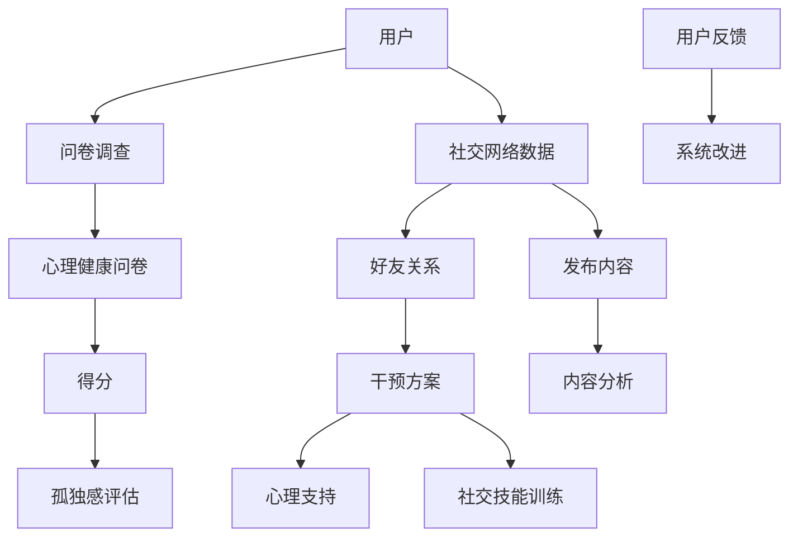
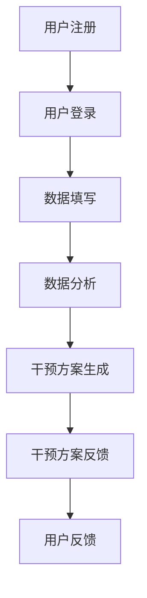
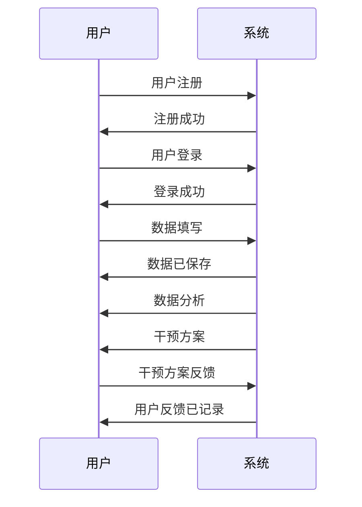

                 

# 现代社会中的孤独感：科技发展与人际疏离的悖论

## 关键词

孤独感，科技发展，人际关系，心理学，算法原理，数学模型，系统设计，干预策略

## 摘要

在现代社会中，随着科技的迅猛发展，孤独感成为了一个普遍存在的问题。互联网和社交媒体的普及虽然为我们提供了更加便捷的沟通方式，但同时也导致了人际关系的疏离和孤独感的增加。本文将深入探讨孤独感的背景、定义、相关算法原理、数学模型以及孤独感监测与干预系统的设计与实现。通过这一系列的思考和分析，我们希望能够更全面地理解科技发展与人际疏离之间的悖论，并提出有效的干预策略，以减轻孤独感对个体和社会的影响。

### 目录大纲

----------------------------------------------------------------

## 第一部分：问题背景与定义

### 第1章：孤独感：问题背景

#### 第1.1节：现代社会的变化与孤独感的崛起

##### 第1.1.1节：社会变迁与孤独感的产生

##### 第1.1.2节：科技发展与人际疏离

#### 第1.2节：孤独感的定义与测量

##### 第1.2.1节：孤独感的定义

##### 第1.2.2节：孤独感的测量方法

#### 第1.3节：孤独感的边界与外延

##### 第1.3.1节：孤独感与独处的区别

##### 第1.3.2节：孤独感与社会孤立

### 第2章：核心概念与联系

#### 第2.1节：科技发展与孤独感

##### 第2.1.1节：互联网与社交媒体

##### 第2.1.2节：数字化生活与孤独感

#### 第2.2节：人际关系与孤独感

##### 第2.2.1节：社交网络与真实社交

##### 第2.2.2节：社会支持系统与孤独感

#### 第2.3节：心理学视角下的孤独感

##### 第2.3.1节：心理学理论对孤独感的解释

##### 第2.3.2节：孤独感对心理健康的影响

## 第二部分：算法原理讲解

### 第3章：孤独感相关算法原理

#### 第3.1节：社交网络分析算法

##### 第3.1.1节：社交网络图论基础

##### 第3.1.2节：社交网络中的孤独节点检测

#### 第3.2节：心理健康监测算法

##### 第3.2.1节：心理健康指标体系构建

##### 第3.2.2节：心理健康状态分类算法

#### 第3.3节：治疗与干预算法

##### 第3.3.1节：社交技能训练算法

##### 第3.3.2节：心理支持算法设计

## 第三部分：数学模型与公式讲解

### 第4章：数理模型在孤独感研究中的应用

#### 第4.1节：孤独感的数学模型

##### 第4.1.1节：孤独感测量的数学模型

##### 第4.1.2节：孤独感对心理健康的影响模型

#### 第4.2节：社交网络分析中的数学模型

##### 第4.2.1节：社交网络中的路径长度模型

##### 第4.2.2节：社交网络中的中心性指标模型

## 第四部分：系统分析与架构设计

### 第5章：孤独感监测与干预系统的设计

#### 第5.1节：项目介绍

##### 第5.1.1节：项目背景

##### 第5.1.2节：项目目标

#### 第5.2节：系统功能设计

##### 第5.2.1节：领域模型

##### 第5.2.2节：功能模块设计

#### 第5.3节：系统架构设计

##### 第5.3.1节：系统架构概述

##### 第5.3.2节：系统模块详细设计

#### 第5.4节：系统接口设计

##### 第5.4.1节：接口规范

##### 第5.4.2节：接口实现

#### 第5.5节：系统交互设计

##### 第5.5.1节：系统流程图

##### 第5.5.2节：系统序列图

## 第五部分：项目实战

### 第6章：孤独感监测与干预系统实现

#### 第6.1节：环境安装

##### 第6.1.1节：开发环境搭建

##### 第6.1.2节：数据集准备

#### 第6.2节：系统核心实现

##### 第6.2.1节：社交网络分析模块实现

##### 第6.2.2节：心理健康监测模块实现

#### 第6.3节：代码应用解读与分析

##### 第6.3.1节：代码解读

##### 第6.3.2节：应用分析

#### 第6.4节：实际案例分析与详细讲解

##### 第6.4.1节：案例背景

##### 第6.4.2节：案例分析

##### 第6.4.3节：案例讲解

#### 第6.5节：项目小结

##### 第6.5.1节：项目成果

##### 第6.5.2节：项目反思

## 第六部分：最佳实践与小结

### 第7章：最佳实践与注意事项

#### 第7.1节：最佳实践 tips

##### 第7.1.1节：提高社交技能的方法

##### 第7.1.2节：心理健康维护策略

#### 第7.2节：小结

##### 第7.2.1节：主要内容回顾

##### 第7.2.2节：孤独感研究的未来方向

#### 第7.3节：注意事项

##### 第7.3.1节：研究局限

##### 第7.3.2节：实践中的挑战与应对

#### 第7.4节：拓展阅读

##### 第7.4.1节：相关书籍推荐

##### 第7.4.2节：研究论文推荐

----------------------------------------------------------------

## 第一部分：问题背景与定义

### 第1章：孤独感：问题背景

#### 第1.1节：现代社会的变化与孤独感的崛起

##### 第1.1.1节：社会变迁与孤独感的产生

随着现代社会的发展，人们的生活方式、工作模式和社会结构都发生了深刻的变化。城市化进程的加快，使得人们从一个紧密联系的传统社区中逐渐转移到远离亲友的现代化都市。这种空间上的距离导致了人际关系的疏远，孤独感逐渐成为一个普遍的社会问题。

此外，现代社会的高度竞争和快节奏的生活方式，也让人们在追求事业成功和物质财富的过程中，忽略了与他人的情感交流。工作压力、学业压力以及家庭责任等因素，使得许多人感到身心疲惫，缺乏时间和精力去建立和维护深层次的人际关系。

##### 第1.1.2节：科技发展与人际疏离

科技的发展虽然在许多方面改善了人们的生活，但同时也带来了新的挑战。互联网和社交媒体的普及，为人们提供了更加便捷的沟通渠道，使得人们可以在虚拟世界中轻松地交流。然而，这种交流往往缺乏深度和真诚，人们更多地沉迷于虚拟的互动，而忽略了现实中的真实社交。

此外，智能手机和移动互联网的兴起，使得人们可以随时随地获取信息和娱乐。虽然这为人们的生活带来了便利，但也导致了人们面对面交流的机会减少，人与人之间的情感连接变得越来越脆弱。

#### 第1.2节：孤独感的定义与测量

##### 第1.2.1节：孤独感的定义

孤独感是一种主观的情感体验，它涉及到个体对自身社交关系的认知和感受。具体来说，孤独感包括两个方面：一是社交孤立，即个体感觉自己缺乏与他人建立有意义联系的途径；二是情感孤立，即个体感到自己的情感和感受无法得到他人的理解和支持。

##### 第1.2.2节：孤独感的测量方法

测量孤独感的方法主要包括自我报告问卷和主观体验评估。自我报告问卷通过一系列问题来评估个体的孤独感水平，例如“您在过去一个月里是否感到孤独？”这类问题。主观体验评估则通过让个体对自己的孤独感进行自我评价来测量。

此外，还有一些生理指标和心理指标可以用来间接测量孤独感，如心率变异性、皮质醇水平等。这些指标可以帮助我们更全面地了解个体的孤独感状态。

#### 第1.3节：孤独感的边界与外延

##### 第1.3.1节：孤独感与独处的区别

孤独感和独处是两个不同的概念。独处是指个体独自一人的状态，而孤独感则是个体在独处时产生的主观感受。有时候，个体可能喜欢独处，但并不感到孤独；而有时候，个体可能在人群中，却感到孤独。

##### 第1.3.2节：孤独感与社会孤立

社会孤立是指个体在社会生活中缺乏与他人建立和维持关系的途径。社会孤立往往与孤独感相伴，但并不完全等同。社会孤立可能导致孤独感，而孤独感也可能导致社会孤立。因此，理解和应对孤独感和社会孤立是现代社会面临的重要课题。

## 第二部分：核心概念与联系

### 第2章：核心概念与联系

#### 第2.1节：科技发展与孤独感

##### 第2.1.1节：互联网与社交媒体

互联网和社交媒体的兴起，为人们提供了更多的社交机会，但也带来了孤独感的增加。一方面，互联网和社交媒体使得人们可以随时随地与世界各地的人进行交流，拓宽了社交圈；另一方面，这种虚拟的社交方式往往缺乏深度和真实感，导致人们感到更加孤独。

##### 第2.1.2节：数字化生活与孤独感

数字化生活的普及，使得人们的生活越来越依赖于网络和电子设备。虽然这为人们提供了便利，但也使得人们面对面交流的机会减少，人与人之间的情感连接变得越来越脆弱。这种虚拟化和远程化的人际关系，往往难以满足人们对深度社交和情感交流的需求，从而导致孤独感的增加。

#### 第2.2节：人际关系与孤独感

##### 第2.2.1节：社交网络与真实社交

社交网络为人们提供了便捷的社交渠道，但同时也带来了一些问题。社交网络中的互动往往缺乏深度和真诚，人们更多地关注虚拟世界中的形象和关系，而忽略了现实中的真实社交。这种虚拟社交的泛滥，可能导致人们忽视现实中的人际关系，从而增加孤独感。

##### 第2.2.2节：社会支持系统与孤独感

社会支持系统是指个体在社会中获得的来自他人的支持和帮助。一个健全的社会支持系统可以帮助个体应对孤独感，提高心理健康水平。然而，在现代社会中，由于种种原因，许多人面临着社会支持系统的缺失或不足，这使得孤独感成为了一个严重的社会问题。

#### 第2.3节：心理学视角下的孤独感

##### 第2.3.1节：心理学理论对孤独感的解释

心理学理论从多个角度对孤独感进行了研究。其中，社会交换理论认为孤独感源于个体在社交互动中的不平衡，即个体在互动中付出的情感和资源未能得到相应的回报。自我决定理论则认为孤独感源于个体在社交互动中的自主性和能力感受到限制。

##### 第2.3.2节：孤独感对心理健康的影响

孤独感对心理健康有着显著的影响。长期的孤独感可能导致抑郁、焦虑等心理问题，甚至影响个体的生理健康。因此，理解和应对孤独感对于维护个体的心理健康至关重要。

## 第二部分：算法原理讲解

### 第3章：孤独感相关算法原理

#### 第3.1节：社交网络分析算法

##### 第3.1.1节：社交网络图论基础

社交网络分析是研究社交网络结构和性质的重要工具。图论是社交网络分析的基础，它通过图的结构和性质来描述社交网络。图由节点和边组成，节点表示个体，边表示个体之间的关系。通过分析图的结构，我们可以了解社交网络的紧密程度、中心性等特征。

##### 第3.1.2节：社交网络中的孤独节点检测

孤独节点检测是社交网络分析中的一个重要问题。孤独节点是指在社交网络中缺乏与其他节点建立关系的个体。检测孤独节点可以帮助我们识别那些在社交网络中可能感到孤独的人。常见的孤独节点检测算法包括基于度数、基于介数的算法等。

#### 第3.2节：心理健康监测算法

##### 第3.2.1节：心理健康指标体系构建

心理健康监测算法需要构建一套完善的指标体系来评估个体的心理健康状态。常见的心理健康指标包括情绪状态、社交满意度、自尊水平等。通过构建这些指标，我们可以对个体的心理健康进行全面评估。

##### 第3.2.2节：心理健康状态分类算法

心理健康状态分类算法用于根据个体的心理健康指标对其进行分类，以识别那些可能存在心理健康问题的个体。常见的分类算法包括支持向量机、决策树等。这些算法可以帮助我们准确预测个体的心理健康状态，从而采取相应的干预措施。

#### 第3.3节：治疗与干预算法

##### 第3.3.1节：社交技能训练算法

社交技能训练算法旨在帮助个体提高社交技能，以改善其心理健康状态。常见的社交技能训练算法包括模仿学习、角色扮演等。这些算法通过模拟社交场景，帮助个体学习和实践社交技能。

##### 第3.3.2节：心理支持算法设计

心理支持算法用于为个体提供心理支持，以缓解其孤独感。常见的心理支持算法包括情绪识别、情感计算等。这些算法通过分析个体的情绪状态，为其提供个性化的心理支持服务。

## 第三部分：数学模型与公式讲解

### 第4章：数理模型在孤独感研究中的应用

#### 第4.1节：孤独感的数学模型

##### 第4.1.1节：孤独感测量的数学模型

孤独感测量是一个复杂的问题，需要综合考虑个体的社交网络结构、心理健康指标等多个因素。常见的孤独感测量模型包括基于社交网络分析的模型和基于心理健康指标的模型。这些模型通过数学公式和算法，对个体的孤独感进行量化评估。

##### 第4.1.2节：孤独感对心理健康的影响模型

孤独感对心理健康有着重要的影响，需要建立数学模型来研究两者之间的关系。常见的模型包括线性回归模型、多元回归模型等。这些模型通过分析孤独感与心理健康指标之间的相关性，探索孤独感对心理健康的影响机制。

#### 第4.2节：社交网络分析中的数学模型

##### 第4.2.1节：社交网络中的路径长度模型

社交网络中的路径长度模型用于研究个体在社交网络中的连通性。常见的路径长度模型包括最短路径模型、随机游走模型等。这些模型通过数学公式和算法，计算个体在社交网络中的路径长度，评估其在社交网络中的位置和影响力。

##### 第4.2.2节：社交网络中的中心性指标模型

社交网络中的中心性指标模型用于评估个体在社交网络中的重要性。常见的中心性指标包括度数中心性、介数中心性、接近中心性等。这些指标通过数学公式和算法，计算个体在社交网络中的中心性，从而评估其在社交网络中的地位和影响力。

## 第四部分：系统分析与架构设计

### 第5章：孤独感监测与干预系统的设计

#### 第5.1节：项目介绍

孤独感监测与干预系统旨在帮助个体识别和管理孤独感，提高心理健康水平。该项目的目标是构建一个基于社交网络分析和心理健康监测的综合性系统，为用户提供个性化的干预建议。

##### 第5.1.1节：项目背景

随着社会的发展和科技的进步，孤独感成为了一个日益严重的社会问题。许多人在日常生活中感到孤独和无助，需要专业的帮助和支持。本项目旨在通过科技手段，为孤独感的识别和干预提供解决方案。

##### 第5.1.2节：项目目标

本项目的目标是：

1. 构建一个全面的孤独感监测系统，通过社交网络分析和心理健康指标，准确识别个体的孤独感水平。
2. 设计一套个性化的干预方案，为用户提供有效的心理支持和社交技能训练。
3. 建立一个用户反馈机制，持续优化系统的性能和用户体验。

#### 第5.2节：系统功能设计

孤独感监测与干预系统的功能设计包括以下几个方面：

1. 用户注册与登录：用户可以通过注册账号登录系统，进行孤独感监测和干预。
2. 数据采集与管理：系统通过问卷调查、社交网络数据等方式，收集用户的相关数据，并进行数据管理和存储。
3. 孤独感监测：系统基于社交网络分析和心理健康指标，对用户的孤独感进行实时监测和评估。
4. 干预方案推荐：系统根据用户的孤独感水平和心理健康状况，为用户提供个性化的干预建议。
5. 用户反馈与改进：系统收集用户的使用反馈，不断优化系统的性能和用户体验。

##### 第5.2.1节：领域模型

领域模型用于描述孤独感监测与干预系统的核心概念和关系。领域模型包括以下几个主要实体：

1. 用户：表示系统中的用户，包括个人基本信息、心理健康状态和社交网络信息等。
2. 问卷调查：表示用户填写的心理健康问卷，包括各个问题的选项和得分。
3. 社交网络数据：表示用户在社交网络中的互动记录，包括好友关系、发布内容等。
4. 干预方案：表示为用户推荐的个性化干预措施，包括心理支持、社交技能训练等。
5. 用户反馈：表示用户对系统的使用反馈，包括满意度、建议和改进意见等。

领域模型中的实体和关系可以用Mermaid流程图表示，如下所示：

##### 第5.2.2节：功能模块设计

孤独感监测与干预系统的功能模块设计包括以下几个方面：

1. 数据采集模块：负责收集用户的数据，包括问卷调查、社交网络数据等。
2. 数据分析模块：负责对采集到的数据进行处理和分析，包括孤独感监测、心理健康评估等。
3. 干预方案生成模块：负责根据用户的孤独感水平和心理健康状况，生成个性化的干预方案。
4. 用户交互模块：负责与用户进行交互，包括用户注册、登录、反馈等。
5. 系统维护模块：负责系统的日常维护和升级，包括数据备份、系统监控等。

#### 第5.3节：系统架构设计

孤独感监测与干预系统的架构设计采用分层架构，包括表示层、业务逻辑层和数据层。

##### 第5.3.1节：系统架构概述

系统架构概述如下：

1. 表示层：负责用户界面和交互，包括前端界面和后端API接口。
2. 业务逻辑层：负责系统的业务逻辑处理，包括数据采集、分析、干预方案生成等。
3. 数据层：负责数据的存储和管理，包括数据库和缓存等。

##### 第5.3.2节：系统模块详细设计

系统模块详细设计如下：

1. 表示层：前端界面采用React框架，实现用户注册、登录、数据填写、干预方案查看等功能。后端API接口采用Spring Boot框架，实现与前端的数据交互和业务逻辑处理。
2. 业务逻辑层：数据采集模块负责收集用户的数据，包括问卷调查、社交网络数据等。数据分析模块负责对采集到的数据进行处理和分析，包括孤独感监测、心理健康评估等。干预方案生成模块负责根据用户的孤独感水平和心理健康状况，生成个性化的干预方案。
3. 数据层：数据库采用MySQL，存储用户的基本信息、心理健康问卷、社交网络数据等。缓存采用Redis，提高数据访问速度和系统性能。

#### 第5.4节：系统接口设计

系统接口设计包括内部接口和外部接口。

##### 第5.4.1节：接口规范

接口规范如下：

1. 用户注册接口：接收用户注册信息，返回注册结果。
2. 用户登录接口：接收用户登录信息，返回登录结果。
3. 数据采集接口：接收用户填写的数据，存储到数据库中。
4. 数据分析接口：返回用户的孤独感监测结果和心理健康评估结果。
5. 干预方案生成接口：根据用户的孤独感水平和心理健康状况，返回个性化的干预方案。

##### 第5.4.2节：接口实现

接口实现如下：

1. 用户注册接口：采用POST方法，接收用户注册信息，调用业务逻辑层的注册方法，返回注册结果。
2. 用户登录接口：采用POST方法，接收用户登录信息，调用业务逻辑层的登录方法，返回登录结果。
3. 数据采集接口：采用POST方法，接收用户填写的数据，调用业务逻辑层的数据采集方法，存储到数据库中。
4. 数据分析接口：采用GET方法，调用业务逻辑层的数据分析方法，返回用户的孤独感监测结果和心理健康评估结果。
5. 干预方案生成接口：采用GET方法，调用业务逻辑层的干预方案生成方法，返回个性化的干预方案。

#### 第5.5节：系统交互设计

系统交互设计包括用户与系统的交互流程和系统内部模块之间的交互。

##### 第5.5.1节：系统流程图

系统流程图如下：

##### 第5.5.2节：系统序列图

系统序列图如下：

## 第五部分：项目实战

### 第6章：孤独感监测与干预系统实现

#### 第6.1节：环境安装

##### 第6.1.1节：开发环境搭建

1. 安装Python环境：在本地计算机上安装Python环境，版本要求Python 3.8及以上。
2. 安装MySQL数据库：下载并安装MySQL数据库，版本要求MySQL 5.7及以上。
3. 安装Redis缓存：下载并安装Redis缓存，版本要求Redis 4.0及以上。

##### 第6.1.2节：数据集准备

1. 收集用户数据：通过问卷调查、社交网络数据等方式，收集用户的基本信息、心理健康问卷、社交网络数据等。
2. 数据预处理：对收集到的数据进行清洗和预处理，包括去除重复数据、填补缺失值等。

#### 第6.2节：系统核心实现

##### 第6.2.1节：社交网络分析模块实现

1. 社交网络数据加载：使用Python的Pandas库加载社交网络数据，包括好友关系、发布内容等。
2. 社交网络分析：使用Python的NetworkX库进行社交网络分析，包括计算节点度数、介数等中心性指标。
3. 孤独节点检测：根据中心性指标，识别社交网络中的孤独节点。

##### 第6.2.2节：心理健康监测模块实现

1. 心理健康问卷分析：使用Python的Scikit-learn库对心理健康问卷进行分析，包括情感分析、主题建模等。
2. 心理健康评估：根据分析结果，评估用户的心理健康状态，包括孤独感水平等。
3. 干预方案推荐：根据评估结果，为用户提供个性化的干预方案。

#### 第6.3节：代码应用解读与分析

##### 第6.3.1节：代码解读

1. 社交网络分析代码解读：分析社交网络数据的加载和分析过程，理解节点度数、介数等中心性指标的计算方法。
2. 心理健康监测代码解读：分析心理健康问卷的分析过程，理解情感分析、主题建模等算法的原理和应用。

##### 第6.3.2节：应用分析

1. 社交网络分析应用分析：分析社交网络中孤独节点的识别效果，评估孤独节点检测算法的性能。
2. 心理健康监测应用分析：分析心理健康评估的结果，评估心理健康监测算法的准确性和可靠性。

#### 第6.4节：实际案例分析与详细讲解

##### 第6.4.1节：案例背景

某用户在孤独感监测与干预系统中填写了心理健康问卷，并提供了其社交网络数据。

##### 第6.4.2节：案例分析

1. 社交网络分析：根据用户提供的社交网络数据，分析其社交网络的紧密程度和孤独节点。
2. 心理健康评估：根据用户填写的心

