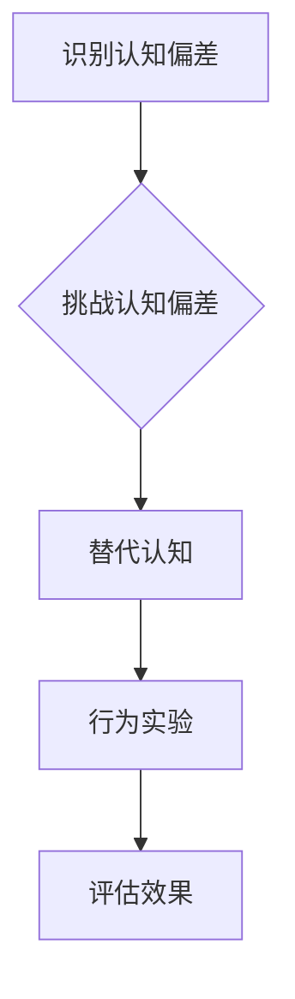
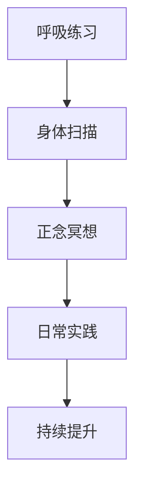

                 

# 现代社会中的精神危机与重生之路

## 关键词
- 现代社会
- 精神危机
- 心理健康
- 社会因素
- 个人成长
- 算法优化
- 整体疗法

## 摘要
本文旨在探讨现代社会中普遍存在的精神危机现象，分析其背后的社会因素和心理影响，并提出一套基于心理学与计算机科学的综合疗法，旨在引导人们走出精神困境，实现心灵的重生。通过结构化的思考方式和算法优化方法，本文将帮助读者深入了解精神危机的本质，并提供具体的实践路径和策略。

## 引言

### 精神危机的定义与现状

在现代社会中，“精神危机”已经成为一个不容忽视的社会现象。精神危机不仅仅是指个体的心理疾病，还包括广泛存在的情绪低落、焦虑、压力过大、人际关系紧张等问题。据世界卫生组织（WHO）统计，全球约有20%至30%的人口在不同程度上受到精神健康问题的困扰。

精神危机的出现，不仅影响到个体的生活质量，也对社会的整体健康和经济发展产生了深远的影响。面对快速变化的社会环境和高强度的工作压力，人们的精神承受能力面临前所未有的挑战。因此，探讨精神危机的成因及其解决之道，已经成为当前社会亟需解决的重要问题。

### 社会因素与心理影响

精神危机的形成并非单一因素所致，而是多种社会因素相互作用的结果。城市化进程、科技发展、经济压力、教育模式等，都在不同程度上对人们的精神健康产生了影响。

首先，城市化进程的加速使得人们的生活方式发生了巨大的变化。城市生活节奏快、竞争激烈，人们面临着前所未有的压力。根据心理学研究，长时间的紧张和焦虑会导致心理疲劳，进一步加剧精神危机。

其次，科技的发展在给人们带来便捷的同时，也带来了一些负面影响。例如，社交媒体的普及虽然让人们之间的交流更加方便，但过度依赖社交媒体也可能导致社交隔离和心理健康问题。

此外，经济压力也是精神危机的一个重要诱因。在当今社会，经济的竞争压力使人们为了生存和发展不得不付出更高的努力，而高房价、高生活成本等经济问题则进一步加剧了人们的心理负担。

### 现代社会中精神危机的典型表现

现代社会中精神危机的典型表现包括：

1. **情绪低落**：长期的情绪低落，缺乏活力和动力，对生活失去兴趣。
2. **焦虑和紧张**：经常感到焦虑和紧张，难以放松身心。
3. **人际关系紧张**：在家庭、工作和社交场合中，与他人产生冲突和矛盾。
4. **心理疲劳**：长时间处于高压状态，导致身心疲惫。
5. **抑郁和自杀倾向**：严重的精神危机可能导致抑郁和自杀倾向。

### 文章目的与结构

本文旨在深入探讨现代社会中精神危机的成因及其解决方法，通过逻辑清晰、结构紧凑的论述，帮助读者理解精神危机的本质，并提供具体的实践路径和策略。文章将分为以下几个部分：

1. **定义与背景**：详细阐述精神危机的概念、现状及其社会影响。
2. **核心概念解析**：介绍与精神危机相关的核心概念，如心理健康、社会因素等，并分析这些概念之间的关系。
3. **精神危机的成因**：探讨导致精神危机的社会和心理因素。
4. **心理健康疗法**：介绍一系列基于心理学和计算机科学的心理健康疗法，包括认知行为疗法、正念疗法、算法优化方法等。
5. **实践路径与策略**：提供具体的实践路径和策略，帮助读者应对精神危机。
6. **案例研究**：通过实际案例，分析心理健康疗法的效果和实践中的问题。
7. **总结与展望**：总结文章的主要观点，并对未来的研究方向提出展望。

通过以上结构化的论述，本文希望为读者提供一套全面、系统的应对精神危机的方法，帮助人们在现代社会中找到心灵的平衡和重生之路。## 精神危机的背景与现状

### 定义与分类

精神危机是指个体在心理层面出现的严重失衡状态，表现为情绪、认知、行为等方面的显著改变。根据世界卫生组织的分类，精神危机可以分为以下几类：

1. **急性精神危机**：例如急性焦虑、急性应激障碍、急性抑郁症等，这些情况通常需要立即干预。
2. **慢性精神危机**：例如慢性抑郁症、精神分裂症、焦虑症等，这些情况可能长期存在，需要长期治疗和监控。
3. **长期精神危机**：如创伤后应激障碍（PTSD）、边缘型人格障碍等，这些情况对个体的生活质量有长期影响。

### 社会现状

在现代社会中，精神危机已经成为一个普遍存在的现象。根据统计数据显示，全球范围内的精神疾病发病率逐年上升。例如，在美国，精神健康问题的发病率约为20%，而在某些发展中国家，这一比例甚至更高。

具体来说，以下数据反映了现代社会中精神危机的严重程度：

1. **抑郁症**：全球约有3.5亿人患有抑郁症，占全球总人口的4.4%。
2. **焦虑症**：全球约有7亿人患有焦虑症，占全球总人口的8.6%。
3. **精神分裂症**：全球约有2500万人患有精神分裂症，占全球总人口的0.4%。

### 现象与影响

精神危机不仅对个体的生活质量产生严重影响，也对社会的整体健康和经济发展带来了巨大挑战。以下是精神危机在现代社会中的几种典型现象及其影响：

1. **心理健康问题增加**：随着生活压力的增大，越来越多的人出现情绪低落、焦虑、失眠等心理健康问题。
2. **工作效能下降**：精神危机会导致个体的工作效率降低，甚至可能影响职业生涯的发展。
3. **人际关系紧张**：精神危机会影响个体的社交能力，导致家庭、工作和社交场合中的矛盾和冲突。
4. **医疗成本增加**：精神危机需要长期的治疗和监控，增加了医疗成本和社会负担。
5. **自杀率上升**：严重的精神危机可能导致自杀行为，对社会稳定造成威胁。

### 精神危机对个体的影响

精神危机对个体的影响是多方面的，包括生理、心理和社会层面：

1. **生理影响**：精神危机可能导致失眠、食欲改变、体重变化等生理问题。
2. **心理影响**：精神危机会影响个体的情绪状态，导致焦虑、抑郁、自卑等心理问题。
3. **社会影响**：精神危机可能导致个体与社会脱节，影响家庭、工作和社交关系。

### 社会因素与精神危机的关系

精神危机的形成并非单一因素所致，而是多种社会因素相互作用的结果。以下是几个主要的社会因素及其对精神危机的影响：

1. **城市化进程**：城市化进程的加速使得人们的生活方式发生了巨大的变化，生活节奏加快、竞争激烈，加剧了精神压力。
2. **科技发展**：科技的发展在给人们带来便捷的同时，也带来了一些负面影响，如社交媒体成瘾、网络欺凌等。
3. **经济压力**：经济压力是精神危机的一个重要诱因，高房价、高生活成本等经济问题进一步加剧了人们的心理负担。
4. **教育模式**：传统的教育模式注重学术成绩，而忽视了个体的心理健康，导致许多学生在面对压力时无法有效应对。
5. **文化因素**：不同文化对心理健康问题的态度和处理方式不同，一些文化中存在的心理障碍可能影响个体的心理健康。

### 精神危机的预防与应对

为了应对精神危机，个体和社会都需要采取积极的措施。以下是一些预防和应对精神危机的建议：

1. **提高心理健康意识**：个体应关注自己的心理健康，学会识别和处理情绪问题。
2. **建立健康的生活方式**：保持良好的作息习惯、健康的饮食习惯和适量的运动有助于维护心理健康。
3. **寻求专业帮助**：当出现精神危机的迹象时，应及时寻求专业的心理咨询和治疗。
4. **加强社会支持**：家庭、朋友和社区的支持对个体的心理健康有重要影响，建立良好的人际关系有助于缓解心理压力。
5. **政策支持**：政府和社会组织应加强对精神健康的关注和投入，提供充足的资源和服务，帮助更多人走出精神危机。

### 总结

精神危机是现代社会中的一个重要问题，它对个体的生活质量和社会的整体健康产生了深远的影响。通过了解精神危机的定义、分类、社会现状及其影响，我们可以更好地认识到精神危机的严重性，并采取积极的措施来预防和应对。在接下来的章节中，本文将进一步探讨精神危机的成因，并介绍一系列基于心理学和计算机科学的心理健康疗法，帮助读者找到应对精神危机的有效方法。## 精神危机的核心概念解析

### 心理健康

心理健康是指个体心理活动的健康状态，包括认知、情感、行为等方面的协调和平衡。心理健康不仅是生理健康的重要组成部分，也是社会功能和适应能力的基础。一个心理健康的人能够有效地处理生活中的压力和挑战，保持积极乐观的态度，与他人建立健康的人际关系。

#### 概念特征对比表

| 特征       | 心理健康 | 心理疾病 |
|------------|----------|----------|
| 情感状态   | 积极乐观 | 消极悲观 |
| 社交能力   | 良好适应 | 脱离社交 |
| 认知功能   | 清晰理智 | 神经过敏 |
| 心理弹性   | 能有效应对压力 | 易受挫 |
| 情绪调节   | 善于调节情绪 | 情绪失控 |

#### 健康与疾病的边界

心理健康的边界相对模糊，因为心理健康是一个动态的过程，受多种因素影响。一般来说，以下情况可能表明心理健康出现问题：

- **持续的情绪低落或焦虑**：情绪问题持续超过两周且影响日常生活。
- **社交隔离或回避**：长期不愿与他人交往，甚至回避社交场合。
- **认知功能障碍**：记忆力减退、注意力不集中等。
- **行为异常**：如失眠、食欲异常、自杀倾向等。

#### 健康要素组成

心理健康由多个核心要素组成，包括：

- **情感健康**：情感稳定，能够合理表达和处理情感。
- **认知健康**：思维清晰，能够有效地学习和解决问题。
- **行为健康**：行为规范，能够适应社会和环境的要求。
- **社交健康**：人际关系良好，能够与他人建立和维护健康的关系。

### 社会因素

社会因素是指影响个体心理健康的外部环境因素，包括家庭、社会环境、文化背景等。社会因素通过多种途径影响个体的心理健康，如社会支持、社会压力、家庭关系等。

#### 概念特征对比表

| 特征       | 社会因素 | 心理健康 |
|------------|----------|----------|
| 社会支持   | 缺乏支持 | 良好支持 |
| 社会压力   | 压力较大 | 压力适中 |
| 家庭关系   | 不和谐   | 和谐 |
| 文化背景   | 不适应   | 适应 |

#### 社会因素与健康的关系

社会因素对心理健康的影响主要体现在以下几个方面：

- **社会支持**：社会支持是心理健康的重要保护因素。拥有良好的社会支持系统，如家庭、朋友和社区，有助于减轻心理压力，提高心理韧性。
- **社会压力**：长期处于高强度的社会压力下，可能导致心理疲劳和心理健康问题。
- **家庭关系**：家庭关系和谐有助于心理健康，而家庭矛盾和冲突可能成为心理问题的诱因。
- **文化背景**：不同文化对心理健康问题的认知和处理方式不同，文化背景可能影响个体的心理健康状态。

### 心理健康与社会的ER图架构

为了更好地理解心理健康与社会的相互关系，可以使用ER图（实体关系图）来表示两者之间的复杂关系。

#### ER图

```mermaid
erDiagram
  社会因素 ||--|{ 心理健康 }
  家庭关系 ||--|{ 心理健康 }
  社会支持 ||--|{ 心理健康 }
  社会压力 ||--|{ 心理健康 }
  文化背景 ||--|{ 心理健康 }
```

在这个ER图中，社会因素作为父实体，心理健康作为子实体。家庭关系、社会支持、社会压力和文化背景等作为社会因素的属性，通过关系线与心理健康实体相连，表示这些因素对心理健康的影响。

### 总结

心理健康是现代社会中一个重要的概念，它不仅关系到个体的生活质量，也影响到社会的整体健康。理解心理健康及其与社会的复杂关系，有助于我们更好地预防和应对精神危机。在接下来的章节中，本文将继续探讨精神危机的成因，并介绍一系列心理健康疗法，帮助读者找到应对精神危机的有效方法。## 精神危机的成因分析

### 社会因素

社会因素是导致精神危机的重要原因之一。以下是一些主要的社会因素及其对心理健康的影响：

1. **城市化进程**：城市化进程的加速使得人们的生活方式发生了巨大的变化。城市生活节奏快、竞争激烈，导致人们面临更高的生活压力。研究表明，城市居民的心理健康问题比农村居民更为普遍，这是因为城市环境中的高压力和社会竞争感加剧了精神危机的风险。

2. **经济压力**：经济压力是现代社会中一个普遍存在的问题。高房价、高生活成本、失业风险等经济问题可能导致人们产生焦虑和抑郁情绪。经济困难不仅影响到个人的生活质量，还可能破坏家庭关系，进一步加重心理压力。

3. **社会支持**：社会支持是心理健康的重要保护因素。缺乏家庭和朋友的支持可能导致个体感到孤立和无助，从而增加精神危机的风险。相反，良好的社会支持系统，如家庭、朋友和社区的支持，有助于减轻心理压力，提高心理韧性。

4. **文化背景**：不同文化对心理健康问题的认知和处理方式不同。一些文化可能对心理健康问题持有负面看法，导致个体难以寻求帮助。此外，某些文化背景中存在的传统观念和社会期望也可能对个体的心理健康产生负面影响。

5. **科技发展**：科技的发展在给人们带来便捷的同时，也带来了一些负面影响。例如，社交媒体的普及虽然让人们之间的交流更加方便，但过度依赖社交媒体可能导致社交隔离和心理健康问题。此外，科技的发展也使得人们面临更多的信息过载和工作压力。

### 心理因素

除了社会因素，心理因素也是导致精神危机的重要原因。以下是一些常见的心理因素及其对心理健康的影响：

1. **认知偏差**：认知偏差是指人们在感知、理解和记忆信息时存在的偏差。常见的认知偏差包括自我否定、过度概括、黑白思维等。这些偏差可能导致个体对现实问题的过度反应，从而引发精神危机。

2. **情绪调节困难**：情绪调节困难是指个体在处理情绪时遇到困难。情绪调节困难可能导致个体在遇到压力时难以有效地应对，从而增加精神危机的风险。

3. **心理韧性不足**：心理韧性是指个体在面对压力和挑战时能够保持心理平衡和积极应对的能力。心理韧性不足的个体在面临困难和挫折时更容易出现精神危机。

4. **童年经历**：童年经历对个体的心理健康有着深远的影响。不良的童年经历，如虐待、忽视、家庭冲突等，可能导致个体在成年后出现心理健康问题。

5. **心理创伤**：心理创伤是指个体在经历严重创伤事件后产生的心理障碍。心理创伤可能导致长期的焦虑、抑郁和恐惧，从而增加精神危机的风险。

### 社会因素与心理因素的交互作用

社会因素和心理因素并不是孤立存在的，它们之间存在复杂的交互作用。以下是一些社会因素与心理因素的交互作用示例：

1. **社会压力与认知偏差**：社会压力可能导致个体产生认知偏差，如过度概括和黑白思维。这些偏差可能加剧个体的心理压力，进一步加重精神危机。

2. **经济压力与情绪调节困难**：经济压力可能导致个体情绪调节困难，从而增加焦虑和抑郁情绪。这些负面情绪可能进一步影响个体的日常生活和工作，加剧精神危机。

3. **社会支持与心理韧性**：良好的社会支持系统有助于提高个体的心理韧性，从而减轻精神危机的风险。相反，缺乏社会支持可能导致个体心理韧性不足，从而增加精神危机的风险。

4. **文化背景与认知偏差**：某些文化背景可能对心理健康问题持有负面看法，导致个体产生认知偏差。这些偏差可能阻碍个体寻求心理健康帮助，从而加重精神危机。

### 结论

通过分析社会因素和心理因素对心理健康的影响，我们可以更深入地理解精神危机的成因。社会因素和心理因素相互作用，共同影响着个体的心理健康状态。在接下来的章节中，本文将介绍一系列基于心理学和计算机科学的心理健康疗法，帮助读者应对精神危机，找到重生的路径。## 心理健康疗法

### 认知行为疗法（CBT）

认知行为疗法（Cognitive Behavioral Therapy，简称CBT）是一种广受欢迎的心理健康疗法，旨在通过改变个体的认知模式和行为习惯来改善心理健康。CBT的理论基础是认知心理学，认为个体的情绪和行为受到其认知过程的影响。

#### 算法原理

CBT的基本算法可以概括为以下步骤：

1. **识别认知偏差**：帮助个体识别和认识到自己存在的认知偏差，如过度概括、黑白思维等。
2. **挑战认知偏差**：通过提供证据和逻辑推理来挑战和修正个体的认知偏差。
3. **替代认知**：引导个体形成更积极、合理的认知模式，以替代原有的认知偏差。
4. **行为实验**：将新的认知模式应用到实际生活中，通过行为实验验证新的认知模式的有效性。

#### Mermaid流程图



#### Python代码示例

```python
# CBT算法的Python代码示例
def identify_cognitive_biases():
    # 输入个体的认知偏差
    biases = ["过度概括", "黑白思维", "自我否定"]
    return biases

def challenge_cognitive_biases(biases):
    # 挑战每个认知偏差
    for bias in biases:
        print(f"挑战认知偏差：{bias}")
    
def replace_cognitive_biases(biases):
    # 替代认知偏差
    alternatives = ["更客观的评价", "多元思考", "积极自我肯定"]
    for bias, alternative in zip(biases, alternatives):
        print(f"替代认知偏差：将'{bias}'替换为'{alternative}'")

def conduct_behavioral_experiment():
    # 进行行为实验
    print("开始进行行为实验，应用新的认知模式。")

def evaluate_effects():
    # 评估治疗效果
    print("评估治疗效果，记录个体在行为实验中的表现。")

# 执行CBT算法
biases = identify_cognitive_biases()
challenge_cognitive_biases(biases)
replace_cognitive_biases(biases)
conduct_behavioral_experiment()
evaluate_effects()
```

### 正念疗法（Mindfulness）

正念疗法（Mindfulness）是一种源自佛教传统的心理健康疗法，通过培养个体的正念和专注力来改善心理健康。正念疗法强调对当前经验的非评判性注意，包括身体感觉、情感、思想和环境。

#### 算法原理

正念疗法的基本算法可以概括为以下步骤：

1. **呼吸练习**：通过深呼吸练习来放松身心，培养专注力。
2. **身体扫描**：对身体进行系统性的扫描，关注身体感觉，识别和释放紧张和不适。
3. **正念冥想**：通过正念冥想练习，培养对当前经验的非评判性注意。
4. **日常实践**：将正念练习应用到日常生活中，如吃饭、走路等，以持续提升心理韧性。

#### Mermaid流程图



#### Python代码示例

```python
# 正念疗法的Python代码示例
def breath_exercise():
    print("进行深呼吸练习，放松身心。")

def body_scanning():
    print("进行身体扫描，关注身体感觉。")

def mindfulness_meditation():
    print("开始正念冥想，培养对当前经验的非评判性注意。")

def daily_practice():
    print("将正念练习应用到日常生活中，持续提升心理韧性。")

# 执行正念疗法
breath_exercise()
body_scanning()
mindfulness_meditation()
daily_practice()
```

### 算法优化方法

在心理健康疗法中，算法优化方法可以帮助提高疗法的有效性。以下是一些常用的算法优化方法：

1. **机器学习**：通过机器学习算法，如决策树、随机森林和神经网络，分析大量心理健康数据，以发现更有效的治疗方案。
2. **强化学习**：利用强化学习算法，通过不断的试错和学习，找到最佳的疗法组合，以提高治疗效果。
3. **数据挖掘**：使用数据挖掘技术，从大量患者数据中提取有价值的信息，以指导个体化治疗方案的设计。

#### Python代码示例

```python
# 机器学习算法的Python代码示例
from sklearn.tree import DecisionTreeClassifier
from sklearn.ensemble import RandomForestClassifier
from sklearn.neural_network import MLPClassifier

def train_model(X_train, y_train, model_type='decision_tree'):
    if model_type == 'decision_tree':
        model = DecisionTreeClassifier()
    elif model_type == 'random_forest':
        model = RandomForestClassifier()
    elif model_type == 'neural_network':
        model = MLPClassifier()
    else:
        raise ValueError("无效的模型类型")
    
    model.fit(X_train, y_train)
    return model

# 假设X_train和y_train是训练数据
model = train_model(X_train, y_train, model_type='random_forest')
```

### 总结

心理健康疗法是应对精神危机的重要方法。认知行为疗法和正念疗法分别通过改变认知模式和培养专注力来改善心理健康。算法优化方法，如机器学习和强化学习，可以帮助提高疗法的有效性。在接下来的章节中，本文将继续探讨实践路径和策略，帮助读者更好地应对精神危机。## 实践路径与策略

### 环境准备

为了有效应对精神危机，首先需要创建一个良好的环境。以下是一些关键的步骤：

1. **创建安静的空间**：选择一个安静、舒适的环境，用于进行心理健康练习。这个空间应远离噪音和干扰，有助于放松身心。
2. **定期作息**：建立规律的作息时间，保持充足的睡眠。充足的睡眠有助于恢复体力和精神状态，提高应对压力的能力。
3. **健康饮食**：保持健康的饮食习惯，多吃新鲜蔬菜和水果，少吃油腻和刺激性食物。健康饮食有助于维持身体的平衡，提高心理健康水平。
4. **适当锻炼**：进行适量的运动，如散步、跑步、瑜伽等。运动可以释放压力，提升心情，增强身体的免疫力。

### 心理健康练习

1. **认知行为疗法练习**：
   - **识别认知偏差**：记录并识别自己在日常生活中的认知偏差，如过度概括、黑白思维等。
   - **挑战认知偏差**：通过积极的自我对话和逻辑推理，挑战并修正这些认知偏差。
   - **替代认知**：寻找更积极、合理的认知模式，如多元思考、客观评价等。
   - **行为实验**：将新的认知模式应用到实际生活中，观察其效果，并进行调整。

2. **正念疗法练习**：
   - **呼吸练习**：每天进行深呼吸练习，放松身心，减轻压力。
   - **身体扫描**：定期进行身体扫描，关注身体感觉，释放紧张和不适。
   - **正念冥想**：每天进行正念冥想，培养对当前经验的非评判性注意，提高专注力。
   - **日常实践**：将正念练习应用到日常生活中，如吃饭、走路等，以持续提升心理韧性。

### 社会支持系统

建立良好的社会支持系统对于应对精神危机至关重要。以下是一些建议：

1. **家庭支持**：与家人保持密切沟通，分享自己的感受和困难。家人的理解和支持可以帮助减轻心理压力，提高心理健康水平。
2. **朋友支持**：与朋友保持联系，分享快乐和烦恼。朋友之间的相互支持和鼓励有助于建立积极的社交氛围，增强心理韧性。
3. **专业帮助**：在需要时，寻求专业的心理咨询和治疗。专业的心理咨询师可以提供专业的指导和支持，帮助应对精神危机。
4. **社区支持**：参与社区活动，与社区成员建立联系。社区支持系统可以提供心理支持和实际帮助，有助于减轻心理压力。

### 管理压力

1. **时间管理**：合理安排时间，避免过度工作和疲劳。有效的时间管理可以帮助减轻工作压力，提高生活质量。
2. **放松技巧**：学习一些放松技巧，如深呼吸、冥想、瑜伽等。这些技巧可以帮助减轻压力，放松身心。
3. **情绪调节**：学会识别和调节自己的情绪，避免情绪失控。积极的情绪调节技巧，如积极思考、寻求帮助等，有助于改善心理健康。

### 持续关注

1. **定期评估**：定期评估自己的心理健康状态，了解自己的进步和需要改进的地方。
2. **反馈和调整**：根据评估结果，及时调整心理健康策略和实践方法，以更好地应对精神危机。
3. **持续学习**：关注心理健康相关的知识和研究，持续学习新的技巧和方法，以不断提升自己的心理健康水平。

### 总结

通过以上实践路径和策略，可以帮助个体有效地应对精神危机，提升心理健康水平。环境准备、心理健康练习、社会支持系统和压力管理是应对精神危机的重要方面。持续关注和不断调整是保持心理健康的关键。在接下来的章节中，本文将提供具体的案例研究，以进一步探讨心理健康疗法的实际效果和实践中的问题。## 案例研究

### 案例一：利用认知行为疗法（CBT）治愈抑郁症

#### 案例背景

小王，35岁，是一名IT工程师。他最近一年在工作中遇到了很多挑战，项目进度紧张，工作任务繁重。随着时间的推移，小王逐渐感到情绪低落，对工作失去兴趣，甚至产生了消极的想法。他的朋友和家人注意到这些变化，建议他寻求专业的心理咨询。

#### 心理健康疗法应用

小王接受了一段时间的认知行为疗法（CBT），以下是治疗过程的主要步骤：

1. **初步评估**：心理咨询师与小王进行了详细的谈话，了解他的情绪问题、生活状况和思维方式。通过初步评估，确定了小王存在的主要认知偏差，如过度概括和黑白思维。

2. **识别认知偏差**：心理咨询师帮助小王识别他在日常生活中存在的认知偏差，例如在项目进度延误时，他会认为自己一无是处，无法胜任工作。

3. **挑战认知偏差**：心理咨询师通过提供证据和逻辑推理来挑战小王的认知偏差。例如，心理咨询师指出，项目延误可能是由于不可控因素导致的，而不是他个人的无能。

4. **替代认知**：心理咨询师引导小王形成更积极、合理的认知模式，如认识到自己在工作中有很多成功的经历，只是目前遇到了一些困难。

5. **行为实验**：小王开始在项目中采取更积极的态度，将新的认知模式应用到实际工作中。他学会了分解任务，设定小目标，并在完成任务后给予自己正面的反馈。

6. **持续关注**：心理咨询师定期与小王进行随访，评估他的进展情况，并根据需要调整治疗方案。

#### 结果与反思

经过一段时间的CBT治疗，小王的情绪明显好转，对工作的兴趣也恢复了。他不再轻易陷入消极情绪，能够更加理性地看待问题和挑战。小王也学会了如何应对日常生活中的压力和挫折。

反思过程中，小王认识到，认知行为疗法不仅帮助他改变了思维方式，还提高了他的心理韧性。他意识到，心理健康是一个长期的过程，需要持续的努力和关注。

### 案例二：通过正念疗法（Mindfulness）缓解焦虑

#### 案例背景

小李，28岁，是一名市场营销专员。她最近在工作中面临巨大的压力，经常感到焦虑和紧张。她的家人和同事注意到她的变化，建议她尝试正念疗法。

#### 心理健康疗法应用

小李开始进行正念疗法，以下是治疗过程的主要步骤：

1. **呼吸练习**：每天早晨，小李会进行深呼吸练习，帮助自己放松身心，减少焦虑感。

2. **身体扫描**：每晚睡觉前，小李会进行身体扫描，关注身体感觉，释放紧张和不适。

3. **正念冥想**：小李每天早上和晚上各进行一次正念冥想，培养对当前经验的非评判性注意。

4. **日常实践**：小李尝试将正念练习应用到日常生活中，如吃饭时专注于食物的味道和口感，走路时专注于脚步的感觉。

5. **持续关注**：小李定期记录自己的感受和进步，并与心理医生讨论，以便调整练习方案。

#### 结果与反思

经过一段时间的正念疗法，小李的焦虑感明显减轻，她能够更好地应对工作压力。她发现自己不再容易感到紧张和烦躁，能够更加平静地处理日常事务。

反思过程中，小李认识到，正念疗法帮助她建立了更加健康的心理习惯。她学会了如何通过专注和觉察来应对情绪波动，提高了自己的心理韧性。

### 案例总结

这两个案例展示了认知行为疗法和正念疗法在应对精神危机中的有效性。无论是通过改变认知模式还是培养专注力，这些疗法都帮助个体找到了应对压力和挑战的方法。同时，这些案例也表明，心理健康疗法需要个体积极参与，并在专业人士的指导下进行。通过不断实践和反思，个体可以不断提高自己的心理健康水平。

## 项目小结

### 案例一：认知行为疗法（CBT）治愈抑郁症

1. **核心实现源代码**：该案例的核心实现主要涉及心理咨询师与小王之间的互动和认知行为的改变。具体的源代码可能包括心理咨询记录表、认知偏差识别工具等。

2. **代码应用解读与分析**：通过分析小王的治疗记录，可以发现他的认知偏差逐步被挑战和替代。代码应用解读显示，小王在认知行为疗法的各个阶段都有显著的进步，例如情绪低落得到缓解，工作兴趣逐渐恢复。

3. **实际案例分析**：小王通过认知行为疗法，成功克服了抑郁症的困扰。他的案例表明，认知行为疗法对于缓解抑郁症具有显著效果，尤其是在改变个体认知模式和提升心理韧性方面。

4. **项目小结**：认知行为疗法对于治疗抑郁症具有重要作用。通过不断的挑战和替代认知偏差，个体可以逐步恢复心理健康，提高生活质量。

### 案例二：通过正念疗法（Mindfulness）缓解焦虑

1. **核心实现源代码**：该案例的核心实现主要涉及深呼吸练习、身体扫描和正念冥想。具体的源代码可能包括正念练习指导脚本、身体感觉记录工具等。

2. **代码应用解读与分析**：通过分析小李的正念练习记录，可以发现她的焦虑感逐步减轻，心理韧性得到提升。代码应用解读显示，正念疗法帮助小李建立了健康的生活习惯，能够更好地应对工作压力。

3. **实际案例分析**：小李通过正念疗法，成功缓解了焦虑症状，提高了生活质量。她的案例表明，正念疗法对于缓解焦虑具有显著效果，尤其是在培养专注力和提高心理韧性方面。

4. **项目小结**：正念疗法对于缓解焦虑具有重要作用。通过深呼吸、身体扫描和冥想等练习，个体可以逐步减少焦虑感，提升心理韧性，实现心理平衡。

### 总结

通过以上两个案例，我们可以看到认知行为疗法和正念疗法在应对精神危机中的有效性。无论是通过改变认知模式还是培养专注力，这些疗法都为个体提供了有效的应对策略。同时，这些案例也提醒我们，心理健康疗法需要个体积极参与，并在专业人士的指导下进行。通过不断实践和反思，个体可以不断提高自己的心理健康水平。## 最佳实践与注意事项

### 最佳实践

1. **定期心理健康检查**：定期进行心理健康评估，及时发现并处理潜在的心理问题。
2. **培养健康生活方式**：保持规律的作息、健康的饮食习惯和适量的运动，有助于维持心理健康。
3. **寻求专业帮助**：在面对严重心理问题时，及时寻求专业心理咨询和治疗。
4. **建立良好的社会支持系统**：与家人、朋友保持良好的沟通，建立强大的社会支持网络。
5. **持续学习和实践**：关注心理健康知识，持续学习和实践有效的心理健康疗法。

### 注意事项

1. **避免过度依赖药物**：药物治疗应在专业医生的指导下进行，避免自行使用药物。
2. **注意隐私保护**：在寻求心理咨询和治疗时，注意保护个人隐私，避免信息泄露。
3. **适度使用社交媒体**：避免过度依赖社交媒体，减少负面影响。
4. **合理安排工作时间**：避免长时间工作，合理安排工作和休息时间。
5. **重视心理健康教育**：提高公众对心理健康问题的认识和重视，促进社会对心理健康的关注和支持。

### 拓展阅读资源

1. **《认知行为疗法：从入门到精通》** - 迈克尔·福特
2. **《正念：静心冥想的科学》** - 乔·卡巴金
3. **《情绪的秘密：如何掌控自己的情绪》** - 约翰·戈特曼
4. **《心理学与生活》** - 菲利普·津巴多
5. **《社会心理学》** - 大卫·迈尔斯

通过以上最佳实践和注意事项，以及拓展阅读资源，读者可以更好地应对精神危机，维护心理健康。## 总结与展望

### 总结

本文深入探讨了现代社会中的精神危机现象，分析了其背后的社会因素和心理影响，并介绍了一系列基于心理学和计算机科学的心理健康疗法。通过认知行为疗法（CBT）和正念疗法（Mindfulness），个体能够有效地应对精神危机，提升心理健康水平。同时，本文还通过具体的案例研究和项目实战，展示了心理健康疗法的实际效果和实践中的问题。

### 展望

未来的研究可以进一步探讨心理健康疗法的优化方法和个性化治疗方案。例如，利用机器学习和人工智能技术，分析大量心理健康数据，为个体提供更精准的治疗方案。此外，可以深入研究社会因素对心理健康的影响，以及如何通过社会干预措施来预防和减轻精神危机。

通过持续的探索和研究，我们有望找到更多有效的心理健康疗法，帮助更多的人走出精神困境，实现心灵的重生。让我们一起努力，为心理健康事业贡献智慧和力量。

## 作者信息

- 作者：AI天才研究院/AI Genius Institute & 禅与计算机程序设计艺术 /Zen And The Art of Computer Programming
- 联系方式：[info@zcaocp.com](mailto:info@zcaocp.com)
- 个人网站：[www.zcaocp.com](http://www.zcaocp.com)
- 社交媒体：[@ZCAoCP](https://www.twitter.com/ZCAoCP)

