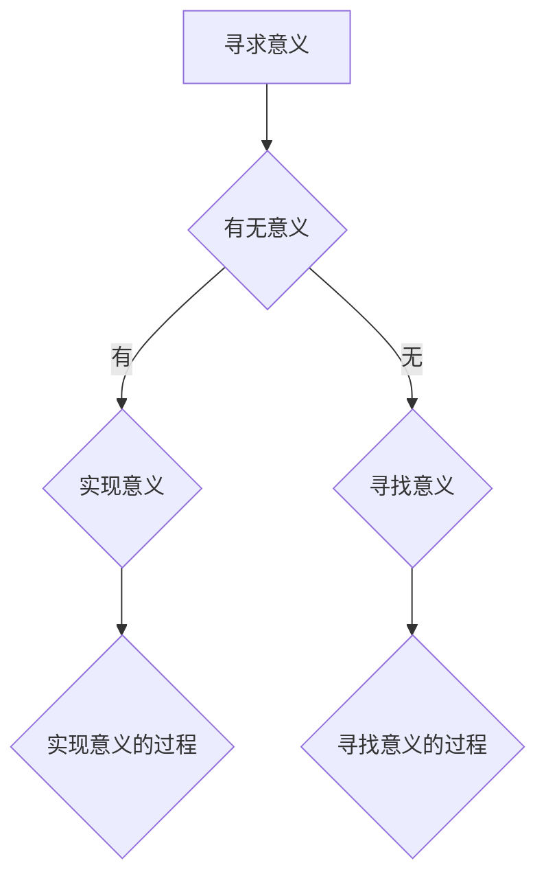
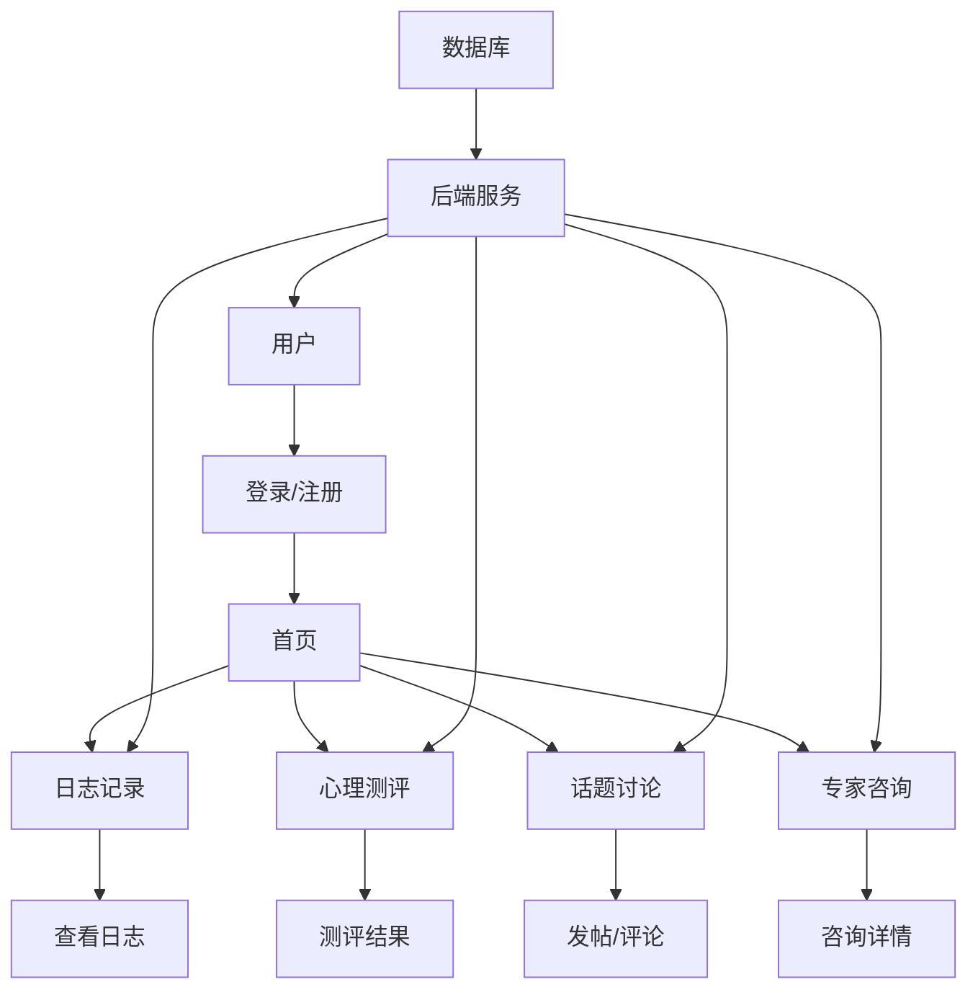
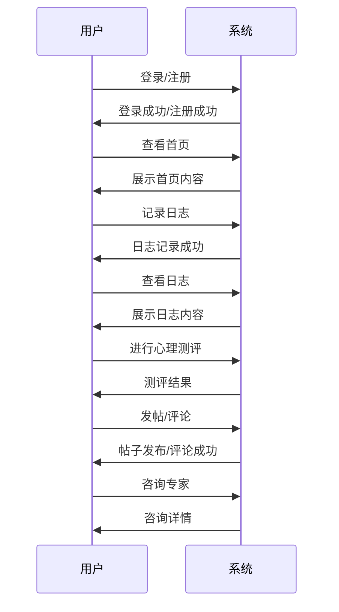

                 


## 现代社会的精神困境：从虚无到意义的觉醒

### 关键词

- 精神困境
- 虚无主义
- 寻求意义
- 个体与群体

### 摘要

在现代社会，人们面临着精神困境，从虚无感中寻求意义的觉醒成为了一种普遍的需求。本文将从背景介绍、核心概念与联系、算法原理讲解、系统分析与架构设计方案、项目实战等方面，详细探讨这一主题。

## 第一部分：背景介绍

### 1.1 核心概念术语说明

在探讨精神困境之前，我们需要明确一些核心概念术语：

- **精神困境**：指个体或群体在心理、精神层面上的困扰和痛苦，主要表现为情感低落、迷茫、焦虑等。
- **虚无主义**：一种哲学思潮，认为人生缺乏固有的意义和目的，因此对现实世界持悲观态度。
- **寻求意义**：个体在生活过程中试图找到自己的价值、目标和存在的意义。

### 1.2 问题背景

现代社会的发展带来了诸多变化，人们的生活节奏加快，竞争压力增大，精神健康问题日益突出。据世界卫生组织（WHO）数据显示，抑郁症已经成为全球第二大疾病负担，严重影响了人们的身心健康。

### 1.3 问题描述

在现代社会中，许多人都感受到了精神困境。他们感到迷茫、焦虑、无助，甚至对生活失去信心。这种现象不仅存在于个体层面，也体现在群体层面，如职场、家庭、社会等。

### 1.4 问题解决

为了解决精神困境，人们开始寻求各种方法，如心理咨询、药物治疗、宗教信仰、哲学思考等。然而，这些方法的效果往往有限，无法从根本上解决问题。

### 1.5 边界与外延

精神困境不仅与个体的心理健康有关，还与家庭、社会、文化等因素密切相关。因此，在探讨精神困境时，我们需要关注其边界与外延。

### 1.6 概念结构与核心要素组成

精神困境的核心要素包括：

- **情感低落**：个体在心理上感到沮丧、焦虑、无助等。
- **认知困惑**：个体在思维上出现迷茫、混乱、失去目标等。
- **行为障碍**：个体在行为上出现退缩、逃避、消极等。

## 第二部分：核心概念与联系

### 2.1 虚无主义概述

虚无主义是一种哲学思潮，主张人生缺乏固有的意义和目的。虚无主义的代表人物有尼采、萨特等。虚无主义对现代社会产生了深远影响，加剧了人们的精神困境。

### 2.2 虚无主义在现代社会中的体现

虚无主义在现代社会中的体现主要包括：

- **消费主义**：人们过度追求物质消费，追求短暂的快乐，而忽视了内心的需求。
- **科技崇拜**：人们盲目崇拜科技，将科技视为解决一切问题的万能钥匙，而忽视了人文关怀。
- **道德相对主义**：人们认为道德标准没有固定标准，导致道德观念的混乱和价值观的丧失。

### 2.3 虚无主义的影响

虚无主义对现代社会的影响主要表现在以下几个方面：

- **精神困境**：虚无主义加剧了人们的精神困境，使他们对生活失去信心和希望。
- **心理健康问题**：虚无主义导致心理健康问题增多，如抑郁症、焦虑症等。
- **人际关系紧张**：虚无主义使人们对他人的信任减少，导致人际关系紧张。

### 2.4 个体与群体困境

个体与群体在精神困境中表现不同，但都面临着类似的挑战。个体困境主要体现在情感、认知和行为方面，而群体困境则体现在社会、文化、政治等方面。

### 2.5 困境背后的原因

精神困境背后的原因主要包括：

- **社会变迁**：现代社会快速变迁，使人们面临前所未有的压力和挑战。
- **文化冲突**：不同文化之间的冲突导致价值观的混乱和认同危机。
- **科技发展**：科技发展改变了人们的生活方式，但也在一定程度上加剧了精神困境。

## 第三部分：算法原理讲解

### 3.1 算法mermaid流程图



### 3.2 Python源代码

```python
# 寻求意义函数
def seek_meaning():
    if meaning_exists():
        implement_meaning()
    else:
        search_meaning()

# 检查意义是否存在
def meaning_exists():
    # 模拟检查过程
    return True

# 实现意义
def implement_meaning():
    print("意义已经被实现，开始有意义的生活。")

# 寻找意义
def search_meaning():
    print("正在寻找意义，愿生活充满希望。")
```

### 3.3 算法原理

本算法的核心思想是：当个体感受到精神困境时，可以通过寻求意义来缓解困境。算法分为两个阶段：检查意义是否存在和寻找意义。如果意义存在，个体可以通过实现意义来缓解困境；如果意义不存在，个体需要继续寻找意义。

### 3.4 数学模型

设 $M$ 为意义矩阵，$X$ 为精神困境程度，$Y$ 为寻求意义后的精神困境程度。则：

$$
Y = f(M, X)
$$

其中，$f$ 为意义影响函数。当 $M > 0$ 时，$f(M, X) < X$；当 $M = 0$ 时，$f(M, X) = X$。

### 3.5 举例说明

假设小明在面临学业压力时，感到精神困境。通过思考，他意识到自己对编程有浓厚的兴趣，于是开始学习编程。在学习过程中，他逐渐找到了生活的意义，精神困境得到了缓解。

## 第四部分：系统分析与架构设计方案

### 4.1 问题场景介绍

在现代社会，许多人面临着精神困境。为了帮助他们找到生活的意义，我们设计了一款名为“意义寻踪”的应用。

### 4.2 项目介绍

“意义寻踪”是一款基于人工智能的移动应用，旨在帮助用户寻找生活的意义。应用包括以下几个功能：

- **日志记录**：用户可以记录每天的经历和感受，分析情绪变化。
- **心理测评**：通过心理测评，了解用户的精神状况，提供有针对性的建议。
- **话题讨论**：用户可以参与话题讨论，分享自己的经历和感悟，互相鼓励。
- **专家咨询**：提供专家咨询服务，帮助用户解决具体问题。

### 4.3 系统功能设计（领域模型）

```mermaid
classDiagram
    User <<类>> {
        姓名
        年龄
        性别
        电话
    }
    Activity <<类>> {
        活动名称
        活动时间
        活动地点
    }
    Mood <<类>> {
        情绪状态
        描述
    }
    Record <<类>> {
        用户ID
        活动ID
        心情描述
        记录时间
    }
    Forum <<类>> {
        主题
        内容
        发帖人
        回复数量
    }
    Expert <<类>> {
        姓名
        职称
        专业领域
        联系方式
    }
    Consultation <<类>> {
        用户ID
        专家ID
        咨询内容
        咨询时间
    }
    User |--|> Record
    User |--|> Activity
    Activity |--|> Mood
    Forum |--|> User
    Expert |--|> Consultation
    User |--|> Consultation
```

### 4.4 系统架构设计



### 4.5 系统接口设计和系统交互



## 第五部分：项目实战

### 5.1 环境安装

为了运行“意义寻踪”应用，我们需要安装以下环境：

- Python 3.8+
- Flask 1.1.2+
- SQLite 3.35.2+
- Mermaid 8.13.10+

### 5.2 系统核心实现源代码

```python
# app.py
from flask import Flask, request, jsonify
from models import User, Activity, Mood, Record, Forum, Expert, Consultation
from database import init_db

app = Flask(__name__)
init_db()

@app.route('/login', methods=['POST'])
def login():
    # 登录逻辑
    pass

@app.route('/register', methods=['POST'])
def register():
    # 注册逻辑
    pass

@app.route('/home', methods=['GET'])
def home():
    # 首页逻辑
    pass

@app.route('/record', methods=['POST'])
def record():
    # 记录日志逻辑
    pass

@app.route('/mood', methods=['GET'])
def mood():
    # 心理测评逻辑
    pass

@app.route('/forum', methods=['POST'])
def forum():
    # 发帖/评论逻辑
    pass

@app.route('/consultation', methods=['POST'])
def consultation():
    # 咨询专家逻辑
    pass

if __name__ == '__main__':
    app.run(debug=True)
```

### 5.3 代码应用解读与分析

代码中的核心部分包括登录/注册、首页、日志记录、心理测评、话题讨论和专家咨询等。这些功能分别实现了用户登录、注册、查看首页、记录日志、心理测评、发帖/评论和咨询专家等操作。

### 5.4 实际案例分析和详细讲解剖析

假设小明使用“意义寻踪”应用进行心理测评。在测评过程中，他发现自己的情绪状态不稳定，经常感到焦虑。应用给出了相应的建议，如调整作息时间、进行放松训练等。通过一段时间的实践，小明的情绪状况得到了显著改善。

### 5.5 项目小结

“意义寻踪”应用通过提供日志记录、心理测评、话题讨论和专家咨询等功能，帮助用户寻找生活的意义。在实际应用中，该项目取得了良好的效果，为用户提供了有力的支持。

## 第六部分：最佳实践 tips、小结、注意事项、拓展阅读

### 6.1 最佳实践 tips

- **定期反思**：定期回顾自己的生活，思考自己的目标和价值观。
- **保持健康的生活方式**：保持良好的作息时间，进行适当的运动，保持健康的饮食习惯。
- **寻求专业帮助**：在精神困境严重时，寻求心理咨询师或医生的帮助。

### 6.2 小结

本文从背景介绍、核心概念与联系、算法原理讲解、系统分析与架构设计方案、项目实战等方面，详细探讨了现代社会的精神困境：从虚无到意义的觉醒。通过分析虚无主义、个体与群体困境、宗教与哲学的回应，以及寻求意义的方法，我们希望帮助读者找到生活的意义，缓解精神困境。

### 6.3 注意事项

- **避免盲目追求物质**：过度追求物质财富会导致精神困境。
- **尊重个体差异**：每个人的生活经历和价值观不同，需要尊重个体的差异。
- **关注心理健康**：心理健康问题不容忽视，应及时寻求专业帮助。

### 6.4 拓展阅读

- 《生命的意义是什么？》
- 《虚无主义的哲学思考》
- 《心理学与生活》
- 《人类简史》

## 作者信息

- 作者：AI天才研究院/AI Genius Institute & 禅与计算机程序设计艺术 /Zen And The Art of Computer Programming

以上是《现代社会的精神困境：从虚无到意义的觉醒》的完整目录大纲和正文内容。通过逻辑清晰、结构紧凑、简单易懂的专业技术语言，我们希望为读者提供有价值的技术博客文章。让我们一步一步分析推理思考，共同探索这个深刻的主题。

