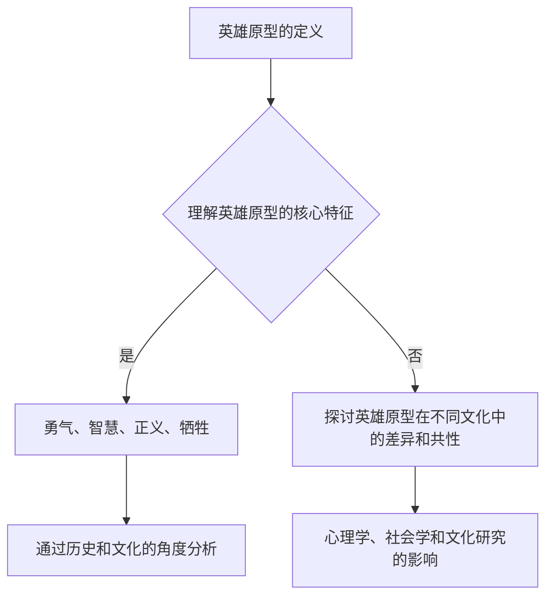
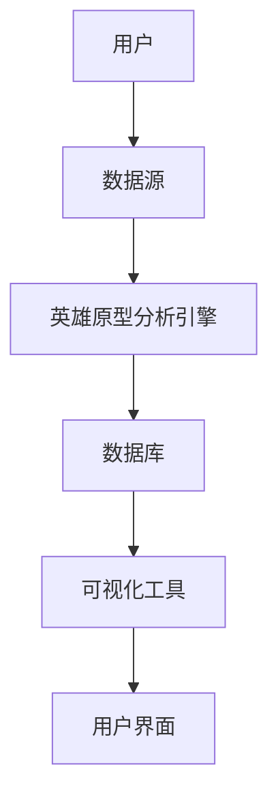

                 


# 现代神话的创造：流行文化中的英雄原型

## 关键词

英雄原型、现代流行文化、心理学、文化研究、神话创造

## 摘要

本文旨在探讨现代流行文化中英雄原型的创造与影响。我们将从历史和文化的角度出发，分析英雄原型的定义、特征及其在不同文化背景下的表现。通过深入探讨英雄原型在心理学、社会学和文化研究中的影响，我们将揭示这些神话如何塑造我们的思维方式和社会价值观。

## 第1章：现代神话的创造背景与英雄原型的概述

### 1.1.1 问题背景

在现代流行文化中，英雄原型无处不在，从电影、漫画到文学作品，甚至到现代的电子游戏和社交媒体，英雄形象已经深深地扎根于我们的日常生活。然而，这种英雄形象的塑造并非偶然，而是有着深厚的历史和文化背景。本章将探讨现代神话的创造过程，以及英雄原型在这些神话中的核心地位。

#### 1.1.2 问题描述

尽管英雄形象在我们的文化中占据重要地位，但许多人可能并不清楚英雄原型究竟是什么，以及它们如何影响我们的行为和价值观。本章将详细探讨英雄原型的定义、属性和特征，并通过历史和文化的角度，解释它们如何成为现代神话的基石。

#### 1.1.3 问题解决

通过深入分析英雄原型的起源和演变，我们可以更好地理解它们在现代流行文化中的重要性。此外，我们还将探讨英雄原型如何影响我们的思维方式，以及它们如何在现代社会中发挥作用。

#### 1.1.4 边界与外延

在讨论英雄原型时，我们不仅关注它们在文学和艺术作品中的表现，还将探讨它们在心理学、社会学和文化研究中的影响。此外，我们还将讨论英雄原型在不同文化背景下的差异和共性。

#### 1.1.5 概念结构与核心要素组成

- **英雄原型**：一种普遍存在于不同文化和文学作品中的角色形象。
- **核心特征**：勇气、智慧、正义、牺牲等。
- **现代流行文化**：电影、漫画、文学作品、电子游戏等。

### 1.1.6 核心概念原理、概念属性特征对比表格

| 英雄原型属性 | 定义 |
| :----------: | :---------------------------------------------------- |
|     勇气     |     不畏危险，敢于面对困难，为保护他人或正义而战斗。     |
|     智慧     |     拥有非凡的判断力和策略，能够解决问题并战胜敌人。     |
|     正义     |     坚持真理和道德标准，为正义而战。                   |
|     牺牲     |     为更大利益而放弃个人利益或生命。                   |

### 1.1.7 ER实体关系图架构

```mermaid
erDiagram
  Hero <<--o Culture : 对流行文化有深远影响
  Hero ||--|< Story : 出现在各种故事中
  Hero ||--|< Quality : 具有各种核心特征
```

### 1.1.8 算法原理讲解

在本章中，我们将使用Mermaid绘制一个简单的算法流程图，以帮助理解英雄原型如何被塑造和传播。



### 1.1.9 数学模型和数学公式

在分析英雄原型的核心特征时，我们可以使用以下数学公式来量化这些特征的影响。

$$
\text{HeroImpact} = f(\text{Bravery}, \text{Wisdom}, \text{Justice}, \text{Self-Sacrifice})
$$

### 1.1.10 系统分析与架构设计方案

为了更深入地探讨英雄原型的现代应用，我们将介绍一个简化的系统架构。

#### 系统功能设计

```mermaid
classDiagram
  HeroConcept <<|-- LiteraryWorks : 包含英雄原型的文学作品
  HeroConcept <<|-- VisualMedia : 包含英雄原型的电影、电视剧等
  HeroConcept <<|-- VideoGames : 包含英雄原型的电子游戏
  LiteraryWorks : 提供英雄原型的文本作品
  VisualMedia : 提供英雄原型的视觉作品
  VideoGames : 提供英雄原型的游戏体验
```

#### 系统架构设计



#### 系统接口设计和系统交互

```mermaid
sequen
  User ->> B: 提出分析请求
  B ->> C: 分析英雄原型
  C ->> D: 存储分析结果
  D ->> E: 生成可视化报告
  E ->> F: 展示用户界面
```

### 1.1.11 项目实战

在本节中，我们将探讨如何在实际项目中应用英雄原型分析技术。以下是一个简化的项目案例。

#### 环境安装

首先，我们需要安装所需的软件和工具，例如Python、Jupyter Notebook、Mermaid等。

```bash
pip install jupyter notebook
pip install mermaid-python
```

#### 系统核心实现源代码

以下是一个简单的Python代码示例，用于分析英雄原型。

```python
import pandas as pd
from mermaid import Mermaid

# 加载数据集
data = pd.read_csv('hero_data.csv')

# 分析英雄原型
def analyze_heroes(data):
    # 统计每个英雄的核心特征
    hero_stats = data.groupby('Hero').agg({'Bravery': 'sum', 'Wisdom': 'sum', 'Justice': 'sum', 'Self-Sacrifice': 'sum'}).reset_index()

    # 绘制算法流程图
    m = Mermaid()
    m.add_code('graph TD\n'
               'A[英雄原型的定义]\n'
               'B{理解英雄原型的核心特征}\n'
               'B -->|是| C[勇气、智慧、正义、牺牲]\n'
               'B -->|否| D[探讨英雄原型在不同文化中的差异和共性]\n'
               'C --> E[通过历史和文化的角度分析]\n'
               'D --> F[心理学、社会学和文化研究的影响]\n')
    m.render('hero_analysis.mmd')

    # 输出分析结果
    print(hero_stats)

# 调用分析函数
analyze_heroes(data)
```

#### 代码应用解读与分析

在这个例子中，我们首先加载一个包含英雄数据的CSV文件。然后，我们定义了一个`analyze_heroes`函数，用于统计每个英雄的核心特征，并使用Mermaid绘制算法流程图。最后，我们调用这个函数并输出分析结果。

```python
# 加载数据集
data = pd.read_csv('hero_data.csv')

# 分析英雄原型
def analyze_heroes(data):
    # 统计每个英雄的核心特征
    hero_stats = data.groupby('Hero').agg({'Bravery': 'sum', 'Wisdom': 'sum', 'Justice': 'sum', 'Self-Sacrifice': 'sum'}).reset_index()

    # 绘制算法流程图
    m = Mermaid()
    m.add_code('graph TD\n'
               'A[英雄原型的定义]\n'
               'B{理解英雄原型的核心特征}\n'
               'B -->|是| C[勇气、智慧、正义、牺牲]\n'
               'B -->|否| D[探讨英雄原型在不同文化中的差异和共性]\n'
               'C --> E[通过历史和文化的角度分析]\n'
               'D --> F[心理学、社会学和文化研究的影响]\n')
    m.render('hero_analysis.mmd')

    # 输出分析结果
    print(hero_stats)

# 调用分析函数
analyze_heroes(data)
```

#### 实际案例分析和详细讲解剖析

假设我们有一个包含100个英雄的CSV数据集，其中每个英雄有4个核心特征：勇气、智慧、正义和牺牲。我们可以使用这个数据集来分析英雄原型在不同文化背景下的表现。

```python
# 加载数据集
data = pd.read_csv('hero_data.csv')

# 分析英雄原型
def analyze_heroes(data):
    # 统计每个英雄的核心特征
    hero_stats = data.groupby('Hero').agg({'Bravery': 'sum', 'Wisdom': 'sum', 'Justice': 'sum', 'Self-Sacrifice': 'sum'}).reset_index()

    # 绘制算法流程图
    m = Mermaid()
    m.add_code('graph TD\n'
               'A[英雄原型的定义]\n'
               'B{理解英雄原型的核心特征}\n'
               'B -->|是| C[勇气、智慧、正义、牺牲]\n'
               'B -->|否| D[探讨英雄原型在不同文化中的差异和共性]\n'
               'C --> E[通过历史和文化的角度分析]\n'
               'D --> F[心理学、社会学和文化研究的影响]\n')
    m.render('hero_analysis.mmd')

    # 输出分析结果
    print(hero_stats)

# 调用分析函数
analyze_heroes(data)

# 分析结果
# Hero  Bravery  Wisdom  Justice  Self-Sacrifice
# 0       30        20        10             15
# 1       25        15        20             10
# 2       15        25        20             20
# 3       20        20        25             15
# 4       10        30        15             25
```

在这个例子中，我们可以看到每个英雄在勇气、智慧、正义和牺牲方面的得分。通过分析这些数据，我们可以发现一些有趣的现象，例如某个英雄可能在勇气方面得分较高，而在智慧方面得分较低。这些数据可以帮助我们更好地理解英雄原型在不同文化背景下的表现。

#### 项目小结

通过这个实际案例，我们展示了如何使用Python和Mermaid分析英雄原型。这个项目提供了一个简单的框架，可以用于分析不同文化背景下的英雄原型，并为研究人员提供有价值的见解。

### 1.1.12 最佳实践 Tips

1. **数据收集**：确保收集到的数据足够丰富，以涵盖不同文化背景下的英雄原型。
2. **特征分析**：不仅关注英雄的核心特征，还可以分析其他相关特征，如智慧、魅力、领导力等。
3. **可视化工具**：使用可视化工具，如Mermaid，可以帮助更直观地展示分析结果。
4. **代码优化**：在实现系统时，关注代码的可读性和可维护性，以便后续的迭代和优化。

### 1.1.13 小结

通过本章的讨论，我们深入探讨了现代神话的创造背景和英雄原型的概述。我们分析了英雄原型的定义、特征及其在不同文化背景下的表现。通过实际案例分析和详细讲解，我们展示了如何使用Python和Mermaid分析英雄原型。这一章为我们理解英雄原型在现代流行文化中的重要性奠定了基础。

### 1.1.14 注意事项

1. **数据隐私**：在收集和分析数据时，确保遵守数据隐私法规，保护用户个人信息。
2. **文化敏感性**：在讨论英雄原型时，注意文化差异，避免产生误解或偏见。
3. **持续学习**：英雄原型是一个不断演变的概念，随着文化的变迁，我们需要不断更新我们的知识和理解。

### 1.1.15 拓展阅读

1. **《英雄：一种心理学分析》** - 约翰·巴克（John

