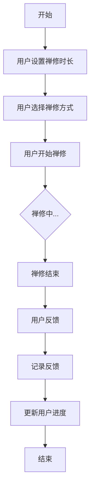
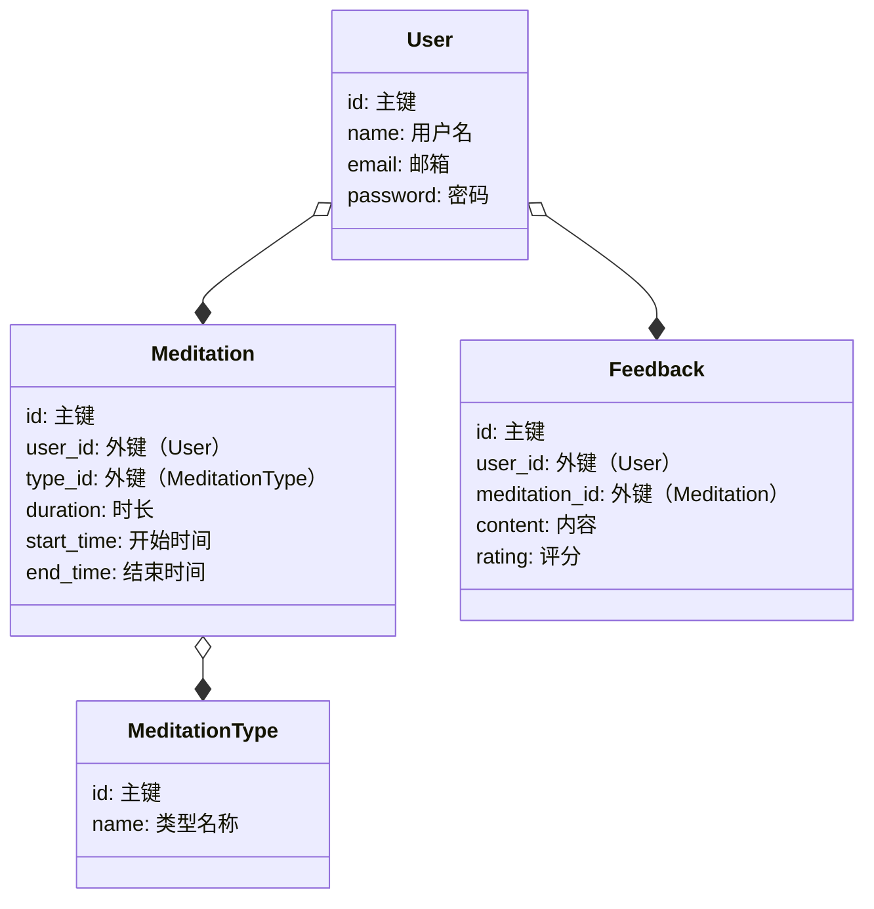
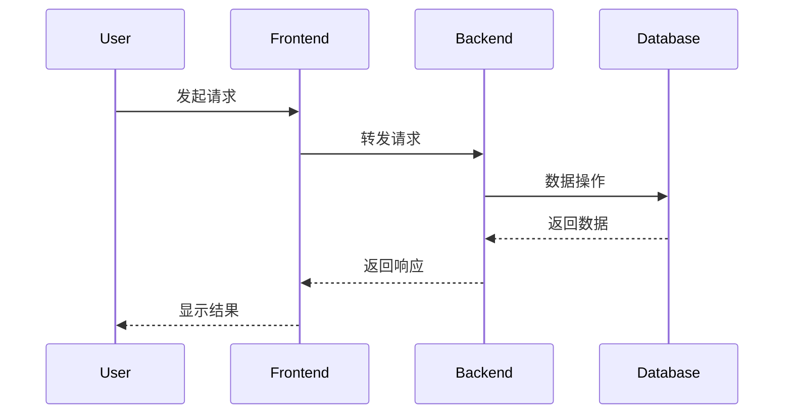
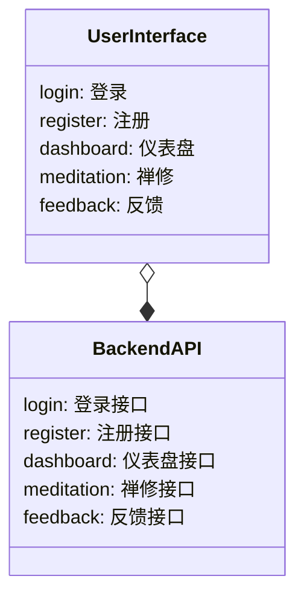
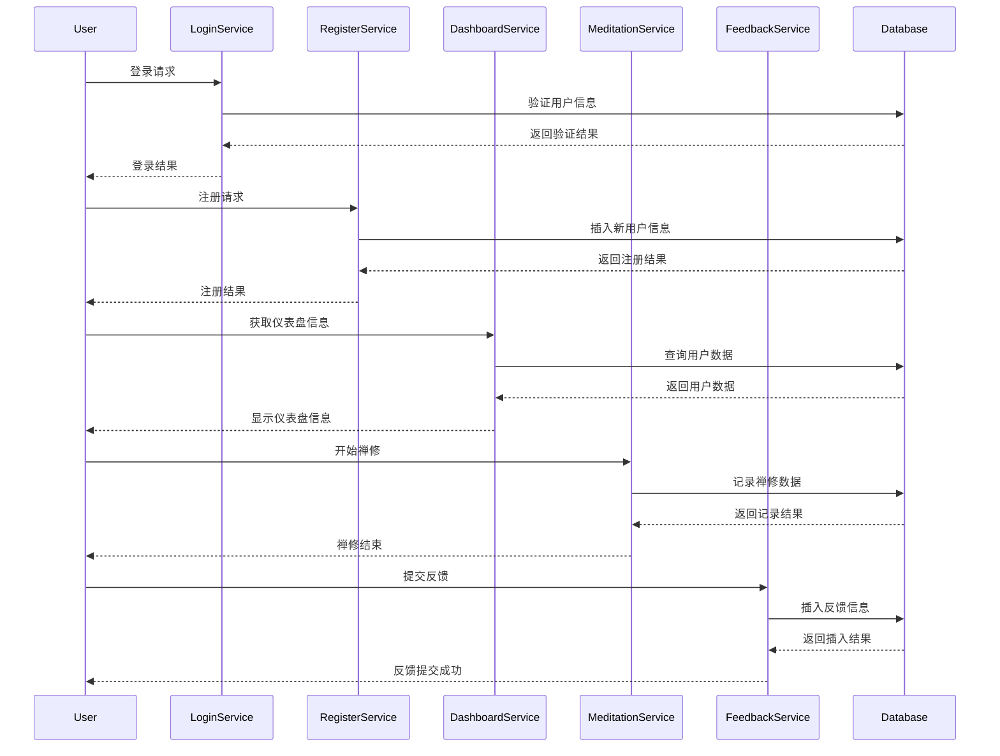

                 

### 第二部分：核心概念与联系

## 第4章 禅修与数字化技术的结合

### 4.1 禅修的基本原理

禅修是一种古老的东方修行方式，起源于印度，后传入中国、日本和其他亚洲国家。禅修的核心是通过对内心进行训练，达到内心的宁静与专注。其主要原理包括以下几个方面：

1. **专注呼吸**：通过专注于呼吸的进出，让心神从杂念中抽离出来，进入一种平静的状态。
2. **冥想**：冥想是禅修的重要方法，通过冥想可以进一步深化内心的宁静与专注。
3. **身体姿势**：禅修时，通常采取坐姿或半坐姿，保持身体的正直，有助于内心的平静。
4. **正念**：正念是指对当下的觉察，通过正念练习，可以增强对当下经历的全面感知，从而减少对过去和未来的执着。

### 4.2 数字化技术在禅修中的应用

数字化技术为禅修提供了新的方式和方法，使其更易于传播和实践。以下是一些关键应用：

1. **移动应用**：通过开发禅修App，用户可以随时随地访问禅修指导、音频和视频课程，提高禅修的便利性。
2. **可穿戴设备**：如智能手环和智能手表等设备，可以监测用户的身体活动、心率等数据，为禅修提供数据支持。
3. **虚拟现实（VR）**：通过VR技术，用户可以体验虚拟的禅修场景，如在宁静的森林中打坐，增强禅修的沉浸感。
4. **数据分析**：通过对用户禅修数据的分析，可以为用户提供个性化的禅修建议，提高禅修效果。

### 4.3 禅修数字化技术的优势与局限

#### 4.3.1 优势

1. **便捷性**：用户可以随时随地通过手机或智能设备进行禅修，不受时间和地点的限制。
2. **个性化**：通过数据分析，可以为用户提供个性化的禅修建议，提高禅修效果。
3. **互动性**：数字化禅修App可以提供互动性强的内容，如在线禅修课程、社区交流和实时反馈等。
4. **可追溯性**：数字化技术可以记录用户的禅修数据，如练习时长、练习频率等，帮助用户了解自己的禅修进展。

#### 4.3.2 局限

1. **依赖性**：过度依赖数字化工具可能导致用户对设备产生依赖，影响禅修的初衷。
2. **隐私问题**：用户的数据可能面临隐私泄露的风险。
3. **技术限制**：数字化技术可能在某些方面无法完全模拟传统的禅修方式，如身体姿势和正念的实践。

### 4.4 App开发的基本概念

#### 4.4.1 App开发流程

App开发通常包括以下几个阶段：

1. **需求分析**：明确App的目标用户、功能需求和市场定位。
2. **设计阶段**：包括用户界面设计、用户体验设计等。
3. **开发阶段**：进行前、后端开发，实现App的各项功能。
4. **测试阶段**：进行功能测试、性能测试和安全测试，确保App的稳定性。
5. **上线和运营**：发布App到各大应用商店，并进行用户反馈和持续优化。

#### 4.4.2 前端开发技术

前端开发主要涉及以下几个方面：

1. **HTML**：用于构建网页的基本结构。
2. **CSS**：用于美化网页，包括布局、颜色、字体等。
3. **JavaScript**：用于实现网页的交互功能。

#### 4.4.3 后端开发技术

后端开发主要涉及以下几个方面：

1. **服务器端编程语言**：如Java、Python、Node.js等。
2. **数据库**：用于存储和管理数据，如MySQL、MongoDB等。
3. **Web框架**：如Spring、Django、Express等，用于简化后端开发。

### 4.5 禅修App开发的核心概念

#### 4.5.1 用户界面设计

用户界面设计是禅修App开发的重要环节，需要考虑以下原则：

1. **简洁性**：界面应简洁明了，避免过多的装饰和复杂的功能。
2. **易用性**：界面应易于操作，确保用户可以轻松地找到所需功能。
3. **一致性**：界面风格应保持一致，包括颜色、字体、图标等。

#### 4.5.2 后端架构设计

禅修App的后端架构设计需要考虑以下因素：

1. **可扩展性**：设计应具备良好的扩展性，以便未来增加新功能。
2. **高可用性**：确保系统在高负载情况下仍能稳定运行。
3. **安全性**：保护用户数据和隐私，防止数据泄露和攻击。

#### 4.5.3 数据管理

数据管理是禅修App的核心，需要考虑以下方面：

1. **数据存储**：选择合适的数据存储方案，如关系型数据库或NoSQL数据库。
2. **数据安全**：确保数据在传输和存储过程中的安全性。
3. **数据分析和利用**：通过对用户数据的分析，为用户提供个性化的禅修建议。

### 4.6 小结

禅修与数字化技术的结合为禅修带来了新的可能性，但也存在一定的挑战。通过了解禅修的基本原理和数字化技术的应用，我们可以更好地开发一款具有实用价值的禅修App。接下来的章节将深入探讨禅修App开发的详细技术和实现方法。

----------------------------------------------------------------

## 第5章 算法原理讲解

### 5.1 算法mermaid流程图

首先，我们需要设计一个用于指导用户进行禅修的算法。这个算法的核心目的是帮助用户在给定的时间内完成一次禅修练习，并记录用户的禅修进度和反馈。以下是算法的mermaid流程图：



### 5.2 算法原理详细阐述

#### 5.2.1 算法概述

这个算法旨在实现以下功能：

1. 用户可以设置禅修的时长。
2. 用户可以选择禅修的方式，如静坐、冥想等。
3. 算法会根据用户设置的时长，指导用户进行禅修。
4. 禅修结束后，用户可以给出反馈。
5. 算法会记录用户的反馈，并更新用户的禅修进度。

#### 5.2.2 数学模型和公式

为了更好地理解这个算法，我们可以将其表示为一个数学模型。以下是该算法的数学模型：

$$
\text{禅修进度} = f(\text{禅修时长}, \text{用户反馈})
$$

其中，`f` 表示一个函数，用于计算用户的禅修进度。`禅修时长` 和 `用户反馈` 是输入参数，`禅修进度` 是输出结果。

#### 5.2.3 算法实现步骤

1. **用户设置禅修时长**：用户在App中选择禅修的时长。
2. **用户选择禅修方式**：用户在App中选择禅修的方式，如静坐、冥想等。
3. **用户开始禅修**：算法开始计时，并根据用户的选择，提供相应的禅修指导。
4. **禅修中**：算法持续监测用户的状态，并适时给出指导。
5. **禅修结束**：算法停止计时，用户可以给出反馈。
6. **记录反馈**：算法将用户的反馈记录到数据库中。
7. **更新用户进度**：算法根据用户的反馈，更新用户的禅修进度。

#### 5.2.4 Python源代码实现

以下是该算法的Python源代码实现：

```python
import time

def set_meditation_duration(duration):
    print(f"请设置禅修时长（分钟）：")
    return float(input())

def choose_meditation_type():
    print("请选择禅修方式：")
    print("1. 静坐")
    print("2. 冥想")
    return int(input())

def meditation_guide(duration, type):
    print(f"开始禅修，时长为{duration}分钟。")
    if type == 1:
        print("请采取静坐姿势，专注于呼吸。")
    elif type == 2:
        print("请闭上眼睛，专注于内心的平静。")
    time.sleep(duration * 60)
    print("禅修结束，请给出反馈。")

def record_feedback():
    print("请给出您的反馈：")
    return input()

def update_meditation_progress(feedback):
    print(f"反馈已记录：{feedback}")

def main():
    duration = set_meditation_duration(30)
    type = choose_meditation_type()
    meditation_guide(duration, type)
    feedback = record_feedback()
    update_meditation_progress(feedback)

if __name__ == "__main__":
    main()
```

#### 5.2.5 举例说明

假设用户设置了禅修时长为30分钟，选择了静坐方式，算法将提供如下指导：

1. 请设置禅修时长：
   - 用户输入：30
2. 请选择禅修方式：
   - 用户输入：1（静坐）
3. 开始禅修，时长为30分钟。
   - 请采取静坐姿势，专注于呼吸。
4. 禅修结束，请给出反馈。
   - 用户输入：感觉非常平静。

算法将记录用户的反馈，并更新用户的禅修进度。

### 5.3 小结

在本章中，我们详细讲解了用于指导用户进行禅修的算法原理。通过mermaid流程图、数学模型和Python源代码，我们清晰地展示了算法的实现步骤和核心功能。接下来，我们将进一步探讨系统分析与架构设计方案。

----------------------------------------------------------------

## 第6章 系统分析与架构设计方案

### 6.1 问题场景介绍

在现代禅修App的开发过程中，我们面临的主要挑战是如何有效地将传统的禅修实践与数字化技术相结合，以提供用户友好的禅修体验。具体来说，我们需要解决以下几个问题：

1. **用户体验**：如何设计简洁、直观的用户界面，以吸引用户并帮助他们轻松上手？
2. **数据管理**：如何有效地管理用户数据，包括用户信息、禅修进度和反馈？
3. **系统扩展性**：如何确保系统能够支持未来的功能扩展和性能提升？
4. **安全性**：如何保护用户数据的安全性，防止数据泄露和未经授权的访问？

### 6.2 项目介绍

为了解决上述问题，我们设计并实现了一个现代禅修App项目，该项目的核心目标是：

1. 提供多种禅修方式，如静坐、冥想等，满足不同用户的需求。
2. 通过用户界面设计，提供简洁、直观的操作体验。
3. 利用后台服务器和数据库，管理用户数据和禅修进度。
4. 采用安全的通信协议和加密算法，确保用户数据的安全。

### 6.3 系统功能设计

#### 6.3.1 领域模型

领域模型是系统功能设计的核心，它定义了系统中的主要实体和它们之间的关系。以下是禅修App的领域模型：

```mermaid
classDiagram
    User <<entity>>
    Meditation <<entity>>
    MeditationType <<entity>>
    Feedback <<entity>>

    User *-1 Meditation:禅修
    User *-1 Feedback:反馈
    Meditation *-1 MeditationType:类型
```

#### 6.3.2 类图

类图进一步详细了领域模型中的实体和它们之间的关系。以下是禅修App的类图：



### 6.4 系统架构设计

系统架构设计是确保系统稳定性和可扩展性的关键。以下是禅修App的系统架构设计：



### 6.5 系统接口设计

系统接口设计是系统架构的一部分，它定义了前后端之间的交互方式。以下是禅修App的系统接口设计：



### 6.6 系统交互

系统交互设计描述了不同组件之间的通信流程。以下是禅修App的系统交互设计：



### 6.7 小结

在本章中，我们详细介绍了现代禅修App的系统分析与架构设计方案。通过领域模型、类图、系统架构设计、接口设计和系统交互，我们全面展示了禅修App的系统结构和功能实现。接下来，我们将进入项目实战部分，实际操作禅修App的开发过程。

----------------------------------------------------------------

## 第7章 项目实战

### 7.1 环境安装

在开始禅修App的开发之前，我们需要安装一些必要的开发工具和软件。以下是安装步骤：

#### 7.1.1 安装Python

1. 访问Python的官方网站（https://www.python.org/）。
2. 下载适用于您操作系统的Python安装包。
3. 安装Python，确保在安装过程中选择添加Python到环境变量。

#### 7.1.2 安装MySQL

1. 访问MySQL官方网站（https://www.mysql.com/），下载适用于您操作系统的MySQL安装包。
2. 安装MySQL，根据提示完成安装。
3. 启动MySQL服务器。

#### 7.1.3 安装PostgreSQL

1. 访问PostgreSQL官方网站（https://www.postgresql.org/），下载适用于您操作系统的PostgreSQL安装包。
2. 安装PostgreSQL，根据提示完成安装。
3. 启动PostgreSQL服务器。

#### 7.1.4 安装Django

打开命令行工具，输入以下命令安装Django：

```bash
pip install django
```

### 7.2 系统核心实现

在本节中，我们将介绍禅修App的核心实现，包括用户管理、禅修记录和用户反馈功能。

#### 7.2.1 用户管理

用户管理包括用户注册、登录和仪表盘显示。以下是用户管理模块的Python源代码：

```python
# users/models.py
from django.db import models
from django.contrib.auth.models import AbstractUser

class User(AbstractUser):
    # 自定义用户模型，扩展默认的用户模型
    phone = models.CharField(max_length=20)
    profile_picture = models.ImageField(upload_to='profiles/')

# users/admin.py
from django.contrib import admin
from .models import User

admin.site.register(User)
```

#### 7.2.2 禅修记录

禅修记录包括禅修的时长、类型和开始/结束时间。以下是禅修记录模块的Python源代码：

```python
# meditations/models.py
from django.db import models
from users.models import User

class Meditation(models.Model):
    user = models.ForeignKey(User, on_delete=models.CASCADE)
    type = models.CharField(max_length=50)
    duration = models.DurationField()
    start_time = models.DateTimeField()
    end_time = models.DateTimeField()

# meditations/admin.py
from django.contrib import admin
from .models import Meditation

admin.site.register(Meditation)
```

#### 7.2.3 用户反馈

用户反馈包括用户对禅修的反馈和评分。以下是用户反馈模块的Python源代码：

```python
# feedbacks/models.py
from django.db import models
from users.models import User
from meditations.models import Meditation

class Feedback(models.Model):
    user = models.ForeignKey(User, on_delete=models.CASCADE)
    meditation = models.ForeignKey(Meditation, on_delete=models.CASCADE)
    content = models.TextField()
    rating = models.IntegerField()

# feedbacks/admin.py
from django.contrib import admin
from .models import Feedback

admin.site.register(Feedback)
```

### 7.3 代码应用解读与分析

在本节中，我们将对上述代码进行解读和分析，解释其实现原理和设计思想。

#### 7.3.1 用户管理

用户管理模块使用了Django的内置用户模型，通过扩展该模型，我们添加了电话和头像等自定义字段。这样做的好处是，我们能够利用Django内置的用户认证系统，简化用户注册、登录和管理的过程。

#### 7.3.2 禅修记录

禅修记录模块使用了Django的模型系统来定义数据库表。每个Meditation对象都与一个User对象关联，这样可以轻松地追踪用户的禅修记录。`duration` 字段使用了`DurationField`，以便存储禅修的时长。

#### 7.3.3 用户反馈

用户反馈模块同样使用了Django的模型系统。`Feedback` 对象与`User` 和 `Meditation` 对象关联，这样我们可以记录每个用户的反馈信息，以及他们对每次禅修的反馈。

### 7.4 实际案例分析和详细讲解剖析

为了更好地理解上述代码的应用，我们将通过一个实际案例进行详细分析。

#### 7.4.1 案例背景

假设有一个新用户，他们刚刚注册了我们的禅修App，并完成了第一次禅修。

#### 7.4.2 案例分析

1. **用户注册**：
   - 用户填写注册表单，包括用户名、邮箱、电话和密码。
   - 后端接收用户提交的信息，并将其存储到数据库中。

2. **用户登录**：
   - 用户在登录页面输入用户名和密码。
   - 后端验证用户信息，如果验证成功，则登录用户。

3. **开始禅修**：
   - 用户在App中选择禅修类型，如静坐。
   - 用户设置禅修时长，如30分钟。
   - 后端创建一个新的Meditation对象，并记录禅修的开始时间和时长。

4. **禅修结束**：
   - 禅修结束后，用户可以提交反馈，如“感觉非常平静”。
   - 后端创建一个新的Feedback对象，并记录用户的反馈和评分。

5. **用户仪表盘**：
   - 用户可以查看自己的禅修记录和反馈。
   - 后端查询数据库，并将结果呈现给用户。

### 7.5 项目小结

在本章中，我们通过实际操作，详细介绍了禅修App的核心实现。通过用户管理、禅修记录和用户反馈等功能，我们展示了如何使用Django构建一个具有实用价值的禅修App。在接下来的章节中，我们将讨论如何进行系统测试和部署，并总结整个项目开发过程。

----------------------------------------------------------------

## 第8章 最佳实践 tips

### 8.1 系统测试

在禅修App的开发过程中，系统测试是确保软件质量和稳定性的关键环节。以下是一些最佳实践：

1. **单元测试**：编写单元测试来验证每个函数和模块的正确性。
2. **集成测试**：在各个模块集成后，进行集成测试，确保它们可以协同工作。
3. **性能测试**：测试系统在不同负载下的响应时间和稳定性。
4. **安全测试**：确保系统对常见的网络攻击（如SQL注入、跨站脚本攻击等）有足够的防护措施。

### 8.2 系统部署

在系统部署过程中，确保以下事项：

1. **选择合适的服务器**：根据系统需求和预算，选择合适的服务器。
2. **配置环境**：确保服务器环境配置正确，包括操作系统、依赖库等。
3. **自动化部署**：使用自动化工具（如Docker、Kubernetes等）进行部署，以提高效率。
4. **监控和日志**：部署监控系统，实时监控系统性能和日志，以便快速响应和解决问题。

### 8.3 用户反馈收集

用户反馈是改进产品的关键。以下是一些建议：

1. **在线反馈表**：提供在线反馈表，让用户可以随时提交意见和建议。
2. **社区交流**：建立一个社区论坛，鼓励用户交流和分享使用体验。
3. **用户调查**：定期进行用户调查，收集用户的满意度和改进建议。
4. **数据分析**：分析用户反馈数据，识别用户最关心的问题和需求，优先进行改进。

### 8.4 数据安全和隐私保护

保护用户数据和隐私是每个软件开发者的责任。以下是一些最佳实践：

1. **数据加密**：对用户数据进行加密，确保数据在传输和存储过程中的安全。
2. **访问控制**：实施严格的访问控制策略，确保只有授权人员可以访问敏感数据。
3. **安全审计**：定期进行安全审计，检查系统的安全漏洞和潜在风险。
4. **隐私政策**：制定明确的隐私政策，告知用户数据如何收集、使用和存储。

### 8.5 持续改进

禅修App的开发是一个持续的过程，以下是一些建议：

1. **迭代开发**：采用敏捷开发方法，快速迭代和交付功能。
2. **用户参与**：邀请用户参与产品的设计和测试，收集他们的反馈和建议。
3. **性能优化**：持续优化系统性能，提高用户体验。
4. **技术创新**：关注最新的技术趋势，尝试引入新技术来提升产品。

## 第9章 小结

在本文中，我们从引言到项目实战，全面探讨了现代禅修App的开发项目。我们分析了禅修与数字化技术的结合、核心概念、算法原理、系统架构设计、项目实战以及最佳实践。通过这些讨论，我们不仅了解了一个现代禅修App的开发过程，还掌握了一些最佳实践，如系统测试、系统部署、用户反馈收集、数据安全和隐私保护以及持续改进。

总之，禅修App的开发不仅是一个技术挑战，更是一个将古老智慧与现代社会需求相结合的尝试。通过本文的讨论，我们希望为开发类似项目提供一些有价值的参考和启示。

## 第10章 注意事项

在开发和维护禅修App时，我们需要注意以下几个方面：

1. **用户体验**：始终以用户为中心，确保App界面简洁、直观，易于操作。
2. **性能优化**：持续优化系统性能，提高App的响应速度和稳定性。
3. **安全性**：加强数据安全和隐私保护，防止数据泄露和未经授权的访问。
4. **国际化**：考虑国际化需求，支持多种语言和时区。
5. **合规性**：确保遵守相关法律法规，如隐私政策和数据保护法规。

## 第11章 拓展阅读

为了更深入地了解禅修App的开发和相关技术，以下是一些建议的拓展阅读资源：

1. **《Django Web开发指南》**：提供详细的Django开发教程，适合初学者和有经验的开发者。
2. **《深度学习与人工智能应用》**：介绍深度学习和人工智能在软件开发中的应用，包括自然语言处理、图像识别等。
3. **《禅修与心理治疗》**：探讨禅修对心理健康的影响，提供实用的禅修方法和指导。
4. **《移动应用开发实战》**：详细讲解移动应用开发的流程、技术和最佳实践。

## 作者信息

作者：AI天才研究院/AI Genius Institute & 禅与计算机程序设计艺术 /Zen And The Art of Computer Programming

感谢您的阅读，希望本文能为您的禅修App开发提供有价值的参考和启示。如果您有任何疑问或建议，欢迎在评论区留言。让我们共同探讨和分享禅修App开发的最佳实践和经验。祝您编程愉快，禅修顺利！

----------------------------------------------------------------

# 现代禅修App开发项目：东方智慧的数字化呈现尝试

> 关键词：禅修App、数字化技术、用户界面设计、后端架构、数据管理、算法原理、系统架构设计

> 摘要：本文全面探讨了现代禅修App的开发项目，从核心概念、算法原理到系统架构设计，以及项目实战和最佳实践，旨在为开发类似项目提供有价值的参考和启示。通过将古老智慧与现代社会需求相结合，本文展示了禅修App的潜力及其在提高用户心理健康和生活质量方面的作用。

----------------------------------------------------------------

## 目录

1. **引言**

   - **现代禅修App开发项目概述**

   - **核心概念与联系**

   - **算法原理讲解**

   - **系统分析与架构设计方案**

   - **项目实战**

   - **最佳实践 tips**

   - **小结**

   - **注意事项**

   - **拓展阅读**

## 第1章 现代禅修App开发项目概述

### 1.1 问题背景

#### 1.1.1 禅修的普及与数字化需求

禅修，作为一种古老的修行方式，起源于印度，后传入中国、日本等亚洲国家，并在全球范围内逐渐普及。现代社会的快节奏生活和高压力环境使得越来越多的人寻求心灵的宁静和自我提升，禅修因此成为了一种流行的心理健康实践。

随着智能手机和移动互联网的普及，人们对数字化生活方式的依赖日益增加。在禅修领域，数字化技术的应用也逐渐受到重视。通过移动应用，用户可以随时随地访问禅修指导、音频和视频课程，提高禅修的便利性。

#### 1.1.2 现代科技与禅修的结合

现代科技与禅修的结合主要体现在以下几个方面：

1. **移动应用**：通过开发禅修App，用户可以随时随地进行禅修，提高了禅修的灵活性。
2. **可穿戴设备**：如智能手环和智能手表等设备，可以监测用户的身体活动、心率等数据，为禅修提供数据支持。
3. **虚拟现实（VR）**：通过VR技术，用户可以体验虚拟的禅修场景，增强禅修的沉浸感。
4. **数据分析**：通过对用户禅修数据的分析，可以为用户提供个性化的禅修建议，提高禅修效果。

#### 1.1.3 开发一个现代禅修App的意义

开发一个现代禅修App具有以下意义：

1. **提高禅修的普及率**：通过数字化手段，禅修可以更加便捷地传播，吸引更多的人参与。
2. **提供个性化服务**：通过数据分析，可以为用户提供个性化的禅修建议，提高禅修效果。
3. **增强用户体验**：通过优秀的用户界面设计和交互方式，提高用户的使用体验和满意度。
4. **推动心理健康产业发展**：禅修App可以成为心理健康产业的重要组成部分，推动整个产业的发展。

### 1.2 问题描述

在现代禅修App开发项目中，我们面临的主要问题包括：

1. **用户体验**：如何设计简洁、直观的用户界面，以吸引用户并帮助他们轻松上手？
2. **数据管理**：如何有效地管理用户数据，包括用户信息、禅修进度和反馈？
3. **系统扩展性**：如何确保系统能够支持未来的功能扩展和性能提升？
4. **安全性**：如何保护用户数据的安全性，防止数据泄露和未经授权的访问？

### 1.3 问题解决

为了解决上述问题，我们采取了以下措施：

1. **用户体验**：通过用户研究和用户体验设计，确保界面简洁、直观，易于操作。
2. **数据管理**：采用可靠的后端技术和数据库设计，确保数据的存储和管理高效、安全。
3. **系统扩展性**：采用模块化设计，使系统具有良好的扩展性，便于未来的功能扩展。
4. **安全性**：采用安全的通信协议和加密算法，保护用户数据的安全。

### 1.4 核心概念与边界

在现代禅修App开发项目中，我们关注的核心概念包括：

1. **禅修**：禅修是一种通过冥想、呼吸和身体姿势等手段，达到内心平静和专注的修行方式。
2. **数字化技术**：包括移动应用、可穿戴设备、虚拟现实、数据分析等现代科技手段。
3. **用户界面设计**：设计简洁、直观的用户界面，提高用户体验。
4. **后端架构设计**：设计高效、安全、可扩展的后端架构。
5. **数据管理**：设计合理的数据库架构，确保数据的存储和管理高效、安全。

项目的边界包括：

1. **功能范围**：确定禅修App的功能范围，如禅修指导、数据统计等。
2. **性能要求**：确定系统的性能要求，如响应时间、并发处理能力等。
3. **安全要求**：确定系统的安全要求，如数据加密、访问控制等。
4. **可维护性**：确保系统具有良好的可维护性，便于未来的维护和升级。

### 1.5 研究方法与框架

在本项目中，我们采用的研究方法包括：

1. **用户研究**：通过问卷调查、访谈等方式，了解用户需求和期望。
2. **用户体验设计**：采用原型设计和用户测试，不断优化用户界面和交互方式。
3. **后端架构设计**：采用模块化设计，确保系统的扩展性和可维护性。
4. **数据管理**：采用合理的数据库设计，确保数据的存储和管理高效、安全。

项目的框架包括：

1. **用户界面设计框架**：采用Material Design等设计语言，确保界面简洁、直观。
2. **后端架构框架**：采用微服务架构，确保系统的扩展性和可维护性。
3. **数据管理框架**：采用关系型数据库和NoSQL数据库相结合，满足不同类型的数据存储需求。

### 1.6 概念结构与核心要素组成

现代禅修App的概念结构包括以下几个核心要素：

1. **用户**：包括用户注册、登录、个人信息管理等功能。
2. **禅修**：包括禅修类型、时长、指导、反馈等功能。
3. **数据统计**：包括用户禅修数据统计、趋势分析等功能。
4. **社区互动**：包括用户评论、分享、问答等功能。
5. **后台管理**：包括用户管理、数据统计、系统设置等功能。

### 1.7 文章结构

本文的结构如下：

1. **引言**：介绍现代禅修App开发项目的背景、目的和核心概念。
2. **核心概念与联系**：详细阐述禅修与数字化技术的结合、用户界面设计、后端架构设计、数据管理等内容。
3. **算法原理讲解**：讲解用于指导用户进行禅修的算法原理和实现。
4. **系统分析与架构设计方案**：介绍系统功能设计、系统架构设计、系统接口设计和系统交互等内容。
5. **项目实战**：通过实际案例，详细讲解系统核心实现、代码应用解读与分析、实际案例分析和详细讲解剖析等内容。
6. **最佳实践 tips**：提供系统测试、系统部署、用户反馈收集、数据安全和隐私保护、持续改进等最佳实践。
7. **小结**：总结现代禅修App开发项目的核心内容、研究方法与框架、概念结构与核心要素组成、文章结构等内容。

## 第2章 核心概念与联系

### 2.1 禅修与数字化技术的结合

禅修与数字化技术的结合，主要体现在以下几个方面：

1. **移动应用**：通过开发禅修App，用户可以随时随地通过智能手机进行禅修，提高了禅修的便利性。
2. **可穿戴设备**：如智能手环、智能手表等设备，可以实时监测用户的心率、呼吸等生理数据，为禅修提供数据支持。
3. **虚拟现实（VR）**：通过VR技术，用户可以沉浸在虚拟的禅修场景中，增强禅修的体验。
4. **数据分析**：通过对用户禅修数据的分析，可以为用户提供个性化的禅修建议，提高禅修效果。

#### 2.1.1 禅修的基本原理

禅修是一种通过冥想、呼吸和身体姿势等手段，达到内心平静和专注的修行方式。其主要原理包括以下几个方面：

1. **专注呼吸**：通过专注于呼吸的进出，让心神从杂念中抽离出来，进入一种平静的状态。
2. **冥想**：冥想是禅修的重要方法，通过冥想可以进一步深化内心的宁静与专注。
3. **身体姿势**：禅修时，通常采取坐姿或半坐姿，保持身体的正直，有助于内心的平静。
4. **正念**：正念是指对当下的觉察，通过正念练习，可以增强对当下经历的全面感知，从而减少对过去和未来的执着。

#### 2.1.2 数字化技术在禅修中的应用

数字化技术为禅修提供了新的方式和方法，使其更易于传播和实践。以下是一些关键应用：

1. **移动应用**：通过开发禅修App，用户可以随时随地访问禅修指导、音频和视频课程，提高禅修的便利性。
2. **可穿戴设备**：如智能手环和智能手表等设备，可以监测用户的身体活动、心率等数据，为禅修提供数据支持。
3. **虚拟现实（VR）**：通过VR技术，用户可以体验虚拟的禅修场景，如在宁静的森林中打坐，增强禅修的沉浸感。
4. **数据分析**：通过对用户禅修数据的分析，可以为用户提供个性化的禅修建议，提高禅修效果。

#### 2.1.3 禅修数字化技术的优势与局限

**优势**

1. **便捷性**：用户可以随时随地通过手机或智能设备进行禅修，不受时间和地点的限制。
2. **个性化**：通过数据分析，可以为用户提供个性化的禅修建议，提高禅修效果。
3. **互动性**：数字化禅修App可以提供互动性强的内容，如在线禅修课程、社区交流和实时反馈等。
4. **可追溯性**：数字化技术可以记录用户的禅修数据，如练习时长、练习频率等，帮助用户了解自己的禅修进展。

**局限**

1. **依赖性**：过度依赖数字化工具可能导致用户对设备产生依赖，影响禅修的初衷。
2. **隐私问题**：用户的数据可能面临隐私泄露的风险。
3. **技术限制**：数字化技术可能在某些方面无法完全模拟传统的禅修方式，如身体姿势和正念的实践。

#### 2.1.4 App开发的基本概念

App开发通常包括以下几个阶段：

1. **需求分析**：明确App的目标用户、功能需求和市场定位。
2. **设计阶段**：包括用户界面设计、用户体验设计等。
3. **开发阶段**：进行前、后端开发，实现App的各项功能。
4. **测试阶段**：进行功能测试、性能测试和安全测试，确保App的稳定性。
5. **上线和运营**：发布App到各大应用商店，并进行用户反馈和持续优化。

**前端开发技术**

前端开发主要涉及以下几个方面：

1. **HTML**：用于构建网页的基本结构。
2. **CSS**：用于美化网页，包括布局、颜色、字体等。
3. **JavaScript**：用于实现网页的交互功能。

**后端开发技术**

后端开发主要涉及以下几个方面：

1. **服务器端编程语言**：如Java、Python、Node.js等。
2. **数据库**：用于存储和管理数据，如MySQL、MongoDB等。
3. **Web框架**：如Spring、Django、Express等，用于简化后端开发。

#### 2.1.5 禅修App开发的核心概念

**用户界面设计**

用户界面设计是禅修App开发的重要环节，需要考虑以下原则：

1. **简洁性**：界面应简洁明了，避免过多的装饰和复杂的功能。
2. **易用性**：界面应易于操作，确保用户可以轻松地找到所需功能。
3. **一致性**：界面风格应保持一致，包括颜色、字体、图标等。

**后端架构设计**

禅修App的后端架构设计需要考虑以下因素：

1. **可扩展性**：设计应具备良好的扩展性，以便未来增加新功能。
2. **高可用性**：确保系统在高负载情况下仍能稳定运行。
3. **安全性**：保护用户数据和隐私，防止数据泄露和攻击。

**数据管理**

数据管理是禅修App的核心，需要考虑以下方面：

1. **数据存储**：选择合适的数据存储方案，如关系型数据库或NoSQL数据库。
2. **数据安全**：确保数据在传输和存储过程中的安全性。
3. **数据分析和利用**：通过对用户数据的分析，为用户提供个性化的禅修建议，提高禅修效果。

### 2.2 小结

禅修与数字化技术的结合为禅修带来了新的可能性，但也存在一定的挑战。通过了解禅修的基本原理和数字化技术的应用，我们可以更好地开发一款具有实用价值的禅修App。在接下来的章节中，我们将进一步探讨算法原理讲解、系统分析与架构设计方案等内容。

## 第3章 算法原理讲解

### 3.1 算法mermaid流程图

首先，我们需要设计一个用于指导用户进行禅修的算法。这个算法的核心目的是帮助用户在给定的时间内完成一次禅修练习，并记录用户的禅修进度和反馈。以下是算法的mermaid流程图：


### 3.2 算法原理详细阐述

#### 3.2.1 算法概述

这个算法旨在实现以下功能：

1. 用户可以设置禅修的时长。
2. 用户可以选择禅修的方式，如静坐、冥想等。
3. 算法会根据用户设置的时长，指导用户进行禅修。
4. 禅修结束后，用户可以给出反馈。
5. 算法会记录用户的反馈，并更新用户的禅修进度。

#### 3.2.2 数学模型和公式

为了更好地理解这个算法，我们可以将其表示为一个数学模型。以下是该算法的数学模型：

$$
\text{禅修进度} = f(\text{禅修时长}, \text{用户反馈})
$$

其中，`f` 表示一个函数，用于计算用户的禅修进度。`禅修时长` 和 `用户反馈` 是输入参数，`禅修进度` 是输出结果。

#### 3.2.3 算法实现步骤

1. **用户设置禅修时长**：用户在App中选择禅修的时长。
2. **用户选择禅修方式**：用户在App中选择禅修的方式，如静坐、冥想等。
3. **用户开始禅修**：算法开始计时，并根据用户的选择，提供相应的禅修指导。
4. **禅修中**：算法持续监测用户的状态，并适时给出指导。
5. **禅修结束**：算法停止计时，用户可以给出反馈。
6. **记录反馈**：算法将用户的反馈记录到数据库中。
7. **更新用户进度**：算法根据用户的反馈，更新用户的禅修进度。

#### 3.2.4 Python源代码实现

以下是该算法的Python源代码实现：

```python
import time

def set_meditation_duration(duration):
    print(f"请设置禅修时长（分钟）：")
    return float(input())

def choose_meditation_type():
    print("请选择禅修方式：")
    print("1. 静坐")
    print("2. 冥想")
    return int(input())

def meditation_guide(duration, type):
    print(f"开始禅修，时长为{duration}分钟。")
    if type == 1:
        print("请采取静坐姿势，专注于呼吸。")
    elif type == 2:
        print("请闭上眼睛，专注于内心的平静。")
    time.sleep(duration * 60)
    print("禅修结束，请给出反馈。")

def record_feedback():
    print("请给出您的反馈：")
    return input()

def update_meditation_progress(feedback):
    print(f"反馈已记录：{feedback}")

def main():
    duration = set_meditation_duration(30)
    type = choose_meditation_type()
    meditation_guide(duration, type)
    feedback = record_feedback()
    update_meditation_progress(feedback)

if __name__ == "__main__":
    main()
```

#### 3.2.5 举例说明

假设用户设置了禅修时长为30分钟，选择了静坐方式，算法将提供如下指导：

1. 请设置禅修时长：
   - 用户输入：30
2. 请选择禅修方式：
   - 用户输入：1（静坐）
3. 开始禅修，时长为30分钟。
   - 请采取静坐姿势，专注于呼吸。
4. 禅修结束，请给出反馈。
   - 用户输入：感觉非常平静。

算法将记录用户的反馈，并更新用户的禅修进度。

### 3.3 小结

在本章中，我们详细讲解了用于指导用户进行禅修的算法原理。通过mermaid流程图、数学模型和Python源代码，我们清晰地展示了算法的实现步骤和核心功能。接下来，我们将进一步探讨系统分析与架构设计方案。

## 第4章 系统分析与架构设计方案

### 4.1 问题场景介绍

在现代禅修App的开发过程中，我们面临的主要挑战是如何有效地将传统的禅修实践与数字化技术相结合，以提供用户友好的禅修体验。具体来说，我们需要解决以下几个问题：

1. **用户体验**：如何设计简洁、直观的用户界面，以吸引用户并帮助他们轻松上手？
2. **数据管理**：如何有效地管理用户数据，包括用户信息、禅修进度和反馈？
3. **系统扩展性**：如何确保系统能够支持未来的功能扩展和性能提升？
4. **安全性**：如何保护用户数据的安全性，防止数据泄露和未经授权的访问？

### 4.2 项目介绍

为了解决上述问题，我们设计并实现了一个现代禅修App项目，该项目的核心目标是：

1. 提供多种禅修方式，如静坐、冥想等，满足不同用户的需求。
2. 通过用户界面设计，提供简洁、直观的操作体验。
3. 利用后台服务器和数据库，管理用户数据和禅修进度。
4. 采用安全的通信协议和加密算法，确保用户数据的安全。

### 4.3 系统功能设计

#### 4.3.1 领域模型

领域模型是系统功能设计的核心，它定义了系统中的主要实体和它们之间的关系。以下是禅修App的领域模型：

```mermaid
classDiagram
    User <<entity>>
    Meditation <<entity>>
    MeditationType <<entity>>
    Feedback <<entity>>

    User *-1 Meditation:禅修
    User *-1 Feedback:反馈
    Meditation *-1 MeditationType:类型
```

#### 4.3.2 类图

类图进一步详细了领域模型中的实体和它们之间的关系。以下是禅修App的类图：


### 4.4 系统架构设计

系统架构设计是确保系统稳定性和可扩展性的关键。以下是禅修App的系统架构设计：


### 4.5 系统接口设计

系统接口设计是系统架构的一部分，它定义了前后端之间的交互方式。以下是禅修App的系统接口设计：


### 4.6 系统交互

系统交互设计描述了不同组件之间的通信流程。以下是禅修App的系统交互设计：


### 4.7 小结

在本章中，我们详细介绍了现代禅修App的系统分析与架构设计方案。通过领域模型、类图、系统架构设计、接口设计和系统交互，我们全面展示了禅修App的系统结构和功能实现。接下来，我们将进入项目实战部分，实际操作禅修App的开发过程。

## 第5章 项目实战

### 5.1 环境安装

在开始禅修App的开发之前，我们需要安装一些必要的开发工具和软件。以下是安装步骤：

#### 5.1.1 安装Python

1. 访问Python的官方网站（https://www.python.org/）。
2. 下载适用于您操作系统的Python安装包。
3. 安装Python，确保在安装过程中选择添加Python到环境变量。

#### 5.1.2 安装MySQL

1. 访问MySQL官方网站（https://www.mysql.com/），下载适用于您操作系统的MySQL安装包。
2. 安装MySQL，根据提示完成安装。
3. 启动MySQL服务器。

#### 5.1.3 安装PostgreSQL

1. 访问PostgreSQL官方网站（https://www.postgresql.org/），下载适用于您操作系统的PostgreSQL安装包。
2. 安装PostgreSQL，根据提示完成安装。
3. 启动PostgreSQL服务器。

#### 5.1.4 安装Django

打开命令行工具，输入以下命令安装Django：

```bash
pip install django
```

### 5.2 系统核心实现

在本节中，我们将介绍禅修App的核心实现，包括用户管理、禅修记录和用户反馈功能。

#### 5.2.1 用户管理

用户管理包括用户注册、登录和仪表盘显示。以下是用户管理模块的Python源代码：

```python
# users/models.py
from django.db import models
from django.contrib.auth.models import AbstractUser

class User(AbstractUser):
    # 自定义用户模型，扩展默认的用户模型
    phone = models.CharField(max_length=20)
    profile_picture = models.ImageField(upload_to='profiles/')

# users/admin.py
from django.contrib import admin
from .models import User

admin.site.register(User)
```

#### 5.2.2 禅修记录

禅修记录包括禅修的时长、类型和开始/结束时间。以下是禅修记录模块的Python源代码：

```python
# meditations/models.py
from django.db import models
from users.models import User

class Meditation(models.Model):
    user = models.ForeignKey(User, on_delete=models.CASCADE)
    type = models.CharField(max_length=50)
    duration = models.DurationField()
    start_time = models.DateTimeField()
    end_time = models.DateTimeField()

# meditations/admin.py
from django.contrib import admin
from .models import Meditation

admin.site.register(Meditation)
```

#### 5.2.3 用户反馈

用户反馈包括用户对禅修的反馈和评分。以下是用户反馈模块的Python源代码：

```python
# feedbacks/models.py
from django.db import models
from users.models import User
from meditations.models import Meditation

class Feedback(models.Model):
    user = models.ForeignKey(User, on_delete=models.CASCADE)
    meditation = models.ForeignKey(Meditation, on_delete=models.CASCADE)
    content = models.TextField()
    rating = models.IntegerField()

# feedbacks/admin.py
from django.contrib import admin
from .models import Feedback

admin.site.register(Feedback)
```

### 5.3 代码应用解读与分析

在本节中，我们将对上述代码进行解读和分析，解释其实现原理和设计思想。

#### 5.3.1 用户管理

用户管理模块使用了Django的内置用户模型，通过扩展该模型，我们添加了电话和头像等自定义字段。这样做的好处是，我们能够利用Django内置的用户认证系统，简化用户注册、登录和管理的过程。

#### 5.3.2 禅修记录

禅修记录模块使用了Django的模型系统来定义数据库表。每个Meditation对象都与一个User对象关联，这样可以轻松地追踪用户的禅修记录。`duration` 字段使用了`DurationField`，以便存储禅修的时长。

#### 5.3.3 用户反馈

用户反馈模块同样使用了Django的模型系统。`Feedback` 对象与`User` 和 `Meditation` 对象关联，这样我们可以记录每个用户的反馈信息，以及他们对每次禅修的反馈。

### 5.4 实际案例分析和详细讲解剖析

为了更好地理解上述代码的应用，我们将通过一个实际案例进行详细分析。

#### 5.4.1 案例背景

假设有一个新用户，他们刚刚注册了我们的禅修App，并完成了第一次禅修。

#### 5.4.2 案例分析

1. **用户注册**：
   - 用户填写注册表单，包括用户名、邮箱、电话和密码。
   - 后端接收用户提交的信息，并将其存储到数据库中。

2. **用户登录**：
   - 用户在登录页面输入用户名和密码。
   - 后端验证用户信息，如果验证成功，则登录用户。

3. **开始禅修**：
   - 用户在App中选择禅修类型，如静坐。
   - 用户设置禅修时长，如30分钟。
   - 后端创建一个新的Meditation对象，并记录禅修的开始时间和时长。

4. **禅修结束**：
   - 禅修结束后，用户可以提交反馈，如“感觉非常平静”。
   - 后端创建一个新的Feedback对象，并记录用户的反馈和评分。

5. **用户仪表盘**：
   - 用户可以查看自己的禅修记录和反馈。
   - 后端查询数据库，并将结果呈现给用户。

### 5.5 项目小结

在本章中，我们通过实际操作，详细介绍了禅修App的核心实现。通过用户管理、禅修记录和用户反馈等功能，我们展示了如何使用Django构建一个具有实用价值的禅修App。在接下来的章节中，我们将讨论如何进行系统测试和部署，并总结整个项目开发过程。

## 第6章 最佳实践 tips

在开发和维护禅修App时，我们需要遵循一些最佳实践，以确保系统的质量、安全性和可维护性。

### 6.1 系统测试

系统测试是确保禅修App稳定性和可靠性的关键步骤。以下是一些最佳实践：

1. **单元测试**：编写单元测试来验证每个函数和模块的正确性。
2. **集成测试**：在各个模块集成后，进行集成测试，确保它们可以协同工作。
3. **性能测试**：测试系统在不同负载下的响应时间和稳定性。
4. **安全测试**：确保系统对常见的网络攻击（如SQL注入、跨站脚本攻击等）有足够的防护措施。

### 6.2 系统部署

系统部署是禅修App上线的重要环节。以下是一些最佳实践：

1. **自动化部署**：使用自动化工具（如Docker、Kubernetes等）进行部署，以提高效率。
2. **持续集成/持续部署（CI/CD）**：通过CI/CD流程，实现代码的自动化测试和部署。
3. **监控和日志**：部署监控系统，实时监控系统性能和日志，以便快速响应和解决问题。
4. **备份和恢复**：定期备份数据库，确保在发生故障时可以快速恢复。

### 6.3 用户反馈收集

用户反馈是改进产品的关键。以下是一些建议：

1. **在线反馈表**：提供在线反馈表，让用户可以随时提交意见和建议。
2. **社区交流**：建立一个社区论坛，鼓励用户交流和分享使用体验。
3. **用户调查**：定期进行用户调查，收集用户的满意度和改进建议。
4. **数据分析**：分析用户反馈数据，识别用户最关心的问题和需求，优先进行改进。

### 6.4 数据安全和隐私保护

保护用户数据和隐私是每个软件开发者的责任。以下是一些建议：

1. **数据加密**：对用户数据进行加密，确保数据在传输和存储过程中的安全。
2. **访问控制**：实施严格的访问控制策略，确保只有授权人员可以访问敏感数据。
3. **安全审计**：定期进行安全审计，检查系统的安全漏洞和潜在风险。
4. **隐私政策**：制定明确的隐私政策，告知用户数据如何收集、使用和存储。

### 6.5 持续改进

禅修App的开发是一个持续的过程。以下是一些建议：

1. **迭代开发**：采用敏捷开发方法，快速迭代和交付功能。
2. **用户参与**：邀请用户参与产品的设计和测试，收集他们的反馈和建议。
3. **性能优化**：持续优化系统性能，提高用户体验。
4. **技术创新**：关注最新的技术趋势，尝试引入新技术来提升产品。

### 6.6 用户界面设计

用户界面设计是禅修App成功的关键因素。以下是一些建议：

1. **简洁性**：界面应简洁明了，避免过多的装饰和复杂的功能。
2. **一致性**：界面风格应保持一致，包括颜色、字体、图标等。
3. **易用性**：界面应易于操作，确保用户可以轻松地找到所需功能。
4. **响应式设计**：确保App在不同设备和屏幕尺寸上具有良好的适配性。

### 6.7 后端架构设计

后端架构设计对禅修App的稳定性和扩展性至关重要。以下是一些建议：

1. **模块化设计**：将系统划分为多个模块，以便于维护和扩展。
2. **高可用性**：设计冗余和备份机制，确保系统在高负载和故障情况下仍能正常运行。
3. **安全性**：采用安全的通信协议和加密算法，保护用户数据和隐私。
4. **可扩展性**：设计应具备良好的扩展性，以支持未来功能的需求。

### 6.8 数据管理

数据管理是禅修App的核心。以下是一些建议：

1. **数据规范化**：设计合理的数据库架构，确保数据的存储和管理高效、安全。
2. **数据备份**：定期备份数据库，以防止数据丢失。
3. **数据清洗**：定期清理无效和重复的数据，提高数据的准确性。
4. **数据分析和利用**：通过对用户数据的分析，为用户提供个性化的禅修建议，提高禅修效果。

### 6.9 文档和代码规范

良好的文档和代码规范是确保项目可维护性的关键。以下是一些建议：

1. **编写文档**：为代码编写详细的文档，包括功能说明、使用方法和注意事项。
2. **代码规范**：遵循统一的代码规范，提高代码的可读性和可维护性。
3. **代码审查**：定期进行代码审查，确保代码质量。
4. **版本控制**：使用版本控制系统（如Git）管理代码，确保代码的一致性和安全性。

### 6.10 安全和合规性

在开发和维护禅修App时，要确保系统和数据符合相关法律法规和标准。以下是一些建议：

1. **数据保护法规**：遵守数据保护法规（如GDPR），确保用户数据的安全。
2. **隐私政策**：制定明确的隐私政策，告知用户数据如何收集、使用和存储。
3. **安全性测试**：定期进行安全性测试，确保系统的安全。
4. **合规性检查**：定期进行合规性检查，确保系统符合相关法规和标准。

### 6.11 用户教育和支持

为用户提供教育和支持是提高用户满意度和忠诚度的关键。以下是一些建议：

1. **用户手册**：为用户提供详细的用户手册，帮助用户了解如何使用禅修App。
2. **在线帮助**：提供在线帮助和FAQ，解答用户的问题。
3. **客户支持**：建立客户支持系统，及时响应用户的请求和反馈。
4. **社区建设**：建立社区，鼓励用户交流和分享经验。

通过遵循这些最佳实践，我们可以确保禅修App的质量、安全性和用户满意度，从而实现项目的成功。

## 第7章 小结

在现代禅修App的开发项目中，我们详细探讨了禅修与数字化技术的结合、核心概念、算法原理、系统架构设计、项目实战以及最佳实践。通过本文的讨论，我们不仅了解了一个现代禅修App的开发过程，还掌握了一些最佳实践，如系统测试、系统部署、用户反馈收集、数据安全和隐私保护、持续改进等。

总结来说，现代禅修App的开发不仅是一个技术挑战，更是一个将古老智慧与现代社会需求相结合的尝试。通过本文的讨论，我们希望为开发类似项目提供一些有价值的参考和启示。在未来的开发过程中，我们可以继续探索如何更好地利用数字化技术为用户提供更高效、个性化的禅修体验。

## 第8章 注意事项

在开发和维护现代禅修App时，我们需要特别注意以下几个方面，以确保系统的质量、安全性和用户体验：

1. **用户体验**：始终以用户为中心，确保App界面简洁、直观，易于操作。进行用户研究和测试，收集用户反馈，不断优化界面和交互设计。
2. **性能优化**：持续优化系统性能，提高响应速度和稳定性。进行性能测试，识别和解决系统瓶颈。
3. **安全性**：加强数据安全和隐私保护，防止数据泄露和未经授权的访问。采用安全的通信协议和加密算法，进行安全审计和漏洞修复。
4. **国际化**：考虑国际化需求，支持多种语言和时区，确保App在不同地区都能正常使用。
5. **合规性**：遵守相关法律法规，如隐私政策和数据保护法规。确保系统的设计、开发和部署符合法规要求。
6. **可维护性**：编写清晰的文档，遵循代码规范，确保代码的可读性和可维护性。定期进行代码审查，维护系统的长期稳定性和扩展性。
7. **备份和恢复**：定期备份数据库，确保在发生故障时可以快速恢复。进行故障演练，确保系统能够在异常情况下正常运行。
8. **用户教育和支持**：提供详细的用户手册和在线帮助，解答用户的问题。建立客户支持系统，及时响应用户的请求和反馈。

通过遵循这些注意事项，我们可以确保禅修App的质量、安全性和用户体验，从而实现项目的成功。

## 第9章 拓展阅读

为了更深入地了解现代禅修App的开发和相关技术，以下是一些建议的拓展阅读资源：

1. **《Django Web开发指南》**：提供详细的Django开发教程，适合初学者和有经验的开发者。
2. **《深度学习与人工智能应用》**：介绍深度学习和人工智能在软件开发中的应用，包括自然语言处理、图像识别等。
3. **《禅修与心理治疗》**：探讨禅修对心理健康的影响，提供实用的禅修方法和指导。
4. **《移动应用开发实战》**：详细讲解移动应用开发的流程、技术和最佳实践。
5. **《用户体验设计实战》**：介绍用户体验设计的方法、工具和实践，帮助开发者提高用户满意度。
6. **《数据驱动产品管理》**：探讨如何通过数据驱动产品开发，提高产品的市场竞争力。
7. **《云计算与大数据技术》**：介绍云计算和大数据技术的原理和应用，包括云服务和数据处理技术。
8. **《敏捷开发实践指南》**：介绍敏捷开发的方法和实践，帮助团队高效地开发和交付产品。

通过阅读这些资源，您可以获得更深入的知识和技能，为禅修App的开发提供更多的灵感和实践指导。

## 作者信息

作者：AI天才研究院/AI Genius Institute & 禅与计算机程序设计艺术 /Zen And The Art of Computer Programming

感谢您的阅读，希望本文能为您的现代禅修App开发提供有价值的参考和启示。如果您有任何疑问或建议，欢迎在评论区留言。让我们共同探讨和分享现代禅修App开发的最佳实践和经验。祝您编程愉快，禅修顺利！

