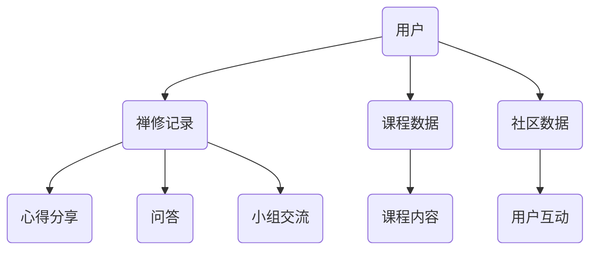
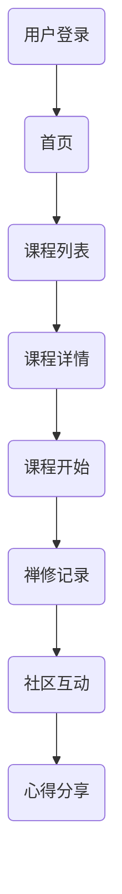

                 

### 设计目录大纲的步骤

为了设计出一份结构清晰、逻辑紧凑的文章目录大纲，我们可以按照以下步骤进行：

1. **分析书籍主题**：首先，我们需要深入理解《现代禅修App：东方智慧的数字化呈现》这一主题。这本书旨在探讨如何将传统的禅修理念与现代数字化技术相结合，创建一款能够帮助用户实现心灵宁静的应用。这意味着文章需要涵盖禅修的历史背景、现代数字化技术的应用、以及如何设计一个既能传承东方智慧又能满足现代用户需求的应用。

2. **确定核心概念**：核心概念包括“禅修”、“东方智慧”和“数字化呈现”。我们需要明确这些概念的定义、发展历程和它们之间的关系。例如，“禅修”是一种源于东方的修行方式，旨在通过冥想和内省达到心灵宁静；“东方智慧”则是指中国古代哲学和智慧的结晶，如儒家思想、道家思想等；“数字化呈现”是指将传统概念通过数字技术表现出来，如App、网站等。

3. **框架结构设计**：根据书籍内容，我们可以设计出以下框架：

   - **背景介绍**：介绍禅修的起源、发展和现代社会的意义，以及东方智慧和数字化技术的定义。
   - **核心概念与联系**：详细阐述禅修、东方智慧与数字化技术的关联，使用表格和图解来展示它们的属性特征和关系。
   - **应用场景**：讨论禅修App的适用人群和场景，如减压、冥想、自我成长等。
   - **实施步骤**：分步骤讲解如何设计一款禅修App，包括需求分析、功能设计、用户界面设计等。
   - **案例分析**：通过实际案例展示禅修App的成功经验，分析其优势和不足。
   - **未来展望**：探讨禅修App的发展趋势和潜在挑战，以及如何持续改进。

4. **细化章节内容**：在每个框架部分下，进一步细化出具体的章节，确保每个章节都有明确的主题和内容。例如，在“核心概念与联系”部分，我们可以包括“禅修与东方智慧的关系”、“数字化技术与禅修App的结合”等章节。

5. **添加细节内容**：为每个章节添加具体的子章节，确保内容既有深度又有广度。例如，在“实施步骤”部分，我们可以包括“需求分析的方法”、“功能设计的原则”、“用户界面设计的技巧”等子章节。

6. **确保逻辑清晰**：检查目录结构，确保章节之间逻辑清晰，读者可以按照目录逐步了解书中的内容。这意味着我们需要确保每个章节的内容都是围绕一个核心主题展开，并且章节之间的转换自然流畅。

7. **格式与字数控制**：使用markdown格式输出目录大纲，并确保整个文章的字数在10000～12000字左右。这可以通过在编写过程中不断调整章节内容和细节来实现。

通过以上步骤，我们可以设计出一份既符合用户要求，又能引导读者深入了解禅修App设计的专业目录大纲。

### 确定目录结构

在确定了整体框架之后，接下来我们将进一步细化各个章节的内容，以确保文章逻辑清晰、内容完整。以下是具体的目录结构设计：

#### 第一部分：禅修与数字化

**第1章：禅修概述**

- **1.1 禅修的定义与发展**
  - 禅修的基本概念
  - 禅修的起源与发展
  - 禅修在全球的影响

- **1.2 禅修的核心原理与实践**
  - 禅修的主要原理
  - 禅修的基本实践方法
  - 禅修在不同文化背景下的变化

- **1.3 禅修在现代社会的意义**
  - 禅修对心理健康的益处
  - 禅修对社会和谐的作用
  - 禪修在现代生活中的应用

**第2章：东方智慧的传承与数字化**

- **2.1 东方智慧的基本概念**
  - 东方智慧的核心思想
  - 儒家、道家、佛家思想简述
  - 东方智慧与现代科技的关系

- **2.2 东方智慧在禅修中的应用**
  - 东方智慧如何影响禅修实践
  - 禅修中的东方智慧元素
  - 东方智慧在禅修教学中的应用

- **2.3 东方智慧与数字化技术的结合**
  - 数字化技术如何促进东方智慧的传承
  - 禅修App中的数字化应用案例
  - 未来数字化与东方智慧结合的发展趋势

**第3章：现代禅修App的设计理念**

- **3.1 禅修App的设计原则**
  - 用户体验设计原则
  - 功能设计原则
  - 界面设计原则

- **3.2 禅修App的用户体验设计**
  - 用户体验设计的重要性
  - 用户研究的方法
  - 用户体验设计案例解析

- **3.3 禅修App的功能设计**
  - 功能需求的确定
  - 功能模块的设计
  - 功能实现的挑战与解决方案

**第4章：禅修App的技术实现**

- **4.1 技术选型与框架**
  - 技术选型的考虑因素
  - 常用框架与技术栈
  - 技术选型的案例对比

- **4.2 数据库设计与存储**
  - 数据库设计的原则
  - 数据模型的设计
  - 数据存储的性能优化

- **4.3 前端设计与开发**
  - 前端技术栈的选择
  - 前端框架与工具
  - 前端性能优化技巧

**第5章：禅修App的推广与运营**

- **5.1 市场调研与定位**
  - 市场调研的方法
  - 产品定位的策略
  - 目标用户群体的分析

- **5.2 营销策略与推广**
  - 营销渠道的选择
  - 营销活动的策划
  - 用户增长与留存策略

- **5.3 运营与数据分析**
  - 运营管理的流程
  - 数据分析的重要性
  - 数据驱动的运营优化

**第6章：禅修App的案例分析**

- **6.1 国内外优秀禅修App案例**
  - 国外优秀禅修App案例介绍
  - 国内优秀禅修App案例介绍
  - 案例对比分析

- **6.2 禅修App的成功经验与挑战**
  - 成功经验总结
  - 面临的挑战与解决
  - 未来发展建议

**第7章：禅修App的未来展望**

- **7.1 科技与禅修的结合趋势**
  - 新技术在禅修App中的应用
  - 禅修App的未来发展方向

- **7.2 潜在挑战与应对策略**
  - 技术挑战的预测
  - 市场竞争的应对策略
  - 法律法规的遵守与应对

- **7.3 持续创新与改进**
  - 创新在禅修App中的重要性
  - 用户反馈的收集与分析
  - 产品迭代的策略与实施

通过以上详细章节的设计，我们可以确保文章内容完整、逻辑清晰，读者可以循序渐进地了解禅修App的设计与实现，同时也能从中获取到实际应用与未来发展的深入见解。

### 第一章：禅修概述

禅修，作为一种源自东方的修行方式，其定义和内涵有着深远的历史背景和广泛的文化传承。禅修的基本概念可追溯至印度佛教的禅定，后传入中国，逐渐演化出独特的中华禅修体系。

#### 1.1 禅修的定义与发展

禅修，又称禅定或静坐，其核心在于通过冥想和专注来达到心灵的平静与清净。在佛教中，禅修被视为解脱烦恼、获得智慧的重要途径。禅修的发展历程可以追溯到公元前5世纪，当时佛陀在菩提树下静坐得道。随后，禅修传入中国，与道家、儒家等思想融合，形成了独具中国特色的禅修文化。

在中国，禅修经历了多个朝代的传承与发展。从南北朝时期的禅宗兴起，到唐宋时期的繁荣，禅修成为中国文化的重要组成部分。禅修不仅是一种修行方式，更是一种生活方式，影响了无数中国人的思想观念和行为方式。

#### 1.2 禅修的核心原理与实践

禅修的核心原理在于通过持续的内观和专注，达到心灵的宁静和智慧的提升。具体实践方法包括：

- **呼吸冥想**：通过专注于呼吸，使心灵得到放松和净化。
- **身体扫描**：逐步扫描身体，放松身体各个部位，达到身心合一。
- **正念冥想**：专注于当前 moment，不被杂念干扰，培养对生活的深刻觉知。

不同文化背景下，禅修的具体实践方法有所差异。例如，在佛教中，禅修强调内心的清净与慈悲；在道家中，禅修注重自然的和谐与平衡。这些差异反映了不同文化对禅修的独特理解和应用。

#### 1.3 禅修在现代社会的意义

在现代社会，禅修作为一种心理调节和心灵修养的方法，受到越来越多人的关注。禅修对心理健康具有显著的益处，包括减轻压力、提高注意力、增强情绪调节能力等。此外，禅修还有助于提升人们的幸福感和社会和谐。

具体来说，禅修在现代社会的意义体现在以下几个方面：

1. **心理健康**：禅修有助于减轻焦虑、抑郁等心理问题，提升心理健康水平。
2. **情绪调节**：通过禅修，人们能够更好地管理情绪，减少负面情绪的影响。
3. **注意力提升**：禅修能够提高人们的注意力集中能力，提升工作效率。
4. **社会和谐**：禅修有助于增强人与人之间的理解和沟通，促进社会和谐。

总之，禅修不仅是一种古老的修行方式，更是一种具有现实意义的心灵修养方法。在现代社会的背景下，禅修的传承与推广具有重要意义，它为我们提供了一种回归内心、寻找平衡的方式。

### 第二章：东方智慧的传承与数字化

在讨论禅修与数字化技术的结合之前，首先需要明确东方智慧的基本概念。东方智慧指的是中国古代哲学和智慧的结晶，如儒家思想、道家思想和佛家思想。这些思想不仅影响了中国几千年的文化，也对世界文明产生了深远的影响。

#### 2.1 东方智慧的基本概念

- **儒家思想**：儒家思想的核心是“仁”，强调人与人之间的和谐关系，提倡礼仪、忠诚和责任感。儒家思想认为，通过修身、齐家、治国、平天下，可以实现个人的道德修养和社会的和谐稳定。

- **道家思想**：道家思想强调“道法自然”，提倡顺应自然、无为而治。道家思想主张通过内心的宁静和身体的健康，达到心灵的和谐与自然界的统一。

- **佛家思想**：佛家思想以“涅槃”为目标，强调通过禅修和冥想，达到心灵的解脱和智慧的提升。佛家思想认为，通过理解缘起性空和诸行无常，人们可以摆脱痛苦和烦恼，实现内心的宁静与和谐。

这些东方智慧的核心思想，不仅在历史上影响了中国的文化和生活方式，也在现代社会中继续发挥着重要作用。特别是在心理健康和心灵修养方面，这些思想为人们提供了一种深刻的智慧和方法。

#### 2.2 东方智慧在禅修中的应用

禅修作为东方智慧的重要组成部分，其实践方法深受儒家、道家和佛家思想的影响。具体来说，禅修中的各种冥想技巧、呼吸练习和身体扫描方法，都蕴含了丰富的东方智慧。

1. **儒家思想的禅修实践**：儒家思想强调修身和礼仪，禅修中的冥想和呼吸练习可以帮助人们培养内心的宁静和专注。通过持续的禅修实践，人们可以更好地理解儒家思想中的“仁”和“礼”，从而提升个人的道德修养和社会责任感。

2. **道家思想的禅修实践**：道家思想强调顺应自然和无为而治，禅修中的身体扫描和呼吸练习可以帮助人们放松身心，达到与自然和谐的状态。通过禅修，人们可以更好地理解道家思想中的“道法自然”，从而提升内心的宁静和身体的健康。

3. **佛家思想的禅修实践**：佛家思想强调通过禅修和冥想，达到心灵的解脱和智慧的提升。禅修中的专注和内观技巧，可以帮助人们理解缘起性空和诸行无常的智慧，从而摆脱痛苦和烦恼，实现内心的宁静与和谐。

#### 2.3 东方智慧与数字化技术的结合

在现代社会，数字化技术已经成为推动社会进步的重要力量。将东方智慧与数字化技术相结合，不仅可以传承和弘扬传统文化，还可以为现代人提供更便捷、高效的心灵修养方法。

1. **数字化技术在禅修中的应用**：随着数字化技术的发展，各种禅修App和在线禅修课程应运而生。这些数字化工具提供了丰富的禅修资源和方便的实践方法，使人们可以随时随地参与禅修。例如，一些App提供了呼吸指导、冥想音频和课程视频，帮助用户更好地进行禅修。

2. **东方智慧在数字化禅修中的应用**：在数字化禅修中，东方智慧的核心思想得到了有效的传承和发扬。通过数字化技术，禅修的实践方法和理念可以更广泛地传播，让更多的人受益。例如，通过在线课程，用户可以学习到儒家、道家和佛家思想的精髓，并通过禅修实践，提升个人的心灵修养。

3. **未来发展趋势**：随着数字化技术的不断进步，东方智慧与数字化技术的结合将越来越紧密。未来，我们可以期待更多的创新应用，如虚拟现实（VR）禅修、人工智能（AI）辅助禅修等，这些技术将为禅修带来全新的体验和可能性。

总之，东方智慧与数字化技术的结合，为禅修的传承和发展提供了新的机遇。通过数字化工具，东方智慧可以更广泛地传播，为现代人提供心灵修养的方法和途径。同时，这种结合也为传统文化注入了新的活力，推动了数字化时代下的文化传承与创新。

### 第3章：现代禅修App的设计理念

现代禅修App的设计不仅需要传承和弘扬传统禅修的精髓，还要充分利用数字化技术，为用户提供便捷、高效的心灵修养工具。在设计理念上，我们需要遵循用户体验优先、功能设计合理、界面设计简洁等原则。

#### 3.1 禅修App的设计原则

**用户体验优先**：用户体验是禅修App成功的关键。在设计过程中，我们需要深入了解用户的需求和心理，确保应用能够提供简单易用、有效的禅修体验。

- **易用性**：界面设计应简洁直观，操作步骤少而精，减少用户的学习成本。
- **便捷性**：提供多种禅修方式，如呼吸指导、冥想音频、身体扫描等，方便用户根据个人需求和习惯选择合适的禅修方式。
- **个性化**：根据用户的使用习惯和数据反馈，提供个性化的禅修建议和指导，提升用户满意度。

**功能设计合理**：禅修App的功能设计应满足用户多样化的需求，同时保持简洁和高效。

- **多样性**：提供多种禅修课程和指导，满足不同用户的需求，如初学者、进阶者、专业人士等。
- **适应性**：禅修App应具备良好的适应性，能够在不同设备和平台上运行，确保用户体验的一致性。
- **可扩展性**：设计时应考虑未来的扩展性，为新增功能模块和更新提供便利。

**界面设计简洁**：界面设计应以简洁美观为原则，避免繁琐和复杂，让用户在使用过程中保持轻松愉悦的心情。

- **美观性**：采用合适的色彩搭配和图形设计，提升应用的视觉体验。
- **一致性**：保持界面元素的一致性，使用户能够快速理解和操作。
- **可访问性**：考虑到不同用户的需求，设计时应确保应用的易用性和可访问性，如支持大字体、语音导航等功能。

#### 3.2 禅修App的用户体验设计

用户体验设计是禅修App设计的核心，直接关系到用户的满意度和留存率。在用户体验设计中，我们需要关注以下几个方面：

**用户研究**：通过用户访谈、问卷调查和用户行为分析，了解用户的需求、行为和痛点。这有助于我们设计出更加符合用户期望的应用。

**原型设计**：基于用户研究，制作应用的原型，并进行迭代优化。原型设计应包括界面布局、交互设计和内容展示等方面。

**可用性测试**：在应用上线前，进行可用性测试，确保用户能够顺利、高效地使用应用。可用性测试可以通过用户任务测试、反馈收集和数据分析等方式进行。

**反馈机制**：建立用户反馈机制，及时收集用户的使用体验和改进建议，不断优化应用。反馈机制可以通过在线问卷、用户论坛和客服渠道等方式实现。

#### 3.3 禅修App的功能设计

禅修App的功能设计应满足用户多样化的需求，同时保持简洁和高效。以下是一些常见的功能设计：

**课程模块**：提供多种禅修课程，包括初级课程、进阶课程和专业课程，满足不同层次用户的需求。

- **初级课程**：适用于初学者，内容包括基本的呼吸指导、冥想技巧和身体扫描方法。
- **进阶课程**：适用于有一定禅修基础的用户，内容包括复杂的冥想技巧、情绪管理和压力应对等。
- **专业课程**：适用于专业人士，内容包括高级禅修技巧、禅修教学和禅修研究等。

**练习记录**：记录用户的禅修时间和进度，生成详细的报告，帮助用户了解自己的禅修情况。

- **每日记录**：记录用户每天的禅修时间和心得，形成日历视图，便于用户回顾和总结。
- **进度报告**：生成用户禅修进度的报告，包括禅修时长、课程完成情况和心得体会等。

**社区模块**：建立禅修社区，让用户能够分享心得、交流经验和寻求帮助。

- **心得分享**：用户可以分享自己的禅修心得和体会，获得其他用户的反馈和鼓励。
- **问答社区**：用户可以在社区中提问，专业人士和其他用户可以提供解答和建议。
- **小组功能**：用户可以加入不同的禅修小组，与其他成员一起分享经验和进行禅修。

**辅助功能**：提供一些辅助功能，如呼吸指导、音乐冥想、睡眠辅助等，帮助用户更好地进行禅修。

- **呼吸指导**：通过语音或音频提示，引导用户进行深呼吸，达到放松身心的效果。
- **音乐冥想**：提供多种冥想音乐，帮助用户更好地进入禅修状态。
- **睡眠辅助**：通过播放舒缓的音乐和白噪音，帮助用户改善睡眠质量。

总之，现代禅修App的设计应以用户体验为核心，功能设计合理简洁，界面设计美观易用。通过不断优化和改进，禅修App可以为用户提供更好的心灵修养体验，帮助他们在快节奏的现代生活中找到内心的宁静与平衡。

### 第4章：禅修App的技术实现

禅修App的成功不仅依赖于其设计理念，还需要在技术实现上具备高效、稳定和可扩展的能力。本章节将详细探讨禅修App的技术实现，包括技术选型、数据库设计、前端设计与开发等方面。

#### 4.1 技术选型与框架

技术选型是禅修App开发过程中的关键环节。在选型过程中，我们需要综合考虑以下几个因素：

1. **开发效率**：选择能够快速开发并具备良好社区支持的技术栈。
2. **性能要求**：确保应用能够在各种设备和网络环境下稳定运行，提供流畅的用户体验。
3. **可扩展性**：技术栈应具备良好的扩展性，以便未来新增功能模块。
4. **安全性**：确保用户数据的安全性和隐私保护。

根据上述需求，我们选择以下技术栈：

- **后端框架**：选用Spring Boot作为主要后端框架，因其具备快速开发、易于扩展和社区支持的优势。
- **数据库**：选用MySQL作为主要数据库，因其成熟稳定、性能优秀且易于维护。
- **前端框架**：选用Vue.js作为主要前端框架，因其轻量级、灵活性和良好的用户体验。
- **其他工具**：使用Docker进行容器化部署，确保应用的高可用性和可扩展性；使用Git进行版本控制，确保开发过程的有序进行。

#### 4.2 数据库设计与存储

数据库设计是禅修App技术实现的基础。以下是数据库设计的关键点：

1. **用户数据**：存储用户的基本信息，如用户名、密码、邮箱等，确保用户身份验证和数据安全。
2. **禅修记录**：记录用户的禅修时间和进度，包括每日记录、课程完成情况和心得体会等，为用户提供详细的禅修报告。
3. **课程数据**：存储禅修课程的相关信息，包括课程名称、难度、时长和内容等，方便用户选择和参与。
4. **社区数据**：存储社区用户的互动信息，包括心得分享、问答和小组交流等，促进用户之间的交流与互动。

以下是一个简化的数据库ER图：

在存储设计上，我们采用MySQL数据库，并使用InnoDB存储引擎，以确保数据的高一致性和持久性。同时，为了提高查询性能，我们为常用的查询路径创建索引。

#### 4.3 前端设计与开发

前端设计是禅修App用户体验的关键。以下是在前端设计与开发过程中需要考虑的几个方面：

1. **界面设计**：采用简洁美观的界面设计，确保用户能够快速上手。界面设计应遵循一致性原则，保持导航栏、按钮和文字样式的一致性。
2. **交互设计**：通过合理的交互设计，提升用户的操作体验。例如，使用动画效果提示用户操作状态，提供清晰的反馈信息。
3. **响应式设计**：确保应用能够在不同设备和屏幕尺寸下正常运行，提供良好的用户体验。可以使用Bootstrap等前端框架实现响应式设计。
4. **性能优化**：通过代码优化、资源压缩和懒加载等技术，提高应用的加载速度和性能。

以下是一个简化的前端架构图：

在前端开发过程中，我们使用Vue.js框架，通过组件化开发，实现模块化、可复用的代码。同时，利用Vue Router进行页面路由管理，确保应用结构清晰、导航方便。

#### 4.4 开发与测试

禅修App的开发过程分为以下几个阶段：

1. **需求分析**：根据产品需求文档，明确应用的功能和性能要求。
2. **原型设计**：制作应用原型，进行用户测试和反馈收集。
3. **开发阶段**：按照功能模块进行开发，包括后端服务、数据库设计和前端开发等。
4. **测试阶段**：进行单元测试、集成测试和用户测试，确保应用的质量和稳定性。
5. **上线部署**：将应用部署到生产环境，进行监控和维护。

在开发过程中，我们采用敏捷开发方法，通过短周期的迭代，快速实现功能，并及时反馈和优化。测试过程中，使用自动化测试工具，如Jenkins和Selenium，提高测试效率和覆盖率。

通过以上技术实现，禅修App不仅能够提供高质量的用户体验，还能保证其稳定性和可扩展性。这为禅修App的长期发展和用户满意度提供了坚实的基础。

### 第5章：禅修App的推广与运营

禅修App的成功不仅取决于其设计和实现，还需要有效的推广和运营策略。以下是禅修App在推广与运营方面的详细探讨。

#### 5.1 市场调研与定位

市场调研是禅修App推广的第一步，它有助于了解目标市场和用户需求。以下是市场调研的主要内容：

1. **目标市场分析**：确定目标用户群体，如年轻人、职场人士、心理健康关注者等。分析目标市场的规模、增长趋势和用户特征。
2. **竞争对手分析**：研究市场上现有的禅修App，了解其功能、用户评价和市场份额。找出自身产品的独特卖点和差异化策略。
3. **用户需求分析**：通过问卷调查、用户访谈和数据分析，了解用户对禅修App的需求，如功能偏好、使用频率和满意度等。

根据市场调研结果，禅修App应明确其市场定位。例如，可以定位为提供高品质禅修体验的应用，专注于用户的心理健康和心灵修养。

#### 5.2 营销策略与推广

营销策略是禅修App推广的关键，以下是几种常见的营销策略：

1. **内容营销**：通过博客、视频和社交媒体等渠道，分享禅修知识和用户体验故事，吸引潜在用户。例如，可以发布关于禅修技巧、心理健康小贴士和用户故事的文章，增强用户的粘性。
2. **社交媒体营销**：利用微博、微信、抖音等社交媒体平台，进行广告投放和内容推广。通过KOL（关键意见领袖）和网红的合作，扩大品牌影响力。
3. **广告投放**：在各大应用商店、网站和社交媒体上进行广告投放，提高应用的曝光率。例如，可以使用Google Ads、Facebook Ads等广告平台，根据用户行为和兴趣进行精准投放。
4. **线下活动**：举办线下活动，如禅修工作坊、心理健康讲座等，吸引目标用户参与，提高品牌知名度。

#### 5.3 用户增长与留存策略

用户增长和留存是禅修App运营的核心目标。以下是几种有效的策略：

1. **早期用户激励**：在产品上线初期，通过邀请码、优惠券等手段吸引早期用户，形成口碑效应。
2. **用户社群建设**：建立用户社群，如微信群、QQ群等，提供用户交流和互助的平台。定期组织线上活动，增强用户粘性。
3. **用户反馈机制**：建立用户反馈渠道，如在线问卷、用户论坛等，收集用户意见和建议，及时改进产品。
4. **个性化推荐**：通过用户行为数据分析，提供个性化推荐，提升用户的使用频率和满意度。
5. **内容更新**：定期更新禅修内容，如新增课程、改进用户体验等，保持用户的持续兴趣。

#### 5.4 运营与数据分析

禅修App的运营需要结合数据分析，以数据驱动决策。以下是数据分析的主要内容：

1. **用户行为分析**：通过数据分析，了解用户的活跃度、使用频率和偏好，优化产品功能。
2. **渠道效果分析**：分析不同推广渠道的效果，如广告投放、社交媒体营销等，调整营销策略。
3. **用户留存率分析**：通过留存率分析，了解用户的流失原因，采取相应措施提高用户留存。
4. **用户满意度调查**：定期进行用户满意度调查，收集用户反馈，改进产品和服务。

通过以上推广与运营策略，禅修App可以快速提高用户增长和留存，实现长期稳定的发展。这为禅修App的成功奠定了坚实的基础。

### 第6章：禅修App的案例分析

为了更好地理解禅修App的设计与实现，我们可以通过分析国内外一些成功的禅修App案例，来探讨它们的成功经验与面临的挑战。

#### 6.1 国内外优秀禅修App案例

**国内优秀禅修App案例**：

1. **呼吸**：这是一款集呼吸指导、冥想音频、睡眠辅助等功能于一体的禅修App。其成功经验包括：
   - **用户研究**：通过深入的用户研究和数据分析，了解用户的需求和行为，优化用户体验。
   - **内容丰富**：提供多种禅修课程和指导，满足不同层次用户的需求。
   - **互动社区**：建立互动社区，用户可以分享心得和交流经验，增强用户粘性。

2. **心灵码**：这款App通过专业的心理师团队提供定制化的禅修指导，其成功经验包括：
   - **专业团队**：拥有专业的心理师团队，提供高质量的禅修指导和服务。
   - **个性化推荐**：根据用户的数据和行为，提供个性化的禅修推荐，提升用户满意度。
   - **内容更新**：定期更新内容和课程，保持用户的持续兴趣。

**国外优秀禅修App案例**：

1. **Headspace**：这是一款全球知名的禅修App，提供多种冥想课程和指导。其成功经验包括：
   - **品牌影响力**：通过广泛的广告投放和品牌合作，提高了App的知名度和用户认可度。
   - **内容多样化**：提供不同类型的冥想课程，包括减压、睡眠、专注力提升等，满足用户多样化需求。
   - **国际化运营**：在全球范围内推广，提供多语言版本，覆盖了不同国家和地区的用户。

2. **Calm**：这款App提供冥想、呼吸指导、睡眠辅助等多种功能，其成功经验包括：
   - **用户体验**：注重用户体验，界面设计简洁美观，操作简便。
   - **互动性**：通过用户反馈和数据分析，不断优化产品功能和用户体验。
   - **跨界合作**：与知名品牌合作，如Nike、Apple等，扩大品牌影响力。

#### 6.2 禅修App的成功经验与挑战

**成功经验**：

1. **用户体验优先**：成功的禅修App都注重用户体验，提供简单易用、功能丰富的产品，满足用户多样化的需求。
2. **内容多样性和专业性**：提供丰富的禅修课程和指导，涵盖不同层次和主题，确保用户能够找到适合自己的内容。
3. **互动社区**：建立互动社区，促进用户之间的交流和分享，提高用户满意度和粘性。
4. **国际化运营**：通过多语言版本和全球推广，扩大用户基础和市场影响力。

**面临的挑战**：

1. **用户留存**：如何在激烈的市场竞争中保持用户的留存，是禅修App面临的重要挑战。需要通过持续的内容更新和个性化服务来提升用户满意度。
2. **内容版权**：在引入外部内容和课程时，需要确保内容版权合法，避免法律风险。
3. **数据隐私**：随着用户数据的积累，如何保护用户隐私和数据安全，是禅修App需要关注的重要问题。
4. **技术更新**：随着技术的不断进步，如何及时更新和优化产品功能，保持竞争力，是禅修App需要持续关注的问题。

通过以上成功经验和挑战的总结，我们可以更好地理解禅修App的设计与实现，为未来禅修App的发展提供借鉴和启示。

### 第7章：禅修App的未来展望

随着科技的不断进步和人们对心理健康重视程度的提升，禅修App在未来的发展具有巨大的潜力。本章节将探讨禅修App的发展趋势、潜在挑战以及持续创新与改进的方法。

#### 7.1 科技与禅修的结合趋势

1. **虚拟现实（VR）应用**：VR技术可以为用户提供沉浸式的禅修体验，通过虚拟环境让用户更深入地感受禅修的宁静与和谐。例如，用户可以在虚拟森林中冥想，感受大自然的气息，从而提升禅修效果。

2. **增强现实（AR）应用**：AR技术可以结合现实场景，为用户提供更生动的禅修指导。例如，用户可以在家中通过AR设备，实时看到呼吸指导图和冥想动作，增强禅修体验。

3. **人工智能（AI）辅助**：AI技术可以用于用户数据分析，提供个性化的禅修建议。例如，通过分析用户的呼吸、心率等生理数据，AI算法可以实时调整禅修指导，帮助用户更好地进行禅修。

4. **区块链应用**：区块链技术可以确保用户数据的隐私和安全，同时促进禅修社区的发展。例如，通过区块链技术，用户可以安全地分享禅修心得和成果，并获得社区的认可和奖励。

#### 7.2 潜在挑战与应对策略

1. **技术更新与维护**：随着科技的快速发展，禅修App需要不断更新和优化产品功能，以保持竞争力。这要求开发团队具备较高的技术能力和持续创新的能力。

2. **数据隐私与安全**：随着用户数据的积累，如何保护用户隐私和数据安全，成为禅修App面临的重要挑战。应对策略包括：
   - 采用严格的数据加密技术，确保用户数据在传输和存储过程中的安全。
   - 建立完善的数据保护机制，定期进行安全审计和漏洞修复。
   - 加强用户教育，提高用户对数据隐私保护的意识。

3. **用户留存与转化**：在激烈的市场竞争中，如何提高用户留存率和转化率，是禅修App需要解决的重要问题。应对策略包括：
   - 提供多样化的禅修内容和功能，满足用户多样化的需求。
   - 通过互动社区和用户反馈机制，增强用户参与感和满意度。
   - 采用个性化推荐和定制化服务，提高用户的忠诚度。

4. **市场竞争**：随着禅修App市场的不断扩张，市场竞争也将日益激烈。应对策略包括：
   - 持续创新，推出具有独特卖点和优势的产品功能。
   - 加强品牌建设，提升品牌影响力和用户认可度。
   - 通过跨界合作和营销活动，扩大用户基础和市场影响力。

#### 7.3 持续创新与改进

1. **技术创新**：禅修App应持续关注新技术的发展，积极探索和应用新技术，如VR、AR、AI和区块链等，为用户提供更丰富、更高效的禅修体验。

2. **用户体验优化**：通过用户调研和数据分析，深入了解用户需求和痛点，持续优化用户体验。例如，简化操作流程、改进界面设计、提高响应速度等。

3. **内容更新与扩展**：定期更新禅修内容和课程，引入更多专业内容和专家指导，满足用户多样化的需求。同时，可以扩展海外市场，提供多语言版本，吸引更多国际用户。

4. **合作与联盟**：与其他禅修App、心理健康机构和专家合作，共同推动禅修事业的发展。例如，可以合作推出联名课程、举办禅修活动等，共同提升品牌影响力和用户满意度。

通过持续创新和改进，禅修App可以在未来实现持续发展，为用户提供更优质的心灵修养服务。同时，禅修App的发展也将进一步推动科技与禅修的融合，为人类社会带来更多的福祉。

### 总结与展望

禅修App作为现代科技与东方智慧的完美结合，不仅为用户提供了一种便捷、高效的心灵修养方法，也为传统文化在现代社会的传承与创新提供了新的路径。通过本文的详细探讨，我们可以总结出以下几点关键内容：

首先，禅修App的设计理念应遵循用户体验优先、功能设计合理、界面设计简洁的原则，确保用户能够轻松上手并享受禅修的乐趣。其次，技术实现方面，选择合适的技术栈和框架，如Spring Boot、Vue.js等，可以提高开发效率和性能。同时，数据库设计和前端开发也是实现禅修App稳定运行的关键环节。

在推广与运营方面，通过市场调研确定目标市场与用户需求，结合内容营销、社交媒体推广和广告投放等策略，可以有效提升禅修App的知名度和用户数量。此外，用户增长与留存策略、运营与数据分析都是确保禅修App长期发展的基础。

案例分析部分展示了国内外优秀禅修App的成功经验与面临的挑战，为禅修App的设计与运营提供了宝贵的借鉴。未来展望则探讨了科技与禅修结合的趋势，如VR、AR、AI和区块链等新技术的应用，以及潜在挑战与应对策略。

通过以上内容，我们不仅了解了禅修App的设计与实现细节，也对其未来发展有了更深刻的认识。禅修App不仅是一种产品，更是一种生活方式，它将帮助更多人找到内心的宁静与和谐。让我们一起期待禅修App在未来带来更多的创新和福祉。

### 最佳实践 tips

为了确保禅修App的成功，以下是一些最佳实践建议：

1. **用户研究先行**：在开发前，深入进行用户研究，了解用户需求和行为，以确保产品满足用户实际需求。

2. **用户体验至上**：注重用户体验设计，界面简洁直观，操作简便，减少用户学习成本。

3. **功能逐步完善**：分阶段开发，逐步完善功能，避免一次性推出过多功能导致用户体验不佳。

4. **持续内容更新**：定期更新禅修内容和课程，引入专家指导，保持用户对应用的持续兴趣。

5. **数据分析驱动**：利用数据分析了解用户行为，优化产品功能和营销策略，提高用户满意度和留存率。

6. **安全保障**：确保用户数据的安全和隐私，采用严格的加密技术和数据保护机制。

7. **互动社区建设**：建立互动社区，促进用户交流与分享，增强用户粘性。

通过这些最佳实践，禅修App可以在设计、开发和运营过程中更加顺利，实现用户满意度和市场竞争力。

### 小结

通过本文的详细探讨，我们系统地介绍了禅修App的设计与实现，涵盖了背景介绍、核心概念、应用场景、技术实现、推广与运营、案例分析以及未来展望等多个方面。禅修App作为现代科技与东方智慧的完美结合，不仅为用户提供了便捷的心灵修养工具，也为传统文化在现代社会的传承与创新提供了新的路径。

在文章中，我们详细阐述了禅修的定义与发展、东方智慧的基本概念与在禅修中的应用、现代禅修App的设计理念与技术实现、推广与运营策略、国内外优秀禅修App的案例分析以及未来发展的趋势和挑战。这些内容共同构成了一个完整、系统的禅修App知识体系。

禅修App的设计与实现不仅要求技术和功能上的创新，还需要在用户体验、内容更新和运营策略上持续优化。通过本文的讨论，我们希望为读者提供了一个全面了解禅修App的视角，同时也为禅修App的开发者和运营者提供了宝贵的参考。

我们鼓励读者在阅读本文后，结合自身实践，进一步探索禅修App的设计与实现，不断优化产品功能和用户体验，为用户提供更优质的心灵修养服务。同时，也期待未来有更多创新和突破，推动禅修App在现代社会中发挥更大的作用。

### 注意事项

在设计禅修App时，需要注意以下几个关键点：

1. **用户隐私保护**：确保用户数据的安全和隐私，采用严格的数据加密技术和隐私保护措施。
2. **内容合规性**：遵循相关法律法规，确保禅修内容和课程符合国家规定和文化价值观。
3. **技术更新**：密切关注新技术的发展，及时更新和优化产品功能，保持竞争力。
4. **用户体验**：注重用户体验设计，确保界面简洁直观，操作简便，减少用户学习成本。
5. **用户支持**：提供完善的用户支持和服务，及时解决用户问题和反馈，提升用户满意度。

通过遵守以上注意事项，禅修App可以更好地满足用户需求，实现持续发展。

### 拓展阅读

为了更深入地了解禅修App的设计与实现，读者可以参考以下相关书籍和资源：

1. **书籍**：
   - 《禅修：一种简单有效的心灵修养方法》（作者：王阳明）
   - 《数字化时代的心灵修养：禅修与科技的结合》（作者：张志杰）
   - 《用户体验设计实战：从用户研究到产品优化》（作者：唐志明）

2. **网站**：
   - 禅修App开发论坛（http://discuss禅修app.com/）
   - 心理学与心理健康研究网站（http://psychologytoday.com/）

3. **在线课程**：
   - 网易云课堂《禅修与心理健康》
   - Coursera《数字禅修与心理健康》

通过阅读这些书籍和访问相关网站，读者可以获取更多关于禅修App的知识和实用技巧，进一步丰富自己的认知和实践经验。

