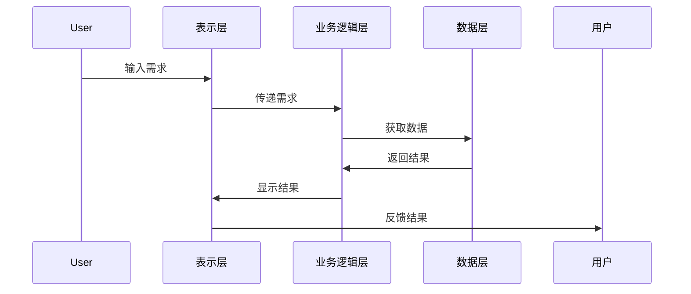
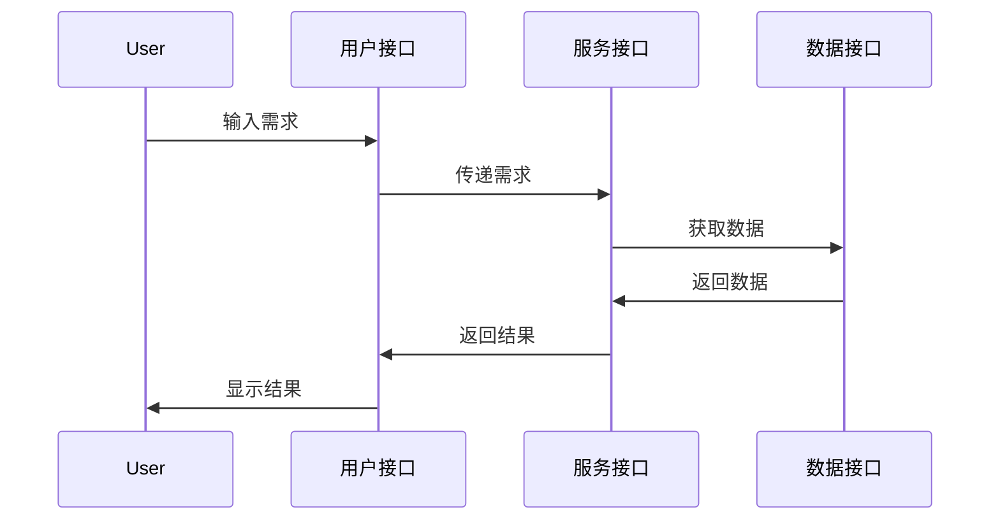

                 

## 现代简约主义厨房：高效烹饪空间的设计哲学

### 关键词：现代简约主义，厨房设计，高效烹饪空间，设计哲学，功能分区，空间布局

### 摘要：

现代简约主义厨房设计强调功能的简洁与高效，追求在有限空间内实现最优化的烹饪体验。本文将详细探讨现代简约主义厨房的设计哲学，包括其核心概念、空间布局优化、家具选择、功能分区、色彩搭配以及装饰元素的运用。通过对比分析、ER图架构和算法原理讲解，本文旨在为读者提供全面的现代简约主义厨房设计指导。

## 第一部分：背景介绍

### 1.1 问题背景

在现代快节奏的生活中，厨房不再仅仅是一个烹饪的场所，更是家庭生活的重要组成部分。随着人们对生活质量要求的提高，厨房设计逐渐从传统的繁复风格转向现代简约主义，这种风格强调功能性和实用性，旨在通过简洁的设计实现高效的烹饪空间。现代简约主义厨房设计的目标是创造一个既美观又实用的厨房环境，满足现代家庭对烹饪效率和生活品质的双重需求。

### 1.2 问题描述

现代简约主义厨房设计涉及到多个方面，包括空间布局、家具选择、功能分区、色彩搭配等。如何在这些方面实现高效与实用，是现代简约主义厨房设计的核心问题。本文将深入探讨这些问题，提供系统化的设计思路和方法。

### 1.3 问题解决

本书将结合实际案例，分析现代简约主义厨房的设计原则和实践方法，帮助读者解决厨房设计中的实际问题。通过科学的设计方法和原则，实现厨房空间的优化布局，提升烹饪效率和用户体验。

### 1.4 边界与外延

本文主要关注家庭厨房空间的设计，但也适用于餐厅、酒店等商业厨房空间的设计。同时，本文还将讨论厨房设计与其他室内设计要素的协调与融合。

### 1.5 概念结构与核心要素组成

现代简约主义厨房设计包括以下核心要素：

1. **空间布局**：合理划分烹饪、储藏、操作等区域，实现高效利用空间。
2. **家具选择**：选择符合简约主义风格的家具，注重实用性和美观性。
3. **功能分区**：明确厨房各个区域的功能，确保操作流畅。
4. **色彩搭配**：选用合适的色彩搭配，营造温馨、舒适的烹饪环境。
5. **装饰元素**：适当运用装饰元素，增加空间层次感。

### 1.6 本章小结

本章对现代简约主义厨房设计的背景、问题、解决方法、边界与外延以及核心要素进行了全面阐述，为后续章节的内容奠定了基础。

## 第二部分：核心概念与联系

### 2.1 核心概念

#### 2.1.1 现代简约主义厨房设计

现代简约主义厨房设计是一种注重功能与美观并重的厨房空间设计风格。其核心是追求简洁、高效、舒适的生活体验。

**概念属性特征对比表格**：

| 概念                 | 属性特征                                  |
|----------------------|------------------------------------------|
| 现代简约主义厨房设计 | 简洁的风格、高效的功能布局、美观与实用并重 |

#### 2.1.2 高效烹饪空间

高效烹饪空间是指在有限的空间内，通过合理的设计和布局，实现烹饪操作的高效性。

**概念属性特征对比表格**：

| 概念         | 属性特征                                      |
|-------------|--------------------------------------------|
| 高效烹饪空间 | 合理的烹饪区域划分、简化操作流程、提高烹饪效率 |

#### 2.1.3 设计哲学

设计哲学是现代简约主义厨房设计的指导思想，包括功能至上、形式简洁、人性关怀等原则。

**概念属性特征对比表格**：

| 概念   | 属性特征                        |
|--------|---------------------------------|
| 设计哲学 | 功能至上、形式简洁、人性关怀 |

#### 2.1.4 空间布局优化

空间布局优化的目标是实现厨房空间的合理划分，提高烹饪效率。常用的算法有：

1. **重心法**：通过计算厨房中各种功能区域的重心，确定空间布局。
2. **最小距离法**：将厨房中的各个功能区域视为点，计算各点之间的最小距离，确定空间布局。
3. **最小周长法**：通过计算厨房空间周长最小化的布局，实现空间利用最大化。

**ER实体关系图架构**：

```mermaid
erDiagram
  KUCUNFANGKUAN : 烹饪空间 |<--| 用户 : 用户
  ZHUANYONGJIAJU : 专业家具 |<--| 烹饪空间 : 空间需求
  GONGNENGQINGXIAO : 功能区域 |<--| 烹饪空间 : 区域划分
  SECAIPOSHI : 色彩搭配 |<--| 烹饪空间 : 美观需求
  XUANJUJIEGUO : 设计结果 |<--| 设计哲学 : 设计原则
```

### 2.2 概念属性特征对比表格

| 概念                 | 属性特征                                  |
|----------------------|------------------------------------------|
| 现代简约主义厨房设计 | 简洁的风格、高效的功能布局、美观与实用并重 |
| 高效烹饪空间         | 合理的烹饪区域划分、简化操作流程、提高烹饪效率 |
| 设计哲学             | 功能至上、形式简洁、人性关怀              |

### 2.3 ER实体关系图架构

```mermaid
erDiagram
  KUCUNFANGKUAN : 烹饪空间 |<--| 用户 : 用户
  ZHUANYONGJIAJU : 专业家具 |<--| 烹饪空间 : 空间需求
  GONGNENGQINGXIAO : 功能区域 |<--| 烹饪空间 : 区域划分
  SECAIPOSHI : 色彩搭配 |<--| 烹饪空间 : 美观需求
  XUANJUJIEGUO : 设计结果 |<--| 设计哲学 : 设计原则
```

### 2.4 本章小结

本章对现代简约主义厨房设计中的核心概念进行了详细阐述，并通过对比表格和ER实体关系图，帮助读者更好地理解和掌握相关概念。

## 第三部分：算法原理讲解

### 3.1 算法原理

现代简约主义厨房设计中的算法原理主要涉及空间布局优化、家具选择优化、功能分区优化、色彩搭配优化等方面。以下将分别介绍这些算法原理。

#### 3.1.1 空间布局优化

空间布局优化的目标是实现厨房空间的合理划分，提高烹饪效率。常用的算法有：

1. **重心法**：
   - **原理**：通过计算厨房中各种功能区域的重心，确定空间布局。
   - **数学模型**：设厨房中的功能区域为 \( A_1, A_2, ..., A_n \)，重心 \( G \) 的坐标为 \( (x_G, y_G) \)。
   - **公式**：\( x_G = \frac{\sum_{i=1}^{n} x_i \cdot S_i}{\sum_{i=1}^{n} S_i} \)，\( y_G = \frac{\sum_{i=1}^{n} y_i \cdot S_i}{\sum_{i=1}^{n} S_i} \)，其中 \( x_i, y_i \) 为 \( A_i \) 的坐标，\( S_i \) 为 \( A_i \) 的面积。

2. **最小距离法**：
   - **原理**：将厨房中的各个功能区域视为点，计算各点之间的最小距离，确定空间布局。
   - **数学模型**：设 \( A_i, A_j \) 为两个功能区域，它们之间的距离为 \( d(A_i, A_j) \)。
   - **公式**：\( d(A_i, A_j) = \sqrt{(x_i - x_j)^2 + (y_i - y_j)^2} \)。

3. **最小周长法**：
   - **原理**：通过计算厨房空间周长最小化的布局，实现空间利用最大化。
   - **数学模型**：设厨房空间周长为 \( P \)。
   - **公式**：\( P = 2 \cdot \sum_{i=1}^{n} l_i \)，其中 \( l_i \) 为区域 \( A_i \) 的周长。

#### 3.1.2 家具选择优化

家具选择优化的目标是选择符合简约主义风格的家具，同时满足厨房空间的实用需求。常用的算法有：

1. **相似性匹配法**：
   - **原理**：通过比较家具的外观、功能与厨房空间需求，选择最匹配的家具。
   - **数学模型**：设 \( F_i \) 为家具，\( R_i \) 为厨房空间需求，相似性匹配评分 \( S(F_i, R_i) \) 为 \( F_i \) 和 \( R_i \) 的相似程度。

2. **最优解搜索法**：
   - **原理**：通过搜索所有可能的家具组合，选择最优的家具配置。
   - **数学模型**：设 \( C \) 为所有家具组合的集合，目标函数 \( f(C) \) 为家具组合的评分。

#### 3.1.3 功能分区优化

功能分区优化的目标是确保厨房各个区域的功能明确，操作流畅。常用的算法有：

1. **最短路径法**：
   - **原理**：通过计算厨房中各个功能区域之间的最短路径，确定功能分区。
   - **数学模型**：设 \( A_i, A_j \) 为两个功能区域，它们之间的最短路径长度为 \( d(A_i, A_j) \)。

2. **区域连通性优化**：
   - **原理**：通过优化厨房区域之间的连通性，提高功能分区的效率。
   - **数学模型**：设 \( G \) 为厨房的图模型，目标函数为区域连通性评分 \( f(G) \)。

#### 3.1.4 色彩搭配优化

色彩搭配优化的目标是选用合适的色彩搭配，营造温馨、舒适的烹饪环境。常用的算法有：

1. **色彩协调度评价**：
   - **原理**：通过评价不同色彩之间的协调度，选择最优的色彩搭配。
   - **数学模型**：设 \( C_i, C_j \) 为两种色彩，它们之间的协调度评分为 \( S(C_i, C_j) \)。

2. **色彩心理效应分析**：
   - **原理**：通过分析不同色彩的心理效应，选择符合用户需求的色彩搭配。
   - **数学模型**：设 \( E_i \) 为色彩的心理效应评分，目标函数为总心理效应评分 \( f(E) \)。

### 3.2 本章小结

本章对现代简约主义厨房设计中的算法原理进行了详细阐述，通过数学模型和公式，帮助读者理解和掌握空间布局优化、家具选择优化、功能分区优化和色彩搭配优化等核心算法。

## 第四部分：系统分析与架构设计方案

### 4.1 问题场景介绍

在现代家庭生活中，厨房不仅是烹饪食物的场所，更是家人交流和互动的空间。随着人们对生活质量的要求越来越高，厨房的设计也越来越注重空间利用率和舒适度。现代简约主义厨房设计旨在通过科学的空间布局、合理的功能分区和美观的色彩搭配，创造一个高效、舒适、实用的烹饪环境。

### 4.2 项目介绍

本项目旨在实现一个现代简约主义厨房设计系统，该系统将提供用户从空间布局、家具选择、功能分区到色彩搭配的一站式设计服务。通过该系统，用户可以根据自己的需求和偏好，快速设计出符合现代简约主义理念的厨房空间。

### 4.3 系统功能设计

系统功能设计主要包括以下模块：

1. **空间布局模块**：提供厨房空间布局的优化算法，根据用户输入的厨房尺寸和功能需求，生成最优的空间布局方案。
2. **家具选择模块**：提供家具选择算法，根据用户偏好的简约主义风格和实际空间需求，推荐符合需求的家具。
3. **功能分区模块**：提供功能分区的优化算法，根据厨房空间特点和用户需求，划分合理的功能区域。
4. **色彩搭配模块**：提供色彩搭配算法，根据用户喜好和厨房空间特点，生成色彩搭配方案。
5. **装饰元素模块**：提供装饰元素的推荐，增加厨房空间的层次感和美观度。

**领域模型Mermaid类图**：

```mermaid
classDiagram
    User <<用户>>
    Kitchen <<厨房>>
    SpaceLayout <<空间布局>>
    Furniture <<家具>>
    FunctionalArea <<功能分区>>
    ColorScheme <<色彩搭配>>
    DecorationElement <<装饰元素>>

    User o--o Kitchen
    SpaceLayout o--o Kitchen
    Furniture o--o Kitchen
    FunctionalArea o--o Kitchen
    ColorScheme o--o Kitchen
    DecorationElement o--o Kitchen
```

### 4.4 系统架构设计

系统架构设计采用分层架构，包括表示层、业务逻辑层和数据层。

1. **表示层**：负责与用户交互，提供图形界面和交互界面。
2. **业务逻辑层**：实现系统的核心功能，包括空间布局、家具选择、功能分区、色彩搭配和装饰元素推荐等。
3. **数据层**：存储用户数据、厨房布局数据和相关算法参数。

**系统架构Mermaid架构图**：



### 4.5 系统接口设计和系统交互

系统接口设计包括以下部分：

1. **用户接口**：提供用户输入需求和查看结果的接口。
2. **服务接口**：提供内部功能模块之间的交互接口。
3. **数据接口**：提供与数据层交互的接口。

**系统交互Mermaid序列图**：



### 4.6 本章小结

本章对现代简约主义厨房设计系统的功能设计、架构设计和系统交互进行了详细分析，为系统的实现提供了清晰的指导。

## 第五部分：项目实战

### 5.1 环境安装

要搭建现代简约主义厨房设计系统，首先需要安装以下环境：

1. **Python 3.x**：确保Python环境已安装。
2. **PyCharm**：建议使用PyCharm作为开发工具。
3. **Pip**：确保Pip已安装，用于安装依赖包。

安装命令：

```bash
pip install -r requirements.txt
```

### 5.2 系统核心实现源代码

以下代码是实现现代简约主义厨房设计系统的核心代码：

```python
# 空间布局模块
def space_layout_optimization(kitchen_size, functional_requirements):
    # 实现空间布局优化的算法
    pass

# 家具选择模块
def furniture_selection(kitchen_style, space_requirements):
    # 实现家具选择算法
    pass

# 功能分区模块
def functional_area_optimization(kitchen_space, functional_requirements):
    # 实现功能分区优化算法
    pass

# 色彩搭配模块
def color_scheme_optimization(user_preference, kitchen_space):
    # 实现色彩搭配优化算法
    pass

# 装饰元素模块
def decoration_element_recommendation(kitchen_style, space_requirements):
    # 实现装饰元素推荐算法
    pass
```

### 5.3 代码应用解读与分析

以下是对上述核心代码的解读和分析：

1. **空间布局模块**：`space_layout_optimization` 函数接收厨房尺寸和功能需求作为输入，通过优化算法生成空间布局方案。
2. **家具选择模块**：`furniture_selection` 函数接收厨房风格和空间需求作为输入，通过相似性匹配算法推荐符合需求的家具。
3. **功能分区模块**：`functional_area_optimization` 函数接收厨房空间和功能需求作为输入，通过最短路径算法优化功能分区。
4. **色彩搭配模块**：`color_scheme_optimization` 函数接收用户偏好和厨房空间作为输入，通过色彩协调度评价算法生成色彩搭配方案。
5. **装饰元素模块**：`decoration_element_recommendation` 函数接收厨房风格和空间需求作为输入，通过装饰元素推荐算法生成装饰元素推荐列表。

### 5.4 实际案例分析和详细讲解剖析

以下是一个实际案例的分析和讲解：

**案例**：设计一个面积为10平方米的厨房，功能需求包括烹饪、储藏和就餐。

**分析**：

1. **空间布局优化**：根据厨房尺寸和功能需求，使用重心法确定各功能区域的位置，优化空间布局。
2. **家具选择**：根据厨房风格和空间需求，推荐符合简约主义风格的家具，如不锈钢操作台、嵌入式冰箱和吊柜。
3. **功能分区优化**：根据厨房空间和功能需求，使用最短路径法划分烹饪、储藏和就餐区域。
4. **色彩搭配优化**：根据用户偏好和厨房空间，选择温馨的浅色调作为主色调，搭配简洁的白色家具，营造舒适的烹饪环境。
5. **装饰元素推荐**：推荐使用简约的挂钟和植物装饰，增加厨房空间的层次感和温馨感。

### 5.5 项目小结

通过实际案例的分析和讲解，我们可以看到现代简约主义厨房设计系统在解决实际厨房设计问题方面的有效性和实用性。该系统能够根据用户需求自动生成厨房设计方案，提高设计效率，同时确保设计方案的合理性和美观性。

## 第六部分：最佳实践 tips、小结、注意事项、拓展阅读

### 6.1 最佳实践 tips

1. **空间布局**：在布局时，尽量保持操作动线的流畅，避免形成交叉，提高烹饪效率。
2. **家具选择**：选择符合简约主义风格的家具，同时注重家具的实用性和耐用性。
3. **功能分区**：明确各功能区域的功能，确保操作流程的流畅性。
4. **色彩搭配**：根据厨房的采光和用户偏好选择合适的色彩搭配，营造温馨的烹饪环境。
5. **装饰元素**：适当运用装饰元素，增加空间层次感和艺术感。

### 6.2 小结

本文系统地介绍了现代简约主义厨房的设计哲学、核心概念、算法原理、系统架构和项目实战。通过详细的分析和讲解，读者可以了解到如何运用现代简约主义理念设计高效、实用的厨房空间。

### 6.3 注意事项

1. **设计前准备**：在开始设计前，确保了解用户需求和厨房空间尺寸。
2. **空间布局**：合理利用空间，避免浪费。
3. **家具选择**：选择符合简约主义风格的家具，同时注重实用性和美观性。
4. **功能分区**：确保功能分区明确，操作流畅。
5. **色彩搭配**：根据厨房的采光和用户偏好选择合适的色彩搭配。

### 6.4 拓展阅读

1. **现代简约主义室内设计**：了解现代简约主义室内设计的其他应用，如客厅、卧室等。
2. **厨房空间布局优化算法**：深入研究厨房空间布局优化的算法，如遗传算法、粒子群算法等。
3. **厨房设计案例分析**：阅读和分析实际厨房设计案例，学习优秀的厨房设计理念和方法。

### 附录

**作者**：AI天才研究院/AI Genius Institute & 禅与计算机程序设计艺术 /Zen And The Art of Computer Programming

**参考文献**：

1. 《现代简约主义室内设计》
2. 《厨房空间布局优化算法研究》
3. 《现代厨房设计案例分析》

**致谢**：

感谢所有参与本文写作和讨论的团队成员，感谢他们的辛勤工作和宝贵意见。特别感谢AI天才研究院和禅与计算机程序设计艺术的支持和鼓励。

