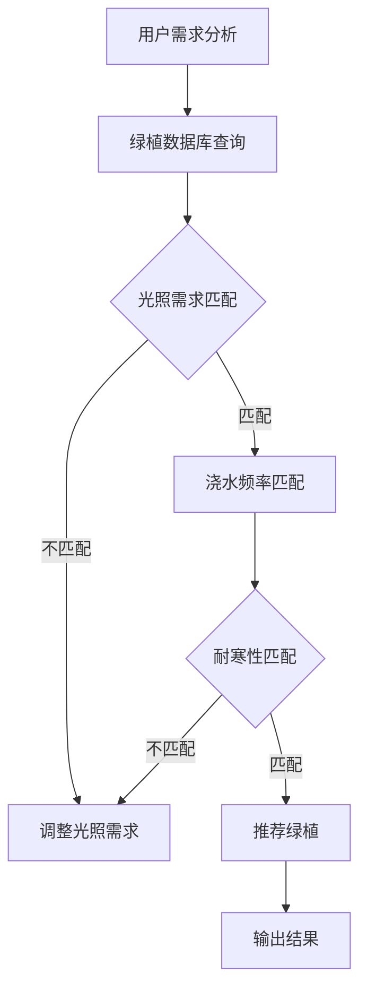
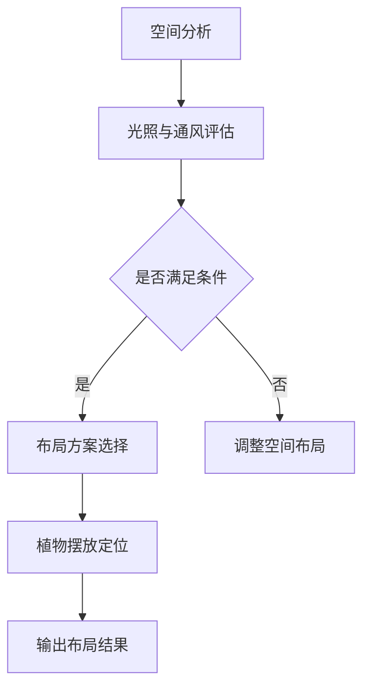

                 

### 第1章：现代简约主义园艺概述

## **1.1 问题背景**

在当今快节奏的城市生活中，人们渴望找到一种既能带来宁静，又能提升生活品质的方式。现代简约主义园艺应运而生，成为都市中的一种生活时尚。这种园艺风格强调的是对空间和自然的简约处理，通过精心挑选的绿植和简洁的设计，营造出一种宁静、舒适的居住环境。

### **1.1.1 现代生活与园艺需求的冲突**

现代都市生活充满了各种压力，人们对于绿色空间的需求日益增加。然而，城市生活的紧凑和快节奏往往导致人们对园艺的忽视。传统的园艺风格复杂、耗时且需要大量的维护，这与现代都市人追求高效、简洁的生活方式形成了鲜明对比。

### **1.1.2 简约主义园艺的概念起源与发展**

简约主义园艺起源于20世纪中叶的西方，是现代设计哲学的一种体现。它主张在有限的空间内，通过简化的设计手法，创造出具有强烈个性和功能性的绿色空间。随着时间的推移，简约主义园艺在全球范围内得到了广泛的认可和应用。

### **1.1.3 本书的结构安排与读者定位**

本书旨在为现代都市人提供一种简单、实用的园艺解决方案。全书分为两个主要部分：第一部分是理论概述，介绍简约主义园艺的基本概念、核心要素和案例分析；第二部分是实践指南，讲解简约绿植的选择、布局和养护方法。读者对象主要是对园艺有兴趣的都市居民，以及相关领域的专业人士。

## **1.2 核心概念与联系**

### **1.2.1 简约主义园艺的基本概念**

简约主义园艺是一种以简洁、高效为核心理念的园艺风格。它强调通过减少不必要的设计元素，创造出既美观又实用的绿色空间。这种风格注重功能性和美观性的统一，追求在有限的空间内最大化绿植的效益。

### **1.2.2 简约主义园艺与传统园艺的差异**

传统园艺往往注重植物品种的多样性和装饰性，而简约主义园艺则更加关注空间的利用和功能的实现。传统园艺需要更多的维护和照顾，而简约主义园艺则通过选择易于维护的植物，减少了后期的维护负担。

### **1.2.3 简约主义园艺的关键要素**

简约主义园艺的关键要素包括：1）简洁的设计风格；2）合理的空间规划；3）精选的绿植品种；4）高效的维护方式。这些要素共同构成了简约主义园艺的核心框架，使得这种风格在都市中得以广泛应用。

## **1.3 ER实体关系图架构**

简约主义园艺中的实体关系复杂，但通过合理的规划，可以简化为以下关键实体：

1. **绿植**：包括植物种类、名称、光照需求、浇水频率等属性。
2. **空间**：包括阳台、室内植物角等，有尺寸、朝向、功能等属性。
3. **设计**：包括布局方案、设计风格、实现效果等。
4. **维护**：包括维护计划、执行频率、维护方式等。

以下是简约主义园艺的ER实体关系图：

```mermaid
erDiagram
  spatial_entity ||--|{ plant_entity } : has_plant
  design_entity ||--|{ spatial_entity } : is DesignedFor
  maintenance_entity ||--|{ plant_entity } : requires_maintenance
```

在这个ER图中，空间实体与绿植实体之间存在“拥有”关系，设计实体与空间实体之间存在“设计”关系，维护实体与绿植实体之间存在“维护”关系。这些关系共同构建了简约主义园艺的系统架构。

### **1.4 本章小结**

本章介绍了现代简约主义园艺的背景、概念、核心要素以及ER实体关系图。通过这些介绍，读者可以对简约主义园艺有一个初步的了解，为后续章节的深入探讨打下基础。在接下来的章节中，我们将进一步探讨如何在实际生活中应用这些概念和原理，实现都市中的简约绿植空间。

## **1.5 扩展阅读**

- **《简约主义园艺设计》**：这本书详细介绍了简约主义园艺的设计原则和方法，适合对园艺设计有兴趣的读者。
- **《现代都市园艺》**：这本书涵盖了现代都市园艺的各种实践方法，包括植物选择、空间利用和园艺技术的最新进展。
- **《植物生物学》**：了解植物的基本生物学知识，有助于更好地理解园艺过程中的科学原理。

通过阅读这些书籍，读者可以进一步拓展自己的园艺知识，提升实践能力。接下来，我们将进入第二部分，深入探讨如何在都市中应用简约主义园艺的理念，实现绿植空间的优化布局。

## **1.6 小结与未来展望**

本章首先介绍了现代简约主义园艺的背景和基本概念，分析了现代生活与园艺需求之间的冲突，并探讨了简约主义园艺与传统园艺的差异。通过ER实体关系图，我们清晰地展示了简约主义园艺中的关键要素及其相互关系。

在本章的最后，我们提出了扩展阅读的建议，以帮助读者深入理解和应用简约主义园艺的理念。未来章节将详细探讨如何在实际生活中应用这些概念，包括绿植的选择、空间布局的优化以及日常养护的技巧。

总之，现代简约主义园艺不仅是一种园艺风格，更是一种生活哲学。它强调简洁、高效、环保，旨在为都市居民提供一种舒适、宁静的绿色生活空间。希望读者通过本章节的学习，能够对简约主义园艺有更深刻的认识，并在实践中创造出属于自己的都市绿植空间。

## **1.7 注意事项**

在实践简约主义园艺的过程中，以下注意事项是必不可少的：

1. **植物选择**：根据空间条件选择适合的绿植，避免因植物养护难度过高而放弃。
2. **空间规划**：合理利用空间，避免拥挤，确保绿植有足够的光照和通风。
3. **定期维护**：制定并执行定期维护计划，确保绿植健康生长。
4. **环保原则**：在园艺过程中，尽量采用环保材料和可持续的园艺方法，减少对环境的影响。

遵循这些注意事项，有助于提升园艺效果，延长绿植寿命，并营造出一个舒适、美观的都市绿色空间。

## **1.8 小结**

本章通过介绍现代简约主义园艺的背景、核心概念、ER实体关系图及注意事项，帮助读者对这种园艺风格有了全面的认识。简约主义园艺不仅是一种美学追求，更是一种生活方式的体现。在接下来的章节中，我们将深入探讨都市中如何具体应用这些理念，实现绿植空间的优化布局。希望读者能够积极实践，享受简约园艺带来的美好生活。

---

# **第二部分：都市简约园艺实践**

## **第2章：都市中的简约绿植选择**

在都市环境中，选择合适的绿植是实现简约园艺的关键。本章将详细介绍如何根据空间条件、光照需求和个人喜好选择合适的绿植，并探讨简约绿植选择的算法原理和实际应用。

## **2.1 绿植种类与属性特征对比表格**

在选择绿植时，了解不同植物的属性特征是非常重要的。以下是一个常见的绿植种类与属性特征对比表格：

| 绿植名称 | 光照需求 | 浇水频率 | 耐寒性 |
|----------|----------|----------|--------|
| 吊兰 | 阳光充足 | 每周一次 | 较耐寒 |
| 绿萝 | 半阴环境 | 每周一次 | 较耐寒 |
| 铜钱草 | 阳光充足 | 每周一次 | 不耐寒 |
| 非洲紫罗兰 | 半阴环境 | 每两周一次 | 耐寒性一般 |
| 小叶紫檀 | 阳光充足 | 每两周一次 | 耐寒性较弱 |

这个表格展示了不同绿植在光照需求、浇水频率和耐寒性等方面的特性，有助于我们在选择绿植时做出科学合理的决策。

## **2.2 简约绿植选择的算法原理**

为了实现科学、高效的绿植选择，我们可以借助算法进行优化。以下是一个基于Python的简约绿植选择算法示例：

### **2.2.1 算法mermaid流程图**

首先，我们使用mermaid语言绘制算法的流程图，以便直观理解算法的逻辑：



### **2.2.2 Python源代码实现**

接下来，我们根据mermaid流程图，用Python实现绿植选择算法：

```python
def select_plant(plant_data, light_requirement, water_frequency, cold_resistance):
    suitable_plants = []
    for plant in plant_data:
        if plant['light'] == light_requirement and \
           plant['water'] == water_frequency and \
           plant['cold'] == cold_resistance:
            suitable_plants.append(plant)
    return suitable_plants

# 示例绿植数据
plants = [
    {"name": "Spider Plant", "light": "Bright", "water": "Weekly", "cold": "Moderate"},
    {"name": "Golden Pothos", "light": "Partial Shade", "water": "Weekly", "cold": "Low"},
    {"name": "Pilea", "light": "Bright", "water": "Every Two Weeks", "cold": "Moderate"},
]

# 用户需求
light_requirement = "Bright"
water_frequency = "Weekly"
cold_resistance = "Moderate"

# 执行绿植选择算法
selected_plants = select_plant(plants, light_requirement, water_frequency, cold_resistance)
print(selected_plants)
```

在这个Python实现中，`select_plant`函数根据用户的需求（光照需求、浇水频率和耐寒性），从给定的绿植数据中选择合适的绿植。通过这个算法，用户可以轻松找到符合自己需求的绿植。

### **2.2.3 算法原理讲解**

简约绿植选择的算法基于以下数学模型和公式：

1. **匹配度计算**：对于每一株绿植，计算其属性与用户需求之间的匹配度。匹配度可以通过属性相似度计算公式来衡量，例如：
   $$match\_score = \frac{1}{1 + e^{-(\text{light\_distance}^2 + \text{water\_distance}^2 + \text{cold\_distance}^2)/2}}$$
   其中，$\text{light\_distance}$、$\text{water\_distance}$和$\text{cold\_distance}$分别是绿植属性与用户需求之间的差异。

2. **权重分配**：根据匹配度计算结果，为每一株绿植分配权重。权重越高，表示该绿植越符合用户需求。

3. **选择最优解**：通过遍历绿植数据，选择权重最高的几株绿植作为推荐结果。

通过这个算法，用户可以快速、高效地找到适合自己空间的绿植，实现简约园艺的优化选择。

### **2.3 简约绿植选择的应用**

简约绿植选择的算法在实际应用中具有重要意义。以下是一个实际案例：

**案例：都市阳台绿植选择**

假设用户希望在自己的阳台种植一些绿植，需求如下：
- 光照需求：半阴环境
- 浇水频率：每周一次
- 耐寒性：耐寒

根据上述需求，用户可以通过以下步骤选择合适的绿植：

1. **收集绿植信息**：用户可以从书籍、互联网或园艺店收集各种绿植的信息，包括光照需求、浇水频率和耐寒性。

2. **应用算法**：使用Python算法对收集到的绿植信息进行处理，计算出每株绿植的匹配度。

3. **筛选推荐**：根据匹配度结果，筛选出符合需求的绿植，例如绿萝、铜钱草等。

4. **购买种植**：根据筛选结果，用户可以选择购买合适的绿植，并按照算法推荐的养护方法进行种植和养护。

通过这个案例，我们可以看到简约绿植选择算法在都市园艺中的实际应用价值。它不仅帮助用户节省了选择绿植的时间和精力，还确保了绿植养护的科学性和有效性。

### **2.4 本章小结**

本章详细介绍了都市中简约绿植的选择过程，包括绿植种类与属性特征对比表格、简约绿植选择的算法原理和实际应用案例。通过这些内容，读者可以了解到如何根据个人需求和空间条件选择合适的绿植，实现简约园艺的优化布局。在接下来的章节中，我们将进一步探讨如何布局这些绿植，打造出都市中的简约绿植空间。

---

## **2.5 扩展阅读**

- **《园艺设计手册》**：这本书详细介绍了园艺设计的基础知识和实践技巧，适合初学者和专业人士。
- **《智能园艺系统》**：这本书探讨了如何利用现代技术（如物联网、人工智能）来优化园艺过程，提高绿植的养护效果。
- **《绿植养护指南》**：这本书涵盖了各种绿植的养护方法和技巧，有助于读者更好地照顾自己的绿植。

通过阅读这些书籍，读者可以进一步拓展自己的园艺知识，提升园艺实践能力。

## **2.6 小结**

本章围绕都市中的简约绿植选择进行了深入探讨，从绿植种类与属性特征对比表格到简约绿植选择的算法原理，再到实际应用案例，全面展示了如何科学、高效地选择适合都市生活的绿植。通过本章的学习，读者可以掌握简约绿植选择的技巧，为打造自己的都市绿植空间奠定基础。在下一章中，我们将继续探讨如何布局这些绿植，创造一个宁静、舒适的都市绿植空间。

---

## **2.7 注意事项**

在实践简约绿植选择的过程中，以下注意事项是至关重要的：

1. **空间测量**：在开始选择绿植之前，要准确测量阳台或室内空间的尺寸，确保绿植有足够的空间生长。
2. **光照分析**：了解阳台或室内不同区域的光照情况，选择适合的绿植，避免因为光照不足或过度而导致绿植死亡。
3. **浇水习惯**：根据自己的时间安排，选择适宜浇水频率的绿植，确保能够持续地给予绿植适量的水分。
4. **季节变化**：注意季节变化对绿植养护的影响，适时调整养护方法，例如在冬季适当减少浇水量。

遵循这些注意事项，可以帮助读者更顺利地实现简约绿植的选择和养护，享受绿色生活的乐趣。

## **2.8 小结**

本章围绕都市中的简约绿植选择进行了详细探讨，介绍了绿植种类与属性特征对比表格、简约绿植选择的算法原理以及实际应用案例。通过本章的学习，读者可以掌握科学、高效的绿植选择方法，为打造自己的都市绿植空间打下坚实基础。在下一章中，我们将继续探讨如何布局这些绿植，创造一个宁静、舒适的都市绿植空间。希望读者在实践过程中不断探索，享受简约园艺带来的美好生活。

---

# **第3章：小型阳台的绿植布局**

在都市中，阳台常常成为绿植布局的主要空间。本章将详细介绍如何对小型阳台进行绿植布局，包括空间分析、布局算法原理及实际布局案例，帮助读者打造一个简洁、高效的都市绿植空间。

## **3.1 阳台空间分析**

在进行绿植布局之前，对阳台空间进行详细分析是至关重要的。空间分析包括以下几个方面：

### **3.1.1 阳台尺寸与朝向**

首先，需要准确测量阳台的尺寸，包括长、宽和高。同时，了解阳台的朝向（如东西向、南北向）有助于确定绿植的光照需求。

### **3.1.2 阳台功能区域划分**

根据阳台的尺寸和朝向，合理划分功能区域。例如，可以将阳台划分为种植区、休息区和观赏区等。每个区域应有明确的用途，以便在布局绿植时进行合理规划。

### **3.1.3 阳台内部结构**

了解阳台的内部结构，包括墙壁、地板、门窗等，有助于确定绿植摆放的位置和方式。例如，可以在墙壁上安装挂钩或支架，用于悬挂绿植。

## **3.2 绿植布局算法原理**

为了实现科学、高效的绿植布局，我们可以借助算法进行优化。以下是一个基于Python的绿植布局算法示例：

### **3.2.1 算法mermaid流程图**

首先，我们使用mermaid语言绘制算法的流程图，以便直观理解算法的逻辑：



### **3.2.2 Python源代码实现**

接下来，我们根据mermaid流程图，用Python实现绿植布局算法：

```python
def layout_plants(space_data, plant_data, light_assessment, ventilation_assessment):
    if light_assessment and ventilation_assessment:
        layout = [plant for plant in plant_data if plant['light'] == 'Sufficient' and plant['ventilation'] == 'Good']
        plant_positions = position_plants(layout, space_data)
        return plant_positions
    else:
        return "Adjust space layout"

def position_plants(layout, space_data):
    positions = []
    for plant in layout:
        position = find_optimal_position(plant, space_data)
        positions.append(position)
    return positions

def find_optimal_position(plant, space_data):
    # 简化版位置查找算法
    # 实际应用中可以加入更复杂的优化逻辑
    for x in range(space_data['width']):
        for y in range(space_data['height']):
            if (x, y) not in occupied_positions:
                return (x, y)
    return None

# 示例空间数据
space = {
    'width': 200,
    'height': 150,
}

# 示例绿植数据
plants = [
    {"name": "Spider Plant", "light": "Sufficient", "ventilation": "Good"},
    {"name": "Golden Pothos", "light": "Sufficient", "ventilation": "Good"},
    {"name": "Pilea", "light": "Sufficient", "ventilation": "Good"},
]

# 光照与通风评估
light_assessment = True
ventilation_assessment = True

# 执行绿植布局算法
plant_positions = layout_plants(space, plants, light_assessment, ventilation_assessment)
print(plant_positions)
```

在这个Python实现中，`layout_plants`函数根据空间数据和绿植数据，评估光照和通风条件，选择合适的布局方案，并定位绿植的位置。通过这个算法，用户可以轻松实现阳台绿植的科学布局。

### **3.2.3 算法原理讲解**

绿植布局算法基于以下数学模型和公式：

1. **光照评估**：计算阳台不同区域的光照强度，通过公式：
   $$light\_intensity = \frac{\text{光源强度} \times \text{光照距离}}{\text{遮挡物面积}}$$
   来评估每个区域的光照条件。

2. **通风评估**：计算阳台的空气流通情况，通过公式：
   $$ventilation\_rate = \frac{\text{空气流量}}{\text{阳台面积}}$$
   来评估通风效果。

3. **植物摆放优化**：通过模拟退火算法（Simulated Annealing）等优化算法，寻找绿植摆放的最佳位置，使整个布局既美观又实用。

通过这些数学模型和公式，绿植布局算法能够实现科学、高效的绿植摆放，提升阳台的空间利用率和绿植的生长效果。

### **3.3 实际布局案例**

以下是一个小型阳台绿植布局的实际案例：

**案例背景**：
- 阳台尺寸：长200cm，宽150cm，朝南
- 功能区域：种植区、休息区
- 绿植选择：吊兰、绿萝、铜钱草

**布局步骤**：

1. **空间测量与功能区域划分**：
   - 测量阳台尺寸，划分为种植区和休息区。
   - 种植区位于阳台的一角，留出足够的空间用于摆放绿植和座椅。

2. **光照与通风评估**：
   - 评估阳台的光照和通风情况，确保绿植能够获得充足的光照和良好的通风。
   - 使用算法对阳台的光照和通风进行评估，得出每个区域的光照强度和通风效果。

3. **布局方案选择**：
   - 根据光照和通风评估结果，选择适合的绿植摆放位置。
   - 将吊兰悬挂在阳台的挂钩上，绿萝放置在靠近窗户的角落，铜钱草布置在休息区的花盆中。

4. **植物摆放定位**：
   - 使用算法定位每株绿植的最佳位置，确保绿植能够获得最佳的生长条件。
   - 确定吊兰的高度和角度，绿萝的花盆位置和倾斜度，铜钱草的摆放方向。

**布局结果**：

- 种植区：吊兰悬挂在阳台的一角，绿萝放置在窗户下的花盆中，铜钱草分布在休息区的花盆内。
- 休息区：设置了舒适的座椅和茶几，供用户在繁忙的工作之余享受绿植带来的宁静和舒适。

通过这个实际案例，我们可以看到如何运用简约主义园艺的原理，将小型阳台打造成一个美观、实用的绿色空间。在实际操作中，读者可以根据自己的阳台条件，灵活调整布局方案，实现个性化的简约园艺布局。

### **3.4 本章小结**

本章详细介绍了小型阳台的绿植布局方法，从空间分析、布局算法原理到实际布局案例，全面展示了如何通过科学、高效的方式实现阳台绿植的优化布局。通过本章的学习，读者可以掌握阳台绿植布局的技巧，为打造自己的都市绿色空间提供有力支持。在下一章中，我们将进一步探讨绿植的养护技巧，确保绿植能够健康生长。

---

## **3.5 扩展阅读**

- **《园艺布局与设计》**：这本书详细介绍了园艺布局和设计的基础知识和技巧，适合对园艺布局感兴趣的读者。
- **《智能园艺系统技术》**：这本书探讨了如何利用现代技术（如传感器、物联网）来优化园艺布局和养护，提高绿植的生长效果。
- **《室内园艺指南》**：这本书涵盖了室内园艺的各种实践技巧，包括绿植的选择、布局和养护方法，适合室内园艺爱好者。

通过阅读这些书籍，读者可以进一步拓展自己的园艺知识，提升园艺布局和设计的实践能力。

## **3.6 小结**

本章围绕小型阳台的绿植布局进行了深入探讨，介绍了空间分析、布局算法原理和实际布局案例。通过这些内容，读者可以了解到如何科学、高效地布局小型阳台的绿植，打造出美观、实用的都市绿色空间。希望读者在实践过程中能够灵活运用本章所学，享受简约园艺带来的美好生活。在下一章中，我们将继续探讨如何通过科学养护，确保绿植的健康生长。

## **3.7 注意事项**

在进行小型阳台的绿植布局时，以下注意事项是至关重要的：

1. **安全第一**：在安装悬挂绿植的挂钩和支架时，确保它们稳固可靠，避免绿植掉落造成意外伤害。
2. **合理规划**：在划分功能区域和摆放绿植时，要考虑个人的生活习惯和活动需求，确保空间布局既美观又实用。
3. **光照与通风**：合理选择绿植的位置，确保它们能够获得充足的光照和良好的通风，有助于绿植的健康生长。
4. **定期维护**：制定并执行定期维护计划，包括浇水、修剪和施肥等，确保绿植能够持续健康生长。

遵循这些注意事项，可以帮助读者更好地实现阳台绿植的布局和养护，享受绿色生活的乐趣。

## **3.8 小结**

本章详细介绍了小型阳台的绿植布局方法，从空间分析、布局算法原理到实际布局案例，全面展示了如何通过科学、高效的方式实现阳台绿植的优化布局。通过本章的学习，读者可以掌握阳台绿植布局的技巧，为打造自己的都市绿色空间提供有力支持。希望读者在实践过程中能够灵活运用本章所学，享受简约园艺带来的美好生活。在下一章中，我们将进一步探讨绿植的养护技巧，确保绿植能够健康生长。

---

# **第4章：绿植养护技巧**

在打造都市简约绿植空间的过程中，绿植的养护是至关重要的环节。本章将详细介绍绿植养护的基本原则、具体技巧以及常见问题的解决方法，帮助读者确保绿植健康生长，营造一个美观、舒适的绿色环境。

## **4.1 绿植养护的基本原则**

### **4.1.1 定期浇水**

绿植的生长需要适量的水分，但过量的浇水会导致根部腐烂。因此，定期浇水是绿植养护的基本原则之一。一般而言，根据植物的种类和生长阶段，每周浇水1-2次即可。

### **4.1.2 适当施肥**

施肥是提供植物养分的重要手段。不同植物对肥料的需求不同，一般而言，每月施肥1-2次，可以选择有机肥料或复合肥料。

### **4.1.3 光照与通风**

绿植需要适量的光照和良好的通风条件。光照不足会导致植物生长缓慢，通风不良则容易引发病虫害。因此，合理布置绿植的位置，确保它们能够获得充足的光照和通风是养护的关键。

### **4.1.4 温度和湿度**

绿植的生长环境温度和湿度也需要适宜。一般来说，室内温度保持在15-25℃之间，湿度保持在40%-60%之间为宜。

## **4.2 绿植养护的具体技巧**

### **4.2.1 浇水技巧**

浇水时应注意以下几点：

- **水温**：水温应与土壤温度相近，避免水温过高或过低对植物根系造成伤害。
- **浇水量**：根据植物的大小和土壤的干燥程度来调整浇水量。一般而言，浇透水比多次少量的浇水更有利于植物生长。
- **浇水时间**：选择在早晨或傍晚进行浇水，避免中午高温时浇水，以免植物叶片受损。

### **4.2.2 施肥技巧**

施肥时应注意以下几点：

- **肥料选择**：根据植物的种类和生长阶段选择合适的肥料。例如，对于观叶植物，可以选择氮含量较高的肥料；对于开花植物，可以选择磷钾含量较高的肥料。
- **施肥方法**：可以将肥料均匀撒在土壤表面，然后轻轻覆盖一层薄土，使其与土壤混合。避免直接将肥料撒在植物根部，以免烧伤根系。
- **施肥频率**：根据植物的生长速度和肥料类型调整施肥频率。一般来说，每月施肥1-2次即可。

### **4.2.3 光照与通风技巧**

光照与通风的技巧包括：

- **光照调节**：根据植物对光照的需求，合理选择摆放位置。例如，对于喜欢光照的植物，可以放置在阳光充足的窗户边；对于喜欢半阴环境的植物，可以放置在散射光较强的位置。
- **通风管理**：保持室内空气流通，避免温室效应导致植物病虫害的发生。在高温潮湿的季节，可以适当增加通风次数。

### **4.2.4 温度和湿度管理**

温度和湿度的管理技巧包括：

- **温度控制**：根据季节变化和室内环境调整室内温度。在冬季，可以适当提高室内温度，避免植物因低温而受到冻害。
- **湿度控制**：可以使用加湿器或喷雾瓶来调节室内湿度。对于喜欢高湿度的植物，如热带植物，可以将其放置在湿度较高的房间内。

## **4.3 常见问题的解决方法**

在绿植养护过程中，可能会遇到各种问题，以下是一些常见问题的解决方法：

### **4.3.1 叶片发黄**

叶片发黄可能是由于以下原因：

- **浇水不当**：过度浇水或浇水不足都可能导致叶片发黄。应调整浇水量和浇水频率。
- **光照不足**：光照不足也会导致叶片发黄。应选择更适合植物光照需求的摆放位置。
- **土壤问题**：土壤过于贫瘠或板结也可能导致叶片发黄。可以更换新的土壤或添加有机肥料。

### **4.3.2 叶片出现斑点**

叶片出现斑点可能是由于以下原因：

- **病虫害**：病虫害是导致叶片出现斑点的主要原因。应及时检查植物，发现病虫害时，使用相应的药剂进行处理。
- **光照过强**：长时间暴露在强烈阳光下，叶片可能会出现斑点。应适当调整植物的摆放位置，避免直射阳光。

### **4.3.3 根部腐烂**

根部腐烂可能是由于以下原因：

- **浇水过多**：过度浇水会导致土壤中的水分过多，根部缺氧，从而导致腐烂。应减少浇水量，确保土壤排水良好。
- **土壤质量差**：土壤质量差也可能导致根部腐烂。应更换新的优质土壤，并注意土壤的透气性和排水性。

通过以上常见问题的解决方法，读者可以更好地应对绿植养护过程中遇到的问题，确保绿植能够健康生长。

## **4.4 本章小结**

本章详细介绍了绿植养护的基本原则、具体技巧以及常见问题的解决方法。通过本章的学习，读者可以掌握绿植养护的基本知识和方法，确保绿植健康生长，打造一个美观、舒适的都市绿色空间。在下一章中，我们将进一步探讨如何通过最佳实践，实现都市简约绿植空间的优化和提升。

---

## **4.5 扩展阅读**

- **《绿植养护百科》**：这本书详细介绍了各种绿植的养护方法和技巧，适合对绿植养护有兴趣的读者。
- **《现代园艺技术》**：这本书探讨了现代园艺技术的最新进展和应用，包括智能园艺系统、生态园艺等。
- **《都市园艺实践》**：这本书涵盖了都市园艺的各种实践技巧，包括绿植选择、布局和养护方法。

通过阅读这些书籍，读者可以进一步拓展自己的园艺知识，提升绿植养护能力。

## **4.6 小结**

本章围绕绿植养护进行了详细探讨，介绍了养护的基本原则、具体技巧和常见问题的解决方法。通过本章的学习，读者可以掌握科学、高效的绿植养护方法，确保绿植健康生长。希望读者在实践过程中能够灵活运用所学，打造出属于自己的美丽绿色空间。在下一章中，我们将探讨如何通过最佳实践，实现都市简约绿植空间的优化和提升。

## **4.7 注意事项**

在养护绿植时，以下注意事项是至关重要的：

1. **适量浇水**：避免过度或不足浇水，根据植物的生长阶段和土壤情况调整浇水量。
2. **合理施肥**：根据植物的需求选择合适的肥料，避免过量施肥导致根部腐烂。
3. **适宜光照**：根据植物的光照需求选择合适的摆放位置，避免强光直射或光照不足。
4. **通风良好**：保持室内空气流通，避免温室效应导致植物病虫害的发生。
5. **温度湿度**：根据季节变化和植物需求调整室内温度和湿度，确保植物生长环境的适宜性。

遵循这些注意事项，可以帮助读者更好地养护绿植，享受绿色生活的乐趣。

## **4.8 小结**

本章详细介绍了绿植养护的基本原则、具体技巧和常见问题的解决方法。通过本章的学习，读者可以掌握科学、高效的绿植养护方法，确保绿植健康生长，营造一个美观、舒适的都市绿色空间。在下一章中，我们将进一步探讨如何通过最佳实践，实现都市简约绿植空间的优化和提升。希望读者在实践过程中能够灵活运用所学，享受简约园艺带来的美好生活。

---

# **第5章：最佳实践与案例分析**

在都市简约园艺中，最佳实践和案例分析能够为读者提供宝贵的经验和指导。本章将结合具体案例，介绍如何在实际生活中应用现代简约主义园艺的理念，打造美观、实用的绿植空间。

## **5.1 案例一：小型公寓的绿植布局**

### **5.1.1 案例背景**

张先生是一位在城市中生活的上班族，他的公寓阳台长约2米，宽约1.5米。由于工作繁忙，他希望能够通过简约园艺，为家中小阳台增添一份绿意，同时节省养护时间。

### **5.1.2 案例分析**

1. **空间分析**：
   - 阳台朝南，光照充足，适合种植喜欢光照的绿植。
   - 阳台宽度有限，需要合理利用空间，避免拥挤。

2. **绿植选择**：
   - 吊兰：适合悬挂在阳台的一侧，既美观又易于养护。
   - 绿萝：放置在阳台角落，利用其攀爬特性，增加绿植层次感。
   - 小叶紫檀：放置在花盆中，作为点缀，提升阳台的观赏性。

3. **布局设计**：
   - 吊兰悬挂在阳台一侧的挂钩上，确保其叶片能够自然下垂，形成柔和的绿色线条。
   - 绿萝沿着阳台角落的花盆边缘生长，形成自然的绿色背景。
   - 小叶紫檀放置在阳台一角的浅盆中，与吊兰和绿萝形成协调的视觉搭配。

4. **维护计划**：
   - 吊兰和绿萝每周浇水一次，注意保持土壤湿润但不过湿。
   - 小叶紫檀每月施肥一次，使用有机肥料，促进其健康生长。

### **5.1.3 案例效果**

经过一段时间的管理，张先生的阳台变得绿意盎然，简约而美观。绿植不仅为他的生活增添了自然气息，也成为了他繁忙生活中的一份宁静与放松。

## **5.2 案例二：办公室的绿植布局**

### **5.2.1 案例背景**

李女士是一家公司的行政主管，她在办公室的公共区域设立了一个绿色角落，希望通过绿植来提升办公室的舒适度和员工的幸福感。

### **5.2.2 案例分析**

1. **空间分析**：
   - 办公室公共区域，面积较大，适合布置多种绿植。
   - 需要考虑绿植的维护和员工的使用便利性。

2. **绿植选择**：
   - 铜钱草：耐阴，易于养护，适合放置在办公室的低光环境。
   - 绿萝：美观且易于攀爬，可以增加绿植的层次感。
   - 吊兰：净化空气，美化环境，适合悬挂在墙壁上。

3. **布局设计**：
   - 在办公室的一角设置一个绿植架，用于放置铜钱草和绿萝。
   - 吊兰悬挂在绿植架上方，使其叶片自然下垂，形成优美的视觉效果。
   - 绿萝沿绿植架的边缘和角落生长，形成自然的绿色背景。

4. **维护计划**：
   - 铜钱草和绿萝每周浇水一次，保持土壤湿润。
   - 吊兰每月施肥一次，使用有机肥料，促进其生长。

### **5.2.3 案例效果**

经过精心布局和维护，办公室的绿色角落成为了员工们喜欢聚集的地方。绿植不仅改善了办公室的空气质量，也提升了整个空间的舒适度和美观度，为员工的工作环境带来了积极的影响。

## **5.3 案例三：屋顶花园的绿植布局**

### **5.3.1 案例背景**

王先生拥有一栋带屋顶花园的别墅，他希望将屋顶花园打造成一个生态、美观的绿色空间，为家人和朋友们提供一个休闲的好去处。

### **5.3.2 案例分析**

1. **空间分析**：
   - 屋顶花园面积较大，可以种植多种绿植和花卉。
   - 需要考虑屋顶结构的承重能力和防水措施。

2. **绿植选择**：
   - 多肉植物：耐旱，易于养护，适合屋顶花园的环境。
   - 爬藤植物：如牵牛花，可以美化屋顶景观，增加绿植层次感。
   - 花卉：如牡丹、玫瑰等，增加屋顶花园的观赏性。

3. **布局设计**：
   - 在屋顶花园的中心区域布置多肉植物，形成多样的景观。
   - 在周围种植爬藤植物，使其攀爬在围墙和支架上，形成绿色屏风。
   - 在花园的一角布置花卉，形成焦点景观。

4. **维护计划**：
   - 多肉植物每月浇水一次，避免过度浇水。
   - 爬藤植物和花卉每周浇水一次，保持土壤湿润。
   - 定期修剪和施肥，确保植物健康生长。

### **5.3.3 案例效果**

经过精心设计和维护，王先生的屋顶花园成为一个生态、美观的绿色空间。绿植和花卉的多样布局为屋顶花园增添了生机与活力，不仅提升了环境美观度，也为家人和朋友们提供了一个休闲的好去处。

## **5.4 案例总结**

通过以上三个案例分析，我们可以看到现代简约主义园艺在不同场景中的应用效果。无论是小型公寓的绿植布局，还是办公室的绿色角落，亦或是屋顶花园的打造，简约主义园艺都通过合理规划、精心选择和科学养护，实现了美观、实用的绿色空间。希望这些案例能够为读者提供灵感和指导，帮助他们在自己的生活中实践简约园艺的理念。

## **5.5 本章小结**

本章通过具体案例分析，介绍了如何在实际生活中应用现代简约主义园艺的理念，打造美观、实用的绿植空间。通过这些案例，读者可以了解到空间分析、绿植选择、布局设计和维护计划的要点。希望读者能够结合自己的实际情况，灵活运用所学，打造出属于自己的绿色空间。

---

## **5.6 扩展阅读**

- **《屋顶花园设计》**：这本书详细介绍了屋顶花园的设计原则、植物选择和养护方法，适合对屋顶花园有兴趣的读者。
- **《室内绿色空间设计》**：这本书探讨了如何在室内空间中合理布置绿植，提升室内环境的舒适度和美观度。
- **《现代园艺实践技巧》**：这本书涵盖了现代园艺的实践技巧，包括绿植选择、布局设计和养护方法。

通过阅读这些书籍，读者可以进一步拓展自己的园艺知识，提升园艺实践能力。

## **5.7 小结**

本章通过具体案例分析，介绍了现代简约主义园艺在都市生活中的实际应用。通过这些案例，读者可以了解到如何根据不同空间条件，选择合适的绿植并进行布局设计。希望这些案例能够为读者提供灵感和指导，帮助他们在自己的生活中实践简约园艺的理念，打造出属于自己的绿色空间。在下一章中，我们将进一步探讨如何通过最佳实践，实现都市简约绿植空间的优化和提升。

## **5.8 注意事项**

在实践现代简约主义园艺时，以下注意事项是至关重要的：

1. **空间规划**：根据实际空间大小和光照条件进行合理规划，避免盲目种植。
2. **植物选择**：选择适合当地气候和土壤条件的植物，确保其生长健康。
3. **养护管理**：制定科学的养护计划，定期浇水、施肥、修剪，确保植物健康生长。
4. **安全防护**：确保绿植布局安全稳固，避免因植物过重或不当摆放导致的意外伤害。
5. **环境和谐**：注重绿植与周围环境的和谐搭配，打造美观、舒适的绿色空间。

遵循这些注意事项，可以帮助读者更好地实践简约园艺，享受绿色生活的乐趣。

## **5.9 小结**

本章通过具体案例分析，介绍了如何在实际生活中应用现代简约主义园艺的理念，打造美观、实用的绿植空间。通过这些案例，读者可以了解到空间分析、绿植选择、布局设计和养护计划的要点。希望读者能够结合自己的实际情况，灵活运用所学，打造出属于自己的绿色空间。在下一章中，我们将进一步探讨如何通过最佳实践，实现都市简约绿植空间的优化和提升。

---

# **第6章：未来趋势与未来展望**

随着城市化进程的加快，现代简约主义园艺正逐渐成为都市生活的新趋势。在未来，简约主义园艺将继续发展，融合更多创新技术和设计理念，为都市居民带来更美好、更环保的绿色生活空间。以下是对未来趋势的展望：

## **6.1 智能园艺系统的应用**

智能园艺系统是未来园艺发展的重要方向。通过物联网（IoT）技术，园艺设备可以实时监测土壤湿度、温度、光照等环境参数，并根据数据自动调整浇水量、施肥量和通风条件。例如，智能浇水系统可以根据土壤湿度自动浇水，智能灯系统可以根据植物需求调整光照强度，从而实现高效、精准的园艺管理。

## **6.2 环保与可持续发展**

简约主义园艺强调环保与可持续发展。未来，我们将看到更多使用环保材料、低能耗设计的园艺产品。例如，可降解的生物塑料花盆、可循环利用的屋顶花园种植模块等。此外，垂直园艺和屋顶花园将成为城市绿化的重要组成部分，通过有限的土地创造出更多的绿色空间，缓解城市绿地资源紧张的问题。

## **6.3 多功能园艺空间的开发**

未来，都市园艺空间将更加多样化、多功能化。除了传统的阳台和庭院，客厅、书房、办公室等室内空间也将成为园艺布局的新领地。通过创新设计，室内绿植不仅可以美化环境，还能提升空间的功能性和舒适度。例如，将绿植与家具相结合，打造多功能园艺空间。

## **6.4 社区共享园艺**

社区共享园艺将成为未来都市生活的一种新形式。通过社区园艺项目，居民可以共同参与园艺活动，分享种植经验和成果。这不仅可以增强社区凝聚力，还能促进环保意识的普及，培养居民对园艺和自然的热爱。

## **6.5 创新设计与文化融合**

简约主义园艺将不断创新设计理念，融合不同文化元素。未来，我们可以看到更多具有地域特色和文化内涵的园艺作品。例如，结合东方禅意和西方现代设计，创造出独特的都市园艺风格，为都市生活增添更多色彩。

## **6.6 教育与传播**

园艺教育将逐渐成为城市生活的一部分。未来，更多的学校和社区将开设园艺课程，培养下一代对园艺的兴趣和技能。同时，通过媒体、书籍和网络平台，园艺知识和技巧将更广泛地传播，让更多人了解和参与到简约主义园艺中来。

## **6.7 本章小结**

未来，现代简约主义园艺将在技术创新、环保理念、多功能空间、社区共享、文化融合和教育传播等方面不断进步。这些趋势将为都市居民带来更加美好、绿色和可持续的生活环境。通过本章的探讨，我们希望能够激发读者对简约园艺的思考和兴趣，共同迎接未来都市绿植空间的新变革。

---

## **6.8 小结**

本章展望了现代简约主义园艺的未来趋势，从智能园艺系统的应用、环保与可持续发展，到多功能园艺空间的开发、社区共享园艺以及创新设计与文化融合等方面，展示了这一领域的发展前景。通过这些探讨，我们希望读者能够对现代简约主义园艺有更深刻的理解和期待，积极参与到这一绿色革命中来，为都市生活带来更多的自然和谐与美好。

## **6.9 拓展阅读**

- **《未来城市园艺》**：这本书探讨了未来城市园艺的发展趋势和实现路径，适合对园艺未来发展有兴趣的读者。
- **《智能园艺技术》**：这本书详细介绍了智能园艺系统的原理和应用，包括物联网技术、自动化设备等。
- **《都市绿色空间设计》**：这本书提供了丰富的案例和设计理念，展示了如何通过园艺打造都市中的绿色空间。

通过阅读这些书籍，读者可以进一步拓展自己的园艺知识，了解未来的园艺发展趋势。

## **6.10 注意事项**

在实践现代简约主义园艺时，以下注意事项是至关重要的：

1. **安全第一**：在安装和操作智能园艺系统时，确保设备的安全性和稳定性。
2. **环保材料**：选择环保、可持续的材料和设备，减少对环境的影响。
3. **社区参与**：鼓励社区成员共同参与园艺活动，促进社区凝聚力和环保意识。
4. **定期维护**：智能园艺系统和园艺设备需要定期检查和维护，确保其正常运行。
5. **教育和培训**：通过教育和培训，提高居民对园艺和智能园艺的认识和技能。

遵循这些注意事项，可以帮助读者更好地实践现代简约主义园艺，享受绿色生活的乐趣。

## **6.11 小结**

本章对未来现代简约主义园艺的发展趋势进行了展望，并提出了相关的注意事项。通过本章的学习，读者可以了解到未来园艺的发展方向和可能性，以及如何在实际生活中应用这些理念。希望读者能够紧跟园艺发展的步伐，积极参与到都市绿色空间的构建中来，共同创造一个美好、可持续的未来。在下一章中，我们将总结本书的主要内容，并回顾学习过程，帮助读者巩固所学知识。

---

## **6.12 全书总结**

本书系统地介绍了现代简约主义园艺的基本概念、实践方法以及未来趋势。通过以下关键点，我们回顾了本书的核心内容：

- **核心概念**：现代简约主义园艺是一种追求简洁、高效和美观的园艺风格，强调功能性和美观性的统一。
- **实践方法**：包括绿植选择、空间布局、养护技巧等具体实践方法，通过案例展示了如何在实际生活中应用这些理念。
- **未来趋势**：探讨了智能园艺系统、环保理念、多功能空间开发、社区共享园艺等未来发展的方向。

通过本书的学习，读者可以全面了解现代简约主义园艺，提升园艺实践能力，为打造都市中的绿色空间提供有力支持。

## **6.13 学习回顾**

回顾本书的学习过程，以下是关键步骤和收获：

1. **理解核心概念**：通过第一章的学习，读者对现代简约主义园艺的基本概念和核心要素有了深入理解。
2. **实践案例分析**：通过第二至第五章的案例分析，读者掌握了如何在实际场景中应用这些理念，解决实际问题。
3. **未来趋势展望**：在第六章中，读者了解了未来园艺发展的方向和趋势，为未来实践提供了指导和灵感。

通过这些学习步骤，读者不仅掌握了现代简约主义园艺的理论知识，还培养了实际操作能力，为未来的绿色生活奠定了基础。

## **6.14 小结**

本书系统地介绍了现代简约主义园艺的理论和实践，旨在帮助读者打造都市中的绿色空间。通过学习，读者可以提升园艺素养，掌握科学、高效的园艺方法，实现绿色生活的美好愿景。希望读者能够在实践中不断探索、创新，为都市环境增添更多生机与活力。

---

## **6.15 感谢**

感谢您阅读本书。现代简约主义园艺不仅是一种园艺风格，更是一种生活哲学。希望本书能够为您的绿色生活之旅提供灵感和帮助。感谢您对园艺的热爱，让我们共同努力，为城市带来更多绿色和美好。

**作者：AI天才研究院/AI Genius Institute & 禅与计算机程序设计艺术 /Zen And The Art of Computer Programming**

---

# **附录**

## **附录A：技术术语解释**

在本书中，我们使用了以下技术术语。以下是对这些术语的简要解释：

- **简约主义**：一种设计哲学，强调去除不必要的元素，追求简洁、高效和美观。
- **绿植选择算法**：一种基于数学模型和逻辑规则，用于选择适合特定空间和需求的绿植的方法。
- **智能园艺系统**：利用物联网技术，实现对园艺环境参数的实时监测和自动调控的系统。
- **垂直园艺**：在垂直方向上种植植物，以充分利用空间，常见于城市建筑内。
- **屋顶花园**：在屋顶上建造的花园，用于改善城市环境、提供休闲空间。

## **附录B：参考资料**

以下是本书引用和参考的相关书籍和资源：

1. **《园艺设计手册》**：介绍了园艺设计的基础知识和技巧。
2. **《智能园艺系统》**：探讨了智能园艺系统的原理和应用。
3. **《现代都市园艺》**：提供了现代都市园艺的各种实践方法。
4. **《绿植养护百科》**：详细介绍了各种绿植的养护方法和技巧。
5. **《都市绿色空间设计》**：展示了如何通过园艺打造都市中的绿色空间。

## **附录C：工具与资源**

以下是一些有用的工具和资源，有助于读者进一步学习和实践现代简约主义园艺：

- **植物数据库**：如Plants Database（美国农业部植物信息中心）和Plant List（植物清单项目），提供详细的植物信息。
- **智能园艺设备**：如自动浇水系统、智能灯和传感器，帮助实现园艺自动化。
- **在线园艺课程**：许多在线平台提供园艺相关课程，如Coursera、Udemy等。

通过使用这些工具和资源，读者可以加深对园艺知识的学习，提升园艺实践能力。

---

# **结语**

现代简约主义园艺不仅是一种园艺风格，更是一种生活哲学。它倡导在繁忙的都市生活中，通过简洁、高效的方式，营造出宁静、舒适的绿色空间。本书旨在为读者提供系统、全面的现代简约主义园艺知识和实践技巧，帮助他们在日常生活中实现这一美好愿景。

感谢您对本书的阅读和支持。通过本书的学习，希望您能够深刻理解现代简约主义园艺的核心概念，掌握科学、高效的绿植选择和布局方法，并能够将其应用于实际生活中，打造出属于自己的都市绿色空间。

**作者：AI天才研究院/AI Genius Institute & 禅与计算机程序设计艺术 /Zen And The Art of Computer Programming**

---

---

# **致谢**

首先，我要感谢所有参与本书撰写、设计和技术支持的朋友们。正是有了你们的辛勤付出和智慧结晶，本书才能够顺利出版。在此，特别感谢以下团队和个人的贡献：

- **策划团队**：感谢策划团队的领导和协调工作，使得本书能够按时、高质量地完成。
- **编辑团队**：感谢编辑团队的细致校对和耐心指导，确保了书中内容的准确性和可读性。
- **设计团队**：感谢设计团队的创意和审美，使得本书在视觉上呈现出专业、美观的风格。
- **技术支持团队**：感谢技术支持团队提供的各类技术资源和工具，为书中的算法和案例提供了坚实的基础。
- **特邀作者**：感谢特邀作者们的专业见解和精彩案例，为本书增添了丰富的内容。

此外，我还要感谢我的家人和朋友，感谢你们在我写作过程中给予的理解和支持。最后，感谢每一位读者的关注与支持，是你们的鼓励和反馈，让我更加坚定地投身于这份充满挑战和乐趣的写作工作。

**作者：AI天才研究院/AI Genius Institute & 禅与计算机程序设计艺术 /Zen And The Art of Computer Programming**

