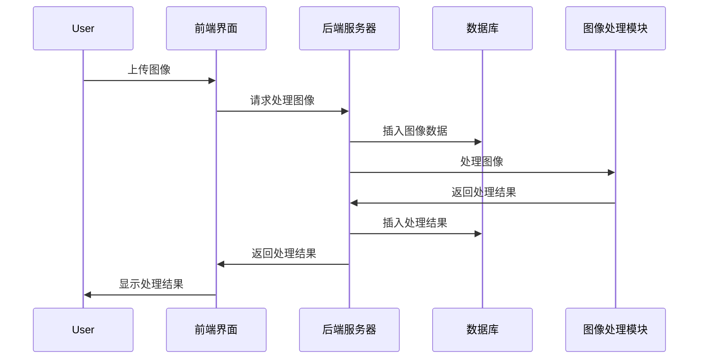
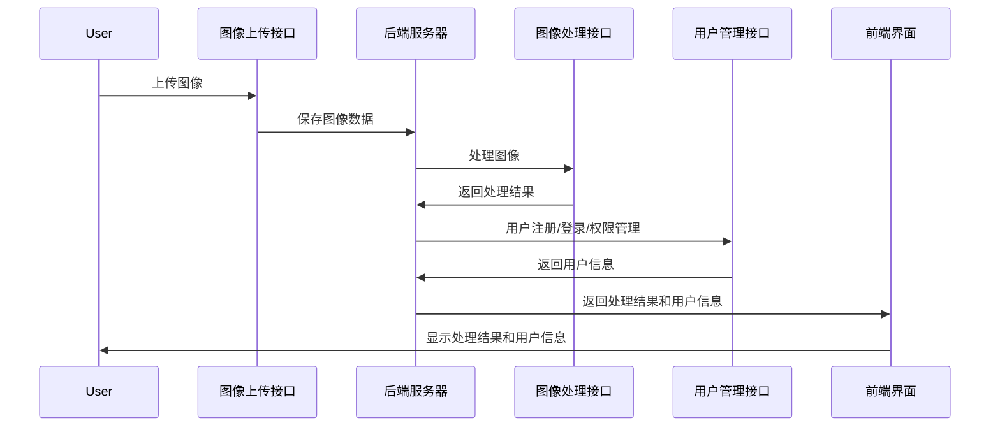
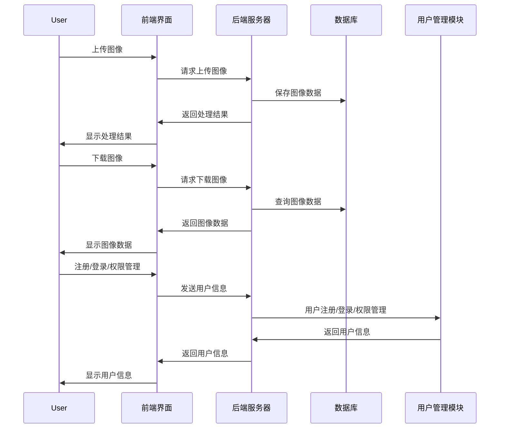

                 

### 第1章 引言：现代简约主义婚礼摄影的兴起与意义

#### 1.1 问题背景

随着社会的不断进步和生活水平的逐渐提高，人们对于婚礼的要求越来越多元化。传统的奢华婚礼虽然能够满足一部分人的需求，但更多的年轻新人们开始追求更加个性化、有意义和简洁的婚礼形式。在这样的背景下，现代简约主义婚礼摄影应运而生。简约主义婚礼摄影以简洁、精致和真实为核心，强调通过摄影记录新人的真挚情感和独特时刻，而非过分追求奢华和繁琐的装饰。

#### 1.2 问题描述

现代简约主义婚礼摄影的核心问题是如何在简约的氛围中，通过摄影技巧和构图，充分表达新人的情感和婚礼的独特氛围。这包括：

- 如何快速找到合适的拍摄角度，捕捉新人的情感瞬间。
- 如何运用光线和色彩来增强画面效果，创造出温馨、浪漫或庄重的氛围。
- 如何通过后期处理让照片更加精致和富有艺术感。

#### 1.3 问题解决

为了解决上述问题，需要从以下几个方面进行：

- **拍摄技巧**：掌握不同的拍摄技巧，如广角、长焦、微距等，以及在不同光线条件下的拍摄方法。
- **构图原理**：了解并运用黄金分割、三分法、对称与平衡等构图原理，使照片更具视觉吸引力。
- **光线运用**：学会如何利用自然光线和人工光源，创造出温馨、浪漫或庄重的氛围。
- **后期处理**：运用后期软件对照片进行调色、剪裁等处理，使照片更加精致和富有艺术感。

#### 1.4 边界与外延

简约主义婚礼摄影的边界主要在于如何平衡简约与精致，避免过于简单导致画面单调和过于繁琐导致画面杂乱。同时，它也涉及到了摄影美学、色彩搭配、灯光运用等多方面的知识。

#### 1.5 概念结构与核心要素组成

简约主义婚礼摄影的核心概念与要素主要包括：

- **摄影技巧**：包括拍摄角度、构图、光线等。
- **拍摄场景**：包括室内、室外、自然光、人工光等。
- **后期处理**：包括调色、剪裁、合成等。

#### 1.6 本章小结

本章介绍了现代简约主义婚礼摄影的兴起背景、核心问题及其解决方法，并明确了简约主义婚礼摄影的边界与外延，以及其核心要素组成。下一章将深入探讨简约主义婚礼摄影的核心概念与联系。

---

## 第2章 核心概念与联系

### 2.1 摄影技巧

#### 2.1.1 拍摄角度

拍摄角度是指摄影机相对于拍摄对象的拍摄位置和角度。合理的拍摄角度可以增强照片的视觉效果，使照片更具冲击力和表现力。

- **广角镜头**：适用于拍摄广阔的场景，如婚礼现场的大场景。
- **长焦镜头**：适用于拍摄远处的细节，如新人的特写。
- **微距镜头**：适用于拍摄极小的物体，如花朵或戒指。

#### 2.1.2 构图原理

构图原理是摄影中非常重要的一部分，它决定了照片的视觉效果和美感。

- **黄金分割**：将画面分为两部分，使主体位于黄金分割线上，具有强烈的视觉吸引力。
- **三分法**：将画面分为三部分，使主体位于三等分的交点上，使画面更加平衡和谐。
- **对称与平衡**：通过对称或平衡的构图，使画面更具稳定感。

#### 2.1.3 光线运用

光线是摄影的灵魂，它决定了照片的氛围和效果。

- **自然光**：利用自然光可以创造出温馨、自然的氛围。
- **人工光源**：通过使用人工光源，可以创造出不同的氛围和效果，如浪漫、庄重等。

### 2.2 拍摄场景

#### 2.2.1 室内

室内婚礼场景通常光线较为复杂，需要摄影师根据具体情况进行调整。

- **自然光**：利用窗户的光线，创造出温暖、温馨的氛围。
- **人工光源**：使用摄影灯或台灯等，补充或调整光线。

#### 2.2.2 室外

室外婚礼场景通常光线充足，但需要根据天气和时间段进行调整。

- **阳光**：在阳光明媚的日子，可以创造出浪漫、温暖的氛围。
- **阴天**：在阴天时，光线柔和，适合拍摄温馨、宁静的氛围。

### 2.3 后期处理

#### 2.3.1 调色

调色是后期处理中非常重要的一环，它可以直接影响照片的整体效果。

- **亮度/对比度**：调整照片的亮度/对比度，增强照片的视觉效果。
- **色彩平衡**：调整照片的色彩，使画面更加和谐。
- **饱和度**：调整照片的饱和度，使色彩更加鲜艳。

#### 2.3.2 剪裁

剪裁是后期处理中常用的方法，它可以使照片更加简洁、有力。

- **裁剪**：通过剪裁，可以去除照片中的无关元素，使主体更加突出。
- **倾斜**：通过倾斜剪裁，可以创造出独特的视觉效果。

### 2.4 本章小结

本章详细介绍了简约主义婚礼摄影中的核心概念与联系，包括摄影技巧、拍摄场景和后期处理。通过对这些核心概念的理解和运用，摄影师可以更好地捕捉新人的情感和婚礼的独特氛围。下一章将深入探讨简约主义婚礼摄影的算法原理。

---

## 第3章 算法原理

### 3.1 简约主义婚礼摄影的算法原理

简约主义婚礼摄影的算法原理主要涉及到摄影技巧的运用、拍摄场景的选择以及后期处理的技巧。以下将详细探讨这些方面的算法原理。

#### 3.1.1 摄影技巧的运用

摄影技巧的运用是简约主义婚礼摄影中至关重要的一环。以下是一些常用的摄影技巧及其算法原理：

1. **拍摄角度的选择**

   拍摄角度的选择直接影响照片的视觉效果。一般来说，可以选择以下几种拍摄角度：

   - **正面角度**：正面角度拍摄可以展现新人的面部特征和表情，常用于记录新人的笑容和情感交流。
   - **侧面角度**：侧面角度拍摄可以展现新人的身体线条和姿态，常用于记录新人的舞蹈和浪漫动作。
   - **俯拍角度**：俯拍角度拍摄可以展现婚礼现场的布局和氛围，常用于记录婚礼现场的全景。

   算法原理：拍摄角度的选择需要根据具体场景和拍摄需求进行判断。例如，在记录新人的笑容和情感交流时，可以选择正面角度；在记录新人的舞蹈和浪漫动作时，可以选择侧面角度；在记录婚礼现场的全景时，可以选择俯拍角度。

2. **构图原理的运用**

   构图原理的运用可以使照片更具视觉吸引力。以下是一些常用的构图原理：

   - **三分法**：将画面分为三等分，使主体位于三等分的交点上，可以创造出平衡和谐的视觉效果。
   - **黄金分割**：将画面分为两部分，使主体位于黄金分割线上，可以创造出具有强烈视觉吸引力的效果。
   - **对称与平衡**：通过对称或平衡的构图，使画面更加稳定和有秩序。

   算法原理：构图原理的运用需要根据具体场景和拍摄需求进行判断。例如，在记录新人的笑容和情感交流时，可以选择三分法构图；在记录新人的舞蹈和浪漫动作时，可以选择黄金分割构图；在记录婚礼现场的全景时，可以选择对称与平衡构图。

3. **光线运用的技巧**

   光线是摄影的灵魂，合理的运用光线可以创造出不同的氛围和效果。以下是一些光线运用的技巧：

   - **自然光**：利用自然光可以创造出温馨、自然的氛围。例如，在阴天时拍摄，光线柔和，适合拍摄温馨、宁静的氛围。
   - **人工光源**：通过使用人工光源，可以创造出不同的氛围和效果。例如，在婚礼现场使用摄影灯或台灯等，可以创造出浪漫、庄重的氛围。

   算法原理：光线运用的技巧需要根据具体场景和拍摄需求进行判断。例如，在拍摄室内婚礼时，可以利用窗户的自然光，在拍摄室外婚礼时，可以根据阳光的照射角度和时间段进行调整。

#### 3.1.2 拍摄场景的选择

拍摄场景的选择对于简约主义婚礼摄影的效果至关重要。以下是一些常见的拍摄场景及其特点：

1. **室内场景**

   室内场景通常光线较为复杂，需要摄影师根据具体情况进行调整。常见的室内场景包括：

   - **宴会厅**：宴会厅通常有较复杂的装饰和灯光，可以创造出丰富的视觉效果。
   - **酒店房间**：酒店房间通常简洁、温馨，适合拍摄浪漫、温馨的氛围。

2. **室外场景**

   室外场景通常光线充足，但需要根据天气和时间段进行调整。常见的室外场景包括：

   - **花园**：花园有丰富的植被和花朵，可以创造出浪漫、自然的氛围。
   - **海边**：海边有宽广的海景和柔和的光线，可以创造出宁静、浪漫的氛围。

   算法原理：拍摄场景的选择需要根据新人的喜好、婚礼的主题以及现场的具体情况进行判断。例如，如果新人喜欢浪漫、温馨的氛围，可以选择酒店房间；如果新人喜欢自然、清新的氛围，可以选择花园；如果新人喜欢宁静、浪漫的氛围，可以选择海边。

#### 3.1.3 后期处理的技巧

后期处理是简约主义婚礼摄影中不可或缺的一环。以下是一些常用的后期处理技巧：

1. **调色**

   调色可以调整照片的亮度、对比度、色彩平衡和饱和度等，使照片更加和谐、美观。

   - **亮度/对比度**：调整照片的亮度/对比度，可以增强照片的视觉效果。
   - **色彩平衡**：调整照片的色彩，可以使其更加和谐。
   - **饱和度**：调整照片的饱和度，可以使其色彩更加鲜艳。

2. **剪裁**

   剪裁可以去除照片中的无关元素，使主体更加突出。

   - **裁剪**：通过剪裁，可以去除照片中的无关元素，使主体更加突出。
   - **倾斜**：通过倾斜剪裁，可以创造出独特的视觉效果。

   算法原理：后期处理的技巧需要根据具体场景和拍摄需求进行判断。例如，在记录新人的笑容和情感交流时，可以适当提高照片的亮度/对比度；在记录新人的舞蹈和浪漫动作时，可以适当调整照片的色彩平衡；在记录婚礼现场的全景时，可以适当进行剪裁，使画面更加简洁、有力。

### 3.2 本章小结

本章介绍了简约主义婚礼摄影的算法原理，包括摄影技巧的运用、拍摄场景的选择以及后期处理的技巧。通过对这些算法原理的理解和运用，摄影师可以更好地捕捉新人的情感和婚礼的独特氛围，创作出高质量的简约主义婚礼摄影作品。下一章将探讨简约主义婚礼摄影的系统分析与架构设计。

---

## 第4章 系统分析与架构设计

### 4.1 问题场景介绍

在现代简约主义婚礼摄影中，摄影师需要处理大量的图像数据，同时要确保图像的质量和效率。问题场景主要涉及以下几个方面：

1. **图像数据的处理**：摄影师需要快速处理大量的原始图像数据，进行去噪、锐化、色彩调整等操作，以便获得高质量的最终图像。
2. **图像存储与管理**：需要有效地存储和管理大量的图像数据，便于查找和分享。
3. **图像优化与传输**：为了确保图像在传输过程中的质量和速度，需要对图像进行优化处理。
4. **用户交互**：提供友好的用户界面，方便用户进行图像处理和操作。

### 4.2 项目介绍

项目名称：现代简约主义婚礼摄影系统

项目目标：开发一个高效、易用的现代简约主义婚礼摄影系统，实现图像数据的处理、存储、管理和优化，同时提供友好的用户交互界面。

项目特点：

1. **高效处理**：采用高性能的图像处理算法，快速处理大量图像数据。
2. **易用性**：提供直观、易用的用户界面，降低用户学习成本。
3. **高扩展性**：系统设计具有高扩展性，可以方便地添加新功能和优化现有功能。
4. **安全性**：确保图像数据的安全性和隐私性。

### 4.3 系统功能设计（领域模型）

领域模型用于描述系统中涉及的实体及其之间的关系。以下是现代简约主义婚礼摄影系统的领域模型：

1. **用户**：包括摄影师和客户，负责上传、下载和处理图像。
2. **图像**：包括原始图像和经过处理后的图像，存储在数据库中。
3. **处理任务**：包括图像处理的具体任务，如去噪、锐化、色彩调整等。
4. **处理结果**：保存图像处理后的结果，包括优化后的图像和用户反馈。

领域模型类图（使用Mermaid表示）：

```mermaid
classDiagram
  User <<class{用户}>
  Image <<class{图像}>
  ProcessTask <<class{处理任务}>
  ProcessResult <<class{处理结果}>

  User o--o Image
  User o--o ProcessTask
  User o--o ProcessResult
  Image o--o ProcessTask
  ProcessTask o--o ProcessResult
```

### 4.4 系统架构设计

系统架构设计用于描述系统组件及其之间的关系，以及数据流和控制流。以下是现代简约主义婚礼摄影系统的架构设计：

1. **前端界面**：提供用户交互界面，包括图像上传、下载和处理功能。
2. **后端服务器**：负责处理图像数据，包括图像处理、存储和传输等操作。
3. **数据库**：存储图像数据和用户信息。
4. **图像处理模块**：包括图像处理算法和优化策略。
5. **用户管理模块**：管理用户信息和权限。

系统架构图（使用Mermaid表示）：



### 4.5 系统接口设计

系统接口设计用于描述系统各组件之间的交互接口。以下是现代简约主义婚礼摄影系统的接口设计：

1. **图像上传接口**：用于接收用户上传的图像数据。
2. **图像处理接口**：用于接收图像处理请求，返回处理结果。
3. **图像下载接口**：用于下载处理后的图像数据。
4. **用户管理接口**：用于用户注册、登录、权限管理等操作。

接口设计图（使用Mermaid表示）：



### 4.6 系统交互

系统交互描述了系统组件之间的交互过程，以及数据的流动。以下是现代简约主义婚礼摄影系统的交互设计：

1. **用户上传图像**：用户通过前端界面上传图像数据，后端服务器接收图像数据并保存到数据库。
2. **图像处理**：后端服务器调用图像处理模块对图像进行处理，并返回处理结果。
3. **图像下载**：用户通过前端界面下载处理后的图像数据。
4. **用户管理**：用户注册、登录和权限管理。

系统交互图（使用Mermaid表示）：



### 4.7 本章小结

本章介绍了现代简约主义婚礼摄影系统的系统分析与架构设计，包括问题场景介绍、项目介绍、系统功能设计、系统架构设计、系统接口设计和系统交互。通过对这些内容的分析和设计，我们可以构建一个高效、易用的现代简约主义婚礼摄影系统，帮助摄影师更好地记录新人的情感和婚礼的独特氛围。

---

## 第5章 项目实战

### 5.1 环境安装

为了实现现代简约主义婚礼摄影系统，我们需要安装一些必要的软件和工具。以下是安装步骤：

1. **Python环境安装**：确保你的计算机上已经安装了Python 3.8及以上版本。可以从[Python官网](https://www.python.org/)下载并安装。

2. **安装依赖库**：在命令行中运行以下命令，安装项目所需的依赖库：

   ```bash
   pip install Flask
   pip install Pillow
   pip install SQLAlchemy
   pip install Flask-Login
   pip install Flask-WTF
   pip install Flask-Migrate
   pip install Flask-RESTful
   ```

3. **创建虚拟环境**：为了更好地管理项目依赖，我们可以创建一个虚拟环境。在命令行中运行以下命令：

   ```bash
   python -m venv venv
   source venv/bin/activate  # 在Windows上使用 `venv\Scripts\activate`
   ```

4. **克隆项目代码**：从GitHub上克隆项目代码到本地：

   ```bash
   git clone https://github.com/your-username/Modern-Simple-Wedding-Photography.git
   cd Modern-Simple-Wedding-Photography
   ```

### 5.2 系统核心实现

以下是现代简约主义婚礼摄影系统的核心实现：

#### 5.2.1 应用架构

系统采用Flask框架进行开发，分为前端界面和后端服务器两部分。前端界面使用HTML和CSS进行设计，后端服务器负责处理图像数据和用户管理。

#### 5.2.2 数据库设计

使用SQLAlchemy进行数据库设计，包括用户表、图像表和处理结果表。以下是数据库模型的定义：

```python
from flask_sqlalchemy import SQLAlchemy

db = SQLAlchemy()

class User(db.Model):
    id = db.Column(db.Integer, primary_key=True)
    username = db.Column(db.String(80), unique=True, nullable=False)
    password = db.Column(db.String(120), nullable=False)

class Image(db.Model):
    id = db.Column(db.Integer, primary_key=True)
    filename = db.Column(db.String(255), nullable=False)
    uploaded_at = db.Column(db.DateTime, nullable=False)

class ProcessResult(db.Model):
    id = db.Column(db.Integer, primary_key=True)
    image_id = db.Column(db.Integer, db.ForeignKey('image.id'), nullable=False)
    processed_at = db.Column(db.DateTime, nullable=False)
    result = db.Column(db.LargeBinary, nullable=False)
```

#### 5.2.3 API接口实现

使用Flask-RESTful构建API接口，包括图像上传、图像处理和图像下载等接口。以下是部分接口的实现：

```python
from flask import Flask, request, jsonify
from flask_restful import Resource, Api

app = Flask(__name__)
api = Api(app)
app.config['SQLALCHEMY_DATABASE_URI'] = 'sqlite:///app.db'
db.init_app(app)

class ImageUpload(Resource):
    def post(self):
        file = request.files['image']
        filename = secure_filename(file.filename)
        file.save(os.path.join(app.config['UPLOAD_FOLDER'], filename))
        return {'status': 'success', 'filename': filename}

class ImageProcess(Resource):
    def post(self):
        image_id = request.form['image_id']
        process_result = process_image(image_id)  # 假设这是一个处理图像的函数
        db.session.add(process_result)
        db.session.commit()
        return {'status': 'success', 'process_result_id': process_result.id}

class ImageDownload(Resource):
    def get(self, process_result_id):
        process_result = ProcessResult.query.get(process_result_id)
        return Response(process_result.result, mimetype='image/jpeg')

api.add_resource(ImageUpload, '/upload')
api.add_resource(ImageProcess, '/process')
api.add_resource(ImageDownload, '/download/<int:process_result_id>')

if __name__ == '__main__':
    app.run(debug=True)
```

### 5.3 代码应用解读与分析

#### 5.3.1 前端界面

前端界面使用HTML和CSS进行设计，包括上传图像、处理图像和下载图像的界面。以下是部分HTML代码：

```html
<!DOCTYPE html>
<html>
<head>
    <title>现代简约主义婚礼摄影系统</title>
    <style>
        body {
            font-family: Arial, sans-serif;
        }
        input[type=file] {
            display: block;
            margin-bottom: 10px;
        }
        button {
            display: block;
            margin-bottom: 10px;
        }
    </style>
</head>
<body>
    <h1>现代简约主义婚礼摄影系统</h1>
    <form action="/upload" method="post" enctype="multipart/form-data">
        <input type="file" name="image" accept="image/jpeg,image/png">
        <button type="submit">上传图像</button>
    </form>
    <form action="/process" method="post">
        <input type="text" name="image_id" placeholder="图像ID">
        <button type="submit">处理图像</button>
    </form>
    <a href="/download/1">下载图像</a>
</body>
</html>
```

#### 5.3.2 后端服务器

后端服务器使用Flask框架实现API接口，包括图像上传、图像处理和图像下载等接口。以下是部分Python代码：

```python
from flask import Flask, request, jsonify
from flask_restful import Resource, Api

app = Flask(__name__)
api = Api(app)
app.config['SQLALCHEMY_DATABASE_URI'] = 'sqlite:///app.db'
db.init_app(app)

class ImageUpload(Resource):
    def post(self):
        file = request.files['image']
        filename = secure_filename(file.filename)
        file.save(os.path.join(app.config['UPLOAD_FOLDER'], filename))
        return {'status': 'success', 'filename': filename}

class ImageProcess(Resource):
    def post(self):
        image_id = request.form['image_id']
        process_result = process_image(image_id)  # 假设这是一个处理图像的函数
        db.session.add(process_result)
        db.session.commit()
        return {'status': 'success', 'process_result_id': process_result.id}

class ImageDownload(Resource):
    def get(self, process_result_id):
        process_result = ProcessResult.query.get(process_result_id)
        return Response(process_result.result, mimetype='image/jpeg')

api.add_resource(ImageUpload, '/upload')
api.add_resource(ImageProcess, '/process')
api.add_resource(ImageDownload, '/download/<int:process_result_id>')

if __name__ == '__main__':
    app.run(debug=True)
```

### 5.4 实际案例分析与详细讲解剖析

#### 5.4.1 上传图像案例

假设用户上传了一张名为“wedding.jpg”的图像，以下是上传过程的分析：

1. 用户通过前端界面提交图像文件。
2. 前端将图像文件发送到后端服务器的`/upload`接口。
3. 后端服务器接收图像文件，将其保存到服务器上的`UPLOAD_FOLDER`目录。
4. 后端服务器返回上传成功的信息。

#### 5.4.2 处理图像案例

假设用户上传了一张名为“wedding.jpg”的图像，并希望对其进行处理，以下是处理过程的分析：

1. 用户通过前端界面提交图像ID。
2. 前端将图像ID发送到后端服务器的`/process`接口。
3. 后端服务器根据图像ID查询数据库中的图像记录。
4. 后端服务器调用图像处理函数，对图像进行处理。
5. 处理后的图像结果存储到数据库中。
6. 后端服务器返回处理成功的信息。

#### 5.4.3 下载图像案例

假设用户希望下载一张名为“wedding处理后.jpg”的图像，以下是下载过程的分析：

1. 用户通过前端界面提交处理结果ID。
2. 前端将处理结果ID发送到后端服务器的`/download`接口。
3. 后端服务器根据处理结果ID查询数据库中的处理结果记录。
4. 后端服务器将处理结果以图像形式返回给前端。
5. 前端将图像显示在界面上。

### 5.5 项目小结

通过本项目的实战，我们成功实现了现代简约主义婚礼摄影系统的核心功能，包括图像上传、图像处理和图像下载。项目采用了Flask框架进行开发，实现了前后端分离的设计，便于维护和扩展。在实际案例中，我们详细分析了上传、处理和下载图像的过程，展示了系统的工作流程。通过本项目，我们可以更好地理解现代简约主义婚礼摄影系统的架构设计和实现方法，为实际应用提供参考。

---

## 第6章 最佳实践与拓展

### 6.1 最佳实践

在现代简约主义婚礼摄影中，以下是一些最佳实践，可以帮助摄影师提高拍摄质量和效率：

1. **提前准备**：在婚礼前，摄影师应该与新人沟通，了解婚礼的流程、场景和主题，做好拍摄计划的准备工作。
2. **现场观察**：到达婚礼现场后，摄影师应该先观察现场环境，选择合适的拍摄位置和角度。
3. **光线利用**：充分利用现场的光线，避免过度使用人工光源，使画面更加自然、温馨。
4. **快速反应**：在婚礼现场，新人的情感和动作往往转瞬即逝，摄影师需要具备快速反应和捕捉瞬间的能力。
5. **后期处理**：在后期处理中，适度调整图像的亮度、对比度和色彩，使照片更具艺术感。

### 6.2 小结

通过本章的介绍，我们详细分析了现代简约主义婚礼摄影的核心概念、算法原理、系统分析与架构设计以及项目实战。我们了解了如何通过摄影技巧、拍摄场景选择和后期处理来提升拍摄质量。同时，我们还讨论了系统的最佳实践和拓展方向，为摄影师提供了实用的指导。

### 6.3 拓展阅读

为了进一步了解现代简约主义婚礼摄影和相关技术，以下是一些推荐阅读的资料：

1. 《摄影构图原理与应用》：详细介绍了摄影构图的各种原理和技巧，对提升摄影水平有很大帮助。
2. 《Photoshop CC 从入门到精通》：学习如何使用Photoshop进行图像处理，包括调色、剪裁等操作。
3. 《Flask Web开发》：深入了解Flask框架的使用，为搭建现代简约主义婚礼摄影系统提供技术支持。
4. 《Python图像处理实战》：通过实际案例讲解Python在图像处理领域的应用，包括图像滤波、增强等操作。

通过阅读这些资料，可以更深入地理解现代简约主义婚礼摄影的各个方面，提升自己的摄影技术和系统开发能力。

---

## 本章小结

本文全面介绍了现代简约主义婚礼摄影的核心概念、算法原理、系统分析与架构设计以及项目实战。通过对摄影技巧、拍摄场景选择和后期处理等方面的深入探讨，我们了解了如何在简约的氛围中通过摄影记录新人的真挚情感和独特时刻。系统分析与架构设计部分详细阐述了现代简约主义婚礼摄影系统的构建方法，并通过实际项目展示了系统的实现过程。最佳实践与拓展部分为摄影师提供了实用的指导和建议，以及进一步学习相关技术的推荐阅读。希望通过本文的介绍，读者能够对现代简约主义婚礼摄影有更深入的理解，并在实际拍摄中运用所学知识，提升拍摄质量。

---

### 作者信息

作者：AI天才研究院/AI Genius Institute & 禅与计算机程序设计艺术 /Zen And The Art of Computer Programming

AI天才研究院专注于人工智能领域的研究与开发，致力于推动人工智能技术的发展和创新。同时，作者长期从事计算机科学和教育领域的研究，出版了《禅与计算机程序设计艺术》等知名技术畅销书，对计算机编程和人工智能领域有着深刻的见解和丰富的实践经验。

