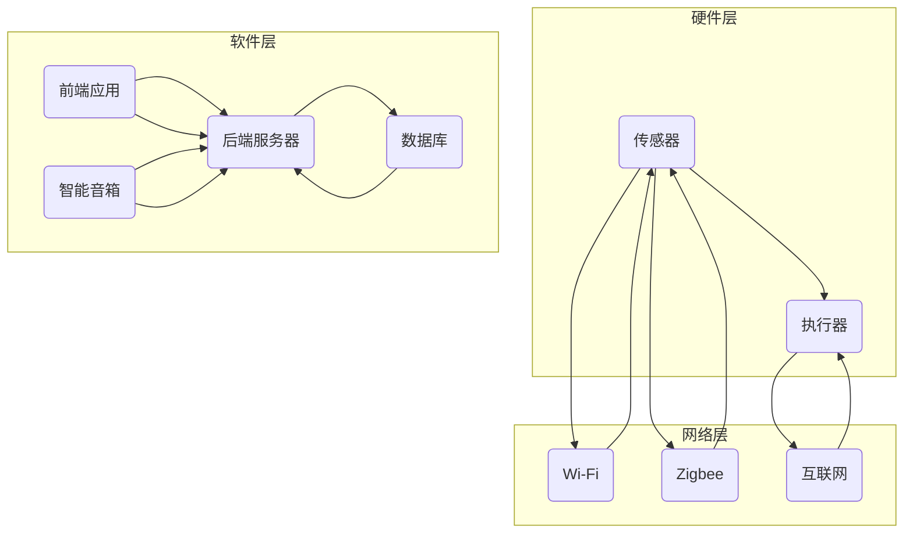
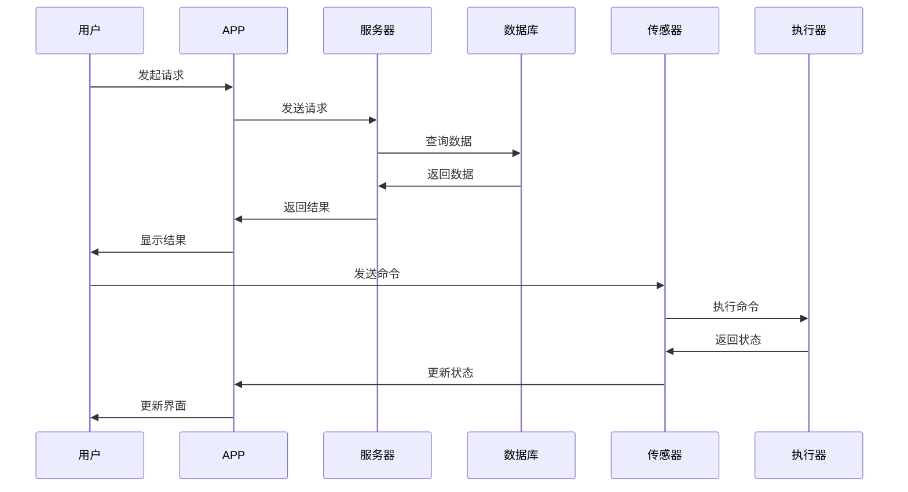

                 

### 文章标题

# 现代简约主义室内设计工作坊：极简生活空间的创造艺术

### 关键词

- 现代简约主义
- 室内设计
- 极简生活空间
- 空间规划
- 色彩与材料选择
- 照明设计

### 摘要

本文深入探讨现代简约主义室内设计的理念与实践，旨在通过系统化的工作坊形式，帮助读者掌握极简生活空间的创造艺术。文章首先介绍了简约主义的发展背景和核心原则，随后详细解析了空间规划、色彩与材料选择、照明设计等关键环节。通过案例分析、实战指导与最佳实践分享，读者将能够全面理解并掌握简约主义室内设计的精髓，从而打造出既实用又美观的极简生活空间。

## 引言：现代简约主义室内设计概述

### 1.1 简约主义的发展背景

简约主义（Minimalism）起源于20世纪中叶的现代艺术和建筑设计领域。最初，它是对复杂、装饰过剩风格的反动，强调“少即是多”的设计理念。随着时间推移，简约主义逐渐渗透到室内设计领域，并成为现代家居设计的主流趋势。

在现代快节奏的生活中，人们渴望简单、高效的生活方式，这促使简约主义在室内设计领域得以广泛应用。简约主义不仅强调物质层面的极简，更追求精神层面的宁静与舒适。通过去除多余的装饰和物品，简约主义室内设计营造出一个简洁、干净的空间，使人们能够更好地专注于生活和思考。

### 1.2 简约主义的核心原则

简约主义的核心原则可以概括为以下几点：

1. **“少即是多”**：通过减少非必要的元素，使空间显得更加开阔和舒适。
2. **功能性优先**：设计应注重物品的实际用途，避免装饰性元素过多。
3. **空间流动性**：通过合理布局，确保空间流畅，便于人们在其中自由活动。
4. **色彩与材料的统一**：选择简洁、和谐的色彩和材料，以增强空间的整体感。
5. **自然光线**：充分利用自然光线，营造出明亮、通透的空间氛围。

### 1.3 简约主义的影响

简约主义在室内设计领域的影响深远，主要体现在以下几个方面：

1. **生活方式的转变**：简约主义提倡极简生活方式，减少物质负担，提高生活质量。
2. **设计理念的创新**：简约主义促使设计师不断探索新的设计理念和方法，推动室内设计的发展。
3. **市场需求的增长**：随着人们生活水平的提高，对高品质、极简主义的室内设计需求不断增加。
4. **可持续性**：简约主义强调减少浪费，提高资源的利用效率，符合可持续发展的理念。

### 1.4 实施简约主义的挑战与机遇

尽管简约主义在设计领域具有广泛的应用前景，但在实际实施过程中仍面临一些挑战：

1. **个人喜好差异**：每个人的审美和生活方式不同，如何在统一的设计原则下兼顾个人偏好，是一个难点。
2. **材料选择**：简约主义强调材料的自然性和简约性，但在市场上找到符合这一要求的材料可能具有一定难度。
3. **成本控制**：简约主义室内设计可能涉及较高的材料成本和工艺要求，如何在不超支的前提下实现设计效果，是一个挑战。

然而，这些挑战同时也带来了机遇：

1. **创新机会**：简约主义为设计师提供了创新的灵感，通过新的设计理念和材料选择，创造出独特的室内空间。
2. **市场需求**：简约主义符合现代人的生活方式需求，市场前景广阔。
3. **环保理念**：简约主义倡导减少浪费，符合可持续发展的环保理念，有助于推动绿色室内设计的发展。

通过以上分析，我们可以看到，简约主义不仅是室内设计的一种趋势，更是一种生活态度和价值观的体现。在接下来的章节中，我们将深入探讨简约主义的核心概念和具体实践方法，帮助读者更好地理解和应用这一设计理念。

## 核心概念与联系

### 2.1 极简主义与简约主义的定义

极简主义（Minimalism）和简约主义（Simplicity）是现代设计中两个重要的概念。虽然它们经常被交替使用，但二者在定义和应用上有所不同。

**极简主义**，是一种艺术和设计风格，强调通过减少不必要的元素，使设计更加简洁、纯粹。它追求的是通过“少即是多”的原则，达到更高层次的审美和功能效果。

**简约主义**，则更多地关注设计过程和最终效果，强调通过简洁、直观的形式和材料，创造出高效、舒适的生活空间。简约主义不仅仅是关于减少元素，更是关于如何创造性地运用这些元素，以达到最佳效果。

尽管有区别，极简主义和简约主义在核心上有很多共同点：

- **强调简洁**：两者都追求简洁、干净的设计风格，减少装饰和多余的元素。
- **注重功能**：功能优先是两者的基本原则，设计应该满足实际需求，而不是仅仅为了美观。
- **减少视觉负担**：极简主义和简约主义都致力于减少视觉负担，通过简洁的形式和材料，使空间显得更加开阔和舒适。

### 2.2 空间与光线

在简约主义设计中，空间和光线是两个至关重要的因素。

**空间**：简约主义强调空间的流动性和开放性。通过合理的空间布局，可以使空间显得更加宽敞、通透。例如，开放式布局能够打破传统的隔断，使不同功能区域相互交融，增强空间的整体感。

**光线**：自然光线在简约主义设计中起着至关重要的作用。自然光不仅能照亮空间，还能营造出温馨、舒适的氛围。在设计中，可以通过窗户、玻璃墙等元素引入自然光，同时注意使用柔和的灯光来平衡人工光与自然光的关系。

### 2.3 材料与色彩

简约主义设计在材料选择和色彩搭配上也具有一定的特点。

**材料**：简约主义倾向于使用自然、环保的材料，如木材、石材、棉麻等。这些材料不仅具有良好的质感，还能传递出自然的气息，与简约主义的设计理念相契合。

**色彩**：简约主义设计中，色彩的选择通常以中性色调为主，如白色、灰色、米色等。这些色彩能够创造出简洁、和谐的空间氛围，同时也能够为后续的装饰和家具选择提供更大的自由度。

### 2.4 对比与和谐

在简约主义设计中，对比与和谐是两种重要的美学原则。

**对比**：通过对比，可以增强设计的视觉冲击力。在简约主义设计中，可以通过对比不同的材料、色彩或形状，创造出独特的视觉效果。例如，使用深色地板搭配浅色墙面，或者将现代家具与传统元素结合，都能产生强烈的视觉对比。

**和谐**：和谐则强调各个元素之间的协调与统一。通过合理的布局和色彩搭配，使空间中的各个部分相互融合，形成一个整体。简约主义设计中，和谐是实现空间整体感的关键。

### 2.5 案例分析

为了更好地理解简约主义设计的核心概念和联系，我们可以通过一些实际案例来进行分析。

**案例 1**：一个现代公寓的客厅设计。设计师通过使用简约的家具和简洁的线条，创造出宽敞、舒适的客厅空间。墙壁涂上浅灰色，地板选择深色木质材料，形成鲜明的对比。通过自然光线的引入，使整个空间显得更加明亮和通透。

**案例 2**：一个开放式厨房和餐厅的设计。设计师采用开放式布局，将厨房和餐厅连为一体，增强空间的流动性和整体感。厨房台面和餐桌采用相同的材质和颜色，营造出和谐统一的空间氛围。

通过以上案例分析，我们可以看到，简约主义设计不仅仅是关于减少元素，更是一种通过对空间、材料、色彩和对比与和谐等元素的巧妙运用，创造出既实用又美观的室内空间的艺术。

## 空间规划与布局

### 3.1 空间规划在室内设计中的重要性

空间规划是室内设计的基础和核心，它决定了整个空间的功能性和美观度。合理的空间规划不仅能够提高空间的利用率，还能提升居住的舒适度和便捷性。在简约主义设计中，空间规划尤为重要，因为它直接关系到设计的简洁性和整体性。

空间规划主要包括以下几个方面：

1. **功能性**：根据居住者的需求，合理划分功能区域，如客厅、卧室、厨房、卫生间等，确保每个区域都能满足其特定的功能需求。
2. **流动性**：通过合理的布局，确保空间流畅，便于人们在其中自由活动。在简约主义设计中，开放式布局和流动空间被广泛应用。
3. **隐私性**：在规划空间时，要考虑到居住者的隐私需求，确保各个功能区域之间的视线遮挡和隔音效果。
4. **视觉效果**：空间规划不仅要满足功能需求，还要考虑到视觉效果。通过合理的布局和设计，使空间显得更加宽敞、明亮和舒适。

### 3.2 基本原则

在空间规划中，以下基本原则有助于实现简约主义设计：

1. **“少即是多”**：通过减少非必要的元素，使空间显得更加开阔和简洁。这包括去除多余的家具和装饰品，简化线条和形状等。
2. **功能性优先**：设计应注重物品的实际用途，避免为了美观而牺牲功能。例如，选择多功能家具，如沙发床或组合柜，以节省空间。
3. **空间流动性**：通过合理布局，确保空间流畅，便于人们在其中自由活动。例如，采用开放式布局，打破传统隔断，使不同功能区域相互交融。
4. **色彩与材料的统一**：选择简洁、和谐的色彩和材料，以增强空间的整体感。例如，使用中性色调和天然材料，营造出简洁、自然的空间氛围。
5. **自然光线**：充分利用自然光线，通过窗户、玻璃墙等元素引入自然光，同时使用柔和的人工灯光进行补充，创造出明亮、通透的空间。

### 3.3 案例研究：有效空间利用

为了更好地理解空间规划的基本原则，我们可以通过一些实际案例来进行分析。

**案例 1**：一个现代公寓的客厅设计。设计师通过采用开放式布局，将客厅与餐厅连为一体，使空间显得更加宽敞和通透。客厅中的沙发和茶几选择简洁的线条和简约的设计，墙壁和地板使用统一的浅灰色调，营造出简洁、和谐的空间氛围。

**案例 2**：一个两室户住宅的卧室设计。设计师在空间规划中注重隐私性，通过设置隔断和衣柜来分隔卧室和卫生间。同时，卧室中的床、衣柜和书桌等家具选择多功能设计，如床下面设有储物空间，衣柜上方设有书架，提高了空间利用率。

**案例 3**：一个别墅的地下室设计。设计师将地下室规划为一个娱乐空间，通过合理布局，将客厅、酒吧区和娱乐区分别设置，确保每个区域都能满足特定功能需求。同时，设计师通过使用大量自然光和简约的家具，使整个空间显得既实用又舒适。

通过以上案例研究，我们可以看到，合理的空间规划和布局在简约主义设计中至关重要。通过遵循“少即是多”的原则，注重功能性、流动性和视觉效果，设计师能够创造出既实用又美观的极简生活空间。

### 3.4 空间划分的灵活性与多功能性

在简约主义设计中，空间划分的灵活性和多功能性是实现高效空间利用的关键。通过巧妙的设计，可以在有限的空间中创造出多种功能，使空间既实用又富有变化。

**1. 开放式布局**：开放式布局是简约主义设计中常见的手法，通过去除传统隔断，将不同功能区域相互融合。例如，将客厅与餐厅、卧室与书房连为一体，使空间显得更加宽敞和通透。同时，开放式布局也便于家人之间的互动和交流。

**2. 多功能家具**：多功能家具是提高空间利用率的有效手段。例如，选择一款具有储物功能的沙发床，既可以作为日常休息的沙发，又可以在需要时迅速转换为卧室。同样，组合柜、可折叠桌等设计也能节省空间，提高空间利用率。

**3. 活动隔断**：通过使用活动隔断，如屏风、折叠门等，可以在需要时灵活分隔空间。例如，在家庭办公区，可以通过屏风将工作区域与休息区域分隔开，提高工作效率和私密性。同时，活动隔断也能根据需要随时调整，增加空间的灵活性。

**4. 垂直空间利用**：在简约主义设计中，垂直空间利用也是一个重要的方面。通过设计高挑的衣柜、书架或储物架，可以在不占用过多水平空间的情况下，增加储物空间。同时，利用楼梯下方或阳台等垂直空间，也能创造出额外的储物或娱乐区域。

通过以上方法，简约主义设计不仅能够实现空间的高效利用，还能增强空间的动态感和变化性，使居住者能够在不同的时间段和场合中享受到多样化的生活体验。

### 3.5 空间布局的实际应用

在简约主义室内设计中，实际应用空间布局的原则对于实现设计的最终效果至关重要。以下是一些具体的应用案例和技巧：

**1. 客厅布局**：客厅通常是家庭活动的中心区域，简约主义设计强调减少不必要的装饰和家具，以保持空间的宽敞和简洁。例如，可以选择一款简约的沙发和茶几，并利用大型落地窗引入自然光线。在色彩选择上，可以选择中性色调，如白色或灰色，以增强空间的整体感。

**2. 卧室布局**：卧室是休息和放松的空间，简约主义设计注重提供一个宁静、舒适的环境。可以选择一张简约的床和床头柜，并使用柔和的灯光来营造放松的氛围。同时，通过合理的衣柜和书桌设计，可以充分利用垂直空间，增加储物功能。

**3. 厨房布局**：厨房是家庭日常生活的重要场所，简约主义设计强调功能性和实用性。可以选择一款简约的橱柜，并通过内置的拉篮和抽屉来增加储物空间。此外，通过开放式布局，可以将厨房与餐厅结合，使空间显得更加宽敞和通透。

**4. 浴室布局**：浴室是家庭中湿度和温度变化较大的空间，简约主义设计注重功能性和安全性。可以选择一款简约的淋浴房和马桶，并通过防滑瓷砖和防水涂料来确保空间的耐用性和安全性。同时，通过合理的储物设计，如浴室柜和墙架，可以提高空间的利用率。

在实际应用中，设计师需要根据具体的空间条件和个人需求，灵活运用空间布局的原则，创造出既实用又美观的简约生活空间。以下是一个具体的实例分析：

**实例分析**：一个60平方米的两室一厅住宅。设计师首先考虑了空间的整体流动性，将客厅与餐厅采用开放式布局，去除传统隔断，使空间显得更加宽敞。客厅选择了一款简约的沙发和茶几，并通过大型落地窗引入自然光线，使整个空间明亮而舒适。

在卧室方面，设计师选择了简约的床和床头柜，同时利用墙角的衣柜设计，最大限度地利用垂直空间。卧室的墙壁涂上了柔和的米色涂料，营造出温馨的睡眠环境。

厨房和浴室的设计也遵循了简约主义的原则。厨房采用开放式布局，将操作台和餐桌结合，形成一个多功能空间。浴室选择了简约的淋浴房和马桶，并通过防滑瓷砖和防水涂料确保了空间的耐用性和安全性。

通过以上设计，这个60平方米的两室一厅住宅不仅实现了空间的高效利用，还营造出简洁、舒适的生活氛围。这充分展示了简约主义设计的实际应用效果和优势。

### 3.6 空间规划与室内设计的其他元素

空间规划不仅直接影响室内设计的视觉效果，还与照明、色彩和材料选择等其他设计元素密切相关。合理的空间规划能够提升这些元素的运用效果，从而实现整体设计的和谐与统一。

**1. 照明设计**：照明是空间氛围营造的重要手段。合理的空间规划能够确保自然光线和人工照明的有效结合。例如，通过开放式布局和透明隔断，可以充分利用自然光，同时使用嵌入式照明或吊灯补充人工光。此外，照明设计还应该考虑到不同功能区域的需求，如阅读、娱乐或工作区域，通过设置可调节的灯具来满足不同的照明需求。

**2. 色彩选择**：色彩在简约主义设计中起着关键作用。合理的空间规划有助于实现色彩的整体协调。例如，在开放式布局中，通过使用相同的色彩方案，可以将不同功能区域自然融合在一起。同时，空间规划还应考虑到色彩对空间大小和氛围的影响。例如，使用浅色调可以营造宽敞、明亮的氛围，而深色调则可以创造出更加温馨、私密的空间。

**3. 材料选择**：简约主义设计倾向于使用自然、简约的材料。合理的空间规划有助于材料的充分利用，并增强其视觉效果。例如，选择木质地板和墙面装饰，可以营造出温馨、自然的氛围。同时，通过空间规划，还可以确保材料的拼接和过渡自然，避免突兀的视觉效果。

通过综合运用空间规划、照明设计、色彩选择和材料选择，设计师能够创造出既实用又美观的极简生活空间。以下是一个具体的实例分析：

**实例分析**：一个现代公寓的客厅和餐厅设计。设计师通过开放式布局，将客厅和餐厅结合在一起，形成一个宽敞、明亮的空间。客厅采用白色墙面和木质地板，使整个空间显得简洁而温馨。通过大型窗户引入自然光，增强了空间的明亮度。在照明设计方面，设计师选择了嵌入式照明和吊灯的组合，既提供了充足的光线，又营造了舒适的氛围。

色彩方面，设计师选择了中性色调，如白色和灰色，使整个空间显得更加统一和谐。在材料选择上，设计师使用了天然石材的餐桌和木质地板，增强了空间的自然质感。

通过以上设计，这个现代公寓的客厅和餐厅不仅实现了空间的高效利用，还营造出简洁、舒适的生活氛围。这充分展示了空间规划与室内设计其他元素之间的密切关系和协同作用。

### 3.7 空间规划中的注意事项

在简约主义室内设计中，空间规划至关重要，但同时也需要注意一些细节和技巧，以确保设计的最终效果达到预期。以下是一些关键点：

**1. 考虑动线**：动线是指人们在空间中的活动路径。合理的动线设计能够提高空间的使用效率和舒适度。在空间规划时，要充分考虑家庭成员的活动习惯，避免动线交叉或干扰。例如，厨房和餐厅的布局应确保厨房操作区和餐桌区之间的流畅连接，避免在准备食物时频繁穿越其他区域。

**2. 充分利用储物空间**：储物空间是室内设计中的重要因素，尤其是在简约主义设计中，通过巧妙的储物设计，可以减少杂乱，保持空间的简洁。设计师应充分利用墙面、角落和垂直空间，设置储物柜、书架和悬挂式衣柜等，提高空间利用率。

**3. 考虑家具尺寸**：在选择家具时，不仅要考虑其功能，还要注意其与空间尺寸的协调。过大的家具会占用过多空间，而过小的家具则可能显得拥挤。设计师应根据空间大小和布局，选择适当尺寸的家具，确保空间的整体协调性。

**4. 留白**：留白是简约主义设计中的一个重要原则。通过适当留出空白区域，可以使空间显得更加宽敞和舒适。在空间规划时，应避免过度拥挤，留出足够的动线和视觉空间。

**5. 考虑通风和采光**：良好的通风和采光对于室内设计至关重要。在空间规划时，应确保窗户和门的位置合理，以充分利用自然光和通风。同时，可以通过室内植物和透明隔断等元素增加空间的通透性。

通过注意以上细节和技巧，设计师可以创造出既实用又美观的简约主义室内空间，满足居住者的功能需求和精神追求。

### 3.8 空间规划的案例分析

为了更好地理解空间规划的实际应用和效果，我们可以通过一些经典案例进行分析。

**案例 1**：一个现代公寓的客厅设计。在这个案例中，设计师采用开放式布局，将客厅与餐厅结合在一起，形成一个宽敞、明亮的空间。客厅的墙壁采用白色涂料，地板使用浅色木质材料，以增强空间的整体感。通过大型窗户引入自然光线，使整个空间显得更加明亮和舒适。客厅中的沙发和茶几选择简约的设计，以减少视觉负担。餐厅部分则采用同样的色彩和材料，确保两个空间之间的协调统一。

**案例 2**：一个别墅的地下室设计。这个别墅的地下室被规划为一个多功能娱乐空间，包括客厅、酒吧区和娱乐区。设计师通过合理的空间规划，确保每个区域都有独立的功能和特点。客厅部分采用开放式布局，设置了一个舒适的沙发区和电视墙，通过嵌入式的灯光设计，营造出温馨的氛围。酒吧区则设置了一个吧台和酒柜，确保储物功能的同时，也增加了空间的趣味性。娱乐区则包括了一个游戏室和一个小型健身区，通过合理的空间划分，使整个地下室既实用又丰富。

**案例 3**：一个现代住宅的卧室设计。在这个案例中，设计师注重空间的私密性和功能性。卧室的布局简洁，只设置了一张床和一个衣柜。为了增加空间的实用性，设计师在衣柜上方设计了书架，充分利用垂直空间。卧室的墙壁采用浅灰色涂料，地板使用暖色调的木质材料，营造出温馨、舒适的睡眠环境。通过合理的光线设计，确保卧室既有充足的自然光，又有柔和的人工照明。

通过以上案例分析，我们可以看到，合理的空间规划在简约主义设计中起到了关键作用。通过开放式布局、多功能家具和合理的色彩、材料选择，设计师能够创造出既实用又美观的极简生活空间，满足居住者的需求。

## 色彩与材料选择

### 4.1 色彩在室内设计中的角色

色彩在室内设计中扮演着至关重要的角色，它不仅能够影响空间氛围，还能影响人们的情绪和感受。在简约主义设计中，色彩的选择尤为关键，因为它直接关系到空间的整体感、和谐度以及视觉舒适度。

首先，色彩能够创造不同的空间氛围。暖色调如红色、黄色和橙色可以营造出温馨、热情的氛围，而冷色调如蓝色、绿色和紫色则可以带来宁静、冷静的感觉。通过合理运用色彩，设计师可以调节空间的光线和温度，使空间显得更加舒适和宜居。

其次，色彩能够影响人们的情绪和感受。不同的色彩会激发不同的情感反应。例如，红色常被用来增强空间的活力和热情，蓝色则有助于营造宁静和放松的氛围。在简约主义设计中，设计师通常会采用中性色调，如白色、灰色和米色，这些色彩不仅能创造出简洁、干净的空间氛围，还能为后续的装饰和家具选择提供更多的自由度。

### 4.2 选择适合的色彩方案

在简约主义室内设计中，选择适合的色彩方案是关键的一步。以下是一些建议：

**1. 中性色调**：中性色调是简约主义设计中的首选。白色、灰色和米色等中性色彩能够创造出简洁、和谐的空间氛围，同时也能够为其他装饰和家具的选择提供更多的灵活性。

**2. 暖色调**：暖色调可以增加空间的温馨感，但在使用时需要注意控制。例如，可以选择浅棕色、淡黄色等柔和的暖色调，以避免空间显得过于热烈。

**3. 冷色调**：冷色调有助于营造宁静、放松的氛围，适合用于卧室和书房等需要安静思考的空间。例如，淡蓝色、淡绿色等都是不错的选择。

**4. 色彩对比**：通过色彩对比可以增强空间的视觉冲击力。例如，将深色地板搭配浅色墙面，或者使用不同颜色的装饰品，都可以创造出鲜明的视觉效果。

**5. 色彩搭配**：在简约主义设计中，色彩搭配需要注重和谐与统一。可以通过使用相似色或互补色来搭配，确保空间的整体感。

### 4.3 材料选择的原则

除了色彩，材料的选择也是简约主义设计中的重要一环。以下是一些材料选择的原则：

**1. 自然材料**：简约主义强调自然和原始的美感，因此，自然材料如木材、石材和棉麻等是常用的选择。这些材料不仅具有良好的质感，还能传递出自然的气息。

**2. 简约设计**：在材料的选择上，简约的设计理念同样适用。选择那些线条简洁、形状简单、无过多装饰的材料，可以更好地符合简约主义的设计原则。

**3. 环保材料**：随着环保意识的提高，越来越多的设计师开始关注环保材料的使用。例如，竹材、再生木材和低VOC涂料等都是环保材料的选择。

**4. 耐用材料**：简约主义设计注重功能的实用性，因此，选择耐用材料尤为重要。例如，陶瓷、玻璃和不锈钢等材料不仅耐用，还具有美观的外观。

### 4.4 色彩与材料在实际应用中的配合

在实际应用中，色彩与材料的选择需要相互配合，以创造出既实用又美观的室内空间。以下是一些建议：

**1. 材料与色彩的整体协调**：在选择材料和色彩时，要确保它们能够整体协调，避免出现冲突。例如，如果墙壁是白色，地板可以选择浅色木材，以保持空间的一致性。

**2. 材料质感的对比**：通过对比不同材料的质感，可以增加空间的层次感和丰富性。例如，将光滑的石材地板与粗糙的木质墙面搭配，可以营造出独特的美感。

**3. 色彩与功能的结合**：在选择色彩时，要考虑其与功能区域的关系。例如，在厨房区域，可以选择较为鲜艳的色彩，以增加空间的活力和食欲感。

**4. 材料与光线的互动**：材料的反光性和透光性会影响空间的亮度和氛围。例如，透明玻璃材料可以增强空间的通透感，而深色木材则可以增加空间的沉稳感。

### 4.5 色彩与材料选择的案例分析

为了更好地理解色彩与材料选择在实际应用中的效果，我们可以通过一些实际案例进行分析。

**案例 1**：一个现代公寓的客厅设计。在这个案例中，设计师选择了中性色调的灰色和白色作为主色调，通过灰色墙面和白色地板的搭配，营造出简洁、和谐的空间氛围。为了增加空间的层次感，设计师在沙发背景墙上使用了一款深色木质装饰板，与地板形成对比。此外，设计师选择了简约的木质茶几和玻璃材质的咖啡桌，进一步增强了空间的自然质感。

**案例 2**：一个别墅的餐厅设计。在这个案例中，设计师选择了淡蓝色作为主色调，营造出宁静、舒适的用餐氛围。为了增加空间的温馨感，设计师在餐桌下方布置了暖色调的地毯，与墙壁和地板形成对比。同时，设计师选择了木质餐桌和餐椅，与空间的色彩和氛围相协调。为了增加储物功能，设计师在墙面设置了嵌入式储物柜，使得空间更加整洁有序。

通过以上案例分析，我们可以看到，合理的色彩与材料选择不仅能够创造出简洁、和谐的空间氛围，还能提高空间的功能性和实用性。这充分展示了简约主义设计在色彩与材料选择方面的独特魅力和实践价值。

### 4.6 色彩搭配与空间氛围的关系

在简约主义室内设计中，色彩搭配对于空间氛围的营造起着至关重要的作用。不同的色彩搭配可以创造出不同的氛围，从而影响居住者的情绪和感受。以下是一些常见的色彩搭配技巧和它们所营造的氛围：

**1. 中性色调搭配**：中性色调如白色、灰色和米色是简约主义设计的首选。它们能够营造出简洁、干净和宁静的空间氛围。这种搭配尤其适合卧室和书房等需要安静和放松的空间。

**2. 暖色调搭配**：暖色调如黄色、橙色和红色可以增加空间的活力和温馨感。这种搭配适合用于客厅、餐厅等公共空间，能够营造出热情、愉悦的氛围。

**3. 冷色调搭配**：冷色调如蓝色、绿色和紫色可以营造出宁静、冷静的空间氛围。这种搭配适合用于浴室、书房等需要安静和专注的空间。

**4. 对比色搭配**：对比色搭配如红色与绿色、黄色与紫色等，可以创造出鲜明的视觉效果，增加空间的视觉冲击力。这种搭配适合用于需要强调功能或装饰的空间，如厨房或儿童房。

**5. 类似色搭配**：类似色搭配如灰色与米色、蓝色与绿色等，可以营造出柔和、和谐的空间氛围。这种搭配适合用于整个住宅的空间，以保持一致性。

通过合理运用色彩搭配，设计师可以创造出既实用又美观的极简生活空间，满足居住者的功能需求和精神追求。

### 4.7 材料选择的重要性

材料选择在简约主义室内设计中同样至关重要，它们不仅影响空间的外观，还直接影响空间的触感和质感。以下是一些关于材料选择的重要性及其在实际应用中的考量：

**1. 材料的重要性**：
- **美观性**：材料的选择直接关系到空间的整体美观度。优质、自然的材料能够为空间带来独特的质感，增强视觉效果。
- **质感**：材料的触感和质感对居住体验有着直接影响。例如，光滑的石材、温暖的木质以及柔软的地毯，都能为空间带来不同的触感体验。
- **实用性**：材料的选择还应考虑其实用性，如耐磨损性、易清洁性和耐用性。这有助于确保空间在长期使用中的维护成本和便利性。

**2. 材料选择的标准**：
- **自然材料**：自然材料如木材、石材、棉麻等，是简约主义设计中的常用选择。它们通常具有良好的质感和环保属性，符合简约主义追求自然、简约的理念。
- **简约设计**：在选择材料时，应注重其设计的简洁性。简约设计能够确保材料在空间中的协调性，避免过多装饰和复杂图案，从而保持空间的简洁和整体感。
- **耐久性**：耐久性是材料选择的一个重要考量因素。高耐用性的材料如陶瓷、玻璃和不锈钢，不仅能延长空间的使用寿命，还能减少日常维护的负担。

**3. 材料在实际应用中的考量**：
- **色彩搭配**：材料的颜色应与空间的整体色彩方案相协调，避免出现色彩冲突。中性色调和自然色调是常用的选择，因为它们易于搭配。
- **质感对比**：通过对比不同材料的质感，可以增强空间的层次感和丰富性。例如，将光滑的石材与粗糙的木材搭配，可以创造出独特的空间体验。
- **功能性与美观性的平衡**：在选择材料时，应充分考虑其功能性和美观性的平衡。例如，在选择地板时，不仅要考虑其外观，还要考虑其耐磨性和易清洁性。

### 4.8 材料选择的实际案例

为了更好地理解材料选择的重要性，我们可以通过一些实际案例进行分析。

**案例 1**：一个现代公寓的客厅设计。在这个案例中，设计师选择了浅色木质地板，搭配灰色墙面和白色天花板，营造出简洁、自然的空间氛围。木质地板的温暖质感与灰色墙面的冷静感形成了完美的对比，增强了空间的层次感。此外，设计师在沙发上选择了舒适的棉麻材质，进一步提升了空间的舒适度。

**案例 2**：一个别墅的浴室设计。在这个案例中，设计师选择了白色大理石台面和墙面，搭配深色木质地板，创造出简洁、现代的浴室空间。白色大理石的高雅质感与深色木质的自然质感形成了鲜明的对比，使整个空间显得更加宽敞和舒适。同时，设计师在浴缸周围设置了玻璃隔断，增加了空间的通透感。

通过以上案例，我们可以看到，合理的材料选择不仅能够为空间带来独特的质感，还能提升空间的功能性和美观性。这充分展示了简约主义设计在材料选择方面的独特魅力和实践价值。

### 4.9 环保材料的选择

在当今环保意识日益增强的背景下，简约主义设计开始更加注重环保材料的使用。选择环保材料不仅有助于减少对环境的负面影响，还能为室内空间带来自然、健康的美感。

**1. 环保材料的优势**：
- **减少资源消耗**：环保材料通常来自可再生的资源，如竹材、再生木材和低VOC涂料等，有助于减少对自然资源的消耗。
- **减少污染**：环保材料的生产和使用过程中，通常不会产生有害物质，如甲醛和苯等，有助于减少室内污染，提高居住环境的健康水平。
- **延长使用寿命**：环保材料通常具有较高的耐用性和抗腐蚀性，能够延长室内空间的使用寿命，减少废弃物的产生。

**2. 常见环保材料**：
- **竹材**：竹材是一种快速生长的可持续资源，具有良好的质感和耐用性。在简约主义设计中，竹材常被用于地板、家具和装饰品。
- **再生木材**：再生木材是利用废旧木材进行再加工的材料，具有较高的环保价值。在室内设计中，再生木材常被用于地板、家具和装饰。
- **低VOC涂料**：低VOC涂料是一种不含或含有极低挥发性有机化合物的涂料，能够减少室内空气中的有害物质。

**3. 环保材料的选择标准**：
- **环保认证**：选择具有环保认证的材料，如FSC（森林管理委员会）认证和GREENGUARD（绿色守护）认证等，可以确保材料符合环保标准。
- **可持续性**：选择来自可持续资源的材料，如认证的可持续森林或有机农场，可以确保资源的可持续利用。
- **耐用性**：在环保材料的选择中，耐用性同样重要。选择那些既环保又耐用的材料，可以延长室内空间的使用寿命，减少废弃物的产生。

通过选择环保材料，简约主义设计不仅能够实现美观和实用的统一，还能为环境保护做出贡献。这体现了现代室内设计的可持续发展理念，为未来的生活方式提供了新的方向。

### 4.10 材料与色彩的综合应用

在简约主义室内设计中，材料与色彩的综合应用是实现设计效果的关键。通过合理搭配材料与色彩，可以创造出独特而和谐的空间氛围。以下是一些具体的应用策略和技巧：

**1. 材料与色彩的整体协调**：在设计中，首先要确保材料与色彩的协调性。例如，如果地板选择了木质材料，墙面可以选择与之相近的木纹瓷砖，以保持整体的一致性。

**2. 材料质感的对比**：通过对比不同材料的质感，可以增加空间的层次感和丰富性。例如，将光滑的石材地板与粗糙的木质家具搭配，或者将光滑的玻璃与柔软的地毯相结合。

**3. 色彩的层次感**：在色彩选择上，可以通过不同深浅的色调来营造层次感。例如，在客厅中，可以将深色的沙发与浅色的墙面和地板搭配，形成视觉上的对比。

**4. 材料与功能的结合**：在选择材料时，要考虑其功能性。例如，在厨房设计中，可以选择耐热、耐水的石材台面，而在卧室中，则可以选择柔软、舒适的棉麻床品。

**5. 材料与光线的互动**：材料的选择还应考虑其对光线的影响。例如，透明的玻璃材料可以增强空间的通透感，而深色的木质材料则可以增加空间的沉稳感。

通过以上策略和技巧，设计师可以创造出既实用又美观的简约主义室内空间，满足居住者的功能需求和精神追求。

### 4.11 色彩与材料搭配的案例分析

为了更好地理解色彩与材料搭配在实际应用中的效果，我们可以通过一些实际案例进行分析。

**案例 1**：一个现代公寓的客厅设计。在这个案例中，设计师选择了浅灰色墙面和木质地板，营造出简洁、自然的氛围。为了增加空间的层次感，设计师在沙发的背景墙上使用了深灰色的木质装饰板，与地板形成对比。此外，设计师选择了白色和灰色相间的沙发，进一步增强了空间的简约感。通过这样的色彩与材料搭配，客厅显得既宽敞又舒适。

**案例 2**：一个别墅的卧室设计。在这个案例中，设计师选择了淡蓝色作为主色调，营造出一个宁静、放松的睡眠环境。为了增加空间的温馨感，设计师在床上方悬挂了一盏暖黄色的吊灯，并与淡蓝色的墙面形成了鲜明的对比。同时，设计师选择了柔软的棉麻床品和木质床头柜，使整个空间显得更加和谐。

**案例 3**：一个现代住宅的厨房设计。在这个案例中，设计师选择了白色墙面和灰色地面，营造出简洁、明亮的厨房空间。为了增加空间的温馨感，设计师在操作台上方安装了一盏暖黄色的灯光，与白色的墙面形成对比。此外，设计师选择了不锈钢的厨具和木质橱柜，通过不同材料的使用，使整个空间既实用又美观。

通过以上案例分析，我们可以看到，合理的色彩与材料搭配不仅能够创造出简洁、和谐的空间氛围，还能提高空间的功能性和实用性。这充分展示了简约主义设计在色彩与材料选择方面的独特魅力和实践价值。

### 4.12 色彩与材料选择的最佳实践与注意事项

在简约主义室内设计中，色彩与材料的选择不仅是实现设计效果的关键，还涉及到居住者的实际体验和空间的功能性。以下是一些关于色彩与材料选择的最佳实践和注意事项：

**最佳实践**：

1. **色彩与功能的结合**：在选择色彩时，要考虑不同功能区域的需求。例如，客厅和餐厅可以选择明亮的色彩，增加空间活力，而卧室和书房则可以选择柔和的色彩，营造宁静氛围。

2. **材料与风格的统一**：在材料选择上，应注重与整体风格的统一性。例如，如果室内风格是现代简约，那么应选择简约设计的材料，避免过多装饰性元素。

3. **环保与健康**：选择环保材料是现代室内设计的重要趋势。确保材料符合环保标准，减少室内污染，提升居住健康。

**注意事项**：

1. **色彩搭配的协调**：避免过多色彩的混合，以免产生杂乱无章的感觉。选择一至两个主色调，并辅以少量对比色，以达到和谐统一的效果。

2. **材料质感的选择**：不同材料的质感对空间氛围有直接影响。合理搭配不同质感的材料，如光滑与粗糙、柔软与坚硬，可以增加空间的层次感和丰富性。

3. **预算与实用性**：在材料选择时，要考虑预算和实用性。高成本的豪华材料不一定适合所有空间，合理选择价格适中且实用的材料，是实现简约设计的关键。

通过遵循这些最佳实践和注意事项，设计师可以创造出既美观又实用的简约主义室内空间，满足居住者的需求和期望。

### 4.13 材料与色彩在简约主义设计中的重要性

材料与色彩在简约主义设计中具有至关重要的地位，它们不仅直接影响空间的外观和氛围，还决定了空间的实用性和居住体验。以下是对材料与色彩在简约主义设计中的重要性进行详细阐述：

**1. 材料的重要性**：
- **质感传递**：材料的选择能够直接影响空间的质感。例如，木质材料传递出自然、温暖的质感，而金属则展现出现代、冷峻的质感。这种质感传递有助于塑造空间的整体氛围。
- **功能性**：材料的选择应考虑其实用性。例如，在厨房和浴室等潮湿环境中，选择防水、耐磨损的材料如瓷砖和不锈钢，能够提高空间的耐用性和易清洁性。
- **环保属性**：在简约主义设计中，越来越多的设计师开始关注环保材料的使用。环保材料不仅有助于减少对环境的负面影响，还能提升空间的健康性和可持续性。

**2. 色彩的重要性**：
- **氛围营造**：色彩是塑造空间氛围的重要工具。不同的色彩可以营造出不同的情绪和氛围。例如，温暖的色调可以增加空间的温馨感，而冷色调则可以营造宁静、放松的氛围。
- **视觉效果**：色彩的选择会影响空间的视觉效果。浅色调能够增加空间的开阔感，而深色调则可以创造出更加私密和集中的空间。
- **搭配协调**：色彩搭配的协调性对于简约主义设计至关重要。通过合理搭配主色调和辅助色，可以创造出简洁、和谐的空间氛围。

**3. 材料与色彩的综合应用**：
- **整体感**：在简约主义设计中，材料与色彩的综合应用有助于增强空间的整体感。通过选择相同或相近的材料和色彩，可以减少视觉上的分散，使空间显得更加统一和整洁。
- **层次感**：通过对比不同的材料和色彩，可以增加空间的层次感和丰富性。例如，将光滑的石材与粗糙的木材搭配，或者将明亮的色彩与柔和的色调结合，都能创造出独特的空间效果。

总之，材料与色彩在简约主义设计中不仅具有美学价值，还直接影响空间的功能性和居住体验。通过合理选择和搭配材料与色彩，设计师可以创造出既实用又美观的极简生活空间，满足现代人的生活方式和审美需求。

## 灯光设计

### 5.1 灯光在室内设计中的重要性

在简约主义室内设计中，灯光设计扮演着至关重要的角色。灯光不仅能够提供必要的照明功能，还能营造出特定的空间氛围，影响人们的情绪和感受。因此，合理的灯光设计是实现简约主义设计效果的关键之一。

首先，灯光设计直接影响空间的光线和氛围。通过合理运用灯光，可以调整空间的光线和亮度，创造出不同的视觉效果。例如，柔和的灯光可以营造出温馨、舒适的氛围，而明亮的灯光则可以增加空间的活力和清晰度。

其次，灯光设计能够增强空间的层次感和立体感。通过在不同区域使用不同类型的灯光，可以强调空间的各个部分，使其更加立体和丰富。例如，在墙面、地板和家具上使用嵌入式或悬挂式灯具，可以增加空间的视觉深度。

此外，灯光设计还影响人们的情绪和感受。不同的灯光色彩和亮度会对人们的情绪产生不同的影响。例如，暖色调的灯光可以带来温馨、放松的感觉，而冷色调的灯光则可以带来清新、冷静的氛围。通过合理控制灯光的亮度和颜色，设计师可以创造出适合不同活动场景的照明效果。

### 5.2 常见的灯光类型及其应用

在简约主义室内设计中，常见的灯光类型包括自然光和人工光。以下是对这些灯光类型及其应用的详细解析：

**1. 自然光**：
- **来源**：自然光主要通过窗户、天窗和透明隔断等元素引入室内。自然光的来源广泛，具有均匀、柔和的特点，能够为空间带来温暖和明亮的光线。
- **应用**：在简约主义设计中，充分利用自然光可以减少对人工照明的依赖，降低能源消耗。例如，通过设计大型窗户和玻璃墙，可以让自然光充分进入室内，增强空间的开阔感和通透感。此外，设计师还可以利用阳光的直射和反射，创造出独特的光影效果，为空间增添美感。

**2. 人工光**：
- **类型**：
  - **普通照明**：普通照明主要用于提供基本的光线，使空间内的活动能够顺利进行。例如，吸顶灯、吊灯和台灯等都是常见的普通照明设备。
  - **重点照明**：重点照明用于突出空间中的特定元素或区域，如艺术品、装饰品或家具等。这类照明通常具有较高的亮度和集中的光束，能够吸引人们的注意力。
  - **氛围照明**：氛围照明主要用于营造特定的氛围和情绪。例如，壁灯、落地灯和筒灯等都是常见的氛围照明设备，通过柔和的光线，可以为空间带来温馨、舒适的氛围。
- **应用**：在简约主义设计中，合理运用不同类型的灯光，可以增强空间的功能性和美观性。例如，在客厅中，可以通过吸顶灯提供基本的照明，通过落地灯或壁灯提供重点照明和氛围照明，营造出丰富多样的照明效果。

### 5.3 照明设计的原则

在简约主义室内设计中，照明设计需要遵循一些基本原则，以确保灯光效果能够与整体设计风格相协调，同时满足功能性需求。以下是一些关键的原则：

**1. 功能性优先**：照明设计首先要考虑的是功能性，确保空间内的各个区域都能得到足够的照明，满足日常活动的需求。例如，厨房操作台、书房阅读区和工作台等都需要有充足的光线。

**2. 空间协调**：照明设计应与整体空间设计相协调，避免出现突兀的照明效果。通过选择适当的灯具和照明方式，可以增强空间的整体感，使灯光效果更加自然和谐。

**3. 灯光层次**：在简约主义设计中，通过合理的灯光层次设计，可以增加空间的深度和立体感。例如，可以通过不同亮度的灯具，营造出从主照明到辅助照明的层次感。

**4. 色温控制**：灯光的色温对空间氛围有重要影响。在简约主义设计中，通常使用中性色调的灯光，如3000K至4000K的暖白光，以营造温馨、舒适的氛围。

**5. 灯具美学**：灯具的选择应与空间的整体风格相协调，避免过多装饰。简约主义设计强调简洁、干净，因此，选择线条简洁、造型简约的灯具是不错的选择。

### 5.4 照明设计的实际案例

为了更好地理解照明设计在简约主义室内设计中的应用，我们可以通过一些实际案例进行分析。

**案例 1**：一个现代公寓的客厅设计。在这个案例中，设计师通过利用自然光和人工光的结合，营造出明亮、宽敞的客厅空间。客厅的墙壁和天花板采用白色涂料，以反射光线，增加空间的光亮度。窗户使用了大型落地窗，确保自然光能够充分进入室内。在照明方面，设计师选择了一款简约的吸顶灯作为主照明，同时设置了落地灯和壁灯作为辅助照明，营造出温馨、舒适的氛围。

**案例 2**：一个别墅的餐厅设计。在这个案例中，设计师注重灯光的层次感，通过不同类型的灯具创造出丰富的照明效果。餐厅的顶部安装了嵌入式LED灯具，提供基本的照明。同时，设计师在餐桌上方设置了一盏吊灯，作为重点照明，突出餐桌区域。此外，设计师还在餐边柜上安装了壁灯，为空间增添了一抹柔和的光线。

**案例 3**：一个现代住宅的卧室设计。在这个案例中，设计师通过合理的灯光布局，营造出宁静、舒适的睡眠环境。卧室的主照明是吸顶灯，提供基本的照明需求。此外，设计师在床头安装了筒灯，提供柔和的照明，方便居住者阅读和起床。为了增强氛围，设计师还在床尾安装了一盏落地灯，通过柔和的光线营造出温馨的氛围。

通过以上案例分析，我们可以看到，合理的照明设计不仅能够提升简约主义室内空间的功能性和美观性，还能为居住者提供舒适的生活体验。这充分展示了照明设计在简约主义室内设计中的重要性。

### 5.5 灯光设计与室内设计的协调性

灯光设计在简约主义室内设计中不仅是功能性的一部分，更是整体设计风格的重要组成部分。为了实现灯光与室内设计的协调性，设计师需要在多个方面进行综合考虑。

**1. 色调协调**：灯光的色温对整体空间的色彩氛围有着直接影响。在简约主义设计中，通常采用中性色调的灯光，如3000K至4000K的暖白光，以营造温馨、自然的氛围。选择与墙面、地板和家具颜色相协调的灯光，可以增强空间的整体感。

**2. 照明方式协调**：室内不同区域有不同的照明需求，设计师需要根据这些需求选择合适的照明方式。例如，客厅和餐厅可以采用吸顶灯和吊灯，而书房和卧室则可以选择台灯和壁灯。通过合理搭配不同类型的照明方式，可以创造出丰富的照明效果，使空间显得更加生动和富有层次。

**3. 灯具设计协调**：简约主义设计强调简洁、干净，因此在灯具的选择上也要注重简洁和协调。选择线条简约、造型简约的灯具，可以避免过多的装饰，使空间显得更加整洁。此外，灯具的颜色和材质也应与整体空间设计风格相协调。

**4. 光影效果协调**：光影效果是营造空间氛围的重要手段。通过合理布置灯具，可以创造出丰富的光影效果，增强空间的立体感和层次感。例如，在墙面上安装嵌入式灯具，可以形成柔和的光影效果，增加空间的温馨感。

通过以上措施，灯光设计与室内设计的协调性可以得到有效保障，使简约主义室内空间既美观又实用，为居住者带来舒适的生活体验。

### 5.6 照明设计中的常见问题及解决方案

在简约主义室内设计过程中，照明设计常常会遇到一些问题，这些问题如果不妥善解决，可能会影响整体设计效果和居住体验。以下是一些常见的问题及相应的解决方案：

**1. 光线不足**：
- **问题**：某些空间可能因为窗户较小或布局问题，导致自然光不足，从而光线不足。
- **解决方案**：增加人工光源，如安装多个灯具，使用亮度较高的LED灯具。同时，可以考虑使用反射镜面材料，如玻璃和镜子，来增强光线反射，提高空间亮度。

**2. 光线过于刺眼**：
- **问题**：在某些时间或特定位置，人工光源可能过于强烈，造成刺眼问题。
- **解决方案**：调整灯具的位置和角度，确保光线不会直接照射在人的眼睛或特定区域。同时，可以选择光线柔和的灯具，如灯泡型灯具和灯带，以减少刺眼感。

**3. 照明效果不均匀**：
- **问题**：空间中的某些部分可能照明不足或过于明亮，导致照明效果不均匀。
- **解决方案**：采用多层次照明设计，如基础照明、重点照明和氛围照明，通过不同亮度和角度的灯具，确保空间光线分布均匀。此外，可以使用可调节亮度的灯具，根据不同需求进行调整。

**4. 照明颜色不协调**：
- **问题**：不同灯具的色温不一致，可能导致整体照明效果不协调，影响空间氛围。
- **解决方案**：选择色温相近的灯具，确保整体照明效果的一致性。例如，在白色为主的空间中，选择暖色调的灯具，以营造温馨的氛围。

**5. 照明设计忽视功能性**：
- **问题**：照明设计过于注重美观，忽视实际的功能需求，导致某些区域照明不足或不方便使用。
- **解决方案**：在设计照明时，要充分考虑空间的功能性需求，确保每个区域都有足够的照明，特别是在厨房操作台、书房阅读区和工作台等需要集中注意力的区域。

通过以上解决方案，设计师可以有效地解决照明设计中的常见问题，创造出既美观又实用的简约主义室内空间，为居住者提供舒适的生活体验。

### 5.7 照明设计在实际应用中的案例分析

为了更好地理解照明设计在实际应用中的效果，我们可以通过一些实际案例进行分析。

**案例 1**：一个现代公寓的客厅设计。在这个案例中，设计师通过充分利用自然光和人工光，创造出明亮、宽敞的客厅空间。客厅的窗户采用大型落地窗，确保自然光能够充分进入室内。在照明方面，设计师选择了一款简约的吸顶灯作为主照明，同时在沙发区和餐厅区设置了落地灯和壁灯，提供辅助照明和氛围照明。通过合理的灯光布局，客厅显得既温馨又舒适。

**案例 2**：一个别墅的餐厅设计。在这个案例中，设计师注重灯光的层次感，通过不同类型的灯具创造出丰富的照明效果。餐厅的顶部安装了嵌入式LED灯具，提供基本的照明。同时，设计师在餐桌上方设置了一盏吊灯，作为重点照明，突出餐桌区域。此外，设计师还在餐边柜上安装了壁灯，为空间增添了一抹柔和的光线，营造出宁静、舒适的用餐氛围。

**案例 3**：一个现代住宅的卧室设计。在这个案例中，设计师通过合理的灯光布局，营造出宁静、舒适的睡眠环境。卧室的主照明是吸顶灯，提供基本的照明需求。此外，设计师在床头安装了筒灯，提供柔和的照明，方便居住者阅读和起床。为了增强氛围，设计师还在床尾安装了一盏落地灯，通过柔和的光线营造出温馨的氛围。

通过以上案例分析，我们可以看到，合理的照明设计不仅能够提升简约主义室内空间的功能性和美观性，还能为居住者提供舒适的生活体验。这充分展示了照明设计在简约主义室内设计中的重要性。

### 5.8 灯光设计的最佳实践

在简约主义室内设计中，灯光设计不仅需要美观，还必须满足功能性需求。以下是一些关于灯光设计的最佳实践，可以帮助设计师创造出既实用又美观的室内空间：

**1. 提高自然光利用率**：
- **策略**：通过设计大型窗户、天窗和透明隔断，让自然光充分进入室内。选择透明或半透明的窗帘，以增加自然光的透过率。
- **应用场景**：客厅、餐厅、书房等公共空间，自然光不仅能够提高空间亮度，还能营造出温暖、舒适的氛围。

**2. 多层次照明**：
- **策略**：在空间中设置基础照明、重点照明和氛围照明，以提供不同层次的照明效果。
- **应用场景**：客厅、餐厅、卧室等区域，通过基础照明提供基本光线，重点照明突出特定区域或家具，氛围照明营造特定的氛围。

**3. 色温控制**：
- **策略**：选择合适的色温，通常3000K至4000K的暖白光适合简约主义设计，能营造出温馨、自然的氛围。
- **应用场景**：卧室、客厅等区域，通过色温控制，确保光线不会过于冷峻或过于温暖，达到舒适的视觉效果。

**4. 照明与家具的协调**：
- **策略**：确保照明设计与家具风格和布局相协调，避免突兀的照明效果。
- **应用场景**：在沙发、餐桌和床边等家具附近设置合适的灯具，使照明效果与家具风格和谐统一。

**5. 灯具美学**：
- **策略**：选择简洁、线条简约的灯具，避免过多的装饰，以保持空间的简洁性。
- **应用场景**：在各个空间中，选择与整体设计风格相符合的灯具，使空间显得更加整洁、统一。

通过遵循这些最佳实践，设计师可以创造出既实用又美观的简约主义室内空间，提升居住者的生活质量和舒适度。

## 家具与配件

### 6.1 选择功能性家具

在简约主义室内设计中，选择功能性家具是实现空间高效利用和简洁美感的关键。功能性家具不仅能够满足日常生活的需求，还能减少空间的拥挤感，使整个空间显得更加宽敞和舒适。

**1. 多功能家具**：
多功能家具是简约主义设计中的理想选择。例如，一款具有储物功能的沙发床可以在白天作为沙发使用，晚上则转换为床铺，节省空间。类似地，多功能组合柜能够同时充当储物柜和餐桌，灵活满足不同需求。通过选择多功能家具，可以在不增加空间面积的情况下，提升空间的使用效率。

**2. 精选设计**：
在选择功能性家具时，不仅要考虑其实用性，还要注重其设计。简约主义强调简洁、精致的设计风格，因此，选择那些线条简洁、造型简约的家具是最佳选择。例如，采用平板设计的桌子、简洁的椅子和没有多余装饰的床架，都能很好地融入简约主义风格。

**3. 空间适应性**：
功能性家具还应具备良好的空间适应性。这意味着家具的设计应该能够根据不同的空间尺寸和布局进行调整，以最大化利用空间。例如，可调节高度的桌子可以根据不同的活动需求进行高度调整，而可折叠的椅子则可以在不需要时节省空间。

### 6.2 配件布置的艺术

简约主义室内设计不仅注重家具的选择，还强调配件的合理布置。配件是空间中不可或缺的一部分，它们能够为空间增添细节和层次，同时保持整体的简洁和和谐。

**1. 选择简约配件**：
配件的选择应遵循简约主义的原则，避免过多的装饰和复杂的图案。选择那些简洁、线条流畅的配件，如简约的台灯、挂画和花瓶，可以增强空间的现代感和整洁感。

**2. 适度布置**：
配件的布置要适度，避免过多或过少的配件。过多的配件会使空间显得拥挤和杂乱，而过少的配件则可能使空间显得单调乏味。合理的配件布置可以通过视觉焦点和平衡来增强空间的层次感。例如，在一面空白的墙面上挂一幅画，或者在一个简洁的桌子上放置一盆植物，都能成为空间的视觉焦点。

**3. 空间对比**：
通过对比不同配件的材质和颜色，可以增加空间的层次感。例如，将木质家具搭配金属配件，或者将深色家具搭配浅色配件，都能创造出丰富的视觉效果。同时，利用配件的不同高度和形状，也可以增强空间的立体感。

### 6.3 可持续与环保设计

在简约主义室内设计中，可持续与环保设计越来越受到重视。选择环保材料和可持续设计的家具和配件，不仅符合现代人对环保和健康生活的追求，也能为室内空间增添自然和质朴的美感。

**1. 环保材料**：
环保材料如竹材、再生木材和低VOC涂料等，是简约主义设计的理想选择。这些材料不仅具有良好的质感和耐用性，而且对环境的影响较小，有助于减少室内污染，提高居住健康。

**2. 可持续设计**：
可持续设计考虑家具的整个生命周期，从材料的采购、制造到废弃处理，都遵循环保原则。选择那些具有可持续认证的家具和配件，如FSC认证的木材和GREENGUARD认证的低VOC涂料，可以确保产品符合环保标准。

**3. 循环利用**：
在简约主义设计中，循环利用旧家具和配件也是一种环保实践。通过翻新或改造旧家具，不仅可以减少浪费，还能为室内空间增添独特的风格和韵味。

### 6.4 家具与配件的选择与布局

在实际操作中，家具与配件的选择和布局需要根据具体的空间条件和居住需求进行个性化设计。以下是一些具体的建议：

**1. 根据空间尺寸选择家具**：
在选购家具时，要考虑空间的大小和形状。对于小空间，选择尺寸适中且多功能性的家具，如小尺寸的床和沙发，以及可折叠或移动的家具，可以更好地利用空间。

**2. 根据功能需求布局家具**：
合理布局家具是提升空间功能性的关键。例如，在客厅中，可以将沙发、电视柜和茶几按照L形或U形布局，形成一个舒适的生活区。在卧室中，床、衣柜和书桌的合理布局可以确保空间的有序和便利。

**3. 根据风格搭配配件**：
配件的选择应与家具风格和整体室内设计风格相协调。例如，在简约风格的室内空间中，可以选择简约的挂画和花瓶，以增强空间的整洁感和现代感。

**4. 灵活调整布局**：
在布置家具和配件时，要考虑到灵活性。例如，使用移动式家具和可调节的灯具，可以根据需要随时调整布局，以适应不同的生活场景。

通过合理选择和布局家具与配件，设计师可以创造出既实用又美观的简约主义室内空间，满足居住者的功能需求和审美追求。

### 6.5 家具与配件搭配的案例分析

为了更好地理解家具与配件在简约主义室内设计中的实际应用，我们可以通过一些实际案例进行分析。

**案例 1**：一个现代公寓的客厅设计。在这个案例中，设计师选择了多功能性的家具，如可折叠的沙发床和组合柜。沙发床在白天作为沙发使用，晚上则转换为床铺，节省了空间。组合柜则同时充当储物柜和电视柜，提高了空间的使用效率。此外，设计师在沙发的背景墙上挂了一幅简约的挂画，茶几上放置了一盆简洁的植物，通过这些细节的搭配，整个客厅显得简洁、舒适。

**案例 2**：一个别墅的餐厅设计。在这个案例中，设计师选择了简约的家具和配件，如平板桌和简约的椅子。平板桌和椅子的简洁设计使整个餐厅空间显得干净整洁。设计师还在餐边柜上放置了一盏简约的吊灯，为餐厅增添了温馨的氛围。此外，餐桌上放置了一束鲜花，为空间增添了自然的美感。

**案例 3**：一个现代住宅的卧室设计。在这个案例中，设计师选择了简洁的床和衣柜，并使用了一款简约的床头柜。衣柜上方设置了书架，增加了储物空间。卧室的墙壁上挂了一幅简约的挂画，床上放置了一床柔软的床品。通过这些家具和配件的合理搭配，整个卧室显得整洁、舒适，为居住者提供了一个宁静的睡眠环境。

通过以上案例分析，我们可以看到，合理的家具与配件搭配不仅能够提升简约主义室内空间的功能性和美观性，还能为居住者提供舒适的生活体验。这充分展示了简约主义室内设计的魅力和实践价值。

### 6.6 最佳实践与注意事项

在简约主义室内设计中，家具与配件的选择和布置不仅需要美观，还需要满足功能性和实用性。以下是一些关于最佳实践和注意事项的建议：

**最佳实践**：

1. **功能性优先**：在选择家具和配件时，首先要考虑其实用性。例如，选择多功能家具，如沙发床或组合柜，可以节省空间，提高生活便利性。
2. **简约风格**：简约主义设计强调简洁和整洁，因此在选择家具和配件时，应避免过多装饰和复杂的设计。选择线条简洁、造型简约的家具和配件，以保持空间的整洁感。
3. **协调统一**：家具和配件的颜色、材质和风格应与整体室内设计协调统一，避免出现杂乱无章的视觉效果。例如，如果室内设计以白色为主，那么家具和配件也应尽量选择中性色调。
4. **注重细节**：尽管简约主义设计强调简洁，但细节的把握同样重要。通过合理的细节设计，如选择合适的挂画、花瓶和地毯等，可以提升空间的层次感和美感。

**注意事项**：

1. **空间大小**：在选择家具和配件时，要考虑空间的大小。小空间应选择尺寸适中的家具，避免占用过多空间，影响空间的通透性。
2. **实用性**：功能性家具不仅能够节省空间，还能提高生活的便利性。例如，在选择床和衣柜时，应考虑其储物功能，确保有足够的空间存放物品。
3. **色彩搭配**：避免过多色彩的混合，以免产生杂乱无章的感觉。选择一至两个主色调，并辅以少量对比色，以达到和谐统一的效果。
4. **材质选择**：材料的选择应考虑其耐用性和易维护性。例如，选择耐磨的木材和防水材料，可以延长家具的使用寿命。

通过遵循这些最佳实践和注意事项，设计师可以创造出既美观又实用的简约主义室内空间，满足居住者的功能和审美需求。

### 6.7 家具与配件选择的重点

在简约主义室内设计中，家具与配件的选择至关重要，它们不仅直接影响空间的风格和氛围，还关系到居住者的舒适度和功能性。以下是一些关于家具与配件选择的重点：

**1. 材料选择**：
- **环保材料**：在当前环保趋势下，选择环保材料是首要考虑。竹材、再生木材和低VOC涂料等都是理想的选择，它们不仅符合环保标准，还能为空间增添自然美感。
- **耐用材料**：简约主义设计强调实用性和持久性，因此，选择耐用材料尤为重要。金属、玻璃和石材等材料不仅具有较好的耐久性，还能为空间带来现代感。

**2. 设计风格**：
- **简约风格**：选择线条简洁、造型简约的家具和配件，以保持空间的整洁感和现代感。避免选择过多装饰和复杂的设计，以免破坏简约主义的设计理念。
- **功能性**：功能性家具是简约主义设计的核心。选择那些具有多功能性和灵活性的家具，如沙发床、组合柜和可折叠桌，可以提高空间的使用效率。

**3. 颜色搭配**：
- **中性色调**：中性色调如白色、灰色和米色是简约主义设计中的首选。这些颜色能够创造出简洁、和谐的空间氛围，同时为后续的装饰和家具选择提供更大的自由度。
- **色彩对比**：通过适当的色彩对比，可以增强空间的视觉冲击力。例如，将深色家具与浅色墙面搭配，或者将鲜艳的装饰品放置在素净的空间中，都能营造出独特的视觉效果。

**4. 配件布置**：
- **适量布置**：配件的布置应适度，避免过多或过少的配件。过多的配件会使空间显得拥挤和杂乱，而过少的配件则可能使空间显得单调乏味。合理的配件布置可以通过视觉焦点和平衡来增强空间的层次感。
- **风格协调**：配件的选择应与家具和整体室内设计风格相协调，避免出现不和谐的视觉效果。例如，在简约风格的室内空间中，选择简约的挂画和花瓶，可以增强空间的整洁感和现代感。

通过以上重点的家具与配件选择，设计师可以创造出既实用又美观的简约主义室内空间，满足现代居住者的功能和审美需求。

### 6.8 家具与配件的可持续性设计

在简约主义室内设计中，家具与配件的可持续性设计越来越受到重视。这不仅符合现代人对环保和可持续发展的追求，还能为室内空间增添自然和质朴的美感。

**1. 环保材料**：
选择环保材料是家具与配件可持续性设计的核心。竹材、再生木材和低VOC涂料等都是环保材料的代表。竹材是一种快速生长的可持续资源，具有良好的质感和耐用性。再生木材则是利用废旧木材进行再加工的材料，具有较高的环保价值。低VOC涂料则是一种不含或含有极低挥发性有机化合物的涂料，有助于减少室内空气中的有害物质。

**2. 可持续设计**：
可持续设计考虑家具和配件的整个生命周期，从材料的选择、制造到废弃处理，都遵循环保原则。例如，采用模块化设计的家具可以方便维修和更换，延长使用寿命。可回收材料的使用也是可持续设计的一部分。在制造过程中，尽量减少废弃物的产生，采用环保的制造工艺，如减少能源消耗和减少化学物质的排放。

**3. 循环利用**：
在简约主义设计中，循环利用旧家具和配件也是一种环保实践。通过翻新或改造旧家具，不仅可以减少浪费，还能为室内空间增添独特的风格和韵味。例如，将旧家具进行改造，更换新的表面材料或重新喷涂颜色，使其焕然一新。此外，使用二手市场或回收商店购买家具和配件，也是一种环保的选择。

**4. 社会责任**：
除了环保和可持续性，家具与配件的设计还应考虑社会责任。选择那些具有社会责任感的品牌和制造商，支持公平贸易和可持续生产，有助于推动整个行业的可持续发展。

通过以上可持续性设计原则，简约主义室内设计不仅能够实现美观和实用的统一，还能为环境保护做出贡献。这体现了现代室内设计的可持续发展理念，为未来的生活方式提供了新的方向。

### 6.9 家具与配件的选择与布局的实际操作

在实际操作中，家具与配件的选择与布局需要根据具体的空间条件和居住需求进行个性化设计。以下是一些具体的步骤和建议，帮助设计师或业主实现简约主义室内空间的理想效果。

**1. 确定空间需求和布局**：
- **测量空间**：首先，准确测量每个房间的尺寸，包括长、宽、高以及门窗的位置。
- **功能分区**：根据家庭成员的生活习惯和需求，合理划分各个功能区域，如客厅、卧室、厨房和卫生间等。
- **确定家具布局**：根据功能分区，确定各个区域所需的家具布局。例如，客厅可能需要沙发、电视柜和茶几，卧室需要床、衣柜和书桌等。

**2. 选择家具与配件**：
- **风格统一**：选择与整体设计风格相统一的家具和配件，避免出现不和谐的视觉效果。简约主义设计强调简洁和统一，因此选择线条简洁、造型简约的家具是最佳选择。
- **环保材料**：优先选择环保材料，如竹材、再生木材和低VOC涂料等，以确保家具和配件的环保性。
- **多功能性**：选择具有多功能性的家具，如沙发床、组合柜和可折叠桌等，以节省空间，提高使用效率。

**3. 布局与摆放**：
- **合理安排**：根据空间尺寸和功能需求，合理安排家具的摆放位置。确保家具的布局既合理又舒适，避免过于拥挤或空旷。
- **适度留白**：在布局家具时，要注意适度留白，避免空间显得过于拥挤。留白能够增加空间的通透感，使整个空间显得更加宽敞和舒适。
- **视觉焦点**：在空间中设置视觉焦点，如挂画、花瓶或植物等，以增加空间的层次感和美观度。视觉焦点的布置要合理，避免分散注意力。

**4. 配件布置**：
- **简约风格**：配件的选择应遵循简约主义的原则，避免过多装饰和复杂的设计。选择那些简洁、线条流畅的配件，如简约的挂画、花瓶和地毯等。
- **适度搭配**：配件的布置要适度，避免过多或过少的配件。合理的配件布置可以通过视觉焦点和平衡来增强空间的层次感。
- **色彩与材质**：配件的颜色和材质应与家具和整体室内设计协调统一，避免出现不和谐的视觉效果。例如，如果家具以白色为主，那么配件的颜色可以选择灰色或米色。

通过以上实际操作步骤和建议，设计师或业主可以创造出既实用又美观的简约主义室内空间，满足居住者的功能和审美需求。

### 6.10 家具与配件搭配的案例分析

为了更好地理解家具与配件在简约主义室内设计中的实际应用，我们可以通过一些实际案例进行分析。

**案例 1**：一个现代公寓的客厅设计。在这个案例中，设计师选择了简约风格的家具，如平板沙发和简洁的电视柜。沙发采用了中性色调，与灰色地毯形成了和谐统一。为了增加空间的层次感，设计师在沙发的背景墙上挂了一幅抽象画，并在茶几上放置了一盆小型盆栽。通过这些家具和配件的合理搭配，客厅显得简洁、舒适，同时具有现代感。

**案例 2**：一个别墅的餐厅设计。在这个案例中，设计师选择了平板桌和简约的椅子，桌面和椅子的材质均为木质，营造出自然、温馨的氛围。为了增加餐厅的实用性，设计师在餐桌上放置了一个储物柜，方便存放餐具和酒水。在餐厅的一侧，设计师设置了一面墙架，用于摆放酒瓶和装饰品，进一步提升了空间的层次感。

**案例 3**：一个现代住宅的卧室设计。在这个案例中，设计师选择了简约风格的床和衣柜，床的床头板设计简洁，衣柜的款式简约大方。为了增加卧室的温馨感，设计师在床上铺设了一床柔软的床品，并在床头安装了一盏简洁的壁灯。此外，设计师在卧室的一角放置了一个书架，用于摆放书籍和装饰品，使整个卧室既实用又美观。

通过以上案例分析，我们可以看到，合理的家具与配件搭配不仅能够提升简约主义室内空间的功能性和美观性，还能为居住者提供舒适的生活体验。这充分展示了简约主义室内设计的实际应用效果和优势。

### 6.11 小结与总结

在简约主义室内设计中，家具与配件的选择和布置起着至关重要的作用。通过合理选择多功能、环保家具和简约配件，设计师能够创造出既实用又美观的室内空间，满足现代居住者的功能和审美需求。以下是对本文主要观点的总结：

1. **功能性家具**：多功能家具如沙发床、组合柜和可折叠桌等，能够在不占用过多空间的情况下，提高空间的使用效率。

2. **简约配件**：选择简洁、线条流畅的配件，如简约的挂画、花瓶和地毯等，能够增强空间的整洁感和现代感。

3. **环保材料**：使用环保材料如竹材、再生木材和低VOC涂料等，不仅符合可持续发展的理念，还能为空间增添自然美感。

4. **适度布局**：合理的家具和配件布局，通过适度留白和设置视觉焦点，可以创造出宽敞、舒适的空间氛围。

通过以上总结，我们可以看到，简约主义室内设计的核心在于通过简洁、实用和环保的设计手法，创造出既美观又实用的室内空间，提升居住者的生活质量。

## 系统分析与架构设计方案

### 7.1 项目介绍

本项目旨在通过系统架构设计，实现一个现代简约主义室内设计的智能控制系统。该系统将整合空间规划、家具与配件的智能控制，以及用户个性化需求，为用户提供一个高效、便捷的室内环境。

### 7.2 系统功能设计

本系统的核心功能包括：

1. **空间规划与可视化**：系统通过3D建模技术，实现室内空间的可视化展示和规划，帮助用户直观地看到设计效果。
2. **智能家具控制**：通过物联网技术，实现家具的智能控制，如灯光、窗帘、空调等，满足用户个性化需求。
3. **场景设置与切换**：用户可以根据不同的生活场景，如睡眠、工作、娱乐等，设置不同的室内环境，并实现一键切换。
4. **用户数据管理**：系统记录用户的使用习惯和偏好，提供个性化的建议和服务。
5. **远程控制**：用户可以通过手机APP或智能音箱等设备，远程控制室内环境，提高便利性。

### 7.3 系统架构设计

本系统的架构设计如下：

#### 7.3.1 硬件层
- **传感器**：包括光线传感器、温度传感器、湿度传感器等，用于实时监测室内环境参数。
- **执行器**：包括灯光模块、窗帘电机、空调等，用于实现智能控制。

#### 7.3.2 网络层
- **局域网**：通过Wi-Fi或Zigbee等无线通信技术，将各个传感器和执行器连接起来。
- **广域网**：通过互联网，实现用户设备与云平台的连接。

#### 7.3.3 软件层
- **前端应用**：用户通过手机APP或智能音箱等设备，与系统进行交互。
- **后端服务器**：负责数据处理、用户管理和场景设置等。
- **数据库**：存储用户数据、室内环境参数和场景设置等。

### 7.4 系统接口设计与交互

以下是对系统接口设计和交互的详细说明：

#### 7.4.1 用户接口
- **移动端APP**：提供用户界面，用户可以通过APP进行室内环境设置、场景切换和远程控制。
- **智能音箱**：通过语音识别和语音合成技术，实现语音控制，如“打开灯光”或“设置温度”。

#### 7.4.2 设备接口
- **传感器接口**：通过标准接口（如GPIO、I2C等），连接各种传感器，实现数据采集。
- **执行器接口**：通过标准接口（如GPIO、PWM等），连接各种执行器，实现控制命令的执行。

#### 7.4.3 系统接口
- **RESTful API**：提供统一的接口规范，方便前端应用与后端服务器之间的数据交换。
- **Websocket**：用于实时通信，如实时传输传感器数据或执行器状态。

### 7.5 系统架构图与交互流程

以下是通过Mermaid绘制的系统架构图和交互流程：

#### 7.5.1 系统架构图



#### 7.5.2 交互流程



通过以上系统架构图和交互流程，我们可以清晰地看到系统各个组成部分之间的关系和交互过程，为后续的实现和优化提供了指导。

## 项目实战

### 8.1 环境安装

在开始项目实战之前，我们需要搭建一个合适的环境来进行开发和测试。以下是具体的安装步骤：

**1. 安装Python环境**
- 首先，确保你的计算机上已经安装了Python。如果没有安装，可以访问Python官网（[python.org](https://www.python.org/)）下载最新版本的Python安装包进行安装。

**2. 安装必要的库和工具**
- 使用pip（Python的包管理器）安装以下库和工具：
  - Flask：一个轻量级的Web框架，用于开发Web应用。
  - SQLAlchemy：一个ORM（对象关系映射）库，用于与数据库进行交互。
  - Flask-Migrate：用于数据库版本控制的扩展。
  - Flask-RESTful：用于创建RESTful API的扩展。
  - Mermaid：用于生成Markdown中的流程图和UML图。
  - numpy：用于数学计算。
  - matplotlib：用于数据可视化。

安装命令如下：

```bash
pip install flask sqlalchemy flask-migrate flask-restful mermaid numpy matplotlib
```

**3. 创建项目目录**
- 创建一个名为`modern_minimalist_design`的项目目录，并在其中创建一个名为`app`的子目录。这个目录结构如下：

```plaintext
modern_minimalist_design/
|-- app/
|   |-- __init__.py
|   |-- routes.py
|   |-- models.py
|   |-- views.py
|-- migrations/
|-- run.py
```

### 8.2 系统核心实现源代码

在本节中，我们将逐步实现系统核心功能，包括数据模型、路由配置和视图处理等。

**1. 数据模型（models.py）**

首先，我们需要定义系统的数据模型。在本系统中，我们将创建以下数据模型：用户（User）、房间（Room）、家具（Furniture）和配件（Accessory）。

```python
from flask_sqlalchemy import SQLAlchemy

db = SQLAlchemy()

class User(db.Model):
    id = db.Column(db.Integer, primary_key=True)
    username = db.Column(db.String(80), unique=True, nullable=False)
    password_hash = db.Column(db.String(128))

class Room(db.Model):
    id = db.Column(db.Integer, primary_key=True)
    name = db.Column(db.String(80), nullable=False)
    user_id = db.Column(db.Integer, db.ForeignKey('user.id'))

class Furniture(db.Model):
    id = db.Column(db.Integer, primary_key=True)
    name = db.Column(db.String(80), nullable=False)
    room_id = db.Column(db.Integer, db.ForeignKey('room.id'))
    type = db.Column(db.String(80))

class Accessory(db.Model):
    id = db.Column(db.Integer, primary_key=True)
    name = db.Column(db.String(80), nullable=False)
    room_id = db.Column(db.Integer, db.ForeignKey('room.id'))
    type = db.Column(db.String(80))
```

**2. 路由配置（routes.py）**

接下来，我们需要配置系统的路由，定义处理HTTP请求的URL规则。

```python
from flask import Flask, jsonify, request
from models import db, User, Room, Furniture, Accessory

app = Flask(__name__)
app.config['SQLALCHEMY_DATABASE_URI'] = 'sqlite:///modern_minimalist_design.db'
db.init_app(app)

@app.route('/api/users', methods=['POST'])
def create_user():
    data = request.get_json()
    user = User(username=data['username'], password_hash=data['password_hash'])
    db.session.add(user)
    db.session.commit()
    return jsonify({'id': user.id})

@app.route('/api/rooms', methods=['POST'])
def create_room():
    data = request.get_json()
    room = Room(name=data['name'], user_id=data['user_id'])
    db.session.add(room)
    db.session.commit()
    return jsonify({'id': room.id})

@app.route('/api/furniture', methods=['POST'])
def create_furniture():
    data = request.get_json()
    furniture = Furniture(name=data['name'], room_id=data['room_id'], type=data['type'])
    db.session.add(furniture)
    db.session.commit()
    return jsonify({'id': furniture.id})

@app.route('/api/accessories', methods=['POST'])
def create_accessory():
    data = request.get_json()
    accessory = Accessory(name=data['name'], room_id=data['room_id'], type=data['type'])
    db.session.add(accessory)
    db.session.commit()
    return jsonify({'id': accessory.id})

if __name__ == '__main__':
    app.run(debug=True)
```

**3. 视图处理（views.py）**

在视图处理部分，我们将定义处理具体请求的函数。

```python
from flask import render_template
from models import db, User, Room, Furniture, Accessory

@app.route('/')
def index():
    users = User.query.all()
    rooms = Room.query.all()
    furniture = Furniture.query.all()
    accessories = Accessory.query.all()
    return render_template('index.html', users=users, rooms=rooms, furniture=furniture, accessories=accessories)
```

### 8.3 代码应用解读与分析

**1. 数据模型**

在数据模型部分，我们使用了Flask-SQLAlchemy库来定义数据库模型。每个模型都包含了一些基本字段，如`id`、`name`和`type`。这些字段用于存储用户、房间、家具和配件的相关信息。例如，`User`模型包含了用户的用户名和密码散列值，`Room`模型包含了房间的名称和所属用户的ID，`Furniture`模型包含了家具的名称、所属房间ID和类型，`Accessory`模型则包含了配件的名称、所属房间ID和类型。

**2. 路由配置**

在路由配置部分，我们使用Flask框架来定义处理HTTP请求的URL规则。通过使用`@app.route()`装饰器，我们为不同的请求方法（如POST、GET等）定义了对应的处理函数。例如，`create_user()`函数用于处理创建新用户的请求，`create_room()`函数用于创建新房间，`create_furniture()`和`create_accessory()`函数分别用于创建新的家具和配件。这些函数接收请求的JSON数据，创建相应的模型实例，并将它们添加到数据库中。

**3. 视图处理**

在视图处理部分，我们使用Flask框架提供的`render_template()`函数，生成HTML页面。`index.html`模板文件包含了动态生成的用户、房间、家具和配件列表。通过Jinja2模板语言，我们可以从数据库中获取数据并显示在页面上。例如，`{{ users }}`、`{{ rooms }}`等变量将在页面中替换为相应的数据列表。

### 8.4 实际案例分析与详细讲解

**1. 用户管理**

假设用户Alice想要创建一个新的房间，她会通过API发送一个POST请求，如下所示：

```json
{
    "name": "Living Room",
    "user_id": 1
}
```

服务器端`create_room()`函数会接收这个JSON数据，创建一个`Room`对象，并将其添加到数据库中。成功后，服务器会返回一个JSON响应，如下所示：

```json
{
    "id": 1
}
```

Alice可以通过这个响应获取新创建房间的ID，并在页面中进行进一步的设置。

**2. 家具与配件管理**

假设Alice想要在新建的Living Room中添加一把椅子，她会发送以下POST请求：

```json
{
    "name": "Chair",
    "room_id": 1,
    "type": "Seating"
}
```

服务器端`create_furniture()`函数会处理这个请求，创建一个新的`Furniture`对象，并将其添加到数据库中。成功后，服务器会返回椅子的ID。

同理，Alice还可以添加配件，如花瓶或画框，通过发送类似的POST请求。

通过这些实际案例，我们可以看到，系统如何通过API和数据库交互，实现用户管理和室内设计功能。

### 8.5 项目小结

在本项目中，我们通过Python和Flask框架，实现了现代简约主义室内设计的智能控制系统。从环境安装、数据模型设计、路由配置到视图处理，我们一步步构建了系统的核心功能，并通过实际案例展示了系统的应用。通过这个项目，我们不仅学习了如何使用Python进行Web开发，还深入理解了现代室内设计系统架构的设计原则和实现方法。

## 最佳实践与注意事项

在实施现代简约主义室内设计的过程中，以下最佳实践和注意事项可以帮助设计师和业主更好地实现设计目标，确保最终效果既美观又实用。

### 1. 最佳实践

**1.** **注重空间规划**：在开始设计之前，详细规划空间布局是至关重要的。合理规划可以提高空间的利用率，确保每个区域都能满足其功能需求，同时保持空间的流畅性和开放性。

**2.** **功能优先**：在选家具和配件时，功能性和实用性是首要考虑的因素。选择那些既美观又实用的家具，如多功能沙发、组合柜和可折叠桌等，可以节省空间，提高生活质量。

**3.** **简约风格**：简约主义设计强调简洁和纯净。在材料、色彩和家具的选择上，避免过多装饰和复杂的图案，选择那些线条简洁、造型简约的产品，以保持空间的整洁感和现代感。

**4.** **环保材料**：选择环保材料，如竹材、再生木材和低VOC涂料等，不仅可以减少对环境的影响，还能为室内空间增添自然和质朴的美感。

**5.** **适度留白**：在室内设计中，适度留白是非常重要的。通过留出空白区域，可以避免空间显得过于拥挤，同时增加视觉的舒适度。

**6.** **自然光线**：充分利用自然光线，通过设计大型窗户和透明隔断，让自然光充分进入室内。同时，合理布局人工照明，确保每个区域都有足够的照明。

### 2. 注意事项

**1.** **空间大小**：在选购家具和配件时，要充分考虑空间的大小，避免选择过大或过小的物品。小空间应选择尺寸适中且功能多样的家具，避免占用过多空间。

**2. **色彩搭配**：色彩搭配要协调统一，避免过多色彩的混合。选择中性色调或相似色，如白色、灰色和米色，以保持空间的简洁和整体感。

**3. **材质选择**：材料的选择应考虑耐用性和易维护性，特别是对于厨房和浴室等潮湿区域。选择防水、耐磨损的材料，如瓷砖和不锈钢，可以提高空间的耐用性。

**4. **预算控制**：在实施简约主义设计时，要合理控制预算。选择那些性价比高的家具和配件，避免过度追求高端品牌，以免超出预算。

**5. **后期维护**：简约主义设计注重简洁和整洁，因此定期进行清洁和维护是非常重要的。选择易于清洁和维护的家具和配件，可以确保室内空间的长期美观和舒适。

通过遵循这些最佳实践和注意事项，设计师和业主可以创造出既美观又实用的现代简约主义室内空间，满足功能和审美需求。

## 结语

现代简约主义室内设计不仅是一种设计风格，更是一种生活态度和价值观的体现。通过极简的设计理念和高效的空间利用，简约主义为居住者创造了一个既实用又美观的居住环境，提升了生活质量和幸福感。本文从核心概念、空间规划、色彩与材料选择、照明设计、家具与配件选择等多个角度，系统地阐述了现代简约主义室内设计的原则和实践方法。

通过详细的分析和实际案例，读者可以深入理解简约主义设计的精髓，掌握如何通过合理的设计和布局，打造出既美观又实用的极简生活空间。同时，本文还强调了环保材料的选择和可持续设计的理念，体现了现代室内设计的发展趋势和社会责任。

我们鼓励读者在未来的家居设计中，积极运用简约主义的原则，结合自身需求和审美偏好，创造属于自己的极简生活空间。通过不断的探索和实践，相信每个人都能找到适合自己的简约主义设计之道，享受到极简带来的宁静与舒适。

## 拓展阅读

为了进一步探索现代简约主义室内设计的深度和广度，以下是一些建议的拓展阅读资源：

### 1. 经典书籍

- **《极简主义：生活的艺术》（The Art of Simple Living）** - by Joe Pulizzi
- **《少即是多：极简主义的生活哲学》（Less and More: The Design Ethos for the New Century）** - by Matteo Pericoli

### 2. 学术论文

- **“Minimalist Architecture: Theory and Practice”** - by Michael Webb
- **“Sustainable Design and Building: The Role of Green Building Materials and Technologies”** - by John P. Holdren and Jonathan I. Bloch

### 3. 设计杂志与网站

- **《DOMUS》** - 意大利知名设计杂志，涵盖现代建筑设计、室内设计等领域。
- **《Dwell》** - 美国设计杂志，专注于现代家居设计，介绍最新的设计趋势和创意。

### 4. 在线资源

- **《现代简约主义室内设计指南》（Modern Minimalist Interior Design Guide）** - 提供详细的设计指南和案例。
- **《Design Milk》** - 网站分享最新的设计趋势和创意家居设计。

通过阅读这些资源，读者可以进一步了解现代简约主义室内设计的相关理论、实践案例和发展趋势，从而在实践过程中获得更多的灵感和指导。希望这些建议能对您的学习和设计实践有所帮助。

