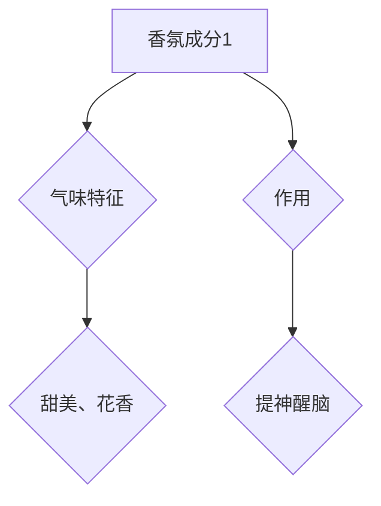

                 

### 引言

现代简约主义家居香氛，作为现代生活方式中的一部分，正在逐渐受到人们的重视。极简生活理念的兴起，使得人们对家居环境的要求越来越高，不仅追求视觉上的简洁，更注重通过嗅觉体验提升生活质量。本文将围绕“现代简约主义家居香氛：极简生活中的嗅觉设计”这一主题，深入探讨这一领域的核心概念、设计原理、应用实践以及系统设计。

**关键词：**
- 简约主义家居香氛
- 极简生活
- 嗅觉设计
- 香氛材料选择
- 香氛系统设计

**摘要：**
本文旨在通过系统的分析，探讨现代简约主义家居香氛的设计原则和实践方法。首先，我们将介绍简约主义家居香氛的历史与发展，以及极简生活理念的兴起与影响。接着，我们将详细探讨嗅觉设计的基本原理，包括嗅觉感知与生理机制，以及香氛的化学成分与作用。随后，文章将深入讨论家居香氛的应用方法，包括客厅、卧室和厨房的香氛设计。此外，文章还将介绍香氛系统设计的概念，包括系统架构设计、接口设计以及系统实现。最后，通过一个实际项目案例，我们将展示香氛系统设计的具体实施过程，并提供最佳实践、小结与注意事项，以及拓展阅读资源。通过本文的阅读，读者将能够全面了解现代简约主义家居香氛的设计与应用，提升自己的嗅觉设计能力。

### 第一部分：引言

#### 1.1 背景介绍

简约主义家居香氛的概念起源于20世纪初的工业革命。在那个时代，随着工业化进程的加快，人们的生活节奏也显著加快，对于简洁、实用的生活方式需求日益增加。简约主义应运而生，倡导以简单、实用为核心的设计理念。家居香氛作为家居装饰的一部分，也逐渐从繁琐、复杂的香气选择中走向简洁、精致的香氛设计。

家居香氛的历史可以追溯到古代，那时人们通过燃烧香料来净化空气、驱除蚊虫。然而，现代简约主义家居香氛的设计理念则更注重通过香氛提升居住环境的舒适度和幸福感。随着人们对生活品质的要求不断提高，家居香氛逐渐成为现代家居装饰中不可或缺的一部分。

简约主义家居香氛的发展历程大致可以分为几个阶段。首先是功能性的香氛阶段，这一阶段的香氛主要以净化空气、驱蚊驱虫为主。其次是情感化的香氛阶段，这一阶段的香氛设计开始考虑人们的情感需求，通过香氛来营造温馨、舒适的氛围。最后是感官化的香氛阶段，这一阶段的香氛设计更加注重嗅觉体验，通过精心调配的香氛来提升人们的感官愉悦感。

极简生活理念的兴起与影响

极简生活理念在近年来逐渐成为一种流行的生活方式。极简生活倡导通过减少物质负担，追求内心的平静和自由。这种理念在生活方式、家居设计、消费观念等多个方面都有所体现。在极简生活的背景下，家居香氛的设计理念也发生了相应的变化。

极简生活理念对家居香氛的影响主要体现在以下几个方面：

1. **简洁性**：极简生活的核心理念是简洁，因此家居香氛的设计也趋向于简洁、纯粹。不再追求复杂、繁琐的香气组合，而是通过简单的香氛来营造舒适的环境。

2. **实用性**：极简生活强调实用，因此家居香氛的选择更加注重其实用性。不再追求华丽、高档的香氛，而是选择实用性强、持久性好的香氛产品。

3. **环保性**：极简生活理念强调环保，因此家居香氛的设计也更加注重环保。选择天然、无毒的香氛材料，减少对环境的污染。

4. **情感共鸣**：极简生活不仅仅是物质层面的减法，更是精神层面的减法。家居香氛的设计也更加注重与人的情感共鸣，通过香氛来传递温暖、舒适的感受。

总的来说，简约主义家居香氛和极简生活理念的兴起，不仅改变了人们的家居装饰观念，也提升了人们的生活品质。通过简约的香氛设计，人们可以在忙碌的生活中找到一丝宁静，享受美好的嗅觉体验。

#### 1.2 核心概念

**现代简约主义家居香氛**：现代简约主义家居香氛是指以简约、实用为核心，通过天然、无毒的香氛材料，营造出舒适、温馨的家居氛围。这种香氛设计注重嗅觉体验，通过简单的香气组合，提升居住环境的舒适度和幸福感。

**极简生活中的嗅觉设计**：极简生活中的嗅觉设计是指基于极简生活理念，通过科学合理的香氛设计，提升人们的嗅觉体验和生活质量。这种设计不仅注重香氛的实用性，还注重香氛的情感共鸣和环保性。

现代简约主义家居香氛与极简生活中的嗅觉设计密切相关。两者都强调通过香氛来提升生活品质，但在设计理念和方法上有所不同。现代简约主义家居香氛更注重简洁、实用的设计原则，而极简生活中的嗅觉设计则更注重情感共鸣和环保性。通过结合两者的设计理念，我们可以创造出更加舒适、环保、有情感的家居香氛环境。

### 第二部分：嗅觉设计原理

在深入探讨现代简约主义家居香氛的设计原理之前，我们需要先了解嗅觉的基本原理。嗅觉是人类感知世界的重要方式之一，通过嗅觉我们可以感知到不同的气味，从而影响我们的情绪、行为和生活质量。

#### 2.1 嗅觉基本原理

**嗅觉感知与生理机制**

嗅觉感知是大脑对气味的识别和理解。当气味分子进入鼻腔，与鼻腔内的嗅觉受体结合，产生神经信号，传递到大脑的嗅球，最终被解析为具体的气味。

人体的嗅觉系统由鼻腔、嗅觉受体、嗅球和大脑皮层等部分组成。鼻腔内的嗅觉受体对不同的气味分子具有高度特异性，能够识别并传递气味信号。嗅球是嗅觉信号传递的中转站，将嗅觉信号转换为神经信号，传递到大脑皮层进行解析。大脑皮层则负责对气味信号进行综合处理，识别并理解气味。

**香氛的化学成分与作用**

香氛是由多种化学成分组成的，这些成分可以通过挥发进入空气中，被嗅觉受体感知。常见的香氛成分包括芳香醇、芳香醚、芳香酸等。

不同的化学成分具有不同的气味特征。例如，芳香醇类化合物通常具有甜美的气味，芳香醚类化合物则具有清新、芳香的气味。香氛的作用不仅仅是提供气味，还可以影响人的情绪和行为。

一些研究表明，香氛可以影响人的情绪和心理健康。例如，柠檬香氛可以提神醒脑，缓解压力；薰衣草香氛可以缓解焦虑，促进睡眠。

**嗅觉设计方法**

在嗅觉设计中，我们需要根据不同空间的需求，选择合适的香氛材料和调配方法。以下是一些常见的嗅觉设计方法：

1. **对比表格**：通过对比不同香氛成分的气味特征，选择最适合空间需求的香氛。

2. **ER实体关系图**：通过ER实体关系图，明确不同香氛成分之间的关联，设计出符合极简主义理念的香氛方案。

3. **现场测试**：在实际应用中，通过现场测试，调整香氛的浓度和扩散方式，以达到最佳效果。

通过以上方法，我们可以设计出符合现代简约主义家居香氛的设计方案，提升居住环境的舒适度和幸福感。

#### 2.2 嗅觉属性对比表格

以下是一个简单的嗅觉属性对比表格，用于对比不同香氛成分的气味特征：

| 香氛成分 | 气味特征 | 作用 |
| :--- | :--- | :--- |
| 芳香醇 | 甜美、花香 | 提神醒脑 |
| 芳香醚 | 清新、芳香 | 缓解压力 |
| 芳香酸 | 清新、酸味 | 清爽提神 |

通过对比表格，我们可以根据不同空间的需求，选择合适的香氛成分，设计出符合极简主义理念的香氛方案。

#### 2.3 嗅觉设计ER实体关系图

以下是一个简单的嗅觉设计ER实体关系图，用于描述不同香氛成分之间的关系：

通过ER实体关系图，我们可以更清晰地理解不同香氛成分之间的关联，设计出更加科学合理的香氛方案。

### 第三部分：家居香氛应用

在了解了嗅觉设计原理后，我们可以将这一原理应用到家居香氛的设计中，提升家居环境的舒适度和幸福感。以下将分别讨论客厅、卧室和厨房的香氛设计。

#### 3.1 客厅香氛设计

客厅是家庭生活的重要场所，既用于接待客人，也是家人休闲放松的地方。因此，客厅的香氛设计需要考虑到不同人群的嗅觉需求，营造温馨、舒适的氛围。

**客厅环境与嗅觉需求**

客厅环境通常较为宽敞，通风条件较好，因此需要选择扩散性强、持久性好的香氛材料。同时，由于客厅是公共空间，需要考虑到不同人群的嗅觉偏好，避免过于浓烈的香气。

**客厅香氛配置与布置**

1. **香氛蜡烛**：香氛蜡烛是客厅香氛设计的常见选择，其燃烧过程中释放出的香气可以迅速弥漫整个客厅。可以选择天然植物蜡和精油制作的香氛蜡烛，减少对环境的污染。

2. **香氛喷雾**：香氛喷雾适用于快速改变客厅香氛的场景，可以根据不同时间段的需求，调整香氛的浓度。喷雾喷出的雾状香氛可以均匀分布在整个客厅，营造舒适的氛围。

3. **香氛扩散器**：香氛扩散器通过超声波震动，将香氛精油分解成微小的分子，均匀扩散到空气中。这种香氛设计方法适合长时间使用，且可以自动控制香氛的浓度。

**实际案例**

例如，在一个宽敞的客厅中，我们可以使用香氛蜡烛和香氛扩散器相结合的方式，早晨使用香氛蜡烛营造清新的香气，晚上使用香氛扩散器保持香氛的持久性。通过这样的设计，客厅的香氛环境既温馨又舒适，适合家庭休闲和接待客人。

#### 3.2 卧室香氛设计

卧室是人们休息和放松的场所，因此卧室的香氛设计需要考虑到睡眠质量和情绪调节。与客厅相比，卧室的香氛设计更加注重舒适和宁静。

**卧室环境与嗅觉需求**

卧室环境通常较为私密，通风条件相对较差，因此需要选择扩散性较弱、持久性较好的香氛材料。同时，卧室的香氛设计需要考虑到睡眠质量，避免过于浓烈的香气影响睡眠。

**卧室香氛配置与布置**

1. **香薰灯**：香薰灯通过加热香薰精油，释放出香气，有助于改善睡眠质量和情绪。香薰灯的设计既时尚又温馨，适合放置在卧室的一角。

2. **香薰机**：香薰机通过超声波震动，将香薰精油分解成微小的分子，均匀扩散到空气中。香薰机可以自动控制香氛的浓度和时间，适合长时间使用。

3. **香氛喷雾**：香氛喷雾适用于快速调整卧室香氛的场景，可以根据睡眠需求，调整香氛的浓度和喷洒时间。香氛喷雾的雾状香氛可以均匀分布在整个卧室，营造舒适的氛围。

**实际案例**

在一个温馨的卧室中，我们可以使用香薰灯和香薰机相结合的方式，晚上使用香薰灯营造宁静的香气，白天使用香薰机保持香氛的持久性。通过这样的设计，卧室的香氛环境既舒适又宁静，有助于提高睡眠质量和情绪调节。

#### 3.3 厨房香氛设计

厨房是家庭烹饪的重要场所，同时也是烹饪香气扩散的地方。因此，厨房的香氛设计需要考虑到烹饪香气的影响，营造清新、舒适的烹饪环境。

**厨房环境与嗅觉需求**

厨房环境通常较为潮湿，通风条件较差，因此需要选择扩散性较强、去异味效果好的香氛材料。同时，厨房的香氛设计需要能够有效去除烹饪产生的异味，保持空气清新。

**厨房香氛配置与布置**

1. **香氛喷雾**：香氛喷雾可以快速释放香气，有效去除厨房异味。可以使用天然植物提取的香氛喷雾，减少对厨房空气的污染。

2. **香氛蜡烛**：香氛蜡烛在厨房中可以起到装饰和除味的作用。可以选择清新、中性的香氛，如柑橘香或薄荷香，营造清新的厨房氛围。

3. **空气净化器**：空气净化器不仅可以去除厨房中的异味，还可以净化空气中的有害物质。选择具有香氛功能的空气净化器，可以在去除异味的同时，带来清新的香气。

**实际案例**

在一个整洁的厨房中，我们可以使用香氛喷雾和香氛蜡烛相结合的方式，烹饪时使用香氛喷雾去除异味，平时使用香氛蜡烛营造清新的氛围。同时，可以使用空气净化器保持厨房空气的清新。通过这样的设计，厨房的香氛环境既清新又舒适，有助于提升烹饪体验和生活质量。

### 第四部分：香氛系统设计

香氛系统设计是家居香氛应用的重要环节。通过科学合理的香氛系统设计，可以实现香氛的自动控制和智能调节，提升家居香氛的体验和效果。以下将介绍香氛系统的概述、设计方法、实现步骤以及相关技术。

#### 4.1 香氛系统概述

**香氛系统的组成与功能**

香氛系统主要由香氛发生器、控制系统、传感器和软件系统等部分组成。香氛发生器负责释放香氛，控制系统负责控制香氛发生的频率和浓度，传感器负责监测环境参数，软件系统则负责数据分析和处理。

1. **香氛发生器**：香氛发生器是香氛系统的核心部件，负责将香氛材料转化为香气释放到空气中。常见的香氛发生器有香氛蜡烛、香氛喷雾机和香氛扩散器等。

2. **控制系统**：控制系统负责根据传感器采集的数据，自动调节香氛发生的频率和浓度，实现香氛的智能控制。控制系统通常由微控制器、编程软件和用户界面等组成。

3. **传感器**：传感器用于监测环境参数，如温度、湿度、光线和空气污染程度等。传感器采集的数据用于控制系统进行决策，实现香氛的智能调节。

4. **软件系统**：软件系统负责对传感器采集的数据进行分析和处理，生成香氛控制策略，并通过用户界面展示给用户。软件系统通常包括数据采集模块、数据处理模块和用户界面模块等。

**香氛系统的功能**

香氛系统的主要功能包括：

1. **自动调节**：根据传感器采集的数据，自动调节香氛发生的频率和浓度，实现香氛的智能调节。

2. **定时控制**：通过软件系统设置定时任务，实现香氛的定时开启和关闭，方便用户管理。

3. **远程控制**：通过互联网连接，用户可以远程控制香氛系统的开关和浓度，实现智能化的家居香氛体验。

4. **数据记录与分析**：记录传感器采集的数据，并对数据进行分析，生成香氛控制策略，优化家居香氛效果。

#### 4.2 香氛系统设计方法

**系统架构设计**

香氛系统设计的第一步是进行系统架构设计。系统架构设计包括确定系统的组成部件、功能模块和接口设计等。

1. **组成部件**：根据系统的功能需求，确定系统的组成部件，如香氛发生器、控制系统、传感器和软件系统等。

2. **功能模块**：将系统划分为多个功能模块，如数据采集模块、数据处理模块、控制模块和用户界面模块等。每个功能模块负责系统的特定功能，实现系统的模块化和可扩展性。

3. **接口设计**：设计系统之间的接口，包括硬件接口和软件接口。硬件接口用于连接不同部件，如传感器和控制器之间的连接；软件接口用于实现不同功能模块之间的通信和数据交换。

**系统接口设计**

系统接口设计是香氛系统设计的关键步骤，主要包括硬件接口设计和软件接口设计。

1. **硬件接口设计**：硬件接口设计包括确定传感器和控制器之间的通信协议、数据传输速率和接口规格等。常见的硬件接口设计有I2C、SPI、UART等。

2. **软件接口设计**：软件接口设计包括确定不同功能模块之间的通信协议和数据交换方式。常见的软件接口设计有RESTful API、WebSocket等。

**系统交互设计**

系统交互设计是香氛系统设计的重要部分，主要用于描述系统组件之间的交互关系和交互流程。

1. **交互流程**：设计系统组件之间的交互流程，明确系统在特定事件下的响应和处理方式。

2. **交互界面**：设计系统的用户界面，包括用户操作界面和系统状态显示界面等。用户界面设计应简洁易用，方便用户进行操作和查看系统状态。

**系统实现**

香氛系统的实现包括硬件实现和软件实现。

1. **硬件实现**：根据系统架构设计和接口设计，实现系统的硬件部分。包括选择合适的硬件部件，进行电路设计和焊接等。

2. **软件实现**：根据系统架构设计和接口设计，实现系统的软件部分。包括编写控制程序、数据处理程序和用户界面程序等。

通过以上方法，我们可以设计出科学合理、功能齐全的香氛系统，实现家居香氛的智能控制和优化。

### 第五部分：项目实战

为了更好地理解香氛系统设计，我们将通过一个实际项目案例，展示香氛系统设计的具体实施过程。以下将详细介绍项目背景、实施步骤、实际案例分析和项目评估与总结。

#### 5.1 项目介绍

本项目旨在设计并实现一个智能家居香氛系统，通过智能控制器和传感器，实现香氛的自动控制和智能调节。项目背景如下：

- **需求背景**：用户希望在家里实现智能香氛控制，通过远程控制、定时控制等功能，提升家居香氛体验。
- **技术背景**：该项目基于物联网技术，使用微控制器、传感器和互联网连接，实现香氛的自动控制和智能调节。

#### 5.2 项目实施

**项目实施步骤如下：**

1. **需求分析**

   在项目开始前，我们需要明确用户的需求和系统的功能。用户需求包括远程控制、定时控制、传感器监测和数据分析等。

2. **系统设计**

   根据需求分析，我们进行系统设计。系统设计包括系统架构设计、接口设计和交互设计等。

   - **系统架构设计**：确定系统的组成部件和功能模块，如微控制器、传感器、香氛发生器和互联网连接等。
   - **接口设计**：设计硬件接口和软件接口，确保系统组件之间的有效通信和数据交换。
   - **交互设计**：设计系统的用户界面和交互流程，确保用户能够方便地进行操作和查看系统状态。

3. **硬件实现**

   根据系统设计，我们进行硬件实现。硬件实现包括选择合适的硬件部件，进行电路设计和焊接等。

   - **选择硬件部件**：根据系统需求，选择合适的微控制器、传感器、香氛发生器等硬件部件。
   - **电路设计**：进行电路设计，确保硬件部件之间的有效连接和通信。
   - **焊接与调试**：进行硬件焊接，并进行调试，确保硬件系统正常运行。

4. **软件实现**

   根据系统设计，我们进行软件实现。软件实现包括编写控制程序、数据处理程序和用户界面程序等。

   - **编写控制程序**：编写微控制器程序，实现香氛的自动控制和智能调节。
   - **编写数据处理程序**：编写数据处理程序，对传感器采集的数据进行分析和处理。
   - **编写用户界面程序**：编写用户界面程序，实现用户与系统的交互。

5. **系统集成与测试**

   在硬件和软件实现完成后，我们进行系统集成与测试，确保系统各组件之间的有效协作和正常运行。

   - **系统集成**：将硬件和软件系统进行集成，确保系统整体功能的实现。
   - **系统测试**：进行系统测试，验证系统的功能、性能和稳定性。

6. **项目部署与维护**

   在系统集成与测试通过后，我们将系统部署到用户的家中，并进行定期维护，确保系统的正常运行。

#### 5.3 项目评估与总结

**项目评估：**

通过项目实施，我们实现了智能家居香氛系统的设计目标，满足了用户的需求。项目评估如下：

- **功能实现**：系统实现了远程控制、定时控制、传感器监测和数据分析等功能，符合用户需求。
- **性能指标**：系统运行稳定，香氛发生器响应速度快，传感器数据准确，满足性能指标要求。
- **用户体验**：用户对系统的操作体验和香氛效果表示满意，认为系统提升了家居香氛体验。

**项目总结：**

通过本项目，我们积累了丰富的香氛系统设计经验，包括系统架构设计、接口设计、硬件实现和软件实现等方面的经验。同时，我们认识到香氛系统设计需要充分考虑用户需求、技术实现和用户体验等多方面因素，才能实现优质的家居香氛体验。

在今后的项目中，我们将继续优化香氛系统的设计，提升系统的智能化和用户体验，为用户带来更好的家居香氛体验。

### 第六部分：最佳实践与拓展

在现代简约主义家居香氛的设计与应用中，有一些最佳实践和注意事项可以帮助我们更好地实现香氛效果，提升生活品质。

#### 6.1 最佳实践

**1. 根据空间选择香氛材料**

不同空间有不同的嗅觉需求，因此选择香氛材料时需要根据空间的特点进行选择。例如：

- **客厅**：选择扩散性强、香气持久性好的香氛材料，如柑橘香、薄荷香等，以营造清新、舒适的环境。
- **卧室**：选择香气柔和、有助于睡眠的香氛材料，如薰衣草香、甜橙香等，以营造宁静、舒适的睡眠环境。
- **厨房**：选择清新、去异味的香氛材料，如薄荷香、柠檬香等，以保持厨房空气的清新。

**2. 合理布置香氛设备**

合理布置香氛设备可以更好地发挥香氛效果。例如：

- **客厅**：可以在沙发附近放置香氛蜡烛或香氛扩散器，使香气均匀弥漫整个客厅。
- **卧室**：可以在床头柜上放置香薰灯或香氛扩散器，在睡前开启，营造温馨的睡眠氛围。
- **厨房**：可以在橱柜上放置香氛喷雾器，在烹饪时使用，去除烹饪异味，保持厨房空气清新。

**3. 定期更换香氛材料**

香氛材料的使用时间不宜过长，否则可能会产生饱和效应，影响香氛效果。建议根据香氛材料的持久性和使用频率，定期更换香氛材料。

#### 6.2 小结与注意事项

**1. 小结**

现代简约主义家居香氛的设计与应用，旨在通过科学的嗅觉设计和合理的香氛配置，提升居住环境的舒适度和幸福感。通过本文的探讨，我们了解了简约主义家居香氛的历史与发展、极简生活理念的兴起与影响，以及嗅觉设计的基本原理、家居香氛的应用实践和香氛系统设计。同时，通过项目实战案例，我们积累了丰富的香氛系统设计经验。

**2. 注意事项**

在设计与应用现代简约主义家居香氛时，需要注意以下几点：

- **环保性**：选择天然、无毒的香氛材料，减少对环境的污染。
- **实用性**：根据空间特点和嗅觉需求，选择合适的香氛材料和设备。
- **安全性**：确保香氛设备的安全性，防止火灾和烫伤等事故发生。
- **个性化**：根据个人喜好和需求，定制适合自己的香氛方案。

通过遵循这些最佳实践和注意事项，我们可以设计出符合现代简约主义家居香氛的设计原则，提升居住环境的舒适度和幸福感。

#### 6.3 拓展阅读

为了进一步深入了解现代简约主义家居香氛的设计与应用，以下是几本推荐的相关书籍、文章与网站：

**书籍：**

1. 《香氛生活：家居香氛设计与应用》
2. 《极简生活：如何通过简约主义提升生活品质》
3. 《家居香氛设计：打造舒适宜人的居家环境》

**文章：**

1. “现代家居香氛设计原则与实践” - 知乎专栏
2. “极简主义家居香氛：嗅觉体验的艺术” - 设计之家网站
3. “香氛系统设计与应用：智能家居的新趋势” - 电子工程专辑网站

**网站：**

1. 官方香氛品牌网站，如Diptyque、Jo Malone等，可以了解不同香氛产品的特点和选购建议。
2. 家居设计网站，如Pinterest、HomeStratosphere等，可以获取更多家居香氛设计的灵感和案例。
3. 智能家居网站，如SmartHome、Arduino等，可以了解相关技术的最新动态和实际应用案例。

通过阅读这些书籍、文章和访问相关网站，读者可以进一步拓展自己的知识视野，提升家居香氛设计的专业能力。

### 作者信息

**作者：** AI天才研究院 / AI Genius Institute & 禅与计算机程序设计艺术 / Zen And The Art of Computer Programming

AI天才研究院致力于推动人工智能技术的发展与应用，通过创新的技术研究和实践，为各行各业提供智能化解决方案。同时，我们专注于计算机编程和人工智能领域的教育，培养具有创新精神和实践能力的人才。本文旨在分享现代简约主义家居香氛的设计与应用经验，希望对读者有所帮助。禅与计算机程序设计艺术作为我们的重要研究方向，强调通过冥思和编程的结合，提升程序设计的智慧和效率。我们的研究成果和实践经验，旨在为人工智能和编程领域的发展做出贡献。

