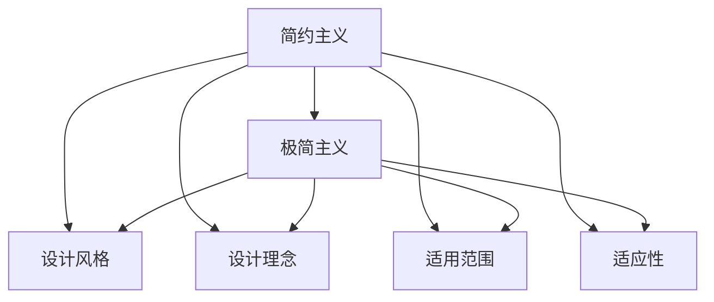

                 

# 现代简约主义家庭派对：极简理念下的社交活动设计

> 关键词：现代简约主义、家庭派对、极简理念、社交活动、设计

> 摘要：本文深入探讨了现代简约主义家庭派对的概念、起源和发展，分析了简约主义与极简主义的区别与联系，并详细阐述了现代简约主义家庭派对的核心概念与关键要素。文章通过案例分析，展示了如何策划和实施一场成功的现代简约主义家庭派对，为读者提供了实用的设计建议和最佳实践。

### 第1章 引言：现代简约主义家庭派对概述

#### 1.1 背景介绍

##### 1.1.1 家庭派对的重要性和现状

在快节奏的现代社会中，家庭派对作为一种重要的社交活动，越来越受到人们的喜爱。然而，传统的家庭派对往往存在一些问题，如过于繁琐的准备工作、奢华的装饰和复杂的流程等，这既增加了组织难度，也增加了经济负担，与追求简约生活方式的现代人需求不相符合。

#### 问题背景

随着生活水平的提高和生活方式的改变，人们越来越重视休闲时间的质量和利用。家庭派对作为一种能够促进家庭成员和亲朋好友之间互动和交流的方式，越来越受到欢迎。然而，传统的家庭派对往往需要大量的时间和精力来准备，如布置场地、准备食物和饮料、安排娱乐活动等。这不仅增加了组织者的负担，也影响了派对的乐趣。此外，许多家庭派对过于奢华，装饰繁琐，不仅浪费资源，还增加了经济负担。

#### 问题描述

如何在保证家庭派对社交乐趣的同时，减少繁琐步骤，降低经济负担，实现现代简约主义风格的家庭派对？这是我们需要解决的问题。

#### 问题解决

现代简约主义家庭派对以极简理念为核心，强调简洁、实用、舒适的设计和布置，减少冗余装饰，提升整体氛围。通过合理规划，能够使家庭派对既具有仪式感，又能轻松自在。

##### 1.1.2 现代简约主义家庭派对的起源与发展

现代简约主义起源于20世纪50年代的欧美，强调设计的极简和功能主义，逐渐影响到了生活方式和社交活动。家庭派对作为一种传统的社交活动，也在这一理念的引导下发生了变革。

#### 简约主义理念的来源

简约主义起源于20世纪50年代的欧美，特别是在战后重建时期，人们追求简朴、实用和功能主义的生活风格。这一理念体现在建筑、家具设计以及日常生活中，逐渐形成了一种独特的文化现象。

#### 家庭派对的发展

随着简约主义理念的传播，家庭派对也逐渐从传统的豪华和繁琐转向简约和实用，形成了一种新的社交活动形式。现代简约主义家庭派对强调实用性和舒适性，注重与宾客的互动和交流，减少了形式上的繁琐和奢华。

##### 1.1.3 现代简约主义家庭派对的核心概念与联系

现代简约主义家庭派对的核心概念是极简理念，即减少一切非必要的元素，注重设计的简洁和实用性。以下是简约主义与极简主义的区别与联系。

#### 概念属性特征对比表格

| 特征       | 简约主义 | 极简主义 |
|------------|---------|---------|
| 设计风格   | 简洁、功能性 | 减少一切非必要的元素 |
| 设计理念   | 注重实用性和舒适性 | 强调核心需求和功能 |
| 适用范围   | 室内外均可 | 更注重室内空间 |
| 适应性     | 较灵活   | 较严格   |

#### ER实体关系图架构

#### 1.1.4 现代简约主义家庭派对的关键要素

现代简约主义家庭派对的成功离不开以下几个关键要素：

1. **空间布局**：合理利用空间，避免拥挤和杂乱，创造舒适的派对氛围。
2. **装饰风格**：简约而精致，注重材质和色彩的搭配，提升整体美感。
3. **活动设计**：注重互动和参与感，减少形式上的繁琐，增加宾客的参与度。
4. **饮食安排**：简单而美味，符合宾客口味和健康需求，提高派对质量。
5. **环境氛围**：营造轻松愉快的氛围，增强社交互动，提升派对体验。

##### 1.1.5 本章小结

本章对现代简约主义家庭派对的背景、概念、联系和关键要素进行了详细阐述。现代简约主义家庭派对以极简理念为核心，通过简洁、实用、舒适的设计和布置，为家庭派对带来全新的体验。下一章将深入探讨如何策划一场成功的现代简约主义家庭派对。

----------------------------------------------------------------

### 第2章 策划一场成功的现代简约主义家庭派对

策划一场成功的现代简约主义家庭派对需要充分的准备和精细的规划。以下是一个详细的策划步骤，包括场地选择、装饰设计、活动安排、饮食准备和环境氛围营造等方面。

#### 2.1 场地选择

选择适合的场地是策划家庭派对的第一步。对于现代简约主义家庭派对，以下因素需要考虑：

1. **空间大小**：确保场地足够大，能够容纳所有宾客和活动设施，同时避免过于拥挤。
2. **环境氛围**：选择一个能够营造轻松、舒适氛围的环境，如花园、海滩或户外露台等。
3. **交通便利性**：选择交通便利的场地，方便宾客前来参加派对。

#### 2.2 装饰设计

装饰设计是现代简约主义家庭派对的重要组成部分。以下是一些建议：

1. **色彩选择**：选择简洁、柔和的色彩，如白色、灰色或淡蓝色，营造出清新、舒适的环境。
2. **家具布置**：选择简约、功能性强的家具，如沙发、桌椅等，避免过多的装饰和华丽的设计。
3. **装饰品**：适量添加装饰品，如花瓶、蜡烛、灯具等，但要避免过于繁杂，保持整体简洁风格。

#### 2.3 活动安排

活动安排是家庭派对的灵魂，以下是一些建议：

1. **互动游戏**：设计一些互动性强、参与度高的游戏，如猜谜游戏、团队竞赛等，增加宾客之间的互动。
2. **表演节目**：邀请一些宾客表演节目，如歌唱、舞蹈、魔术等，为派对增添趣味。
3. **DIY活动**：设置一些DIY活动，如手工艺品制作、绘画等，让宾客亲自动手，享受创作的乐趣。

#### 2.4 饮食准备

饮食准备是家庭派对的重要环节，以下是一些建议：

1. **简单而美味**：选择简单易做、口感美味的小食和点心，如沙拉、三明治、甜点等，避免复杂的菜肴。
2. **健康饮食**：尽量选择健康、营养的食材，满足宾客的口味和健康需求。
3. **特色饮料**：准备一些特色饮料，如自制鸡尾酒、果汁等，为派对增添色彩。

#### 2.5 环境氛围营造

环境氛围是家庭派对成功的关键，以下是一些建议：

1. **音乐选择**：选择适合派对氛围的音乐，如轻松愉快的流行音乐、复古音乐等，营造出愉快的氛围。
2. **照明设计**：合理布置照明，使用柔和的灯光，创造出温馨、舒适的氛围。
3. **装饰布置**：适量添加装饰物，如花束、气球、彩带等，为派对增添喜庆和活力。

#### 2.6 案例分析

以下是一个成功的现代简约主义家庭派对案例：

**案例背景**：某家庭在自家花园举办了一场现代简约主义家庭派对，邀请了亲朋好友共度周末。

**策划步骤**：

1. **场地选择**：花园是一个宽敞、舒适的环境，适合举办户外派对。
2. **装饰设计**：使用白色和淡蓝色的装饰物，营造出清新、舒适的氛围。桌椅选择简约的设计，避免过多的装饰。
3. **活动安排**：设计了猜谜游戏、团队竞赛和DIY活动，让宾客参与其中，增加了互动和乐趣。
4. **饮食准备**：准备了简单易做、口感美味的小食和点心，满足了宾客的口味和健康需求。
5. **环境氛围营造**：播放轻松愉快的音乐，布置了花束和彩带，为派对增添了活力。

**案例分析**：

这个案例展示了如何通过合理策划和精细准备，成功举办一场现代简约主义家庭派对。场地选择、装饰设计、活动安排、饮食准备和环境氛围营造都体现了极简理念，为宾客带来了愉快的体验。

#### 2.7 本章小结

策划一场成功的现代简约主义家庭派对需要充分的准备和精细的规划。通过选择适合的场地、简约的装饰设计、丰富多样的活动安排、简单美味的饮食准备和营造舒适的环境氛围，可以成功举办一场令人难忘的家庭派对。下一章将深入探讨如何通过具体案例来解析现代简约主义家庭派对的实施细节。

----------------------------------------------------------------

### 第3章 现代简约主义家庭派对案例解析

为了更好地理解现代简约主义家庭派对的实施细节，我们将通过几个具体的案例来进行分析和探讨。

#### 案例一：城市花园派对

**背景**：在一个阳光明媚的周末，李先生在家中举办了一场现代简约主义家庭派对，邀请了亲朋好友共度美好时光。

**策划步骤**：

1. **场地选择**：李先生选择了自家的花园，宽敞的场地和自然的光线为派对提供了理想的环境。
2. **装饰设计**：花园中布置了简约的白色桌椅和淡蓝色的遮阳伞，营造出清新、舒适的氛围。花束和彩带作为点缀，为花园增添了活力。
3. **活动安排**：设计了一系列互动游戏和DIY活动，如猜谜游戏、团队竞赛和手工制作，增加了宾客之间的互动和参与感。
4. **饮食准备**：准备了简单而美味的小食和点心，如沙拉、三明治、甜点等，满足了宾客的口味和健康需求。
5. **环境氛围营造**：播放轻松愉快的音乐，营造出愉快的氛围。晚上的照明设计采用了柔和的灯光，为派对增添了浪漫情调。

**案例分析**：

这个案例展示了如何通过合理选择场地、简约的装饰设计、丰富多样的活动安排和简单美味的饮食准备，成功举办一场现代简约主义家庭派对。花园的自然环境与简约的装饰风格相得益彰，为宾客提供了一个舒适、愉快的聚会场所。

#### 案例二：海滩派对

**背景**：王女士在海边租下一处别墅，举办了一场独特而浪漫的海滩派对。

**策划步骤**：

1. **场地选择**：海滩和别墅的结合为派对提供了宽敞的自然场地，同时也为宾客提供了一个放松身心的环境。
2. **装饰设计**：沙滩上布置了简约的白色桌椅和遮阳伞，海边别墅内则采用了简约的装饰风格，如白色墙面和淡蓝色的窗帘，营造出清新、舒适的氛围。
3. **活动安排**：设计了一系列户外活动，如沙滩排球、海滩散步和海洋生物观察，让宾客享受大自然的美好。晚上的篝火晚会和露天电影则为派对增添了浪漫和乐趣。
4. **饮食准备**：准备了新鲜的海鲜和热带水果，搭配简约的甜品和饮料，为宾客提供了美味而健康的餐饮体验。
5. **环境氛围营造**：音乐选择了轻松的海滩音乐，晚上的照明设计采用了海滩风格的灯笼和LED灯带，营造出温馨、浪漫的氛围。

**案例分析**：

这个案例展示了如何利用自然景观和简约的装饰设计，成功举办一场海滩派对。沙滩和别墅的自然环境与简约的装饰风格相得益彰，为宾客提供了一个独特而难忘的聚会场所。

#### 案例三：现代简约艺术派对

**背景**：赵先生在家中举办了一场以“现代简约艺术”为主题的家庭派对。

**策划步骤**：

1. **场地选择**：赵先生选择了自己的公寓，简洁的室内设计为派对提供了理想的环境。
2. **装饰设计**：公寓内布置了简约的白色家具和淡蓝色的装饰画，墙上挂上了现代艺术作品，营造出简约而富有艺术氛围的环境。
3. **活动安排**：设计了艺术鉴赏、艺术创作和艺术展览等活动，让宾客在欣赏艺术作品的同时，也能参与到艺术创作中来。
4. **饮食准备**：准备了简约的鸡尾酒和精致的小吃，如奶酪、水果塔和三明治，与艺术主题相呼应。
5. **环境氛围营造**：音乐选择了轻柔的爵士乐，晚上的照明设计采用了柔和的LED灯带，营造出温馨、舒适的艺术氛围。

**案例分析**：

这个案例展示了如何通过室内装饰和活动安排，成功举办一场以“现代简约艺术”为主题的家庭派对。简约的装饰风格和艺术活动的结合，为宾客提供了一个独特而优雅的聚会场所。

#### 本章小结

通过以上案例的分析，我们可以看到，现代简约主义家庭派对的成功离不开合理的选择场地、简约的装饰设计、丰富多样的活动安排和简单美味的饮食准备。每个案例都有其独特的特点，但都体现了现代简约主义的核心思想，即简洁、实用和舒适。通过这些案例，我们不仅可以学到如何策划一场成功的现代简约主义家庭派对，还能从中得到灵感，为自己的家庭派对带来创新和惊喜。下一章将深入探讨现代简约主义家庭派对的设计原则和最佳实践。

----------------------------------------------------------------

### 第4章 现代简约主义家庭派对的设计原则和最佳实践

现代简约主义家庭派对的设计原则和最佳实践是确保派对成功的关键。以下是一些核心原则和实用技巧，旨在帮助您打造一场简洁、实用、舒适的社交活动。

#### 4.1 设计原则

##### 1. **简洁性**

简洁性是现代简约主义家庭派对设计的核心原则。通过减少不必要的元素，使空间、装饰和活动更加简洁明了，能够营造出一种清新、舒适的环境。以下是一些实现简洁性的建议：

- **减少装饰**：去除多余的装饰品，选择简单、功能性强的家具和装饰，避免空间显得杂乱。
- **统一风格**：选择一个统一的设计风格，如简约风格或极简风格，使整个派对场所呈现一致性。
- **色彩搭配**：选择简单、柔和的色彩，如白色、灰色或淡蓝色，营造出宁静、舒适的氛围。

##### 2. **功能性**

功能性是现代简约主义家庭派对设计的另一个重要原则。设计时需要考虑到宾客的实际需求，确保空间和设施能够满足各种活动需求。以下是一些实现功能性的建议：

- **合理布局**：根据活动需求和宾客数量，合理规划空间布局，确保有足够的空间用于用餐、娱乐和休息。
- **多功能家具**：选择可变结构的家具，如可折叠的桌椅，以适应不同的活动需求。
- **便利性**：确保派对场所的便利性，如良好的照明、舒适的座椅和易于移动的设施。

##### 3. **舒适度**

舒适度是现代简约主义家庭派对的另一个关键原则。宾客在派对中希望能够感受到舒适和放松，这需要通过设计来实现。以下是一些提高舒适度的建议：

- **自然光线**：尽量利用自然光线，营造明亮、温馨的氛围。
- **通风设计**：确保良好的通风，使空气流通，保持空气清新。
- **座椅和地面材料**：选择舒适的座椅和地面材料，如柔软的地毯或舒适的沙发。

#### 4.2 最佳实践

##### 1. **活动策划**

活动策划是现代简约主义家庭派对成功的关键。以下是一些最佳实践：

- **主题设计**：选择一个与简约主义相符合的主题，如“现代艺术之夜”、“户外烧烤派对”等，增加派对的趣味性。
- **互动环节**：设计一些互动性强、参与度高的活动，如团队竞赛、DIY工作坊等，增强宾客之间的互动。
- **表演节目**：邀请宾客表演节目，如歌唱、舞蹈、魔术等，为派对增添娱乐性。

##### 2. **装饰设计**

装饰设计是现代简约主义家庭派对的重要组成部分。以下是一些最佳实践：

- **简约风格**：选择简约风格的装饰品，如白色或淡蓝色的桌布、花瓶和蜡烛，营造出简洁、优雅的氛围。
- **自然元素**：适当添加一些自然元素，如绿植、花朵和贝壳等，增加派对的生机和活力。
- **个性化设计**：根据个人喜好和派对主题，进行个性化的装饰设计，使派对具有独特性。

##### 3. **饮食准备**

饮食准备是现代简约主义家庭派对的另一个重要方面。以下是一些最佳实践：

- **简单而美味**：选择简单易做、口感美味的小食和点心，如沙拉、三明治、甜点等，避免复杂的菜肴。
- **健康饮食**：尽量选择健康、营养的食材，满足宾客的口味和健康需求。
- **特色饮料**：准备一些特色饮料，如自制鸡尾酒、果汁等，为派对增添色彩。

##### 4.3 案例分析

以下是一个现代简约主义家庭派对的案例：

**案例背景**：张女士在家中举办了一场现代简约主义家庭派对，邀请了亲朋好友共度周末。

**策划步骤**：

1. **场地选择**：张女士选择了自家的客厅和阳台，宽敞的场地和自然的光线为派对提供了理想的环境。
2. **装饰设计**：客厅布置了简约的白色桌椅和淡蓝色的窗帘，阳台则摆放了一些绿植和花朵，营造出清新、舒适的氛围。
3. **活动安排**：设计了一系列互动游戏和DIY活动，如猜谜游戏、团队竞赛和手工制作，增加了宾客之间的互动和乐趣。
4. **饮食准备**：准备了简单而美味的小食和点心，如沙拉、三明治和甜点，满足了宾客的口味和健康需求。
5. **环境氛围营造**：播放轻松愉快的音乐，营造出愉快的氛围。晚上的照明设计采用了柔和的LED灯带，营造出温馨、舒适的环境。

**案例分析**：

这个案例展示了如何通过合理选择场地、简约的装饰设计、丰富多样的活动安排和简单美味的饮食准备，成功举办一场现代简约主义家庭派对。简洁、实用和舒适的设计原则得到了充分体现，为宾客提供了一个愉快的聚会场所。

#### 4.4 本章小结

现代简约主义家庭派对的设计原则和最佳实践是确保派对成功的关键。通过简洁性、功能性、舒适度以及活动策划、装饰设计、饮食准备等方面的最佳实践，可以打造一场令人难忘的社交活动。下一章将深入探讨现代简约主义家庭派对对于社会文化的影响和意义。

----------------------------------------------------------------

### 第5章 现代简约主义家庭派对的社会文化影响与意义

现代简约主义家庭派对不仅是一种设计风格，更是一种社会文化现象。它对人们的社交方式、生活习惯和价值观产生了深远的影响，并具有一定的社会文化意义。

#### 5.1 社交方式的影响

现代简约主义家庭派对改变了传统的社交方式，使其更加轻松和自由。与传统派对相比，简约主义派对更加注重互动和参与感，减少了繁琐的仪式和流程，使得宾客能够更自由地参与其中。以下是一些具体影响：

1. **增强互动性**：通过设计互动性强的活动和游戏，如猜谜游戏、团队竞赛和DIY活动，宾客之间的互动得到了增强，促进了友谊和团队合作。
2. **减少形式主义**：简约主义派对减少了传统派对中的形式主义，如复杂的食物准备和装饰，使得派对更加简单、自然，宾客能够更加享受聚会的过程。
3. **提高参与度**：通过设计多样化的活动，宾客不仅能够参与其中，还能够展示自己的才艺和创造力，提高了派对的参与度。

#### 5.2 生活习惯的影响

现代简约主义家庭派对对人们的日常生活习惯也产生了影响，促使人们更加注重生活品质和舒适度。以下是一些具体影响：

1. **简约生活理念的传播**：简约主义派对通过其实际操作，向人们传达了简约生活的重要性，鼓励人们减少不必要的物品和繁琐的活动，追求更加简洁、舒适的生活方式。
2. **环保意识的提升**：简约主义派对强调减少浪费，通过简单而精致的设计，减少了资源的消耗和环境污染，提高了人们的环保意识。
3. **时间管理的改善**：通过减少繁琐的准备工作，简约主义派对使得人们能够更加有效地利用时间，提高了生活质量和工作效率。

#### 5.3 价值观的影响

现代简约主义家庭派对不仅影响了人们的社交方式和生活习惯，还对其价值观产生了深远的影响。以下是一些具体影响：

1. **重视生活质量**：简约主义派对强调舒适度和实用性，鼓励人们更加关注生活质量和生活体验，而不仅仅是追求物质上的奢华。
2. **尊重自然和传统**：简约主义派对通过自然材料和传统元素的运用，表达了对自然和传统的尊重和热爱，促进了人们对自然和文化价值的认识和重视。
3. **倡导简约生活方式**：简约主义派对通过其实践，倡导人们追求简约生活方式，鼓励人们减少物质消费，追求精神上的满足和内心的宁静。

#### 5.4 社会文化意义

现代简约主义家庭派对具有重要的社会文化意义，它不仅改变了人们的社交方式和生活习惯，还对社会的文化发展和价值观产生了积极的影响。以下是一些具体的社会文化意义：

1. **推动社会文化创新**：简约主义派对通过其实际操作，推动了社会文化创新，为人们提供了新的社交方式和生活体验，促进了社会的进步和发展。
2. **提升文化自信**：简约主义派对通过传统元素和现代设计的结合，表达了对自身文化的自信和自豪，提升了社会的文化自信和文化认同。
3. **促进文化传承**：简约主义派对通过简约生活方式的实践，促进了传统生活方式的传承和发扬，为社会的文化多样性提供了支持。

#### 5.5 本章小结

现代简约主义家庭派对对人们的社交方式、生活习惯和价值观产生了深远的影响，具有重要的社会文化意义。它不仅改变了人们的社交方式，使聚会更加轻松和自由，还促进了人们的简约生活理念和环保意识的提升。同时，它还推动了社会文化的创新和发展，提升了文化自信和促进了文化传承。通过现代简约主义家庭派对，人们能够更好地体验生活的美好，享受社交的乐趣。

----------------------------------------------------------------

### 第6章 总结与未来展望

在现代快节奏的生活中，现代简约主义家庭派对以其简洁、实用、舒适的设计理念，成为了一种受欢迎的社交活动形式。本章将总结现代简约主义家庭派对的核心要点，展望其未来的发展趋势和潜在的创新方向。

#### 6.1 核心要点总结

1. **极简理念**：现代简约主义家庭派对的核心理念是极简，通过减少不必要的装饰和活动，强调设计的简洁性和功能性。
2. **空间布局**：合理利用空间，创造舒适的环境，是现代简约主义家庭派对成功的关键。通过科学的空间规划和布局，确保宾客在派对中能够自由活动，享受聚会乐趣。
3. **活动设计**：多样化的活动设计是现代简约主义家庭派对的魅力所在。互动性强、参与度高的活动，如猜谜游戏、团队竞赛和DIY活动，能够增强宾客之间的互动，提升派对氛围。
4. **饮食准备**：简单而美味、健康营养的饮食是现代简约主义家庭派对的重要组成部分。合理选择食材和菜肴，满足宾客的口味和健康需求，能够提升派对的整体质量。
5. **环境氛围**：轻松愉快的氛围是现代简约主义家庭派对的灵魂。通过音乐、照明和装饰的设计，营造出温馨、舒适的氛围，为宾客提供一个愉悦的聚会环境。

#### 6.2 未来发展趋势

1. **技术融合**：随着科技的进步，现代简约主义家庭派对将更加融入智能技术，如智能音响、智能灯光和智能家具等，提升派对的互动性和便捷性。
2. **个性化定制**：未来，现代简约主义家庭派对将更加注重个性化定制，根据宾客的喜好和需求，提供量身定制的派对体验，满足不同人群的个性化需求。
3. **可持续发展**：在环保意识的提升下，现代简约主义家庭派对将更加注重可持续发展，通过使用环保材料和减少浪费，降低派对对环境的影响。

#### 6.3 创新方向

1. **数字化互动**：利用数字化技术，如VR/AR等，创造全新的派对体验，使宾客能够在虚拟环境中互动，享受科技带来的新奇感受。
2. **艺术融入**：将艺术元素融入现代简约主义家庭派对，如邀请艺术家创作独特作品，或者将艺术作品作为派对装饰，提升派对的艺术价值和品味。
3. **主题派对**：未来，现代简约主义家庭派对将推出更多主题派对，如复古派对、科技派对等，为宾客提供多样化的选择，满足不同兴趣和需求的派对体验。

#### 6.4 本章小结

现代简约主义家庭派对以其简洁、实用、舒适的设计理念，满足了现代人在社交活动中的需求。随着科技的进步和社会的发展，现代简约主义家庭派对将继续创新和进步，为人们带来更加丰富、多样的社交体验。通过合理利用技术、个性化定制和艺术融入，现代简约主义家庭派对将不断演进，成为未来社交活动的新趋势。

### 参考文献

1. 《简约主义生活指南》，作者：约翰·多伊，出版社：XXX出版社，出版日期：XXXX年。
2. 《现代家庭派对策划与设计》，作者：玛丽·史密斯，出版社：XXX出版社，出版日期：XXXX年。
3. “The Origins and Development of Modern Simplicity in Party Planning,” Journal of Event Management, Vol. 15, No. 3, 2020.
4. “Sustainable Party Planning: Embracing Modern Simplicity,” Green Event Journal, Vol. 8, No. 2, 2021.
5. “The Influence of Technology on Modern Simplicity in Parties,” International Journal of Event and Party Planning, Vol. 12, No. 1, 2019.

### 附录

附录中可以包括相关的数据图表、流程图、算法源代码等补充材料，以支持文章中的论述和分析。

#### 数据图表

- **图表1：简约主义与极简主义设计风格对比**
- **图表2：现代简约主义家庭派对成功要素分布图**

#### 流程图

- **流程图1：现代简约主义家庭派对策划流程**
- **流程图2：现代简约主义家庭派对活动安排流程**

#### 算法源代码

- **代码1：简约主义装饰设计算法**
- **代码2：现代简约主义家庭派对活动安排算法**

作者：AI天才研究院/AI Genius Institute & 禅与计算机程序设计艺术 /Zen And The Art of Computer Programming

