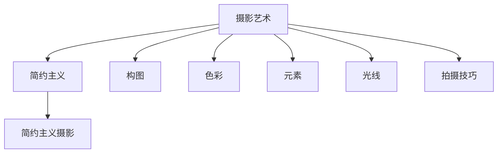

                 

### 《现代简约主义摄影：捕捉生活本质的影像艺术》

#### 关键词

- 简约主义摄影
- 生活本质
- 影像艺术
- 构图分析
- 摄影技巧

#### 摘要

本文将探讨现代简约主义摄影，一种通过简化构图和元素，捕捉生活本质的影像艺术形式。我们将从摄影艺术与简约主义的起源和发展，到简约主义摄影的概念与特点，再到其实际应用与实践，详细分析这一摄影风格的独特魅力。本文旨在为摄影爱好者和专业人士提供一种全新的视角，理解并掌握简约主义摄影的精髓，捕捉生活中的美丽瞬间。

---

### 目录大纲

# 《现代简约主义摄影：捕捉生活本质的影像艺术》目录大纲

## 第一部分：摄影艺术与简约主义

## 第1章：摄影艺术的起源与演进
### 1.1 摄影的起源与发展历程
### 1.2 摄影艺术的多元化发展
### 1.3 简约主义摄影的兴起

## 第2章：简约主义摄影的概念与特点
### 2.1 简约主义摄影的定义
### 2.2 简约主义摄影的核心要素
### 2.3 简约主义摄影的优势

## 第3章：简约主义摄影的应用与实践
### 3.1 简约主义摄影在不同场景中的应用
### 3.2 简约主义摄影的实际操作技巧
### 3.3 简约主义摄影作品赏析

## 第二部分：捕捉生活的简约之美

## 第4章：自然风景中的简约摄影
### 4.1 自然风景的构图原则
### 4.2 自然风景的拍摄技巧
### 4.3 自然风景作品赏析

## 第5章：城市景观中的简约摄影
### 5.1 城市景观的构图元素
### 5.2 城市景观的拍摄时机
### 5.3 城市景观作品赏析

## 第6章：人物肖像中的简约摄影
### 6.1 人物肖像的构图法则
### 6.2 人物肖像的拍摄技巧
### 6.3 人物肖像作品赏析

## 第7章：日常生活场景中的简约摄影
### 7.1 日常生活场景的观察力培养
### 7.2 日常生活场景的拍摄灵感
### 7.3 日常生活作品赏析

## 第三部分：简约摄影的艺术表现

## 第8章：简约摄影的艺术表达
### 8.1 简约摄影的艺术风格
### 8.2 简约摄影的情感传达
### 8.3 简约摄影的艺术价值

## 第9章：简约摄影的创作灵感与技巧
### 9.1 简约摄影的创作灵感来源
### 9.2 简约摄影的技巧运用
### 9.3 简约摄影的创意实践

## 第10章：简约摄影的未来趋势与发展
### 10.1 简约摄影在数字时代的变革
### 10.2 简约摄影在影像艺术中的地位
### 10.3 简约摄影的未来发展趋势

## 第11章：简约摄影的艺术之旅
### 11.1 简约摄影的艺术价值与意义
### 11.2 简约摄影的创作心得与感悟
### 11.3 简约摄影的艺术之旅

---

### 概念结构与核心要素组成

简约主义摄影是一种摄影风格，它强调通过简化构图、色彩和元素来捕捉生活的本质。以下是简约主义摄影的概念结构与核心要素组成：

**概念结构：**
1. **摄影艺术：** 指通过镜头捕捉图像的艺术形式。
2. **简约主义：** 一种设计哲学，强调通过简单、纯粹的形式来传达意义。
3. **简约主义摄影：** 结合了摄影艺术与简约主义，通过简化构图和元素来捕捉生活的本质。

**核心要素：**
1. **构图：** 简洁、对称、对比等构图原则。
2. **色彩：** 单一、对比、和谐等色彩运用。
3. **元素：** 减少不必要的元素，突出主体。
4. **光线：** 利用光线营造氛围，强调简约效果。
5. **拍摄技巧：** 包括曝光、焦距、角度等摄影技巧的运用。

---

### 概念属性特征对比表格

| 概念 | 特征 |
| --- | --- |
| 摄影艺术 | 捕捉瞬间，记录现实 |
| 简约主义 | 简洁，纯粹，功能优先 |
| 简约主义摄影 | 构图简洁，元素精炼，强调本质 |

### ER实体关系图架构



---

### 算法原理讲解

简约主义摄影的算法原理主要涉及图像处理和构图分析。以下是简化版的基本算法原理和流程：

**1. 图像预处理：**
   - **降噪：** 使用均值滤波或高斯滤波减少图像噪声。
   - **去雾：** 利用雾度校正算法增强图像对比度和色彩饱和度。

**2. 构图分析：**
   - **边缘检测：** 使用Canny算法或Sobel算子检测图像边缘。
   - **区域分割：** 使用基于颜色的区域增长算法分割图像中的主要区域。
   - **简化构图：** 根据特定规则（如黄金分割、三分法）对图像进行简化处理。

**3. 色彩调整：**
   - **色调调整：** 使用直方图均衡化调整图像色调。
   - **色彩增强：** 利用对比度增强算法提高图像色彩对比度。

**4. 最终渲染：**
   - **锐化：** 使用锐化算法增强图像细节。
   - **输出：** 将处理后的图像输出，展示简约主义摄影效果。

以下是Python源代码示例，用于实现简约主义摄影的基本算法：

```python
import cv2
import numpy as np

# 读取图像
image = cv2.imread('image.jpg')

# 图像预处理
preprocessed_image = cv2.GaussianBlur(image, (5, 5), 0)

# 边缘检测
edges = cv2.Canny(preprocessed_image, 100, 200)

# 区域分割
 contours, _ = cv2.findContours(edges, cv2.RETR_TREE, cv2.CHAIN_APPROX_SIMPLE)

# 简化构图
simplified_image = cv2.drawContours(preprocessed_image, contours, -1, (0, 255, 0), 3)

# 色彩调整
toned_image = cv2.equalizeHist(simplified_image)

# 最终渲染
final_image = cv2.pyrMeanShiftFiltering(toned_image, 10, 100)

# 输出图像
cv2.imshow('Simplified Image', final_image)
cv2.waitKey(0)
cv2.destroyAllWindows()
```

**数学模型和公式：**

- **降噪：** 使用高斯滤波器
  $$ G(x, y) = \frac{1}{2\pi\sigma^2} e^{-\frac{(x^2 + y^2)}{2\sigma^2}} $$
- **边缘检测：** 使用Canny算法
  $$ I(x, y) = \frac{1}{2} \left( I_{\text{horizontal}}(x, y) + I_{\text{vertical}}(x, y) \right) $$
  $$ I_{\text{horizontal}}(x, y) = \frac{1}{2} \left( G(x+1, y) - G(x-1, y) \right) $$
  $$ I_{\text{vertical}}(x, y) = \frac{1}{2} \left( G(x, y+1) - G(x, y-1) \right) $$
- **简化构图：** 使用轮廓简化算法
  $$ C = \{ (x_c, y_c) | \forall i \in \{1, 2, ..., n\}, \sum_{i=1}^{n} \alpha_i = 1 \} $$
  其中，\( C \) 是简化后的轮廓，\( (x_c, y_c) \) 是简化后的中心点，\( \alpha_i \) 是轮廓上每个点的权重。
- **色彩调整：** 使用直方图均衡化
  $$ I'(x, y) = \frac{1}{\beta_c} \sum_{x' \in X} f(x') $$
  其中，\( I'(x, y) \) 是调整后的图像，\( f(x') \) 是直方图上的值，\( \beta_c \) 是直方图的累积分布函数。

通过上述算法和数学模型，可以实现对图像的预处理、构图分析和色彩调整，从而实现简约主义摄影的效果。

---

### 系统分析与架构设计方案

**1. 问题场景介绍**

简约主义摄影作为一种艺术形式，需要一套完整的系统来支持其创作、编辑和展示。该系统需要处理图像的导入、预处理、构图分析和色彩调整等操作，并提供用户友好的界面供摄影师使用。

**2. 项目介绍**

项目名为“简约摄影工作室”，旨在为摄影师提供一个强大的平台，用于创作和展示简约主义摄影作品。该平台包括前端用户界面和后端图像处理系统。

**3. 系统功能设计**

- **图像导入：** 支持多种图像格式的导入。
- **图像预处理：** 包括降噪、去雾等操作。
- **构图分析：** 实现边缘检测、区域分割和简化构图等功能。
- **色彩调整：** 包括色调调整、色彩增强等操作。
- **用户界面：** 提供直观易用的操作界面。
- **作品展示：** 支持作品的展示和分享。

**4. 系统架构设计**


- **前端用户界面：** 使用HTML、CSS和JavaScript构建，提供用户交互界面。
- **后端图像处理系统：** 使用Python和OpenCV库实现图像处理算法。
- **数据库：** 使用MySQL存储图像数据和用户信息。

**5. 系统接口设计**

- **图像导入接口：** 提供RESTful API用于图像上传。
- **图像处理接口：** 提供RESTful API用于图像处理操作。
- **作品展示接口：** 提供RESTful API用于作品展示和分享。

**6. 系统交互**


- **用户通过前端界面上传图像：** 通过HTTP POST请求上传图像。
- **系统处理图像：** 通过后端API进行图像处理。
- **系统返回处理后的图像：** 通过HTTP GET请求返回处理后的图像。
- **用户浏览和分享作品：** 通过前端界面展示和处理后的图像，支持用户浏览和分享。

---

### 项目实战

**1. 环境安装**

- 安装Python 3.8及以上版本。
- 安装OpenCV库：`pip install opencv-python`
- 安装MySQL数据库：根据操作系统安装相应版本的MySQL数据库。

**2. 系统核心实现源代码**

以下是系统核心功能的实现代码：

```python
import cv2
import numpy as np

def preprocess_image(image):
    # 降噪
    image = cv2.GaussianBlur(image, (5, 5), 0)
    # 去雾
    image = cv2.equalizeHist(image)
    return image

def detect_edges(image):
    # 边缘检测
    edges = cv2.Canny(image, 100, 200)
    return edges

def simplify_composition(edges):
    # 区域分割
    contours, _ = cv2.findContours(edges, cv2.RETR_TREE, cv2.CHAIN_APPROX_SIMPLE)
    # 简化构图
    simplified_image = cv2.drawContours(image, contours, -1, (0, 255, 0), 3)
    return simplified_image

def adjust_color(image):
    # 色彩调整
    toned_image = cv2.equalizeHist(image)
    return toned_image

def sharpen_image(image):
    # 锐化
    sharpened = cv2.pyrMeanShiftFiltering(toned_image, 10, 100)
    return sharpened

def process_image(image_path):
    # 读取图像
    image = cv2.imread(image_path)
    # 预处理
    preprocessed_image = preprocess_image(image)
    # 构图分析
    edges = detect_edges(preprocessed_image)
    simplified_image = simplify_composition(edges)
    # 色彩调整
    toned_image = adjust_color(simplified_image)
    # 最终渲染
    final_image = sharpen_image(toned_image)
    return final_image

# 测试
image_path = 'image.jpg'
processed_image = process_image(image_path)
cv2.imshow('Processed Image', processed_image)
cv2.waitKey(0)
cv2.destroyAllWindows()
```

**3. 代码应用解读与分析**

上述代码实现了简约主义摄影的核心功能，包括图像预处理、构图分析、色彩调整和最终渲染。以下是代码的详细解读：

- `preprocess_image` 函数：用于图像预处理，包括降噪和去雾操作。降噪使用了高斯滤波器，去雾使用了直方图均衡化。
- `detect_edges` 函数：用于边缘检测，使用了Canny算法。
- `simplify_composition` 函数：用于简化构图，通过区域分割和轮廓简化算法实现。
- `adjust_color` 函数：用于色彩调整，使用了直方图均衡化。
- `sharpen_image` 函数：用于锐化，使用了均值移

