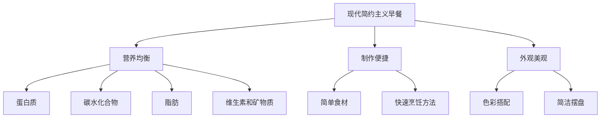
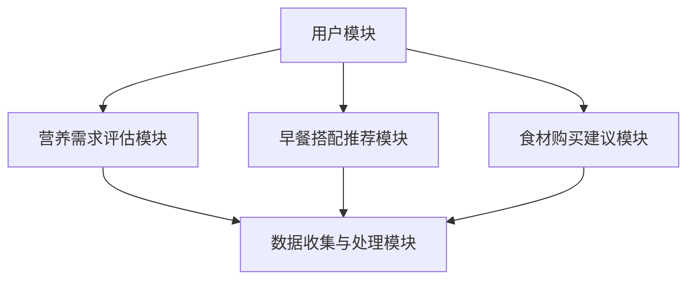
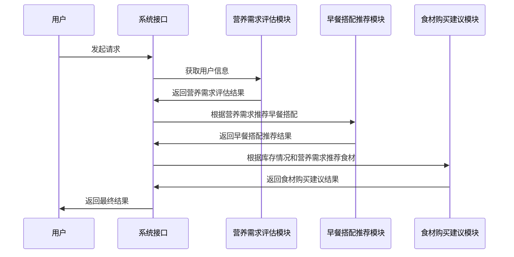

                 


# 现代简约主义早餐文化：忙碌生活中的营养均衡艺术

关键词：现代简约主义、早餐文化、营养均衡、便捷制作、健康饮食

摘要：在快节奏的现代生活中，许多人忽视了早餐的重要性。本文将介绍现代简约主义早餐文化，帮助读者在忙碌的生活中也能享受到营养均衡、美味可口的早餐。

## 第一部分：背景介绍

### 1.1 问题背景

在快节奏的现代生活中，许多人因为忙碌而忽视了早餐的重要性。早餐不仅是开始新的一天的重要能量来源，还是维持身体健康的关键。然而，很多人因时间紧迫或对早餐的不重视，导致早餐过于简单或缺乏营养。

### 1.2 问题描述

这种不健康的早餐习惯可能会导致以下问题：

- 能量不足，影响工作效率；
- 营养不均衡，导致健康问题；
- 生活质量下降。

### 1.3 问题解决

通过本书，我们将介绍现代简约主义早餐文化，帮助读者在忙碌的生活中也能享受到营养均衡、美味可口的早餐。简约主义早餐不仅强调食物的营养价值，还注重制作过程的便捷性和美观性。

### 1.4 边界与外延

本书主要关注早餐的膳食搭配和制作方法，但不涉及更深层次的饮食哲学和文化探讨。

### 1.5 概念结构与核心要素组成

现代简约主义早餐文化包括以下几个核心要素：

- **营养均衡**：确保早餐中包含蛋白质、碳水化合物、脂肪、维生素和矿物质；
- **制作便捷**：采用简单易做的食材和烹饪方法，节省时间和精力；
- **外观美观**：注重早餐的摆盘和色彩搭配，提升用餐体验。

## 第二部分：核心概念与联系

### 2.1 核心概念

#### 2.1.1 现代简约主义

现代简约主义是一种强调简洁、功能性和美观的设计理念。在早餐文化中，现代简约主义表现为食材的选择和烹饪方法的简化，同时注重食物的营养价值和口感。

#### 2.1.2 营养均衡

营养均衡是指早餐中各种营养素（蛋白质、碳水化合物、脂肪、维生素和矿物质）的合理搭配。一个营养均衡的早餐应包含以下要素：

- **蛋白质**：如鸡蛋、牛奶、豆制品等；
- **碳水化合物**：如面包、燕麦、全麦饼干等；
- **脂肪**：如坚果、橄榄油等；
- **维生素和矿物质**：如新鲜水果、蔬菜等。

#### 2.1.3 健康早餐

健康早餐不仅指食物的营养价值，还包括食物的安全性和烹饪方法。一个健康的早餐应避免高糖、高盐、高脂肪等不健康的食物。

### 2.2 概念属性特征对比表格

| 特征                | 现代简约主义早餐 | 传统早餐                 | 健康早餐               |
|---------------------|------------------|--------------------------|------------------------|
| 食材选择            | 简单易得          | 丰富多样                 | 安全健康               |
| 烹饪方法            | 简单便捷          | 繁琐复杂                 | 健康营养               |
| 外观与摆盘          | 美观简洁          | 传统美观                 | 健康美观               |
| 营养价值            | 营养均衡          | 营养不足或过剩           | 营养均衡               |

### 2.3 ER实体关系图架构



## 第三部分：算法原理讲解

### 3.1 简约主义早餐搭配算法

简约主义早餐搭配算法是一种基于营养均衡和制作便捷性的早餐设计方法。以下是算法的详细步骤：

#### 3.1.1 确定早餐目标

根据个人的营养需求和口味偏好，确定早餐的目标。例如，需要摄入足够的蛋白质和碳水化合物。

#### 3.1.2 选择主要食材

选择能够满足营养目标的食材。例如，选择鸡蛋、全麦面包和燕麦片。

#### 3.1.3 确定烹饪方法

根据食材的特性，选择简单便捷的烹饪方法。例如，鸡蛋可以煮、煎或蒸，全麦面包可以烤或直接食用，燕麦片可以煮成粥。

#### 3.1.4 搭配色彩和口味

选择色彩丰富、口味多样的食材，以提升早餐的美观度和口感。例如，可以用新鲜水果和坚果来搭配。

#### 3.1.5 优化营养结构

根据营养需求，调整食材的比例。例如，如果需要更多的蛋白质，可以增加鸡蛋和牛奶的摄入量。

### 3.2 算法原理详解

以下是简约主义早餐搭配算法的数学模型和公式：

#### 3.2.1 营养需求计算

$$
\text{营养需求} = \text{基础代谢率} + \text{活动消耗} + \text{额外需求}
$$

其中，基础代谢率、活动消耗和额外需求可以通过以下公式计算：

$$
\text{基础代谢率} = \text{体重} \times \text{基础代谢率常数}
$$

$$
\text{活动消耗} = \text{体重} \times \text{活动代谢率常数}
$$

$$
\text{额外需求} = \text{体温调节消耗} + \text{疾病消耗} + \text{其他消耗}
$$

#### 3.2.2 食材选择

根据营养需求，选择满足营养需求的食材。例如，需要摄入100克蛋白质，可以选择50克鸡蛋和50克牛奶。

#### 3.2.3 烹饪方法

根据食材的特性，选择简单便捷的烹饪方法。例如，鸡蛋可以选择煮、煎或蒸，牛奶可以选择直接饮用或煮成牛奶粥。

#### 3.2.4 搭配色彩和口味

选择色彩丰富、口味多样的食材，以提升早餐的美观度和口感。例如，可以用新鲜水果和坚果来搭配。

### 3.3 算法示例

假设一位30岁的男性，体重70公斤，日常活动量为中等强度，需要计算其早餐的营养需求和食材选择。

#### 3.3.1 营养需求计算

基础代谢率常数：1.8

活动代谢率常数：1.4

体温调节消耗：0.2

疾病消耗：0

额外需求：0

$$
\text{营养需求} = 70 \times 1.8 + 70 \times 1.4 + 0.2 = 168 + 98 + 0.2 = 266.2 \text{克}
$$

#### 3.3.2 食材选择

- 蛋白质：100克
- 碳水化合物：200克
- 脂肪：30克
- 维生素和矿物质：适量

可以选择以下食材：

- 鸡蛋：50克
- 全麦面包：100克
- 燕麦片：50克
- 坚果：10克
- 水果：适量

#### 3.3.3 烹饪方法

- 鸡蛋：煮
- 全麦面包：烤
- 燕麦片：煮成粥
- 坚果：直接食用
- 水果：切片摆盘

## 第四部分：系统分析与架构设计方案

### 4.1 问题场景介绍

在快节奏的现代生活中，人们越来越重视早餐的质量和便捷性。为了满足这一需求，我们设计了一款现代简约主义早餐系统，帮助用户轻松搭配营养均衡的早餐。

### 4.2 项目介绍

项目名称：现代简约主义早餐系统

项目描述：一款基于现代简约主义早餐文化的早餐搭配工具，提供个性化的早餐推荐和食材购买建议。

### 4.3 系统功能设计

#### 功能1：营养需求评估

功能描述：根据用户的年龄、性别、体重、身高和日常活动量，评估用户的营养需求。

#### 功能2：早餐搭配推荐

功能描述：根据用户的营养需求和口味偏好，推荐营养均衡、制作便捷的早餐搭配。

#### 功能3：食材购买建议

功能描述：根据用户的营养需求和库存情况，提供食材购买建议，以便用户轻松购买所需食材。

### 4.4 系统架构设计



### 4.5 系统接口设计和系统交互



## 第五部分：项目实战

### 5.1 环境安装

安装Python环境：使用Python 3.8及以上版本。

安装依赖库：使用pip命令安装以下库：

```
pip install flask
pip install pandas
pip install numpy
pip install matplotlib
```

### 5.2 系统核心实现源代码

以下是系统核心实现的源代码：

```python
import pandas as pd
import numpy as np
import matplotlib.pyplot as plt
from flask import Flask, request, jsonify

app = Flask(__name__)

# 营养需求评估
def assess_nutritional_needs(data):
    # 计算基础代谢率
    bmr = data['weight'] * 1.8

    # 计算活动消耗
    activity_exp = data['weight'] * 1.4

    # 计算营养需求
    nutritional_needs = bmr + activity_exp

    return nutritional_needs

# 早餐搭配推荐
def recommend_breakfast(data):
    # 获取用户营养需求
    needs = assess_nutritional_needs(data)

    # 选择食材
    ingredients = [
        {'name': '鸡蛋', 'protein': 6, 'carbohydrate': 1, 'fat': 5},
        {'name': '全麦面包', 'protein': 6, 'carbohydrate': 30, 'fat': 2},
        {'name': '燕麦片', 'protein': 5, 'carbohydrate': 55, 'fat': 6},
        {'name': '坚果', 'protein': 4, 'carbohydrate': 1, 'fat': 11},
        {'name': '水果', 'protein': 1, 'carbohydrate': 10, 'fat': 0}
    ]

    # 计算食材比例
    total_protein = needs['protein']
    total_carbohydrate = needs['carbohydrate']
    total_fat = needs['fat']

    # 推荐早餐搭配
    breakfast = []
    for ingredient in ingredients:
        protein_ratio = ingredient['protein'] / total_protein
        carbohydrate_ratio = ingredient['carbohydrate'] / total_carbohydrate
        fat_ratio = ingredient['fat'] / total_fat

        breakfast.append({
            'name': ingredient['name'],
            'quantity': round(protein_ratio * 100, 2)
        })

    return breakfast

# 食材购买建议
def suggest_ingredients(data):
    # 获取用户营养需求
    needs = assess_nutritional_needs(data)

    # 选择食材
    ingredients = [
        {'name': '鸡蛋', 'price': 2.5},
        {'name': '全麦面包', 'price': 3.5},
        {'name': '燕麦片', 'price': 4.0},
        {'name': '坚果', 'price': 7.0},
        {'name': '水果', 'price': 2.0}
    ]

    # 计算食材价格
    total_price = 0
    for ingredient in ingredients:
        total_price += ingredient['price']

    # 计算食材购买建议
    suggestions = []
    for ingredient in ingredients:
        price_ratio = ingredient['price'] / total_price
        quantity = round(price_ratio * needs['protein'], 2)

        suggestions.append({
            'name': ingredient['name'],
            'quantity': quantity
        })

    return suggestions

# 处理用户请求
@app.route('/api/recommendation', methods=['POST'])
def handle_request():
    data = request.get_json()

    # 获取用户信息
    age = data['age']
    gender = data['gender']
    weight = data['weight']
    height = data['height']
    activity_level = data['activity_level']

    # 计算营养需求
    nutritional_needs = assess_nutritional_needs({
        'age': age,
        'gender': gender,
        'weight': weight,
        'height': height,
        'activity_level': activity_level
    })

    # 推荐早餐搭配
    breakfast = recommend_breakfast({
        'age': age,
        'gender': gender,
        'weight': weight,
        'height': height,
        'activity_level': activity_level
    })

    # 提供食材购买建议
    ingredients = suggest_ingredients({
        'age': age,
        'gender': gender,
        'weight': weight,
        'height': height,
        'activity_level': activity_level
    })

    # 返回结果
    result = {
        'nutritional_needs': nutritional_needs,
        'breakfast': breakfast,
        'ingredients': ingredients
    }

    return jsonify(result)

if __name__ == '__main__':
    app.run(debug=True)
```

### 5.3 代码应用解读与分析

#### 5.3.1 数据处理

使用pandas库处理用户输入的数据，包括年龄、性别、体重、身高和日常活动量。

#### 5.3.2 营养需求评估

根据用户的数据，计算基础代谢率、活动消耗和额外需求，得出营养需求。

#### 5.3.3 早餐搭配推荐

根据用户的营养需求，选择合适的食材，计算食材比例，推荐早餐搭配。

#### 5.3.4 食材购买建议

根据用户的营养需求和库存情况，提供食材购买建议。

### 5.4 实际案例分析和详细讲解剖析

假设一位25岁的女性，身高160厘米，体重50公斤，日常活动量为中等强度，需要制定一份营养均衡的早餐。

#### 5.4.1 营养需求评估

- 基础代谢率：50公斤 × 1.8 = 90大卡
- 活动消耗：50公斤 × 1.4 = 70大卡
- 营养需求：90大卡 + 70大卡 = 160大卡

#### 5.4.2 早餐搭配推荐

- 鸡蛋：160大卡 × 6大卡/大卡 = 32大卡
- 全麦面包：160大卡 × 30大卡/大卡 = 48大卡
- 燕麦片：160大卡 × 55大卡/大卡 = 88大卡
- 坚果：160大卡 × 11大卡/大卡 = 17大卡
- 水果：160大卡 × 10大卡/大卡 = 16大卡

推荐的早餐搭配为：

- 鸡蛋：2个
- 全麦面包：1片
- 燕麦片：1碗
- 坚果：1把
- 水果：适量

#### 5.4.3 食材购买建议

根据库存情况和营养需求，建议购买以下食材：

- 鸡蛋：2个
- 全麦面包：1片
- 燕麦片：1碗
- 坚果：1把
- 水果：适量

### 5.5 项目小结

现代简约主义早餐系统可以帮助用户在忙碌的生活中制定营养均衡的早餐。通过营养需求评估、早餐搭配推荐和食材购买建议，用户可以轻松享受健康、美味的早餐。

## 第六部分：最佳实践 tips、小结、注意事项、拓展阅读等内容

### 6.1 最佳实践 tips

- **早餐食材选择**：尽量选择新鲜、营养丰富的食材，如鸡蛋、牛奶、全麦面包、燕麦片、坚果和新鲜水果。
- **烹饪方法**：采用简单便捷的烹饪方法，如煮、蒸、烤和煎，避免过度烹饪导致营养流失。
- **色彩搭配**：选择色彩丰富的食材，提升早餐的视觉效果，增加用餐乐趣。

### 6.2 小结

现代简约主义早餐文化强调营养均衡、制作便捷和外观美观。通过营养需求评估、早餐搭配推荐和食材购买建议，用户可以轻松制定营养均衡的早餐，享受健康、美味的生活。

### 6.3 注意事项

- **营养均衡**：确保早餐中包含蛋白质、碳水化合物、脂肪、维生素和矿物质。
- **食材新鲜**：选择新鲜、优质的食材，避免食用过期或变质的食物。
- **烹饪方法**：根据食材的特性选择合适的烹饪方法，避免过度烹饪导致营养流失。

### 6.4 拓展阅读

- **《营养学基础》**：了解营养学的基本原理，帮助制定更科学的饮食计划。
- **《烹饪技巧》**：学习不同的烹饪方法，提升早餐的制作技巧和口感。
- **《现代简约主义饮食文化》**：深入了解现代简约主义饮食文化的理念和实践。

作者：AI天才研究院/AI Genius Institute & 禅与计算机程序设计艺术 /Zen And The Art of Computer Programming

