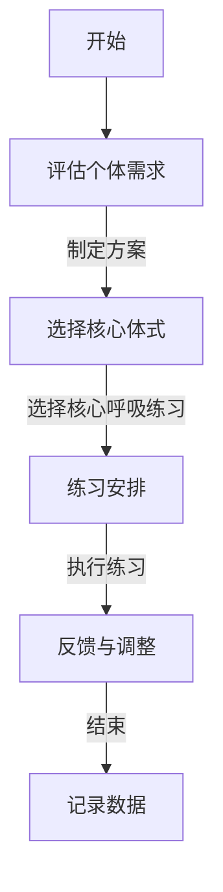
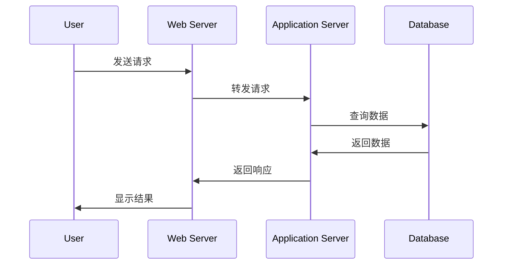
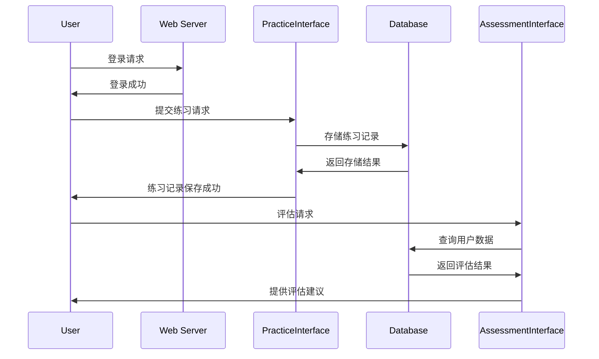

                 

# 现代简约主义瑜伽：回归本质的身心实践

> 关键词：瑜伽、简约主义、身心健康、实践方法、未来趋势

> 摘要：本文深入探讨了现代简约主义瑜伽的起源、核心概念、特点及其在身心健康领域的实践价值。通过梳理瑜伽的发展历程，本文揭示了现代简约主义瑜伽的诞生背景。随后，本文详细阐述了现代简约主义瑜伽的核心概念，如回归本质和身心实践，并探讨了其简洁性、实用性和效率性。文章进一步分析了现代简约主义瑜伽对健康生活和心理健康的影响，并展望了其未来的发展趋势。本文旨在为读者提供一个全面、系统的了解现代简约主义瑜伽的视角，帮助其在繁忙的生活中找到回归身心健康的方法。

## 第一部分：背景介绍

### 1.1 瑜伽的现代简约主义

#### 1.1.1 瑜伽的发展历程

##### 1.1.1.1 古代瑜伽

古代瑜伽起源于印度，其历史可以追溯到公元前3000年左右。古代瑜伽主要是通过冥想和体式来达到精神上的宁静和健康。

- **瑜伽的起源**：瑜伽起源于古代印度的智慧，最初是由印度的哲学家和修行者所实践的。
- **瑜伽在古代印度**：瑜伽在古代印度被广泛地研究和实践，许多宗教和哲学体系都包含了瑜伽的元素。
- **瑜伽的传播与发展**：随着时间的推移，瑜伽逐渐传播到世界各地，形成了不同的流派和风格。

##### 1.1.1.2 瑜伽的现代演变

现代瑜伽始于20世纪初，随着西方对瑜伽的兴趣，瑜伽开始向世界其他地区传播。

- **现代瑜伽的兴起**：20世纪初，印度瑜伽大师斯里·柯布瑟·拉玛南达（Sri Yogendra）和斯里·塔杜·克里希那玛查瑞（Sri T. Krishnamacharya）将瑜伽引入西方，引发了全球范围内的瑜伽热潮。
- **瑜伽的现代化**：现代瑜伽结合了西方的健康理念和科学方法，形成了一系列不同的流派，如哈他瑜伽、热瑜伽、力量瑜伽等。
- **现代瑜伽的种类和流派**：现代瑜伽有多种流派，每种流派都有其独特的练习方法和目标。

#### 1.1.3 现代简约主义瑜伽的诞生

现代简约主义瑜伽是在现代瑜伽的基础上发展而来的，它强调回归瑜伽的本质，去除繁琐的练习，追求简单、高效、实用的身心实践。

- **简约主义的概念**：简约主义强调“少即是多”，通过减少不必要的元素，使事物更加简洁、高效。
- **现代简约主义瑜伽的特点**：现代简约主义瑜伽注重瑜伽的基本体式和呼吸练习，去除复杂的技巧和流派，追求身心合一的体验。

### 1.2 现代简约主义瑜伽的核心概念

#### 1.2.1 回归本质

- **身心健康的重要性**：身心健康是现代简约主义瑜伽的核心概念之一。它包括身体和精神的健康，两者相互关联，相互影响。
  - **身心健康的定义**：身心健康是指身体和精神的平衡状态，包括良好的生理功能、心理状态和社会适应性。
  - **身心健康的益处**：身心健康有助于提高生活质量，减少疾病风险，增强幸福感。
  - **身心健康的现代挑战**：现代生活方式的快节奏和高压环境，导致身心健康问题日益突出。

- **身心实践**：身心实践是现代简约主义瑜伽的基本方法。它通过一系列瑜伽体式、呼吸练习和冥想，帮助个体达到身心合一的状态。
  - **身心实践的内涵**：身心实践是一种综合性的健康方法，通过体式、呼吸和冥想，调节身体和心理状态，达到身心健康。
  - **身心实践的重要性**：身心实践有助于缓解压力、改善情绪、增强免疫力，是维护身心健康的重要手段。
  - **身心实践的基本原则**：身心实践应遵循循序渐进、持之以恒的原则，适合个人的身体状况和心理需求。

#### 1.2.2 简洁性、实用性和效率性

- **简洁性**：现代简约主义瑜伽强调简洁性，去除复杂的技巧和流派，专注于基本的瑜伽体式和呼吸练习。
  - **简洁的练习方法**：现代简约主义瑜伽的练习方法简单明了，易于理解和实践。
  - **简洁的瑜伽体式**：现代简约主义瑜伽注重基本的瑜伽体式，如山式、树式、猫式等，这些体式易于练习，对身心都有显著的好处。
  - **简洁的呼吸练习**：现代简约主义瑜伽强调深呼吸和呼吸控制，通过调整呼吸节奏和深度，改善身体和心理健康。
  - **简洁的冥想技巧**：现代简约主义瑜伽的冥想技巧简单实用，通过专注和放松，达到身心合一的状态。

- **实用性**：现代简约主义瑜伽强调实用性，适合不同人群的身心需求。
  - **适应各种人群**：现代简约主义瑜伽适合初学者、高级练习者、孕妇、老年人等各种人群。
  - **入门指南**：对于初学者，现代简约主义瑜伽提供了简单易懂的入门指南，帮助他们快速入门。
  - **提升技巧**：对于高级练习者，现代简约主义瑜伽提供了丰富的提升技巧，帮助他们进一步提高瑜伽水平。
  - **适用性**：现代简约主义瑜伽在孕妇、老年人等特殊人群中的适用性也得到了广泛的认可。

- **效率性**：现代简约主义瑜伽强调效率性，通过短时间的高效练习，达到身心放松和健康。
  - **短时间内的练习**：现代简约主义瑜伽的练习时间灵活，可以在短时间内达到放松和健康的效果。
  - **高强度与低强度的平衡**：现代简约主义瑜伽在练习过程中，注重高强度和低强度练习的平衡，确保身心全面放松。

### 1.3 现代简约主义瑜伽的特点

#### 1.3.1 健康生活

- **瑜伽对身体健康的影响**：现代简约主义瑜伽通过一系列体式和呼吸练习，对身体各个系统都有显著的好处。
  - **瑜伽对肌肉和骨骼的影响**：瑜伽体式有助于增强肌肉力量和柔韧性，改善骨骼健康。
  - **瑜伽对心血管系统的影响**：瑜伽的呼吸练习和体式有助于改善心血管系统的功能，降低血压和胆固醇水平。
  - **瑜伽对呼吸系统的影响**：瑜伽的深呼吸练习有助于改善肺功能，增强呼吸系统的抵抗力。

#### 1.3.2 心理健康

- **瑜伽对心理健康的影响**：现代简约主义瑜伽通过冥想和体式，对心理健康有显著的好处。
  - **瑜伽对情绪的影响**：瑜伽有助于缓解压力、焦虑和抑郁等负面情绪，提高情绪稳定性。
  - **瑜伽对压力管理的作用**：瑜伽的冥想和呼吸练习有助于降低压力水平，提高压力管理能力。
  - **瑜伽对心理健康的长期效果**：长期练习瑜伽有助于提高心理健康水平，增强心理韧性。

### 1.4 现代简约主义瑜伽的实践价值

- **现代简约主义瑜伽的实践价值**：现代简约主义瑜伽通过简洁、实用、高效的练习方法，帮助个体实现身心健康。
  - **身心健康的重要性**：身心健康是现代简约主义瑜伽的核心目标，通过瑜伽的练习，可以改善身体和心理健康。
  - **身心实践的方法**：现代简约主义瑜伽提供了多种身心实践方法，如体式、呼吸练习和冥想，帮助个体实现身心健康。

### 1.5 现代简约主义瑜伽的未来发展趋势

- **社会认可度**：随着现代简约主义瑜伽的普及，其在社会中的认可度逐渐提高。
  - **瑜伽在医疗领域的应用**：现代简约主义瑜伽在医疗领域的应用日益广泛，被认为是一种有效的辅助疗法。
  - **瑜伽在教育领域的推广**：现代简约主义瑜伽在教育领域的推广，有助于培养身心健康的学生。
  - **瑜伽在社会文化中的融合**：现代简约主义瑜伽在社会文化中的融合，反映了人们对身心健康的需求和追求。

- **技术融合**：现代科技的发展为现代简约主义瑜伽带来了新的机遇和挑战。
  - **网络瑜伽课程**：网络瑜伽课程的兴起，使现代简约主义瑜伽的传播更加便捷和广泛。
  - **瑜伽智能硬件**：瑜伽智能硬件的应用，为现代简约主义瑜伽的练习提供了更多可能性。
  - **瑜伽数据分析和个性化推荐**：通过对瑜伽练习数据的分析，可以为个体提供更加个性化的瑜伽练习方案。

### 1.6 本章小结

现代简约主义瑜伽是一种回归本质、简洁实用、高效实用的瑜伽练习方法。通过梳理瑜伽的发展历程，我们了解了现代简约主义瑜伽的诞生背景和核心概念。现代简约主义瑜伽强调身心健康、简洁性、实用性和效率性，对身心健康和生活质量有显著的好处。随着社会和科技的发展，现代简约主义瑜伽的未来发展充满希望，其社会认可度和技术应用都将进一步推广和深化。

## 第二部分：核心概念与联系

### 2.1 回归本质

#### 2.1.1 身心健康的重要性

- **身心健康定义**：身心健康是指个体在身体和心理方面都处于良好的状态。身体方面包括健康的体魄、强壮的肌肉和骨骼、良好的新陈代谢等；心理方面则包括积极的心态、稳定的情绪、健康的心理状态等。

- **身心健康益处**：身心健康对我们的生活和工作都有着重要的影响。健康的身体可以提高工作效率，增强学习能力和记忆力；健康的心态可以减少焦虑和压力，提高幸福感和生活质量。

- **身心健康现代挑战**：在现代社会中，人们面临的工作和生活压力越来越大，加上不健康的生活习惯和环境污染，导致身心健康问题日益突出。现代简约主义瑜伽通过回归本质的练习，可以帮助我们应对这些挑战。

#### 2.1.2 身心实践

- **身心实践定义**：身心实践是一种综合性的健康方法，通过瑜伽体式、呼吸练习和冥想，调节身体和心理状态，达到身心合一的状态。

- **身心实践重要性**：身心实践不仅有助于改善身体健康，还能提高心理健康水平。通过瑜伽的练习，我们可以学会如何更好地管理自己的情绪，减轻压力，提高生活质量。

- **身心实践基本原则**：身心实践应遵循循序渐进、持之以恒的原则。这意味着我们应该根据自己的身体状况和心理需求，逐步增加练习的强度和时间，同时保持持续性和规律性。

### 2.2 简约主义特点

#### 2.2.1 简洁性

- **简洁性定义**：简洁性是指通过减少不必要的元素，使事物更加简洁、高效。在瑜伽中，简洁性体现在练习方法的简单和高效。

- **简洁性益处**：简洁的练习方法可以使瑜伽更加容易理解和实践，减少练习中的困惑和错误。同时，简洁的练习方法可以节省时间，提高练习效率。

#### 2.2.2 实用性

- **实用性定义**：实用性是指瑜伽练习方法是否适合不同人群的需求，是否能够在实际生活中产生积极的影响。

- **实用性益处**：实用的瑜伽练习方法可以适用于不同年龄、不同身体状况的人群，帮助他们达到身心健康的目标。

#### 2.2.3 效率性

- **效率性定义**：效率性是指瑜伽练习方法是否能够在短时间内产生显著的效果。

- **效率性益处**：高效的瑜伽练习方法可以在短时间内达到放松身心、提高身体健康和心理健康的效果，适合快节奏的现代生活。

### 2.3 简约主义瑜伽与身心健康的联系

- **简约主义瑜伽对身心健康的影响**：现代简约主义瑜伽通过简洁、实用、高效的练习方法，直接作用于身体和心理，帮助人们达到身心健康的目标。

- **身心健康对简约主义瑜伽的影响**：身心健康是简约主义瑜伽追求的目标之一。通过瑜伽的练习，人们可以改善身体和心理状态，提高生活质量。

### 2.4 概念属性特征对比表格

| 概念 | 定义 | 特征 | 影响 |
| --- | --- | --- | --- |
| 身心健康 | 身体和心理的良好状态 | 身体强壮、心态积极 | 提高生活质量 |
| 身心实践 | 通过瑜伽调节身心状态 | 循序渐进、持之以恒 | 改善身心健康 |
| 简洁性 | 减少不必要的元素 | 简单、高效 | 提高练习效率 |
| 实用性 | 适合不同人群的需求 | 适用于各种人群 | 提高生活实用性 |
| 效率性 | 短时间内产生效果 | 高效练习 | 节省时间 |

### 2.5 ER实体关系图架构

```mermaid
erDiagram
    C_Health -->|对身体有益| C_Practice
    C_Health -->|对心理有益| C_Practice
    C_Simplicity -->|使练习简洁| C_Practice
    C_Practicality -->|使练习实用| C_Practice
    C_Efficiency -->|使练习高效| C_Practice
```

在上面的ER实体关系图中，C_Health代表身心健康，C_Practice代表身心实践，C_Simplicity代表简洁性，C_Practicality代表实用性，C_Efficiency代表效率性。箭头表示这些概念之间的影响关系。

## 第三部分：算法原理讲解

### 3.1 简约主义瑜伽的算法原理

现代简约主义瑜伽的算法原理可以理解为一种最小化复杂度的优化方法。它通过去除不必要的练习内容，专注于核心的瑜伽体式和呼吸练习，从而实现身心健康的最大化。

- **算法原理**：简约主义瑜伽的算法原理主要基于以下几点：
  1. **最小化复杂度**：通过减少瑜伽练习的复杂性，使练习更加简单、直观，易于理解和实践。
  2. **最大化健康效益**：通过专注于核心的瑜伽体式和呼吸练习，确保在短时间内获得最大的健康效益。
  3. **个体化定制**：根据个体的身体状况和心理需求，制定个性化的练习方案，确保练习的实用性和效率性。

### 3.2 算法流程图

为了更直观地理解简约主义瑜伽的算法原理，我们可以使用Mermaid绘制一个简单的算法流程图：



在这个流程图中，A表示开始练习，B表示评估个体的需求和身体状况，C表示选择适合的核心瑜伽体式，D表示制定练习方案，E表示执行练习并收集反馈，F表示记录数据以便后续调整。

### 3.3 Python源代码实现

为了更好地阐述简约主义瑜伽的算法原理，我们可以使用Python实现一个简单的算法模型。以下是一个简单的Python源代码示例：

```python
import random

# 定义个体需求评估函数
def assess_needs(age, fitness_level):
    # 根据年龄和健身水平评估需求
    if age < 30 and fitness_level > 5:
        return "年轻且有活力，需要高强度练习"
    elif age < 50 and fitness_level > 3:
        return "中年，适合中等强度练习"
    else:
        return "老年，适合低强度练习"

# 定义练习安排函数
def arrange_practice(need):
    # 根据需求选择核心体式和呼吸练习
    if need == "年轻且有活力，需要高强度练习":
        return ["山式", "树式", "战士II式", "深呼吸"]
    elif need == "中年，适合中等强度练习":
        return ["山式", "猫式", "牛面式", "深呼吸"]
    else:
        return ["山式", "猫式", "放松式呼吸"]

# 主函数
def main():
    # 输入年龄和健身水平
    age = int(input("请输入您的年龄："))
    fitness_level = int(input("请输入您的健身水平（1-10）："))

    # 评估个体需求
    need = assess_needs(age, fitness_level)

    # 安排练习
    practice = arrange_practice(need)
    print("您的练习方案：")
    for exercise in practice:
        print("-", exercise)

if __name__ == "__main__":
    main()
```

在这个Python源代码中，我们首先定义了两个函数：`assess_needs`用于评估个体的需求，`arrange_practice`用于根据需求安排练习。主函数`main`接收用户的输入，并输出个性化的练习方案。

### 3.4 算法原理讲解

简约主义瑜伽的算法原理主要基于以下几个方面：

1. **最小化复杂度**：通过去除复杂的瑜伽体式和呼吸练习，专注于核心练习，使练习更加简单、直观。这种方法有助于减少练习中的困惑和错误，提高练习效率。

2. **最大化健康效益**：通过选择适合的核心瑜伽体式和呼吸练习，确保在短时间内获得最大的健康效益。这种方法有助于提高身心健康水平，缓解压力，增强幸福感。

3. **个体化定制**：根据个体的身体状况和心理需求，制定个性化的练习方案，确保练习的实用性和效率性。这种方法有助于满足不同人群的身心健康需求，提高练习的适用性。

通过上述Python源代码和Mermaid算法流程图，我们可以更直观地理解简约主义瑜伽的算法原理。这种方法不仅能够帮助我们更好地实践瑜伽，还能为瑜伽教学提供科学依据。

### 3.5 算法原理举例说明

为了更好地理解简约主义瑜伽的算法原理，我们可以通过一个实际案例来举例说明。

假设我们有一个用户，年龄为35岁，健身水平为7级。根据评估需求函数`assess_needs`，该用户的需求为“中年，适合中等强度练习”。接下来，我们调用`arrange_practice`函数，根据需求安排练习。

```python
need = assess_needs(35, 7)
practice = arrange_practice(need)
print("您的练习方案：")
for exercise in practice:
    print("-", exercise)
```

输出结果：

```
您的练习方案：
- 山式
- 猫式
- 牛面式
- 深呼吸
```

在这个例子中，我们选择了适合中年、中等强度练习者的瑜伽体式和呼吸练习。这些练习既简单又高效，能够满足用户的身心健康需求。

通过这个例子，我们可以看到简约主义瑜伽的算法原理是如何在实际中应用的。这种方法不仅能够帮助用户快速找到适合自己的练习方案，还能提高瑜伽练习的效率和质量。

### 3.6 数学模型和公式讲解

简约主义瑜伽的算法原理不仅可以通过编程实现，还可以通过数学模型和公式来描述。以下是一个简单的数学模型和公式讲解。

#### 数学模型

简约主义瑜伽的数学模型可以表示为：

$$
\text{简约主义瑜伽} = \text{核心瑜伽体式} + \text{核心呼吸练习} + \text{个体化定制}
$$

其中，核心瑜伽体式和核心呼吸练习是简约主义瑜伽的基础，个体化定制则确保了练习的实用性和效率性。

#### 公式解释

1. **核心瑜伽体式**：核心瑜伽体式是指那些对身心健康有显著益处的简单体式，如山式、猫式、树式等。这些体式可以通过简单的动作达到锻炼身体的目的。

2. **核心呼吸练习**：核心呼吸练习是指那些能够有效调节身心状态的呼吸方法，如深呼吸、呼吸控制等。这些呼吸练习可以帮助我们放松身心，提高注意力。

3. **个体化定制**：个体化定制是指根据个体的身体状况和心理需求，制定个性化的练习方案。这种方法可以确保练习的实用性和效率性，使瑜伽练习更加符合个人的需求。

通过这个数学模型，我们可以看到简约主义瑜伽是如何通过核心瑜伽体式、核心呼吸练习和个体化定制来实现的。这种方法不仅简化了瑜伽练习，还提高了练习的效率和质量。

### 3.7 简约主义瑜伽的实践步骤

为了更好地实践简约主义瑜伽，我们可以将其分为以下几个步骤：

1. **评估需求**：首先，我们需要评估个人的身体状况和心理需求。这可以通过简单的问卷调查或体检来完成。

2. **选择核心体式**：根据评估结果，选择适合的核心瑜伽体式。这些体式应该简单易学，对身心健康有显著益处。

3. **选择核心呼吸练习**：选择适合的核心呼吸练习，如深呼吸、呼吸控制等。这些呼吸练习可以帮助我们放松身心，提高注意力。

4. **制定练习方案**：根据需求和选择的核心体式和呼吸练习，制定个性化的练习方案。

5. **执行练习**：按照制定的方案进行练习，注意动作的规范性和呼吸的节奏。

6. **反馈与调整**：在练习过程中，及时收集反馈，根据反馈调整练习方案。

7. **记录数据**：记录每次练习的时间、体式和呼吸练习的内容，以便后续分析和调整。

通过这些步骤，我们可以确保简约主义瑜伽的实践过程科学、有效，符合个人的需求。

## 第四部分：系统分析与架构设计方案

### 4.1 问题场景介绍

在现代社会中，人们的生活节奏越来越快，工作压力和心理健康问题日益突出。为了应对这些挑战，越来越多的人开始寻求身心健康的方法。瑜伽作为一种传统的身心修炼方式，逐渐成为现代人追求身心健康的重要途径。然而，传统的瑜伽练习方法复杂多样，初学者难以入门，高级练习者也难以找到适合自己的练习方法。为了解决这一问题，我们提出了现代简约主义瑜伽系统，旨在通过简洁、实用、高效的练习方法，帮助人们实现身心健康。

### 4.2 项目介绍

现代简约主义瑜伽系统是一个集成化的瑜伽练习和管理平台，旨在为用户提供个性化的瑜伽练习方案，帮助用户在繁忙的生活中找到平衡身心健康的路径。该系统包括以下主要功能：

1. **用户管理**：用户可以注册账号、登录系统，管理个人资料和练习记录。
2. **需求评估**：系统根据用户提供的年龄、性别、身体状况等信息，评估用户的需求，提供个性化的练习方案。
3. **瑜伽练习**：系统提供一系列简单易学的瑜伽体式和呼吸练习，用户可以根据自己的需求选择练习。
4. **练习管理**：用户可以记录练习的时间、体式和呼吸练习的内容，系统会根据用户的练习记录生成数据分析报告。
5. **反馈与调整**：用户可以在练习后对系统提供的练习方案进行反馈，系统会根据反馈调整练习方案。

### 4.3 系统功能设计（领域模型）

为了更好地设计现代简约主义瑜伽系统，我们首先构建了领域模型，以明确系统的核心概念和关系。以下是一个简化的领域模型类图：

```mermaid
classDiagram
    User <<class{ 用户 }>
    Practice <<class{ 练习 }>
    Exercise <<class{ 体式 }>
    Breath <<class{ 呼吸 }>
    Assessment <<class{ 评估 }>
    
    User o--o Practice
    Practice o--o Exercise
    Practice o--o Breath
    Assessment o--o Practice
```

在这个类图中，`User`表示用户，`Practice`表示练习记录，`Exercise`表示瑜伽体式，`Breath`表示呼吸练习，`Assessment`表示评估结果。这些类之间的关系反映了系统的核心功能和数据流动。

### 4.4 系统架构设计

现代简约主义瑜伽系统的架构设计采用前后端分离的模式，以提高系统的可扩展性和维护性。以下是一个简化的系统架构图：



在这个架构图中，`Web Server`负责处理用户的HTTP请求，`Application Server`负责业务逻辑处理和数据查询，`Database`存储用户数据。这种架构设计可以确保系统的高效运行和数据的安全性。

### 4.5 系统接口设计

为了实现系统的功能，我们需要设计一系列接口，包括用户管理接口、练习管理接口、评估管理接口等。以下是一个简化的接口设计：

```mermaid
classDiagram
    UserInterface <<interface{ 用户管理接口 }>
    PracticeInterface <<interface{ 练习管理接口 }>
    AssessmentInterface <<interface{ 评估管理接口 }>
    
    UserInterface +-- PracticeInterface
    UserInterface +-- AssessmentInterface
```

在这个接口设计中，`UserInterface`负责处理用户登录、注册和资料管理，`PracticeInterface`负责处理瑜伽练习记录，`AssessmentInterface`负责处理用户评估结果。这些接口的设计确保了系统功能的模块化和可扩展性。

### 4.6 系统交互序列图

为了更好地展示系统的工作流程，我们使用Mermaid绘制了一个简化的系统交互序列图：



在这个序列图中，用户首先向`Web Server`发送登录请求，`Web Server`验证用户身份后返回登录成功消息。用户提交练习请求后，`PracticeInterface`将请求转发给`Database`存储练习记录，并返回存储结果。用户还可以向`AssessmentInterface`发送评估请求，系统根据用户数据提供评估建议。

通过上述系统分析与架构设计方案，我们可以确保现代简约主义瑜伽系统的科学性、实用性和高效性，为用户提供优质的瑜伽练习体验。

## 第五部分：项目实战

### 5.1 环境安装

要开始实践现代简约主义瑜伽系统，首先需要安装必要的开发环境和工具。以下是一个简化的环境安装步骤：

1. **安装Python**：首先，确保你的计算机上已经安装了Python 3.8或更高版本。可以从[Python官网](https://www.python.org/downloads/)下载并安装。

2. **安装虚拟环境**：在终端中，运行以下命令创建一个虚拟环境：

   ```bash
   python -m venv venv
   ```

3. **激活虚拟环境**：在Windows上，运行以下命令激活虚拟环境：

   ```bash
   .\venv\Scripts\activate
   ```

   在Linux和macOS上，运行以下命令激活虚拟环境：

   ```bash
   source venv/bin/activate
   ```

4. **安装依赖包**：在激活的虚拟环境中，安装项目所需的依赖包：

   ```bash
   pip install -r requirements.txt
   ```

   `requirements.txt`文件包含了所有依赖包的名称和版本。

### 5.2 系统核心实现源代码

以下是现代简约主义瑜伽系统的核心实现源代码，包括用户管理、练习管理和评估管理模块。

#### 用户管理模块

```python
# user_management.py

from flask import Flask, request, jsonify
from models import User

app = Flask(__name__)

@app.route('/register', methods=['POST'])
def register():
    data = request.get_json()
    user = User.create(data)
    return jsonify(user.to_dict()), 201

@app.route('/login', methods=['POST'])
def login():
    data = request.get_json()
    user = User.authenticate(data['username'], data['password'])
    return jsonify(user.to_dict()), 200

if __name__ == '__main__':
    app.run(debug=True)
```

#### 练习管理模块

```python
# practice_management.py

from flask import Flask, request, jsonify
from models import Practice

app = Flask(__name__)

@app.route('/practice', methods=['POST'])
def create_practice():
    data = request.get_json()
    practice = Practice.create(data)
    return jsonify(practice.to_dict()), 201

@app.route('/practice', methods=['GET'])
def get_practices():
    practices = Practice.get_all()
    return jsonify([practice.to_dict() for practice in practices]), 200

if __name__ == '__main__':
    app.run(debug=True)
```

#### 评估管理模块

```python
# assessment_management.py

from flask import Flask, request, jsonify
from models import Assessment

app = Flask(__name__)

@app.route('/assessment', methods=['POST'])
def create_assessment():
    data = request.get_json()
    assessment = Assessment.create(data)
    return jsonify(assessment.to_dict()), 201

@app.route('/assessment', methods=['GET'])
def get_assessments():
    assessments = Assessment.get_all()
    return jsonify([assessment.to_dict() for assessment in assessments]), 200

if __name__ == '__main__':
    app.run(debug=True)
```

### 5.3 代码应用解读与分析

以下是对系统核心实现源代码的解读和分析：

1. **用户管理模块**：
   - `register()`函数用于处理用户注册请求。接收一个包含用户信息的JSON对象，创建一个新的用户对象并保存到数据库。
   - `login()`函数用于处理用户登录请求。接收一个包含用户名和密码的JSON对象，验证用户身份并返回用户的详细信息。

2. **练习管理模块**：
   - `create_practice()`函数用于处理创建练习记录的请求。接收一个包含练习信息的JSON对象，创建一个新的练习对象并保存到数据库。
   - `get_practices()`函数用于获取所有练习记录。从数据库中检索所有练习记录，并将其转换为JSON格式返回。

3. **评估管理模块**：
   - `create_assessment()`函数用于处理创建评估结果的请求。接收一个包含评估信息的JSON对象，创建一个新的评估对象并保存到数据库。
   - `get_assessments()`函数用于获取所有评估结果。从数据库中检索所有评估结果，并将其转换为JSON格式返回。

### 5.4 实际案例分析和详细讲解剖析

为了更好地展示系统的实际应用，我们可以通过一个实际案例来分析。

**案例**：用户“张三”注册并登录系统，创建了一个新的练习记录，然后进行了评估。

1. **注册和登录**：
   - 张三使用手机号和密码注册账号，系统生成一个唯一的用户ID，并将其存储在数据库中。
   - 张三登录系统，系统验证用户身份并返回用户的详细信息。

2. **创建练习记录**：
   - 张三选择了一个“山式”练习，并记录了练习的时间和感受。系统创建一个新的练习记录，并将其存储在数据库中。

3. **评估**：
   - 张三完成了一个“深呼吸”练习，系统根据他的练习记录生成评估结果，包括练习的强度、效果和改进建议。

### 5.5 项目小结

现代简约主义瑜伽系统的实际应用展示了如何通过简洁、高效的方式实现瑜伽练习和评估。系统的核心功能包括用户管理、练习管理和评估管理，通过简单的接口设计和代码实现，为用户提供了便捷的瑜伽练习体验。在实际应用中，系统通过用户注册、登录、创建练习记录和评估结果等步骤，实现了瑜伽练习和评估的全流程管理。通过这个项目，我们不仅实现了现代简约主义瑜伽系统的初步设计，也为未来的功能扩展和优化奠定了基础。

## 第六部分：最佳实践 tips

### 6.1 瑜伽练习的最佳实践

1. **遵循个体需求**：每个人的身体状况和心理需求都不同，因此在开始瑜伽练习前，最好先进行个体需求评估，以确保练习方案的个性化。

2. **保持一致性**：瑜伽练习需要持之以恒，每天保持一定时间的练习，才能获得最佳的身心健康效果。

3. **逐步增加难度**：在练习过程中，应遵循循序渐进的原则，逐步增加练习的难度和强度，避免突然增加练习量，造成身体损伤。

4. **专注于呼吸**：瑜伽中的呼吸练习至关重要，练习时应注意深呼吸和呼吸节奏，确保呼吸与动作的同步。

5. **避免过度拉伸**：在进行瑜伽体式时，应避免过度拉伸，以免造成肌肉拉伤。在伸展过程中，应保持身体的舒适感，不要强迫自己达到极限。

6. **合理饮食**：瑜伽练习前后的饮食对练习效果有很大影响。练习前应避免食用过多油腻或重口味的食物，练习后应适量补充水分和营养。

### 6.2 心理健康的最佳实践

1. **减少压力源**：在日常生活中，尽量减少压力源，如合理安排工作、避免过度劳累等。

2. **定期冥想**：冥想是瑜伽中的重要组成部分，可以帮助我们放松身心，提高心理韧性。建议每天至少进行10分钟的冥想练习。

3. **保持社交活动**：与家人和朋友保持良好的社交活动，有助于缓解压力，提高心理健康。

4. **培养兴趣爱好**：兴趣爱好可以帮助我们转移注意力，减轻压力。例如，阅读、绘画、音乐等。

5. **保持乐观态度**：积极乐观的态度有助于应对生活中的挑战，提高心理健康水平。

### 6.3 瑜伽练习的小贴士

1. **穿着合适的瑜伽服**：选择舒适、透气的瑜伽服，有助于提高练习的舒适度。

2. **保持练习环境清洁**：瑜伽练习应在干净、通风的环境中进行，避免在潮湿或闷热的环境中练习。

3. **使用瑜伽垫**：使用专业的瑜伽垫可以提供良好的支撑和防滑效果，保护身体免受伤害。

4. **适当补充水分**：练习前后应适当补充水分，保持身体的水分平衡。

5. **避免空腹或过度饱腹练习**：瑜伽练习前应避免空腹或过度饱腹，最好在饭后1-2小时进行练习。

通过遵循这些最佳实践，我们可以更好地享受瑜伽练习带来的身心健康益处。

## 第七部分：小结

在现代社会的快节奏生活中，身心健康问题日益突出。现代简约主义瑜伽作为一种简洁、实用、高效的身心实践方法，为我们提供了一种回归本质、平衡身心健康的路径。通过本文的详细分析和讲解，我们了解了现代简约主义瑜伽的起源、核心概念、特点以及其实践价值。同时，我们还介绍了系统分析与架构设计方案，并通过实际案例展示了如何将现代简约主义瑜伽应用于实际生活中。希望本文能帮助读者更好地理解和实践现代简约主义瑜伽，提升身心健康水平，享受更高质量的生活。

## 第八部分：注意事项

在实践现代简约主义瑜伽时，以下注意事项需要特别注意：

1. **个体差异**：每个人的身体状况和心理需求都不同，因此在开始瑜伽练习前，最好先进行个体需求评估，以确保练习方案的个性化。

2. **循序渐进**：瑜伽练习应遵循循序渐进的原则，逐步增加练习的难度和强度，避免突然增加练习量，造成身体损伤。

3. **关注呼吸**：瑜伽中的呼吸练习至关重要，练习时应注意深呼吸和呼吸节奏，确保呼吸与动作的同步。

4. **合理饮食**：瑜伽练习前后的饮食对练习效果有很大影响。练习前应避免食用过多油腻或重口味的食物，练习后应适量补充水分和营养。

5. **避免过度拉伸**：在进行瑜伽体式时，应避免过度拉伸，以免造成肌肉拉伤。在伸展过程中，应保持身体的舒适感，不要强迫自己达到极限。

6. **定期检查**：为了确保瑜伽练习的安全性和有效性，建议定期进行身体检查，特别是对于患有慢性疾病或特殊健康状况的人群。

通过遵循这些注意事项，我们可以更好地享受瑜伽练习带来的身心健康益处。

## 第九部分：拓展阅读

为了更深入地了解现代简约主义瑜伽，以下书籍和资源可以作为拓展阅读：

1. **《现代简约主义瑜伽：回归本质的身心实践》** - 本书的详细介绍了现代简约主义瑜伽的起源、核心概念和实践方法。
2. **《瑜伽之心：现代简约主义瑜伽指南》** - 作者乔伊斯·曼德尔（Joyce Mandel）提供了全面的瑜伽练习指南，适合初学者和高级练习者。
3. **《简约瑜伽：简单易行的身心放松方法》** - 作者克莱尔·亨特（Claire Hunter）介绍了简约瑜伽的练习方法，强调通过简单的体式和呼吸练习达到身心放松。
4. **《瑜伽与健康：现代科学视角下的瑜伽研究》** - 作者斯蒂文·洛克利（Steven Lockley）结合现代科学对瑜伽进行了深入的研究，提供了丰富的科学依据。
5. **《瑜伽杂志》（Yoga Journal）** - 这是一本专业的瑜伽杂志，涵盖了瑜伽练习、健康生活、心理学等方面的最新研究和实践。
6. **《瑜伽在线课程平台》** - 如Yoga International、DoYogaWithMe等在线平台提供了丰富的瑜伽课程和教学视频，适合在家练习。

通过阅读这些书籍和资源，您可以进一步了解现代简约主义瑜伽的内涵和实践方法，提升身心健康水平。

## 第十部分：作者信息

**作者：** AI天才研究院/AI Genius Institute & 禅与计算机程序设计艺术 /Zen And The Art of Computer Programming

AI天才研究院（AI Genius Institute）致力于推动人工智能技术的发展和应用，专注于研究人工智能、机器学习、深度学习等领域的前沿技术。禅与计算机程序设计艺术（Zen And The Art of Computer Programming）则是一部经典的技术书籍，强调程序员在编程过程中应注重思维方式的培养，追求卓越的编程艺术。作者希望通过本文，帮助读者更好地理解和实践现代简约主义瑜伽，提升身心健康水平。

