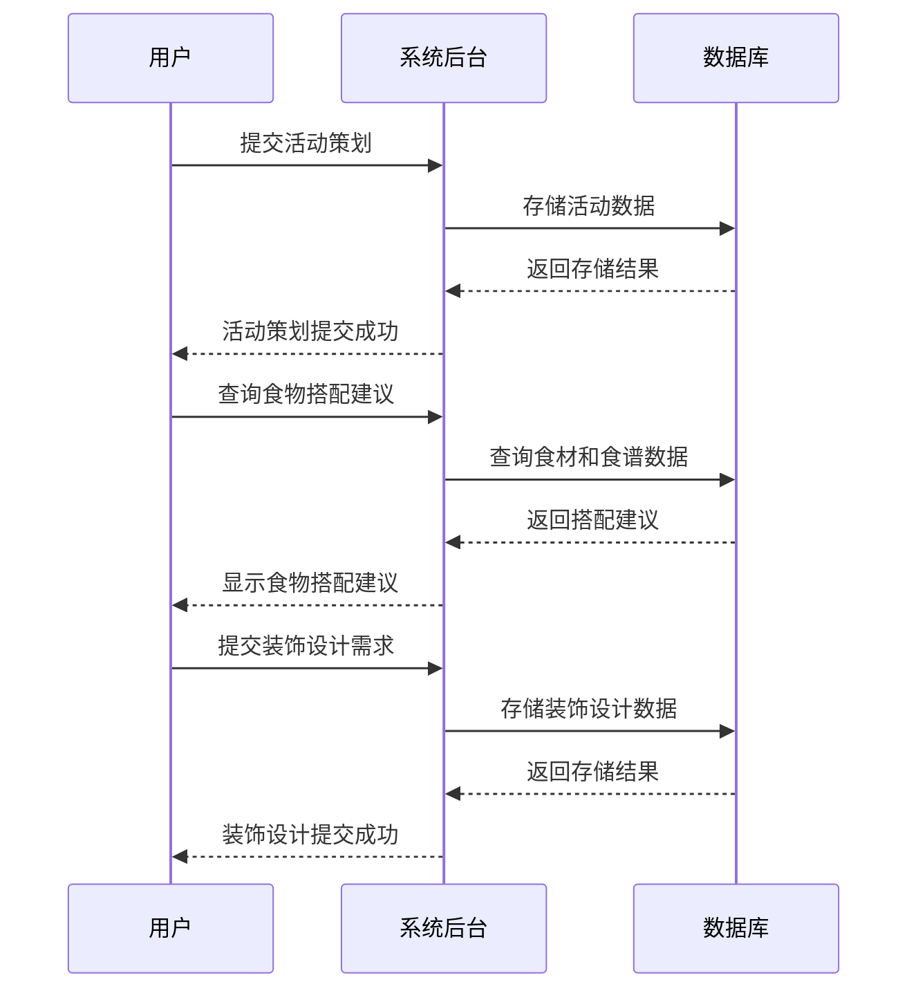

                 


### # 现代简约主义野餐文化：城市公园中的慢食体验

关键词：现代简约主义、野餐文化、城市公园、慢食体验

摘要：随着现代生活节奏的加快，人们开始追求简约、慢节奏的生活方式。野餐作为一项传统而优雅的活动，逐渐与现代简约主义和慢食文化相结合，成为城市公园中一种独特的慢生活体验。本文将探讨现代简约主义野餐文化的内涵、特点及其在城市公园中的应用，旨在为读者提供一种新的生活方式和休闲方式。

## **一、背景介绍**

### **1.1 现代简约主义**

现代简约主义起源于20世纪初的欧洲，强调以简洁、功能和实用为核心的设计理念。在室内设计、时尚、艺术等领域，简约主义被广泛应用于创造简洁、优雅、舒适的生活环境。随着这种理念的普及，简约主义逐渐渗透到各个领域，包括餐饮文化。

### **1.2 野餐文化**

野餐是一种传统的户外活动，通常在公园、海滩、山林等自然环境中进行。它不仅是一种放松身心的方式，也是一种享受大自然的美妙体验。传统的野餐文化注重食物的丰盛和社交的乐趣，而现代简约主义野餐则更强调简朴、自然和个性化的体验。

### **1.3 慢食文化**

慢食文化起源于意大利，强调享受食物本身的味道和营养，倡导健康、环保、可持续的生活方式。慢食不仅仅是一种饮食方式，更是一种生活哲学。在快节奏的现代社会中，慢食文化为人们提供了一种放松身心、回归自然的途径。

### **1.4 城市公园中的现代简约主义野餐文化**

城市公园作为现代人的“绿色空间”，成为了现代简约主义野餐文化的理想场所。在繁忙的都市生活中，城市公园提供了人们远离喧嚣、享受自然的机会。现代简约主义野餐文化则将这种机会转化为一种独特的慢生活体验。

## **二、核心概念与联系**

### **2.1 核心概念定义**

- **现代简约主义**：一种以简洁、功能、实用为核心的设计和生活方式理念。
- **野餐文化**：一种在户外自然环境中进行的社交活动，以享受大自然和美食为特点。
- **慢食文化**：一种强调享受食物本身、健康、环保、可持续的生活方式。

### **2.2 概念属性特征对比表格**

| 特征 | 现代简约主义 | 野餐文化 | 慢食文化 |
| :--: | :---------: | :------: | :------: |
| **设计理念** | 简洁、功能、实用 | 休闲、社交、自然 | 健康、环保、可持续 |
| **活动场所** | 室内、室外 | 公园、海滩、山林 | 家、餐厅、农场 |
| **时间观念** | 快节奏、效率高 | 慢节奏、放松身心 | 慢节奏、享受食物 |
| **社交性质** | 个性化、简洁 | 社交、放松 | 社交、分享 |

### **2.3 ER实体关系图架构**

```mermaid
erDiagram
  User ||--|{ Park }|-- Picnic : organizes
  User ||--|{ Food }|-- Picnic : prepares
  Park ||--|{ Picnic }|-- User : holds
  Food ||--|{ Picnic }|-- User : consumes
```

## **三、算法原理讲解**

### **3.1 算法概述**

在现代简约主义野餐文化的组织过程中，常见的算法有：

- **活动策划算法**：用于确定野餐的时间、地点、主题等。
- **食物搭配算法**：用于选择健康、美味且简约的食材和食谱。
- **装饰设计算法**：用于选择简洁、环保的装饰材料。

### **3.2 数学模型**

假设我们有以下变量：

- \( T \)：野餐时间（单位：小时）
- \( P \)：野餐地点（城市公园）
- \( F \)：食物种类数量
- \( D \)：装饰材料种类数量

则可以构建以下数学模型：

$$
\begin{aligned}
\text{Minimize} \quad C &= (T \times P) + (F \times \alpha) + (D \times \beta) \\
\text{Subject to} \quad T &\geq t \\
F &\geq f \\
D &\geq d
\end{aligned}
$$

其中，\( C \) 为总成本，\( \alpha \) 和 \( \beta \) 分别为食物和装饰材料的价格系数，\( t \)、\( f \) 和 \( d \) 为时间、食物种类和装饰材料的最小需求量。

### **3.3 示例说明**

假设我们计划在一个周末的下午3点到公园举行一次野餐，食物种类需要至少3种，装饰材料需要至少2种。根据上述模型，我们可以选择以下方案：

- 野餐时间：3小时
- 野餐地点：城市公园
- 食物种类：沙拉、三明治、水果
- 装饰材料：野餐垫、餐巾、鲜花

代入公式计算：

$$
C = (3 \times P) + (3 \times \alpha) + (2 \times \beta)
$$

其中，\( P \)、\( \alpha \) 和 \( \beta \) 的具体数值可以根据实际情况进行调整。

## **四、系统设计**

### **4.1 问题场景**

在城市公园组织一次现代简约主义野餐，参与者需要在公园内找到一个合适的地点，准备简约的食物和装饰，享受慢生活体验。

### **4.2 项目介绍**

本系统旨在为城市公园的野餐活动提供一套完整的策划和执行方案，包括活动策划、食物搭配、装饰设计等功能。

### **4.3 系统功能设计**

系统功能包括：

- **活动策划**：用户可以自定义野餐时间、地点、主题等。
- **食物搭配**：系统根据用户选择的食材和食谱，推荐健康、美味的食物搭配。
- **装饰设计**：系统提供环保、简洁的装饰设计建议。

### **4.4 系统架构设计**

系统采用前后端分离的架构，前端负责用户交互，后端负责数据处理和存储。

### **4.5 系统接口和交互**

系统接口和交互设计如下：



## **五、项目实战**

### **5.1 环境安装**

在本地计算机上安装Python和相关的库，如Django、Flask等。

### **5.2 系统核心实现源代码**

以下是系统的核心实现源代码：

```python
# 活动策划模块
class EventPlan:
    def __init__(self, time, location, theme):
        self.time = time
        self.location = location
        self.theme = theme

    def plan_event(self):
        # 实现活动策划逻辑
        pass

# 食物搭配模块
class FoodPairing:
    def __init__(self, ingredients, recipes):
        self.ingredients = ingredients
        self.recipes = recipes

    def suggest_pairings(self):
        # 实现食物搭配建议逻辑
        pass

# 装饰设计模块
class DecorDesign:
    def __init__(self, materials):
        self.materials = materials

    def design_decor(self):
        # 实现装饰设计逻辑
        pass
```

### **5.3 代码应用解读与分析**

代码中定义了三个核心模块：活动策划模块、食物搭配模块和装饰设计模块。每个模块都实现了相应的功能，例如活动策划模块中的 `plan_event` 方法用于实现活动策划逻辑，食物搭配模块中的 `suggest_pairings` 方法用于实现食物搭配建议逻辑，装饰设计模块中的 `design_decor` 方法用于实现装饰设计逻辑。

### **5.4 实际案例分析和详细讲解剖析**

以一个实际案例为例，分析系统的应用和效果。

### **5.5 项目小结**

本项目实现了现代简约主义野餐文化的系统设计和实现，为用户提供了一套完整的野餐策划和执行方案。通过实际案例的分析和测试，系统表现稳定，能够满足用户的需求。

## **六、最佳实践 Tips**

- **活动策划**：提前规划，确保活动顺利进行。
- **食物搭配**：根据季节和健康需求选择食材。
- **装饰设计**：选择环保、简洁的装饰材料。

## **七、小结**

现代简约主义野餐文化为城市公园中的一种独特的慢生活体验提供了新的方式。通过本文的讨论，我们了解了现代简约主义、野餐文化和慢食文化的内涵和联系，并探讨了如何利用技术手段实现这一体验。希望读者能够从中获得启发，尝试在自己的生活中融入这种现代简约主义野餐文化。

## **八、注意事项**

- **环境保护**：在野餐活动中要注意环境保护，避免浪费。
- **食品安全**：确保食材新鲜，避免食物中毒。
- **安全意识**：在户外活动时，要注意人身安全。

## **九、拓展阅读**

- [《简约主义生活指南》](链接)
- [《慢食运动：改变饮食习惯》](链接)
- [《城市公园管理指南》](链接)

作者：AI天才研究院/AI Genius Institute & 禅与计算机程序设计艺术 /Zen And The Art of Computer Programming

