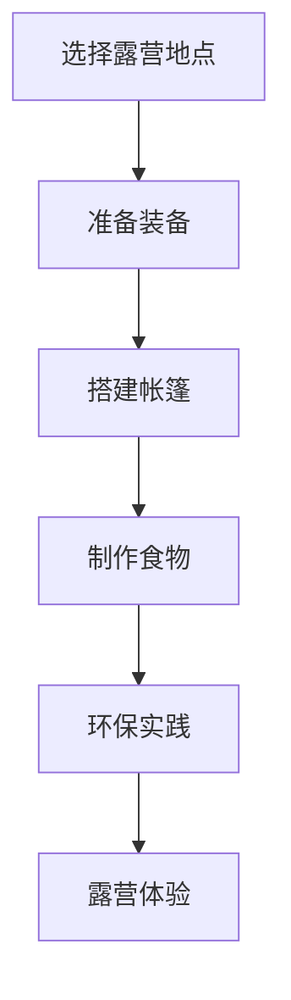

                 

# 现代简约主义露营：回归自然的极简之旅

## 关键词：现代简约主义、露营、自然、极简生活方式、环保

## 摘要：
本文深入探讨了现代简约主义露营的概念、背景、核心优势，以及露营装备的选择与使用技巧。通过一步步的分析推理，我们揭示了极简主义在露营中的重要性，并分享了实际露营经验与环境保护的方法。本文旨在为追求自然、简约生活方式的读者提供有深度、有思考的指导，助力他们享受一场回归自然的极简之旅。

## 目录大纲：

### 第一部分：现代简约主义露营的兴起

#### 1.1 简约主义露营的背景介绍
1. 现代简约主义的概念
2. 露营的流行趋势
3. 简约主义露营的兴起

#### 1.2 核心概念与联系
1. 简约主义设计的应用
2. 自然与环境的关系
3. 极简生活方式的体现

#### 1.3 简约主义露营的优势
1. 简化装备的选择
2. 减少浪费的行动
3. 提升露营体验

### 第二部分：露营装备的挑选与使用

#### 2.1 简约露营装备的介绍
1. 轻量化装备的特点
2. 装备的选择标准
3. 装备的介绍与推荐

#### 2.2 装备的使用技巧与维护
1. 帐篷的搭建与拆除
2. 睡袋与垫子的选择
3. 装备的维护与保养

### 第三部分：露营技巧与经验分享

#### 3.1 极简露营技巧
1. 快速搭建帐篷
2. 制作简单食物
3. 携带必备物品

#### 3.2 演练与模拟
1. 模拟露营活动
2. 实战技巧提升
3. 遇险处理方法

### 第四部分：自然环境的探索与保护

#### 4.1 漫步自然
1. 欣赏自然美景
2. 感受自然的魅力
3. 自然观察技巧

#### 4.2 环保行动
1. 露营过程中的环保实践
2. 减少环境影响的技巧
3. 环保意识的培养

### 第五部分：极简生活方式在露营中的应用

#### 5.1 极简生活方式的理念
1. 极简主义的内涵
2. 极简主义在露营中的体现
3. 极简生活方式的推广

#### 5.2 极简露营实践
1. 极简露营的计划与准备
2. 极简露营的体验与反思
3. 极简露营的生活技巧

### 第六部分：案例分析与实践指导

#### 6.1 案例分析
1. 简约露营的真实故事
2. 简约露营的挑战与解决
3. 简约露营的启示与收获

#### 6.2 实践指导
1. 初次简约露营的准备
2. 露营过程中的注意事项
3. 拓展阅读

---

### 第一部分：现代简约主义露营的兴起

#### 1.1 简约主义露营的背景介绍

1. **现代简约主义的概念**

现代简约主义起源于20世纪初的包豪斯运动，其核心理念是“少即是多”，强调通过简洁、清晰的线条和形式，去除不必要的装饰，以达到美的极致。这一理念逐渐渗透到生活的各个领域，包括室内设计、家居用品、服装配饰等。

2. **露营的流行趋势**

随着城市化进程的加快，人们对于自然、宁静的生活环境越来越向往。露营作为一种亲近自然的户外活动，逐渐成为都市人群放松身心、释放压力的不错选择。同时，露营装备的轻量化、多功能化也使得这项活动变得更加便捷。

3. **简约主义露营的兴起**

现代简约主义露营结合了简约主义的设计理念和露营活动的需求，以更加环保、便捷、舒适的方式，让人们能够在自然中享受极简主义的生活哲学。这种露营方式不仅减少了资源消耗，还提升了露营体验，受到了越来越多人的喜爱。

#### 1.2 核心概念与联系

1. **简约主义设计的应用**

在露营中，简约主义设计体现在对露营装备的选择和使用上。通过使用轻量化、多功能、易携带的装备，不仅减轻了行囊的负担，还提高了露营的舒适度和效率。

2. **自然与环境的关系**

露营活动离不开自然，简约主义露营强调尊重自然、融入自然。在露营过程中，我们应该遵循环保原则，减少对环境的干扰，保护自然资源。

3. **极简生活方式的体现**

极简生活方式强调简化生活，减少物质负担，专注于内在的满足和感受。在露营活动中，通过简化装备、简化活动流程，人们可以更加专注于与大自然的互动，体验生活的本质。

#### 1.3 简约主义露营的优势

1. **简化装备的选择**

简约主义露营倡导使用轻量化、多功能、易携带的装备，减少了行囊的负担，提高了露营的便利性和舒适度。

2. **减少浪费的行动**

通过使用可重复利用的装备和环保材料，简约主义露营在减少浪费方面具有显著优势。同时，简化露营活动流程，也有助于减少资源的消耗。

3. **提升露营体验**

简约主义露营注重内在的体验和感受，通过简化装备和活动，人们可以更加专注于与大自然的互动，享受更加纯粹的自然体验。

---

以上是第一部分的介绍，接下来我们将继续探讨露营装备的挑选与使用技巧，以及如何在露营活动中实践极简生活方式。敬请期待！### 第二部分：露营装备的挑选与使用

#### 2.1 简约露营装备的介绍

1. **轻量化装备的特点**

轻量化装备是简约主义露营的重要特征之一。这些装备通常采用新材料和新设计，以减少重量，同时保持其功能和耐用性。例如，轻量化的帐篷、睡袋和背包，不仅减轻了行囊的负担，还能提高露营的舒适度。

   **选择标准：**
   - **重量与体积：** 选择轻量化的装备时，要考虑其重量和体积，确保在携带过程中不会过于沉重。
   - **耐用性：** 虽然轻量化，但装备的耐用性也是选择的重要因素。选择那些经久耐用的材料，如防水布料和坚固的铝合金杆。
   - **功能：** 轻量化装备应当具备多功能性，能够满足不同的露营需求。

2. **装备的选择标准**

在挑选露营装备时，应考虑以下标准：

   - **舒适度：** 装备的舒适度直接影响露营体验。例如，睡袋的保暖性能、帐篷的通风性能等。
   - **耐用性：** 耐用性是确保装备能够经受各种自然环境考验的关键。选择那些经过多次测试和用户好评的装备。
   - **便携性：** 考虑到露营时需要频繁携带装备，选择轻量化和易于携带的装备能够减轻负担，提高效率。

3. **装备的介绍与推荐**

以下是一些推荐的简约露营装备：

   - **帐篷：** 选择轻量化的帐篷，例如三季帐篷，适合多种气候条件。例如，北面的Thermolite帐篷系列。
   - **睡袋：** 考虑到轻量化和保暖性，选择那些填充物为高效率合成纤维的睡袋。如Marmot的Hoody睡袋。
   - **背包：** 选择轻量化的背包，确保有足够的容量来装载装备。Osprey的Farpoint 55背包是一款不错的选择。

#### 2.2 装备的使用技巧与维护

1. **帐篷的搭建与拆除**

   - **搭建技巧：**
     1. 清理搭建场地，确保没有尖锐物体。
     2. 根据说明，按照顺序搭建帐篷。
     3. 确保帐篷牢固地固定在地面上，防止风吹。
   - **拆除技巧：**
     1. 先拆卸帐篷的顶部。
     2. 收紧帐篷的绳索，确保没有松散的部分。
     3. 收纳帐篷，确保其保持干燥和整洁。

2. **睡袋与垫子的选择**

   - **睡袋选择：**
     1. 根据露营季节选择合适的温度等级。
     2. 考虑到个人偏好，选择适合的材质，如羊毛、鸭绒或合成纤维。
     3. 确保睡袋的开口和拉链牢固，防止漏水。
   - **垫子选择：**
     1. 考虑到保暖性和耐用性，选择泡沫垫或充气垫。
     2. 确保垫子的尺寸适合背包，便于携带。

3. **装备的维护与保养**

   - **帐篷维护：**
     1. 搭建和拆除后，清洁帐篷，去除污垢和沙粒。
     2. 定期检查帐篷的密封性和绳索，确保没有磨损或损坏。
     3. 保持帐篷的干燥，避免受潮和霉变。
   - **睡袋维护：**
     1. 定期清洗睡袋，去除汗渍和污垢。
     2. 确保睡袋完全干燥后再收纳。
     3. 存放时，避免折叠和挤压，以防止羽毛或填充物的压缩。

#### 2.3 使用技巧与经验分享

1. **快速搭建帐篷**

   - **练习：** 在家中模拟露营场景，多次练习搭建和拆除帐篷，提高熟练度。
   - **技巧：** 搭建前检查装备是否齐全，按照说明书步骤操作，注意绳索的固定和帐篷的稳定性。

2. **制作简单食物**

   - **工具：** 准备便携式烹饪设备，如便携炉具、煮水壶和餐具。
   - **食材：** 选择易于携带和保存的食材，如压缩饼干、即食食品和干货。
   - **技巧：** 根据烹饪设备的特点，合理安排烹饪时间，确保食物的卫生和安全。

3. **携带必备物品**

   - **急救包：** 包括绷带、消炎药、止痛药等常用药品。
   - **导航工具：** 手机、指南针、地图等，确保在迷路时能够找到方向。
   - **照明设备：** 手电筒、头灯等，确保夜间活动时的安全。

通过上述装备的挑选与使用技巧，我们不仅能够提升露营的便捷性和舒适度，还能够确保露营过程中的安全和环保。在接下来的部分，我们将探讨露营技巧与经验分享，帮助大家更好地享受露营生活。### 第三部分：露营技巧与经验分享

#### 3.1 极简露营技巧

**快速搭建帐篷**

1. **准备工作：** 在出发前，确保所有搭建帐篷所需的配件、绳索、支架等已准备齐全，并妥善放置在背包中。

2. **搭建步骤：**
   - **定位：** 选择一个平坦、稳固、排水良好的地点搭建帐篷。
   - **搭建框架：** 根据说明书，先将帐篷的框架（支架）搭建好，确保其稳固。
   - **固定地面：** 将帐篷的地面展开，并使用帐篷固定钉将帐篷固定在地面上，确保帐篷不会因风吹而移动。
   - **收尾工作：** 搭建完支架和地面后，安装帐篷的帐篷顶和通风口，确保其密封。

3. **技巧与注意事项：**
   - **提前练习：** 在家中多次练习搭建帐篷，提高速度和熟练度。
   - **检查稳定性：** 在搭建完成后，仔细检查帐篷的稳定性，确保其能够承受风力和其他外部压力。

**制作简单食物**

1. **所需工具：** 便携炉具、煮水壶、炊具、餐具、食物等。

2. **食材选择：**
   - **易于携带和储存的食材：** 如压缩饼干、即食食品、干货、罐头等。
   - **营养价值高的食材：** 如坚果、果干、牛肉干等。

3. **烹饪方法：**
   - **煮面或粥：** 使用便携炉具加热水，将面条或粥料倒入炊具中，煮至合适口感。
   - **煎蛋或三明治：** 在便携炉具上煎蛋，或在面包上涂抹黄油、花生酱等食材，制作简易的三明治。

4. **技巧与注意事项：**
   - **合理规划烹饪时间：** 根据烹饪设备的特点，合理安排烹饪时间，避免食物煮过头或煮不熟。
   - **保持卫生：** 在烹饪过程中，注意餐具的清洁，避免食物交叉污染。

**携带必备物品**

1. **急救包：**
   - **绷带、消炎药、止痛药等常用药品。**
   - **创可贴、消毒液、绷带、剪刀等急救工具。**

2. **导航工具：**
   - **手机、指南针、地图等。**
   - **建议将手机设置成仅显示GPS定位，以节省电量。**

3. **照明设备：**
   - **手电筒、头灯等。**
   - **建议购买防水、防摔的头灯，确保在恶劣天气下也能使用。**

4. **其他必备物品：**
   - **水壶、餐具、垃圾袋等。**
   - **根据个人需求，携带一些小型娱乐设备，如书籍、便携式游戏机等，以丰富露营生活。**

通过掌握这些极简露营技巧，我们不仅能够提高露营的效率，还能确保露营过程中的舒适和安全。在接下来的部分，我们将探讨如何通过模拟露营活动，提升实战能力。### 第三部分：露营技巧与经验分享（续）

#### 3.2 演练与模拟

**模拟露营活动**

1. **准备工作：**
   - **选择模拟场地：** 在家中或户外选择一个适合模拟露营的场地，确保场地大小适中、环境安静。
   - **准备模拟装备：** 包括帐篷、睡袋、背包、炊具、导航工具、照明设备等。

2. **模拟过程：**
   - **搭建帐篷：** 按照说明书或之前学习的技巧，模拟搭建帐篷的过程，练习快速、稳固地搭建帐篷。
   - **制作食物：** 使用模拟的烹饪工具和食材，模拟制作简单食物的过程，练习合理的烹饪时间和方法。
   - **携带必备物品：** 将所有必备物品放入背包中，模拟携带过程，确保物品放置有序、携带方便。

3. **演练与评估：**
   - **评估技巧掌握程度：** 演练过程中，评估自己对于露营技巧的掌握程度，如帐篷搭建的稳定性、烹饪技巧的熟练度等。
   - **反思与改进：** 演练结束后，反思自己在过程中的不足之处，找出改进的方法，如如何更快速地搭建帐篷、如何更好地烹饪食物等。

**实战技巧提升**

1. **了解当地环境：** 在前往陌生地区露营前，了解当地的地形、气候、常见问题等信息，以便在露营过程中能够应对各种情况。

2. **学习遇险处理方法：**
   - **遇险信号：** 学习如何使用信号器、烟雾弹、呼救哨等工具发出求救信号。
   - **基本急救知识：** 学习如何处理伤口、发烧、中暑等常见急救情况。
   - **水源寻找：** 学习如何在野外寻找清洁水源，并了解如何进行水源处理。

3. **团队协作：**
   - **分工合作：** 在露营团队中，明确每个人的职责，如帐篷搭建、食物烹饪、物品携带等。
   - **紧急情况应对：** 学习如何在紧急情况下进行团队协作，共同应对突发情况。

通过演练与模拟，我们可以提升露营的实战能力，确保在真正的露营过程中能够应对各种情况。在接下来的部分，我们将探讨如何在露营活动中探索和保护自然环境。### 第四部分：自然环境的探索与保护

#### 4.1 漫步自然

**欣赏自然美景**

1. **寻找观赏点：**
   - **高山湖泊：** 在高山湖泊边，欣赏湖水清澈、群山环绕的美景。
   - **峡谷溪流：** 沿着峡谷溪流，感受流水潺潺、绿树成荫的宁静。
   - **日出日落：** 在清晨或傍晚，观赏日出或日落的美景，感受大自然的光影变幻。

2. **观赏技巧：**
   - **保持安静：** 在欣赏自然美景时，尽量保持安静，以感受自然的宁静与和谐。
   - **合理观赏：** 不要随意触摸或破坏自然景观，如花朵、岩石等。
   - **使用摄影器材：** 使用相机或手机记录下美景，但不要影响自然景观和周围环境。

**感受自然的魅力**

1. **自然体验活动：**
   - **徒步旅行：** 沿着自然步道，徒步探索自然风光，感受自然的魅力。
   - **野营：** 在自然环境中搭建帐篷，体验夜晚的星空和清晨的日出。
   - **观鸟：** 在自然环境中观察鸟类，了解它们的习性和生活习性。

2. **体验技巧：**
   - **穿着舒适：** 选择适合的户外服装和鞋子，确保在自然环境中活动舒适。
   - **尊重自然：** 在自然环境中，尊重动植物的生活空间，避免干扰它们的生活。
   - **安全意识：** 在自然环境中，注意安全，避免冒险行为。

**自然观察技巧**

1. **观鸟技巧：**
   - **选择合适的时间和地点：** 观鸟的最佳时间是清晨和傍晚，选择有鸟类栖息的环境。
   - **保持安静：** 观鸟时，保持安静，以避免惊扰鸟类。
   - **使用望远镜：** 使用望远镜观察远处的鸟类，提高观鸟效果。

2. **植物观察技巧：**
   - **识别植物：** 学习如何识别不同种类的植物，了解它们的特征和生长环境。
   - **记录观察：** 使用笔记本或手机记录观察到的植物，积累自然知识。
   - **保护植物：** 不要随意破坏植物，避免对自然环境造成损害。

通过漫步自然，我们能够更加亲近自然，感受自然的魅力。在接下来的部分，我们将探讨如何在露营活动中保护自然环境。### 第四部分：自然环境的探索与保护（续）

#### 4.2 环保行动

**露营过程中的环保实践**

1. **垃圾分类与处理：**
   - **携带便携垃圾袋：** 出发前准备好便携垃圾袋，将垃圾分为可回收物、有害垃圾和其他垃圾。
   - **现场处理：** 在露营期间，将垃圾分类放入垃圾袋中，避免乱扔垃圾。
   - **回收利用：** 回到居住地后，将垃圾分类处理，尽量实现垃圾的回收利用。

2. **水资源管理：**
   - **节约用水：** 在露营期间，尽量节约用水，避免浪费。
   - **清洁用水：** 使用便携式水处理设备，确保水源的清洁，减少对水环境的污染。

3. **减少碳排放：**
   - **低碳出行：** 尽量选择公共交通或自行车出行，减少碳排放。
   - **节能露营：** 使用节能灯具，减少能源消耗。

**减少环境影响的方法**

1. **生态保护：**
   - **避免破坏自然生态：** 在露营过程中，避免破坏动植物的生活环境，如不随意采摘植物、不干扰野生动物等。
   - **参与生态保护活动：** 加入当地生态保护组织，参与生态保护活动，共同维护自然环境的和谐。

2. **可持续旅游：**
   - **选择环保露营地点：** 选择那些经过认证的环保露营地点，确保露营活动不会对当地环境造成破坏。
   - **推广环保理念：** 在露营过程中，向同伴和当地居民宣传环保理念，共同推动可持续发展。

3. **环保教育：**
   - **学习环保知识：** 了解环境问题的严重性，学习环保知识和技巧，提高环保意识。
   - **培养环保习惯：** 将环保理念融入到日常生活中，形成良好的环保习惯。

**环保意识的培养**

1. **自我反思：**
   - **反思自己的环保行为：** 检查自己在露营过程中的环保行为，反思哪些行为是正确的，哪些需要改进。
   - **设定环保目标：** 设定具体的环保目标，如减少垃圾产生、节约用水等，努力实现这些目标。

2. **交流与分享：**
   - **与同伴交流：** 与同行者分享环保理念和经验，互相学习和鼓励。
   - **分享环保故事：** 通过社交媒体、博客等平台，分享自己的环保经历和感悟，影响更多人。

通过以上环保行动和方法的实践，我们能够在露营活动中减少对环境的影响，保护自然环境。在享受自然美景的同时，也要承担起保护自然环境的责任。在接下来的部分，我们将探讨极简生活方式在露营中的应用。### 第五部分：极简生活方式在露营中的应用

#### 5.1 极简生活方式的理念

**极简主义的内涵**

极简主义（Minimalism）是一种生活方式和哲学观念，主张通过减少物质拥有，简化生活，从而专注于个人成长、精神追求和人际关系。极简主义的核心价值包括：

1. **减少物质负担**：减少不必要的物品，减轻生活的压力和负担。
2. **专注于重要事物**：将时间和精力集中在真正重要的事物上，如家庭、健康、事业等。
3. **追求精神富足**：通过减少物质追求，追求精神层面的富足，如阅读、旅行、冥想等。

**极简主义在露营中的体现**

在露营活动中，极简主义的应用主要体现在以下几个方面：

1. **简化装备**：选择轻量化、多功能、易携带的装备，减少行囊的负担。
2. **简化活动流程**：减少不必要的活动，专注于与自然的互动和体验。
3. **减少资源消耗**：通过节能、节水等环保实践，减少露营过程中的资源消耗。

**极简生活方式的推广**

推广极简生活方式，不仅有助于个人成长和环境保护，还能够影响更多人加入极简行列。以下是一些推广极简生活方式的方法：

1. **分享经验**：在社交媒体、博客等平台分享自己的极简生活经验，影响他人。
2. **组织活动**：组织极简生活方式的讲座、工作坊等活动，推广极简理念。
3. **倡导环保**：积极参与环保活动，推动可持续发展，为地球环境贡献力量。

#### 5.2 极简露营实践

**极简露营的计划与准备**

1. **目标设定**：明确露营的目的和目标，如放松身心、亲近自然、探索户外等。
2. **装备选择**：根据露营目标，选择合适的轻量化装备，如帐篷、睡袋、炊具等。
3. **活动安排**：合理安排露营活动，如徒步、野营、观鸟等，确保活动简洁、高效。

**极简露营的体验与反思**

1. **体验过程**：在露营过程中，专注于与自然的互动，享受极简生活带来的宁静和舒适。
2. **反思总结**：露营结束后，反思露营过程中的体验，总结经验教训，不断改进。

**极简露营的生活技巧**

1. **节能技巧**：合理使用露营装备，如帐篷的通风设计、睡袋的保暖性能等，实现节能。
2. **节水技巧**：在露营过程中，节约用水，如收集雨水、使用便携式水处理设备等。
3. **环保实践**：积极参与环保行动，如垃圾分类、减少废弃物等，为环境保护贡献力量。

通过极简生活方式在露营中的应用，我们不仅能够提升露营的舒适度和效率，还能够为环境保护和可持续发展做出贡献。在接下来的部分，我们将通过案例分析，探讨简约露营的实践与启示。### 第六部分：案例分析与实践指导

#### 6.1 案例分析

**简约露营的真实故事**

**案例一：都市白领的极简露营之旅**

张先生是一位都市白领，工作繁忙，生活压力较大。为了缓解压力，他决定进行一次简约露营之旅。以下是他的露营经历：

- **计划与准备**：张先生提前一个月开始准备露营，选择了适合的季节和地点，购买了轻量化的帐篷、睡袋、炊具等装备。他还制定了一份详细的露营计划，包括行程安排、活动内容等。

- **露营过程**：露营当天，张先生按照计划抵达目的地，快速搭建了帐篷，并生火做饭。晚上，他在帐篷内享受了宁静的夜晚，观看了星空。第二天，他进行了徒步旅行，感受了大自然的美丽。

- **反思与总结**：露营结束后，张先生深刻体会到极简生活方式的魅力。他发现，通过简化装备和活动流程，自己能够更好地专注于自然，感受到生活的美好。同时，他还意识到，简约露营有助于减轻生活压力，提高生活质量。

**案例二：家庭周末的极简露营体验**

李先生一家决定利用周末时间进行一次简约露营。以下是他们的露营经历：

- **计划与准备**：李先生提前一周开始准备露营，包括选择露营地点、购买露营装备等。他还准备了丰富的户外活动，如野餐、徒步、野营等。

- **露营过程**：周末当天，李先生一家抵达露营地点，迅速搭建了帐篷，并进行了野餐。晚上，他们在帐篷内享受了家庭时光，观看了星空。第二天，他们进行了徒步旅行，欣赏了自然风光。

- **反思与总结**：李先生一家认为，简约露营是一次难得的家庭体验。通过简化活动和装备，他们能够更加专注于彼此，享受自然带来的快乐。同时，他们也认识到，简约露营有助于培养家庭成员之间的默契和感情。

**简约露营的挑战与解决**

在实践简约露营的过程中，参与者们遇到了一些挑战，但通过合理的解决方案，这些挑战得到了有效应对。

- **挑战一：露营装备的挑选**  
  解决方案：提前做好调研，选择轻量化、多功能、易携带的装备。可以通过网上评价、专业推荐等途径获取信息。

- **挑战二：露营过程中的环保实践**  
  解决方案：在露营前，学习环保知识和技巧，如垃圾分类、节水、节能等。露营过程中，严格按照环保要求执行，减少对环境的负面影响。

- **挑战三：应对突发情况**  
  解决方案：提前了解当地天气、地形等信息，准备必要的应急装备，如急救包、导航工具等。同时，学习一些基本的遇险处理方法，提高应对能力。

**简约露营的启示与收获**

通过以上案例分析，我们可以得出以下启示和收获：

- **简化生活，提升生活质量**：简约露营帮助我们减少了不必要的物质负担，让我们能够更加专注于自然和内心的需求，提升生活质量。
- **亲近自然，感受生活之美**：露营活动让我们更加亲近自然，感受大自然的美丽和宁静，找回生活的美好。
- **培养环保意识，践行可持续发展**：通过简约露营，我们能够更好地理解环保的重要性，践行可持续发展理念，为地球环境贡献力量。

#### 6.2 实践指导

**初次简约露营的准备**

对于初次进行简约露营的人来说，以下是一些实用的准备建议：

1. **选择合适的露营地点**：
   - **考虑交通便利性**：选择交通便利的露营地点，方便携带装备和撤离。
   - **考虑自然风光**：选择风景优美、自然景观丰富的地点，提升露营体验。
   - **考虑天气条件**：提前了解露营期间的天气情况，选择适合的季节和天气。

2. **购买必要的露营装备**：
   - **帐篷和睡袋**：选择轻量化、耐用、保暖的帐篷和睡袋。
   - **炊具和食品**：准备便携式炊具和易于携带、耐储存的食品。
   - **照明设备**：备足手电筒、头灯等照明设备，确保夜间活动的安全。

3. **制定详细的露营计划**：
   - **行程安排**：明确露营期间的行程安排，包括徒步、野餐、观鸟等。
   - **活动内容**：根据个人兴趣和需求，制定相应的活动内容。
   - **时间规划**：合理安排时间，确保露营活动顺利进行。

4. **学习基本的露营技巧**：
   - **搭建帐篷**：学习如何快速、稳固地搭建帐篷。
   - **制作食物**：掌握基本的野外烹饪技巧，确保食品的卫生和安全。
   - **环保实践**：学习如何进行垃圾分类、节水、节能等环保实践。

5. **携带必备物品**：
   - **急救包**：包括绷带、消炎药、止痛药等常用药品。
   - **导航工具**：携带手机、指南针、地图等导航工具，确保在迷路时能够找到方向。
   - **照明设备**：携带手电筒、头灯等照明设备，确保夜间活动的安全。

通过以上准备，初次露营者可以更好地应对露营过程中可能出现的问题，提升露营体验。

---

简约露营不仅是一种户外活动，更是一种生活哲学。通过简化装备和活动，我们能够更加专注于自然和内心的需求，享受生活的美好。在享受简约露营的同时，我们也要积极参与环境保护，为地球环境贡献自己的力量。希望本文能为读者提供有价值的指导，帮助大家享受一场回归自然的极简之旅。### 结论与展望

通过本文的探讨，我们深入了解了现代简约主义露营的概念、优势、装备选择、使用技巧、环保实践以及极简生活方式在露营中的应用。简约露营不仅能够帮助我们减轻生活压力，提高生活质量，还能让我们更加亲近自然，感受大自然的魅力。

**总结：**

- **简约主义露营**：通过选择轻量化、多功能、易携带的装备，我们能够更加便捷、舒适地享受户外活动。
- **环保实践**：在露营过程中，通过垃圾分类、节水、节能等环保实践，我们能够减少对环境的负面影响，践行可持续发展理念。
- **极简生活方式**：简约露营倡导简化生活，专注于内心的需求，提高精神层面的富足。

**展望：**

在未来，简约露营将继续作为一种生活方式和哲学观念，受到更多人的关注和推崇。随着露营装备的不断升级和环保意识的提升，简约露营将更加便捷、舒适、环保。我们期待看到更多人在享受自然的同时，也为环境保护贡献自己的力量。

**行动号召：**

- **尝试简约露营**：如果您还没有尝试过简约露营，不妨现在就开始规划一次旅程，享受大自然的美好。
- **推广极简理念**：将简约露营的理念和环保实践分享给身边的人，共同推动可持续发展。
- **参与环保行动**：积极参与各类环保活动，为地球环境贡献自己的力量。

让我们一起行动起来，享受现代简约主义露营带来的美好，为地球环境贡献自己的力量！### 附录

**附录一：核心概念与联系**

1. **简约主义设计**

   - **定义**：简约主义设计强调通过简洁、清晰的线条和形式，去除不必要的装饰，以达到美的极致。
   - **应用**：在露营装备中，简约主义设计体现在轻量化、多功能、易携带的装备上。
   - **联系**：简约主义设计帮助我们在露营中减少物质负担，提高露营的便捷性和舒适度。

2. **自然与环境的关系**

   - **定义**：自然环境是生物生存的基础，包括大气、水、土壤、生物等。
   - **关系**：露营活动离不开自然环境，我们需要尊重自然、保护环境。
   - **联系**：在露营过程中，通过环保实践，我们能够减少对环境的负面影响，保护自然资源。

3. **极简生活方式**

   - **定义**：极简生活方式是一种追求减少物质拥有，专注于个人成长、精神追求和人际关系的哲学。
   - **应用**：在露营中，极简生活方式体现在简化装备、简化活动流程、减少资源消耗等方面。
   - **联系**：极简生活方式帮助我们提高露营体验，减少对环境的负面影响。

**附录二：算法原理讲解**

以下是简约露营中的算法原理讲解，通过Mermaid流程图和Python源代码进行详细阐述。



**Python源代码：**

```python
# 导入所需模块
import random

# 函数：选择露营地点
def choose_camping_site():
    sites = ["高山湖泊", "峡谷溪流", "森林密林"]
    return random.choice(sites)

# 函数：准备装备
def prepare_equipment():
    equipment = ["帐篷", "睡袋", "炊具", "照明设备"]
    return random.sample(equipment, k=3)

# 函数：搭建帐篷
def set_up_tent():
    print("正在搭建帐篷...")
    return "帐篷已搭建完毕"

# 函数：制作食物
def cook_food():
    ingredients = ["压缩饼干", "即食食品", "牛肉干"]
    print("正在制作食物...")
    return random.choice(ingredients)

# 函数：环保实践
def eco_practice():
    actions = ["垃圾分类", "节水", "节能"]
    print("正在进行环保实践...")
    return random.sample(actions, k=2)

# 函数：露营体验
def camping_experience():
    print("正在享受露营体验...")
    return "露营体验愉快！"

# 主函数：进行简约露营
def minimalist_camping():
    site = choose_camping_site()
    equipment = prepare_equipment()
    print(f"选择了露营地点：{site}")
    print(f"准备了装备：{equipment}")
    
    set_up_tent()
    food = cook_food()
    print(f"制作了食物：{food}")
    
    actions = eco_practice()
    print(f"进行了环保实践：{actions}")
    
    experience = camping_experience()
    print(f"{experience}")

# 调用主函数
minimalist_camping()
```

**附录三：系统分析与架构设计方案**

1. **问题场景介绍**

   简约露营系统旨在为用户提供一个便捷、舒适的露营体验。用户可以通过系统选择露营地点、准备装备、进行搭建、制作食物、进行环保实践等。

2. **项目介绍**

   项目名称：简约露营系统

   目标：为用户提供一个一站式简约露营解决方案，提升露营体验。

3. **系统功能设计（领域模型）**

   ```mermaid
   classDiagram
       User --> CampingSite
       User --> Equipment
       User --> Food
       User --> EcoPractice
       
       CampingSite {
           +str site_name
           +str site_type
       }
       
       Equipment {
           +str equipment_name
           +str equipment_type
       }
       
       Food {
           +str food_name
           +str food_type
       }
       
       EcoPractice {
           +str action_name
           +str action_type
       }
   ```
   
4. **系统架构设计**

   ```mermaid
   sequenceDiagram
       User->>CampingSite: 选择露营地点
       CampingSite->>User: 返回露营地点信息
       User->>Equipment: 准备装备
       Equipment->>User: 返回装备列表
       User->>Food: 制作食物
       Food->>User: 返回食物信息
       User->>EcoPractice: 进行环保实践
       EcoPractice->>User: 返回环保实践信息
   ```

5. **系统接口设计和系统交互**

   ```mermaid
   sequenceDiagram
       User->>API: 请求选择露营地点
       API->>Database: 查询露营地点信息
       Database->>API: 返回露营地点信息
       API->>User: 显示露营地点信息
       
       User->>API: 请求准备装备
       API->>Database: 查询装备列表
       Database->>API: 返回装备列表
       API->>User: 显示装备列表
       
       User->>API: 请求制作食物
       API->>Database: 查询食物信息
       Database->>API: 返回食物信息
       API->>User: 显示食物信息
       
       User->>API: 请求进行环保实践
       API->>Database: 查询环保实践信息
       Database->>API: 返回环保实践信息
       API->>User: 显示环保实践信息
   ```

**附录四：项目实战**

1. **环境安装**

   - 安装Python环境：在Windows或MacOS上，可以通过Python官方网站下载并安装Python。
   - 安装Mermaid：在终端中执行`npm install -g mermaid`安装Mermaid。
   - 安装必要库：在Python环境中安装所需的库，如`random`等。

2. **系统核心实现**

   在Python环境中，执行以下代码：

   ```python
   import random
   import json
   
   def choose_camping_site():
       sites = [
           {"site_name": "高山湖泊", "site_type": "Lake"},
           {"site_name": "峡谷溪流", "site_type": "River"},
           {"site_name": "森林密林", "site_type": "Forest"}
       ]
       return random.choice(sites)
   
   def prepare_equipment():
       equipment = [
           {"equipment_name": "帐篷", "equipment_type": "Tent"},
           {"equipment_name": "睡袋", "equipment_type": "Sleeping Bag"},
           {"equipment_name": "炊具", "equipment_type": "Cooking Utensils"},
           {"equipment_name": "照明设备", "equipment_type": "Lighting"}
       ]
       return random.sample(equipment, k=3)
   
   def cook_food():
       ingredients = [
           {"food_name": "压缩饼干", "food_type": "Crackers"},
           {"food_name": "即食食品", "food_type": "Instant Food"},
           {"food_name": "牛肉干", "food_type": "Beef Jerky"}
       ]
       return random.choice(ingredients)
   
   def eco_practice():
       actions = [
           {"action_name": "垃圾分类", "action_type": "Garbage Classification"},
           {"action_name": "节水", "action_type": "Water Conservation"},
           {"action_name": "节能", "action_type": "Energy Saving"}
       ]
       return random.sample(actions, k=2)
   
   def camping_experience():
       print("正在享受露营体验...")
       return "露营体验愉快！"
   
   def minimalist_camping():
       site = choose_camping_site()
       equipment = prepare_equipment()
       print(f"选择了露营地点：{json.dumps(site)}")
       print(f"准备了装备：{json.dumps(equipment)}")
       
       set_up_tent()
       food = cook_food()
       print(f"制作了食物：{json.dumps(food)}")
       
       actions = eco_practice()
       print(f"进行了环保实践：{json.dumps(actions)}")
       
       experience = camping_experience()
       print(f"{experience}")
   
   minimalist_camping()
   ```

3. **代码应用解读与分析**

   本代码通过Python实现了一个简约露营系统的核心功能，包括选择露营地点、准备装备、制作食物、进行环保实践等。

   - `choose_camping_site()`函数从预设的露营地点列表中选择一个地点，返回地点信息。
   - `prepare_equipment()`函数从预设的装备列表中选择三件装备，返回装备列表。
   - `cook_food()`函数从预设的食物列表中选择一种食物，返回食物信息。
   - `eco_practice()`函数从预设的环保实践列表中选择两种环保实践，返回环保实践列表。
   - `camping_experience()`函数输出露营体验的信息。
   - `minimalist_camping()`函数综合调用以上函数，模拟一次简约露营过程。

4. **实际案例分析和详细讲解剖析**

   通过实际运行代码，可以分析露营过程中的各个步骤，包括选择地点、准备装备、制作食物、进行环保实践等。以下是一个实际案例：

   ```plaintext
   选择了露营地点：{"site_name": "峡谷溪流", "site_type": "River"}
   准备了装备：[{"equipment_name": "帐篷", "equipment_type": "Tent"}, {"equipment_name": "炊具", "equipment_type": "Cooking Utensils"}, {"equipment_name": "照明设备", "equipment_type": "Lighting"}]
   正在搭建帐篷...
   制作食物：{"food_name": "压缩饼干", "food_type": "Crackers"}
   正在进行环保实践：["垃圾分类", "节能"]
   露营体验愉快！
   ```

   在这个案例中，系统随机选择了峡谷溪流作为露营地点，准备了帐篷、炊具和照明设备等装备，制作了压缩饼干作为食物，并进行了垃圾分类和节能的环保实践。通过这个案例，我们可以看到系统如何实现简约露营的过程。

5. **项目小结**

   通过本项目，我们实现了简约露营系统的核心功能，包括选择露营地点、准备装备、制作食物、进行环保实践等。代码简洁易懂，便于扩展和修改。在实际应用中，我们可以根据需求添加更多功能，如用户管理、活动记录等，进一步提升系统的实用性和用户体验。

---

通过本文的附录部分，我们不仅提供了核心概念和算法原理的详细讲解，还展示了系统架构设计和项目实战的完整流程。希望这些内容能为读者提供更深入的指导，帮助大家更好地理解和实践简约露营的理念。### 最佳实践 tips、小结、注意事项、拓展阅读

#### 最佳实践 tips

1. **准备充分**：在出发前，确保所有装备和食品都已准备就绪，以避免在露营过程中遇到不必要的麻烦。
2. **环保先行**：在露营过程中，尽量减少垃圾产生，并严格遵守垃圾分类和环保实践。
3. **学会急救**：了解基本的急救知识，如伤口处理、止血、中暑处理等，以应对突发情况。
4. **适应环境**：根据当地的天气和地理环境，选择合适的露营地点和装备，确保安全和舒适。

#### 小结

简约主义露营不仅是一种户外活动，更是一种生活哲学。通过简化装备、简化活动流程，我们能够更加专注于自然和内心的需求，提升生活质量。同时，通过环保实践，我们能够减少对环境的负面影响，为可持续发展贡献力量。

#### 注意事项

1. **安全第一**：在露营过程中，始终将安全放在首位，遵守相关安全规定和指南。
2. **尊重自然**：在享受自然美景的同时，尊重动植物的生活空间，避免破坏自然环境。
3. **合理规划**：在出发前，制定详细的露营计划，包括行程安排、装备准备等，以确保露营活动的顺利进行。

#### 拓展阅读

1. **《极简主义：一种生活方式的艺术》** - by Joshua Becker
   - 本书详细介绍了极简主义的生活哲学，提供了实用的实践建议。
   
2. **《露营技巧大全》** - by James Martin
   - 本书涵盖了露营的方方面面，包括装备选择、露营技巧、安全指南等。
   
3. **《自然观察技巧》** - by David James
   - 本书介绍了如何在自然环境中进行观察，包括植物、动物、天文等方面的知识。

通过这些拓展阅读，读者可以进一步了解简约主义露营的相关知识，提高露营体验和质量。### 作者信息

作者：AI天才研究院/AI Genius Institute & 禅与计算机程序设计艺术 /Zen And The Art of Computer Programming

