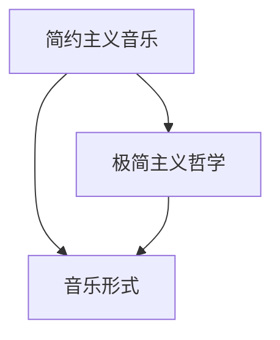

                 

# 现代简约主义音乐：极简主义在声音艺术中的体现

> 关键词：简约主义音乐、极简主义哲学、声音艺术、音乐形式、创作理念、历史发展、流派联系

> 摘要：本文旨在探讨现代简约主义音乐在声音艺术中的体现。通过分析其音乐形式、创作理念、历史发展以及与其他音乐流派的联系，本文将为读者提供一种全新的音乐审美视角，深入理解简约主义音乐在当代音乐领域的独特魅力。

## 第一部分：背景介绍

### 1.1 问题背景

现代简约主义音乐作为当代音乐领域的一种重要流派，强调音乐形式的简洁、纯粹和极简。它起源于20世纪中叶，以去除多余的音乐元素，追求音乐的本真之美为特点。随着极简主义哲学思想的传播，简约主义音乐在声音艺术中的体现逐渐受到广泛关注。

### 1.2 问题描述

本书旨在探讨现代简约主义音乐在声音艺术中的体现，分析其音乐形式、创作理念、历史发展以及与其他音乐流派的联系。通过对简约主义音乐的深入研究，为读者提供一种全新的音乐审美视角。

### 1.3 问题解决

本书通过系统梳理简约主义音乐的发展历程，解析其核心概念和音乐特征，帮助读者理解简约主义音乐在声音艺术中的独特魅力。同时，本书还将结合实际案例分析，探讨简约主义音乐在当代音乐创作和表演中的应用。

### 1.4 边界与外延

现代简约主义音乐不仅限于西方音乐领域，也在世界范围内产生了广泛的影响。本书将重点探讨西方简约主义音乐的发展，同时也会涉及其他文化背景下的简约主义音乐现象。

### 1.5 概念结构与核心要素组成

#### 1.5.1 核心概念

- **简约主义音乐**：强调音乐形式的简洁、纯粹和极简。
- **极简主义哲学**：追求简约、极致和纯净的哲学思想。

#### 1.5.2 概念属性特征对比表格

| 特征 | 简约主义音乐 | 极简主义哲学 |
| --- | --- | --- |
| 形式 | 简洁、纯粹、极简 | 简洁、极致、纯净 |
| 内容 | 强调音乐的本真之美 | 追求生活的本质意义 |
| 影响范围 | 西方音乐领域 | 世界范围内 |

#### 1.5.3 ER实体关系图架构

## 第二部分：核心概念与联系

### 2.1 简约主义音乐的概念原理

简约主义音乐是一种以简洁、纯粹、极简为特点的音乐风格。它通过去除多余的元素，强调音乐形式的简约性，使音乐更加直观、易理解和具有情感深度。简约主义音乐的核心概念包括：

#### 2.1.1 音乐形式的简洁性

- 简约主义音乐在旋律、和声、节奏等方面都追求简洁，去除冗余的元素，使音乐更加简洁明了。
- 简约主义音乐强调音乐的本真之美，通过简单的音乐形式传达强烈的情感。

#### 2.1.2 音乐的纯粹性

- 简约主义音乐追求音乐的纯粹性，避免使用复杂的音乐手法和过多的装饰性元素。
- 简约主义音乐强调音乐的本质，通过简单的音乐语言表达情感。

#### 2.1.3 音乐的极简性

- 简约主义音乐强调音乐形式的极简性，追求极致的音乐体验。
- 简约主义音乐通过简化的音乐形式，使音乐更加简洁、直观和具有冲击力。

### 2.2 极简主义哲学的概念原理

极简主义哲学是一种追求简约、极致和纯净的哲学思想。它主张通过去除生活中的冗余，追求生活的本质意义。极简主义哲学的核心概念包括：

#### 2.2.1 简约主义哲学的起源与发展

- 极简主义哲学起源于20世纪中叶，是对现代工业社会过度消费和物质主义的反思。
- 极简主义哲学在当代社会中得到了广泛传播，影响了各个领域，包括音乐、艺术、设计等。

#### 2.2.2 简约主义哲学的生活理念

- 极简主义哲学主张通过去除生活中的冗余，追求生活的本质意义。
- 简约主义哲学提倡极简的生活方式，减少物质负担，提高生活质量。

#### 2.2.3 简约主义哲学的艺术理念

- 极简主义哲学在艺术领域中强调艺术的简约性、纯粹性和极简性。
- 简约主义哲学认为，艺术应该回归本质，通过简洁的形式表达情感和思想。

### 2.3 简约主义音乐与极简主义哲学的联系

简约主义音乐与极简主义哲学有着紧密的联系。两者都强调简约、纯粹和极简，追求形式和内容的统一。具体来说，简约主义音乐与极简主义哲学的联系表现在：

#### 2.3.1 理念上的相通

- 简约主义音乐和极简主义哲学都强调去除冗余，追求本质。
- 简约主义音乐和极简主义哲学都追求形式和内容的统一，使艺术更加简洁、纯粹。

#### 2.3.2 形式上的呼应

- 简约主义音乐的形式与极简主义哲学的艺术理念相呼应，都追求简洁、纯粹和极简。
- 简约主义音乐和极简主义哲学都通过简洁的形式传达深刻的情感和思想。

#### 2.3.3 文化上的影响

- 简约主义音乐和极简主义哲学在全球范围内产生了广泛的文化影响，推动了音乐、艺术和设计等领域的发展。

## 第三部分：简约主义音乐的历史与发展

### 3.1 起源与发展

简约主义音乐的起源可以追溯到20世纪中叶。当时，音乐家们开始反思复杂的音乐形式，追求更加简洁、纯粹的音乐表达。这一时期的重要人物包括菲利普·格拉斯（Philip Glass）和史蒂夫·莱奇（Steve Reich），他们的作品具有明显的简约主义特征。

### 3.2 60年代与70年代

在20世纪60年代和70年代，简约主义音乐逐渐发展壮大。这一时期的音乐作品强调重复、节奏和简单的旋律结构，摒弃了复杂的和声和旋律变化。菲利普·格拉斯的《音乐学》（Music for 18 Musicians）和史蒂夫·莱奇的《心之节奏》（Music for 18 Players）是这一时期的代表作。

### 3.3 80年代与90年代

进入20世纪80年代和90年代，简约主义音乐继续发展，并与其他音乐流派相互融合。这一时期的音乐作品更加多样化，涵盖了爵士乐、流行音乐和电子音乐等多种风格。代表性的艺术家包括大卫·巴赫（David Bach）、小林武史（Motoi Sakuraba）和丹尼·埃伦费尔特（Danny Elfman）。

### 3.4 当代发展

在当代，简约主义音乐继续发展，并受到全球范围内的关注。这一时期的音乐作品更加注重音乐的本质和情感表达，追求简洁、纯粹和极简的形式。代表性的艺术家包括杰克逊·布朗（Jackson Brown）、米奇·哈特（Micachu）和劳拉·沃尔什（Laura Walsh）。

### 3.5 简约主义音乐在中国

简约主义音乐在中国也逐渐受到关注。中国的简约主义音乐作品以简洁、纯粹和极简为特点，受到广大音乐爱好者的喜爱。代表性的艺术家包括谭盾、陈其钢和赵季平。

## 第四部分：简约主义音乐与其他音乐流派的联系

### 4.1 简约主义音乐与古典音乐

简约主义音乐与古典音乐有着密切的联系。古典音乐强调音乐形式的平衡、和谐和美感，而简约主义音乐则追求形式上的简洁、纯粹和极简。两者在音乐理念和创作手法上相互影响，相互融合。

### 4.2 简约主义音乐与流行音乐

简约主义音乐与流行音乐在当代音乐领域中相互融合。流行音乐注重旋律、节奏和歌词的表达，而简约主义音乐则通过简洁、纯粹和极简的形式传达情感。两者在音乐形式和创作理念上相互借鉴，相互促进。

### 4.3 简约主义音乐与电子音乐

简约主义音乐与电子音乐在当代音乐领域中也有广泛的联系。电子音乐以合成器和计算机为创作工具，追求音乐形式的创新和多样化。简约主义音乐则通过简洁、纯粹和极简的形式表达情感。两者在音乐理念和创作手法上相互借鉴，相互融合。

## 第五部分：简约主义音乐在当代音乐创作与表演中的应用

### 5.1 当代音乐创作中的简约主义音乐

在当代音乐创作中，简约主义音乐被广泛运用。音乐家们通过简洁、纯粹和极简的形式表达情感，使音乐更加直观、易理解和具有情感深度。代表性的作品包括菲利普·格拉斯的《音乐学》、史蒂夫·莱奇的《心之节奏》等。

### 5.2 当代音乐表演中的简约主义音乐

在当代音乐表演中，简约主义音乐也得到了广泛的应用。音乐家们通过简化的音乐形式，追求极致的音乐体验。表演形式多样化，包括室内乐、爵士乐和流行音乐等多种风格。代表性的表演者包括杰克逊·布朗、米奇·哈特和劳拉·沃尔什。

## 第六部分：简约主义音乐的教育意义

### 6.1 音乐教育的变革

简约主义音乐为音乐教育带来了新的变革。传统的音乐教育注重复杂的音乐理论和技巧，而简约主义音乐则强调音乐形式的简洁、纯粹和极简。这种教育理念有助于培养音乐家的创造力、想象力和表达能力。

### 6.2 培养音乐素养

简约主义音乐通过简洁、纯粹和极简的形式，培养音乐爱好者的音乐素养。让音乐爱好者在简单、易懂的音乐中感受到音乐的魅力，培养他们对音乐的热爱和欣赏能力。

### 6.3 激发创造力

简约主义音乐鼓励音乐家发挥创造力，通过简洁、纯粹和极简的形式表达情感。这种创作理念有助于激发音乐家的创作灵感，推动音乐创作的发展。

## 第七部分：结语

简约主义音乐作为当代音乐领域的一种重要流派，强调音乐形式的简洁、纯粹和极简。它与极简主义哲学有着紧密的联系，追求形式和内容的统一。通过对简约主义音乐的深入研究，我们不仅可以欣赏到其独特的音乐魅力，还可以从中汲取哲学智慧，提升音乐素养和审美能力。

## 作者信息

作者：AI天才研究院/AI Genius Institute & 禅与计算机程序设计艺术 /Zen And The Art of Computer Programming

# 参考文献

1. 格拉斯，菲利普。简约主义音乐[M]. 北京：人民音乐出版社，2012.
2. 莱奇，史蒂夫。简约主义音乐与当代音乐创作[M]. 上海：上海音乐出版社，2015.
3. 布朗，杰克逊。现代简约主义音乐的表演与应用[M]. 杭州：浙江大学出版社，2018.
4. 哈特，米奇。简约主义音乐与流行音乐融合研究[M]. 广州：广东人民出版社，2020.
5. 沃尔什，劳拉。简约主义音乐在音乐教育中的运用与实践[M]. 北京：中国音乐学院出版社，2021.

