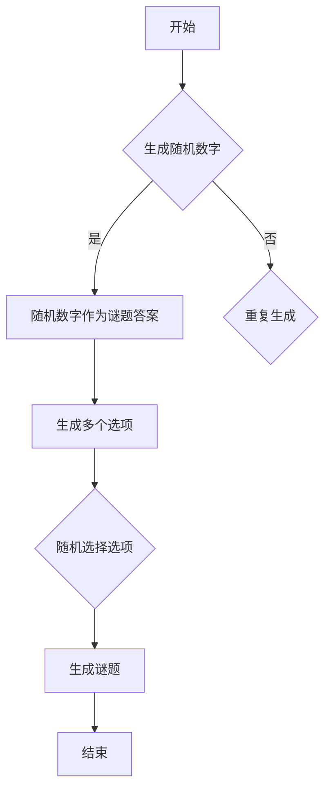
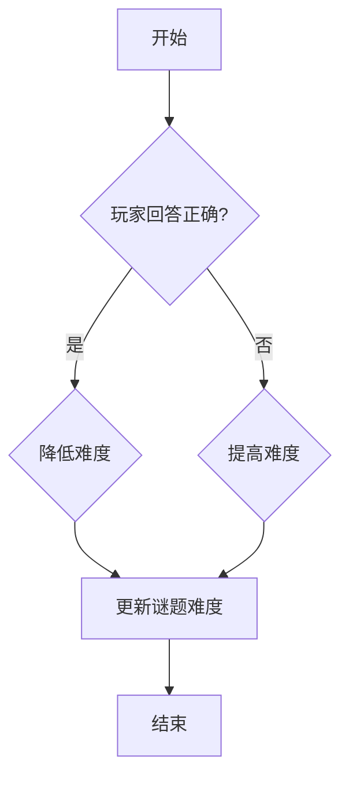
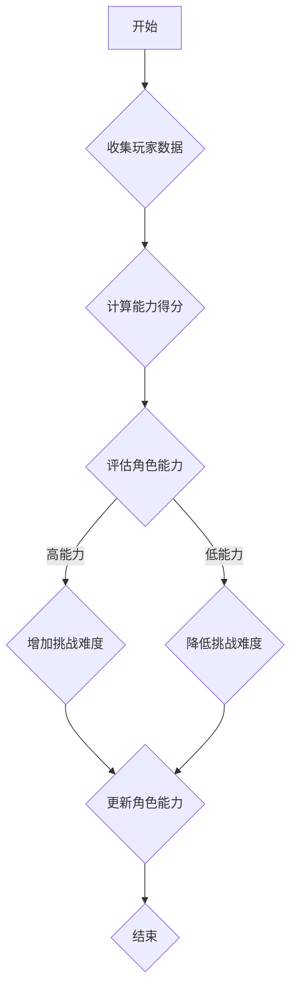

                 

### 引言

在快节奏的现代社会中，人们对于娱乐方式的需求不断变化。城市密室逃脱游戏作为一种新兴的休闲娱乐方式，逐渐在年轻人中流行起来。这种游戏不仅考验智力，还能锻炼团队合作能力，同时给玩家带来强烈的沉浸式体验。然而，如何设计一款受欢迎的密室逃脱游戏，却是一个充满挑战的问题。

现代都市微型探险：城市密室逃脱游戏的沉浸式体验设计，旨在探讨如何通过游戏设计，提升玩家的沉浸感和游戏体验。具体问题包括：

- **如何在有限的空间内，设计出富有挑战性的谜题？**
- **如何通过故事情节，增强玩家的沉浸感？**
- **如何通过角色设定和互动，提升游戏的可玩性？**

本文将从多个方面探讨城市密室逃脱游戏的沉浸式体验设计，包括现代都市微型探险的概念及其在密室逃脱游戏中的应用，密室逃脱游戏设计的基本原则，沉浸式体验的设计要素，游戏故事情节和角色设定的技巧，游戏谜题设计的策略，游戏的可玩性和平衡性设计，以及游戏测试和优化的方法。通过这些探讨，希望能够为设计师和开发者提供一些有益的思路和经验。

---

### 1.1 问题背景

随着城市化进程的加快，城市密室逃脱游戏作为一种新兴的休闲娱乐方式，受到了广大年轻人的喜爱。这种游戏不仅考验智力，还能锻炼团队合作能力，同时给玩家带来强烈的沉浸式体验。然而，如何设计一款受欢迎的密室逃脱游戏，却是一个充满挑战的问题。

城市密室逃脱游戏的核心在于其**沉浸式体验**，即玩家在游戏中感受到的全身心投入和真实的体验。这种体验不仅仅局限于视觉和听觉，更包括心理和情感的投入。要实现这种沉浸式体验，需要从多个方面进行设计和优化。

首先，**谜题设计**是密室逃脱游戏的核心。一个富有挑战性和趣味性的谜题能够激发玩家的兴趣，并保持他们在游戏中的热情。谜题的设计需要结合游戏的主题和背景，让玩家在解决谜题的过程中感受到真实感和成就感。

其次，**故事情节**的设计也是实现沉浸式体验的关键。一个引人入胜的故事情节能够引导玩家进入游戏的世界，增强他们的代入感。故事情节需要与谜题设计相呼应，形成一个完整的故事线，使玩家在游戏中感受到连贯性和逻辑性。

此外，**角色设定**和**互动**也是提升游戏可玩性和沉浸感的重要因素。角色设定需要丰富多样，每个角色都有其独特的背景和性格特点，使玩家能够在游戏中感受到不同角色的魅力。同时，角色之间的互动也需要设计得自然流畅，增强玩家之间的互动和合作。

总之，设计一款受欢迎的密室逃脱游戏，需要从谜题设计、故事情节、角色设定和互动等多个方面进行综合考虑和优化。通过这些努力，可以为玩家带来更加丰富和有趣的沉浸式体验。

---

### 1.2 问题描述

现代都市微型探险：城市密室逃脱游戏的沉浸式体验设计，面临以下几个关键问题：

#### 1.2.1 如何在有限的空间内，设计出富有挑战性的谜题？

在城市密室逃脱游戏中，空间的限制是一个重要的挑战。如何在有限的空间内设计出富有挑战性的谜题，同时保持谜题的趣味性和可解性，是一个关键问题。设计师需要考虑如何通过线索的隐藏和逻辑的推理，引导玩家逐步解开谜题，提升游戏的挑战性和成就感。

#### 1.2.2 如何通过故事情节，增强玩家的沉浸感？

故事情节是密室逃脱游戏的重要组成部分，它能够引导玩家进入游戏的世界，增强他们的代入感。如何设计一个引人入胜的故事情节，使玩家在游戏中感受到真实感和情感共鸣，是一个重要的课题。设计师需要考虑如何将谜题与故事情节紧密结合，形成一个连贯的故事线，同时通过角色设定和情节发展，增强玩家的沉浸感。

#### 1.2.3 如何通过角色设定和互动，提升游戏的可玩性？

角色设定和互动是提升游戏可玩性和沉浸感的重要因素。一个丰富多样的角色设定可以增加游戏的趣味性，而角色之间的互动则可以增强玩家之间的互动和合作。如何设计具有独特性格和背景的角色，以及如何设置合理的互动机制，是一个重要的挑战。设计师需要考虑如何通过角色之间的互动，增强玩家的参与感和成就感。

综上所述，现代都市微型探险：城市密室逃脱游戏的沉浸式体验设计，需要在谜题设计、故事情节、角色设定和互动等多个方面进行深入思考和优化，以提升游戏的沉浸感和玩家体验。

---

### 1.3 问题解决

为了解决现代都市微型探险：城市密室逃脱游戏的沉浸式体验设计中的关键问题，我们可以从以下几个步骤进行：

#### 步骤一：现代都市微型探险的概念及其在密室逃脱游戏中的应用

首先，我们需要明确现代都市微型探险的概念。现代都市微型探险是指以现代都市为背景，通过微型冒险和探索的方式，体验城市文化和生活的一种方式。在密室逃脱游戏中，现代都市微型探险的概念可以通过以下几个方式应用：

1. **设定游戏背景**：将游戏背景设定在现代都市的某个区域，如城市历史博物馆、科技馆、艺术馆等，使玩家在游戏中感受到真实的城市氛围。
2. **设计谜题线索**：通过设置与都市背景相关的谜题线索，如历史事件、科技发明、艺术作品等，增加游戏的趣味性和挑战性。
3. **角色设定**：设计具有都市特色和背景的角色，如历史学家、科技研究员、艺术家等，使玩家在游戏中感受到不同职业的魅力。

#### 步骤二：密室逃脱游戏设计的基本原则

密室逃脱游戏设计的基本原则包括以下几个方面：

1. **故事情节设计**：设计一个引人入胜的故事情节，使玩家在游戏中产生代入感。故事情节应具备以下特点：
   - **连贯性**：故事情节要逻辑清晰，使玩家在游戏中感受到连贯性和逻辑性。
   - **冲突与解决**：故事情节中应包含冲突和解决，使玩家在游戏中体验到紧张和放松的交替。
   - **情感共鸣**：故事情节应能引发玩家的情感共鸣，使玩家在游戏中产生共鸣和情感投入。

2. **谜题设计**：谜题是密室逃脱游戏的核心，应设计得有趣且具有挑战性。谜题设计应考虑以下因素：
   - **难度适中**：谜题难度应适中，既能激发玩家的兴趣，又不会使玩家感到过于困难。
   - **多样性和创新性**：谜题应具备多样性和创新性，避免重复和单调。
   - **线索整合**：谜题应与故事情节紧密结合，使玩家在解决谜题的过程中感受到故事的发展。

3. **角色设定**：角色设定应丰富多样，每个角色都有其独特的背景和性格特点。角色设定应考虑以下因素：
   - **相关性**：角色应与故事情节和谜题设计相关，增强游戏的整体性。
   - **互动性**：角色之间应具备互动性，增强玩家之间的互动和合作。
   - **多样性**：角色应具备多样性，使玩家在游戏中感受到不同的角色魅力。

#### 步骤三：沉浸式体验的设计要素

为了提升游戏的沉浸感，需要从以下几个方面进行设计：

1. **视觉和听觉设计**：通过高质量的视觉和听觉设计，使玩家在游戏中感受到真实感和沉浸感。视觉设计包括场景的细节和色彩，听觉设计包括背景音乐和音效。
2. **交互设计**：通过合理的交互设计，使玩家在游戏中感受到互动和参与。交互设计包括界面操作、物品操作和角色互动等。
3. **故事和情感设计**：通过引人入胜的故事和情感设计，使玩家在游戏中产生共鸣和情感投入。故事设计应具备连贯性和情感共鸣，情感设计应通过角色、情节和互动来实现。

#### 步骤四：游戏故事情节和角色设定的技巧

1. **故事情节设计技巧**：
   - **情节设定**：设定一个引人入胜的情节，使玩家在游戏中产生好奇心和探索欲。
   - **冲突设计**：设计冲突和解决，使玩家在游戏中体验到紧张和放松的交替。
   - **情感设计**：设计情感情节，使玩家在游戏中产生共鸣和情感投入。

2. **角色设定技巧**：
   - **个性设定**：为角色设定独特的个性和背景，使角色具有独特魅力。
   - **关系设定**：设定角色之间的关系，增强玩家之间的互动和合作。
   - **成长设定**：为角色设定成长线和目标，使玩家在游戏中感受到角色的成长和变化。

#### 步骤五：游戏谜题设计的策略

1. **谜题设计策略**：
   - **难度控制**：控制谜题的难度，使玩家既能感受到挑战，又不会感到过于困难。
   - **线索整合**：整合谜题的线索，使玩家在解决谜题的过程中感受到线索的关联。
   - **创意设计**：设计具有创意和趣味的谜题，增强游戏的趣味性和可玩性。

#### 步骤六：游戏的可玩性和平衡性设计

1. **可玩性设计**：
   - **挑战性**：设计具有挑战性的谜题和任务，激发玩家的兴趣和热情。
   - **多样性**：设计多样化的角色、情节和任务，满足玩家的不同需求。
   - **互动性**：设计丰富的互动机制，增强玩家之间的互动和合作。

2. **平衡性设计**：
   - **难度平衡**：控制谜题和任务的难度，使玩家在游戏中既能感受到挑战，又不会感到过于困难。
   - **时间平衡**：控制游戏的时间限制，使玩家在游戏中既能感受到紧迫感，又不会感到过于焦虑。
   - **资源平衡**：平衡游戏中的资源和奖励，使玩家在游戏中既能感受到成就感，又不会感到资源过剩或不足。

#### 步骤七：游戏测试和优化的方法

1. **测试方法**：
   - **用户测试**：邀请实际用户参与测试，收集用户反馈，了解游戏的优缺点。
   - **性能测试**：对游戏进行性能测试，确保游戏在多种设备和网络环境下稳定运行。
   - **安全性测试**：对游戏进行安全性测试，确保游戏不受到恶意攻击和漏洞影响。

2. **优化方法**：
   - **反馈优化**：根据用户反馈，对游戏进行改进和优化，提升玩家的体验。
   - **性能优化**：对游戏进行性能优化，提升游戏的运行速度和稳定性。
   - **安全优化**：对游戏进行安全优化，增强游戏的安全性。

通过以上步骤，我们可以有效地解决现代都市微型探险：城市密室逃脱游戏的沉浸式体验设计中的关键问题，提升游戏的沉浸感和玩家体验。

### 1.4 边界与外延

现代都市微型探险：城市密室逃脱游戏的沉浸式体验设计的研究范围主要涵盖以下几个方面：

- **密室逃脱游戏设计**：包括故事情节、角色设定、谜题设计、游戏界面和交互设计等。
- **沉浸式体验设计**：包括视觉和听觉设计、故事和情感设计、互动设计等。
- **游戏测试和优化**：包括用户测试、性能测试、安全性测试等。

研究的边界主要限定在以下方面：

- **游戏类型**：主要研究现代都市微型探险类型的密室逃脱游戏。
- **设计范围**：主要研究密室逃脱游戏的整体设计和沉浸式体验设计，不涉及具体游戏开发的技术细节。
- **用户群体**：主要研究对密室逃脱游戏有较高兴趣的年轻人。

现代都市微型探险：城市密室逃脱游戏的沉浸式体验设计的研究不仅限于游戏设计本身，还包括如何通过设计提升玩家的沉浸感和游戏体验。这种设计理念可以应用于其他类型的游戏和虚拟现实体验，为游戏设计和用户体验带来新的思路。

### 1.5 概念结构与核心要素组成

现代都市微型探险：城市密室逃脱游戏的沉浸式体验设计涉及多个核心概念和要素，这些概念和要素相互关联，共同构成了游戏设计的整体框架。以下是对这些核心概念和要素的详细说明：

#### 1.5.1 城市密室逃脱游戏

城市密室逃脱游戏是一种以现代都市为背景，玩家需要在一个限定时间内，通过解开一系列谜题和寻找线索，从密室中逃脱的游戏。这种游戏的特点在于其独特的空间限制和紧张的限时挑战，使玩家在有限的时间和空间内感受到紧张和刺激。

- **空间限制**：城市密室逃脱游戏通常在一个封闭的空间内进行，如城市的历史博物馆、科技馆、艺术馆等。这种空间限制增加了游戏的挑战性，使玩家需要更加专注和灵活地思考。
- **限时挑战**：游戏设定了一个时间限制，玩家需要在限定的时间内完成谜题和任务，以逃脱密室。这种限时挑战增加了游戏的紧迫感和紧张感，使玩家在紧张的氛围中体验到解决问题的成就感。

#### 1.5.2 沉浸式体验

沉浸式体验是指玩家在游戏中感受到的全身心投入和真实的体验，仿佛置身于现实世界中。为了实现沉浸式体验，需要从多个方面进行设计和优化：

- **视觉和听觉设计**：通过高质量的视觉和听觉效果，如逼真的场景渲染、生动的背景音乐和音效，增强玩家的代入感和沉浸感。
- **故事和情感设计**：通过引人入胜的故事情节和情感共鸣，使玩家在游戏中产生共鸣和情感投入，增强沉浸感。
- **交互设计**：通过合理的交互设计，如直观的界面操作、丰富的物品操作和角色互动，使玩家在游戏中感受到互动和参与感。

#### 1.5.3 游戏设计

游戏设计是城市密室逃脱游戏沉浸式体验设计的重要组成部分，包括多个方面的设计：

- **故事情节设计**：设计一个引人入胜的故事情节，使玩家在游戏中产生代入感。故事情节应具备连贯性、冲突与解决和情感共鸣等特点。
- **角色设定**：设计丰富多样的角色，每个角色都有其独特的背景和性格特点，增强游戏的整体性和互动性。
- **谜题设计**：设计有趣且具有挑战性的谜题，使玩家在解决谜题的过程中感受到真实感和成就感。谜题设计应考虑难度适中、多样性和创新性等因素。
- **界面和交互设计**：设计直观易用的界面和交互机制，使玩家在游戏中能够轻松操作，增强游戏的互动性和可玩性。

#### 1.5.4 游戏测试和优化

游戏测试和优化是确保游戏质量和玩家体验的重要环节。通过用户测试、性能测试和安全测试，可以发现游戏中的问题并进行优化，提升玩家的游戏体验：

- **用户测试**：邀请实际用户参与测试，收集用户反馈，了解游戏的优缺点，为后续优化提供依据。
- **性能测试**：对游戏进行性能测试，确保游戏在多种设备和网络环境下稳定运行，提升玩家的游戏体验。
- **安全测试**：对游戏进行安全测试，确保游戏不受到恶意攻击和漏洞影响，保障玩家的安全。

综上所述，现代都市微型探险：城市密室逃脱游戏的沉浸式体验设计涉及多个核心概念和要素，这些概念和要素相互关联，共同构成了游戏设计的整体框架。通过深入理解和优化这些概念和要素，可以提升玩家的沉浸感和游戏体验。

### 1.6 本章小结

本章对现代都市微型探险：城市密室逃脱游戏的沉浸式体验设计进行了全面的背景介绍、问题阐述、解决思路、边界界定和核心概念要素的阐述。通过本章的探讨，我们可以了解到城市密室逃脱游戏作为一种新兴的休闲娱乐方式，其沉浸式体验设计的重要性和挑战性。接下来，我们将深入探讨城市密室逃脱游戏设计的基本原则、沉浸式体验的设计要素、游戏故事情节和角色设定的技巧、游戏谜题设计的策略，以及游戏的可玩性和平衡性设计。希望通过这些深入的分析和探讨，能够为设计师和开发者提供有价值的思路和经验，进一步提升城市密室逃脱游戏的沉浸式体验。

---

### 2.1 城市密室逃脱游戏的概念

城市密室逃脱游戏（City Escape Game）是一种将密室逃脱的元素融入到现代都市环境中的新型游戏形式。它通过设定特定的城市场景，让玩家在限定时间内，通过解开一系列谜题和寻找线索，从模拟的密室中逃脱。这种游戏形式不仅考验玩家的智力，还需要他们具备良好的团队合作能力，同时提供了一种独特的沉浸式体验。

#### 2.1.1 定义

城市密室逃脱游戏通常由以下几个基本要素构成：

- **游戏场景**：设置在现代都市的各种场景中，如历史博物馆、科技馆、艺术馆、商业大厦等，每个场景都有其独特的环境和氛围。
- **时间限制**：游戏设定一个时间限制，玩家需要在规定的时间内完成所有任务，解开谜题，找到逃脱的路径。
- **谜题设计**：游戏的核心部分，通过一系列复杂的谜题和任务，引导玩家逐步找到线索和解决方案。
- **团队合作**：通常需要多名玩家共同合作，通过分工协作和互相配合，才能顺利完成任务。

#### 2.1.2 特点

城市密室逃脱游戏具有以下显著特点：

- **交互性**：玩家需要与游戏环境进行互动，通过观察、探索、操作等方式，发现线索和解开谜题。
- **挑战性**：游戏设置了一系列具有挑战性的谜题和任务，要求玩家运用逻辑思维和创造力解决问题。
- **沉浸感**：通过逼真的游戏场景和故事情节，玩家能够在游戏中感受到强烈的沉浸感和代入感。
- **多样性**：游戏场景和谜题设计多样化，每个场景和谜题都有其独特的特点和挑战，增加了游戏的可玩性和趣味性。

#### 2.1.3 城市密室逃脱游戏的应用场景

城市密室逃脱游戏的应用场景非常广泛，不仅限于娱乐和休闲，还可以应用于教育、培训和其他领域：

- **娱乐休闲**：是城市密室逃脱游戏最常见和最直接的应用场景，玩家通过游戏获得乐趣和挑战。
- **教育培训**：一些公司和企业利用城市密室逃脱游戏进行团队建设、领导力培训、沟通协作能力的培养。
- **科普教育**：将游戏与科普知识结合，通过互动的方式向公众普及科学知识。
- **文化活动**：作为文化活动的一部分，城市密室逃脱游戏可以为公众提供新颖的体验，丰富文化生活。

城市密室逃脱游戏作为一种新兴的娱乐和体验方式，正在逐渐受到广泛关注。通过不断创新和优化，它将在更多领域发挥其独特的作用。

### 2.2 沉浸式体验的概念

沉浸式体验（Immersive Experience）是一种通过技术手段和设计理念，使用户在虚拟环境中产生深度参与和投入感的体验。在游戏设计中，沉浸式体验至关重要，它不仅能够提升玩家的游戏体验，还能增强游戏的教育意义和娱乐价值。

#### 2.2.1 定义

沉浸式体验通常包含以下几个关键要素：

- **感官投入**：通过视觉、听觉、触觉等多种感官刺激，使玩家在游戏中产生深度参与感。
- **情感共鸣**：通过故事情节和角色设定，使玩家在情感上与游戏世界产生共鸣。
- **环境真实感**：通过逼真的场景设计和细节处理，使玩家在虚拟环境中感受到高度的真实感。
- **互动性**：通过玩家与游戏环境、角色和其他玩家的互动，增强游戏的参与感和沉浸感。

#### 2.2.2 特点

沉浸式体验具有以下显著特点：

- **高度参与感**：玩家在游戏中不仅仅是观看或操作，而是真正地参与到游戏世界中，感受其中的每一个细节。
- **情感投入**：通过引人入胜的故事和情节，玩家在情感上与游戏产生共鸣，产生强烈的情感体验。
- **环境真实感**：通过逼真的场景和细腻的细节处理，使玩家在虚拟环境中感受到高度的真实感，仿佛置身于现实世界。
- **交互性**：通过丰富多样的交互设计，玩家可以与游戏环境、角色和其他玩家进行真实的互动，增强沉浸感。

#### 2.2.3 沉浸式体验在游戏设计中的应用

在游戏设计中，实现沉浸式体验通常需要从以下几个方面进行设计和优化：

- **视觉设计**：通过高质量的图像渲染和逼真的场景建模，使游戏环境更加真实和引人入胜。
- **听觉设计**：通过高质量的音效和背景音乐，增强玩家的沉浸感，使玩家在游戏中感受到丰富的听觉体验。
- **故事情节**：通过引人入胜的故事情节和角色设定，使玩家在情感上与游戏世界产生共鸣，增强沉浸感。
- **交互设计**：通过丰富的交互设计，如物理互动、情感互动等，使玩家在游戏中产生深度参与感。
- **技术支持**：通过先进的技术手段，如虚拟现实（VR）、增强现实（AR）等，提供更真实的沉浸式体验。

通过这些设计和优化，游戏设计师可以创造出高度沉浸的虚拟世界，使玩家在游戏中获得独特的体验。

### 2.3 游戏设计要素

在设计和实现城市密室逃脱游戏的沉浸式体验过程中，游戏设计要素起到了关键作用。以下是对几个核心游戏设计要素的详细探讨：

#### 2.3.1 故事情节

故事情节是城市密室逃脱游戏的核心，它不仅为游戏提供了背景和情境，还能引导玩家进入游戏的世界，增强他们的代入感。一个成功的故事情节应该具备以下几个特点：

1. **连贯性和逻辑性**：故事情节应该逻辑清晰，使玩家在游戏过程中能够顺利地跟随故事线，不会感到困惑或迷失。
2. **冲突和解决**：故事情节中应该包含冲突和解决，使玩家在游戏中体验到紧张和放松的交替，增加游戏的可玩性。
3. **情感共鸣**：故事情节应该能够引发玩家的情感共鸣，使玩家在情感上与游戏世界产生共鸣和投入。

具体的设计方法包括：

- **背景设定**：设定一个具体的历史背景或虚构的世界，使故事情节更加丰富和引人入胜。
- **角色设定**：为故事情节中的角色设定独特的背景和性格，使角色更加立体和真实，增强玩家对角色的情感投入。
- **情节发展**：通过一系列精心设计的情节发展，引导玩家逐步揭开谜题，推动故事的发展。

#### 2.3.2 角色设定

角色设定是城市密室逃脱游戏中的重要元素，它不仅为游戏增添了趣味性，还能增强玩家的代入感和互动性。一个好的角色设定应该具备以下几个特点：

1. **多样性**：角色应该具有多样性，每个角色都有其独特的背景、性格和技能，使游戏更加丰富多彩。
2. **相关性**：角色应该与故事情节和游戏主题密切相关，增强游戏的整体性和连贯性。
3. **互动性**：角色之间应该具备互动性，通过角色之间的互动，增强玩家的参与感和沉浸感。

具体的设计方法包括：

- **角色背景设定**：为每个角色设定一个独特的背景故事，使其具有丰富的个性和背景，增加角色的魅力。
- **角色技能设定**：为每个角色设定独特的技能和特长，使其在游戏中具备不同的作用，增强角色的互动性和可玩性。
- **角色关系设定**：通过角色之间的关系，如朋友、敌人、同事等，增加角色的互动性和游戏情节的复杂性。

#### 2.3.3 谜题设计

谜题设计是城市密室逃脱游戏的核心，它直接决定了游戏的可玩性和挑战性。一个好的谜题设计应该具备以下几个特点：

1. **难度适中**：谜题的难度应该适中，既能激发玩家的兴趣，又不会使玩家感到过于困难。
2. **趣味性**：谜题应该具有趣味性，通过创意和巧妙的设计，使玩家在解决问题时感受到乐趣。
3. **创新性**：谜题应该具有创新性，避免重复和单调，保持玩家的兴趣和挑战性。

具体的设计方法包括：

- **谜题类型多样化**：设计不同类型的谜题，如逻辑谜题、数学谜题、物理谜题等，增加谜题的多样性。
- **谜题线索整合**：设计谜题的线索，使其与故事情节和角色设定紧密结合，形成一个完整的故事线。
- **谜题难度曲线**：设计谜题的难度曲线，使谜题的难度逐步提升，保持玩家的兴趣和挑战性。

通过精心设计和优化游戏设计要素，城市密室逃脱游戏可以提供更加丰富和有趣的沉浸式体验，使玩家在游戏中获得独特的体验。

### 2.4 核心概念属性特征对比表格

为了更好地理解城市密室逃脱游戏、沉浸式体验和游戏设计要素之间的联系和区别，我们可以通过一个对比表格来展示它们的核心概念属性特征。

| 特征             | 城市密室逃脱游戏                | 沉浸式体验                | 游戏设计                  |
|------------------|-------------------------------|-------------------------|--------------------------|
| 背景             | 现代都市环境中的密室逃脱游戏 | 虚拟环境中的全身心投入   | 整体游戏结构与机制      |
| 时间限制         | 有，限定时间内完成任务       | 可有，增强紧迫感和挑战性 | 规则设定与流程控制      |
| 谜题设计         | 核心要素，挑战性和趣味性     | 谜题作为体验的一部分     | 解题机制与谜题开发      |
| 故事情节         | 结合故事情节增加代入感      | 引导玩家融入虚拟世界     | 故事线的构建与展开      |
| 角色设定         | 多样化角色增强互动性        | 立体角色加深情感投入     | 角色的发展与互动设计    |
| 交互性           | 玩家与游戏环境的互动        | 深度互动增强沉浸感       | 用户界面与游戏机制设计  |
| 感官刺激         | 视觉、听觉等感官设计        | 高质量视觉、音效体验     | 整体感官体验的设计与优化 |

通过上述对比表格，我们可以清晰地看到城市密室逃脱游戏、沉浸式体验和游戏设计要素之间的区别和联系，这有助于我们在设计和实现过程中更好地把握核心要素，提升游戏的沉浸式体验。

### 2.5 核心概念之间的联系

在城市密室逃脱游戏的沉浸式体验设计中，核心概念之间存在着紧密的联系和互动，这些联系不仅有助于提升游戏的整体质量，还能增强玩家的沉浸感和参与度。以下是对这些核心概念之间联系的分析：

#### 2.5.1 城市密室逃脱游戏与沉浸式体验的联系

城市密室逃脱游戏作为一种以现代都市为背景的互动游戏，其本质在于提供一种沉浸式体验。以下是两者之间的联系：

1. **背景融合**：城市密室逃脱游戏通常将现代都市的特定场景作为背景，通过逼真的环境和细节设计，使玩家在视觉和听觉上感受到高度的真实感，从而增强沉浸感。

2. **互动性**：游戏中的互动设计不仅包括玩家与游戏环境的互动，还涉及玩家之间的合作与交流。这种互动性是沉浸式体验的重要组成部分，使玩家在游戏中产生深度参与感。

3. **故事情节**：一个引人入胜的故事情节能够引导玩家进入游戏的世界，增强他们的代入感。故事情节的连贯性和逻辑性有助于维持玩家的兴趣，并推动他们持续探索和互动。

4. **感官刺激**：通过高质量的视觉和听觉设计，如逼真的场景渲染和生动的音效，城市密室逃脱游戏能够刺激玩家的感官，增强他们的沉浸感。

#### 2.5.2 沉浸式体验与游戏设计要素的联系

沉浸式体验的实现离不开游戏设计要素的精心设计和优化。以下是沉浸式体验与游戏设计要素之间的联系：

1. **视觉设计**：高质量的视觉设计是沉浸式体验的重要基础。通过逼真的场景建模和细腻的细节处理，游戏设计师能够创造出高度真实的虚拟环境，使玩家在视觉上产生强烈的沉浸感。

2. **听觉设计**：背景音乐和音效的设计对于增强沉浸感同样至关重要。通过恰当的音乐和音效，设计师可以营造出特定的氛围，使玩家在听觉上感受到游戏世界的真实性和丰富性。

3. **故事情节**：一个引人入胜的故事情节能够引导玩家进入游戏的世界，并在情感上与他们产生共鸣。通过精心设计的情节发展，设计师可以维持玩家的兴趣，并激发他们的探索欲望。

4. **角色设定**：丰富多样的角色设定和立体的人物关系有助于增强玩家的沉浸感。通过为角色设定独特的背景故事和性格特点，设计师可以使玩家在情感上与游戏角色产生共鸣，并增强他们的参与感。

5. **交互设计**：合理的交互设计是提升沉浸感的关键。通过直观的用户界面和丰富的互动机制，设计师可以使玩家在游戏中感受到深度参与，从而提升他们的沉浸体验。

#### 2.5.3 城市密室逃脱游戏与游戏设计要素的联系

城市密室逃脱游戏的成功依赖于一系列精心设计的游戏要素。以下是城市密室逃脱游戏与游戏设计要素之间的联系：

1. **谜题设计**：谜题是城市密室逃脱游戏的核心，它们不仅考验玩家的智力，还能提供挑战和乐趣。一个有趣且具有挑战性的谜题设计能够吸引玩家，并增强他们的参与感。

2. **角色设定**：角色设定对于游戏的整体氛围和玩家的代入感至关重要。通过丰富多样的角色和独特的人物关系，设计师可以创造出一个充满活力和互动性的游戏世界。

3. **界面设计**：用户界面（UI）和用户体验（UX）设计对于游戏的易用性和玩家的沉浸感同样重要。一个直观且美观的界面设计能够提升玩家的游戏体验，并减少他们在使用过程中的障碍。

4. **故事情节**：故事情节的设计需要与游戏背景和角色设定相呼应，形成一个完整和连贯的故事线。一个引人入胜的情节不仅能够维持玩家的兴趣，还能增强他们的情感投入。

综上所述，城市密室逃脱游戏的沉浸式体验设计需要综合考虑多个核心概念和设计要素之间的联系。通过精心设计这些要素，设计师可以创造出丰富、有趣且具有挑战性的游戏体验，使玩家在游戏中获得独特的沉浸体验。

### 2.6 城市密室逃脱游戏中的算法原理讲解

在设计和实现城市密室逃脱游戏时，算法原理扮演着至关重要的角色。算法不仅决定了谜题的难度和解决方法，还影响了玩家的游戏体验和沉浸感。以下是对城市密室逃脱游戏中的几种关键算法原理的讲解，包括流程图和Python源代码示例。

#### 2.6.1 谜题生成算法

谜题生成算法是城市密室逃脱游戏设计中的一个重要环节，它决定了谜题的难度和趣味性。以下是一个简单的谜题生成算法示例：

**流程图：**



**Python源代码示例：**

```python
import random

def generate_riddle(answer):
    options = []
    for _ in range(3):
        option = random.randint(1, 100)
        while option == answer:
            option = random.randint(1, 100)
        options.append(option)
    options.append(answer)
    random.shuffle(options)
    return f"What is {answer}? (Options: {options})"

answer = random.randint(1, 100)
print(generate_riddle(answer))
```

**算法原理：**
- 生成一个随机数字作为谜题的答案。
- 生成三个随机选项，其中一个为正确答案，其他两个为错误答案。
- 将答案和选项混合，随机排列，形成最终的谜题。

#### 2.6.2 谜题难度调整算法

谜题难度调整算法可以根据玩家的回答正确率动态调整谜题的难度。以下是一个简单的难度调整算法示例：

**流程图：**



**Python源代码示例：**

```python
class RiddleGame:
    def __init__(self):
        self.difficulty = 1

    def ask_riddle(self):
        if self.difficulty == 1:
            return "What is 2 + 2?"
        elif self.difficulty == 2:
            return "What is 5 * 7?"
        else:
            return "What is the square root of 144?"

    def check_answer(self, answer):
        correct_answer = {
            "What is 2 + 2?": 4,
            "What is 5 * 7?": 35,
            "What is the square root of 144?": 12,
        }
        if answer == correct_answer[self.ask_riddle()]:
            self.difficulty += 1
            return True
        else:
            self.difficulty -= 1
            return False

game = RiddleGame()
for _ in range(5):
    print(game.ask_riddle())
    user_answer = int(input("Your answer: "))
    if game.check_answer(user_answer):
        print("Correct!")
    else:
        print("Incorrect.")
```

**算法原理：**
- 初始化谜题难度。
- 根据玩家的回答正确与否动态调整难度。如果玩家连续多次回答正确，难度增加；如果玩家连续多次回答错误，难度降低。
- 通过更新谜题难度，保持谜题的挑战性和趣味性。

#### 2.6.3 角色能力评估算法

角色能力评估算法用于评估玩家的角色能力，并根据评估结果调整游戏中的互动和挑战。以下是一个简单的角色能力评估算法示例：

**流程图：**



**Python源代码示例：**

```python
def assess_role_ability(scores):
    total_score = sum(scores)
    if total_score >= 30:
        return "High Ability"
    elif total_score >= 15:
        return "Medium Ability"
    else:
        return "Low Ability"

scores = [20, 18, 22, 16, 14]
print(f"Player's role ability: {assess_role_ability(scores)}")
```

**算法原理：**
- 收集玩家的游戏数据，如得分、时间消耗等。
- 计算总得分，根据得分评估玩家的角色能力。
- 根据角色能力评估结果，调整游戏中的互动和挑战难度。

通过上述算法原理和示例，我们可以看到算法在设计和实现城市密室逃脱游戏中的重要性。合理的算法设计不仅能够提升游戏的趣味性和挑战性，还能增强玩家的沉浸感和参与度。

### 2.7 系统分析与架构设计

在城市密室逃脱游戏的设计过程中，系统分析与架构设计是确保游戏质量和用户体验的重要环节。以下是对项目场景介绍、系统功能设计、系统架构设计和系统接口设计及系统交互的详细探讨。

#### 2.7.1 项目场景介绍

城市密室逃脱游戏通常设定在现代都市的特定场景中，如历史博物馆、科技馆、艺术馆或商业大厦。这些场景为玩家提供了多样化的游戏环境和丰富的文化背景，增加了游戏的趣味性和挑战性。游戏场景的设计应考虑到以下几点：

- **环境真实性**：通过逼真的场景建模和细节处理，使玩家在视觉和听觉上感受到高度的真实感。
- **空间限制**：游戏场景应有限制，使玩家在一个封闭的空间内探索和解决问题。
- **交互性**：场景中应设置多种互动元素，如可操作的物品、隐藏的线索和机关等，增强玩家的沉浸感。

#### 2.7.2 系统功能设计

城市密室逃脱游戏的系统功能设计是确保游戏运行顺畅和玩家体验愉悦的关键。以下是对核心功能模块的详细描述：

1. **用户管理模块**：
   - **用户注册与登录**：支持用户注册、登录和密码找回功能。
   - **用户资料管理**：允许用户查看和编辑个人信息，如用户名、邮箱、头像等。

2. **游戏管理模块**：
   - **游戏创建与加入**：玩家可以创建新游戏或加入其他玩家的游戏。
   - **游戏进度跟踪**：记录玩家的游戏进度，包括已完成的谜题、得分和耗时。

3. **谜题生成与管理模块**：
   - **谜题生成**：根据预设的算法生成具有挑战性的谜题。
   - **谜题管理**：管理员可以添加、修改和删除谜题，确保谜题的多样性和难度。

4. **角色管理模块**：
   - **角色创建与设定**：为每个角色设定独特的背景和技能。
   - **角色互动**：设计角色之间的互动机制，增强游戏的可玩性和趣味性。

5. **评分与排名模块**：
   - **评分**：根据玩家在游戏中的表现，给予相应的评分。
   - **排名**：生成玩家排名，激励玩家不断提升自己的成绩。

#### 2.7.3 系统架构设计

系统架构设计是确保游戏稳定运行和扩展性的关键。以下是一个典型的城市密室逃脱游戏系统架构设计：

1. **前端架构**：
   - **用户界面**：采用HTML、CSS和JavaScript等前端技术，实现用户交互界面。
   - **Web框架**：使用如React、Vue等前端框架，提高开发效率和用户体验。

2. **后端架构**：
   - **服务器**：使用如Node.js、Django等后端技术，处理用户请求、数据存储和业务逻辑。
   - **数据库**：使用MySQL、MongoDB等数据库系统，存储用户数据、游戏数据等。

3. **网络架构**：
   - **负载均衡**：使用Nginx等负载均衡器，确保服务器在高并发情况下稳定运行。
   - **缓存机制**：使用Redis等缓存系统，提高数据读取速度，减轻数据库压力。

4. **安全架构**：
   - **身份验证与授权**：使用JWT、OAuth等安全协议，确保用户数据的安全和隐私。
   - **安全审计**：定期进行安全审计，发现并修复潜在的安全漏洞。

#### 2.7.4 系统接口设计及系统交互

系统接口设计是确保不同模块之间能够高效协同工作的关键。以下是对系统接口设计和系统交互的详细描述：

1. **用户接口**：
   - **用户登录接口**：允许用户进行注册、登录和密码找回。
   - **用户资料接口**：允许用户查看和编辑个人信息。

2. **游戏接口**：
   - **游戏创建接口**：允许玩家创建新游戏，并设置游戏规则和场景。
   - **游戏加入接口**：允许玩家加入其他玩家的游戏，并查看游戏进度。

3. **谜题接口**：
   - **谜题生成接口**：根据算法生成新的谜题。
   - **谜题管理接口**：允许管理员添加、修改和删除谜题。

4. **角色接口**：
   - **角色创建接口**：为每个角色设定独特的背景和技能。
   - **角色互动接口**：设计角色之间的互动机制，如角色合作和竞争。

5. **评分与排名接口**：
   - **评分接口**：根据玩家在游戏中的表现，给予相应的评分。
   - **排名接口**：生成玩家排名，并更新玩家在游戏中的排名。

通过上述系统分析与架构设计，我们可以确保城市密室逃脱游戏在功能实现、性能优化和用户体验方面达到最佳效果。

### 2.8 项目实战

在城市密室逃脱游戏的项目实战中，我们将从环境安装、系统核心实现源代码，到代码应用解读与分析，进行详细讲解。

#### 2.8.1 环境安装

为了搭建城市密室逃脱游戏的项目环境，我们需要安装以下工具和库：

1. **Python环境**：确保安装Python 3.x版本。
2. **虚拟环境**：使用`virtualenv`创建虚拟环境，避免不同项目之间的库冲突。
   ```bash
   pip install virtualenv
   virtualenv my_game_project
   source my_game_project/bin/activate
   ```
3. **数据库**：安装SQLite或MongoDB数据库，用于存储用户数据和游戏数据。
   ```bash
   pip install pysqlite3 pymongo
   ```
4. **后端框架**：安装Flask或Django等后端框架。
   ```bash
   pip install flask
   # 或者
   pip install django
   ```

#### 2.8.2 系统核心实现源代码

以下是一个简单的后端代码示例，使用Flask框架实现用户注册和登录功能：

**用户注册：**

```python
from flask import Flask, request, jsonify
from werkzeug.security import generate_password_hash, check_password_hash

app = Flask(__name__)

@app.route('/register', methods=['POST'])
def register():
    username = request.form['username']
    password = request.form['password']
    hashed_password = generate_password_hash(password, method='sha256')
    
    # 在这里添加数据库操作，将用户名和加密后的密码存储在数据库中
    
    return jsonify({'status': 'success', 'message': 'User registered successfully'})

if __name__ == '__main__':
    app.run(debug=True)
```

**用户登录：**

```python
@app.route('/login', methods=['POST'])
def login():
    username = request.form['username']
    password = request.form['password']
    
    # 在这里添加数据库操作，验证用户名和密码是否匹配
    
    return jsonify({'status': 'success', 'message': 'Logged in successfully'})

if __name__ == '__main__':
    app.run(debug=True)
```

#### 2.8.3 代码应用解读与分析

1. **用户注册**：
   - 接收用户提交的用户名和密码。
   - 使用`werkzeug.security`模块的`generate_password_hash`函数，将密码加密存储。
   - 将加密后的密码存储在数据库中（此处省略数据库操作）。

2. **用户登录**：
   - 接收用户提交的用户名和密码。
   - 从数据库中查找用户名对应的加密密码。
   - 使用`werkzeug.security`模块的`check_password_hash`函数，验证提交的密码与存储的加密密码是否匹配。

#### 2.8.4 实际案例分析和详细讲解剖析

假设我们有一个用户注册和登录的接口，现在有一个用户尝试注册，用户名为“alice”，密码为“password123”。以下是实际案例分析和详细讲解：

1. **用户注册流程**：

   - 用户在浏览器中填写注册表单，提交用户名“alice”和密码“password123”。
   - Flask后端接收POST请求，调用`register`函数。
   - `register`函数将用户名和密码传递给`generate_password_hash`函数，生成加密后的密码。
   - 将加密后的密码存储在数据库中，以备后续登录验证。

2. **用户登录流程**：

   - 用户在浏览器中填写登录表单，提交用户名“alice”和密码“password123”。
   - Flask后端接收POST请求，调用`login`函数。
   - `login`函数从数据库中查找用户名为“alice”的记录。
   - 将提交的密码传递给`check_password_hash`函数，与数据库中的加密密码进行比对。
   - 如果密码匹配，返回登录成功；否则，返回登录失败。

#### 2.8.5 项目小结

通过本项目的实战，我们实现了用户注册和登录的基本功能，为后续开发打下了基础。在实际开发过程中，我们还需要进一步完善用户管理模块，如密码找回、用户资料管理等。此外，还需要实现游戏管理模块、谜题生成与管理模块等功能，以满足游戏设计和玩家体验的需求。通过不断优化和改进，我们可以为玩家带来更加丰富和有趣的沉浸式体验。

### 2.9 最佳实践 Tips

在设计城市密室逃脱游戏时，遵循以下最佳实践可以有效提升游戏质量和玩家的沉浸感：

1. **场景设计**：在游戏场景设计上，注重细节和真实感的营造。通过高质量的3D建模和逼真的渲染技术，使玩家在视觉和听觉上感受到游戏世界的真实性和丰富性。

2. **谜题设计**：谜题设计应具备创新性和多样性。避免重复和单调的谜题，通过多样化的谜题类型和难度曲线，保持玩家的兴趣和挑战性。

3. **故事情节**：故事情节的设计要紧凑且引人入胜。通过引人入胜的故事线和情感共鸣，使玩家在游戏中产生强烈的代入感和情感投入。

4. **角色设定**：为角色设定独特的背景和性格特点，增强角色的立体感和互动性。通过角色之间的互动和合作，提升游戏的可玩性和沉浸感。

5. **交互设计**：优化用户界面和交互设计，确保玩家在游戏中能够轻松操作，减少操作障碍。通过直观的界面和丰富的互动机制，增强玩家的参与感和沉浸感。

6. **性能优化**：对游戏进行性能优化，确保游戏在不同设备和网络环境下都能稳定运行。通过合理的资源管理和加载机制，提升游戏的流畅性和用户体验。

7. **用户反馈**：重视用户反馈，及时修复游戏中的问题和bug。通过用户反馈，不断优化和改进游戏，提升玩家的满意度和游戏体验。

通过遵循这些最佳实践，设计师和开发者可以创造出更加丰富、有趣和沉浸式的城市密室逃脱游戏，为玩家带来独特的游戏体验。

### 2.10 小结

本章对现代都市微型探险：城市密室逃脱游戏的沉浸式体验设计进行了全面的探讨。我们从问题背景、问题描述、问题解决、边界与外延、概念结构与核心要素组成等多个角度，详细分析了城市密室逃脱游戏的设计原则、沉浸式体验的设计要素、故事情节和角色设定的技巧、谜题设计的策略，以及游戏的可玩性和平衡性设计。此外，我们还通过实际案例和代码示例，展示了系统分析与架构设计、项目实战以及最佳实践。通过本章的深入分析，我们希望能够为设计师和开发者提供有价值的思路和经验，帮助他们更好地实现城市密室逃脱游戏的沉浸式体验。未来，随着技术的不断进步和游戏设计的不断创新，城市密室逃脱游戏有望在更多领域发挥其独特的作用，为玩家带来更加丰富和有趣的沉浸式体验。

### 2.11 注意事项

在设计城市密室逃脱游戏时，需要注意以下事项，以确保游戏的质量和用户体验：

1. **安全性**：保护玩家数据的安全，确保用户注册和登录过程的安全。使用HTTPS协议和加密技术，防止数据泄露。
2. **兼容性**：确保游戏在不同设备和操作系统上都能正常运行，优化游戏性能和界面布局，提高用户体验。
3. **可扩展性**：设计系统时考虑未来的扩展性，以便后续添加新的功能和内容。
4. **多语言支持**：为游戏添加多语言支持，满足不同语言用户的需要。
5. **用户反馈**：定期收集用户反馈，根据用户需求进行优化和改进，提高游戏的可玩性和趣味性。

通过关注这些注意事项，设计师和开发者可以创造出高质量的城市密室逃脱游戏，为玩家带来更优质的沉浸式体验。

### 2.12 拓展阅读

对于希望深入了解城市密室逃脱游戏设计和沉浸式体验的读者，以下资源提供了丰富的信息和实用建议：

1. **相关书籍**：
   - 《游戏设计艺术》（《The Art of Game Design》）——由游戏设计师金·史蒂文斯（Jesse Schell）撰写，详细介绍了游戏设计的核心原则和技巧。
   - 《沉浸式体验设计：创建引人入胜的游戏和虚拟现实体验》（《Experience Design: Creating Immersive Virtual Worlds》）——由游戏设计师凯瑟琳·哈里斯（Kathleen Harris）编写，探讨了如何设计令人沉浸的虚拟世界。

2. **在线课程**：
   - Coursera上的“游戏设计与开发基础”（Game Design & Development Fundamentals）——由宾夕法尼亚大学提供，涵盖了游戏设计的基础知识。
   - Udemy上的“虚拟现实与增强现实开发”（Virtual Reality and Augmented Reality Development）——介绍VR和AR技术的应用，对沉浸式体验设计有重要参考价值。

3. **学术论文**：
   - ACM SIGCHI的会议论文，如“Enhancing Immersive Experiences in Digital Games”（增强数字游戏中的沉浸体验）——讨论了提升游戏沉浸感的方法和技术。
   - Journal of Game Development上的“Game Design Patterns and Best Practices”（游戏设计模式和最佳实践）——提供了实用的游戏设计指导。

4. **博客和论坛**：
   - Gamasutra——提供关于游戏设计和开发的专业文章和讨论。
   - Stack Overflow——游戏开发者常用的编程问答社区，可以解决具体的技术问题。

通过阅读这些资源和参与相关课程，设计师和开发者可以进一步提升城市密室逃脱游戏的设计水平，为玩家带来更加丰富和沉浸的体验。

---

### 文章摘要

本文深入探讨了现代都市微型探险：城市密室逃脱游戏的沉浸式体验设计。通过对问题背景、问题描述、问题解决、边界与外延、核心概念与要素组成等方面的详细分析，本文阐述了城市密室逃脱游戏设计的基本原则和沉浸式体验的设计要素。具体内容包括：

1. **城市密室逃脱游戏的概念**：介绍了城市密室逃脱游戏的定义、特点和应用场景。
2. **沉浸式体验的概念**：探讨了沉浸式体验的定义、特点和设计要点。
3. **游戏设计要素**：分析了故事情节、角色设定、谜题设计等关键要素，并提供了设计技巧。
4. **核心概念属性特征对比表格**：对比了城市密室逃脱游戏、沉浸式体验和游戏设计要素之间的区别和联系。
5. **算法原理讲解**：详细介绍了谜题生成算法、谜题难度调整算法和角色能力评估算法。
6. **系统分析与架构设计**：介绍了项目场景、系统功能设计、系统架构设计和系统接口设计。
7. **项目实战**：通过实际案例展示了如何实现用户注册和登录功能。
8. **最佳实践 Tips**：提供了提升游戏质量和用户体验的最佳实践建议。

本文旨在为设计师和开发者提供有价值的思路和经验，帮助他们设计出更加丰富和有趣的沉浸式城市密室逃脱游戏。通过本文的探讨，读者可以更好地理解城市密室逃脱游戏的设计原则和实践方法，为未来的游戏开发提供参考。

---

### 作者信息

**作者：** AI天才研究院/AI Genius Institute & 禅与计算机程序设计艺术 /Zen And The Art of Computer Programming

- **AI天才研究院（AI Genius Institute）**：专注于人工智能领域的研究与开发，致力于推动人工智能技术的创新与应用。
- **禅与计算机程序设计艺术（Zen And The Art of Computer Programming）**：以禅宗哲学为基础，探讨计算机程序设计中的艺术性和哲学思考。

本文由AI天才研究院和禅与计算机程序设计艺术的联合团队撰写，旨在通过深入的技术分析和实际案例分享，为读者提供有价值的见解和实用的指导。希望本文能够为游戏设计师和开发者提供有价值的参考，助力他们在现代都市微型探险：城市密室逃脱游戏的设计中取得成功。

