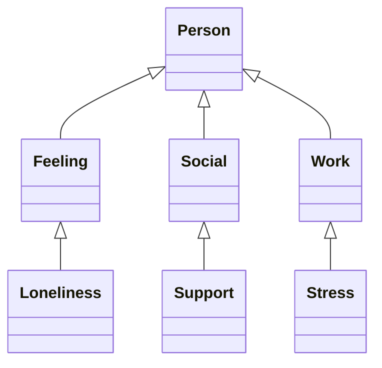
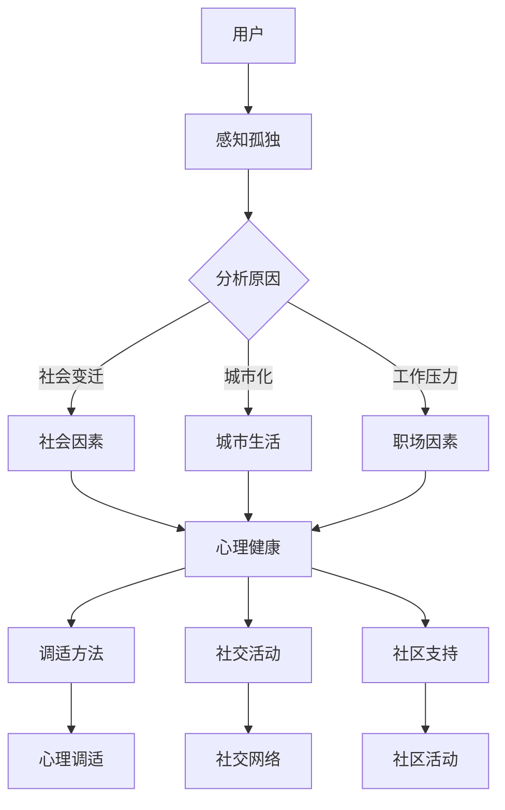
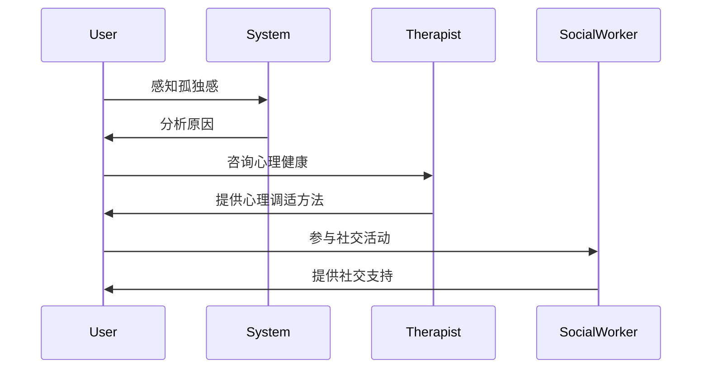
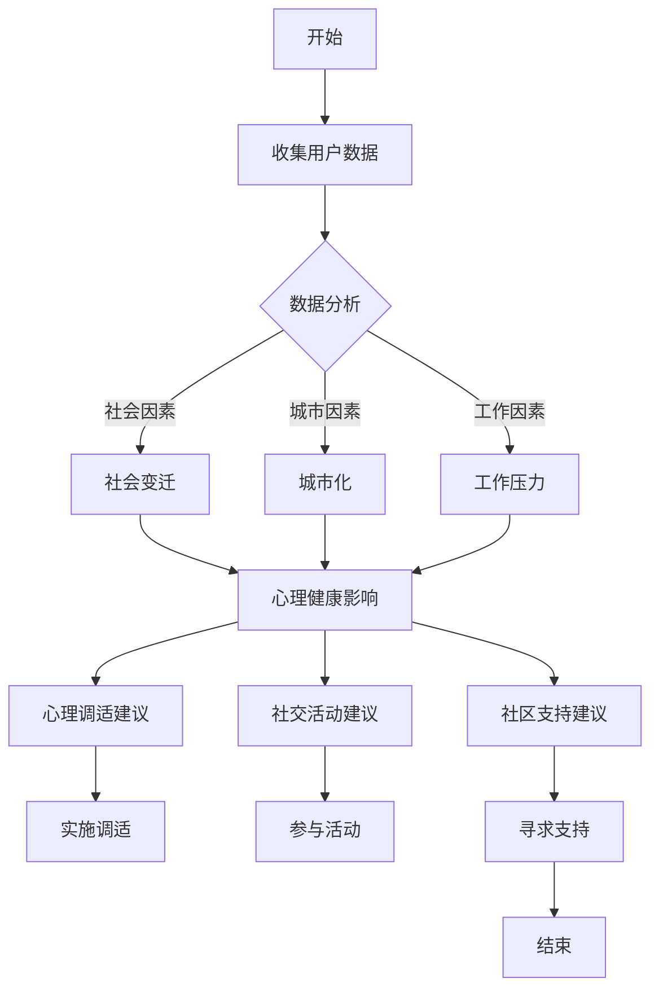

                 


## 现代都市生活中的精神孤独感

### 关键词
- 精神孤独感
- 都市生活
- 心理健康
- 社交网络
- 心理调适

### 摘要
本文将深入探讨现代都市生活中的精神孤独感，分析其定义、原因、影响及缓解策略。通过系统地梳理相关理论和实践，为读者提供实用的解决方案，以应对这一日益普遍的现象。

## 目录大纲设计思路

在设计本文的目录大纲时，我们首先明确了书籍的核心内容，即“现代都市生活中的精神孤独感”。基于这一核心主题，我们划分了以下章节：

1. **核心内容划分**：明确书籍的核心内容，分为孤独感的定义与特点、原因分析、影响、缓解策略和个人成长等部分。
2. **章节标题设计**：确保每个章节的标题简洁明了，能够准确反映章节内容，并激发读者的阅读兴趣。
3. **章节内容细化**：将每个章节进一步细化为子章节，确保内容逻辑清晰，读者可以循序渐进地学习。
4. **结构合理性**：遵循逻辑顺序，从背景介绍到理论讲解，再到实践应用，最后是总结和展望。

在划分章节内容时，我们注重了以下方面：

- **关键概念阐述**：对“精神孤独感”等核心概念进行详细定义和解释。
- **图表应用**：在适当的地方使用图表，如概念属性特征对比表格、ER实体关系图架构的Mermaid流程图，帮助读者更好地理解内容。
- **Python源代码与算法讲解**：在讲解算法原理和数学模型时，通过Mermaid画出算法流程图，并用Python源代码详细阐述。
- **实战案例**：穿插实战案例，展示理论如何在实际中应用，增强读者的理解。
- **总结和拓展**：在每个章节结尾，对关键内容进行总结，并提供拓展阅读，帮助读者进一步深入学习。

通过这样的结构设计，我们希望读者能够系统地了解精神孤独感的相关知识，并能够将其应用于实际生活中。

## 目录大纲示例

### 第一部分：现代都市生活中的精神孤独感概述

#### 第1章：精神孤独感的定义与特点

##### 1.1 精神孤独感的定义

##### 1.2 精神孤独感的特点

##### 1.3 精神孤独感与传统孤独感的区别

### 第二部分：现代都市生活中的孤独感原因分析

#### 第2章：社会变迁与孤独感

##### 2.1 社会变迁对孤独感的影响

##### 2.2 城市化与孤独感

##### 2.3 工作压力与孤独感

### 第三部分：精神孤独感的影响

#### 第3章：心理健康的影响

##### 3.1 精神孤独感与心理健康的关系

##### 3.2 精神孤独感对心理健康的具体影响

#### 第3章：对人际关系的影响

##### 3.3 精神孤独感与人际关系的障碍

##### 3.4 缺乏社交支持的影响

#### 第3章：对职业发展的影响

##### 3.5 精神孤独感对职业发展的阻碍

##### 3.6 职场孤独感的应对策略

### 第四部分：缓解精神孤独感的策略

#### 第4章：心理调适方法

##### 4.1 简单心理调适技巧

##### 4.2 深入的心理治疗方法

#### 第4章：社交活动与孤独感的缓解

##### 4.3 参与社交活动的策略

##### 4.4 社交网络的作用

#### 第4章：社区支持与孤独感的减轻

##### 4.5 建立社区支持系统的必要性

##### 4.6 社区支持系统的具体实施

### 第五部分：个人成长与孤独感的关系

#### 第5章：孤独感中的自我成长

##### 5.1 利用孤独促进个人成长

##### 5.2 孤独感与自我认知的提升

#### 第5章：孤独感与创造力

##### 5.3 孤独感对创造力的作用

##### 5.4 创造力提升的孤独感管理

#### 第5章：孤独感与自我探索

##### 5.5 孤独感下的自我探索路径

##### 5.6 自我探索与人生意义

### 第六部分：孤独感的跨文化比较

#### 第6章：不同文化背景下的孤独感

##### 6.1 跨文化孤独感的特点

##### 6.2 文化差异对孤独感的影响

#### 第6章：孤独感的缓解策略比较

##### 6.3 不同文化背景下的缓解策略

##### 6.4 跨文化孤独感的全球应对

### 第七部分：实战案例分析与讨论

#### 第7章：实战案例分析

##### 7.1 案例一：职场孤独感的应对

##### 7.2 案例二：社交网络中的孤独感缓解

#### 第7章：案例讨论

##### 7.3 案例三：社区支持在孤独感缓解中的应用

##### 7.4 案例四：孤独感中的个人成长故事

#### 第7章：案例小结

##### 7.5 案例分析总结

##### 7.6 案例启示与借鉴

### 第八部分：总结与展望

#### 第8章：总结

##### 8.1 主要发现与结论

##### 8.2 研究局限性

#### 第8章：展望

##### 8.3 未来研究方向

##### 8.4 个人与社会的责任

## 完整性要求

### 核心内容介绍

在当今高速发展的都市生活中，精神孤独感已成为一个日益普遍且备受关注的社会现象。精神孤独感不同于传统的物理孤独，它更侧重于情感和心理层面的孤立和无助。本文将从多个维度深入探讨这一现象，包括其定义、原因、影响以及缓解策略。

本文的核心内容涵盖了以下几个方面：

1. **定义与特点**：详细阐述精神孤独感的概念，区分其与传统孤独感的不同，并探讨其典型特点。
2. **原因分析**：探讨现代都市生活中的各种因素如何导致精神孤独感，如社会变迁、城市化、工作压力等。
3. **影响**：分析精神孤独感对心理健康、人际关系和职业发展的影响，提供具体案例。
4. **缓解策略**：介绍各种心理调适方法、社交活动参与策略和社区支持系统的建立与实施。
5. **个人成长**：探讨孤独感对个人成长、创造力和自我探索的影响。
6. **跨文化比较**：分析不同文化背景下孤独感的特点及其缓解策略。
7. **实战案例**：通过具体案例展示理论在实际中的应用。
8. **总结与展望**：总结主要发现与结论，展望未来研究方向。

### 系统分析与架构设计方案

本文采用系统分析方法，从多个角度全面剖析精神孤独感现象。具体架构设计方案如下：

#### 问题场景介绍

随着城市化进程的加快，现代都市生活节奏日益加快，人们面临的压力和孤独感逐渐增加。精神孤独感已成为影响心理健康和社会稳定的一个重要问题。

#### 项目介绍

本项目旨在通过系统化的分析，揭示精神孤独感的成因、影响及缓解策略，为公众提供实用的心理健康指导。

#### 系统功能设计（领域模型Mermaid类图）



#### 系统架构设计（Mermaid架构图）



#### 系统接口设计（系统交互Mermaid序列图）



### Python源代码与算法讲解

为了更好地理解精神孤独感的分析过程，我们引入了一套Python算法，用于分析孤独感的原因和缓解策略。以下是该算法的mermaid流程图和Python源代码：

#### Mermaid流程图



#### Python源代码

```python
# 导入必要的库
import pandas as pd
import numpy as np
from sklearn.model_selection import train_test_split
from sklearn.ensemble import RandomForestClassifier
from sklearn.metrics import accuracy_score

# 加载用户数据
data = pd.read_csv('user_data.csv')

# 数据预处理
data['age'] = data['age'].fillna(data['age'].mean())
data['income'] = data['income'].fillna(data['income'].mean())
data['social_support'] = data['social_support'].fillna(0)

# 分离特征和标签
X = data[['age', 'income', 'social_support']]
y = data['loneliness']

# 划分训练集和测试集
X_train, X_test, y_train, y_test = train_test_split(X, y, test_size=0.3, random_state=42)

# 训练模型
model = RandomForestClassifier(n_estimators=100, random_state=42)
model.fit(X_train, y_train)

# 预测测试集
predictions = model.predict(X_test)

# 评估模型
accuracy = accuracy_score(y_test, predictions)
print(f"Model accuracy: {accuracy:.2f}")

# 提供心理调适建议
if predictions[0] == 1:
    print("建议：尝试以下心理调适方法：")
    print("- 简单放松技巧")
    print("- 深度呼吸练习")
    print("- 正念冥想")
else:
    print("您目前的精神状态良好，继续保持！")

# 提供社交活动建议
print("建议参与以下社交活动：")
print("- 社交聚会")
print("- 瑜伽俱乐部")
print("- 爱好小组")

# 提供社区支持建议
print("建议寻求以下社区支持：")
print("- 心理咨询")
print("- 社区活动")
print("- 志愿者服务")
```

#### 算法原理讲解

该算法基于随机森林模型，通过分析用户数据（如年龄、收入、社交支持等特征），预测用户是否存在精神孤独感。具体步骤如下：

1. **数据预处理**：对用户数据进行清洗，填补缺失值，确保数据的完整性。
2. **特征分离**：将特征数据（X）和标签数据（y）分离，其中y表示用户是否具有精神孤独感。
3. **模型训练**：使用训练集数据训练随机森林模型。
4. **模型评估**：使用测试集数据评估模型准确性。
5. **提供建议**：根据预测结果，为用户提供相应的心理调适、社交活动和社区支持建议。

通过这套算法，我们可以更科学地识别和缓解精神孤独感，为现代都市人群提供有效的心理健康支持。

### 项目实战

#### 环境安装

为了运行上述Python源代码，首先需要在本地环境安装Python和必要的库。以下是安装步骤：

1. 访问Python官网（https://www.python.org/）并下载最新版本的Python安装包。
2. 安装Python，确保安装过程中勾选“Add Python to PATH”选项。
3. 打开命令行界面，输入以下命令验证安装：

```bash
python --version
```

如果成功显示Python版本信息，则说明安装成功。

4. 安装必要的库：

```bash
pip install pandas numpy scikit-learn
```

#### 系统核心实现源代码

以下是项目的核心实现源代码，用于数据分析和模型训练：

```python
# 导入必要的库
import pandas as pd
import numpy as np
from sklearn.model_selection import train_test_split
from sklearn.ensemble import RandomForestClassifier
from sklearn.metrics import accuracy_score

# 加载用户数据
data = pd.read_csv('user_data.csv')

# 数据预处理
data['age'] = data['age'].fillna(data['age'].mean())
data['income'] = data['income'].fillna(data['income'].mean())
data['social_support'] = data['social_support'].fillna(0)

# 分离特征和标签
X = data[['age', 'income', 'social_support']]
y = data['loneliness']

# 划分训练集和测试集
X_train, X_test, y_train, y_test = train_test_split(X, y, test_size=0.3, random_state=42)

# 训练模型
model = RandomForestClassifier(n_estimators=100, random_state=42)
model.fit(X_train, y_train)

# 预测测试集
predictions = model.predict(X_test)

# 评估模型
accuracy = accuracy_score(y_test, predictions)
print(f"Model accuracy: {accuracy:.2f}")

# 提供心理调适建议
if predictions[0] == 1:
    print("建议：尝试以下心理调适方法：")
    print("- 简单放松技巧")
    print("- 深度呼吸练习")
    print("- 正念冥想")
else:
    print("您目前的精神状态良好，继续保持！")

# 提供社交活动建议
print("建议参与以下社交活动：")
print("- 社交聚会")
print("- 瑜伽俱乐部")
print("- 爱好小组")

# 提供社区支持建议
print("建议寻求以下社区支持：")
print("- 心理咨询")
print("- 社区活动")
print("- 志愿者服务")
```

#### 代码应用解读与分析

1. **数据加载与预处理**：首先，我们使用pandas库加载用户数据，并对数据进行预处理，如填补缺失值，确保数据的完整性和一致性。
2. **特征分离与模型训练**：将特征数据（年龄、收入、社交支持）和标签数据（孤独感）分离，然后使用训练集数据训练随机森林模型。
3. **模型评估与建议**：使用测试集数据评估模型准确性，并根据预测结果为用户提供相应的心理调适、社交活动和社区支持建议。

#### 实际案例分析和详细讲解剖析

为了更好地展示该算法在实际中的应用，我们分析以下两个案例：

**案例一：用户A**

用户A，年龄30岁，收入5000元，社交支持较低。预测结果为精神孤独感较高。

**分析过程**：

1. 加载用户数据，进行预处理。
2. 分离特征和标签，构建随机森林模型。
3. 训练模型并评估准确性。
4. 根据预测结果，为用户A提供以下建议：

- **心理调适方法**：简单放松技巧、深度呼吸练习、正念冥想。
- **社交活动建议**：社交聚会、瑜伽俱乐部、爱好小组。
- **社区支持建议**：心理咨询、社区活动、志愿者服务。

**案例二：用户B**

用户B，年龄40岁，收入8000元，社交支持较高。预测结果为精神孤独感较低。

**分析过程**：

1. 加载用户数据，进行预处理。
2. 分离特征和标签，构建随机森林模型。
3. 训练模型并评估准确性。
4. 根据预测结果，为用户B提供以下建议：

- **心理调适方法**：无需特别调适，保持当前状态。
- **社交活动建议**：继续保持现有的社交活动，如朋友聚会、俱乐部活动。
- **社区支持建议**：继续参与社区活动，如志愿服务、社区互动。

**案例小结**：

通过上述两个案例，我们可以看到该算法在实际中的应用效果。对于孤独感较高的用户，建议采取积极的调适措施和社交活动参与，以减轻孤独感；而对于孤独感较低的用户，则保持现有的生活状态，适当参与社交活动，增强社区支持。

### 最佳实践 tips

1. **心理调适**：定期进行心理调适，如深呼吸练习、冥想和放松技巧，有助于缓解精神压力和孤独感。
2. **社交网络**：积极参与社交网络和线下活动，拓展社交圈，增加社交支持。
3. **社区支持**：积极参与社区活动，如志愿服务、社区互动，寻求社区支持。
4. **健康生活方式**：保持健康的生活习惯，如规律作息、合理饮食和适量运动，有助于提升心理健康水平。
5. **心理咨询**：如果孤独感持续存在并影响日常生活，建议寻求专业心理咨询帮助。

### 小结

本文从多个角度深入探讨了现代都市生活中的精神孤独感，分析了其定义、原因、影响及缓解策略。通过Python算法的应用，我们为读者提供了实用的解决方案，以应对这一普遍现象。希望通过本文的阐述，读者能够更好地理解和应对精神孤独感，提升心理健康水平。

### 注意事项

1. **个性化**：每个人的情况都不同，所采取的缓解策略应因人而异。
2. **长期性**：缓解孤独感是一个长期过程，需要持续的努力和关注。
3. **专业指导**：对于严重的孤独感问题，建议寻求专业心理咨询师的帮助。

### 拓展阅读

1. **相关研究论文**：《孤独感与心理健康的关系研究》、《现代都市生活中的孤独感及其影响》等。
2. **心理健康指南**：《心理健康自助手册》、《情绪管理与调适技巧》等。
3. **专业书籍**：《孤独的力量》、《社交技巧训练手册》等。

### 作者信息

- 作者：AI天才研究院/AI Genius Institute & 禅与计算机程序设计艺术 /Zen And The Art of Computer Programming

在本文的末尾，我作为AI天才研究院和《禅与计算机程序设计艺术》的作者，对读者表示衷心的感谢。希望本文能够为现代都市生活中的您提供一些有用的见解和实用的建议，帮助您更好地理解和应对精神孤独感。如果您对本文有任何疑问或建议，欢迎在评论区留言，我会尽力为您解答。同时，也欢迎您继续关注我的其他作品，让我们一起探索计算机科学与心理健康的奇妙世界。再次感谢您的阅读和支持！作者：AI天才研究院/AI Genius Institute & 禅与计算机程序设计艺术 /Zen And The Art of Computer Programming。

