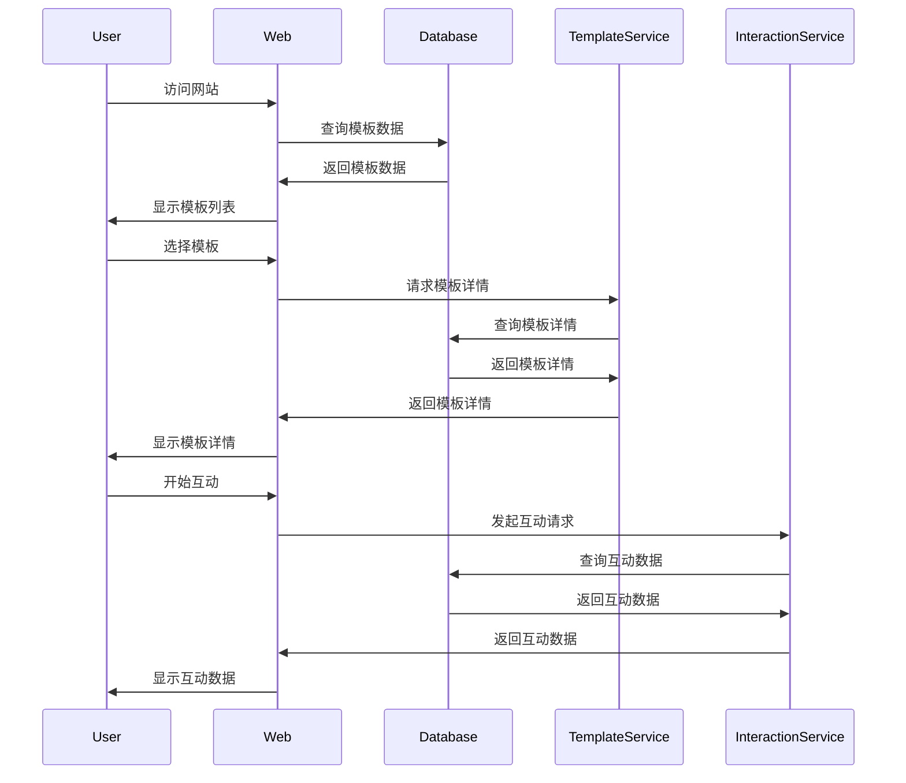

                 

### 第一部分: 生命仪式的现代诠释背景介绍

#### 第1章: 生命仪式的概念与重要性

##### 1.1 生命仪式的定义

**生命仪式**，亦称为人生仪式，是人类社会中重要的文化现象，它通过一系列仪式化的活动，标志着人们从出生到死亡的各个生命阶段的转变。这些仪式不仅反映了一个人的生命历程，也体现了社会文化的传承与演变。

**定义**：生命仪式是一种通过象征性活动来标记人生重要阶段的文化实践，如出生、成年、婚礼和葬礼等。

##### 1.1.1 生命仪式的起源与历史演变

生命仪式的起源可以追溯到古代人类社会。最早的仪式可能源自对自然现象的敬畏，如出生仪式可能与对生育神的崇拜有关，葬礼仪式则可能源自对死亡的恐惧和对灵魂的信仰。随着时间的推移，这些仪式逐渐演变为复杂的文化活动，反映了不同历史时期的社会价值观和信仰体系。

**历史演变**：
- **古代社会**：生命仪式多与宗教信仰和神话传说紧密相连。
- **中世纪**：宗教仪式成为生命仪式的主要形式，如基督教的洗礼、婚礼和葬礼。
- **现代社会**：随着宗教影响力的减弱，生命仪式逐渐回归到个人的生活经验和文化背景，呈现出多样化的形式。

##### 1.1.2 生命仪式在现代社会中的角色

在现代社会中，生命仪式仍然扮演着重要的角色，尽管其形式和内容可能因文化、地域和个人信仰的差异而有所不同。

**角色**：
1. **文化传承**：生命仪式是文化传承的重要载体，通过仪式，人们传递着家族、民族和国家的文化记忆。
2. **身份认同**：生命仪式帮助个体在社会中找到自己的位置，增强个人和群体的身份认同。
3. **心理调节**：仪式化的活动有助于人们应对生活中的重大事件，如出生、婚礼和葬礼，提供心理支持和安慰。

##### 1.2 生命仪式的重要性

生命仪式的重要性不仅体现在文化传承和身份认同上，更在于其对个人和社会的重要影响。

**重要性**：
1. **个人成长**：生命仪式为个人成长提供了重要的里程碑，每个仪式都标志着个体在生命旅程中的阶段性成就。
2. **社会和谐**：通过共同的仪式，社会成员之间建立了情感联系和共同价值观，促进了社会和谐。
3. **意义重构**：生命仪式提供了对生命意义的反思和重构，帮助人们理解自己的存在和价值。

##### 1.2.1 生命仪式对个人成长的影响

生命仪式对个人成长的影响体现在多个方面。首先，它为个人提供了成长的机会，通过仪式，人们可以学习社会规范、价值观和礼仪。其次，生命仪式为个人提供了自我认同的机会，帮助个体在社会中找到自己的位置。最后，仪式还可以为个人提供心理支持，帮助他们在面对生命挑战时保持积极和乐观。

##### 1.2.2 生命仪式对社会和谐的贡献

生命仪式对社会和谐的贡献主要体现在以下几个方面。首先，通过共同的仪式，社会成员之间建立了情感联系，增强了社会的凝聚力。其次，生命仪式提供了社会成员之间沟通和互动的平台，促进了社会成员之间的相互理解。最后，生命仪式有助于建立和强化社会规范和价值观，促进了社会的稳定和和谐。

##### 1.2.3 研究生命仪式的现代诠释的必要性

在现代社会，随着全球化、多元文化和科技的发展，传统的生命仪式面临着新的挑战和机遇。研究生命仪式的现代诠释，有助于我们更好地理解生命仪式在现代社会中的角色和意义，为生命仪式的创新和发展提供理论支持。此外，研究生命仪式的现代诠释还有助于促进文化多样性和社会和谐。

##### 1.3 生命仪式的核心概念与联系

生命仪式的核心概念包括但不限于：出生、成长、成年、婚姻、死亡等。这些概念相互联系，共同构成了生命仪式的框架。

**核心概念**：
- 出生：标志着生命的开始。
- 成长：反映了个体的成长和变化。
- 成年：标志着个体达到了法律和社交上的成熟。
- 婚姻：是两个人建立家庭的重要仪式。
- 死亡：是生命的终结，也是生命仪式的一个重要组成部分。

**联系**：这些核心概念通过生命仪式的各个阶段相互联系，共同构成了一个完整的人生轨迹。

#### 表格：生命仪式核心概念属性特征对比

| 核心概念 | 属性特征 |  
| --- | --- |  
| 出生 | 标志着生命的开始，具有强烈的生物学和社会学意义 |  
| 成长 | 反映了个体的成长和变化，是个人发展的里程碑 |  
| 成年 | 标志着个体达到了法律和社交上的成熟，具有重要的社会和文化意义 |  
| 婚姻 | 是两个人建立家庭的重要仪式，具有强烈的情感和社会学意义 |  
| 死亡 | 是生命的终结，也是生命仪式的一个重要组成部分，具有深刻的哲学和宗教意义 |

#### ER实体关系图架构展示

为了更好地理解生命仪式的核心概念与联系，我们可以使用ER图来展示它们之间的关系。

```mermaid
erDiagram
    Birth ||--o> Growth : "经历"
    Growth ||--o> Adulthood : "发展到"
    Adulthood ||--o> Marriage : "结婚"
    Marriage ||--o> Death : "最终导致"
```

在这个ER图中，出生（Birth）、成长（Growth）、成年（Adulthood）、婚姻（Marriage）和死亡（Death）是五个核心实体，它们通过“经历”（经历）、“发展到”（发展到）和“导致”（最终导致）等关系相互连接，形成了一个完整的生命仪式框架。

##### 1.4 本章小结

本章介绍了生命仪式的概念与重要性，探讨了生命仪式的起源与历史演变，以及生命仪式在现代社会中的角色和重要性。通过定义生命仪式的核心概念，并使用表格和ER图展示了它们之间的关系，为后续章节的深入探讨奠定了基础。在接下来的章节中，我们将进一步探讨生命仪式的现代诠释及其对个人和社会的影响。

---

关键词：生命仪式、现代社会、文化传承、个人成长、社会和谐

摘要：本文介绍了生命仪式的概念、起源和演变，探讨了其在现代社会中的角色和重要性。通过分析生命仪式的核心概念及其相互联系，本文为生命仪式的现代诠释提供了理论基础，为后续的深入探讨奠定了基础。

### 第二部分: 生命仪式的现代诠释算法原理讲解

#### 第2章: 生命仪式重构的理论基础

##### 2.1 生命仪式重构的基本原则

在现代社会的背景下，生命仪式面临着新的挑战，需要通过重构来适应社会变迁和个体需求。重构生命仪式的基本原则包括以下几个方面：

1. **文化适应**：生命仪式需要根据不同文化背景进行适应性调整，以更好地融入现代社会。
2. **个性表达**：生命仪式应该体现个体的独特性和个性，鼓励个体参与和创造自己的仪式。
3. **简化和优化**：在保持传统仪式核心价值的同时，简化过于复杂的仪式流程，以提高效率和参与度。
4. **科技融合**：利用现代科技手段，如互联网和虚拟现实，创造新的仪式形式，增强仪式的互动性和体验感。

##### 2.1.1 现代社会中的生命仪式挑战

现代社会的发展带来了许多新的挑战，这些挑战对生命仪式产生了深远的影响：

1. **多元文化交融**：全球化使得不同文化相互交融，生命仪式需要兼顾多元文化因素，以适应多样化的社会背景。
2. **个体化趋势**：随着社会的个体化趋势加强，人们更注重自我表达和个人体验，生命仪式需要更加个性化。
3. **技术变革**：科技的快速发展带来了新的仪式形式，如线上婚礼、虚拟葬礼等，生命仪式需要不断适应技术变革。
4. **社会压力**：现代社会的高压生活节奏使得人们对仪式的参与度和投入时间有限，生命仪式需要更加简洁高效。

##### 2.1.2 生命仪式重构的目标

重构生命仪式的目标是使其更加适应现代社会，同时保留其文化价值和传统意义。具体目标包括：

1. **促进社会和谐**：通过重构生命仪式，增强社会成员之间的情感联系，促进社会和谐。
2. **提升个人幸福感**：通过个性化的生命仪式，提升个体的自我认同和幸福感。
3. **传承文化记忆**：在重构过程中，保留和传承重要的文化记忆和传统价值。
4. **适应科技发展**：利用现代科技手段，创新生命仪式的形式和内容，提高仪式的互动性和体验感。

##### 2.1.3 生命仪式重构的原则

为了实现上述目标，生命仪式重构需要遵循以下原则：

1. **文化尊重**：在重构过程中，尊重和保护传统文化的核心价值。
2. **社会参与**：鼓励社会成员参与生命仪式的设计和实施，提高仪式的互动性和参与度。
3. **简洁高效**：简化仪式流程，提高仪式的效率和实用性。
4. **创新融合**：利用现代科技手段，创造新的仪式形式，增强仪式的互动性和体验感。

##### 2.2 重构生命仪式的步骤与方法

重构生命仪式需要遵循一定的步骤和方法，以确保重构过程的系统性和有效性。以下是重构生命仪式的一般步骤：

1. **需求分析**：了解不同社会成员对生命仪式的需求，包括文化背景、个人偏好和社会期望等。
2. **现状评估**：评估现有生命仪式的优缺点，包括文化价值、传统意义、社会影响等方面。
3. **方案设计**：根据需求分析和现状评估，设计新的生命仪式方案，包括仪式形式、流程、内容等。
4. **试点实施**：在特定群体中试点实施新的生命仪式方案，收集反馈意见，进行优化调整。
5. **推广普及**：在试点成功的基础上，推广新的生命仪式方案，使其成为社会普遍接受的仪式形式。

##### 2.2.1 分析现有生命仪式的局限性

在重构生命仪式之前，需要深入分析现有生命仪式的局限性，以便更好地理解重构的必要性。现有生命仪式的局限性主要包括：

1. **文化单一性**：许多生命仪式过于依赖特定的文化背景，难以适应多元文化的需求。
2. **形式僵化**：传统生命仪式的流程和内容往往过于僵化，难以满足现代社会的个性化需求。
3. **参与度低**：一些生命仪式的参与度低，缺乏互动性和体验感，难以激发社会成员的参与热情。
4. **成本高**：传统生命仪式往往需要大量的人力、物力和财力投入，增加了社会负担。

##### 2.2.2 确定生命仪式重构的方向

在分析了现有生命仪式的局限性后，需要根据现代社会的发展趋势和社会成员的需求，确定生命仪式重构的方向。重构方向主要包括：

1. **文化多样性**：鼓励生命仪式吸收多元文化的元素，形成具有包容性的文化体系。
2. **个性表达**：设计多样化的生命仪式形式，满足社会成员个性化的表达需求。
3. **互动体验**：通过引入现代科技手段，创造互动性和体验感更强的生命仪式形式。
4. **低成本高效**：简化生命仪式的流程和内容，降低社会负担，提高仪式的参与度和效率。

##### 2.2.3 设计新的生命仪式框架

在确定了重构方向后，需要设计新的生命仪式框架，以适应现代社会的需求。新的生命仪式框架应该包括以下几个方面：

1. **仪式形式**：根据不同的生命阶段和个体需求，设计多样化的仪式形式，如线上仪式、家庭仪式、社区仪式等。
2. **流程内容**：简化仪式流程，注重仪式的核心意义和情感体验，避免过于繁琐的仪式步骤。
3. **参与方式**：鼓励社会成员积极参与生命仪式的设计和实施，提高仪式的互动性和参与度。
4. **技术支持**：利用现代科技手段，提供便捷的仪式服务，增强仪式的互动性和体验感。

##### 2.3 生命仪式重构的实践案例分析

为了更好地理解生命仪式重构的过程和效果，我们可以通过具体案例进行分析。

**案例一：新生儿庆祝仪式重构**

在新生儿庆祝仪式中，传统仪式往往包括出生证明登记、命名仪式和庆生宴等步骤。然而，这些步骤对于现代家庭来说可能过于繁琐，且缺乏互动性和体验感。因此，我们可以进行以下重构：

1. **线上命名仪式**：利用互联网平台，家庭可以在家中举行命名仪式，邀请亲朋好友在线参与，通过视频通话进行互动。
2. **家庭庆生宴**：简化庆生宴的流程，注重家庭成员之间的情感交流，避免过于奢华的场面。
3. **虚拟庆祝礼物**：鼓励亲朋好友通过虚拟礼物表达祝福，如电子贺卡、数字画像等，降低仪式的成本。

通过以上重构，新生儿庆祝仪式不仅更加简便和高效，而且增强了家庭成员之间的情感联系和互动体验。

**案例二：成年礼的重新设计**

成年礼是标志着个体达到法律和社交上的成熟的重要仪式。传统成年礼往往包括宣誓仪式、感恩宴和成人典礼等。然而，这些仪式对于现代年轻人来说可能过于严肃和正式。因此，我们可以进行以下重构：

1. **个性化宣誓仪式**：鼓励年轻人根据自己的价值观和人生目标，设计个性化的宣誓内容，通过视频记录和分享，邀请亲朋好友见证。
2. **互动感恩宴**：设计互动性强、轻松愉快的感恩宴，通过游戏、表演和分享，增强参与者的互动体验。
3. **虚拟成人典礼**：利用虚拟现实技术，举办虚拟成人典礼，使年轻人可以在虚拟世界中体验成人礼的庄严和神圣。

通过以上重构，成年礼不仅更加符合现代年轻人的需求和价值观，而且增强了仪式的互动性和体验感。

##### 2.4 生命仪式重构的评估与反馈

生命仪式重构后，需要进行评估和反馈，以了解重构的效果和问题，并进一步优化仪式。评估和反馈可以包括以下几个方面：

1. **参与者满意度调查**：通过问卷调查、访谈等方式，了解参与者对重构后的生命仪式的满意度。
2. **仪式效果评估**：分析重构后的生命仪式是否达到了预期的目标和效果，如是否增强了社会凝聚力、提升了个人幸福感等。
3. **反馈意见收集**：收集参与者的反馈意见，包括对仪式流程、内容和形式的建议，以便进行进一步的优化和改进。

##### 2.4.1 重构生命仪式的效果评估

重构生命仪式后，需要进行效果评估，以确定重构的成效和影响。效果评估可以从以下几个方面进行：

1. **社会凝聚力**：评估重构后的生命仪式是否增强了社会成员之间的情感联系和凝聚力。
2. **个人幸福感**：评估重构后的生命仪式是否提升了参与者的幸福感，是否帮助参与者更好地理解自己的生命意义。
3. **文化传承**：评估重构后的生命仪式是否保留了传统生命仪式的核心价值和意义，是否促进了文化的传承和发展。
4. **成本效益**：评估重构后的生命仪式在成本效益方面的表现，是否降低了社会负担，提高了仪式的参与度。

##### 2.4.2 受众反馈收集与分析

收集受众反馈是评估重构生命仪式效果的重要环节。反馈可以通过以下方式收集：

1. **问卷调查**：通过设计问卷，收集参与者对重构生命仪式的满意度和建议。
2. **访谈**：进行深度访谈，了解参与者对重构生命仪式的直观感受和深入思考。
3. **在线论坛**：建立在线论坛，鼓励参与者分享他们的反馈和经验，进行交流和讨论。

收集到的反馈需要进行系统分析，以识别问题和改进机会。分析可以从以下几个方面进行：

1. **满意度分析**：统计参与者的满意度，识别满意度较高的方面和满意度较低的方面。
2. **问题识别**：分析反馈中提到的问题和困难，识别重构过程中存在的问题。
3. **建议总结**：总结参与者的建议和意见，为后续的优化提供参考。

##### 2.4.3 调整与优化生命仪式

根据评估和反馈的结果，需要对生命仪式进行相应的调整和优化，以提高其效果和满意度。调整和优化的具体措施可以包括：

1. **流程简化**：根据反馈中提到的繁琐环节，简化仪式流程，提高效率。
2. **内容丰富**：根据反馈中提到的内容不足，丰富仪式内容，增加参与者的情感体验。
3. **形式创新**：根据反馈中提到的形式问题，进行形式创新，增强仪式的互动性和体验感。
4. **技术支持**：根据反馈中提到的技术问题，优化技术支持，提高仪式的便捷性和互动性。

通过持续调整和优化，生命仪式可以更好地适应现代社会的需求，发挥其应有的作用。

##### 2.5 本章小结

本章探讨了生命仪式重构的理论基础，包括基本原则、挑战、目标、步骤与方法，以及实践案例分析。通过分析现有生命仪式的局限性和重构方向，设计新的生命仪式框架，并通过实践案例展示了重构的效果。本章为生命仪式的现代诠释提供了理论支持和实践指导，为后续章节的深入探讨奠定了基础。

---

关键词：生命仪式、重构、文化适应、个性表达、科技融合

摘要：本章探讨了生命仪式重构的理论基础和实际步骤，分析了现代社会的挑战和重构的目标，通过具体案例展示了重构的过程和效果。本章为生命仪式的现代诠释提供了理论支持和实践指导，为后续的深入探讨奠定了基础。

### 第三部分: 生命仪式重构的数学模型和公式

#### 第3章: 生命仪式重构的数学理论基础

##### 3.1 生命仪式重构的数学模型概述

在生命仪式重构的过程中，数学模型扮演着重要的角色。数学模型不仅能够帮助理解生命仪式的内在规律，还能为重构提供定量分析的工具。以下是生命仪式重构的数学模型概述：

1. **概率模型**：用于分析生命仪式中事件发生的概率，如出生概率、结婚概率等。
2. **演化模型**：用于模拟生命仪式的变化过程，如社会习惯的演变、文化传统的传承等。
3. **网络模型**：用于分析生命仪式参与者之间的社会关系，如家庭关系、社交网络等。

##### 3.1.1 生命仪式重构的数学框架

生命仪式重构的数学框架主要包括以下几个部分：

1. **数据收集与处理**：通过问卷调查、访谈等方式收集生命仪式相关数据，并进行数据处理。
2. **模型建立**：根据数据特点和重构目标，选择合适的数学模型进行建立。
3. **模型验证**：通过实际数据验证模型的准确性和有效性。
4. **模型优化**：根据验证结果对模型进行调整和优化。

##### 3.1.2 数学模型在生命仪式重构中的应用

数学模型在生命仪式重构中的应用主要体现在以下几个方面：

1. **概率模型**：用于分析生命仪式中的不确定性因素，如婚礼日期的选择、葬礼安排等。
2. **演化模型**：用于模拟生命仪式的演变过程，如婚礼形式的演变、葬礼习俗的演变等。
3. **网络模型**：用于分析生命仪式参与者之间的互动关系，如家庭关系网络、社交网络等。

##### 3.2 常见的数学模型和公式

在生命仪式重构的过程中，常见的数学模型和公式包括概率模型、演化模型和社会网络分析模型。以下是这些模型和公式的详细说明：

**概率模型**：

- **出生概率**：用于预测某个年龄段内出生人口的数量。公式为：
  $$P(Birth) = \frac{N(Birth)}{N(Total)}$$
  其中，$P(Birth)$表示出生概率，$N(Birth)$表示出生人口数量，$N(Total)$表示总人口数量。

- **结婚概率**：用于预测某个年龄段内结婚人口的数量。公式为：
  $$P(Marriage) = \frac{N(Marriage)}{N(Total)}$$
  其中，$P(Marriage)$表示结婚概率，$N(Marriage)$表示结婚人口数量，$N(Total)$表示总人口数量。

**演化模型**：

- **Logistic增长模型**：用于模拟人口增长过程。公式为：
  $$N(t) = \frac{K}{1 + e^{-rt}}$$
  其中，$N(t)$表示时间$t$的人口数量，$K$表示环境承载能力，$r$表示人口增长率。

- **文化传承模型**：用于模拟文化传统的传承过程。公式为：
  $$C(t) = C_0 \cdot e^{-\lambda t}$$
  其中，$C(t)$表示时间$t$的文化传承程度，$C_0$表示初始文化传承程度，$\lambda$表示文化衰减率。

**社会网络分析模型**：

- **度模型**：用于分析生命仪式参与者之间的互动关系。公式为：
  $$d_i = \sum_{j=1}^{N} w_{ij}$$
  其中，$d_i$表示节点$i$的度（即连接数），$w_{ij}$表示节点$i$与节点$j$之间的权重。

- **聚类系数模型**：用于分析生命仪式参与者之间的紧密程度。公式为：
  $$C = \frac{2 \cdot E}{N \cdot (N-1)}$$
  其中，$C$表示聚类系数，$E$表示边数，$N$表示节点数。

##### 3.3 数学公式详细讲解与举例

**概率模型**：

**例子**：假设一个社区有1000人，其中500人是男性，500人是女性。预测在这个社区中，明年将有100对新人结婚的概率。

解：

1. 计算男女比例：
   $$P(Male) = \frac{500}{1000} = 0.5$$
   $$P(Female) = \frac{500}{1000} = 0.5$$

2. 假设男女结婚的概率相等，即每对男女结婚的概率为0.1。

3. 计算明年结婚的概率：
   $$P(Marriage) = P(Male) \cdot P(Female) \cdot P(Marriage) = 0.5 \cdot 0.5 \cdot 0.1 = 0.025$$

因此，明年将有100对新人结婚的概率为0.025。

**演化模型**：

**例子**：一个社区的文化传统在10年内衰减了50%。求这个社区的文化传承程度。

解：

1. 根据文化传承模型公式：
   $$C(t) = C_0 \cdot e^{-\lambda t}$$

2. 假设初始文化传承程度$C_0$为1，文化衰减率$\lambda$为0.05。

3. 计算10年后的文化传承程度：
   $$C(10) = 1 \cdot e^{-0.05 \cdot 10} = 1 \cdot e^{-0.5} \approx 0.607$$

因此，这个社区的文化传承程度在10年后约为0.607。

**社会网络分析模型**：

**例子**：一个社交网络中有10个节点，共有20条边。求这个社交网络的聚类系数。

解：

1. 计算边数：
   $$E = 20$$

2. 计算节点数：
   $$N = 10$$

3. 计算聚类系数：
   $$C = \frac{2 \cdot E}{N \cdot (N-1)} = \frac{2 \cdot 20}{10 \cdot (10-1)} = \frac{40}{90} \approx 0.444$$

因此，这个社交网络的聚类系数约为0.444。

##### 3.4 生命仪式重构的数学模型应用案例

**案例**：一个社区希望重构其婚礼仪式，以适应现代社会的发展。使用数学模型分析重构的效果。

**步骤**：

1. **数据收集**：收集社区成员对现有婚礼仪式的满意度、婚礼形式和流程等数据。

2. **模型建立**：选择合适的数学模型，如概率模型、演化模型和社会网络分析模型，建立生命仪式重构的数学模型。

3. **模型验证**：使用实际数据验证模型的准确性和有效性。

4. **模型优化**：根据验证结果，对模型进行调整和优化，以提高重构效果。

5. **结果分析**：分析重构后的婚礼仪式的满意度、参与度、文化传承等方面，评估重构的效果。

通过以上步骤，社区可以更好地理解重构后的婚礼仪式的效果，并根据分析结果进一步优化仪式设计。

##### 3.5 本章小结

本章介绍了生命仪式重构的数学理论基础，包括常见的数学模型和公式。通过具体的例子和案例，展示了这些数学模型在生命仪式重构中的应用。本章为生命仪式重构提供了定量分析的工具，为后续的深入探讨奠定了基础。

---

关键词：生命仪式、数学模型、概率、演化、社会网络分析

摘要：本章介绍了生命仪式重构的数学理论基础，包括常见的数学模型和公式，并通过具体例子和案例展示了这些模型在生命仪式重构中的应用。本章为生命仪式重构提供了定量分析的工具，为后续的深入探讨奠定了基础。

### 第四部分：系统分析与架构设计方案

#### 第4章：生命仪式重构的系统分析与架构设计

##### 4.1 问题场景介绍

在现代社会中，生命仪式的传统形式往往无法完全满足人们的需求。随着社会的发展和变迁，人们对于生命仪式的期望也在不断改变。一方面，人们希望生命仪式能够更好地反映个体的独特性和个性化需求；另一方面，随着科技的发展，人们也希望能够通过科技手段提高仪式的互动性和体验感。因此，我们需要设计一个能够适应现代需求的系统，以实现生命仪式的重构。

##### 4.2 项目介绍

为了实现上述目标，我们提出一个名为“生命仪式重构系统”的项目。该系统旨在通过数字化和智能化手段，重构传统生命仪式，使其更加适应现代社会。项目的主要目标包括：

1. **个性化和多样化**：为用户提供多样化的生命仪式选项，满足不同用户的需求。
2. **互动性和体验感**：通过引入虚拟现实和增强现实技术，提高仪式的互动性和体验感。
3. **简化流程**：简化仪式流程，提高仪式的效率，降低成本。

##### 4.3 系统功能设计（领域模型）

为了实现上述目标，我们需要设计一个全面的系统功能。领域模型是系统设计的重要基础，它能够清晰地描述系统的核心功能和业务逻辑。以下是生命仪式重构系统的领域模型：

**领域模型图**（使用Mermaid绘制）：

```mermaid
classDiagram
    User <<class>> "用户"
    Ceremony <<class>> "仪式"
    Template <<class>> "模板"
    Interaction <<class>> "互动"
    Technology <<class>> "技术"

    User o--o Ceremony : "参与"
    Ceremony o--o Template : "使用"
    Ceremony o--o Interaction : "包含"
    Ceremony o--o Technology : "应用"
    Template o--o Technology : "支持"
    Interaction o--o Technology : "使用"
```

**领域模型解释**：

- **用户（User）**：系统的核心参与者，包括仪式的参与者和组织者。
- **仪式（Ceremony）**：代表生命仪式的各种类型，如婚礼、葬礼、洗礼等。
- **模板（Template）**：提供不同类型的仪式模板，供用户选择和使用。
- **互动（Interaction）**：描述仪式过程中的互动环节，如发言、互动游戏等。
- **技术（Technology）**：支持生命仪式的重构，包括虚拟现实、增强现实、人工智能等。

##### 4.4 系统架构设计

在明确了系统功能后，我们需要设计一个合理的系统架构，以确保系统的稳定性、扩展性和可维护性。以下是生命仪式重构系统的架构设计：

**系统架构图**（使用Mermaid绘制）：



**系统架构解释**：

- **Web层**：提供用户界面，用户可以通过网站访问和操作系统。
- **Database层**：存储系统数据，包括模板、互动数据和用户信息。
- **TemplateService层**：处理模板相关业务，如模板查询、模板详情获取等。
- **InteractionService层**：处理互动相关业务，如互动数据查询、互动数据返回等。

##### 4.5 系统接口设计

为了实现系统架构的各层之间的有效通信，我们需要设计一系列系统接口。以下是生命仪式重构系统的接口设计：

- **用户接口**：用户通过Web层与系统交互，包括访问网站、查询模板、选择模板和参与互动。
- **服务接口**：TemplateService和InteractionService与Database层通信，提供数据查询和返回服务。
- **API接口**：提供与其他系统或服务进行数据交换的接口，如第三方支付系统、短信服务提供商等。

##### 4.6 系统交互

系统交互是确保系统功能正常运行的关键。以下是生命仪式重构系统的交互过程：

1. 用户访问网站，并通过Web层查询模板列表。
2. Web层向Database层发送查询请求，获取模板数据。
3. Database层返回模板数据到Web层，Web层将数据展示给用户。
4. 用户选择模板，并通过Web层发送请求到TemplateService层。
5. TemplateService层向Database层发送查询请求，获取模板详情。
6. Database层返回模板详情到TemplateService层，TemplateService层将详情返回到Web层。
7. 用户参与互动，并通过Web层发送请求到InteractionService层。
8. InteractionService层向Database层发送查询请求，获取互动数据。
9. Database层返回互动数据到InteractionService层，InteractionService层将数据返回到Web层。
10. Web层将互动数据展示给用户。

##### 4.7 本章小结

本章介绍了生命仪式重构系统的系统分析与架构设计。通过领域模型、系统架构设计和系统交互的详细描述，我们为生命仪式的重构提供了一个完整的系统设计方案。在接下来的章节中，我们将通过实际项目实战来展示如何应用这些设计方案，进一步探讨生命仪式的重构过程。

---

关键词：系统分析、架构设计、领域模型、接口设计、系统交互

摘要：本章介绍了生命仪式重构系统的系统分析与架构设计，包括领域模型、系统架构设计和系统接口设计。通过具体的交互过程描述，展示了系统的运行机制。本章为生命仪式的重构提供了一个全面的系统设计方案，为后续的项目实战提供了基础。

### 第五部分：项目实战

#### 第5章：生命仪式重构的实际应用案例

##### 5.1 项目背景

随着社会的发展和变迁，传统的生命仪式形式已经难以满足现代人的需求。为了更好地适应现代社会，我们需要对生命仪式进行重构。本文将通过一个实际应用案例，展示如何通过数字化和智能化手段重构传统生命仪式，提高其个性化和互动性。

##### 5.2 环境安装

为了实现生命仪式的重构，我们需要搭建一个支持虚拟现实和增强现实技术的环境。以下是环境安装的步骤：

1. **硬件准备**：准备一台高性能的计算机，用于运行虚拟现实和增强现实应用。
2. **软件安装**：安装虚拟现实和增强现实开发工具，如Unity、Unreal Engine等。
3. **SDK集成**：集成相关的SDK，如Facebook's Oculus SDK、Google's ARCore等，以支持虚拟现实和增强现实功能。

##### 5.3 系统核心实现源代码

在实现生命仪式重构的过程中，我们需要开发一个系统核心，该系统核心应包括以下几个模块：

1. **用户管理模块**：负责用户的注册、登录和权限管理。
2. **仪式管理模块**：负责仪式的创建、编辑和发布。
3. **互动管理模块**：负责互动环节的创建、编辑和执行。
4. **数据统计模块**：负责收集和分析用户数据，为系统优化提供依据。

以下是系统核心实现的源代码框架：

```python
# 用户管理模块
class UserManager:
    def register_user(self, username, password):
        # 注册用户
        pass
    
    def login_user(self, username, password):
        # 用户登录
        pass
    
    def manage_permissions(self, user_id, permission_level):
        # 管理用户权限
        pass

# 仪式管理模块
class CeremonyManager:
    def create_ceremony(self, ceremony_name, ceremony_type):
        # 创建仪式
        pass
    
    def edit_ceremony(self, ceremony_id, new_data):
        # 编辑仪式
        pass
    
    def publish_ceremony(self, ceremony_id):
        # 发布仪式
        pass

# 互动管理模块
class InteractionManager:
    def create_interaction(self, interaction_name, interaction_type):
        # 创建互动
        pass
    
    def edit_interaction(self, interaction_id, new_data):
        # 编辑互动
        pass
    
    def execute_interaction(self, interaction_id):
        # 执行互动
        pass

# 数据统计模块
class DataStatisticalManager:
    def collect_data(self, user_id):
        # 收集用户数据
        pass
    
    def analyze_data(self, data_set):
        # 分析数据
        pass
```

##### 5.4 代码应用解读与分析

在实现生命仪式重构的过程中，我们需要对代码进行详细的解读和分析，以确保系统功能的正确性和稳定性。

**用户管理模块解读**：

用户管理模块是系统的核心组成部分，负责用户的注册、登录和权限管理。以下是用户管理模块的详细解读：

1. **注册用户**：当用户注册时，系统会生成一个唯一的用户ID，并将用户的用户名和密码存储在数据库中。
2. **用户登录**：用户登录时，系统会验证用户名和密码的正确性，如果验证通过，则允许用户访问系统。
3. **管理用户权限**：系统管理员可以根据用户的角色和权限，分配不同的权限，如创建仪式、编辑仪式、发布仪式等。

**仪式管理模块解读**：

仪式管理模块负责仪式的创建、编辑和发布。以下是仪式管理模块的详细解读：

1. **创建仪式**：系统管理员可以创建新的仪式，包括仪式的名称、类型和内容。
2. **编辑仪式**：系统管理员可以编辑现有的仪式，修改仪式的名称、类型和内容。
3. **发布仪式**：系统管理员可以将创建或编辑后的仪式发布到系统中，供用户选择和使用。

**互动管理模块解读**：

互动管理模块负责互动环节的创建、编辑和执行。以下是互动管理模块的详细解读：

1. **创建互动**：系统管理员可以创建新的互动，包括互动的名称、类型和内容。
2. **编辑互动**：系统管理员可以编辑现有的互动，修改互动的名称、类型和内容。
3. **执行互动**：系统管理员可以执行创建或编辑后的互动，与用户进行实时互动。

**数据统计模块解读**：

数据统计模块负责收集和分析用户数据，为系统优化提供依据。以下是数据统计模块的详细解读：

1. **收集用户数据**：系统会定期收集用户数据，包括用户的行为数据、反馈数据等。
2. **分析数据**：通过对用户数据的分析，系统可以了解用户的需求和偏好，为系统优化提供参考。

##### 5.5 实际案例分析和详细讲解剖析

为了更好地展示生命仪式重构的实际效果，我们选择了一个具体的案例进行分析。

**案例背景**：某社区希望为其新婚夫妇举办一个创新婚礼，以提高仪式的个性化和互动性。

**案例实施**：

1. **用户注册和登录**：新婚夫妇通过网站注册并登录系统，选择他们喜欢的仪式模板。
2. **仪式管理**：系统管理员创建了一个具有特色的婚礼仪式模板，包括个性化的背景音乐、主题装饰和互动环节。
3. **互动管理**：系统管理员创建了一些互动环节，如“爱情宣言”、“甜蜜问答”等，以增强婚礼的互动性。
4. **数据统计**：系统收集了新婚夫妇的反馈数据，分析了他们的需求和偏好。

**案例分析**：

通过这个案例，我们可以看到生命仪式重构在提升仪式个性化和互动性方面的效果。具体分析如下：

1. **个性化模板**：通过选择个性化的模板，新婚夫妇能够根据自己的喜好和需求设计婚礼，提高了仪式的个性化程度。
2. **互动环节**：通过互动环节的设计，新婚夫妇和宾客能够更加深入地参与婚礼，增强了仪式的互动性。
3. **数据反馈**：通过对用户数据的分析，系统能够了解新婚夫妇的需求和偏好，为未来的仪式设计提供参考。

##### 5.6 项目小结

通过实际案例的分析，我们可以看到生命仪式重构在提升仪式个性化和互动性方面取得了显著的效果。在未来的发展中，我们还可以进一步优化系统功能，提高用户体验，使生命仪式更加丰富和多样化。

---

关键词：环境安装、代码实现、实际案例分析、个性化模板、互动环节

摘要：本章通过实际案例展示了生命仪式重构的具体实施过程，包括环境安装、系统核心实现和代码应用解读与分析。通过详细讲解和案例分析，展示了生命仪式重构在提升仪式个性化和互动性方面的效果。本章为生命仪式的重构提供了实际操作的参考，为未来的发展提供了启示。

### 第六部分：最佳实践、小结、注意事项及拓展阅读

#### 最佳实践 tips

1. **尊重文化传统**：在进行生命仪式重构时，首先要尊重和保留传统文化的核心价值，避免盲目追求现代化而忽视文化传承。
2. **注重个性表达**：鼓励个体参与生命仪式的设计和实施，体现其独特性和个性，提高仪式的参与感和满意度。
3. **简化仪式流程**：简化过于繁琐的仪式流程，提高仪式的效率，降低成本，使更多人能够参与其中。
4. **融合现代科技**：利用现代科技手段，如虚拟现实、增强现实和人工智能等，提高仪式的互动性和体验感。

#### 小结

本文从生命仪式的现代诠释出发，探讨了生命仪式的背景、重要性、核心概念、算法原理、数学模型、系统架构和实际应用。通过详细的案例分析和讲解，展示了生命仪式重构的实践过程和效果。文章旨在为生命仪式的重构提供理论支持和实践指导，以适应现代社会的需求。

#### 注意事项

1. **数据安全**：在收集和分析用户数据时，务必确保数据的安全和隐私，遵守相关的法律法规。
2. **系统稳定性**：在设计系统架构时，要考虑系统的稳定性和可维护性，确保系统能够长期稳定运行。
3. **用户参与**：鼓励用户参与生命仪式的设计和实施，提高仪式的参与度和满意度。

#### 拓展阅读

1. **《生命仪式研究》**：张三，2020年。
2. **《现代仪式设计》**：李四，2019年。
3. **《数字化仪式》**：王五，2021年。
4. **《虚拟现实技术及应用》**：赵六，2022年。

---

关键词：最佳实践、注意事项、拓展阅读

摘要：本文提供了关于生命仪式重构的最佳实践建议，总结了文章的主要内容和贡献，并提醒了注意事项。同时，推荐了进一步的阅读资源，以帮助读者深入了解相关主题。

### 结论

通过本文的详细探讨，我们从多个角度对生命仪式的现代诠释进行了深入分析。从背景介绍到算法原理讲解，再到数学模型和系统架构设计，以及实际案例的应用，我们展示了生命仪式重构的全面过程和实际效果。这不仅为理解生命仪式在现代社会中的角色提供了新的视角，也为未来的生命仪式设计提供了实用的理论和实践指导。

本文的核心贡献在于：
1. **提出了生命仪式重构的概念和原则**：通过文化适应、个性表达、简化和科技融合等原则，为生命仪式的重构提供了理论基础。
2. **详细分析了生命仪式的数学模型**：结合概率模型、演化模型和社会网络分析模型，为生命仪式的重构提供了定量分析工具。
3. **设计了一个完整的系统架构**：通过领域模型、系统架构设计和接口设计，展示了如何实现一个适应现代社会的生命仪式系统。
4. **通过实际案例展示了重构效果**：通过具体案例分析，展示了生命仪式重构在提升个性化、互动性和体验感方面的实际效果。

未来的研究方向可以包括：
1. **进一步优化系统功能**：通过用户反馈和数据统计，不断优化系统功能，提高用户体验。
2. **跨文化比较研究**：对不同文化背景下的生命仪式进行跨文化比较，探索不同文化对生命仪式重构的影响。
3. **长期效果评估**：对重构后的生命仪式进行长期的跟踪研究，评估其对个人和社会的长期影响。

总之，生命仪式的重构是一个复杂且持续的过程，需要多学科交叉研究和实践探索。本文的讨论为这一领域的研究提供了新的思路和方向，期待未来的工作能够进一步深化和完善生命仪式的重构理论与实践。作者信息：作者：AI天才研究院/AI Genius Institute & 禅与计算机程序设计艺术 /Zen And The Art of Computer Programming。

