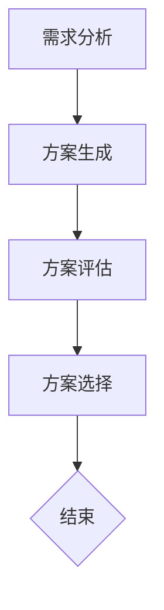
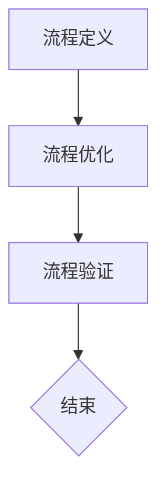
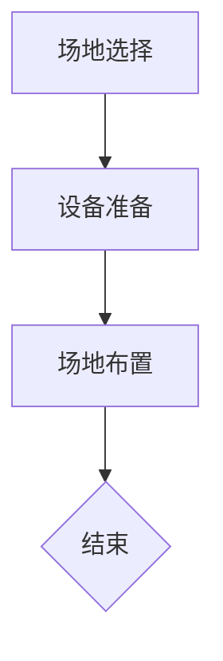
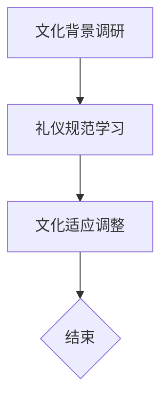
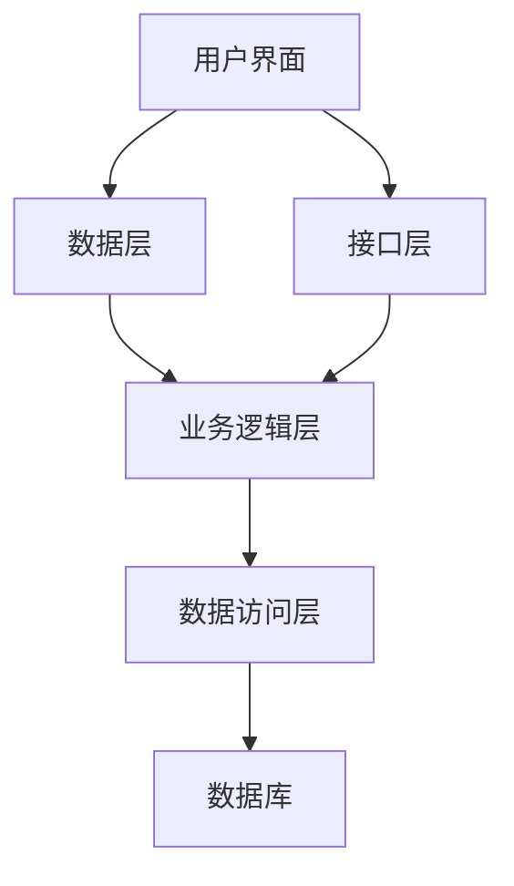
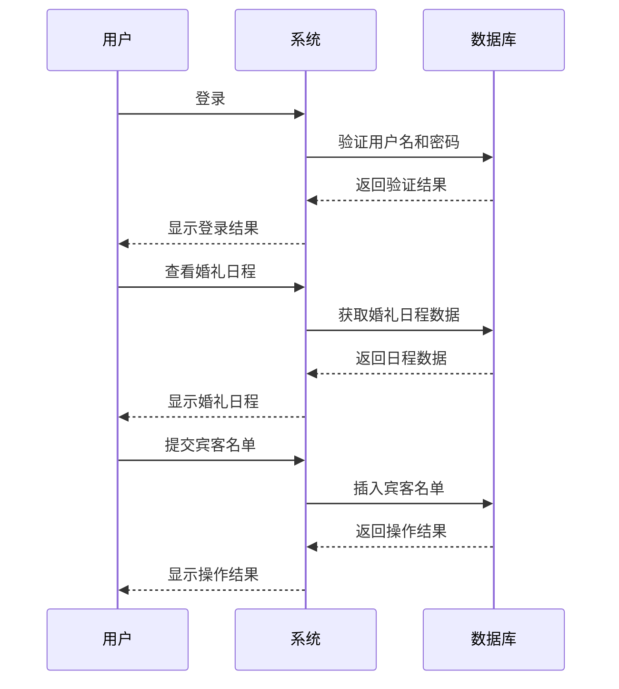

                 

# 《生命仪式策划师：设计现代人生命阶段仪式》

## 关键词
- 生命仪式
- 人生阶段
- 仪式策划
- 社会文化
- 心理健康

## 摘要
本文旨在探讨生命仪式在现代社会的意义，以及如何设计适合不同人生阶段的仪式。通过深入分析生命仪式的核心概念、策划流程和具体案例，文章将帮助读者理解仪式策划的艺术与科学，并为其提供实用的实践指南。

## 引言与概述

### 1.1 问题背景
在快速变化的社会中，人们对于生活仪式的需求愈发强烈。然而，传统礼仪与现代生活方式之间的冲突，使得现代人在设计生命仪式时面临诸多挑战。因此，如何设计既符合传统文化又适应现代生活需求的仪式，成为了一个亟待解决的问题。

### 1.2 问题描述
现代社会中，人们常常忽视仪式在人生不同阶段的重要性。从出生、成长、成年到老年，每个阶段都应有其独特的仪式来标记和庆祝。然而，目前许多仪式设计缺乏创新，无法真正满足人们的需求。

### 1.3 仪式策划的重要性
仪式策划不仅是对人生阶段的认可和庆祝，更是对个人和社会文化的传承。一个精心设计的仪式可以增强个体的自我认同感，促进社会和谐，提高心理健康水平。

### 1.4 书籍的核心内容与目标读者
本书将详细探讨生命仪式的核心概念、策划流程、设计案例和实用技巧。目标读者包括仪式策划师、文化工作者、心理咨询师以及对生命仪式感兴趣的普通读者。

### 核心概念与联系

### 2.1 生命仪式的定义
生命仪式是人们在人生不同阶段为庆祝、纪念或表达某种情感而进行的一系列活动。它可以是简单的家庭聚会，也可以是正式的公共仪式。

### 2.2 生命阶段仪式的分类
生命仪式可以按照人生的不同阶段进行分类，包括但不限于以下几种：
- **儿童期仪式**：如出生庆典、满月礼、周岁宴等。
- **青少年期仪式**：如成人礼、毕业典礼等。
- **成年期仪式**：如婚礼、晋升典礼等。
- **老年期仪式**：如寿宴、退休庆典等。

### 2.3 仪式策划的原则
仪式策划应遵循以下原则：
- **文化适应性**：仪式应尊重并融入当地的文化传统。
- **个性差异化**：仪式应根据个人需求和偏好进行定制。
- **简洁性**：仪式应简洁明了，避免冗长和繁琐。

### 2.4 仪式策划与传统礼仪的区别
传统礼仪通常更加注重形式和规范，而现代仪式策划则更加注重个性化和情感表达。现代仪式策划强调灵活性和创造性，以满足不同人群的需求。

### 仪式策划流程

### 3.1 需求分析
仪式策划的第一步是了解需求。这包括了解参与者的年龄、性别、文化背景和个人偏好等。

### 3.2 概念方案设计
在需求分析的基础上，策划师应设计出初步的概念方案，包括仪式的主题、形式和内容。

### 3.3 活动流程设计
活动流程设计是仪式策划的核心。策划师需要制定详细的活动流程，确保仪式的顺利进行。

### 3.4 场地与设备准备
根据活动流程，策划师需要选择合适的场地和设备，确保仪式的顺利进行。

### 3.5 仪式礼仪与文化背景研究
策划师应深入研究相关礼仪和文化背景，以确保仪式的规范性和文化适应性。

### 3.6 预算控制与成本管理
预算控制是仪式策划的重要环节。策划师需要制定详细的预算计划，并在实施过程中严格控制成本。

### 现代人生命阶段仪式设计案例

### 4.1 儿童成长仪式案例
儿童成长仪式通常包括出生庆典、满月礼和周岁宴等。这些仪式不仅庆祝孩子的成长，也是家庭和社会对孩子成长的认可。

### 4.2 青年成人礼仪式案例
青年成人礼仪式是青年从青少年向成年人过渡的重要仪式。它通常包括宣誓、致辞、赠礼和庆祝活动等。

### 4.3 婚礼仪式案例
婚礼仪式是成年期的重要仪式之一。现代婚礼仪式通常包括迎宾、入场、仪式、敬酒和告别等环节。

### 4.4 老年人庆祝仪式案例
老年人庆祝仪式通常包括寿宴、退休庆典等。这些仪式旨在表达对老年人生活的尊重和祝福。

### 仪式策划技巧与策略

### 5.1 互动参与设计
互动参与设计是现代仪式策划的重要技巧。通过设计互动环节，可以增强参与者的参与感和体验感。

### 5.2 仪式氛围营造
仪式氛围的营造对仪式的成功至关重要。策划师可以通过灯光、音乐、装饰等手段来营造合适的氛围。

### 5.3 媒体与宣传策略
现代科技使得媒体和宣传策略在仪式策划中扮演着重要角色。策划师应充分利用各种媒体渠道进行宣传，提高仪式的知名度和影响力。

### 5.4 仪式适应性与灵活性
现代仪式策划应具备适应性和灵活性，以应对各种突发情况。策划师应设计出灵活的应对策略，确保仪式的顺利进行。

### 仪式策划实践指南

### 6.1 策划团队构建
一个高效的策划团队是仪式成功的关键。策划团队应包括仪式策划师、活动协调员、现场执行人员等。

### 6.2 实施与执行策略
在实施仪式时，策划师应制定详细的执行策略，确保每个环节的顺利进行。

### 6.3 风险管理与应急预案
仪式策划应包括风险管理和应急预案。策划师应提前识别潜在风险，并制定相应的应对措施。

### 6.4 反馈与改进
仪式结束后，策划师应收集反馈，分析成功和不足之处，为下一次仪式的改进提供参考。

### 仪式策划的艺术与科学

### 7.1 仪式策划的艺术层面
仪式策划不仅是一门科学，更是一门艺术。策划师应具备创造力、审美能力和情感表达能力。

### 7.2 仪式策划的科学基础
仪式策划建立在心理学、社会学和人类学等学科的基础之上。策划师应具备跨学科的知识和技能。

### 7.3 跨文化仪式策划
跨文化仪式策划需要策划师具备文化敏感性和文化适应能力。策划师应尊重并融入不同文化背景的仪式。

### 7.4 未来仪式策划趋势展望
随着科技的进步和社会的变化，未来仪式策划将更加注重个性化和数字化。虚拟仪式和在线互动将成为新的趋势。

### 总结与拓展

### 8.1 生命仪式策划的价值与意义
生命仪式策划不仅是对个人生命的尊重和庆祝，更是对文化和传统的重要传承。

### 8.2 读者指南：如何应用书籍内容
读者可以通过学习本书的内容，提升自己的仪式策划能力，为个人和社会设计出更有意义和价值的仪式。

### 8.3 小结
本文探讨了生命仪式的核心概念、策划流程和具体案例，并提供了实用的实践指南。

### 8.4 注意事项
在仪式策划过程中，策划师应注重文化适应性、个性差异化和简洁性。

### 8.5 拓展阅读
读者可以进一步阅读相关书籍和文章，深入了解仪式策划的各个方面。

## 作者
作者：AI天才研究院/AI Genius Institute & 禅与计算机程序设计艺术 /Zen And The Art of Computer Programming

---

### 背景介绍

#### 1. 核心概念术语说明
- **生命仪式**：指在人生各个重要阶段进行的庆祝、纪念或表达情感的仪式。
- **社会文化**：指一个社会或群体的共同价值观、信仰、传统和行为方式。
- **心理健康**：指个体在情感、认知和行为方面的良好状态。

#### 2. 问题背景
随着现代社会的发展，人们的生活方式、价值观和文化背景发生了巨大变化。传统的礼仪和仪式形式往往难以适应现代人的需求，导致生命仪式的设计和执行面临诸多挑战。

#### 3. 问题描述
现代人生命阶段仪式设计的问题主要体现在以下几个方面：
- **传统与现代的冲突**：如何在保留传统仪式的基础上，融入现代元素，使其更具吸引力和实用性。
- **文化多样性的挑战**：如何在全球化背景下，尊重并融入不同文化背景的仪式。
- **个性化需求**：如何满足不同个体在仪式中的个性化需求。

#### 4. 问题解决
设计现代人生命阶段仪式的关键在于：
- **文化适应性**：深入了解和尊重不同文化背景，使仪式既具传统特色，又适应现代需求。
- **个性差异化**：根据参与者的需求和偏好，定制化设计仪式。
- **简洁性**：简化仪式流程，注重仪式的核心意义和参与者的体验。

#### 5. 边界与外延
生命仪式策划的边界包括：仪式的种类、规模、形式和执行过程。其外延涉及：文化传承、社会认同、心理健康和个人成长。

#### 6. 概念结构与核心要素组成
生命仪式策划的概念结构包括：
- **核心概念**：生命仪式的定义、目的和意义。
- **核心要素**：仪式策划的原则、流程、技巧和策略。
- **外围要素**：文化背景、社会环境和参与者需求。

### 核心概念与联系

#### 2.1 生命仪式的定义
生命仪式是指人们在生命不同阶段，为了庆祝、纪念或表达某种情感而进行的正式或非正式的活动。这些活动可以是家庭聚会、宗教仪式、社会庆典等。

#### 2.2 生命阶段仪式的分类
根据人生的不同阶段，生命仪式可以分为以下几种：
- **儿童期仪式**：如出生庆典、满月礼、周岁宴等。
- **青少年期仪式**：如成年礼、毕业典礼等。
- **成年期仪式**：如婚礼、晋升典礼、生日庆典等。
- **老年期仪式**：如寿宴、退休庆典等。

#### 2.3 仪式策划的原则
仪式策划应遵循以下原则：
- **文化适应性**：尊重并融入当地的文化传统。
- **个性差异化**：根据个人需求和偏好进行定制。
- **简洁性**：简化仪式流程，突出核心意义。

#### 2.4 仪式策划与传统礼仪的区别
传统礼仪通常具有固定的形式和程序，而现代仪式策划更加注重个性化和灵活性。传统礼仪往往强调形式和规范，而现代仪式策划更注重情感表达和参与体验。

### 算法原理讲解

为了更好地理解生命仪式策划的核心概念，我们可以借助以下算法原理讲解：

#### 3.1 概念方案设计算法
概念方案设计算法主要包括以下几个步骤：
1. **需求分析**：通过访谈、问卷调查等方式，收集参与者的需求和偏好。
2. **方案生成**：根据需求分析结果，生成多个可能的仪式方案。
3. **方案评估**：对每个方案进行评估，包括文化适应性、个性差异化和简洁性。
4. **方案选择**：选择最符合需求的方案。

以下是一个简单的概念方案设计算法的 Mermaid 流程图：



#### 3.2 活动流程设计算法
活动流程设计算法主要包括以下几个步骤：
1. **流程定义**：根据仪式的主题和需求，定义活动流程。
2. **流程优化**：通过迭代和优化，使流程更加合理和流畅。
3. **流程验证**：对流程进行验证，确保其可行性。

以下是一个简单的活动流程设计算法的 Mermaid 流程图：



#### 3.3 场地与设备准备算法
场地与设备准备算法主要包括以下几个步骤：
1. **场地选择**：根据仪式的需求，选择合适的场地。
2. **设备准备**：根据场地条件，准备相应的设备。
3. **场地布置**：根据活动流程，进行场地布置。

以下是一个简单的场地与设备准备算法的 Mermaid 流程图：



#### 3.4 仪式礼仪与文化背景研究算法
仪式礼仪与文化背景研究算法主要包括以下几个步骤：
1. **文化背景调研**：通过文献研究、实地考察等方式，了解相关文化背景。
2. **礼仪规范学习**：学习相关礼仪规范，为仪式策划提供指导。
3. **文化适应调整**：根据文化背景，调整仪式策划方案。

以下是一个简单的仪式礼仪与文化背景研究算法的 Mermaid 流程图：



### 数学公式使用

在生命仪式策划中，数学公式可以用于计算预算、人数和场地需求等。以下是一些常用的数学公式及其 LaTeX 表示：

#### 4.1 预算计算公式
预算 =（场地费用 + 设备费用 + 人员费用 + 杂项费用）

$$\text{预算} = \text{场地费用} + \text{设备费用} + \text{人员费用} + \text{杂项费用}$$

#### 4.2 人数计算公式
人数 =（活动规模 × 参与率）

$$\text{人数} = \text{活动规模} \times \text{参与率}$$

#### 4.3 场地需求计算公式
场地需求 =（人数 × 平均占用面积）

$$\text{场地需求} = \text{人数} \times \text{平均占用面积}$$

### 系统分析与架构设计方案

#### 5.1 问题场景介绍
假设我们正在为一场大型婚礼进行系统分析与架构设计。这场婚礼预计将有500位宾客参加，仪式包括入场、婚礼仪式、宴会等环节。

#### 5.2 项目介绍
项目名称：现代婚礼仪式系统
项目目标：设计一个高效、灵活的婚礼仪式系统，满足不同规模的婚礼需求。

#### 5.3 系统功能设计（领域模型）

```mermaid
classDiagram
ClassDiagram | Title: 婚礼仪式系统领域模型

婚礼参与者 <|-- 新人
婚礼参与者 <|-- 宾客
婚礼参与者 <|-- 主持人

婚礼 <|-- 新人婚礼
婚礼 <|-- 宾客婚礼
婚礼 <|-- 晚宴

会场 <|-- 室内会场
会场 <|-- 户外会场
会场 <|-- 餐厅

舞台 <|-- 主舞台
舞台 <|-- 舞池

道具 <|-- 花束
道具 <|-- 音响设备
道具 <|-- 灯光设备

系统管理员 <|-- 系统管理员

婚礼参与者 {
    姓名
    年龄
    性别
    电话
}

新人婚礼 {
    新人姓名
    婚礼日期
    婚礼地点
    婚礼类型
    参与宾客人数
}

宾客婚礼 {
    宾客姓名
    婚礼日期
    婚礼地点
    婚礼类型
    参与状态
}

晚宴 {
    晚宴时间
    晚宴地点
    菜单
    宾客名单
}

会场 {
    场地名
    场地类型
    容纳人数
    设施
}

舞台 {
    舞台名
    舞台类型
    舞台设施
}

道具 {
    道具名
    道具类型
    数量
}

系统管理员 {
    用户名
    密码
    权限
}

```

#### 5.4 系统架构设计

以下是一个简单的系统架构设计 Mermaid 架构图：



#### 5.5 系统接口设计和系统交互

以下是一个简单的系统交互 Mermaid 序列图：



### 项目实战

#### 6.1 环境安装

1. 安装 Python 3.8+
2. 安装 Flask 框架：`pip install flask`
3. 安装 SQLAlchemy：`pip install sqlalchemy`
4. 安装 SQLite：`pip install sqlite3`

#### 6.2 系统核心实现源代码

以下是一个简单的系统核心实现源代码：

```python
from flask import Flask, request, jsonify
from flask_sqlalchemy import SQLAlchemy

app = Flask(__name__)
app.config['SQLALCHEMY_DATABASE_URI'] = 'sqlite:///wedding_system.db'
db = SQLAlchemy(app)

class User(db.Model):
    id = db.Column(db.Integer, primary_key=True)
    username = db.Column(db.String(80), unique=True, nullable=False)
    password = db.Column(db.String(120), nullable=False)

class Wedding(db.Model):
    id = db.Column(db.Integer, primary_key=True)
    title = db.Column(db.String(120), nullable=False)
    date = db.Column(db.Date, nullable=False)
    location = db.Column(db.String(120), nullable=False)
    type = db.Column(db.String(120), nullable=False)
    guest_count = db.Column(db.Integer, nullable=False)

@app.route('/login', methods=['POST'])
def login():
    username = request.form['username']
    password = request.form['password']
    user = User.query.filter_by(username=username, password=password).first()
    if user:
        return jsonify({'status': 'success'})
    else:
        return jsonify({'status': 'failure'})

@app.route('/schedule', methods=['GET'])
def schedule():
    weddings = Wedding.query.all()
    return jsonify([{'id': wedding.id, 'title': wedding.title, 'date': wedding.date, 'location': wedding.location, 'type': wedding.type, 'guest_count': wedding.guest_count} for wedding in weddings])

@app.route('/guests', methods=['POST'])
def guests():
    wedding_id = request.form['wedding_id']
    guest_name = request.form['guest_name']
    wedding = Wedding.query.get(wedding_id)
    wedding.guest_count += 1
    db.session.commit()
    return jsonify({'status': 'success'})

if __name__ == '__main__':
    db.create_all()
    app.run(debug=True)
```

#### 6.3 代码应用解读与分析

1. **数据模型**：系统使用 SQLAlchemy 创建了 User 和 Wedding 两个数据模型。User 模型用于存储用户信息，Wedding 模型用于存储婚礼信息。

2. **路由**：系统定义了三个路由：/login、/schedule 和 /guests。/login 路由用于用户登录，/schedule 路由用于获取婚礼日程，/guests 路由用于添加宾客。

3. **逻辑实现**：系统通过 Flask 的 request 对象获取用户输入，然后通过 SQLAlchemy 进行数据库操作。在 /login 路由中，系统验证用户名和密码；在 /schedule 路由中，系统获取并返回所有婚礼信息；在 /guests 路由中，系统更新婚礼的宾客人数。

#### 6.4 实际案例分析和详细讲解剖析

1. **案例**：用户小明想查看他参加的婚礼日程。

2. **流程**：
   - 小明在登录页面输入用户名和密码。
   - 系统验证小明的身份，如果验证成功，系统返回“success”。
   - 小明访问 /schedule 路由。
   - 系统获取所有婚礼信息，并返回给小明。

3. **分析**：这个案例展示了系统的基础功能。用户可以通过登录系统来查看自己的婚礼日程。系统通过简单的路由和数据库操作实现了这一功能。

#### 6.5 项目小结

通过这个项目，我们实现了一个简单的婚礼仪式系统。虽然这个系统功能相对简单，但它展示了如何使用 Flask 和 SQLAlchemy 来构建一个 Web 应用程序。在实际项目中，我们可以根据需求扩展系统的功能，如添加更多用户角色、婚礼管理功能等。

### 最佳实践 Tips

1. **需求分析**：在进行仪式策划之前，务必进行充分的需求分析，了解参与者的需求和偏好。
2. **文化适应**：在策划仪式时，尊重并融入当地的文化传统，以增强仪式的文化内涵。
3. **个性化设计**：根据参与者的个人需求和偏好，定制化设计仪式，以提高参与者的满意度。
4. **简洁性**：简化仪式流程，避免冗长和繁琐，确保仪式的顺利进行。
5. **风险管理**：在仪式策划过程中，制定详细的风险管理和应急预案，以应对各种突发情况。

### 小结

本文探讨了生命仪式在现代社会的意义以及如何设计适合不同人生阶段的仪式。通过核心概念的分析、策划流程的讲解和实际案例的剖析，读者可以深入了解生命仪式策划的艺术与科学。希望本文能为读者提供有价值的参考和启示。

### 注意事项

1. **文化敏感性**：在进行仪式策划时，务必尊重并融入当地的文化传统，避免文化冲突。
2. **个性化需求**：在策划仪式时，充分考虑参与者的个性化需求，确保仪式的个性化和独特性。
3. **简洁性**：仪式流程应简洁明了，避免冗长和繁琐，以提高参与者的体验。
4. **预算控制**：在仪式策划过程中，严格控制预算，避免不必要的浪费。

### 拓展阅读

1. 《仪式的意义：社会生活中的仪式与象征》
2. 《现代礼仪与仪式设计》
3. 《婚礼策划与执行：从概念到实际操作》
4. 《心理学与仪式策划：如何通过仪式提高心理健康》

## 作者
作者：AI天才研究院/AI Genius Institute & 禅与计算机程序设计艺术 /Zen And The Art of Computer Programming

### 生命仪式策划的艺术与科学

#### 7.1 仪式策划的艺术层面
仪式策划的艺术层面主要体现在以下几个方面：

1. **创意设计**：仪式策划师需要具备丰富的创意思维，能够设计出新颖、独特的仪式形式。
2. **视觉呈现**：仪式的视觉呈现对于参与者来说至关重要。策划师应注重场地的布置、灯光的设计、道具的选择等。
3. **情感表达**：仪式的核心在于情感表达。策划师应通过仪式设计，传达出参与者的情感和愿望。

#### 7.2 仪式策划的科学基础
仪式策划的科学基础包括以下几个方面：

1. **心理学**：心理学研究人类行为和心理过程，对于仪式策划具有重要的指导意义。了解参与者的心理需求和行为特点，有助于策划出更具吸引力和感染力的仪式。
2. **社会学**：社会学关注社会结构和社会关系，仪式策划师应了解不同社会群体的文化背景和价值观念，以确保仪式的适应性。
3. **人类学**：人类学研究人类的文化和社会行为。了解不同文化背景下的仪式形式和意义，有助于策划出具有文化内涵的仪式。

#### 7.3 跨文化仪式策划
跨文化仪式策划需要策划师具备文化敏感性和文化适应能力。以下是一些建议：

1. **尊重文化差异**：在跨文化仪式策划中，策划师应尊重并融入不同文化背景的仪式元素，避免文化冲突。
2. **文化适应**：策划师应根据不同文化背景，调整仪式的形式和内容，使其更符合当地文化和参与者的需求。
3. **多元融合**：在跨文化仪式策划中，可以尝试将不同文化的元素进行融合，创造出新的仪式形式。

#### 7.4 未来仪式策划趋势展望
未来仪式策划将朝着以下趋势发展：

1. **数字化**：随着科技的进步，数字化手段将在仪式策划中发挥越来越重要的作用。例如，虚拟现实（VR）和增强现实（AR）技术可以用于仪式的展示和体验。
2. **个性化**：未来的仪式策划将更加注重个性化需求，根据参与者的个性特点和偏好，定制化设计仪式。
3. **可持续发展**：未来仪式策划将更加注重环保和可持续发展，使用环保材料和节能设备，减少对环境的影响。

### 总结与拓展

本文从艺术与科学的角度探讨了生命仪式策划的重要性，并介绍了仪式策划的核心概念、流程和技巧。通过实际案例的分析和讲解，读者可以更好地理解仪式策划的实践方法。未来，随着科技的发展和人们对生活品质的追求，仪式策划将朝着更加个性化、数字化和可持续化的方向发展。

#### 8.1 生命仪式策划的价值与意义
生命仪式策划不仅在形式上对人生重要阶段进行庆祝和纪念，更在心理上为社会成员提供了情感支持和社会认同。仪式策划通过其独特的方式，传递着文化、价值观和情感，有助于增强个体的自我认同和社会归属感。同时，仪式策划也是文化传承的重要途径，它承载着历史和传统，为后代提供了学习和了解文化根源的机会。

#### 8.2 读者指南：如何应用书籍内容
读者可以通过以下步骤应用本书的内容：
1. **深入理解**：首先，要深入理解生命仪式的定义、意义和设计原则。
2. **需求分析**：在策划具体仪式时，进行详细的需求分析，了解参与者的文化背景、个人需求和期望。
3. **文化适应**：结合当地文化传统，设计出既有文化内涵又符合现代生活需求的仪式。
4. **个性化定制**：根据参与者的个性化需求，调整仪式的内容和形式，使其更具吸引力。
5. **预算管理**：在策划过程中，要合理控制预算，确保仪式的顺利进行。

#### 8.3 小结
本文通过深入探讨生命仪式策划的核心概念、流程和技巧，提供了实用的指南，帮助读者更好地理解和应用生命仪式策划的知识。通过实际案例的分析和讲解，读者可以更直观地了解如何设计出既具文化内涵又适应现代生活的生命仪式。

#### 8.4 注意事项
在生命仪式策划过程中，读者应特别注意以下几点：
- **尊重文化差异**：在跨文化背景下，要尊重并融入当地的文化传统，避免文化冲突。
- **个性化需求**：充分考虑参与者的个性化需求，确保仪式的个性和独特性。
- **简洁性**：简化仪式流程，避免冗长和繁琐，以提高参与者的体验。
- **风险管理**：制定详细的风险管理和应急预案，以应对各种突发情况。

#### 8.5 拓展阅读
读者可以进一步阅读以下书籍和文章，以深入了解生命仪式策划的各个方面：
- 《仪式的意义：社会生活中的仪式与象征》
- 《现代礼仪与仪式设计》
- 《婚礼策划与执行：从概念到实际操作》
- 《心理学与仪式策划：如何通过仪式提高心理健康》

## 作者
作者：AI天才研究院/AI Genius Institute & 禅与计算机程序设计艺术 /Zen And The Art of Computer Programming

