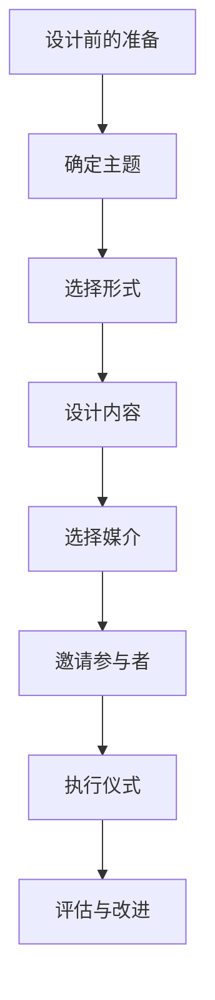
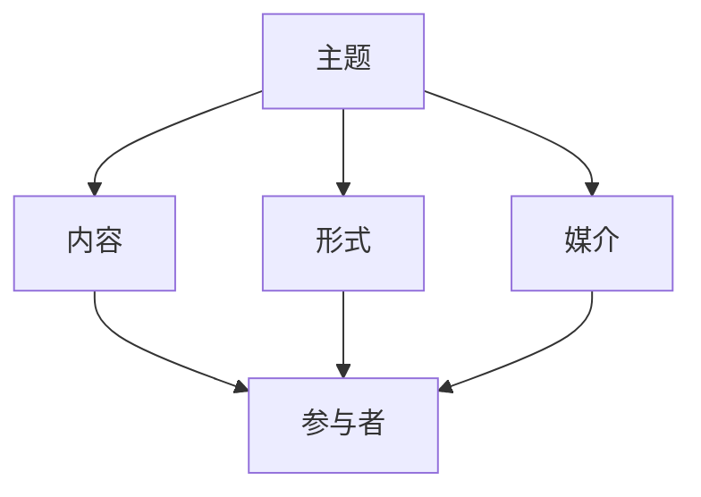
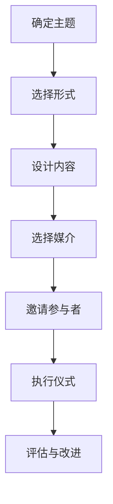
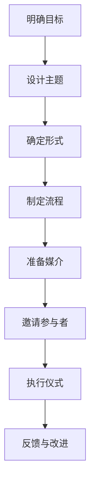

                 

### 第一部分：引言

## 第1章：问题背景与核心概念

### 1.1 生命仪式设计的定义与意义

#### 1.1.1 生命仪式设计的定义

在日常生活中，仪式通常被视为一种形式化的行为或活动，这些行为不仅具有文化意义，也在一定程度上反映了社会的价值观和信仰。**生命仪式设计**，即通过对日常生活中的仪式进行精心设计和创造，赋予其更深层次的意义和美学价值。

我们可以将**生命仪式设计**定义为：
$$
\text{生命仪式设计} = \text{艺术教育} \times \text{日常生活意义}
$$

这一公式意味着，生命仪式设计不仅融合了艺术教育的元素，如审美、创造力和想象力，还强调了其在日常生活中的应用，从而赋予平凡生活以仪式感和价值。

#### 1.1.2 设计的生命仪式在社会中的角色

生命仪式设计在社会中扮演着多重角色。首先，它能够**增强社会凝聚力**，通过共同的仪式和活动，使个体感受到归属感和认同感。其次，生命仪式设计**传承文化**，将传统价值观和习俗通过现代艺术手段进行再创造和传播。此外，它还能**提升生活质量**，通过精心设计的仪式，使日常生活中的琐碎变得有意义和美好。

### 1.2 艺术教育在生命仪式设计中的作用

#### 1.2.1 艺术教育对生命仪式设计的启发

艺术教育作为一种培养创造力、审美能力和人文素养的教育方式，对于生命仪式设计有着重要的启发作用。通过艺术教育，人们能够培养对美的感知和创造能力，从而在生命仪式设计中融入更多的美学元素。

首先，艺术教育帮助个体**提高审美水平**，使生命仪式设计在形式上更加美观和和谐。其次，艺术教育**培养创新能力**，使生命仪式设计在内容上更加丰富和独特。此外，艺术教育**促进跨文化交流**，使生命仪式设计能够融合多元文化元素，展现出更加丰富多彩的面貌。

#### 1.2.2 艺术教育如何赋予日常生活意义

艺术教育通过赋予日常生活仪式感和价值，使平凡的生活变得有意义和美好。具体来说，艺术教育可以从以下几个方面赋予日常生活意义：

1. **美学融入**：通过将艺术元素融入日常生活，如装饰、服饰、家居等，使日常生活中的每一个细节都充满美感和仪式感。
2. **仪式感强化**：通过精心设计的仪式，如庆祝生日、婚礼、节日等，使这些日常事件变得庄重而有意义。
3. **文化传承**：通过生命仪式设计，将传统文化和习俗通过现代艺术手段进行传承和传播，使个体在日常生活中感受到文化的力量。

### 1.3 本书结构安排与内容概述

本书旨在深入探讨生命仪式设计在日常生活中的应用，以艺术教育为切入点，探讨其理论基础、设计原则、实践方法以及未来发展。具体来说，本书分为四个部分：

- **第一部分：引言**：介绍生命仪式设计的背景和核心概念，阐述其在社会中的角色和意义。
- **第二部分：生命仪式设计的基础**：包括仪式设计的基本原则和艺术教育中的仪式设计。
- **第三部分：生命仪式设计的实践应用**：探讨教育领域和企业文化中的生命仪式设计。
- **第四部分：生命仪式设计的未来展望**：分析生命仪式设计的发展趋势、伦理与规范。

通过以上结构安排，本书旨在为读者提供一部系统、全面的生命仪式设计指南，帮助读者在实践中更好地理解和应用这一艺术教育理念。

### 第二部分：生命仪式设计的基础

## 第2章：生命仪式设计的基本原则

#### 2.1 仪式设计的基本原则

生命仪式设计作为一种独特的艺术形式，其核心在于如何通过仪式赋予日常生活以深刻的意义。为了实现这一目标，我们需要遵循一些基本原则。

#### 2.1.1 仪式的普遍性

仪式的普遍性指的是仪式应该能够在不同文化、不同背景下被广泛接受和应用。这不仅要求仪式设计具有普遍的审美价值，还要求其能够融入多元文化元素。例如，一个跨文化婚礼仪式不仅要尊重双方文化的传统习俗，还要创新出独特的表现形式。

为了实现仪式设计的普遍性，我们可以遵循以下步骤：

1. **文化调研**：在开始设计之前，对目标文化进行充分的调研，了解其历史背景、传统习俗和价值观。
2. **融合与创新**：在尊重传统的基础上，进行创新设计，将不同文化的元素有机地融合在一起。
3. **用户参与**：在设计过程中，积极与目标用户进行沟通，了解其需求和期望，确保仪式能够被广泛接受。

#### 2.1.2 仪式的情境性

仪式的情境性指的是仪式设计应该根据具体情境进行定制。每个仪式都有其特定的情境背景，如婚礼、葬礼、节日庆典等。因此，仪式设计需要根据不同情境的特点进行针对性设计。

以下是一些实现仪式情境性的方法：

1. **情境分析**：在开始设计之前，对仪式的情境进行深入分析，了解其氛围、参与者和目的。
2. **氛围营造**：通过音乐、灯光、装饰等手段，营造与情境相匹配的氛围。
3. **内容定制**：根据情境特点，定制仪式的内容和流程，使其能够更好地适应特定的情境。

#### 2.1.3 仪式的参与性

仪式的参与性指的是仪式设计应该鼓励参与者积极参与，使其成为仪式的一部分。参与性不仅能够增强仪式的感染力，还能够提升参与者的体验和记忆。

以下是一些提高仪式参与性的方法：

1. **互动环节**：在仪式中设计互动环节，如问答、游戏、表演等，鼓励参与者积极参与。
2. **角色扮演**：鼓励参与者扮演特定的角色，如主持、表演者、观众等，增强参与感。
3. **共同创作**：在仪式设计过程中，邀请参与者共同创作，如共同绘制海报、设计服装等，使其成为仪式的一部分。

### 2.2 艺术教育中的仪式设计

#### 2.2.1 艺术仪式的构成要素

艺术仪式的构成要素主要包括主题、形式、内容、媒介和参与者。这些要素共同作用，决定了艺术仪式的特点和效果。

- **主题**：主题是艺术仪式的核心，它决定了仪式的主题思想和风格。
- **形式**：形式是指仪式的表现形式，如静态展示、动态表演等。
- **内容**：内容是仪式的核心部分，包括表演、讲述、展示等。
- **媒介**：媒介是指仪式使用的工具和材料，如音乐、舞蹈、绘画等。
- **参与者**：参与者是仪式的重要组成部分，他们的参与和互动决定了仪式的效果。

以下是一个艺术仪式的ER实体关系图，展示了各个构成要素之间的关系：

#### 2.2.2 艺术教育仪式的特点

艺术教育仪式的特点在于其教育性和艺术性。艺术教育仪式不仅是艺术表演，更是教育过程的一部分。它通过艺术形式传达知识和价值观，促进个体成长和发展。

- **教育性**：艺术教育仪式旨在通过艺术形式传递知识和价值观，如历史、文化、道德等。
- **艺术性**：艺术教育仪式强调艺术性，通过精美的艺术形式吸引参与者，提升其审美能力和艺术素养。

以下是一个艺术教育仪式的设计流程图，展示了从设计前的准备到设计后的评估与改进的整个过程：

### 2.3 日常生活仪式的设计与实践

#### 2.3.1 日常生活仪式的现状

在日常生活中的仪式现象十分普遍，如婚礼、生日庆祝、节日庆典等。然而，随着现代社会的发展，许多仪式逐渐变得简化甚至消失。这不仅导致了仪式感的缺失，也使生活变得平淡无奇。

#### 2.3.2 日常生活仪式设计的方法

为了重新赋予日常生活仪式感，我们可以采取以下设计方法：

1. **从日常生活中提取仪式元素**：从日常生活中的习惯和活动中提取具有仪式感的元素，如家庭晚餐、周末聚会等。
2. **设计具体的仪式流程**：根据提取的仪式元素，设计具体的仪式流程，如设置特定的时间、地点、活动等。
3. **营造仪式氛围**：通过音乐、灯光、装饰等手段，营造与仪式氛围相匹配的环境。
4. **鼓励参与者积极参与**：在仪式设计过程中，鼓励参与者积极参与，使其成为仪式的一部分。

以下是一个日常生活仪式的设计案例：

- **主题**：家庭晚餐
- **形式**：正式晚餐
- **内容**：家人们围坐在餐桌旁，共同享用美食，分享一周的生活经历
- **媒介**：餐具、音乐、烛光
- **参与者**：家庭成员

通过以上设计，家庭晚餐不仅成为了一次美食盛宴，更成为了一次家庭情感的交流仪式，使平凡的生活变得有意义和美好。

### 2.4 日常生活仪式设计在实践中的应用

#### 2.4.1 从日常生活中提取仪式元素

提取仪式元素是日常生活仪式设计的第一步。在这个过程中，我们需要仔细观察日常生活中的习惯和活动，找出其中具有仪式感的关键元素。

例如，在家庭晚餐中，我们可以提取以下仪式元素：

- **时间**：每周五晚上
- **地点**：家中餐桌
- **活动**：家人们围坐在餐桌旁，共同享用美食
- **氛围**：温馨、舒适

#### 2.4.2 设计具体的仪式流程

在提取了仪式元素后，我们需要设计具体的仪式流程，使其能够有效地赋予日常生活仪式感。

以下是一个家庭晚餐的仪式流程：

1. **设定时间**：每周五晚上7点
2. **准备地点**：家中餐桌摆放整齐，蜡烛点亮，背景音乐准备就绪
3. **活动安排**：家人们围坐在餐桌旁，先进行自我介绍和一周生活回顾，然后共同享用美食，最后进行感恩祷告

#### 2.4.3 营造仪式氛围

仪式氛围是仪式设计的重要组成部分。通过音乐、灯光、装饰等手段，我们可以营造与仪式氛围相匹配的环境。

以下是一些营造仪式氛围的方法：

- **音乐**：选择温馨、轻松的音乐，如钢琴曲、轻音乐等
- **灯光**：使用温暖的黄色灯光，营造出温馨的氛围
- **装饰**：在餐桌中央摆放鲜花、烛台等装饰品，增加仪式感

#### 2.4.4 鼓励参与者积极参与

仪式的成功离不开参与者的积极参与。在日常生活仪式设计中，我们需要鼓励家庭成员积极参与，使其成为仪式的一部分。

以下是一些鼓励参与者积极参与的方法：

- **提前通知**：提前告知家庭成员仪式的时间、地点和流程，使其有充分的准备
- **互动环节**：在仪式过程中设置互动环节，如问答、游戏等，增加参与者的互动和体验
- **共同创作**：在仪式设计过程中，鼓励家庭成员共同创作，如共同准备美食、设计装饰等

通过以上方法，我们可以有效地将家庭晚餐设计成一次有仪式感的日常生活活动，使平凡的生活变得有意义和美好。

### 第3章：艺术教育中的仪式设计

#### 3.1 艺术教育仪式的构成

艺术教育仪式是一种通过艺术形式进行教育的方式，其构成要素主要包括主题、内容、形式、媒介和参与者。以下是一个艺术教育仪式的ER实体关系图，展示了这些要素之间的关系：

- **主题**：主题是艺术教育仪式的核心，它决定了仪式的教育内容和目标。
- **内容**：内容包括表演、展示、讲座等，是艺术教育仪式的核心部分。
- **形式**：形式是指仪式的表现形式，如讲座、表演、展览等。
- **媒介**：媒介是仪式使用的工具和材料，如音乐、绘画、雕塑等。
- **参与者**：参与者是仪式的重要组成部分，包括学生、教师、观众等。

#### 3.1.1 艺术仪式的构成要素

艺术仪式的构成要素不仅决定了仪式的特点和效果，还影响了参与者的体验和感受。以下是一个详细的艺术仪式构成要素的表格：

| 构成要素 | 说明 |
| :---: | :--- |
| **主题** | 决定艺术教育仪式的教育目标和内容 |
| **内容** | 包括表演、展示、讲座等，是艺术教育仪式的核心部分 |
| **形式** | 决定艺术教育仪式的表现方式，如讲座、表演、展览等 |
| **媒介** | 决定艺术教育仪式使用的工具和材料，如音乐、绘画、雕塑等 |
| **参与者** | 包括学生、教师、观众等，是艺术教育仪式的重要组成部分 |

#### 3.1.2 艺术教育仪式的特点

艺术教育仪式的特点在于其教育性和艺术性。它不仅通过艺术形式传达知识和价值观，还通过参与者的互动和体验，促进个体的成长和发展。

- **教育性**：艺术教育仪式旨在通过艺术形式传递知识和价值观，如历史、文化、道德等。
- **艺术性**：艺术教育仪式强调艺术性，通过精美的艺术形式吸引参与者，提升其审美能力和艺术素养。

#### 3.1.3 艺术教育仪式的设计流程

艺术教育仪式的设计流程包括以下几个关键步骤：

1. **确定主题**：根据教育目标和内容，确定艺术教育仪式的主题。
2. **选择形式**：根据主题和内容，选择适合的仪式形式，如讲座、表演、展览等。
3. **设计内容**：根据主题和形式，设计具体的仪式内容，如表演节目、展示作品、讲座主题等。
4. **选择媒介**：根据内容和形式，选择适合的媒介，如音乐、绘画、雕塑等。
5. **邀请参与者**：根据仪式的特点和规模，邀请学生、教师、观众等参与者。
6. **执行仪式**：按照设计的内容和流程，执行艺术教育仪式。
7. **评估与改进**：在仪式结束后，对仪式的效果进行评估，并根据反馈进行改进。

以下是一个艺术教育仪式的设计流程图：

#### 3.1.4 艺术教育仪式的案例研究

为了更好地理解艺术教育仪式的设计和应用，我们可以通过以下案例进行深入研究：

- **案例1：某中学的艺术节开幕式**

  - **主题**：庆祝校园艺术节，展示学生的艺术才华
  - **形式**：表演秀
  - **内容**：包括舞蹈、音乐、戏剧表演等
  - **媒介**：音乐、舞蹈、戏剧道具等
  - **参与者**：学生、教师、家长等

- **案例2：某幼儿园的毕业典礼**

  - **主题**：庆祝毕业，祝福孩子们成长
  - **形式**：表演秀和颁奖典礼
  - **内容**：包括舞蹈、歌唱、故事表演、颁奖典礼等
  - **媒介**：音乐、舞蹈、服装、奖杯等
  - **参与者**：幼儿、家长、教师等

通过以上案例，我们可以看到，艺术教育仪式在校园中具有广泛的应用，不仅能够提升学生的艺术素养，还能增强校园文化的氛围。

### 3.2 教育领域中的生命仪式设计

#### 3.2.1 学校教育仪式的设计与应用

在学校教育中，仪式设计不仅能够增强学生的归属感和认同感，还能塑造良好的校园文化。以下是一些学校教育仪式的设计与应用：

- **入学仪式**：在新生入学时，举办隆重的入学仪式，通过升旗、宣誓、发言等活动，增强学生的爱国意识和责任感。
- **毕业典礼**：在学生毕业时，举办庄严的毕业典礼，通过颁奖、演讲、合影等活动，鼓励学生追求梦想，勇于担当。
- **节日庆典**：在重要的节日，如国庆节、春节等，举办校园节日庆典，通过文艺表演、知识竞赛等活动，增强学生的文化自信和团队精神。

以下是一个学校教育仪式的设计流程图：

#### 3.2.2 家庭教育仪式的设计

在家庭教育中，仪式设计同样具有重要意义。通过精心设计的家庭仪式，家长能够更好地教育孩子，培养孩子的责任感和家庭观念。以下是一些家庭教育仪式的设计与应用：

- **家庭晚餐**：每周设定一次家庭晚餐时间，家人围坐在一起，共同分享一周的所见所闻，增强家庭凝聚力。
- **家庭会议**：定期召开家庭会议，讨论家庭事务，让孩子参与决策，培养其责任感和参与感。
- **生日庆祝**：为孩子举办生日庆祝活动，通过生日派对、礼物赠送等活动，让孩子感受到家庭的温暖和爱。

以下是一个家庭教育仪式的设计流程图：

### 第4章：日常生活仪式的设计与实践

#### 4.1 日常生活仪式的现状

在日常生活的仪式现象中，我们可以观察到各种形式的仪式，如婚礼、生日、节日庆典等。然而，随着现代社会的快速发展和生活方式的改变，许多传统仪式逐渐简化或消失。例如，传统婚礼中的繁文缛节被简化，生日庆祝逐渐失去了庄重感，节日庆典也变得简单而随意。这种现象不仅导致了仪式感的缺失，也使生活变得平淡无奇。

#### 4.2 日常生活仪式设计的方法

为了重新赋予日常生活仪式感，我们可以采取以下设计方法：

1. **从日常生活中提取仪式元素**：仔细观察日常生活中的习惯和活动，提取其中具有仪式感的关键元素，如特定时间、地点、活动等。
2. **设计具体的仪式流程**：根据提取的仪式元素，设计具体的仪式流程，如设定仪式时间、地点、活动步骤等。
3. **营造仪式氛围**：通过音乐、灯光、装饰等手段，营造与仪式氛围相匹配的环境，增强仪式感。
4. **鼓励参与者积极参与**：在仪式设计过程中，鼓励参与者积极参与，使其成为仪式的一部分，提升参与感和体验。

#### 4.2.1 从日常生活中提取仪式元素

提取仪式元素是日常生活仪式设计的第一步。在这个过程中，我们需要仔细观察日常生活中的习惯和活动，找出其中具有仪式感的关键元素。以下是一些可以从日常生活中提取的仪式元素：

- **时间**：如特定日期、时间点，如生日、节日、婚礼等重要时刻。
- **地点**：如特定场所，如家中餐桌、户外花园等，赋予活动特定场景。
- **活动**：如家庭晚餐、节日庆祝、婚礼仪式等，这些活动本身就具有仪式感。
- **参与者**：如家庭成员、亲朋好友等，参与者的参与能够增强仪式的气氛和意义。

以下是一个从日常生活中提取仪式元素的具体例子：

- **主题**：家庭晚餐
- **时间**：每周五晚上7点
- **地点**：家中餐桌
- **活动**：家人们围坐在餐桌旁，共同享用美食，分享一周的生活经历
- **参与者**：家庭成员

#### 4.2.2 设计具体的仪式流程

在提取了仪式元素后，我们需要设计具体的仪式流程，使其能够有效地赋予日常生活仪式感。以下是一个家庭晚餐的仪式流程：

1. **设定时间**：每周五晚上7点
2. **准备地点**：家中餐桌摆放整齐，蜡烛点亮，背景音乐准备就绪
3. **活动安排**：
   - 家人们围坐在餐桌旁，先进行自我介绍和一周生活回顾
   - 共同享用美食，期间交流彼此的趣事和感悟
   - 晚餐结束后，进行感恩祷告，感谢彼此的陪伴和支持

通过以上设计，家庭晚餐不仅成为了一次美食盛宴，更成为了一次家庭情感的交流仪式，使平凡的生活变得有意义和美好。

#### 4.2.3 营造仪式氛围

仪式氛围是仪式设计的重要组成部分。通过音乐、灯光、装饰等手段，我们可以营造与仪式氛围相匹配的环境，增强仪式感。

以下是一些营造仪式氛围的方法：

- **音乐**：选择温馨、轻松的音乐，如钢琴曲、轻音乐等，营造出和谐、温馨的氛围。
- **灯光**：使用温暖的黄色灯光，营造出温馨、舒适的环境，增强仪式感。
- **装饰**：在仪式场所摆放鲜花、烛台等装饰品，增加仪式的氛围和美感。

以下是一个家庭晚餐的仪式氛围营造示例：

- **音乐**：播放钢琴曲《月光奏鸣曲》，营造出浪漫、温馨的氛围。
- **灯光**：使用黄色灯光，点亮蜡烛，营造出温馨、舒适的用餐环境。
- **装饰**：在餐桌中央摆放一束鲜花，增加仪式的美感和气氛。

通过以上方法，家庭晚餐的仪式氛围得到有效营造，使参与者能够更好地沉浸在仪式中，感受到仪式的意义和美好。

#### 4.2.4 鼓励参与者积极参与

仪式的成功离不开参与者的积极参与。在日常生活仪式设计中，我们需要鼓励参与者积极参与，使其成为仪式的一部分，提升参与感和体验。

以下是一些鼓励参与者积极参与的方法：

- **提前通知**：提前告知参与者仪式的时间、地点和流程，使其有充分的准备。
- **互动环节**：在仪式过程中设置互动环节，如问答、游戏等，增加参与者的互动和体验。
- **共同创作**：在仪式设计过程中，鼓励参与者共同创作，如共同准备美食、设计装饰等，使其成为仪式的一部分。

以下是一个家庭晚餐的互动环节示例：

1. **自我介绍和一周生活回顾**：家人们围坐在餐桌旁，每个人轮流介绍自己的一周生活，分享彼此的趣事和感悟。
2. **互动游戏**：进行一些简单的互动游戏，如“猜谜语”、“真心话大冒险”等，增加家庭成员之间的互动和欢笑。
3. **共同创作**：在晚餐结束后，大家一起制作蛋糕或饼干，为下一次家庭晚餐做准备。

通过以上方法，家庭晚餐的参与度得到提升，使整个仪式过程更加生动有趣，参与者能够更好地感受到仪式的意义和美好。

### 第5章：教育领域中的生命仪式设计

#### 5.1 教育仪式的设计与应用

教育仪式是学校教育中的一种重要形式，通过精心设计的仪式，可以增强学生的归属感和认同感，塑造良好的校园文化。以下是一些常见的教育仪式及其设计与应用：

#### 5.1.1 入学仪式

入学仪式是新生入学时的重要仪式，通过这一仪式，学校可以传达学校的价值观和教育理念，帮助学生建立对学校的认同感。

- **设计要点**：
  - **氛围营造**：在仪式现场布置校徽、校旗等标志物，营造庄重、正式的氛围。
  - **仪式流程**：包括升国旗、校长致辞、新生代表发言、宣誓等环节。
  - **参与者**：新生、家长、教师等。

- **应用案例**：
  - 某中学在新生入学时，举行了隆重的入学仪式。在仪式上，新生们进行了集体宣誓，表达了他们遵守校规、努力学习、追求梦想的决心。

#### 5.1.2 毕业典礼

毕业典礼是学生毕业时的重要仪式，通过这一仪式，学校可以祝贺学生顺利完成学业，鼓励他们迎接未来的挑战。

- **设计要点**：
  - **氛围营造**：布置典礼现场，如悬挂横幅、摆放鲜花等，营造喜庆、庄重的氛围。
  - **仪式流程**：包括校长致辞、优秀毕业生表彰、毕业生代表发言、毕业歌等环节。
  - **参与者**：毕业生、家长、教师等。

- **应用案例**：
  - 某高中在毕业典礼上，邀请了校领导、教师代表和毕业生家长出席。在典礼上，校领导为优秀毕业生颁发了奖状，毕业生代表发表了毕业感言。

#### 5.1.3 期末考试仪式

期末考试仪式是对学生一学期学习成果的检验，通过这一仪式，可以激发学生的学习热情和责任感。

- **设计要点**：
  - **氛围营造**：在考试前，学校可以布置考场，营造一个安静、严肃的考试环境。
  - **仪式流程**：包括考试说明、考试纪律宣读、考试开始等环节。
  - **参与者**：全体学生、教师等。

- **应用案例**：
  - 某小学在期末考试前，举行了隆重的考试仪式。在仪式上，校长向学生们强调了考试纪律，鼓励他们认真对待考试，展示自己的学习成果。

#### 5.1.4 主题班会

主题班会是一种常见的教育仪式，通过班会，可以引导学生树立正确的价值观，提高他们的道德素养。

- **设计要点**：
  - **主题选择**：根据学生的年龄特点和实际需求，选择合适的主题，如环保、健康、安全等。
  - **仪式流程**：包括主题讲解、互动讨论、总结发言等环节。
  - **参与者**：全体学生、班主任等。

- **应用案例**：
  - 某初中在主题班会中，选择了“关爱地球”作为主题。在班会中，学生们通过观看环保视频、参与讨论等方式，了解了环保的重要性，并提出了具体的环保行动方案。

#### 5.1.5 体育运动会

体育运动会是一种集体育竞技和团体精神于一体的教育仪式，通过这一仪式，可以培养学生的团队协作精神和竞争意识。

- **设计要点**：
  - **赛事安排**：合理安排比赛项目和时间，确保赛事的公平性和激烈性。
  - **仪式流程**：包括开幕式、比赛、闭幕式等环节。
  - **参与者**：全体学生、教师、家长等。

- **应用案例**：
  - 某中学在体育运动会中，举行了隆重的开幕式。在开幕式上，校长发表了热情洋溢的讲话，运动员代表宣誓，比赛在热烈的气氛中拉开序幕。

通过以上教育仪式的设计与应用，学校可以有效地传递教育理念，培养学生的综合素质，增强他们的归属感和认同感，从而促进学校教育的发展。

### 第6章：企业文化中的生命仪式设计

#### 6.1 企业文化的仪式化表达

企业文化是企业精神的核心体现，通过仪式化表达，可以更好地传递企业的价值观、愿景和使命，增强员工的凝聚力和归属感。以下是一些企业文化仪式化表达的方法：

- **员工入职仪式**：新员工入职时，通过举办隆重的入职仪式，向新员工传递企业的价值观和文化，增强他们的归属感。

- **员工生日庆祝**：定期为员工庆祝生日，通过赠送礼物、举办生日派对等方式，表达对员工的关爱和尊重。

- **周年庆典**：企业成立周年时，举办庆祝活动，回顾企业的发展历程，展望未来，激励员工共同努力。

- **团队建设活动**：通过定期举办团队建设活动，如拓展训练、户外运动等，增强团队合作精神，提升团队凝聚力。

- **表彰大会**：定期举办表彰大会，对在工作中表现优秀的员工进行表彰，激励全体员工追求卓越。

#### 6.1.1 企业文化仪式的设计原则

为了确保企业文化仪式的有效性和影响力，设计企业文化仪式时需要遵循以下原则：

- **目标明确**：明确企业文化仪式的目的和预期效果，确保仪式能够传达企业的核心价值观和愿景。

- **创新与传承相结合**：在仪式设计过程中，既要传承企业的传统和文化，又要注入创新元素，使仪式具有时代感和吸引力。

- **参与性**：鼓励员工积极参与企业文化仪式，使其成为仪式的一部分，增强员工的参与感和认同感。

- **氛围营造**：通过音乐、灯光、装饰等手段，营造与企业文化仪式相匹配的氛围，增强仪式的感染力。

- **反馈与改进**：在仪式结束后，及时收集员工的反馈，对仪式效果进行评估，并根据反馈进行改进。

#### 6.1.2 企业文化仪式的设计流程

企业文化仪式的设计流程包括以下几个关键步骤：

1. **明确目标**：根据企业的核心价值观和愿景，明确企业文化仪式的目标和预期效果。

2. **设计主题**：选择与企业文化和目标相契合的主题，确保仪式内容具有吸引力。

3. **确定形式**：根据主题和目标，选择适合的仪式形式，如讲座、演出、庆典等。

4. **制定流程**：设计详细的仪式流程，确保仪式的顺利进行。

5. **准备媒介**：选择合适的媒介，如音乐、灯光、装饰等，为仪式营造氛围。

6. **邀请参与者**：根据仪式规模和主题，邀请相关员工和嘉宾参与。

7. **执行仪式**：按照设计的流程，执行企业文化仪式。

8. **反馈与改进**：在仪式结束后，收集参与者的反馈，对仪式效果进行评估，并根据反馈进行改进。

以下是一个企业文化仪式的设计流程图：

#### 6.1.3 企业文化仪式的案例研究

为了更好地理解企业文化仪式的设计和应用，我们可以通过以下案例进行深入研究：

- **案例1：某公司的周年庆典**

  - **主题**：庆祝公司成立十周年，回顾发展历程，展望未来。
  - **形式**：庆典晚会，包括领导致辞、员工表演、抽奖环节等。
  - **流程**：开场致辞、领导发言、员工表演、抽奖环节、闭幕致辞。
  - **媒介**：音响设备、舞台灯光、背景屏幕、节目单等。
  - **参与者**：公司员工、家属、合作伙伴等。

- **案例2：某企业的员工入职仪式**

  - **主题**：欢迎新员工加入企业，传递企业文化和价值观。
  - **形式**：迎新晚会，包括领导致辞、入职培训、团队游戏等。
  - **流程**：开场致辞、入职培训、团队游戏、领导致辞、颁发纪念品。
  - **媒介**：音响设备、培训材料、游戏道具、纪念品等。
  - **参与者**：新员工、人力资源部门、公司领导等。

通过以上案例，我们可以看到，企业文化仪式在传递企业价值观、增强员工凝聚力和归属感方面起到了重要作用。通过精心设计的仪式，企业能够更好地塑造企业文化，推动企业的发展。

### 第7章：生命仪式设计的未来展望

#### 7.1 数字技术在生命仪式设计中的应用

随着科技的发展，数字技术在生命仪式设计中的应用日益广泛，为传统仪式注入了新的活力和意义。以下是一些数字技术在生命仪式设计中的应用：

- **虚拟现实（VR）**：通过虚拟现实技术，可以模拟出逼真的仪式场景，使参与者能够在虚拟环境中体验仪式的各个环节。例如，虚拟婚礼、虚拟庆典等，让参与者感受前所未有的仪式体验。

- **增强现实（AR）**：增强现实技术可以将虚拟元素与现实场景相结合，为仪式增添更多的互动性和趣味性。例如，在婚礼中，通过AR技术呈现动态的婚礼请柬、虚拟花环等，增强仪式的视觉效果。

- **人工智能（AI）**：人工智能技术可以用于仪式的自动化和个性化设计。例如，利用AI算法分析参与者的偏好和习惯，为每个人提供定制化的仪式流程和建议，提高仪式的满意度和参与度。

- **大数据分析**：通过大数据分析，可以了解参与者的行为习惯和偏好，为仪式设计提供数据支持。例如，分析参与者的社交媒体数据，了解他们的兴趣爱好，从而设计出更加贴合参与者需求的仪式。

#### 7.1.1 数字技术在仪式设计中的优势

- **增强沉浸感**：数字技术能够创造出更加逼真和沉浸的仪式场景，提升参与者的体验感。
- **个性化定制**：通过大数据和人工智能技术，可以实现仪式的个性化定制，满足不同参与者的需求。
- **互动性增强**：数字技术可以增加仪式的互动性，使参与者更加积极参与仪式的各个环节。
- **文化传播**：数字技术有助于传播和传承文化，通过虚拟现实和增强现实技术，使传统仪式在现代社会中得到更好的传承和发扬。

#### 7.1.2 数字技术在仪式设计中的挑战

- **技术依赖**：过度依赖数字技术可能导致仪式失去传统仪式的仪式感和真实感，影响仪式的庄重性。
- **隐私保护**：数字技术涉及大量的个人数据，如何保护参与者的隐私成为一大挑战。
- **技术成本**：数字技术的应用往往需要较高的成本投入，对于一些小型仪式或组织来说，可能难以承担。

#### 7.1.3 生命仪式设计的未来趋势

- **数字化融合**：未来生命仪式设计将更加注重数字技术与传统仪式的融合，创造出既具有传统仪式庄重感，又具有现代科技感的仪式形式。
- **个性化定制**：随着大数据和人工智能技术的发展，生命仪式设计将更加注重个性化定制，为每个参与者提供量身定制的仪式体验。
- **多元文化融合**：全球化和互联网的发展，使得多元文化融合成为趋势，生命仪式设计将更加注重多元文化的融合和表达。

### 7.2 生命仪式设计的伦理与规范

#### 7.2.1 生命仪式设计中的伦理考量

在生命仪式设计中，伦理考量是至关重要的一环。仪式设计不仅要符合社会伦理规范，还要尊重参与者的意愿和文化背景。以下是一些主要的伦理考量：

- **尊重多样性**：在生命仪式设计中，要充分尊重不同文化背景和宗教信仰的多样性，避免文化冲突和歧视。
- **隐私保护**：在收集和使用参与者数据时，要严格遵守隐私保护法规，确保参与者的隐私不被泄露。
- **自愿参与**：生命仪式的设计和执行要尊重参与者的自愿原则，确保参与者能够自主选择是否参与仪式，以及参与的方式和程度。
- **道德责任**：设计师和执行者要承担起道德责任，确保仪式设计不违背道德原则，不伤害参与者的情感和尊严。

#### 7.2.2 生命仪式设计的伦理规范

为了确保生命仪式设计的伦理性和规范性，可以制定以下伦理规范：

- **尊重文化多样性**：在仪式设计过程中，要充分了解和尊重不同文化背景和宗教信仰，避免文化冲突和歧视。
- **隐私保护政策**：制定明确的隐私保护政策，确保参与者的个人信息不被泄露，同时确保仪式设计的数据安全。
- **自愿参与原则**：明确仪式参与者的自愿原则，确保参与者能够自主选择是否参与仪式，以及参与的方式和程度。
- **道德责任声明**：设计师和执行者要签署道德责任声明，承诺遵守伦理规范，确保仪式设计符合道德原则。

#### 7.2.3 规范的制定原则

在制定生命仪式设计的规范时，应遵循以下原则：

- **全面性**：规范应涵盖生命仪式设计的各个方面，包括设计原则、执行流程、伦理考量等。
- **实用性**：规范应具有实用性，能够指导实际操作，同时确保仪式的伦理性和有效性。
- **可操作性**：规范应具有可操作性，便于设计师和执行者理解和执行。
- **持续更新**：随着社会的发展和技术的进步，规范应不断更新和完善，以适应新的挑战和需求。

#### 7.2.4 规范的实施与监督

规范的实施与监督是确保生命仪式设计伦理性和规范性的关键。以下是一些实施与监督的措施：

- **培训与教育**：对设计师和执行者进行培训和教育，使其了解生命仪式设计的伦理规范和操作流程。
- **内部审查**：定期对生命仪式设计项目进行内部审查，确保其符合伦理规范和操作流程。
- **第三方评估**：邀请第三方机构对生命仪式设计项目进行评估，确保其符合社会伦理标准和规范要求。
- **反馈与改进**：建立反馈机制，及时收集参与者的反馈，对规范的实施情况进行评估，并根据反馈进行改进。

通过以上措施，可以确保生命仪式设计在伦理和规范的基础上，发挥其应有的作用，为社会和个体带来更多的价值和意义。

### 第8章：生命仪式设计的伦理与规范

#### 8.1 生命仪式设计的伦理考量

生命仪式设计作为一种涉及文化、情感和社会价值的重要活动，其伦理考量至关重要。首先，**尊重多样性**是核心原则之一。不同的文化和社会背景对仪式有着不同的理解和期望，因此，设计师在创作时需要充分了解和尊重这些差异，避免文化冲突和歧视。

其次，**隐私保护**也是伦理考量中的一个重要方面。在生命仪式设计中，经常需要收集参与者的个人信息和隐私数据，如照片、视频和参与者名单等。因此，设计师必须严格遵守隐私保护法规，确保这些数据不被泄露，同时采取必要的安全措施保护数据安全。

另外，**自愿参与**原则也是不可忽视的。生命仪式设计应该尊重参与者的自主选择权，确保参与者能够自由决定是否参与仪式，以及参与的方式和程度。这不仅是伦理考量，也是维护参与者权益的重要手段。

最后，**道德责任**是设计师和执行者必须承担的责任。他们在设计过程中应确保仪式内容符合道德原则，不伤害参与者的情感和尊严。此外，他们还应主动承担社会责任，促进社会和谐与进步。

#### 8.2 生命仪式设计的规范制定

为了确保生命仪式设计在伦理和规范的基础上进行，制定相应的规范是必要的。以下是一些关键原则：

- **尊重多样性**：规范应明确要求设计师在创作时充分了解和尊重不同文化背景和宗教信仰，避免文化冲突和歧视。
- **隐私保护**：规范应包含详细的隐私保护措施，如数据收集、存储和使用的规定，以及数据泄露后的应急处理程序。
- **自愿参与**：规范应明确参与者的自愿原则，确保参与者能够自主选择是否参与仪式，以及参与的方式和程度。
- **道德责任**：规范应要求设计师和执行者承担道德责任，确保仪式内容符合道德原则，不伤害参与者的情感和尊严。

#### 8.2.1 规范的制定原则

在制定生命仪式设计的规范时，应遵循以下原则：

- **全面性**：规范应涵盖生命仪式设计的各个方面，包括设计原则、执行流程、伦理考量等。
- **实用性**：规范应具有实用性，能够指导实际操作，同时确保仪式的伦理性和有效性。
- **可操作性**：规范应具有可操作性，便于设计师和执行者理解和执行。
- **持续更新**：随着社会的发展和技术的进步，规范应不断更新和完善，以适应新的挑战和需求。

#### 8.2.2 规范的实施与监督

规范的实施与监督是确保生命仪式设计伦理性和规范性的关键。以下是一些实施与监督的措施：

- **培训与教育**：对设计师和执行者进行培训和教育，使其了解生命仪式设计的伦理规范和操作流程。
- **内部审查**：定期对生命仪式设计项目进行内部审查，确保其符合伦理规范和操作流程。
- **第三方评估**：邀请第三方机构对生命仪式设计项目进行评估，确保其符合社会伦理标准和规范要求。
- **反馈与改进**：建立反馈机制，及时收集参与者的反馈，对规范的实施情况进行评估，并根据反馈进行改进。

通过以上措施，可以确保生命仪式设计在伦理和规范的基础上，发挥其应有的作用，为社会和个体带来更多的价值和意义。

### 全文总结

本文通过深入探讨生命仪式设计的理论基础和实践方法，展示了其在赋予日常生活意义方面的独特价值。首先，我们明确了生命仪式设计的定义和意义，阐述了其在社会中的角色。接着，我们详细分析了艺术教育在生命仪式设计中的作用，以及如何在日常生活中通过仪式设计赋予生活仪式感和意义。

在理论基础部分，我们介绍了生命仪式设计的基本原则，如普遍性、情境性和参与性，并探讨了艺术教育仪式的构成要素和特点。在实践应用部分，我们探讨了教育领域和企业文化中的生命仪式设计，提供了具体的案例和设计方法。

随着科技的发展，数字技术在生命仪式设计中的应用逐渐成为趋势，本文也对此进行了展望。同时，我们强调了生命仪式设计中的伦理考量，提出了相关的规范制定原则和实施措施。

通过对这些内容的详细讲解，本文旨在为读者提供一部系统、全面的生命仪式设计指南，帮助读者在实践中更好地理解和应用这一艺术教育理念。希望本文能够激发读者对生命仪式设计的兴趣，从而为日常生活赋予更多的意义和美好。

### 最佳实践 Tips

在生命仪式设计中，以下是一些最佳实践技巧，可以帮助您更有效地赋予日常生活仪式感：

1. **确定主题和目标**：在开始设计之前，明确仪式的主题和目标，确保设计过程有明确的方向。

2. **尊重多样性**：在跨文化背景下设计仪式时，要充分了解和尊重不同文化背景和宗教信仰，避免文化冲突。

3. **提前准备**：提前规划仪式的各个环节，确保一切准备就绪，避免现场出现意外。

4. **营造氛围**：通过音乐、灯光、装饰等手段，营造与仪式氛围相匹配的环境，增强仪式感。

5. **鼓励参与**：鼓励参与者积极参与，通过互动环节和共同创作，提升仪式的参与度和体验感。

6. **注重反馈**：在仪式结束后，及时收集参与者的反馈，对仪式效果进行评估，并根据反馈进行改进。

7. **创新与传承相结合**：在仪式设计过程中，既要传承传统和文化，又要注入创新元素，使仪式具有时代感和吸引力。

通过以上最佳实践技巧，您可以设计出更加有意义和难忘的生命仪式，为日常生活增添更多的仪式感和美好。

### 小结

本文通过对生命仪式设计的深入探讨，展示了其在赋予日常生活意义方面的独特价值。从理论基础到实践方法，再到伦理考量，我们全面解析了生命仪式设计的各个方面。通过介绍基本概念、设计原则、应用案例以及数字技术在仪式设计中的应用，我们帮助读者理解了如何通过仪式设计赋予生活仪式感。

本文的核心观点在于，生命仪式设计不仅是一种艺术形式，更是一种生活的艺术，它能够提升个体的生活质量，增强社会的凝聚力，并传承文化价值。通过精心设计的仪式，平凡的生活可以变得更有意义和美好。

### 注意事项

在生命仪式设计过程中，需要注意以下几点：

1. **文化敏感性**：尊重多元文化背景，避免文化冲突和误解。
2. **隐私保护**：确保参与者的隐私和数据安全，遵守相关法律法规。
3. **自愿参与**：尊重参与者的意愿，确保仪式的自愿原则。
4. **细节规划**：提前规划仪式的各个环节，确保仪式的顺利进行。
5. **持续改进**：及时收集反馈，不断优化仪式设计，提升参与者的体验。

通过注意这些事项，可以确保生命仪式设计在符合伦理和规范的基础上，更好地实现其目标和价值。

### 拓展阅读

对于对生命仪式设计感兴趣的读者，以下是一些推荐的拓展阅读资源：

1. **《仪式与礼节：社会生活中的文化表达》**：这本书详细探讨了仪式在社会生活中的作用和文化意义，为生命仪式设计提供了理论基础。
2. **《艺术教育与实践：跨学科视角》**：本书从跨学科的角度探讨了艺术教育的重要性，对艺术教育在生命仪式设计中的应用进行了深入分析。
3. **《数字化仪式设计：虚拟现实与增强现实的应用》**：这本书介绍了数字技术在仪式设计中的应用，探讨了如何利用虚拟现实和增强现实技术提升仪式体验。
4. **《文化传承与创新：生命仪式设计的社会角色》**：本书从文化传承和创新的视角，分析了生命仪式设计在社会发展中的作用和未来趋势。

通过阅读这些书籍，您将能够更深入地理解生命仪式设计，并在实践中运用相关理论和方法。

