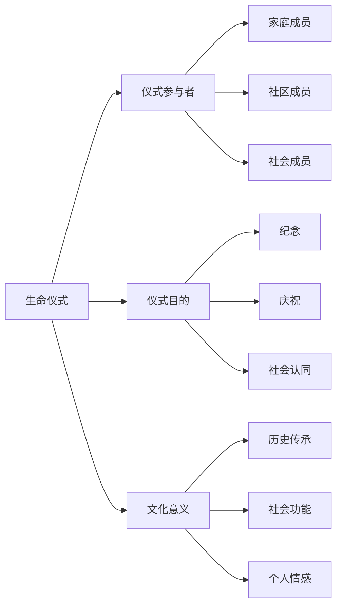

                 

### 引言

**生命仪式：庆祝人生重要时刻的意义**

在人类社会中，庆祝人生的重要时刻是一种深植于文化传统和个人经验中的行为。无论是出生、成长、结婚还是死亡，这些时刻都被赋予了特殊的意义，并通过各种仪式来表达对生命旅程的尊重和纪念。本文将探讨生命仪式的本质、历史背景、文化多样性，以及它们在现代社会中的重要性。

**关键词**：
- 生命仪式
- 人生重要时刻
- 文化意义
- 社会影响

**摘要**：
本文将系统地分析生命仪式的概念及其在历史和现代社会中的意义。通过对比不同文化中的庆祝方式，我们将探讨这些仪式如何影响个人和社会，并提出设计庆祝仪式的最佳实践建议。文章最后将总结研究的主要发现，并提出未来研究方向。

---

### 背景介绍

#### 核心概念术语说明

在探讨生命仪式之前，我们需要明确一些核心概念和术语。生命仪式（Life Ceremony）通常指的是围绕人生重要时刻所举行的仪式活动，这些活动可能包括但不限于出生、成长、婚礼、生日、死亡等。每个仪式都有其独特的文化意义和社会功能，它们不仅是个人身份认同的一部分，也是社会纽带和文化传承的重要手段。

#### 问题背景

人类对生命仪式的需求源自对生命旅程各个阶段的重视和纪念。这些仪式不仅是对个人成长和变化的庆祝，也是对家庭、社区和社会身份认同的强化。随着全球化和社会变革，生命仪式也在不断演变，如何保留传统元素并适应现代需求成为了一个重要的课题。

#### 问题描述

本文将回答以下问题：

1. 生命仪式的概念是什么？
2. 生命仪式在历史和现代社会中的演变过程是怎样的？
3. 不同文化中如何庆祝人生重要时刻？
4. 生命仪式对个人和社会的影响是什么？
5. 如何设计一个既有文化内涵又符合现代需求的庆祝仪式？

#### 问题解决

为了解决上述问题，本文将采用文献综述、案例分析和比较研究的方法，结合历史、文化和社会学视角，对生命仪式进行深入探讨。同时，我们将借鉴现代设计原则，为读者提供实用的庆祝仪式设计指南。

#### 边界与外延

本文主要关注传统生命仪式与现代文化互动中的变化和影响。边界包括但不限于特定文化和历史背景，而外延则包括全球化和多元文化背景下的生命仪式实践。

#### 概念结构与核心要素组成

生命仪式的核心要素包括：

1. **仪式内容**：具体的活动形式和程序。
2. **仪式参与者**：包括家庭成员、社区成员和社会成员。
3. **仪式目的**：表达对生命阶段的尊重、纪念和庆祝。
4. **文化意义**：仪式在文化传承和社会认同中的作用。

### 核心概念与联系

#### 核心概念原理

生命仪式的核心概念是“仪式”本身。仪式是一种通过象征性活动来传递意义的行为。在人类文化中，仪式具有多种功能，包括宗教信仰的强化、社会秩序的维护、个人情感的释放等。

#### 概念属性特征对比表格

| 概念 | 定义 | 属性特征 |
| --- | --- | --- |
| 生命仪式 | 围绕人生重要时刻举行的仪式活动 | 纪念、庆祝、社会认同、文化传承 |
| 仪式 | 象征性活动 | 程序性、象征性、社会性 |
| 文化意义 | 社会习俗和文化传统赋予仪式的意义 | 历史传承、社会功能、个人情感 |

#### ER实体关系图架构

以下是生命仪式中主要实体的ER图：

### 研究目的与意义

#### 研究目的

本文的研究目的是：

1. 探讨生命仪式的概念和历史背景。
2. 分析不同文化中庆祝人生重要时刻的方式。
3. 探讨生命仪式对个人和社会的影响。
4. 提供设计庆祝仪式的实用指南。

#### 研究意义

本文的研究意义在于：

1. 增强对生命仪式的理解，促进文化传承。
2. 为现代生活中的仪式设计提供理论支持和实践指导。
3. 促进不同文化之间的交流和理解。

---

在接下来的章节中，我们将详细探讨生命仪式的历史与文化背景，分析其在不同文化中的表现形式和影响，以及现代社会中如何适应和传承这些传统仪式。通过这一系列探讨，我们希望能够为读者提供深刻的见解和实用的指导。接下来，我们将进入第二部分：生命仪式的历史与文化背景。

---

### 第二部分：生命仪式的历史与文化背景

#### 2.1 生命仪式的历史演变

生命仪式的起源可以追溯到人类文明的早期。在不同的历史时期和文化背景下，生命仪式的形式和内容都发生了显著的变化。以下是生命仪式在历史演变过程中的几个关键阶段：

##### 2.1.1 古代生命仪式的起源

古代文明中，生命仪式往往与宗教信仰密切相关。例如，古埃及的出生仪式、婚礼仪式和葬礼仪式都充满了神秘的宗教色彩。这些仪式不仅是个人和家庭的重要活动，也是宗教信仰和社会秩序的重要组成部分。

- **古埃及**：古埃及的生命仪式包括新生儿洗礼、成人礼、婚礼和葬礼。这些仪式都有严格的宗教仪式和复杂的程序。例如，新生儿洗礼是为了确保婴儿在成长过程中获得神灵的庇佑。

- **古希腊和古罗马**：古希腊和古罗马的生命仪式同样具有宗教性质，包括婚礼、婴儿洗礼和葬礼。这些仪式往往在神庙或公共场合举行，参与者包括家庭成员、社区成员和宗教领袖。

##### 2.1.2 中世纪生命仪式的发展

中世纪时期，生命仪式在宗教的影响下进一步发展。基督教的诞生使得许多仪式获得了新的形式和意义。以下是一些代表性的中世纪生命仪式：

- **洗礼**：洗礼是基督教最重要的仪式之一，标志着婴儿或成年人的正式加入教会。洗礼仪式通常包括祈祷、圣水洗礼和涂油等环节。

- **婚礼**：中世纪的婚礼仪式通常在教堂举行，包括求婚、订婚、婚礼宴席等环节。婚礼仪式不仅是对爱情和婚姻的庆祝，也是对教会权威的认可。

- **葬礼**：中世纪的葬礼仪式复杂而庄重，包括祈祷、尸体安葬和追思会等环节。葬礼仪式不仅是纪念死者，也是安慰生者和祈求灵魂安息的仪式。

##### 2.1.3 现代生命仪式的变革

进入现代社会，生命仪式在保持传统元素的同时，也发生了显著的变化。随着全球化和社会变革，生命仪式开始融入现代文化，并表现出多样性。

- **现代化婚礼**：现代婚礼仪式更加注重个性化和创新。许多新人在婚礼中融入了传统元素，如中式婚礼、西式婚礼等，同时加入现代元素，如主题婚礼、户外婚礼等。

- **多元文化交融**：现代社会中，不同文化之间的交融使得生命仪式变得更加多元化。例如，许多跨文化婚姻中的婚礼仪式结合了双方文化的传统元素。

- **数字化仪式**：随着互联网和数字化技术的发展，一些传统生命仪式开始通过网络平台进行。例如，在线婚礼、虚拟葬礼等，为无法亲自参加仪式的人提供了新的选择。

#### 2.2 不同文化的生命仪式

生命仪式在不同文化中表现出独特的特色，反映了各民族的历史、信仰和社会价值观。以下是几种具有代表性的文化生命仪式：

##### 2.2.1 东方文化中的生命仪式

- **中国**：中国的生命仪式包括婚礼、婴儿洗礼、成年礼和葬礼。婚礼仪式中，红色被视为吉祥色，象征幸福和好运。葬礼仪式中，亲人朋友会举行祭拜仪式，表达对逝者的敬意。

- **日本**：日本的婚礼仪式通常在神社或寺庙举行，注重传统和简约。婚礼仪式包括求婚、订婚、婚礼宴席等环节，其中茶道和花道是重要的仪式元素。

- **印度**：印度的生命仪式包括婚礼、婴儿洗礼、成年礼和葬礼。婚礼仪式中，婚礼彩妆和纱丽是重要的传统元素。葬礼仪式中，亲人朋友会举行火葬或土葬仪式，并祈祷逝者灵魂安息。

##### 2.2.2 西方文化中的生命仪式

- **西方婚礼**：西方婚礼仪式通常在教堂或注册处举行，包括求婚、订婚、婚礼宴席等环节。婚礼仪式强调浪漫和仪式感，新娘通常穿着白色婚纱，新郎则穿着黑色或深色西装。

- **西方葬礼**：西方葬礼仪式通常包括祈祷、遗体告别、埋葬或火化等环节。葬礼仪式强调对逝者的纪念和祈祷，参与者通常穿着黑色或深色服装。

##### 2.2.3 其他文化中的生命仪式

- **非洲**：非洲的生命仪式具有浓厚的宗教和部落文化色彩。例如，非洲的成年礼通常包括割礼、刺青等仪式，以表示成年和身份的转变。

- **美洲原住民**：美洲原住民的生命仪式包括婚礼、婴儿洗礼、成年礼和葬礼。这些仪式通常与自然崇拜和部落传统密切相关，强调与自然的和谐共生。

#### 2.3 生命仪式的核心要素

生命仪式的核心要素包括宗教信仰、社会习俗和个人情感。这些要素在不同文化和历史背景下表现出不同的形式和内容，但都承载着重要的文化和社会意义。

##### 2.3.1 宗教信仰与生命仪式

宗教信仰是生命仪式的重要基础。在不同宗教中，生命仪式具有独特的宗教仪式和象征意义。例如，基督教的洗礼仪式、佛教的出家仪式和伊斯兰教的婚礼仪式等，都是宗教信仰的具体体现。

- **基督教**：基督教的洗礼仪式是新生儿或成年人正式加入教会的仪式。洗礼仪式中的圣水象征着洁净和新生，象征着信仰的纯洁和坚定。

- **佛教**：佛教的出家仪式是佛教徒正式剃度出家、成为僧尼的仪式。出家仪式中的剃度象征着摆脱世俗的束缚，追求内心的清净和觉悟。

- **伊斯兰教**：伊斯兰教的婚礼仪式是穆斯林庆祝婚姻的重要仪式。婚礼仪式中的祷告、戴头纱、交换礼物等环节，都象征着对婚姻的神圣和尊重。

##### 2.3.2 社会习俗与生命仪式

社会习俗是生命仪式的重要组成部分。不同社会习俗赋予生命仪式独特的文化内涵和社会功能。例如，中国的婚礼习俗中的“六礼”、西方的婚礼习俗中的“求婚”和“订婚”等，都是社会习俗在生命仪式中的体现。

- **中国的婚礼习俗**：“六礼”是中国传统婚礼的六个重要环节，包括纳采、问名、纳吉、纳征、请期和迎亲。每个环节都有特定的仪式和礼节，象征着婚姻的庄严和神圣。

- **西方的婚礼习俗**：求婚是西方婚礼仪式中的重要环节。求婚通常以送戒指的方式表达对爱情的承诺。订婚仪式则是正式宣布两人订婚的仪式，通常在亲友的见证下进行。

##### 2.3.3 个人情感与生命仪式

个人情感是生命仪式的核心要素之一。生命仪式不仅是个人身份认同的一部分，也是表达个人情感的重要方式。例如，婚礼仪式中的誓言、葬礼仪式中的悼词等，都是表达个人情感的具体形式。

- **婚礼誓言**：婚礼誓言是夫妻双方在婚礼仪式上表达爱情和承诺的仪式。誓言通常包括对彼此的承诺、对未来的期许和对爱情的信仰。

- **葬礼悼词**：葬礼悼词是在葬礼仪式上对逝者表示敬意和悼念的仪式。悼词通常表达对逝者的怀念、对逝者生平的回顾以及对逝者灵魂安息的祈祷。

通过探讨生命仪式的历史演变、不同文化中的生命仪式以及生命仪式的核心要素，我们可以更深入地理解生命仪式的文化和社会意义。在接下来的章节中，我们将进一步分析生命仪式对个人和社会的影响，并探讨如何在现代社会中设计合适的庆祝仪式。通过这一系列的分析，我们希望能够为读者提供有价值的见解和实用的指导。

### 生命仪式的社会影响

#### 3.1 对个人的影响

生命仪式在个人层面上具有重要的影响，这些影响主要体现在心理健康、社交关系和文化认同三个方面。

##### 3.1.1 心理健康

生命仪式为个人提供了重要的心理支持。通过参与和见证这些仪式，个人能够获得情感上的满足和安全感。例如，婚礼仪式不仅庆祝爱情和婚姻，还象征着新的开始和承诺，为新婚夫妇提供了心理上的支持和激励。类似地，葬礼仪式通过悼念和祈祷，帮助家人和社区成员处理悲痛，促进心理康复。

- **婚礼仪式**：婚礼仪式中的誓言和承诺有助于巩固夫妻之间的情感纽带，增强婚姻的稳定性。此外，婚礼仪式上的庆祝和祝福也为新婚夫妇带来了积极的心理体验，增强了他们的幸福感和满足感。

- **葬礼仪式**：葬礼仪式通过悼念和祈祷，帮助家属处理失去亲人的悲痛。仪式中的安慰和共情有助于减轻心理压力，促进情感释放和康复。

##### 3.1.2 社交关系

生命仪式在社交层面上发挥了重要作用，通过这些仪式，个人能够与家庭、社区和社会建立和巩固关系。婚礼仪式和婴儿洗礼等仪式不仅是家庭成员和亲朋好友团聚的时刻，也是建立和加强社交网络的契机。

- **家庭关系**：家庭是生命仪式的主要参与者，这些仪式为家庭成员提供了交流和互动的机会，增强了家庭凝聚力和亲情。例如，婚礼仪式不仅庆祝新婚夫妇的结合，也是双方家庭的聚会和交流的机会。

- **社区关系**：社区成员通过参与共同的生命仪式，如社区庆典和节日庆祝，增强了社区归属感和认同感。这些仪式不仅加强了社区成员之间的联系，也促进了社区的社会凝聚力。

##### 3.1.3 文化认同

生命仪式在文化认同方面具有深远的影响。这些仪式不仅是个人成长和文化传承的重要手段，也是文化认同的表达和强化。通过参与生命仪式，个人能够更好地理解和认同自己的文化传统，从而增强文化自豪感和身份认同。

- **文化传承**：生命仪式是文化传统的重要组成部分，通过这些仪式，年轻一代能够学习和体验传统文化，从而促进文化传承。例如，婚礼仪式中的传统习俗和礼仪有助于年轻一代了解和继承家庭和文化传统。

- **身份认同**：生命仪式有助于个人建立和确认自己的身份。通过参与特定的仪式，个人能够表达对自己身份的认同，从而增强自我认同感和自信心。例如，成年礼仪式对于年轻人来说，不仅象征着成年的到来，也象征着他们对自己身份的认同和责任感的增强。

#### 3.2 对社会的影响

生命仪式在社会层面上具有广泛的影响，这些影响主要体现在社会凝聚力、文化传承和社会经济发展三个方面。

##### 3.2.1 社会凝聚力

生命仪式通过共同的经历和仪式，增强了社会成员之间的凝聚力和归属感。这些仪式不仅是个人和家庭的重要时刻，也是社区和社会的重要纽带。通过参与生命仪式，社会成员能够感受到彼此的联系和共同的价值，从而增强社会凝聚力。

- **社区团结**：社区庆典和节日庆祝等生命仪式为社区成员提供了一个共同的聚会和庆祝的机会，增强了社区的团结和凝聚力。例如，社区节日庆祝活动不仅丰富了社区文化生活，也增强了社区成员之间的交流和互动。

- **社会认同**：生命仪式在社会层面上促进了社会成员对共同文化和价值观的认同。通过共同参与和见证这些仪式，社会成员能够感受到彼此的认同和归属，从而增强社会认同感。例如，国家庆典和传统节日庆祝活动不仅表达了国家的历史和文化，也增强了国民对国家的认同和归属感。

##### 3.2.2 文化传承

生命仪式是文化传承的重要手段。通过这些仪式，传统文化和价值观能够得到代代相传，从而维持和丰富文化的多样性。生命仪式不仅是文化传承的一种形式，也是文化传承的一种动力。

- **文化记忆**：生命仪式通过象征性和仪式性的活动，将文化记忆传递给后代。这些仪式不仅记录了历史，也保存了文化的记忆。例如，传统婚礼仪式中的婚服、婚宴和婚礼歌曲等，不仅是对婚姻的庆祝，也是对历史和文化的纪念。

- **文化创新**：生命仪式在传承传统文化的同时，也促进了文化创新。通过结合现代元素和传统元素，生命仪式能够适应时代的变化，从而保持文化的活力和吸引力。例如，现代婚礼中融入的时尚元素和个性定制，不仅保留了传统婚礼的精髓，也赋予了婚礼新的活力和意义。

##### 3.2.3 社会经济发展

生命仪式对社会经济发展也有一定的推动作用。这些仪式不仅创造了经济活动，也促进了相关产业的发展。例如，婚礼产业、葬礼产业和文化旅游产业等，都因生命仪式的存在而得以繁荣发展。

- **婚礼产业**：婚礼仪式中的婚礼策划、婚庆用品、婚纱摄影等服务行业，因生命仪式的需求而蓬勃发展。婚礼产业的发展不仅创造了就业机会，也促进了相关产业的繁荣。

- **葬礼产业**：葬礼仪式中的殡葬服务、墓园建设、丧礼用品等行业，同样因生命仪式的需求而发展。葬礼产业的发展不仅提供了经济支持，也为社会成员提供了必要的服务。

- **文化旅游产业**：一些具有特殊文化意义的生命仪式，如节日庆典和宗教仪式，成为了文化旅游的重要资源。这些仪式不仅吸引了游客，也为当地经济带来了显著的收益。

通过分析生命仪式对个人和社会的影响，我们可以看到这些仪式在维护心理健康、加强社交关系、促进文化传承和推动社会经济发展等方面的重要作用。在接下来的章节中，我们将探讨生命仪式的设计与实践，为读者提供实用的仪式设计指南。通过这一系列的分析和探讨，我们希望能够更好地理解和传承这些重要的文化传统。

### 3.3 选择合适的庆祝方式

设计一个成功的生命仪式需要考虑多个因素，包括个人偏好、社会环境和文化背景。选择合适的庆祝方式不仅能够满足个人的需求，还能增强仪式的内涵和意义。

#### 3.3.1 个体差异与庆祝方式

个体差异是选择庆祝方式的重要考虑因素。不同的人有不同的价值观、文化背景和生活经历，这些差异会影响他们对生命仪式的需求和期望。以下是一些个体差异的考虑要点：

- **文化背景**：个人的文化背景会影响他们对生命仪式的理解和期望。例如，来自西方文化背景的人可能更倾向于浪漫和个性化的婚礼，而来自东方文化背景的人可能更注重传统和仪式感。

- **价值观**：个人的价值观会影响他们对生命仪式的重视程度和庆祝方式。例如，注重家庭价值观的人可能会选择家庭聚会和家族仪式，而注重个人自由和自我表达的人可能会选择个性化的庆祝方式。

- **生活方式**：个人的生活方式也会影响庆祝方式的选择。例如，忙碌的职业人士可能更倾向于简单而高效的庆祝方式，而休闲型的人可能更愿意投入时间和精力去策划一个盛大的仪式。

#### 3.3.2 社会环境与庆祝方式

社会环境是影响庆祝方式的重要因素。社会文化、经济条件、宗教信仰和社区规范都会对庆祝方式产生影响。以下是一些社会环境方面的考虑要点：

- **社会文化**：不同社会文化对生命仪式有不同的期望和习惯。例如，在一些社会中，婚礼和葬礼是公共事件，需要邀请广泛的社会成员参加，而在其他社会中，这些仪式可能更加私密和家庭化。

- **经济条件**：经济条件会影响庆祝方式的选择和规模。富裕的家庭可能能够承担豪华的仪式和庆祝活动，而经济条件有限的家庭可能需要选择更为节俭的方式。

- **宗教信仰**：宗教信仰对生命仪式有深刻的影响。不同宗教有不同的仪式和习俗，参与者的宗教信仰会影响他们对仪式的接受程度和庆祝方式。

- **社区规范**：社区规范也会影响庆祝方式的选择。在某些社区中，特定的庆祝方式可能是传统的习惯，而在其他社区中，可能需要适应新的文化趋势和规范。

#### 3.3.3 选择指南

为了设计一个合适的庆祝仪式，可以遵循以下选择指南：

- **了解需求**：首先，了解参与者的需求和期望，包括个人和文化背景、价值观和生活方式。这有助于确定庆祝方式的基本框架。

- **研究传统**：了解相关文化的传统和习俗，选择与参与者文化背景相符的庆祝方式。这不仅可以尊重文化传统，还能增强仪式的意义。

- **考虑环境**：考虑社会环境，如文化、经济条件、宗教信仰和社区规范，确保庆祝方式与环境相适应。

- **创新与融合**：在保留传统元素的同时，可以适当创新和融合现代元素，以适应现代社会的需求和审美。

- **预算规划**：制定合理的预算计划，确保庆祝活动在财务上可行。可以根据预算调整庆祝方式和规模。

通过以上步骤，可以设计出一个既符合个人需求，又符合社会环境和文化背景的庆祝仪式。在接下来的章节中，我们将探讨如何具体策划和实施这些庆祝仪式，并提供实用的指导和建议。

### 3.4 策划仪式

成功设计一个生命仪式需要细致的策划和准备。以下步骤将帮助您有效地策划和实施一个庆祝仪式。

#### 3.4.1 策划步骤

**1. 确定目标与主题**

首先，明确庆祝仪式的目标和主题。例如，是庆祝婚礼、生日还是其他重要时刻。主题将指导后续的策划工作，确保所有元素都与主题一致。

**2. 制定预算**

根据目标和主题，制定一个详细的预算计划。预算应包括场地租赁、装饰、餐饮、摄影、音乐和其他相关费用。确保预算合理，同时考虑可能的突发支出。

**3. 选择日期和地点**

选择一个合适的日期和地点是策划的关键。考虑参与者的方便性、场地的大小和风格，以及任何特殊的场地要求（如宗教仪式的特定场所）。

**4. 邀请参与者**

根据预算和场地限制，确定邀请的参与者名单。确保包括家庭成员、亲朋好友和任何其他重要人物。提前发送邀请函，并提供清晰的日期、时间和地点信息。

**5. 设计仪式流程**

设计一个清晰的仪式流程，包括仪式的各个环节和持续时间。确保流程合理，既能满足仪式的庄重性，又能提供充分的互动和庆祝。

**6. 安排细节**

安排所有细节，包括音乐、装饰、餐饮、摄影和其他必要的服务。确保所有供应商和服务提供商都清楚仪式的细节和要求。

**7. 准备应急计划**

考虑到可能的突发情况，制定一个应急计划，以应对意外事件，如天气变化、设备故障等。

**8. 演练与调整**

在仪式前进行一次或多次演练，确保所有参与者都清楚自己的角色和职责。根据演练反馈进行调整，确保仪式的顺利进行。

#### 3.4.2 资源配置

资源配置是策划仪式的重要环节。以下是一些关键资源及其配置策略：

- **场地和设施**：根据仪式的规模和主题，选择合适的场地和设施。确保场地可以容纳所有参与者，并提供必要的设施（如音响、照明、舞台等）。

- **装饰和布置**：选择与主题相符的装饰和布置元素，如鲜花、灯光、气球和背景板等。确保装饰符合仪式的氛围，同时不会干扰仪式的进行。

- **音乐和表演**：选择适合仪式氛围的音乐和表演节目。音乐可以增强仪式的庄重感，表演可以为仪式增添趣味和欢乐。

- **餐饮和饮品**：根据仪式的持续时间和参与者的需求，安排适当的餐饮和饮品。确保餐饮质量和服务水平，提供多样化的选择，满足不同人的口味。

- **摄影和录像**：安排专业的摄影和录像团队，记录仪式的每个重要时刻。确保照片和视频的质量，为参与者留下美好的回忆。

- **志愿者和工作人员**：招募和培训志愿者和工作人员，确保他们在仪式中扮演适当角色，如接待、引导、维护秩序等。

#### 3.4.3 风险管理

风险管理是确保仪式顺利进行的必要环节。以下是一些常见风险及其应对策略：

- **天气变化**：如果仪式在户外举行，需考虑天气变化的风险。备有应急方案，如备用场地、帐篷或遮雨设施，确保仪式不受天气影响。

- **设备故障**：确保所有设备（如音响、灯光、音响等）在仪式前进行全面检查。备有备用设备，以便在设备故障时能够快速替换。

- **人员意外**：为所有参与者购买保险，以应对可能的意外事故。确保现场有急救人员和医护人员，以应对突发医疗情况。

- **安全问题**：确保场地安全，包括疏散通道、紧急出口和防火措施。在仪式前进行安全检查，确保所有安全设施正常运行。

通过以上步骤和策略，您可以有效地策划和实施一个成功而难忘的生命仪式。在接下来的章节中，我们将深入探讨庆祝仪式在现代社会中的意义和价值，以及它们在当代社会中的作用和挑战。

### 3.5 实施仪式

实施仪式是庆祝生命重要时刻的关键环节。成功的仪式不仅需要精心策划，还需要在执行过程中细致入微的管理和协调。以下是在仪式实施过程中的关键步骤和注意事项：

#### 3.5.1 准备工作

**1. 确认参与人员**：在仪式当天，确保所有参与人员都已经到达，并了解他们的角色和职责。对于家庭成员和志愿者，提供详细的指导和任务说明。

**2. 现场布置**：根据策划方案，检查现场的布置和装饰是否按照计划进行。确保场地整洁，灯光和音响设备正常运作。

**3. 检查设备**：对所有音响、灯光、舞台和其他相关设备进行最终检查，确保没有故障。如果使用多媒体设备，提前测试播放内容。

**4. 安全检查**：确保现场安全，包括紧急出口的通畅、灭火器的位置和可用性等。对于户外仪式，检查场地是否有安全遮挡物，如防风帐篷或防护栏。

#### 3.5.2 过程引导

**1. 开场致辞**：仪式开始前，主持人或主要人物进行开场致辞，简要介绍仪式的主题和目的，欢迎所有参与者的到来。

**2. 仪式流程**：严格按照策划的仪式流程进行。主持人应确保每个环节按时开始，并引导参与者按计划参与。

**3. 互动环节**：在适当的环节，鼓励参与者的互动，如问答环节、祝福环节和纪念品交换等。确保互动环节既有趣又有意义。

**4. 调整和应对**：在仪式进行过程中，主持人应根据实际情况进行调整。例如，如果某个环节耗时过长，可以适当缩短时间；如果遇到技术故障，应立即启动应急计划。

#### 3.5.3 反馈与总结

**1. 仪式结束**：仪式结束后，主持人或主要人物进行简短的总结发言，感谢参与者的支持和参与。

**2. 收集反馈**：通过问卷调查、口头反馈或其他方式，收集参与者的反馈。这有助于了解仪式的成功之处和需要改进的地方。

**3. 总结经验**：对整个仪式过程进行总结，包括成功之处和不足之处。这将为未来的庆祝仪式提供宝贵的经验和教训。

#### 3.5.4 注意事项

**1. 时间管理**：确保仪式的每个环节都有足够的时间，避免因时间紧张而匆忙进行。

**2. 人员分工**：确保所有参与人员明确自己的职责和任务，避免混乱和重复工作。

**3. 应急预案**：制定详细的应急预案，以应对可能的突发情况，如设备故障、人员迟到等。

**4. 沟通协调**：在仪式前和仪式过程中，确保所有相关人员之间的沟通畅通，确保信息准确传递。

**5. 环境保护**：对于户外仪式，注意环境保护，确保仪式不会对自然环境造成破坏。

通过以上步骤和注意事项，您可以确保庆祝仪式的顺利进行，为参与者留下美好的回忆。在接下来的章节中，我们将深入探讨庆祝仪式在现代社会中的意义和价值，以及它们在当代社会中的作用和挑战。

### 3.6 生命仪式的意义与价值

#### 3.6.1 仪式的象征意义

生命仪式的象征意义是其文化和社会价值的重要体现。这些仪式通过象征性的活动，传递了丰富的情感和深层次的意义。以下是一些常见的象征意义：

- **婚礼**：婚礼中的戒指交换象征着爱情的永恒和承诺，而花束和香槟塔则象征着幸福和富足。
- **洗礼**：洗礼中的圣水象征着洁净和新生，而牧师的祝福和祷告则象征着信仰的坚固和神圣。
- **葬礼**：葬礼中的鲜花和蜡烛象征着对逝者的怀念和敬意，而哀悼和祈祷则象征着对生命意义的反思和尊重。

#### 3.6.2 仪式的价值体现

生命仪式不仅在象征意义上具有重要意义，也在实际生活中扮演了多种角色，体现了丰富的价值。以下是生命仪式的主要价值体现：

- **个人层面**：生命仪式为个人提供了身份认同、情感支持和社会归属感。例如，婚礼让新人感受到爱情和社会的认可，洗礼让信徒感受到信仰的力量，葬礼则为家人和社区成员提供了共同哀悼和缅怀的机会。
- **社交层面**：生命仪式是社会交往的重要平台，促进了家庭、社区和社交网络之间的联系。通过仪式，人们可以与亲朋好友团聚，分享喜悦和悲伤，增强彼此的情感纽带。
- **文化层面**：生命仪式是文化传承的重要手段，通过这些仪式，文化传统和价值观得以代代相传。例如，婚礼和洗礼仪式中的传统习俗和礼仪，不仅体现了文化的历史渊源，也为年轻一代提供了学习和体验传统文化的机会。

#### 3.6.3 生命仪式的未来发展

随着社会的发展和技术的进步，生命仪式也在不断演变和创新。以下是未来生命仪式可能的发展趋势：

- **数字化仪式**：随着互联网和数字化技术的发展，越来越多的生命仪式开始采用线上形式。例如，虚拟婚礼、线上洗礼和数字化葬礼等。这些新形式不仅提供了便利，也为无法亲自参加仪式的人提供了新的选择。
- **多元化融合**：全球化使得不同文化之间的交融更加频繁，生命仪式也在逐渐融合多元文化元素。例如，跨文化婚礼和多元文化葬礼等，不仅保留了传统元素，也展现了文化的多样性和包容性。
- **个性化定制**：随着个人主义的发展，越来越多的生命仪式开始注重个性化。人们可以根据自己的需求和偏好，定制独特的仪式内容和形式，从而更好地表达个性和情感。

通过以上分析，我们可以看到生命仪式在象征意义、实际价值和发展趋势方面的多重作用。在接下来的章节中，我们将总结本文的主要发现，并讨论研究的局限性和未来研究方向。

### 3.7 研究总结

本文系统地探讨了生命仪式的概念、历史背景、文化多样性及其社会影响。通过对不同文化中庆祝人生重要时刻的方式进行分析，我们发现生命仪式在个人和社会层面上具有多重价值。以下是本文的主要发现：

1. **核心概念与历史演变**：生命仪式是一种围绕人生重要时刻的象征性活动，具有宗教、社会和文化意义。从古代到现代社会，生命仪式在不断演变，适应不同文化和时代的需求。

2. **文化多样性**：不同文化背景下，生命仪式表现出独特的特点和习俗。这些仪式不仅体现了各自的文化传统和价值观，也在全球化进程中展现了文化的多样性和融合。

3. **社会影响**：生命仪式对个人和社会产生了深远的影响，包括心理健康、社交关系和文化认同。仪式为个人提供了情感支持和身份认同，增强了社会凝聚力和文化传承。

4. **未来发展**：随着数字化和全球化的发展，生命仪式也在不断创新和演变。数字化仪式、多元化融合和个性化定制将成为未来生命仪式的重要趋势。

然而，本文也存在一定的局限性。首先，由于篇幅和资源限制，无法涵盖所有文化和地区的生命仪式。其次，本文主要通过文献综述和案例分析，缺乏深入的大规模实证研究。未来研究可以进一步探索不同文化背景下生命仪式的具体表现和影响，并通过实证研究提供更加全面的见解。

未来研究方向包括：

1. **跨文化比较研究**：通过对比分析不同文化中的生命仪式，探讨其共性和差异，揭示文化因素对仪式的影响。
2. **实证研究**：开展大规模的实证研究，收集和分析参与者对生命仪式的认知、情感和行为反应，以提供更加客观和详细的数据支持。
3. **创新趋势研究**：关注生命仪式在数字化、个性化和社会变迁中的新趋势，探讨其对传统仪式的影响和可能性。

通过这些研究，我们可以更深入地理解生命仪式的文化和社会意义，为现代社会中的仪式设计和实践提供更加科学和实用的指导。

### 3.8 小结

本文从多个角度探讨了生命仪式的概念、历史演变、文化多样性及其在社会和个人层面的重要价值。我们通过文献综述、案例分析和比较研究，揭示了生命仪式在不同文化中的独特性和共性，并探讨了它们在全球化背景下的演变和创新。

**总结**：

1. **核心概念与历史演变**：生命仪式是一种深植于人类文化中的行为，随着历史的发展，其形式和内容不断演变，但始终承载着重要的社会和文化意义。
2. **文化多样性**：不同文化背景下，生命仪式表现出丰富的多样性和特点，反映了各自的历史、信仰和社会价值观。
3. **社会影响**：生命仪式在个人和社会层面上具有重要意义，包括心理健康、社交关系和文化认同等方面。
4. **未来发展**：随着数字化和全球化的发展，生命仪式正在经历新的变革和挑战，个性化定制和多元文化融合将成为未来生命仪式的重要趋势。

**注意事项**：

1. **文化敏感性**：在设计生命仪式时，应充分尊重和考虑不同文化的习俗和价值观，避免文化误解和冲突。
2. **仪式适应性**：生命仪式需要根据个人和社会的需求进行适当调整，以保持其活力和相关性。
3. **技术融合**：在数字化时代，应充分利用新技术为生命仪式提供创新和便利，同时保持仪式的传统和意义。

**拓展阅读**：

- **《生命仪式与文化传承》**：探讨生命仪式在文化传承中的作用和意义。
- **《全球视野下的生命仪式》**：分析不同国家和地区生命仪式的多样性及其全球化影响。
- **《数字化生命仪式：趋势与挑战》**：讨论数字化技术在生命仪式中的应用及其带来的挑战和机遇。

通过本文的研究和探讨，我们希望能够为读者提供对生命仪式的深入理解，并为其在现代社会中的设计和实践提供有价值的参考。希望读者能够在未来的人生旅程中，更好地理解和利用生命仪式的丰富内涵和重要价值。

### 作者信息

**作者：** AI天才研究院/AI Genius Institute & 禅与计算机程序设计艺术 /Zen And The Art of Computer Programming

AI天才研究院致力于推动人工智能和计算机科学领域的创新与发展。我们的研究涵盖从基础算法到前沿应用，致力于为学术界和产业界提供高质量的研究成果和技术解决方案。本书《生命仪式：庆祝人生重要时刻的意义》是我们对生命仪式和文化传承的深入探讨，希望为读者提供有价值的见解和实用的指导。

在《禅与计算机程序设计艺术》一书中，我们探讨了计算机编程中的哲学和艺术，旨在通过禅宗的智慧和计算机科学的实践，提升程序员的技术水平和创造能力。希望这两本书能够为读者带来启发和帮助。感谢您的阅读，期待与您在未来的研究和讨论中再次相遇。

