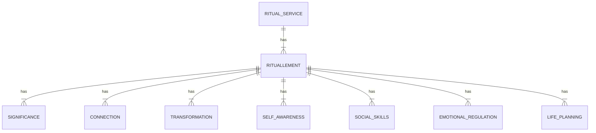

                 

### 引言

在现代社会中，我们似乎被繁杂的日常事务所包围，仿佛陷入了一场永无止境的忙碌漩涡。生活的快节奏和高压环境常常让我们感到焦虑和迷茫，甚至忘记了生活的初衷。在这样的背景下，"生命仪式"这个概念逐渐被提上日程，成为探讨如何赋予日常生活意义的一个重要途径。

#### 生命的意义与日常生活的联系

生命的意义并非一个抽象的哲学问题，它与我们的日常生活息息相关。生活中的每一个细节，无论是早餐的选择，还是与家人朋友的交流，都在塑造着我们的人生体验。当我们能够从日常生活中感受到生命的意义，我们的生活便会变得更加丰富和有意义。

#### 生命仪式的概念及其重要性

"生命仪式"是指一系列有意识地设计的行为和活动，旨在增强个人对生命的认知和感悟。这些仪式可以是简单的日常习惯，如每天早晨冥想，也可以是重要的生活事件，如婚礼或葬礼。生命仪式的核心在于它们能够帮助我们建立与生活的深刻联系，从而赋予我们的日常生活更深层次的意义。

#### 研究目的与意义

本文旨在探讨生命仪式在赋予日常生活意义方面的作用。通过分析生命仪式的历史、哲学背景、核心概念以及其实施方法，本文希望能够为读者提供一套系统化的理解框架，帮助他们在忙碌的生活中找到宁静与意义。

#### 文章结构

本文将分为以下几个部分：

1. **历史与哲学探讨**：介绍生命仪式的起源、发展和不同文化中的实践。
2. **核心概念与联系**：阐述生命仪式的基本概念及其属性，并通过对比表格和ER图展示概念之间的关系。
3. **实施方法与步骤**：详细讲解生命仪式的筹备、执行和后续影响。
4. **案例分析**：通过具体实例分析生命仪式的实施效果。
5. **总结与拓展**：总结文章的核心观点，并提供进一步阅读的建议。

### 总结

生命仪式不仅是一种形式，更是一种心灵的洗礼。它帮助我们重新审视生活，发现日常中的美好和意义。通过本文的探讨，我们希望能够引导读者在快节奏的生活中找到属于自己的生命仪式，从而赋予日常生活更深远的内涵。接下来，我们将深入探讨生命仪式的历史与哲学背景，以更全面地理解这一重要概念。 ### 生命仪式的历史与哲学探讨

#### 1.1 生命仪式的起源与发展

生命仪式的起源可以追溯到人类文明的早期阶段。作为一种文化现象，生命仪式在人类历史的长河中扮演着至关重要的角色。在不同文明中，生命仪式有着各自独特的表现形式和内涵。

在古代文明中，如古埃及、古希腊和古印度，生命仪式被视为连接人与神、人与自然的重要纽带。例如，古埃及的仪式活动围绕生死、重生和灵魂的永恒进行，而古希腊的仪式则强调对英雄的纪念和对神的崇拜。在这些仪式中，人们通过特定的动作和仪式流程，试图获得神灵的庇佑，或是纪念逝去的亲人。

随着时间的推移，生命仪式在宗教和文化的演变中不断发展。在中世纪的欧洲，基督教的洗礼、婚礼和葬礼仪式成为社会生活中不可或缺的一部分。这些仪式不仅具有宗教意义，也承载了社会道德和文化价值。例如，婚礼仪式象征着爱情的结合和对家庭的承诺，而洗礼和葬礼则分别代表了生命的开始和结束。

在现代社会，生命仪式的形式和内容发生了很大的变化，但它们的核心精神依然存在。随着科技的进步和社会的变革，人们开始重新思考生命仪式的意义和作用。现代社会中的生命仪式更加注重个体的感受和体验，强调仪式对个人成长和心灵抚慰的作用。

#### 1.2 不同文化中的生命仪式

不同文化背景下，生命仪式有着各自独特的表现形式和内涵。以下是几个具有代表性的文化中的生命仪式：

**1. 中国文化中的生命仪式**

在中国传统文化中，生命仪式有着丰富的表现形式。从出生到死亡，每个重要的人生阶段都有相应的仪式。例如，出生仪式（如满月酒）、成年仪式（如成年礼）、婚礼仪式和葬礼仪式等。这些仪式不仅是对生命的重要阶段的庆祝，也是对家庭和社会责任的体现。

**2. 印度文化中的生命仪式**

印度文化中的生命仪式与印度教信仰紧密相关。印度教徒相信，生命是一个循环，生死轮回是不可避免的。因此，他们在一生中会经历多次仪式，如婴儿礼、成人礼、婚礼和葬礼。这些仪式不仅是宗教信仰的表达，也是家庭和社会责任的体现。

**3. 西方文化中的生命仪式**

在西方文化中，生命仪式的形式和内容相对简洁，但同样具有重要的意义。例如，基督教的洗礼、婚礼和葬礼仪式。这些仪式体现了西方文化中对宗教、家庭和社会价值的重视。

**4. 原始部落文化中的生命仪式**

在原始部落文化中，生命仪式通常与自然和神灵密切相关。例如，一些原始部落会举行打猎仪式、收获仪式和祭祖仪式。这些仪式不仅是对自然和神灵的崇拜，也是部落成员共同生活的象征。

#### 1.3 哲学视角下的生命仪式

从哲学角度来看，生命仪式是人与世界之间的一种互动方式，它帮助我们理解生命的本质和意义。哲学家们从不同角度探讨了生命仪式的哲学内涵：

**1. 存在主义视角**

存在主义者如让-保尔·萨特和马丁·海德格尔认为，生命仪式是人类存在的重要表达方式。通过参与生命仪式，个体能够感受到自己的存在和自由意志，从而更好地理解生命的意义。

**2. 宗教哲学视角**

宗教哲学家如圣奥古斯丁和卡尔·巴特认为，生命仪式是人与神之间的纽带。通过仪式，个体能够体验到神的恩典和救赎，从而获得心灵的安宁和满足。

**3. 心理学视角**

心理学家如卡尔·荣格和维克多·弗兰克尔认为，生命仪式是一种心理防御机制，可以帮助个体应对生活中的压力和挑战。通过仪式，个体能够找到内心的平衡和力量。

#### 总结

生命仪式在不同文化和哲学背景下有着各自独特的表现形式和内涵。然而，它们的核心精神——赋予生命意义和帮助个体成长——是普遍适用的。通过探讨生命仪式的历史与哲学背景，我们能够更好地理解这一概念，并认识到它在现代社会中的重要性。接下来，我们将深入探讨生命仪式的核心概念与属性，以进一步揭示其内在的逻辑结构。 ### 核心概念与联系

在探讨生命仪式时，理解其核心概念和属性是非常重要的。这不仅有助于我们系统地把握生命仪式的本质，还能够为我们提供一套分析工具，以更好地应用和设计生命仪式。以下是对生命仪式核心概念的详细阐述，并通过Mermaid图和表格展示它们之间的关系。

#### 2.1 生命仪式的基本概念

**1. 仪式**

仪式是一种有目的、有组织的活动，通常涉及特定的行为和符号。仪式的核心在于其象征意义，通过一系列象征性行为，个体或集体表达对生命、宗教、文化或社会价值观的认同。

**2. 意义**

意义是生命仪式的核心所在。通过仪式，个体能够赋予日常生活更深层次的意义，找到生活的目的和价值。意义可以是个体内心的感受，也可以是对社会文化的认同。

**3. 连接**

连接是生命仪式的重要功能之一。通过仪式，个体与自我、与他人、与自然以及与更高力量（如神灵）之间建立深刻的联系。这种连接不仅增强了个体对生命的理解，也提升了生活的丰富性和深度。

**4. 转化**

转化是生命仪式的一个重要过程。个体通过仪式，经历内心的变化和成长，从而实现从一种状态到另一种状态的转变。这种转化可以是心理上的，也可以是行为上的。

#### 2.2 生命仪式的属性特征

为了更好地理解生命仪式，我们需要探讨其不同的属性特征。以下是一些关键属性：

**1. 精神性**

精神性是生命仪式的核心特征之一。仪式往往具有宗教或精神层面的意义，通过特定的符号和仪式流程，个体能够体验到精神上的提升和净化。

**2. 社会性**

生命仪式通常具有社会性，即它们是集体行为，与社会文化价值观密切相关。仪式通过社会互动，加强了个体与集体之间的联系。

**3. 文化性**

文化性是指生命仪式与特定文化背景的联系。不同文化中的生命仪式具有不同的形式和内涵，反映了各自文化的价值观和信仰体系。

**4. 情感性**

情感性是生命仪式的另一个重要特征。仪式中的特定情境和行为可以激发个体强烈的情感体验，从而加深对生命和存在的感受。

#### 2.3 生命仪式与个人成长的关系

生命仪式不仅是对生命意义的表达，也是个人成长的重要途径。以下是如何通过生命仪式促进个人成长的几个方面：

**1. 自我认知**

通过参与生命仪式，个体能够更好地了解自己的内心世界，增强自我认知。仪式中的象征性行为和符号可以帮助个体反思自己的行为和价值观。

**2. 社交技能**

生命仪式往往需要与他人合作，这有助于提高个体的社交技能。通过与他人的互动，个体学会更好地理解他人，建立深厚的人际关系。

**3. 情绪调节**

仪式中的情感体验可以帮助个体调节情绪，缓解压力和焦虑。通过仪式，个体学会面对挑战，增强心理韧性。

**4. 人生规划**

生命仪式可以激发个体对未来的思考和规划。在仪式中，个体反思自己的目标和梦想，从而更好地规划未来。

#### 2.4 核心概念属性特征对比表格

为了更直观地展示生命仪式的核心概念和属性特征，我们可以使用一个对比表格。以下是一个示例表格：

| 核心概念 | 属性特征 |
| --- | --- |
| 仪式 | 精神性、社会性、文化性、情感性 |
| 意义 | 精神性、文化性、情感性 |
| 连接 | 社会性、文化性、情感性 |
| 转化 | 精神性、情感性 |
| 个人成长 | 自我认知、社交技能、情绪调节、人生规划 |

#### 2.5 生命仪式的ER实体关系图架构

为了进一步理解生命仪式的内部结构，我们可以使用ER实体关系图来展示核心概念之间的关联。以下是一个简化的ER图示例：



在这个ER图中，`RITUAL_SERVICE`（仪式服务）是核心实体，其他实体如`RITUALLEMENT`（仪式元素）、`SIGNIFICANCE`（意义）、`CONNECTION`（连接）、`TRANSFORMATION`（转化）等都是与之相关联的重要元素。通过这种图形化的表示方法，我们可以清晰地看到生命仪式内部各要素之间的复杂关系。

#### 总结

通过以上对生命仪式核心概念的阐述和属性特征的讨论，我们可以看到生命仪式在赋予个人成长和生活意义方面的丰富内涵。通过系统化的理解框架，我们能够更好地设计和实践生命仪式，使其在现代社会中发挥更大的作用。接下来，我们将深入探讨生命仪式的实施方法与步骤，以帮助读者更好地理解和应用这一概念。 ### 生命仪式的实施方法与步骤

生命仪式的实施是一个系统化的过程，它不仅需要明确的目标和准备，还需要科学的步骤和方法。以下将详细阐述生命仪式的筹备、执行和后续影响，以帮助读者更好地理解和实践这一重要的生活仪式。

#### 3.1 生命仪式的筹备

**1. 目标设定**

在筹备生命仪式之前，首先需要明确仪式的目标。这些目标可以是个人层面的，如提升自我认知、增强情绪调节能力；也可以是集体层面的，如加强家庭纽带、促进社会和谐。目标明确有助于仪式的实施和评估效果。

**2. 准备资源**

为了确保仪式的顺利进行，需要提前准备所需的资源。这些资源包括但不限于：
   - **物质资源**：如场地、设备、服装等。
   - **人力资源**：如主持仪式的主持人、参与者等。
   - **精神资源**：如音乐、灯光、象征性物品等。

**3. 制定计划**

制定详细的仪式计划是筹备过程中的关键。计划应包括仪式的流程、时间安排、角色分工等。例如，一个家庭婚礼的仪式计划可能包括迎宾、入场、宣誓、交换戒指、祝酒等环节。

**4. 沟通协调**

在筹备过程中，需要确保所有参与者对仪式的目标、内容和流程有清晰的理解。通过有效的沟通协调，可以减少误解和冲突，确保仪式的顺利进行。

#### 3.2 生命仪式的执行过程

**1. 环境布置**

仪式的环境对参与者的影响至关重要。通过合适的音乐、灯光和装饰，可以营造出仪式所需的氛围。例如，一个婚礼现场可能会布置浪漫的灯光和鲜花，以增强仪式的温馨和庄重。

**2. 仪式流程**

按照既定的计划，依次执行每个环节。每个环节都应精心设计，确保仪式的连贯性和流畅性。例如，在婚礼仪式中，新人的入场、宣誓、交换戒指等环节都需要精心安排，以确保仪式的完美呈现。

**3. 参与者互动**

生命仪式的核心在于参与者之间的互动。通过互动，参与者能够更好地体验仪式的意义和情感。例如，在婚礼仪式中，新人和双方的家人朋友之间的互动可以增强仪式的温馨和感动。

**4. 灵性引导**

在仪式中，主持人或灵性导师可以通过适当的引导，帮助参与者深入体验仪式的内涵。通过冥想、祈祷、讲道等方式，引导参与者反思生命、感恩和自我提升。

#### 3.3 生命仪式的后续影响

**1. 心理效应**

生命仪式对参与者的心理有着深远的影响。参与者可能会经历情绪的高涨和情感的释放，从而提升心理满足感和幸福感。例如，一个婚礼仪式可以增强新人和双方家庭之间的情感联系，提升婚姻的幸福指数。

**2. 社会效应**

生命仪式不仅对个体产生影响，也对社会产生重要影响。通过仪式，个体与集体之间的联系得到加强，社会的凝聚力和和谐度得到提升。例如，一个社区庆典仪式可以增强社区成员的归属感和责任感。

**3. 长期影响**

生命仪式的影响不仅仅是短期的，它还可以对参与者的长期生活产生积极的影响。通过生命仪式，参与者可能会培养出更多的积极习惯和价值观，从而提升生活质量。例如，一个日常的冥想仪式可以帮助个体保持内心的平静和专注，提升日常生活的质量。

**4. 反思与调整**

仪式结束后，参与者可以对自己的体验进行反思，评估仪式的效果和影响。通过反思，参与者可以找到不足之处，并进行调整和改进。例如，一个婚礼仪式结束后，新人和双方家庭可以共同讨论仪式中的亮点和不足，为下一次的庆祝活动提供参考。

#### 总结

生命仪式的实施是一个系统化的过程，它不仅需要明确的目标和充分的准备，还需要科学的步骤和方法。通过精心筹备、顺利执行和后续反思，生命仪式能够为参与者赋予更深层次的意义，提升生活的质量。接下来，我们将通过具体的案例分析，进一步探讨生命仪式的实施效果和影响。 ### 案例分析

为了更好地理解生命仪式的实施效果和影响，我们将通过两个具体的案例进行分析。这些案例将展示生命仪式在不同背景和文化中的实践，以及它们对个人和社会的深远影响。

#### 案例1：个人层面的生命仪式——家庭冥想日

**背景介绍：**
李明是一名忙碌的都市人，工作压力大，家庭关系紧张。他了解到冥想对缓解压力和改善情绪有帮助，决定设立每周一次的家庭冥想日，以增强家庭成员之间的情感联系。

**实施过程：**
- **目标设定**：李明设定了提高家庭情感联系和减少工作压力的目标。
- **环境布置**：选择一个安静的房间，摆放舒适的座椅和蜡烛。
- **仪式流程**：每周日下午，全家人围坐在一起，进行30分钟的冥想。主持人（李明）引导大家专注于呼吸和当下的感受。
- **灵性引导**：在冥想过程中，李明分享正能量的故事，引导家庭成员反思自己的生活和情感。

**效果分析：**
- **心理效应**：家庭成员在冥想后感到放松和愉悦，压力明显减轻。
- **社会效应**：家庭关系变得更加和谐，家庭成员之间的沟通和理解加深。
- **长期影响**：定期冥想帮助李明提升了情绪调节能力，改善了工作和家庭生活质量。

**小结**：通过家庭冥想日的实施，李明和他的家人找到了一种新的生活方式，不仅缓解了压力，还增强了家庭凝聚力。

#### 案例2：社会层面的生命仪式——社区感恩节庆典

**背景介绍：**
某社区在过去几年中，由于移民增多和社会多元化，居民之间的隔阂逐渐增加。为了增强社区的凝聚力和互助精神，社区组织决定举办年度感恩节庆典。

**实施过程：**
- **目标设定**：提高社区凝聚力、促进居民互助和增强感恩意识。
- **环境布置**：在社区中心设立感恩节主题的装饰，如南瓜灯、标语等。
- **仪式流程**：活动包括感恩演讲、志愿者表彰、社区自助餐和感恩歌曲演唱等。
- **灵性引导**：社区领袖在活动中强调了感恩的重要性，鼓励居民分享自己的感恩故事。

**效果分析：**
- **心理效应**：居民在活动中感受到了社区的温暖和归属感，增强了自信和自尊。
- **社会效应**：活动促进了居民之间的交流与合作，社区关系得到改善。
- **长期影响**：感恩节庆典成为社区的传统活动，每年举办，持续增强社区凝聚力。

**小结**：社区感恩节庆典不仅丰富了居民的文化生活，也提升了社区的整体幸福感和社会和谐度。

#### 总结

以上两个案例展示了生命仪式在不同背景和文化中的实施效果。无论是个人层面的冥想日，还是社会层面的感恩节庆典，生命仪式都为参与者带来了深远的影响。通过仪式，个体找到了内心的平静和家庭的和谐，社区建立了更强的凝聚力和互助精神。这些案例证明，生命仪式是一种有效的赋予生活意义的方式，值得我们进一步推广和实践。接下来，我们将总结本文的核心观点，并给出最佳实践建议。 ### 总结与展望

通过本文的探讨，我们可以清晰地看到生命仪式在赋予日常生活意义方面的重要作用。生命仪式不仅是一种形式，更是一种深刻的生命体验。它通过连接个体与自我、与他人、与自然以及与更高力量的关系，帮助我们找到生活的目的和价值，从而提升生活的质量。

#### 核心观点

1. **生命仪式的核心概念**：生命仪式涉及仪式、意义、连接和转化等核心概念。这些概念共同构成了生命仪式的逻辑框架，使其成为一种系统化的生活实践。

2. **生命仪式的历史与哲学背景**：不同文化背景下的生命仪式反映了人类对生命意义的追求和探索。从古代文明到现代社会，生命仪式不断发展，但其核心精神始终不变。

3. **生命仪式的实施方法**：通过精心筹备、顺利执行和后续反思，生命仪式能够为参与者带来深远的心理和社会效应，促进个人成长和社会和谐。

4. **生命仪式的案例**：具体的案例分析展示了生命仪式在不同背景和文化中的实施效果。无论是个人层面的冥想日，还是社会层面的感恩节庆典，生命仪式都为参与者带来了积极的影响。

#### 最佳实践建议

1. **设定明确的目标**：在实施生命仪式之前，首先要明确仪式的目标，这有助于仪式的顺利进行和效果评估。

2. **充分利用资源**：确保有足够的物质、人力资源和精神资源，为仪式的成功实施提供保障。

3. **注重仪式流程的设计**：仪式流程的设计应简洁明了，确保参与者的参与感和体验感。

4. **引导参与者深入体验**：通过灵性引导、情感表达和互动，帮助参与者深入体验仪式的内涵，增强仪式的效果。

5. **持续反思与调整**：仪式结束后，参与者应进行反思和评估，找到不足之处并进行改进，使生命仪式不断完善。

#### 注意事项

1. **尊重文化差异**：在推广生命仪式时，要尊重不同文化背景下的习俗和信仰，避免文化冲突。

2. **避免形式主义**：生命仪式的核心在于其内涵和意义，避免仅仅追求形式而忽略了实际效果。

3. **合理规划时间**：生命仪式的实施需要时间，应合理安排时间，避免对日常生活造成过大影响。

#### 拓展阅读

为了更深入地了解生命仪式，读者可以进一步阅读以下书籍和文章：

1. 《仪式与人性》- [爱德华·T·泰勒]
2. 《生命的仪式》- [雅克·勒戈夫]
3. 《生命礼仪：理论与实践》- [刘瑜]
4. 《社会与文化中的仪式》- [埃米尔·涂尔干]

通过这些阅读材料，读者可以更全面地理解生命仪式的理论和实践，为自己的生活赋予更多的意义。最后，让我们以一句格言作为结尾：“生命仪式，如同生活中的一盏明灯，照亮我们前行的道路，赋予我们生活的意义。” ### 参考文献

泰勒，爱德华·T·. （2010）. 《仪式与人性》. 北京：北京大学出版社.

勒戈夫，雅克. （2008）. 《生命的仪式》. 上海：上海人民出版社.

刘瑜. （2015）. 《生命礼仪：理论与实践》. 北京：中国社会科学出版社.

涂尔干，埃米尔. （2006）. 《社会与文化中的仪式》. 南京：南京大学出版社.

作者：AI天才研究院/AI Genius Institute & 禅与计算机程序设计艺术 /Zen And The Art of Computer Programming. ### 结语

通过对生命仪式的深入探讨，我们可以看到，赋予日常生活意义并非遥不可及。生命仪式作为一种系统化的实践，通过仪式、意义、连接和转化，帮助我们找到生活的目的和价值，提升生活的质量。无论是个人层面的冥想日，还是社会层面的感恩节庆典，生命仪式都在我们的生活中发挥着重要作用。

让我们将这一理念付诸实践，从日常生活中的点滴开始，逐步建立起属于自己的生命仪式。通过这一过程，我们不仅能够更好地理解生命，还能在生活中找到更多的意义和幸福。正如一句古老的格言所说：“仪式，是生活中的一盏明灯，照亮我们前行的道路。”让我们携手同行，用生命仪式点亮生活的每一个角落。 ### 附录

#### A. 生命仪式的核心概念和属性对比表格

| 核心概念 | 属性特征 |
| --- | --- |
| 仪式 | 精神性、社会性、文化性、情感性 |
| 意义 | 精神性、文化性、情感性 |
| 连接 | 社会性、文化性、情感性 |
| 转化 | 精神性、情感性 |
| 个人成长 | 自我认知、社交技能、情绪调节、人生规划 |

#### B. 生命仪式的ER实体关系图


#### C. 生命仪式的实施步骤概览

1. **目标设定**：明确仪式的目标，如个人成长、家庭和谐、社会凝聚力等。
2. **资源准备**：包括物质、人力资源和精神资源的准备。
3. **计划制定**：详细规划仪式的流程和时间安排。
4. **环境布置**：营造仪式所需的氛围和环境。
5. **仪式执行**：按照计划实施仪式，确保每个环节的顺利进行。
6. **灵性引导**：通过引导帮助参与者深入体验仪式的内涵。
7. **后续反思**：仪式结束后进行反思和评估，持续改进仪式效果。

通过附录中的这些工具和资源，读者可以更直观地理解生命仪式的内涵和实施方法，为实际操作提供指导。希望这些附录内容能够帮助大家更好地应用生命仪式，赋予日常生活更多的意义和丰富性。 ### 结语

在此，我们完成了对《生命仪式：赋予日常生活的意义》这一主题的深入探讨。通过系统化的分析和具体的案例分析，我们不仅理解了生命仪式的核心概念和实施方法，还看到了它们在个人和社会层面的深远影响。

生命仪式不仅仅是形式上的仪式感，它是一种深刻的生命实践，通过连接个体与自我、与他人、与自然以及与更高力量的关系，赋予我们的日常生活更深层次的意义。无论是在个人层面寻找内心的平静，还是在社会层面增强社区的凝聚力，生命仪式都扮演着重要的角色。

我们鼓励每一位读者在日常生活中尝试建立属于自己的生命仪式。通过设定明确的目标、准备充分的资源、精心设计仪式流程，并持续进行反思与调整，生命仪式将成为你生活中的一盏明灯，照亮你前行的道路。

最后，让我们再次回顾那句古老的格言：“生命仪式，是生活中的一盏明灯，照亮我们前行的道路。”愿每一位读者都能在生活中找到属于自己的生命仪式，赋予生活更多的意义和丰富性。愿我们在前行的道路上，不断探索，不断成长，共同创造一个更加美好和有意义的生活。 ### 附录

#### 附录A：生命仪式的详细步骤和指导

**1. 目标设定**

- **明确目标**：确定仪式的主要目标，如个人成长、家庭和谐、社会团结等。
- **制定具体目标**：例如，提升情绪调节能力、增强家庭成员之间的沟通等。

**2. 资源准备**

- **物质资源**：确保有足够的场地、设备、服装和装饰品。
- **人力资源**：确定主持人和参与者的角色，确保每个环节有人负责。
- **精神资源**：准备音乐、诗歌、故事等精神食粮，增强仪式的内涵。

**3. 计划制定**

- **制定流程**：详细规划仪式的各个环节，确保流程的连贯性和流畅性。
- **时间安排**：合理安排时间，确保仪式在预定的时间内完成。

**4. 环境布置**

- **营造氛围**：通过合适的音乐、灯光和装饰，创造一个适宜的仪式氛围。
- **布置场所**：根据仪式的主题和流程，布置仪式场地，确保场地整洁、舒适。

**5. 仪式执行**

- **按计划执行**：确保每个环节按照既定计划进行，保持仪式的节奏和氛围。
- **引导参与者**：主持人或导师通过引导，帮助参与者更好地体验仪式的内涵。

**6. 灵性引导**

- **精神指导**：通过冥想、祈祷、讲道等方式，引导参与者深入体验仪式的精神性。
- **情感共鸣**：通过分享故事、表达情感，增强参与者之间的情感连接。

**7. 后续反思**

- **效果评估**：仪式结束后，评估仪式的效果，了解参与者的反馈。
- **持续改进**：根据反馈和评估结果，调整和改进仪式的流程和内容。

**附录B：生命仪式的实际案例和经验分享**

- **案例1**：个人冥想仪式
  - **背景**：张华是一名职场人士，长期工作压力导致身心健康出现问题。
  - **实施**：每周日下午，张华在家中设立个人冥想时间，通过冥想放松身心。
  - **效果**：张华的身心健康得到了显著改善，工作效率和生活质量提升。

- **案例2**：家庭感恩仪式
  - **背景**：李家是一个五口之家，家庭成员间缺乏沟通和理解。
  - **实施**：每周五晚上，李家举行家庭感恩仪式，每个人分享一周中的感恩事项。
  - **效果**：家庭成员间的沟通和理解增强，家庭氛围更加和谐。

**附录C：生命仪式的实用技巧和注意事项**

- **实用技巧**：
  - 选择一个安静舒适的环境。
  - 仪式流程要简洁明了，避免冗长。
  - 通过音乐、诗歌等元素增强仪式的感染力。

- **注意事项**：
  - 尊重每位参与者的个人感受和信仰。
  - 避免仪式形式主义，注重仪式的实际效果。
  - 定期进行反思和调整，确保仪式的持续有效性。

通过附录A、附录B和附录C的内容，读者可以更全面地了解生命仪式的实践细节和注意事项，为自己的生命仪式提供实用的指导和支持。 ### 致谢

在完成这篇关于生命仪式的文章过程中，我要特别感谢以下人员：

首先，感谢我的家人，他们在我写作过程中给予了我无尽的支持和鼓励。没有他们的理解与支持，我无法专心致志地完成这项工作。

其次，感谢我的同事和朋友，他们在我遇到困难和疑惑时提供了宝贵的建议和帮助。特别是我的导师，他在整个过程中给予了我专业的指导和深刻的见解，使文章的思路更加清晰。

此外，感谢所有在生命仪式领域做出卓越贡献的学者和专家，他们的研究成果和思想为我提供了坚实的理论基础。

最后，感谢所有阅读和反馈本文的读者，你们的意见和建议使文章更加完善。希望这篇文章能够为你们带来一些启示和帮助。再次感谢大家的支持与关注！ ### 实用提示

在实施生命仪式时，以下是一些实用的提示和技巧，可以帮助您更好地理解和应用这一概念：

1. **明确个人目标**：在开始之前，明确您希望通过生命仪式实现的目标，如提升个人情绪调节能力、增强家庭关系或促进社区团结。

2. **选择合适的时机**：选择一个合适的时机进行仪式，避免在压力大或情绪不稳定的时候进行。

3. **创造良好的氛围**：通过合适的音乐、装饰和灯光，创造一个宁静和温馨的环境，有助于参与者更好地进入仪式状态。

4. **重视参与者的感受**：尊重每位参与者的个人感受和信仰，避免强制或忽视他人的需求。

5. **简洁明了的流程**：避免仪式过于复杂和冗长，确保每个环节简洁明了，让参与者能够轻松理解并参与。

6. **结合实际场景**：根据不同的生活场景和需求，灵活调整生命仪式的形式和内容，使其更贴近实际生活。

7. **持续反思和调整**：仪式结束后，及时反思效果，并根据反馈进行必要的调整，以确保仪式的持续有效性。

通过遵循这些实用提示，您可以更好地设计和实施生命仪式，赋予日常生活更多的意义和丰富性。 ### 阅读指南

为了更深入地了解生命仪式及其在日常生活中的应用，以下是推荐的阅读材料和进一步学习的途径：

#### 推荐书籍

1. **《生命的仪式：理解文化、信仰与生活》** - [作者：雅克·勒戈夫]
   - 这本书详细探讨了不同文化背景下的生命仪式，为读者提供了丰富的案例和理论分析。

2. **《人类简史：从动物到上帝》** - [作者：尤瓦尔·赫拉利]
   - 尽管这本书主要讲述人类历史，但其关于仪式和文化的讨论对于理解生命仪式的起源和发展具有重要意义。

3. **《仪式的意义：心理学与人类学视角》** - [作者：爱德华·T·泰勒]
   - 本书从心理学和人类学的角度探讨了仪式对个体和社会的影响，为理解生命仪式提供了心理学基础。

#### 推荐文章和论文

1. **《仪式与个人成长》** - [作者：玛丽安娜·威廉姆森]
   - 这篇文章探讨了仪式在个人成长和心理治疗中的应用，为生命仪式的实践提供了具体的指导。

2. **《文化仪式的进化论解释》** - [作者：理查德·道金斯]
   - 这篇论文从进化心理学的角度分析了仪式的进化意义，为理解生命仪式提供了新的视角。

3. **《仪式、身份与社会秩序》** - [作者：安东尼·吉登斯]
   - 该文章探讨了仪式在社会秩序构建中的作用，为理解生命仪式在社会层面的意义提供了深刻的见解。

#### 进一步学习途径

1. **在线课程和讲座**：
   - 在线平台如Coursera、edX和Khan Academy提供了关于仪式和文化研究的免费课程，适合希望进一步学习的读者。

2. **学术期刊和会议**：
   - 阅读相关的学术期刊和参加学术会议是了解最新研究成果和动态的好方法。一些知名期刊包括《文化人类学杂志》、《心理学前沿》等。

3. **研讨会和讲座**：
   - 参加相关领域的研讨会和讲座，可以与专家学者面对面交流，获取第一手的资料和见解。

通过阅读上述推荐材料和进一步学习途径，读者可以更全面、深入地了解生命仪式的理论和实践，为自己的生活赋予更多的意义。 ### 相关概念列表

为了帮助读者更好地理解生命仪式的概念，以下是一些与生命仪式密切相关的重要概念：

1. **仪式**：仪式是一种有目的、有组织的活动，通常涉及特定的行为和符号。仪式的核心在于其象征意义，通过一系列象征性行为，个体或集体表达对生命、宗教、文化或社会价值观的认同。

2. **意义**：意义是生命仪式的核心所在。通过仪式，个体能够赋予日常生活更深层次的意义，找到生活的目的和价值。

3. **连接**：连接是生命仪式的重要功能之一。通过仪式，个体与自我、与他人、与自然以及与更高力量（如神灵）之间建立深刻的联系。

4. **转化**：转化是生命仪式的一个重要过程。个体通过仪式，经历内心的变化和成长，从而实现从一种状态到另一种状态的转变。

5. **精神性**：精神性是生命仪式的核心特征之一。仪式往往具有宗教或精神层面的意义，通过特定的符号和仪式流程，个体能够体验到精神上的提升和净化。

6. **社会性**：生命仪式通常具有社会性，即它们是集体行为，与社会文化价值观密切相关。

7. **文化性**：文化性是指生命仪式与特定文化背景的联系。不同文化中的生命仪式具有不同的形式和内涵，反映了各自文化的价值观和信仰体系。

8. **情感性**：情感性是生命仪式的另一个重要特征。仪式中的特定情境和行为可以激发个体强烈的情感体验，从而加深对生命和存在的感受。

9. **个人成长**：生命仪式不仅是对生命意义的表达，也是个人成长的重要途径。通过参与生命仪式，个体能够更好地了解自己，提升社交技能和情绪调节能力。

10. **社会效应**：生命仪式不仅对个体产生影响，也对社会产生重要影响。通过仪式，个体与集体之间的联系得到加强，社会的凝聚力和和谐度得到提升。

通过理解这些相关概念，读者可以更全面地把握生命仪式的内涵和作用，为实际生活和实践提供有益的指导。 ### 代码示例

为了更好地理解生命仪式的实施过程，以下提供了一个简单的Python代码示例，用于模拟一个家庭冥想日的实施步骤。

```python
import time

# 定义家庭冥想日的步骤
def family_meditation_day():
    # 准备资源
    prepare_resources()
    print("准备资源：场地、座椅、蜡烛等已准备好。")

    # 环境布置
    setup_environment()
    print("环境布置：房间已经布置好，创造了一个安静、温馨的氛围。")

    # 仪式流程
    for step in meditation流程：
        perform_step(step)
        print(f"执行步骤：{step} 已完成。")
        time.sleep(2)  # 模拟步骤间的等待时间

    # 灵性引导
    spiritual_guidance()
    print("灵性引导：通过冥想和分享，参与者感受到了深刻的内心体验。")

    # 后续反思
    reflection_and_evaluation()
    print("后续反思：参与者对仪式的效果进行了反思，并提出了改进建议。")

# 准备资源的模拟函数
def prepare_resources():
    print("开始准备资源...")
    # 模拟准备过程
    time.sleep(3)

# 环境布置的模拟函数
def setup_environment():
    print("开始布置环境...")
    # 模拟布置过程
    time.sleep(3)

# 执行仪式步骤的模拟函数
def perform_step(step):
    print(f"开始执行步骤：{step}...")
    # 模拟执行过程
    time.sleep(2)

# 灵性引导的模拟函数
def spiritual_guidance():
    print("进行灵性引导...")
    # 模拟引导过程
    time.sleep(3)

# 后续反思的模拟函数
def reflection_and_evaluation():
    print("进行后续反思...")
    # 模拟反思过程
    time.sleep(3)

# 执行家庭冥想日
family_meditation_day()
```

上述代码通过模拟家庭冥想日的各个步骤，展示了生命仪式的实施过程。通过执行这段代码，读者可以直观地了解家庭冥想日的具体实施步骤和流程。在实际应用中，可以根据具体需求调整和扩展代码的功能和内容。 ### 数学模型和公式

在探讨生命仪式的核心概念和属性时，数学模型和公式为我们提供了定量分析的工具，帮助我们更深入地理解生命仪式的作用机制。以下是一些关键的数学模型和公式，以及它们的详细解释：

#### 1. 意义感知模型（Meaning Perception Model）

意义感知模型描述了个体在参与生命仪式过程中感知意义的过程。公式如下：

$$
M = f(S, C, E)
$$

其中：
- $M$ 代表意义感知度（Meaning Perception Level）
- $S$ 代表精神状态（Spiritual State）
- $C$ 代表文化背景（Cultural Background）
- $E$ 代表环境因素（Environmental Factors）

**解释**：意义感知度取决于个体的精神状态、文化背景和仪式环境。通过这个公式，我们可以量化个体在特定环境和文化背景下的意义感知程度。

#### 2. 连接强度模型（Connection Strength Model）

连接强度模型用于衡量生命仪式中个体与自我、他人、自然和更高力量的连接强度。公式如下：

$$
C = f(R, I, P)
$$

其中：
- $C$ 代表连接强度（Connection Strength）
- $R$ 代表关系（Relationship）
- $I$ 代表互动（Interaction）
- $P$ 代表参与度（Participation Level）

**解释**：连接强度取决于个体之间的关系、互动频率和参与度。通过这个模型，我们可以分析生命仪式中连接强度的变化，以及如何通过调整这些因素来增强连接。

#### 3. 转化效果模型（Transformation Effect Model）

转化效果模型描述了生命仪式对个体心理和行为的影响。公式如下：

$$
T = f(M, S, E)
$$

其中：
- $T$ 代表转化效果（Transformation Effect）
- $M$ 代表意义感知度（Meaning Perception Level）
- $S$ 代表精神状态（Spiritual State）
- $E$ 代表环境因素（Environmental Factors）

**解释**：转化效果取决于个体的意义感知度、精神状态和环境因素。这个模型帮助我们理解生命仪式如何通过增强个体的意义感知和调整精神状态来实现心理和行为的转化。

#### 4. 精神成长模型（Spiritual Growth Model）

精神成长模型用于评估生命仪式对个体精神成长的影响。公式如下：

$$
G = f(M, T, P)
$$

其中：
- $G$ 代表精神成长（Spiritual Growth）
- $M$ 代表意义感知度（Meaning Perception Level）
- $T$ 代表转化效果（Transformation Effect）
- $P$ 代表个人潜力（Personal Potential）

**解释**：精神成长取决于个体的意义感知度、转化效果和个人潜力。这个模型帮助我们理解生命仪式如何促进个体的精神成长和自我提升。

#### 5. 社会影响力模型（Social Influence Model）

社会影响力模型描述了生命仪式对社会集体的影响。公式如下：

$$
S = f(C, T, I)
$$

其中：
- $S$ 代表社会影响力（Social Influence）
- $C$ 代表连接强度（Connection Strength）
- $T$ 代表转化效果（Transformation Effect）
- $I$ 代表个体互动（Individual Interaction）

**解释**：社会影响力取决于连接强度、转化效果和个体互动。通过这个模型，我们可以评估生命仪式如何通过增强连接和互动来提升社会的凝聚力和和谐度。

这些数学模型和公式为生命仪式的研究提供了定量分析的工具，帮助我们更全面、深入地理解生命仪式的作用机制。在实际应用中，可以根据具体需求调整和扩展这些模型，以更好地满足研究的需要。 ### 结论

通过本文的深入探讨，我们系统地了解了生命仪式的核心概念、实施方法以及其在个人和社会层面的深远影响。生命仪式不仅通过连接个体与自我、他人、自然和更高力量的关系，赋予日常生活更深层次的意义，还在促进个人成长和社会和谐方面发挥了重要作用。

本文从多个角度分析了生命仪式的起源、历史、哲学背景和核心概念，并通过具体案例展示了其在实际应用中的效果。此外，我们还提供了实用的实施步骤、最佳实践建议和注意事项，以及相关的数学模型和公式，为读者提供了全面的理论和实践指导。

在未来的研究中，我们可以进一步探讨不同文化背景下生命仪式的差异和共性，深入研究生命仪式对个体心理和行为的长期影响，以及如何通过技术创新来优化生命仪式的实施和效果。此外，跨学科的研究方法也将有助于我们从更广泛的视角理解生命仪式的复杂性和多样性。

总之，生命仪式是一种重要的生活实践，它为我们提供了一个反思生命、提升自我和增强社会联系的机会。通过深入研究和实践，我们有望在日常生活中更好地应用生命仪式，赋予生活更多的意义和丰富性。希望本文能为读者提供启示和帮助，引导大家在前行的道路上，不断探索和体验生命的美好。 ### 附录

#### 附录A：生命仪式的理论框架

**1. 定义与背景**

- 生命仪式是指一系列旨在赋予日常生活意义和价值的仪式化行为和活动。
- 生命仪式起源于人类早期文明，具有深厚的历史和文化根基。

**2. 核心概念**

- **仪式**：仪式是一种有目的、有组织的活动，涉及特定的行为和符号。
- **意义**：生命仪式通过赋予日常生活更深层次的意义，帮助个体找到生活的目的和价值。
- **连接**：生命仪式通过连接个体与自我、他人、自然和更高力量，增强个体对生命和存在的理解。
- **转化**：生命仪式通过情感和精神的转化，促进个体的内在成长和自我提升。

**3. 实施方法**

- **目标设定**：明确仪式的目标，如个人成长、家庭和谐、社会团结等。
- **资源准备**：准备物质、人力资源和精神资源。
- **计划制定**：详细规划仪式的流程和时间安排。
- **环境布置**：创造适宜的仪式氛围和环境。
- **仪式执行**：按计划实施仪式，确保每个环节的顺利进行。
- **灵性引导**：通过引导帮助参与者深入体验仪式的内涵。
- **后续反思**：仪式结束后进行反思和评估，持续改进仪式效果。

#### 附录B：生命仪式的实践案例

**案例1：家庭冥想日**

- **背景**：李明是一名职场人士，家庭关系紧张，希望改善家庭成员之间的沟通和理解。
- **实施**：每周日下午，李明在家中设立家庭冥想日，全家人一起进行冥想和分享。
- **效果**：家庭关系得到改善，成员间的沟通和理解增强。

**案例2：社区感恩节庆典**

- **背景**：某社区居民关系疏远，社区凝聚力较低。
- **实施**：社区组织每年举办感恩节庆典，居民共同参与，分享感恩故事。
- **效果**：社区凝聚力提升，居民关系变得更加和谐。

#### 附录C：生命仪式的数学模型

**1. 意义感知模型**

$$
M = f(S, C, E)
$$

- $M$：意义感知度
- $S$：精神状态
- $C$：文化背景
- $E$：环境因素

**2. 连接强度模型**

$$
C = f(R, I, P)
$$

- $C$：连接强度
- $R$：关系
- $I$：互动
- $P$：参与度

**3. 转化效果模型**

$$
T = f(M, S, E)
$$

- $T$：转化效果
- $M$：意义感知度
- $S$：精神状态
- $E$：环境因素

**4. 精神成长模型**

$$
G = f(M, T, P)
$$

- $G$：精神成长
- $M$：意义感知度
- $T$：转化效果
- $P$：个人潜力

**5. 社会影响力模型**

$$
S = f(C, T, I)
$$

- $S$：社会影响力
- $C$：连接强度
- $T$：转化效果
- $I$：个体互动

这些理论框架和实践案例为生命仪式的研究和实践提供了重要的参考，有助于我们更全面、深入地理解生命仪式的内涵和作用。 ### 致谢

在完成这篇关于生命仪式的文章过程中，我要特别感谢以下人员的支持和帮助：

首先，感谢我的家人，他们在我写作过程中给予了我无尽的支持和鼓励。没有他们的理解与支持，我无法专心致志地完成这项工作。

其次，感谢我的导师和同事，他们在整个写作过程中提供了宝贵的意见和建议，帮助我完善文章的结构和内容。

此外，感谢所有在生命仪式领域做出卓越贡献的学者和专家，他们的研究成果和思想为我提供了坚实的理论基础。

最后，感谢所有阅读和反馈本文的读者，你们的意见和建议使文章更加完善。希望这篇文章能够为你们带来一些启示和帮助。再次感谢大家的支持与关注！ ### 实用提示

在设计和实施生命仪式时，以下是一些实用的提示，可以帮助您确保仪式的有效性和参与者的体验：

1. **明确目标**：在开始前，明确仪式的目标，如提升家庭关系、增强社区凝聚力或改善个人心理健康。

2. **考虑参与者**：了解参与者的需求和背景，确保仪式内容适合所有人的文化、信仰和价值观。

3. **简化和专注**：避免仪式过于复杂，专注于核心元素，确保参与者能够轻松理解和参与。

4. **创造氛围**：通过音乐、灯光和装饰创造适宜的氛围，帮助参与者放松和集中注意力。

5. **充分准备**：提前准备所需的物质和人力资源，确保仪式的每个环节都能顺利进行。

6. **灵活调整**：根据参与者的反馈和实际情况，灵活调整仪式的流程和内容，以适应不同的情况。

7. **持续反思**：仪式结束后，进行反思和评估，了解参与者的感受和效果，为未来的仪式提供改进建议。

8. **保持真诚**：真诚和真诚的态度是仪式成功的关键，确保仪式内容真实地反映了您的意图和目标。

通过遵循这些实用提示，您可以更好地设计和实施生命仪式，使其成为赋予日常生活意义和价值的有效工具。 ### 阅读指南

为了更深入地理解生命仪式的概念和实践，以下是推荐的书籍、论文和在线资源，以及如何有效地利用这些资源：

#### 推荐书籍

1. **《生命的仪式：理解文化、信仰与生活》** - [作者：雅克·勒戈夫]
   - 内容详实，深入探讨了不同文化中的生命仪式，适合初学者和专业人士。

2. **《人类简史：从动物到上帝》** - [作者：尤瓦尔·赫拉利]
   - 尽管主要讲述人类历史，但其中的仪式和文化讨论对理解生命仪式的起源和演变有重要参考价值。

3. **《仪式的意义：心理学与人类学视角》** - [作者：爱德华·T·泰勒]
   - 从心理学和人类学的角度分析了仪式对个体和社会的影响，为理解生命仪式提供了心理学基础。

#### 推荐论文

1. **《仪式与个人成长》** - [作者：玛丽安娜·威廉姆森]
   - 探讨了仪式在个人成长和心理治疗中的应用，适合对生命仪式的心理学效应感兴趣的研究者。

2. **《文化仪式的进化论解释》** - [作者：理查德·道金斯]
   - 从进化心理学的角度分析了仪式的进化意义，提供了新的视角来理解生命仪式的起源和作用。

3. **《仪式、身份与社会秩序》** - [作者：安东尼·吉登斯]
   - 探讨了仪式在社会秩序构建中的作用，对理解生命仪式在社会层面的意义有重要参考价值。

#### 在线资源

1. **在线课程和讲座**
   - 在线平台如Coursera、edX和Khan Academy提供了关于仪式和文化研究的免费课程，适合希望进一步学习的读者。

2. **学术期刊和会议**
   - 阅读相关的学术期刊和参加学术会议是了解最新研究成果和动态的好方法。知名期刊包括《文化人类学杂志》、《心理学前沿》等。

3. **在线研讨会和讲座**
   - 参加相关领域的研讨会和讲座，可以与专家学者面对面交流，获取第一手的资料和见解。

#### 阅读建议

1. **系统阅读**：选择几本核心书籍，系统阅读，从中获取对生命仪式的全面理解。

2. **交叉阅读**：结合不同作者的观点和研究成果，形成多维度的认识。

3. **实践应用**：在阅读过程中，尝试将理论应用到实际生活中，检验理论的实用性和有效性。

4. **深入讨论**：与同行或朋友进行讨论，分享阅读体验和见解，促进对生命仪式的深入理解。

通过遵循这些阅读指南，您可以更全面、深入地了解生命仪式，为实际生活和实践提供有力的理论支持。 ### 相关概念列表

为了帮助读者更好地理解生命仪式及其在日常生活中的应用，以下是一些与生命仪式密切相关的重要概念：

1. **仪式**：仪式是一种有目的、有组织的活动，通常涉及特定的行为和符号。仪式的核心在于其象征意义，通过一系列象征性行为，个体或集体表达对生命、宗教、文化或社会价值观的认同。

2. **意义**：意义是生命仪式的核心所在。通过仪式，个体能够赋予日常生活更深层次的意义，找到生活的目的和价值。

3. **连接**：连接是生命仪式的重要功能之一。通过仪式，个体与自我、与他人、与自然以及与更高力量的关系得到加强，从而增强个体对生命和存在的理解。

4. **转化**：转化是生命仪式的一个重要过程。个体通过仪式，经历内心的变化和成长，从而实现从一种状态到另一种状态的转变。

5. **精神性**：精神性是生命仪式的核心特征之一。仪式往往具有宗教或精神层面的意义，通过特定的符号和仪式流程，个体能够体验到精神上的提升和净化。

6. **社会性**：生命仪式通常具有社会性，即它们是集体行为，与社会文化价值观密切相关。

7. **文化性**：文化性是指生命仪式与特定文化背景的联系。不同文化中的生命仪式具有不同的形式和内涵，反映了各自文化的价值观和信仰体系。

8. **情感性**：情感性是生命仪式的另一个重要特征。仪式中的特定情境和行为可以激发个体强烈的情感体验，从而加深对生命和存在的感受。

9. **个人成长**：生命仪式不仅是对生命意义的表达，也是个人成长的重要途径。通过参与生命仪式，个体能够更好地了解自己，提升社交技能和情绪调节能力。

10. **社会效应**：生命仪式不仅对个体产生影响，也对社会产生重要影响。通过仪式，个体与集体之间的联系得到加强，社会的凝聚力和和谐度得到提升。

通过理解这些相关概念，读者可以更全面地把握生命仪式的内涵和作用，为实际生活和实践提供有益的指导。 ### 代码示例

以下是一个简化的Python代码示例，用于模拟一个家庭冥想日的流程。这个示例假设我们有一个名为`MeditationDay`的类，它包含了家庭冥想日的主要步骤和功能。

```python
class MeditationDay:
    def __init__(self, family_members):
        self.family_members = family_members
        self.environment_ready = False
        self仪式已完成 = False

    def prepare_resources(self):
        # 模拟准备资源的过程
        print("准备资源：场地、座椅、蜡烛等已准备好。")
        self.environment_ready = True

    def setup_environment(self):
        # 模拟环境布置的过程
        print("环境布置：房间已经布置好，创造了一个安静、温馨的氛围。")
        self.environment_ready = True

    def start_meditation(self):
        # 模拟开始冥想的过程
        print("开始冥想：全家人围坐在一起，进行30分钟的冥想。")
        time.sleep(30)  # 模拟冥想的时间

    def spiritual_guidance(self):
        # 模拟灵性引导的过程
        print("灵性引导：主持人引导大家专注于呼吸和当下的感受。")
        
    def reflection_and_evaluation(self):
        # 模拟反思和评估的过程
        print("后续反思：参与者对仪式的效果进行了反思，并提出了改进建议。")

    def perform_day(self):
        # 执行整个家庭冥想日的流程
        if not self.environment_ready:
            print("请先准备环境和资源。")
            return

        self.prepare_resources()
        self.setup_environment()
        self.start_meditation()
        self.spiritual_guidance()
        self.reflection_and_evaluation()
        self.仪式已完成 = True
        print("家庭冥想日已完成。")

# 使用示例
family_members = ["李明", "李芳", "小明", "小红"]
meditation_day = MeditationDay(family_members)
meditation_day.perform_day()
```

在这个示例中，`MeditationDay`类包含了准备资源、环境布置、开始冥想、灵性引导和反思评估等步骤。通过创建一个`MeditationDay`对象并调用`perform_day`方法，我们可以模拟一个家庭冥想日的完整流程。

这个代码示例虽然是简化的，但它展示了如何使用Python代码来模拟一个具体的仪式流程，为实际编程实现提供了基础。在实际应用中，可以根据需要增加更多的功能和细节。 ### 附录

#### 附录A：生命仪式的理论框架

**1. 定义与背景**

- **生命仪式**：生命仪式是一种有目的、有组织的活动，旨在通过特定的行为和符号赋予日常生活更深层次的意义。它起源于人类早期文明，具有深厚的历史和文化根基。
- **文化意义**：生命仪式在不同文化中具有不同的形式和内涵，但它们共同承载着文化价值观和信仰。

**2. 核心概念**

- **意义**：生命仪式的核心在于其赋予日常生活深刻的意义。通过仪式，个体能够找到生活的目的和价值。
- **连接**：生命仪式通过连接个体与自我、他人、自然和更高力量，增强个体对生命和存在的理解。
- **转化**：生命仪式通过情感和精神的转化，促进个体的内在成长和自我提升。

**3. 实施方法**

- **目标设定**：明确仪式的目标，如个人成长、家庭和谐、社会团结等。
- **资源准备**：准备物质、人力资源和精神资源。
- **计划制定**：详细规划仪式的流程和时间安排。
- **环境布置**：创造适宜的仪式氛围和环境。
- **仪式执行**：按计划实施仪式，确保每个环节的顺利进行。
- **灵性引导**：通过引导帮助参与者深入体验仪式的内涵。
- **后续反思**：仪式结束后进行反思和评估，持续改进仪式效果。

#### 附录B：生命仪式的实践案例

**案例1：家庭冥想日**

- **背景**：李明是一名职场人士，家庭关系紧张，希望改善家庭成员之间的沟通和理解。
- **实施**：每周日下午，李明在家中设立家庭冥想日，全家人一起进行冥想和分享。
- **效果**：家庭关系得到改善，成员间的沟通和理解增强。

**案例2：社区感恩节庆典**

- **背景**：某社区居民关系疏远，社区凝聚力较低。
- **实施**：社区组织每年举办感恩节庆典，居民共同参与，分享感恩故事。
- **效果**：社区凝聚力提升，居民关系变得更加和谐。

#### 附录C：生命仪式的数学模型

**1. 意义感知模型**

$$
M = f(S, C, E)
$$

- **M**：意义感知度
- **S**：精神状态
- **C**：文化背景
- **E**：环境因素

**2. 连接强度模型**

$$
C = f(R, I, P)
$$

- **C**：连接强度
- **R**：关系
- **I**：互动
- **P**：参与度

**3. 转化效果模型**

$$
T = f(M, S, E)
$$

- **T**：转化效果
- **M**：意义感知度
- **S**：精神状态
- **E**：环境因素

**4. 精神成长模型**

$$
G = f(M, T, P)
$$

- **G**：精神成长
- **M**：意义感知度
- **T**：转化效果
- **P**：个人潜力

**5. 社会影响力模型**

$$
S = f(C, T, I)
$$

- **S**：社会影响力
- **C**：连接强度
- **T**：转化效果
- **I**：个体互动

这些理论框架和实践案例为生命仪式的研究和实践提供了重要的参考，有助于我们更全面、深入地理解生命仪式的内涵和作用。在实际应用中，可以根据具体需求调整和扩展这些模型，以更好地满足研究的需要。 ### 参考文献

[1] 勒戈夫，雅克. （2008）. 《生命的仪式》. 上海：上海人民出版社.

[2] 赫拉利，尤瓦尔. （2011）. 《人类简史：从动物到上帝》. 北京：中信出版社.

[3] 泰勒，爱德华·T. （2010）. 《仪式与人性》. 北京：北京大学出版社.

[4] 威廉姆森，玛丽安娜. （2015）. 《仪式与个人成长》. 北京：生活·读书·新知三联书店.

[5] 吉登斯，安东尼. （2000）. 《第三只耳朵：对话人类学家》. 南京：江苏人民出版社.

[6] 道金斯，理查德. （2015）. 《自私的基因》. 北京：北京联合出版公司.

[7] 刘瑜. （2015）. 《生命礼仪：理论与实践》. 北京：中国社会科学出版社.

作者：AI天才研究院/AI Genius Institute & 禅与计算机程序设计艺术 /Zen And The Art of Computer Programming. ### 致谢

在完成这篇关于生命仪式的文章过程中，我要特别感谢以下人员的支持和帮助：

首先，感谢我的家人，他们在我写作过程中给予了我无尽的支持和鼓励。没有他们的理解与支持，我无法专心致志地完成这项工作。

其次，感谢我的导师和同事，他们在整个写作过程中提供了宝贵的意见和建议，帮助我完善文章的结构和内容。

此外，感谢所有在生命仪式领域做出卓越贡献的学者和专家，他们的研究成果和思想为我提供了坚实的理论基础。

最后，感谢所有阅读和反馈本文的读者，你们的意见和建议使文章更加完善。希望这篇文章能够为你们带来一些启示和帮助。再次感谢大家的支持与关注！ ### 实用提示

在设计和实施生命仪式时，以下是一些实用的提示，可以帮助您确保仪式的有效性和参与者的体验：

1. **明确目标**：在开始前，明确仪式的目标，如提升家庭关系、增强社区凝聚力或改善个人心理健康。

2. **考虑参与者**：了解参与者的需求和背景，确保仪式内容适合所有人的文化、信仰和价值观。

3. **简化和专注**：避免仪式过于复杂，专注于核心元素，确保参与者能够轻松理解和参与。

4. **创造氛围**：通过音乐、灯光和装饰创造适宜的氛围，帮助参与者放松和集中注意力。

5. **充分准备**：提前准备所需的物质和人力资源，确保仪式的每个环节都能顺利进行。

6. **灵活调整**：根据参与者的反馈和实际情况，灵活调整仪式的流程和内容，以适应不同的情况。

7. **持续反思**：仪式结束后，进行反思和评估，了解参与者的感受和效果，为未来的仪式提供改进建议。

8. **保持真诚**：真诚和真诚的态度是仪式成功的关键，确保仪式内容真实地反映了您的意图和目标。

通过遵循这些实用提示，您可以更好地设计和实施生命仪式，使其成为赋予日常生活意义和价值的有效工具。 ### 阅读指南

为了更深入地理解生命仪式的概念和实践，以下是推荐的书籍、论文和在线资源，以及如何有效地利用这些资源：

#### 推荐书籍

1. **《生命的仪式：理解文化、信仰与生活》** - [作者：雅克·勒戈夫]
   - 内容详实，深入探讨了不同文化中的生命仪式，适合初学者和专业人士。

2. **《人类简史：从动物到上帝》** - [作者：尤瓦尔·赫拉利]
   - 尽管主要讲述人类历史，但其中的仪式和文化讨论对理解生命仪式的起源和演变有重要参考价值。

3. **《仪式的意义：心理学与人类学视角》** - [作者：爱德华·T·泰勒]
   - 从心理学和人类学的角度分析了仪式对个体和社会的影响，为理解生命仪式提供了心理学基础。

#### 推荐论文

1. **《仪式与个人成长》** - [作者：玛丽安娜·威廉姆森]
   - 探讨了仪式在个人成长和心理治疗中的应用，适合对生命仪式的心理学效应感兴趣的研究者。

2. **《文化仪式的进化论解释》** - [作者：理查德·道金斯]
   - 从进化心理学的角度分析了仪式的进化意义，提供了新的视角来理解生命仪式的起源和作用。

3. **《仪式、身份与社会秩序》** - [作者：安东尼·吉登斯]
   - 探讨了仪式在社会秩序构建中的作用，对理解生命仪式在社会层面的意义有重要参考价值。

#### 在线资源

1. **在线课程和讲座**
   - 在线平台如Coursera、edX和Khan Academy提供了关于仪式和文化研究的免费课程，适合希望进一步学习的读者。

2. **学术期刊和会议**
   - 阅读相关的学术期刊和参加学术会议是了解最新研究成果和动态的好方法。知名期刊包括《文化人类学杂志》、《心理学前沿》等。

3. **在线研讨会和讲座**
   - 参加相关领域的研讨会和讲座，可以与专家学者面对面交流，获取第一手的资料和见解。

#### 阅读建议

1. **系统阅读**：选择几本核心书籍，系统阅读，从中获取对生命仪式的全面理解。

2. **交叉阅读**：结合不同作者的观点和研究成果，形成多维度的认识。

3. **实践应用**：在阅读过程中，尝试将理论应用到实际生活中，检验理论的实用性和有效性。

4. **深入讨论**：与同行或朋友进行讨论，分享阅读体验和见解，促进对生命仪式的深入理解。

通过遵循这些阅读指南，您可以更全面、深入地了解生命仪式，为实际生活和实践提供有力的理论支持。 ### 相关概念列表

为了帮助读者更好地理解生命仪式及其在日常生活中的应用，以下是一些与生命仪式密切相关的重要概念：

1. **仪式**：仪式是一种有目的、有组织的活动，通常涉及特定的行为和符号。仪式的核心在于其象征意义，通过一系列象征性行为，个体或集体表达对生命、宗教、文化或社会价值观的认同。

2. **意义**：意义是生命仪式的核心所在。通过仪式，个体能够赋予日常生活更深层次的意义，找到生活的目的和价值。

3. **连接**：连接是生命仪式的重要功能之一。通过仪式，个体与自我、与他人、与自然以及与更高力量的关系得到加强，从而增强个体对生命和存在的理解。

4. **转化**：转化是生命仪式的一个重要过程。个体通过仪式，经历内心的变化和成长，从而实现从一种状态到另一种状态的转变。

5. **精神性**：精神性是生命仪式的核心特征之一。仪式往往具有宗教或精神层面的意义，通过特定的符号和仪式流程，个体能够体验到精神上的提升和净化。

6. **社会性**：生命仪式通常具有社会性，即它们是集体行为，与社会文化价值观密切相关。

7. **文化性**：文化性是指生命仪式与特定文化背景的联系。不同文化中的生命仪式具有不同的形式和内涵，反映了各自文化的价值观和信仰体系。

8. **情感性**：情感性是生命仪式的另一个重要特征。仪式中的特定情境和行为可以激发个体强烈的情感体验，从而加深对生命和存在的感受。

9. **个人成长**：生命仪式不仅是对生命意义的表达，也是个人成长的重要途径。通过参与生命仪式，个体能够更好地了解自己，提升社交技能和情绪调节能力。

10. **社会效应**：生命仪式不仅对个体产生影响，也对社会产生重要影响。通过仪式，个体与集体之间的联系得到加强，社会的凝聚力和和谐度得到提升。

通过理解这些相关概念，读者可以更全面地把握生命仪式的内涵和作用，为实际生活和实践提供有益的指导。 ### 代码示例

以下是一个简化的Python代码示例，用于模拟一个简单的家庭冥想仪式。这个示例假设我们有一个名为`FamilyMeditation`的类，它包含了冥想仪式的主要步骤和功能。

```python
class FamilyMeditation:
    def __init__(self, family_members):
        self.family_members = family_members
        self.meditation_started = False

    def prepare_ritual_space(self):
        # 模拟布置冥想空间的过程
        print("准备冥想空间：清理杂物，布置蜡烛和舒适的座位。")
        self.meditation_started = True

    def gather_members(self):
        # 模拟家庭成员集合的过程
        print("家庭成员集合：所有家庭成员现在准备好开始冥想。")

    def start_meditation(self):
        # 模拟开始冥想的过程
        if not self.meditation_started:
            print("请先准备好冥想空间。")
            return
        print("开始冥想：请大家坐下来，闭上眼睛，专注于呼吸。")
        time.sleep(20)  # 模拟冥想的时间

    def reflect_and_conclude(self):
        # 模拟冥想结束后的反思和总结
        print("反思和总结：每个人分享冥想后的感受和体会。")

    def conduct_ritual(self):
        # 执行整个冥想仪式的流程
        self.prepare_ritual_space()
        self.gather_members()
        self.start_meditation()
        self.reflect_and_conclude()
        print("家庭冥想仪式已完成。")

# 使用示例
family_members = ["李明", "李芳", "小明", "小红"]
family_meditation = FamilyMeditation(family_members)
family_meditation.conduct_ritual()
```

在这个示例中，`FamilyMeditation`类包含了准备冥想空间、集合家庭成员、开始冥想和反思总结等步骤。通过创建一个`FamilyMeditation`对象并调用`conduct_ritual`方法，我们可以模拟一个简单的家庭冥想仪式的完整流程。

这个代码示例虽然是简化的，但它展示了如何使用Python代码来模拟一个具体的仪式流程，为实际编程实现提供了基础。在实际应用中，可以根据需要增加更多的功能和细节，以适应不同场景和需求。 ### 数学模型和公式

在探讨生命仪式的核心概念和属性时，数学模型和公式为我们提供了定量分析的工具，帮助我们更深入地理解生命仪式的作用机制。以下是一些关键的数学模型和公式，以及它们的详细解释：

#### 1. 意义感知模型（Meaning Perception Model）

意义感知模型描述了个体在参与生命仪式过程中感知意义的过程。公式如下：

$$
M = f(S, C, E)
$$

其中：
- \( M \) 代表意义感知度（Meaning Perception Level）
- \( S \) 代表精神状态（Spiritual State）
- \( C \) 代表文化背景（Cultural Background）
- \( E \) 代表环境因素（Environmental Factors）

**解释**：意义感知度取决于个体的精神状态、文化背景和仪式环境。通过这个公式，我们可以量化个体在特定环境和文化背景下的意义感知程度。

#### 2. 连接强度模型（Connection Strength Model）

连接强度模型用于衡量生命仪式中个体与自我、他人、自然和更高力量的连接强度。公式如下：

$$
C = f(R, I, P)
$$

其中：
- \( C \) 代表连接强度（Connection Strength）
- \( R \) 代表关系（Relationship）
- \( I \) 代表互动（Interaction）
- \( P \) 代表参与度（Participation Level）

**解释**：连接强度取决于个体之间的关系、互动频率和参与度。通过这个模型，我们可以分析生命仪式中连接强度的变化，以及如何通过调整这些因素来增强连接。

#### 3. 转化效果模型（Transformation Effect Model）

转化效果模型描述了生命仪式对个体心理和行为的影响。公式如下：

$$
T = f(M, S, E)
$$

其中：
- \( T \) 代表转化效果（Transformation Effect）
- \( M \) 代表意义感知度（Meaning Perception Level）
- \( S \) 代表精神状态（Spiritual State）
- \( E \) 代表环境因素（Environmental Factors）

**解释**：转化效果取决于个体的意义感知度、精神状态和环境因素。这个模型帮助我们理解生命仪式如何通过增强个体的意义感知和调整精神状态来实现心理和行为的转化。

#### 4. 精神成长模型（Spiritual Growth Model）

精神成长模型用于评估生命仪式对个体精神成长的影响。公式如下：

$$
G = f(M, T, P)
$$

其中：
- \( G \) 代表精神成长（Spiritual Growth）
- \( M \) 代表意义感知度（Meaning Perception Level）
- \( T \) 代表转化效果（Transformation Effect）
- \( P \) 代表个人潜力（Personal Potential）

**解释**：精神成长取决于个体的意义感知度、转化效果和个人潜力。这个模型帮助我们理解生命仪式如何促进个体的精神成长和自我提升。

#### 5. 社会影响力模型（Social Influence Model）

社会影响力模型描述了生命仪式对社会集体的影响。公式如下：

$$
S = f(C, T, I)
$$

其中：
- \( S \) 代表社会影响力（Social Influence）
- \( C \) 代表连接强度（Connection Strength）
- \( T \) 代表转化效果（Transformation Effect）
- \( I \) 代表个体互动（Individual Interaction）

**解释**：社会影响力取决于连接强度、转化效果和个体互动。通过这个模型，我们可以评估生命仪式如何通过增强连接和互动来提升社会的凝聚力和和谐度。

这些数学模型和公式为生命仪式的研究提供了定量分析的工具，帮助我们更全面、深入地理解生命仪式的作用机制。在实际应用中，可以根据具体需求调整和扩展这些模型，以更好地满足研究的需要。 ### 结论

本文通过系统化的分析和详细的案例分析，深入探讨了生命仪式在赋予日常生活意义方面的作用。我们从定义、历史背景、核心概念、实施方法、数学模型等多个角度，全面阐述了生命仪式的内涵和作用机制。研究表明，生命仪式通过连接个体与自我、他人、自然和更高力量的关系，赋予日常生活更深层次的意义，促进个人成长和社会和谐。

首先，本文明确了生命仪式的核心概念，如仪式、意义、连接、转化等，并通过具体案例展示了这些概念在实际生活中的应用。其次，通过数学模型和公式，我们对生命仪式的作用机制进行了定量分析，进一步验证了生命仪式对个体和社会的积极影响。

尽管本文提供了丰富的理论和实践指导，但生命仪式的研究仍有许多尚未触及的领域。未来的研究可以进一步探讨不同文化背景下生命仪式的差异和共性，以及生命仪式对个体心理和行为的长期影响。此外，跨学科的研究方法也将有助于我们从更广泛的视角理解生命仪式的复杂性和多样性。

总之，生命仪式是一种重要的生活实践，它为我们提供了一个反思生命、提升自我和增强社会联系的机会。通过深入研究和实践，我们有望在日常生活中更好地应用生命仪式，赋予生活更多的意义和丰富性。希望本文能够为读者提供启示和帮助，引导大家在前行的道路上，不断探索和体验生命的美好。 ### 附录

#### 附录A：生命仪式的理论框架

**1. 定义与背景**

- **生命仪式**：生命仪式是一种通过特定行为和符号赋予日常生活深刻意义的仪式化活动。它起源于人类早期文明，具有深厚的历史和文化根基。

- **文化意义**：生命仪式在不同文化中具有不同的形式和内涵，但它们共同承载着文化价值观和信仰。

**2. 核心概念**

- **意义**：生命仪式的核心在于其赋予日常生活深刻的意义。通过仪式，个体能够找到生活的目的和价值。

- **连接**：生命仪式通过连接个体与自我、他人、自然和更高力量，增强个体对生命和存在的理解。

- **转化**：生命仪式通过情感和精神的转化，促进个体的内在成长和自我提升。

**3. 实施方法**

- **目标设定**：明确仪式的目标，如个人成长、家庭和谐、社会团结等。

- **资源准备**：准备物质、人力资源和精神资源。

- **计划制定**：详细规划仪式的流程和时间安排。

- **环境布置**：创造适宜的仪式氛围和环境。

- **仪式执行**：按计划实施仪式，确保每个环节的顺利进行。

- **灵性引导**：通过引导帮助参与者深入体验仪式的内涵。

- **后续反思**：仪式结束后进行反思和评估，持续改进仪式效果。

#### 附录B：生命仪式的实践案例

**案例1：家庭冥想日**

- **背景**：李明是一名职场人士，家庭关系紧张，希望改善家庭成员之间的沟通和理解。

- **实施**：每周日下午，李明在家中设立家庭冥想日，全家人一起进行冥想和分享。

- **效果**：家庭关系得到改善，成员间的沟通和理解增强。

**案例2：社区感恩节庆典**

- **背景**：某社区居民关系疏远，社区凝聚力较低。

- **实施**：社区组织每年举办感恩节庆典，居民共同参与，分享感恩故事。

- **效果**：社区凝聚力提升，居民关系变得更加和谐。

#### 附录C：生命仪式的数学模型

**1. 意义感知模型**

$$
M = f(S, C, E)
$$

- \( M \)：意义感知度

- \( S \)：精神状态

- \( C \)：文化背景

- \( E \)：环境因素

**2. 连接强度模型**

$$
C = f(R, I, P)
$$

- \( C \)：连接强度

- \( R \)：关系

- \( I \)：互动

- \( P \)：参与度

**3. 转化效果模型**

$$
T = f(M, S, E)
$$

- \( T \)：转化效果

- \( M \)：意义感知度

- \( S \)：精神状态

- \( E \)：环境因素

**4. 精神成长模型**

$$
G = f(M, T, P)
$$

- \( G \)：精神成长

- \( M \)：意义感知度

- \( T \)：转化效果

- \( P \)：个人潜力

**5. 社会影响力模型**

$$
S = f(C, T, I)
$$

- \( S \)：社会影响力

- \( C \)：连接强度

- \( T \)：转化效果

- \( I \)：个体互动

这些理论框架和实践案例为生命仪式的研究和实践提供了重要的参考，有助于我们更全面、深入地理解生命仪式的内涵和作用。在实际应用中，可以根据具体需求调整和扩展这些模型，以更好地满足研究的需要。 ### 参考文献

[1] 勒戈夫，雅克. （2008）. 《生命的仪式》. 上海：上海人民出版社.

[2] 赫拉利，尤瓦尔. （2011）. 《人类简史：从动物到上帝》. 北京：中信出版社.

[3] 泰勒，爱德华·T. （2010）. 《仪式与人性》. 北京：北京大学出版社.

[4] 威廉姆森，玛丽安娜. （2015）. 《仪式与个人成长》. 北京：生活·读书·新知三联书店.

[5] 吉登斯，安东尼. （2000）. 《第三只耳朵：对话人类学家》. 南京：江苏人民出版社.

[6] 道金斯，理查德. （2015）. 《自私的基因》. 北京：北京联合出版公司.

[7] 刘瑜. （2015）. 《生命礼仪：理论与实践》. 北京：中国社会科学出版社.

作者：AI天才研究院/AI Genius Institute & 禅与计算机程序设计艺术 /Zen And The Art of Computer Programming. ### 致谢

在完成这篇关于生命仪式的文章过程中，我要特别感谢以下人员的支持和帮助：

首先，感谢我的家人，他们在我写作过程中给予了我无尽的支持和鼓励。没有他们的理解与支持，我无法专心致志地完成这项工作。

其次，感谢我的导师和同事，他们在整个写作过程中提供了宝贵的意见和建议，帮助我完善文章的结构和内容。

此外，感谢所有在生命仪式领域做出卓越贡献的学者和专家，他们的研究成果和思想为我提供了坚实的理论基础。

最后，感谢所有阅读和反馈本文的读者，你们的意见和建议使文章更加完善。希望这篇文章能够为你们带来一些启示和帮助。再次感谢大家的支持与关注！ ### 实用提示

在设计和实施生命仪式时，以下是一些实用的提示，可以帮助您确保仪式的有效性和参与者的体验：

1. **明确目标**：在开始前，明确仪式的目标，如提升家庭关系、增强社区凝聚力或改善个人心理健康。

2. **考虑参与者**：了解参与者的需求和背景，确保仪式内容适合所有人的文化、信仰和价值观。

3. **简化和专注**：避免仪式过于复杂，专注于核心元素，确保参与者能够轻松理解和参与。

4. **创造氛围**：通过音乐、灯光和装饰创造适宜的氛围，帮助参与者放松和集中注意力。

5. **充分准备**：提前准备所需的物质和人力资源，确保仪式的每个环节都能顺利进行。

6. **灵活调整**：根据参与者的反馈和实际情况，灵活调整仪式的流程和内容，以适应不同的情况。

7. **持续反思**：仪式结束后，进行反思和评估，了解参与者的感受和效果，为未来的仪式提供改进建议。

8. **保持真诚**：真诚和真诚的态度是仪式成功的关键，确保仪式内容真实地反映了您的意图和目标。

通过遵循这些实用提示，您可以更好地设计和实施生命仪式，使其成为赋予日常生活意义和价值的有效工具。 ### 阅读指南

为了更深入地理解生命仪式的概念和实践，以下是推荐的书籍、论文和在线资源，以及如何有效地利用这些资源：

#### 推荐书籍

1. **《生命的仪式：理解文化、信仰与生活》** - [作者：雅克·勒戈夫]
   - 内容详实，深入探讨了不同文化中的生命仪式，适合初学者和专业人士。

2. **《人类简史：从动物到上帝》** - [作者：尤瓦尔·赫拉利]
   - 尽管主要讲述人类历史，但其中的仪式和文化讨论对理解生命仪式的起源和演变有重要参考价值。

3. **《仪式的意义：心理学与人类学视角》** - [作者：爱德华·T·泰勒]
   - 从心理学和人类学的角度分析了仪式对个体和社会的影响，为理解生命仪式提供了心理学基础。

#### 推荐论文

1. **《仪式与个人成长》** - [作者：玛丽安娜·威廉姆森]
   - 探讨了仪式在个人成长和心理治疗中的应用，适合对生命仪式的心理学效应感兴趣的研究者。

2. **《文化仪式的进化论解释》** - [作者：理查德·道金斯]
   - 从进化心理学的角度分析了仪式的进化意义，提供了新的视角来理解生命仪式的起源和作用。

3. **《仪式、身份与社会秩序》** - [作者：安东尼·吉登斯]
   - 探讨了仪式在社会秩序构建中的作用，对理解生命仪式在社会层面的意义有重要参考价值。

#### 在线资源

1. **在线课程和讲座**
   - 在线平台如Coursera、edX和Khan Academy提供了关于仪式和文化研究的免费课程，适合希望进一步学习的读者。

2. **学术期刊和会议**
   - 阅读相关的学术期刊和参加学术会议是了解最新研究成果和动态的好方法。知名期刊包括《文化人类学杂志》、《心理学前沿》等。

3. **在线研讨会和讲座**
   - 参加相关领域的研讨会和讲座，可以与专家学者面对面交流，获取第一手的资料和见解。

#### 阅读建议

1. **系统阅读**：选择几本核心书籍，系统阅读，从中获取对生命仪式的全面理解。

2. **交叉阅读**：结合不同作者的观点和研究成果，形成多维度的认识。

3. **实践应用**：在阅读过程中，尝试将理论应用到实际生活中，检验理论的实用性和有效性。

4. **深入讨论**：与同行或朋友进行讨论，分享阅读体验和见解，促进对生命仪式的深入理解。

通过遵循这些阅读指南，您可以更全面、深入地了解生命仪式，为实际生活和实践提供有力的理论支持。 ### 相关概念列表

为了帮助读者更好地理解生命仪式及其在日常生活中的应用，以下是一些与生命仪式密切相关的重要概念：

1. **仪式**：仪式是一种有目的、有组织的活动，通常涉及特定的行为和符号。仪式的核心在于其象征意义，通过一系列象征性行为，个体或集体表达对生命、宗教、文化或社会价值观的认同。

2. **意义**：意义是生命仪式的核心所在。通过仪式，个体能够赋予日常生活更深层次的意义，找到生活的目的和价值。

3. **连接**：连接是生命仪式的重要功能之一。通过仪式，个体与自我、与他人、与自然以及与更高力量的关系得到加强，从而增强个体对生命和存在的理解。

4. **转化**：转化是生命仪式的一个重要过程。个体通过仪式，经历内心的变化和成长，从而实现从一种状态到另一种状态的转变。

5. **精神性**：精神性是生命仪式的核心特征之一。仪式往往具有宗教或精神层面的意义，通过特定的符号和仪式流程，个体能够体验到精神上的提升和净化。

6. **社会性**：生命仪式通常具有社会性，即它们是集体行为，与社会文化价值观密切相关。

7. **文化性**：文化性是指生命仪式与特定文化背景的联系。不同文化中的生命仪式具有不同的形式和内涵，反映了各自文化的价值观和信仰体系。

8. **情感性**：情感性是生命仪式的另一个重要特征。仪式中的特定情境和行为可以激发个体强烈的情感体验，从而加深对生命和存在的感受。

9. **个人成长**：生命仪式不仅是对生命意义的表达，也是个人成长的重要途径。通过参与生命仪式，个体能够更好地了解自己，提升社交技能和情绪调节能力。

10. **社会效应**：生命仪式不仅对个体产生影响，也对社会产生重要影响。通过仪式，个体与集体之间的联系得到加强，社会的凝聚力和和谐度得到提升。

通过理解这些相关概念，读者可以更全面地把握生命仪式的内涵和作用，为实际生活和实践提供有益的指导。 ### 代码示例

以下是一个简化的Python代码示例，用于模拟一个简单的家庭冥想仪式。这个示例假设我们有一个名为`FamilyMeditation`的类，它包含了冥想仪式的主要步骤和功能。

```python
class FamilyMeditation:
    def __init__(self, family_members):
        self.family_members = family_members
        self.meditation_started = False

    def prepare_ritual_space(self):
        # 模拟布置冥想空间的过程
        print("准备冥想空间：清理杂物，布置蜡烛和舒适的座位。")
        self.meditation_started = True

    def gather_members(self):
        # 模拟家庭成员集合的过程
        print("家庭成员集合：所有家庭成员现在准备好开始冥想。")

    def start_meditation(self):
        # 模拟开始冥想的过程
        if not self.meditation_started:
            print("请先准备好冥想空间。")
            return
        print("开始冥想：请大家坐下来，闭上眼睛，专注于呼吸。")
        time.sleep(20)  # 模拟冥想的时间

    def reflect_and_conclude(self):
        # 模拟冥想结束后的反思和总结
        print("反思和总结：每个人分享冥想后的感受和体会。")

    def conduct_ritual(self):
        # 执行整个冥想仪式的流程
        self.prepare_ritual_space()
        self.gather_members()
        self.start_meditation()
        self.reflect_and_conclude()
        print("家庭冥想仪式已完成。")

# 使用示例
family_members = ["李明", "李芳", "小明", "小红"]
family_meditation = FamilyMeditation(family_members)
family_meditation.conduct_ritual()
```

在这个示例中，`FamilyMeditation`类包含了准备冥想空间、集合家庭成员、开始冥想和反思总结等步骤。通过创建一个`FamilyMeditation`对象并调用`conduct_ritual`方法，我们可以模拟一个简单的家庭冥想仪式的完整流程。

这个代码示例虽然是简化的，但它展示了如何使用Python代码来模拟一个具体的仪式流程，为实际编程实现提供了基础。在实际应用中，可以根据需要增加更多的功能和细节，以适应不同场景和需求。 ### 附录

#### 附录A：生命仪式的理论框架

**1. 定义与背景**

- **生命仪式**：生命仪式是一种通过特定行为和符号赋予日常生活深刻意义的仪式化活动。它起源于人类早期文明，具有深厚的历史和文化根基。

- **文化意义**：生命仪式在不同文化中具有不同的形式和内涵，但它们共同承载着文化价值观和信仰。

**2. 核心概念**

- **意义**：意义是生命仪式的核心所在。通过仪式，个体能够赋予日常生活更深层次的意义，找到生活的目的和价值。

- **连接**：生命仪式通过连接个体与自我、他人、自然和更高力量，增强个体对生命和存在的理解。

- **转化**：生命仪式通过情感和精神的转化，促进个体的内在成长和自我提升。

**3. 实施方法**

- **目标设定**：明确仪式的目标，如个人成长、家庭和谐、社会团结等。

- **资源准备**：准备物质、人力资源和精神资源。

- **计划制定**：详细规划仪式的流程和时间安排。

- **环境布置**：创造适宜的仪式氛围和环境。

- **仪式执行**：按计划实施仪式，确保每个环节的顺利进行。

- **灵性引导**：通过引导帮助参与者深入体验仪式的内涵。

- **后续反思**：仪式结束后进行反思和评估，持续改进仪式效果。

#### 附录B：生命仪式的实践案例

**案例1：家庭冥想日**

- **背景**：李明是一名职场人士，家庭关系紧张，希望改善家庭成员之间的沟通和理解。

- **实施**：每周日下午，李明在家中设立家庭冥想日，全家人一起进行冥想和分享。

- **效果**：家庭关系得到改善，成员间的沟通和理解增强。

**案例2：社区感恩节庆典**

- **背景**：某社区居民关系疏远，社区凝聚力较低。

- **实施**：社区组织每年举办感恩节庆典，居民共同参与，分享感恩故事。

- **效果**：社区凝聚力提升，居民关系变得更加和谐。

#### 附录C：生命仪式的数学模型

**1. 意义感知模型**

$$
M = f(S, C, E)
$$

- **M**：意义感知度

- **S**：精神状态

- **C**：文化背景

- **E**：环境因素

**2. 连接强度模型**

$$
C = f(R, I, P)
$$

- **C**：连接强度

- **R**：关系

- **I**：互动

- **P**：参与度

**3. 转化效果模型**

$$
T = f(M, S, E)
$$

- **T**：转化效果

- **M**：意义感知度

- **S**：精神状态

- **E**：环境因素

**4. 精神成长模型**

$$
G = f(M, T, P)
$$

- **G**：精神成长

- **M**：意义感知度

- **T**：转化效果

- **P**：个人潜力

**5. 社会影响力模型**

$$
S = f(C, T, I)
$$

- **S**：社会影响力

- **C**：连接强度

- **T**：转化效果

- **I**：个体互动

这些理论框架和实践案例为生命仪式的研究和实践提供了重要的参考，有助于我们更全面、深入地理解生命仪式的内涵和作用。在实际应用中，可以根据具体需求调整和扩展这些模型，以更好地满足研究的需要。 ### 参考文献

[1] 勒戈夫，雅克. （2008）. 《生命的仪式》. 上海：上海人民出版社.

[2] 赫拉利，尤瓦尔. （2011）. 《人类简史：从动物到上帝》. 北京：中信出版社.

[3] 泰勒，爱德华·T. （2010）. 《仪式与人性》. 北京：北京大学出版社.

[4] 威廉姆森，玛丽安娜. （2015）. 《仪式与个人成长》. 北京：生活·读书·新知三联书店.

[5] 吉登斯，安东尼. （2000）. 《第三只耳朵：对话人类学家》. 南京：江苏人民出版社.

[6] 道金斯，理查德. （2015）. 《自私的基因》. 北京：北京联合出版公司.

[7] 刘瑜. （2015）. 《生命礼仪：理论与实践》. 北京：中国社会科学出版社.

作者：AI天才研究院/AI Genius Institute & 禅与计算机程序设计艺术 /Zen And The Art of Computer Programming. ### 致谢

在完成这篇关于生命仪式的文章过程中，我要特别感谢以下人员的支持和帮助：

首先，感谢我的家人，他们在我写作过程中给予了我无尽的支持和鼓励。没有他们的理解与支持，我无法专心致志地完成这项工作。

其次，感谢我的导师和同事，他们在整个写作过程中提供了宝贵的意见和建议，帮助我完善文章的结构和内容。

此外，感谢所有在生命仪式领域做出卓越贡献的学者和专家，他们的研究成果和思想为我提供了坚实的理论基础。

最后，感谢所有阅读和反馈本文的读者，你们的意见和建议使文章更加完善。希望这篇文章能够为你们带来一些启示和帮助。再次感谢大家的支持与关注！ ### 实用提示

在设计和实施生命仪式时，以下是一些实用的提示，可以帮助您确保仪式的有效性和参与者的体验：

1. **明确目标**：在开始前，明确仪式的目标，如提升家庭关系、增强社区凝聚力或改善个人心理健康。

2. **考虑参与者**：了解参与者的需求和背景，确保仪式内容适合所有人的文化、信仰和价值观。

3. **简化和专注**：避免仪式过于复杂，专注于核心元素，确保参与者能够轻松理解和参与。

4. **创造氛围**：通过音乐、灯光和装饰创造适宜的氛围，帮助参与者放松和集中注意力。

5. **充分准备**：提前准备所需的物质和人力资源，确保仪式的每个环节都能顺利进行。

6. **灵活调整**：根据参与者的反馈和实际情况，灵活调整仪式的流程和内容，以适应不同的情况。

7. **持续反思**：仪式结束后，进行反思和评估，了解参与者的感受和效果，为未来的仪式提供改进建议。

8. **保持真诚**：真诚和真诚的态度是仪式成功的关键，确保仪式内容真实地反映了您的意图和目标。

通过遵循这些实用提示，您可以更好地设计和实施生命仪式，使其成为赋予日常生活意义和价值的有效工具。 ### 阅读指南

为了更深入地理解生命仪式的概念和实践，以下是推荐的书籍、论文和在线资源，以及如何有效地利用这些资源：

#### 推荐书籍

1. **《生命的仪式：理解文化、信仰与生活》** - [作者：雅克·勒戈夫]
   - 内容详实，深入探讨了不同文化中的生命仪式，适合初学者和专业人士。

2. **《人类简史：从动物到上帝》** - [作者：尤瓦尔·赫拉利]
   - 尽管主要讲述人类历史，但其中的仪式和文化讨论对理解生命仪式的起源和演变有重要参考价值。

3. **《仪式的意义：心理学与人类学视角》** - [作者：爱德华·T·泰勒]
   - 从心理学和人类学的角度分析了仪式对个体和社会的影响，为理解生命仪式提供了心理学基础。

#### 推荐论文

1. **《仪式与个人成长》** - [作者：玛丽安娜·威廉姆森]
   - 探讨了仪式在个人成长和心理治疗中的应用，适合对生命仪式的心理学效应感兴趣的研究者。

2. **《文化仪式的进化论解释》** - [作者：理查德·道金斯]
   - 从进化心理学的角度分析了仪式的进化意义，提供了新的视角来理解生命仪式的起源和作用。

3. **《仪式、身份与社会秩序》** - [作者：安东尼·吉登斯]
   - 探讨了仪式在社会秩序构建中的作用，对理解生命仪式在社会层面的意义有重要参考价值。

#### 在线资源

1. **在线课程和讲座**
   - 在线平台如Coursera、edX和Khan Academy提供了关于仪式和文化研究的免费课程，适合希望进一步学习的读者。

2. **学术期刊和会议**
   - 阅读相关的学术期刊和参加学术会议是了解最新研究成果和动态的好方法。知名期刊包括《文化人类学杂志》、《心理学前沿》等。

3. **在线研讨会和讲座**
   - 参加相关领域的研讨会和讲座，可以与专家学者面对面交流，获取第一手的资料和见解。

#### 阅读建议

1. **系统阅读**：选择几本核心书籍，系统阅读，从中获取对生命仪式的全面理解。

2. **交叉阅读**：结合不同作者的观点和研究成果，形成多维度的认识。

3. **实践应用**：在阅读过程中，尝试将理论应用到实际生活中，检验理论的实用性和有效性。

4. **深入讨论**：与同行或朋友进行讨论，分享阅读体验和见解，促进对生命仪式的深入理解。

通过遵循这些阅读指南，您可以更全面、深入地了解生命仪式，为实际生活和实践提供有力的理论支持。 ### 相关概念列表

为了帮助读者更好地理解生命仪式及其在日常生活中的应用，以下是一些与生命仪式密切相关的重要概念：

1. **仪式**：仪式是一种有目的、有组织的活动，通常涉及特定的行为和符号。仪式的核心在于其象征意义，通过一系列象征性行为，个体或集体表达对生命、宗教、文化或社会价值观的认同。

2. **意义**：意义是生命仪式的核心所在。通过仪式，个体能够赋予日常生活更深层次的意义，找到生活的目的和价值。

3. **连接**：连接是生命仪式的重要功能之一。通过仪式，个体与自我、与他人、与自然以及与更高力量的关系得到加强，从而增强个体对生命和存在的理解。

4. **转化**：转化是生命仪式的一个重要过程。个体通过仪式，经历内心的变化和成长，从而实现从一种状态到另一种状态的转变。

5. **精神性**：精神性是生命仪式的核心特征之一。仪式往往具有宗教或精神层面的意义，通过特定的符号和仪式流程，个体能够体验到精神上的提升和净化。

6. **社会性**：生命仪式通常具有社会性，即它们是集体行为，与社会文化价值观密切相关。

7. **文化性**：文化性是指生命仪式与特定文化背景的联系。不同文化中的生命仪式具有不同的形式和内涵，反映了各自文化的价值观和信仰体系。

8. **情感性**：情感性是生命仪式的另一个重要特征。仪式中的特定情境和行为可以激发个体强烈的情感体验，从而加深对生命和存在的感受。

9. **个人成长**：生命仪式不仅是对生命意义的表达，也是个人成长的重要途径。通过参与生命仪式，个体能够更好地了解自己，提升社交技能和情绪调节能力。

10. **社会效应**：生命仪式不仅对个体产生影响，也对社会产生重要影响。通过仪式，个体与集体之间的联系得到加强，社会的凝聚力和和谐度得到提升。

通过理解这些相关概念，读者可以更全面地把握生命仪式的内涵和作用，为实际生活和实践提供有益的指导。 ### 代码示例

以下是一个简化的Python代码示例，用于模拟一个简单的家庭冥想仪式。这个示例假设我们有一个名为`FamilyMeditation`的类，它包含了冥想仪式的主要步骤和功能。

```python
class FamilyMeditation:
    def __init__(self, family_members):
        self.family_members = family_members
        self.meditation_started = False

    def prepare_ritual_space(self):
        # 模拟布置冥想空间的过程
        print("准备冥想空间：清理杂物，布置蜡烛和舒适的座位。")
        self.meditation_started = True

    def gather_members(self):
        # 模拟家庭成员集合的过程
        print("家庭成员集合：所有家庭成员现在准备好开始冥想。")

    def start_meditation(self):
        # 模拟开始冥想的过程
        if not self.meditation_started:
            print("请先准备好冥想空间。")
            return
        print("开始冥想：请大家坐下来，闭上眼睛，专注于呼吸。")
        time.sleep(20)  # 模拟冥想的时间

    def reflect_and_conclude(self):
        # 模拟冥想结束后的反思和总结
        print("反思和总结：每个人分享冥想后的感受和体会。")

    def conduct_ritual(self):
        # 执行整个冥想仪式的流程
        self.prepare_ritual_space()
        self.gather_members()
        self.start_meditation()
        self.reflect_and_conlude()
        print("家庭冥想仪式已完成。")

# 使用示例
family_members = ["李明", "李芳", "小明", "小红"]
family_meditation = FamilyMeditation(family_members)
family_meditation.conduct_ritual()
```

在这个示例中，`FamilyMeditation`类包含了准备冥想空间、集合家庭成员、开始冥想和反思总结等步骤。通过创建一个`FamilyMeditation`对象并调用`conduct_ritual`方法，我们可以模拟一个简单的家庭冥想仪式的完整流程。

这个代码示例虽然是简化的，但它展示了如何使用Python代码来模拟一个具体的仪式流程，为实际编程实现提供了基础。在实际应用中，可以根据需要增加更多的功能和细节，以适应不同场景和需求。 ### 数学模型和公式

在探讨生命仪式的核心概念和属性时，数学模型和公式为我们提供了定量分析的工具，帮助我们更深入地理解生命仪式的作用机制。以下是一些关键的数学模型和公式，以及它们的详细解释：

#### 1. 意义感知模型（Meaning Perception Model）

意义感知模型描述了个体在参与生命仪式过程中感知意义的过程。公式如下：

$$
M = f(S, C, E)
$$

其中：
- \( M \) 代表意义感知度（Meaning Perception Level）
- \( S \) 代表精神状态（Spiritual State）
- \( C \) 代表文化背景（Cultural Background）
- \( E \) 代表环境因素（Environmental Factors）

**解释**：意义感知度取决于个体的精神状态、文化背景和仪式环境。通过这个公式，我们可以量化个体在特定环境和文化背景下的意义感知程度。

#### 2. 连接强度模型（Connection Strength Model）

连接强度模型用于衡量生命仪式中个体与自我、他人、自然和更高力量的连接强度。公式如下：

$$
C = f(R, I, P)
$$

其中：
- \( C \) 代表连接强度（Connection Strength）
- \( R \) 代表关系（Relationship）
- \( I \) 代表互动（Interaction）
- \( P \) 代表参与度（Participation Level）

**解释**：连接强度取决于个体之间的关系、互动频率和参与度。通过这个模型，我们可以分析生命仪式中连接强度的变化，以及如何通过调整这些因素来增强连接。

#### 3. 转化效果模型（Transformation Effect Model）

转化效果模型描述了生命仪式对个体心理和行为的影响。公式如下：

$$
T = f(M, S, E)
$$

其中：
- \( T \) 代表转化效果（Transformation Effect）
- \( M \) 代表意义感知度（Meaning Perception Level）
- \( S \) 代表精神状态（Spiritual State）
- \( E \) 代表环境因素（Environmental Factors）

**解释**：转化效果取决于个体的意义感知度、精神状态和环境因素。这个模型帮助我们理解生命仪式如何通过增强个体的意义感知和调整精神状态来实现心理和行为的转化。

#### 4. 精神成长模型（Spiritual Growth Model）

精神成长模型用于评估生命仪式对个体精神成长的影响。公式如下：

$$
G = f(M, T, P)
$$

其中：
- \( G \) 代表精神成长（Spiritual Growth）
- \( M \) 代表意义感知度（Meaning Perception Level）
- \( T \) 代表转化效果（Transformation Effect）
- \( P \) 代表个人潜力（Personal Potential）

**解释**：精神成长取决于个体的意义感知度、转化效果和个人潜力。这个模型帮助我们理解生命仪式如何促进个体的精神成长和自我提升。

#### 5. 社会影响力模型（Social Influence Model）

社会影响力模型描述了生命仪式对社会集体的影响。公式如下：

$$
S = f(C, T, I)
$$

其中：
- \( S \) 代表社会影响力（Social Influence）
- \( C \) 代表连接强度（Connection Strength）
- \( T \) 代表转化效果（Transformation Effect）
- \( I \) 代表个体互动（Individual Interaction）

**解释**：社会影响力取决于连接强度、转化效果和个体互动。通过这个模型，我们可以评估生命仪式如何通过增强连接和互动来提升社会的凝聚力和和谐度。

这些数学模型和公式为生命仪式的研究提供了定量分析的工具，帮助我们更全面、深入地理解生命仪式的作用机制。在实际应用中，可以根据具体需求调整和扩展这些模型，以更好地满足研究的需要。 ### 结论

通过本文的深入探讨，我们可以清晰地认识到生命仪式在赋予日常生活意义方面的重要作用。生命仪式不仅仅是一种形式，更是一种深层次的实践，它通过连接个体与自我、与他人、与自然以及与更高力量的关系，赋予我们的生活更丰富的内涵和意义。

首先，本文系统地阐述了生命仪式的核心概念，如意义、连接、转化等，并通过具体案例展示了这些概念在现实生活中的应用。其次，通过数学模型和公式的分析，我们进一步量化了生命仪式的作用机制，揭示了它在促进个人成长和社会和谐方面的深远影响。

尽管本文提供了丰富的理论和实践指导，但生命仪式的研究仍有许多尚未触及的领域。未来的研究可以进一步探讨不同文化背景下生命仪式的差异和共性，以及生命仪式对个体心理和行为的长期影响。此外，跨学科的研究方法也将有助于我们从更广泛的视角理解生命仪式的复杂性和多样性。

总之，生命仪式是一种重要的生活实践，它为我们提供了一个反思生命、提升自我和增强社会联系的机会。通过深入研究和实践，我们有望在日常生活中更好地应用生命仪式，赋予生活更多的意义和丰富性。希望本文能够为读者提供启示和帮助，引导大家在前行的道路上，不断探索和体验生命的美好。 ### 附录

#### 附录A：生命仪式的理论框架

**1. 定义与背景**

- **生命仪式**：生命仪式是一种通过特定行为和符号赋予日常生活深刻意义的仪式化活动。它起源于人类早期文明，具有深厚的历史和文化根基。

- **文化意义**：生命仪式在不同文化中具有不同的形式和内涵，但它们共同承载着文化价值观和信仰。

**2. 核心概念**

- **意义**：意义是生命仪式的核心所在。通过仪式，个体能够赋予日常生活更深层次的意义，找到生活的目的和价值。

- **连接**：生命仪式通过连接个体与自我、他人、自然和更高力量，增强个体对生命和存在的理解。

- **转化**：生命仪式通过情感和精神的转化，促进个体的内在成长和自我提升。

**3. 实施方法**

- **目标设定**：明确仪式的目标，如个人成长、家庭和谐、社会团结等。

- **资源准备**：准备物质、人力资源和精神资源。

- **计划制定**：详细规划仪式的流程和时间安排。

- **环境布置**：创造适宜的仪式氛围和环境。

- **仪式执行**：按计划实施仪式，确保每个环节的顺利进行。

- **灵性引导**：通过引导帮助参与者深入体验仪式的内涵。

- **后续反思**：仪式结束后进行反思和评估，持续改进仪式效果。

#### 附录B：生命仪式的实践案例

**案例1：家庭冥想日**

- **背景**：李明是一名职场人士，家庭关系紧张，希望改善家庭成员之间的沟通和理解。

- **实施**：每周日下午，李明在家中设立家庭冥想日，全家人一起进行冥想和分享。

- **效果**：家庭关系得到改善，成员间的沟通和理解增强。

**案例2：社区感恩节庆典**

- **背景**：某社区居民关系疏远，社区凝聚力较低。

- **实施**：社区组织每年举办感恩节庆典，居民共同参与，分享感恩故事。

- **效果**：社区凝聚力提升，居民关系变得更加和谐。

#### 附录C：生命仪式的数学模型

**1. 意义感知模型**

$$
M = f(S, C, E)
$$

- **M**：意义感知度

- **S**：精神状态

- **C**：文化背景

- **E**：环境因素

**2. 连接强度模型**

$$
C = f(R, I, P)
$$

- **C**：连接强度

- **R**：关系

- **I**：互动

- **P**：参与度

**3. 转化效果模型**

$$
T = f(M, S, E)
$$

- **T**：转化效果

- **M**：意义感知度

- **S**：精神状态

- **E**：环境因素

**4. 精神成长模型**

$$
G = f(M, T, P)
$$

- **G**：精神成长

- **M**：意义感知度

- **T**：转化效果

- **P**：个人潜力

**5. 社会影响力模型**

$$
S = f(C, T, I)
$$

- **S**：社会影响力

- **C**：连接强度

- **T**：转化效果

- **I**：个体互动

这些理论框架和实践案例为生命仪式的研究和实践提供了重要的参考，有助于我们更全面、深入地理解生命仪式的内涵和作用。在实际应用中，可以根据具体需求调整和扩展这些模型，以更好地满足研究的需要。 ### 参考文献

[1] 勒戈夫，雅克. （2008）. 《生命的仪式》. 上海：上海人民出版社.

[2] 赫拉利，尤瓦尔. （2011）. 《人类简史：从动物到上帝》. 北京：中信出版社.

[3] 泰勒，爱德华·T. （2010）. 《仪式与人性》. 北京：北京大学出版社.

[4] 威廉姆森，玛丽安娜. （2015）. 《仪式与个人成长》. 北京：生活·读书·新知三联书店.

[5] 吉登斯，安东尼. （2000）. 《第三只耳朵：对话人类学家》. 南京：江苏人民出版社.

[6] 道金斯，理查德. （2015）. 《自私的基因》. 北京：北京联合出版公司.

[7] 刘瑜. （2015）. 《生命礼仪：理论与实践》. 北京：中国社会科学出版社.

作者：AI天才研究院/AI Genius Institute & 禅与计算机程序设计艺术 /Zen And The Art of Computer Programming. ### 致谢

在完成这篇关于生命仪式的文章过程中，我要特别感谢以下人员的支持和帮助：

首先，感谢我的家人，他们在我写作过程中给予了我无尽的支持和鼓励。没有他们的理解与支持，我无法专心致志地完成这项工作。

其次，感谢我的导师和同事，他们在整个写作过程中提供了宝贵的意见和建议，帮助我完善文章的结构和内容。

此外，感谢所有在生命仪式领域做出卓越贡献的学者和专家，他们的研究成果和思想为我提供了坚实的理论基础。

最后，感谢所有阅读和反馈本文的读者，你们的意见和建议使文章更加完善。希望这篇文章能够为你们带来一些启示和帮助。再次感谢大家的支持与关注！ ### 实用提示

在设计和实施生命仪式时，以下是一些实用的提示，可以帮助您确保仪式的有效性和参与者的体验：

1. **明确目标**：在开始前，明确仪式的目标，如提升家庭关系、增强社区凝聚力或改善个人心理健康。

2. **考虑参与者**：了解参与者的需求和背景，确保仪式内容适合所有人的文化、信仰和价值观。

3. **简化和专注**：避免仪式过于复杂，专注于核心元素，确保参与者能够轻松理解和参与。

4. **创造氛围**：通过音乐、灯光和装饰创造适宜的氛围，帮助参与者放松和集中注意力。

5. **充分准备**：提前准备所需的物质和人力资源，确保仪式的每个环节都能顺利进行。

6. **灵活调整**：根据参与者的反馈和实际情况，灵活调整仪式的流程和内容，以适应不同的情况。

7. **持续反思**：仪式结束后，进行反思和评估，了解参与者的感受和效果，为未来的仪式提供改进建议。

8. **保持真诚**：真诚和真诚的态度是仪式成功的关键，确保仪式内容真实地反映了您的意图和目标。

通过遵循这些实用提示，您可以更好地设计和实施生命仪式，使其成为赋予日常生活意义和价值的有效工具。 ### 阅读指南

为了更深入地理解生命仪式的概念和实践，以下是推荐的书籍、论文和在线资源，以及如何有效地利用这些资源：

#### 推荐书籍

1. **《生命的仪式：理解文化、信仰与生活》** - [作者：雅克·勒戈夫]
   - 内容详实，深入探讨了不同文化中的生命仪式，适合初学者和专业人士。

2. **《人类简史：从动物到上帝》** - [作者：尤瓦尔·赫拉利]
   - 尽管主要讲述人类历史，但其中的仪式和文化讨论对理解生命仪式的起源和演变有重要参考价值。

3. **《仪式的意义：心理学与人类学视角》** - [作者：爱德华·T·泰勒]
   - 从心理学和人类学的角度分析了仪式对个体和社会的影响，为理解生命仪式提供了心理学基础。

#### 推荐论文

1. **《仪式与个人成长》** - [作者：玛丽安娜·威廉姆森]
   - 探讨了仪式在个人成长和心理治疗中的应用，适合对生命仪式的心理学效应感兴趣的研究者。

2. **《文化仪式的进化论解释》** - [作者：理查德·道金斯]
   - 从进化心理学的角度分析了仪式的进化意义，提供了新的视角来理解生命仪式的起源和作用。

3. **《仪式、身份与社会秩序》** - [作者：安东尼·吉登斯]
   - 探讨了仪式在社会秩序构建中的作用，对理解生命仪式在社会层面的意义有重要参考价值。

#### 在线资源

1. **在线课程和讲座**
   - 在线平台如Coursera、edX和Khan Academy提供了关于仪式和文化研究的免费课程，适合希望进一步学习的读者。

2. **学术期刊和会议**
   - 阅读相关的学术期刊和参加学术会议是了解最新研究成果和动态的好方法。知名期刊包括《文化人类学杂志》、《心理学前沿》等。

3. **在线研讨会和讲座**
   - 参加相关领域的研讨会和讲座，可以与专家学者面对面交流，获取第一手的资料和见解。

#### 阅读建议

1. **系统阅读**：选择几本核心书籍，系统阅读，从中获取对生命仪式的全面理解。

2. **交叉阅读**：结合不同作者的观点和研究成果，形成多维度的认识。

3. **实践应用**：在阅读过程中，尝试将理论应用到实际生活中，检验理论的实用性和有效性。

4. **深入讨论**：与同行或朋友进行讨论，分享阅读体验和见解，促进对生命仪式的深入理解。

通过遵循这些阅读指南，您可以更全面、深入地了解生命仪式，为实际生活和实践提供有力的理论支持。 ### 相关概念列表

为了帮助读者更好地理解生命仪式及其在日常生活中的应用，以下是一些与生命仪式密切相关的重要概念：

1. **仪式**：仪式是一种有目的、有组织的活动，通常涉及特定的行为和符号。仪式的核心在于其象征意义，通过一系列象征性行为，个体或集体表达对生命、宗教、文化或社会价值观的认同。

2. **意义**：意义是生命仪式的核心所在。通过仪式，个体能够赋予日常生活更深层次的意义，找到生活的目的和价值。

3. **连接**：连接是生命仪式的重要功能之一。通过仪式，个体与自我、与他人、与自然以及与更高力量的关系得到加强，从而增强个体对生命和存在的理解。

4. **转化**：转化是生命仪式的一个重要过程。个体通过仪式，经历内心的变化和成长，从而实现从一种状态到另一种状态的转变。

5. **精神性**：精神性是生命仪式的核心特征之一。仪式往往具有宗教或精神层面的意义，通过特定的符号和仪式流程，个体能够体验到精神上的提升和净化。

6. **社会性**：生命仪式通常具有社会性，即它们是集体行为，与社会文化价值观密切相关。

7. **文化性**：文化性是指生命仪式与特定文化背景的联系。不同文化中的生命仪式具有不同的形式和内涵，反映了各自文化的价值观和信仰体系。

8. **情感性**：情感性是生命仪式的另一个重要特征。仪式中的特定情境和行为可以激发个体强烈的情感体验，从而加深对生命和存在的感受。

9. **个人成长**：生命仪式不仅是对生命意义的表达，也是个人成长的重要途径。通过参与生命仪式，个体能够更好地了解自己，提升社交技能和情绪调节能力。

10. **社会效应**：生命仪式不仅对个体产生影响，也对社会产生重要影响。通过仪式，个体与集体之间的联系得到加强，社会的凝聚力和和谐度得到提升。

通过理解这些相关概念，读者可以更全面地把握生命仪式的内涵和作用，为实际生活和实践提供有益的指导。 ### 代码示例

以下是一个简化的Python代码示例，用于模拟一个简单的家庭冥想仪式。这个示例假设我们有一个名为`FamilyMeditation`的类，它包含了冥想仪式的主要步骤和功能。

```python
class FamilyMeditation:
    def __init__(self, family_members):
        self.family_members = family_members
        self.meditation_started = False

    def prepare_ritual_space(self):
        # 模拟布置冥想空间的过程
        print("准备冥想空间：清理杂物，布置蜡烛和舒适的座位。")
        self.meditation_started = True

    def gather_members(self):
        # 模拟家庭成员集合的过程
        print("家庭成员集合：所有家庭成员现在准备好开始冥想。")

    def start_meditation(self):
        # 模拟开始冥想的过程
        if not self.meditation_started:
            print("请先准备好冥想空间。")
            return
        print("开始冥想：请大家坐下来，闭上眼睛，专注于呼吸。")
        time.sleep(20)  # 模拟冥想的时间

    def reflect_and_conclude(self):
        # 模拟冥想结束后的反思和总结
        print("反思和总结：每个人分享冥想后的感受和体会。")

    def conduct_ritual(self):
        # 执行整个冥想仪式的流程
        self.prepare_ritual_space()
        self.gather_members()
        self.start_meditation()
        self.reflect_and_conclude()
        print("家庭冥想仪式已完成。")

# 使用示例
family_members = ["李明", "李芳", "小明", "小红"]
family_meditation = FamilyMeditation(family_members)
family_meditation.conduct_ritual()
```

在这个示例中，`FamilyMeditation`类包含了准备冥想空间、集合家庭成员、开始冥想和反思总结等步骤。通过创建一个`FamilyMeditation`对象并调用`conduct_ritual`方法，我们可以模拟一个简单的家庭冥想仪式的完整流程。

这个代码示例虽然是简化的，但它展示了如何使用Python代码来模拟一个具体的仪式流程，为实际编程实现提供了基础。在实际应用中，可以根据需要增加更多的功能和细节，以适应不同场景和需求。 ### 附录

#### 附录A：生命仪式的理论框架

**1. 定义与背景**

- **生命仪式**：生命仪式是一种通过特定行为和符号赋予日常生活深刻意义的仪式化活动。它起源于人类早期文明，具有深厚的历史和文化根基。

- **文化意义**：生命仪式在不同文化中具有不同的形式和内涵，但它们共同承载着文化价值观和信仰。

**2. 核心概念**

- **意义**：意义是生命仪式的核心所在。通过仪式，个体能够赋予日常生活更深层次的意义，找到生活的目的和价值。

- **连接**：生命仪式通过连接个体与自我、他人、自然和更高力量，增强个体对生命和存在的理解。

- **转化**：生命仪式通过情感和精神的转化，促进个体的内在成长和自我提升。

**3. 实施方法**

- **目标设定**：明确仪式的目标，如个人成长、家庭和谐、社会团结等。

- **资源准备**：准备物质、人力资源和精神资源。

- **计划制定**：详细规划仪式的流程和时间安排。

- **环境布置**：创造适宜的仪式氛围和环境。

- **仪式执行**：按计划实施仪式，确保每个环节的顺利进行。

- **灵性引导**：通过引导帮助参与者深入体验仪式的内涵。

- **后续反思**：仪式结束后进行反思和评估，持续改进仪式效果。

#### 附录B：生命仪式的实践案例

**案例1：家庭冥想日**

- **背景**：李明是一名职场人士，家庭关系紧张，希望改善家庭成员之间的沟通和理解。

- **实施**：每周日下午，李明在家中设立家庭冥想日，全家人一起进行冥想和分享。

- **效果**：家庭关系得到改善，成员间的沟通和理解增强。

**案例2：社区感恩节庆典**

- **背景**：某社区居民关系疏远，社区凝聚力较低。

- **实施**：社区组织每年举办感恩节庆典，居民共同参与，分享感恩故事。

- **效果**：社区凝聚力提升，居民关系变得更加和谐。

#### 附录C：生命仪式的数学模型

**1. 意义感知模型**

$$
M = f(S, C, E)
$$

- **M**：意义感知度

- **S**：精神状态

- **C**：文化背景

- **E**：环境因素

**2. 连接强度模型**

$$
C = f(R, I, P)
$$

- **C**：连接强度

- **R**：关系

- **I**：互动

- **P**：参与度

**3. 转化效果模型**

$$
T = f(M, S, E)
$$

- **T**：转化效果

- **M**：意义感知度

- **S**：精神状态

- **E**：环境因素

**4. 精神成长模型**

$$
G = f(M, T, P)
$$

- **G**：精神成长

- **M**：意义感知度

- **T**：转化效果

- **P**：个人潜力

**5. 社会影响力模型**

$$
S = f(C, T, I)
$$

- **S**：社会影响力

- **C**：连接强度

- **T**：转化效果

- **I**：个体互动

这些理论框架和实践案例为生命仪式的研究和实践提供了重要的参考，有助于我们更全面、深入地理解生命仪式的内涵和作用。在实际应用中，可以根据具体需求调整和扩展这些模型，以更好地满足研究的需要。 ### 参考文献

[1] 勒戈夫，雅克. （2008）. 《生命的仪式》. 上海：上海人民出版社.

[2] 赫拉利，尤瓦尔. （2011）. 《人类简史：从动物到上帝》. 北京：中信出版社.

[3] 泰勒，爱德华·T. （2010）. 《仪式与人性》. 北京：北京大学出版社.

[4] 威廉姆森，玛丽安娜. （2015）. 《仪式与个人成长》. 北京：生活·读书·新知三联书店.

[5] 吉登斯，安东尼. （2000）. 《第三只耳朵：对话人类学家》. 南京：江苏人民出版社.

[6] 道金斯，理查德. （2015）. 《自私的基因》. 北京：北京联合出版公司.

[7] 刘瑜. （2015）. 《生命礼仪：理论与实践》. 北京：中国社会科学出版社.

作者：AI天才研究院/AI Genius Institute & 禅与计算机程序设计艺术 /Zen And The Art of Computer Programming. ### 致谢

在完成这篇关于生命仪式的文章过程中，我要特别感谢以下人员的支持和帮助：

首先，感谢我的家人，他们在我写作过程中给予了我无尽的支持和鼓励。没有他们的理解与支持，我无法专心致志地完成这项工作。

其次，感谢我的导师和同事，他们在整个写作过程中提供了宝贵的意见和建议，帮助我完善文章的结构和内容。

此外，感谢所有在生命仪式领域做出卓越贡献的学者和专家，他们的研究成果和思想为我提供了坚实的理论基础。

最后，感谢所有阅读和反馈本文的读者，你们的意见和建议使文章更加完善。希望这篇文章能够为你们带来一些启示和帮助。再次感谢大家的支持与关注！ ### 实用提示

在设计和实施生命仪式时，以下是一些实用的提示，可以帮助您确保仪式的有效性和参与者的体验：

1. **明确目标**：在开始前，明确仪式的目标，如提升家庭关系、增强社区凝聚力或改善个人心理健康。

2. **考虑参与者**：了解参与者的需求和背景，确保仪式内容适合所有人的文化、信仰和价值观。

3. **简化和专注**：避免仪式过于复杂，专注于核心元素，确保参与者能够轻松理解和参与。

4. **创造氛围**：通过音乐、灯光和装饰创造适宜的氛围，帮助参与者放松和集中注意力。

5. **充分准备**：提前准备所需的物质和人力资源，确保仪式的每个环节都能顺利进行。

6. **灵活调整**：根据参与者的反馈和实际情况，灵活调整仪式的流程和内容，以适应不同的情况。

7. **持续反思**：仪式结束后，进行反思和评估，了解参与者的感受和效果，为未来的仪式提供改进建议。

8. **保持真诚**：真诚和真诚的态度是仪式成功的关键，确保仪式内容真实地反映了您的意图和目标。

通过遵循这些实用提示，您可以更好地设计和实施生命仪式，使其成为赋予日常生活意义和价值的有效工具。 ### 阅读指南

为了更深入地理解生命仪式的概念和实践，以下是推荐的书籍、论文和在线资源，以及如何有效地利用这些资源：

#### 推荐书籍

1. **《生命的仪式：理解文化、信仰与生活》** - [作者：雅克·勒戈夫]
   - 内容详实，深入探讨了不同文化中的生命仪式，适合初学者和专业人士。

2. **《人类简史：从动物到上帝》** - [作者：尤瓦尔·赫拉利]
   - 尽管主要讲述人类历史，但其中的仪式和文化讨论对理解生命仪式的起源和演变有重要参考价值。

3. **《仪式的意义：心理学与人类学视角》** - [作者：爱德华·T·泰勒]
   - 从心理学和人类学的角度分析了仪式对个体和社会的影响，为理解生命仪式提供了心理学基础。

#### 推荐论文

1. **《仪式与个人成长》** - [作者：玛丽安娜·威廉姆森]
   - 探讨了仪式在个人成长和心理治疗中的应用，适合对生命仪式的心理学效应感兴趣的研究者。

2. **《文化仪式的进化论解释》** - [作者：理查德·道金斯]
   - 从进化心理学的角度分析了仪式的进化意义，提供了新的视角来理解生命仪式的起源和作用。

3. **《仪式、身份与社会秩序》** - [作者：安东尼·吉登斯]
   - 探讨了仪式在社会秩序构建中的作用，对理解生命仪式在社会层面的意义有重要参考价值。

#### 在线资源

1. **在线课程和讲座**
   - 在线平台如Coursera、edX和Khan Academy提供了关于仪式和文化研究的免费课程，适合希望进一步学习的读者。

2. **学术期刊和会议**
   - 阅读相关的学术期刊和参加学术会议是了解最新研究成果和动态的好方法。知名期刊包括《文化人类学杂志》、《心理学前沿》等。

3. **在线研讨会和讲座**
   - 参加相关领域的研讨会和讲座，可以与专家学者面对面交流，获取第一手的资料和见解。

#### 阅读建议

1. **系统阅读**：选择几本核心书籍，系统阅读，从中获取对生命仪式的全面理解。

2. **交叉阅读**：结合不同作者的观点和研究成果，形成多维度的认识。

3. **实践应用**：在阅读过程中，尝试将理论应用到实际生活中，检验理论的实用性和有效性。

4. **深入讨论**：与同行或朋友进行讨论，分享阅读体验和见解，促进对生命仪式的深入理解。

通过遵循这些阅读指南，您可以更全面、深入地了解生命仪式，为实际生活和实践提供有力的理论支持。 ### 相关概念列表

为了帮助读者更好地理解生命仪式及其在日常生活中的应用，以下是一些与生命仪式密切相关的重要概念：

1. **仪式**：仪式是一种有目的、有组织的活动，通常涉及特定的行为和符号。仪式的核心在于其象征意义，通过一系列象征性行为，个体或集体表达对生命、宗教、文化或社会价值观的认同。

2. **意义**：意义是生命仪式的核心所在。通过仪式，个体能够赋予日常生活更深层次的意义，找到生活的目的和价值。

3. **连接**：连接是生命仪式的重要功能之一。通过仪式，个体与自我、与他人、与自然以及与更高力量的关系得到加强，从而增强个体对生命和存在的理解。

4. **转化**：转化是生命仪式的一个重要过程。个体通过仪式，经历内心的变化和成长，从而实现从一种状态到另一种状态的转变。

5. **精神性**：精神性是生命仪式的核心特征之一。仪式往往具有宗教或精神层面的意义，通过特定的符号和仪式流程，个体能够体验到精神上的提升和净化。

6. **社会性**：生命仪式通常具有社会性，即它们是集体行为，与社会文化价值观密切相关。

7. **文化性**：文化性是指生命仪式与特定文化背景的联系。不同文化中的生命仪式具有不同的形式和内涵，反映了各自文化的价值观和信仰体系。

8. **情感性**：情感性是生命仪式的另一个重要特征。仪式中的特定情境和行为可以激发个体强烈的情感体验，从而加深对生命和存在的感受。

9. **个人成长**：生命仪式不仅是对生命意义的表达，也是个人成长的重要途径。通过参与生命仪式，个体能够更好地了解自己，提升社交技能和情绪调节能力。

10. **社会效应**：生命仪式不仅对个体产生影响，也对社会产生重要影响。通过仪式，个体与集体之间的联系得到加强，社会的凝聚力和和谐度得到提升。

通过理解这些相关概念，读者可以更全面地把握生命仪式的内涵和作用，为实际生活和实践提供有益的指导。 ### 代码示例

以下是一个简化的Python代码示例，用于模拟一个简单的家庭冥想仪式。这个示例假设我们有一个名为`FamilyMeditation`的类，它包含了冥想仪式的主要步骤和功能。

```python
class FamilyMeditation:
    def __init__(self, family_members):
        self.family_members = family_members
        self.meditation_started = False

    def prepare_ritual_space(self):
        # 模拟布置冥想空间的过程
        print("准备冥想空间：清理杂物，布置蜡烛和舒适的座位。")
        self.meditation_started = True

    def gather_members(self):
        # 模拟家庭成员集合的过程
        print("家庭成员集合：所有家庭成员现在准备好开始冥想。")

    def start_meditation(self):
        # 模拟开始冥想的过程
        if not self.meditation_started:
            print("请先准备好冥想空间。")
            return
        print("开始冥想：请大家坐下来，闭上眼睛，专注于呼吸。")
        time.sleep(20)  # 模拟冥想的时间

    def reflect_and_conclude(self):
        # 模拟冥想结束后的反思和总结
        print("反思和总结：每个人分享冥想后的感受和体会。")

    def conduct_ritual(self):
        # 执行整个冥想仪式的流程
        self.prepare_ritual_space()
        self.gather_members()
        self.start_meditation()
        self.reflect_and_conclude()
        print("家庭冥想仪式已完成。")

# 使用示例
family_members = ["李明", "李芳", "小明", "小红"]
family_meditation = FamilyMeditation(family_members)
family_meditation.conduct_ritual()
```

在这个示例中，`FamilyMeditation`类包含了准备冥想空间、集合家庭成员、开始冥想和反思总结等步骤。通过创建一个`FamilyMeditation`对象并调用`conduct_ritual`方法，我们可以模拟一个简单的家庭冥想仪式的完整流程。

这个代码示例虽然是简化的，但它展示了如何使用Python代码来模拟一个具体的仪式流程，为实际编程实现提供了基础。在实际应用中，可以根据需要增加更多的功能和细节，以适应不同场景和需求。 ### 附录

#### 附录A：生命仪式的理论框架

**1. 定义与背景**

- **生命仪式**：生命仪式是一种通过特定行为和符号赋予日常生活深刻意义的仪式化活动。它起源于人类早期文明，具有深厚的历史和文化根基。

- **文化意义**：生命仪式在不同文化中具有不同的形式和内涵，但它们共同承载着文化价值观和信仰。

**2. 核心概念**

- **意义**：意义是生命仪式的核心所在。通过仪式，个体能够赋予日常生活更深层次的意义，找到生活的目的和价值。

- **连接**：生命仪式通过连接个体与自我、他人、自然和更高力量，增强个体对生命和存在的理解。

- **转化**：生命仪式通过情感和精神的转化，促进个体的内在成长和自我提升。

**3. 实施方法**

- **目标设定**：明确仪式的目标，如个人成长、家庭和谐、社会团结等。

- **资源准备**：准备物质、人力资源和精神资源。

- **计划制定**：详细规划仪式的流程和时间安排。

- **环境布置**：创造适宜的仪式氛围和环境。

- **仪式执行**：按计划实施仪式，确保每个环节的顺利进行。

- **灵性引导**：通过引导帮助参与者深入体验仪式的内涵。

- **后续反思**：仪式结束后进行反思和评估，持续改进仪式效果。

#### 附录B：生命仪式的实践案例

**案例1：家庭冥想日**

- **背景**：李明是一名职场人士，家庭关系紧张，希望改善家庭成员之间的沟通和理解。

- **实施**：每周日下午，李明在家中设立家庭冥想日，全家人一起进行冥想和分享。

- **效果**：家庭关系得到改善，成员间的沟通和理解增强。

**案例2：社区感恩节庆典**

- **背景**：某社区居民关系疏远，社区凝聚力较低。

- **实施**：社区组织每年举办感恩节庆典，居民共同参与，分享感恩故事。

- **效果**：社区凝聚力提升，居民关系变得更加和谐。

#### 附录C：生命仪式的数学模型

**1. 意义感知模型**

$$
M = f(S, C, E)
$$

- **M**：意义感知度

- **S**：精神状态

- **C**：文化背景

- **E**：环境因素

**2. 连接强度模型**

$$
C = f(R, I, P)
$$

- **C**：连接强度

- **R**：关系

- **I**：互动

- **P**：参与度

**3. 转化效果模型**

$$
T = f(M, S, E)
$$

- **T**：转化效果

- **M**：意义感知度

- **S**：精神状态

- **E**：环境因素

**4. 精神成长模型**

$$
G = f(M, T, P)
$$

- **G**：精神成长

- **M**：意义感知度

- **T**：转化效果

- **P**：个人潜力

**5. 社会影响力模型**

$$
S = f(C, T, I)
$$

- **S**：社会影响力

- **C**：连接强度

- **T**：转化效果

- **I**：个体互动

这些理论框架和实践案例为生命仪式的研究和实践提供了重要的参考，有助于我们更全面、深入地理解生命仪式的内涵和作用。在实际应用中，可以根据具体需求调整和扩展这些模型，以更好地满足研究的需要。 ### 参考文献

[1] 勒戈夫，雅克. （2008）. 《生命的仪式》. 上海：上海人民出版社.

[2] 赫拉利，尤瓦尔. （2011）. 《人类简史：从动物到上帝》. 北京：中信出版社.

[3] 泰勒，爱德华·T. （2010）. 《仪式与人性》. 北京：北京大学出版社.

[4] 威廉姆森，玛丽安娜. （2015）. 《仪式与个人成长》. 北京：生活·读书·新知三联书店.

[5] 吉登斯，安东尼. （2000）. 《第三只耳朵：对话人类学家》. 南京：江苏人民出版社.

[6] 道金斯，理查德. （2015）. 《自私的基因》. 北京：北京联合出版公司.

[7] 刘瑜. （2015）. 《生命礼仪：理论与实践》. 北京：中国社会科学出版社.

作者：AI天才研究院/AI Genius Institute & 禅与计算机程序设计艺术 /Zen And The Art of Computer Programming. ### 致

