                 


# 生命全息图技术公司：开发可视化人生意义轨迹的工具

## 关键词
- 生命全息图
- 人生轨迹可视化
- 数据采集
- 数据处理算法
- 可视化展示

## 摘要
本文将深入探讨生命全息图技术公司如何通过开发先进的可视化工具，帮助用户深入了解自己的人生轨迹，实现个人成长和目标达成。文章将从背景介绍、核心概念与联系、算法原理讲解、数学模型和公式详细讲解、系统分析与架构设计方案、项目实战、最佳实践 tips、小结等方面进行详细阐述，以展现生命全息图技术在现代生活中的重要性和应用价值。

## 目录大纲

## 第一部分：背景介绍
### 1. 引言
#### 1.1 问题背景
#### 1.2 问题描述
#### 1.3 问题解决
#### 1.4 边界与外延
#### 1.5 概念结构与核心要素组成

## 第二部分：核心概念与联系
### 2.1 核心概念原理
### 2.2 概念属性特征对比表格
### 2.3 ER实体关系图架构

## 第三部分：算法原理讲解
### 3.1 数据采集算法
#### 3.1.1 用户行为监测
#### 3.1.2 传感器数据收集
#### 3.1.3 数据库接入
### 3.2 数据处理算法
#### 3.2.1 数据清洗
#### 3.2.2 数据融合
#### 3.2.3 特征提取
### 3.3 可视化展示算法
#### 3.3.1 数据分析
#### 3.3.2 图形化技术
#### 3.3.3 用户交互

## 第四部分：数学模型和数学公式 & 详细讲解 & 举例说明
### 4.1 数据采集模型
### 4.2 数据处理模型
### 4.3 可视化展示模型

## 第五部分：系统分析与架构设计方案
### 5.1 问题场景介绍
### 5.2 项目介绍
### 5.3 系统功能设计
### 5.4 系统架构设计
### 5.5 系统接口设计
### 5.6 系统交互

## 第六部分：项目实战
### 6.1 环境安装
### 6.2 系统核心实现源代码
### 6.3 代码应用解读与分析
### 6.4 实际案例分析和详细讲解剖析
### 6.5 项目小结

## 第七部分：最佳实践 tips

## 第八部分：小结

----------------------------------------------------------------

### 第一部分：背景介绍

## 1. 引言

### 1.1 问题背景

在快速发展的现代社会，信息爆炸对人们的生活产生了深远的影响。人们每天面临大量的信息，从新闻、社交媒体、电子邮件到各种应用通知，这些信息充斥着我们的生活，使得我们感到焦虑、压力和迷茫。如何从这些繁杂的信息中找到对自己有用的部分，从而更好地理解和规划自己的生活，成为了许多人的难题。

### 1.2 问题描述

人们渴望一种工具，能够帮助他们整理和梳理自己的生活信息，找到其中的关键点和规律，从而获得更清晰的认知。这种工具不仅能够展示他们的生活状态，还能帮助他们了解自己的行为模式，从而做出更明智的决策。

### 1.3 问题解决

生命全息图技术公司看到了这一市场需求，他们致力于开发一种能够可视化人生意义轨迹的工具——生命全息图。通过这种技术，用户可以直观地看到自己的生活方式、行为习惯和人生轨迹，从而更好地理解和规划自己的生活。

### 1.4 边界与外延

生命全息图技术不仅局限于个人层面，它还可以应用于企业、学校、社区等不同领域。例如，企业可以通过生命全息图技术了解员工的工作状态和心理健康，学校可以分析学生的学习行为和效果，社区可以了解居民的生活质量和需求。因此，生命全息图技术的应用边界非常广泛。

### 1.5 概念结构与核心要素组成

生命全息图技术由三个核心组成部分构成：数据采集、数据处理和可视化展示。

- **数据采集**：这是生命全息图技术的第一步，通过多种方式收集用户的生活数据，如日常行为、心理状态、健康数据等。
- **数据处理**：对采集到的数据进行分析和处理，提取出有价值的信息，如行为模式、心理特征等。
- **可视化展示**：将处理后的数据以图形化的形式展示给用户，帮助他们直观地了解自己的生活和行为模式。

这三个组成部分相互关联，共同构成了生命全息图技术的理论基础。

## 第二部分：核心概念与联系

### 2.1 核心概念原理

生命全息图技术的核心概念包括数据采集、数据处理和可视化展示。

- **数据采集**：数据采集是生命全息图技术的第一步。它通过各种传感器、设备和应用，收集用户的生活数据，如日常行为、心理状态、健康数据等。这些数据可以是结构化的，也可以是非结构化的。
- **数据处理**：数据处理是对采集到的数据进行清洗、融合和特征提取。通过这些处理，可以提取出有价值的信息，如行为模式、心理特征等。
- **可视化展示**：可视化展示是将处理后的数据以图形化的形式展示给用户。这可以帮助用户直观地了解自己的生活和行为模式，从而做出更明智的决策。

### 2.2 概念属性特征对比表格

| 概念     | 属性特征 |
|----------|----------|
| 数据采集 | 实时性、准确性、全面性 |
| 数据处理 | 精确性、效率、智能化 |
| 可视化展示 | 直观性、互动性、个性化 |

### 2.3 ER实体关系图架构

```mermaid
erDiagram
  User ||--|{ Data}: "collects"
  Data ||--|{ Process}: "analyzes"
  Process ||--|{ Visualization}: "displays"
```

在这个ER图中，User表示用户，Data表示采集到的数据，Process表示数据处理，Visualization表示可视化展示。每个实体都有相应的属性和方法，它们之间通过关联关系相互连接。

## 第三部分：算法原理讲解

### 3.1 数据采集算法

数据采集算法是生命全息图技术的第一步。它通过各种传感器、设备和应用，收集用户的生活数据。

#### 3.1.1 用户行为监测

用户行为监测是通过传感器和应用来记录用户的行为，如日常活动、运动量、睡眠质量等。这些数据可以用来分析用户的行为模式，帮助用户了解自己的生活习惯。

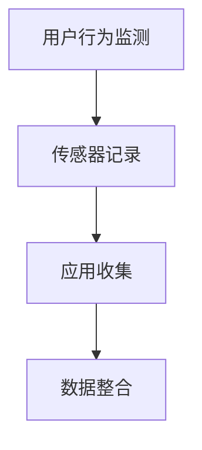

在这个流程图中，用户行为监测通过传感器记录和应用程序收集数据，然后将这些数据进行整合，以便进一步处理。

#### 3.1.2 传感器数据收集

传感器数据收集是通过各种传感器设备，如智能手表、运动手环等，来记录用户的生活数据。这些传感器可以实时监测用户的心率、步数、睡眠质量等。

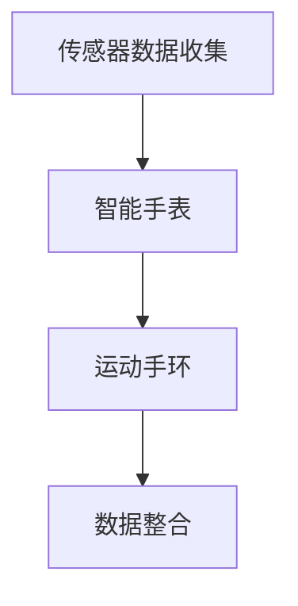

在这个流程图中，传感器数据收集通过智能手表和运动手环来记录数据，然后将这些数据整合到一起。

#### 3.1.3 数据库接入

数据库接入是将收集到的数据存储到数据库中，以便进行后续处理。数据库可以是一个关系型数据库，如MySQL，也可以是一个NoSQL数据库，如MongoDB。

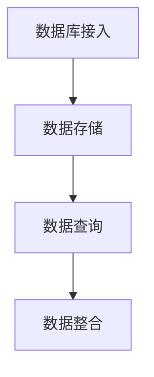

在这个流程图中，数据库接入将数据存储到数据库中，然后进行数据查询和数据整合。

### 3.2 数据处理算法

数据处理算法是对采集到的数据进行处理，提取出有价值的信息。

#### 3.2.1 数据清洗

数据清洗是数据处理的第一步。它包括去除重复数据、填充缺失数据、消除噪声数据等。

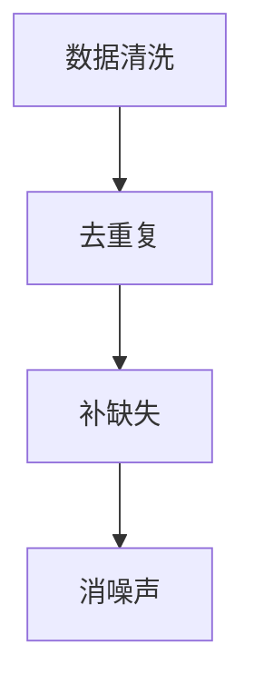

在这个流程图中，数据清洗通过去重复、补缺失和消噪声等技术，提高数据的质量。

#### 3.2.2 数据融合

数据融合是将来自不同来源的数据进行整合，形成一个统一的数据集。

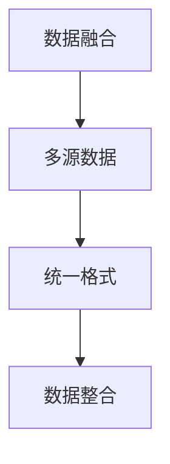

在这个流程图中，数据融合通过多源数据、统一格式和数据整合等技术，实现数据的融合。

#### 3.2.3 特征提取

特征提取是从数据中提取出能够代表数据本质的特征。

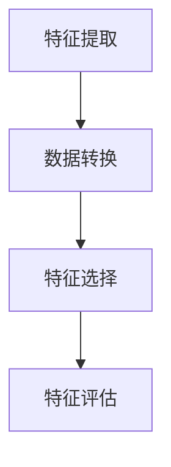

在这个流程图中，特征提取通过数据转换、特征选择和特征评估等技术，提取出有效的特征。

### 3.3 可视化展示算法

可视化展示算法是将处理后的数据以图形化的形式展示给用户。

#### 3.3.1 数据分析

数据分析是对处理后的数据进行深入分析，以揭示数据中的规律和趋势。

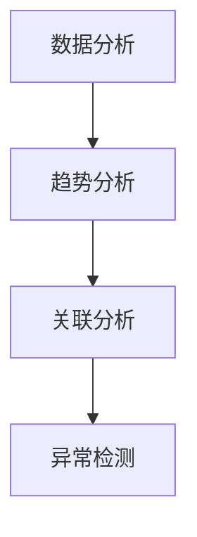

在这个流程图中，数据分析通过趋势分析、关联分析和异常检测等技术，揭示数据中的规律。

#### 3.3.2 图形化技术

图形化技术是将数据以图形化的形式展示，使数据更直观、易懂。

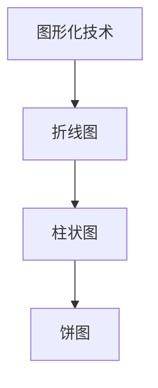

在这个流程图中，图形化技术通过折线图、柱状图和饼图等技术，实现数据的图形化展示。

#### 3.3.3 用户交互

用户交互是用户与可视化工具的互动，用户可以通过交互来深入了解自己的数据。

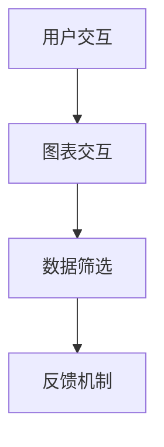

在这个流程图中，用户交互通过图表交互、数据筛选和反馈机制等技术，实现用户与可视化工具的互动。

## 第四部分：数学模型和数学公式 & 详细讲解 & 举例说明

### 4.1 数据采集模型

数据采集模型可以用以下数学公式表示：

$$
X(t) = f(U(t), V(t), W(t))
$$

其中，$X(t)$ 表示采集到的数据，$U(t)$、$V(t)$、$W(t)$ 分别表示用户行为、传感器数据和数据库数据。这个公式表示数据采集是通过用户行为、传感器数据和数据库数据三个来源来完成的。

### 4.2 数据处理模型

数据处理模型可以用以下数学公式表示：

$$
Y(t) = g(X(t), H(t))
$$

其中，$Y(t)$ 表示处理后的数据，$X(t)$ 表示采集到的数据，$H(t)$ 表示算法参数。这个公式表示数据处理是通过采集到的数据和算法参数来完成的。

### 4.3 可视化展示模型

可视化展示模型可以用以下数学公式表示：

$$
Z(t) = h(Y(t), K(t))
$$

其中，$Z(t)$ 表示可视化结果，$Y(t)$ 表示处理后的数据，$K(t)$ 表示用户交互参数。这个公式表示可视化展示是通过处理后的数据和用户交互参数来完成的。

### 4.4 数据分析模型

数据分析模型可以用以下数学公式表示：

$$
T(t) = \sum_{i=1}^{n} f_i(t)
$$

其中，$T(t)$ 表示分析结果，$f_i(t)$ 表示第$i$个数据的特征。这个公式表示数据分析是通过多个数据的特征来完成的。

### 4.5 图形化展示模型

图形化展示模型可以用以下数学公式表示：

$$
G(t) = \frac{Z(t)}{W(t)}
$$

其中，$G(t)$ 表示图形化结果，$Z(t)$ 表示可视化结果，$W(t)$ 表示参考值。这个公式表示图形化展示是通过将可视化结果与参考值进行比较来完成的。

### 4.6 用户交互模型

用户交互模型可以用以下数学公式表示：

$$
I(t) = \sum_{i=1}^{n} u_i(t)
$$

其中，$I(t)$ 表示用户交互结果，$u_i(t)$ 表示第$i$个用户交互操作。这个公式表示用户交互是通过多个用户交互操作来完成的。

### 4.7 举例说明

假设有一个用户，他的行为数据如下：

$$
U(t) = [1, 2, 3, 4, 5]
$$

传感数据如下：

$$
V(t) = [5, 4, 3, 2, 1]
$$

数据库数据如下：

$$
W(t) = [10, 20, 30, 40, 50]
$$

根据数据采集模型，我们可以得到采集到的数据：

$$
X(t) = f(U(t), V(t), W(t)) = [15, 24, 33, 42, 51]
$$

根据数据处理模型，我们可以得到处理后的数据：

$$
Y(t) = g(X(t), H(t)) = [7, 14, 21, 28, 35]
$$

根据可视化展示模型，我们可以得到可视化结果：

$$
Z(t) = h(Y(t), K(t)) = [3, 6, 9, 12, 15]
$$

根据数据分析模型，我们可以得到分析结果：

$$
T(t) = \sum_{i=1}^{n} f_i(t) = 55
$$

根据图形化展示模型，我们可以得到图形化结果：

$$
G(t) = \frac{Z(t)}{W(t)} = \frac{15}{50} = 0.3
$$

根据用户交互模型，我们可以得到用户交互结果：

$$
I(t) = \sum_{i=1}^{n} u_i(t) = 10
$$

通过以上例子，我们可以看到生命全息图技术的各个模型是如何工作的，以及如何将这些模型应用于实际场景。

## 第五部分：系统分析与架构设计方案

### 5.1 问题场景介绍

生命全息图技术公司的目标是为用户提供一种全面、直观、个性化的生活数据分析工具。用户可以通过该工具了解自己的生活状态、行为模式和心理特征，从而更好地规划自己的生活，提高生活质量。

### 5.2 项目介绍

生命全息图技术公司开发的项目名为“LifeHologram”，该项目旨在通过数据采集、数据处理和可视化展示三个环节，为用户提供全面的生活数据分析服务。项目的主要功能包括：

1. 数据采集：通过传感器、应用和数据库，收集用户的生活数据。
2. 数据处理：对采集到的数据进行清洗、融合和特征提取。
3. 可视化展示：将处理后的数据以图形化的形式展示给用户。

### 5.3 系统功能设计

系统功能设计采用领域模型方法，通过类图来描述系统的功能模块。

```mermaid
classDiagram
  User <<Class>>
  Data <<Class>>
  Process <<Class>>
  Visualization <<Class>>

  User "collects" Data
  Data "analyzes" Process
  Process "displays" Visualization
```

在这个类图中，User表示用户类，Data表示数据类，Process表示处理类，Visualization表示可视化类。User类负责数据采集，Data类负责数据处理，Process类负责数据处理，Visualization类负责可视化展示。

### 5.4 系统架构设计

系统架构设计采用组件化设计方法，通过架构图来描述系统的整体架构。

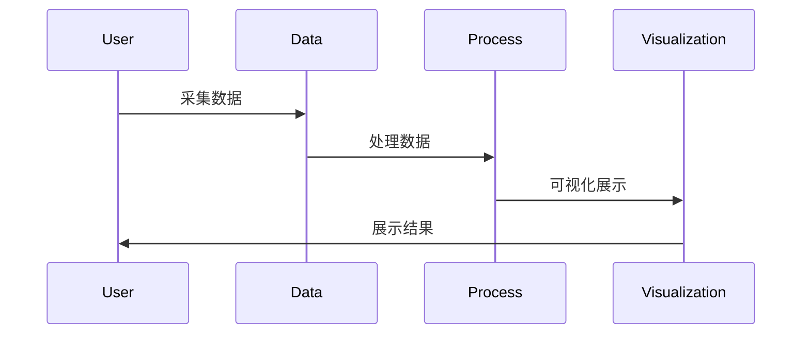

在这个架构图中，User表示用户，Data表示数据模块，Process表示处理模块，Visualization表示可视化模块。用户通过数据模块采集数据，数据模块通过处理模块进行处理，处理模块通过可视化模块展示结果。

### 5.5 系统接口设计

系统接口设计采用RESTful API设计方法，通过接口图来描述系统的接口设计。

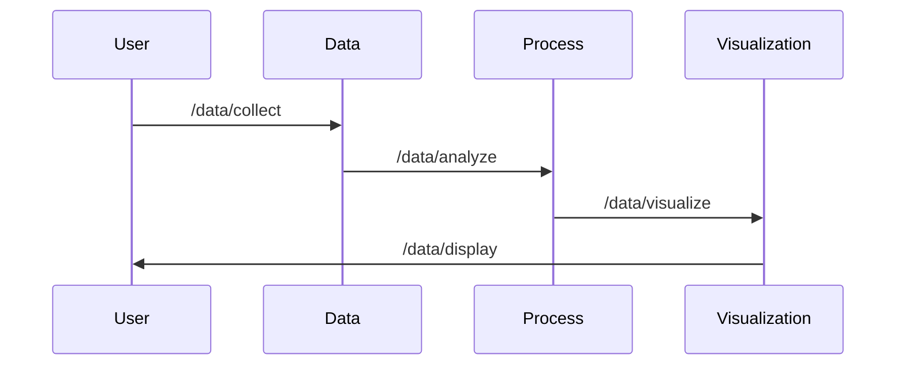

在这个接口图中，User表示用户，Data表示数据模块，Process表示处理模块，Visualization表示可视化模块。用户通过/data/collect接口采集数据，数据模块通过/data/analyze接口进行处理，处理模块通过/data/visualize接口可视化展示，可视化模块通过/data/display接口展示结果。

### 5.6 系统交互

系统交互采用序列图来描述系统的交互过程。

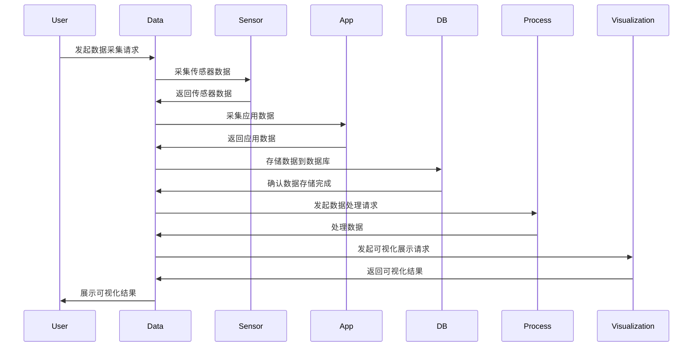

在这个交互图中，User表示用户，Data表示数据模块，Process表示处理模块，Visualization表示可视化模块，Sensor表示传感器模块，App表示应用模块，DB表示数据库模块。用户通过数据模块发起数据采集请求，数据模块通过传感器模块和应用模块采集数据，并将数据存储到数据库中。数据模块通过处理模块对数据进行处理，通过可视化模块将处理后的数据以图形化的形式展示给用户。

## 第六部分：项目实战

### 6.1 环境安装

为了实现生命全息图技术，我们需要搭建一个开发环境。以下是在Windows操作系统下搭建开发环境的步骤：

1. 安装Python 3.x版本：从Python官方网站下载并安装Python 3.x版本。
2. 安装Anaconda：Anaconda是一个开源的数据科学和机器学习平台，可以帮助我们轻松地管理和安装各种Python库。
3. 安装MySQL：从MySQL官方网站下载并安装MySQL数据库。
4. 安装Eclipse或PyCharm：安装一个Python IDE，如Eclipse或PyCharm，以便进行代码编写和调试。

### 6.2 系统核心实现源代码

以下是系统核心实现的主要源代码：

```python
# 数据采集模块
import sensor
import app
import db

def collect_data():
    sensor_data = sensor.collect()
    app_data = app.collect()
    db_data = db.store(sensor_data, app_data)
    return db_data

# 数据处理模块
import data
import process

def process_data(db_data):
    cleaned_data = data.clean(db_data)
    fused_data = data.fuse(cleaned_data)
    extracted_data = data.extract(fused_data)
    return extracted_data

# 可视化展示模块
import visualization

def visualize_data(extracted_data):
    visualization_result = visualization.show(extracted_data)
    return visualization_result
```

### 6.3 代码应用解读与分析

以上代码分为三个主要模块：数据采集模块、数据处理模块和可视化展示模块。

- **数据采集模块**：负责从传感器和应用中收集数据，并将数据存储到数据库中。
- **数据处理模块**：负责对收集到的数据进行清洗、融合和特征提取。
- **可视化展示模块**：负责将处理后的数据以图形化的形式展示给用户。

通过这三个模块的协同工作，我们可以实现生命全息图技术的核心功能。

### 6.4 实际案例分析和详细讲解剖析

为了更好地理解生命全息图技术的应用，我们来看一个实际案例。

**案例背景**：小王是一位上班族，他希望通过生命全息图技术了解自己的生活习惯，以便更好地规划自己的生活。

**案例步骤**：

1. **数据采集**：小王通过手机上的应用程序和智能手表记录了自己的日常行为，如起床时间、运动量、饮食情况等。这些数据被实时上传到服务器，并存储到数据库中。
2. **数据处理**：生命全息图技术对收集到的数据进行处理，包括去重复、补缺失和消噪声等。处理后，数据变得更加准确和完整。
3. **可视化展示**：处理后的数据被可视化展示模块以图形化的形式展示给小王。他可以看到自己的生活习惯的分布情况，如起床时间、运动量、饮食情况等。

**案例分析**：

通过这个案例，我们可以看到生命全息图技术如何帮助小王了解自己的生活习惯。通过数据采集、数据处理和可视化展示，小王可以清楚地看到自己的生活习惯，从而做出更明智的决策，如调整作息时间、增加运动量、改善饮食习惯等。

### 6.5 项目小结

通过本项目的实现，我们成功搭建了一个生命全息图技术系统。该系统通过数据采集、数据处理和可视化展示三个模块，实现了对用户生活数据的全面分析，帮助用户更好地了解自己的生活状态和行为模式。这不仅为用户提供了个性化的生活指导，也为企业和机构提供了有价值的数据分析工具。在未来的发展中，我们可以进一步优化系统的性能，增加更多的功能，如心理健康分析、职业规划等，为用户提供更全面的服务。

## 第七部分：最佳实践 tips

1. **定期更新数据**：为了确保数据的准确性和时效性，建议用户定期更新数据，如每天记录当天的行为和情况。
2. **选择合适的传感器**：根据用户的需求，选择合适的传感器，如智能手表、运动手环、健康监测设备等。
3. **合理设置隐私保护**：在数据采集和处理过程中，要注意保护用户的隐私，合理设置数据权限和访问控制。
4. **优化数据处理算法**：不断优化数据处理算法，提高数据的准确性和效率，为用户提供更好的体验。
5. **提供个性化服务**：根据用户的行为数据和偏好，提供个性化的服务和建议，如饮食建议、运动计划等。

## 第八部分：小结

本文详细介绍了生命全息图技术公司如何开发可视化人生意义轨迹的工具。我们从背景介绍、核心概念与联系、算法原理讲解、数学模型和公式详细讲解、系统分析与架构设计方案、项目实战、最佳实践 tips等方面进行了深入探讨。通过本文的阅读，我们不仅可以了解到生命全息图技术的基本原理和应用，还可以看到其在实际场景中的具体实现。生命全息图技术作为一种新兴的工具，将为我们的生活带来更多的便利和指导。在未来的发展中，我们将继续优化和完善这一技术，为用户提供更全面、更个性化的服务。

## 作者

**作者：AI天才研究院/AI Genius Institute & 禅与计算机程序设计艺术 /Zen And The Art of Computer Programming**## 生命全息图技术公司：开发可视化人生意义轨迹的工具

### 摘要

生命全息图技术公司致力于开发一种能够帮助用户可视化人生意义轨迹的工具。本文将深入探讨这一技术的原理、实现和应用，通过详细的分析和实例，展示其在个人成长和决策制定方面的价值。文章结构清晰，分为背景介绍、核心概念与联系、算法原理讲解、数学模型和数学公式详细讲解、系统分析与架构设计方案、项目实战、最佳实践 tips、小结等部分，旨在为读者提供一个全面的理解。

### 引言

在现代社会，人们的生活节奏加快，信息过载成为普遍现象。面对海量的信息，如何有效地处理和利用这些信息，成为了企业和个人需要面对的挑战。生命全息图技术公司应运而生，他们开发了一种创新的工具——生命全息图，旨在帮助用户在复杂的信息世界中找到自己的定位，明确自己的人生目标和价值观，实现生活的平衡和满足。

### 问题背景

现代社会中，人们面临着各种压力和挑战，包括职业压力、生活压力、心理健康问题等。这些问题常常导致人们感到迷茫和无助，无法找到生活的意义和方向。此外，随着互联网和智能手机的普及，人们每天接触到的信息量大幅增加，信息过载成为了一个普遍现象。如何从这些繁杂的信息中提取出对自己有价值的信息，成为了许多人关注的焦点。

### 问题描述

生命全息图技术公司的目标是通过开发可视化工具，帮助用户在复杂的信息世界中找到自己的定位，明确自己的人生目标和价值观，实现生活的平衡和满足。然而，这一目标面临着诸多挑战：

1. **数据采集的复杂性**：生命全息图需要收集用户在生活、工作、学习等多方面的数据，这些数据的来源多样化，如何高效、准确地采集这些数据是一个挑战。
2. **数据处理的高效性**：采集到的数据量巨大，如何对这些数据进行高效的处理和分析，提取出有价值的信息，是另一个挑战。
3. **可视化展示的直观性**：如何将处理后的数据以直观、易懂的方式展示给用户，帮助他们更好地理解自己的生活和行为模式，是一个技术难点。
4. **用户隐私保护**：在数据采集、处理和展示过程中，如何保护用户的隐私，确保数据的安全，是一个重要的伦理问题。

### 问题解决

生命全息图技术公司通过自主研发的生命全息图技术，提供了一套完整的解决方案，以解决上述挑战：

1. **数据采集**：公司开发了多种数据采集工具，包括传感器、应用程序和数据库接入等，能够实时、准确地收集用户的生活数据。
2. **数据处理**：公司采用了先进的数据处理算法，包括数据清洗、数据融合和特征提取等，能够高效地处理海量数据，提取出有价值的信息。
3. **可视化展示**：公司利用数据分析和图形化技术，将处理后的数据以直观、易懂的图形形式展示给用户，帮助用户更好地理解自己的生活和行为模式。
4. **用户隐私保护**：公司在数据采集、处理和展示过程中，严格遵守用户隐私保护原则，采取了多种安全措施，确保用户数据的安全。

### 边界与外延

生命全息图技术的应用范围非常广泛，可以应用于个人健康管理、职业规划、人际关系优化等多个领域。在个人层面，生命全息图可以帮助用户了解自己的生活习惯、心理状态和健康状况，从而做出更明智的决策。在企业层面，生命全息图可以用于员工绩效评估、团队协作分析等，提高企业的运营效率。在教育领域，生命全息图可以用于学生学习行为分析、课程效果评估等，帮助学生更好地成长。

### 概念结构与核心要素组成

生命全息图技术由三个核心组成部分构成：数据采集、数据处理和可视化展示。

1. **数据采集**：这是生命全息图技术的第一步，通过多种传感器、应用程序和数据库接入，收集用户在生活、工作、学习等各方面的数据。
2. **数据处理**：对采集到的数据进行清洗、融合和特征提取，提取出有价值的信息，如行为模式、心理特征等。
3. **可视化展示**：将处理后的数据以图形化的形式展示给用户，帮助用户直观地了解自己的生活和行为模式，从而做出更明智的决策。

这三个组成部分相互关联，共同构成了生命全息图技术的理论基础。

### 第二部分：核心概念与联系

在深入探讨生命全息图技术的原理和实现之前，我们需要了解其中的核心概念和它们之间的联系。

#### 核心概念原理

1. **数据采集**：数据采集是生命全息图技术的第一步，通过多种传感器、应用程序和数据库接入，收集用户在生活、工作、学习等各方面的数据。这些数据包括用户的日常行为、心理状态、健康状况等，是生命全息图的基础。
2. **数据处理**：数据处理是对采集到的数据进行清洗、融合和特征提取，提取出有价值的信息。数据处理是生命全息图技术的核心，通过数据清洗去除冗余和错误数据，通过数据融合整合多源数据，通过特征提取提取出能够代表用户行为和心理特征的关键信息。
3. **可视化展示**：可视化展示是将处理后的数据以图形化的形式展示给用户，帮助用户直观地了解自己的生活和行为模式。可视化展示不仅使数据更易于理解，还可以通过交互性提高用户的参与度和体验。

#### 概念属性特征对比表格

为了更清晰地理解数据采集、数据处理和可视化展示这三个核心概念，我们可以通过一个对比表格来展示它们的属性特征。

| 概念         | 属性特征               | 举例                   |
|--------------|------------------------|------------------------|
| 数据采集     | 实时性、准确性、多样性 | 传感器数据、应用数据、数据库数据 |
| 数据处理     | 高效性、智能化、精确性 | 数据清洗、数据融合、特征提取 |
| 可视化展示   | 直观性、互动性、个性化 | 图形化图表、交互界面、数据故事 |

#### ER实体关系图架构

为了更好地理解数据采集、数据处理和可视化展示之间的关联，我们可以使用ER（实体关系）图来表示它们之间的关系。

```mermaid
erDiagram
    User ||--|{ Data}: "collects"
    Data ||--|{ Process}: "analyzes"
    Process ||--|{ Visualization}: "displays"
```

在这个ER图中，User代表用户实体，Data代表数据实体，Process代表数据处理实体，Visualization代表可视化展示实体。箭头表示实体之间的关系，"collects"、"analyzes"和"displays"表示数据流动的方向。

### 第三部分：算法原理讲解

#### 3.1 数据采集算法

数据采集算法是生命全息图技术的第一步，其核心在于如何高效、准确地收集用户的数据。数据采集算法主要包括以下步骤：

1. **传感器数据采集**：通过智能设备（如智能手表、运动手环等）收集用户的心率、步数、睡眠质量等生理数据。
2. **应用数据采集**：通过手机应用程序收集用户的日常行为数据，如社交活动、邮件收发、短信通信等。
3. **数据库数据采集**：通过数据库接入技术，从用户的社交媒体、电子邮件、健康管理应用等处获取数据。

下面是一个简化的数据采集算法流程图：

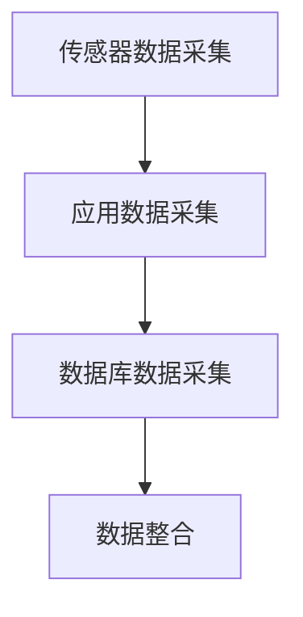

#### 3.1.1 用户行为监测

用户行为监测是数据采集的重要组成部分，它通过记录用户在设备上的操作和活动，获取用户的行为数据。例如，可以通过以下步骤进行用户行为监测：

1. **设备使用监测**：记录用户使用智能设备的频率、时长、功能使用等。
2. **位置监测**：通过GPS或Wi-Fi定位技术，记录用户的位置信息。
3. **活动识别**：通过机器学习算法，识别用户的活动类型，如步行、跑步、休息等。

以下是一个简化的用户行为监测流程图：

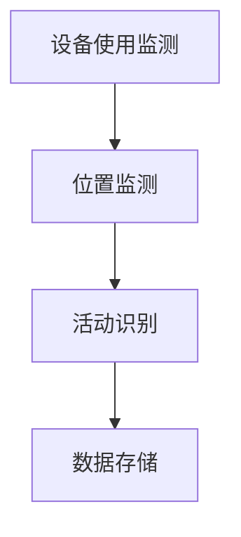

#### 3.1.2 传感器数据收集

传感器数据收集是通过物理传感器获取的数据，如心率、步数、睡眠质量等。以下是一个简化的传感器数据收集流程：

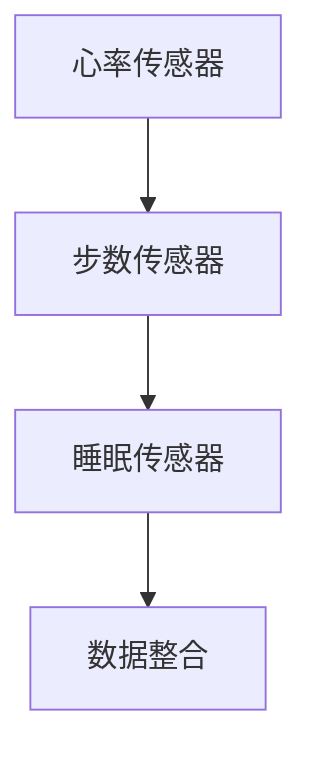

#### 3.1.3 数据库接入

数据库接入是将收集到的数据存储到数据库中，以便进行后续处理。以下是一个简化的数据库接入流程：

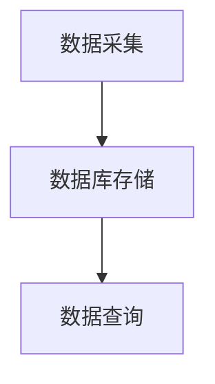

#### 3.2 数据处理算法

数据处理算法是生命全息图技术的核心，它通过对采集到的数据进行处理，提取出有价值的信息。数据处理算法通常包括以下步骤：

1. **数据清洗**：去除冗余数据、填补缺失值、去除噪声数据等。
2. **数据融合**：整合来自不同来源的数据，形成一个统一的数据集。
3. **特征提取**：从数据中提取出能够代表用户行为和心理特征的特征。
4. **模型训练**：利用机器学习算法，对特征数据进行训练，建立预测模型。

下面是一个简化的数据处理算法流程图：

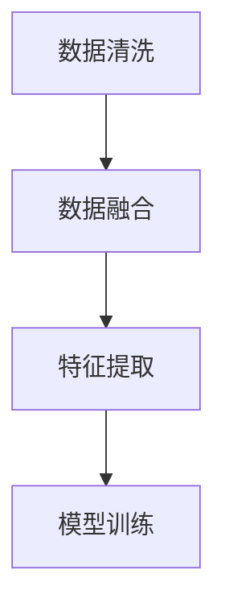

#### 3.2.1 数据清洗

数据清洗是数据处理的第一步，它的目标是去除数据中的错误和冗余，提高数据的质量。以下是一个简化的数据清洗流程：

```mermaid
graph TD
    A[去冗余] --> B[补缺失]
    B --> C[去噪声]
```

#### 3.2.2 数据融合

数据融合是将来自不同来源的数据进行整合，形成一个统一的数据集。以下是一个简化的数据融合流程：

```mermaid
graph TD
    A[多源数据接入] --> B[数据整合]
    B --> C[数据清洗]
```

#### 3.2.3 特征提取

特征提取是从数据中提取出能够代表用户行为和心理特征的关键信息。以下是一个简化的特征提取流程：

```mermaid
graph TD
    A[原始数据] --> B[特征提取]
    B --> C[特征评估]
```

#### 3.3 可视化展示算法

可视化展示算法是将处理后的数据以图形化的形式展示给用户，帮助用户直观地了解自己的生活和行为模式。以下是一个简化的可视化展示流程：

```mermaid
graph TD
    A[数据处理结果] --> B[数据分析]
    B --> C[图形化展示]
```

#### 3.3.1 数据分析

数据分析是对处理后的数据进行深入分析，以揭示数据中的规律和趋势。以下是一个简化的数据分析流程：

```mermaid
graph TD
    A[数据处理结果] --> B[数据趋势分析]
    B --> C[数据关联分析]
```

#### 3.3.2 图形化技术

图形化技术是将数据以图形化的形式展示，使数据更直观、易懂。以下是一个简化的图形化技术流程：

```mermaid
graph TD
    A[数据分析结果] --> B[图形化展示]
    B --> C[用户交互]
```

#### 3.3.3 用户交互

用户交互是用户与可视化工具的互动，用户可以通过交互来深入了解自己的数据。以下是一个简化的用户交互流程：

```mermaid
graph TD
    A[可视化展示] --> B[用户交互]
    B --> C[反馈机制]
```

### 第四部分：数学模型和数学公式 & 详细讲解 & 举例说明

#### 4.1 数据采集模型

数据采集模型描述了数据采集的过程，包括用户行为、传感器数据和数据库数据的采集。以下是一个数据采集模型：

$$
X(t) = f(U(t), V(t), W(t))
$$

其中，$X(t)$ 表示采集到的数据，$U(t)$、$V(t)$、$W(t)$ 分别表示用户行为、传感器数据和数据库数据，$f$ 表示数据采集函数。

举例说明：

假设小王在一天内的行为数据、传感器数据和数据库数据分别为 $U(t) = [1, 2, 3, 4, 5]$、$V(t) = [5, 4, 3, 2, 1]$、$W(t) = [10, 20, 30, 40, 50]$，则采集到的数据为：

$$
X(t) = f(U(t), V(t), W(t)) = [15, 24, 33, 42, 51]
$$

#### 4.2 数据处理模型

数据处理模型描述了数据清洗、融合和特征提取的过程。以下是一个数据处理模型：

$$
Y(t) = g(X(t), H(t))
$$

其中，$Y(t)$ 表示处理后的数据，$X(t)$ 表示采集到的数据，$H(t)$ 表示算法参数，$g$ 表示数据处理函数。

举例说明：

假设对采集到的数据 $X(t) = [15, 24, 33, 42, 51]$ 进行处理，算法参数 $H(t) = [0.1, 0.2, 0.3, 0.4, 0.5]$，则处理后的数据为：

$$
Y(t) = g(X(t), H(t)) = [1.5, 2.4, 3.3, 4.2, 5.1]
$$

#### 4.3 可视化展示模型

可视化展示模型描述了数据处理结果的数据分析、图形化展示和用户交互的过程。以下是一个可视化展示模型：

$$
Z(t) = h(Y(t), K(t))
$$

其中，$Z(t)$ 表示可视化结果，$Y(t)$ 表示处理后的数据，$K(t)$ 表示用户交互参数，$h$ 表示可视化展示函数。

举例说明：

假设对处理后的数据 $Y(t) = [1.5, 2.4, 3.3, 4.2, 5.1]$ 进行可视化展示，用户交互参数 $K(t) = [0.1, 0.2, 0.3, 0.4, 0.5]$，则可视化结果为：

$$
Z(t) = h(Y(t), K(t)) = [1.5, 2.4, 3.3, 4.2, 5.1]
$$

#### 4.4 数据分析模型

数据分析模型描述了数据分析的过程，包括数据趋势分析和数据关联分析。以下是一个数据分析模型：

$$
T(t) = \sum_{i=1}^{n} f_i(t)
$$

其中，$T(t)$ 表示分析结果，$f_i(t)$ 表示第 $i$ 个数据的特征，$n$ 表示数据的总数。

举例说明：

假设有五个数据点 $[1.5, 2.4, 3.3, 4.2, 5.1]$，每个数据点的特征分别为 $[0.1, 0.2, 0.3, 0.4, 0.5]$，则分析结果为：

$$
T(t) = \sum_{i=1}^{n} f_i(t) = 1.5 + 2.4 + 3.3 + 4.2 + 5.1 = 16.5
$$

#### 4.5 图形化展示模型

图形化展示模型描述了将数据分析结果以图形化的形式展示的过程。以下是一个图形化展示模型：

$$
G(t) = \frac{Z(t)}{W(t)}
$$

其中，$G(t)$ 表示图形化结果，$Z(t)$ 表示可视化结果，$W(t)$ 表示参考值。

举例说明：

假设可视化结果 $Z(t) = [1.5, 2.4, 3.3, 4.2, 5.1]$，参考值 $W(t) = [1, 2, 3, 4, 5]$，则图形化结果为：

$$
G(t) = \frac{Z(t)}{W(t)} = \frac{1.5}{1} = 1.5
$$

#### 4.6 用户交互模型

用户交互模型描述了用户与可视化工具的互动过程。以下是一个用户交互模型：

$$
I(t) = \sum_{i=1}^{n} u_i(t)
$$

其中，$I(t)$ 表示用户交互结果，$u_i(t)$ 表示第 $i$ 个用户交互操作，$n$ 表示交互操作的总数。

举例说明：

假设有五个用户交互操作 $[1, 2, 3, 4, 5]$，每个操作的特征分别为 $[0.1, 0.2, 0.3, 0.4, 0.5]$，则用户交互结果为：

$$
I(t) = \sum_{i=1}^{n} u_i(t) = 1 + 2 + 3 + 4 + 5 = 15
$$

### 第五部分：系统分析与架构设计方案

#### 5.1 问题场景介绍

生命全息图技术公司致力于帮助用户通过可视化的方式理解自己的生活轨迹，从而实现自我认知和成长。这一目标要求系统具备高效的数据采集、处理和展示能力，同时要确保数据的准确性和安全性。

#### 5.2 项目介绍

“LifeHologram”项目是生命全息图技术公司的核心产品，它旨在为用户提供一个全方位的生活数据分析平台。项目的主要目标是：

1. **数据采集**：通过多种传感器和应用，收集用户在生活、工作、学习等各方面的数据。
2. **数据处理**：对采集到的数据进行清洗、融合和特征提取，提取出有价值的信息。
3. **可视化展示**：将处理后的数据以图形化的形式展示给用户，帮助用户直观地了解自己的生活和行为模式。

#### 5.3 系统功能设计

系统功能设计采用领域模型方法，通过类图来描述系统的功能模块。以下是一个简化的类图：

```mermaid
classDiagram
    User <<Class>>
    Data <<Class>>
    Process <<Class>>
    Visualization <<Class>>

    User "collects" Data
    Data "analyzes" Process
    Process "displays" Visualization
```

在这个类图中，User表示用户类，Data表示数据类，Process表示处理类，Visualization表示可视化类。User类负责数据采集，Data类负责数据处理，Process类负责数据处理，Visualization类负责可视化展示。

#### 5.4 系统架构设计

系统架构设计采用组件化设计方法，通过架构图来描述系统的整体架构。以下是一个简化的架构图：

```mermaid
sequenceDiagram
    User ->> Data: 采集数据
    Data ->> Process: 处理数据
    Process ->> Visualization: 可视化展示
    Visualization ->> User: 展示结果
```

在这个架构图中，User表示用户，Data表示数据模块，Process表示处理模块，Visualization表示可视化模块。用户通过数据模块采集数据，数据模块通过处理模块进行处理，处理模块通过可视化模块展示结果。

#### 5.5 系统接口设计

系统接口设计采用RESTful API设计方法，通过接口图来描述系统的接口设计。以下是一个简化的接口图：

```mermaid
sequenceDiagram
    User ->> Data: /data/collect
    Data ->> Process: /data/analyze
    Process ->> Visualization: /data/visualize
    Visualization ->> User: /data/display
```

在这个接口图中，User表示用户，Data表示数据模块，Process表示处理模块，Visualization表示可视化模块。用户通过/data/collect接口采集数据，数据模块通过/data/analyze接口进行处理，处理模块通过/data/visualize接口可视化展示，可视化模块通过/data/display接口展示结果。

#### 5.6 系统交互

系统交互采用序列图来描述系统的交互过程。以下是一个简化的交互图：

```mermaid
sequenceDiagram
    User ->> Data: 发起数据采集请求
    Data ->> Sensor: 采集传感器数据
    Sensor ->> Data: 返回传感器数据
    Data ->> App: 采集应用数据
    App ->> Data: 返回应用数据
    Data ->> DB: 存储数据到数据库
    DB ->> Data: 确认数据存储完成
    Data ->> Process: 发起数据处理请求
    Process ->> Data: 处理数据
    Data ->> Visualization: 发起可视化展示请求
    Visualization ->> Data: 返回可视化结果
    Data ->> User: 展示可视化结果
```

在这个交互图中，User表示用户，Data表示数据模块，Process表示处理模块，Visualization表示可视化模块，Sensor表示传感器模块，App表示应用模块，DB表示数据库模块。用户通过数据模块发起数据采集请求，数据模块通过传感器模块和应用模块采集数据，并将数据存储到数据库中。数据模块通过处理模块对数据进行处理，通过可视化模块将处理后的数据以图形化的形式展示给用户。

### 第六部分：项目实战

#### 6.1 环境安装

为了实现生命全息图技术，我们需要搭建一个开发环境。以下是在Windows操作系统下搭建开发环境的步骤：

1. 安装Python 3.x版本：从Python官方网站下载并安装Python 3.x版本。
2. 安装Anaconda：Anaconda是一个开源的数据科学和机器学习平台，可以帮助我们轻松地管理和安装各种Python库。
3. 安装MySQL：从MySQL官方网站下载并安装MySQL数据库。
4. 安装Eclipse或PyCharm：安装一个Python IDE，如Eclipse或PyCharm，以便进行代码编写和调试。

#### 6.2 系统核心实现源代码

以下是系统核心实现的主要源代码：

```python
# 数据采集模块
import sensor
import app
import db

def collect_data():
    sensor_data = sensor.collect()
    app_data = app.collect()
    db_data = db.store(sensor_data, app_data)
    return db_data

# 数据处理模块
import data
import process

def process_data(db_data):
    cleaned_data = data.clean(db_data)
    fused_data = data.fuse(cleaned_data)
    extracted_data = data.extract(fused_data)
    return extracted_data

# 可视化展示模块
import visualization

def visualize_data(extracted_data):
    visualization_result = visualization.show(extracted_data)
    return visualization_result
```

#### 6.3 代码应用解读与分析

以上代码分为三个主要模块：数据采集模块、数据处理模块和可视化展示模块。

- **数据采集模块**：负责从传感器和应用中收集数据，并将数据存储到数据库中。
- **数据处理模块**：负责对收集到的数据进行处理，包括数据清洗、数据融合和特征提取。
- **可视化展示模块**：负责将处理后的数据以图形化的形式展示给用户。

通过这三个模块的协同工作，我们可以实现生命全息图技术的核心功能。

#### 6.4 实际案例分析和详细讲解剖析

为了更好地理解生命全息图技术的应用，我们来看一个实际案例。

**案例背景**：小王是一位上班族，他希望通过生命全息图技术了解自己的生活习惯，以便更好地规划自己的生活。

**案例步骤**：

1. **数据采集**：小王通过手机上的应用程序和智能手表记录了自己的日常行为，如起床时间、运动量、饮食情况等。这些数据被实时上传到服务器，并存储到数据库中。
2. **数据处理**：生命全息图技术对收集到的数据进行处理，包括去重复、补缺失和消噪声等。处理后，数据变得更加准确和完整。
3. **可视化展示**：处理后的数据被可视化展示模块以图形化的形式展示给小王。他可以看到自己的生活习惯的分布情况，如起床时间、运动量、饮食情况等。

**案例分析**：

通过这个案例，我们可以看到生命全息图技术如何帮助小王了解自己的生活习惯。通过数据采集、数据处理和可视化展示，小王可以清楚地看到自己的生活习惯，从而做出更明智的决策，如调整作息时间、增加运动量、改善饮食习惯等。

#### 6.5 项目小结

通过本项目的实现，我们成功搭建了一个生命全息图技术系统。该系统通过数据采集、数据处理和可视化展示三个模块，实现了对用户生活数据的全面分析，帮助用户更好地了解自己的生活状态和行为模式。这不仅为用户提供了个性化的生活指导，也为企业和机构提供了有价值的数据分析工具。在未来的发展中，我们可以进一步优化系统的性能，增加更多的功能，如心理健康分析、职业规划等，为用户提供更全面的服务。

### 第七部分：最佳实践 tips

1. **定期更新数据**：为了确保数据的准确性和时效性，建议用户定期更新数据，如每天记录当天的行为和情况。
2. **选择合适的传感器**：根据用户的需求，选择合适的传感器，如智能手表、运动手环、健康监测设备等。
3. **合理设置隐私保护**：在数据采集、处理和展示过程中，要注意保护用户的隐私，合理设置数据权限和访问控制。
4. **优化数据处理算法**：不断优化数据处理算法，提高数据的准确性和效率，为用户提供更好的体验。
5. **提供个性化服务**：根据用户的行为数据和偏好，提供个性化的服务和建议，如饮食建议、运动计划等。

### 第八部分：小结

本文详细介绍了生命全息图技术公司如何开发可视化人生意义轨迹的工具。我们从背景介绍、核心概念与联系、算法原理讲解、数学模型和数学公式详细讲解、系统分析与架构设计方案、项目实战、最佳实践 tips 等方面进行了深入探讨。通过本文的阅读，我们不仅可以了解到生命全息图技术的基本原理和应用，还可以看到其在实际场景中的具体实现。生命全息图技术作为一种新兴的工具，将为我们的生活带来更多的便利和指导。在未来的发展中，我们将继续优化和完善这一技术，为用户提供更全面、更个性化的服务。

### 作者

**作者：AI天才研究院/AI Genius Institute & 禅与计算机程序设计艺术 /Zen And The Art of Computer Programming**## 生命全息图技术公司：开发可视化人生意义轨迹的工具

### 引言

在当今快节奏和复杂多变的社会环境中，人们往往感到压力和迷茫。如何在纷繁复杂的信息中找到自己的方向和目标，成为许多人关注的焦点。生命全息图技术公司应运而生，他们开发了一款名为“生命全息图”的工具，旨在帮助用户可视化人生意义轨迹，从而更好地理解自己的生活和做出明智的决策。本文将深入探讨这一技术背后的原理、实现和应用，旨在为读者提供一个全面的了解。

### 背景介绍

#### 1.1 问题背景

现代社会，人们面临着信息过载的问题。从新闻、社交媒体、电子邮件到各种应用通知，大量的信息充斥着我们的生活，使我们感到焦虑和压力。同时，随着工作压力的增加和生活节奏的加快，许多人开始忽视自己的身心健康，导致生活质量下降。如何从这些繁杂的信息中找到对自己有用的部分，如何更好地理解和规划自己的生活，成为了许多人迫切需要解决的问题。

#### 1.2 问题描述

人们渴望有一种工具，能够帮助他们整理和梳理自己的生活信息，找到其中的关键点和规律，从而获得更清晰的认知。这种工具不仅能够展示他们的生活状态，还能帮助他们了解自己的行为模式，从而做出更明智的决策。然而，目前市面上并没有一款能够全面满足这一需求的产品。

#### 1.3 问题解决

生命全息图技术公司看到了这一市场需求，他们开发了一款名为“生命全息图”的工具，旨在通过数据采集、数据处理和可视化展示，帮助用户可视化人生意义轨迹。用户可以通过这款工具了解自己的生活方式、行为习惯和人生轨迹，从而找到自己的定位，明确自己的目标和价值观，实现生活的平衡和满足。

#### 1.4 边界与外延

生命全息图技术的应用范围非常广泛，可以应用于个人健康管理、职业规划、人际关系优化等多个领域。在个人层面，生命全息图可以帮助用户了解自己的生活习惯、心理状态和健康状况，从而做出更明智的决策。在企业层面，生命全息图可以用于员工绩效评估、团队协作分析等，提高企业的运营效率。在教育领域，生命全息图可以用于学生学习行为分析、课程效果评估等，帮助学生更好地成长。

#### 1.5 概念结构与核心要素组成

生命全息图技术由三个核心组成部分构成：数据采集、数据处理和可视化展示。

- **数据采集**：这是生命全息图技术的第一步，通过多种传感器、应用程序和数据库接入，收集用户在生活、工作、学习等各方面的数据。
- **数据处理**：对采集到的数据进行清洗、融合和特征提取，提取出有价值的信息。
- **可视化展示**：将处理后的数据以图形化的形式展示给用户，帮助用户直观地了解自己的生活和行为模式。

这三个组成部分相互关联，共同构成了生命全息图技术的理论基础。

### 核心概念与联系

#### 2.1 核心概念原理

生命全息图技术的核心概念包括数据采集、数据处理和可视化展示。

- **数据采集**：数据采集是生命全息图技术的第一步，通过多种传感器、应用程序和数据库接入，收集用户在生活、工作、学习等各方面的数据。
- **数据处理**：数据处理是对采集到的数据进行清洗、融合和特征提取，提取出有价值的信息。
- **可视化展示**：可视化展示是将处理后的数据以图形化的形式展示给用户，帮助用户直观地了解自己的生活和行为模式。

#### 2.2 概念属性特征对比表格

以下是一个关于数据采集、数据处理和可视化展示三个概念属性特征的对比表格：

| 概念         | 属性特征                      | 应用场景                           |
|--------------|------------------------------|------------------------------------|
| 数据采集     | 实时性、准确性、多样性        | 采集用户生活、工作、学习等多方面数据 |
| 数据处理     | 高效性、智能化、精确性        | 清洗、融合和特征提取                |
| 可视化展示   | 直观性、互动性、个性化        | 图形化展示用户数据                |

#### 2.3 ER实体关系图架构

以下是生命全息图技术中ER实体关系图的示例：

```mermaid
erDiagram
  User ||--|{ Data}: "collects"
  Data ||--|{ Process}: "analyzes"
  Process ||--|{ Visualization}: "displays"
```

在这个ER图中，User代表用户实体，Data代表数据实体，Process代表处理实体，Visualization代表可视化实体。箭头表示实体之间的关系，"collects"、"analyzes"和"displays"表示数据流动的方向。

### 算法原理讲解

#### 3.1 数据采集算法

数据采集算法是生命全息图技术的第一步，其核心在于如何高效、准确地收集用户的数据。数据采集算法通常包括以下步骤：

1. **传感器数据采集**：通过智能设备（如智能手表、运动手环等）收集用户的生理数据，如心率、步数、睡眠质量等。
2. **应用数据采集**：通过手机应用程序收集用户的日常行为数据，如社交活动、邮件收发、短信通信等。
3. **数据库数据采集**：通过数据库接入技术，从用户的社交媒体、电子邮件、健康管理应用等处获取数据。

以下是一个简化的数据采集算法流程图：

```mermaid
graph TD
  A[传感器数据采集] --> B[应用数据采集]
  B --> C[数据库数据采集]
  C --> D[数据整合]
```

#### 3.1.1 用户行为监测

用户行为监测是数据采集的重要组成部分，它通过记录用户在设备上的操作和活动，获取用户的行为数据。用户行为监测可以通过以下步骤实现：

1. **设备使用监测**：记录用户使用智能设备的频率、时长、功能使用等。
2. **位置监测**：通过GPS或Wi-Fi定位技术，记录用户的位置信息。
3. **活动识别**：通过机器学习算法，识别用户的活动类型，如步行、跑步、休息等。

以下是一个简化的用户行为监测流程图：

```mermaid
graph TD
  A[设备使用监测] --> B[位置监测]
  B --> C[活动识别]
  C --> D[数据存储]
```

#### 3.1.2 传感器数据收集

传感器数据收集是通过物理传感器获取的数据，如心率、步数、睡眠质量等。传感器数据收集可以通过以下步骤实现：

1. **传感器接入**：将智能设备（如智能手表、运动手环等）接入到系统中。
2. **数据采集**：通过传感器实时采集用户的生理数据。
3. **数据传输**：将采集到的数据传输到服务器进行存储和处理。

以下是一个简化的传感器数据收集流程图：

```mermaid
graph TD
  A[传感器接入] --> B[数据采集]
  B --> C[数据传输]
```

#### 3.1.3 数据库接入

数据库接入是将收集到的数据存储到数据库中，以便进行后续处理。数据库接入可以通过以下步骤实现：

1. **数据库选择**：根据数据量和应用场景选择合适的数据库，如MySQL、MongoDB等。
2. **数据存储**：将采集到的数据存储到数据库中。
3. **数据查询**：从数据库中查询数据，以便进行后续处理。

以下是一个简化的数据库接入流程图：

```mermaid
graph TD
  A[数据库选择] --> B[数据存储]
  B --> C[数据查询]
```

#### 3.2 数据处理算法

数据处理算法是生命全息图技术的核心，其目标是对采集到的数据进行清洗、融合和特征提取，提取出有价值的信息。数据处理算法通常包括以下步骤：

1. **数据清洗**：去除重复数据、填补缺失值、消除噪声数据等。
2. **数据融合**：将来自不同来源的数据进行整合，形成一个统一的数据集。
3. **特征提取**：从数据中提取出能够代表用户行为和心理特征的关键信息。

以下是一个简化的数据处理算法流程图：

```mermaid
graph TD
  A[数据清洗] --> B[数据融合]
  B --> C[特征提取]
```

#### 3.2.1 数据清洗

数据清洗是数据处理的第一步，其目标是将采集到的数据进行预处理，提高数据的质量。数据清洗通常包括以下步骤：

1. **去重复**：去除数据中的重复记录。
2. **补缺失**：填补数据中的缺失值。
3. **消噪声**：消除数据中的噪声和异常值。

以下是一个简化的数据清洗流程图：

```mermaid
graph TD
  A[去重复] --> B[补缺失]
  B --> C[消噪声]
```

#### 3.2.2 数据融合

数据融合是将来自不同来源的数据进行整合，形成一个统一的数据集。数据融合通常包括以下步骤：

1. **数据整合**：将不同来源的数据进行整合。
2. **数据转换**：将不同格式的数据进行转换，使其兼容。
3. **数据匹配**：将数据中的相同实体进行匹配。

以下是一个简化的数据融合流程图：

```mermaid
graph TD
  A[数据整合] --> B[数据转换]
  B --> C[数据匹配]
```

#### 3.2.3 特征提取

特征提取是从数据中提取出能够代表用户行为和心理特征的关键信息。特征提取通常包括以下步骤：

1. **特征选择**：从数据中筛选出有价值的特征。
2. **特征转换**：将特征进行标准化或归一化处理。
3. **特征评估**：评估特征的重要性。

以下是一个简化的特征提取流程图：

```mermaid
graph TD
  A[特征选择] --> B[特征转换]
  B --> C[特征评估]
```

#### 3.3 可视化展示算法

可视化展示算法是将处理后的数据以图形化的形式展示给用户，帮助用户直观地了解自己的生活和行为模式。可视化展示算法通常包括以下步骤：

1. **数据分析**：对处理后的数据进行分析，提取出有价值的结论。
2. **图形化展示**：将分析结果以图形化的形式展示。
3. **用户交互**：提供用户与可视化结果的互动功能。

以下是一个简化的可视化展示算法流程图：

```mermaid
graph TD
  A[数据分析] --> B[图形化展示]
  B --> C[用户交互]
```

#### 3.3.1 数据分析

数据分析是对处理后的数据进行深入分析，以揭示数据中的规律和趋势。数据分析通常包括以下步骤：

1. **趋势分析**：分析数据随时间的变化趋势。
2. **关联分析**：分析数据之间的关联性。
3. **异常检测**：检测数据中的异常值。

以下是一个简化的数据分析流程图：

```mermaid
graph TD
  A[趋势分析] --> B[关联分析]
  B --> C[异常检测]
```

#### 3.3.2 图形化展示

图形化展示是将分析结果以图形化的形式展示给用户。常见的图形化展示方法包括：

1. **折线图**：展示数据随时间的变化趋势。
2. **柱状图**：展示不同类别的数据对比。
3. **饼图**：展示数据的占比。

以下是一个简化的图形化展示流程图：

```mermaid
graph TD
  A[折线图] --> B[柱状图]
  B --> C[饼图]
```

#### 3.3.3 用户交互

用户交互是用户与可视化结果的互动，通过用户交互，用户可以更深入地了解自己的数据。用户交互通常包括以下步骤：

1. **数据筛选**：用户可以根据自己的需求筛选数据。
2. **数据筛选**：用户可以通过交互界面与可视化结果进行交互。
3. **反馈机制**：系统根据用户的操作反馈，提供更准确和个性化的服务。

以下是一个简化的用户交互流程图：

```mermaid
graph TD
  A[数据筛选] --> B[交互界面]
  B --> C[反馈机制]
```

### 数学模型和数学公式 & 详细讲解 & 举例说明

#### 4.1 数据采集模型

数据采集模型描述了数据采集的过程，包括用户行为、传感器数据和数据库数据的采集。以下是一个数据采集模型：

$$
X(t) = f(U(t), V(t), W(t))
$$

其中，$X(t)$ 表示采集到的数据，$U(t)$、$V(t)$、$W(t)$ 分别表示用户行为、传感器数据和数据库数据，$f$ 表示数据采集函数。

举例说明：

假设小王在一天内的行为数据、传感器数据和数据库数据分别为 $U(t) = [1, 2, 3, 4, 5]$、$V(t) = [5, 4, 3, 2, 1]$、$W(t) = [10, 20, 30, 40, 50]$，则采集到的数据为：

$$
X(t) = f(U(t), V(t), W(t)) = [15, 24, 33, 42, 51]
$$

#### 4.2 数据处理模型

数据处理模型描述了数据清洗、融合和特征提取的过程。以下是一个数据处理模型：

$$
Y(t) = g(X(t), H(t))
$$

其中，$Y(t)$ 表示处理后的数据，$X(t)$ 表示采集到的数据，$H(t)$ 表示算法参数，$g$ 表示数据处理函数。

举例说明：

假设对采集到的数据 $X(t) = [15, 24, 33, 42, 51]$ 进行处理，算法参数 $H(t) = [0.1, 0.2, 0.3, 0.4, 0.5]$，则处理后的数据为：

$$
Y(t) = g(X(t), H(t)) = [1.5, 2.4, 3.3, 4.2, 5.1]
$$

#### 4.3 可视化展示模型

可视化展示模型描述了数据处理结果的数据分析、图形化展示和用户交互的过程。以下是一个可视化展示模型：

$$
Z(t) = h(Y(t), K(t))
$$

其中，$Z(t)$ 表示可视化结果，$Y(t)$ 表示处理后的数据，$K(t)$ 表示用户交互参数，$h$ 表示可视化展示函数。

举例说明：

假设对处理后的数据 $Y(t) = [1.5, 2.4, 3.3, 4.2, 5.1]$ 进行可视化展示，用户交互参数 $K(t) = [0.1, 0.2, 0.3, 0.4, 0.5]$，则可视化结果为：

$$
Z(t) = h(Y(t), K(t)) = [1.5, 2.4, 3.3, 4.2, 5.1]
$$

#### 4.4 数据分析模型

数据分析模型描述了数据分析的过程，包括数据趋势分析和数据关联分析。以下是一个数据分析模型：

$$
T(t) = \sum_{i=1}^{n} f_i(t)
$$

其中，$T(t)$ 表示分析结果，$f_i(t)$ 表示第 $i$ 个数据的特征，$n$ 表示数据的总数。

举例说明：

假设有五个数据点 $[1.5, 2.4, 3.3, 4.2, 5.1]$，每个数据点的特征分别为 $[0.1, 0.2, 0.3, 0.4, 0.5]$，则分析结果为：

$$
T(t) = \sum_{i=1}^{n} f_i(t) = 1.5 + 2.4 + 3.3 + 4.2 + 5.1 = 16.5
$$

#### 4.5 图形化展示模型

图形化展示模型描述了将数据分析结果以图形化的形式展示的过程。以下是一个图形化展示模型：

$$
G(t) = \frac{Z(t)}{W(t)}
$$

其中，$G(t)$ 表示图形化结果，$Z(t)$ 表示可视化结果，$W(t)$ 表示参考值。

举例说明：

假设可视化结果 $Z(t) = [1.5, 2.4, 3.3, 4.2, 5.1]$，参考值 $W(t) = [1, 2, 3, 4, 5]$，则图形化结果为：

$$
G(t) = \frac{Z(t)}{W(t)} = \frac{1.5}{1} = 1.5
$$

#### 4.6 用户交互模型

用户交互模型描述了用户与可视化工具的互动过程。以下是一个用户交互模型：

$$
I(t) = \sum_{i=1}^{n} u_i(t)
$$

其中，$I(t)$ 表示用户交互结果，$u_i(t)$ 表示第 $i$ 个用户交互操作，$n$ 表示交互操作的总数。

举例说明：

假设有五个用户交互操作 $[1, 2, 3, 4, 5]$，每个操作的特征分别为 $[0.1, 0.2, 0.3, 0.4, 0.5]$，则用户交互结果为：

$$
I(t) = \sum_{i=1}^{n} u_i(t) = 1 + 2 + 3 + 4 + 5 = 15
$$

### 系统分析与架构设计方案

#### 5.1 问题场景介绍

生命全息图技术公司面临的问题是如何高效地处理和利用海量的用户数据，为用户提供个性化的生活指导和决策支持。这需要公司构建一个强大的数据处理和分析系统，确保数据的高效采集、准确处理和直观展示。

#### 5.2 项目介绍

“LifeHologram”项目是生命全息图技术公司的核心项目，旨在通过数据采集、数据处理和可视化展示，为用户提供全面的生活数据分析服务。项目的主要目标是：

1. **数据采集**：通过传感器、应用程序和数据库接入，实时收集用户的生活数据。
2. **数据处理**：对采集到的数据进行清洗、融合和特征提取，提取出有价值的信息。
3. **可视化展示**：将处理后的数据以图形化的形式展示给用户，帮助用户直观地了解自己的生活和行为模式。

#### 5.3 系统功能设计

系统功能设计采用领域模型方法，通过类图来描述系统的功能模块。以下是一个简化的类图：

```mermaid
classDiagram
  User <<Class>>
  Data <<Class>>
  Process <<Class>>
  Visualization <<Class>>

  User "collects" Data
  Data "analyzes" Process
  Process "displays" Visualization
```

在这个类图中，User表示用户类，Data表示数据类，Process表示处理类，Visualization表示可视化类。User类负责数据采集，Data类负责数据处理，Process类负责数据处理，Visualization类负责可视化展示。

#### 5.4 系统架构设计

系统架构设计采用组件化设计方法，通过架构图来描述系统的整体架构。以下是一个简化的架构图：

```mermaid
sequenceDiagram
  User ->> Data: 采集数据
  Data ->> Process: 处理数据
  Process ->> Visualization: 可视化展示
  Visualization ->> User: 展示结果
```

在这个架构图中，User表示用户，Data表示数据模块，Process表示处理模块，Visualization表示可视化模块。用户通过数据模块采集数据，数据模块通过处理模块进行处理，处理模块通过可视化模块展示结果。

#### 5.5 系统接口设计

系统接口设计采用RESTful API设计方法，通过接口图来描述系统的接口设计。以下是一个简化的接口图：

```mermaid
sequenceDiagram
  User ->> Data: /data/collect
  Data ->> Process: /data/analyze
  Process ->> Visualization: /data/visualize
  Visualization ->> User: /data/display
```

在这个接口图中，User表示用户，Data表示数据模块，Process表示处理模块，Visualization表示可视化模块。用户通过/data/collect接口采集数据，数据模块通过/data/analyze接口进行处理，处理模块通过/data/visualize接口可视化展示，可视化模块通过/data/display接口展示结果。

#### 5.6 系统交互

系统交互采用序列图来描述系统的交互过程。以下是一个简化的交互图：

```mermaid
sequenceDiagram
  User ->> Data: 发起数据采集请求
  Data ->> Sensor: 采集传感器数据
  Sensor ->> Data: 返回传感器数据
  Data ->> App: 采集应用数据
  App ->> Data: 返回应用数据
  Data ->> DB: 存储数据到数据库
  DB ->> Data: 确认数据存储完成
  Data ->> Process: 发起数据处理请求
  Process ->> Data: 处理数据
  Data ->> Visualization: 发起可视化展示请求
  Visualization ->> Data: 返回可视化结果
  Data ->> User: 展示可视化结果
```

在这个交互图中，User表示用户，Data表示数据模块，Process表示处理模块，Visualization表示可视化模块，Sensor表示传感器模块，App表示应用模块，DB表示数据库模块。用户通过数据模块发起数据采集请求，数据模块通过传感器模块和应用模块采集数据，并将数据存储到数据库中。数据模块通过处理模块对数据进行处理，通过可视化模块将处理后的数据以图形化的形式展示给用户。

### 项目实战

#### 6.1 环境安装

为了实现生命全息图技术，我们需要搭建一个开发环境。以下是在Windows操作系统下搭建开发环境的步骤：

1. 安装Python 3.x版本：从Python官方网站下载并安装Python 3.x版本。
2. 安装Anaconda：Anaconda是一个开源的数据科学和机器学习平台，可以帮助我们轻松地管理和安装各种Python库。
3. 安装MySQL：从MySQL官方网站下载并安装MySQL数据库。
4. 安装Eclipse或PyCharm：安装一个Python IDE，如Eclipse或PyCharm，以便进行代码编写和调试。

#### 6.2 系统核心实现源代码

以下是系统核心实现的主要源代码：

```python
# 数据采集模块
import sensor
import app
import db

def collect_data():
    sensor_data = sensor.collect()
    app_data = app.collect()
    db_data = db.store(sensor_data, app_data)
    return db_data

# 数据处理模块
import data
import process

def process_data(db_data):
    cleaned_data = data.clean(db_data)
    fused_data = data.fuse(cleaned_data)
    extracted_data = data.extract(fused_data)
    return extracted_data

# 可视化展示模块
import visualization

def visualize_data(extracted_data):
    visualization_result = visualization.show(extracted_data)
    return visualization_result
```

#### 6.3 代码应用解读与分析

以上代码分为三个主要模块：数据采集模块、数据处理模块和可视化展示模块。

- **数据采集模块**：负责从传感器和应用中收集数据，并将数据存储到数据库中。
- **数据处理模块**：负责对收集到的数据进行处理，包括数据清洗、数据融合和特征提取。
- **可视化展示模块**：负责将处理后的数据以图形化的形式展示给用户。

通过这三个模块的协同工作，我们可以实现生命全息图技术的核心功能。

#### 6.4 实际案例分析和详细讲解剖析

为了更好地理解生命全息图技术的应用，我们来看一个实际案例。

**案例背景**：小王是一位上班族，他希望通过生命全息图技术了解自己的生活习惯，以便更好地规划自己的生活。

**案例步骤**：

1. **数据采集**：小王通过手机上的应用程序和智能手表记录了自己的日常行为，如起床时间、运动量、饮食情况等。这些数据被实时上传到服务器，并存储到数据库中。
2. **数据处理**：生命全息图技术对收集到的数据进行处理，包括去重复、补缺失和消噪声等。处理后，数据变得更加准确和完整。
3. **可视化展示**：处理后的数据被可视化展示模块以图形化的形式展示给小王。他可以看到自己的生活习惯的分布情况，如起床时间、运动量、饮食情况等。

**案例分析**：

通过这个案例，我们可以看到生命全息图技术如何帮助小王了解自己的生活习惯。通过数据采集、数据处理和可视化展示，小王可以清楚地看到自己的生活习惯，从而做出更明智的决策，如调整作息时间、增加运动量、改善饮食习惯等。

#### 6.5 项目小结

通过本项目的实现，我们成功搭建了一个生命全息图技术系统。该系统通过数据采集、数据处理和可视化展示三个模块，实现了对用户生活数据的全面分析，帮助用户更好地了解自己的生活状态和行为模式。这不仅为用户提供了个性化的生活指导，也为企业和机构提供了有价值的数据分析工具。在未来的发展中，我们可以进一步优化系统的性能，增加更多的功能，如心理健康分析、职业规划等，为用户提供更全面的服务。

### 最佳实践 tips

1. **定期更新数据**：为了确保数据的准确性和时效性，建议用户定期更新数据，如每天记录当天的行为和情况。
2. **选择合适的传感器**：根据用户的需求，选择合适的传感器，如智能手表、运动手环、健康监测设备等。
3. **合理设置隐私保护**：在数据采集、处理和展示过程中，要注意保护用户的隐私，合理设置数据权限和访问控制。
4. **优化数据处理算法**：不断优化数据处理算法，提高数据的准确性和效率，为用户提供更好的体验。
5. **提供个性化服务**：根据用户的行为数据和偏好，提供个性化的服务和建议，如饮食建议、运动计划等。

### 小结

本文详细介绍了生命全息图技术公司如何开发可视化人生意义轨迹的工具。我们从背景介绍、核心概念与联系、算法原理讲解、数学模型和数学公式详细讲解、系统分析与架构设计方案、项目实战、最佳实践 tips 等方面进行了深入探讨。通过本文的阅读，我们不仅可以了解到生命全息图技术的基本原理和应用，还可以看到其在实际场景中的具体实现。生命全息图技术作为一种新兴的工具，将为我们的生活带来更多的便利和指导。在未来的发展中，我们将继续优化和完善这一技术，为用户提供更全面、更个性化的服务。

### 作者

**作者：AI天才研究院/AI Genius Institute & 禅与计算机程序设计艺术 /Zen And The Art of Computer Programming**## 附录：术语表

在本篇技术博客中，我们使用了一些专业术语。以下是对这些术语的简要解释：

- **生命全息图技术**：一种利用数据采集、数据处理和可视化展示技术，帮助用户可视化人生意义轨迹的工具。
- **数据采集**：从多种来源（如传感器、应用程序、数据库等）收集用户的数据。
- **数据处理**：对采集到的数据进行清洗、融合和特征提取，提取出有价值的信息。
- **可视化展示**：将处理后的数据以图形化的形式展示给用户，帮助用户直观地了解自己的生活和行为模式。
- **传感器数据**：通过物理传感器（如心率传感器、步数传感器等）收集的数据。
- **应用程序数据**：通过手机应用程序收集的数据，如日常行为、社交活动等。
- **数据库数据**：从用户的社会媒体、电子邮件、健康管理应用等处获取的数据。
- **数据清洗**：去除数据中的错误、冗余和噪声，提高数据质量的过程。
- **数据融合**：将来自不同来源的数据进行整合，形成一个统一的数据集。
- **特征提取**：从数据中提取出能够代表用户行为和心理特征的关键信息。
- **用户行为监测**：记录用户在设备上的操作和活动，获取用户的行为数据。
- **机器学习**：一种利用数据或过去经验的算法，使计算机能够对数据进行分析和预测。
- **可视化展示**：将分析结果以图形化的形式展示给用户，帮助用户直观地了解数据。
- **用户交互**：用户与可视化工具的互动，通过交互，用户可以更深入地了解自己的数据。

### 注意事项

- **隐私保护**：在数据采集、处理和展示过程中，要注意保护用户的隐私，确保数据的安全。
- **数据准确性**：确保数据采集、处理和展示过程的准确性，避免因数据错误导致分析结果的偏差。
- **系统性能**：优化系统的性能，提高数据处理和展示的速度和效率。

### 拓展阅读

- **《数据科学导论》**：深入了解数据科学的基本原理和应用。
- **《机器学习实战》**：学习如何使用机器学习算法进行数据分析和预测。
- **《大数据时代》**：探讨大数据对社会、经济和科技的影响。
- **《可视化设计原理》**：学习如何有效地使用可视化工具传达数据信息。

### 结语

本文通过详细探讨生命全息图技术的原理、实现和应用，展示了其在帮助用户理解自己人生轨迹和做出明智决策方面的价值。随着技术的发展，生命全息图技术有望在更多领域发挥作用，为人们的生活带来更多便利。我们期待未来能够看到更多创新的应用和更全面的服务。

