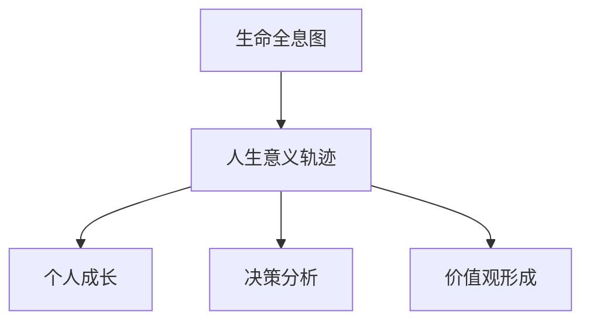

                 

# 生命全息图绘制：可视化你的人生意义轨迹

## 关键词
- 生命全息图
- 人生意义轨迹
- 人生规划
- 决策指导
- 价值观塑造

## 摘要
本文旨在探讨如何通过生命全息图的绘制，帮助人们更好地理解自己的人生意义轨迹，从而实现个人成长和决策指导。本文将从理论背景、绘制方法、应用实践和未来展望四个方面进行阐述，旨在为读者提供一种全新的视角和工具，以更好地面对人生的挑战和机遇。

----------------------------------------------------------------

## 第一部分：引言

### 1.1 书籍背景介绍

#### 1.1.1 问题的提出
在现代社会中，人们面临着诸多人生选择和困惑，如何找到人生的意义和方向成为了一个普遍关注的话题。传统的规划方法往往注重外部目标的设定，而忽略了个体内心的需求和价值观。因此，我们需要一种新的方法来帮助人们从内心深处认识自我，找到人生的目标和价值。

#### 1.1.2 研究意义
本书的研究意义在于，通过提供一种全新的视角和方法，即生命全息图的绘制，帮助人们更好地认识自我，理解人生的意义，从而提升生活质量，实现自我成长。

#### 1.1.3 边界与外延
本书主要关注的是个体层面的人生意义轨迹绘制，不涉及宏观社会层面的分析。同时，本书所介绍的全息图绘制方法是一种抽象的概念，可以应用于各个领域，如心理学、教育学、管理学等。

### 1.2 核心概念介绍

#### 1.2.1 生命全息图
生命全息图是一种通过可视化方式展现个人生命历程及其意义的方法。它以全息图的形式，将个人的成长、经历、价值观等元素有机地结合在一起，形成一幅生动的人生图谱。

#### 1.2.2 人生意义轨迹
人生意义轨迹是指一个人在生命历程中所经历的各种事件、决策、成长等，以及这些事件和决策对个人意义的影响。通过绘制人生意义轨迹，可以帮助人们更好地认识自我，理解人生的意义。

### 1.3 概念关系图

---

## 第二部分：生命全息图绘制方法

### 2.1 理论基础

#### 2.1.1 全息理论简介
全息理论源于光学，后被广泛应用于多个领域。在生命全息图中，全息理论被用来描述个体生命的全息特性，即个体的每一个部分都包含整个生命的信息。

#### 2.1.2 生命全息图绘制原理
生命全息图的绘制原理基于全息理论和生命历程理论，通过对个人生命历程的回顾和分析，将个体的成长、经历、价值观等元素抽象为图像，形成全息图。

### 2.2 实践步骤

#### 2.2.1 自我反思
通过自我反思，了解自己的成长历程、重要事件、价值观等，为绘制生命全息图提供素材。

#### 2.2.2 设计全息图框架
根据自我反思的结果，设计生命全息图的框架，包括时间轴、主题区域等。

#### 2.2.3 绘制全息图
根据设计的框架，将个体的生命历程、重要事件、价值观等元素绘制在图中，形成生命全息图。

### 2.3 案例分析

以某人为例，展示如何通过自我反思和生命全息图绘制，找到自己的人生意义。

---

## 第三部分：生命全息图应用与实践

### 3.1 个人成长规划

#### 3.1.1 利用生命全息图规划个人成长
通过生命全息图，了解自己的成长历程和现状，制定个性化的成长规划。

#### 3.1.2 成长规划案例分析
以某人为例，展示如何利用生命全息图制定个人成长规划。

### 3.2 人生决策指导

#### 3.2.1 利用生命全息图指导人生决策
通过生命全息图，分析决策的影响因素和可能的结果，帮助做出更明智的决策。

#### 3.2.2 决策指导案例分析
以某人为例，展示如何利用生命全息图进行人生决策指导。

### 3.3 价值观塑造

#### 3.3.1 利用生命全息图塑造价值观
通过生命全息图，了解自己的价值观形成过程，塑造积极向上的价值观。

#### 3.3.2 价值观塑造案例分析
以某人为例，展示如何利用生命全息图塑造价值观。

---

## 第四部分：拓展与思考

### 4.1 生命全息图在其他领域的应用
探讨生命全息图在其他领域，如心理学、教育学、管理学等的应用。

### 4.2 生命全息图绘制的未来发展
分析生命全息图绘制方法的发展趋势，展望未来可能的应用领域。

### 4.3 生命全息图绘制的挑战与机遇
讨论生命全息图绘制过程中可能遇到的挑战和机遇，以及如何应对。

---

## 第五部分：附录

### 5.1 参考文献列表

---

作者：AI天才研究院/AI Genius Institute & 禅与计算机程序设计艺术 /Zen And The Art of Computer Programming

本文通过引言、理论基础、实践步骤、应用实践和拓展思考等多个方面，详细介绍了生命全息图的绘制方法及其应用。通过自我反思和生命全息图的绘制，人们可以更清晰地认识自我，找到人生的意义和方向，从而实现个人成长和决策指导。我们相信，随着生命全息图绘制方法的不断完善和应用，它将在未来为人类的生活带来更多的价值和启示。

