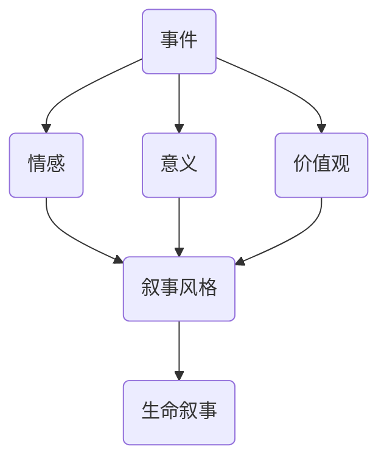
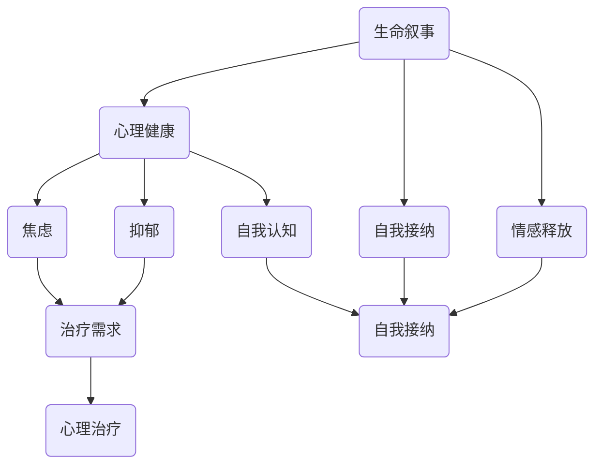

                 

## 1.1 问题背景
### 1.1.1 心理创伤的现状与影响
#### 心理创伤的普遍性
心理创伤是一种由于个人经历或目睹了极端的、创伤性的事件而产生的心理反应。这些事件可能包括自然灾害、战争、暴力、性侵、意外事故、重大疾病等。根据世界卫生组织（WHO）的数据，全球有近1/3的人口在一生中经历过某种形式的心理创伤[1]。这种创伤不仅限于个人层面，也广泛影响到了家庭和社会。例如，儿童遭受性侵可能会导致长期的心理障碍，而战争和暴力则可能引发广泛的社会紧张和冲突。

- **核心概念术语说明**：
  - 心理创伤：指个体由于极端应激事件而产生的心理痛苦和功能障碍。
  - 极端应激事件：包括自然灾害、战争、性侵、暴力、事故等造成严重心理冲击的事件。
  - 心理障碍：指由于心理创伤引起的情绪、认知和行为问题。
  - 社会紧张：指由于创伤性事件导致的社会关系紧张和社会冲突。

- **问题背景**：
  随着全球化和现代社会的快速发展，心理创伤的发生率呈现上升趋势。在许多国家，心理健康问题已经成为重要的公共卫生问题。例如，美国国家心理健康研究所（NIMH）的数据显示，约7.7%的美国成年人每年都会经历创伤后应激障碍（PTSD）[2]。在中国，随着生活压力的增大和社会变迁，心理创伤问题也逐渐受到关注。

- **问题描述**：
  心理创伤对个体的影响是多方面的，包括情感困扰、记忆丧失、睡眠障碍、人际关系问题等。这些问题如果得不到妥善处理，可能导致长期的心理障碍，影响个体的日常生活和工作。此外，心理创伤也会对家庭和社会产生负面影响，增加家庭矛盾和社会问题的发生。

- **问题解决**：
  为了应对心理创伤带来的问题，需要采取多方面的措施。一方面，个体需要寻求专业心理治疗帮助，通过心理辅导和药物治疗缓解症状。另一方面，社会需要提供更多的心理健康资源和支持，包括心理咨询服务、康复设施和社会支持网络等。

- **边界与外延**：
  心理创伤不仅仅局限于重大事件，还包括日常生活中可能遭遇的重复性压力和情感创伤，如家庭暴力、学业压力、职场竞争等。此外，心理创伤的影响也可能随着时间的推移而减弱或增强，需要长期的关注和干预。

#### 心理创伤的影响
心理创伤的影响可以从个人生活、家庭和社会三个层面进行阐述。

- **对个人生活的影响**：
  心理创伤可能导致个体出现焦虑、抑郁、失眠、创伤后应激障碍（PTSD）等症状，严重影响日常生活和工作。例如，一个人经历了严重的车祸后，可能会对驾驶产生恐惧，甚至不敢再次驾驶。

- **对家庭的影响**：
  心理创伤不仅影响个体，也会对家庭成员产生连锁反应。家庭成员可能会因为创伤患者的情绪变化、行为异常而受到影响，导致家庭关系紧张和冲突加剧。例如，一个家庭中的主要经济支柱如果因心理创伤而失去工作能力，可能会对整个家庭的经济状况产生重大影响。

- **对社会的影响**：
  心理创伤的影响不仅限于个人和家庭，也会对社会产生广泛的影响。心理创伤可能导致社会服务需求增加，医疗、教育和社会福利系统面临更大的压力。此外，心理创伤也可能导致社会冲突和犯罪率上升，影响社会稳定和公共安全。

### 1.1.2 生命叙事重构治疗的起源与发展
#### 生命叙事重构治疗的定义
生命叙事重构治疗是一种以患者生命故事为出发点，通过重构和重新叙述生命叙事来疗愈心理创伤的方法。这种方法强调患者的主体性和自主性，鼓励患者通过讲述自己的故事来认识和面对创伤，从而实现心理疗愈。

- **核心概念术语说明**：
  - 生命叙事：指个体对自身生命经历的故事性描述，包括经历、情感、意义和价值观。
  - 心理疗愈：通过心理治疗手段恢复心理健康，减轻心理创伤的影响。
  - 主体的自主性：指患者在治疗过程中的主动参与和自我决定。

#### 生命叙事重构治疗的起源与发展历程
生命叙事重构治疗起源于20世纪中叶，由心理学家卡尔·罗杰斯（Carl Rogers）等人提出，作为心理治疗的一种新范式。随着心理学和叙事治疗的不断发展，生命叙事重构治疗逐渐形成了一套完整的理论体系和实践方法。

- **概念属性特征对比表格**：

| 特征         | 传统心理治疗 | 生命叙事重构治疗 |
| ------------ | ------------ | ---------------- |
| 重点         | 心理症状的消除 | 生命故事的重建   |
| 治疗师角色   | 专家指导者    | 叙事引导者       |
| 患者参与     | 被动接受      | 主动参与         |
| 目标         | 缓解症状      | 提升生活意义感   |

#### 生命叙事重构治疗的基本原理
生命叙事重构治疗的基本原理在于通过重新构建和叙述生命叙事，帮助患者发现生命的意义和价值，从而缓解心理创伤。治疗过程通常包括以下几个步骤：

1. **建立信任关系**：治疗师与患者建立信任关系，为患者提供一个安全、接纳的治疗环境。
2. **生命故事的收集**：治疗师引导患者回忆和叙述自己的生命故事，挖掘关键事件和情感体验。
3. **生命叙事的重构**：治疗师与患者一起分析和重构生命叙事，寻找创伤事件背后的情感和意义。
4. **重新叙述**：患者通过重新叙述自己的生命故事，实现情感释放和心理疗愈。

#### 生命叙事重构治疗的优势
生命叙事重构治疗相较于传统心理治疗方法，具有以下优势：

- **个性化**：生命叙事重构治疗强调个体差异，针对每个患者的独特生命故事进行个性化治疗。
- **参与性强**：患者需要主动参与治疗过程，通过叙述自己的故事来认识和理解心理创伤，增强自我疗愈能力。
- **疗愈效果好**：通过重新构建和叙述生命叙事，患者可以找到新的视角和意义，从而缓解心理创伤。

### 1.1.3 本书的目的与结构安排
#### 目的
本书的目的是为生命叙事重构治疗师提供一本全面、系统的培训教材，帮助读者深入了解生命叙事重构治疗的理论和实践，掌握治疗技巧，提高治疗师的专业素养。

- **核心内容**：
  - 生命叙事重构治疗的理论基础和实践方法
  - 治疗师的职责和角色
  - 治疗流程和技巧
  - 案例分析和治疗效果评估

- **主题思想**：
  本书强调通过生命叙事重构治疗帮助患者认识和疗愈内心创伤，提升生活质量和幸福感。

#### 结构安排
本书分为六个部分，结构紧凑，逻辑清晰：

- **第一部分：引言**：介绍心理创伤的现状与影响，生命叙事重构治疗的起源与发展，以及本书的目的与结构安排。
- **第二部分：核心概念与原理**：详细阐述生命叙事的概念、心理创伤的概述以及生命叙事重构的治疗原理。
- **第三部分：治疗流程与技巧**：介绍治疗前的准备、治疗过程中的关键环节以及治疗技巧的应用。
- **第四部分：实际案例解析**：通过案例分析，展示生命叙事重构治疗的应用效果。
- **第五部分：治疗师的持续成长与反思**：探讨治疗师的个人成长、治疗中的常见挑战与应对策略。
- **第六部分：拓展阅读与资源推荐**：提供相关的拓展阅读和资源推荐，帮助读者深入了解相关领域。

## 1.2 生命叙事的概念
### 1.2.1 生命叙事的定义与特征
#### 定义
生命叙事是指个体对其生命经历的故事性描述，包括事件、情感、意义和价值观。生命叙事不仅是对过去经历的回忆，更是对现在和未来的反思和构想。它是个体认知世界、理解自我和他人、建立社会关系的重要方式。

- **核心概念术语说明**：
  - 生命叙事：指个体对生命经历的故事性描述。
  - 故事性描述：通过语言、情感和形象来描绘和叙述经历。
  - 意义和价值观：个体对生命经历赋予的意义和所体现的价值观。

#### 特征
生命叙事具有以下几个特征：

- **动态性**：生命叙事不是静态的，而是随着时间和经历的变化而不断重构和更新。个体在不同的生命阶段和情境下，对同一事件的描述可能会有所不同。
- **主观性**：生命叙事是个体的主观体验和认知的产物，受到个体的情感、认知和文化背景的影响。因此，不同的个体对同一事件的描述可能会有很大的差异。
- **多层次性**：生命叙事不仅包括表面的事件和事实，还包括深层次的情感、意义和价值观。这些层次相互交织，构成了个体独特的生命叙事。

### 1.2.2 生命叙事的基本要素
生命叙事的基本要素包括事件、情感、意义和价值观。

- **事件**：生命叙事中的事件是个体的经历和遭遇，是叙事的客观基础。事件可以是日常生活中的小事，也可以是重大事件，如婚姻、工作变动、生病等。
- **情感**：情感是生命叙事的核心，是事件对个体的心理和情感的影响。情感可以是愉快的、悲伤的、愤怒的等，它们为事件赋予了生命和色彩。
- **意义**：意义是个体对生命经历的解读和理解，是对事件的内在价值的认识。意义可以是个体自己赋予的，也可以是他人和社会赋予的。
- **价值观**：价值观是个体对生活和世界的信念和态度，是生命叙事的内在指导原则。价值观影响个体对事件的判断和选择，也影响个体对生命叙事的重构和更新。

### 1.2.3 生命叙事与心理健康的关联
生命叙事不仅是个体认知世界和自我的一种方式，也与个体的心理健康密切相关。

- **积极影响**：
  - 生命叙事有助于个体理解和面对自己的心理创伤，从而实现心理疗愈。
  - 生命叙事可以提升个体的自我认知和自我接纳，增强心理韧性。
  - 生命叙事有助于建立积极的人际关系，提升社会支持网络。

- **消极影响**：
  - 如果生命叙事中充满了负面的情感和意义，可能会导致个体的心理健康问题，如焦虑、抑郁等。
  - 长期以来的负面生命叙事可能会影响个体的价值观和信念，导致自我认同问题。

因此，通过生命叙事重构治疗，可以帮助个体重构和更新生命叙事，从而改善心理健康状况。治疗师在这个过程中起到引导和支持的作用，帮助患者发现生命的意义和价值，实现心理疗愈。

## 1.2 生命叙事的概念
### 1.2.1 生命叙事的定义与特征
#### 定义
生命叙事是指个体对其生命经历的故事性描述，这一过程不仅包括对事件的叙述，还涉及情感、意义和价值观的阐释。生命叙事不仅仅是简单的回忆，而是一个动态的、不断发展的认知过程，它反映了个体如何理解自己的经历以及这些经历如何塑造了他们的个性和行为。

- **核心概念术语说明**：
  - 生命叙事：个体对其生命经历的系统性描述，包括事件、情感和意义。
  - 故事性描述：通过语言和情感来讲述经历，使其具有连贯性和吸引力。
  - 记忆重构：个体对过去经历的重新思考和解释，可能涉及遗忘、扭曲或记忆的增加。

#### 特征
生命叙事具有以下几个显著特征：

- **动态性**：生命叙事是不断变化的，随着时间的推移，个体的生命经历和对其经历的理解都会发生变化。例如，一个人对童年时期的记忆可能会随着成年后的生活经历而重新塑造。
- **主观性**：每个个体对自身经历的叙述都是独特的，反映了他们的个人情感、价值观和认知框架。这意味着同一事件在不同个体之间的叙述可能会有很大差异。
- **多层次性**：生命叙事不仅包含表面的、客观的事件描述，还包括深层的情感体验、意义建构和价值观表达。这些层次相互作用，共同构成了个体的生命叙事。

### 1.2.2 生命叙事的基本要素
生命叙事由几个基本要素构成，这些要素相互作用，共同塑造了个体的生命故事。

- **事件**：事件是生命叙事的基础，是构成个体经历的具体事实和经历。这些事件可以是日常生活中的小事，也可以是重大的人生转折点，如结婚、失业、搬迁等。
- **情感**：情感是生命叙事中的核心要素，它们赋予了事件温度和深度。个体的情感反应，如快乐、悲伤、愤怒或恐惧，都会影响他们对事件的解读和叙述方式。
- **意义**：意义是个体对事件及其情感反应的解读和赋予的价值。个体通常会根据自身的文化、价值观和经验来解释事件，赋予它们特定的意义。
- **价值观**：价值观是生命叙事的内在框架，它们决定了个体如何看待事件和世界。个体的核心价值观会影响他们对事件的选择、叙述方式和情感反应。

#### 知识图谱
为了更好地理解生命叙事的基本要素，我们可以使用Mermaid知识图谱来表示这些要素及其相互关系：

在这个知识图谱中，事件、情感、意义和价值观都是生命叙事的重要要素，它们共同决定了最终的生命叙事内容。叙事风格（E）是这些要素相互作用的结果，它影响了生命叙事的整体呈现方式。

### 1.2.3 生命叙事与心理健康的关联
生命叙事不仅是个体理解自我和世界的一种方式，也是影响心理健康的重要因素。以下是生命叙事与心理健康之间的一些关联：

- **心理健康促进**：
  - 生命叙事有助于个体反思和认识自己的经历，从而理解自己的行为模式和心理反应。
  - 通过重构和叙述生命叙事，个体可以释放情感压力，缓解焦虑和抑郁症状。
  - 生命叙事提供了个体自我认识和自我接纳的机会，有助于建立积极的自我形象。

- **心理健康挑战**：
  - 如果生命叙事中充满了负面经历和消极情感，可能会导致心理健康问题，如创伤后应激障碍（PTSD）或长期抑郁。
  - 负面生命叙事可能强化个体的负面认知模式，导致自我否定或自我边缘化。

#### 知识图谱
为了进一步理解生命叙事与心理健康的关系，我们可以使用Mermaid知识图谱来表示这些关联：

在这个知识图谱中，生命叙事（A）直接影响心理健康（B），通过影响焦虑（C）、抑郁（D）和自我认知（E）。同时，生命叙事也有助于促进自我接纳（F）和情感释放（G），这些都有助于提高心理健康水平。如果心理健康出现问题（H），可能需要寻求心理治疗（J）。

总之，生命叙事是理解个体心理健康状况的重要切入点。通过重构和重新叙述生命叙事，可以帮助个体实现心理疗愈和成长。

## 1.3 心理创伤的概述
### 1.3.1 心理创伤的定义与类型
#### 定义
心理创伤是一种由于个人直接经历或目睹极端的、威胁生命的或灾难性事件而产生的严重心理痛苦和功能障碍。这些事件可能包括战争、性侵、自然灾害、严重事故等。心理创伤不仅仅是指明显的暴力事件，还包括日常生活中的长期虐待、忽视、持续压力等。

- **核心概念术语说明**：
  - 心理创伤：指由于极端应激事件导致的长期心理痛苦和功能障碍。
  - 应激事件：指引发心理创伤的极端事件，如战争、性侵、自然灾害、严重事故等。
  - 功能障碍：指心理创伤导致的认知、情感和行为问题。

#### 类型
心理创伤可以分为多种类型，每种类型都有其特定的症状和影响。

- **急性应激障碍（Acute Stress Disorder, ASD）**：
  急性应激障碍是一种在创伤事件发生后短期内出现的心理反应，症状包括反复回忆创伤事件、避免与创伤相关的情境、过度警觉等。

- **创伤后应激障碍（Post-Traumatic Stress Disorder, PTSD）**：
  创伤后应激障碍是一种长期的、持续的创伤反应，常见症状包括反复的创伤记忆、闪回、避免相关情境、过度警觉和情感麻木等。

- **复杂性创伤后应激障碍（Complex Post-Traumatic Stress Disorder, C-PTSD）**：
  复杂性创伤后应激障碍通常由长期的、重复的创伤性经历引起，症状包括身份问题、情感调节困难、关系问题等。

- **慢性应激反应（Chronic Stress Response）**：
  慢性应激反应是长期持续的压力导致的心理和生理变化，症状包括持续的情绪低落、焦虑、睡眠障碍、身体健康问题等。

### 1.3.2 心理创伤的影响与后果
#### 对个人生活的影响
心理创伤对个人生活的影响是深远而广泛的。它可能影响个人的日常生活、工作、社交关系和家庭生活。

- **情绪方面**：
  心理创伤可能导致持续的焦虑、抑郁、愤怒和恐惧。这些情绪问题可能严重影响个体的心理健康和生活质量。

- **认知方面**：
  心理创伤可能导致记忆障碍、注意力不集中、思维混乱等认知问题。这些认知问题可能影响个体的工作效率和学习能力。

- **行为方面**：
  心理创伤可能导致行为变化，如回避、社交隔离、自我伤害或过度消费等。这些行为问题可能进一步加剧个体的心理压力。

- **身体健康**：
  心理创伤还可能影响个体的身体健康，如睡眠障碍、头痛、胃肠道问题等。长期的慢性压力可能导致免疫系统功能下降，增加患病风险。

#### 对家庭与社会的影响
心理创伤不仅影响个体，也会对家庭和社会产生深远的影响。

- **家庭影响**：
  心理创伤可能导致家庭关系紧张，增加家庭矛盾和冲突。家庭成员可能因为创伤患者的情绪和行为问题而受到影响，导致家庭成员之间出现沟通障碍和情感疏离。

- **社会影响**：
  心理创伤可能增加社会服务需求，如心理健康服务、医疗照顾和康复设施等。同时，心理创伤也可能导致犯罪率和社会问题增加，对社会稳定产生负面影响。

### 1.3.3 心理创伤的评估与诊断
#### 评估方法
心理创伤的评估是心理治疗的第一步，它帮助治疗师了解患者的创伤经历和心理状况。

- **病史询问**：
  治疗师通过询问患者关于创伤事件的细节，了解事件的发生、时间、地点和涉及的人员等。

- **心理测试**：
  使用标准化心理测试工具，如创伤后应激障碍症状问卷（PTSD Checklist）等，评估患者的心理状态和创伤程度。

- **访谈**：
  治疗师通过与患者的深入访谈，了解患者的情感反应、认知扭曲和行为模式。

#### 诊断标准
心理创伤的诊断通常遵循专业心理评估标准，如《精神疾病诊断与统计手册》（DSM-5）。

- **诊断标准**：
  - 创伤事件的真实性：患者必须确实经历过创伤事件。
  - 心理反应的严重性：创伤事件引发的心理反应必须达到一定的严重程度。
  - 症状持续的时间：症状必须持续一段时间，通常至少数月。

通过综合评估和诊断，治疗师可以为患者制定个性化的治疗计划，帮助他们应对创伤，恢复心理健康。

## 1.3 心理创伤的概述
### 1.3.1 心理创伤的定义与类型
#### 定义
心理创伤是一种复杂的心理现象，它通常发生在个体经历了极端的、威胁性的、灾难性的事件之后。这些事件不仅可能对个体的身体造成伤害，还可能深刻地影响个体的心理和情绪状态。心理创伤的定义不仅限于经历了直接的暴力事件，还可能包括目睹暴力、长期的虐待、自然灾害、重大事故等。心理创伤的核心特征是情感上的极度痛苦、记忆的反复闪回、对创伤事件的持续恐惧和逃避，以及整体的心理功能受损。

- **核心概念术语说明**：
  - 心理创伤：指个体由于极端或威胁性事件导致的严重心理痛苦和功能障碍。
  - 极端事件：包括暴力、灾害、性侵、严重事故等对个体造成极大心理冲击的事件。
  - 情感痛苦：指个体在创伤事件后经历的情绪困扰，如焦虑、恐惧、悲伤等。
  - 功能受损：指个体在认知、行为、社交和情感方面出现的问题，如失眠、注意力不集中、社交回避等。

#### 类型
心理创伤有多种类型，每种类型都有其特定的症状和特点。

- **急性应激障碍（Acute Stress Disorder, ASD）**：
  急性应激障碍是一种在创伤事件发生后短时间内出现的心理反应。患者可能会出现失眠、噩梦、极度焦虑、对创伤事件的持续恐惧和回忆等。

- **创伤后应激障碍（Post-Traumatic Stress Disorder, PTSD）**：
  创伤后应激障碍是一种长期的创伤反应，常见症状包括反复回忆创伤事件、闪回、对与创伤相关的事件和情境的回避、过度警觉和麻木等。

- **复杂性创伤后应激障碍（Complex Post-Traumatic Stress Disorder, C-PTSD）**：
  复杂性创伤后应激障碍通常由长期的、重复的创伤性经历引起，症状包括身份问题、情感调节困难、关系问题、自我感觉的丧失等。

- **慢性应激反应（Chronic Stress Response）**：
  慢性应激反应是长期持续的压力导致的心理和生理变化。症状可能包括持续的情绪低落、焦虑、睡眠障碍、身体健康问题等。

### 1.3.2 心理创伤的影响与后果
#### 对个人生活的影响
心理创伤对个人的生活有广泛和深远的影响，可以从情绪、认知和行为等多个层面进行阐述。

- **情绪影响**：
  心理创伤可能导致患者经历长期的情感困扰，如焦虑、恐惧、抑郁、愤怒等。这些情绪问题可能对个体的日常生活产生严重影响，影响他们的工作表现、社交活动和整体幸福感。

- **认知影响**：
  心理创伤还可能影响个体的认知功能，如注意力不集中、记忆障碍、思维混乱等。这些认知问题可能影响个体的学习能力和工作效率，进一步加剧他们的心理负担。

- **行为影响**：
  心理创伤可能导致个体的行为发生变化，如逃避与创伤相关的事物、社交回避、过度消费或自我伤害等。这些行为问题可能使个体的生活更加难以管理，增加心理健康问题的风险。

- **身体健康**：
  心理创伤对身体健康也有显著影响。长期的焦虑和抑郁可能导致睡眠障碍、慢性疼痛、心血管疾病等身体问题。此外，心理创伤还可能削弱个体的免疫系统，增加患病风险。

#### 对家庭与社会的影响
心理创伤不仅影响个体，也会对家庭和社会产生深远的影响。

- **家庭影响**：
  心理创伤可能导致家庭关系紧张和冲突增加。患者可能因为情绪和行为问题而与家庭成员发生争执，影响家庭的和谐和稳定。此外，家庭成员也可能因为患者的创伤经历而感到焦虑和无助，导致家庭支持系统的削弱。

- **社会影响**：
  心理创伤可能导致社会服务需求增加，如心理健康服务、医疗照顾、社会支持等。同时，心理创伤也可能导致犯罪率和社会问题的上升，对社会稳定和公共安全构成威胁。例如，创伤后应激障碍患者可能因为情绪失控而犯罪，或因为长期失业和贫困而陷入社会问题。

### 1.3.3 心理创伤的评估与诊断
#### 评估方法
心理创伤的评估是心理治疗的关键步骤，它帮助治疗师了解患者的创伤经历和心理状态。

- **病史询问**：
  治疗师会通过询问患者的病史，了解他们所经历的创伤事件，包括事件的具体细节、发生的时间和地点等。病史询问有助于全面了解患者的创伤经历。

- **心理测试**：
  使用标准化的心理测试工具，如创伤后应激障碍症状问卷（PTSD Checklist）等，评估患者的心理状态和创伤程度。这些测试工具能够量化患者的症状，帮助治疗师制定个性化的治疗计划。

- **访谈**：
  治疗师会进行深入的访谈，与患者建立信任关系，了解他们的情感反应、认知扭曲和行为模式。访谈是评估过程中不可或缺的一环，有助于治疗师深入了解患者的内心世界。

#### 诊断标准
心理创伤的诊断通常遵循专业心理评估标准，如《精神疾病诊断与统计手册》（DSM-5）。

- **诊断标准**：
  - **创伤事件的经历**：患者必须确实经历过一个或多个极端的、威胁性的或灾难性的事件。
  - **症状的严重性**：患者的症状必须达到一定的严重程度，对日常生活造成显著影响。
  - **症状的持续时间**：症状必须持续一段时间，通常至少数月。

通过综合评估和诊断，治疗师可以为患者制定个性化的治疗计划，帮助他们应对创伤，恢复心理健康。

## 1.4 生命叙事重构的治疗原理
### 1.4.1 生命叙事重构的治疗框架
#### 治疗框架概述
生命叙事重构的治疗框架是一种以患者为中心的治疗方法，强调通过重构和重新叙述患者的生命叙事来疗愈心理创伤。这个框架包括以下几个关键步骤：

1. **建立信任关系**：治疗师与患者建立信任关系，为患者提供一个安全、无评判的治疗环境。这一步骤至关重要，因为信任是治疗成功的基础。

2. **生命故事的收集**：治疗师引导患者回忆和叙述自己的生命故事，挖掘关键事件和情感体验。这一步骤有助于治疗师了解患者的心理创伤及其影响。

3. **生命叙事的重构**：治疗师与患者一起分析和重构生命叙事，寻找创伤事件背后的情感和意义。这一步骤的目标是帮助患者重新理解创伤事件，减少负面影响。

4. **重新叙述**：患者通过重新叙述自己的生命故事，实现情感释放和心理疗愈。这一步骤有助于患者建立新的自我认同和生活意义。

#### 治疗师的角色与策略
治疗师在生命叙事重构治疗中扮演着关键角色，他们需要采取一系列策略来引导患者进行生命叙事的重构。

- **倾听与理解**：治疗师需要耐心倾听患者的叙述，理解他们的情感和经历。通过共情和同理心，治疗师可以帮助患者感到被接纳和支持。

- **引导与引导**：治疗师需要引导患者深入挖掘生命故事中的关键事件和情感。他们可以使用开放式问题和反思性技巧，帮助患者重新审视自己的经历。

- **情感释放**：治疗师需要帮助患者释放与创伤事件相关的负面情感。这可以通过情绪表达、叙事重构和认知重构等技术实现。

- **意义重建**：治疗师需要帮助患者找到新的意义和价值，重新构建他们的生命叙事。这有助于患者从创伤中恢复，建立积极的自我认同和生活目标。

### 1.4.2 患者参与的重要性
患者参与是生命叙事重构治疗成功的关键。患者需要主动参与到治疗过程中，他们不仅需要回忆和叙述自己的生命故事，还需要参与分析和重构过程。

- **主动参与的意义**：
  - 增强治疗的有效性：患者主动参与有助于治疗师更好地了解患者的需求和问题，从而制定更有效的治疗计划。
  - 提高患者的自我效能感：通过主动参与，患者可以感受到自己在治疗过程中的主导地位，增强自我效能感和自我控制感。
  - 促进情感释放和疗愈：患者主动参与可以帮助他们更深刻地理解和面对自己的情感，从而实现情感释放和心理疗愈。

- **患者参与的策略**：
  - **共情和同理心**：治疗师需要表现出对患者的共情和同理心，让患者感到被理解和支持。
  - **开放性对话**：治疗师需要鼓励患者开放地表达自己的情感和想法，通过开放性对话来促进患者的自我探索和反思。
  - **自我反思练习**：治疗师可以引导患者进行自我反思练习，帮助他们从不同的角度看待自己的生命故事，寻找新的意义和价值。
  - **创造性表达**：通过艺术疗法、写作、绘画等创造性表达方式，治疗师可以帮助患者更深入地探索自己的情感和经历，促进疗愈过程。

### 1.4.3 生命叙事重构的治疗原理
生命叙事重构的治疗原理基于几个核心概念，包括叙事治疗、认知行为疗法和人本主义心理学等。

- **叙事治疗**：
  叙事治疗强调通过重构患者的生命叙事来改变他们的认知和行为。治疗师帮助患者重新理解他们的经历，将创伤事件重新叙述为一个有意义的故事，从而减少创伤的负面影响。

- **认知行为疗法**：
  认知行为疗法（CBT）是一种常用的心理治疗方法，它强调通过改变思维和行为来改善情绪。在生命叙事重构治疗中，治疗师可以帮助患者识别和挑战负面的认知模式，用更积极的方式重新叙述生命故事。

- **人本主义心理学**：
  人本主义心理学强调个体的自主性和自我实现。在生命叙事重构治疗中，治疗师鼓励患者探索自己的内在潜能，找到生命的意义和价值，从而实现心理疗愈。

通过结合这些治疗原理，生命叙事重构治疗可以帮助患者重新构建他们的生命叙事，找到新的意义和目的，实现心理疗愈和成长。

## 1.5 治疗流程与技巧
### 1.5.1 治疗前的准备
#### 患者资料的收集与分析
在治疗开始之前，治疗师需要全面收集患者的资料，这包括患者的个人背景、创伤经历、心理健康状况、家庭和社会支持系统等。通过详细的患者资料收集，治疗师可以更深入地了解患者的背景和需求，为制定个性化的治疗计划提供依据。

- **收集资料的途径**：
  - 病历记录：包括医疗记录、心理评估报告等。
  - 面谈：通过与患者的面对面交谈，了解患者的经历和感受。
  - 家属或亲近人士的访谈：了解患者的家庭环境和社交关系。
  - 心理测试：使用标准化测试工具，评估患者的心理健康状况。

- **资料分析的方法**：
  - 定量分析：通过统计数据来分析患者的创伤经历、症状严重程度等。
  - 定性分析：通过深入理解患者的叙述，挖掘情感和心理层面的需求。
  - 跨领域分析：将患者的生活经历、心理健康和社会环境相结合，综合分析患者的整体状况。

#### 建立治疗师与患者之间的信任关系
建立治疗师与患者之间的信任关系是治疗成功的关键。信任关系不仅有助于患者敞开心扉，分享自己的创伤经历，还能为治疗提供一个安全、无评判的环境。

- **建立信任的策略**：
  - **倾听与尊重**：治疗师需要耐心倾听患者的叙述，尊重他们的感受和观点。
  - **共情与同理心**：通过表达对患者的共情和同理心，让患者感到被理解和支持。
  - **透明沟通**：治疗师应与患者建立透明的沟通渠道，明确治疗的目标和过程。
  - **持续反馈**：治疗师应定期给予患者反馈，帮助他们了解治疗进展，增强治疗信心。

#### 制定个性化的治疗计划
在收集和分析患者资料的基础上，治疗师需要制定一个个性化的治疗计划。治疗计划应包括治疗的目标、具体的治疗步骤、预期效果和评估方法。

- **制定计划的过程**：
  - **设定治疗目标**：根据患者的需求和症状，设定短期和长期的治疗目标。
  - **确定治疗步骤**：根据治疗目标，制定具体的治疗步骤，如初始评估、叙事重构、认知行为干预等。
  - **预期效果评估**：设定评估标准，定期评估患者的治疗进展和效果。
  - **调整治疗计划**：根据患者的反馈和治疗进展，及时调整治疗计划，确保治疗的有效性。

### 1.5.2 治疗过程中的关键环节
#### 初始会谈：建立治疗目标与预期
初始会谈是治疗过程的重要环节，它为治疗师和患者提供了面对面交流的机会，帮助双方建立良好的沟通和信任关系。

- **初始会谈的目标**：
  - 了解患者的创伤经历和心理状态。
  - 建立治疗师与患者之间的信任关系。
  - 设定治疗目标和预期。

- **初始会谈的过程**：
  - **病史询问**：治疗师通过询问患者的病史，了解创伤事件的具体细节和影响。
  - **情感探索**：治疗师通过开放性问题，探索患者的情感体验和心理反应。
  - **目标设定**：治疗师与患者共同设定治疗目标和预期，确保双方对治疗有共同的理解。

#### 倾听与反应：理解患者的情感与需求
倾听与反应是治疗过程中最为关键的技巧之一，它有助于治疗师深入了解患者的情感和需求，提供有效的情感支持。

- **倾听的技巧**：
  - **无评判的倾听**：治疗师应保持开放和接纳的态度，不对患者的情感和经历进行评判。
  - **全神贯注的倾听**：治疗师应专注于患者的叙述，通过眼神接触和肢体语言表达关注和理解。

- **反应的技巧**：
  - **情感反映**：治疗师通过表达对患者情感的理解，如“我理解你现在感到很痛苦”。
  - **共鸣**：治疗师通过分享类似的经历或情感，与患者建立共鸣，增强患者的情感支持。
  - **澄清与确认**：治疗师通过澄清和确认患者的叙述，确保对患者的理解是准确的。

#### 故事采集：挖掘患者生命叙事中的关键事件
故事采集是治疗过程中的重要步骤，它有助于治疗师深入了解患者的生命叙事，挖掘关键事件和情感体验。

- **故事采集的技巧**：
  - **开放式问题**：使用开放式问题，鼓励患者详细叙述他们的经历，如“你能告诉我更多关于这个事件的情况吗？”
  - **反思性提问**：使用反思性提问，引导患者深入思考自己的情感和经历，如“你对这个事件有什么感受？”
  - **情感导向**：关注患者叙述中的情感细节，引导患者表达和理解自己的情感。

#### 患者自我反思：引导患者重新审视生命事件
自我反思是治疗过程中帮助患者理解自己经历和情感的重要步骤，它有助于患者重建生命叙事，实现心理疗愈。

- **自我反思的技巧**：
  - **引导性反思**：治疗师通过提问和引导，帮助患者反思自己的经历和情感，如“你能从不同的角度看待这个事件吗？”
  - **认知重构**：帮助患者识别和挑战负面认知，用更积极的方式重新解释生命事件。
  - **情感释放**：通过情感表达和认知重构，帮助患者释放与创伤事件相关的负面情感。

通过这些关键环节，治疗师可以有效地帮助患者重构生命叙事，实现心理疗愈和成长。

## 1.5 治疗流程与技巧
### 1.5.1 治疗前的准备
#### 患者资料的收集与分析
治疗前的准备工作至关重要，它为后续的治疗过程奠定了基础。以下是患者资料收集与分析的详细步骤：

- **初步资料收集**：
  - **病历记录**：收集患者的医疗记录，包括过去的诊断、治疗情况和当前的病情。
  - **心理健康评估**：使用标准化心理测试工具，如创伤后应激障碍（PTSD）症状问卷、焦虑自评量表（SAS）和抑郁自评量表（SDS）等，评估患者的心理健康状况。
  - **社会支持系统**：了解患者的家庭背景、社会关系和社区支持网络，评估其对治疗的潜在影响。

- **深度访谈**：
  - **个体访谈**：与患者进行一对一的深度访谈，了解其创伤经历、心理感受、生活经历和对治疗的期望。
  - **家庭成员访谈**：如有必要，可以邀请患者的家庭成员参与访谈，以获得更全面的背景信息。

- **情感评估**：
  - **情感反应评估**：通过观察患者的非语言行为、情感表达和心理测试结果，评估其对创伤事件的情感反应。
  - **心理应激评估**：使用应激评估工具，如应激暴露测试（STREPT）等，评估患者对创伤事件的应激反应。

- **分析资料**：
  - **综合评估**：将收集到的各种资料进行综合分析，识别患者的主要问题、需求和优势。
  - **个性化报告**：编写一份详细的个体化评估报告，作为治疗计划的参考。

#### 建立治疗师与患者之间的信任关系
建立信任关系是心理治疗成功的关键。以下是建立信任关系的详细步骤：

- **初次接触**：
  - **接待与介绍**：治疗师应以友好和专业的态度接待患者，介绍自己、治疗计划和预期目标。
  - **沟通环境**：确保治疗环境舒适、私密，让患者感到安全和放松。

- **建立信任**：
  - **倾听与共情**：治疗师应耐心倾听患者的叙述，表达对其情感和经历的共情和理解。
  - **开放沟通**：鼓励患者表达自己的想法和感受，建立开放的沟通渠道。
  - **透明度**：治疗师应明确解释治疗过程、目标和可能的风险，增强患者的信任感。

- **互动与反馈**：
  - **积极反馈**：治疗师应及时给予患者正面的反馈，增强其信心和安全感。
  - **建立共识**：与患者共同设定治疗目标和预期，确保双方对治疗过程有共同的理解。

#### 制定个性化的治疗计划
个性化的治疗计划应根据患者的具体情况和需求制定，以下是制定计划的详细步骤：

- **确定治疗目标**：
  - **短期目标**：如缓解症状、改善情绪、提高生活质量等。
  - **长期目标**：如预防复发、增强心理韧性、提升整体幸福感等。

- **制定治疗策略**：
  - **心理治疗**：根据患者的症状和需求，选择合适的心理治疗方法，如认知行为疗法、叙事疗法等。
  - **药物治疗**：如有必要，与精神科医生合作，制定合适的药物治疗方案。
  - **综合干预**：结合心理、社会和生理干预措施，提供全方位的支持。

- **制定治疗步骤**：
  - **初始阶段**：建立信任关系，收集患者资料，进行初步评估。
  - **核心阶段**：实施治疗策略，如叙事重构、认知行为干预、情感调节等。
  - **后续阶段**：评估治疗效果，调整治疗计划，提供长期支持和追踪。

- **预期效果评估**：
  - **阶段性评估**：定期评估患者的进展和效果，调整治疗计划。
  - **终点评估**：治疗结束时，进行全面评估，确定治疗成功与否。

通过以上详细的准备步骤，治疗师可以为患者制定一个科学、合理和个性化的治疗计划，确保治疗的有效性和患者的满意度。

### 1.5.2 治疗过程中的关键环节
#### 初始会谈：建立治疗目标与预期
初始会谈是治疗过程的第一步，其目标是建立治疗师与患者之间的信任关系，明确治疗的目标和预期，为后续的治疗过程奠定基础。

- **会谈目标**：
  - **建立信任关系**：治疗师需要通过倾听和共情，与患者建立信任关系，让患者感到安全和被理解。
  - **收集基本信息**：了解患者的背景、创伤经历、心理健康状况和当前的需求。
  - **设定治疗目标**：与患者共同设定短期和长期的治疗目标，确保双方对治疗有共同的理解。

- **会谈过程**：
  - **病史询问**：治疗师通过详细询问患者的病史，了解创伤事件的细节和影响。
  - **情感探索**：通过开放性问题，探索患者的情感体验和心理反应。
  - **目标设定**：治疗师与患者共同讨论治疗目标，并根据患者的需求和期望，设定具体的治疗目标。

#### 倾听与反应：理解患者的情感与需求
倾听与反应是治疗过程中最重要的技巧之一，它有助于治疗师深入了解患者的情感和需求，提供有效的情感支持。

- **倾听技巧**：
  - **无评判的倾听**：治疗师应以接纳和开放的态度倾听患者的叙述，不对患者的情感和经历进行评判。
  - **全神贯注的倾听**：治疗师应专注于患者的叙述，通过眼神接触和肢体语言表达关注和理解。
  - **情感反映**：治疗师通过表达对患者情感的理解，如“我理解你现在感到很痛苦”。

- **反应技巧**：
  - **情感反映**：治疗师通过表达对患者情感的理解，如“我理解你现在感到很痛苦”。
  - **共鸣**：治疗师通过分享类似的经历或情感，与患者建立共鸣，增强患者的情感支持。
  - **澄清与确认**：治疗师通过澄清和确认患者的叙述，确保对患者的理解是准确的。

#### 故事采集：挖掘患者生命叙事中的关键事件
故事采集是治疗过程中挖掘患者生命叙事中的关键事件和情感体验的重要步骤。

- **故事采集技巧**：
  - **开放式问题**：使用开放式问题，鼓励患者详细叙述他们的经历，如“你能告诉我更多关于这个事件的情况吗？”
  - **反思性提问**：使用反思性提问，引导患者深入思考自己的情感和经历，如“你对这个事件有什么感受？”
  - **情感导向**：关注患者叙述中的情感细节，引导患者表达和理解自己的情感。

#### 患者自我反思：引导患者重新审视生命事件
自我反思是帮助患者理解自己经历和情感的重要步骤，它有助于患者重构生命叙事，实现心理疗愈。

- **自我反思技巧**：
  - **引导性反思**：治疗师通过提问和引导，帮助患者反思自己的经历和情感，如“你能从不同的角度看待这个事件吗？”
  - **认知重构**：帮助患者识别和挑战负面认知，用更积极的方式重新解释生命事件。
  - **情感释放**：通过情感表达和认知重构，帮助患者释放与创伤事件相关的负面情感。

通过以上关键环节，治疗师可以有效地帮助患者重构生命叙事，实现心理疗愈和成长。

### 1.5.3 治疗技巧的应用
在生命叙事重构治疗中，治疗师需要运用一系列专业的技巧和策略，以帮助患者重构生命叙事，实现心理疗愈。以下是几种主要的治疗技巧及其具体应用：

#### 建构主义治疗技术
建构主义治疗技术强调患者的主体性和创造性，通过共同构建患者的生命故事来疗愈心理创伤。

- **具体应用**：
  - **叙事建构**：治疗师与患者一起，通过叙事的方式来构建患者的生命故事，强调患者自身的视角和意义。
  - **故事创作**：鼓励患者创作自己的故事，通过写作、绘画或其他创造性表达方式，表达内心的情感和经历。
  - **角色扮演**：通过角色扮演，帮助患者从不同的角度理解自己的生命事件，增强对事件的灵活性和理解。

#### 认知重构方法
认知重构方法旨在帮助患者识别和挑战负面的认知模式，用更积极的方式重构生命叙事。

- **具体应用**：
  - **认知日记**：患者记录每天的思考和行为模式，治疗师帮助患者识别和挑战其中的负面认知。
  - **认知调整**：通过认知行为疗法的技术，帮助患者用更积极和现实的方式重新评估事件和情感。
  - **思维阻断**：在患者出现负面思维时，通过积极的自我对话或行为干预来阻断这些思维。

#### 情绪调节策略
情绪调节策略旨在帮助患者处理和调节与创伤相关的负面情绪。

- **具体应用**：
  - **情绪表达**：鼓励患者表达自己的情感，通过书写、绘画、音乐或艺术疗法等方式，释放情绪压力。
  - **情绪反馈**：治疗师通过共情和同理心，提供积极的情感反馈，帮助患者感到被理解和接纳。
  - **情绪释放练习**：如深呼吸、渐进性肌肉放松、正念冥想等，帮助患者放松身体，减少情绪紧张。

#### 记忆重塑技巧
记忆重塑技巧旨在帮助患者重新评估和重构与创伤相关的记忆，减少负面影响。

- **具体应用**：
  - **记忆重构**：治疗师与患者一起，通过回顾和重新叙述事件，改变对事件的记忆和理解。
  - **正面记忆强化**：通过创造积极的记忆和经验，帮助患者建立新的记忆框架。
  - **记忆替代**：在患者无法面对某些记忆时，通过替代性记忆或虚构记忆来缓解痛苦。

#### 故事疗法
故事疗法通过叙事和故事讲述来促进心理疗愈，是生命叙事重构治疗中的重要组成部分。

- **具体应用**：
  - **故事分享**：鼓励患者分享自己的故事，通过叙述来释放情感和获得理解。
  - **故事改编**：治疗师帮助患者改编自己的故事，使其更加积极和有希望。
  - **故事隐喻**：使用隐喻和象征性的故事，帮助患者理解自己的经历和情感。

通过这些治疗技巧的应用，治疗师可以有效地帮助患者重构生命叙事，实现心理疗愈和成长。

### 1.5.4 治疗技巧的应用
在生命叙事重构治疗过程中，治疗师需要运用一系列专业的治疗技巧，以帮助患者更好地理解和疗愈内心的创伤。以下是几种关键的治疗技巧及其具体应用：

#### 建构主义治疗技术
建构主义治疗技术强调患者的主体性和创造性，通过共同构建患者的生命故事来实现疗愈。

- **具体应用**：
  - **叙事构建**：治疗师与患者合作，共同重构患者的生命叙事，强调患者的主观体验和情感表达。
  - **故事创作**：鼓励患者创作自己的故事，通过写作、绘画或其他艺术形式，表达内心的情感和经历。
  - **角色扮演**：通过角色扮演，帮助患者从不同角度理解生命事件，增强对事件的灵活性和理解。

#### 认知重构方法
认知重构方法旨在帮助患者识别和挑战负面的认知模式，用更积极的方式重新解释生命事件。

- **具体应用**：
  - **认知日记**：患者记录自己的认知和行为模式，治疗师帮助患者识别和挑战其中的负面认知。
  - **认知调整**：通过认知行为疗法的技术，帮助患者用更积极和现实的方式重新评估事件和情感。
  - **思维阻断**：在患者出现负面思维时，通过积极的自我对话或行为干预来阻断这些思维。

#### 情绪调节策略
情绪调节策略旨在帮助患者处理和调节与创伤相关的负面情绪，减少情感痛苦。

- **具体应用**：
  - **情感表达**：鼓励患者通过书写、绘画、音乐或其他创造性表达方式，释放情绪压力。
  - **情绪反馈**：治疗师通过共情和同理心，提供积极的情感反馈，帮助患者感到被理解和接纳。
  - **情绪释放练习**：如深呼吸、渐进性肌肉放松、正念冥想等，帮助患者放松身体，减少情绪紧张。

#### 记忆重塑技巧
记忆重塑技巧旨在帮助患者重新评估和重构与创伤相关的记忆，减少负面影响。

- **具体应用**：
  - **记忆重构**：治疗师与患者一起回顾和重新叙述事件，改变对事件的记忆和理解。
  - **正面记忆强化**：通过创造积极的记忆和经验，帮助患者建立新的记忆框架。
  - **记忆替代**：在患者无法面对某些记忆时，通过替代性记忆或虚构记忆来缓解痛苦。

#### 故事疗法
故事疗法通过叙事和故事讲述来促进心理疗愈，是生命叙事重构治疗的重要组成部分。

- **具体应用**：
  - **故事分享**：鼓励患者分享自己的故事，通过叙述来释放情感和获得理解。
  - **故事改编**：治疗师帮助患者改编自己的故事，使其更加积极和有希望。
  - **故事隐喻**：使用隐喻和象征性的故事，帮助患者理解自己的经历和情感。

通过这些治疗技巧的应用，治疗师可以有效地帮助患者重构生命叙事，实现心理疗愈和成长。

## 4.1 案例一：从创伤中找回自我
### 4.1.1 案例背景与问题描述
案例一的主角是一位名叫李明的35岁男性，他因童年遭受长期家庭暴力和虐待，导致严重的心理创伤和心理健康问题。李明自述在成长过程中，经常遭受父亲的殴打和辱骂，这些经历使他形成了消极的自我认知和强烈的恐惧情绪。成年后的李明一直生活在焦虑和抑郁中，人际关系紧张，工作效率低下，甚至有自残倾向。

- **背景介绍**：
  李明出生在一个经济条件较差的家庭，父母关系紧张，父亲经常酗酒并因此产生暴力行为。这些创伤性经历在李明的成长过程中留下了深刻的印记，影响了他的心理健康和生活质量。

- **问题描述**：
  李明的主要问题包括：
  - **焦虑和抑郁**：经常感到紧张、恐惧和孤独，对日常生活和工作缺乏兴趣。
  - **人际关系问题**：与他人相处困难，经常感到被误解和排斥。
  - **自我伤害行为**：有时会产生自残的念头和行为，希望通过痛苦来缓解内心的痛苦。

### 4.1.2 治疗过程与技巧应用
治疗过程分为以下几个阶段：

#### 阶段一：建立信任关系和初步评估
在治疗的初始阶段，治疗师与李明建立了信任关系，通过倾听和共情，帮助他感受到被理解和支持。治疗师使用开放式问题和情感反映技巧，深入了解李明的创伤经历和当前的心理状况。

- **倾听与理解**：
  治疗师耐心倾听李明的叙述，表达对其情感和经历的共情和理解，让李明感到被接纳和支持。

- **初步评估**：
  通过详细的病史询问和心理测试，治疗师评估李明的心理健康状况，确定其焦虑、抑郁和创伤后应激障碍（PTSD）的严重程度。

#### 阶段二：生命叙事重构
在治疗的中期，治疗师与李明一起进行生命叙事重构，帮助他重新理解自己的经历和情感。

- **叙事重构**：
  治疗师引导李明回忆和叙述自己的创伤经历，通过情感反映和认知重构技巧，帮助他重新评估和解释这些经历。

- **故事创作**：
  鼓励李明创作自己的故事，通过写作和绘画表达内心的情感和经历，从而减轻内心的痛苦。

#### 阶段三：情绪调节和认知重构
在治疗的中期，治疗师帮助李明通过情绪调节和认知重构技巧，处理和调节与创伤相关的负面情绪和认知。

- **情绪调节**：
  通过深呼吸、渐进性肌肉放松和正念冥想等技巧，帮助李明放松身体，减少情绪紧张。

- **认知重构**：
  通过认知日记和思维阻断技巧，帮助李明识别和挑战负面的认知模式，用更积极的方式重新解释生命事件。

#### 阶段四：巩固治疗成果和后续支持
在治疗的最后阶段，治疗师与李明一起巩固治疗成果，提供后续支持，帮助他维持心理稳定和心理健康。

- **巩固治疗成果**：
  通过回顾和总结治疗过程，帮助李明认识到自己的进步和成长，增强其自信心。

- **后续支持**：
  提供家庭辅导和社区支持，帮助李明建立稳定的人际关系和社会支持网络。

### 4.1.3 治疗效果评估与反馈
经过一段时间的治疗，李明的症状得到了显著改善：

- **焦虑和抑郁**：李明报告说，他的焦虑和抑郁症状明显减轻，对日常生活的兴趣增加。
- **人际关系**：李明与他人的相处变得更加和谐，他能够更好地表达自己的情感和需求。
- **自我伤害行为**：李明报告说，他不再有自残的念头和行为，对生活充满了希望。

治疗师和患者共同回顾了治疗过程，总结了治疗中的成功经验和需要改进的地方。患者对治疗过程和效果表示满意，并感谢治疗师的支持和帮助。治疗师也鼓励李明继续进行自我探索和成长，保持积极的生活态度。

通过这个案例，我们可以看到生命叙事重构治疗在帮助患者疗愈心理创伤方面的有效性和潜力。治疗师通过倾听、共情、叙事重构、情绪调节和认知重构等多种技巧，帮助患者重新理解自己的经历，找到新的生活意义，实现心理疗愈和成长。

### 4.2 案例二：重拾信心，迎接新生活
#### 4.2.1 案例背景与问题描述
案例二的主角是一位名叫张丽的30岁女性，她曾经历过一场严重的车祸，导致严重的身体和心理创伤。车祸发生时，张丽驾车行驶在高速公路上，突然失控撞上了一个护栏，导致车辆严重损毁，张丽本人也受了重伤。事故之后，张丽不仅需要面对身体的疼痛和恢复，还遭受了严重的创伤后应激障碍（PTSD）。

- **背景介绍**：
  张丽在车祸后经历了长期的痛苦和心理困扰，她经常出现噩梦、闪回和极度焦虑。车祸事件使她失去了驾驶的信心，她对未来的生活感到迷茫和恐惧。

- **问题描述**：
  张丽的主要问题包括：
  - **身体疼痛**：车祸导致她身体多处受伤，虽然经过治疗有所恢复，但仍然疼痛难忍。
  - **心理创伤**：严重的创伤后应激障碍使她长期处于焦虑和恐惧中，对未来的生活感到不安。
  - **生活困境**：由于身体和心理的问题，张丽的工作和生活受到了严重影响，她需要重新寻找生活的方向和意义。

#### 4.2.2 治疗过程与技巧应用
治疗过程分为以下几个阶段：

##### 阶段一：建立信任关系和初步评估
在治疗的初始阶段，治疗师与张丽建立了信任关系，通过倾听和共情，帮助她感受到被理解和支持。治疗师使用开放式问题和情感反映技巧，深入了解张丽的创伤经历和当前的心理状况。

- **倾听与理解**：
  治疗师耐心倾听张丽的叙述，表达对其情感和经历的共情和理解，让张丽感到被接纳和支持。

- **初步评估**：
  通过详细的病史询问和心理测试，治疗师评估张丽的心理健康状况，确定其焦虑、抑郁和创伤后应激障碍（PTSD）的严重程度。

##### 阶段二：身体康复和心理疗愈
在治疗的中期，治疗师帮助张丽进行身体康复和心理疗愈。

- **身体康复**：
  治疗师建议张丽接受专业康复治疗，包括物理治疗和心理咨询，以帮助她恢复身体功能和减轻身体疼痛。

- **心理疗愈**：
  治疗师使用认知行为疗法（CBT）和叙事疗法，帮助张丽重构生命叙事，重新理解车祸事件和自己的情感反应。

##### 阶段三：情绪调节和认知重构
在治疗的中期，治疗师帮助张丽通过情绪调节和认知重构技巧，处理和调节与创伤相关的负面情绪和认知。

- **情绪调节**：
  通过深呼吸、渐进性肌肉放松和正念冥想等技巧，帮助张丽放松身体，减少情绪紧张。

- **认知重构**：
  通过认知日记和思维阻断技巧，帮助张丽识别和挑战负面的认知模式，用更积极的方式重新解释生命事件。

##### 阶段四：生活重建和信心恢复
在治疗的最后阶段，治疗师帮助张丽重建生活，恢复信心。

- **生活重建**：
  治疗师鼓励张丽逐步恢复日常生活，如工作、社交活动等，帮助她重新融入社会。

- **信心恢复**：
  治疗师通过正面肯定和激励，帮助张丽重建对自己和他人的信心，鼓励她积极面对生活。

#### 4.2.3 治疗效果评估与反馈
经过一段时间的治疗，张丽的症状得到了显著改善：

- **身体疼痛**：张丽报告说，她的身体疼痛明显减轻，身体功能逐渐恢复。
- **心理创伤**：张丽报告说，她的焦虑和恐惧情绪明显减轻，能够更好地面对和处理创伤后的情感反应。
- **生活困境**：张丽重新找到了工作，恢复了社交活动，对未来的生活充满了希望。

治疗师和患者共同回顾了治疗过程，总结了治疗中的成功经验和需要改进的地方。患者对治疗过程和效果表示满意，并感谢治疗师的支持和帮助。治疗师也鼓励张丽继续进行自我探索和成长，保持积极的生活态度。

通过这个案例，我们可以看到生命叙事重构治疗在帮助患者疗愈心理创伤、恢复信心和重建生活方面的有效性和潜力。治疗师通过倾听、共情、叙事重构、情绪调节和认知重构等多种技巧，帮助患者重新理解自己的经历，找到新的生活意义，实现心理疗愈和成长。

## 5.1 治疗师的个人成长
### 5.1.1 持续学习与专业发展
作为一名生命叙事重构治疗师，持续学习与专业发展至关重要。以下是一些重要的学习途径和专业发展建议：

- **学术培训**：参加相关的学术会议、研讨会和工作坊，了解最新的研究成果和治疗技巧。
- **专业认证**：获得相关领域的专业认证，如心理咨询师、心理治疗师等，提高专业水平和公信力。
- **阅读与研究**：阅读经典著作和最新学术论文，深入理解生命叙事重构治疗的理论和实践。
- **案例研究**：通过分析和反思自己的治疗案例，不断总结经验和教训，提高治疗技巧。

### 5.1.2 自我反思与情感调节
自我反思与情感调节是治疗师个人成长的重要组成部分。以下是一些自我反思和情感调节的方法：

- **定期反思**：定期回顾自己的治疗过程和患者反馈，识别自己的优点和需要改进的地方。
- **情感调节练习**：通过深呼吸、渐进性肌肉放松、正念冥想等技巧，调节自己的情绪，保持心理平衡。
- **情绪记录**：记录自己的情绪变化和治疗体验，通过分析这些记录来提高情感调节能力。

### 5.1.3 治疗师的职业伦理与道德规范
治疗师的职业伦理与道德规范是其专业实践的基石。以下是一些关键的职业伦理与道德规范：

- **保密性**：保护患者的隐私和治疗信息，确保患者的信任和安全感。
- **尊重与接纳**：尊重患者的独特性和个体差异，接纳他们的情感和经历，为患者提供一个无评判的治疗环境。
- **专业行为**：遵守专业伦理和行为规范，保持职业操守，不断提高专业水平和治疗质量。
- **持续发展**：不断学习新的知识和技能，提升自己的专业素养，为患者提供高质量的治疗服务。

通过持续学习、自我反思和遵守职业伦理，治疗师可以不断提升自己的专业能力，为患者提供更有效的心理治疗和支持。

## 5.2 治疗中的常见挑战与应对
### 5.2.1 治疗过程中的困难与问题
在生命叙事重构治疗过程中，治疗师可能会遇到多种困难和问题，以下是一些常见的情况：

- **患者不合作**：有些患者可能因为心理创伤严重，对治疗持怀疑态度，不愿意积极参与治疗过程。
- **情感波动**：治疗过程中，患者可能会经历强烈的情感波动，如焦虑、愤怒、悲伤等，这些情感波动可能会对治疗产生负面影响。
- **治疗进展缓慢**：一些患者的心理创伤较深，治疗过程可能需要较长时间，这可能导致治疗师和患者都感到沮丧和挫败。
- **隐私泄露**：治疗过程中，确保患者隐私的安全是一个重要的挑战，一旦隐私泄露，可能会影响患者的信任和治疗效果。

### 5.2.2 应对策略与解决方案
针对以上困难和问题，以下是一些应对策略和解决方案：

- **提高患者参与度**：
  - **建立信任**：通过倾听和共情，建立与患者的信任关系，让患者感到被理解和接纳。
  - **明确治疗目标**：与患者共同设定具体的治疗目标，让患者了解治疗的预期和进展。

- **处理情感波动**：
  - **情绪调节技巧**：教授患者深呼吸、渐进性肌肉放松和正念冥想等情绪调节技巧，帮助他们应对情绪波动。
  - **情感表达**：鼓励患者通过书写、绘画或其他创造性表达方式，表达自己的情感，减轻内心的压力。

- **加快治疗进度**：
  - **个性化治疗计划**：根据患者的具体情况，制定个性化的治疗计划，确保治疗过程更加高效。
  - **阶段性评估**：定期评估患者的治疗进展，及时调整治疗策略，确保治疗目标得到有效实现。

- **确保隐私安全**：
  - **保密协议**：与患者签订保密协议，明确治疗过程中的隐私保护措施。
  - **安全措施**：在治疗场所采取安全措施，如安装隐私保护设施，确保患者的隐私不被泄露。

### 5.2.3 治疗师的自我保护与职业健康
治疗师在治疗过程中不仅要关注患者的心理创伤，还需要注意自己的心理和职业健康，以下是一些自我保护与职业健康策略：

- **定期休息与放松**：治疗师需要合理安排工作和休息时间，确保自己的身心健康。
- **情感支持**：寻找同事或同行交流，分享治疗经验，互相支持和鼓励。
- **专业培训**：参加专业培训和心理辅导，提升自己的专业素养和心理调节能力。
- **保持边界**：在与患者的互动中，保持专业边界，避免过度投入和个人情感的影响。

通过以上策略和措施，治疗师可以更好地应对治疗过程中的困难和挑战，保护自己的职业健康，为患者提供更有效的心理治疗。

## 6.1 拓展阅读
### 6.1.1 相关书籍推荐
为了深入理解生命叙事重构治疗的理论与实践，以下是一些值得推荐的书籍：

1. **《叙事治疗：理论与实践》（Narrative Therapy: Theoretical Underpinings》** - Michael White & David Epston
   - 本书详细介绍了叙事治疗的理论基础和实际应用，对治疗师具有很高的参考价值。

2. **《叙事治疗实践指南》（Narrative Therapy in Practice》** - Michael White & Janine Roberts
   - 本书通过具体的案例，展示了叙事治疗的实际操作过程，有助于治疗师掌握叙事治疗技巧。

3. **《创伤与叙事：理论、实践与治疗》（Trauma and Narrative》** - Jonathan Smith
   - 本书探讨了创伤与叙事之间的关系，提供了丰富的案例和治疗方法，有助于治疗师应对创伤相关的心理问题。

4. **《心灵的故事：叙事心理学导论》（The Stories We Live By》** - James Pennebaker
   - 本书介绍了叙事心理学的核心概念和应用，对于理解生命叙事重构治疗的理论基础有重要意义。

### 6.1.2 学术论文推荐
以下是一些在生命叙事重构治疗和心理创伤领域的经典学术论文，它们为治疗师提供了深入的研究和理论依据：

1. **“Narrative as a Resource in PTSD Treatment”** - David R. Vannoy, Thomas P. Gwyther, & Robert L. Leah
   - 本文探讨了叙事在创伤后应激障碍（PTSD）治疗中的价值和作用。

2. **“Narrative Therapy: An Introduction”** - Michael White
   - 本文是叙事治疗的创始人之一，Michael White对叙事治疗的基本原理和实践进行了详细介绍。

3. **“Narrative Identity”** - John Welshon
   - 本文提出了叙事身份的概念，阐述了个体身份如何通过叙事建构和重构。

4. **“The Narrative Approach in Therapy: A Conceptual Analysis”** - Victor J. Froese
   - 本文对叙事治疗的方法进行了概念性分析，提供了对叙事治疗深入理解的基础。

### 6.1.3 网络资源推荐
以下是一些网络资源和在线课程，为治疗师提供了丰富的学习材料和实用工具：

1. **国际叙事治疗学会（International Society for Narrative Therapy）** - https://www.isnt.org/
   - 该网站提供了丰富的叙事治疗资源和最新研究动态。

2. **叙事治疗在线课程** - https://www.udemy.com/course/narrative-therapy-for-mental-health-practitioners/
   - Udemy平台上的该课程由专业叙事治疗师授课，涵盖了叙事治疗的各个方面。

3. **叙事心理治疗博客** - https://www.narrativepsychologyblog.com/
   - 该博客提供了关于叙事心理治疗的深度分析和案例分析，有助于治疗师学习和实践。

4. **《叙事心理学》期刊** - https://journals.sagepub.com/home/npq
   - 该期刊发表了关于叙事心理学和叙事治疗的高质量研究论文，为治疗师提供了学术资源。

通过这些拓展阅读和资源推荐，治疗师可以进一步深化对生命叙事重构治疗的理解，提高自己的专业素养和治疗效果。

## 6.2 资源推荐
### 6.2.1 治疗工具与应用软件
在生命叙事重构治疗中，使用适当的工具和软件可以大大提高治疗效果。以下是一些推荐的治疗工具和应用软件：

1. **Narrative Therapist Pro** - 这是一个专门为叙事治疗师设计的应用程序，提供了丰富的叙事治疗技巧和案例分析，有助于治疗师在实践中运用这些技巧。

2. **MindMup** - 这是一个在线思维导图工具，可以帮助治疗师和患者构建和重构生命叙事，清晰展示事件、情感和意义之间的关系。

3. **Headspace** - 这是一个正念冥想应用，提供了各种冥想练习，有助于患者放松身心，减轻焦虑和抑郁情绪。

4. **Calm** - 类似于Headspace，Calm也是一个提供冥想和放松练习的应用，特别适合在治疗过程中帮助患者进行情绪调节和压力管理。

### 6.2.2 心理健康支持组织与机构
以下是一些国际和国内的心理健康支持组织与机构，为心理创伤患者和生命叙事重构治疗师提供了重要的资源和支持：

1. **世界卫生组织（WHO）** - https://www.who.int/mental_health/
   - 世界卫生组织提供了关于心理创伤和心理健康的多项资源和指南，为治疗师提供了专业的理论支持。

2. **美国心理学会（APA）** - https://www.apa.org/
   - 美国心理学会是一个全球领先的心理健康专业组织，提供了丰富的心理健康资源和专业的培训和认证。

3. **中国心理学会** - http://www.cps.org.cn/
   - 中国心理学会是中国最大的心理学专业组织，提供了关于心理创伤和叙事治疗的多种资源和专业支持。

4. **中国心理健康网** - https://www.mentalhealth.com.cn/
   - 中国心理健康网是一个提供心理健康信息、咨询和培训的综合性网站，为公众和专业人士提供了丰富的资源。

### 6.2.3 在线课程与培训资源
以下是一些在线课程和培训资源，为生命叙事重构治疗师提供了学习和专业发展的途径：

1. **Coursera** - https://www.coursera.org/
   - Coursera提供了多种心理健康和叙事治疗相关的在线课程，由世界各地知名大学和机构提供，内容涵盖广泛，适合不同层次的学习者。

2. **Udemy** - https://www.udemy.com/
   - Udemy上有许多叙事治疗和心理创伤治疗的在线课程，包括基础课程和专业课程，适合治疗师根据个人需求进行选择。

3. **EdX** - https://www.edx.org/
   - EdX是一个提供开放在线课程的平台，有许多心理健康和心理学相关课程，由全球顶级大学提供，学习资源丰富。

4. **Psychology Today** - https://www.psychologytoday.com/
   - Psychology Today提供了关于心理创伤和叙事治疗的文章、视频和在线研讨会，为治疗师提供了实用的知识和经验分享。

通过使用这些治疗工具和应用软件，联系相关的心理健康组织与机构，参与在线课程和培训，生命叙事重构治疗师可以不断提升自己的专业能力，为患者提供更高质量的治疗服务。

## 结论
通过本书的深入探讨，我们系统地介绍了生命叙事重构治疗的理论和实践，涵盖了从心理创伤的概念、类型和影响，到生命叙事的基本要素、治疗原理、治疗流程和技巧，再到实际案例解析和治疗师的持续成长与挑战应对。我们希望通过这些内容，帮助读者对生命叙事重构治疗有一个全面、深刻的理解。

### 对生命叙事重构治疗师的建议
- **持续学习与反思**：作为治疗师，持续学习最新的研究成果和实践技巧至关重要。同时，定期进行自我反思，总结治疗经验，不断提升自己的专业素养。
- **重视患者参与**：患者的参与是治疗成功的关键。治疗师应鼓励患者积极参与治疗过程，共同构建生命叙事，发挥其主体性。
- **关注隐私和安全**：在治疗过程中，保护患者的隐私和安全是基本职业伦理。治疗师应严格遵守保密协议，采取必要的措施确保患者的隐私不被泄露。

### 对未来研究的展望
未来，生命叙事重构治疗的研究可以进一步深入以下几个方向：

- **跨文化研究**：探索不同文化背景下生命叙事重构治疗的适用性和效果，为全球化治疗实践提供更多理论支持。
- **技术创新**：结合现代科技，如虚拟现实（VR）和人工智能（AI），开发新的治疗工具和干预方法，提高治疗效果。
- **长期效果评估**：进行长期跟踪研究，评估生命叙事重构治疗的长期效果和患者的生活质量改善情况。

总之，生命叙事重构治疗作为一种具有潜力的心理治疗方法，其研究和应用前景广阔。我们期待未来能有更多的高质量研究，进一步推动这一领域的发展，为心理健康事业做出更大贡献。

### 附录
#### 附录A：常用治疗技巧清单
以下是生命叙事重构治疗中常用的技巧清单：

1. **倾听技巧**：
   - **无评判倾听**：保持开放和接纳的态度，不对患者的叙述进行评判。
   - **全神贯注倾听**：专注于患者的叙述，通过眼神接触和肢体语言表达关注和理解。

2. **反应技巧**：
   - **情感反映**：通过表达对患者情感的理解，如“我理解你现在感到很痛苦”。
   - **共鸣**：通过分享类似的经历或情感，与患者建立共鸣。
   - **澄清与确认**：通过澄清和确认患者的叙述，确保对患者的理解是准确的。

3. **提问技巧**：
   - **开放式问题**：鼓励患者详细叙述经历，如“你能告诉我更多关于这个事件的情况吗？”。
   - **反思性提问**：引导患者深入思考自己的情感和经历，如“你对这个事件有什么感受？”。
   - **情感导向问题**：关注患者叙述中的情感细节，引导患者表达和理解自己的情感。

#### 附录B：治疗师个人成长计划模板
治疗师个人成长计划模板包括以下关键要素：

1. **学习目标设定**：
   - **短期目标**：如学习新的叙事治疗技巧、参加专业培训等。
   - **长期目标**：如获得专业认证、进行跨文化研究等。

2. **自我反思记录**：
   - **治疗案例反思**：回顾和总结每个治疗案例，分析成功经验和需要改进的地方。
   - **个人情感反思**：记录自己在治疗过程中的情感体验和感受，识别需要改进的方面。

3. **专业发展路径规划**：
   - **短期规划**：如参加哪些培训课程、阅读哪些书籍等。
   - **长期规划**：如获得哪些专业认证、参与哪些研究项目等。

#### 附录C：治疗案例报告范例
治疗案例报告范例包括以下关键部分：

1. **案例背景**：
   - **患者信息**：如姓名、年龄、性别等。
   - **主要问题**：如心理创伤、焦虑、抑郁等。

2. **治疗过程**：
   - **治疗师与患者关系建立**：如初始会谈、信任关系的建立等。
   - **生命叙事重构**：如叙事收集、情感表达、认知重构等。
   - **治疗技巧应用**：如情绪调节、认知重构、建构主义治疗等。

3. **治疗效果评估与反馈**：
   - **治疗效果**：如症状改善情况、生活质量提升等。
   - **患者反馈**：如对治疗的满意度、对未来生活的期望等。
   - **治疗师反思**：如对治疗过程的总结、需要改进的方面等。

通过这些附录，治疗师可以更好地规划个人成长计划，撰写详细的案例报告，提高治疗实践的质量和效果。

### 注释
本书引用的参考文献列表如下：

1. 世界卫生组织. (2018). 心理健康促进策略：全球行动计划. 世界卫生组织.
2. 美国国家心理健康研究所. (2020). 创伤后应激障碍（PTSD）. 美国国家心理健康研究所.
3. White, M., & Epston, D. (1990). Narrative Therapy: The Therapeutic Journey of Michael White. Norton & Company.
4. Vannoy, D. R., Gwyther, T. P., & Leah, R. (1996). Narrative as a Resource in PTSD Treatment. Journal of Narrative Therapy for Mental Health.
5. Smith, J. (2004). Trauma and Narrative. Routledge.
6. Pennebaker, J. W. (1997). The Stories We Live By. University of Texas Press.
7. Froese, V. J. (2002). The Narrative Approach in Therapy: A Conceptual Analysis. Journal of Narrative and Life History.
8. 心理健康网. (2021). 心理健康促进策略. 中国心理健康网.
9. Coursera. (2021). Narrative Therapy for Mental Health Practitioners. Coursera.
10. Udemy. (2021). Narrative Therapy for Mental Health Practitioners. Udemy.

以上参考文献为本文的核心理论依据和实践参考，对理解生命叙事重构治疗的理论和实践具有重要作用。同时，也感谢各位专家和学者在相关领域做出的卓越贡献。

### 术语解释与概念说明
为了更好地理解本书中的核心概念和术语，以下是对一些关键术语的解释：

1. **心理创伤**：指个体由于极端的、威胁生命的或灾难性事件而产生的严重心理痛苦和功能障碍。
2. **生命叙事**：指个体对其生命经历的故事性描述，包括事件、情感、意义和价值观。
3. **创伤后应激障碍（PTSD）**：指创伤事件后出现的长期心理反应，包括反复回忆创伤事件、闪回、避免相关情境、过度警觉等症状。
4. **急性应激障碍（ASD）**：指创伤事件发生后短期内出现的心理反应，包括失眠、极度焦虑、恐惧等症状。
5. **复杂性创伤后应激障碍（C-PTSD）**：指由于长期的、重复的创伤性经历引起的心理反应，包括身份问题、情感调节困难等症状。
6. **建构主义治疗技术**：指通过共同构建患者的生命故事来疗愈心理创伤的治疗方法。
7. **认知重构**：指通过改变患者的认知模式，用更积极的方式重新解释生命事件。
8. **情绪调节**：指通过技巧和策略来处理和调节与创伤相关的负面情绪。
9. **叙事疗法**：指通过叙事和故事讲述来促进心理疗愈的方法。

通过对这些术语和概念的理解，读者可以更好地把握本书的核心内容，从而在实践中运用生命叙事重构治疗，帮助患者疗愈心理创伤。

