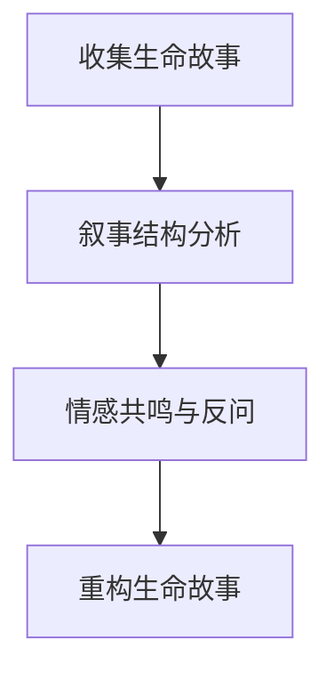
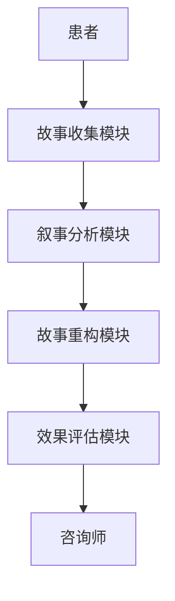
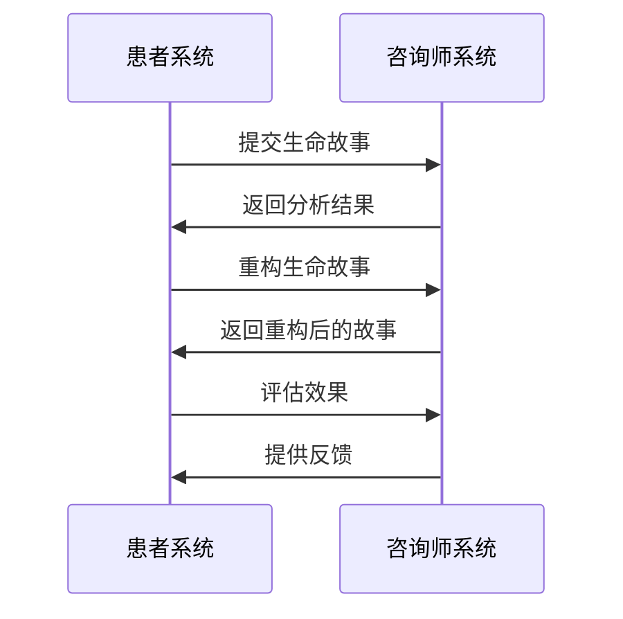

                 

## 让我们一步步思考：叙事疗法与人生重塑

### 关键词：叙事疗法、人生重塑、心理咨询、心理健康

**摘要：**
本文旨在深入探讨叙事疗法在人生重塑中的应用，通过系统的分析和实践指导，展示如何利用叙事疗法来重构人生故事，提高心理健康和生活质量。叙事疗法是一种通过叙述和反思来改变人们思维模式和行为方式的心理治疗方法。本文将分章节介绍叙事疗法的背景、基础概念、重构人生故事的方法、具体应用以及实践中的案例分析和前景展望。

**一、背景介绍**

叙事疗法起源于20世纪80年代的心理学领域，由心理学家迈克尔·怀特（Michael White）和埃伦·吉布森（Ellen Gibbs）提出。与传统心理治疗不同，叙事疗法强调个体的叙述能力和自主性，通过重构生命故事来促进个体的自我认识和自我改变。

叙事疗法认为，人们的生活经历是通过叙事的方式被建构和理解的。这些叙事不仅反映了个体对外部世界的感知，也塑造了他们的自我概念和价值观。因此，通过改变叙事，可以改变个体的心理状态和行为模式。

**二、核心概念与联系**

**1. 叙事的概念与特征**

**定义：** 叙事是关于个体或群体如何经历、理解并叙述其生活的过程。它不仅仅是对事件的记录，更是一种意义的建构。

**特征：** 叙事具有主观性、连续性、情景性和反思性。每个叙事都包含了一个“英雄”（即叙述者）在一个特定的情境中面临挑战、克服困难并实现成长的故事。

**2. 叙事结构**

**构成要素：** 叙事通常包括一个“情境”（设定）、一个“冲突”（问题或挑战）、一个“解决方案”（行动或转变）和一个“结果”（变化或成长）。

**结构类型：** 叙事可以是个人的、群体的、历史的或神话的。个人叙事通常关注个体的内心体验和生活变迁。

**3. 叙事分析法**

**定义：** 叙事分析法是一种通过解析叙事的结构和内容，以揭示叙述者的无意识思维模式和心理状态的方法。

**方法与技巧：** 包括提问技巧、情感共鸣技巧和反问技巧等。通过这些问题和技巧，治疗师可以帮助患者重新审视和重构他们的生命故事。

**三、算法原理讲解**

**1. 叙事分析算法流程**

**流程图：** 使用Mermaid画出叙事分析的基本流程图。



**2. 算法原理**

**数学模型：** 叙事疗法中的叙事分析可以看作是一种基于情感和认知的文本分析模型。其核心是识别叙事中的情感模式和认知结构，并通过调整这些模式来改变个体的心理状态。

**公式：** 设\(N\)为生命故事，\(E\)为情感元素，\(C\)为认知结构，\(R\)为重构后的生命故事。

\[ R = f(N, E, C) \]

其中，\(f\)为叙事重构函数。

**3. 算法举例**

假设一个患者的生命故事包含一系列失败的经历，我们可以通过情感共鸣和反问来重构这个叙事。

- **情感共鸣：** “我理解你在过去遇到很多困难，这让你感到很沮丧。”
- **反问：** “但是，你是否意识到每次困难之后，你都有所成长和学习呢？”

通过这样的重构，患者的情感状态可能会从消极转变为积极。

**四、系统分析与架构设计**

**1. 问题场景介绍**

在心理健康咨询中，患者通常需要通过叙述自己的生命故事来找到心理问题的根源。叙事疗法提供了这样一种方法，通过重构故事来改善患者的心理健康。

**2. 系统功能设计**

- **故事收集模块：** 收集患者的生命故事。
- **叙事分析模块：** 对生命故事进行结构分析和情感分析。
- **故事重构模块：** 帮助患者重构生命故事。
- **效果评估模块：** 评估叙事疗法的效果。

**3. 系统架构设计**

**架构图：** 使用Mermaid画出系统架构图。



**4. 系统接口设计**

- **患者接口：** 用于提交生命故事和查看重构后的故事。
- **咨询师接口：** 用于进行叙事分析、故事重构和效果评估。

**5. 系统交互**

**序列图：** 使用Mermaid画出系统交互序列图。



**五、项目实战**

**1. 环境安装**

- 安装Python环境
- 安装必要的库（如Mermaid渲染库）

**2. 系统核心实现**

- **代码实现：** 提供Python代码实现叙事分析、故事重构和效果评估的功能。

```python
# 伪代码示例
def analyze_story(story):
    # 分析故事结构
    pass

def restructure_story(story):
    # 重构故事
    pass

def assess_effect(story):
    # 评估故事效果
    pass
```

**3. 代码应用解读与分析**

- **代码解读：** 对核心代码进行详细解读，解释每个函数的实现过程和原理。

**4. 实际案例分析和详细讲解**

- **案例一：** 分析一个患者的生命故事，展示如何通过叙事疗法来重构故事。

**5. 项目小结**

- 总结项目的关键技术和实现方法，并提出改进建议。

### 小结

叙事疗法为人们提供了一种新的视角来理解自己和世界。通过系统的分析和实践指导，我们可以利用叙事疗法来重构人生故事，提高心理健康和生活质量。本文介绍了叙事疗法的背景、核心概念、重构人生故事的方法、具体应用以及实践中的案例分析和前景展望。希望读者能够通过这篇文章，对叙事疗法有更深入的理解和应用。

### 拓展阅读

- [1] Michael White, David Epston. Narrative Means to Therapeutic Ends. New York: W.W. Norton & Company, 1990.
- [2] Donald Meichenbaum. Cognitive Behaviour Therapy and Narrative Therapy: A Cognitive-Behavioural Analysis of Consulting Techniques. New York: Plenum Press, 1996.
- [3] David Denborough. Therapist’s Guide to Narrative Practice. New York: W.W. Norton & Company, 2013.

**作者：AI天才研究院/AI Genius Institute & 禅与计算机程序设计艺术 /Zen And The Art of Computer Programming**

