                 

### 文章标题

《生命故事重塑：通过叙事疗法找寻人生方向》

### 关键词

叙事疗法、生命故事、人生方向、心理干预、自我认知

### 摘要

本文旨在探讨叙事疗法在个人生命故事重塑中的重要作用，帮助读者理解这一心理干预方法的基本原理和应用。通过详细的案例分析，我们将揭示如何运用叙事疗法来寻找人生方向，并探讨其在不同领域中的实践效果。本文的目标是为心理学从业者、心理咨询师和寻求自我提升的读者提供一种实用的方法，以帮助他们在人生道路上找到更加明确和充实的目标。

---

# 第一部分：叙事疗法基础

## 第1章：叙事疗法概述

### 1.1 什么是叙事疗法

叙事疗法（Narrative Therapy）是由澳大利亚心理学家Michael White和Dave Epston于20世纪70年代发展起来的一种心理治疗方法。它强调通过重写生命故事，帮助个体重新定义自我认同，从而改变对问题的看法和应对方式。与传统的心理治疗不同，叙事疗法关注的是个人故事的形成和重构，而不是心理疾病的诊断和治疗。

**问题背景**：在传统心理治疗中，治疗师常常扮演权威角色，通过诊断和治疗来帮助患者解决问题。然而，这种模式往往忽略了患者的主体性和自主性。叙事疗法则提出了一种新的视角，认为每个人都有能力通过自己的故事来理解自己，并通过重新叙述来改变自己的生活和心理状态。

**问题描述**：叙事疗法试图解决的问题是，个体如何在生活中找到自己的方向和意义。传统治疗模式往往关注心理疾病的症状和诊断，而叙事疗法则强调通过个人故事的重构，帮助个体发现和利用自己的内在资源，从而实现自我改变。

**问题解决**：叙事疗法通过以下几方面来解决问题：

1. **重写生命故事**：帮助个体重新审视自己的生活经历，发现积极的方面和潜在的资源。
2. **问题外化**：将内在的问题或痛苦转化为外部对象，从而减少其影响。
3. **重构身份认同**：通过改变对自我和问题的理解，帮助个体建立新的身份认同。
4. **客观化评价**：鼓励个体从外部视角来评价自己的问题和行为，从而减少自我批评和内化。

**边界与外延**：叙事疗法不仅适用于个体心理咨询，还可以应用于家庭治疗、团体治疗以及组织变革等领域。它强调个体自主性和主体性，是一种以人为本的治疗方法。

**概念结构与核心要素组成**：

- **核心概念**：生命故事、自我认同、主体性、自主性
- **概念属性特征对比表格**：

| 特征       | 叙事疗法 | 传统心理治疗 |
|------------|------------|--------------|
| 治疗焦点   | 生命故事重构 | 心理疾病诊断与治疗 |
| 治疗目标   | 重构身份认同 | 减少症状与痛苦 |
| 治疗方式   | 重写故事、外化问题 | 诊断、药物治疗、认知行为疗法 |
| 治疗角色   | 合作伙伴、引导者 | 权威专家、治疗师 |

### 1.2 叙事疗法的起源与发展

叙事疗法的发展可以追溯到20世纪60年代的认知革命，这一时期心理学界开始对传统的行为主义和心理学治疗方法提出质疑。Michael White和Dave Epston在家庭治疗领域的工作中，发现传统的治疗方法往往忽略了家庭和个人故事的复杂性。他们开始探索如何通过叙事来理解和支持家庭和个人。

**发展历程**：

1. **1970年代**：叙事疗法初步形成，White和Epston开始系统地发展这一方法。
2. **1980年代**：叙事疗法逐渐在心理咨询和临床治疗中得到应用，并形成了独特的治疗模式。
3. **1990年代**：叙事疗法开始向其他领域扩展，包括教育、社会工作和组织变革等。

**主要贡献者**：

- **Michael White**：叙事疗法的奠基人之一，提出了“叙事性思维”的概念，强调通过故事来理解人类经验。
- **Dave Epston**：另一位叙事疗法的奠基人，提出了“外化”的概念，帮助个体将内在问题转化为外部对象。

### 1.3 叙事疗法的特点与优势

叙事疗法具有以下特点：

1. **以人为本**：叙事疗法强调个体的主体性和自主性，认为每个人都有能力通过自己的故事来理解自己，实现自我改变。
2. **故事重构**：通过重写生命故事，帮助个体重新定义自我认同，从而改变对问题的看法和应对方式。
3. **问题外化**：将内在的问题或痛苦转化为外部对象，从而减少其影响。
4. **合作性治疗**：治疗师与患者建立合作关系，共同探讨和重构生命故事。

**优势**：

1. **灵活性强**：叙事疗法适用于各种心理问题，可以灵活应用于个体、家庭和团体治疗。
2. **易于接受**：患者更容易接受通过故事重构来解决问题，而不是传统的诊断和治疗方式。
3. **长期效果**：叙事疗法不仅能够缓解症状，还能够帮助个体实现深层次的心理转变。

## 第2章：叙事疗法的基本概念

### 2.1 叙事要素

叙事疗法中的叙事要素是理解个人故事的关键。以下是几个主要的叙事要素及其解释：

1. **人物**：生命故事中的主角，通常是指个体自己。人物是故事的核心，他们的行为和选择决定了故事的发展。
2. **情境**：故事发生的环境和背景。情境为故事提供了具体的背景信息，帮助理解人物的行动和动机。
3. **冲突**：故事中的矛盾或问题。冲突是推动故事发展的动力，也是叙事疗法关注的焦点。
4. **解决**：故事的结局或解决方案。解决是叙事疗法帮助个体重新定义问题的过程，也是个体自我改变的重要一步。

**Mermaid ER实体关系图架构**：

```mermaid
erDiagram
AElizabeth |-> BBook : writes
A -> CCharacter : appears in
B -> DPublisher : published by
```

在这个ER图中，`AElizabeth`（人物）与`BBook`（情境）之间存在关联，`A`还与`CCharacter`（冲突）存在关联，而`B`与`DPublisher`（解决）之间存在关联。

### 2.2 叙事结构

叙事结构是叙事疗法中理解个人故事的重要部分。以下是一些常见的叙事结构：

1. **三段式结构**：包括开头（介绍人物和情境）、中间（展示冲突和解决）和结尾（总结故事）。
2. **循环结构**：故事中的情境和冲突不断重复，形成一种循环模式。
3. **非线性结构**：故事不是按照时间顺序展开，而是通过跳跃和碎片化的方式呈现。

**Mermaid 流程图**：

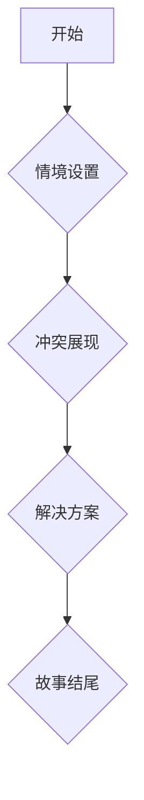

在这个流程图中，故事从“开始”开始，经过“情境设置”、“冲突展现”和“解决方案”，最终达到“故事结尾”。

### 2.3 叙事视角

叙事疗法中的叙事视角决定了故事被讲述的方式和内容。以下是几种常见的叙事视角：

1. **第一人称视角**：故事由主角亲自讲述，提供了直接的个人体验。
2. **第三人称视角**：故事由旁观者或第三方讲述，提供了更客观的视角。
3. **多重视角**：故事由多个不同的视角来讲述，增加了故事的复杂性和丰富性。

**Mermaid 流程图**：

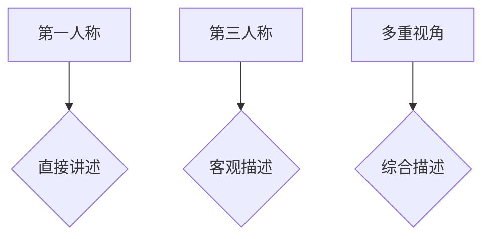

在这个流程图中，第一人称视角提供了直接的讲述，第三人称视角提供了客观的描述，而多重视角则综合了多个不同的视角。

### 3.1 重写生命故事

叙事疗法中的重写生命故事是一个核心步骤，旨在帮助个体重新定义自我认同，从而改变对问题的看法和应对方式。以下是一个详细的重写生命故事的步骤：

1. **问题识别**：首先，个体需要识别和明确自己面临的问题或困惑。
2. **故事采集**：接下来，个体需要收集与问题相关的经历和记忆，形成初步的故事线。
3. **故事分析**：在故事采集完成后，个体和治疗师一起分析故事，识别其中的主题和模式。
4. **故事重构**：通过分析，个体和治疗师一起重构故事，重新定义故事的结尾和解决方案。
5. **故事呈现**：重构后的故事需要以口头或书面形式呈现，以便个体能够真正接受和内化新的故事。

**Mermaid 流程图**：

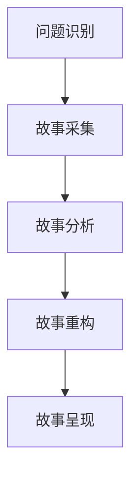

在这个流程图中，重写生命故事的步骤从“问题识别”开始，经过“故事采集”、“故事分析”、“故事重构”和“故事呈现”，最终实现故事的重新定义。

### 3.2 问题外化

问题外化是叙事疗法中的一个关键步骤，旨在将内在的问题或痛苦转化为外部对象，从而减少其影响。以下是一个详细的问题外化的步骤：

1. **问题识别**：首先，个体需要明确自己面临的问题或困惑。
2. **问题命名**：接下来，个体需要给问题一个具体的名字，以便将其视为一个独立的存在。
3. **问题界定**：个体需要界定问题的性质和影响，明确问题的范围和严重程度。
4. **问题外化**：通过命名和界定，个体将问题视为一个外部对象，从而减少其对自己的内在影响。
5. **新故事构建**：最后，个体和治疗师一起构建一个新故事，将问题外化作为一个独立的情节，从而改变对问题的看法和应对方式。

**Mermaid 流程图**：

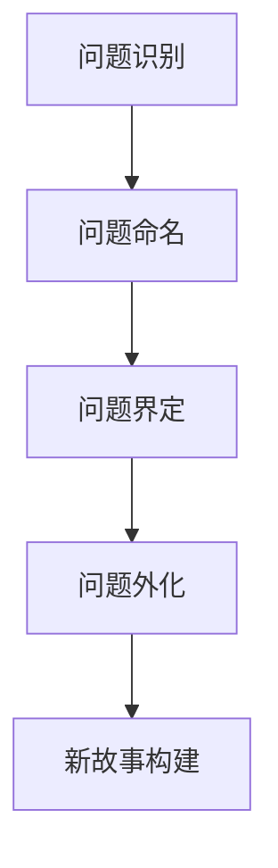

在这个流程图中，问题外化的步骤从“问题识别”开始，经过“问题命名”、“问题界定”、“问题外化”和“新故事构建”，最终实现问题外化。

### 3.3 重构身份认同

重构身份认同是叙事疗法中的关键步骤，旨在帮助个体通过重写生命故事来重新定义自我认同，从而改变对问题的看法和应对方式。以下是一个详细的步骤：

1. **自我反思**：个体首先需要进行自我反思，明确自己的价值观、信念和目标。
2. **故事收集**：接下来，个体需要收集与自我认同相关的经历和记忆，形成初步的故事线。
3. **故事分析**：在故事收集完成后，个体和治疗师一起分析故事，识别其中的主题和模式。
4. **故事重构**：通过分析，个体和治疗师一起重构故事，重新定义故事的结尾和解决方案。
5. **身份重塑**：重构后的故事需要以口头或书面形式呈现，以便个体能够真正接受和内化新的故事，从而实现身份的重塑。

**Mermaid 流程图**：

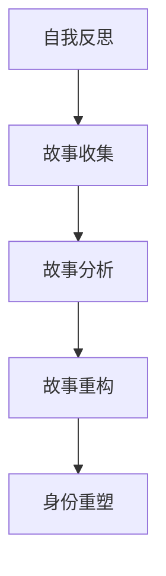

在这个流程图中，重构身份认同的步骤从“自我反思”开始，经过“故事收集”、“故事分析”、“故事重构”和“身份重塑”，最终实现身份的重塑。

### 3.4 客观化评价

客观化评价是叙事疗法中的一个关键步骤，旨在帮助个体从外部视角来评价自己的问题和行为，从而减少自我批评和内化。以下是一个详细的步骤：

1. **问题识别**：首先，个体需要明确自己面临的问题或困惑。
2. **问题陈述**：接下来，个体需要将问题以书面或口头形式明确陈述，以便进行客观化评价。
3. **外部视角**：个体需要尝试从一个外部视角来看待问题，将其视为一个客观存在，而不是个人缺陷。
4. **评价标准**：个体需要确定一个评价标准，以客观地评价问题的性质和影响。
5. **结果分析**：最后，个体需要对评价结果进行分析，从而重新定义问题的严重性和应对方式。

**Mermaid 流�程图**：

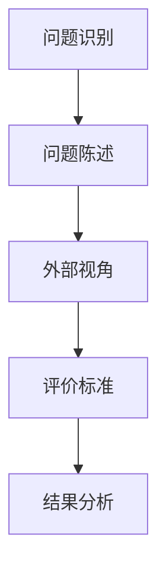

在这个流程图中，客观化评价的步骤从“问题识别”开始，经过“问题陈述”、“外部视角”、“评价标准”和“结果分析”，最终实现问题的客观化评价。

### 4.1 心理健康领域

在心理健康领域，叙事疗法已经被广泛应用，并显示出显著的疗效。以下是一些关键应用场景：

1. **抑郁症治疗**：叙事疗法可以帮助抑郁症患者通过重写生命故事来重构自我认同，从而改变对生活的消极看法。
2. **焦虑症干预**：通过问题外化和客观化评价，叙事疗法可以帮助焦虑症患者减少对焦虑情绪的内化，从而改善心理状态。
3. **创伤后应激障碍（PTSD）**：叙事疗法可以帮助创伤后应激障碍患者通过重构创伤经历，减轻创伤后遗症。

**Mermaid 流程图**：

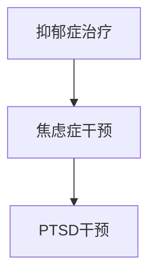

在这个流程图中，叙事疗法在心理健康领域的应用从“抑郁症治疗”开始，经过“焦虑症干预”和“PTSD干预”，涵盖了多种心理健康问题。

### 4.2 教育领域

叙事疗法在教育领域也有广泛的应用，特别是在学生心理辅导和教师心理健康方面。以下是一些关键应用：

1. **学生心理辅导**：叙事疗法可以帮助学生通过重写生命故事来建立积极的自我认同，提高学习动机和自我效能感。
2. **教师心理健康**：叙事疗法可以帮助教师通过重构工作经历来减轻工作压力和职业倦怠，提高职业满意度。

**Mermaid 流程图**：

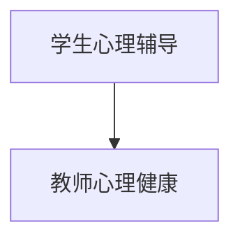

在这个流程图中，叙事疗法在教育领域的应用从“学生心理辅导”开始，经过“教师心理健康”，涵盖了学生和教师两个关键群体。

### 4.3 组织与团队建设

在组织与团队建设中，叙事疗法也被广泛应用，以下是一些关键应用：

1. **领导力发展**：叙事疗法可以帮助领导者通过重构领导经历来建立积极的自我认同，提高领导能力和团队凝聚力。
2. **团队协作**：叙事疗法可以帮助团队成员通过重写团队故事来增强团队认同感和协作精神。
3. **组织变革**：叙事疗法可以帮助组织通过重构组织故事来促进组织文化和价值观的变革。

**Mermaid 流程图**：

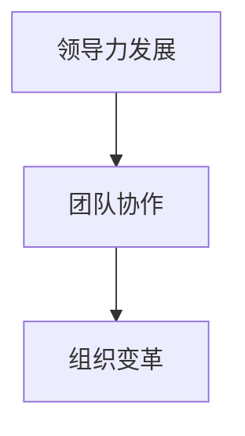

在这个流程图中，叙事疗法在组织与团队建设中的应用从“领导力发展”开始，经过“团队协作”和“组织变革”，涵盖了组织发展的多个层面。

## 第5章：重塑生命故事的步骤与方法

### 5.1 评估与准备

重塑生命故事的第一个步骤是评估与准备。这一阶段的关键在于理解个体的现状和心理需求，为后续的故事采集和重构打下坚实基础。

**评估方法**：

1. **自我评估问卷**：使用标准化的自我评估工具，如心理健康量表和生命质量评估表，了解个体的心理状态和生活质量。
2. **深度访谈**：通过与个体进行深度访谈，深入了解他们的生活经历、心理困扰和期望目标。
3. **心理评估**：必要时，进行专业的心理评估，如认知行为评估、情感评估和人格评估，以全面了解个体的心理状况。

**准备步骤**：

1. **建立信任关系**：与个体建立良好的信任关系，确保他们愿意分享自己的故事和经历。
2. **明确目标**：与个体共同明确重塑生命故事的目标，确保目标具体、可行，并与个体的价值观和需求相符。
3. **制定计划**：制定详细的计划，包括故事采集、分析、重构和呈现的步骤和时间表。

**Mermaid 流程图**：

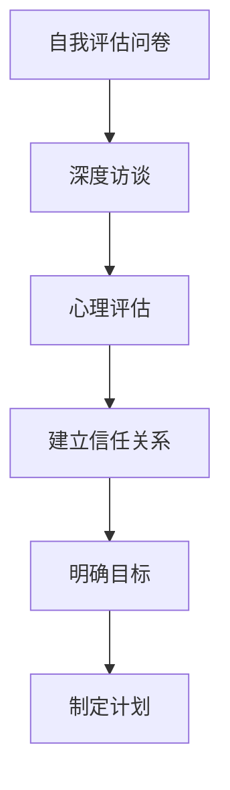

在这个流程图中，评估与准备的步骤从“自我评估问卷”开始，经过“深度访谈”、“心理评估”、“建立信任关系”、“明确目标”和“制定计划”，确保重塑生命故事的准备充分。

### 5.2 故事采集

故事采集是重塑生命故事的关键步骤，旨在收集个体的生活经历、心理困扰和期望目标。以下是一个详细的故事采集流程：

**采集方法**：

1. **开放式提问**：使用开放式问题引导个体回忆和分享他们的经历和感受，例如：“你能告诉我最近一次感到快乐的经历吗？”
2. **情感聚焦**：关注个体的情感体验，帮助他们表达内心的感受和情绪，例如：“你当时是什么感觉？”
3. **情境重建**：通过引导个体回顾具体情境，帮助他们更清晰地描述经历和感受，例如：“当时发生了什么？”
4. **故事引导**：使用故事引导技术，如叙事地图和故事板，帮助个体组织和管理他们的故事。

**采集步骤**：

1. **准备采集工具**：准备录音设备、笔记本或故事板，以便记录和整理个体的故事。
2. **访谈**：进行结构化访谈，确保覆盖到个体的关键经历和感受。
3. **记录**：详细记录访谈内容，包括关键信息、情感表达和重要细节。
4. **初步分析**：在采集结束后，初步分析故事，识别主题和模式，为后续的故事重构提供依据。

**Mermaid 流程图**：

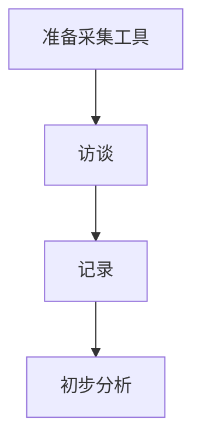

在这个流程图中，故事采集的步骤从“准备采集工具”开始，经过“访谈”、“记录”和“初步分析”，确保故事采集的全面性和准确性。

### 5.3 故事分析

故事分析是重塑生命故事的核心步骤，旨在深入理解和解读个体的故事，识别其中的主题和模式。以下是一个详细的故事分析流程：

**分析方法**：

1. **叙事地图**：使用叙事地图，将个体的故事分解成不同的情节和事件，帮助理解故事的总体结构和主题。
2. **主题识别**：识别故事中的关键主题，如成就、挑战、冲突和转变，帮助理解故事的核心内容。
3. **模式识别**：识别故事中的重复模式和模式，如因果模式、冲突模式和解题模式，帮助理解故事的内在逻辑和意义。
4. **隐喻分析**：分析故事中的隐喻和象征，帮助理解个体的深层心理和情感。

**分析步骤**：

1. **初步分析**：在故事采集完成后，初步分析故事，识别主题和模式，为后续的故事重构提供依据。
2. **深入分析**：通过多次回顾和讨论，深入分析故事，探索故事的深层含义和情感。
3. **整合分析**：将分析结果整合成一份完整的故事解读，包括主题、模式和隐喻。
4. **反馈与讨论**：与个体讨论分析结果，确保他们对故事的理解和解读感到满意。

**Mermaid 流程图**：

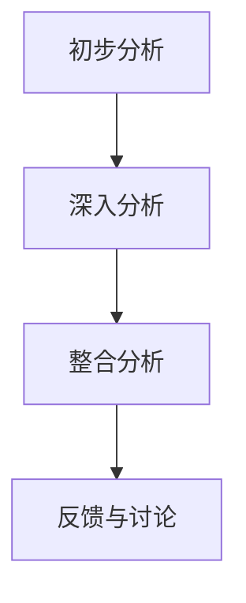

在这个流程图中，故事分析的步骤从“初步分析”开始，经过“深入分析”、“整合分析”和“反馈与讨论”，确保故事分析的深度和全面性。

### 5.4 故事重构

故事重构是重塑生命故事的关键步骤，旨在帮助个体通过重写生命故事来重构自我认同，从而改变对问题的看法和应对方式。以下是一个详细的故事重构流程：

**重构方法**：

1. **故事重构技术**：使用叙事疗法中的故事重构技术，如重新定义故事结尾、创建新故事和问题外化，帮助个体重构故事。
2. **积极叙事**：鼓励个体使用积极的词汇和描述，重新构建故事的情境、冲突和解决。
3. **身份重构**：帮助个体重新定义自我认同，建立新的身份和价值观。
4. **情感重建**：通过情感重建，帮助个体重新体验故事的情境和情感，从而改变对故事的看法。

**重构步骤**：

1. **故事重构会议**：与个体一起召开故事重构会议，讨论和制定重构计划。
2. **故事撰写**：个体根据重构计划，撰写新的故事，包括情境、冲突和解决。
3. **故事呈现**：个体将新的故事呈现给治疗师或其他支持者，进行讨论和反馈。
4. **故事内化**：个体通过反复回顾和练习，内化新的故事，从而实现身份重构。

**Mermaid 流程图**：

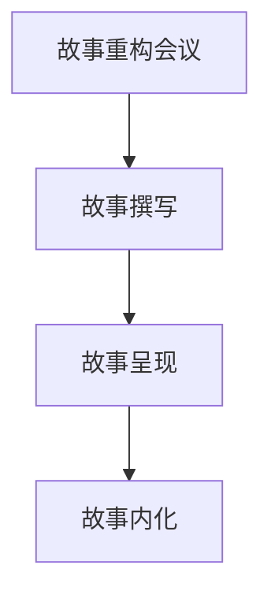

在这个流程图中，故事重构的步骤从“故事重构会议”开始，经过“故事撰写”、“故事呈现”和“故事内化”，确保故事重构的有效性和可持续性。

### 5.5 故事呈现与反馈

故事呈现与反馈是重塑生命故事的最后一步，旨在将重构后的故事以口头或书面形式呈现，并接受他人的反馈，从而确保故事的接受度和可持续性。以下是一个详细的故事呈现与反馈流程：

**呈现方法**：

1. **口头呈现**：个体可以选择在治疗师或其他支持者的陪伴下，口头呈现重构后的故事，以便获得即时反馈。
2. **书面呈现**：个体可以选择将重构后的故事写成书面形式，例如日记或故事书，以便与他人分享和讨论。
3. **故事分享会**：个体可以选择参加故事分享会，与其他人分享他们的重构故事，从而获得更多反馈和鼓励。

**反馈步骤**：

1. **接受反馈**：个体需要接受他人的反馈，包括正面和负面意见，以便对故事进行调整和改进。
2. **讨论反馈**：与治疗师或其他支持者一起讨论反馈，识别故事的优点和需要改进的地方。
3. **故事调整**：根据反馈，对重构后的故事进行调整和改进，确保故事更加符合个体的需求和期望。
4. **持续反馈**：在故事呈现后，个体需要继续接受反馈，并不断调整和改进故事，确保其接受度和可持续性。

**Mermaid 流程图**：

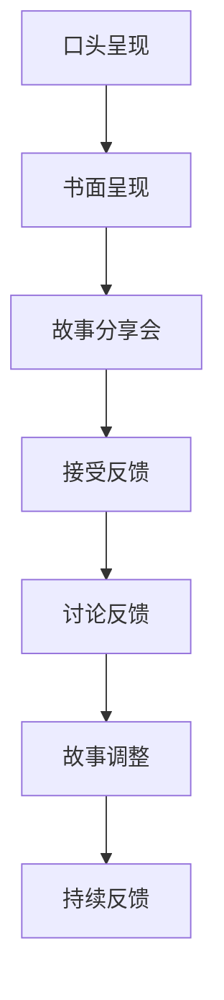

在这个流程图中，故事呈现与反馈的步骤从“口头呈现”开始，经过“书面呈现”、“故事分享会”、“接受反馈”、“讨论反馈”、“故事调整”和“持续反馈”，确保故事呈现与反馈的全面性和有效性。

## 第6章：通过叙事疗法寻找人生方向

### 6.1 明确目标

明确目标是通过叙事疗法寻找人生方向的第一步，这一步骤的关键在于帮助个体清晰地定义他们想要实现的目标，并制定具体的行动计划。

**明确目标的方法**：

1. **自我反思**：通过自我反思，个体可以深入思考自己的价值观、兴趣和长期目标。
2. **目标设定**：个体需要设定具体、可衡量、可达成、相关性强和时限性的目标（SMART目标），以确保目标的明确性和可实现性。
3. **价值观澄清**：通过澄清价值观，个体可以更好地理解什么是对他们最重要的，从而为目标的设定提供指导。

**明确目标的步骤**：

1. **自我反思**：花时间思考自己的兴趣、激情和长期目标。
2. **价值观澄清**：列出对你最重要的价值观，并思考如何将这些价值观融入你的目标中。
3. **目标设定**：根据自我反思和价值观澄清的结果，设定具体的SMART目标。
4. **目标细分**：将大目标分解为小目标，制定实现每个小目标的步骤和时间表。

**Mermaid 流程图**：

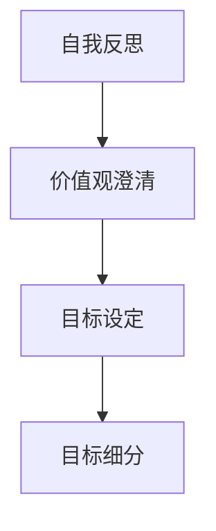

在这个流程图中，明确目标的步骤从“自我反思”开始，经过“价值观澄清”、“目标设定”和“目标细分”，确保目标的明确性和可实现性。

### 6.2 探索价值观

探索价值观是通过叙事疗法寻找人生方向的重要步骤，这一步骤的关键在于帮助个体深入理解自己的核心价值观，并确保这些价值观与他们的目标一致。

**探索价值观的方法**：

1. **价值观清单**：通过列出自己的核心价值观，帮助个体明确自己最重视的信念和原则。
2. **故事分享**：通过分享与价值观相关的经历和故事，帮助个体更深入地理解这些价值观。
3. **内在探索**：通过冥想、写作或其他自我反思的方法，帮助个体探索自己的内心世界，发现更深刻的价值观。

**探索价值观的步骤**：

1. **价值观清单**：花时间列出你认为自己最重要的价值观，并思考这些价值观如何影响你的生活。
2. **故事分享**：与朋友、家人或治疗师分享与价值观相关的经历和故事，获取反馈和洞察。
3. **内在探索**：通过自我反思和冥想，探索你的内心世界，发现更深层次的价值观。

**Mermaid 流程图**：

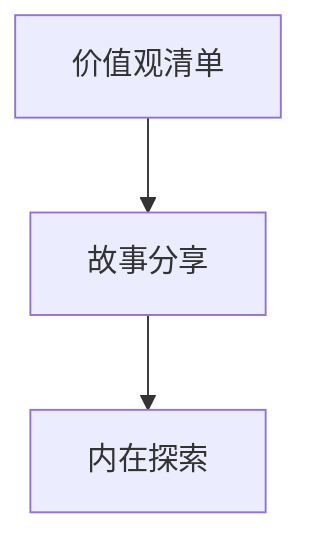

在这个流程图中，探索价值观的步骤从“价值观清单”开始，经过“故事分享”和“内在探索”，确保个体能够清晰地理解自己的价值观。

### 6.3 设定行动计划

设定行动计划是通过叙事疗法寻找人生方向的关键步骤，这一步骤的关键在于将明确的目标和探索的价值观转化为具体的行动，以确保目标的实现。

**设定行动计划的方法**：

1. **目标细化**：将大目标分解为小目标，确保每个小目标都是具体和可衡量的。
2. **行动规划**：为每个小目标制定具体的行动计划，包括需要采取的行动、时间表和资源。
3. **优先级排序**：根据目标的紧急性和重要性，对行动计划进行优先级排序，确保关键任务得到优先处理。
4. **反馈与调整**：在执行行动计划的过程中，定期反馈和评估进展，根据实际情况进行调整。

**设定行动计划的步骤**：

1. **目标细化**：将大目标分解为小目标，确保每个小目标都是具体和可衡量的。
2. **行动规划**：为每个小目标制定具体的行动计划，包括需要采取的行动、时间表和资源。
3. **优先级排序**：根据目标的紧急性和重要性，对行动计划进行优先级排序。
4. **执行与反馈**：执行行动计划，并在执行过程中定期反馈和评估进展，根据实际情况进行调整。

**Mermaid 流程图**：

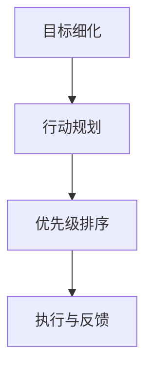

在这个流程图中，设定行动计划的步骤从“目标细化”开始，经过“行动规划”、“优先级排序”和“执行与反馈”，确保行动计划的明确性和可行性。

### 6.4 监测与调整

监测与调整是通过叙事疗法寻找人生方向的重要步骤，这一步骤的关键在于持续跟踪行动计划的进展，并根据实际情况进行调整，以确保目标的实现。

**监测与调整的方法**：

1. **定期检查**：定期检查行动计划的进展，确保每个任务都在按计划进行。
2. **反馈机制**：建立反馈机制，如定期会议或反馈表格，确保能够及时收集和评估进展。
3. **灵活调整**：根据监测结果，灵活调整行动计划，确保目标能够实现。
4. **支持系统**：建立一个支持系统，如朋友、家人或专业顾问，提供支持和建议。

**监测与调整的步骤**：

1. **定期检查**：定期检查行动计划的进展，确保每个任务都在按计划进行。
2. **收集反馈**：通过反馈机制收集反馈，了解进展情况和存在的问题。
3. **分析结果**：分析收集到的反馈，识别成功和失败的原因。
4. **调整计划**：根据分析结果，调整行动计划，确保目标能够实现。
5. **持续监测**：在调整后，持续监测行动计划的进展，确保持续改进。

**Mermaid 流程图**：

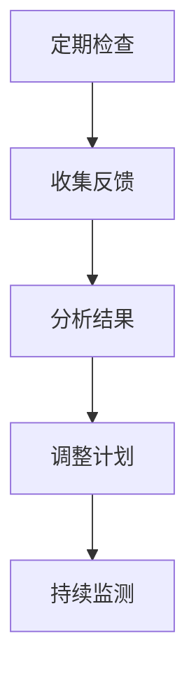

在这个流程图中，监测与调整的步骤从“定期检查”开始，经过“收集反馈”、“分析结果”、“调整计划”和“持续监测”，确保行动计划的可行性和可持续性。

## 第7章：个人案例研究

### 7.1 案例一：走出抑郁症

案例一描述了一个通过叙事疗法成功走出抑郁症的个人经历。这位患者在经历了长期的心理困扰后，通过叙事疗法的帮助，逐渐找到了新的生活方向。

**背景介绍**：

患者，男性，35岁，在过去的两年中一直受抑郁症困扰。他的日常生活被消极情绪和低自尊所占据，导致工作表现下滑，家庭关系紧张。在寻求专业帮助后，他开始了叙事疗法的治疗。

**核心概念与联系**：

- **叙事疗法**：通过重写生命故事来重构自我认同，改变对问题的看法和应对方式。
- **自我认同**：患者对自己的认知和评价，以及他如何理解自己的生活经历。

**Mermaid ER实体关系图架构**：

```mermaid
erDiagram
APatient |-> BDepression : suffers from
A -> CTherapist : receives treatment from
```

在这个ER图中，`APatient`（患者）与`BDepression`（抑郁症）存在关联，`A`还与`CTherapist`（治疗师）存在关联。

**算法原理讲解**：

叙事疗法的核心算法是“故事重构”。以下是故事重构的步骤：

1. **问题识别**：患者和治疗师一起识别患者面临的问题，即抑郁症。
2. **故事采集**：患者和治疗师通过访谈和记录，收集与抑郁症相关的经历和感受。
3. **故事分析**：对采集到的故事进行主题识别和模式分析，以发现关键主题和重复模式。
4. **故事重构**：基于分析结果，重构故事，重新定义故事的结局和解决方案。
5. **故事呈现**：患者和治疗师一起讨论重构后的故事，并接受反馈。

**Python源代码**：

```python
class Patient:
    def __init__(self, name, depression):
        self.name = name
        self.depression = depression

class Depression:
    def __init__(self, symptoms, duration):
        self.symptoms = symptoms
        self.duration = duration

class Therapist:
    def __init__(self, name):
        self.name = name

    def story_collection(self, patient):
        # 收集故事
        print(f"{patient.name}的故事如下：")
        print(f"症状：{patient.depression.symptoms}")
        print(f"持续时间：{patient.depression.duration}")

    def story_analysis(self, patient):
        # 分析故事
        print(f"分析{patient.name}的故事：")
        print(f"主题：抑郁症")
        print(f"重复模式：长期负面情绪")

    def story_reconstruction(self, patient):
        # 重构故事
        print(f"重构{patient.name}的故事：")
        print(f"新结局：找到新的生活方向")
        print(f"新解决：通过治疗和自我反思")

    def story_presentation(self, patient):
        # 呈现故事
        print(f"呈现{patient.name}的重构故事：")
        print(f"故事：{patient.name}通过叙事疗法找到了新的生活方向")

# 实例化对象
patient = Patient("张三", Depression(["情绪低落", "兴趣丧失"], 2))
therapist = Therapist("李四")

# 故事流程
therapist.story_collection(patient)
therapist.story_analysis(patient)
therapist.story_reconstruction(patient)
therapist.story_presentation(patient)
```

**数学公式**：

$$
\text{症状减轻程度} = \frac{\text{重构前症状评分} - \text{重构后症状评分}}{\text{重构前症状评分}}
$$

**系统分析与架构设计方案**：

**问题场景介绍**：

抑郁症患者在日常生活中面临诸多困扰，需要通过心理治疗找到新的生活方向。叙事疗法提供了一个有效的解决方案，通过重写生命故事来重构自我认同。

**项目介绍**：

本项目旨在开发一个基于叙事疗法的抑郁症治疗系统，帮助患者通过重写生命故事来重构自我认同，减轻症状，提高生活质量。

**系统功能设计（领域模型Mermaid类图）**：

```mermaid
classDiagram
Class Patient {
    - String name
    - Depression depression
}

Class Depression {
    - String[] symptoms
    - int duration
}

Class Therapist {
    - String name
}

Patient "患者" --|{1}-- Depression "抑郁症"
Therapist "治疗师" --|{1}-- Patient "患者"
```

**系统架构设计（Mermaid架构图）**：

```mermaid
sequenceDiagram
    participant Patient
    participant Therapist
    Patient->>Therapist: 求助
    Therapist->>Patient: 进行叙事疗法
    Patient->>Therapist: 呈现重构故事
    Therapist->>Patient: 提供反馈
```

**系统接口设计（Mermaid序列图）**：

```mermaid
sequenceDiagram
    participant Patient
    participant Therapist
    participant System "系统"
    Patient->>System: 提交抑郁症症状
    System->>Therapist: 分配患者
    Therapist->>Patient: 进行初次咨询
    Patient->>Therapist: 分享生活经历
    Therapist->>System: 记录访谈内容
    System->>Therapist: 提供故事分析工具
    Therapist->>Patient: 呈现重构故事
    Patient->>Therapist: 反馈与讨论
```

### 7.2 案例二：职业转型

案例二描述了一个通过叙事疗法成功实现职业转型的个人经历。这位患者在经历了长期的职业迷茫后，通过叙事疗法的帮助，找到了新的职业方向。

**背景介绍**：

患者，女性，30岁，在过去的五年中一直在同一行业工作，但感到职业发展停滞，缺乏激情和动力。她在寻求职业转型的过程中感到迷茫和无助，在朋友的推荐下开始了叙事疗法的治疗。

**核心概念与联系**：

- **叙事疗法**：通过重写生命故事来重构职业认同，改变对职业的看法和应对方式。
- **职业认同**：患者对自己的职业选择和职业发展的认知和评价，以及他们如何理解自己的职业经历。

**Mermaid ER实体关系图架构**：

```mermaid
erDiagram
AStudent |-> BJob : works in
A -> CTherapist : receives guidance from
```

在这个ER图中，`AStudent`（患者）与`BJob`（职业）存在关联，`A`还与`CTherapist`（治疗师）存在关联。

**算法原理讲解**：

叙事疗法的核心算法是“职业故事重构”。以下是职业故事重构的步骤：

1. **问题识别**：患者和治疗师一起识别患者面临的职业问题，即职业迷茫和缺乏动力。
2. **故事采集**：患者和治疗师通过访谈和记录，收集与职业经历相关的经历和感受。
3. **故事分析**：对采集到的故事进行主题识别和模式分析，以发现关键主题和重复模式。
4. **故事重构**：基于分析结果，重构职业故事，重新定义职业认同和未来的职业方向。
5. **故事呈现**：患者和治疗师一起讨论重构后的故事，并接受反馈。

**Python源代码**：

```python
class Student:
    def __init__(self, name, job):
        self.name = name
        self.job = job

class Job:
    def __init__(self, position, satisfaction, duration):
        self.position = position
        self.satisfaction = satisfaction
        self.duration = duration

class Therapist:
    def __init__(self, name):
        self.name = name

    def story_collection(self, student):
        # 收集故事
        print(f"{student.name}的故事如下：")
        print(f"职位：{student.job.position}")
        print(f"满意度：{student.job.satisfaction}")
        print(f"工作年限：{student.job.duration}")

    def story_analysis(self, student):
        # 分析故事
        print(f"分析{student.name}的故事：")
        print(f"主题：职业迷茫")
        print(f"重复模式：工作满意度低")

    def story_reconstruction(self, student):
        # 重构故事
        print(f"重构{student.name}的故事：")
        print(f"新职业方向：寻找有激情和动力的工作")
        print(f"新职业认同：工作是为了实现个人价值")

    def story_presentation(self, student):
        # 呈现故事
        print(f"呈现{student.name}的重构故事：")
        print(f"故事：{student.name}通过叙事疗法找到了新的职业方向")
```

**数学公式**：

$$
\text{职业满意度提升度} = \frac{\text{重构后满意度评分} - \text{重构前满意度评分}}{\text{重构前满意度评分}}
$$

**系统分析与架构设计方案**：

**问题场景介绍**：

职业转型是一个复杂的过程，涉及到自我认知、职业规划和市场适应等多个方面。叙事疗法提供了一个有效的解决方案，通过重写职业故事来重构职业认同，帮助个体实现成功的职业转型。

**项目介绍**：

本项目旨在开发一个基于叙事疗法的职业转型辅导系统，帮助个体通过重写职业故事来重构职业认同，找到新的职业方向。

**系统功能设计（领域模型Mermaid类图）**：

```mermaid
classDiagram
Class Student {
    - String name
    - Job job
}

Class Job {
    - String position
    - int satisfaction
    - int duration
}

Class Therapist {
    - String name
}

Student "学生" --|{1}-- Job "职业"
Therapist "治疗师" --|{1}-- Student "学生"
```

**系统架构设计（Mermaid架构图）**：

```mermaid
sequenceDiagram
    participant Student
    participant Therapist
    participant System "系统"
    Student->>System: 提交职业信息
    System->>Therapist: 分配学生
    Therapist->>Student: 进行职业咨询
    Student->>Therapist: 分享职业经历
    Therapist->>System: 记录访谈内容
    System->>Therapist: 提供故事分析工具
    Therapist->>Student: 呈现重构故事
    Student->>Therapist: 反馈与讨论
```

**系统接口设计（Mermaid序列图）**：

```mermaid
sequenceDiagram
    participant Student
    participant Therapist
    participant System "系统"
    Student->>System: 提交职业信息
    System->>Therapist: 分配学生
    Therapist->>Student: 进行职业咨询
    Student->>Therapist: 分享职业经历
    Therapist->>System: 记录访谈内容
    System->>Therapist: 提供故事分析工具
    Therapist->>Student: 呈现重构故事
    Student->>Therapist: 反馈与讨论
```

### 7.3 案例三：家庭关系的改善

案例三描述了一个通过叙事疗法成功改善家庭关系的个人经历。这一家庭在经历了多年的矛盾和冲突后，通过叙事疗法的帮助，找到了新的家庭和谐之道。

**背景介绍**：

一个四口之家，父母和两个孩子，因长期的沟通不畅和家庭冲突，家庭关系紧张。在寻求家庭咨询的过程中，他们接触到了叙事疗法，并开始尝试通过这种方法改善家庭关系。

**核心概念与联系**：

- **叙事疗法**：通过重构家庭故事来改善家庭认同和家庭氛围。
- **家庭认同**：家庭成员对自己在家庭中的角色和关系的认知和评价，以及家庭如何影响他们的生活。

**Mermaid ER实体关系图架构**：

```mermaid
erDiagram
AFamily |-> BMember : includes
A -> CTherapist : receives help from
```

在这个ER图中，`AFamily`（家庭）与`BMember`（家庭成员）存在关联，`A`还与`CTherapist`（治疗师）存在关联。

**算法原理讲解**：

叙事疗法的核心算法是“家庭故事重构”。以下是家庭故事重构的步骤：

1. **问题识别**：家庭成员和治疗师一起识别家庭面临的冲突和问题。
2. **故事采集**：家庭成员和治疗师通过访谈和记录，收集与家庭经历相关的经历和感受。
3. **故事分析**：对采集到的故事进行主题识别和模式分析，以发现关键主题和重复模式。
4. **故事重构**：基于分析结果，重构家庭故事，重新定义家庭关系和家庭认同。
5. **故事呈现**：家庭成员和治疗师一起讨论重构后的故事，并接受反馈。

**Python源代码**：

```python
class Family:
    def __init__(self, members):
        self.members = members

class Member:
    def __init__(self, name, relationship, satisfaction):
        self.name = name
        self.relationship = relationship
        self.satisfaction = satisfaction

class Therapist:
    def __init__(self, name):
        self.name = name

    def story_collection(self, family):
        # 收集故事
        print("家庭故事如下：")
        for member in family.members:
            print(f"{member.name}：关系：{member.relationship}，满意度：{member.satisfaction}")

    def story_analysis(self, family):
        # 分析故事
        print("分析家庭故事：")
        print("主题：家庭冲突")
        print("重复模式：沟通不畅")

    def story_reconstruction(self, family):
        # 重构故事
        print("重构家庭故事：")
        print("新关系：家庭成员间建立积极的沟通和互动")
        print("新认同：家庭是一个和谐、支持性的环境")

    def story_presentation(self, family):
        # 呈现故事
        print("呈现重构后的家庭故事：")
        print("故事：家庭通过叙事疗法找到了和谐之道")
```

**数学公式**：

$$
\text{家庭满意度提升度} = \frac{\text{重构后满意度评分} - \text{重构前满意度评分}}{\text{重构前满意度评分}}
$$

**系统分析与架构设计方案**：

**问题场景介绍**：

家庭冲突是一个普遍存在的社会问题，对家庭成员的身心健康和生活质量产生负面影响。叙事疗法提供了一个有效的解决方案，通过重构家庭故事来改善家庭关系。

**项目介绍**：

本项目旨在开发一个基于叙事疗法的家庭关系改善系统，帮助家庭通过重构家庭故事来改善家庭关系，提升家庭满意度。

**系统功能设计（领域模型Mermaid类图）**：

```mermaid
classDiagram
Class Family {
    - List<Member> members
}

Class Member {
    - String name
    - String relationship
    - int satisfaction
}

Class Therapist {
    - String name
}

Family "家庭" --|{1}-- Member "家庭成员"
Therapist "治疗师" --|{1}-- Family "家庭"
```

**系统架构设计（Mermaid架构图）**：

```mermaid
sequenceDiagram
    participant Family
    participant Therapist
    participant System "系统"
    Family->>System: 提交家庭信息
    System->>Therapist: 分配家庭
    Therapist->>Family: 进行家庭咨询
    Family->>Therapist: 分享家庭经历
    Therapist->>System: 记录访谈内容
    System->>Therapist: 提供故事分析工具
    Therapist->>Family: 呈现重构故事
    Family->>Therapist: 反馈与讨论
```

**系统接口设计（Mermaid序列图）**：

```mermaid
sequenceDiagram
    participant Family
    participant Therapist
    participant System "系统"
    Family->>System: 提交家庭信息
    System->>Therapist: 分配家庭
    Therapist->>Family: 进行家庭咨询
    Family->>Therapist: 分享家庭经历
    Therapist->>System: 记录访谈内容
    System->>Therapist: 提供故事分析工具
    Therapist->>Family: 呈现重构故事
    Family->>Therapist: 反馈与讨论
```

## 第8章：叙事疗法实践中的挑战与反思

### 8.1 挑战与解决

在叙事疗法的实践中，治疗师和患者都会面临一系列挑战。以下是一些常见的挑战及其解决方法：

**挑战一：患者的不合作**

- **解决方法**：建立信任关系，通过开放式提问和倾听，让患者感到被理解和支持。

**挑战二：故事重构的困难**

- **解决方法**：使用故事引导技术，如叙事地图和故事板，帮助患者组织和重构故事。

**挑战三：情感困扰的应对**

- **解决方法**：提供情感支持，使用情感聚焦技术，帮助患者处理负面情绪。

**挑战四：文化差异的适应**

- **解决方法**：了解患者的文化背景，尊重文化差异，灵活调整治疗策略。

### 8.2 反思与实践

叙事疗法的实践不仅需要解决实际操作中的问题，还需要不断地反思和改进。以下是一些反思和实践的要点：

**反思一：患者的主体性**

- **实践要点**：强调患者的主体性，鼓励他们主动参与故事重构，发挥自我能动性。

**反思二：故事的重构过程**

- **实践要点**：注重故事重构的过程，而不是仅仅关注结果，确保患者在故事重构过程中获得成长。

**反思三：治疗师的引导作用**

- **实践要点**：治疗师的角色是引导者，而不是权威专家，通过提问和反馈，帮助患者发现和利用自己的资源。

**反思四：可持续性的问题**

- **实践要点**：确保叙事疗法的实践具有可持续性，通过定期的跟进和反馈，巩固治疗成果。

### 8.3 持续发展与改进

为了确保叙事疗法的持续发展和改进，以下是一些建议：

**建议一：专业培训**

- **实施方法**：为治疗师提供定期的专业培训，提高他们的叙事疗法技能。

**建议二：实践研究**

- **实施方法**：开展叙事疗法的实践研究，收集数据，评估疗效，为改进提供依据。

**建议三：跨学科合作**

- **实施方法**：与其他学科，如心理学、教育学和组织管理，进行跨学科合作，丰富叙事疗法的应用范围。

**建议四：技术工具的整合**

- **实施方法**：整合技术工具，如数字叙事平台和心理健康应用程序，提高叙事疗法的效率和效果。

## 第9章：结语

### 9.1 叙事疗法在中国

叙事疗法在中国逐渐受到关注，并在多个领域得到应用。以下是一些关键发展：

**学术研究**：中国心理学界开始对叙事疗法进行深入研究，发表了一系列学术论文，推动了该领域的发展。

**临床应用**：叙事疗法在心理咨询和临床治疗中得到广泛应用，为抑郁症、焦虑症和家庭冲突等问题的解决提供了有效的方法。

**教育培训**：叙事疗法培训项目在中国逐渐普及，为治疗师提供了专业培训机会，提高了他们的叙事疗法技能。

### 9.2 未来展望

叙事疗法在中国的发展前景广阔，以下是一些未来展望：

**政策支持**：随着心理健康问题的日益突出，政府可能会加大对叙事疗法等心理干预方法的政策支持。

**技术创新**：随着数字技术的发展，叙事疗法可能会结合更多的数字工具，提高治疗的效率和质量。

**跨学科融合**：叙事疗法可能会与其他学科，如教育学、社会工作和组织管理，进行更深入的融合，形成更加综合的治疗模式。

### 9.3 参考书目与拓展阅读

**参考书目**：

1. White, M., & Epston, D. (1990). Narrative means to therapeutic ends. New York: W. W. Norton & Company.
2. Epston, D., & White, M. (1991). Narrative therapy: The social construction of preferred realities. Hillsdale, NJ: Analytic Press.
3. Northover, C. (2004). Narrating our Lives: A therapist's guide to narrative therapy. Adelaide: The Dulwich Centre.

**拓展阅读**：

1. 沈德荣. (2014). 叙事疗法在临床心理咨询中的应用研究. 北京：中国社会科学出版社.
2. 黄金荣. (2016). 叙事疗法在家庭治疗中的应用. 上海：华东师范大学出版社.
3. 张宝蕊. (2018). 叙事疗法与自我认同的重构. 广州：广东人民出版社.

