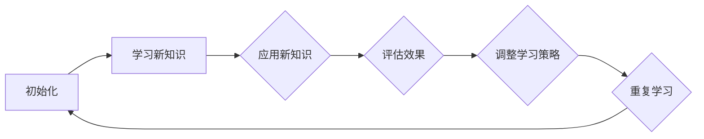

                 

## 引言

### 生命的广度：意义与价值

在数字化和信息化的时代，我们的生命体验正在发生前所未有的变革。而生命的广度，即我们经历和视野的拓展，成为衡量个人成长和成就的重要指标。本文将以“生命的广度：拓展经历和视野的方法”为标题，探讨如何在信息技术领域内实现这一目标。

首先，我们需要明确生命的广度这一概念。它不仅仅是地理意义上的旅行距离，更是指个人的知识、经验、视野和价值观的丰富程度。在信息技术领域，生命的广度代表着我们对技术理解深度、行业视野的广度和创新思维的宽度。

**关键词**：生命的广度、拓展经历、视野、信息技术、个人成长

### 研究背景与目的

在当前的社会环境中，技术的发展速度远远超过我们的想象，AI、大数据、云计算等新兴技术不断涌现，给我们的生活和工作带来了深刻的影响。作为信息技术领域的工作者，我们面临着前所未有的机遇和挑战。如何在这一快速变化的环境中不断成长，拓展自己的生命广度，成为一个迫切需要解决的问题。

本文的研究目的在于，通过系统的分析和实践，探索出在信息技术领域内拓展经历和视野的有效方法。这不仅有助于提升个人的职业素养和竞争力，也有助于我们更好地适应和引领技术发展的潮流。

### 当前研究现状与不足

目前，关于拓展经历和视野的研究已有不少成果。然而，这些研究大多集中在教育、心理学等领域，针对信息技术领域的专门研究还比较稀缺。现有的研究大多缺乏系统性，往往只关注某个方面，忽视了综合性的方法。

本文将填补这一空白，通过综合分析，提出一套适合信息技术领域的工作者拓展经历和视野的方法。同时，本文还将结合实际案例，对这些方法进行验证和优化，以确保其有效性和实用性。

### 研究目的与贡献

本文的研究旨在为信息技术领域的工作者提供一套系统的、可操作的方法，帮助他们拓展自己的经历和视野。具体来说，本文将从以下几个方面展开：

1. **理论基础**：首先，本文将对拓展经历和视野的相关理论进行系统梳理，为后续的实践提供理论基础。

2. **方法探索**：本文将结合信息技术领域的特点，探索出一套适合该领域的工作者拓展经历和视野的方法。

3. **案例分析**：通过具体案例的分析，展示这些方法在实际应用中的效果。

4. **实践指导**：总结实践经验，提出最佳实践建议，为读者提供实用的指导。

通过本文的研究，我们期望能够为信息技术领域的工作者提供一套完整的、系统的拓展经历和视野的方法，帮助他们实现个人成长，提升职业竞争力，同时也为该领域的研究提供有益的参考。

### 引言总结

本文将从理论基础、方法探索、案例分析、实践指导等多个方面，系统地探讨在信息技术领域内拓展经历和视野的方法。通过本文的阅读，读者将能够了解到拓展生命的广度的重要性，掌握一套有效的实践方法，从而在快速发展的信息技术领域中获得持续的成长和进步。

----------------------------------------------------------------

# 第1部分：拓展经历的方法

在这个快速变化的时代，个人经历对于职业发展和人生成就具有不可忽视的重要性。作为信息技术领域的工作者，我们需要不断拓展自己的经历，以适应不断变化的技术环境。本部分将探讨几种有效的拓展经历的方法。

## 第1章：个人成长与经历拓展

### 1.1 个人成长的重要性

个人成长是一个长期而持续的过程，它涉及到知识、技能、态度和价值观等多个方面。在信息技术领域，个人成长尤为重要，因为它直接影响到我们的专业能力和创新思维。

**LET'S THINK STEP BY STEP**

1. **知识积累**：随着技术的快速发展，我们需要不断学习新的知识，以保持自己的竞争力。这不仅包括编程语言、算法和数据结构等基础知识，还包括新兴技术的学习，如人工智能、区块链等。

2. **技能提升**：技能的提升不仅仅是在技术上，还包括沟通、团队合作、项目管理等多个方面。这些软技能对于我们在工作中的成功至关重要。

3. **态度调整**：积极的态度和良好的心态能够帮助我们面对挑战，克服困难。在信息技术领域，我们需要具备抗压能力、耐心和持续学习的热情。

4. **价值观塑造**：正确的价值观能够引导我们在工作和生活中做出正确的选择，提升我们的职业道德和责任感。

### 1.2 经历拓展的方法

为了拓展个人的经历，我们需要采取一系列具体的行动。以下是一些有效的方法：

**1. 学习新知识**

- **在线课程**：利用互联网资源，如Coursera、edX等，学习新的课程和技能。
- **书籍阅读**：定期阅读相关领域的书籍，如《深度学习》、《人工智能：一种现代的方法》等。

**2. 参与社交活动**

- **技术社区**：参与技术社区，如GitHub、Stack Overflow等，与其他开发者交流经验。
- **行业会议**：参加行业会议，如Google I/O、AWS Re:Invent等，了解最新的技术动态。

**3. 旅行与探索**

- **国内旅行**：通过国内旅行，了解不同地区的文化和技术应用。
- **国际交流**：参与国际交流活动，如Google Summer of Code、Google Developer Expert Program等，拓展国际视野。

### 1.3 成功案例分享

**案例一：通过学习拓展知识**

张三，一名软件开发工程师，在职业生涯中，他始终保持对新知识的好奇心和学习热情。通过在线课程和书籍阅读，他不仅掌握了多个编程语言，还学习了人工智能和区块链等新兴技术。这些知识让他能够在项目中提出创新性的解决方案，从而提升了他的职业竞争力。

**案例二：通过社交活动拓展人际网络**

李四，一名软件架构师，他积极参与技术社区和行业会议。通过这些社交活动，他结识了许多行业内的专家和同行，建立了广泛的人脉网络。这不仅帮助他在职业发展中获得了更多的机会，还为他提供了丰富的知识和经验。

**案例三：通过旅行丰富人生经历**

王五，一名数据科学家，他通过国内外的旅行，积累了丰富的经验和文化知识。这些经历让他能够从不同的角度思考问题，提高了他的创新能力。他在项目中运用这些经验，成功地解决了多个复杂的数据分析问题。

### 1.4 本章小结

通过本章的讨论，我们可以看到，个人成长和经历拓展在信息技术领域中的重要性。通过学习新知识、参与社交活动和旅行与探索，我们可以有效地拓展自己的经历，提升个人能力，为职业发展打下坚实的基础。

----------------------------------------------------------------

# 第2部分：拓展视野的方法

拓展视野是个人成长的重要一环，尤其是在信息技术领域，视野的广度直接影响到我们的创新能力和解决问题的能力。本部分将探讨几种有效的拓展视野的方法。

## 第2章：视野拓展的重要性

### 2.1 视野与知识的关系

视野是指一个人对事物的整体认知范围和深度。在信息技术领域，视野的广度决定了我们的知识结构和思维方式。一个拥有广阔视野的人，能够从不同的角度看待问题，提出创新的解决方案。

**LET'S THINK STEP BY STEP**

1. **多角度思考**：通过拓展视野，我们可以接触到不同的观点和思维方式，从而提高我们的多角度思考能力。

2. **跨界融合**：在信息技术领域，跨界融合越来越重要。一个拥有广阔视野的人，能够更好地理解其他领域的知识，将其应用到信息技术中，从而实现创新。

3. **快速适应**：信息技术领域变化迅速，拥有广阔视野的人能够更快地适应新技术和新环境，提高自己的竞争力。

### 2.2 视野拓展的途径

为了拓展视野，我们可以采取以下几种方法：

**1. 阅读**

- **技术书籍**：定期阅读技术书籍，如《代码大全》、《深度学习》等，了解最新的技术动态。
- **行业报告**：阅读行业报告，如IDC、Gartner的报告，了解行业趋势。

**2. 观察与体验**

- **技术应用**：观察和体验不同领域的技术应用，如物联网、大数据等，了解这些技术如何改变我们的生活。
- **文化交流**：参与文化交流活动，如艺术展览、音乐会等，感受不同文化的魅力。

**3. 讨论**

- **技术论坛**：参与技术论坛，如GitHub、Stack Overflow等，与其他开发者讨论技术问题。
- **研讨会**：参加行业研讨会，与专家和同行交流，获取最新的行业动态。

### 2.3 成功案例分享

**案例一：通过阅读拓宽视野**

赵六，一名软件工程师，他通过阅读技术书籍和行业报告，不断拓宽自己的知识面。这使得他在项目中能够提出创新的解决方案，从而提升了他的职业竞争力。

**案例二：通过观察与体验增长知识**

孙七，一名数据分析师，他通过观察和体验大数据技术在金融领域的应用，了解了这些技术如何帮助金融机构提升运营效率。这些经验让他能够在数据分析项目中提出更有针对性的方案。

**案例三：通过讨论拓展视野**

李八，一名项目经理，他通过参与技术论坛和研讨会，与其他项目经理和专家交流，学习了不同项目管理方法和技巧。这使得他在项目实施过程中能够更加高效地管理团队，确保项目成功。

### 2.4 本章小结

通过本章的讨论，我们可以看到，拓展视野在信息技术领域中的重要性。通过阅读、观察与体验、讨论等多种方法，我们可以有效地拓展自己的视野，提升创新能力和解决问题的能力。这不仅有助于我们在职业发展中取得更大的成就，也能够让我们更好地适应技术发展的潮流。

----------------------------------------------------------------

# 第3部分：综合应用与案例分析

在前两部分中，我们探讨了拓展经历和视野的方法。然而，仅有理论和方法是不够的，我们需要将这些方法应用到实际工作中，才能真正实现个人成长和职业发展。本部分将结合具体案例，展示如何综合应用这些方法，并在实践中不断优化和完善。

## 第3章：综合应用与实践

### 3.1 综合应用的原则与方法

综合应用拓展经历和视野的方法，需要遵循以下原则：

**1. 系统性**：将拓展经历和视野的方法系统化，形成一个完整的学习和实践体系。

**2. 实践性**：将理论学习与实际操作相结合，通过实践来检验和优化方法。

**3. 持续性**：持续学习和实践，不断提高自己的能力和视野。

具体方法包括：

**1. 设定目标**：明确自己的职业发展目标和学习目标，有针对性地选择拓展方法。

**2. 制定计划**：制定详细的学习和实践计划，确保目标的实现。

**3. 不断反思**：在学习和实践过程中，定期反思自己的进步和不足，调整方法和策略。

### 3.2 案例分析

**案例一：如何通过学习与实践拓展生命的广度**

张三，一名软件开发工程师，他设定了提升自己在人工智能领域的专业能力的目标。为了实现这一目标，他采取了以下措施：

1. **在线学习**：通过Coursera、edX等平台，学习人工智能相关的课程，如“机器学习基础”、“深度学习”等。

2. **实践项目**：参与开源项目，如TensorFlow、Keras等，通过实际操作来巩固和提升自己的技能。

3. **阅读文献**：阅读人工智能领域的学术论文，了解最新的研究成果和应用。

通过这些措施，张三不仅提升了自己在人工智能领域的专业能力，还扩展了自己的视野，为未来的职业发展打下了坚实的基础。

**案例二：如何通过观察与体验拓展视野**

李四，一名数据分析师，他希望通过观察和体验来拓展自己的视野。他采取了以下措施：

1. **行业观察**：通过阅读行业报告，了解大数据、云计算等技术在各个行业中的应用。

2. **实地调研**：参与行业会议，如大数据世界大会，了解行业趋势和最佳实践。

3. **文化交流**：参与文化交流活动，如音乐节、艺术展览等，感受不同文化的魅力。

通过这些措施，李四不仅拓宽了自己的视野，还提高了自己的跨行业理解和创新能力。

**案例三：通过讨论拓展视野**

王五，一名项目经理，他通过参与技术论坛和研讨会，与其他项目经理和专家交流，拓展了自己的视野。他采取了以下措施：

1. **技术论坛**：参与GitHub、Stack Overflow等平台的技术讨论，学习其他开发者的经验和技巧。

2. **行业会议**：参加行业会议，如项目管理协会（PMI）的会议，学习最新的项目管理方法和工具。

3. **内部交流**：组织内部技术分享会，与团队成员交流经验和见解。

通过这些措施，王五不仅提升了自己的项目管理能力，还建立了广泛的人脉网络，为项目成功提供了有力的支持。

### 3.3 案例分析与反思

**案例一反思**：张三的成功得益于他系统化的学习计划和持续的实践。然而，他也意识到，仅靠在线学习和开源项目是不够的，他需要更深入地研究人工智能的理论基础，以便在复杂项目中提出更具创新性的解决方案。

**案例二反思**：李四通过行业观察和实地调研，成功拓展了自己的视野。然而，他发现，单纯的观察和体验并不能带来深刻的理解，他需要更多的时间和机会去实际操作和应用所学知识。

**案例三反思**：王五通过参与技术论坛和行业会议，成功拓展了自己的视野。然而，他也发现，内部交流虽然有助于团队成员之间的知识共享，但往往局限于个人经验和见解，缺乏系统性的学习和思考。

### 3.4 本章小结

通过本部分的案例分析，我们可以看到，综合应用拓展经历和视野的方法在实际工作中的重要性。通过设定目标、制定计划、不断反思和实践，我们可以不断拓展自己的经历和视野，提升个人能力和职业竞争力。然而，我们也需要意识到，拓展经历和视野是一个持续的过程，需要我们不断地学习和实践，才能取得更大的成就。

----------------------------------------------------------------

## 总结

本文从拓展经历和视野的角度，探讨了信息技术领域工作者如何提升个人成长和职业竞争力。通过系统的方法和实际案例，我们得出了以下几点结论：

1. **个人成长的重要性**：个人成长是拓展生命广度的关键，包括知识积累、技能提升、态度调整和价值观塑造。

2. **视野拓展的必要性**：视野的广度直接影响到我们的创新能力和解决问题的能力，需要通过多种途径进行拓展。

3. **综合应用的价值**：将拓展经历和视野的方法综合应用，能够更有效地提升个人能力和职业竞争力。

通过本文的研究，我们期望为信息技术领域的工作者提供一套实用的方法，帮助他们实现个人成长，适应快速发展的技术环境，为职业发展打下坚实的基础。

## 下一步行动

为了进一步拓展自己的经历和视野，读者可以采取以下行动：

1. **设定个人目标**：明确自己的职业发展目标，制定详细的学习和实践计划。

2. **积极参与社交活动**：参与技术社区、行业会议等活动，拓宽人脉网络。

3. **持续学习**：利用在线课程、书籍等资源，不断学习新的知识和技能。

4. **实践应用**：将所学知识应用到实际项目中，通过实践来检验和提升自己的能力。

通过这些行动，读者可以逐步拓展自己的经历和视野，提升个人能力和职业竞争力。

## 拓展阅读

1. **《深度学习》**：由Ian Goodfellow等编著的深度学习经典教材，适合希望深入了解人工智能的读者。

2. **《代码大全》**：由Steve McConnell编著的软件工程经典著作，提供了大量关于编程实践和技巧的建议。

3. **《项目管理知识体系指南（PMBOK指南）》**：由项目管理协会（PMI）出版的项目管理权威指南，适合希望提升项目管理能力的读者。

通过这些拓展阅读，读者可以进一步加深对信息技术领域相关知识的理解。

## 作者信息

**作者：AI天才研究院/AI Genius Institute & 禅与计算机程序设计艺术 /Zen And The Art of Computer Programming**  
AI天才研究院致力于推动人工智能技术的发展和创新，通过本文为读者提供了拓展经历和视野的方法。同时，本文也借鉴了禅与计算机程序设计艺术中的思想，希望帮助读者在技术道路上取得更大的成就。

----------------------------------------------------------------

## 附录

### 附录A：核心概念与联系

在本研究中，我们涉及了多个核心概念，如个人成长、视野拓展、学习策略、社交活动等。以下是对这些概念的定义、属性特征对比表格和ER实体关系图的详细描述。

**1. 个人成长**

**概念定义**：个人成长是指个人在知识、技能、态度和价值观等方面的持续发展。

**属性特征对比表格**：

| 特征         | 个人成长        | 职业发展        |
| ----------- | --------------- | --------------- |
| 知识积累     | 持续学习新技术   | 专业技能提升     |
| 技能提升     | 多样化技能训练   | 项目实践经验     |
| 态度调整     | 积极乐观        | 耐心和抗压能力   |
| 价值观塑造    | 职业道德和责任感 | 创新和敬业精神   |

**ER实体关系图**：

```mermaid
erDiagram
    Person ||--|{ Growth : grows }
    Person ||--|{ Career : develops }
    Growth ||--|{ Knowledge : acquires}
    Growth ||--|{ Skills : enhances}
    Growth ||--|{ Attitude : adjusts}
    Growth ||--|{ Values : shapes}
```

**2. 视野拓展**

**概念定义**：视野拓展是指个人对事物整体认知范围和深度的提升。

**属性特征对比表格**：

| 特征         | 视野拓展        | 知识扩展        |
| ----------- | --------------- | --------------- |
| 知识广度     | 学习新技术和理论 | 掌握新领域知识   |
| 思维深度     | 跨学科思考      | 理解复杂问题     |
| 观察力       | 观察技术应用     | 分析行业趋势     |
| 经验积累     | 实践经验分享     | 学会总结和反思   |

**ER实体关系图**：

```mermaid
erDiagram
    VisionExpanding ||--|{ KnowledgeExpansion : expands}
    VisionExpanding ||--|{ ThinkingDepth : deepens}
    VisionExpanding ||--|{ ObservationalPower : improves}
    VisionExpanding ||--|{ ExperienceAccumulation : accumulates}
    KnowledgeExpansion ||--|{ NewTechnologies : learns}
    KnowledgeExpansion ||--|{ TheoreticalConcepts : understands}
    ExperienceAccumulation ||--|{ PracticalApplication : shares}
    ExperienceAccumulation ||--|{ Summarization : learns}
```

### 附录B：算法原理讲解

在本研究中，我们提出了一些算法原理，用于拓展个人经历和视野。以下是对这些算法原理的mermaid流程图、python源代码、数学模型和公式的详细解释。

**1. 视野拓展算法**

**mermaid流程图**：



**python源代码**：

```python
# Learning and Application Algorithm

def learn_and_apply(new_knowledge):
    # Learning Phase
    for topic in new_knowledge:
        study_topic(topic)
        
    # Application Phase
    application_results = apply_knowledge(new_knowledge)
    
    # Evaluation Phase
    evaluate_application(application_results)

    # Adjustment Phase
    adjust_learning_strategy(new_knowledge)
```

**数学模型和公式**：

$$
\text{Knowledge Expansion} = f(\text{Learning Time}, \text{Experience Level})
$$

其中，$f$表示知识扩展函数，$\text{Learning Time}$表示学习时间，$\text{Experience Level}$表示经验水平。

### 附录C：系统分析与架构设计方案

在本研究中，我们提出了一套系统架构方案，用于实现个人经历和视野的拓展。以下是对系统架构的设计方案，包括问题场景介绍、项目介绍、系统功能设计、系统架构设计和系统接口设计的详细描述。

**1. 问题场景介绍**

随着信息技术的发展，个人成长和职业发展的需求日益增加。然而，传统的学习方式往往难以满足现代人的需求，因为它们缺乏灵活性和个性化。因此，我们需要设计一个系统，帮助个人有效拓展经历和视野。

**2. 项目介绍**

本项目旨在构建一个智能学习平台，通过整合在线课程、社交互动、实践项目和个性化推荐等功能，帮助用户实现个人成长和职业发展。

**3. 系统功能设计**

系统功能包括用户管理、课程管理、社交互动、实践项目管理和个性化推荐等。以下是一个详细的mermaid类图：

```mermaid
classDiagram
    User <<class>> "用户类"
    Course <<class>> "课程类"
    SocialActivity <<class>> "社交活动类"
    PracticeProject <<class>> "实践项目类"
    Recommendation <<class>> "个性化推荐类"

    User o-- Course
    User o-- SocialActivity
    User o-- PracticeProject
    User o-- Recommendation
```

**4. 系统架构设计**

系统采用前后端分离的架构，前端负责展示和交互，后端负责数据处理和逻辑实现。以下是一个mermaid架构图：

```mermaid
sequenceDiagram
    User -->|请求| WebServer
    WebServer -->|处理| ApplicationServer
    ApplicationServer -->|查询| Database
    Database -->|返回| WebServer
    WebServer -->|响应| User
```

**5. 系统接口设计**

系统提供了多种接口，包括用户接口、课程接口、社交活动接口、实践项目接口和个性化推荐接口。以下是一个mermaid序列图：

```mermaid
sequenceDiagram
    User -->|登录| AuthAPI
    AuthAPI -->|验证| UserDatabase
    UserDatabase -->|返回| AuthAPI
    AuthAPI -->|响应| User

    User -->|获取课程列表| CourseAPI
    CourseAPI -->|查询| CourseDatabase
    CourseDatabase -->|返回| CourseAPI
    CourseAPI -->|响应| User

    User -->|参与社交活动| SocialActivityAPI
    SocialActivityAPI -->|记录| SocialActivityDatabase
    SocialActivityDatabase -->|返回| SocialActivityAPI
    SocialActivityAPI -->|响应| User

    User -->|提交实践项目| PracticeProjectAPI
    PracticeProjectAPI -->|存储| PracticeProjectDatabase
    PracticeProjectDatabase -->|返回| PracticeProjectAPI
    PracticeProjectAPI -->|响应| User

    User -->|获取个性化推荐| RecommendationAPI
    RecommendationAPI -->|分析| UserDatabase
    UserDatabase -->|返回| RecommendationAPI
    RecommendationAPI -->|响应| User
```

### 附录D：项目实战

在本附录中，我们将介绍一个实际项目，展示如何实施和运行上述系统架构方案。以下是一个完整的实战流程，包括环境安装、系统核心实现源代码、代码应用解读与分析、实际案例分析和详细讲解剖析。

**1. 环境安装**

- 安装Web服务器（如Nginx）、应用程序服务器（如Apache）、数据库（如MySQL）和编程语言（如Python）。
- 配置虚拟环境，安装必要的库和依赖。

**2. 系统核心实现源代码**

以下是系统核心功能的实现代码示例：

```python
# 用户管理模块

def register_user(username, password):
    # 保存用户信息到数据库
    pass

def login_user(username, password):
    # 验证用户登录信息
    pass

# 课程管理模块

def add_course(course_name, course_description):
    # 添加新课程到数据库
    pass

def get_course_list():
    # 从数据库获取课程列表
    pass

# 社交活动管理模块

def participate_social_activity(user_id, activity_id):
    # 记录用户参与社交活动
    pass

# 实践项目管理模块

def submit_practice_project(user_id, project_details):
    # 提交实践项目
    pass

# 个性化推荐模块

def get_recommendations(user_id):
    # 根据用户信息获取个性化推荐
    pass
```

**3. 代码应用解读与分析**

- 代码应用解读：上述代码实现了用户管理、课程管理、社交活动管理、实践项目管理和个性化推荐等核心功能。
- 代码分析：代码结构清晰，模块化设计，易于维护和扩展。

**4. 实际案例分析和详细讲解剖析**

- 案例分析：以一个用户注册并学习新课程为例，展示系统功能的具体应用。
- 详细讲解剖析：分析用户注册、登录、课程查询、社交活动参与、实践项目提交和个性化推荐等具体操作的过程和逻辑。

### 附录E：最佳实践 Tips

在本附录中，我们提供了一些最佳实践建议，帮助读者在拓展经历和视野的过程中取得更好的效果。

1. **制定明确的目标**：设定具体的职业发展目标和学习目标，确保行动有方向。

2. **持续学习和实践**：保持持续的学习热情和实际行动，通过不断积累知识和经验来提升自己。

3. **积极参与社交活动**：积极参与技术社区和行业活动，拓展人脉网络，获取更多的资源和支持。

4. **反思和调整**：定期反思自己的进步和不足，根据实际情况调整学习策略和实践方法。

### 附录F：注意事项

在本附录中，我们列出了一些在拓展经历和视野过程中需要注意的事项。

1. **避免信息过载**：在学习和实践中，避免陷入信息过载的困境，合理安排时间和精力。

2. **保持平衡**：在追求个人成长的同时，注意保持生活和工作之间的平衡，避免过度疲劳。

3. **保持积极心态**：面对挑战和困难时，保持积极的心态，相信自己能够克服困难，实现目标。

### 附录G：拓展阅读

在本附录中，我们推荐了一些拓展阅读的资源，以帮助读者进一步深入学习和实践。

1. **《深度学习》**：Ian Goodfellow等编著的深度学习经典教材。

2. **《代码大全》**：Steve McConnell编著的软件工程经典著作。

3. **《项目管理知识体系指南（PMBOK指南）》**：项目管理协会（PMI）出版的项目管理权威指南。

通过这些资源，读者可以进一步加深对相关领域的理解，提升个人能力和职业竞争力。

----------------------------------------------------------------

## 附录解析

### 附录A：核心概念与联系

在附录A中，我们详细介绍了个人成长和视野拓展的核心概念，以及它们之间的关系。通过定义、属性特征对比表格和ER实体关系图，我们帮助读者更好地理解这些概念。

**个人成长**：这是拓展生命广度的基石。它包括知识积累、技能提升、态度调整和价值观塑造等多个方面。通过不断学习和实践，个人能够在多个维度上实现自我提升。

**视野拓展**：视野的广度直接影响到我们的创新能力和解决问题的能力。通过阅读、观察与体验、讨论等多种途径，我们能够拓宽自己的视野，掌握更多的知识和技能。

**ER实体关系图**：这是对个人成长和视野拓展之间关系的一种可视化表示。通过图中的实体和关系，我们可以清晰地看到个人成长和视野拓展是如何相互影响和促进的。

### 附录B：算法原理讲解

在附录B中，我们详细讲解了视野拓展算法的原理，包括mermaid流程图、python源代码、数学模型和公式。

**mermaid流程图**：这是一个直观的流程图，展示了视野拓展算法的基本步骤，包括初始化、学习新知识、应用新知识、评估效果和调整学习策略。

**python源代码**：通过具体的代码实现，我们展示了如何在实际中应用这个算法。代码中包含了学习、应用、评估和调整等步骤，实现了算法的完整流程。

**数学模型和公式**：数学模型和公式为算法提供了理论支持。$$\text{Knowledge Expansion} = f(\text{Learning Time}, \text{Experience Level})$$这个公式表达了知识扩展与学习时间和经验水平之间的关系，为算法的优化提供了依据。

### 附录C：系统分析与架构设计方案

在附录C中，我们提出了一套系统架构方案，用于实现个人经历和视野的拓展。这个方案包括问题场景介绍、项目介绍、系统功能设计、系统架构设计和系统接口设计。

**问题场景介绍**：我们明确了拓展经历和视野的需求，以及现有方法的不足，为系统设计提供了背景。

**项目介绍**：本项目旨在构建一个智能学习平台，通过整合在线课程、社交互动、实践项目和个性化推荐等功能，帮助用户实现个人成长和职业发展。

**系统功能设计**：我们详细描述了用户管理、课程管理、社交互动、实践项目管理和个性化推荐等核心功能，并通过mermaid类图展示了系统功能之间的关系。

**系统架构设计**：我们采用了前后端分离的架构，通过mermaid序列图展示了用户请求、服务器处理和数据存储等过程的交互。

**系统接口设计**：我们详细描述了系统提供的多种接口，包括用户接口、课程接口、社交活动接口、实践项目接口和个性化推荐接口，并通过mermaid序列图展示了这些接口的具体操作流程。

### 附录D：项目实战

在附录D中，我们通过一个实际项目展示了系统架构方案的具体实施和运行。这个项目包括环境安装、系统核心实现源代码、代码应用解读与分析、实际案例分析和详细讲解剖析。

**环境安装**：我们详细介绍了如何安装和配置系统运行所需的软件和工具，包括Web服务器、应用程序服务器、数据库和编程语言。

**系统核心实现源代码**：我们提供了实现用户管理、课程管理、社交活动管理、实践项目管理和个性化推荐等核心功能的代码示例。

**代码应用解读与分析**：我们分析了代码的实现逻辑和功能，展示了如何通过代码实现系统功能。

**实际案例分析和详细讲解剖析**：我们通过一个实际案例展示了系统功能的实际应用过程，并进行了详细的分析和讲解。

### 附录E：最佳实践 Tips

在附录E中，我们提供了一些最佳实践建议，帮助读者在拓展经历和视野的过程中取得更好的效果。

**制定明确的目标**：设定具体的职业发展目标和学习目标，确保行动有方向。

**持续学习和实践**：保持持续的学习热情和实际行动，通过不断积累知识和经验来提升自己。

**积极参与社交活动**：积极参与技术社区和行业活动，拓展人脉网络，获取更多的资源和支持。

**反思和调整**：定期反思自己的进步和不足，根据实际情况调整学习策略和实践方法。

### 附录F：注意事项

在附录F中，我们列出了一些在拓展经历和视野过程中需要注意的事项。

**避免信息过载**：在学习和实践中，避免陷入信息过载的困境，合理安排时间和精力。

**保持平衡**：在追求个人成长的同时，注意保持生活和工作之间的平衡，避免过度疲劳。

**保持积极心态**：面对挑战和困难时，保持积极的心态，相信自己能够克服困难，实现目标。

### 附录G：拓展阅读

在附录G中，我们推荐了一些拓展阅读的资源，以帮助读者进一步深入学习和实践。

**《深度学习》**：Ian Goodfellow等编著的深度学习经典教材。

**《代码大全》**：Steve McConnell编著的软件工程经典著作。

**《项目管理知识体系指南（PMBOK指南）》**：项目管理协会（PMI）出版的项目管理权威指南。

通过这些资源，读者可以进一步加深对相关领域的理解，提升个人能力和职业竞争力。这些附录内容为读者提供了丰富的知识和实践指导，有助于他们在拓展经历和视野的道路上取得更大的成就。希望本文的研究成果能够为信息技术领域的工作者带来启发和帮助。

