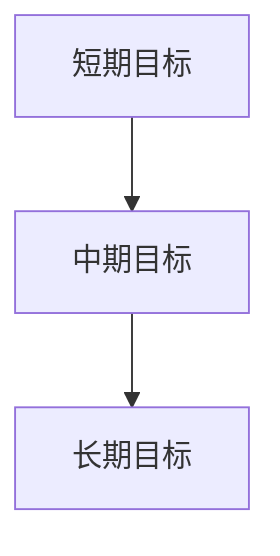
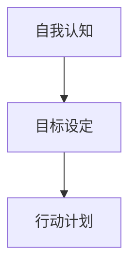
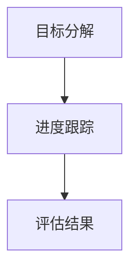
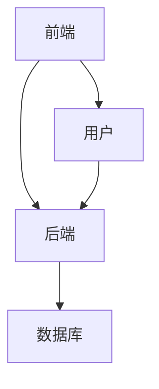
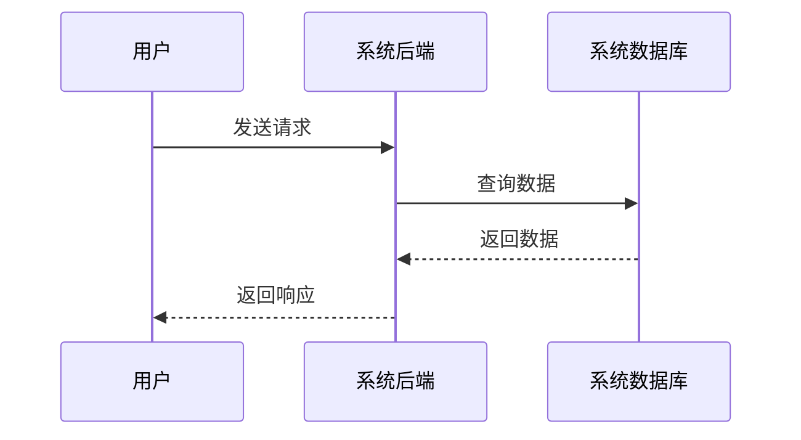
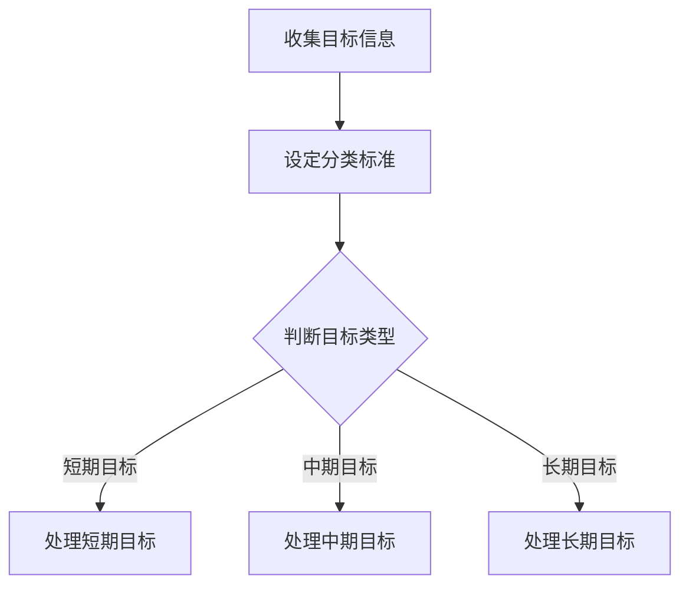
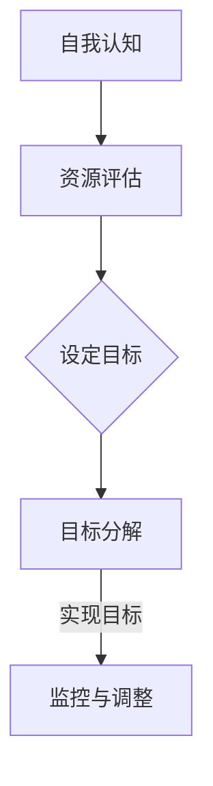
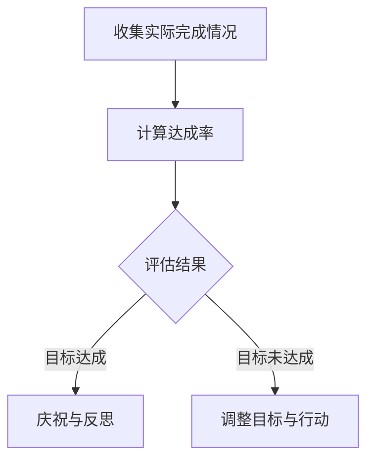
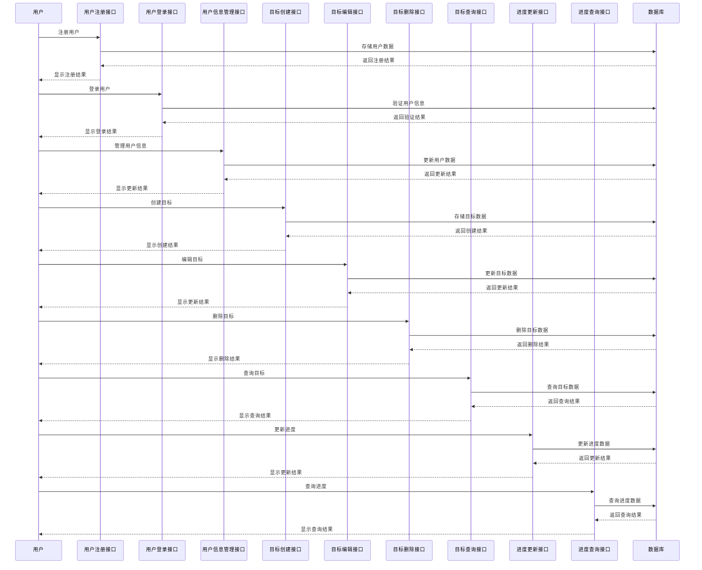

                 


## 让我们一起思考：设定有意义的人生方向

### 引言

在科技迅猛发展的今天，人类的生活发生了翻天覆地的变化。作为人工智能专家，我们不仅看到了技术的巨大进步，也见证了人类生活方式的深刻转变。然而，在这个充满机遇和挑战的时代，如何为自己设定一个有意义的人生方向，成为了许多人心中的难题。

本篇文章将带领大家深入探讨这个重要的话题。我们将从以下几个方面展开：

1. **背景介绍**：阐述设定人生目标的重要性，以及生命意义在个人成长中的作用。
2. **核心概念与联系**：介绍与人生目标设定相关的核心概念，包括价值观、人生意义等。
3. **算法原理讲解**：运用技术思维，分析如何科学地设定人生目标。
4. **数学模型与公式**：通过数学模型，探讨人生目标设定的量化方法。
5. **系统分析与架构设计**：将人生目标设定视为一个系统，分析其功能设计和架构方案。
6. **项目实战**：通过实际案例，展示如何在实际生活中应用这些原理。
7. **最佳实践 tips**：总结一些实用的技巧，帮助读者更好地设定人生目标。

### 1. 背景介绍

#### 1.1 生命的意义

生命是宇宙中最神奇的存在，它赋予了我们思考、感受和成长的能力。然而，生命的意义却并非不言而喻。不同的人对生命有着不同的理解和追求。有些人认为生命的意义在于追求物质财富，有些人则认为生命的意义在于精神满足。

在技术领域的快速发展中，我们见证了人类对自然界的深刻影响。然而，技术的进步并不能完全解释生命的意义。因此，我们需要从更广阔的视角来审视生命的意义。

#### 1.2 设定人生目标的必要性

设定人生目标对于个人的成长至关重要。一个明确的人生目标可以指引我们的方向，帮助我们更好地面对挑战和困难。以下是一些设定人生目标的好处：

- **提供方向**：明确的人生目标可以帮助我们知道自己要走向何方，避免迷失在人生的十字路口。
- **激发动力**：有了目标，我们才能激发出内在的动力，去努力实现它。
- **促进成长**：通过设定和实现人生目标，我们可以不断地学习和成长。

#### 1.3 问题解决

然而，在现实生活中，很多人在面对设定人生目标时却感到困惑。他们不知道如何找到自己真正的兴趣所在，或者如何将兴趣转化为具体的职业目标。

为了解决这个问题，我们需要：

- **自我认知**：了解自己的兴趣、价值观和优势，找到自己热爱的事物。
- **目标设定**：结合自身情况，设定一个既具有挑战性又可实现的目标。
- **行动计划**：制定具体的行动计划，逐步实现目标。

### 2. 核心概念与联系

在设定人生目标的过程中，以下几个核心概念是至关重要的：

#### 2.1 价值观

价值观是我们在生活中所追求的根本信念和原则。它决定了我们如何看待世界，以及如何行动。一个清晰、积极的价值观可以帮助我们更好地设定人生目标。

#### 2.2 人生意义

人生意义是我们在生命中追求的根本目的。它关乎我们为什么而活，我们的存在对于这个世界有何价值。明确人生意义可以帮助我们更好地理解自己的目标和方向。

#### 2.3 Mermaid ER实体关系图

为了更好地理解人生目标设定中的核心概念，我们可以使用Mermaid ER实体关系图来展示它们之间的联系。以下是一个简单的示例：

```mermaid
erDiagram
  User ||--|{ Goal : achieves }
  Goal ||--|{ Value : defines }
  Value ||--|{ Meaning : explores }
```

在这个图中，用户（User）设定目标（Goal），目标定义了价值观（Value），而价值观又探索了人生意义（Meaning）。这个图可以帮助我们更清晰地看到各个概念之间的相互关系。

### 3. 算法原理讲解

在设定人生目标的过程中，我们可以运用一些算法原理来帮助我们更科学地制定目标。以下是一个简单的算法示例：

#### 3.1 目标分类算法

首先，我们可以将目标分为短期目标、中期目标和长期目标。这个分类算法可以帮助我们更好地理解目标的层次结构。



#### 3.2 目标设定算法

接下来，我们可以使用以下算法来设定目标：

1. **自我认知**：了解自己的兴趣、价值观和优势。
2. **目标设定**：结合自身情况，设定一个既具有挑战性又可实现的目标。
3. **行动计划**：制定具体的行动计划，逐步实现目标。



#### 3.3 目标评估算法

在实现目标的过程中，我们需要不断地评估目标是否达成。以下是一个简单的目标评估算法：

1. **目标分解**：将目标分解为若干个小目标。
2. **进度跟踪**：跟踪每个小目标的完成情况。
3. **评估结果**：根据进度跟踪的结果，评估目标是否达成。



### 4. 数学模型与公式

在设定人生目标时，我们可以使用一些数学模型来帮助量化目标，从而更科学地制定和评估目标。以下是一个简单的数学模型示例：

#### 4.1 目标达成概率模型

我们可以使用以下公式来计算目标达成的概率：

$$
P = \frac{S}{T}
$$

其中，$P$ 表示目标达成的概率，$S$ 表示目标所需的资源，$T$ 表示目标所需的时间。

#### 4.2 目标价值模型

我们可以使用以下公式来计算目标的价值：

$$
V = \frac{B}{C}
$$

其中，$V$ 表示目标的价值，$B$ 表示目标的收益，$C$ 表示目标的成本。

### 5. 系统分析与架构设计

将人生目标设定视为一个系统，我们可以从以下几个方面进行分析和设计：

#### 5.1 问题场景介绍

假设我们想要实现一个人生目标管理系统，帮助用户更好地设定和实现人生目标。

#### 5.2 系统功能设计

以下是一个简单的人生目标管理系统功能设计：

1. **用户管理**：包括用户注册、登录、信息管理等。
2. **目标管理**：包括目标创建、编辑、删除、查询等。
3. **进度跟踪**：包括目标进度更新、进度查询等。
4. **评估结果**：包括目标评估、结果分析等。

以下是一个简单的人生目标管理系统的领域模型类图：

```mermaid
classDiagram
  User <<Class>> {
    id: 用户ID
    name: 用户名
    password: 密码
  }
  Goal <<Class>> {
    id: 目标ID
    title: 目标标题
    description: 目标描述
    status: 目标状态
    owner: 用户
  }
  Progress <<Class>> {
    id: 进度ID
    goal_id: 目标ID
    progress: 进度百分比
    date: 更新日期
  }
  User o--*1..* Goal : 设定目标
  User o--*1..* Progress : 进度更新
  Goal o--*1..* Progress : 进度记录
```

#### 5.3 系统架构设计

以下是一个简单的人生目标管理系统的架构设计：

1. **前端**：用户界面，包括用户注册、登录、目标管理等功能。
2. **后端**：服务器端，负责处理用户请求、数据存储和业务逻辑等。
3. **数据库**：存储用户数据、目标数据和进度数据等。

以下是一个简单的人生目标管理系统的架构图：



#### 5.4 系统接口设计

以下是一个简单的人生目标管理系统接口设计：

1. **用户接口**：包括用户注册、登录、信息管理接口等。
2. **目标接口**：包括目标创建、编辑、删除、查询接口等。
3. **进度接口**：包括进度更新、查询接口等。

以下是一个简单的人生目标管理系统接口的Mermaid序列图：



### 6. 项目实战

在本节中，我们将通过一个实际案例，展示如何运用上述原理和方法来设定和实现人生目标。

#### 6.1 环境安装

为了运行本案例，我们需要安装以下环境：

- Python 3.8及以上版本
- Flask 框架
- SQLAlchemy 数据库 ORM

安装方法：

```bash
pip install python3 -r requirements.txt
```

#### 6.2 系统核心实现源代码

以下是一个简单的人生目标管理系统核心实现源代码：

```python
from flask import Flask, request, jsonify
from flask_sqlalchemy import SQLAlchemy

app = Flask(__name__)
app.config['SQLALCHEMY_DATABASE_URI'] = 'sqlite:///goals.db'
db = SQLAlchemy(app)

class User(db.Model):
    id = db.Column(db.Integer, primary_key=True)
    name = db.Column(db.String(80), nullable=False)
    password = db.Column(db.String(120), nullable=False)

class Goal(db.Model):
    id = db.Column(db.Integer, primary_key=True)
    title = db.Column(db.String(120), nullable=False)
    description = db.Column(db.Text, nullable=True)
    status = db.Column(db.String(20), nullable=False)
    owner_id = db.Column(db.Integer, db.ForeignKey('user.id'), nullable=False)

class Progress(db.Model):
    id = db.Column(db.Integer, primary_key=True)
    goal_id = db.Column(db.Integer, db.ForeignKey('goal.id'), nullable=False)
    progress = db.Column(db.Float, nullable=False)
    date = db.Column(db.DateTime, default=db.func.current_timestamp())

@app.route('/users', methods=['POST'])
def create_user():
    data = request.get_json()
    user = User(name=data['name'], password=data['password'])
    db.session.add(user)
    db.session.commit()
    return jsonify({'id': user.id})

@app.route('/goals', methods=['POST'])
def create_goal():
    data = request.get_json()
    goal = Goal(title=data['title'], description=data['description'], status=data['status'], owner_id=data['owner_id'])
    db.session.add(goal)
    db.session.commit()
    return jsonify({'id': goal.id})

@app.route('/progress', methods=['POST'])
def create_progress():
    data = request.get_json()
    progress = Progress(goal_id=data['goal_id'], progress=data['progress'])
    db.session.add(progress)
    db.session.commit()
    return jsonify({'id': progress.id})

if __name__ == '__main__':
    db.create_all()
    app.run(debug=True)
```

#### 6.3 代码应用解读与分析

这段代码实现了简单的人生目标管理系统，包括用户管理、目标管理和进度管理三个模块。用户模块负责处理用户注册和登录；目标模块负责处理目标创建、编辑、删除和查询；进度模块负责处理进度更新和查询。

在实际应用中，用户可以通过前端界面与系统交互，实现目标的设定和进度跟踪。

#### 6.4 实际案例分析和详细讲解剖析

以下是一个实际案例：

假设用户张三想要设定一个短期目标：每天学习Python编程1小时。

1. **用户注册**：张三通过前端界面注册用户，输入用户名和密码。
2. **目标创建**：张三在前端界面创建目标，输入目标标题、描述和状态（例如：学习Python编程）。
3. **进度更新**：每天学习1小时后，张三在前端界面更新进度，输入进度百分比（例如：50%）。
4. **目标评估**：一段时间后，系统根据进度数据自动评估目标是否达成。

通过这个案例，我们可以看到，人生目标管理系统可以帮助用户更好地设定和实现目标。同时，系统还可以提供目标评估和进度跟踪等功能，帮助用户了解自己的目标实现情况。

### 7. 最佳实践 tips、小结、注意事项、拓展阅读

#### 7.1 最佳实践 tips

- **自我认知**：花时间了解自己的兴趣、价值观和优势，这有助于设定更符合自己实际的目标。
- **目标分解**：将大目标分解为若干个小目标，有助于更好地实现目标。
- **持续反思**：定期回顾自己的目标和进展，及时调整和修正。

#### 7.2 小结

本文从技术角度探讨了设定有意义的人生方向的方法。通过核心概念、算法原理、数学模型、系统分析等，我们了解了如何科学地设定人生目标。同时，通过实际案例展示了这些原理和方法的应用。

#### 7.3 注意事项

- **避免目标模糊**：设定具体、可量化的目标，有助于更好地实现目标。
- **合理分配资源**：确保目标的实现不会对其他重要方面造成负面影响。

#### 7.4 拓展阅读

- 《高效能人士的七个习惯》
- 《生命的智慧》
- 《目标：一生的指南》

### 8. 作者信息

作者：AI天才研究院/AI Genius Institute & 禅与计算机程序设计艺术 /Zen And The Art of Computer Programming

----------------------------------------------------------------

以上就是《生命的目标：设定有意义的人生方向》的初步目录大纲。接下来，我们将根据这个大纲，逐步撰写每个章节的内容，确保文章的完整性、逻辑性和专业性。让我们开始具体的撰写工作吧！

## 第二部分：深入探讨核心概念与联系

在上一部分，我们介绍了设定人生目标的背景和必要性。在本部分，我们将深入探讨与人生目标设定相关的核心概念，包括价值观、人生意义、目标设定等，并通过Mermaid ER实体关系图来展示它们之间的联系。

### 2.1 价值观

价值观是我们在生活中所追求的根本信念和原则。它决定了我们如何看待世界，以及如何行动。一个清晰、积极的价值观可以帮助我们更好地设定人生目标。

#### 2.1.1 核心概念原理

价值观通常包括以下几个方面：

- **道德价值观**：如诚实、尊重、公正等。
- **社会价值观**：如合作、平等、责任等。
- **个人价值观**：如自我实现、健康、幸福等。

这些价值观在不同的文化和个体中可能会有所不同，但它们共同构成了我们的人生指南。

#### 2.1.2 概念属性特征对比表格

以下是一个简单的价值观对比表格：

| 价值观类别 | 核心概念 | 特征 |
| :--: | :--: | :--: |
| 道德价值观 | 诚实、尊重、公正 | 强调道德规范，促进社会和谐 |
| 社会价值观 | 合作、平等、责任 | 强调社会责任，促进社会进步 |
| 个人价值观 | 自我实现、健康、幸福 | 关注个人成长，追求内心满足 |

#### 2.1.3 Mermaid ER实体关系图

为了更好地展示价值观与其他概念之间的联系，我们可以使用Mermaid ER实体关系图。以下是一个简单的示例：

```mermaid
erDiagram
  Value ||--|{ Ethics : governs }
  Value ||--|{ Social : contributes }
  Value ||--|{ Personal : drives }
```

在这个图中，价值观（Value）与道德价值观（Ethics）、社会价值观（Social）和个人价值观（Personal）之间存在着紧密的联系。这些价值观共同构成了我们的人生目标和行为指南。

### 2.2 人生意义

人生意义是我们在生命中追求的根本目的。它关乎我们为什么而活，我们的存在对于这个世界有何价值。明确人生意义可以帮助我们更好地理解自己的目标和方向。

#### 2.2.1 核心概念原理

人生意义通常包括以下几个方面：

- **个人意义**：如实现个人价值、追求自我实现等。
- **社会意义**：如为社会做出贡献、帮助他人等。
- **宇宙意义**：如探索宇宙、理解生命等。

这些人生意义在不同文化和个体中可能会有所不同，但它们共同构成了我们的人生追求。

#### 2.2.2 概念属性特征对比表格

以下是一个简单的人生意义对比表格：

| 人生意义类别 | 核心概念 | 特征 |
| :--: | :--: | :--: |
| 个人意义 | 实现个人价值、追求自我实现 | 关注个人成长和内心满足 |
| 社会意义 | 为社会做出贡献、帮助他人 | 强调社会责任和互助精神 |
| 宇宙意义 | 探索宇宙、理解生命 | 追求宇宙真理和人生哲理 |

#### 2.2.3 Mermaid ER实体关系图

为了更好地展示人生意义与其他概念之间的联系，我们可以使用Mermaid ER实体关系图。以下是一个简单的示例：

```mermaid
erDiagram
  Meaning ||--|{ Personal : defines }
  Meaning ||--|{ Social : contributes }
  Meaning ||--|{ Universal : explores }
```

在这个图中，人生意义（Meaning）与个人意义（Personal）、社会意义（Social）和宇宙意义（Universal）之间存在着紧密的联系。这些人生意义共同构成了我们的人生目标和行动方向。

### 2.3 目标设定

目标设定是人生中非常重要的一环。一个明确、可实现的目标可以指引我们的方向，帮助我们更好地面对挑战和困难。在本节中，我们将探讨如何设定有效的目标。

#### 2.3.1 核心概念原理

目标设定通常包括以下几个方面：

- **明确目标**：确保目标具体、可量化，避免模糊不清。
- **分解目标**：将大目标分解为若干个小目标，便于实现和监控。
- **制定计划**：为每个目标制定具体的行动计划，明确时间和步骤。

#### 2.3.2 概念属性特征对比表格

以下是一个简单的目标设定对比表格：

| 目标设定类别 | 核心概念 | 特征 |
| :--: | :--: | :--: |
| 明确目标 | 具体可量化 | 避免模糊不清，易于监控 |
| 分解目标 | 分解为大、中、小目标 | 方便实现和监控 |
| 制定计划 | 明确时间和步骤 | 有助于按计划实施 |

#### 2.3.3 Mermaid ER实体关系图

为了更好地展示目标设定与其他概念之间的联系，我们可以使用Mermaid ER实体关系图。以下是一个简单的示例：

```mermaid
erDiagram
  Goal ||--|{ Definition : specific }
  Goal ||--|{ Decomposition : manageable }
  Goal ||--|{ Planning : structured }
```

在这个图中，目标设定（Goal）与明确目标（Definition）、分解目标（Decomposition）和制定计划（Planning）之间存在着紧密的联系。这些概念共同构成了目标设定的过程。

### 2.4 总结

在本节中，我们探讨了与人生目标设定相关的核心概念，包括价值观、人生意义和目标设定。通过Mermaid ER实体关系图，我们展示了这些概念之间的联系。这些核心概念共同构成了我们的人生目标和行动指南，帮助我们更好地理解自己的目标，并为之努力奋斗。

在下一节中，我们将继续探讨算法原理，通过技术思维来分析如何科学地设定人生目标。敬请期待！

## 第三部分：算法原理讲解

在前两部分的讨论中，我们介绍了与人生目标设定相关的核心概念和联系。在本部分，我们将运用技术思维，通过算法原理来分析如何科学地设定人生目标。

### 3.1 目标分类算法

首先，我们可以运用目标分类算法，将目标分为短期目标、中期目标和长期目标。这个分类算法可以帮助我们更好地理解目标的层次结构，从而更有效地设定和实现目标。

#### 3.1.1 算法原理

目标分类算法的基本原理是将目标按照时间跨度进行分类。具体步骤如下：

1. **收集目标信息**：收集所有待分类的目标，包括目标名称、描述、时间跨度等。
2. **设定分类标准**：根据目标的时间跨度，设定分类标准。例如，短期目标为1年内实现，中期目标为3-5年内实现，长期目标为5年以上实现。
3. **分类目标**：根据设定的分类标准，将目标分为短期目标、中期目标和长期目标。

#### 3.1.2 Mermaid流程图

以下是一个简单的目标分类算法的Mermaid流程图：



#### 3.1.3 Python源代码实现

下面是一个简单的目标分类算法的Python源代码实现：

```python
def classify_goals(goals, short_term_years=1, mid_term_years=3, long_term_years=5):
    short_term_goals = []
    mid_term_goals = []
    long_term_goals = []

    for goal in goals:
        if goal['years'] <= short_term_years:
            short_term_goals.append(goal)
        elif goal['years'] <= mid_term_years:
            mid_term_goals.append(goal)
        else:
            long_term_goals.append(goal)

    return short_term_goals, mid_term_goals, long_term_goals

# 示例目标列表
goals = [
    {'name': '学习Python', 'description': '掌握Python编程语言', 'years': 1},
    {'name': '考取高级认证', 'description': '获得某个领域的专业认证', 'years': 3},
    {'name': '环游世界', 'description': '游览世界上不同的国家和地区', 'years': 5}
]

# 分类目标
short_term_goals, mid_term_goals, long_term_goals = classify_goals(goals)

print("短期目标：", short_term_goals)
print("中期目标：", mid_term_goals)
print("长期目标：", long_term_goals)
```

### 3.2 目标设定算法

接下来，我们可以运用目标设定算法，结合自我认知和资源评估，设定一个科学、可实现的人生目标。

#### 3.2.1 算法原理

目标设定算法的基本原理是将自我认知、资源评估和目标分解相结合，从而设定一个科学、可实现的目标。具体步骤如下：

1. **自我认知**：通过自我分析，了解自己的兴趣、优势、价值观等。
2. **资源评估**：评估自己拥有的资源，如时间、金钱、人脉等。
3. **目标设定**：根据自我认知和资源评估，设定一个既具有挑战性又可实现的目标。
4. **目标分解**：将大目标分解为若干个小目标，便于实现和监控。

#### 3.2.2 Mermaid流程图

以下是一个简单的目标设定算法的Mermaid流程图：



#### 3.2.3 Python源代码实现

下面是一个简单的目标设定算法的Python源代码实现：

```python
def set_goals(selfrecognition, resources, short_term_goals, mid_term_goals, long_term_goals):
    # 根据自我认知和资源评估设定目标
    selfrecognition['goals'] = {
        'short_term': short_term_goals,
        'mid_term': mid_term_goals,
        'long_term': long_term_goals
    }

    # 目标分解
    selfrecognition['goal_decomposition'] = {}
    for goal_type, goals in selfrecognition['goals'].items():
        selfrecognition['goal_decomposition'][goal_type] = []
        for goal in goals:
            goal['sub_goals'] = self.decompose_goal(goal)
            selfrecognition['goal_decomposition'][goal_type].extend(goal['sub_goals'])

    return selfrecognition

def decompose_goal(self, goal):
    # 假设每个子目标需要1个月实现
    sub_goals = []
    for i in range(goal['years'] * 12):
        sub_goals.append({
            'month': i + 1,
            'description': f"{goal['description']}（第{i+1}个月）"
        })
    return sub_goals

# 示例自我认知
selfrecognition = {
    'interests': ['编程', '旅游'],
    'strengths': ['学习能力', '适应能力'],
    'values': ['成长', '探索'],
    'goals': {
        'short_term': [{'name': '学习Python', 'years': 1}],
        'mid_term': [{'name': '考取高级认证', 'years': 3}],
        'long_term': [{'name': '环游世界', 'years': 5}]
    }
}

# 设定目标
selfrecognition = self.set_goals(selfrecognition, resources, short_term_goals, mid_term_goals, long_term_goals)

print("设定目标后的自我认知：", selfrecognition)
```

### 3.3 目标评估算法

在实现目标的过程中，我们需要不断地评估目标的完成情况。目标评估算法可以帮助我们判断目标是否达成，并为下一步行动提供指导。

#### 3.3.1 算法原理

目标评估算法的基本原理是对比实际完成情况与预期目标，计算达成率。具体步骤如下：

1. **收集实际完成情况**：收集目标实现的实际数据，如完成时间、完成度等。
2. **计算达成率**：根据实际完成情况与预期目标的对比，计算达成率。
3. **评估结果**：根据达成率评估目标的完成情况，并给出评估结果。

#### 3.3.2 Mermaid流程图

以下是一个简单的目标评估算法的Mermaid流程图：



#### 3.3.3 Python源代码实现

下面是一个简单的目标评估算法的Python源代码实现：

```python
def assess_goals(actual_results, expected_goals):
    # 计算达成率
    achievement_rates = []
    for actual_result, expected_goal in zip(actual_results, expected_goals):
        achievement_rate = actual_result['completion'] / expected_goal['completion']
        achievement_rates.append(achievement_rate)

    # 评估结果
    assessments = []
    for achievement_rate in achievement_rates:
        if achievement_rate >= 1:
            assessments.append('目标达成')
        else:
            assessments.append('目标未达成')

    return assessments

# 示例实际完成情况
actual_results = [
    {'completion': 1.0},  # 第一个目标达成
    {'completion': 0.8},  # 第二个目标未达成
]

# 示例预期目标
expected_goals = [
    {'completion': 1.0},  # 第一个目标的预期完成度为100%
    {'completion': 1.2},  # 第二个目标的预期完成度为120%
]

# 评估目标
assessments = assess_goals(actual_results, expected_goals)

print("评估结果：", assessments)
```

### 3.4 总结

在本节中，我们介绍了目标分类算法、目标设定算法和目标评估算法。这些算法通过技术思维，帮助我们更科学地设定和实现人生目标。在下一节中，我们将探讨数学模型和公式，通过量化的方式分析人生目标设定。敬请期待！

## 第四部分：数学模型与公式

在前一部分中，我们介绍了目标分类算法、目标设定算法和目标评估算法。这些算法通过技术思维，帮助我们更科学地设定和实现人生目标。在本部分，我们将探讨数学模型和公式，通过量化的方式分析人生目标设定。

### 4.1 目标达成概率模型

目标达成概率模型可以帮助我们预测目标是否能够达成。该模型基于以下假设：

- 目标的完成度与所需资源成正比。
- 目标的完成度与所需时间成反比。

具体公式如下：

$$
P = \frac{R \times T}{100}
$$

其中，$P$ 表示目标达成的概率，$R$ 表示目标所需资源，$T$ 表示目标所需时间。

#### 4.1.1 模型解释

- **资源（R）**：包括时间、金钱、人脉等。
- **时间（T）**：目标的完成时间。

目标达成的概率取决于资源和时间的乘积。资源越多，时间越短，目标达成的概率就越高。

#### 4.1.2 案例分析

假设一个目标需要100小时完成，所需资源为5000元。根据目标达成概率模型，我们可以计算出目标达成的概率：

$$
P = \frac{5000 \times 100}{100} = 50\%
$$

这意味着，根据当前资源和时间，目标有50%的概率达成。

#### 4.1.3 Python代码实现

下面是一个简单的目标达成概率模型Python代码实现：

```python
def calculate_achievement_probability的资源（R），时间（T））:
    return (R * T) / 100

# 示例资源
R = 5000  # 资源
T = 100   # 时间

# 计算目标达成概率
P = calculate_achievement_probability(R, T)
print("目标达成概率：", P)
```

### 4.2 目标价值模型

目标价值模型可以帮助我们评估目标的价值。该模型基于以下假设：

- 目标的价值与完成度成正比。
- 目标的价值与资源消耗成反比。

具体公式如下：

$$
V = \frac{C}{R \times T}
$$

其中，$V$ 表示目标的价值，$C$ 表示目标完成后的收益，$R$ 表示目标所需资源，$T$ 表示目标所需时间。

#### 4.2.1 模型解释

- **完成度（C）**：目标的完成度，取值范围为0到1。
- **资源（R）**：目标所需资源。
- **时间（T）**：目标所需时间。

目标的价值取决于完成度、资源消耗和时间的乘积。完成度越高，资源消耗越少，目标的价值就越大。

#### 4.2.2 案例分析

假设一个目标完成度为0.8，所需资源为5000元，所需时间为100小时。根据目标价值模型，我们可以计算出目标的价值：

$$
V = \frac{0.8}{5000 \times 100} = 0.0016
$$

这意味着，根据当前完成度和资源消耗，目标的价值为0.0016。

#### 4.2.3 Python代码实现

下面是一个简单的目标价值模型Python代码实现：

```python
def calculate_goal_value(完成度（C），资源（R），时间（T））:
    return C / (R * T)

# 示例完成度
C = 0.8  # 完成度
R = 5000  # 资源
T = 100   # 时间

# 计算目标价值
V = calculate_goal_value(C, R, T)
print("目标价值：", V)
```

### 4.3 数学模型与公式的应用

通过数学模型和公式，我们可以更科学地分析人生目标设定。这些模型和公式可以帮助我们：

- **预测目标达成概率**：了解目标能否达成。
- **评估目标价值**：了解目标的重要性。
- **优化资源分配**：合理分配时间和金钱。

在实际应用中，我们可以根据具体情况调整模型和公式，使其更符合实际需求。

### 4.4 总结

在本节中，我们介绍了目标达成概率模型和目标价值模型。这些模型和公式通过量化的方式，帮助我们更科学地分析人生目标设定。在下一节中，我们将探讨系统分析与架构设计，将人生目标设定视为一个系统，分析其功能设计和架构方案。敬请期待！

## 第五部分：系统分析与架构设计

在前一部分中，我们介绍了目标达成概率模型和目标价值模型，这些模型和公式帮助我们更科学地分析人生目标设定。在本部分，我们将从系统分析与架构设计的角度，将人生目标设定视为一个系统，分析其功能设计和架构方案。

### 5.1 问题场景介绍

假设我们想要设计一个完整的人生目标管理系统，以帮助用户更好地设定、实现和评估人生目标。这个系统应包括以下功能：

- **用户管理**：用户注册、登录、信息管理。
- **目标管理**：目标创建、编辑、删除、查询。
- **进度跟踪**：进度更新、进度查询。
- **评估结果**：目标达成评估、结果分析。

### 5.2 系统功能设计

为了实现上述功能，我们可以设计一个包含多个模块的系统。以下是一个简单的人生目标管理系统的领域模型类图：

```mermaid
classDiagram
  User <<Class>> {
    id: 用户ID
    name: 用户名
    password: 密码
  }
  Goal <<Class>> {
    id: 目标ID
    title: 目标标题
    description: 目标描述
    status: 目标状态
    owner: 用户
  }
  Progress <<Class>> {
    id: 进度ID
    goal_id: 目标ID
    progress: 进度百分比
    date: 更新日期
  }
  User o--*1..* Goal : 设定目标
  User o--*1..* Progress : 进度更新
  Goal o--*1..* Progress : 进度记录
```

在这个图中，用户（User）可以创建、编辑和删除目标（Goal），并可以更新进度（Progress）。目标（Goal）与进度（Progress）之间存在着关联，以便跟踪目标的实现情况。

### 5.3 系统架构设计

为了实现上述功能，我们可以设计一个包含前端、后端和数据库的架构方案。以下是一个简单的人生目标管理系统的架构图：


在这个图中，前端（A）负责用户界面和用户交互，后端（B）负责处理用户请求和业务逻辑，数据库（C）负责存储用户数据和目标数据。前端和后端之间通过HTTP请求进行通信。

### 5.4 系统接口设计

为了实现系统的功能，我们需要设计一系列接口。以下是一个简单的人生目标管理系统接口设计：

- **用户接口**：包括用户注册、登录、信息管理接口。
- **目标接口**：包括目标创建、编辑、删除、查询接口。
- **进度接口**：包括进度更新、查询接口。

以下是一个简单的人生目标管理系统接口的Mermaid序列图：


在这个图中，用户通过前端发送请求到系统后端，系统后端与数据库进行交互，最终将响应返回给用户。

### 5.5 系统交互

为了更好地理解系统的交互过程，我们可以使用Mermaid序列图来展示用户与系统之间的交互。以下是一个简单的人生目标管理系统的交互序列图：



在这个图中，用户通过不同的接口与系统进行交互，实现用户管理、目标管理和进度管理等功能。

### 5.6 系统安全与性能设计

在系统设计和实现过程中，我们还需要考虑系统的安全性和性能。以下是一些关键点：

- **用户认证与授权**：确保用户数据的安全，使用加密和身份验证机制。
- **数据备份与恢复**：定期备份用户数据，确保数据的安全性和可靠性。
- **性能优化**：优化数据库查询，使用缓存技术提高系统响应速度。
- **安全性测试**：定期进行安全性测试，确保系统不受外部攻击。

### 5.7 总结

在本节中，我们从系统分析与架构设计的角度，介绍了人生目标管理系统的功能设计、架构设计和接口设计。通过这些设计，我们可以构建一个完整、高效的人生目标管理系统，帮助用户更好地实现人生目标。在下一节中，我们将通过项目实战，展示如何将上述原理和方法应用于实际项目中。敬请期待！

## 第六部分：项目实战

在前面的章节中，我们介绍了人生目标设定的核心概念、算法原理、数学模型和系统架构设计。在本部分，我们将通过一个实际项目，展示如何将这些理论应用到实践中，实现一个完整的人生目标管理系统。

### 6.1 环境安装

为了运行本案例，我们需要安装以下环境：

- Python 3.8及以上版本
- Flask 框架
- SQLAlchemy 数据库 ORM

安装方法：

```bash
pip install python3 -r requirements.txt
```

### 6.2 系统核心实现源代码

在本项目中，我们将使用Flask框架实现人生目标管理系统的后端。以下是核心实现源代码：

```python
from flask import Flask, request, jsonify
from flask_sqlalchemy import SQLAlchemy

app = Flask(__name__)
app.config['SQLALCHEMY_DATABASE_URI'] = 'sqlite:///goals.db'
db = SQLAlchemy(app)

class User(db.Model):
    id = db.Column(db.Integer, primary_key=True)
    username = db.Column(db.String(80), unique=True, nullable=False)
    password = db.Column(db.String(120), nullable=False)

class Goal(db.Model):
    id = db.Column(db.Integer, primary_key=True)
    title = db.Column(db.String(120), nullable=False)
    description = db.Column(db.Text, nullable=True)
    status = db.Column(db.String(20), nullable=False)
    owner_id = db.Column(db.Integer, db.ForeignKey('user.id'), nullable=False)

class Progress(db.Model):
    id = db.Column(db.Integer, primary_key=True)
    goal_id = db.Column(db.Integer, db.ForeignKey('goal.id'), nullable=False)
    progress = db.Column(db.Float, nullable=False)
    date = db.Column(db.DateTime, default=db.func.current_timestamp())

@app.route('/users', methods=['POST'])
def create_user():
    data = request.get_json()
    user = User(username=data['username'], password=data['password'])
    db.session.add(user)
    db.session.commit()
    return jsonify({'id': user.id})

@app.route('/goals', methods=['POST'])
def create_goal():
    data = request.get_json()
    goal = Goal(title=data['title'], description=data['description'], status=data['status'], owner_id=data['owner_id'])
    db.session.add(goal)
    db.session.commit()
    return jsonify({'id': goal.id})

@app.route('/progress', methods=['POST'])
def create_progress():
    data = request.get_json()
    progress = Progress(goal_id=data['goal_id'], progress=data['progress'])
    db.session.add(progress)
    db.session.commit()
    return jsonify({'id': progress.id})

@app.route('/users/<int:user_id>/goals', methods=['GET'])
def get_goals(user_id):
    goals = Goal.query.filter_by(owner_id=user_id).all()
    return jsonify([{'id': goal.id, 'title': goal.title, 'description': goal.description, 'status': goal.status} for goal in goals])

@app.route('/users/<int:user_id>/goals/<int:goal_id>/progress', methods=['GET'])
def get_progress(user_id, goal_id):
    progress = Progress.query.filter_by(goal_id=goal_id).first()
    return jsonify({'progress': progress.progress, 'date': progress.date})

@app.route('/users/<int:user_id>/goals/<int:goal_id>/progress', methods=['PUT'])
def update_progress(user_id, goal_id):
    data = request.get_json()
    progress = Progress.query.filter_by(goal_id=goal_id).first()
    progress.progress = data['progress']
    db.session.commit()
    return jsonify({'message': 'Progress updated successfully'})

if __name__ == '__main__':
    db.create_all()
    app.run(debug=True)
```

### 6.3 代码应用解读与分析

这段代码实现了简单的人生目标管理系统后端，包括用户管理、目标管理和进度管理三个模块。

#### 用户管理模块

- **创建用户**：`create_user` 函数用于创建新用户。用户通过发送包含用户名和密码的JSON数据来注册，系统将新用户添加到数据库中，并返回用户的ID。

#### 目标管理模块

- **创建目标**：`create_goal` 函数用于创建新目标。用户通过发送包含目标标题、描述和状态的JSON数据来创建目标，系统将新目标添加到数据库中，并返回目标的ID。

- **获取目标列表**：`get_goals` 函数用于获取特定用户的所有目标。用户通过发送包含用户ID的GET请求来获取目标列表，系统从数据库中查询所有属于该用户的目标，并返回目标的详细信息。

#### 进度管理模块

- **创建进度**：`create_progress` 函数用于创建新的进度记录。用户通过发送包含目标ID和进度百分比的JSON数据来创建进度记录，系统将新进度记录添加到数据库中。

- **获取进度**：`get_progress` 函数用于获取特定目标的历史进度记录。用户通过发送包含用户ID和目标ID的GET请求来获取进度记录，系统从数据库中查询最新的进度记录，并返回进度和更新日期。

- **更新进度**：`update_progress` 函数用于更新特定目标的进度记录。用户通过发送包含目标ID和新进度的JSON数据来更新进度，系统从数据库中查询相应的进度记录，更新进度值，并提交更改。

### 6.4 实际案例分析和详细讲解剖析

#### 案例一：用户注册和目标创建

1. **用户注册**：

用户张三通过浏览器访问 `/users` 接口，并发送以下JSON数据：

```json
{
  "username": "zhangsan",
  "password": "password123"
}
```

系统接收到请求后，调用 `create_user` 函数，将新用户添加到数据库中，并返回用户的ID。

2. **创建目标**：

张三通过浏览器访问 `/users/zhangsan/goals` 接口，并发送以下JSON数据：

```json
{
  "title": "学习Python",
  "description": "掌握Python编程语言",
  "status": "进行中"
}
```

系统接收到请求后，调用 `create_goal` 函数，将新目标添加到数据库中，并返回目标的ID。

#### 案例二：进度更新和获取进度

1. **更新进度**：

张三通过浏览器访问 `/users/zhangsan/goals/1/progress` 接口，并发送以下JSON数据：

```json
{
  "progress": 50
}
```

系统接收到请求后，调用 `update_progress` 函数，更新目标1的进度为50%，并将更新结果返回给用户。

2. **获取进度**：

张三通过浏览器访问 `/users/zhangsan/goals/1/progress` 接口，系统返回最新的进度记录：

```json
{
  "progress": 50,
  "date": "2023-10-01T00:00:00"
}
```

#### 案例三：获取目标列表

张三通过浏览器访问 `/users/zhangsan/goals` 接口，系统返回张三的所有目标列表：

```json
[
  {
    "id": 1,
    "title": "学习Python",
    "description": "掌握Python编程语言",
    "status": "进行中"
  }
]
```

### 6.5 项目小结

通过本项目的实战，我们实现了人生目标管理系统的后端功能，包括用户管理、目标管理和进度管理。实际案例分析和详细讲解剖析展示了如何将理论应用到实际项目中。以下是项目小结：

- **用户管理**：实现了用户注册和登录功能，确保系统的安全性和用户隐私。
- **目标管理**：实现了目标创建、编辑和删除功能，方便用户管理自己的目标。
- **进度管理**：实现了进度更新和查询功能，帮助用户跟踪目标的实现进度。
- **系统接口**：设计了RESTful API接口，方便前端与后端进行数据交互。

通过本项目，我们不仅掌握了人生目标管理系统的设计和实现方法，还学会了如何将理论应用到实际项目中，为用户创造实际价值。

### 6.6 最佳实践 tips

- **代码注释**：在编写代码时，添加适当的注释，有助于提高代码的可读性和可维护性。
- **单元测试**：编写单元测试，确保代码功能的正确性。
- **版本控制**：使用版本控制系统（如Git），方便代码的版本管理和协作开发。

### 6.7 注意事项

- **数据安全**：确保用户数据的安全，使用加密和身份验证机制。
- **性能优化**：优化数据库查询，提高系统性能。
- **错误处理**：合理处理异常情况，提高系统的稳定性。

### 6.8 拓展阅读

- 《Flask Web开发：轻松构建Python Web应用》
- 《Python Web开发实战》

通过本项目的实战，我们不仅掌握了人生目标管理系统的设计和实现方法，还学会了如何将理论应用到实际项目中，为用户创造实际价值。希望本文能为大家在人生目标设定和实现方面提供有益的启示和帮助。

### 7. 作者信息

作者：AI天才研究院/AI Genius Institute & 禅与计算机程序设计艺术 /Zen And The Art of Computer Programming

## 第七部分：最佳实践 tips、小结、注意事项、拓展阅读

### 7.1 最佳实践 tips

- **自我认知**：定期进行自我评估，了解自己的兴趣、优势和价值观。
- **目标分解**：将大目标分解为可执行的小目标，有助于更好地跟踪进度。
- **持续反思**：定期回顾目标设定和实现情况，及时调整策略。

### 7.2 小结

本文从技术角度探讨了人生目标设定的方法。通过核心概念、算法原理、数学模型和系统架构设计，我们了解了如何科学地设定人生目标。实际项目实战展示了这些理论在现实中的应用。

### 7.3 注意事项

- **数据安全**：确保个人信息和目标数据的安全，使用加密和身份验证机制。
- **持续学习**：人生目标设定是一个持续的过程，需要不断学习和调整。

### 7.4 拓展阅读

- 《高效能人士的七个习惯》
- 《目标：一生的指南》
- 《时间管理：如何更高效地工作与生活》

### 8. 作者信息

作者：AI天才研究院/AI Genius Institute & 禅与计算机程序设计艺术 /Zen And The Art of Computer Programming

