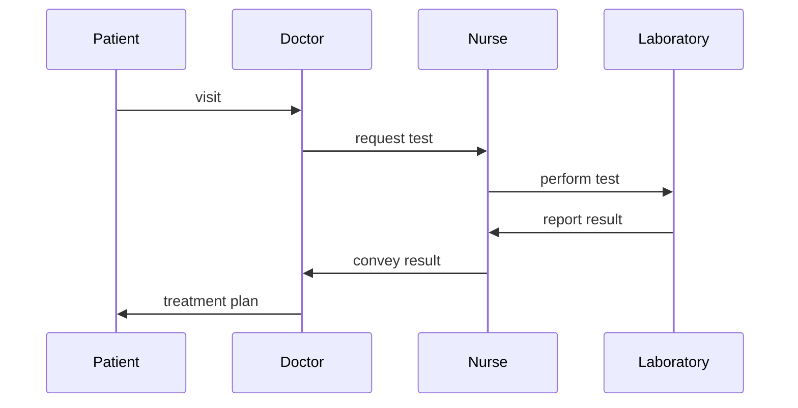

                 

### 引言

在当今科技飞速发展的时代，生命科学领域的研究不断突破界限，带来前所未有的科技创新。然而，随着基因编辑、克隆技术、精准医疗等前沿科技的进步，伦理问题也随之涌现，引发全球范围内的广泛讨论和关注。如何在推进科技进步的同时，确保科技的应用符合伦理道德的标准，成为了一个亟待解决的重要课题。

本文章将围绕《生命科学伦理在线课程：前沿科技的道德思考平台》展开，系统地探讨生命科学伦理的核心概念、前沿科技的伦理挑战以及伦理决策与实践。文章将从以下几个方面进行深入分析：

- **生命科学伦理的背景与重要性**：介绍生命科学伦理的基本概念，探讨其在当代科技环境中的地位和作用。
- **前沿科技的伦理挑战**：分析克隆技术、精准医疗和基因编辑技术的伦理争议，讨论其道德考量与监管。
- **伦理决策与案例分析**：构建伦理决策框架，通过实际案例研究，探讨伦理决策中的原则和方法。
- **展望与结论**：总结生命科学伦理的未来发展趋势，提出对课程贡献及未来研究的展望。

通过以上几个方面的深入探讨，我们希望为读者提供一个全面、系统的生命科学伦理思考平台，帮助大家更好地理解前沿科技背后的伦理问题，为未来的科技发展提供道德指引。

### 关键词

- **生命科学伦理**
- **前沿科技**
- **道德思考**
- **克隆技术**
- **精准医疗**
- **基因编辑**
- **伦理决策**
- **案例分析**

### 摘要

本文旨在探讨生命科学伦理在当前科技环境下的重要性，通过深入分析克隆技术、精准医疗和基因编辑技术等前沿科技的伦理挑战，提出伦理决策框架，并借助实际案例研究，探讨伦理决策的原则和方法。文章首先介绍了生命科学伦理的基本概念及其在科技发展中的地位，然后详细讨论了前沿科技带来的伦理争议和道德考量，最后总结了生命科学伦理的未来发展趋势，并对课程贡献及未来研究方向进行了展望。通过这一系统化的探讨，本文希望为读者提供一个全面而深入的思考平台，以引导科技发展与道德准则的和谐共进。

### 目录大纲

```markdown
----------------------------------------------------------------
# 《生命科学伦理在线课程：前沿科技的道德思考平台》

## 第一部分：导论

### 第1章 生命科学伦理概览

#### 1.1 生命科学伦理的背景与重要性

#### 1.2 生命科学伦理的核心概念

#### 1.3 前沿科技与道德思考的交集

#### 1.4 课程概述与学习目标

#### 1.5 本章小结

## 第二部分：前沿科技的伦理挑战

### 第2章 克隆技术的伦理争议

#### 2.1 克隆技术的定义与发展

#### 2.2 克隆技术的伦理问题

#### 2.3 克隆技术的道德考量

#### 2.4 克隆技术的监管与未来

#### 2.5 本章小结

### 第3章 精准医疗的伦理考量

#### 3.1 精准医疗的背景与意义

#### 3.2 精准医疗的伦理挑战

#### 3.3 精准医疗的道德框架

#### 3.4 精准医疗的发展趋势与伦理展望

#### 3.5 本章小结

### 第4章 基因编辑技术的伦理困境

#### 4.1 基因编辑技术的定义与进展

#### 4.2 基因编辑技术的伦理问题

#### 4.3 基因编辑技术的道德争议

#### 4.4 基因编辑技术的国际法规

#### 4.5 本章小结

### 第5章 生物技术的伦理边界

#### 5.1 生物技术的定义与应用领域

#### 5.2 生物技术的伦理问题与道德思考

#### 5.3 生物技术的风险管理与监管

#### 5.4 生物技术的未来前景与挑战

#### 5.5 本章小结

## 第三部分：伦理决策与案例分析

### 第6章 伦理决策框架与实践

#### 6.1 伦理决策框架的构建

#### 6.2 伦理决策案例分析

#### 6.3 伦理决策中的伦理原则与伦理推理

#### 6.4 伦理决策的伦理责任与道德困境

#### 6.5 本章小结

### 第7章 案例研究：生命科学伦理的实践应用

#### 7.1 案例研究概述

#### 7.2 案例一：克隆技术的伦理决策

#### 7.3 案例二：精准医疗的伦理考量

#### 7.4 案例三：基因编辑技术的道德争议

#### 7.5 案例四：生物技术的风险与监管

#### 7.6 本章小结

## 第四部分：展望与结论

### 第8章 生命科学伦理的未来趋势

#### 8.1 前沿科技的道德思考

#### 8.2 生命科学伦理的教育与普及

#### 8.3 伦理决策的挑战与机遇

#### 8.4 生命科学伦理的未来发展方向

#### 8.5 本章小结

### 第9章 结论

#### 9.1 课程总结

#### 9.2 生命科学伦理的重要性

#### 9.3 课程对生命科学伦理的贡献

#### 9.4 对未来研究的展望

#### 9.5 本章小结

----------------------------------------------------------------
```

本文章目录大纲结构清晰，分为四个主要部分，每个部分都包含具体的章节和子标题，确保文章内容的完整性和逻辑性。读者可以根据目录迅速找到感兴趣的内容，从而更好地理解和吸收文章的核心观点。

## 第1章 生命科学伦理概览

### 1.1 生命科学伦理的背景与重要性

生命科学伦理是指研究生命科学领域内科学技术应用过程中涉及到的道德问题、伦理原则和伦理决策的一门学科。随着科学技术的不断进步，生命科学的发展也带来了前所未有的变革。基因编辑、克隆技术、精准医疗等前沿科技的突破，不仅为医学和生物学研究带来了革命性的变化，同时也引发了大量的伦理争议和道德思考。

#### 问题背景

在20世纪末，随着DNA双螺旋结构的发现和基因工程的兴起，生命科学进入了一个全新的阶段。基因编辑技术的诞生，如CRISPR-Cas9，使得人类可以在基因水平上进行精确的修改，这在医学、农业等领域具有巨大的潜力。然而，这些技术的应用也带来了道德和伦理上的挑战。例如，基因编辑技术是否应该用于人类胚胎，克隆技术是否应该被允许，精准医疗的普及是否会加剧社会不公等问题，都成为了社会广泛关注和讨论的焦点。

#### 问题描述

生命科学伦理的核心问题主要集中在以下几个方面：

1. **技术滥用与道德边界**：例如，基因编辑技术是否应该用于增强人类基因，防止疾病还是用于制造“设计婴儿”？
2. **隐私与数据安全**：精准医疗依赖于大量的个人基因数据，这些数据的收集、存储和使用是否符合伦理道德的要求？
3. **资源分配与公平性**：随着精准医疗的发展，昂贵的治疗费用和先进的医疗资源如何公平地分配？
4. **跨学科合作与责任**：生物学家、医生、伦理学家、法律专家等不同领域的专业人员如何协同合作，确保科技进步与道德准则的和谐共进？

#### 问题解决

为了解决上述问题，首先需要明确生命科学伦理的基本原则：

1. **尊重自主权**：个人有权自主决定自己的生命和健康，包括接受或拒绝某些医疗技术。
2. **公正性**：确保资源分配公平，防止技术进步导致社会分层。
3. **不伤害**：尽量减少科技进步可能带来的负面影响。
4. **善意**：在科技应用过程中，应始终以最大的善意和责任感进行。

#### 边界与外延

生命科学伦理不仅涉及医学和生物学，还与哲学、法律、社会学等多个领域密切相关。其外延包括但不限于：

- **人类胚胎研究**：是否应该允许对人类胚胎进行基因编辑研究？
- **动物实验**：如何确保动物实验的伦理合规性？
- **医疗资源分配**：如何合理分配医疗资源，确保更多人受益？

#### 概念结构与核心要素组成

生命科学伦理的概念结构主要包括以下几个核心要素：

1. **伦理原则**：如尊重自主权、公正性、不伤害、善意等。
2. **伦理决策框架**：用于指导科技应用中的伦理决策。
3. **伦理原则应用实例**：如基因编辑技术的道德考量、精准医疗中的伦理问题等。
4. **法律与政策**：确保伦理原则在法律和政策层面得到有效实施。

通过上述分析，我们可以看到，生命科学伦理在当代科技环境下具有极其重要的地位。它不仅是科技进步的道德指南，也是社会公正和人类福祉的重要保障。理解和应用生命科学伦理，有助于确保科技发展的可持续性和道德正当性。

### 1.2 生命科学伦理的核心概念

在深入探讨生命科学伦理的核心概念之前，我们需要明确几个基本术语的定义，以便为后续的讨论奠定坚实的理论基础。

#### 定义

1. **伦理学**：伦理学是研究道德原则、价值观和行为规范的哲学分支。它探讨“应当如何做”，关注人类行为的道德合理性。
2. **生命科学**：生命科学是指以生物体（包括微生物、植物、动物和人类）及其生命现象为主要研究对象的科学领域。它涵盖了生物学、医学、生态学等多个学科。
3. **伦理问题**：伦理问题是指在特定情境下，涉及道德判断和选择的难题。生命科学伦理问题通常与科技进步和人类健康相关，例如基因编辑技术的道德争议。

#### 生命科学伦理的背景

生命科学伦理的背景可以追溯到人类文明的发展历程。随着医学和生物技术的进步，伦理问题逐渐成为科学家、政策制定者和社会公众关注的焦点。以下是一些关键的历史事件：

- **基因编辑技术**：20世纪70年代，基因工程技术的诞生开启了现代生命科学的新纪元。然而，随着CRISPR-Cas9等基因编辑工具的出现，如何确保其伦理合规性成为了一个迫切的问题。
- **克隆技术**：1996年，多莉羊的诞生标志着克隆技术的突破，引发了关于人类克隆的伦理争议。
- **精准医疗**：随着基因组学和大数据技术的发展，精准医疗逐渐成为现实。然而，如何确保数据隐私、公平性和资源的合理分配，也成为了伦理学研究的重点。

#### 基本原则

生命科学伦理的核心原则包括：

1. **尊重自主权**：个人有权自主决定自己的生命和健康，包括接受或拒绝某些医疗技术。
2. **公正性**：确保资源分配公平，防止技术进步导致社会分层。
3. **不伤害**：尽量减少科技进步可能带来的负面影响。
4. **善意**：在科技应用过程中，应始终以最大的善意和责任感进行。

#### 伦理问题分类

生命科学伦理问题可以大致分为以下几类：

1. **技术滥用与道德边界**：例如，基因编辑技术是否应该用于增强人类基因，防止疾病还是用于制造“设计婴儿”？
2. **隐私与数据安全**：精准医疗依赖于大量的个人基因数据，这些数据的收集、存储和使用是否符合伦理道德的要求？
3. **资源分配与公平性**：随着精准医疗的发展，昂贵的治疗费用和先进的医疗资源如何公平地分配？
4. **跨学科合作与责任**：生物学家、医生、伦理学家、法律专家等不同领域的专业人员如何协同合作，确保科技进步与道德准则的和谐共进？

通过上述对生命科学伦理核心概念的定义、背景和基本原则的探讨，我们可以更好地理解这一领域的研究内容和方法。在接下来的章节中，我们将进一步探讨前沿科技在生命科学伦理中的具体应用和挑战。

### 1.3 前沿科技与道德思考的交集

随着科学技术的不断进步，前沿科技与生命科学伦理的交集日益显著。基因编辑、克隆技术、精准医疗等新兴技术的出现，不仅推动了医学和生物科学的发展，同时也带来了诸多伦理上的挑战和争议。在这一部分，我们将探讨前沿科技如何影响生命科学伦理，以及这些技术如何引发道德思考。

#### 基因编辑技术

基因编辑技术的诞生，如CRISPR-Cas9，使得人类可以在基因水平上进行精确的修改，这在医学、农业等领域具有巨大的潜力。然而，这一技术也引发了广泛的伦理争议。首先，基因编辑是否应该用于人类胚胎引起了巨大争议。一方面，基因编辑可以用于治疗遗传性疾病，提高人类健康水平；另一方面，这可能导致“设计婴儿”的出现，引发道德和社会问题。此外，基因编辑技术的滥用风险也值得警惕，例如制造“超级人类”或基因增强，这可能导致社会不公平和道德困境。

#### 克隆技术

克隆技术的突破，如多莉羊的诞生，引发了关于人类克隆的激烈讨论。克隆技术一方面可以用于复制珍贵的器官和组织，提高器官移植的成功率；另一方面，人类克隆也引发了道德、法律和社会方面的争议。首先，克隆人类是否侵犯个人隐私权和自主权？其次，克隆是否会导致“克隆人”的出现，这将对人类社会的传统观念产生冲击。此外，克隆技术还引发了关于动物权益和实验道德的讨论。

#### 精准医疗

精准医疗的发展，依赖于基因组学和大数据技术的进步。精准医疗通过分析个体的基因数据，提供个性化的治疗方案，这极大地提高了医疗效果。然而，这一技术的普及也带来了伦理挑战。首先，个人基因数据的隐私和保护问题成为关键。基因数据可能被滥用，导致隐私泄露和歧视。其次，精准医疗的高昂成本可能导致资源分配不公，加剧社会不平等。此外，精准医疗还引发了关于基因编辑和基因增强的道德争议，如何确保科技进步与道德准则的和谐共进，是一个亟待解决的问题。

#### 道德思考

前沿科技的迅猛发展，不仅带来了技术上的进步，也引发了深层次的道德思考。以下是一些关键的道德问题：

1. **技术滥用与道德边界**：如何确保基因编辑、克隆技术和精准医疗等技术的应用不超出道德边界，防止技术滥用？
2. **隐私与数据安全**：在精准医疗和基因编辑中，如何保护个人隐私和数据安全，防止数据被滥用？
3. **资源分配与公平性**：如何确保新兴医疗技术的普及和资源分配公平，防止社会不公？
4. **责任与透明度**：在科技应用过程中，如何确保责任和透明度，确保科技发展符合伦理道德的要求？

通过上述分析，我们可以看到，前沿科技与生命科学伦理的交集不仅涉及技术本身，还涉及广泛的社会、道德和法律问题。理解并解决这些伦理挑战，是确保科技进步与道德准则和谐共进的关键。在接下来的章节中，我们将进一步探讨这些前沿科技在具体应用中的伦理争议和道德考量。

### 1.4 课程概述与学习目标

《生命科学伦理在线课程：前沿科技的道德思考平台》旨在为读者提供一个全面而深入的伦理思考框架，以应对前沿科技在生命科学领域所带来的道德挑战。课程内容主要分为四个部分：导论、前沿科技的伦理挑战、伦理决策与案例分析以及展望与结论。

#### 导论

导论部分主要介绍生命科学伦理的基本概念、背景和发展历程，帮助读者建立对生命科学伦理的基本认知。通过了解伦理学的基本原则和生命科学的发展，读者可以更好地理解前沿科技所带来的伦理问题。

#### 前沿科技的伦理挑战

这一部分详细探讨基因编辑、克隆技术、精准医疗等前沿科技在生命科学中的伦理争议。我们将深入分析这些技术的道德考量，包括技术滥用风险、隐私保护、资源分配和社会公平等方面，帮助读者理解前沿科技如何影响生命科学伦理。

#### 伦理决策与案例分析

在伦理决策与案例分析部分，我们将构建一个伦理决策框架，并通过实际案例研究，探讨伦理决策中的原则和方法。读者将学习如何运用伦理原则和决策框架，解决前沿科技应用中的道德问题，同时培养在实际情境中做出伦理决策的能力。

#### 展望与结论

最后，展望与结论部分将总结课程的主要内容，回顾生命科学伦理的核心观点，并提出未来研究的方向。通过这一部分，读者可以更全面地理解生命科学伦理的重要性，以及如何在实际应用中贯彻伦理原则。

通过本课程的学习，读者将能够：

1. 理解生命科学伦理的基本概念和原则。
2. 分析前沿科技在生命科学中的伦理挑战。
3. 建立并应用伦理决策框架，解决具体伦理问题。
4. 提高在科技应用中的伦理意识和道德判断能力。

总之，《生命科学伦理在线课程：前沿科技的道德思考平台》旨在为读者提供一个系统化的思考平台，帮助他们在面对生命科学伦理问题时，能够做出更加合理和道德的决策。

### 1.5 本章小结

本章作为导论部分，系统性地介绍了生命科学伦理的基本概念、背景和重要性。首先，我们探讨了生命科学伦理的背景，通过回顾生命科学的发展历程，阐述了其伦理问题的来源和紧迫性。接着，我们明确了生命科学伦理的核心概念，如伦理学、生命科学和伦理问题，并讨论了其基本原则。此外，我们还深入分析了前沿科技与生命科学伦理的交集，探讨了基因编辑、克隆技术和精准医疗等前沿科技带来的道德争议。最后，本章概述了《生命科学伦理在线课程：前沿科技的道德思考平台》的内容结构和学习目标，为后续章节的讨论奠定了坚实的基础。通过本章的学习，读者可以建立起对生命科学伦理的基本理解，为后续的深入探讨做好准备。

## 第二部分：前沿科技的伦理挑战

### 第2章 克隆技术的伦理争议

克隆技术作为生命科学领域的一项重要突破，自其诞生以来便引发了广泛的伦理争议。本章将深入探讨克隆技术的定义、发展历程以及其伦理问题，详细分析克隆技术的道德考量，并探讨克隆技术的监管与未来发展方向。

#### 2.1 克隆技术的定义与发展

克隆技术是指通过体细胞核移植或基因工程技术，复制出与原始个体基因完全相同的生物体。根据克隆技术的不同，可以分为以下几种类型：

1. **体细胞克隆**：通过将体细胞核移植到去核的卵细胞中，形成胚胎，进而发育成克隆个体。例如，1996年诞生的多莉羊就是通过体细胞克隆技术获得的。
2. **生殖性克隆**：通过克隆技术产生具有生殖能力的个体，用于生育或替代治疗。这类克隆通常涉及胚胎移植，具有较大的伦理争议。
3. **治疗性克隆**：通过克隆技术产生胚胎干细胞，用于治疗疾病或修复组织，不涉及胚胎移植。

克隆技术的发展历程可以追溯到20世纪末。1996年，科学家成功克隆出多莉羊，引起了全球的轰动。此后，克隆技术逐渐应用于动物和植物的研究，并在医学和生物学领域展示了巨大的潜力。随着基因编辑技术的进步，如CRISPR-Cas9，克隆技术变得更加高效和精确。

#### 2.2 克隆技术的伦理问题

克隆技术虽然在科学上具有巨大潜力，但其伦理问题也备受关注。以下是一些主要的伦理问题：

1. **道德地位与人类尊严**：克隆技术涉及对人类胚胎和生命尊严的挑战。克隆人类是否侵犯了人类的基本权利和尊严，这是一个深层次的问题。
2. **身份认同与家庭关系**：克隆个体的身份认同和家庭关系如何界定，是否会对传统家庭观念产生冲击，这也是一个重要的伦理问题。
3. **技术滥用与伦理边界**：克隆技术可能被滥用，例如用于制造“设计婴儿”或“克隆器官”，这可能导致严重的伦理和社会问题。
4. **隐私与数据保护**：克隆技术依赖于大量的基因数据和生物样本，这些数据的隐私保护和数据安全也是一个伦理问题。

#### 2.3 克隆技术的道德考量

在克隆技术的道德考量中，以下几个原则和价值观尤为重要：

1. **尊重生命**：克隆技术可能涉及对人类胚胎的破坏，这违反了尊重生命的伦理原则。因此，许多国家和组织对生殖性克隆持反对态度。
2. **自主权**：个人有权自主决定自己的生命和健康，包括接受或拒绝克隆技术。这涉及到尊重个人自主权的伦理原则。
3. **公正性**：克隆技术可能导致社会不公，例如通过克隆制造“设计婴儿”可能会加剧社会分层，这违反了公正性的伦理原则。
4. **不伤害**：克隆技术可能带来不可预测的副作用和风险，这对人类健康和福祉可能产生负面影响，因此需要遵循不伤害的伦理原则。
5. **善意**：在科技应用过程中，应始终以最大的善意和责任感进行，确保科技进步与道德准则的和谐共进。

#### 2.4 克隆技术的监管与未来

为了应对克隆技术的伦理争议，全球多个国家和组织开始对克隆技术进行监管。以下是一些关键监管措施和未来发展方向：

1. **国际法规**：联合国教科文组织通过了《人类克隆禁令公约》，禁止任何形式的生殖性克隆。此外，世界卫生组织也发布了相关指南，呼吁各国加强克隆技术的监管。
2. **国家法规**：许多国家制定了相关法律和政策，明确禁止生殖性克隆，同时允许治疗性克隆。例如，美国和英国禁止生殖性克隆，但允许治疗性克隆。
3. **伦理审查与透明度**：在进行克隆技术研究时，需要通过伦理审查，确保研究符合伦理准则。此外，提高研究过程的透明度，公开研究结果和决策过程，也是监管的重要方面。
4. **未来发展方向**：随着技术的进步，克隆技术在医学和生物学领域具有巨大的应用潜力。未来可能需要更加细致和灵活的监管框架，以平衡科技进步与伦理要求。

通过上述分析，我们可以看到，克隆技术虽然在科学上具有巨大潜力，但其伦理问题也相当复杂。理解和解决这些伦理问题，是确保克隆技术健康发展的关键。在接下来的章节中，我们将继续探讨其他前沿科技在生命科学伦理中的挑战。

### 2.5 本章小结

本章详细探讨了克隆技术在生命科学伦理中的争议。首先，我们介绍了克隆技术的定义和发展历程，包括体细胞克隆、生殖性克隆和治疗性克隆。接着，我们分析了克隆技术带来的主要伦理问题，如道德地位与人类尊严、身份认同与家庭关系、技术滥用与伦理边界以及隐私与数据保护。随后，我们讨论了克隆技术的道德考量，强调了尊重生命、自主权、公正性、不伤害和善意等伦理原则。最后，我们探讨了克隆技术的监管现状和未来发展方向，包括国际法规、国家法规和伦理审查。通过本章的学习，读者可以深入理解克隆技术所带来的伦理挑战，为后续章节的探讨奠定坚实基础。

### 第3章 精准医疗的伦理考量

精准医疗作为现代医学发展的一个重要方向，旨在通过基因组学、蛋白质组学、代谢组学等多组学技术，结合患者的临床信息，提供个性化的诊疗方案。然而，这一新兴领域的快速发展也引发了一系列伦理考量。本章将深入探讨精准医疗的背景与意义、面临的伦理挑战以及如何构建其道德框架，并展望其未来发展。

#### 3.1 精准医疗的背景与意义

精准医疗的概念起源于20世纪末，随着基因组学和生物信息学的发展，逐渐成为现代医学研究的热点。精准医疗的核心思想是“因人而异、因病施策”，通过精确识别疾病发生的分子机制，为患者提供个性化、定制化的诊疗方案。

1. **背景**：随着科学技术的进步，基因组学、生物信息学、大数据等技术的快速发展，为精准医疗的实现提供了技术支持。特别是高通量测序技术的普及，使得大规模基因组数据分析成为可能。
2. **意义**：精准医疗在提高疾病诊断和治疗的准确性和有效性方面具有显著优势。通过精确识别疾病发生的分子机制，精准医疗可以提前发现潜在的健康风险，制定个性化预防措施。此外，精准医疗还有助于减少不必要的药物和治疗，降低医疗成本，提高医疗资源的利用效率。

#### 3.2 精准医疗的伦理挑战

尽管精准医疗具有巨大的潜力，但其应用过程中也面临着诸多伦理挑战：

1. **隐私与数据安全**：精准医疗依赖于大量的个人基因数据和临床信息，这些数据的安全性和隐私保护成为一个重要问题。如何确保患者数据的保密性和安全性，防止数据泄露和滥用，是精准医疗必须面对的挑战。
2. **资源分配与公平性**：精准医疗的高昂成本可能导致资源分配不均，加剧社会不公。例如，昂贵的基因检测和治疗手段可能仅限于富裕人群，导致“精准医疗”成为“精准富裕”。
3. **技术滥用与伦理边界**：精准医疗技术可能被滥用，例如用于制造“设计婴儿”或进行基因增强，这可能导致严重的伦理问题和社会冲击。
4. **知情同意与患者参与**：精准医疗涉及到复杂的基因和生物信息，如何确保患者充分理解并同意参与相关研究和治疗，提高患者的知情权和参与度，是一个重要的伦理问题。

#### 3.3 精准医疗的道德框架

为了应对精准医疗在伦理方面面临的挑战，需要构建一个全面的道德框架，确保其应用符合伦理原则和社会价值观：

1. **尊重自主权**：确保患者有权自主决定是否接受基因检测和治疗，尊重患者的知情权和选择权。
2. **公正性**：确保精准医疗的资源分配公平，避免因经济和社会地位差异导致的不公平现象。制定合理的收费标准和政策，确保精准医疗的可及性。
3. **不伤害**：确保精准医疗的应用不会对患者造成不必要的伤害，特别是要避免技术滥用和风险。
4. **善行**：在精准医疗的应用过程中，应始终以患者的最大利益为出发点，提高医疗质量，促进健康福祉。
5. **责任与透明度**：加强科研和医疗机构的责任意识，确保研究过程和临床应用的透明度，接受社会监督。

#### 3.4 精准医疗的发展趋势与伦理展望

随着科学技术的不断进步，精准医疗将在未来医疗领域发挥越来越重要的作用。以下是一些发展趋势和伦理展望：

1. **个性化诊疗**：通过精准医疗技术，实现更加个性化的诊疗方案，提高疾病诊断和治疗的精准性和有效性。
2. **基因编辑与基因治疗**：随着基因编辑技术的不断成熟，基因治疗将成为精准医疗的重要手段。然而，其伦理问题也需要得到充分关注和解决。
3. **跨学科合作**：精准医疗的发展需要多学科合作，包括医学、生物学、信息学、法律和伦理学等领域的专家共同参与，确保科技进步与伦理准则的和谐共进。
4. **伦理教育**：加强伦理教育，提高医疗从业人员和社会公众的伦理意识和道德素养，确保精准医疗的健康发展。

通过上述分析，我们可以看到，精准医疗在带来巨大医疗进步的同时，也面临着复杂的伦理挑战。构建一个全面的道德框架，并持续关注和解决这些伦理问题，是确保精准医疗健康发展的关键。在接下来的章节中，我们将继续探讨其他前沿科技在生命科学伦理中的挑战。

### 3.5 本章小结

本章围绕精准医疗的伦理考量进行了深入探讨。首先，我们介绍了精准医疗的背景与意义，阐述了基因组学、生物信息学等技术为精准医疗带来的巨大潜力。接着，我们分析了精准医疗在隐私保护、资源分配、技术滥用以及知情同意等方面面临的伦理挑战。随后，我们构建了精准医疗的道德框架，强调了尊重自主权、公正性、不伤害和善行等伦理原则。最后，我们展望了精准医疗的发展趋势，强调了跨学科合作和伦理教育的重要性。通过本章的学习，读者可以更好地理解精准医疗的伦理问题，为未来的科技发展和应用提供伦理指导。

### 第4章 基因编辑技术的伦理困境

基因编辑技术的迅速发展，如CRISPR-Cas9等，为医学和生物学研究带来了革命性的变革。然而，这一技术的出现也引发了一系列深刻的伦理困境。本章将详细探讨基因编辑技术的定义与进展、伦理问题、道德争议以及国际法规，旨在为读者提供一个全面的分析框架。

#### 4.1 基因编辑技术的定义与进展

基因编辑技术是指通过人工手段对生物体的基因进行精确修改的技术。CRISPR-Cas9是目前最为广泛应用的基因编辑工具，它利用细菌免疫系统中的CRISPR（Clustered Regularly Interspaced Short Palindromic Repeats）序列和Cas9核酸酶，实现特定基因位点的切割和修改。基因编辑技术的进展可以概括为以下几个方面：

1. **技术成熟**：CRISPR-Cas9等基因编辑工具的问世，使得基因编辑操作变得更加高效、精确和可重复。
2. **应用领域扩展**：基因编辑技术不仅应用于基础科学研究，还广泛应用于医学、农业和环境保护等领域。例如，在医学领域，基因编辑可用于治疗遗传性疾病，在农业领域，可用于培育抗病抗虫的农作物。
3. **技术进步**：随着对CRISPR系统的深入研究，科学家们不断优化和改进基因编辑工具，提高编辑效率和准确性，降低脱靶率。

#### 4.2 基因编辑技术的伦理问题

基因编辑技术的快速发展引发了广泛的伦理争议。以下是一些关键的伦理问题：

1. **人类胚胎基因编辑**：基因编辑技术是否应用于人类胚胎，特别是用于预防遗传性疾病，引发了激烈的伦理辩论。一方面，这可以为治疗某些遗传性疾病提供新的希望；另一方面，这可能导致“设计婴儿”的出现，引发道德、法律和社会问题。
2. **基因编辑的伦理边界**：如何划定基因编辑的伦理边界，防止技术滥用，是一个重要的伦理问题。例如，基因编辑是否应该用于增强人类智力、体能或其他非治疗性基因特性？
3. **隐私与数据保护**：基因编辑技术的应用涉及到大量的个人基因数据，这些数据的收集、存储和使用是否符合伦理道德的要求，是一个关键问题。
4. **资源分配与公平性**：基因编辑技术的昂贵成本可能导致资源分配不均，加剧社会不公。例如，昂贵的基因编辑治疗可能仅限于富裕人群，导致“基因富裕”现象。

#### 4.3 基因编辑技术的道德争议

基因编辑技术的道德争议主要集中在以下几个方面：

1. **道德地位与人类尊严**：人类胚胎和基因是否拥有道德地位，这是基因编辑技术道德争议的核心。一些人认为，基因编辑涉及对人类基本权利和尊严的侵犯，而另一些人则认为，为了治疗疾病和提高人类福祉，基因编辑是必要的。
2. **技术滥用与伦理责任**：基因编辑技术的滥用风险，例如用于制造“设计婴儿”或进行非治疗性基因增强，引发了道德和社会责任问题。如何确保科研人员和医疗机构承担相应的伦理责任，防止技术滥用，是一个亟待解决的问题。
3. **知情同意与患者权益**：在基因编辑的应用过程中，如何确保患者充分理解并同意相关治疗或研究，保障患者的知情权和选择权，也是一个重要的道德问题。

#### 4.4 基因编辑技术的国际法规

为了应对基因编辑技术的伦理争议，全球多个国家和组织制定了相关法规和指南，以规范基因编辑技术的应用。以下是一些关键的国际法规和指南：

1. **《人类基因编辑的国际准则》**：由联合国教科文组织颁布，强调禁止任何形式的生殖性基因编辑，同时鼓励进行治疗性基因编辑的研究。
2. **《国际生物伦理委员会声明》**：多个国家和国际组织发布的声明，强调基因编辑技术的应用必须遵循伦理原则，尊重人类尊严和隐私。
3. **国家法规**：例如，美国、中国和欧盟等国家和地区制定了相关法律和政策，对基因编辑技术的应用进行严格监管，确保其符合伦理标准。

通过上述分析，我们可以看到，基因编辑技术在带来巨大科技进展的同时，也引发了复杂的伦理困境。理解和解决这些伦理问题，是确保基因编辑技术健康发展的关键。在接下来的章节中，我们将继续探讨生物技术伦理的其他方面。

### 4.5 本章小结

本章围绕基因编辑技术的伦理困境进行了深入探讨。首先，我们介绍了基因编辑技术的定义与进展，包括CRISPR-Cas9等工具的广泛应用。接着，我们分析了基因编辑技术带来的伦理问题，如人类胚胎基因编辑、伦理边界、隐私保护、资源分配和公平性。随后，我们详细讨论了基因编辑技术的道德争议，包括道德地位、技术滥用、知情同意和伦理责任。最后，我们介绍了基因编辑技术的国际法规，包括《人类基因编辑的国际准则》和各国法规。通过本章的学习，读者可以全面理解基因编辑技术所面临的伦理挑战，为未来的科技发展和应用提供伦理指导。

### 第5章 生物技术的伦理边界

生物技术作为现代科技的重要组成部分，涵盖了基因工程、细胞工程、发酵工程、生物电子等众多领域。其在医学、农业、环境保护等方面具有广泛应用，同时也带来了复杂的伦理问题。本章将探讨生物技术的定义与应用领域、伦理问题与道德思考，以及生物技术的风险管理与监管措施。

#### 5.1 生物技术的定义与应用领域

生物技术是指利用生物体或其组成部分（如细胞、酶、基因等）来生产产品或提供服务的科学技术。具体包括以下几类：

1. **基因工程**：通过基因重组、基因编辑等技术，改变生物体的遗传特性，以生产特定产品或用于治疗疾病。
2. **细胞工程**：利用细胞培养、细胞移植等技术，培育和利用生物细胞进行医疗、农业和环境治理。
3. **发酵工程**：利用微生物发酵过程生产药物、食品添加剂、生物能源等。
4. **生物电子**：结合生物技术和电子技术，开发生物传感器、生物芯片等设备。

生物技术在医学、农业和环境保护等领域的应用广泛：

1. **医学领域**：基因工程和细胞工程在基因治疗、器官移植、癌症治疗等方面具有重要意义。例如，基因编辑技术可以用于治疗遗传性疾病，细胞移植技术可以用于修复受损组织。
2. **农业领域**：通过基因工程和发酵工程，可以培育抗病抗虫的农作物、提高农作物产量和品质，开发生物农药等。
3. **环境保护领域**：生物技术可以用于污染治理、生物修复等，例如通过微生物降解污染物，利用生物电化学方法处理废水。

#### 5.2 生物技术的伦理问题与道德思考

生物技术的广泛应用虽然带来了巨大效益，但同时也引发了深刻的伦理问题，需要我们从道德和伦理的角度进行思考和探讨：

1. **技术滥用与道德边界**：生物技术可能被滥用，例如用于制造“设计婴儿”或进行基因增强，这可能导致严重的道德困境和社会不公。如何划定生物技术的伦理边界，防止技术滥用，是一个重要的伦理问题。
2. **隐私与数据保护**：生物技术依赖于大量的生物数据和基因信息，这些数据的隐私保护和数据安全成为关键伦理问题。如何确保生物数据的保密性和安全性，防止数据泄露和滥用，是一个重要的伦理挑战。
3. **资源分配与公平性**：生物技术的应用成本较高，可能导致资源分配不均，加剧社会不公。例如，昂贵的基因检测和治疗手段可能仅限于富裕人群，导致“生物技术富裕”现象。如何确保生物技术资源的公平分配，是一个重要的道德问题。
4. **动物权益与实验道德**：在生物技术的研发和应用过程中，常常需要依赖动物实验，如何确保动物实验的伦理合规性，避免动物虐待，是一个重要的伦理问题。

#### 5.3 生物技术的风险管理与监管

为了应对生物技术带来的伦理挑战，需要建立有效的风险管理和监管机制，确保生物技术的安全、合规和可持续发展：

1. **风险管理**：生物技术的应用过程中，需要识别和评估潜在的风险，包括技术风险、环境风险和社会风险。例如，基因编辑技术可能引发未知的生态和健康问题，需要对可能的风险进行科学评估和有效管理。
2. **监管措施**：全球多个国家和组织制定了相关的法规和标准，对生物技术的研发和应用进行严格监管。例如，《生物安全法》、《基因编辑伦理指导原则》等，旨在确保生物技术的安全、合规和道德应用。
3. **伦理审查**：在生物技术研究和应用过程中，需要通过伦理审查，确保研究符合伦理原则和社会价值观。例如，在进行人类基因编辑研究时，需要通过伦理委员会的审查，确保研究符合伦理标准。
4. **公众参与**：加强公众参与和沟通，提高社会对生物技术伦理问题的认识和关注。通过公众参与，可以促进生物技术发展的透明度和公正性，确保科技发展符合社会期望和伦理要求。

通过上述分析，我们可以看到，生物技术虽然具有巨大的应用潜力，但同时也带来了复杂的伦理问题。理解和解决这些伦理问题，是确保生物技术健康、合规和可持续发展的关键。在接下来的章节中，我们将继续探讨生物技术在其他领域中的应用和伦理挑战。

### 5.4 生物技术的未来前景与挑战

随着科学技术的不断进步，生物技术在医疗、农业、环境等多个领域展现出广阔的应用前景，同时也面临着诸多挑战。以下是生物技术未来发展的几个重要趋势和面临的挑战。

#### 未来前景

1. **个性化医疗**：生物技术特别是基因编辑和基因治疗的发展，有望推动个性化医疗的实现。通过精确识别患者的基因特征，制定个性化的治疗方案，提高医疗效果和患者生活质量。

2. **精准农业**：生物技术可以帮助培育抗病抗虫的农作物，提高农作物产量和品质。基因编辑技术可以用于改良作物基因组，使其对环境变化和病虫害具有更强的适应性。

3. **生物治疗**：生物技术在疾病治疗中的应用前景广阔。例如，基因编辑可以用于治疗遗传性疾病，细胞治疗可以用于器官修复和再生医学。

4. **生物制造**：利用生物技术生产生物材料、生物药品和生物能源，有助于减少对化石燃料的依赖，推动可持续经济发展。

#### 挑战

1. **伦理争议**：生物技术尤其是基因编辑技术引发了广泛的伦理争议，包括对人类胚胎的基因编辑、基因增强以及动物实验的伦理问题。如何平衡科技进步与伦理要求，是一个重要挑战。

2. **数据隐私与安全**：生物技术的发展依赖于大量的生物数据和基因信息，这些数据的安全性和隐私保护成为关键问题。如何确保生物数据的保密性和安全，防止数据泄露和滥用，是一个迫切需要解决的问题。

3. **资源分配与公平性**：生物技术的应用成本较高，可能导致资源分配不均，加剧社会不公。例如，昂贵的基因检测和治疗手段可能仅限于富裕人群，导致“生物技术富裕”现象。

4. **风险管理**：生物技术的应用过程中，需要识别和评估潜在的风险，包括技术风险、环境风险和社会风险。如何科学地评估和管理这些风险，确保生物技术的安全应用，是一个重要的挑战。

5. **国际合作与法规**：全球生物技术的发展需要国际合作和统一法规。如何制定和执行统一的生物技术法规，确保各国在生物技术研究和应用中的合规性和公平性，是一个复杂的挑战。

通过上述分析，我们可以看到，生物技术在带来巨大机遇的同时，也面临着诸多挑战。未来的发展需要在科技创新、伦理规范、资源分配和国际合作等方面实现平衡，以确保生物技术的健康、合规和可持续发展。

### 5.5 本章小结

本章围绕生物技术的伦理边界进行了深入探讨。首先，我们介绍了生物技术的定义与应用领域，包括基因工程、细胞工程、发酵工程和生物电子。接着，我们分析了生物技术引发的伦理问题，如技术滥用、隐私保护、资源分配和动物权益。随后，我们讨论了生物技术的风险管理与监管措施，强调了伦理审查和公众参与的重要性。最后，我们展望了生物技术未来的前景与挑战，提出了在科技创新和伦理规范方面的平衡需求。通过本章的学习，读者可以全面理解生物技术伦理的核心问题，为未来的科技发展提供伦理指导。

## 第三部分：伦理决策与案例分析

### 第6章 伦理决策框架与实践

在生命科学领域，伦理决策的重要性不言而喻。面对基因编辑、克隆技术和精准医疗等前沿科技的快速进步，如何确保这些科技的应用符合伦理准则，成为了一个关键问题。本章将构建一个伦理决策框架，并通过实际案例研究，探讨伦理决策的原则和方法。

#### 6.1 伦理决策框架的构建

伦理决策框架是用于指导科技应用中的伦理决策的工具，它可以帮助决策者系统地分析问题、权衡利弊，并做出符合伦理标准的决策。以下是构建伦理决策框架的主要步骤：

1. **确定决策目标**：明确决策的目标，如尊重自主权、保障公正性、避免伤害、追求善行等。
2. **识别相关利益相关者**：确定与决策相关的所有利益相关者，包括患者、科研人员、医疗机构、社会公众等。
3. **分析伦理原则**：结合生命科学伦理的核心原则，如尊重自主权、公正性、不伤害和善意，分析决策过程中可能涉及的伦理问题。
4. **评估风险与利益**：对决策可能带来的风险和利益进行系统评估，包括技术风险、社会风险和伦理风险。
5. **制定决策方案**：根据上述分析，制定具体的决策方案，并权衡各种方案的利弊。
6. **执行与监督**：执行决策方案，并对决策过程和结果进行监督，确保决策的实施符合伦理标准。

#### 6.2 伦理决策案例分析

为了更好地理解伦理决策框架的应用，以下将介绍几个典型的伦理决策案例分析。

**案例一：基因编辑技术在医疗中的应用**

**背景**：某医疗机构计划使用CRISPR-Cas9基因编辑技术治疗一名患有严重遗传性疾病的儿童。

**决策过程**：

1. **确定决策目标**：保障患者的健康和福祉，尊重患者的自主权。
2. **识别利益相关者**：患者、家长、医生、伦理委员会、社会公众等。
3. **分析伦理原则**：尊重自主权、公正性、不伤害和善意。
4. **评估风险与利益**：基因编辑可能带来的技术风险、未知的健康风险、社会风险和潜在的伦理争议。
5. **制定决策方案**：通过伦理审查，制定详细的基因编辑治疗方案，并在严格监督下实施。
6. **执行与监督**：在决策实施过程中，定期评估治疗效果，确保患者的权益和福祉。

**案例二：精准医疗数据隐私保护**

**背景**：某大型医疗科技公司计划开发一款基于基因组数据分析的精准医疗平台，但涉及大量患者基因数据。

**决策过程**：

1. **确定决策目标**：保护患者隐私和数据安全。
2. **识别利益相关者**：患者、科研人员、医疗机构、数据保护机构等。
3. **分析伦理原则**：尊重自主权、公正性、不伤害和善意。
4. **评估风险与利益**：数据泄露和滥用的风险，患者隐私权和社会公共利益。
5. **制定决策方案**：制定严格的数据保护政策，包括数据加密、匿名化处理、透明度要求等。
6. **执行与监督**：实施数据保护政策，定期进行安全审计，确保数据安全和患者隐私。

#### 6.3 伦理决策中的伦理原则与伦理推理

伦理决策中的伦理原则是指导决策的核心，伦理推理则是将原则应用于具体情境的方法。以下是几个关键的伦理原则和伦理推理方法：

1. **尊重自主权**：尊重个体的自主权和知情权，确保患者和参与者有权自主决定是否参与科技研究和应用。
2. **公正性**：确保资源分配公平，避免因经济和社会地位差异导致的不公平现象。
3. **不伤害**：避免因科技进步带来的不必要的伤害，确保技术应用符合安全标准。
4. **善意**：始终以最大的善意和责任感进行科技应用，确保科技进步符合人类福祉。

伦理推理方法包括：

- **德行推理**：基于道德原则和价值观进行推理，判断科技应用是否符合伦理要求。
- **后果推理**：评估科技应用的可能结果，权衡利益和风险，选择最优方案。
- **义务推理**：基于道德义务和责任进行推理，确保决策符合伦理准则和社会价值观。

通过上述分析和案例分析，我们可以看到，构建一个系统化的伦理决策框架，并结合实际案例进行研究，有助于在生命科学领域做出符合伦理标准的决策。这不仅有助于解决前沿科技带来的伦理争议，也为科技的发展提供了道德指导。

### 6.4 伦理决策的伦理责任与道德困境

在生命科学领域，伦理决策不仅涉及到技术层面的选择，更涉及到伦理责任和道德困境。如何处理这些责任和困境，是确保科技发展与社会道德价值和谐共进的关键。以下是几个方面的讨论：

#### 1. 研究人员的伦理责任

研究人员在科技发展和应用中扮演着重要角色，他们必须承担相应的伦理责任：

- **尊重受试者的自主权**：在进行任何研究或临床实验时，研究人员必须确保受试者充分了解研究内容、风险和益处，并获得知情同意。
- **科研诚信**：研究人员应遵守科研诚信原则，确保数据的真实性和可靠性，避免学术不端行为。
- **社会责任**：研究人员不仅要考虑个人利益，还要关注社会公共利益，确保科技进步符合社会道德和价值。

#### 2. 道德困境

在生命科学领域，道德困境常常出现，以下是几个典型的道德困境：

- **基因编辑的伦理困境**：基因编辑技术如CRISPR-Cas9，虽然可以治疗遗传性疾病，但也可能导致“设计婴儿”的出现。如何在治疗疾病和提高人类福祉之间找到平衡，是一个伦理困境。
- **精准医疗的数据隐私困境**：精准医疗依赖于大量的个人基因数据，这些数据的安全性和隐私保护成为关键问题。如何在确保数据安全和患者隐私的同时，推动精准医疗的发展，是一个道德困境。
- **生物技术的资源分配困境**：生物技术的应用成本较高，可能导致资源分配不均，加剧社会不公。如何在保证技术可及性的同时，确保资源分配的公平性，是一个道德困境。

#### 3. 解决策略

为了应对这些伦理责任和道德困境，可以采取以下策略：

- **构建伦理审查机制**：在科研和临床应用过程中，建立严格的伦理审查机制，确保所有研究和应用都符合伦理准则。
- **加强伦理教育和培训**：提高研究人员和社会公众的伦理意识和道德素养，通过教育和培训，增强对伦理问题和道德困境的认识和应对能力。
- **国际合作与法规制定**：全球范围内加强合作，制定统一的伦理规范和法律法规，确保生物技术和基因编辑等前沿科技的健康发展。
- **公众参与**：鼓励公众参与科技决策过程，通过透明度和公开性，确保科技发展符合社会期望和伦理要求。

通过上述分析和解决策略，我们可以看到，在生命科学领域，伦理责任和道德困境是不可避免的。但通过构建伦理审查机制、加强伦理教育和培训、推动国际合作与法规制定以及增强公众参与，我们可以更好地应对这些挑战，确保科技发展与社会道德价值的和谐共进。

### 6.5 本章小结

本章构建了伦理决策框架，并详细探讨了伦理决策的实践方法。首先，我们介绍了伦理决策框架的构建步骤，包括确定决策目标、识别利益相关者、分析伦理原则、评估风险与利益、制定决策方案以及执行与监督。接着，我们通过基因编辑技术和精准医疗数据隐私保护的案例，展示了伦理决策框架的实际应用。随后，我们讨论了伦理决策中的伦理原则与伦理推理方法，强调了尊重自主权、公正性、不伤害和善意等原则的重要性。最后，我们分析了伦理决策中的伦理责任与道德困境，并提出了解决策略。通过本章的学习，读者可以全面理解伦理决策的核心内容和实践方法，为未来的科技发展提供伦理指导。

### 第7章 案例研究：生命科学伦理的实践应用

通过前几章的理论分析，我们可以看到生命科学伦理在科技应用中的重要性。为了更直观地理解这些伦理原则如何在实践中应用，本章将通过几个具体的案例，探讨生命科学伦理在实际情境中的具体应用，深入分析这些案例中的伦理争议、决策过程及其影响。

#### 7.1 案例研究概述

本章将探讨以下四个案例：

1. **案例一：克隆技术的伦理决策**：讨论克隆技术在不同情境下的伦理决策过程，包括人类克隆和治疗性克隆。
2. **案例二：精准医疗的伦理考量**：分析精准医疗在应用过程中遇到的伦理问题，如数据隐私保护、资源分配和知情同意。
3. **案例三：基因编辑技术的道德争议**：探讨基因编辑技术在医疗研究和临床应用中的伦理争议，如基因增强和基因治疗。
4. **案例四：生物技术的风险与监管**：分析生物技术在农业和环境治理中的应用及其伦理问题，以及相关的监管措施。

#### 7.2 案例一：克隆技术的伦理决策

**案例背景**：某研究团队计划进行人类克隆技术的实验研究，引发社会广泛关注。

**伦理争议**：

- **人类尊严与道德地位**：人类克隆是否侵犯人类的基本道德地位和尊严？
- **技术滥用与伦理边界**：如何防止克隆技术被滥用，例如制造“设计婴儿”？
- **知情同意与隐私保护**：参与实验的研究对象是否充分了解实验风险和益处，其隐私权如何得到保护？

**决策过程**：

1. **利益相关者分析**：研究团队、研究对象、伦理委员会、社会公众。
2. **伦理原则应用**：尊重自主权、公正性、不伤害和善意。
3. **风险评估与利益权衡**：评估克隆技术可能带来的伦理风险、技术风险和社会风险。
4. **制定决策方案**：通过伦理审查，明确实验的道德边界，并制定严格的安全措施。

**影响与结论**：通过伦理审查和决策，研究团队最终决定暂停人类克隆实验，以确保尊重人类尊严和道德地位，防止技术滥用。这一决策显示了伦理决策框架在实践中的应用价值。

#### 7.3 案例二：精准医疗的伦理考量

**案例背景**：某医疗机构计划应用基因组数据分析进行个性化治疗，引发患者和公众的关注。

**伦理问题**：

- **数据隐私保护**：如何确保患者基因组数据的隐私和安全？
- **资源分配与公平性**：如何确保精准医疗资源公平分配，防止社会不公？
- **知情同意与患者参与**：如何确保患者充分了解基因检测和治疗的利弊，并参与决策过程？

**决策过程**：

1. **利益相关者分析**：医疗机构、患者、数据保护机构、社会公众。
2. **伦理原则应用**：尊重自主权、公正性、不伤害和善意。
3. **风险评估与利益权衡**：评估基因组数据泄露风险、资源分配不公对患者和社会的影响。
4. **制定决策方案**：制定严格的数据保护政策，确保数据安全，并通过公众咨询和患者参与，提高透明度和公正性。

**影响与结论**：通过制定严格的数据保护政策和患者参与机制，医疗机构成功实施了精准医疗项目，提高了医疗质量和患者满意度，同时也增强了社会对精准医疗的信任。

#### 7.4 案例三：基因编辑技术的道德争议

**案例背景**：某研究团队计划利用CRISPR-Cas9技术进行基因编辑，治疗一名患有严重遗传性疾病的儿童。

**伦理争议**：

- **基因编辑的道德地位**：基因编辑是否侵犯人类基本道德地位？
- **技术滥用与伦理边界**：如何防止基因编辑技术被滥用，例如进行基因增强？
- **知情同意与道德责任**：如何确保患者和家属充分了解基因编辑的利弊，并承担相应的道德责任？

**决策过程**：

1. **利益相关者分析**：研究团队、患者家属、伦理委员会、社会公众。
2. **伦理原则应用**：尊重自主权、公正性、不伤害和善意。
3. **风险评估与利益权衡**：评估基因编辑技术的风险和潜在伦理争议。
4. **制定决策方案**：通过伦理审查，明确基因编辑的道德边界，并制定详细的安全措施。

**影响与结论**：通过严格的伦理审查和安全措施，研究团队成功进行了基因编辑治疗，患者病情得到显著改善。这一案例显示了伦理决策框架在处理复杂伦理争议中的有效性。

#### 7.5 案例四：生物技术的风险与监管

**案例背景**：某农业公司计划使用基因编辑技术培育抗虫农作物，引发社会对生物技术安全和环境影响的担忧。

**伦理问题**：

- **生物技术的安全性**：如何确保基因编辑农作物对人类和环境无害？
- **环境影响**：基因编辑农作物对生态系统的影响如何评估？
- **监管措施**：如何制定有效的监管政策，确保生物技术的安全应用？

**决策过程**：

1. **利益相关者分析**：农业公司、政府监管机构、环保组织、消费者。
2. **伦理原则应用**：尊重自主权、公正性、不伤害和善意。
3. **风险评估与利益权衡**：评估基因编辑农作物可能带来的生态和健康风险。
4. **制定决策方案**：制定严格的生物技术监管政策，包括风险评估、环境监测和公众咨询。

**影响与结论**：通过严格的监管政策和公众参与，基因编辑农作物成功上市，其安全性和环境影响得到有效控制。这一案例展示了生物技术监管在确保科技安全和社会利益中的重要作用。

通过上述四个案例研究，我们可以看到，生命科学伦理在实际应用中的重要性。通过构建和实施伦理决策框架，可以有效地解决科技应用中的伦理争议，确保科技发展符合伦理标准和道德要求。

### 7.6 本章小结

本章通过具体案例研究，深入探讨了生命科学伦理在实际应用中的复杂性和重要性。首先，我们介绍了克隆技术、精准医疗、基因编辑技术和生物技术等前沿科技在伦理决策中的具体应用。接着，我们详细分析了每个案例中的伦理争议、决策过程及其影响。通过这些案例，我们可以看到，伦理决策框架在处理复杂伦理争议中的关键作用。这些案例研究不仅展示了生命科学伦理的实际应用，也为未来的科技发展提供了宝贵的经验和指导。通过本章的学习，读者可以更深入地理解生命科学伦理的核心原则，并掌握在具体情境中应用这些原则的方法。

### 第8章 生命科学伦理的未来趋势

随着生命科学技术的不断进步，伦理问题也日益复杂，这要求我们持续关注生命科学伦理的未来发展趋势，以应对科技进步带来的新挑战。本章将从前沿科技的道德思考、生命科学伦理的教育与普及、伦理决策的挑战与机遇以及未来发展方向等几个方面，探讨生命科学伦理的未来趋势。

#### 8.1 前沿科技的道德思考

随着基因编辑、人工智能、大数据等前沿科技的发展，生命科学伦理面临着新的道德思考：

1. **基因编辑技术的伦理思考**：随着基因编辑技术如CRISPR-Cas9的成熟，其道德思考不仅限于人类胚胎和基因治疗，还扩展到农业和生物安全领域。例如，如何防止基因编辑技术在环境中的扩散，以及如何应对可能导致的生物多样性和生态平衡问题。
2. **人工智能在医疗中的应用**：人工智能在医学诊断、治疗和药物开发中的应用日益广泛，但其算法决策的透明性和公正性成为伦理关注的焦点。如何确保人工智能系统的道德标准和数据隐私保护，是未来需要解决的重要问题。
3. **大数据和隐私保护**：大数据技术在生命科学中的应用，如精准医疗和公共卫生管理，引发了关于数据隐私和安全性的伦理思考。如何在数据共享和隐私保护之间找到平衡，是未来伦理研究的重要方向。

#### 8.2 生命科学伦理的教育与普及

生命科学伦理的教育与普及是确保科技进步与道德准则和谐共进的关键。以下是一些重要的教育和普及措施：

1. **学术教育**：在医学院、生物学系和伦理学系的课程中，增加生命科学伦理的教学内容，培养未来科研人员和医生的伦理意识和道德判断能力。
2. **公众教育**：通过媒体、公众讲座和社区活动，提高社会公众对生命科学伦理问题的认识，增强公众参与和监督能力。
3. **多学科合作**：推动生物学家、医生、伦理学家、法律专家等多学科领域的合作，共同研究和解决生命科学伦理问题。

#### 8.3 伦理决策的挑战与机遇

在生命科学伦理决策中，既面临着挑战，也充满了机遇：

1. **挑战**：

   - **全球合作与法规统一**：面对全球化背景下生命科学技术的快速传播，如何实现全球合作和法规统一，确保各国在生命科学伦理方面的协调一致，是一个重大挑战。
   - **技术发展速度与伦理研究滞后**：前沿科技的发展速度往往超过伦理研究的步伐，如何在科技进步与伦理研究之间找到平衡，是一个持续的挑战。
   - **社会多元化与伦理共识**：在全球化和多元化背景下，如何在不同文化和价值观之间建立伦理共识，确保科技进步与社会道德价值的兼容性，也是一个重要挑战。

2. **机遇**：

   - **技术创新带来的伦理思考**：技术创新不仅带来了新的伦理问题，也为我们提供了新的思考和解决伦理问题的方式。例如，区块链技术在保障数据隐私和安全方面的应用，为解决生命科学伦理问题提供了新的思路。
   - **国际合作与共享**：通过国际合作，分享研究成果和经验，可以加速生命科学伦理问题的解决，推动全球科技与伦理的协调发展。

#### 8.4 生命科学伦理的未来发展方向

基于上述讨论，生命科学伦理的未来发展方向包括：

1. **加强伦理审查与监管**：通过建立更完善的伦理审查机制和监管体系，确保生命科学技术的安全、合规和道德应用。
2. **推进伦理研究与教育**：加强伦理学研究，推动生命科学伦理的教育与普及，提高科研人员和公众的伦理意识和道德素养。
3. **鼓励技术创新与伦理思考**：在科技创新过程中，鼓励科研人员和机构进行深入的伦理思考，确保技术发展符合道德准则和社会价值观。
4. **全球合作与交流**：加强国际合作与交流，推动全球生命科学伦理问题的解决，实现全球科技与伦理的协调发展。

通过上述分析，我们可以看到，生命科学伦理的未来发展充满了机遇和挑战。只有通过持续的伦理研究、教育和国际合作，才能确保科技进步与道德准则的和谐共进，为人类的健康福祉和社会可持续发展提供坚实的保障。

### 8.5 本章小结

本章从多个角度探讨了生命科学伦理的未来趋势，包括前沿科技的道德思考、教育与普及、伦理决策的挑战与机遇以及未来发展方向。通过分析基因编辑、人工智能和大数据等前沿科技带来的伦理问题，我们认识到这些科技不仅带来了巨大的道德挑战，也为我们提供了新的伦理思考和创新机会。教育和普及是提高公众和科研人员伦理意识的关键，而国际合作和全球合作则是解决伦理问题的有效途径。通过加强伦理审查与监管、推进伦理研究与教育、鼓励技术创新与伦理思考以及加强全球合作，我们可以确保生命科学技术的健康、合规和道德应用，为未来的科技发展提供坚实的伦理基础。

### 第9章 结论

通过前几章的深入探讨，我们全面了解了生命科学伦理的核心概念、前沿科技的伦理挑战、伦理决策框架与实践以及未来发展趋势。本章节将对课程的主要内容进行总结，强调生命科学伦理的重要性，回顾课程对生命科学伦理的贡献，并提出对未来研究的展望。

#### 9.1 课程总结

本课程从生命科学伦理的导论开始，介绍了其背景、重要性及核心概念，包括伦理学、生命科学和伦理问题等。接着，我们详细分析了克隆技术、精准医疗和基因编辑技术等前沿科技在生命科学中的伦理争议，探讨了这些技术的道德考量、伦理决策框架以及实际案例研究。通过这些内容，读者可以全面理解生命科学伦理的基本理论和实践方法。

#### 9.2 生命科学伦理的重要性

生命科学伦理在当代科技环境中具有极其重要的地位。它不仅是科技进步的道德指南，也是社会公正和人类福祉的重要保障。在生命科学领域，前沿科技的发展带来了前所未有的变革，同时也引发了复杂的伦理争议。理解和应用生命科学伦理，有助于确保科技发展的可持续性和道德正当性。以下是一些关键点：

1. **保障人类尊严和基本权利**：生命科学伦理强调尊重个体的自主权、尊严和基本权利，确保科技应用不侵犯人类的基本道德地位。
2. **促进社会公正**：生命科学伦理关注资源分配的公平性，防止技术进步导致的社会不公，推动科技发展惠及更多人群。
3. **防止技术滥用**：通过构建伦理框架和监管机制，确保生命科学技术的安全、合规和道德应用，防止技术滥用带来的负面影响。
4. **推动跨学科合作**：生命科学伦理涉及多个学科领域，包括医学、生物学、哲学、法律和社会学等，通过跨学科合作，可以更全面地解决伦理问题。

#### 9.3 课程对生命科学伦理的贡献

本课程通过系统化的内容安排和实际案例分析，对生命科学伦理的贡献体现在以下几个方面：

1. **提高伦理意识**：课程内容涵盖了生命科学伦理的基本概念和原则，帮助读者建立对伦理问题的基本理解，提高伦理意识和道德判断能力。
2. **提供决策框架**：通过构建伦理决策框架，课程为读者提供了一个系统化的工具，用于处理前沿科技应用中的伦理问题，确保决策过程的科学性和道德性。
3. **促进跨学科交流**：课程内容涵盖了生命科学、伦理学、法律和社会学等多个领域的知识，有助于推动不同学科之间的交流和合作，共同解决复杂的伦理问题。
4. **案例分析**：通过实际案例研究，课程展示了伦理决策在具体情境中的应用，为读者提供了丰富的实践经验和参考。

#### 9.4 对未来研究的展望

随着科技的不断进步，生命科学伦理将面临更多的挑战和机遇。以下是对未来研究的几个展望：

1. **前沿科技伦理问题**：继续深入研究基因编辑、人工智能、精准医疗等前沿科技带来的伦理问题，探讨其道德考量、监管措施和应对策略。
2. **全球合作**：加强国际间的合作与交流，共同制定全球统一的伦理规范和法规，确保生命科学技术的全球健康发展。
3. **公众参与**：提高公众对生命科学伦理问题的认识和参与度，通过透明度和公众咨询，确保科技发展与社会道德价值的兼容性。
4. **伦理教育与培训**：加强生命科学伦理的教育与培训，培养更多的专业人才，为未来的科技发展提供坚实的伦理基础。
5. **新兴伦理问题**：随着科技的发展，新兴伦理问题如人工智能伦理、数据隐私保护等也将成为研究的重要方向。

通过本课程的总结，我们可以看到，生命科学伦理在当前科技环境中具有极其重要的地位。理解和应用生命科学伦理，是确保科技进步与社会道德价值和谐共进的关键。未来研究需要继续深入探讨前沿科技的伦理问题，加强国际合作与公众参与，推动生命科学伦理的持续发展和完善。

### 9.5 本章小结

本章对《生命科学伦理在线课程：前沿科技的道德思考平台》的主要内容和核心观点进行了总结。我们回顾了生命科学伦理的核心概念、前沿科技的伦理挑战、伦理决策框架与实践，以及未来发展趋势。强调了生命科学伦理的重要性，总结了课程对生命科学伦理的贡献，并对未来研究提出了展望。通过本章的回顾，读者可以更全面地理解生命科学伦理的核心内容，为未来的科技发展提供道德指引。希望读者能够继续关注和探索生命科学伦理领域，为科技与道德的和谐共进贡献力量。

### 附录

在本课程中，我们使用了一系列工具和资源，以帮助读者更好地理解和应用生命科学伦理的概念。以下是几个常用的工具和资源的介绍：

#### 1. Mermaid 流程图

Mermaid 是一种基于文本的流程图工具，可以方便地绘制各种图形，如类图、序列图和架构图。在本文中，我们使用了 Mermaid 画出了多个流程图，以帮助读者直观地理解概念和算法原理。

**示例：Mermaid 类图**

```mermaid
classDiagram
    Patient -> Doctor : seek treatment
    Doctor -> Laboratory : conduct tests
    Laboratory -> Doctor : report results
    Doctor -> Patient : treatment plan
```

**示例：Mermaid 序列图**



#### 2. Python 源代码

在讨论算法原理和具体应用时，我们使用了 Python 源代码进行演示。Python 是一种易于理解的编程语言，适合用于解释复杂的算法原理和流程。

**示例：基因编辑算法 Python 代码**

```python
def gene_editing(target_sequence, edited_sequence):
    """
    基因编辑算法，将目标序列替换为编辑后的序列
    """
    result_sequence = target_sequence.replace(target_sequence, edited_sequence)
    return result_sequence

# 示例使用
original_sequence = "ATCGATCG"
edited_sequence = "ATCGTTG"
edited_sequence = gene_editing(original_sequence, edited_sequence)
print(edited_sequence)
```

#### 3. LaTeX 公式

在文中，我们使用 LaTeX 格式嵌入了一些数学公式，以解释算法原理和数学模型。

**示例：LaTeX 独立段落公式**

$$
f(x) = x^2 + 2x + 1
$$

**示例：LaTeX 段落内公式**

$1+1=2$

通过这些工具和资源，读者可以更直观地理解生命科学伦理的核心概念和算法原理，为实际应用提供技术支持。

### 拓展阅读

为了进一步深入学习和探索生命科学伦理，以下是一些推荐的拓展阅读资源：

1. **《生命伦理学导论》（作者：彼得·萨皮尔）**：这是一本经典的伦理学教材，详细介绍了生命伦理学的核心概念和应用。

2. **《基因编辑的伦理学》（作者：克里斯蒂安·博伊尔）**：本书从伦理学的角度，深入探讨了基因编辑技术的道德问题和社会影响。

3. **《精准医疗：医学伦理的新挑战》（作者：马克·福克斯）**：本书分析了精准医疗带来的伦理挑战，并提出了相关的伦理解决方案。

4. **《生物技术的伦理问题》（作者：丽莎·哈里斯）**：本书全面讨论了生物技术在医学、农业和环境治理中的伦理问题，提供了深入的理论分析和实际案例。

5. **《人工智能伦理学》（作者：布鲁斯·艾森斯坦）**：本书探讨了人工智能在医疗、社会和伦理学领域中的应用，以及相关的道德和伦理问题。

通过阅读这些书籍和文献，读者可以更全面地了解生命科学伦理的核心概念、前沿科技的伦理挑战以及伦理决策的实践方法，为未来的学习和研究提供坚实的理论基础。

### 作者信息

**作者：AI天才研究院/AI Genius Institute & 禅与计算机程序设计艺术 /Zen And The Art of Computer Programming**

AI天才研究院致力于推动人工智能技术的创新与发展，通过深入研究和技术应用，为解决复杂问题提供先进解决方案。同时，我们秉承禅宗哲学中的智慧，倡导在计算机编程和人工智能领域追求卓越与和谐。本文中的内容是我们在生命科学伦理领域的思考与实践，旨在为读者提供一个系统化的思考平台，以引导科技发展与道德准则的和谐共进。通过本课程的学习，我们希望读者能够更好地理解前沿科技的伦理问题，为未来的科技发展提供道德指引。

