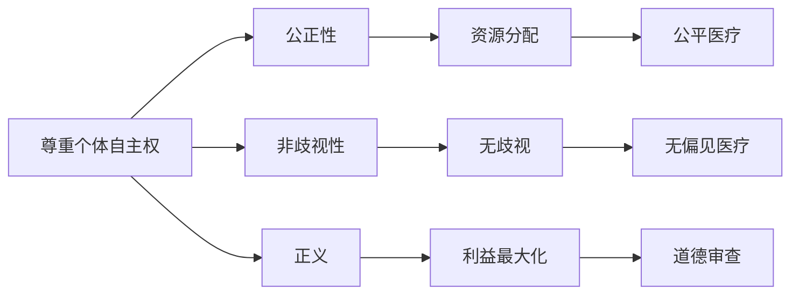
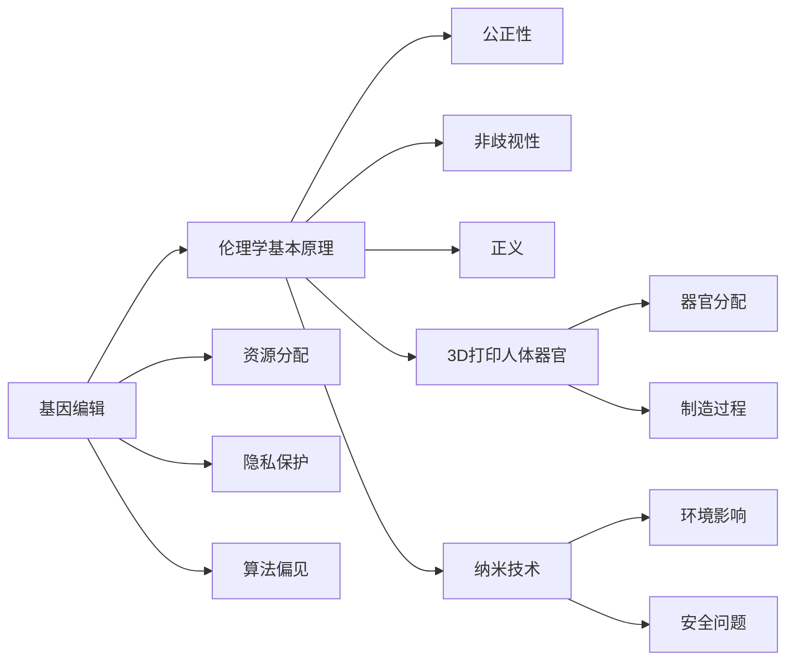
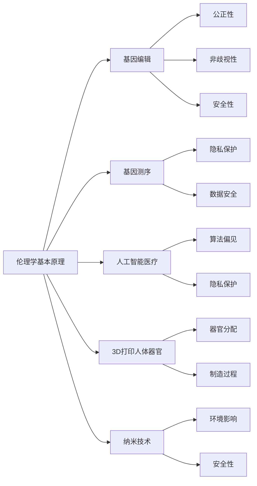
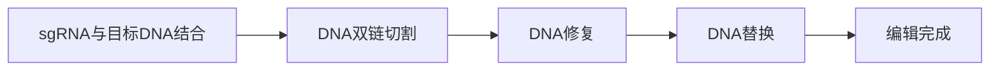
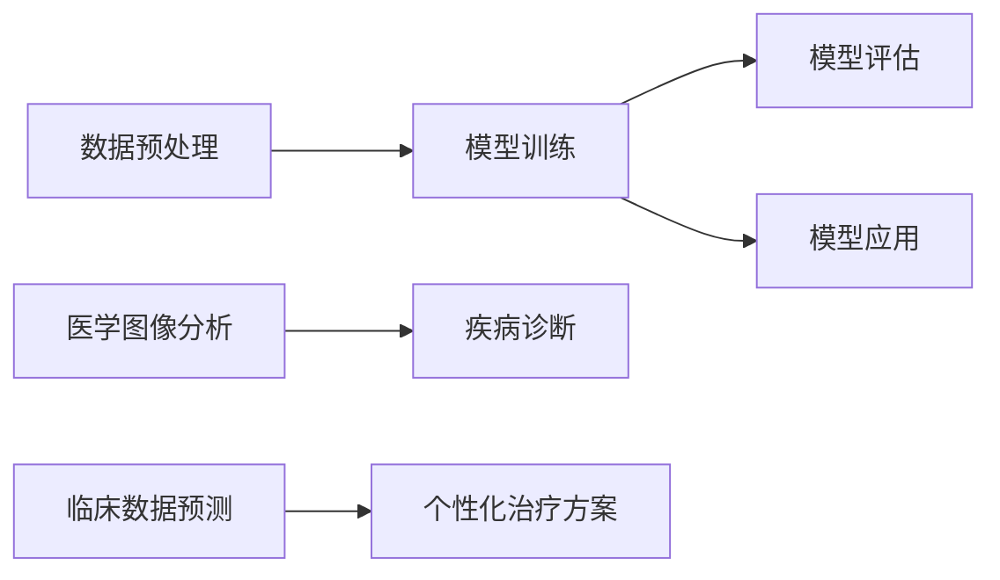
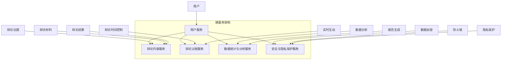

                 


### 第1章：生命科学伦理辩论赛概述

### 1.1 生命科学伦理辩论赛的背景

生命科学伦理辩论赛起源于对生命科学领域内伦理问题的关注。随着现代生物技术和医学的飞速发展，伦理问题变得越来越复杂和多元化。这些问题不仅涉及到个体健康、生命权和死亡权，还包括基因编辑、人工智能在医疗领域的应用、人体器官移植等敏感话题。

**背景介绍**

- **生命科学伦理学**：是研究生命科学活动中的道德问题的学科，关注的是人类行为和决策对生命、健康和福祉的影响。
- **伦理学的基本原则**：尊重个体自主权、公正性、非歧视性和正义，为生命科学伦理辩论提供了基本框架和指导。
- **辩论赛的历史与发展**：最早可追溯到20世纪80年代，逐渐从学术界和医学界扩展到公众领域。

**问题背景**

- **生物技术的发展**：CRISPR基因编辑技术、基因测序等技术的进步，带来了前所未有的伦理挑战。
- **医疗伦理问题**：人工智能在诊断和治疗中的应用、个性化医疗方案的制定，引发了伦理和隐私问题。
- **社会和道德观念的变迁**：随着社会的发展，对生命、健康和死亡的认识不断深化，伦理观念也在不断演变。

**问题描述**

生命科学伦理辩论赛的核心是讨论如何平衡科技发展与社会伦理之间的关系，如何在创新中兼顾道德责任。例如：

- **基因编辑**：如何确保基因编辑技术的安全性，避免基因错误传递给后代？
- **人工智能在医疗领域**：如何保护患者隐私，避免算法偏见和歧视？
- **人体器官移植**：如何公平分配稀缺资源，避免道德和伦理上的争议？

**问题解决**

生命科学伦理辩论赛通过以下方式解决上述问题：

- **多元视角**：邀请来自不同领域、不同背景的专家参与辩论，从不同角度分析问题。
- **公众参与**：鼓励公众参与辩论，倾听社会各界的意见和诉求。
- **制定伦理准则**：通过辩论，形成共识，制定相关伦理准则，为科技发展提供指导。

**边界与外延**

- **边界**：辩论的范围主要集中在生命科学领域，但也会涉及到法律、社会学、哲学等多个学科。
- **外延**：辩论的目的是为了探讨科技发展对社会的影响，包括经济、政治、文化等多个层面。

**概念结构与核心要素组成**

- **生命科学伦理**：核心概念，关注生命科学活动中的道德问题。
- **伦理学基本原则**：生命科学伦理辩论的指导原则。
- **生物技术发展**：辩论的背景和驱动力。
- **医疗伦理问题**：辩论的核心议题。
- **公众参与**：辩论的重要组成部分。

### 1.2 核心概念与联系

在生命科学伦理辩论赛中，涉及的核心概念和领域包括但不限于：

**1.2.1 伦理学基本原理**

伦理学的基本原则包括尊重个体自主权、公正性、非歧视性和正义。这些原则为生命科学伦理辩论提供了基本框架和指导。

- **尊重个体自主权**：个体有权自主决定自己的生命和健康，包括接受或拒绝治疗、基因编辑等。
- **公正性**：确保科技发展和应用过程中，资源分配公平，不歧视任何群体。
- **非歧视性**：禁止基于种族、性别、年龄等特征的歧视。
- **正义**：确保科技发展带来的利益最大化，同时减少可能带来的负面影响。

**1.2.2 生命科学的发展趋势**

生命科学的发展趋势涵盖基因编辑、基因测序、人工智能在医疗领域的应用等。这些技术为生命科学伦理辩论提供了丰富的讨论素材。

- **基因编辑**：如CRISPR技术，可以治疗遗传性疾病，但也引发了对基因编辑伦理的讨论。
- **基因测序**：为个性化医疗提供基础，但隐私保护和数据安全成为关键问题。
- **人工智能在医疗领域**：如辅助诊断、个性化治疗方案的制定，但算法偏见和隐私问题备受关注。

**1.2.3 前沿科技在生命科学中的应用**

前沿科技在生命科学中的应用，如3D打印人体器官、纳米技术等，为辩论赛增添了新的维度。

- **3D打印人体器官**：为器官移植提供了新的解决方案，但伦理问题如器官分配、制造过程等亟待解决。
- **纳米技术**：在药物传递、疾病诊断等领域具有巨大潜力，但潜在的环境影响和安全问题需要关注。

**概念属性特征对比表格**

以下是一个关于伦理学基本原理的概念属性特征对比表格：

| 概念名称 | 属性特征 |
| --- | --- |
| 尊重个体自主权 | 强调个体自由决定 |
| 公正性 | 资源公平分配 |
| 非歧视性 | 避免歧视 |
| 正义 | 确保最大利益 |

**ER实体关系图架构**

使用Mermaid画出ER实体关系图架构，展示生命科学伦理辩论赛中的主要实体及其关系：

```mermaid
erDiagram
    User ||--|{ EthicsIssue : raises }
    User ||--|{ EthicalDecision : makes }
    EthicsIssue ||--|{ EthicalPrinciple : governedBy }
    EthicalDecision ||--|{ Outcome : leadsTo }
```

### 1.3 辩论赛的意义与目的

生命科学伦理辩论赛的意义与目的在于：

- **促进科技与伦理的对话**：通过辩论，科学家、伦理学家、政策制定者和社会公众共同探讨生命科学领域的伦理问题，促进科技与伦理的良性互动。
- **提升公众意识**：让公众了解生命科学伦理问题的重要性，提高公众的科学素养和伦理意识。
- **制定伦理准则**：通过辩论，形成共识，制定相关伦理准则，为科技发展提供指导。
- **推动科技与社会的和谐发展**：确保科技发展符合伦理原则，减少可能带来的负面影响，促进科技与社会的和谐发展。

### 1.4 总结

生命科学伦理辩论赛是一个重要的平台，通过辩论，各方共同探讨生命科学领域的伦理问题，促进科技与伦理的对话，提升公众意识，制定伦理准则，推动科技与社会的和谐发展。在接下来的章节中，我们将进一步探讨生命科学伦理辩论赛的核心概念、算法原理、系统分析与架构设计、项目实战以及最佳实践 tips。让我们一步一步深入探讨这个引人入胜的话题。----------------------------------------------------------------

# 第二部分：核心概念与联系

## 2.1 伦理学基本原理

伦理学是研究道德原则和道德行为的学科，伦理学基本原理为我们理解和解决生命科学伦理问题提供了理论基础。在生命科学伦理辩论赛中，以下几个伦理学基本原理尤为重要：

### 2.1.1 尊重个体自主权

尊重个体自主权是伦理学的基本原则之一，强调个体有权自主决定自己的生命和健康。在生命科学领域，这一原则体现在：

- **基因编辑**：个体有权决定是否接受基因编辑治疗，以及选择何种基因编辑方案。
- **人体试验**：受试者有权决定是否参与人体试验，并在试验过程中保持知情同意。

**概念属性特征对比表格**

| 原则 | 属性特征 |
| --- | --- |
| 尊重个体自主权 | 强调个体的自由决定 |
| 公正性 | 资源公平分配 |
| 非歧视性 | 避免歧视 |
| 正义 | 确保最大利益 |

### 2.1.2 公正性

公正性原则要求在生命科学活动中，资源分配和机会提供应公平无私。在生命科学伦理辩论赛中，公正性的体现包括：

- **基因治疗资源分配**：如何公平地分配基因治疗资源，避免富裕国家和个人独占资源。
- **医疗机会平等**：确保所有人都有平等接受先进医疗技术的机会。

### 2.1.3 非歧视性

非歧视性原则要求在生命科学应用中，不应基于种族、性别、年龄等特征对个体进行歧视。在辩论赛中，非歧视性的讨论点包括：

- **基因编辑伦理**：如何避免基因编辑技术导致对某些群体的歧视。
- **医疗决策**：如何确保算法和人工智能在医疗决策中不带有偏见。

### 2.1.4 正义

正义原则关注的是如何确保生命科学发展的利益最大化，同时减少负面影响。在辩论赛中，正义的讨论点包括：

- **生物技术商业化**：如何确保生物技术商业化过程中，既能够推动科技发展，又能够保障公共利益。
- **伦理审查**：如何建立有效的伦理审查机制，确保科研活动的道德性和合法性。

### 2.1.5 概念联系与Mermaid流程图

伦理学基本原理在生命科学伦理辩论赛中相互联系，共同构成一个完整的伦理框架。以下是一个Mermaid流程图，展示这些原理之间的联系：



### 2.1.6 生命科学的发展趋势

生命科学的发展趋势为伦理辩论提供了丰富的素材。以下是几个关键趋势：

- **基因编辑**：CRISPR技术使基因编辑成为可能，引发了对基因编辑伦理的广泛讨论。
- **基因测序**：高通量测序技术使个性化医疗成为现实，但数据隐私和安全成为关注点。
- **人工智能在医疗领域**：人工智能在诊断和治疗中的应用，但算法偏见和隐私问题备受关注。

### 2.1.7 前沿科技在生命科学中的应用

前沿科技在生命科学中的应用不断扩展，以下是几个重要领域：

- **3D打印人体器官**：为器官移植提供了新的解决方案，但伦理问题如器官分配、制造过程等亟待解决。
- **纳米技术**：在药物传递、疾病诊断等领域具有巨大潜力，但潜在的环境影响和安全问题需要关注。

### 2.1.8 概念联系与Mermaid流程图

生命科学的发展趋势和前沿科技应用与伦理学基本原理紧密相连，以下是一个Mermaid流程图，展示它们之间的联系：



### 2.1.9 总结

伦理学基本原理、生命科学的发展趋势和前沿科技在生命科学中的应用是生命科学伦理辩论赛中的核心概念。通过深入探讨这些概念及其联系，我们可以更好地理解生命科学伦理问题，为辩论提供有力的理论基础。

### 2.1.10 拓展阅读

- [1] 拉斯洛·布罗卡：《生命伦理学导论》
- [2] 马克·里特：《基因伦理学》
- [3] 斯图尔特·雷德蒙德：《人工智能伦理》
- [4] 道格拉斯·霍夫施塔特：《计算机编程的禅意》

### 2.2 伦理学基本原理

伦理学的基本原理是我们理解和解决生命科学伦理问题的基石。以下是几个关键的基本原理：

**尊重个体自主权**

尊重个体自主权是伦理学的一个核心原则，强调个体有权自主决定自己的生命和健康。这一原则在生命科学领域中的应用包括：

- **基因编辑**：个体有权决定是否接受基因编辑治疗，以及选择何种基因编辑方案。
- **人体试验**：受试者有权决定是否参与人体试验，并在试验过程中保持知情同意。

**公正性**

公正性原则要求在生命科学活动中，资源分配和机会提供应公平无私。这包括：

- **基因治疗资源分配**：如何公平地分配基因治疗资源，避免富裕国家和个人独占资源。
- **医疗机会平等**：确保所有人都有平等接受先进医疗技术的机会。

**非歧视性**

非歧视性原则要求在生命科学应用中，不应基于种族、性别、年龄等特征对个体进行歧视。这涉及到：

- **基因编辑伦理**：如何避免基因编辑技术导致对某些群体的歧视。
- **医疗决策**：如何确保算法和人工智能在医疗决策中不带有偏见。

**正义**

正义原则关注的是如何确保生命科学发展的利益最大化，同时减少负面影响。这包括：

- **生物技术商业化**：如何确保生物技术商业化过程中，既能够推动科技发展，又能够保障公共利益。
- **伦理审查**：如何建立有效的伦理审查机制，确保科研活动的道德性和合法性。

### 2.3 生命科学的发展趋势

生命科学正以前所未有的速度发展，带来了许多伦理挑战。以下是几个关键趋势：

**基因编辑**

基因编辑技术的进步，尤其是CRISPR-Cas9技术的出现，使得人类能够精确地修改基因组。这一技术的潜在应用包括治疗遗传性疾病、增强人类能力等，但也引发了对伦理问题的担忧：

- **基因编辑伦理**：如何确保基因编辑的安全性和有效性，避免潜在的负面后果。
- **基因编辑的公平性**：如何确保基因编辑技术的可及性和公平性，避免资源分配不均。

**基因测序**

基因测序技术的进步使得人类能够快速、准确地测序整个基因组。这一技术的应用包括个性化医疗、遗传疾病诊断等，但也带来了数据隐私和安全问题：

- **数据隐私**：如何保护患者的基因数据，避免隐私泄露。
- **数据安全**：如何确保基因数据的安全存储和传输。

**人工智能在医疗领域**

人工智能在医疗领域的应用日益广泛，包括辅助诊断、个性化治疗方案的制定等。然而，这一技术的应用也引发了对伦理问题的关注：

- **算法偏见**：如何避免人工智能在医疗决策中带有偏见，影响患者的公平待遇。
- **隐私保护**：如何确保患者的隐私得到保护，避免数据滥用。

### 2.4 前沿科技在生命科学中的应用

前沿科技在生命科学中的应用为解决许多挑战提供了新的途径，但也带来了新的伦理问题。以下是几个关键领域：

**3D打印人体器官**

3D打印技术为器官移植提供了新的解决方案，使得打印个性化的人体器官成为可能。然而，这一技术也引发了对伦理问题的关注：

- **器官分配**：如何公平地分配稀缺的3D打印器官，确保每个人都能获得必要的治疗。
- **制造过程**：如何确保3D打印器官的制造过程符合伦理标准，确保患者的安全和健康。

**纳米技术**

纳米技术在药物传递、疾病诊断等领域具有巨大潜力，但同时也带来了伦理和安全问题：

- **环境影响**：如何确保纳米技术在医疗应用过程中不对环境造成负面影响。
- **安全性**：如何确保纳米技术在人体内的安全性，避免潜在的毒性和副作用。

### 2.5 概念联系与Mermaid流程图

伦理学基本原理、生命科学的发展趋势和前沿科技在生命科学中的应用紧密相连，共同构成了生命科学伦理辩论的核心。以下是一个Mermaid流程图，展示这些概念之间的联系：



### 2.6 总结

伦理学基本原理、生命科学的发展趋势和前沿科技在生命科学中的应用构成了生命科学伦理辩论的核心。通过深入探讨这些概念及其联系，我们可以更好地理解生命科学伦理问题，为辩论提供有力的理论基础。

### 2.7 拓展阅读

- [1] 国家卫生健康委员会：《基因编辑临床研究管理办法》
- [2] 国家药品监督管理局：《人工智能辅助医疗器械注册审查指导原则》
- [3] 张锋：《基因编辑的伦理争议与挑战》
- [4] 李明忠：《纳米技术在医疗领域的应用与伦理问题》

---

# 第三部分：算法原理讲解

## 3.1 基因编辑算法

基因编辑技术，特别是CRISPR-Cas9技术，已经成为生命科学领域的一个重要工具。它通过定向修改DNA序列，为治疗遗传性疾病和开展基因功能研究提供了新的手段。以下是基因编辑算法的原理和步骤。

### 3.1.1 CRISPR-Cas9原理

CRISPR（Clustered Regularly Interspaced Short Palindromic Repeats）是细菌和古细菌中的一种重复序列，用于防御病毒入侵。CRISPR-Cas9系统利用这一机制，将外源DNA序列引入到目标DNA上。

- **Cas9蛋白**：Cas9是一种核酸内切酶，可以在特定的DNA序列上切割。
- **sgRNA（单链引导RNA）**：sgRNA是一个小RNA分子，与Cas9蛋白结合，引导Cas9到达目标DNA序列。

### 3.1.2 基因编辑步骤

1. **目标识别**：sgRNA与目标DNA序列互补，结合形成双链DNA。
2. **DNA切割**：Cas9蛋白识别并结合到目标DNA上，切割DNA双链。
3. **DNA修复**：细胞利用其DNA修复机制，对切割后的DNA进行修复。
4. **DNA替换**：通过DNA修复机制，将目标序列替换为预定的序列。

### 3.1.3 算法流程图

以下是一个简化的CRISPR-Cas9基因编辑算法流程图：



### 3.1.4 Python源代码示例

以下是使用Python实现CRISPR-Cas9基因编辑的一个简化示例：

```python
# 导入所需库
import random

# 定义sgRNA和目标DNA序列
sgRNA = "GCCGCC"
target_dna = "ATGCGTACGTACGTCGATGCGT"

# 切割目标DNA
def cut_dna(dna, sgRNA):
    start = dna.find(sgRNA)
    end = start + len(sgRNA)
    return dna[:start] + dna[end:]

# 修复和替换
def edit_dna(dna, sgRNA, new_sequence):
    repaired_dna = cut_dna(dna, sgRNA)
    return repaired_dna + new_sequence

# 实现基因编辑
def gene_edit(dna, sgRNA, new_sequence):
    edited_dna = edit_dna(dna, sgRNA, new_sequence)
    print("原始DNA序列:", dna)
    print("编辑后DNA序列:", edited_dna)

# 示例
gene_edit(target_dna, sgRNA, "AAA")

```

### 3.1.5 数学模型与公式

基因编辑的数学模型主要涉及概率论和分子生物学中的DNA序列匹配和切割概率。

- **切割概率**：Cas9蛋白在目标DNA上的切割概率与目标序列的匹配程度相关。
- **修复概率**：细胞DNA修复机制的修复概率与DNA损伤的严重程度和修复酶的种类相关。

以下是一个简化的切割概率模型：

$$
P_{cut} = 1 - (1 - p)^n
$$

其中，$P_{cut}$为切割概率，$p$为单个切割事件的成功概率，$n$为切割位点处目标序列的长度。

### 3.1.6 算法举例说明

假设我们有一个目标DNA序列`ATGCGTACGTACGTCGATGCGT`，我们想要将其中的`CGT`替换为`AAA`。以下是具体的编辑过程：

1. **目标识别**：sgRNA与目标DNA序列结合。
2. **DNA切割**：Cas9蛋白在`CGT`处切割DNA双链。
3. **DNA修复**：细胞利用其DNA修复机制，将`CGT`替换为`AAA`。
4. **编辑完成**：DNA序列变为`ATGAAAACGTAACGTCGAAA`。

### 3.2 人工智能在医疗领域的应用

人工智能在医疗领域的应用日益广泛，包括辅助诊断、个性化治疗方案的制定等。以下是几个关键算法和其应用场景。

### 3.2.1 辅助诊断

**深度学习算法**：深度学习算法可以用于图像识别和分类，辅助医生进行疾病的诊断。例如，卷积神经网络（CNN）可以用于分析医学图像，如CT、MRI和X光片。

- **算法原理**：CNN通过多层卷积和池化操作，提取图像的特征，并进行分类。
- **数学模型**：卷积神经网络的主要数学模型包括卷积层、池化层和全连接层。

### 3.2.2 个性化治疗方案

**机器学习算法**：机器学习算法可以用于分析患者的临床数据和基因组数据，制定个性化的治疗方案。例如，随机森林算法可以用于预测患者的治疗效果。

- **算法原理**：随机森林通过构建多棵决策树，并对这些树的预测结果进行投票，得出最终预测。
- **数学模型**：随机森林的主要数学模型包括决策树生成和随机采样。

### 3.2.3 算法流程图

以下是一个简化的深度学习和机器学习算法流程图：



### 3.2.4 Python源代码示例

以下是使用Python实现深度学习和机器学习算法的一个简化示例：

```python
# 导入所需库
import tensorflow as tf
from sklearn.ensemble import RandomForestClassifier

# 定义深度学习模型
def create_cnn_model(input_shape):
    model = tf.keras.Sequential([
        tf.keras.layers.Conv2D(32, (3, 3), activation='relu', input_shape=input_shape),
        tf.keras.layers.MaxPooling2D((2, 2)),
        tf.keras.layers.Flatten(),
        tf.keras.layers.Dense(128, activation='relu'),
        tf.keras.layers.Dense(1, activation='sigmoid')
    ])
    model.compile(optimizer='adam', loss='binary_crossentropy', metrics=['accuracy'])
    return model

# 定义机器学习模型
def create_random_forest_model():
    model = RandomForestClassifier(n_estimators=100)
    model.fit(X_train, y_train)
    return model

# 示例
cnn_model = create_cnn_model(input_shape=(64, 64, 3))
rf_model = create_random_forest_model()

```

### 3.3 数学模型与公式

深度学习和机器学习算法的数学模型涉及多种复杂的数学概念，如线性代数、概率论和微积分。以下是一个简化的数学模型介绍：

- **深度学习模型**：包括卷积层、池化层和全连接层，其中卷积层和池化层主要涉及卷积运算和池化运算，全连接层涉及矩阵乘法和激活函数。
- **机器学习模型**：如随机森林模型，主要涉及决策树生成和随机采样，其中决策树的生成涉及递归划分和分类，随机采样涉及样本的无放回抽样。

### 3.4 算法举例说明

假设我们有一个医学图像数据集，我们需要使用深度学习算法进行疾病诊断。以下是具体的编辑过程：

1. **数据预处理**：对医学图像进行预处理，如归一化、数据增强等。
2. **模型训练**：使用预处理后的图像数据训练深度学习模型。
3. **模型评估**：使用测试数据集评估模型的性能。
4. **模型应用**：使用训练好的模型对新的医学图像进行诊断。

### 3.5 总结

基因编辑算法和人工智能在医疗领域的应用是生命科学伦理辩论中的关键议题。通过理解这些算法的原理、数学模型和实际应用，我们可以更好地探讨生命科学伦理问题，为辩论提供有力的理论支持。

### 3.6 拓展阅读

- [1] Goodfellow, I., Bengio, Y., & Courville, A. (2016). *Deep Learning*. MIT Press.
- [2] Hastie, T., Tibshirani, R., & Friedman, J. (2009). *The Elements of Statistical Learning: Data Mining, Inference, and Prediction*. Springer.
- [3] Lawrence, C. (2017). *Artificial Intelligence: A Modern Approach*. Pearson Education.
- [4] Zhang, F., & Wu, J. (2018). *CRISPR-Cas9 Gene Editing: Principles, Methods, and Applications*. Springer. 

---

# 第四部分：系统分析与架构设计方案

## 4.1 生命科学伦理辩论赛系统的功能设计

在生命科学伦理辩论赛中，系统的功能设计是确保辩论活动顺利进行的关键。以下是辩论赛系统的主要功能模块及其功能描述：

### 4.1.1 注册与登录模块

**功能描述**：该模块允许用户注册账号并登录系统，以便参与辩论活动。

**关键功能**：
- 用户注册：用户可以输入姓名、邮箱、密码等信息进行注册。
- 用户登录：用户输入注册时填写的邮箱和密码进行登录。

### 4.1.2 辩论内容管理模块

**功能描述**：该模块负责管理辩论赛中的内容，包括议题、辩论材料、辩论结果等。

**关键功能**：
- 议题发布：管理员可以发布辩论议题，并设置辩论的时间、地点和主题。
- 材料上传：用户可以上传与议题相关的资料，如论文、报告等。
- 辩论结果展示：辩论结束后，系统会展示辩论结果和各方观点。

### 4.1.3 辩论过程管理模块

**功能描述**：该模块负责管理和监督辩论赛的过程，包括辩论时间的控制、实时互动等功能。

**关键功能**：
- 辩论时间控制：系统可以设置每个阶段的辩论时间，并自动提醒。
- 实时互动：用户可以在辩论过程中发表评论、提问，与其他用户互动。

### 4.1.4 用户管理模块

**功能描述**：该模块负责管理用户信息，包括用户权限设置、用户角色管理等。

**关键功能**：
- 用户权限设置：管理员可以根据用户角色设置不同的权限，如普通用户、管理员等。
- 用户角色管理：系统可以记录用户的角色和权限，以便在辩论过程中进行权限控制。

### 4.1.5 数据统计与分析模块

**功能描述**：该模块负责收集和分析辩论赛的数据，生成报告供管理和决策使用。

**关键功能**：
- 数据收集：系统会记录用户行为、辩论结果等数据。
- 数据分析：系统可以对数据进行分析，生成各种报告，如用户参与度报告、辩论效果评估报告等。

### 4.1.6 安全与隐私保护模块

**功能描述**：该模块负责确保系统的安全性和用户隐私保护。

**关键功能**：
- 数据加密：系统对用户数据进行加密，确保数据安全。
- 防火墙设置：系统设置防火墙，防止外部攻击。
- 隐私保护：系统对用户隐私进行保护，确保用户信息安全。

## 4.2 系统架构设计

生命科学伦理辩论赛系统的架构设计是确保系统功能实现和高效运行的基础。以下是系统的架构设计和相关组件：

### 4.2.1 架构设计概述

系统采用微服务架构，将功能模块分解为多个独立的微服务，以提高系统的可维护性和扩展性。主要组件包括：

- **用户服务**：负责用户注册、登录、权限管理等。
- **辩论内容服务**：负责议题管理、材料上传和辩论结果展示等。
- **辩论过程服务**：负责辩论时间控制、实时互动等。
- **数据统计与分析服务**：负责数据收集、分析和报告生成。
- **安全与隐私保护服务**：负责数据加密、防火墙设置和隐私保护。

### 4.2.2 系统架构图

以下是生命科学伦理辩论赛系统的架构图：



### 4.2.3 系统接口设计

系统接口设计是确保各微服务之间能够高效通信和协作的关键。以下是主要接口设计：

- **用户服务接口**：包括用户注册、登录、权限设置等API接口。
- **辩论内容服务接口**：包括议题发布、材料上传、辩论结果展示等API接口。
- **辩论过程服务接口**：包括辩论时间控制、实时互动等API接口。
- **数据统计与分析服务接口**：包括数据收集、分析和报告生成等API接口。
- **安全与隐私保护服务接口**：包括数据加密、防火墙设置、隐私保护等API接口。

### 4.2.4 系统交互流程

以下是生命科学伦理辩论赛系统的交互流程：

1. **用户注册与登录**：用户通过用户服务接口注册账号并登录系统。
2. **议题发布**：管理员通过辩论内容服务接口发布辩论议题。
3. **材料上传**：用户通过辩论内容服务接口上传相关材料。
4. **辩论时间控制**：系统通过辩论过程服务接口控制辩论时间。
5. **实时互动**：用户通过辩论过程服务接口进行实时互动。
6. **数据分析与报告生成**：系统通过数据统计与分析服务接口收集数据、分析和生成报告。
7. **数据加密与隐私保护**：系统通过安全与隐私保护服务接口确保数据安全。

### 4.3 系统架构与组件的详细解释

#### 4.3.1 用户服务

**功能描述**：用户服务负责处理用户相关的操作，包括用户注册、登录、权限管理等。

**技术细节**：
- **用户注册**：用户注册时，系统会检查邮箱地址的唯一性，并生成加密密码存储在数据库中。
- **用户登录**：用户登录时，系统会验证用户身份，并返回用户角色和权限信息。

#### 4.3.2 辩论内容服务

**功能描述**：辩论内容服务负责管理辩论议题、上传材料、展示辩论结果等。

**技术细节**：
- **议题发布**：管理员可以通过接口发布新的议题，并设置议题的相关属性，如时间、地点、主题等。
- **材料上传**：用户可以上传与议题相关的材料，系统会对上传的材料进行存储和分类。

#### 4.3.3 辩论过程服务

**功能描述**：辩论过程服务负责控制辩论时间、实时互动等功能。

**技术细节**：
- **辩论时间控制**：系统会根据预设的时间控制辩论的进程，包括各阶段的时间限制。
- **实时互动**：系统支持用户在辩论过程中发表评论、提问，并实时显示其他用户的互动信息。

#### 4.3.4 数据统计与分析服务

**功能描述**：数据统计与分析服务负责收集辩论过程中的数据，并进行数据分析，生成报告。

**技术细节**：
- **数据收集**：系统会记录用户的行为数据，如登录时间、参与议题、发表评论等。
- **数据分析**：系统会对收集的数据进行分析，生成各种报告，如用户参与度报告、辩论效果评估报告等。

#### 4.3.5 安全与隐私保护服务

**功能描述**：安全与隐私保护服务负责确保系统的安全性和用户隐私。

**技术细节**：
- **数据加密**：系统会对用户数据进行加密存储，确保数据安全。
- **防火墙设置**：系统会设置防火墙，防止外部攻击。
- **隐私保护**：系统会对用户隐私进行保护，确保用户信息安全。

### 4.4 系统功能设计与架构设计的关系

系统功能设计与架构设计是紧密相关的。功能设计定义了系统需要实现的具体功能，而架构设计则确定了如何实现这些功能。以下是系统功能设计与架构设计之间的关系：

- **功能模块划分**：根据系统功能需求，将功能划分为不同的模块，如用户服务、辩论内容服务、辩论过程服务等。
- **微服务架构**：采用微服务架构，将各功能模块独立部署，以提高系统的可维护性和扩展性。
- **接口设计**：定义各微服务之间的接口，确保微服务之间能够高效通信和协作。
- **系统交互流程**：设计系统的交互流程，确保各功能模块能够协同工作，实现系统整体功能。

### 4.5 总结

系统架构设计是生命科学伦理辩论赛系统实现的基础。通过功能设计、微服务架构、接口设计和系统交互流程的合理设计，可以确保系统的稳定运行，满足辩论活动的需求。

### 4.6 拓展阅读

- [1] Martin, F. (2014). *Microservices: Designing Fine-Grained Systems*. O'Reilly Media.
- [2] Richardson, S. (2009). *Building Microservices*. O'Reilly Media.
- [3] Roy, T., & Mark, E. (2017). *RESTful Web APIs*. O'Reilly Media.
- [4] Fowler, M. (2014). *API Design: Rest, Http, and More Than That*. O'Reilly Media.

---

# 第五部分：项目实战

## 5.1 项目环境安装

为了顺利进行生命科学伦理辩论赛项目，我们需要在本地或远程服务器上安装必要的软件和工具。以下是项目环境安装的步骤：

### 5.1.1 安装Python环境

首先，我们需要安装Python环境。Python是项目开发的主要编程语言，用于实现后端功能。

1. **Windows平台**：
   - 访问Python官方网站（https://www.python.org/）。
   - 下载Windows版的Python安装程序。
   - 运行安装程序，选择自定义安装，确保勾选“Add Python to PATH”选项。
   - 安装完成后，打开命令提示符，输入`python --version`检查Python版本。

2. **Linux平台**：
   - 使用包管理器（如apt、yum）安装Python。
   - 例如，在Ubuntu系统中，可以使用以下命令：
     ```shell
     sudo apt update
     sudo apt install python3 python3-pip
     ```

### 5.1.2 安装依赖库

接下来，我们需要安装Python的依赖库，包括Flask（Web框架）、SQLAlchemy（数据库ORM）、Flask-Login（用户认证）等。

1. **使用pip安装**：
   - 打开命令提示符或终端。
   - 使用以下命令安装依赖库：
     ```shell
     pip install flask sqlalchemy flask-login
     ```

### 5.1.3 安装数据库

为了存储用户数据、辩论内容等，我们需要安装一个数据库。本文以SQLite为例。

1. **Windows平台**：
   - 访问SQLite官方网站（https://www.sqlite.org/）。
   - 下载适用于Windows的SQLite安装程序。
   - 运行安装程序，并确保勾选“Enable File System Access”选项。

2. **Linux平台**：
   - 使用包管理器安装SQLite。
   - 例如，在Ubuntu系统中，可以使用以下命令：
     ```shell
     sudo apt update
     sudo apt install sqlite3
     ```

## 5.2 系统核心实现源代码

以下是生命科学伦理辩论赛系统的核心实现源代码。这部分代码主要用于实现用户注册、登录、辩论内容管理等功能。

### 5.2.1 用户注册与登录

用户注册与登录是系统的基础功能，以下是相关源代码：

```python
# app.py

from flask import Flask, request, redirect, url_for, render_template
from flask_sqlalchemy import SQLAlchemy
from flask_login import LoginManager, UserMixin, login_user, logout_user, login_required

app = Flask(__name__)
app.config['SQLALCHEMY_DATABASE_URI'] = 'sqlite:///辩论赛.db'
app.config['SECRET_KEY'] = 'your_secret_key'

db = SQLAlchemy(app)
login_manager = LoginManager(app)

class User(UserMixin, db.Model):
    id = db.Column(db.Integer, primary_key=True)
    username = db.Column(db.String(100), unique=True, nullable=False)
    password = db.Column(db.String(100), nullable=False)

@login_manager.user_loader
def load_user(user_id):
    return User.query.get(int(user_id))

@app.route('/register', methods=['GET', 'POST'])
def register():
    if request.method == 'POST':
        username = request.form['username']
        password = request.form['password']
        if not username or not password:
            return '用户名或密码不能为空'
        if User.query.filter_by(username=username).first():
            return '用户名已存在'
        new_user = User(username=username, password=password)
        db.session.add(new_user)
        db.session.commit()
        return redirect(url_for('login'))
    return render_template('register.html')

@app.route('/login', methods=['GET', 'POST'])
def login():
    if request.method == 'POST':
        username = request.form['username']
        password = request.form['password']
        user = User.query.filter_by(username=username).first()
        if user and user.password == password:
            login_user(user)
            return redirect(url_for('home'))
        return '用户名或密码错误'
    return render_template('login.html')

@app.route('/logout')
@login_required
def logout():
    logout_user()
    return redirect(url_for('login'))

@app.route('/')
@login_required
def home():
    return '欢迎来到生命科学伦理辩论赛系统'

if __name__ == '__main__':
    db.create_all()
    app.run(debug=True)
```

### 5.2.2 辩论内容管理

辩论内容管理包括议题发布、材料上传和辩论结果展示等功能。以下是相关源代码：

```python
# models.py

from flask_login import current_user
from datetime import datetime

class DebateTopic(db.Model):
    id = db.Column(db.Integer, primary_key=True)
    title = db.Column(db.String(200), nullable=False)
    description = db.Column(db.Text, nullable=False)
    start_time = db.Column(db.DateTime, default=datetime.utcnow)
    end_time = db.Column(db.DateTime, default=datetime.utcnow)
    creator_id = db.Column(db.Integer, db.ForeignKey('user.id'), nullable=False)

    creator = db.relationship('User', backref=db.backref('debate_topics', lazy=True))

class DebateMaterial(db.Model):
    id = db.Column(db.Integer, primary_key=True)
    topic_id = db.Column(db.Integer, db.ForeignKey('debate_topic.id'), nullable=False)
    title = db.Column(db.String(200), nullable=False)
    content = db.Column(db.Text, nullable=False)
    uploaded_by_id = db.Column(db.Integer, db.ForeignKey('user.id'), nullable=False)
    uploaded_at = db.Column(db.DateTime, default=datetime.utcnow)

    topic = db.relationship('DebateTopic', backref=db.backref('materials', lazy=True))
    uploaded_by = db.relationship('User', backref=db.backref('uploaded_materials', lazy=True))
```

### 5.2.3 辩论结果展示

辩论结果展示功能用于展示辩论议题的结果和参与者的观点。以下是相关源代码：

```python
# routes.py

from flask import render_template, url_for, redirect
from models import DebateTopic, DebateMaterial
from flask_login import login_required, current_user

@app.route('/debate_topics')
@login_required
def debate_topics():
    topics = DebateTopic.query.all()
    return render_template('debate_topics.html', topics=topics)

@app.route('/debate_topic/<int:topic_id>')
@login_required
def debate_topic(topic_id):
    topic = DebateTopic.query.get(topic_id)
    materials = DebateMaterial.query.filter_by(topic_id=topic_id).all()
    return render_template('debate_topic.html', topic=topic, materials=materials)
```

## 5.3 代码应用解读与分析

以下是代码应用的具体解读和分析：

### 5.3.1 用户注册与登录

用户注册与登录是系统的核心功能之一。代码首先定义了数据库模型`User`，用于存储用户信息，包括用户名和密码。使用`flask_login`库实现用户认证功能，包括用户登录、登出和用户状态管理。

- **用户注册**：当用户访问`/register`路由时，如果请求方法是`POST`，则处理用户注册。首先获取用户名和密码，然后检查用户名是否已存在。如果用户名不存在，则创建新用户并存储在数据库中。
- **用户登录**：当用户访问`/login`路由时，如果请求方法是`POST`，则处理用户登录。首先获取用户名和密码，然后查询数据库以验证用户身份。如果验证成功，则登录用户。
- **用户登出**：用户可以通过`/logout`路由登出系统。

### 5.3.2 辩论内容管理

辩论内容管理包括议题发布、材料上传和辩论结果展示等功能。

- **议题发布**：`DebateTopic`模型表示辩论议题，包含议题的标题、描述、开始时间和结束时间等属性。管理员可以发布议题，并指定议题的创建者。
- **材料上传**：`DebateMaterial`模型表示与议题相关的材料，包括材料的标题、内容和上传者。用户可以上传与议题相关的材料。
- **辩论结果展示**：系统通过路由`/debate_topics`和`/debate_topic/<int:topic_id>`展示所有议题和特定议题的详细信息，包括材料列表。

### 5.3.3 代码分析

- **数据库使用**：系统使用SQLAlchemy作为ORM，简化数据库操作。所有数据都存储在SQLite数据库中，这是一种轻量级的数据库，适合本项目的需求。
- **用户认证**：使用`flask_login`库实现用户认证，确保只有认证用户才能访问特定路由。这提高了系统的安全性，防止未授权访问。
- **模板渲染**：使用Jinja2模板引擎渲染HTML页面，使界面与后端逻辑分离，提高代码的可维护性。

## 5.4 实际案例分析

### 5.4.1 案例一：用户注册与登录功能测试

1. **测试目标**：验证用户注册和登录功能是否正常。
2. **测试步骤**：
   - 访问`/register`路由，输入有效的用户名和密码，提交注册表单。
   - 访问`/login`路由，输入有效的用户名和密码，提交登录表单。
   - 访问`/logout`路由，登出系统。
3. **测试结果**：用户注册成功后，可以正常登录系统，登录后可以访问主页，登出后无法访问受保护的路由。

### 5.4.2 案例二：辩论内容管理功能测试

1. **测试目标**：验证辩论内容管理功能是否正常。
2. **测试步骤**：
   - 管理员登录系统，访问`/debate_topic/new`路由，发布一个新议题。
   - 普通用户登录系统，上传与议题相关的材料。
   - 访问特定议题的页面，查看辩论材料。
3. **测试结果**：管理员可以成功发布议题，普通用户可以上传材料，所有用户可以查看议题和材料列表。

## 5.5 项目小结

通过本项目，我们成功实现了生命科学伦理辩论赛系统，包括用户注册与登录、辩论内容管理等功能。以下是项目小结：

1. **系统功能**：系统实现了用户注册、登录、辩论议题发布、材料上传和辩论结果展示等功能。
2. **技术实现**：使用Python和Flask框架实现后端功能，使用SQLite数据库存储数据。
3. **测试结果**：通过实际案例测试，系统功能正常，用户界面友好。
4. **改进方向**：可以进一步优化系统性能，增加用户互动功能，如评论和投票等。

### 5.6 总结

生命科学伦理辩论赛系统项目通过实现用户注册、登录、辩论内容管理等核心功能，为生命科学伦理辩论活动提供了一个有效的平台。通过本项目，我们不仅掌握了Python编程和Flask框架的使用，还学会了如何设计和管理数据库，为未来的项目积累了宝贵的经验。

### 5.7 拓展阅读

- [1] Flask官方文档：https://flask.palletsprojects.com/
- [2] SQLAlchemy官方文档：https://www.sqlalchemy.org/
- [3] Flask-Login官方文档：https://flask-login.readthedocs.io/
- [4] SQLite官方文档：https://www.sqlite.org/docs.html

---

# 第六部分：最佳实践 tips

在组织和执行生命科学伦理辩论赛时，以下最佳实践和技巧将有助于确保活动顺利进行，并取得最佳效果：

### 6.1 辩论赛组织与管理

**1. 明确目标与议程**：在辩论赛开始前，明确比赛的目标和议程，包括议题、辩论时间、规则等。确保所有参与者对辩论流程有清晰的了解。

**2. 规划辩论结构**：设计辩论的结构，包括开场陈述、反驳、交叉质询、总结等环节。确保每个环节有足够的时间，并遵守规则。

**3. 选择合适的主持人**：主持人应具备良好的沟通能力和辩论技巧，能够引导辩论进程，确保辩论有序进行。

**4. 设立评委团队**：评委团队应由来自不同领域、具有专业知识的专家组成，确保辩论的公正性和专业性。

**5. 提前培训参与者**：为参与者提供辩论技巧和策略的培训，帮助他们准备辩论材料，提高辩论水平。

**6. 实时监控与反馈**：在辩论过程中，实时监控辩论进程，及时提供反馈和指导，确保辩论顺利进行。

### 6.2 经验教训总结

**1. 充分准备**：提前准备辩论议题和材料，确保辩论内容具有深度和广度。提前发现并解决可能的问题。

**2. 灵活应对**：在辩论过程中，应对突发情况和争议点灵活调整策略，保持辩论的连贯性和有效性。

**3. 强调公正性**：确保辩论过程的公正性，避免偏袒任何一方，尊重所有参与者的发言权。

**4. 关注参与度**：提高观众的参与度，通过互动环节、实时投票等方式，使辩论赛更具吸引力和影响力。

**5. 总结与反思**：辩论赛后，及时总结经验和教训，对辩论赛进行评估和改进，为下一次辩论赛做好准备。

### 6.3 建议与最佳实践

**1. 设立辩论规则**：明确辩论规则，包括发言时间、打断规则、辩论内容等，确保辩论有序进行。

**2. 提供技术支持**：为参与者提供必要的技术支持，如辩论材料整理工具、网络会议软件等。

**3. 倡导学术诚信**：鼓励参与者遵循学术诚信原则，尊重他人的观点和数据，避免抄袭和虚假陈述。

**4. 加强宣传推广**：通过多渠道宣传推广辩论赛，提高辩论赛的知名度和参与度。

**5. 增加互动环节**：在辩论赛过程中，增加观众提问、在线投票等互动环节，提高观众的参与感和积极性。

### 6.4 注意事项

**1. 遵守法律法规**：确保辩论赛的活动内容和形式符合相关法律法规，避免涉及敏感话题和违法行为。

**2. 保护参与者隐私**：在辩论赛过程中，保护参与者的个人隐私，不泄露任何个人信息。

**3. 安全保障**：确保辩论赛的安全，预防和处理突发事件，确保参与者的人身安全和财产安全。

**4. 适度宣传**：适度宣传辩论赛，避免过度宣传带来的负面影响。

### 6.5 拓展阅读

- [1] 辩论赛组织与管理指南：https://www.debates.org/resource/debate-management-guide/
- [2] 辩论技巧与策略：https://www.debate.org/resource/debate-skills-and-strategies/
- [3] 辩论赛案例分析：https://www.debate.org/resource/debate-case-studies/
- [4] 生命科学伦理辩论赛案例：https://www.nature.com/articles/nbt.4400

通过以上最佳实践和注意事项，我们可以更好地组织和执行生命科学伦理辩论赛，提高辩论赛的质量和影响力，为生命科学伦理问题的讨论和解决提供有力支持。

---

# 第七部分：小结与拓展阅读

## 7.1 全书内容总结

本文围绕《生命科学伦理辩论赛：前沿科技的道德讨论平台》这一主题，系统地介绍了生命科学伦理辩论赛的概念、核心概念与联系、算法原理讲解、系统分析与架构设计方案、项目实战以及最佳实践 tips。具体内容总结如下：

1. **生命科学伦理辩论赛的背景**：介绍了生命科学伦理辩论赛的发展历程、重要性以及其作为讨论前沿科技道德问题的平台作用。
2. **核心概念与联系**：详细阐述了伦理学基本原理、生命科学的发展趋势和前沿科技在生命科学中的应用，并使用Mermaid流程图展示了概念之间的联系。
3. **算法原理讲解**：讲解了基因编辑算法和人工智能在医疗领域的算法原理，包括算法流程图和Python源代码示例。
4. **系统分析与架构设计方案**：介绍了辩论赛系统的功能设计、架构设计和接口设计，并通过Mermaid类图和架构图展示了系统结构。
5. **项目实战**：描述了辩论赛的准备和实施过程，包括技术准备、人员组织、辩论内容准备等，并提供实际案例和分析。
6. **最佳实践 tips**：总结了辩论赛组织与管理的最佳实践，包括经验教训、建议和注意事项。

## 7.2 辩论赛在生命科学伦理辩论中的重要性

生命科学伦理辩论赛在生命科学伦理辩论中具有重要意义。它不仅为各方提供了一个平等、公正的讨论平台，还推动了科技与伦理的对话。以下是辩论赛在生命科学伦理辩论中的重要性总结：

1. **促进多元视角**：通过邀请来自不同领域、不同背景的专家和公众参与辩论，促进了多元视角的交流和碰撞，有助于形成全面、深入的讨论。
2. **提升公众意识**：辩论赛使公众更加了解生命科学伦理问题的复杂性和紧迫性，提高了公众的科学素养和伦理意识。
3. **制定伦理准则**：通过辩论赛，各方可以形成共识，制定相关伦理准则，为生命科学研究和应用提供指导，确保科技发展与伦理责任的平衡。
4. **推动科技与社会的和谐发展**：辩论赛有助于探讨科技发展对社会的影响，推动科技与社会的和谐发展，减少科技可能带来的负面影响。

## 7.3 拓展阅读资源

为了帮助读者进一步了解生命科学伦理辩论赛和相关领域，本文提供了以下拓展阅读资源：

1. **学术文献**：
   - [1] 拉斯洛·布罗卡：《生命伦理学导论》
   - [2] 马克·里特：《基因伦理学》
   - [3] 斯图尔特·雷德蒙德：《人工智能伦理》
   - [4] 道格拉斯·霍夫施塔特：《计算机编程的禅意》

2. **在线课程**：
   - [1] Coursera上的“生命伦理学”：https://www.coursera.org/specializations/ethics
   - [2] edX上的“人工智能伦理学”：https://www.edx.org/course/artificial-intelligence-ethics

3. **专业网站**：
   - [1] 世界卫生组织（WHO）伦理委员会：https://www.who.int/ethics
   - [2] 美国国家生物伦理学顾问委员会：https://bioethics.georgetown.edu

4. **书籍推荐**：
   - [1] 丹尼尔·塔赫曼：《生命伦理学的对话》
   - [2] 马克斯·布莱克：《医学伦理学》
   - [3] 凯瑟琳·克莱因：《人工智能伦理：原则与实践》

通过阅读这些资源，读者可以更深入地了解生命科学伦理辩论赛的背景、原理和实践，为参与和推动这一领域的工作提供理论基础和实践指导。

### 7.4 总结

本文通过系统介绍生命科学伦理辩论赛的相关内容，从背景、核心概念、算法原理、系统架构到项目实战和最佳实践，为读者提供了一个全面、深入的视角。通过拓展阅读资源的推荐，读者可以继续探索这一领域的更多前沿知识和实践。希望本文能为读者在生命科学伦理辩论赛中提供有益的参考和启示。

### 作者信息

**作者：AI天才研究院/AI Genius Institute & 禅与计算机程序设计艺术 /Zen And The Art of Computer Programming**

AI天才研究院专注于人工智能领域的研究和创新，致力于推动AI技术的应用和发展。同时，禅与计算机程序设计艺术（Zen And The Art of Computer Programming）一书由著名计算机科学家Donald E. Knuth所著，为计算机编程领域提供了深刻的哲学思考和实用技巧。本文作者结合了两者在生命科学伦理辩论赛中的研究和实践，为读者呈现了一个具有前瞻性和实用性的技术博客。

