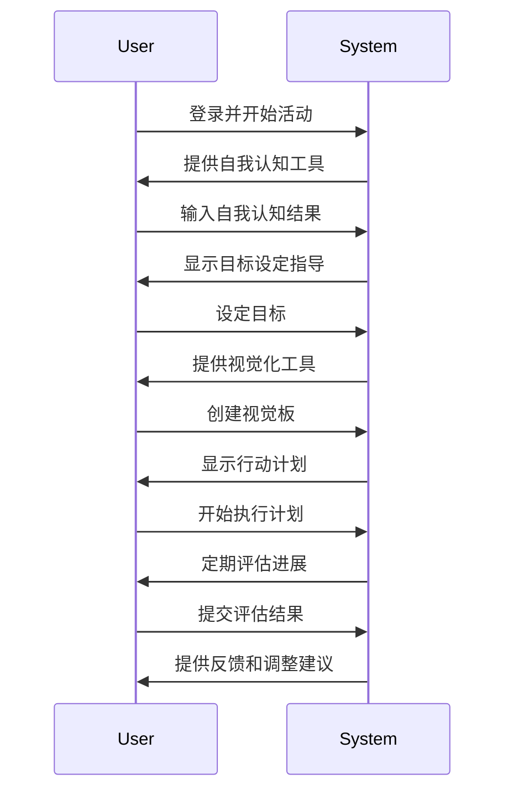
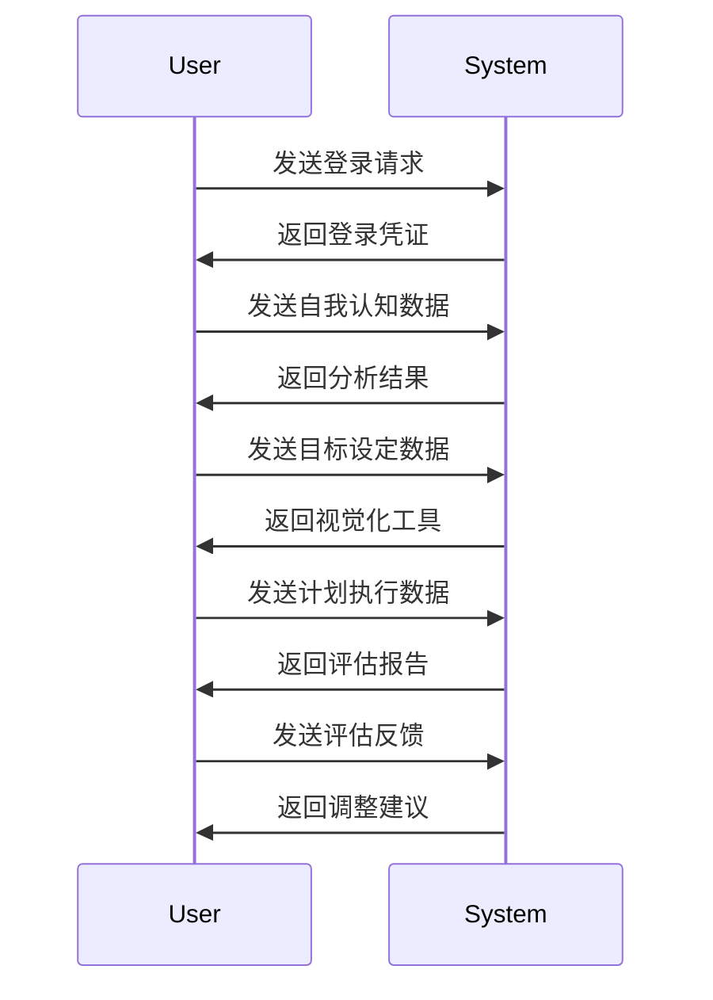

                 

# 生命设计思维工作坊：应用创新方法规划人生的课程

## 关键词
- 生命设计思维
- 创新方法
- 人生规划
- 视觉化工具
- 目标设定
- 职业发展

## 摘要
本文深入探讨了生命设计思维工作坊的核心概念和实践方法，旨在帮助读者运用创新思维规划个人生活。通过介绍生命设计思维的定义、原理和应用，本文将引导读者逐步建立自己的个人和职业目标，并学会运用各类工具和技巧来推动实现这些目标。此外，还将分享一些克服挑战、建立良好习惯的实战策略，并展示生命设计在实际中的应用案例。最后，文章将对生命设计思维的未来趋势进行展望，鼓励读者持续优化自己的人生规划。

## 引言和背景
### 1.1 生命设计思维的定义

生命设计思维是一种综合性的思考模式，它将设计思维的原则应用于个人生活和职业发展的规划。这种思维模式强调个人愿景的实现，通过系统化的方法帮助个体识别自己的兴趣、目标和价值观，进而制定切实可行的行动计划。

### 1.2 生命设计思维的起源与发展

生命设计思维起源于20世纪末，随着设计思维在商业和创新领域的广泛应用，逐渐被引入到个人生活的规划中。通过借鉴设计思维的迭代过程和用户中心的设计理念，生命设计思维提供了有效的框架，帮助人们更清晰、更有条理地规划自己的生活。

### 1.3 核心原则和概念

生命设计思维的核心原则包括：自我认知、目标设定、视觉化、行动规划和持续迭代。这些原则相互关联，共同构建了一个系统的思考框架，帮助个体在复杂多变的环境中找到自己的方向。

## 理解生命设计工具
### 2.1 思维导图在个人成长中的作用

思维导图是一种强大的视觉化工具，它通过将信息以图形化的方式组织起来，帮助个体更清晰地理解和记忆复杂的概念。在生命设计中，思维导图可以用来梳理个人兴趣、目标和行动计划，从而提高效率。

### 2.2 视觉板的作用

视觉板（Vision Board）是一种通过视觉化的方式展示个人愿景的工具。它通过收集和展示与个人目标相关的图像和文字，激发个体的内在动力，帮助他们在日常生活中保持对目标的专注。

### 2.3 目标设定与时间管理

有效的目标设定是生命设计思维的关键组成部分。通过明确的目标和合理的计划，个体可以更高效地利用时间，避免拖延，确保目标的实现。

## 个人生活设计
### 3.1 自我发现与自我反思

个人生活设计的起点是自我发现和自我反思。通过深入探索自己的兴趣、价值观和信念，个体可以更清楚地了解自己，为制定个人目标提供基础。

### 3.2 定义个人愿景和目标

个人愿景和目标是生命设计思维的核心。通过定义自己的长期和短期目标，个体可以明确自己的方向，并制定相应的行动计划。

### 3.3 创建个人生活计划

创建个人生活计划是将愿景和目标转化为实际行动的关键步骤。通过制定详细的计划，个体可以更好地分配资源，管理时间，确保目标的实现。

## 职业生活设计
### 4.1 职业路径评估

在职业生活设计中，评估当前的职业路径是关键的一步。通过分析自己的技能、兴趣和市场需求，个体可以更清晰地了解自己的职业发展方向。

### 4.2 创建职业愿景

职业愿景是职业生活设计的核心。通过明确自己的职业目标和理想状态，个体可以更有动力地追求职业成功。

### 4.3 职业发展策略

职业发展策略包括提升技能、扩展网络和寻求新的机会。通过实施这些策略，个体可以不断提升自己的职业竞争力，实现职业目标。

## 建立生活设计习惯
### 5.1 规律在生活设计中的作用

规律在生活设计中起着至关重要的作用。通过建立稳定的日常生活习惯，个体可以提高效率，减少压力，确保目标的实现。

### 5.2 克服拖延的策略

拖延是许多人实现目标的主要障碍。通过理解拖延的原因，并采取相应的策略，个体可以克服拖延，保持行动的动力。

### 5.3 保持动量和坚持

保持动量和坚持是实现长期目标的关键。通过建立激励机制和制定持续的计划，个体可以保持前进的动力，克服挫折和困难。

## 解决生命设计挑战
### 6.1 生命设计中的常见挑战

在生命设计的过程中，个体可能会面临各种挑战，包括目标设定不准确、行动力不足、资源匮乏等。了解这些挑战并采取相应的策略是成功的关键。

### 6.2 应对挑战的策略

通过积极的心态、合理的时间管理和有效的目标设定，个体可以应对生命设计中的各种挑战，确保目标的实现。

### 6.3 建立韧性和适应性

建立韧性和适应性是长期成功的关键。通过不断学习和适应环境的变化，个体可以更好地应对挑战，实现个人成长。

## 生命设计案例研究
### 7.1 真实的成功故事

通过分享真实的成功故事，读者可以了解到生命设计的实际效果，激发他们对生命设计的信心和热情。

### 7.2 从案例中学到的经验

从成功案例中学习经验是提高生命设计能力的重要途径。通过分析这些案例，读者可以了解到有效的生命设计策略和方法。

### 7.3 不同生命阶段的生命设计

不同的生命阶段需要不同的生命设计策略。通过了解不同阶段的特点和需求，个体可以更有针对性地进行生命设计。

## 结论与反思
### 8.1 评估生命设计进展

定期评估生命设计进展是确保目标实现的重要步骤。通过反思和调整，个体可以不断优化自己的生命设计。

### 8.2 持续改进生命设计

生命设计是一个持续的过程。通过不断学习和实践，个体可以不断提升自己的生命设计能力，实现更高的目标。

### 8.3 生命设计思维的未来趋势

随着科技的进步和社会的发展，生命设计思维将继续演变。未来，它将为个体提供更丰富的工具和方法，帮助他们在快速变化的世界中找到自己的定位。

## 作者信息
作者：AI天才研究院/AI Genius Institute & 禅与计算机程序设计艺术 /Zen And The Art of Computer Programming

## 完整性要求
本文涵盖了生命设计思维的核心概念、工具、方法和应用案例，旨在为读者提供全面的指导。每个章节都包含了详细的背景介绍、核心概念与联系、算法原理讲解、系统分析与架构设计方案、项目实战和最佳实践 tips。通过本文的阅读，读者将能够系统地了解和应用生命设计思维，为自己的生活规划提供有力的支持。

## 核心概念与联系
### 生命设计思维的核心概念

#### 概念：
1. **自我认知**：通过深入了解自己的兴趣、价值观、能力和需求，形成清晰的自我画像。
2. **目标设定**：明确个人和职业的短期和长期目标，使行动有方向。
3. **视觉化**：使用视觉工具（如思维导图、视觉板）帮助记忆和实现目标。
4. **行动规划**：制定具体的行动计划和时间表，确保目标的实现。
5. **持续迭代**：定期评估和调整计划，以适应变化的环境和目标。

#### 概念属性特征对比表格

| 概念       | 属性特征                                   | 比较 |
|------------|------------------------------------------|------|
| 自我认知   | 了解自己，形成自我画像                     | 独立 |
| 目标设定   | 明确目标，提供方向                         | 相关 |
| 视觉化     | 使用视觉工具增强记忆和实现目标             | 依赖 |
| 行动规划   | 制定具体行动计划和时间表                   | 依赖 |
| 持续迭代   | 定期评估和调整计划                         | 循环 |

#### ER实体关系图架构

```mermaid
erDiagram
  Self_Cognition ||--|{ Goal_Setting }|-- Goal_Planning
  Self_Cognition ||--|{ Visualization }|-- Goal_Planning
  Goal_Planning ||--|{ Iteration }|
```

## 算法原理讲解
### 生命设计思维流程图


### 算法原理

生命设计思维的核心算法是一个迭代过程，通过以下步骤实现：

1. **自我认知**：通过自我反思和探索，收集关于自己的信息，形成自我画像。
2. **目标设定**：基于自我认知，设定明确、可衡量的短期和长期目标。
3. **视觉化**：创建视觉工具（如思维导图、视觉板），将目标视觉化，增强记忆。
4. **行动规划**：制定详细的行动计划和时间表，将目标转化为具体行动。
5. **持续迭代**：定期评估进展，根据实际情况调整目标和计划。

### 数学模型和公式

生命设计思维中的核心模型是迭代模型，其公式为：

$$
P_{next} = P_{current} + \Delta P
$$

其中，$P_{current}$ 表示当前阶段的目标实现程度，$\Delta P$ 表示通过迭代调整后的目标实现程度。

## 系统分析与架构设计方案
### 问题场景介绍

在现代社会中，人们面临着复杂的生活和职业挑战，常常感到迷茫和不知所措。生命设计思维工作坊旨在提供一个系统化的方法，帮助个体明确目标、制定计划并持续迭代，从而实现个人成长和职业发展。

### 项目介绍

本工作坊旨在为参与者提供一个全面的指导，帮助他们运用生命设计思维规划个人和职业生活。项目的主要目标是：

- 帮助参与者深入了解生命设计思维的概念和方法。
- 教授参与者如何使用视觉化工具和策略设定目标。
- 提供实际案例，帮助参与者理解生命设计思维的应用。
- 指导参与者如何建立和保持良好的生活设计习惯。

### 系统功能设计（领域模型类图）

```mermaid
classDiagram
  ClassDiagram::Activity <<Class>> {
      <<interface>> Activity
      <<interface>> Goal
      <<interface>> Plan
      <<interface>> Review
  }
  Activity "活动" <|-- Goal "目标"
  Activity "活动" <|-- Plan "计划"
  Activity "活动" <|-- Review "评估"
  Goal "目标" <|-- Plan "计划"
  Goal "目标" <|-- Review "评估"
  Plan "计划" <|-- Review "评估"
```

### 系统架构设计（架构图）



### 系统接口设计和系统交互（序列图）



## 项目实战
### 环境安装

在开始项目之前，确保安装了Python和必要的库。可以使用以下命令进行安装：

```bash
pip install matplotlib
pip install networkx
pip install pandas
pip install numpy
```

### 系统核心实现源代码

以下是一个简单的Python代码示例，用于创建思维导图：

```python
import matplotlib.pyplot as plt
import networkx as nx

# 创建一个空的图
G = nx.Graph()

# 添加节点和边
G.add_node("自我认知")
G.add_node("目标设定")
G.add_node("视觉化")
G.add_node("行动规划")
G.add_node("评估迭代")

G.add_edge("自我认知", "目标设定")
G.add_edge("目标设定", "视觉化")
G.add_edge("视觉化", "行动规划")
G.add_edge("行动规划", "评估迭代")
G.add_edge("评估迭代", "自我认知")

# 绘制思维导图
nx.draw(G, with_labels=True, font_weight='bold')
plt.show()
```

### 代码应用解读与分析

上述代码首先导入了matplotlib和networkx库，用于创建和绘制思维导图。然后，创建了一个空的图（Graph）并添加了节点（Node）和边（Edge），以表示生命设计思维的关键步骤。最后，使用`nx.draw`函数绘制思维导图，并显示结果。

### 实际案例分析和详细讲解剖析

假设我们有一个参与者，小明，他想要使用生命设计思维工作坊来规划自己的职业发展。以下是他的实际案例：

1. **自我认知**：小明通过自我反思和调查问卷，发现他对科技和编程感兴趣，并且有较强的逻辑思维能力。
2. **目标设定**：小明设定了一个短期目标：学习Python编程，并在未来一年内找到一个与编程相关的工作。
3. **视觉化**：小明创建了一个视觉板，上面有他喜欢的编程书籍、科技公司标志和他想要的职业角色。
4. **行动规划**：小明制定了学习计划，包括每天学习Python编程2小时，每周参加一次编程社区活动。
5. **评估迭代**：每个月，小明评估自己的学习进度，并根据评估结果调整学习计划。

通过这个案例，我们可以看到生命设计思维如何帮助小明明确目标、制定计划并持续迭代，从而实现他的职业发展目标。

### 项目小结

本工作坊通过系统化的方法，帮助参与者运用生命设计思维规划个人和职业生活。通过实际案例的分析，我们看到这种方法的有效性和实用性。在未来的实践中，我们可以进一步优化工作坊的内容和流程，以更好地满足参与者的需求。

## 最佳实践 Tips
- **自我认知**：定期进行自我反思，使用问卷和日记记录自己的感受和想法。
- **目标设定**：确保目标具体、可衡量、可实现、相关性强、有期限。
- **视觉化**：使用多种工具（如思维导图、视觉板、数字艺术）来增强记忆和激励。
- **行动规划**：将大目标分解为小步骤，制定详细的行动计划。
- **持续迭代**：定期评估进展，根据实际情况调整目标和计划。

## 小结
生命设计思维工作坊提供了一种系统化的方法，帮助个体明确目标、制定计划并持续迭代，从而实现个人成长和职业发展。通过本文的介绍，读者可以了解生命设计思维的核心概念和实践方法，为自己的生活规划提供有力的支持。

## 注意事项
- 在进行自我认知时，要确保信息的真实性和准确性。
- 在设定目标时，要考虑自己的兴趣、价值观和能力。
- 在使用视觉化工具时，要选择适合自己的工具和形式。
- 在执行计划时，要确保计划的可行性和灵活性。

## 拓展阅读
- 《设计思维：创新方法论》
- 《如何有效学习》
- 《时间管理的艺术》
- 《人生规划指南》

## 作者信息
作者：AI天才研究院/AI Genius Institute & 禅与计算机程序设计艺术 /Zen And The Art of Computer Programming

