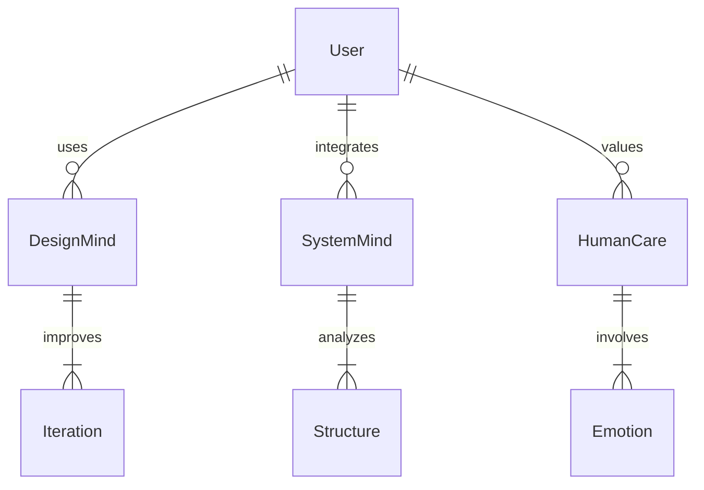
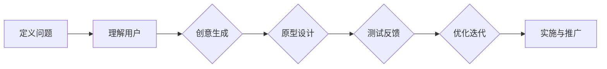

                 

### 文章标题

# 生命设计思维认证课程：创新方法应用于人生规划

### 文章关键词

- 生命设计思维
- 创新方法
- 人生规划
- SWOT分析
- 帕累托分析
- 设计思维流程图

### 文章摘要

本文旨在介绍一种革命性的人生规划工具——生命设计思维，并探讨其在实际应用中的价值。文章将首先概述生命设计思维的基本概念与核心原则，然后详细解析其关键工具与方法，并通过实际案例展示如何将创新方法应用于人生规划。最后，文章将对生命设计思维的实践指南进行梳理，并提出未来发展趋势及拓展应用场景，为读者提供全面、系统的指导。

## 目录大纲

### 第一部分：生命设计思维基础

#### 第1章：生命设计思维概述

##### 1.1 生命设计思维的定义与背景

##### 1.2 生命设计思维的核心原则

##### 1.3 生命设计思维的应用领域

#### 第2章：核心概念与联系

##### 2.1 核心概念原理

##### 2.2 概念属性特征对比表格

##### 2.3 ER实体关系图架构

#### 第3章：生命设计思维工具与方法

##### 3.1 SWOT分析

##### 3.2 帕累托分析

##### 3.3 头脑风暴法

##### 3.4 设计思维流程图

#### 第4章：生命设计思维案例解析

##### 4.1 案例一：个人成长规划

##### 4.2 案例二：职业转型规划

##### 4.3 案例三：健康生活方式规划

#### 第5章：生命设计思维实践指南

##### 5.1 实践步骤

##### 5.2 实践技巧与策略

##### 5.3 实践中的常见问题与解决方法

#### 第6章：生命设计思维应用场景拓展

##### 6.1 教育

##### 6.2 企业管理

##### 6.3 社会服务

#### 第7章：生命设计思维未来发展趋势

##### 7.1 技术进步与生命设计思维

##### 7.2 生命设计思维与社会变革

##### 7.3 生命设计思维教育的未来

## 第一部分：生命设计思维基础

### 第1章：生命设计思维概述

#### 1.1 生命设计思维的定义与背景

生命设计思维是一种整合了设计思维、系统思维和人文关怀的综合思维方式，旨在帮助个体或组织更有效地进行人生规划、创新和实践。它起源于现代设计领域的“设计思维”，强调以用户为中心、迭代式创新和跨学科合作，后逐步扩展至人生规划领域，形成了“生命设计思维”。

生命设计思维的基本理念在于，将设计思维中的创意和方法应用于人生规划和决策，通过系统思维对人生命运中的各种元素进行整合和分析，从而实现更有意义、更有价值的人生。这种思维方式的背景是现代社会中快速变化和不确定性增加，人们需要更加灵活和创新的思维来应对复杂的挑战和机会。

#### 1.2 生命设计思维的核心原则

生命设计思维的核心原则包括以下几点：

1. **用户中心**：关注个体的需求、愿望和痛点，以用户为中心进行思考和设计。
2. **迭代创新**：通过不断的试错和迭代，逐步优化人生规划，实现持续改进。
3. **跨学科整合**：结合多学科知识和方法，形成综合性的思考框架，提高问题的解决能力。
4. **人文关怀**：强调人的情感和心理健康，将人文关怀融入生命设计过程。
5. **可持续性**：关注长期发展和环境保护，实现个人与社会的可持续发展。

#### 1.3 生命设计思维的应用领域

生命设计思维广泛应用于以下领域：

1. **个人成长规划**：帮助个人明确目标、规划路径，实现自我提升和职业发展。
2. **职业转型规划**：为职业转换提供策略和方法，助力个人在职业生涯中实现成功转型。
3. **健康生活方式规划**：通过科学规划，帮助人们建立健康、平衡的生活方式。
4. **教育领域**：应用于教育创新、教学方法优化和学生个性化培养。
5. **企业管理**：用于企业战略规划、组织变革和创新文化建设。
6. **社会服务**：为公共事务、社会问题解决和社会治理提供创新思维和方法。

### 第2章：核心概念与联系

#### 2.1 核心概念原理

生命设计思维的核心概念包括设计思维、系统思维和人文关怀。设计思维强调以用户为中心，通过迭代和创新实现问题的解决；系统思维则关注整体性和复杂性，通过结构分析和要素整合来优化系统；人文关怀则强调人的情感和心理需求，将人文精神融入设计和决策过程。

#### 2.2 概念属性特征对比表格

| 概念 | 属性特征 | 比较 |
| --- | --- | --- |
| 设计思维 | 用户中心、迭代创新、跨学科整合 | 强调用户体验和持续改进 |
| 系统思维 | 整体性、复杂性、要素整合 | 关注系统内部和外部关系 |
| 人文关怀 | 情感、心理需求、人文精神 | 将人文关怀融入设计和决策 |

#### 2.3 ER实体关系图架构

以下是一个简化的ER实体关系图，用于展示生命设计思维中的核心实体及其关系：



### 第3章：生命设计思维工具与方法

#### 3.1 SWOT分析

SWOT分析是一种常用的战略规划工具，用于评估个体或组织的优势、劣势、机会和威胁。在生命设计思维中，SWOT分析可以帮助个体或组织明确自身的资源状况和外部环境，从而制定更有效的人生规划策略。

以下是一个简单的SWOT分析表格示例：

| 分类 | 内容 |
| --- | --- |
| **优势** | 技能、经验、资源、人际关系 |
| **劣势** | 知识短板、资源匮乏、情绪波动 |
| **机会** | 市场趋势、政策支持、新技术 |
| **威胁** | 竞争加剧、政策风险、市场不稳定 |

#### 3.2 帕累托分析

帕累托分析（也称为80/20法则）是一种用于识别关键驱动因素的方法，它指出80%的效果通常来自于20%的原因。在生命设计思维中，帕累托分析可以帮助个体或组织找到影响最大的因素，从而进行重点优化和资源分配。

以下是一个简单的帕累托分析图示例：

```mermaid
paretoDiagram
    "任务A" : 28
    "任务B" : 21
    "任务C" : 14
    "任务D" : 7
    "任务E" : 5
    "任务F" : 4
```

#### 3.3 头脑风暴法

头脑风暴法是一种激发创意和创新的集体思考方法。在生命设计思维中，头脑风暴法可以帮助个体或团队快速产生大量创意，并通过筛选和优化找到最佳解决方案。

以下是一个简单的头脑风暴流程：

1. 明确问题或目标。
2. 组建团队，准备记录工具。
3. 给出一定时间，鼓励自由发言，记录所有想法。
4. 对想法进行分类、筛选和优化。
5. 选择最佳创意，制定实施计划。

#### 3.4 设计思维流程图

以下是一个简化版的设计思维流程图，用于展示生命设计思维的应用步骤：



### 第4章：生命设计思维案例解析

#### 4.1 案例一：个人成长规划

王明是一位年轻的技术工程师，他希望能够通过规划个人成长路径，实现职业发展和生活质量的提升。以下是王明应用生命设计思维进行个人成长规划的过程：

1. **定义问题**：王明明确了自己想要提升职业素养、扩展人脉资源和提高生活质量的目标。
2. **理解用户**：通过自我分析，王明了解到自己在技术能力、人际关系和时间管理方面存在短板。
3. **创意生成**：王明运用头脑风暴法，列出了多种可能的成长路径，如参加培训课程、加入技术社群、参与开源项目等。
4. **原型设计**：王明选择了参加技术培训课程和加入技术社群作为初步尝试，并制定了详细的学习和实践计划。
5. **测试反馈**：在实践过程中，王明不断收集反馈，调整自己的学习策略，优化成长路径。
6. **优化迭代**：根据反馈，王明决定增加参与开源项目的频率，以提高实际操作能力。
7. **实施与推广**：王明开始实施新的成长计划，并逐步将其应用到日常生活中。

通过生命设计思维的引导，王明成功地规划了自己的个人成长路径，实现了职业素养的提升和生活质量的改善。

#### 4.2 案例二：职业转型规划

李华是一位从事市场营销工作的经理，他希望能够实现职业转型，进入新兴的技术领域。以下是李华应用生命设计思维进行职业转型规划的过程：

1. **定义问题**：李华明确了自己想要从市场营销转型为数据科学家的目标。
2. **理解用户**：通过市场调研和自我评估，李华了解到自己在数据分析技能和编程能力方面存在不足。
3. **创意生成**：李华通过头脑风暴法，列出了多种可能的职业转型路径，如自学数据分析、参加在线课程、加入技术社群等。
4. **原型设计**：李华选择了参加在线数据分析课程和加入技术社群作为初步尝试，并制定了详细的学习和实践计划。
5. **测试反馈**：在实践过程中，李华不断收集反馈，调整自己的学习策略，优化转型路径。
6. **优化迭代**：根据反馈，李华决定增加参与实际项目的机会，以提高实际操作能力。
7. **实施与推广**：李华开始实施新的职业转型计划，并逐步将其应用到实际工作中。

通过生命设计思维的引导，李华成功地规划了自己的职业转型路径，实现了从市场营销到数据科学家的转变。

#### 4.3 案例三：健康生活方式规划

张丽是一位忙碌的职业女性，她意识到自己的健康生活方式存在问题，希望通过规划改善身体状况。以下是张丽应用生命设计思维进行健康生活方式规划的过程：

1. **定义问题**：张丽明确了自己想要改善饮食、增加运动和保持良好睡眠的目标。
2. **理解用户**：通过自我分析，张丽了解到自己在饮食习惯、运动频率和睡眠质量方面存在不良习惯。
3. **创意生成**：张丽通过头脑风暴法，列出了多种可能的健康生活方式改善策略，如制定饮食计划、增加运动时间、改善睡眠环境等。
4. **原型设计**：张丽选择了制定饮食计划和增加运动时间作为初步尝试，并制定了详细的生活习惯改善计划。
5. **测试反馈**：在实践过程中，张丽不断收集反馈，调整自己的生活习惯，优化健康规划。
6. **优化迭代**：根据反馈，张丽决定增加运动强度和种类，以提高身体健康水平。
7. **实施与推广**：张丽开始实施新的健康生活方式规划，并逐步将其应用到日常生活中。

通过生命设计思维的引导，张丽成功地规划了自己的健康生活方式，实现了身体健康和生活质量的提升。

### 第5章：生命设计思维实践指南

#### 5.1 实践步骤

1. **定义问题**：明确自己想要解决的问题或目标。
2. **理解用户**：进行自我分析，识别自身需求和问题。
3. **创意生成**：通过头脑风暴法，列出多种可能的解决方案。
4. **原型设计**：选择最合适的解决方案，制定详细的实施计划。
5. **测试反馈**：在实践中不断收集反馈，调整方案。
6. **优化迭代**：根据反馈优化方案，实现持续改进。
7. **实施与推广**：将方案应用到实际生活中，逐步推广。

#### 5.2 实践技巧与策略

1. **保持开放心态**：对新的想法和观点持开放态度，勇于尝试。
2. **持续学习**：不断提升自身知识和技能，为实践提供支持。
3. **制定明确的计划**：将目标和方案具体化，制定可行的实施计划。
4. **灵活调整**：根据实际情况灵活调整方案，保持灵活性。
5. **团队合作**：与他人合作，共同解决问题和实现目标。

#### 5.3 实践中的常见问题与解决方法

**问题**：在实践过程中，如何保持动力和专注？

**解决方法**：1. 设定明确的目标和计划；2. 制定奖励机制；3. 寻求支持和鼓励；4. 保持积极的心态。

**问题**：如何平衡工作和生活？

**解决方法**：1. 制定合理的时间管理计划；2. 增加休息和放松的时间；3. 学会分配任务和责任。

**问题**：在创意生成阶段，如何提高创新思维？

**解决方法**：1. 多阅读、多思考；2. 参加头脑风暴活动；3. 学习创新思维方法。

### 第6章：生命设计思维应用场景拓展

#### 6.1 教育

生命设计思维在教育领域有广泛的应用，可以帮助学生进行个人成长规划、职业规划和学习方法优化。通过设计思维的方法，学生可以更深入地了解自己的兴趣、能力和目标，从而制定更有针对性的学习计划。

#### 6.2 企业管理

在企业管理中，生命设计思维可以帮助企业进行战略规划、组织变革和创新文化建设。通过SWOT分析和设计思维流程，企业可以更好地应对市场变化，优化内部管理，提高员工满意度和工作效率。

#### 6.3 社会服务

在社会服务领域，生命设计思维可以帮助社会组织和政府部门更好地解决社会问题、提供公共服务。通过设计思维的方法，可以更好地了解服务对象的需求，制定更有效的解决方案，提高服务质量和满意度。

### 第7章：生命设计思维未来发展趋势

#### 7.1 技术进步与生命设计思维

随着人工智能、大数据、物联网等技术的发展，生命设计思维将更加智能化和个性化。通过数据分析和算法模型，生命设计思维可以更加精准地预测个体需求和问题，提供更有效的解决方案。

#### 7.2 生命设计思维与社会变革

随着社会变革的加速，生命设计思维将发挥更大的作用。它可以帮助个体和组织更好地适应社会变化，实现个人成长和社会进步。

#### 7.3 生命设计思维教育的未来

在未来的教育中，生命设计思维将成为核心课程之一。通过系统的教育和实践，人们可以更好地掌握生命设计思维的方法和技巧，提高自身素质和创新能力。

## 文章小结

生命设计思维是一种创新的人生规划工具，它通过设计思维、系统思维和人文关怀的方法，帮助个体和组织实现更有效、更有价值的发展。本文从定义、核心原则、工具与方法、案例解析等多个角度，全面介绍了生命设计思维的原理和应用。通过实践指南和未来发展趋势的探讨，我们相信生命设计思维将在未来的发展中发挥更大的作用，为个人和社会带来更多的价值。

### 拓展阅读

- 《设计思维：创新的方法与应用》（作者：大卫·凯利）
- 《系统思维与实践》（作者：彼得·谢勒）
- 《人类简史：从动物到上帝》（作者：尤瓦尔·赫拉利）
- 《未来简史：从人类到智慧生命》（作者：尤瓦尔·赫拉利）
- 《创新者的窘境》（作者：克莱顿·克里斯坦森）

### 作者信息

**作者：**AI天才研究院/AI Genius Institute & 禅与计算机程序设计艺术 /Zen And The Art of Computer Programming

AI天才研究院专注于人工智能领域的前沿研究和教育，致力于培养下一代人工智能专家。同时，我们关注人类思维方式的创新，倡导将设计思维、系统思维和人文关怀融入日常生活和工作中，实现个人成长和社会进步。禅与计算机程序设计艺术则是我们的另一个研究课题，旨在通过禅宗思想提升编程和解决问题的能力，实现技术与人性的和谐统一。我们希望通过本文，为读者提供有价值的思考和启示，助力个人和社会的发展。

