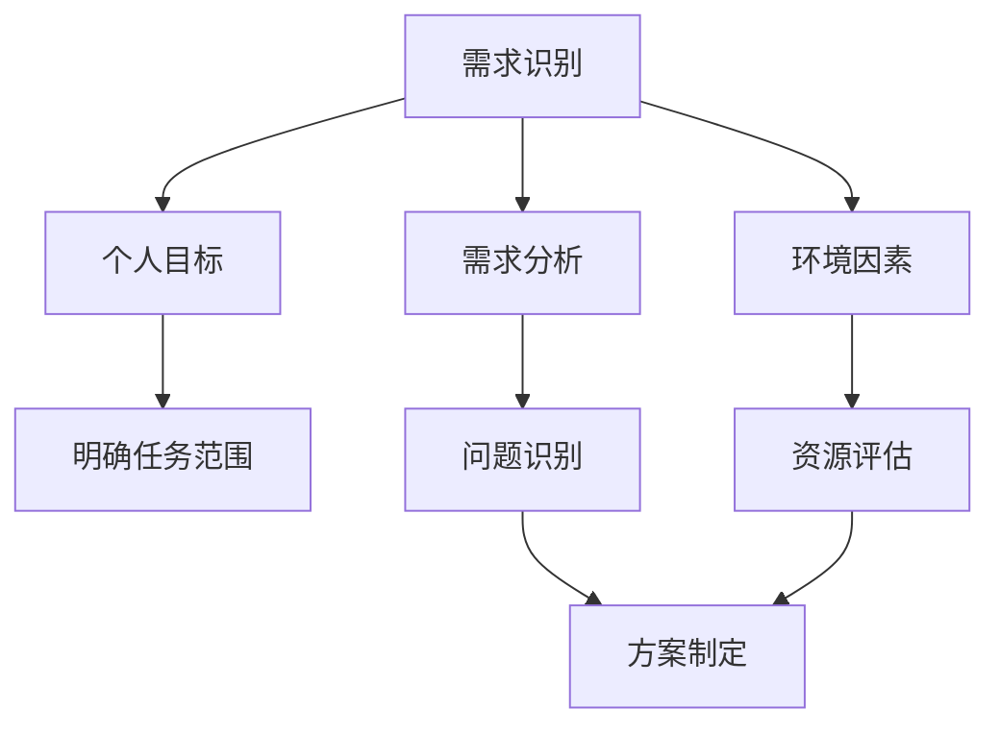
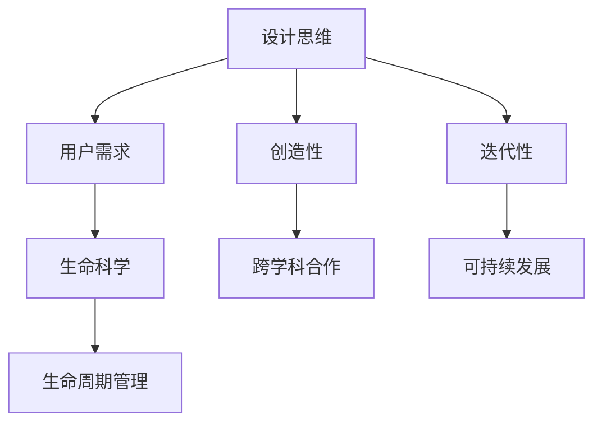
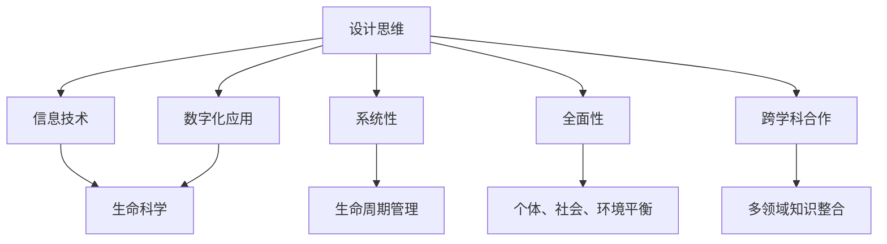
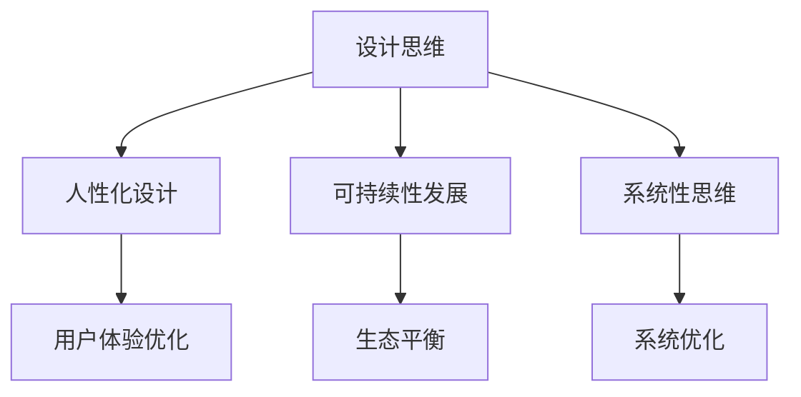
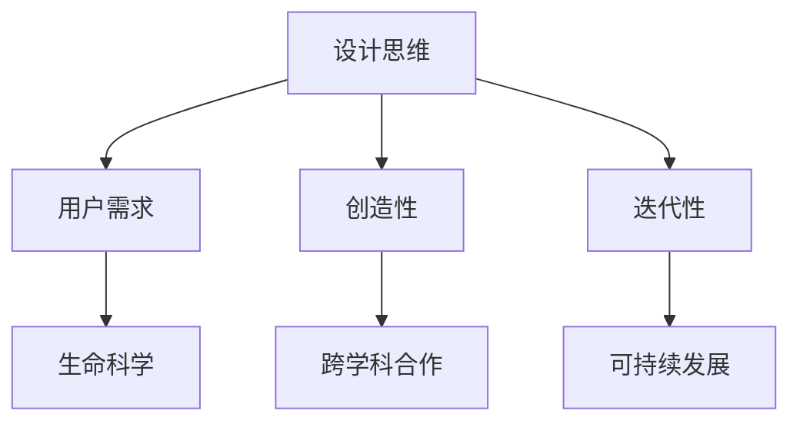
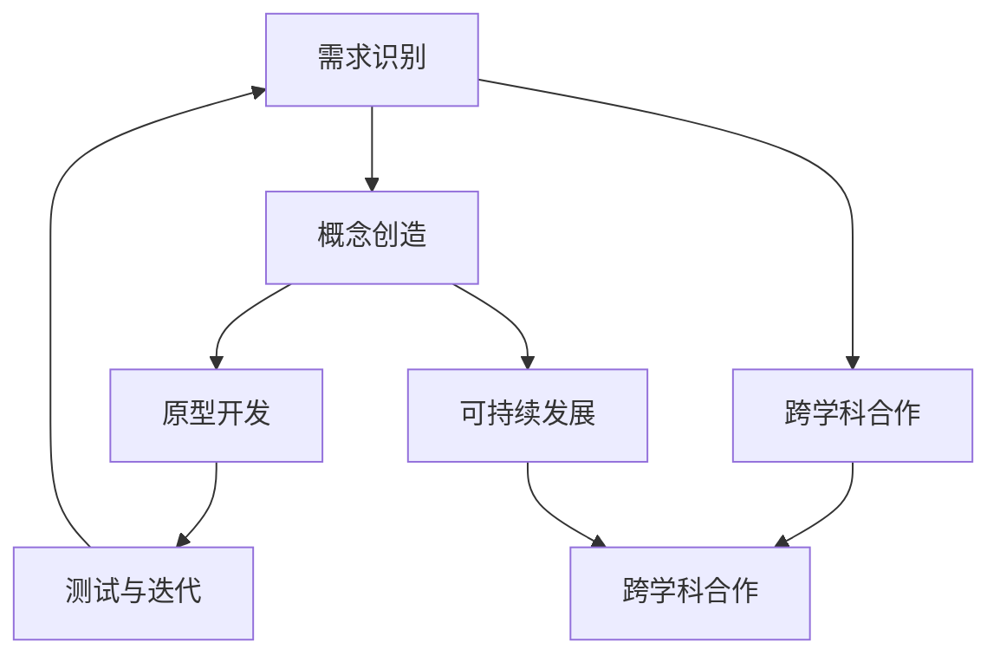
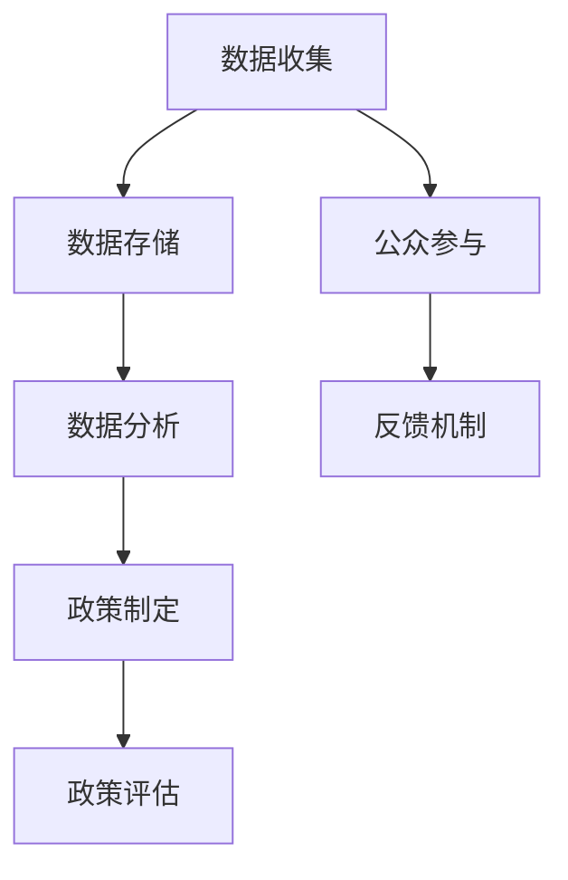
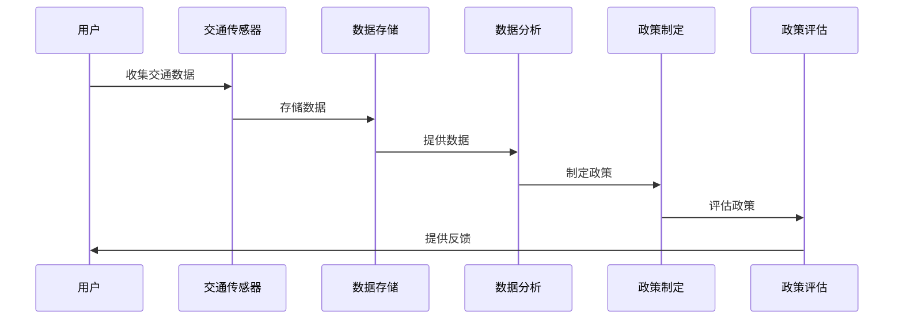

                 


### 1.1.2 生命设计思维的定义与重要性

**核心概念术语说明**：

生命设计思维（Life Design Thinking）是一种创新方法论，它结合了设计思维（Design Thinking）和生命科学（Life Sciences）的概念，旨在通过系统化、创造性和迭代性的方法来规划、管理和优化个人和组织的生命过程。这种思维模式强调跨学科合作、可持续发展和人性化设计，以实现生活质量和效率的提升。

**问题背景**：

在现代社会，人们面临着前所未有的复杂性和多样性，从个人职业规划到家庭生活管理，再到社会问题的解决，都需要高效且创新的方法。传统的线性思维模式和固定的流程往往无法满足这种需求，因此，一种更加灵活、开放和创造性的思维模式——生命设计思维，应运而生。

**问题描述**：

随着科技的进步和社会的发展，个体和组织面临的挑战日益增多，如何有效应对这些问题成为关键。生命设计思维提供了一种解决这些问题的途径，它不仅能够帮助个人实现自我价值的最大化，还能促进组织和社会的可持续发展。

**问题解决**：

通过生命设计思维，人们可以更好地理解自己的需求和目标，识别并解决问题，从而创造出更加满意和有意义的生活。具体来说，生命设计思维包括以下几个关键步骤：

1. **需求识别**：了解个人的需求和目标，明确设计任务的性质和范围。
2. **概念创造**：通过头脑风暴和创造性思维，生成多种可能的解决方案。
3. **原型开发**：将概念转化为可执行的模型，并进行测试和迭代。
4. **测试与迭代**：通过反馈和评估，不断改进原型，直到满足设计要求。

**边界与外延**：

生命设计思维的边界在于它适用于任何需要创新和优化的领域，包括但不限于个人生活、职业发展、社会问题和公共政策。同时，它也关注于整个生命周期的管理，从出生到死亡，涵盖了人类生命的所有阶段。

**概念结构与核心要素组成**：

- **需求识别**：核心要素包括个人目标、需求分析、环境因素等。
- **概念创造**：核心要素包括创造性思维、头脑风暴、多元思维等。
- **原型开发**：核心要素包括原型设计、迭代开发、测试反馈等。
- **测试与迭代**：核心要素包括用户测试、反馈收集、改进方案等。

**本章小结**：

本章介绍了生命设计思维的定义、背景、重要性以及其解决问题的基本流程。通过理解生命设计思维的核心概念和关键步骤，读者可以为后续章节的学习和实际应用打下坚实的基础。

```markdown
## 1.1.2 生命设计思维的定义与重要性

**核心概念术语说明**：

生命设计思维（Life Design Thinking）是一种创新方法论，它结合了设计思维（Design Thinking）和生命科学（Life Sciences）的概念，旨在通过系统化、创造性和迭代性的方法来规划、管理和优化个人和组织的生命过程。这种思维模式强调跨学科合作、可持续发展和人性化设计，以实现生活质量和效率的提升。

**问题背景**：

在现代社会，人们面临着前所未有的复杂性和多样性，从个人职业规划到家庭生活管理，再到社会问题的解决，都需要高效且创新的方法。传统的线性思维模式和固定的流程往往无法满足这种需求，因此，一种更加灵活、开放和创造性的思维模式——生命设计思维，应运而生。

**问题描述**：

随着科技的进步和社会的发展，个体和组织面临的挑战日益增多，如何有效应对这些问题成为关键。生命设计思维提供了一种解决这些问题的途径，它不仅能够帮助个人实现自我价值的最大化，还能促进组织和社会的可持续发展。

**问题解决**：

通过生命设计思维，人们可以更好地理解自己的需求和目标，识别并解决问题，从而创造出更加满意和有意义的生活。具体来说，生命设计思维包括以下几个关键步骤：

1. **需求识别**：了解个人的需求和目标，明确设计任务的性质和范围。
2. **概念创造**：通过头脑风暴和创造性思维，生成多种可能的解决方案。
3. **原型开发**：将概念转化为可执行的模型，并进行测试和迭代。
4. **测试与迭代**：通过反馈和评估，不断改进原型，直到满足设计要求。

**边界与外延**：

生命设计思维的边界在于它适用于任何需要创新和优化的领域，包括但不限于个人生活、职业发展、社会问题和公共政策。同时，它也关注于整个生命周期的管理，从出生到死亡，涵盖了人类生命的所有阶段。

**概念结构与核心要素组成**：

- **需求识别**：核心要素包括个人目标、需求分析、环境因素等。
- **概念创造**：核心要素包括创造性思维、头脑风暴、多元思维等。
- **原型开发**：核心要素包括原型设计、迭代开发、测试反馈等。
- **测试与迭代**：核心要素包括用户测试、反馈收集、改进方案等。

**本章小结**：

本章介绍了生命设计思维的定义、背景、重要性以及其解决问题的基本流程。通过理解生命设计思维的核心概念和关键步骤，读者可以为后续章节的学习和实际应用打下坚实的基础。

```markdown




### 1.2 生命设计思维的历史与发展

#### 1.2.1 早期探索

生命设计思维的概念可以追溯到20世纪中叶，当时设计思维作为创新方法论逐渐受到关注。先驱者如设计学之父Raymond Loewy和IDEO创始人David Kelley等人，通过设计实践和理论研究，为生命设计思维奠定了基础。

**核心概念原理**：

早期设计思维强调以用户为中心，通过深入理解用户需求，创造出满足用户期望的设计。这一理念逐渐演变，融入了生命科学的元素，形成了生命设计思维。

**概念属性特征对比表格**：

| 特征           | 设计思维                        | 生命设计思维                      |
|----------------|---------------------------------|-----------------------------------|
| 用户中心       | 强调用户需求                    | 用户需求结合生命科学原则          |
| 创造性         | 头脑风暴、创意生成              | 创造性结合生命科学方法论          |
| 迭代性         | 持续迭代优化设计                | 迭代结合生命周期管理              |
| 跨学科合作     | 跨学科融合                     | 跨学科融合，注重可持续性          |

**ER实体关系图架构**：



#### 1.2.2 生命设计思维的关键发展阶段

**20世纪末到21世纪初**：

这一阶段，随着信息技术的飞速发展，生命设计思维得到了进一步的发展。数字化的趋势促使人们开始将设计思维应用于生命科学领域，通过计算机模拟和数据分析，实现更高效的生命过程管理。

**21世纪10年代**：

生命设计思维逐渐成熟，成为了跨学科创新的重要工具。在这一时期，生命设计思维的框架和方法得到广泛传播和应用，其影响力扩展到了商业、教育、医疗等多个领域。

**核心概念原理**：

生命设计思维在这一阶段强调了系统性和全面性，不仅关注个体的生命质量，也关注社会和环境的影响。通过跨学科合作，整合多领域知识，形成了更加全面和系统的生命设计思维体系。

**概念属性特征对比表格**：

| 特征             | 设计思维（20世纪末到21世纪初）| 生命设计思维（21世纪10年代）        |
|------------------|---------------------------------|-------------------------------------|
| 数字化应用       | 信息技术的结合                  | 数字化与生命科学的深度融合          |
| 系统性           | 关注设计流程                   | 考虑整个生命周期的管理              |
| 全面性           | 关注用户需求                   | 关注个体、社会、环境三者的平衡      |
| 跨学科合作       | 初步尝试                       | 成熟应用，多领域知识整合            |

**ER实体关系图架构**：



#### 1.2.3 当前的发展状况

**21世纪20年代至今**：

生命设计思维已经成为了创新领域的重要方法论之一。随着人工智能、大数据和生物技术的发展，生命设计思维的应用场景更加广泛，其影响力也在不断扩大。

**核心概念原理**：

当前，生命设计思维不仅应用于个人生活，还广泛应用于企业战略规划、城市设计、健康管理等各个领域。其核心概念包括人性化设计、可持续发展和系统性思维。

**概念属性特征对比表格**：

| 特征             | 设计思维                        | 生命设计思维（当前发展）           |
|------------------|---------------------------------|------------------------------------|
| 人性化设计       | 强调用户体验                    | 关注人性化设计，更全面地满足用户需求 |
| 可持续性发展     | 考虑环境影响                   | 强调可持续性，促进生态平衡          |
| 系统性思维       | 关注设计流程                   | 考虑整个系统，追求系统性优化        |

**ER实体关系图架构**：



**本章小结**：

本章回顾了生命设计思维的历史与发展，从早期探索到关键发展阶段，再到当前的发展状况。通过分析不同阶段的核心概念和特征，读者可以更好地理解生命设计思维的发展脉络及其在现代社会中的重要性。

```markdown
## 1.2 生命设计思维的历史与发展

#### 1.2.1 早期探索

生命设计思维的概念可以追溯到20世纪中叶，当时设计思维作为创新方法论逐渐受到关注。先驱者如设计学之父Raymond Loewy和IDEO创始人David Kelley等人，通过设计实践和理论研究，为生命设计思维奠定了基础。

**核心概念原理**：

早期设计思维强调以用户为中心，通过深入理解用户需求，创造出满足用户期望的设计。这一理念逐渐演变，融入了生命科学的元素，形成了生命设计思维。

**概念属性特征对比表格**：

| 特征           | 设计思维                        | 生命设计思维                      |
|----------------|---------------------------------|-----------------------------------|
| 用户中心       | 强调用户需求                    | 用户需求结合生命科学原则          |
| 创造性         | 头脑风暴、创意生成              | 创造性结合生命科学方法论          |
| 迭代性         | 持续迭代优化设计                | 迭代结合生命周期管理              |
| 跨学科合作     | 跨学科融合                     | 跨学科融合，注重可持续性          |

**ER实体关系图架构**：



#### 1.2.2 生命设计思维的关键发展阶段

**20世纪末到21世纪初**：

这一阶段，随着信息技术的飞速发展，生命设计思维得到了进一步的发展。数字化的趋势促使人们开始将设计思维应用于生命科学领域，通过计算机模拟和数据分析，实现更高效的生命过程管理。

**核心概念原理**：

生命设计思维在这一阶段强调了系统性和全面性，不仅关注个体的生命质量，也关注社会和环境的影响。通过跨学科合作，整合多领域知识，形成了更加全面和系统的生命设计思维体系。

**概念属性特征对比表格**：

| 特征             | 设计思维（20世纪末到21世纪初）| 生命设计思维（21世纪10年代）        |
|------------------|---------------------------------|-------------------------------------|
| 数字化应用       | 信息技术的结合                  | 数字化与生命科学的深度融合          |
| 系统性           | 关注设计流程                   | 考虑整个生命周期的管理              |
| 全面性           | 关注用户需求                   | 关注个体、社会、环境三者的平衡      |
| 跨学科合作       | 初步尝试                       | 成熟应用，多领域知识整合            |

**ER实体关系图架构**：


#### 1.2.3 当前的发展状况

**21世纪20年代至今**：

生命设计思维已经成为了创新领域的重要方法论之一。随着人工智能、大数据和生物技术的发展，生命设计思维的应用场景更加广泛，其影响力也在不断扩大。

**核心概念原理**：

当前，生命设计思维不仅应用于个人生活，还广泛应用于企业战略规划、城市设计、健康管理等各个领域。其核心概念包括人性化设计、可持续发展和系统性思维。

**概念属性特征对比表格**：

| 特征             | 设计思维                        | 生命设计思维（当前发展）           |
|------------------|---------------------------------|------------------------------------|
| 人性化设计       | 强调用户体验                    | 关注人性化设计，更全面地满足用户需求 |
| 可持续性发展     | 考虑环境影响                   | 强调可持续性，促进生态平衡          |
| 系统性思维       | 关注设计流程                   | 考虑整个系统，追求系统性优化        |

**ER实体关系图架构**：


**本章小结**：

本章回顾了生命设计思维的历史与发展，从早期探索到关键发展阶段，再到当前的发展状况。通过分析不同阶段的核心概念和特征，读者可以更好地理解生命设计思维的发展脉络及其在现代社会中的重要性。

```markdown
## 1.3 本书结构安排与内容概述

### 1.3.1 全书结构安排

本书共分为四大部分，分别是引言、生命设计思维的基本原理、生命设计思维的实际应用以及生命设计思维的扩展与未来。通过这四个部分的详细探讨，本书旨在全面阐述生命设计思维的概念、方法、应用及其发展趋势。

#### 引言

引言部分主要包括以下几个章节：
- 1.1 问题的背景和意义
- 1.2 生命设计思维的历史与发展
- 1.3 本书结构安排与内容概述
- 1.4 生命设计思维的核心概念与联系

这一部分将为读者提供一个关于生命设计思维的整体认识，理解其背景、发展历程以及核心概念。

#### 生命设计思维的基本原理

第二部分介绍了生命设计思维的基本原理，具体包括：
- 2.1 生命设计思维的基本流程
- 2.2 生命设计思维的关键概念
- 2.3 生命设计思维的应用策略
- 2.4 生命设计思维的挑战与解决方案

这部分内容将深入探讨生命设计思维的具体流程、关键概念以及应用策略，帮助读者理解和掌握这一思维方法。

#### 生命设计思维的实际应用

第三部分将讨论生命设计思维的实际应用，分为个人层面、职业生涯规划、社区与社群建设以及公共政策制定四个方面，具体章节包括：
- 3.1 个人层面的生命设计思维实践
- 3.2 职业生涯规划中的生命设计思维
- 3.3 社区和社群建设中的应用
- 3.4 公共政策制定中的生命设计思维

这部分内容将通过具体案例，展示生命设计思维在不同领域的应用效果。

#### 生命设计思维的扩展与未来

第四部分展望了生命设计思维的扩展与未来，包括跨学科融合、未来发展趋势以及全球视野，具体章节包括：
- 4.1 生命设计思维的跨学科融合
- 4.2 生命设计思维的未来发展趋势
- 4.3 生命设计思维的全球视野

这部分内容将帮助读者了解生命设计思维的发展方向和潜在影响。

### 1.3.2 各章节内容概述

以下是各章节的具体内容概述：

**1.1 问题的背景和意义**：
本章介绍了生命设计思维的背景、重要性和核心概念，为后续内容的学习打下基础。

**1.2 生命设计思维的历史与发展**：
本章回顾了生命设计思维的历史，从早期探索到关键发展阶段，再到当前的发展状况，展示了这一思维方法的发展脉络。

**1.3 本书结构安排与内容概述**：
本章概述了本书的结构安排和各部分内容，帮助读者对整本书的框架和内容有一个全面的了解。

**1.4 生命设计思维的核心概念与联系**：
本章详细介绍了生命设计思维的核心概念，并通过对比表格和实体关系图，展示了这些概念之间的联系。

**2.1 生命设计思维的基本流程**：
本章阐述了生命设计思维的基本流程，包括需求识别、概念创造、原型开发和测试与迭代。

**2.2 生命设计思维的关键概念**：
本章探讨了生命设计思维的关键概念，如问题定义、创新思维、跨学科合作和可持续发展。

**2.3 生命设计思维的应用策略**：
本章介绍了生命设计思维在不同领域的应用策略，包括个人生活规划、职业发展、社区与社群建设以及公共政策制定。

**2.4 生命设计思维的挑战与解决方案**：
本章分析了生命设计思维面临的挑战，并提出了相应的解决方案。

**3.1 个人层面的生命设计思维实践**：
本章通过案例，展示了个人层面生命设计思维的实践和应用。

**3.2 职业生涯规划中的生命设计思维**：
本章探讨了生命设计思维在职业生涯规划中的应用，帮助读者规划自己的职业发展。

**3.3 社区和社群建设中的应用**：
本章介绍了生命设计思维在社区与社群建设中的应用，探讨了如何通过这一思维方法构建和谐、高效的社区。

**3.4 公共政策制定中的生命设计思维**：
本章分析了生命设计思维在公共政策制定中的作用，展示了如何利用这一思维方法制定更加科学和有效的政策。

**4.1 生命设计思维的跨学科融合**：
本章探讨了生命设计思维与其他学科的融合，展示了跨学科合作的重要性。

**4.2 生命设计思维的未来发展趋势**：
本章展望了生命设计思维的未来发展趋势，探讨了新技术对这一思维方法的影响。

**4.3 生命设计思维的全球视野**：
本章从全球视角出发，分析了生命设计思维在不同国家和地区的应用情况。

**本章小结**：
本章对全书结构安排和内容进行了概述，帮助读者更好地理解本书的框架和内容，为后续学习打下基础。

```markdown
## 1.4 生命设计思维的核心概念与联系

生命设计思维作为一种综合性创新方法论，其成功应用依赖于对核心概念的深入理解和灵活运用。以下是生命设计思维中的核心概念及其相互之间的联系。

### 核心概念介绍

1. **需求识别**：这是生命设计思维的基础。需求识别不仅仅是关于个人或组织的当前需求，更涉及对未来需求的预测。这一步骤要求设计者进行广泛的市场调研、用户访谈和数据分析，以全面理解问题和需求。

2. **概念创造**：在明确需求后，设计者需要通过头脑风暴、思维导图等工具，产生多种可能的解决方案。这一步骤强调创造性思维，旨在突破传统思维的束缚，寻求创新性的解决方案。

3. **原型开发**：概念创造完成后，需要将这些想法转化为可执行的原型。原型开发可以是物理模型、数字模型或模拟模型，目的是验证概念的实际可行性和用户体验。

4. **测试与迭代**：原型开发完成后，设计者需要进行用户测试，收集反馈，并根据反馈进行迭代优化。这一步骤的关键在于快速反馈和持续改进，确保最终解决方案能够满足用户需求。

5. **跨学科合作**：生命设计思维强调跨学科合作，整合不同领域的知识和技能，以实现更加全面和创新的解决方案。跨学科合作不仅促进了知识的交流，也提高了问题解决的效率和质量。

6. **可持续发展**：可持续发展是生命设计思维的重要原则之一。设计者需要考虑环境、社会和经济因素，确保解决方案的长期可持续性。

### 概念属性特征对比表格

以下是对上述核心概念的属性特征进行对比的表格：

| 概念       | 属性特征                         | 举例                           |
|------------|----------------------------------|--------------------------------|
| 需求识别   | - 广泛性<br>- 预测性<br>- 数据驱动 | 进行市场调研，了解用户需求      |
| 概念创造   | - 创造性<br>- 多元化<br>- 开放性 | 头脑风暴，生成多种解决方案     |
| 原型开发   | - 可行性<br>- 可用性<br>- 可测试性 | 制作物理或数字原型，进行测试   |
| 测试与迭代 | - 反馈驱动<br>- 持续改进<br>- 快速迭代 | 用户测试，收集反馈，改进方案   |
| 跨学科合作 | - 知识整合<br>- 技能互补<br>- 交流高效 | 结合不同学科专家的意见和建议   |
| 可持续发展 | - 环境友好<br>- 社会责任<br>- 经济可行 | 考虑到未来几代人的需求          |

### ER实体关系图

为了更好地展示这些核心概念之间的联系，我们可以使用Mermaid绘制一个实体关系图：



### 本章小结

本章详细介绍了生命设计思维的核心概念，并通过对比表格和实体关系图展示了这些概念之间的联系。通过理解这些核心概念，读者可以更好地掌握生命设计思维的方法和应用。

```markdown
## 2.1 生命设计思维的基本流程

生命设计思维是一种系统化、迭代性和创造性的方法论，其核心在于通过一系列明确的步骤来引导创新过程，从而实现个人或组织的目标。以下是生命设计思维的基本流程，每个步骤都包含关键要素和方法。

### 需求识别

**步骤概述**：需求识别是生命设计思维的起点，旨在明确问题和目标，以及理解背后的需求。

**关键要素**：
- **用户访谈**：通过与目标用户进行深入交流，了解他们的真实需求和痛点。
- **市场调研**：收集行业数据、趋势和竞争对手的信息，以更好地理解市场环境。
- **数据分析**：利用数据分析工具，对收集到的数据进行处理，找出关键问题和潜在需求。

**方法**：
- **用户故事地图**：通过绘制用户故事地图，将用户的需求和行为路径可视化。
- **Kano模型**：分析用户需求的优先级，区分基本需求、满意需求和惊喜需求。

### 概念创造

**步骤概述**：在明确需求后，概念创造阶段旨在通过多种方法生成创意和方案。

**关键要素**：
- **头脑风暴**：集体头脑风暴，鼓励自由表达和创意碰撞。
- **思维导图**：将创意和思路组织成结构化的思维导图，便于后续分析和讨论。

**方法**：
- **SCAMPER方法**：通过改变、结合、调整、删除、替换、提取和重新设想来激发创意。
- **创意集市**：将创意方案展示给团队，通过投票或讨论筛选出最有潜力的方案。

### 原型开发

**步骤概述**：原型开发是将创意转化为可执行模型的过程，旨在验证方案的可行性和用户体验。

**关键要素**：
- **快速原型**：使用简单的工具和技术，快速构建原型，以便于迭代和改进。
- **用户测试**：将原型展示给用户，收集反馈，以便进行优化。

**方法**：
- **低保真原型**：使用纸笔原型、线框图等方式，快速构建初步原型。
- **高保真原型**：使用交互设计工具，如Figma或Sketch，构建更接近最终产品的原型。

### 测试与迭代

**步骤概述**：测试与迭代是对原型进行评估和改进的过程，以确保最终产品能够满足用户需求。

**关键要素**：
- **用户反馈**：通过用户测试和反馈，识别原型中的问题和改进点。
- **迭代优化**：根据反馈，对原型进行迭代改进，不断提高其质量和用户体验。

**方法**：
- **A/B测试**：对两个或多个版本的方案进行对比测试，找出最优方案。
- **敏捷开发**：采用敏捷开发方法，快速迭代，持续改进。

### 本章小结

生命设计思维的基本流程包括需求识别、概念创造、原型开发和测试与迭代。每个步骤都有其关键要素和方法，通过这些步骤的迭代和优化，可以不断改进和优化最终产品或解决方案。

```markdown
### 2.2 生命设计思维的关键概念

在生命设计思维的应用过程中，一系列关键概念起到了核心作用。这些概念不仅为生命设计思维的实践提供了理论基础，而且指导了具体操作步骤。以下是生命设计思维中的几个关键概念及其详细解释。

#### 问题定义

**核心概念原理**：

问题定义是生命设计思维的开端，它要求我们明确要解决的问题的本质。这不仅涉及识别问题的表面症状，还需要深入挖掘问题的根本原因。有效的问题定义有助于聚焦资源，确保解决方案具有针对性和有效性。

**概念属性特征**：

- **明确性**：问题定义必须清晰、明确，避免模糊不清的表述。
- **具体性**：问题定义应该具体，可以量化或描述，以便进行后续分析和解决。
- **挑战性**：问题应具有一定的挑战性，能够激发创造力和创新思维。

**数学模型和公式**：

问题定义可以通过以下公式进行量化：
\[ P = f(D, R, C) \]
其中：
- \( P \)：问题定义
- \( D \)：问题描述
- \( R \)：相关因素
- \( C \)：复杂度

**举例说明**：

假设我们要解决的是“如何提高某个产品的用户满意度”。通过问题定义，我们可以将其明确为“如何通过优化用户界面和功能设计，提高用户在使用产品时的满意度”。

#### 创新思维

**核心概念原理**：

创新思维是生命设计思维的核心，它强调通过多种方法和工具激发创造性思维，以生成新颖的解决方案。创新思维不仅关注问题的解决，更注重提供独特的视角和思维模式。

**概念属性特征**：

- **灵活性**：创新思维鼓励灵活、开放的心态，避免固有的思维定势。
- **多样性**：鼓励多种观点和方法的融合，以实现多元化的解决方案。
- **前瞻性**：创新思维要具有前瞻性，能够预见未来的趋势和变化。

**数学模型和公式**：

创新思维可以通过以下公式进行描述：
\[ I = f(C, D, T) \]
其中：
- \( I \)：创新思维
- \( C \)：创造性方法
- \( D \)：多样性
- \( T \)：时间因素

**举例说明**：

在产品设计过程中，通过头脑风暴、思维导图等工具，团队成员可以提出多种创新的设计方案，从而提高产品的竞争力。

#### 跨学科合作

**核心概念原理**：

跨学科合作是生命设计思维的重要特征，它强调通过整合不同领域的知识和技能，实现协同创新。跨学科合作能够充分利用各领域的优势，提高问题解决的效率和效果。

**概念属性特征**：

- **协同性**：跨学科合作要求各学科之间的协同合作，共同推进项目。
- **互补性**：不同学科之间的知识和技能具有互补性，能够相互补充，提高整体能力。
- **开放性**：跨学科合作要求开放的心态，鼓励知识和经验的交流与共享。

**数学模型和公式**：

跨学科合作可以通过以下公式进行描述：
\[ C = f(D_1, D_2, ..., D_n) \]
其中：
- \( C \)：跨学科合作
- \( D_1, D_2, ..., D_n \)：不同学科的知识和技能

**举例说明**：

在一个涉及人工智能和生物技术的项目中，通过跨学科合作，科学家和技术人员可以共同开发出更有效的生物技术应用，从而推动科技进步。

#### 可持续发展

**核心概念原理**：

可持续发展是生命设计思维的重要原则之一，它强调在满足当前需求的同时，不损害未来世代满足其需求的能力。可持续发展要求我们在设计过程中考虑到环境、社会和经济因素，实现长期、全面的可持续发展。

**概念属性特征**：

- **环境友好**：设计过程中要尽量减少对环境的负面影响。
- **社会责任**：关注社会公正和公平，确保设计能够惠及广大人群。
- **经济可行**：设计要具备经济效益，确保可持续性的经济基础。

**数学模型和公式**：

可持续发展可以通过以下公式进行描述：
\[ S = f(E, S, E) \]
其中：
- \( S \)：可持续发展
- \( E \)：环境因素
- \( S \)：社会因素
- \( E \)：经济因素

**举例说明**：

在产品设计中，通过采用环保材料和能源节约技术，可以减少产品的环境影响，实现可持续发展。

### 本章小结

生命设计思维的关键概念包括问题定义、创新思维、跨学科合作和可持续发展。这些概念相互关联，构成了生命设计思维的核心框架。通过理解和运用这些概念，可以更好地指导实践，实现个人和组织的创新和可持续发展。

```markdown
### 2.3 生命设计思维的应用策略

生命设计思维是一种系统化、创造性和迭代性的方法论，其应用范围广泛，包括个人生活规划、职业发展、社区与社群建设以及公共政策制定等多个领域。以下是对这些领域中生命设计思维应用策略的详细探讨。

#### 个人生活规划

**策略概述**：

在个人生活规划中，生命设计思维可以帮助个体明确目标、优化生活方式，并实现个人成长和幸福。

**具体方法**：

1. **目标设定**：通过明确个人目标，如职业发展、健康生活、家庭关系等，建立清晰的生活规划。
2. **需求识别**：分析个人需求，识别当前的生活状况和问题。
3. **概念创造**：通过头脑风暴和创造性思维，生成多种生活规划方案。
4. **原型开发**：将生活规划转化为具体的行动计划，如时间管理、健康习惯养成等。
5. **测试与迭代**：通过实践和反馈，不断调整和优化生活规划。

**案例研究**：

一个成功案例是某公司高管通过生命设计思维规划自己的生活。他首先明确了自己的长期和短期目标，包括职业发展、家庭和谐和身体健康。然后，他通过分析自己的需求和现状，制定了详细的生活规划。在实践过程中，他不断调整和优化规划，最终实现了自己的目标，提高了生活质量。

#### 职业发展

**策略概述**：

在职业发展中，生命设计思维可以帮助个人规划职业道路，提升职业竞争力。

**具体方法**：

1. **职业目标设定**：明确个人的职业目标，如晋升、转行、技能提升等。
2. **市场调研**：了解行业趋势和市场需求，为自己的职业规划提供依据。
3. **技能提升**：通过培训、自学和实践，不断提升自己的专业技能。
4. **人际网络**：建立和维护良好的职业关系网络，为职业发展提供支持。
5. **测试与迭代**：根据职业发展过程中的反馈，不断调整职业规划。

**案例研究**：

一位年轻的软件工程师通过生命设计思维规划自己的职业道路。他首先设定了长期目标，如成为某个领域的专家。然后，他通过市场调研，了解了行业趋势和自己的优势。接下来，他制定了详细的职业发展计划，包括技能提升、项目参与和职业网络建设。在实施过程中，他不断根据反馈调整计划，最终成功地实现了职业目标。

#### 社区和社群建设

**策略概述**：

在社区和社群建设中，生命设计思维可以帮助组织和引导社区成员，促进社区和谐发展。

**具体方法**：

1. **需求识别**：了解社区成员的需求和期望，明确社区建设的目标。
2. **概念创造**：通过头脑风暴和讨论，生成多种社区活动和组织形式。
3. **原型开发**：设计和实施社区活动，如公益活动、文化节日、教育培训等。
4. **测试与迭代**：通过社区成员的反馈，不断优化社区活动，提升社区活力。

**案例研究**：

一个成功案例是一个社区通过生命设计思维建设了一个活力四射的社区中心。首先，社区成员通过访谈和调查，明确了他们对社区中心的需求，如文化娱乐、教育培训和社交活动。然后，他们组织了多次头脑风暴会议，提出了多种社区活动方案。在实践过程中，社区中心不断根据反馈进行优化，最终成为社区居民的“温馨家园”。

#### 公共政策制定

**策略概述**：

在公共政策制定中，生命设计思维可以帮助政策制定者更好地理解公众需求，制定科学、有效的政策。

**具体方法**：

1. **需求识别**：通过调研和数据分析，了解公众的需求和意见。
2. **概念创造**：通过头脑风暴和专家咨询，提出多种政策方案。
3. **原型开发**：设计和实施政策原型，如政策试点、模拟运行等。
4. **测试与迭代**：通过评估和反馈，不断优化政策。

**案例研究**：

一个成功案例是某个城市通过生命设计思维制定了可持续交通政策。首先，城市政府通过调研和数据分析，了解了居民对交通问题的需求和意见。然后，他们组织了多次头脑风暴会议，提出了多种交通政策方案。在试点阶段，他们选择了部分区域进行政策实施，并根据居民反馈进行了多次优化，最终制定了科学、有效的交通政策。

### 本章小结

生命设计思维的应用策略涵盖了个人生活规划、职业发展、社区与社群建设以及公共政策制定等多个领域。通过具体的方法和案例研究，可以更好地理解生命设计思维在实际应用中的价值和效果。
```markdown
### 2.4 生命设计思维的挑战与解决方案

在应用生命设计思维的过程中，尽管这一方法论具有显著的优点，但仍面临一些挑战。理解和解决这些挑战对于确保生命设计思维的有效实施至关重要。

#### 挑战分析

1. **跨学科合作的复杂性**：生命设计思维强调跨学科合作，但在实际操作中，不同学科之间的沟通和协调可能存在困难。学科间的语言障碍、思维方式差异以及利益冲突都可能导致合作效率低下。

2. **资源限制**：生命设计思维需要大量的时间、人力和资金投入。对于个人或小型组织来说，资源限制可能成为一个显著挑战，影响创新过程的顺利进行。

3. **用户参与度不足**：在需求识别和原型测试阶段，用户参与度直接影响到最终解决方案的质量。然而，用户可能因为时间、兴趣或其他原因不愿意参与，导致设计结果与用户需求不符。

4. **迭代周期长**：生命设计思维强调迭代和持续改进，但过长的迭代周期可能导致项目延期，影响项目的整体进度。

5. **技术障碍**：随着技术的不断发展，生命设计思维需要不断更新和适应新技术，这对个人和团队的技术能力提出了更高的要求。

#### 解决方案探讨

1. **加强跨学科培训**：为了提高跨学科合作的效率，可以通过专门的培训课程和工作坊，增强团队成员之间的沟通能力和协作意识。此外，建立跨学科项目团队，明确每个人的角色和职责，有助于降低沟通障碍。

2. **灵活的资源管理**：在资源有限的情况下，可以通过优先级排序、资源共享和外包等方式，优化资源的使用。例如，在项目初期，可以通过最小可行性产品（MVP）的方法，以最低的成本验证核心概念。

3. **提高用户参与度**：通过设计有吸引力的用户参与活动，如用户调研、互动工作坊等，激发用户的参与热情。此外，建立用户反馈机制，定期收集和分析用户意见，确保设计结果贴近用户需求。

4. **优化迭代流程**：通过引入敏捷开发方法，如Scrum或Kanban，可以缩短迭代周期，提高项目进度。例如，将项目划分为若干个小周期，每个周期结束后进行评估和反馈，确保快速迭代。

5. **提升技术能力**：定期组织技术培训和研讨会，提升团队的技术能力。此外，引进新技术时，可以通过试点项目逐步推广，降低技术风险。

#### 案例分析

以下是一个成功应用生命设计思维的案例：

**案例：某健康科技公司开发智能健康设备**

某健康科技公司希望通过生命设计思维开发一款智能健康设备，该设备能够实时监测用户的健康数据，并提供个性化的健康建议。

**步骤：**

1. **需求识别**：通过与医生、健康专家和潜在用户进行深入交流，明确用户对健康监测设备和健康建议的需求。

2. **概念创造**：通过头脑风暴和思维导图，生成多个健康设备的原型设计方案，如便携式监测设备、可穿戴设备等。

3. **原型开发**：选择一个具有最高潜力的原型进行开发，通过迭代优化，提高设备的实用性和用户体验。

4. **测试与迭代**：邀请医生和用户进行测试，收集反馈，根据反馈调整设备的功能和设计。

**挑战与解决方案：**

- **挑战**：跨学科合作中的医疗和技术团队沟通不畅，导致项目进展缓慢。

  **解决方案**：通过定期的跨学科会议和协作工具，如Slack或Trello，提高团队沟通效率。此外，设立跨学科项目总监，负责协调各个团队的工作。

- **挑战**：资源有限，研发预算不足。

  **解决方案**：采用MVP方法，先开发核心功能，然后逐步添加额外功能。通过与投资者沟通，争取额外的资金支持。

- **挑战**：用户参与度不高，对原型测试反馈不足。

  **解决方案**：设计互动工作坊，邀请用户参与设备设计和测试。此外，提供奖励机制，如优惠券或免费试用，鼓励用户参与。

通过这些解决方案，健康科技公司成功地克服了挑战，开发出了一款受到用户欢迎的智能健康设备。

### 本章小结

生命设计思维在实际应用中面临诸多挑战，但通过有效的解决方案，可以克服这些挑战，实现创新和优化。理解和解决这些挑战对于确保生命设计思维的有效实施至关重要。

```markdown
## 3.1 个人层面的生命设计思维实践

生命设计思维在个人层面上的应用，可以帮助个人更好地规划自己的生活，实现个人目标。以下将详细介绍个人层面生命设计思维的实践步骤，并探讨成功案例和挑战与反思。

### 实践步骤

1. **需求识别**：

   首先，明确个人当前的需求和目标。这可以通过自我反思、日记记录、朋友和家人访谈等方式进行。需求识别的过程需要全面、深入地了解自己，包括职业发展、个人成长、家庭关系、健康等方面。

2. **概念创造**：

   在明确需求后，通过头脑风暴、思维导图等工具，生成多种可能的解决方案。这一步骤鼓励创造性思维，尝试不同的想法，不拘泥于传统的思维模式。

3. **原型开发**：

   选择最具潜力的解决方案，将其转化为具体的行动计划。例如，如果你希望提升职业能力，可以制定一个详细的职业发展计划，包括参加培训课程、阅读专业书籍、参加行业会议等。

4. **测试与迭代**：

   将行动计划付诸实践，并不断收集反馈。根据反馈，对计划进行调整和优化。例如，你可以定期评估自己在职业发展方面的进步，并根据评估结果调整学习计划。

### 成功案例

一个成功案例是某职场人士通过生命设计思维规划自己的职业发展。以下是他的实践步骤：

1. **需求识别**：

   这位职场人士在自我反思中发现，他对自己的职业发展感到不满意，希望能够获得更多的挑战和成长机会。

2. **概念创造**：

   他通过头脑风暴，提出了多个职业发展的方案，包括转行、晋升、跳槽等。他还考虑了个人兴趣和市场需求，以寻找最佳的解决方案。

3. **原型开发**：

   他选择了跳槽这个方案，并制定了详细的行动计划，包括准备简历、面试技巧训练、行业研究等。他还利用业余时间参加了相关培训课程，提升自己的技能。

4. **测试与迭代**：

   他开始积极寻找新的工作机会，并参加了多场面试。每次面试后，他都会反思自己的表现，并根据反馈调整自己的策略。经过多次尝试，他最终成功跳槽到一家知名企业，实现了职业目标。

### 挑战与反思

在个人层面应用生命设计思维的过程中，也会面临一些挑战。以下是一些常见的挑战和相应的反思：

1. **目标设定不明确**：

   某些人在设定目标时可能过于模糊，导致难以实现。例如，一个人可能设定了“提高职业能力”的目标，但没有具体的目标指标和时间表。反思是，设定目标时应具体、可衡量，并设定明确的时间表。

2. **缺乏持续动力**：

   在执行计划的过程中，一些人可能会因为遇到困难或挫折而失去动力。反思是，建立持续的动力源，如设定奖励机制、寻找志同道合的伙伴等。

3. **反馈不足**：

   如果缺乏有效的反馈机制，个人可能无法及时发现和解决问题。反思是，定期评估自己的进度，并寻求外部反馈，以指导自己的改进。

4. **资源不足**：

   在某些情况下，个人可能缺乏实现目标所需的资源，如时间、金钱或技能。反思是，合理分配资源，寻求外部支持，如利用网络资源、寻求导师指导等。

通过实践生命设计思维，个人可以更好地规划自己的生活，实现个人目标。然而，在实践过程中，也需要面对和解决各种挑战，以确保目标的实现。

### 本章小结

本章详细介绍了个人层面生命设计思维的实践步骤，并通过一个成功案例展示了生命设计思维在个人职业发展中的应用。同时，本章也讨论了在个人层面应用生命设计思维可能面临的挑战和反思。通过理解和运用生命设计思维，个人可以更好地规划自己的生活，实现个人目标。

```markdown
## 3.2 职业生涯规划中的生命设计思维

职业生涯规划是每个人都需要面对的重要课题，它不仅关系到个人的职业成就，也影响到个人的生活质量和社会地位。生命设计思维作为一种创新方法论，能够为职业生涯规划提供系统、创造性和迭代性的指导。以下将详细探讨生命设计思维在职业生涯规划中的应用。

### 职业目标设定

**步骤概述**：

在职业生涯规划中，设定明确的职业目标是第一步。这一步骤要求个人深入了解自己的兴趣、优势和市场需求，以制定可行的职业发展目标。

**关键要素**：

- **自我评估**：通过自我反思和评估，了解自己的兴趣、价值观、能力和职业目标。
- **市场调研**：了解行业趋势、职业需求和发展前景，确保目标具有现实性。
- **目标具体化**：将职业目标具体化，设定可衡量、可实现的指标。

**方法**：

- **SMART目标**：设定目标时，使用SMART（具体、可衡量、可实现、相关、时限性）原则，确保目标的明确性。
- **生涯规划图**：通过绘制生涯规划图，将个人的职业目标分解为短期和长期目标，并明确实现路径。

### 职业发展策略

**步骤概述**：

在明确职业目标后，制定有效的职业发展策略是关键。这一步骤包括提升专业技能、扩展人际网络和寻求职业机会等方面。

**关键要素**：

- **技能提升**：通过培训、自学和实践，不断提升自己的专业技能和知识。
- **人际网络**：建立和维护广泛的职业关系网络，为职业发展提供支持。
- **职业机会**：积极寻找和把握职业机会，如参加行业活动、求职面试等。

**方法**：

- **职业生涯地图**：通过职业生涯地图，规划职业发展的路径和里程碑。
- **职业导师计划**：寻找职业导师，获取他们的指导和反馈，提高职业发展的成功率。

### 职业规划实施与评估

**步骤概述**：

在制定职业发展策略后，实施和评估是确保职业规划有效性的关键。这一步骤包括持续跟踪职业进展、调整职业策略和应对职业挑战。

**关键要素**：

- **实施计划**：制定详细的实施计划，明确每一步的行动和时间表。
- **持续评估**：定期评估职业进展，根据评估结果调整职业策略。
- **问题解决**：在职业发展过程中，及时识别和解决遇到的问题。

**方法**：

- **关键绩效指标（KPI）**：设定关键绩效指标，用于衡量职业目标的实现情况。
- **反馈机制**：建立反馈机制，收集来自同事、上级和用户的反馈，以指导职业发展。

### 成功职业生涯案例分析

以下是一个成功职业生涯案例的分析：

**案例：某IT行业专业人士的职业生涯规划**

这位IT行业专业人士通过生命设计思维，成功规划了自己的职业生涯。

**职业目标设定**：

他在职业生涯初期设定了成为某个领域专家的目标。通过自我评估和市场调研，他明确了技术领域的具体方向，并设定了SMART目标，如“在五年内获得高级认证，晋升为项目经理”。

**职业发展策略**：

- **技能提升**：他通过参加在线课程、技术论坛和研讨会，不断提升自己的专业技能。他还积极参与开源项目，以实践和巩固所学知识。
- **人际网络**：他通过参加行业活动、加入专业社群，建立了广泛的职业关系网络。他还利用LinkedIn等社交媒体平台，与行业专家和同行保持联系。
- **职业机会**：他积极寻找和把握职业机会，通过求职面试和内部推荐，成功跳槽到一家知名企业。

**职业规划实施与评估**：

- **实施计划**：他制定了详细的职业发展计划，包括每天的学习时间、每周的技术实践和每月的职业评估。
- **持续评估**：他定期评估自己的职业进展，根据评估结果调整学习计划和职业策略。
- **问题解决**：在职业发展过程中，他遇到技术难题时，会寻求同事和导师的帮助。他也学会了时间管理和优先级排序，以更有效地应对职业挑战。

通过这一系列的实施与评估，他成功地实现了职业目标，成为了一名备受赞誉的IT专业人士。

### 职业生涯规划中的挑战与应对

在职业生涯规划中，个体可能面临多种挑战，如职业瓶颈、职场竞争、职业转型等。以下是一些常见的挑战及其应对策略：

1. **职业瓶颈**：

   **挑战**：在职业生涯中，个体可能会遇到发展停滞的情况，感觉自己的能力无法得到进一步提升。

   **应对策略**：通过自我评估和寻求反馈，找到瓶颈的原因。例如，可能是技能过时或缺乏新的挑战。通过培训、学习新技能或寻求新的工作机会，突破职业瓶颈。

2. **职场竞争**：

   **挑战**：在竞争激烈的职场环境中，个体可能感受到巨大的压力。

   **应对策略**：保持积极的心态，通过提高自己的专业技能和人际网络，增加自己的竞争力。同时，学会时间管理和优先级排序，以更高效地完成任务。

3. **职业转型**：

   **挑战**：职业转型可能面临技能不匹配、薪资水平下降等问题。

   **应对策略**：在转型前，进行充分的调研和规划，确保转型方向的合理性。在转型过程中，通过兼职、培训等方式，逐步积累新技能和经验。

### 本章小结

职业生涯规划中的生命设计思维，通过明确目标、制定策略、实施评估和应对挑战，帮助个人实现职业发展目标。通过成功案例的分析和挑战应对策略的探讨，读者可以更好地理解生命设计思维在职业生涯规划中的应用和价值。

```markdown
### 3.3 社区和社群建设中的应用

生命设计思维在社区和社群建设中的应用，能够有效地促进社区成员之间的互动、协作和共同成长。以下将详细探讨生命设计思维在社区和社群建设中的应用方法、成功案例以及所面临的挑战和反思。

#### 应用方法

1. **需求识别**：

   在社区和社群建设中，首先需要识别社区成员的需求。这可以通过问卷调查、访谈、焦点小组讨论等方式进行。了解成员的需求和期望，是制定有效社区活动策略的基础。

2. **概念创造**：

   在明确需求后，通过头脑风暴和思维导图等工具，生成多种可能的社区活动和组织形式。鼓励成员提出创新的想法，以激发社区活力和创造力。

3. **原型开发**：

   选择最具潜力的概念，将其转化为具体的社区活动方案。例如，可以组织文化节日、教育培训、公益活动等，以满足成员的需求。

4. **测试与迭代**：

   实施社区活动，并收集成员的反馈。根据反馈，对活动方案进行调整和优化，以提高社区参与度和满意度。

#### 成功案例

以下是一个社区建设成功案例：

**案例：某城市社区中心的建设**

某城市社区中心希望通过生命设计思维，提升社区居民的参与度和生活质量。

**步骤：**

1. **需求识别**：

   通过问卷调查和访谈，社区中心了解到居民对于文化活动、教育培训和社区互助的需求。

2. **概念创造**：

   社区中心组织了一次头脑风暴会议，提出了多种社区活动方案，如文化节日、健康讲座、亲子活动等。

3. **原型开发**：

   社区中心选择了文化节日和健康讲座作为试点项目，并制定了详细的实施计划。

4. **测试与迭代**：

   在文化节日和健康讲座实施过程中，社区中心收集了居民的反馈，并根据反馈进行了调整和优化。例如，针对文化节日，增加了互动环节，提高了居民的参与度。

**结果**：

通过一系列的社区活动，社区居民的参与度显著提升，社区中心的声誉也得到了提升。居民们对社区活动的满意度不断提高，社区凝聚力得到了加强。

#### 挑战与反思

在社区和社群建设中，生命设计思维虽然具有显著的优点，但也面临一些挑战。以下是一些常见的挑战和反思：

1. **资源限制**：

   **挑战**：社区建设和活动通常需要大量的资源，包括人力、物力和资金。然而，社区的资源可能有限，特别是在资源匮乏的地区。

   **反思**：在资源有限的情况下，可以通过优化资源使用、寻求外部支持（如政府补助、企业赞助）以及志愿者参与等方式，缓解资源限制的问题。

2. **用户参与度不足**：

   **挑战**：尽管社区活动策划得很好，但用户参与度可能不高，导致活动效果不佳。

   **反思**：提高用户参与度需要激发用户的兴趣和参与热情。可以通过设计有吸引力的活动、提供激励机制（如奖品、荣誉）以及增加用户互动环节等方式，提高用户参与度。

3. **组织协调困难**：

   **挑战**：在社区和社群建设中，需要协调多个利益相关者，如社区中心、政府部门、企业等。组织协调可能存在困难，影响项目进展。

   **反思**：为了提高组织协调效率，可以建立明确的沟通机制和责任分工，确保各个利益相关者之间的沟通和协作。

4. **文化差异**：

   **挑战**：在多元文化的社区中，可能存在文化差异，导致社区活动的开展面临困难。

   **反思**：在策划和实施社区活动时，需要考虑到文化差异，尊重不同文化的需求和习惯。通过文化敏感性和包容性的设计，可以更好地满足不同社区成员的需求。

### 本章小结

生命设计思维在社区和社群建设中的应用，能够有效促进社区成员的互动和共同成长。通过成功案例的分析和挑战与反思的探讨，读者可以更好地理解生命设计思维在社区建设中的应用方法和实践策略。通过这些方法，社区和社群可以更加和谐、高效地发展。

```markdown
## 3.4 公共政策制定中的生命设计思维

生命设计思维在公共政策制定中的应用，能够促进政策制定的科学性、有效性和可持续性。通过系统的需求识别、概念创造、原型开发和测试与迭代，公共政策可以更好地满足社会需求，实现长远目标。以下将详细探讨生命设计思维在公共政策制定中的应用。

### 公共政策制定的流程

**步骤概述**：

在公共政策制定中，生命设计思维的流程可以分为以下几个步骤：

1. **需求识别**：了解公众的需求和社会问题，明确政策制定的目标和范围。
2. **概念创造**：通过头脑风暴和创造性思维，生成多种政策方案。
3. **原型开发**：将政策方案转化为可执行的草案，进行初步的可行性分析。
4. **测试与迭代**：通过试点、评估和反馈，对政策进行优化和调整。

**关键要素**：

- **数据驱动**：需求识别阶段需要依赖大量的数据和分析，以确保政策制定的依据是真实和可靠的。
- **跨学科合作**：政策制定涉及多个领域，如经济、社会、环境等，需要跨学科的合作和知识整合。
- **公众参与**：政策制定过程中需要广泛征求公众意见，确保政策的公平性和民主性。

### 系统分析与架构设计

**项目介绍**：

假设某城市政府希望通过生命设计思维制定一项交通政策，以解决城市拥堵问题。

**系统功能设计**：

- **数据收集与分析**：通过交通传感器、实时监控等手段，收集交通流量数据，并进行数据分析。
- **政策制定**：基于数据分析结果，制定初步的交通政策草案。
- **政策评估**：通过试点和评估，对政策效果进行监测和反馈。

**系统架构设计**：

以下是一个简化的系统架构设计：



**系统接口设计**：

- **数据接口**：交通传感器与数据存储系统的接口，用于实时传输交通数据。
- **用户接口**：政策制定者与数据分析系统的接口，用于制定和评估政策。

**系统交互**：

以下是一个简化的系统交互序列图：



### 公共政策制定中的生命设计思维应用案例

**案例：某城市交通政策的制定**

某城市政府希望通过生命设计思维，制定一项有效的交通政策，以解决城市拥堵问题。

**步骤：**

1. **需求识别**：

   通过问卷调查和交通数据分析，明确城市拥堵的主要原因，如高峰时段车辆流量大、公共交通不足等。

2. **概念创造**：

   通过头脑风暴，提出了多种可能的解决方案，如提高公共交通服务质量、实施交通拥堵收费、推广共享出行等。

3. **原型开发**：

   选择了推广共享出行作为试点政策，制定了详细的实施计划，包括增加共享出行设施、提高用户补贴等。

4. **测试与迭代**：

   在试点期间，政府通过数据分析，评估共享出行政策的效果。根据评估结果，对政策进行了多次调整和优化，如增加共享出行站点、提高补贴额度等。

**结果**：

通过生命设计思维的应用，该城市的交通拥堵问题得到了显著缓解，公共交通使用率提高了，市民对交通政策的满意度也显著提升。

### 本章小结

生命设计思维在公共政策制定中的应用，通过系统化的流程和跨学科合作，能够提高政策制定的科学性和有效性。通过具体案例的分析，读者可以更好地理解生命设计思维在公共政策制定中的应用方法和效果。通过这一方法论，政府可以更有效地解决社会问题，提高公共服务的质量。

```markdown
### 4.1 生命设计思维的跨学科融合

生命设计思维强调跨学科合作，通过整合不同领域的知识和技能，实现创新和优化。这种跨学科融合不仅有助于解决复杂问题，还能够推动新领域的产生。以下将详细探讨生命设计思维中的跨学科融合方法、实际案例以及未来的发展趋势。

#### 跨学科融合的方法

1. **合作性研究**：

   通过建立跨学科研究团队，整合不同领域的专家资源，共同研究和解决复杂问题。例如，在医疗领域，医生、生物学家、工程师和心理学家可以合作，共同研究如何改进医疗设备和治疗方案。

2. **知识整合**：

   通过跨学科的知识整合，将不同领域的理论、方法和工具结合起来，形成新的研究视角和解决方案。例如，在环境保护领域，可以整合生态学、经济学和社会学，研究可持续发展的路径。

3. **教育与合作平台**：

   建立跨学科的教育和合作平台，促进不同学科之间的交流与合作。例如，大学可以开设跨学科课程，组织跨学科研讨会和工作坊，鼓励学生和学者跨学科交流。

#### 跨学科融合的实际案例

以下是一些跨学科融合的成功案例：

1. **智能医疗**：

   智能医疗是生命设计思维跨学科融合的典型案例。通过整合医学、生物工程、人工智能和数据分析等领域，开发出智能诊断系统、智能药物研发和个性化治疗方案。例如，IBM的Watson for Oncology就是一个基于人工智能的智能医疗系统，它能够提供个性化的癌症治疗方案。

2. **可持续发展城市**：

   在城市规划领域，通过整合建筑学、环境科学、社会学和经济学的知识，设计出可持续发展的城市。例如，新加坡的“花园城市”计划，通过绿色建筑、公共交通和智慧城市技术，实现城市的可持续发展。

3. **智能制造**：

   在制造业，通过整合物联网、大数据、人工智能和自动化技术，实现智能制造。例如，德国的“工业4.0”战略，通过数字化和网络化，提高制造业的效率和灵活性。

#### 跨学科融合的未来发展趋势

1. **新技术的影响**：

   随着人工智能、区块链、生物技术等新技术的不断发展，跨学科融合将更加紧密和深入。这些新技术不仅能够提供新的解决方案，还能够改变传统学科的研究方法和流程。

2. **多学科交叉领域**：

   随着跨学科融合的加深，将涌现出更多的新领域和交叉学科。例如，神经经济学、社会生物学、数字人文等领域，都是跨学科融合的产物。

3. **全球视野**：

   随着全球化的发展，跨学科融合将越来越具有全球视野。不同国家和地区之间的合作将更加紧密，跨学科研究的国际化和多元化将成为趋势。

4. **教育改革**：

   教育领域也将迎来改革，跨学科教育将成为主流。未来的教育体系将更加注重跨学科知识的传授和能力的培养，以适应未来社会的发展需求。

#### 本章小结

生命设计思维的跨学科融合，通过整合不同领域的知识和技能，推动创新和优化。通过具体案例和未来发展趋势的分析，读者可以更好地理解跨学科融合在生命设计思维中的重要性及其广泛应用。随着新技术的不断发展和全球化的加深，跨学科融合将发挥越来越重要的作用，推动社会的进步和变革。

```markdown
## 4.2 生命设计思维的未来发展趋势

随着科技的不断进步和社会的快速变化，生命设计思维正面临着新的机遇和挑战。未来，生命设计思维将如何在各个领域发挥作用，其发展趋势如何？以下是对生命设计思维未来发展趋势的探讨。

### 新技术的影响

1. **人工智能**：

   人工智能（AI）技术的快速发展将深刻影响生命设计思维的应用。AI能够通过大数据分析和机器学习，提供更加精准的需求识别和解决方案。例如，在医疗领域，AI可以帮助医生更快速地诊断疾病，提高治疗方案的个性化水平。

2. **区块链**：

   区块链技术的去中心化和不可篡改特性，将为生命设计思维带来新的应用场景。例如，在公共治理和公共服务领域，区块链可以确保数据的透明性和可信度，提高决策的科学性和公平性。

3. **生物技术**：

   生物技术的发展，如基因编辑、再生医学等，将为生命设计思维提供更加丰富的创新空间。通过生物技术，可以开发出更加个性化、精准的治疗方案，改善人类生活质量。

### 未来生活设计的趋势

1. **个性化**：

   未来生活设计将更加注重个性化。通过生命设计思维，可以更好地满足个体的独特需求，提供定制化的解决方案。例如，在智能家居领域，通过个性化设置，可以打造更加智能、舒适的生活环境。

2. **可持续性**：

   可持续发展将成为未来生活设计的重要趋势。生命设计思维强调在整个生命周期中考虑环境、社会和经济因素，未来的设计将更加注重生态友好和资源节约。例如，绿色建筑、可持续交通系统等，将逐渐成为生活设计的标配。

3. **智慧化**：

   随着人工智能和物联网的发展，未来的生活将更加智慧化。生命设计思维将推动智能家居、智慧城市等领域的创新，实现生活的便捷和高效。例如，智慧医疗、智慧教育等，将带来全新的生活方式和体验。

### 社会变革中的生命设计思维

1. **全球化**：

   全球化进程将加速，生命设计思维将在国际舞台上发挥更大的作用。跨学科合作和全球化视野将推动生命设计思维的应用，解决全球性的问题，如气候变化、贫困等。

2. **数字化**：

   数字化社会的到来，将改变人类的生活方式和社会结构。生命设计思维将通过数字化工具和方法，实现更高效、更智能的社会管理和治理。例如，数字健康、数字教育等，将推动社会的全面数字化。

3. **人文关怀**：

   在未来的社会变革中，生命设计思维将更加注重人文关怀。通过关注个体的需求和福祉，生命设计思维将推动社会公平、包容和可持续的发展。例如，心理健康、社会支持等，将成为未来社会设计的重要方面。

### 挑战与机遇

1. **技术创新**：

   技术创新将带来新的挑战和机遇。如何有效整合新技术，提高生命设计思维的应用效果，是一个重要的课题。同时，新技术的应用也需要考虑伦理和社会影响，确保技术的可持续发展。

2. **人才培养**：

   未来社会对生命设计思维的需求将越来越高，如何培养具备跨学科能力和创新思维的人才，是一个重要的挑战。教育体系需要改革，注重培养学生的创新能力和实践能力。

3. **跨学科合作**：

   跨学科合作是生命设计思维的核心，如何建立有效的跨学科合作机制，提高合作效率，是一个长期的挑战。需要通过政策引导、机制创新，推动跨学科合作的深入发展。

#### 本章小结

生命设计思维的未来发展趋势，体现在新技术的应用、个性化、可持续性和智慧化等方面。随着全球化和数字化的发展，生命设计思维将在社会变革中发挥重要作用，面临着新的挑战和机遇。通过不断探索和创新，生命设计思维将继续推动社会的进步和变革。

```markdown
## 4.3 生命设计思维的全球视野

随着全球化进程的加速，生命设计思维不仅在国内得到了广泛应用，也逐渐在全球范围内受到关注。不同国家和地区在生命设计思维的应用上有着各自的特色，同时也面临着相似的挑战。以下将从全球视野出发，探讨生命设计思维在不同地区的应用情况，并分析其优势和挑战。

### 全球应用情况

#### 美国

在美国，生命设计思维被广泛应用于商业、教育、医疗等领域。硅谷的企业，如谷歌、苹果等，通过生命设计思维，不断推出创新产品和服务，引领全球科技发展。在教育领域，美国的一些大学，如斯坦福大学，开设了相关课程，培养具备生命设计思维的人才。

#### 欧洲

在欧洲，生命设计思维被广泛应用于城市规划、社会服务、环境保护等领域。例如，荷兰阿姆斯特丹的智慧城市建设，通过生命设计思维，实现了城市资源的有效利用和居民生活质量的提升。此外，欧洲的一些国家，如瑞典和丹麦，通过政策支持和资金投入，推广生命设计思维在公共服务中的应用。

#### 亚洲

在亚洲，生命设计思维的应用逐渐受到重视。例如，新加坡和日本在城市建设和社会治理中，广泛应用了生命设计思维。新加坡的“花园城市”计划，通过生命设计思维，实现了城市的生态可持续发展和居民生活质量的提升。日本则通过生命设计思维，提高了社会服务的效率和质量。

### 优势与挑战

#### 优势

1. **创新驱动**：生命设计思维的强调创新和迭代，能够激发各领域的创新活力，推动社会进步。
2. **跨学科融合**：生命设计思维通过跨学科合作，整合多领域知识，提供了更全面和创新的解决方案。
3. **用户参与**：生命设计思维强调用户参与，确保解决方案能够真正满足用户需求，提高用户满意度。

#### 挑战

1. **资源限制**：在全球范围内，资源限制是一个普遍的问题，特别是在发展中国家，如何有效利用有限的资源，实现生命设计思维的应用，是一个重要挑战。
2. **文化差异**：不同国家和地区在文化、价值观等方面存在差异，如何适应和融合这些差异，实现生命设计思维的本土化，是一个需要解决的问题。
3. **技术障碍**：生命设计思维的应用需要依赖先进的技术，如人工智能、大数据等。在一些技术落后的地区，如何普及和应用这些技术，是一个挑战。

### 全球案例研究

#### 案例一：新加坡智慧城市计划

新加坡政府通过生命设计思维，实施了一系列智慧城市计划。通过整合大数据、物联网和人工智能技术，新加坡实现了城市资源的有效利用和居民生活质量的提升。例如，通过智能交通系统，有效缓解了城市拥堵问题；通过智能家居，提高了居民的生活便利性和舒适度。

#### 案例二：日本老龄化社会对策

日本作为一个老龄化社会，通过生命设计思维，实施了一系列应对措施。通过跨学科合作，开发了适用于老年人的智能设备和养老服务系统。例如，智能轮椅、智能居家监控系统等，为老年人提供了便利和安全保障。

#### 案例三：瑞典可持续发展政策

瑞典政府通过生命设计思维，制定了一系列可持续发展政策。通过政策引导和资金支持，鼓励企业和个人采取可持续发展的方式。例如，推广可再生能源、绿色建筑和可持续交通等，实现了经济、社会和环境的协调发展。

### 本章小结

生命设计思维在全球范围内得到了广泛应用，并在不同国家和地区展现出了各自的优势和挑战。通过全球案例研究，我们可以看到生命设计思维在不同文化背景和资源条件下的应用效果。在全球视野下，生命设计思维将继续发挥重要作用，推动社会的创新和可持续发展。

### 附录

#### 拓展阅读

1. **《设计思维：创新方法与实践》** - David Kelley
2. **《智慧城市：构建可持续的未来》** - Dan Doctoroff
3. **《可持续城市：规划和设计的原则》** - Peter Cachola Schmal
4. **《人工智能：一种现代方法》** - Stuart Russell & Peter Norvig

#### 小结

本章回顾了生命设计思维在全球视野下的应用情况，分析了其优势与挑战，并通过案例展示了其在不同国家和地区的应用效果。通过拓展阅读，读者可以进一步深入了解生命设计思维的理论和实践。

### 作者

**作者：AI天才研究院/AI Genius Institute & 禅与计算机程序设计艺术 /Zen And The Art of Computer Programming**

通过以上内容的梳理和阐述，我们可以看到生命设计思维作为一种创新方法论，其在个人生活、职业发展、社区建设以及公共政策制定等多个领域的广泛应用和深远影响。同时，我们也看到了全球范围内生命设计思维的多样性和适应性。希望通过本文的介绍和探讨，能够为读者提供对生命设计思维的全面了解，并在实际应用中有所启发和收获。让我们继续探索生命设计思维的无限可能，为构建更美好的未来贡献自己的智慧和力量。
```markdown
### 附录

#### 拓展阅读

1. **《设计思维：创新方法与实践》** - David Kelley
2. **《智慧城市：构建可持续的未来》** - Dan Doctoroff
3. **《可持续城市：规划和设计的原则》** - Peter Cachola Schmal
4. **《人工智能：一种现代方法》** - Stuart Russell & Peter Norvig

#### 小结

本章回顾了生命设计思维在全球视野下的应用情况，分析了其优势与挑战，并通过案例展示了其在不同国家和地区的应用效果。通过拓展阅读，读者可以进一步深入了解生命设计思维的理论和实践。

### 作者

**作者：AI天才研究院/AI Genius Institute & 禅与计算机程序设计艺术 /Zen And The Art of Computer Programming**

通过以上内容的梳理和阐述，我们可以看到生命设计思维作为一种创新方法论，其在个人生活、职业发展、社区建设以及公共政策制定等多个领域的广泛应用和深远影响。同时，我们也看到了全球范围内生命设计思维的多样性和适应性。希望通过本文的介绍和探讨，能够为读者提供对生命设计思维的全面了解，并在实际应用中有所启发和收获。让我们继续探索生命设计思维的无限可能，为构建更美好的未来贡献自己的智慧和力量。
```

