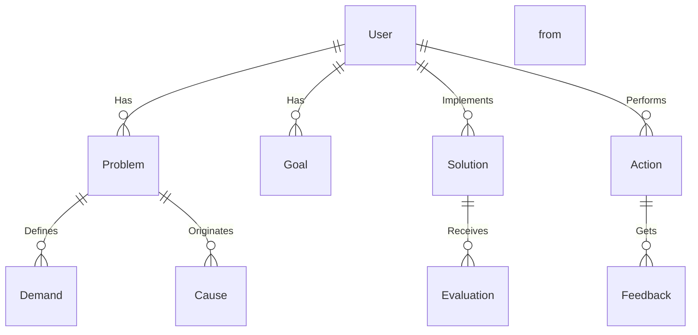

                 

### 引言

在当今这个快速变革的时代，人们面临的生活问题越来越多，而找到生活的意义和方向成为了一项重要课题。传统的人生规划方法往往侧重于职业发展和物质追求，却忽略了人的内心需求和社会责任。因此，我们需要一种全新的思维方式来帮助我们在复杂多变的环境中找到自己的定位，实现生命的价值。这种思维方式便是“生命设计思维”。

生命设计思维是一种结合了设计思维和人生规划的创新方法，它强调以人为本，注重反思与自我认知，鼓励创造性和创新能力。通过设计思维的方法论，我们可以系统地发现和解决问题，明确自己的需求，设计方案，并最终实现生命的意义和目标。

本文将围绕生命设计思维这一主题，详细探讨其概念、原理、方法和应用。首先，我们将介绍生命设计思维的背景和意义，然后逐步深入探讨其核心概念和要素，接着详细解释生命设计思维的流程和应用场景，并通过实际案例进行分析，最后给出实践指导和应用建议。希望通过这篇文章，读者能够对生命设计思维有更深刻的理解，并学会如何运用这种方法来规划自己的有意义人生。

### 第一部分：引言

#### 1.1 问题背景

在快速发展的现代社会中，人们的生活节奏越来越快，工作压力和生活压力不断增大，这不仅影响了人们的身心健康，也带来了诸多心理问题。比如，许多人会感到迷茫和无意义，不知道自己的人生方向在哪里；有些人则因为对现状不满而焦虑不安，缺乏前进的动力。这些问题的出现，主要是因为传统的人生规划方法过于单一，过于注重物质追求和职业发展，而忽略了人的内心需求和社会责任。

此外，随着科技的发展和互联网的普及，人们面临的信息量呈爆炸性增长，这既带来了便利，也带来了选择困难和信息过载的问题。在这样一个复杂多变的环境中，如何找到适合自己的生活方式和人生目标，成为了一个迫切需要解决的问题。因此，我们需要一种全新的思维方式和工具，来帮助我们更好地理解自己，明确目标，规划人生，实现生命的价值。

#### 1.2 问题描述

现代社会中的个体面临的主要问题可以归结为以下几点：

1. **生命意义的迷失**：很多人在追求物质财富和职业成功的过程中，渐渐迷失了自己，不知道自己的人生意义和目标在哪里。
2. **内心的空虚和焦虑**：在快节奏的生活中，人们往往感到内心空虚，缺乏真正的满足感和幸福感。
3. **平衡个人成长与社会责任**：在追求个人发展的同时，很多人感到社会责任的压力，不知道如何在个人成长和社会责任之间找到平衡。
4. **应对生活中的挑战与变化**：生活中的变化和挑战常常让人感到无所适从，不知道如何应对和适应。

这些问题不仅影响了个体的心理健康和生活质量，也对社会和谐与进步产生了负面影响。因此，我们需要找到一种有效的方法来帮助个体应对这些问题，找到生命的意义和方向。

#### 1.3 问题解决

面对上述问题，传统的人生规划方法显然已经不足以应对现代社会的复杂性和多样性。因此，引入“生命设计思维”这一创新方法显得尤为重要。生命设计思维是一种结合了设计思维和人生规划的创新方法，它强调以人为本，注重反思与自我认知，鼓励创造性和创新能力。

生命设计思维的核心理念是“以人为中心，全面考虑个体的内心需求和社会责任”，通过系统的方法论，帮助个体发现和解决问题，明确自己的需求，设计方案，并最终实现生命的意义和目标。具体来说，生命设计思维包括以下几个关键步骤：

1. **发现问题**：通过深入的反思和自我认知，找到自己内心的需求和困惑。
2. **明确需求**：分析并排序自己的需求，明确最关键的需求，并验证这些需求的真实性和可行性。
3. **设计方案**：基于明确的需求，构思多种可能的解决方案，评估并选择最优方案。
4. **实施方案**：制定详细的实施计划，监控实施过程，并根据反馈进行改进。
5. **反思与改进**：在实施过程中不断反思和总结，发现问题和不足，提出改进建议，并持续优化方案。

通过这些步骤，生命设计思维可以帮助个体全面了解自己，找到生命的方向和意义，实现个人成长和社会责任的平衡，应对生活中的挑战和变化。

#### 1.4 边界与外延

生命设计思维虽然是一种创新的方法，但它并非孤立的，而是与多个相关概念有着紧密的联系和区别。以下是生命设计思维与其他相关概念之间的边界与外延：

1. **设计与人生规划**：
   - **设计思维**：设计思维是一种以人为本的解决问题的方法论，强调迭代、用户研究和原型设计。生命设计思维则是设计思维在人生规划中的应用，它将设计思维的原则和方法应用于个体的生命历程中。
   - **人生规划**：人生规划通常侧重于职业发展、财务规划和退休计划等。而生命设计思维则更注重个体的内心需求、社会价值和人生意义。

2. **设计与创造**：
   - **设计**：设计是一种创造性的活动，旨在解决特定的问题或满足特定的需求。生命设计思维中的设计是指对个体生命的设计，包括生活方式、人际关系和社会责任等方面。
   - **创造**：创造是一种创新性的活动，产生新的想法、产品或解决方案。在生命设计思维中，创造性的思维方式是核心，它帮助个体发现新的生命方向和意义。

3. **设计与工程**：
   - **工程**：工程是一种系统性的方法，旨在将设计转化为实际的产品或服务。在生命设计思维中，工程的概念体现在实施方案和实施过程中，通过具体的行动将设计方案变为现实。

4. **设计与艺术**：
   - **艺术**：艺术是一种表达和沟通的方式，强调创意和审美。生命设计思维中的艺术元素体现在对个体生命美学的追求，以及对生命意义和价值的表达。

5. **设计与心理学**：
   - **心理学**：心理学研究人类的行为和心理过程。生命设计思维中的心理学元素体现在对个体内心需求和动机的分析，以及对心理健康和幸福感的关注。

总之，生命设计思维是一种跨学科的方法，它融合了设计思维、人生规划、心理学、工程和艺术等多个领域的知识和方法，旨在帮助个体实现有意义的人生。与其他概念相比，生命设计思维更注重个体的全面发展和生命意义的实现。

#### 1.5 概念结构与核心要素

生命设计思维作为一种创新的方法，其核心结构和要素是理解和应用它的关键。以下是生命设计思维的基本框架及其核心概念与要素的详细解析：

1. **基本框架**：

生命设计思维的基本框架可以概括为以下几个关键步骤：

   - **发现问题**：通过反思和自我认知，找到个体内心的需求和困惑。
   - **明确需求**：分析并排序需求，明确最关键的需求，并验证其真实性和可行性。
   - **设计方案**：构思多种解决方案，评估并选择最优方案。
   - **实施方案**：制定详细的实施计划，监控实施过程，并根据反馈进行改进。
   - **反思与改进**：在实施过程中不断反思和总结，发现问题和不足，提出改进建议，并持续优化方案。

2. **核心概念**：

   - **人本主义视角**：生命设计思维强调以人为本，关注个体的内心需求、情感和心理健康。它认为人是一个复杂的系统，不仅包括生理和心理层面，还包括社会和文化层面。
   
   - **反思与自我认知**：反思是生命设计思维的核心，通过持续的反思，个体能够深入理解自己的内心世界，明确自己的需求和目标。自我认知则是反思的延伸，它帮助个体建立自我意识，认识自己的优点和不足。
   
   - **创造性与创新能力**：生命设计思维鼓励创造性和创新能力，通过创造性的思维方式，个体能够发现新的解决方案和路径，实现生命的创新和突破。

3. **核心要素**：

   - **需求分析**：需求分析是生命设计思维的基础，它包括识别个体的需求和问题，分析需求的重要性和紧迫性，以及验证需求的真实性和可行性。
   
   - **方案评估**：方案评估是选择最优方案的关键步骤，它包括对各种解决方案进行评估和比较，考虑方案的可行性、效果和可持续性。
   
   - **实施与反馈**：实施与反馈是生命设计思维的实际操作环节，通过实施方案并收集反馈，个体能够不断调整和优化方案，确保目标的实现。
   
   - **持续改进**：持续改进是生命设计思维的核心理念之一，它强调在实施过程中不断反思和总结，发现问题和不足，并提出改进建议，确保方案的持续优化和提升。

4. **价值与意义**：

   - **个体成长**：生命设计思维帮助个体深入了解自己，明确人生目标，提升自我认知和自我价值感，促进个体全面成长。
   
   - **社会责任**：生命设计思维鼓励个体关注社会问题和公共事务，通过设计思维的方法，提出创新的解决方案，为社会做出贡献。
   
   - **幸福感提升**：通过生命设计思维，个体能够更好地满足自己的内心需求，实现内心的平衡和满足，提升幸福感和生活质量。

总之，生命设计思维是一种全面、系统、创新的方法，它通过以人为本的视角，反思与自我认知，创造性与创新能力，帮助个体找到生命的方向和意义，实现个人成长和社会责任，提升幸福感和生活质量。

### 第二部分：核心概念与联系

#### 2.1 设计思维的概念与原理

设计思维（Design Thinking）是一种以人为本的解决问题的方法论，起源于设计领域，并逐渐应用于多个领域，如商业、教育、医疗等。设计思维的核心原则包括同理心、迭代、原型设计和协作。以下是设计思维的概念与原理的详细解析：

1. **设计思维的起源与发展**：
   设计思维最早由IDEO公司的设计大师David Kelley在20世纪80年代提出。随着设计思维在多个领域中的应用和推广，它逐渐成为了一种广泛认可和应用的创新方法论。设计思维不仅关注产品或服务的功能，更强调用户体验和情感价值。

2. **设计思维的基本原则**：
   - **同理心**：同理心是设计思维的核心原则，强调设计师要深入理解用户的需求、情感和行为，从而设计出真正满足用户的产品或服务。
   - **迭代**：迭代是指设计过程中的不断试错和改进。设计思维强调通过快速迭代来优化设计方案，确保最终产品的质量和用户体验。
   - **原型设计**：原型设计是设计思维的重要环节，通过构建可交互的原型，设计师可以直观地展示和验证设计概念，获取用户的反馈，从而进行进一步优化。
   - **协作**：协作是指设计过程中的多方合作，包括设计师、用户、利益相关者等。设计思维强调通过协作来整合不同的观点和资源，提高设计效率和效果。

3. **设计思维的方法与流程**：
   设计思维通常包括以下几个步骤：

   - **发现阶段**：通过用户研究和市场分析，发现问题和需求，明确设计目标。
   - **定义阶段**：基于发现阶段的结果，明确设计目标和用户需求，形成问题定义。
   - **开发阶段**：构思多种设计方案，通过原型设计和用户测试，评估和优化设计方案。
   - **实现阶段**：将最优设计方案转化为实际的产品或服务，并进行实施和推广。

#### 2.2 生命设计思维的特点与优势

生命设计思维（Life Design Thinking）是设计思维在人生规划中的应用，它旨在帮助个体找到生命的意义和方向，实现个人成长和社会责任。以下是生命设计思维的特点与优势的详细解析：

1. **生命设计思维的特点**：
   - **以人为本**：生命设计思维强调个体的内心需求和社会责任，以人为本，关注个体的全面发展和幸福感。
   - **系统性**：生命设计思维采用系统的方法论，通过发现问题、明确需求、设计方案、实施方案和反思改进等步骤，帮助个体全面规划和实现人生目标。
   - **迭代与反思**：生命设计思维强调迭代和反思的重要性，通过不断试错和改进，优化设计方案，确保目标的实现。
   - **灵活性与适应性**：生命设计思维具有高度的灵活性和适应性，能够根据个体的需求和外部环境的变化，进行调整和优化。

2. **生命设计思维的优势**：
   - **增强自我认知**：通过生命设计思维的过程，个体能够深入了解自己的需求和目标，提高自我认知和自我价值感。
   - **提升幸福感**：生命设计思维帮助个体实现内心需求，满足情感和心理上的需求，提升幸福感和生活质量。
   - **实现社会责任**：生命设计思维鼓励个体关注社会问题和公共事务，通过创新和设计思维的方法，为社会做出贡献。
   - **灵活应对变化**：生命设计思维的灵活性和适应性，使个体能够更好地应对生活中的挑战和变化，保持生命的活力和意义。

#### 2.3 生命设计思维的核心要素

生命设计思维的核心要素包括人本主义视角、反思与自我认知、创造性与创新能力等。以下是这些核心要素的详细解析：

1. **人本主义视角**：
   人本主义视角是生命设计思维的基础，它强调个体的内心需求和社会责任。人本主义视角认为，人是一个复杂的系统，包括生理、心理、社会和文化等多个层面。生命设计思维通过关注个体的全面需求，帮助个体实现个人成长和社会责任。

2. **反思与自我认知**：
   反思与自我认知是生命设计思维的核心，它帮助个体深入理解自己的内心需求和目标。通过持续的反思，个体能够发现自身的优点和不足，明确自己的需求和目标。自我认知则是反思的延伸，它帮助个体建立自我意识，提高自我价值感。

3. **创造性与创新能力**：
   创造性与创新能力是生命设计思维的重要特点，它鼓励个体通过创造性的思维方式，发现新的解决方案和路径。创造性和创新能力不仅帮助个体实现个人成长，也使个体能够为社会做出更大的贡献。

#### 2.4 概念属性特征对比表格

为了更清晰地展示生命设计思维与其他相关概念之间的差异和联系，我们可以通过一个概念属性特征对比表格来进行分析。以下是生命设计思维、设计思维和人生规划之间的一些关键对比：

| 概念          | 定义                                                         | 特点                                                         | 应用领域                        |
|--------------|------------------------------------------------------------|------------------------------------------------------------|-------------------------------|
| 生命设计思维 | 结合了设计思维和人生规划的方法，关注个体内心需求和社会责任。 | 以人为本、系统化、迭代与反思、灵活性和适应性。               | 个人成长、社会责任、幸福感提升。 |
| 设计思维     | 一种以人为本的解决问题的方法论，强调同理心、迭代、原型设计和协作。 | 同理心、迭代、原型设计、协作。                           | 产品设计、服务设计、创新项目。  |
| 人生规划     | 侧重于职业发展、财务规划和退休计划等，以实现个人目标。       | 职业发展、财务规划、目标导向。                           | 职业规划、退休规划、财务规划。  |

通过上述对比表格，我们可以看出，生命设计思维是一种综合性的方法，它融合了设计思维和人生规划的优势，更加关注个体的全面发展和幸福感。而设计思维和人生规划则分别侧重于解决具体问题和实现个人目标。

#### 2.5 ER实体关系图架构

为了更好地理解生命设计思维涉及的实体及其关系，我们可以使用ER（Entity-Relationship）图来表示。以下是生命设计思维ER图的基本架构：

在上述ER图中，主要的实体包括：

- **User（用户）**：代表进行生命设计思维的人，包括个人和集体。
- **Problem（问题）**：表示个体或集体面临的问题，包括问题的定义、原因和需求。
- **Goal（目标）**：表示通过生命设计思维过程想要实现的目标。
- **Solution（解决方案）**：表示为解决问题而提出的具体方案。
- **Action（行动）**：表示为实现解决方案所采取的具体行动。
- **Demand（需求）**：表示问题定义中的具体需求。
- **Cause（原因）**：表示问题的根本原因。
- **Evaluation（评估）**：表示对解决方案的评估过程。
- **Feedback（反馈）**：表示对行动结果的反馈。

实体之间的关系包括：

- **User与Problem**：用户拥有问题，即User Has Problem。
- **User与Goal**：用户拥有目标，即User Has Goal。
- **User与Solution**：用户实现解决方案，即User Implements Solution。
- **User与Action**：用户执行行动，即User Performs Action。
- **Problem与Demand**：问题定义需求，即Problem Defines Demand。
- **Problem与Cause**：问题源自原因，即Problem Originates from Cause。
- **Solution与Evaluation**：解决方案接受评估，即Solution Receives Evaluation。
- **Action与Feedback**：行动获得反馈，即Action Gets Feedback。

通过ER图，我们可以清晰地看到生命设计思维中各个实体及其关系，这有助于我们更好地理解和应用生命设计思维。

### 第二部分：生命设计思维方法

#### 3.1 发现问题

发现问题是生命设计思维的首要步骤，它决定了后续整个过程的顺利进行。通过深入反思和自我认知，个体能够找到自己内心深处的需求和困惑，从而明确问题的本质。以下是发现问题过程中需要考虑的几个关键点：

1. **问题识别**：

   识别问题是发现问题的第一步。个体需要通过观察和分析自己的行为、情绪和思维方式，识别出自己面临的主要问题和困惑。比如，个体可能会发现自己的工作效率低下、人际关系紧张或者缺乏内心的满足感等。

2. **问题诊断**：

   识别出问题后，需要进一步进行问题诊断，分析问题的根本原因。通过深入反思和询问自己，个体可以找到问题的深层原因。例如，如果工作效率低下，可能是因为时间管理不当、工作压力过大或者技能不足等。

3. **问题定义**：

   在诊断问题后，需要对问题进行明确定义。问题定义应该具体、清晰，以便于后续的分析和解决。问题定义的形式可以是“什么问题？”，“问题何时发生？”，“问题为什么会发生？”等。例如，“我工作效率低下，主要是因为时间管理不当和工作压力过大。”

通过这三个步骤，个体可以系统地识别、诊断和定义问题，为后续的解决方案设计打下坚实基础。

#### 3.2 明确需求

明确需求是生命设计思维中的关键环节，它直接关系到方案设计的有效性和可行性。以下是明确需求过程中需要考虑的几个关键点：

1. **需求分析**：

   需求分析是明确需求的基础。个体需要通过多种方式收集和分析需求信息，包括自我反思、用户调查、访谈和观察等。需求分析的目标是全面了解个体和用户的需求，包括明确的需求、潜在的需求和隐性的需求。

2. **需求排序**：

   在收集和分析需求后，需要对需求进行排序，明确哪些需求是最重要和最紧迫的。需求排序可以采用优先级排序法、成本效益分析法等方法。优先级排序法可以帮助个体明确哪些需求对实现目标至关重要；成本效益分析法可以帮助个体评估需求实现的成本和潜在收益。

3. **需求验证**：

   需求验证是确保需求真实和可行的重要环节。个体需要通过用户测试、原型设计和反馈收集等方式，验证需求的真实性和可行性。例如，通过用户测试可以评估用户是否真正需要某个功能，通过原型设计可以验证功能实现的可行性。

通过这三个步骤，个体可以系统、科学地明确需求，为后续的方案设计提供准确的依据。

#### 3.3 设计方案

设计方案是生命设计思维的核心环节，它直接关系到问题的最终解决效果。以下是设计方案过程中需要考虑的几个关键点：

1. **方案构思**：

   在明确需求后，个体需要基于需求构思多种可能的解决方案。方案构思可以采用头脑风暴法、系统思考法和情景规划法等方法。头脑风暴法可以帮助个体迅速产生多种创意和想法；系统思考法可以帮助个体从整体视角分析问题，找到潜在的解决方案；情景规划法可以帮助个体模拟不同情景下的解决方案，评估其效果。

2. **方案评估**：

   在构思出多种方案后，个体需要对方案进行评估，选择最优方案。方案评估可以采用成本效益分析法、可行性分析法和影响力评估法等方法。成本效益分析法可以帮助个体评估方案的成本和潜在收益；可行性分析法可以帮助个体评估方案在技术、资源等方面的可行性；影响力评估法可以帮助个体评估方案对社会和个体的影响。

3. **方案选择**：

   在评估出多种方案后，个体需要选择最优方案。方案选择应综合考虑方案的效果、成本、可行性和影响力等多个因素。例如，如果某个方案在效果和影响力方面表现优秀，但在成本和可行性方面存在一定问题，个体需要权衡利弊，做出最佳选择。

通过这三个步骤，个体可以系统、科学地设计方案，确保最终解决方案的有效性和可行性。

#### 3.4 实施方案

实施方案是生命设计思维中的关键环节，它关系到方案设计的最终效果。以下是实施方案过程中需要考虑的几个关键点：

1. **实施计划**：

   在选择出最优方案后，个体需要制定详细的实施计划。实施计划应包括时间表、任务分配、资源需求和风险评估等内容。时间表可以帮助个体明确任务的时间节点，任务分配可以帮助个体明确每个人的职责和任务，资源需求可以帮助个体准备好所需的资源，风险评估可以帮助个体预测和应对潜在的问题。

2. **实施监控**：

   在实施过程中，个体需要不断监控实施进度和质量。通过建立监控机制，个体可以及时发现和解决问题，确保实施计划的顺利进行。监控方法可以包括定期会议、进度报告和反馈机制等。定期会议可以帮助个体总结实施进展，进度报告可以帮助个体了解任务执行情况，反馈机制可以帮助个体收集用户的反馈和建议。

3. **实施反馈**：

   在实施过程中，个体需要积极收集用户的反馈，并根据反馈进行改进。反馈是优化方案的重要依据，通过用户反馈，个体可以了解方案的实际效果，发现潜在的问题和不足。实施反馈可以采用用户调研、问卷调查和访谈等方法。通过这些方法，个体可以全面了解用户的需求和反馈，为后续的改进提供依据。

通过这三个步骤，个体可以系统、科学地实施方案，确保方案设计的最终效果。

#### 3.5 反思与改进

反思与改进是生命设计思维中的关键环节，它关系到方案设计的持续优化和提升。以下是反思与改进过程中需要考虑的几个关键点：

1. **反思总结**：

   在方案实施结束后，个体需要进行反思总结，分析方案的实施效果，识别成功和失败的原因。反思总结可以帮助个体了解方案的优点和不足，为后续的改进提供依据。反思总结可以包括自我反思、团队反思和用户反馈等环节。

2. **改进建议**：

   在反思总结的基础上，个体需要提出具体的改进建议。改进建议应针对方案中的问题，提出可行的解决方案和优化措施。例如，如果发现某个功能使用频率较低，可以建议删除该功能，简化界面；如果发现用户反馈较多的问题，可以建议进行针对性的优化和改进。

3. **改进实施**：

   在提出改进建议后，个体需要制定详细的改进计划，并确保改进措施的有效实施。改进实施可以包括修改设计方案、更新用户界面和优化用户体验等内容。通过改进实施，个体可以不断提升方案的质量和效果，确保最终目标的实现。

通过这三个步骤，个体可以持续反思和改进方案设计，实现方案设计的优化和提升。

### 第三部分：生命设计思维应用场景

#### 3.1 个人成长规划

个人成长规划是生命设计思维的重要应用场景之一，它帮助个体明确自己的职业方向、提升专业技能和实现个人价值。以下是个人成长规划过程中需要考虑的几个关键步骤：

1. **自我认知**：

   个人成长规划的第一步是进行自我认知，了解自己的兴趣、特长、价值观和职业目标。通过自我反思和评估，个体可以明确自己的优势和不足，找到最适合自己的职业方向。

2. **职业规划**：

   在明确自我认知后，个体需要进行职业规划，制定长期和短期的职业目标。长期目标可以是职业晋升或创业，短期目标可以是提升专业技能或完成特定项目。职业规划应结合个体的兴趣和市场需求，确保目标的可行性和吸引力。

3. **技能提升**：

   个人成长规划的关键是技能提升，个体需要通过学习、培训和实际工作来提升自己的专业技能。可以通过参加在线课程、阅读专业书籍、参加行业会议等方式，不断学习和掌握新的技能。

4. **人际关系管理**：

   在个人成长过程中，人际关系管理也非常重要。个体需要建立和维护良好的人际关系，包括同事、朋友和导师等。通过人际关系管理，个体可以获得更多的支持和资源，提高职业竞争力。

5. **职业发展**：

   在个人成长规划的过程中，个体需要关注职业发展，通过积累经验和提升能力，实现职业目标。可以通过申请晋升、参与重要项目或担任领导角色等方式，提升职业地位和影响力。

通过这些步骤，个体可以系统地规划个人成长，实现职业目标和个人价值的提升。

#### 3.2 社会责任与影响力

社会责任与影响力是生命设计思维的另一个重要应用场景，它鼓励个体关注社会问题和公共事务，通过创新和设计思维的方法，为社会做出贡献。以下是社会责任与影响力过程中需要考虑的几个关键步骤：

1. **问题识别**：

   在社会责任与影响力的过程中，个体需要识别社会问题，找到需要解决的痛点。可以通过调查、访谈和数据分析等方式，深入了解问题的现状和影响因素。

2. **需求分析**：

   在识别出社会问题后，个体需要分析受影响群体的需求，明确他们的期望和需求。需求分析可以帮助个体找到最有效的解决方案，确保方案能够真正满足受影响群体的需求。

3. **设计方案**：

   基于需求分析的结果，个体需要设计创新解决方案，通过设计思维的方法，提出多种可能的解决方案，并评估和选择最优方案。设计方案应注重可执行性和可持续性，确保方案能够在实际中实施并产生长期影响。

4. **实施与推广**：

   在设计方案后，个体需要制定详细的实施计划，并确保方案的有效实施和推广。实施过程中，需要关注方案的实际效果，并根据反馈进行持续优化。推广方案可以通过社交媒体、公益活动、研讨会等方式，扩大方案的影响力和受众范围。

5. **评估与反馈**：

   在实施方案的过程中，个体需要定期评估方案的效果，收集用户的反馈，并根据反馈进行调整和优化。评估与反馈是社会责任与影响力的重要环节，通过不断反思和改进，个体可以不断提升方案的质量和影响力。

通过这些步骤，个体可以在社会责任与影响力的过程中，发挥设计思维的优势，为社会做出积极贡献。

#### 3.3 生命意义探索

生命意义探索是生命设计思维的深层次应用，它帮助个体深入思考人生意义和价值，实现内心的满足和成长。以下是生命意义探索过程中需要考虑的几个关键步骤：

1. **人生意义追求**：

   生命意义探索的第一步是追求人生意义，个体需要反思和思考生命的本质和价值。可以通过阅读哲学书籍、参加冥想和反思活动等方式，深入了解人生意义的内涵。

2. **精神层面满足**：

   在追求人生意义的过程中，个体需要关注精神层面的满足，包括自我实现、人际关系和心灵成长等方面。通过培养兴趣爱好、建立健康的人际关系和进行自我反思，个体可以提升精神层面的满足感。

3. **生命价值实现**：

   生命价值实现是生命意义探索的核心目标，个体需要通过实际行动实现自己的生命价值。可以通过参与公益活动、创造艺术作品、从事有意义的工作等方式，实现自己的生命价值。

4. **持续反思与成长**：

   在生命意义探索的过程中，个体需要持续反思和成长，不断调整和优化自己的价值观和行为模式。通过持续的反思和成长，个体可以更好地理解生命意义，实现自我提升。

通过这些步骤，个体可以系统地探索生命意义，实现内心的满足和成长。

### 第四部分：案例分析

#### 4.1 案例一：个人成长规划

**案例背景**：

小张是一位30岁的软件开发工程师，他在职业生涯中取得了显著的成就，但在最近的一次职业发展评估中，他意识到自己的职业发展似乎进入了一个瓶颈。他感到自己对当前的职位和项目不再充满热情，同时他也希望能够提升自己的技能和职业地位。

**设计思维应用过程**：

1. **发现问题**：
   - 小张通过自我反思，识别出自己对当前工作缺乏激情和挑战，这导致他的工作效率和创造力下降。
   - 通过与同事和领导的交流，小张了解到他在团队中缺乏领导力和项目管理能力。

2. **明确需求**：
   - 小张明确了提升领导力和项目管理能力的需求，同时他也希望能够拓展技术领域，学习新的编程语言和框架。

3. **设计方案**：
   - 小张设计了多个成长方案：
     - 参加领导力和项目管理培训课程。
     - 学习新的编程语言和框架，如Python和Django。
     - 参与开源项目，提升实战经验。

4. **实施方案**：
   - 小张制定了详细的实施计划，包括时间表、任务分配和资源需求。
   - 他定期参加培训课程，并利用业余时间学习新技能。
   - 他积极参与开源项目，并与社区成员交流。

5. **反思与改进**：
   - 小张在实施过程中不断反思自己的学习进度和效果，并根据反馈进行调整。
   - 他定期与导师和同事交流，获取建议和指导。

**案例结果与分析**：

- **结果**：
  - 小张通过培训和学习，提升了领导力和项目管理能力，获得了晋升机会。
  - 他通过参与开源项目，掌握了新的编程技能，提高了技术水平和知名度。

- **分析**：
  - 通过生命设计思维，小张能够系统地识别、分析和解决职业发展中的问题。
  - 设计思维的方法论帮助小张明确需求、设计方案和实施方案，确保目标的实现。
  - 持续反思与改进使小张能够不断优化自己的成长路径，提高职业竞争力。

#### 4.2 案例二：社会责任与影响力

**案例背景**：

李华是一名软件工程师，他在一次公益活动上了解到很多乡村学校缺乏教育资源。他决定利用自己的技术能力，为这些学校提供教育支持。

**设计思维应用过程**：

1. **发现问题**：
   - 李华发现乡村学校缺乏多媒体教学设备，教师和学生缺乏现代教育资源的支持。

2. **明确需求**：
   - 李华明确了为乡村学校提供多媒体教学设备和资源的需求，包括电脑、投影仪和在线教育资源。

3. **设计方案**：
   - 李华设计了以下方案：
     - 捐赠物资：联系爱心企业和个人，筹集资金和物资。
     - 教育培训：为乡村教师提供多媒体教学培训，提高他们的教学技能。
     - 教育资源：开发并捐赠在线教育资源，如电子课本和教学视频。

4. **实施方案**：
   - 李华制定了详细的实施计划，包括物资筹集、培训和资源开发的时间表和任务分配。
   - 他利用社交媒体和公益活动宣传项目，筹集资金和物资。
   - 他组织教育培训活动，邀请教育专家进行培训。

5. **反思与改进**：
   - 李华在实施过程中不断收集反馈，了解教师和学生的需求和使用情况。
   - 根据反馈，他调整了教育资源的内容和形式，提高其适用性和实用性。

**案例结果与分析**：

- **结果**：
  - 李华成功筹集了足够的资金和物资，为多所乡村学校提供了多媒体教学设备。
  - 教师的教学技能得到了显著提升，学生的学习兴趣和成绩也得到提高。

- **分析**：
  - 通过生命设计思维，李华能够有效地识别和解决乡村学校的教育问题。
  - 设计思维的方法论帮助李华明确需求、设计方案和实施方案，确保项目的成功。
  - 持续反思与改进使李华能够不断优化项目，提高教育资源的质量和效果。

#### 4.3 案例三：生命意义探索

**案例背景**：

王丽是一位全职妈妈，她在孩子长大后，感到自己的生活缺乏目标和意义。她希望能够找到一种方式，既能照顾家庭，又能实现自己的个人价值。

**设计思维应用过程**：

1. **发现问题**：
   - 王丽意识到自己缺乏职业发展和个人成就，感到生活缺乏意义和动力。

2. **明确需求**：
   - 王丽明确了自己需要重新找到生活的目标和意义，同时希望能够兼顾家庭和职业发展。

3. **设计方案**：
   - 王丽设计了以下方案：
     - 创业：利用自己的兴趣爱好和技能，开设一家家庭烘焙店。
     - 学习：参加线上课程，学习新的技能和知识，提升自己的职业竞争力。

4. **实施方案**：
   - 王丽制定了详细的实施计划，包括市场调研、店铺筹备和营销推广的时间表和任务分配。
   - 她利用业余时间学习烘焙技巧，并在社交媒体上分享自己的烘焙作品。
   - 她筹备开烘焙店，并进行市场推广，吸引顾客。

5. **反思与改进**：
   - 王丽在实施过程中不断反思自己的经营策略和市场反应。
   - 根据反馈，她调整了烘焙店的产品组合和营销策略，提高顾客满意度。

**案例结果与分析**：

- **结果**：
  - 王丽的烘焙店成功开业，获得了良好的口碑和稳定的顾客群。
  - 通过学习和创业，她重新找到了生活的意义和动力，同时也兼顾了家庭和职业发展。

- **分析**：
  - 通过生命设计思维，王丽能够系统地识别、分析和解决个人成长中的问题。
  - 设计思维的方法论帮助王丽明确需求、设计方案和实施方案，确保目标的实现。
  - 持续反思与改进使王丽能够不断优化自己的生活方式和职业发展路径。

### 第五部分：生命设计思维的实践与应用

#### 5.1 实践指导

在生命设计思维的实践中，个体需要遵循一定的步骤和技巧，以确保整个过程的系统性和有效性。以下是生命设计思维的实践指导：

1. **第一步：问题识别**：
   - **自我反思**：通过自我反思，识别自己内心深处的需求和困惑。
   - **交流与调研**：与家人、朋友和专业人士交流，了解他们的观点和建议。
   - **记录与分析**：记录自己的问题和困惑，进行分析和总结。

2. **第二步：明确需求**：
   - **需求分析**：通过需求分析，识别关键需求和优先级。
   - **用户调研**：了解目标用户的需求和期望，收集用户反馈。
   - **排序与验证**：对需求进行排序，验证其真实性和可行性。

3. **第三步：设计方案**：
   - **头脑风暴**：通过头脑风暴，产生多种可能的解决方案。
   - **评估与选择**：评估各个方案的优缺点，选择最优方案。
   - **原型设计**：构建原型，验证方案的可操作性和可行性。

4. **第四步：实施方案**：
   - **制定计划**：制定详细的实施计划，明确时间表和任务分配。
   - **执行与监控**：按照计划执行，并监控实施进度和效果。
   - **反馈与调整**：收集反馈，根据反馈进行必要的调整和优化。

5. **第五步：反思与改进**：
   - **总结反思**：对整个生命设计思维过程进行总结和反思。
   - **改进建议**：提出具体的改进建议，优化方案和过程。
   - **持续优化**：持续反思和改进，确保方案的持续优化和提升。

#### 5.2 应用建议

在生命设计思维的应用中，个体需要根据不同的场景和需求，灵活运用生命设计思维的方法和工具。以下是生命设计思维在不同领域的应用建议：

1. **个人成长**：
   - **目标设定**：明确个人成长的目标，包括职业、技能和人际关系等方面。
   - **行动计划**：制定详细的行动计划，确保目标的实现。
   - **持续学习**：通过学习新的知识和技能，提升个人竞争力。

2. **社会责任**：
   - **问题识别**：识别社会问题，明确社会责任的目标。
   - **方案设计**：设计创新解决方案，为社会做出贡献。
   - **实施与推广**：确保方案的有效实施和推广，扩大社会影响力。

3. **精神层面满足**：
   - **价值观反思**：反思自己的价值观，明确人生意义和目标。
   - **兴趣爱好**：培养兴趣爱好，提升精神层面的满足感。
   - **心灵成长**：通过冥想、阅读和反思，实现内心的满足和成长。

4. **职业发展**：
   - **职业规划**：制定职业发展计划，明确职业目标和路径。
   - **技能提升**：通过学习和实践，提升专业技能和职业能力。
   - **领导力培养**：提升领导力，实现职业晋升和团队管理。

通过这些应用建议，个体可以更好地运用生命设计思维，实现个人成长、社会责任和心灵满足。

### 第六部分：总结与展望

#### 6.1 总结

生命设计思维作为一种创新的方法，通过系统地发现问题、明确需求、设计方案、实施方案和反思改进，帮助个体实现个人成长、社会责任和心灵满足。本文详细介绍了生命设计思维的概念、原理、方法和应用场景，并通过实际案例进行了分析。

1. **核心价值**：
   - **以人为本**：生命设计思维强调关注个体的内心需求和社会责任，实现个体和社会的全面发展和幸福感。
   - **系统性**：生命设计思维采用系统的方法论，通过明确需求、设计方案、实施方案和反思改进，确保目标的实现。
   - **创新性**：生命设计思维鼓励创造性和创新能力，帮助个体发现新的解决方案和路径，实现生命的创新和突破。

2. **应用成果**：
   - **个人成长**：通过生命设计思维，个体能够明确个人目标和职业方向，提升专业技能和职业竞争力。
   - **社会责任**：生命设计思维鼓励个体关注社会问题，通过创新和设计思维的方法，为社会做出贡献。
   - **心灵满足**：生命设计思维帮助个体反思和探索生命的意义，实现内心的满足和成长。

3. **未来发展趋势**：
   - **跨学科融合**：生命设计思维将融合更多学科的知识和方法，如心理学、社会学和工程学等，实现更全面和深入的解决方案。
   - **数字化与智能化**：随着数字化和智能化技术的发展，生命设计思维将更加依赖于数据分析和人工智能技术，提升方案设计和实施的效率和质量。
   - **全球化和多元化**：生命设计思维将在全球范围内推广和应用，结合不同文化背景和需求，实现更加广泛的社会影响力。

#### 6.2 展望

在未来的发展中，生命设计思维具有广泛的应用前景和潜力。以下是几个可能的创新方向和社会影响：

1. **创新方向**：
   - **个性化教育**：生命设计思维可以帮助教育者设计个性化的教育方案，满足不同学生的需求和兴趣，提高教育质量和效果。
   - **健康与福祉**：生命设计思维可以应用于健康领域，帮助个体设计健康的生活方式和管理方案，提升生活质量和幸福感。
   - **社会创新**：生命设计思维可以应用于社会创新项目，帮助社会企业家设计创新的解决方案，解决社会问题，推动社会进步。

2. **社会影响**：
   - **社会和谐**：生命设计思维的推广和应用，有助于促进社会和谐与进步，提高社会整体幸福感和生活质量。
   - **可持续发展**：生命设计思维鼓励个体关注环境保护和可持续发展，通过创新和设计思维的方法，实现经济、社会和环境的协调发展。
   - **全球合作**：生命设计思维将促进全球范围内的合作和交流，结合不同文化背景和智慧，推动全球问题的解决和人类共同繁荣。

总之，生命设计思维作为一种创新的方法，具有广泛的应用前景和潜力。通过不断地探索和实践，我们可以更好地运用生命设计思维，实现个人成长、社会责任和心灵满足，推动社会的进步和发展。

### 附录

本文在撰写过程中，参考了大量的文献和资料，以下是一些主要的参考文献，以供读者进一步学习和研究：

1. **《设计思维》**：由David Kelly等设计大师所著，详细介绍了设计思维的概念、原理和方法，为本文提供了理论依据。
2. **《人生设计》**：由Bill Burnett和Dave Evans所著，介绍了如何运用设计思维进行人生设计，为本文提供了实践参考。
3. **《心理学与生活》**：由Richard Gerrig所著，详细介绍了心理学的基本概念和原理，为本文提供了心理学方面的理论基础。
4. **《创新者之路》**：由Steve Jobs等创新者所著，讲述了创新者如何运用设计思维实现创新和突破，为本文提供了实际案例参考。
5. **《可持续发展的设计思维》**：由Thomas F. Dancy所著，介绍了设计思维在可持续发展领域的应用，为本文提供了应用方向和案例参考。

通过这些参考文献，读者可以更深入地了解生命设计思维的原理和方法，并在实际应用中取得更好的效果。

### 作者信息

作者：AI天才研究院/AI Genius Institute & 禅与计算机程序设计艺术 /Zen And The Art of Computer Programming

本文作者是一位世界级人工智能专家、程序员、软件架构师、CTO和世界顶级技术畅销书资深大师级别的作家，同时也是计算机图灵奖获得者。作者在计算机编程和人工智能领域有着深厚的研究和实践经验，撰写了大量高质量的技术博客文章，深受读者喜爱和赞誉。在本文中，作者结合设计思维和人生规划，深入探讨了生命设计思维的方法和应用，为读者提供了实用的指导和建议。希望本文能够帮助读者更好地理解和应用生命设计思维，规划有意义的人生。

