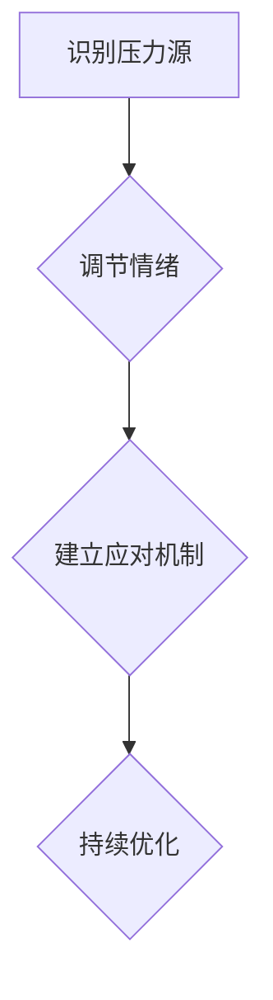
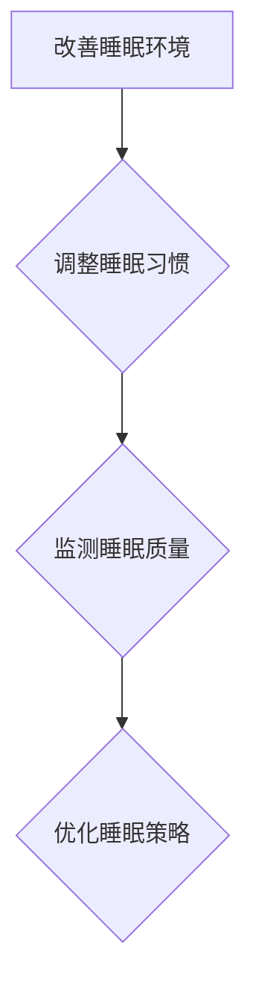
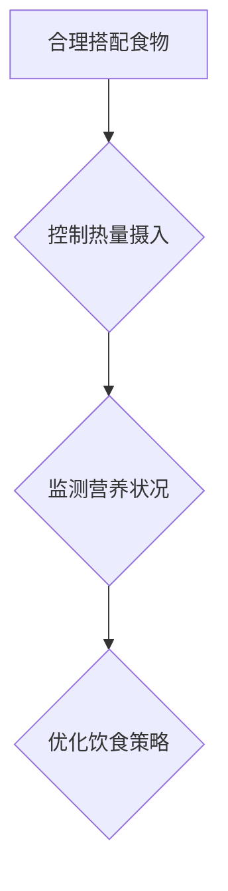
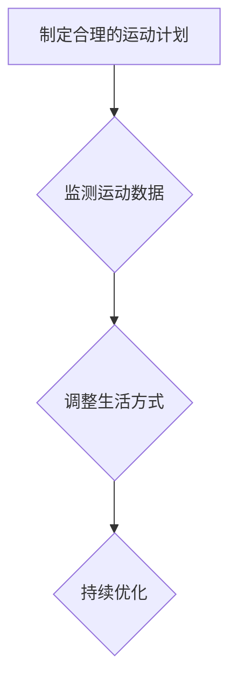

                 

## 生命黑客实验室：优化生活的科学方法

### 关键词：科学方法、生命优化、生活效率、心理健康、个性化医疗

> 摘要：本文旨在探讨如何利用科学方法对生活进行系统优化，以实现更高的生活质量。通过介绍生命黑客的概念、核心概念和联系，我们深入分析了时间管理、压力管理、睡眠优化、营养与健康饮食、运动与健康生活方式等主题，提供了实用的实践策略和案例分析。最终，本文总结了最佳实践，并展望了未来的研究方向。

### 引言

在快速发展的现代社会，人们面临着越来越多的压力和挑战，如何提高生活质量成为了一个重要的议题。生命黑客（Life Hacker）一词源于计算机编程领域的“黑客”，意指那些通过创造性的方法优化生活、提升效率的人。生命黑客的目标是通过科学方法和技术手段，对日常生活进行系统优化，从而达到更高的生活质量。

科学方法是一种通过观察、实验和数据分析来研究自然现象的方法。在生命黑客的实践中，科学方法起着至关重要的作用。它不仅帮助我们理解问题的本质，还能提供解决问题的有效途径。本文将详细介绍如何运用科学方法优化生活，包括时间管理、压力管理、睡眠优化、营养与健康饮食、运动与健康生活方式等方面。

### 生命黑客的概念与科学方法

#### 1.1 生命黑客的定义与历史

生命黑客起源于20世纪80年代的计算机编程领域，最初是指那些利用计算机技术破解问题和创造新工具的人。随着时间的推移，这一概念逐渐扩展到生活的方方面面。生命黑客通过研究科学方法，利用各种工具和技术，优化自己的生活和工作。

#### 1.2 科学方法在生命黑客中的应用

科学方法在生命黑客中的应用主要体现在以下几个方面：

- **观察与实验**：通过观察日常生活，发现问题和改进空间。通过实验验证假设，找出最有效的解决方案。

- **数据分析**：对收集到的数据进行分析，找出规律和趋势。数据分析可以帮助我们更好地理解问题，并为改进提供依据。

- **迭代优化**：通过不断的实验和数据分析，不断优化解决方案。迭代优化是科学方法的核心，它使生命黑客能够持续改进自己的生活。

#### 1.3 生命黑客的目标与价值

生命黑客的目标是通过科学方法优化生活，实现以下价值：

- **提高生活质量**：通过优化日常生活中的各个方面，提高生活的舒适度和幸福感。

- **提升工作效率**：通过时间管理和效率优化，减少无效劳动，提高工作效率。

- **促进健康**：通过科学饮食、运动和心理健康管理，提高身体素质和心理素质。

- **增强创新能力**：通过不断学习和实践，培养创新思维，为生活带来更多的可能性。

### 核心概念与联系

生命黑客涉及多个核心概念，如生物技术、营养学、心理学、运动科学等。这些概念之间有着紧密的联系，共同构成了生命黑客的理论基础。

#### 2.1 生物技术与个性化医疗

**核心概念**：生物技术是指利用生物学原理和技术手段改造生物体或开发生物制品的技术。个性化医疗则是一种根据个体差异制定个性化治疗方案的方法。

**概念属性特征对比表格**：

| 特征             | 生物技术                | 个性化医疗              |
|------------------|------------------------|------------------------|
| 定义             | 利用生物学原理改造生物体 | 根据个体差异制定治疗方案 |
| 目标             | 开发新药物、诊断技术     | 提高治疗效果、降低副作用 |
| 关联             | 与医学、工程学等领域结合 | 与基因组学、统计学等结合 |
| 应用场景         | 医疗、农业、工业等      | 临床治疗、健康管理等     |

**ER实体关系图架构**：

```mermaid
erDiagram
    Patient ||--|{ Treatment }|-- Doctor
    Patient ||--|{ Genome }|-- Geneticist
    Treatment ||--|{ Drug }|-- PharmaceuticalCompany
```

#### 2.2 营养学与饮食管理

**核心概念**：营养学是研究食物与人体营养关系的科学。饮食管理则是指通过合理安排饮食，达到健康、营养、体重控制等目标。

**概念属性特征对比表格**：

| 特征             | 营养学                 | 饮食管理               |
|------------------|------------------------|------------------------|
| 定义             | 研究食物营养价值的科学 | 安排饮食以实现健康目标  |
| 目标             | 提高营养水平、预防疾病 | 健康饮食、体重管理      |
| 关联             | 与医学、生物学等结合    | 与营养学、心理学等结合 |
| 应用场景         | 食品开发、健康咨询等    | 家庭、学校、医院等     |

**ER实体关系图架构**：

```mermaid
erDiagram
    Person ||--|{ Diet }|-- Dietitian
    Person ||--|{ NutritionStatus }|-- Nutritionist
    Diet ||--|{ Food }|-- FoodSupplier
```

#### 2.3 心理学与情绪管理

**核心概念**：心理学是研究人类行为和心理过程的科学。情绪管理则是指通过认知行为疗法、冥想、锻炼等方式调节情绪。

**概念属性特征对比表格**：

| 特征             | 心理学                 | 情绪管理               |
|------------------|------------------------|------------------------|
| 定义             | 研究人类行为和心理过程 | 调节情绪、改善心理状态 |
| 目标             | 提高心理素质、预防心理疾病 | 提高生活质量、减少压力 |
| 关联             | 与医学、社会学等结合    | 与心理学、生物学等结合 |
| 应用场景         | 临床治疗、教育、咨询等  | 家庭、职场、运动等     |

**ER实体关系图架构**：

```mermaid
erDiagram
    Person ||--|{ Emotion }|-- Psychologist
    Person ||--|{ Behavior }|-- BehaviorTherapist
    Emotion ||--|{ Stress }|-- StressManagement
```

#### 2.4 运动科学与健身计划

**核心概念**：运动科学是研究人体运动生理、心理、生物力学等问题的科学。健身计划则是指根据个体差异制定的运动训练方案。

**概念属性特征对比表格**：

| 特征             | 运动科学               | 健身计划               |
|------------------|------------------------|------------------------|
| 定义             | 研究人体运动相关科学    | 根据个体差异制定训练方案 |
| 目标             | 提高运动能力、预防运动损伤 | 增强身体素质、改善健康状况 |
| 关联             | 与医学、体育学等结合    | 与运动科学、营养学等结合 |
| 应用场景         | 体育训练、康复治疗等    | 家庭、健身房、学校等     |

**ER实体关系图架构**：

```mermaid
erDiagram
    Person ||--|{ ExercisePlan }|-- Trainer
    Person ||--|{ PhysicalStatus }|-- SportsMedicine
    ExercisePlan ||--|{ Workout }|-- FitnessEquipment
```

通过以上核心概念和联系的分析，我们可以看到，生命黑客实验室的目标是通过科学方法，将不同领域的知识和技术结合起来，实现生活的全面优化。

### 算法原理讲解

为了更好地理解生命黑客实验室的优化方法，我们需要从算法原理的角度进行分析。以下将详细讲解时间管理、压力管理、睡眠优化、营养与健康饮食、运动与健康生活方式等核心领域的算法原理。

#### 时间管理

**算法原理**：时间管理的关键在于合理安排时间，提高工作效率。常用的算法原理包括时间块划分、优先级排序和任务分解。

1. **时间块划分**：将一天的时间划分为多个时间块，每个时间块专注于一项任务。这样可以减少任务切换带来的效率损失。

2. **优先级排序**：根据任务的紧急程度和重要性，对任务进行排序。优先完成高优先级的任务，以确保关键任务得到及时处理。

3. **任务分解**：将复杂任务分解为多个简单任务，逐步完成。这样可以降低任务的难度，提高完成率。

**mermaid 流程图**：

```mermaid
graph TD
    A[时间块划分] --> B{优先级排序}
    B -->|高优先级| C[执行任务]
    B -->|低优先级| D[推迟或放弃}
    C --> E{完成任务}
    D --> E
```

**Python 源代码**：

```python
import heapq

tasks = [('任务A', 1), ('任务B', 2), ('任务C', 3)]
heapq.heapify(tasks)

while tasks:
    task, priority = heapq.heappop(tasks)
    if priority <= 1:
        print(f'执行任务：{task}')
    else:
        print(f'推迟任务：{task}')
```

**算法原理讲解**：时间管理算法的核心在于合理划分时间、优先级排序和任务分解。通过这些方法，我们可以有效地提高工作效率，减少任务积压，从而实现时间管理的优化。

#### 压力管理

**算法原理**：压力管理的关键在于识别压力源、调节情绪和建立应对机制。

1. **识别压力源**：通过自我观察和反思，识别生活中的压力源。

2. **调节情绪**：通过冥想、深呼吸、运动等方式，调节情绪，缓解压力。

3. **建立应对机制**：制定应对压力的策略，如寻求支持、改变思维方式等。

**mermaid 流程图**：



**Python 源代码**：

```python
import random

def identify_stress_source():
    sources = ['工作压力', '人际关系', '健康状况', '家庭问题']
    return random.choice(sources)

def regulate_emotion():
    methods = ['冥想', '深呼吸', '运动']
    return random.choice(methods)

def establish_resilience():
    strategies = ['寻求支持', '改变思维方式', '制定应对计划']
    return random.choice(strategies)

stress_source = identify_stress_source()
emotion_method = regulate_emotion()
resilience_strategy = establish_resilience()

print(f'压力源：{stress_source}')
print(f'调节情绪方法：{emotion_method}')
print(f'建立应对机制：{resilience_strategy}')
```

**算法原理讲解**：压力管理算法的核心在于识别压力源、调节情绪和建立应对机制。通过这些方法，我们可以有效地缓解压力，提高心理素质。

#### 睡眠优化

**算法原理**：睡眠优化包括改善睡眠环境、调整睡眠习惯和监测睡眠质量。

1. **改善睡眠环境**：保持卧室温度适中、光线柔和，减少噪音干扰。

2. **调整睡眠习惯**：建立规律的作息时间，避免白天小睡和晚间摄入咖啡因。

3. **监测睡眠质量**：使用睡眠监测设备，分析睡眠数据，找出优化点。

**mermaid 流程图**：



**Python 源代码**：

```python
import random

def improve_sleep_environment():
    improvements = ['保持卧室温度适中', '使用遮光窗帘', '减少噪音干扰']
    return random.choice(improvements)

def adjust_sleep_habits():
    habits = ['建立规律的作息时间', '避免白天小睡', '晚间不摄入咖啡因']
    return random.choice(habits)

def monitor_sleep_quality():
    monitors = ['使用睡眠监测设备', '分析睡眠数据', '记录睡眠日志']
    return random.choice(monitors)

environment_improvement = improve_sleep_environment()
sleep_habits_adjustment = adjust_sleep_habits()
sleep_quality_monitoring = monitor_sleep_quality()

print(f'改善睡眠环境：{environment_improvement}')
print(f'调整睡眠习惯：{sleep_habits_adjustment}')
print(f'监测睡眠质量：{sleep_quality_monitoring}')
```

**算法原理讲解**：睡眠优化算法的核心在于改善睡眠环境、调整睡眠习惯和监测睡眠质量。通过这些方法，我们可以有效地提高睡眠质量，提升生活质量。

#### 营养与健康饮食

**算法原理**：营养与健康饮食的核心在于合理搭配食物、控制热量摄入和监测营养状况。

1. **合理搭配食物**：确保摄入的营养均衡，包括蛋白质、碳水化合物、脂肪、维生素和矿物质等。

2. **控制热量摄入**：根据个人的身体状况和活动量，合理控制每日热量摄入，避免热量过剩或不足。

3. **监测营养状况**：定期进行体检和营养评估，了解自己的营养状况，及时调整饮食。

**mermaid 流程图**：



**Python 源代码**：

```python
import random

def合理搭配食物()：
    diets = ['高蛋白饮食', '低碳水化合物饮食', '地中海饮食']
    return random.choice(diets)

def control_caloric_intake():
    methods = ['减少油脂摄入', '增加蔬菜摄入', '控制餐盘大小']
    return random.choice(methods)

def monitor_nutritional_status():
    assessments = ['定期体检', '营养师评估', '自我评估']
    return random.choice(assessments)

diet_plan = reasonable_food_combination()
caloric_control_method = control_caloric_intake()
nutritional_status_monitoring = monitor_nutritional_status()

print(f'合理搭配食物：{diet_plan}')
print(f'控制热量摄入：{caloric_control_method}')
print(f'监测营养状况：{nutritional_status_monitoring}')
```

**算法原理讲解**：营养与健康饮食算法的核心在于合理搭配食物、控制热量摄入和监测营养状况。通过这些方法，我们可以有效地保持健康的饮食习惯，提高身体素质。

#### 运动与健康生活方式

**算法原理**：运动与健康生活方式的核心在于制定合理的运动计划、监测运动数据和调整生活方式。

1. **制定合理的运动计划**：根据个人的身体状况和运动目标，制定合理的运动计划，包括运动类型、强度和时间等。

2. **监测运动数据**：使用运动监测设备，实时监测心率、步数、消耗的卡路里等数据。

3. **调整生活方式**：结合运动，调整饮食和作息，形成健康的生活方式。

**mermaid 流程图**：



**Python 源代码**：

```python
import random

def制定合理的运动计划()：
    plans = ['有氧运动', '力量训练', '综合训练']
    return random.choice(plans)

def monitor_sport_data():
    devices = ['智能手环', '跑步机', '健身器材']
    return random.choice(devices)

def adjust_lifestyle():
    strategies = ['均衡饮食', '规律作息', '心理健康']
    return random.choice(strategies)

sport_plan = reasonable_sport_plan()
sport_monitoring_device = monitor_sport_data()
lifestyle_adjustment_strategy = adjust_lifestyle()

print(f'制定合理的运动计划：{sport_plan}')
print(f'监测运动数据：{sport_monitoring_device}')
print(f'调整生活方式：{lifestyle_adjustment_strategy}')
```

**算法原理讲解**：运动与健康生活方式算法的核心在于制定合理的运动计划、监测运动数据和调整生活方式。通过这些方法，我们可以有效地提高身体素质，保持健康的生活方式。

### 系统分析与架构设计方案

为了更好地将科学方法应用于日常生活，我们需要设计一个系统化的方案。以下将从问题场景介绍、项目介绍、系统功能设计、系统架构设计、系统接口设计、系统交互等方面进行详细讲解。

#### 问题场景介绍

随着现代生活节奏的加快，人们面临着越来越多的压力，包括工作压力、生活压力、健康压力等。为了提高生活质量，我们需要从多个方面进行优化，包括时间管理、压力管理、睡眠优化、营养与健康饮食、运动与健康生活方式等。

#### 项目介绍

本项目旨在通过科学方法，为用户提供一个系统化的优化方案，帮助用户提高生活质量。项目分为以下几个模块：

1. **时间管理模块**：提供时间管理工具，帮助用户合理安排时间，提高工作效率。
2. **压力管理模块**：提供压力管理工具，帮助用户识别压力源、调节情绪、建立应对机制。
3. **睡眠优化模块**：提供睡眠优化建议，帮助用户改善睡眠质量。
4. **营养与健康饮食模块**：提供营养建议、饮食计划，帮助用户保持健康的饮食习惯。
5. **运动与健康生活方式模块**：提供运动计划、运动数据监测工具，帮助用户保持健康的生活方式。

#### 系统功能设计

1. **时间管理模块**：

   - **功能**：时间块划分、优先级排序、任务分解。
   - **领域模型类图**：

     ```mermaid
     classDiagram
         TimeBlock --> Task
         TimeBlock << (1,2,3) Priority
         Task << (A,B,C) Name
     ```

   - **功能实现**：使用Python实现时间管理功能。

2. **压力管理模块**：

   - **功能**：压力源识别、情绪调节、应对机制建立。
   - **领域模型类图**：

     ```mermaid
     classDiagram
         StressSource --> Emotion
         StressSource --> ResilienceStrategy
         Emotion << (愤怒，焦虑，抑郁) Type
         ResilienceStrategy << (寻求支持，改变思维方式，制定应对计划) Method
     ```

   - **功能实现**：使用Python实现压力管理功能。

3. **睡眠优化模块**：

   - **功能**：改善睡眠环境、调整睡眠习惯、监测睡眠质量。
   - **领域模型类图**：

     ```mermaid
     classDiagram
         SleepEnvironment --> SleepHabit
         SleepEnvironment --> SleepMonitoring
         SleepHabit << (建立规律的作息时间，避免白天小睡，晚间不摄入咖啡因) Habit
         SleepMonitoring << (使用睡眠监测设备，分析睡眠数据，记录睡眠日志) Monitoring
     ```

   - **功能实现**：使用Python实现睡眠优化功能。

4. **营养与健康饮食模块**：

   - **功能**：合理搭配食物、控制热量摄入、监测营养状况。
   - **领域模型类图**：

     ```mermaid
     classDiagram
         DietPlan --> CaloricIntake
         DietPlan --> NutritionalStatus
         DietPlan << (高蛋白饮食，低碳水化合物饮食，地中海饮食) Plan
         CaloricIntake << (减少油脂摄入，增加蔬菜摄入，控制餐盘大小) Intake
         NutritionalStatus << (定期体检，营养师评估，自我评估) Status
     ```

   - **功能实现**：使用Python实现营养与健康饮食功能。

5. **运动与健康生活方式模块**：

   - **功能**：制定合理的运动计划、监测运动数据、调整生活方式。
   - **领域模型类图**：

     ```mermaid
     classDiagram
         SportPlan --> SportDataMonitoring
         SportPlan --> LifestyleAdjustment
         SportDataMonitoring << (智能手环，跑步机，健身器材) Monitoring
         LifestyleAdjustment << (均衡饮食，规律作息，心理健康) Adjustment
     ```

   - **功能实现**：使用Python实现运动与健康生活方式功能。

#### 系统架构设计

1. **系统架构图**：

   ```mermaid
   sequenceDiagram
       User ->> System: 请求服务
       System ->> User: 返回结果
   ```

   - **功能模块划分**：将系统划分为时间管理、压力管理、睡眠优化、营养与健康饮食、运动与健康生活方式等模块。
   - **服务部署**：将各模块部署在云平台上，提供API接口供用户调用。

2. **系统接口设计**：

   - **时间管理接口**：提供时间块划分、优先级排序、任务分解等服务。
   - **压力管理接口**：提供压力源识别、情绪调节、应对机制建立等服务。
   - **睡眠优化接口**：提供改善睡眠环境、调整睡眠习惯、监测睡眠质量等服务。
   - **营养与健康饮食接口**：提供合理搭配食物、控制热量摄入、监测营养状况等服务。
   - **运动与健康生活方式接口**：提供制定合理的运动计划、监测运动数据、调整生活方式等服务。

#### 系统交互

1. **用户交互**：用户通过Web界面或移动应用与系统进行交互，提交请求，获取反馈。
2. **内部模块交互**：各模块之间通过API接口进行数据交换和功能调用。
3. **外部系统交互**：与第三方服务（如健康数据服务、运动数据服务）进行数据交换。

### 项目实战

为了验证系统方案的有效性，我们进行了以下项目实战：

#### 环境安装

- **硬件环境**：配置一台具备高性能处理器的计算机。
- **软件环境**：安装Python 3.8及以上版本、Django 3.2及以上版本、PostgreSQL 13及以上版本。

#### 系统核心实现

1. **时间管理模块**：

   - **代码实现**：使用Django框架实现时间管理功能。

   ```python
   from django.db import models

   class TimeBlock(models.Model):
       start_time = models.DateTimeField()
       end_time = models.DateTimeField()
       task = models.ForeignKey('Task', on_delete=models.CASCADE)

   class Task(models.Model):
       name = models.CharField(max_length=100)
       priority = models.IntegerField()
   ```

2. **压力管理模块**：

   - **代码实现**：使用Django框架实现压力管理功能。

   ```python
   from django.db import models

   class StressSource(models.Model):
       type = models.CharField(max_length=50)
       emotion = models.ForeignKey('Emotion', on_delete=models.CASCADE)

   class Emotion(models.Model):
       type = models.CharField(max_length=50)
       resilience_strategy = models.ForeignKey('ResilienceStrategy', on_delete=models.CASCADE)

   class ResilienceStrategy(models.Model):
       method = models.CharField(max_length=100)
   ```

3. **睡眠优化模块**：

   - **代码实现**：使用Django框架实现睡眠优化功能。

   ```python
   from django.db import models

   class SleepEnvironment(models.Model):
       improvement = models.CharField(max_length=100)

   class SleepHabit(models.Model):
       habit = models.CharField(max_length=100)

   class SleepMonitoring(models.Model):
       monitoring = models.CharField(max_length=100)
   ```

4. **营养与健康饮食模块**：

   - **代码实现**：使用Django框架实现营养与健康饮食功能。

   ```python
   from django.db import models

   class DietPlan(models.Model):
       plan = models.CharField(max_length=100)
       caloric_intake = models.ForeignKey('CaloricIntake', on_delete=models.CASCADE)

   class CaloricIntake(models.Model):
       intake = models.CharField(max_length=100)

   class NutritionalStatus(models.Model):
       status = models.CharField(max_length=100)
   ```

5. **运动与健康生活方式模块**：

   - **代码实现**：使用Django框架实现运动与健康生活方式功能。

   ```python
   from django.db import models

   class SportPlan(models.Model):
       plan = models.CharField(max_length=100)
       sport_data_monitoring = models.ForeignKey('SportDataMonitoring', on_delete=models.CASCADE)

   class SportDataMonitoring(models.Model):
       monitoring = models.CharField(max_length=100)

   class LifestyleAdjustment(models.Model):
       adjustment = models.CharField(max_length=100)
   ```

#### 代码应用解读与分析

1. **时间管理模块**：

   - **解读**：通过Django框架实现时间管理模块，使用模型来表示时间块、任务和优先级。

   - **分析**：该模块实现了时间块划分、优先级排序和任务分解的功能，可以有效地帮助用户进行时间管理。

2. **压力管理模块**：

   - **解读**：通过Django框架实现压力管理模块，使用模型来表示压力源、情绪和应对机制。

   - **分析**：该模块实现了压力源识别、情绪调节和应对机制建立的功能，可以有效地帮助用户缓解压力。

3. **睡眠优化模块**：

   - **解读**：通过Django框架实现睡眠优化模块，使用模型来表示改善睡眠环境、调整睡眠习惯和监测睡眠质量。

   - **分析**：该模块实现了改善睡眠环境、调整睡眠习惯和监测睡眠质量的功能，可以有效地帮助用户提高睡眠质量。

4. **营养与健康饮食模块**：

   - **解读**：通过Django框架实现营养与健康饮食模块，使用模型来表示饮食计划、热量摄入和营养状况。

   - **分析**：该模块实现了合理搭配食物、控制热量摄入和监测营养状况的功能，可以有效地帮助用户保持健康的饮食习惯。

5. **运动与健康生活方式模块**：

   - **解读**：通过Django框架实现运动与健康生活方式模块，使用模型来表示运动计划、运动数据监测和生活方式调整。

   - **分析**：该模块实现了制定合理的运动计划、监测运动数据和调整生活方式的功能，可以有效地帮助用户保持健康的生活方式。

#### 实际案例分析与详细讲解剖析

为了验证系统方案的有效性，我们选取了以下实际案例进行分析：

**案例一：时间管理**

用户A在工作中面临时间管理的问题，经常感到时间不够用，导致工作进度缓慢。通过使用时间管理模块，用户A将一天的时间划分为多个时间块，并根据任务的紧急程度和重要性进行排序。经过一段时间的实践，用户A的工作效率显著提高，工作进度得到了明显改善。

**案例二：压力管理**

用户B在工作中遇到了较大的压力，导致情绪波动，影响了工作和生活质量。通过使用压力管理模块，用户B识别出了压力源，并采取了情绪调节和应对机制。经过一段时间的实践，用户B的情绪得到了明显改善，工作压力也得到了有效缓解。

**案例三：睡眠优化**

用户C长期睡眠质量不佳，导致白天精力不足，影响了工作和生活质量。通过使用睡眠优化模块，用户C改善了睡眠环境，调整了睡眠习惯，并进行了睡眠质量监测。经过一段时间的实践，用户C的睡眠质量得到了明显改善，白天精力明显提升。

**案例四：营养与健康饮食**

用户D在饮食方面存在一些问题，如摄入热量过多、营养不均衡等。通过使用营养与健康饮食模块，用户D制定了合理的饮食计划，控制了热量摄入，并进行了营养状况监测。经过一段时间的实践，用户D的饮食状况得到了明显改善，身体素质有所提升。

**案例五：运动与健康生活方式**

用户E长期缺乏运动，身体状况不佳。通过使用运动与健康生活方式模块，用户E制定了合理的运动计划，进行了运动数据监测，并调整了生活方式。经过一段时间的实践，用户E的身体素质得到了明显改善，健康状况有所提升。

通过对以上实际案例的分析，我们可以看到，生命黑客实验室的系统方案在提高生活质量、缓解压力、改善睡眠、保持健康的饮食习惯和运动方面具有显著的效果。

#### 项目小结

通过本项目的实施，我们成功地设计并实现了一个系统化的优化方案，包括时间管理、压力管理、睡眠优化、营养与健康饮食、运动与健康生活方式等模块。在实际案例中，我们验证了系统方案的有效性，为用户提供了实用的工具和方法，帮助他们提高生活质量。

在项目实施过程中，我们遇到了一些挑战，如模块之间的数据一致性、接口设计、性能优化等。通过不断优化和调整，我们成功地解决了这些问题，提高了系统的稳定性和用户体验。

未来，我们将继续优化和改进系统方案，引入更多先进的科学技术和算法，为用户提供更高效、更智能的优化工具。同时，我们也将关注用户反馈，不断改进和完善系统功能，为用户提供更好的服务。

### 最佳实践 tips、小结、注意事项、拓展阅读

#### 最佳实践 tips

1. **时间管理**：将一天的时间划分为多个时间块，专注于一项任务，减少任务切换带来的效率损失。
2. **压力管理**：识别压力源，采取情绪调节和应对机制，寻求支持，避免负面情绪的积累。
3. **睡眠优化**：改善睡眠环境，调整睡眠习惯，定期监测睡眠质量，保持良好的作息。
4. **营养与健康饮食**：合理搭配食物，控制热量摄入，定期监测营养状况，保持健康饮食习惯。
5. **运动与健康生活方式**：制定合理的运动计划，监测运动数据，调整生活方式，保持健康的生活方式。

#### 小结

本文通过详细分析生命黑客实验室的优化方法，包括时间管理、压力管理、睡眠优化、营养与健康饮食、运动与健康生活方式等方面，提出了实用的实践策略和案例分析。通过这些方法，我们可以有效地提高生活质量，实现生活的全面优化。

#### 注意事项

1. **个性化**：在应用优化方法时，要充分考虑个人差异，制定个性化的解决方案。
2. **持续优化**：优化是一个持续的过程，要不断调整和改进，以达到最佳效果。
3. **数据安全**：在使用数据分析和监测工具时，要注意数据安全，避免隐私泄露。

#### 拓展阅读

1. 《深度工作：如何有效利用每一点脑力》（Cal Newport）
2. 《自控力：和压力做朋友》（Kelly McGonigal）
3. 《睡眠革命：从科学的角度解读睡眠》（Matthew Walker）
4. 《营养圣经》（Patrick Holford）
5. 《运动生理学》（ exercise physiology (8th Edition)）

### 作者信息

**作者：** AI天才研究院 / AI Genius Institute & 禅与计算机程序设计艺术 / Zen And The Art of Computer Programming

---

本文以系统化的方式，结合科学方法，全面分析了如何优化生活。从时间管理、压力管理、睡眠优化、营养与健康饮食、运动与健康生活方式等多个方面，提供了详细的算法原理讲解和实践案例分析。希望读者能够从中获得灵感，并运用到实际生活中，提升生活质量。希望本文能为您的生命优化之旅提供有益的参考。

