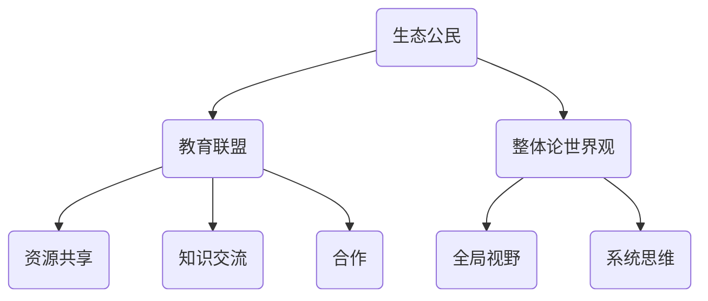

                 

### 引言

#### 1.1 背景介绍

生态公民教育（Eco-Citizen Education）是一种旨在培养个体对环境、社会和经济的责任感，并促使他们成为积极参与全球可持续发展的积极分子的教育模式。它不仅关注个体的知识和技能，还强调情感、态度和价值观的培养，以形成一种全面的生态公民意识。

教育联盟（Educational Alliance）是由多个教育机构、组织或个人组成的合作网络，旨在通过资源共享、知识交流、项目合作等方式，提升教育质量和影响力。这种联盟的建立，有助于突破单个教育机构的局限性，形成更为广泛的教育影响力和资源共享机制。

整体论世界观（Holistic Worldview）强调各个部分之间的相互联系和整体性，认为世界是一个复杂且动态的系统，任何部分的改变都会影响到整体。在生态公民教育中，整体论世界观的重要性在于它能够帮助学生理解个体与自然、社会之间的紧密联系，从而培养出一种全局视野和系统思维。

#### 1.2 核心概念与联系

在生态公民教育联盟中，三个核心概念——生态公民、教育联盟和整体论世界观——彼此紧密联系，共同构建了一个复杂的教育体系。

**生态公民**是指那些具备生态意识、环境责任感和社会参与能力的个体。他们不仅关注个人的生活，还关心全球的环境和社会问题，并愿意采取行动来改善这些问题。

**教育联盟**则是实现生态公民教育的关键机制，它通过整合资源、共享知识、促进合作，为生态公民教育提供强有力的支持和保障。

**整体论世界观**则是生态公民教育的理论基础，它帮助学生理解世界是一个相互联系的整体，个体的行为会对整个系统产生影响。这种世界观有助于培养出具备全局视野和系统思维能力的生态公民。

为了更好地理解这些概念之间的关系，我们可以通过以下表格和实体关系图来展示它们的核心特征和相互联系。

#### 概念对比表格

| 概念             | 定义                                                         | 特征                         | 重要性               |
|------------------|--------------------------------------------------------------|-----------------------------|---------------------|
| 生态公民         | 具备生态意识、环境责任感和社会参与能力的个体                 | 环保意识、社会责任、参与精神 | 培养可持续发展的公民 |
| 教育联盟         | 由多个教育机构、组织或个人组成的合作网络                     | 资源共享、知识交流、合作     | 提升教育质量和影响力 |
| 整体论世界观     | 强调各个部分之间的相互联系和整体性                           | 全局视野、系统思维           | 基础性世界观        |

#### 实体关系图

在这个实体关系图中，生态公民通过教育联盟与整体论世界观建立联系，教育联盟则通过资源共享、知识交流和合作来实现生态公民教育的目标，整体论世界观则为这一教育模式提供理论基础。

通过这些表格和图示，我们可以更加清晰地理解生态公民教育联盟的核心概念及其相互关系，为后续章节的深入探讨打下坚实的基础。接下来，我们将进一步探讨生态公民教育的理论基础，分析这一教育模式背后的各种理论支持。

