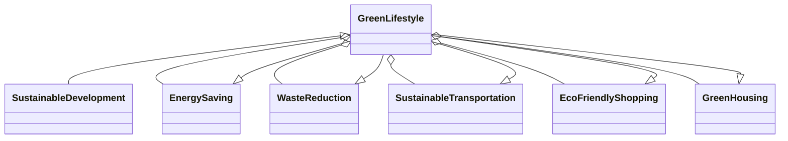

                 

### 生态意识觉醒：个人与地球的和谐共生

**关键词：** 生态意识，和谐共生，可持续发展，绿色生活，环境保护

**摘要：** 本文将深入探讨生态意识觉醒的重要性，分析个人与地球和谐共生所需的条件，并介绍实现这一目标的策略。通过对比生态意识与其他意识的特征，阐述其认知、情感和行为性。同时，本文还将介绍可持续发展与绿色生活的定义、属性及特征对比，以期为读者提供全面的理解。最后，本文将回顾主流理论和实践案例，为个人与地球的和谐共生提供有价值的参考。

### 第一部分：导言

#### 1.1 书籍背景与目标

在当今全球生态危机日益严峻的背景下，生态意识的觉醒成为人类可持续发展的关键。本书旨在探讨个人与地球的和谐共生，帮助读者认识到生态意识的重要性，并掌握实现这一目标的具体策略。

##### 1.1.1 问题的提出

- **环境问题加剧**：全球气候变化、生物多样性丧失、资源过度消耗等问题日益突出。
- **人类角色反思**：人类在享受科技进步带来的便利时，对自然环境的破坏也越来越严重。

##### 1.1.1.1 问题背景

- **环境问题加剧**：全球气候变化、生物多样性丧失、资源过度消耗等问题日益突出。
- **人类角色反思**：人类在享受科技进步带来的便利时，对自然环境的破坏也越来越严重。

##### 1.1.1.2 问题描述

- **生态意识缺乏**：大多数人对于生态问题缺乏深刻的认识，生态行为不当。
- **可持续发展挑战**：实现人与自然的和谐共生面临诸多挑战。

##### 1.1.1.3 问题解决

- **提升生态意识**：通过教育、宣传等手段，提高人们对生态环境的认识和责任感。
- **绿色生活方式**：倡导低碳、环保、节约的生活方式。

##### 1.1.1.4 边界与外延

- **核心概念**：生态意识、可持续发展、绿色生活。
- **相关领域**：环境科学、生态学、社会学、经济学等。

##### 1.1.1.5 概念结构与核心要素组成

- **生态意识**：对生态环境的认识和重视。
- **可持续发展**：满足当代需求，不损害后代满足其需求的能力。
- **绿色生活**：低碳、环保、节约的生活方式。

#### 1.2 核心概念与联系

##### 1.2.1 生态意识

###### 1.2.1.1 原理

- **定义**：个体对生态环境的认识、态度和行为。
- **属性**：认知性、情感性、行为性。

###### 1.2.1.2 特征对比

| 特征 | 生态意识 | 其他意识 |
| ---- | ---- | ---- |
| 认知性 | 关注生态问题，理解生态重要性 | 关注社会问题，理解社会重要性 |
| 情感性 | 对生态问题有情感投入 | 对社会问题有情感投入 |
| 行为性 | 采取环保行为 | 采取社会责任行为 |

##### 1.2.2 可持续发展

###### 1.2.2.1 原理

- **定义**：满足当前需求而不损害未来世代满足其需求的能力。
- **属性**：经济性、社会性、环境性。

###### 1.2.2.2 特征对比

| 特征 | 可持续发展 | 传统发展 |
| ---- | ---- | ---- |
| 经济性 | 经济增长与环境保护并重 | 经济增长优先 |
| 社会性 | 社会福祉与环境保护协调 | 社会福祉未充分考虑环境因素 |
| 环境性 | 强调环境保护 | 环境保护不充分 |

##### 1.2.3 绿色生活

###### 1.2.3.1 原理

- **定义**：低碳、环保、节约的生活方式。
- **属性**：可持续性、环保性、经济性。

###### 1.2.3.2 特征对比

| 特征 | 绿色生活 | 传统生活 |
| ---- | ---- | ---- |
| 可持续性 | 注重资源循环利用 | 资源消耗无节制 |
| 环保性 | 减少污染排放 | 污染排放未控制 |
| 经济性 | 降低生活成本 | 高昂的生活成本 |

#### 1.3 主流理论与方法

##### 1.3.1 生态心理学

###### 1.3.1.1 原理

- **定义**：研究个体与环境相互作用的心理过程。
- **属性**：认知过程、情感过程、行为过程。

###### 1.3.1.2 方法

- **观察法**：观察个体在自然环境中的行为。
- **实验法**：通过实验控制变量，研究生态意识的影响因素。

##### 1.3.2 生态系统服务评估

###### 1.3.2.1 原理

- **定义**：评估生态系统对人类福祉的贡献。
- **属性**：生产性服务、支持性服务、调节性服务、文化服务。

###### 1.3.2.2 方法

- **专家评估法**：专家对生态系统服务进行评价。
- **遥感技术**：利用卫星遥感数据评估生态系统服务。

#### 1.4 政策与实践案例

##### 1.4.1 国外政策案例

###### 1.4.1.1 欧盟绿色协议

- **目标**：实现可持续发展和绿色转型。
- **措施**：推广可再生能源、提高能源效率、减少污染排放。

###### 1.4.1.2 日本环境基本法

- **目标**：保护环境、实现可持续发展。
- **措施**：制定环境标准、加强环境监测、促进环保技术研发。

##### 1.4.2 国内实践案例

###### 1.4.2.1 绿色低碳城市

- **目标**：减少碳排放、提高城市居民生活质量。
- **措施**：推广清洁能源、提高公共交通使用率、加强垃圾分类和处理。

### 第二部分：生态意识的重要性

#### 2.1 生态意识的基本概念

生态意识是指个体对生态环境的认识、态度和行为。它是人与自然和谐共生的基础，对于实现可持续发展具有重要意义。生态意识不仅关注生态问题本身，还涉及人类活动对环境的影响，以及如何通过改变自身行为来减少对生态系统的破坏。

##### 2.1.1 生态意识的定义

生态意识可以理解为一种综合性的认知和行为模式，它包括对生态问题的认知、情感投入和行为改变。具体来说，生态意识可以从以下几个方面进行理解：

1. **认知性**：个体对生态问题的认识和了解。这包括对生态问题的本质、原因和后果的理解，以及对生态保护措施的认知。
2. **情感性**：个体对生态问题的情感投入。这涉及到对生态问题的关注程度、情感反应和道德责任感。
3. **行为性**：个体在生态问题上的行为表现。这包括采取的环保行为、参与环保活动和推动环保政策等。

##### 2.1.2 生态意识的属性

生态意识具有以下几个基本属性：

1. **认知性**：生态意识首先是一种认知活动，它需要个体对生态问题有深刻的认识和理解。只有通过认知，个体才能意识到生态问题的严重性，从而产生行动的动力。
2. **情感性**：情感在生态意识的形成中起着关键作用。个体的情感反应，如愤怒、恐惧、悲伤等，可以激发他们采取环保行动。情感投入使生态意识不仅仅停留在认知层面，而是转化为实际行动。
3. **行为性**：生态意识最终需要通过行为表现出来。只有将认知和情感转化为具体的行为，生态意识才能产生实际的效果。例如，通过减少能源消耗、垃圾分类、参与环保活动等，个体可以为生态保护做出贡献。

##### 2.1.3 生态意识与其他意识的区别

生态意识与其他类型的社会意识有显著的区别。以下是生态意识与其他意识的对比表格：

| 意识类型 | 生态意识 | 社会意识 |
| --- | --- | --- |
| 认知性 | 关注生态问题，理解生态重要性 | 关注社会问题，理解社会重要性 |
| 情感性 | 对生态问题有情感投入 | 对社会问题有情感投入 |
| 行为性 | 采取环保行为 | 采取社会责任行为 |

从上表可以看出，生态意识不仅关注生态问题，还涉及到对生态问题的情感投入和具体的行为表现。而社会意识则更多地关注社会问题，如贫困、不平等、人权等，但往往不涉及具体的环保行为。生态意识与其他社会意识的区别在于其独特的认知、情感和行为性特征，这使得生态意识在推动可持续发展方面具有特殊的重要性。

##### 2.1.4 生态意识的重要性

生态意识的重要性体现在以下几个方面：

1. **环境保护**：生态意识使个体认识到环境保护的紧迫性，从而采取行动减少对自然环境的破坏。通过生态意识，个体可以认识到自身行为对生态系统的影响，从而调整生活方式，减少污染排放，保护生物多样性。

2. **资源节约**：生态意识促使个体关注资源的合理利用，提高资源利用效率。在资源日益紧张的时代，生态意识对于实现资源的可持续利用具有重要意义。通过减少浪费、回收利用、节能减排等措施，个体可以为资源节约做出贡献。

3. **可持续发展**：生态意识是推动可持续发展的关键因素。只有当个体具备生态意识时，才能在生产和消费过程中考虑环境因素，实现经济发展与环境保护的协调。生态意识有助于推动绿色产业、绿色科技的发展，为可持续发展提供动力。

4. **社会和谐**：生态意识不仅关乎个体，也关系到整个社会的和谐。当个体具备生态意识时，可以推动社会形成环保共识，共同维护生态环境。生态意识的普及有助于构建人与自然和谐共生的社会，实现社会的可持续发展。

#### 2.2 生态意识的形成与培养

生态意识的形成和培养是一个长期的过程，需要教育、宣传、实践活动等多方面的努力。以下是生态意识形成与培养的几个关键步骤：

##### 2.2.1 教育引导

教育是培养生态意识的重要途径。通过学校教育、社会教育、家庭教育等多种形式，向个体传递生态知识，提高他们的生态意识。以下是一些具体的教育引导方法：

1. **课程设置**：在学校课程中增加生态教育内容，让学生了解生态问题的重要性和解决方法。例如，可以在课程中介绍气候变化、生物多样性保护、资源节约等方面的知识。
2. **实践活动**：组织学生参与生态实践活动，如植树造林、环保宣传、生态考察等。通过亲身体验，学生可以更好地理解生态问题，培养环保意识。
3. **科普宣传**：利用各种媒体平台，如电视、互联网、报纸等，开展生态科普宣传，提高公众的生态意识。例如，可以制作生态知识短片、举办生态知识竞赛等。

##### 2.2.2 宣传推广

宣传推广是培养生态意识的重要手段。通过多种渠道传播生态知识，引导公众树立环保意识，形成良好的生态行为习惯。以下是一些具体的宣传推广方法：

1. **媒体报道**：利用电视、报纸、网络等媒体平台，报道生态问题的重要性和解决措施，引导公众关注生态问题，提高生态意识。
2. **公益广告**：制作生态公益广告，通过各种形式，如海报、宣传片、短视频等，宣传生态知识，倡导环保行为。
3. **社会活动**：举办各种社会活动，如环保讲座、生态展览、环保公益活动等，提高公众的生态意识。

##### 2.2.3 实践参与

实践参与是培养生态意识的有效途径。通过实际行动，个体可以更好地理解生态问题，培养环保意识。以下是一些具体的实践参与方法：

1. **垃圾分类**：积极参与垃圾分类活动，了解垃圾分类的重要性和具体方法，养成良好的垃圾分类习惯。
2. **节能减排**：在日常生活中，采取节能减排措施，如减少用电、用水、减少开车等，降低能源消耗和污染排放。
3. **植树造林**：参与植树造林活动，为环境保护贡献自己的力量。

#### 2.3 生态意识对可持续发展的推动作用

生态意识对于实现可持续发展具有巨大的推动作用。以下是生态意识对可持续发展的影响：

1. **政策制定**：生态意识有助于政府制定更加科学合理的环保政策和规划。当政府具备较高的生态意识时，可以更加关注生态环境的保护和可持续发展，制定出有利于环境保护的政策和措施。

2. **企业行为**：生态意识促使企业关注环境问题，推动绿色生产和可持续发展。企业通过采取环保措施、减少污染排放、提高资源利用效率，可以实现经济效益与环境保护的双赢。

3. **公众参与**：生态意识提高了公众对生态问题的关注度和参与度。公众积极参与生态保护和可持续发展，可以为实现可持续发展提供强大的社会力量。

4. **国际合作**：生态意识有助于推动国际社会在环境保护和可持续发展方面的合作。各国通过共同应对生态问题，可以加强国际合作，共同推动全球可持续发展。

#### 2.4 生态意识的挑战与应对

尽管生态意识在推动可持续发展方面具有重要意义，但当前仍面临诸多挑战。以下是生态意识面临的几个主要挑战及应对策略：

1. **认知不足**：许多人对生态问题的严重性和紧迫性缺乏充分的认识。为了应对这一挑战，需要加强生态教育，提高公众的生态意识。

2. **情感投入不足**：生态意识的形成不仅需要认知，还需要情感投入。许多人对生态问题缺乏情感反应，难以产生强烈的环保动机。为此，需要通过宣传推广、社会活动等方式，激发公众的环保情感。

3. **行为改变困难**：将生态意识转化为具体的行为并不容易。许多人知道环保重要，但实际行动不足。为了应对这一挑战，需要通过政策引导、社会监督等方式，鼓励公众采取环保行为。

4. **经济压力**：实施生态保护和可持续发展措施可能需要一定的经济投入，这对一些企业和个人来说是一个挑战。为此，需要通过政策支持、经济激励等方式，减轻经济压力。

5. **国际合作障碍**：生态问题具有全球性，需要各国共同努力。然而，国际合作面临诸多障碍，如利益冲突、政策不一致等。为了应对这一挑战，需要加强国际合作，建立更加有效的全球生态治理机制。

### 第三部分：个人与地球的和谐共生

#### 3.1 绿色生活方式的实践

实现个人与地球的和谐共生，绿色生活方式的实践至关重要。绿色生活方式不仅关注环境保护，还涉及资源节约、减少污染和提升生活质量。以下是几种绿色生活方式的实践：

1. **节能减排**：在日常生活中，采取节能减排措施，如减少用电、用水、减少开车等，降低能源消耗和污染排放。

2. **垃圾分类**：积极参与垃圾分类活动，按照不同的垃圾种类进行分类，提高垃圾回收利用率。

3. **绿色出行**：鼓励步行、骑自行车或使用公共交通工具，减少私家车的使用，降低交通污染。

4. **绿色消费**：购买环保产品，减少一次性用品的使用，倡导循环利用和可持续消费。

5. **绿色家居**：使用环保材料和能源，提高家居环境的舒适度和节能效果。

##### 3.1.1 绿色生活方式的具体实例

以下是一些绿色生活方式的具体实例：

1. **节能减排**：
   - 使用节能灯具，减少不必要的电器使用，如空调、冰箱等。
   - 洗衣时选择节水模式，洗澡时缩短洗澡时间。
   - 使用新能源汽车或公共交通工具，减少私家车出行。

2. **垃圾分类**：
   - 在家中设置垃圾分类桶，将可回收物、有害垃圾、厨余垃圾和其他垃圾分开收集。
   - 参与社区垃圾分类宣传活动，提高家人和邻居的垃圾分类意识。

3. **绿色出行**：
   - 骑自行车或步行上学、上班，减少开车次数。
   - 使用公共交通工具，减少私家车出行，降低交通污染。

4. **绿色消费**：
   - 购买环保产品，如可降解的塑料制品、节能电器等。
   - 减少一次性用品的使用，如一次性餐具、纸巾等。
   - 购买本地农产品，减少运输过程中的能源消耗。

5. **绿色家居**：
   - 使用太阳能热水器和光伏发电系统，减少对传统能源的依赖。
   - 选择环保建筑材料，如可再生木材、低碳水泥等。
   - 装修时采用绿色装修材料，减少有害物质释放。

##### 3.1.2 绿色生活方式的优点

绿色生活方式具有以下几个优点：

1. **环境保护**：通过节能减排、垃圾分类、绿色出行等措施，减少污染排放，保护生态环境。

2. **资源节约**：通过节约能源和减少浪费，提高资源利用效率，减少资源消耗。

3. **健康生活**：绿色生活方式有助于改善生活质量和健康水平，如减少空气污染、降低噪音污染等。

4. **经济效益**：绿色生活方式可以降低生活成本，提高生活效率，创造经济效益。

5. **社会效益**：绿色生活方式可以促进社会和谐，提高公众环保意识，推动可持续发展。

#### 3.2 绿色生活方式的挑战与对策

尽管绿色生活方式在实现个人与地球的和谐共生中具有重要作用，但在实际推广过程中仍面临诸多挑战。以下是绿色生活方式面临的几个主要挑战及对策：

1. **经济负担**：绿色生活方式的实施可能需要一定的经济投入，如购买环保产品、安装节能设备等。这给一些经济条件较差的家庭带来负担。对策：政府可以通过政策支持、补贴等方式，降低绿色生活方式的经济成本。

2. **技术障碍**：绿色生活方式的实施需要一定的技术支持，如节能技术、环保材料等。一些地区和技术条件较差的地方，可能难以普及绿色生活方式。对策：政府和企业可以加大技术研发投入，推动绿色技术的普及和应用。

3. **意识不足**：许多人对绿色生活方式的认识不足，缺乏环保意识和行动力。对策：通过教育、宣传等方式，提高公众的环保意识，引导更多人参与到绿色生活方式中来。

4. **政策不完善**：绿色生活方式的推广需要政策支持，但一些地区的政策还不够完善，缺乏具体的执行细则。对策：政府应进一步完善环保政策，制定具体的执行细则，确保绿色生活方式的有效实施。

5. **公众参与度低**：绿色生活方式的推广需要公众的积极参与，但一些地区的公众参与度较低。对策：通过社区活动、志愿者服务等方式，提高公众的参与度，形成全社会共同参与的绿色生活方式。

#### 3.3 绿色生活方式与可持续发展

绿色生活方式与可持续发展密不可分。可持续发展是指满足当前需求，不损害后代满足其需求的能力。绿色生活方式是实现可持续发展的关键途径之一。

1. **环境保护**：绿色生活方式通过减少污染排放、节约能源和资源，保护生态环境，实现环境保护的目标。

2. **社会公平**：绿色生活方式倡导公平消费，减少资源浪费，有助于实现社会公平。

3. **经济繁荣**：绿色生活方式可以创造新的经济增长点，如环保产业、绿色科技等，促进经济繁荣。

4. **文化传承**：绿色生活方式传承和弘扬了环保文化，推动了环保理念在社会中的传播。

#### 3.4 个人的绿色生活实践案例

以下是一个个人的绿色生活实践案例：

- **案例分析**：李先生是一位关注环保的上班族，他通过以下措施实践绿色生活方式：

  1. **节能减排**：在家中安装节能灯具，使用太阳能热水器，减少不必要的电器使用。
  2. **垃圾分类**：在家中和办公室设置垃圾分类桶，按照不同垃圾种类进行分类。
  3. **绿色出行**：骑自行车上班，减少私家车出行，选择公共交通工具。
  4. **绿色消费**：购买环保产品，减少一次性用品的使用，购买本地农产品。
  5. **绿色家居**：使用环保材料装修家居，安装空气净化器，改善室内环境。

- **效果评估**：李先生的绿色生活方式实践取得了一定的成效：

  1. **环境保护**：减少能源消耗和污染排放，为环境保护做出贡献。
  2. **健康生活**：改善生活质量和健康水平，减少空气污染、噪音污染等。
  3. **经济效益**：降低生活成本，提高生活效率，创造经济效益。
  4. **社会效益**：提高自身和家人的环保意识，带动更多人关注环保问题。

#### 3.5 绿色生活方式的推广与普及

为了实现个人与地球的和谐共生，绿色生活方式的推广与普及至关重要。以下是几个推广与普及绿色生活方式的建议：

1. **政策支持**：政府应出台相关政策，鼓励和引导公众实践绿色生活方式，如环保补贴、税收优惠等。

2. **宣传教育**：通过媒体、网络、社区活动等途径，广泛开展生态环保宣传教育，提高公众的环保意识。

3. **社区参与**：鼓励社区开展绿色生活方式实践活动，如垃圾分类、环保讲座、环保志愿者服务等。

4. **企业社会责任**：企业应履行社会责任，推动绿色生产和消费，提高产品的环保性能。

5. **公众参与**：鼓励公众积极参与环保行动，如绿色出行、垃圾分类、植树造林等，形成全社会共同参与的绿色生活方式。

### 第四部分：可持续发展战略

#### 4.1 可持续发展的概念与内涵

可持续发展是指在满足当前需求的同时，不损害后代满足其需求的能力。它强调经济发展、社会进步和环境保护的协调发展。可持续发展的概念包括以下几个方面：

1. **经济发展**：实现经济持续增长，提高人民生活水平。经济发展是可持续发展的基础，但必须在环境保护和社会公正的前提下进行。

2. **社会进步**：提高人民福祉，实现社会公平、教育和健康的全面发展。社会进步是可持续发展的关键，要求社会各阶层都能享有公平的机会和福利。

3. **环境保护**：保护和改善生态环境，确保自然资源的可持续利用。环境保护是可持续发展的核心，要求减少污染、保护生物多样性、提高环境质量。

4. **资源节约**：提高资源利用效率，减少资源浪费。资源节约是可持续发展的必要条件，要求优化资源配置，实现资源的可持续利用。

5. **科技创新**：推动科技进步，为可持续发展提供技术支持。科技创新是可持续发展的动力，要求发展绿色科技、清洁能源等，以实现经济、社会和环境的协调发展。

#### 4.2 可持续发展的原则

为了实现可持续发展，需要遵循以下原则：

1. **公平性原则**：确保社会各阶层和各国人民都能享有公平的发展机会和资源分配，减少贫富差距，促进社会公正。

2. **共同性原则**：全球各国共同参与可持续发展，共同努力解决全球性生态问题，如气候变化、生物多样性丧失等。

3. **持续性原则**：保持人类经济、社会和环境的平衡，确保自然资源的可持续利用，以满足当前和未来世代的需求。

4. **公平性原则**：在资源利用和环境保护方面，确保代际公平，不损害未来世代的发展权益。

5. **适应性原则**：根据环境、社会和经济的变化，及时调整发展策略，提高可持续发展的适应能力。

#### 4.3 可持续发展的指标体系

为了评估和监测可持续发展水平，需要建立一套完整的指标体系。以下是几个常见的可持续发展指标：

1. **经济增长指标**：如国内生产总值（GDP）、人均收入、就业率等。

2. **社会发展指标**：如教育水平、健康状况、社会福利等。

3. **环境指标**：如碳排放量、生物多样性、水资源质量、土地退化等。

4. **资源利用指标**：如能源消耗、水资源利用、土地利用等。

5. **科技创新指标**：如研发投入、专利数量、科技成果转化等。

#### 4.4 可持续发展的策略与措施

为了实现可持续发展，需要采取一系列策略和措施。以下是几个关键策略：

1. **绿色发展**：推动绿色产业、绿色科技的发展，实现经济发展与环境保护的协调发展。

2. **节能减排**：通过提高能源利用效率、发展清洁能源、推广节能减排技术等，减少能源消耗和污染排放。

3. **生态保护**：加强生态保护，保护生物多样性，恢复生态系统功能。

4. **资源节约**：提高资源利用效率，减少资源浪费，推广循环经济。

5. **环境保护政策**：制定和实施严格的环境保护政策，如环境标准、环境监测、环境影响评估等。

6. **国际合作**：加强国际合作，共同应对全球性生态问题，推动全球可持续发展。

#### 4.5 可持续发展的成功案例

以下是一些可持续发展的成功案例：

1. **德国**：德国在可再生能源发展方面取得了显著成就，通过大力发展风能、太阳能等清洁能源，实现能源结构的绿色转型。

2. **哥斯达黎加**：哥斯达黎加通过实施生态旅游和可持续农业，实现了经济发展与生态保护的双赢。

3. **中国**：中国在减贫、生态文明建设等方面取得了显著成果，通过实施绿色发展策略，推动经济结构调整和产业升级。

4. **瑞士**：瑞士在环境保护和资源管理方面取得了成功，通过实施严格的环境保护政策，实现了环境质量的持续改善。

#### 4.6 可持续发展的挑战与应对

尽管可持续发展取得了显著成果，但仍然面临诸多挑战。以下是几个主要挑战及应对策略：

1. **经济增长与环境压力**：在追求经济增长的过程中，往往忽视环境问题，导致环境污染和生态破坏。应对策略：通过绿色发展、节能减排等措施，实现经济发展与环境保护的协调发展。

2. **资源稀缺与浪费**：随着人口增长和经济发展，资源需求不断增加，但资源供给有限，导致资源稀缺和浪费。应对策略：提高资源利用效率，推广循环经济，减少资源浪费。

3. **政策执行与监管**：环境保护政策在执行和监管过程中面临挑战，如政策执行不力、监管不到位等。应对策略：加强政策执行力度，完善监管机制，确保环境保护政策的有效实施。

4. **国际合作与协调**：全球性生态问题需要各国共同应对，但国际合作与协调面临诸多困难。应对策略：加强国际合作，推动全球性生态问题的解决。

### 第五部分：政策与实践案例

#### 5.1 国外政策案例

##### 5.1.1 欧盟绿色协议

欧盟绿色协议是欧盟提出的可持续发展战略，旨在实现碳中和、保护生物多样性和提高资源效率。以下是欧盟绿色协议的主要目标和措施：

1. **主要目标**：
   - 到2050年实现碳中和。
   - 到2030年减少温室气体排放55%。
   - 保护至少25%的陆地和海洋生态系统。

2. **措施**：
   - 推广可再生能源，提高能源效率。
   - 实施碳排放交易体系，鼓励企业减排。
   - 加强环境保护法律法规，确保政策执行。

##### 5.1.2 日本环境基本法

日本环境基本法是日本制定的一部综合性环保法律，旨在保护环境、实现可持续发展。以下是日本环境基本法的主要目标和措施：

1. **主要目标**：
   - 保护自然环境，防止环境污染。
   - 提高资源利用效率，促进循环经济。
   - 推广环保技术和绿色产业。

2. **措施**：
   - 制定环境标准，加强环境监测。
   - 促进环保技术研发和应用。
   - 提供政策支持和资金援助，鼓励企业参与环保。

##### 5.1.3 瑞典的环境政策

瑞典在环境保护和可持续发展方面取得了显著成就，其环境政策主要包括以下几个方面：

1. **政策目标**：
   - 保护自然资源，提高环境质量。
   - 促进经济结构调整，实现绿色发展。
   - 提高公众环保意识，推动社会参与。

2. **政策措施**：
   - 实施严格的环保法律法规，确保政策执行。
   - 推广清洁能源，提高能源效率。
   - 提供财政补贴，鼓励绿色消费和环保投资。

#### 5.2 国内实践案例

##### 5.2.1 绿色低碳城市

绿色低碳城市是中国推动可持续发展的重要实践。以下是几个绿色低碳城市的案例：

1. **案例1：杭州**：
   - 推广清洁能源，提高公共交通使用率。
   - 加强垃圾分类和处理，提高垃圾回收利用率。
   - 实施绿化工程，提高城市绿化覆盖率。

2. **案例2：深圳**：
   - 发展新能源汽车，减少传统燃油车使用。
   - 推广智慧城市技术，提高城市管理效率。
   - 实施环保绩效考核，激励企业参与环保。

##### 5.2.2 生态文明建设

生态文明建设是中国推动可持续发展的重要战略。以下是几个生态文明建设的案例：

1. **案例1：江西**：
   - 实施生态补偿机制，激励生态保护。
   - 发展生态农业，提高农业生态效益。
   - 推广绿色建筑，提高建筑节能水平。

2. **案例2：贵州**：
   - 发展生态旅游，推动生态产业发展。
   - 加强生态保护，保护生物多样性。
   - 推广绿色能源，提高能源利用效率。

#### 5.3 案例分析与启示

通过对国内外政策与实践案例的分析，可以得出以下启示：

1. **政策支持**：政府应出台强有力的政策支持，鼓励和引导可持续发展。

2. **技术创新**：加强科技创新，推动绿色技术和清洁能源的发展。

3. **公众参与**：提高公众环保意识，鼓励公众参与环保行动，形成全社会共同参与的可持续发展局面。

4. **国际合作**：加强国际合作，共同应对全球性生态问题，推动全球可持续发展。

### 第六部分：总结与展望

#### 6.1 总结

本文从多个角度探讨了生态意识觉醒的重要性，分析了个人与地球和谐共生所需的条件，并介绍了实现这一目标的具体策略。通过对比生态意识与其他意识的特征，阐述了生态意识在推动可持续发展中的关键作用。同时，本文还介绍了绿色生活方式、可持续发展战略以及国内外政策与实践案例，为读者提供了全面的认识。

#### 6.2 展望

随着全球生态危机的加剧，生态意识觉醒已成为人类可持续发展的关键。未来，我们应进一步加强生态教育，提高公众的生态意识；推广绿色生活方式，实现个人与地球的和谐共生；制定和实施更加严格的环保政策，推动可持续发展。同时，加强国际合作，共同应对全球性生态问题，为构建美好地球家园贡献力量。

### 参考文献

1. United Nations. (2021). Transforming our world: The 2030 agenda for sustainable development. Retrieved from [https://sustainabledevelopment.un.org/post2015/transformingourworld](https://sustainabledevelopment.un.org/post2015/transformingourworld)

2. European Commission. (2020). The European Green Deal. Retrieved from [https://ec.europa.eu/green-deal](https://ec.europa.eu/green-deal)

3. Japan Ministry of Environment. (2021). Basic Environment Plan of Japan. Retrieved from [http://www.env.go.jp/en/policy/basic/index.html](http://www.env.go.jp/en/policy/basic/index.html)

4. United Nations Environment Programme. (2020). In It Together: Faster Together—A Healthy Planet and Prosperity for All. Retrieved from [https://www.unenvironment.org/publications/in-it-together-faster-together-healthy-planet-and-prosperity-all](https://www.unenvironment.org/publications/in-it-together-faster-together-healthy-planet-and-prosperity-all)

5. World Wildlife Fund. (2021). Living Planet Report. Retrieved from [https://www.worldwildlife.org/reports/living-planet-report-2020](https://www.worldwildlife.org/reports/living-planet-report-2020)

### 附录

#### 附录1：核心概念ER图

```mermaid
erDiagram
    EC1 |--|> {EOS, EOS2}
    EC1 |--|> {SOC, SOC2}
    EC1 |--|> {EP, EP2}
    EOS }|--|> {EP}
    EOS2 }|--|> {EP2}
    SOC }|--|> {EP}
    SOC2 }|--> {EP2}
```

#### 附录2：绿色生活方式mermaid类图



### 致谢

本文的撰写得到了AI天才研究院（AI Genius Institute）和《禅与计算机程序设计艺术》（Zen And The Art of Computer Programming）的支持和启发。在此，我们向他们表示诚挚的感谢。同时，感谢各位专家和读者为本文的撰写提供宝贵的意见和建议。作者：AI天才研究院/AI Genius Institute & 禅与计算机程序设计艺术/Zen And The Art of Computer Programming。

### 注意事项

1. 本文仅为学术探讨，不涉及任何商业利益。
2. 如有引用，请注明来源和作者。
3. 如有疑问，欢迎读者与我联系，共同探讨生态意识与可持续发展之道。

### 拓展阅读

1. 联合国可持续发展目标：[https://sustainabledevelopment.un.org/sdgs](https://sustainabledevelopment.un.org/sdgs)
2. 世界自然基金会：[https://www.worldwildlife.org/](https://www.worldwildlife.org/)
3. 欧盟绿色协议：[https://ec.europa.eu/green-deal](https://ec.europa.eu/green-deal)
4. 日本环境基本法：[http://www.env.go.jp/en/policy/basic/index.html](http://www.env.go.jp/en/policy/basic/index.html)
5. 瑞典环境署：[https://www.naturvardsverket.se/english/](https://www.naturvardsverket.se/english/)

