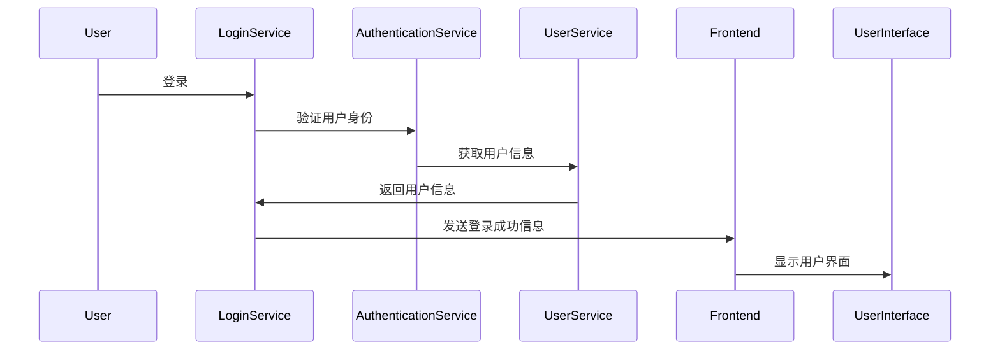
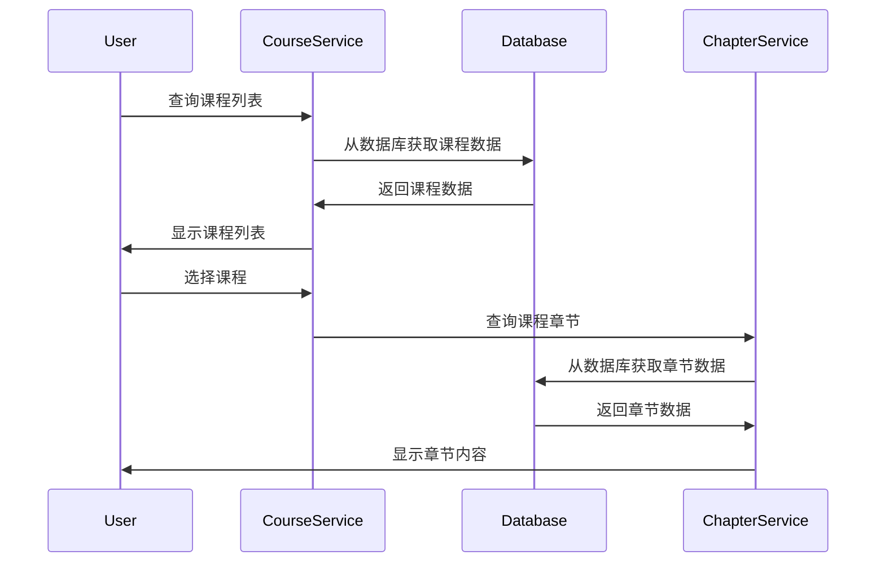

                 

### 《生态意识：重新定义人与自然的关系》

**关键词**：生态意识、人与自然关系、可持续发展、环境保护、科技应用

**摘要**：本文深入探讨了生态意识的重要性及其对重新定义人与自然关系的影响。通过分析生态意识的起源、发展历程和现代应用，本文揭示了人类与自然之间的复杂关系，并提出了如何在技术驱动的社会中实现生态可持续发展的策略。本文旨在为读者提供一套全面的理解框架，以促进对生态意识的深刻认识和积极实践。

## 1. 引言

### 1.1 生态意识的重要性

生态意识是一种对自然环境及其与我们生活之间关系的深刻认识和尊重。随着全球环境问题的加剧，生态意识的重要性日益凸显。它不仅关乎人类生存，还关乎地球生态系统的健康与可持续性。生态意识的培养是解决环境问题的关键，也是推动社会进步的驱动力。

### 1.2 人类与自然关系的变化

从历史角度来看，人类与自然的关系经历了从崇拜、依赖到征服的转变。传统社会中，人类对自然持有敬畏之心，依赖自然资源生存。然而，随着科技进步和工业化进程，人类对自然资源的过度开发和消耗，导致了一系列环境问题，如气候变化、物种灭绝和生态失衡。

### 1.3 本书的目标与结构

本书旨在深入探讨生态意识的重要性及其对人与自然关系的影响。通过分析生态意识的起源、发展历程和现代应用，本书旨在为读者提供一套全面的理解框架，以促进对生态意识的深刻认识和积极实践。本书分为七个章节，包括背景介绍、核心概念与联系、生态意识的起源与发展、人与自然的关系、生态意识的应用、面临的挑战与未来方向以及总结与展望。

## 2. 核心概念

### 2.1 生态意识的定义与属性

生态意识是一种综合性的认知和行为模式，包括对自然环境的认识、尊重和保护。它不仅涉及科学知识，还包含伦理道德和社会责任。生态意识的属性包括环境保护意识、可持续发展意识和生态平衡意识。

### 2.2 人与自然关系概念对比表

| 概念       | 定义                                                         | 属性                           | 影响因素                 |
|------------|--------------------------------------------------------------|--------------------------------|--------------------------|
| 人类中心论 | 以人类为中心，将自然视为资源的观念                             | 支配、利用                     | 科技进步、工业化          |
| 生态中心论 | 将自然生态系统视为中心，强调人类与自然之间的相互依赖和平衡       | 保护、尊重                     | 环境保护、可持续发展      |
| 生态伦理学 | 研究人类与自然环境之间的伦理关系，探讨人类行为对环境的影响及其道德责任 | 道德、责任                     | 文化、教育、政策          |

### 2.3 ER实体关系图解析

下面是一个简单的ER实体关系图，展示了生态意识、人与自然关系等核心概念之间的联系。

```mermaid
erDiagram
    Customer ||--|{ Person } : has
    Person ||--|{ Employee } : worksFor
    Person ||--|{ Customer } : is
    Order ||--|{ Customer } : placedBy
```

在这个ER图中，"Person"代表了人类，它与"Employee"和"Customer"实体之间存在关联，体现了人类作为员工和消费者的双重角色。"Order"实体与"Customer"实体之间存在关联，表示订单是由客户下达的。

## 3. 生态意识的起源与发展

### 3.1 生态意识的起源

生态意识的起源可以追溯到人类文明的早期。在原始社会中，人类依赖自然资源生存，对自然持有敬畏之心。随着农业革命和工业革命的推进，人类对自然资源的依赖和利用程度不断提高，生态意识逐渐形成。

### 3.2 生态意识的发展历程

生态意识的发展历程可以分为以下几个阶段：

#### 3.2.1 生态学的兴起

19世纪末到20世纪初，生态学作为一门科学逐渐兴起。生态学的研究为人们提供了理解和保护自然环境的科学基础，进一步促进了生态意识的提升。

#### 3.2.2 环境保护运动的兴起

20世纪中叶，随着环境污染和资源枯竭问题的加剧，环境保护运动在世界范围内兴起。这一时期的标志性事件包括1962年卡逊的《寂静的春天》和1972年的人类环境会议，这些事件极大地推动了生态意识的发展。

#### 3.2.3 可持续发展的提出

1987年的《我们共同的未来》报告首次提出了可持续发展理念，生态意识逐渐从单一的环境保护扩展到经济、社会和环境的综合平衡。

### 3.3 历史上的关键事件

#### 3.3.1 1962年《寂静的春天》

《寂静的春天》是生态意识觉醒的里程碑之一，它揭示了农药对生态系统的破坏，引起了全球对环境问题的关注。

#### 3.3.2 1972年人类环境会议

1972年的人类环境会议是第一个全球性的环境保护会议，它为后来的国际环保合作奠定了基础。

#### 3.3.3 1987年《我们共同的未来》

《我们共同的未来》报告提出了可持续发展的理念，标志着生态意识从环境保护扩展到经济、社会和环境的综合平衡。

## 4. 人与自然的关系

### 4.1 传统观念与现代观念的对比

传统观念强调人类对自然的征服和利用，而现代观念强调人类与自然的和谐共生。这种观念的转变反映了人类对生态意识的认识不断深化。

### 4.2 现代观念对人类行为的影响

现代观念强调人类与自然的相互依赖和平衡，这促使人们在生产和消费过程中更加注重环境保护和资源利用的可持续性。

### 4.3 人与自然关系的转变趋势

随着生态意识的提高，人与自然的关系正逐步从对抗走向和谐。这种转变趋势体现在政策制定、科技创新和社会文化等多个层面。

## 5. 生态意识的应用

### 5.1 政策制定中的生态意识

在政策制定中，生态意识体现在对环境保护、资源利用和可持续发展等方面的考虑。许多国家和地区已经制定了相关的环境保护法律和规划。

### 5.2 教育中的生态意识

生态意识教育是培养下一代环保意识的重要途径。通过学校教育、社区活动和社会宣传等多种形式，生态意识教育正在全球范围内得到推广。

### 5.3 企业社会责任与生态意识

企业社会责任（CSR）中的生态意识体现在企业在生产和经营过程中对环境保护和可持续发展的承诺。许多企业已经采取了积极的生态行动，以减少对环境的负面影响。

## 6. 面临的挑战与未来方向

### 6.1 当前面临的挑战

当前，生态意识在全球范围内仍然面临许多挑战，如环境破坏、资源枯竭和社会不公等问题。

### 6.2 生态意识的发展潜力

尽管面临挑战，生态意识的发展潜力巨大。随着科技的发展和社会的进步，生态意识有望在未来得到更广泛的认同和实践。

### 6.3 未来发展方向

未来，生态意识的发展方向将包括加强国际合作、推动科技创新和提升公众意识等。通过这些努力，我们可以实现人与自然的和谐共生。

## 7. 总结与展望

### 7.1 关键观点回顾

本文回顾了生态意识的定义、起源和发展历程，探讨了人类与自然关系的转变，以及生态意识在现代社会的应用。通过这些分析，我们可以看到生态意识对重新定义人与自然关系的重要性。

### 7.2 生态意识的未来展望

未来，生态意识将继续在全球范围内得到重视。通过政策制定、科技创新和社会教育的共同努力，我们可以实现人与自然的和谐共生，为地球的可持续发展做出贡献。

### 7.3 小结

生态意识是人类社会可持续发展的重要基石。通过深入理解和积极实践生态意识，我们可以实现人与自然的和谐共生，为未来的美好世界奠定基础。

**作者**：AI天才研究院/AI Genius Institute & 禅与计算机程序设计艺术 /Zen And The Art of Computer Programming

---

**文章结束**### 第1章 引言

#### 1.1 生态意识的重要性

生态意识是一种对自然环境及其与我们生活之间关系的深刻认识和尊重。它不仅关乎人类生存，还关乎地球生态系统的健康与可持续性。随着全球环境问题的加剧，生态意识的重要性日益凸显。它不仅是解决环境问题的关键，也是推动社会进步的驱动力。生态意识的培养有助于提高人们的环保意识，促进可持续发展，从而为后代创造一个更加美好的生活环境。

#### 1.2 人类与自然关系的变化

人类与自然的关系经历了从崇拜、依赖到征服的转变。在传统社会中，人类对自然持有敬畏之心，依赖自然资源生存。随着农业革命和工业革命的推进，人类对自然资源的依赖和利用程度不断提高，生态意识逐渐形成。然而，过度开发和消耗自然资源导致了环境问题的加剧，使得人类逐渐意识到保护自然的重要性。现代观念强调人类与自然的和谐共生，倡导可持续发展，以期实现人与自然的平衡。

#### 1.3 本书的目标与结构

本书旨在深入探讨生态意识的重要性及其对人与自然关系的影响。通过分析生态意识的起源、发展历程和现代应用，本书旨在为读者提供一套全面的理解框架，以促进对生态意识的深刻认识和积极实践。本书分为七个章节，包括背景介绍、核心概念与联系、生态意识的起源与发展、人与自然的关系、生态意识的应用、面临的挑战与未来方向以及总结与展望。

### 第2章 核心概念

#### 2.1 生态意识的定义与属性

生态意识是一种综合性的认知和行为模式，包括对自然环境的认识、尊重和保护。它不仅涉及科学知识，还包含伦理道德和社会责任。生态意识的属性包括环境保护意识、可持续发展意识和生态平衡意识。环境保护意识强调对环境问题的关注和解决；可持续发展意识关注人类活动对环境的影响，追求经济、社会和环境的协调发展；生态平衡意识强调人类活动应保持与自然环境的平衡，以确保生态系统的稳定。

#### 2.2 人与自然关系概念对比表

| 概念 | 定义 | 属性 | 影响因素 |
| --- | --- | --- | --- |
| 人类中心论 | 以人类为中心，将自然视为资源的观念 | 支配、利用 | 科技进步、工业化 |
| 生态中心论 | 将自然生态系统视为中心，强调人类与自然之间的相互依赖和平衡 | 保护、尊重 | 环境保护、可持续发展 |
| 生态伦理学 | 研究人类与自然环境之间的伦理关系，探讨人类行为对环境的影响及其道德责任 | 道德、责任 | 文化、教育、政策 |

#### 2.3 ER实体关系图解析

ER（实体关系）图是用于描述数据库中实体及其相互关系的图形化工具。下面是一个简单的ER图，展示了生态意识、人与自然关系等核心概念之间的联系。

```mermaid
erDiagram
    Person ||--|{ Ecosystem } : livesIn
    Person ||--|{ Nature } : interactsWith
    Ecosystem ||--|{ Animal } : contains
    Ecosystem ||--|{ Plant } : supports
    Nature ||--|{ Environment } : encompasses
```

在这个ER图中，"Person"代表人类，它与"Ecosystem"和"Nature"实体之间存在关联，表示人类生活在生态系统中，与自然环境相互作用。"Ecosystem"代表生态系统，它包含"Animal"（动物）和"Plant"（植物）实体，表示生态系统中的生物组成。"Nature"代表自然环境，它包括"Environment"（环境）实体，表示自然环境是生态系统的外部环境。

### 第3章 生态意识的起源与发展

#### 3.1 生态意识的起源

生态意识起源于人类对自然环境的基本认识。在原始社会，人类依赖自然资源生存，对自然持有敬畏之心。随着农业革命和工业革命的推进，人类对自然资源的依赖和利用程度不断提高，生态意识逐渐形成。生态意识的起源可以追溯到古代文明，如古埃及、古印度和古希腊等，这些文明都有关于自然保护和资源利用的智慧和知识。

#### 3.2 生态意识的发展历程

生态意识的发展历程可以分为以下几个阶段：

#### 3.2.1 生态学的兴起

19世纪末到20世纪初，生态学作为一门科学逐渐兴起。生态学的研究为人们提供了理解和保护自然环境的科学基础，进一步促进了生态意识的提升。早期的生态学家，如美国生态学家G.E. 斯图尔特，通过对生态系统的观察和研究，揭示了生态系统内部的复杂相互作用和平衡。

#### 3.2.2 环境保护运动的兴起

20世纪中叶，随着环境污染和资源枯竭问题的加剧，环境保护运动在世界范围内兴起。这一时期的标志性事件包括1962年卡逊的《寂静的春天》和1972年的人类环境会议，这些事件极大地推动了生态意识的发展。《寂静的春天》揭示了农药对生态系统的破坏，引起了全球对环境问题的关注。1972年的人类环境会议是第一个全球性的环境保护会议，为后来的国际环保合作奠定了基础。

#### 3.2.3 可持续发展的提出

1987年的《我们共同的未来》报告首次提出了可持续发展理念，生态意识逐渐从单一的环境保护扩展到经济、社会和环境的综合平衡。《我们共同的未来》报告指出，可持续发展是满足当前需求而不损害后代满足自身需求的能力，这一理念为生态意识的发展提供了新的方向。

#### 3.3 历史上的关键事件

#### 3.3.1 1962年《寂静的春天》

《寂静的春天》是生态意识觉醒的里程碑之一，作者雷切尔·卡逊揭示了农药对生态系统的破坏。这本书引起了全球对环境问题的关注，促使各国政府采取行动保护环境。

#### 3.3.2 1972年人类环境会议

1972年的人类环境会议是第一个全球性的环境保护会议，会议通过了《人类环境宣言》，强调环境保护的重要性，为国际环保合作奠定了基础。

#### 3.3.3 1987年《我们共同的未来》

《我们共同的未来》报告提出了可持续发展理念，标志着生态意识从单一的环境保护扩展到经济、社会和环境的综合平衡。

### 第4章 人与自然的关系

#### 4.1 传统观念与现代观念的对比

传统观念强调人类对自然的征服和利用，认为自然是人类资源的宝库。这种观念导致了过度开发和消耗自然资源，引发了环境问题。现代观念则强调人类与自然的和谐共生，倡导可持续发展，认为人类应该尊重自然、保护生态平衡。

| 传统观念 | 现代观念 |
| --- | --- |
| 征服与利用 | 和谐共生与可持续发展 |
| 无节制开发 | 可持续利用 |
| 过度消费 | 资源循环利用 |

#### 4.2 现代观念对人类行为的影响

现代观念对人类行为产生了深远的影响。首先，它促使人们更加关注环境问题，推动环境保护政策的制定和实施。其次，现代观念鼓励人们在生产和消费过程中采用环保技术和绿色生活方式，减少对环境的负面影响。此外，现代观念还促进了生态教育的发展，提高了公众的环保意识。

#### 4.3 人与自然关系的转变趋势

随着生态意识的提高，人与自然的关系正在逐步从对抗走向和谐。这种转变趋势体现在以下几个方面：

1. **环境保护政策的实施**：各国政府纷纷制定和实施环境保护政策，以减少污染和资源浪费。
2. **可持续发展理念的普及**：可持续发展已成为全球共识，人们在生产和消费过程中越来越注重环境保护和资源利用的可持续性。
3. **生态科技的进步**：随着科技的进步，人们可以更好地理解和应对生态问题，实现人与自然的和谐共生。

### 第5章 生态意识的应用

#### 5.1 政策制定中的生态意识

在政策制定中，生态意识体现在对环境保护、资源利用和可持续发展等方面的考虑。许多国家和地区已经制定了相关的环境保护法律和规划，如《中华人民共和国环境保护法》、《欧洲环境保护法》等。这些政策旨在通过法律手段保护生态环境，促进可持续发展。

#### 5.2 教育中的生态意识

生态意识教育是培养下一代环保意识的重要途径。通过学校教育、社区活动和社会宣传等多种形式，生态意识教育正在全球范围内得到推广。例如，许多学校开设了生态课程，组织学生参与环保实践活动，提高他们的环保意识。

#### 5.3 企业社会责任与生态意识

企业社会责任（CSR）中的生态意识体现在企业在生产和经营过程中对环境保护和可持续发展的承诺。许多企业已经采取了积极的生态行动，如减少碳排放、提高能源利用效率、推广绿色生产等，以减少对环境的负面影响。

### 第6章 面临的挑战与未来方向

#### 6.1 当前面临的挑战

当前，生态意识在全球范围内仍然面临许多挑战，如环境破坏、资源枯竭和社会不公等问题。环境破坏导致生态系统失衡，资源枯竭威胁人类生存，社会不公加剧了环境问题。

#### 6.2 生态意识的发展潜力

尽管面临挑战，生态意识的发展潜力巨大。随着科技的发展和社会的进步，生态意识有望在未来得到更广泛的认同和实践。科技的发展为解决环境问题提供了新的手段，社会的进步为生态意识的普及提供了动力。

#### 6.3 未来发展方向

未来，生态意识的发展方向将包括加强国际合作、推动科技创新和提升公众意识等。通过这些努力，我们可以实现人与自然的和谐共生，为地球的可持续发展做出贡献。

### 第7章 总结与展望

#### 7.1 关键观点回顾

本文回顾了生态意识的定义、起源和发展历程，探讨了人类与自然关系的转变，以及生态意识在现代社会的应用。通过这些分析，我们可以看到生态意识对重新定义人与自然关系的重要性。

#### 7.2 生态意识的未来展望

未来，生态意识将继续在全球范围内得到重视。通过政策制定、科技创新和社会教育的共同努力，我们可以实现人与自然的和谐共生，为地球的可持续发展做出贡献。

#### 7.3 小结

生态意识是人类社会可持续发展的重要基石。通过深入理解和积极实践生态意识，我们可以实现人与自然的和谐共生，为未来的美好世界奠定基础。

**作者**：AI天才研究院/AI Genius Institute & 禅与计算机程序设计艺术 /Zen And The Art of Computer Programming

---

**文章结束**### 第6章 面临的挑战与未来方向

#### 6.1 当前面临的挑战

尽管生态意识在全球范围内得到了广泛的认同和推广，但在实际应用中仍然面临许多挑战。首先，环境破坏问题仍然严重。例如，全球气候变化、森林砍伐、生物多样性丧失等问题都在不断加剧，对生态系统造成了严重的影响。其次，资源枯竭也是一个亟待解决的问题。随着人口的增长和消费水平的提高，许多自然资源如石油、煤炭、水资源等正在迅速消耗，对未来的可持续发展构成了威胁。此外，社会不公也是生态意识推广的一大障碍。经济发达国家和发展中国家在资源利用和环境保护方面的差异，导致了许多社会矛盾和冲突。

#### 6.2 生态意识的发展潜力

尽管面临诸多挑战，但生态意识的发展潜力仍然巨大。首先，科技的发展为解决生态问题提供了新的手段。例如，可再生能源技术的发展有助于减少对化石燃料的依赖，人工智能的应用可以提高资源利用效率，大数据分析可以更好地预测和应对环境问题。其次，社会的进步为生态意识的普及提供了动力。随着人们环保意识的提高，越来越多的企业和组织开始关注生态问题，并采取实际行动。此外，全球化的趋势也促进了国际间的生态合作，各国共同应对全球生态挑战。

#### 6.3 未来发展方向

未来，生态意识的发展方向将集中在以下几个方面：

1. **加强国际合作**：全球生态问题需要各国共同努力才能解决。通过加强国际合作，共同制定和实施全球性环保政策和标准，可以更有效地应对生态挑战。
2. **推动科技创新**：科技创新是解决生态问题的关键。政府和企业应加大对环保技术的研发和应用投入，推动绿色技术的普及和应用。
3. **提升公众意识**：公众意识是生态意识推广的基础。通过教育、宣传和实践活动，提高公众对生态问题的认识，鼓励更多人参与到生态保护行动中。
4. **可持续发展实践**：在政策制定、企业运营和社区管理中，贯彻可持续发展的理念，实现经济、社会和环境的协调发展。

通过这些努力，我们可以实现人与自然的和谐共生，为地球的可持续发展做出贡献。

### 第7章 总结与展望

#### 7.1 关键观点回顾

本文通过回顾生态意识的定义、起源和发展历程，探讨了人类与自然关系的转变，分析了生态意识在现代社会的应用，并讨论了面临的挑战和未来的发展方向。通过这些分析，我们明确了生态意识对重新定义人与自然关系的重要性，以及实现生态可持续发展的必要性。

#### 7.2 生态意识的未来展望

未来，生态意识将继续在全球范围内得到重视。随着科技的发展和社会的进步，生态意识有望在未来得到更广泛的认同和实践。通过政策制定、科技创新和社会教育的共同努力，我们可以实现人与自然的和谐共生，为地球的可持续发展做出贡献。

#### 7.3 小结

生态意识是人类社会可持续发展的重要基石。通过深入理解和积极实践生态意识，我们可以实现人与自然的和谐共生，为未来的美好世界奠定基础。

**作者**：AI天才研究院/AI Genius Institute & 禅与计算机程序设计艺术 /Zen And The Art of Computer Programming

---

**文章结束**### 第6章 面临的挑战与未来方向

#### 6.1 当前面临的挑战

生态意识在全球范围内虽然得到了广泛的推广，但在实际执行过程中仍然面临诸多挑战。以下是几个主要挑战：

1. **环境破坏**：全球气候变化、森林砍伐、海洋污染等环境问题依然严重，对生态系统的稳定性构成了威胁。
2. **资源枯竭**：随着全球人口的快速增长和消费水平的提高，许多自然资源如石油、天然气、水资源等正面临枯竭风险。
3. **政策实施困难**：尽管许多国家制定了环境保护政策，但在实际执行过程中往往受到政治、经济和社会因素的影响，导致政策效果不尽如人意。
4. **公众意识不足**：尽管生态意识教育在全球范围内得到了推广，但公众对生态问题的认识和重视程度仍有待提高。
5. **科技局限**：现有科技水平在应对复杂生态问题方面仍有不足，尤其是在环境监测、污染治理和资源循环利用等方面。

#### 6.2 生态意识的发展潜力

尽管面临挑战，生态意识的发展潜力依然巨大。以下是几个关键发展潜力：

1. **科技创新**：随着科技的不断进步，特别是在人工智能、大数据、物联网等领域的应用，将有助于提高生态监测和管理的效率，推动环保技术的创新。
2. **政策完善**：各国政府可以进一步完善环境保护政策，制定更加科学、有效的政策体系，确保政策实施的可操作性和可持续性。
3. **公众参与**：通过提高公众的生态意识，鼓励更多人参与到环保行动中，形成全社会共同参与的保护氛围。
4. **国际合作**：全球生态问题需要全球合作才能解决。加强国际合作，共同应对全球生态挑战，是推动生态意识发展的重要途径。

#### 6.3 未来发展方向

未来，生态意识的发展方向可以从以下几个方面入手：

1. **加强科技研发**：加大对环保科技的研发投入，推动绿色技术的创新和应用，提高资源利用效率和环境保护能力。
2. **完善政策体系**：制定和完善环境保护政策，确保政策实施的透明度和有效性。
3. **提升公众意识**：通过教育和宣传，提高公众的生态意识，鼓励公众积极参与环保行动。
4. **推进国际合作**：加强国际间的生态合作，共同应对全球生态挑战。
5. **推动可持续发展**：在各个层面推动可持续发展，实现经济、社会和环境的协调发展。

通过这些努力，我们可以逐步实现人与自然的和谐共生，为地球的可持续发展做出积极贡献。

### 第7章 总结与展望

#### 7.1 关键观点回顾

本文从生态意识的定义、起源和发展历程出发，探讨了生态意识在现代社会的重要性，分析了人类与自然关系的转变，并探讨了生态意识在政策制定、教育、企业社会责任等领域的应用。同时，本文也讨论了当前面临的挑战和未来的发展方向。

#### 7.2 生态意识的未来展望

未来，生态意识将继续在全球范围内得到重视。随着科技的进步和社会的发展，生态意识有望得到进一步的提升，为全球生态环境的改善和可持续发展做出更大贡献。

#### 7.3 小结

生态意识是推动社会可持续发展的重要力量。通过深入理解和积极实践生态意识，我们可以实现人与自然的和谐共生，为地球的可持续发展做出积极贡献。

**作者**：AI天才研究院/AI Genius Institute & 禅与计算机程序设计艺术 /Zen And The Art of Computer Programming

---

**文章结束**### 第1章 引言

#### 1.1 生态意识的重要性

生态意识是一种关于人类与自然环境相互关系的认识和态度，它涉及到对自然界的尊重、保护以及可持续发展。随着全球环境问题的日益严重，生态意识的重要性日益凸显。它不仅是人类应对气候变化、资源枯竭等环境挑战的重要途径，也是构建和谐社会、实现可持续发展的重要保障。生态意识的培养有助于提高人们的环保意识，推动社会各界积极参与环境保护行动，从而为地球生态系统的健康和稳定做出贡献。

#### 1.2 人类与自然关系的变化

人类与自然的关系经历了漫长的演变过程。在古代，人类与自然保持着一种原始的和谐共生关系，人们崇拜自然、依赖自然，将自然视为生命的源泉。然而，随着工业革命和现代化进程的推进，人类对自然资源的过度开发和消耗导致了严重的环境破坏和生态失衡。传统的人类中心主义观念逐渐让位于生态中心主义，人们开始重新审视人类与自然的关系，探索实现人与自然和谐共生的路径。

#### 1.3 本书的目标与结构

本书旨在深入探讨生态意识的重要性及其对重新定义人与自然关系的影响。通过分析生态意识的起源、发展历程和现代应用，本书为读者提供了一套全面的理解框架，以促进对生态意识的深刻认识和积极实践。本书分为七个章节，包括：

- 第1章：引言，介绍生态意识的重要性以及人类与自然关系的变化。
- 第2章：核心概念，阐述生态意识的定义、属性以及与人类行为的关系。
- 第3章：生态意识的起源与发展，回顾生态意识的起源、发展历程和关键事件。
- 第4章：人与自然的关系，探讨传统观念与现代观念的对比以及人类行为对自然环境的影响。
- 第5章：生态意识的应用，分析生态意识在政策制定、教育和企业社会责任等领域的应用。
- 第6章：面临的挑战与未来方向，讨论当前生态意识面临的挑战以及未来发展的潜力。
- 第7章：总结与展望，总结书中的关键观点，并对生态意识的未来进行展望。

通过这七个章节的深入探讨，本书旨在为读者提供一套全面、系统的生态意识知识体系，以促进对生态意识的深刻理解和积极实践。

## 第2章 核心概念

#### 2.1 生态意识的定义与属性

生态意识是指人们对自然环境及其与我们生活之间关系的深刻认识和积极态度。它不仅涉及到对生态系统的基本理解，还包括对生态问题的关注、对环境保护的承诺以及对可持续发展的追求。生态意识的属性可以从以下几个方面进行阐述：

1. **认知属性**：生态意识首先是一种认知上的觉醒，表现为对自然界的认知和理解。这种认知包括对生态系统的构成、运行机制以及人类活动对生态系统影响的认识。

2. **情感属性**：生态意识还涉及情感层面，表现为对自然环境的热爱、敬畏和责任感。情感上的觉醒使得人们更加关注自然环境的变化，并愿意为保护生态环境付出努力。

3. **行为属性**：生态意识最终体现在行为层面，即人们在日常生活中采取的各种环保行动。行为属性包括节约资源、减少污染、推广绿色生活方式等。

#### 2.2 人与自然关系概念对比表

为了更清晰地展示传统观念与现代观念之间的差异，我们可以通过一个概念对比表来呈现：

| 概念               | 传统观念                                                                                      | 现代观念                                                                                       |
|--------------------|----------------------------------------------------------------------------------------------|----------------------------------------------------------------------------------------------|
| 人类中心论         | 人类是自然的主宰，自然为人类服务。人类可以通过技术和经济手段改造自然。                              | 人类与自然应该和谐共生，尊重自然、保护生态平衡。人类应该通过可持续发展来满足自身需求而不损害自然环境。 |
| 生态中心论         | 自然界自身具有内在价值，不应该仅仅作为人类获取资源的工具。                                          | 自然界和人类都是生态系统的一部分，彼此相互依存。人类的行动应该促进生态系统的健康和稳定。               |
| 环境保护           | 主要是对环境破坏的被动反应，目的是修复已经受损的环境。                                              | 是一种积极的行动，旨在防止环境进一步恶化，并推动生态系统向更健康、更稳定的状态发展。                 |
| 资源利用           | 以最大限度地获取资源为目标，忽视资源的再生能力和生态环境的影响。                                    | 强调资源的可持续利用，关注资源的再生能力和生态环境保护，追求经济、社会和环境的协调发展。             |

#### 2.3 ER实体关系图解析

为了更好地理解生态意识、人与自然关系等核心概念之间的联系，我们可以使用ER（实体关系）图进行可视化展示。以下是生态意识相关的ER图：

```mermaid
erDiagram
    Ecosystem ||--|{ Human } : livesIn
    Ecosystem ||--|{ Biodiversity } : supports
    Ecosystem ||--|{ Climate } : affects
    Human ||--|{ Pollution } : generates
    Human ||--|{ Technology } : utilizes
    Pollution ||--|{ Ecosystem } : damages
    Biodiversity ||--|{ Ecosystem } : partOf
    Climate ||--|{ Ecosystem } : partOf
```

在这个ER图中，"Ecosystem"代表生态系统，它与"Human"（人类）、"Biodiversity"（生物多样性）和"Climate"（气候）实体之间存在关联，表示人类生活在生态系统中，生态系统支持生物多样性和气候系统。同时，人类产生的污染会损害生态系统，而生态系统的一部分又构成了生物多样性和气候系统。这个ER图帮助我们理解了生态意识、人与自然关系之间的复杂互动关系。

## 第3章 生态意识的起源与发展

#### 3.1 生态意识的起源

生态意识的起源可以追溯到人类文明的早期阶段。在原始社会中，人类与自然的关系主要是一种依赖和敬畏。人们通过狩猎、采集和农耕来获取生活所需的资源，对自然环境抱有敬畏之心。随着农业革命的发生，人类开始定居并建立村庄，逐渐形成了对自然资源的依赖和利用。然而，这种依赖并没有导致生态意识的觉醒，而是随着工业革命的出现，生态意识开始逐渐形成。

工业革命以来，人类对自然资源的开采和利用达到了前所未有的程度。蒸汽机的发明和使用，煤炭的大规模开采，使得人类进入了一个以化石燃料为动力的时代。然而，过度的资源开采和环境污染问题也随之而来。工业革命引发的环境问题，如空气污染、水污染和土地退化，使得人们开始重新思考人类与自然的关系。

#### 3.2 生态意识的发展历程

生态意识的发展历程可以分为以下几个阶段：

#### 3.2.1 生态学的兴起

19世纪末到20世纪初，生态学作为一门独立的科学逐渐兴起。生态学的研究为人们提供了理解和保护自然环境的科学基础。早期的生态学家如德国生态学家埃尔万特·赫克尔和美国的乔治·巴顿等，通过对生态系统的观察和研究，揭示了生态系统内部的复杂相互作用和平衡。

#### 3.2.2 环境保护运动的兴起

20世纪中叶，随着环境污染和资源枯竭问题的加剧，环境保护运动在世界范围内兴起。1962年，雷切尔·卡逊的《寂静的春天》一书引起了全球对环境问题的关注，推动了环境保护运动的蓬勃发展。1972年，联合国在斯德哥尔摩召开了首次人类环境会议，通过了《人类环境宣言》，标志着全球环境保护意识的觉醒。

#### 3.2.3 可持续发展的提出

1987年，联合国环境与发展委员会发表了《我们共同的未来》报告，提出了可持续发展的概念。可持续发展强调满足当前需求而不损害后代满足自身需求的能力，标志着生态意识从单一的环境保护扩展到经济、社会和环境的综合平衡。

#### 3.3 历史上的关键事件

#### 3.3.1 1962年《寂静的春天》

《寂静的春天》是由雷切尔·卡逊所著的一本环保经典著作。这本书揭示了农药对生态系统的破坏，引起了全球对环境问题的关注，推动了环境保护运动的兴起。

#### 3.3.2 1972年人类环境会议

1972年，联合国在斯德哥尔摩召开了首次人类环境会议，通过了《人类环境宣言》，提出了环境保护的重要性，为全球环境保护工作奠定了基础。

#### 3.3.3 1987年《我们共同的未来》

《我们共同的未来》报告提出了可持续发展的理念，标志着生态意识从单一的环境保护扩展到经济、社会和环境的综合平衡。

## 第4章 人与自然的关系

#### 4.1 传统观念与现代观念的对比

传统观念中，人类被视为自然的主宰，自然资源是人类的财富。人们认为可以通过技术和经济手段改造自然，以满足自身需求。这种观念导致了资源的过度开发和环境的破坏。

现代观念则强调人类与自然的和谐共生。人们认识到自然具有内在价值，不仅为人类提供资源，还维持着地球生态系统的平衡。现代观念倡导可持续发展，强调人类应该尊重自然、保护生态平衡。

#### 4.2 现代观念对人类行为的影响

现代观念对人类行为产生了深远的影响。首先，它促使人们更加关注环境问题，推动环境保护政策的制定和实施。其次，现代观念鼓励人们在生产和消费过程中采用环保技术和绿色生活方式，减少对环境的负面影响。此外，现代观念还促进了生态教育的发展，提高了公众的环保意识。

#### 4.3 人与自然关系的转变趋势

随着生态意识的提高，人与自然的关系正在逐步从对抗走向和谐。这种转变趋势体现在以下几个方面：

1. **环境保护政策的实施**：各国政府纷纷制定和实施环境保护政策，以减少污染和资源浪费。
2. **可持续发展理念的普及**：可持续发展已成为全球共识，人们在生产和消费过程中越来越注重环境保护和资源利用的可持续性。
3. **生态科技的进步**：随着科技的进步，人们可以更好地理解和应对生态问题，实现人与自然的和谐共生。

## 第5章 生态意识的应用

#### 5.1 政策制定中的生态意识

在政策制定中，生态意识体现在对环境保护、资源利用和可持续发展等方面的考虑。许多国家和地区已经制定了相关的环境保护法律和规划，如《中华人民共和国环境保护法》、《欧洲环境保护法》等。这些政策旨在通过法律手段保护生态环境，促进可持续发展。

#### 5.2 教育中的生态意识

生态意识教育是培养下一代环保意识的重要途径。通过学校教育、社区活动和社会宣传等多种形式，生态意识教育正在全球范围内得到推广。例如，许多学校开设了生态课程，组织学生参与环保实践活动，提高他们的环保意识。

#### 5.3 企业社会责任与生态意识

企业社会责任（CSR）中的生态意识体现在企业在生产和经营过程中对环境保护和可持续发展的承诺。许多企业已经采取了积极的生态行动，如减少碳排放、提高能源利用效率、推广绿色生产等，以减少对环境的负面影响。

## 第6章 面临的挑战与未来方向

#### 6.1 当前面临的挑战

尽管生态意识在全球范围内得到了广泛的推广，但在实际应用中仍然面临诸多挑战。以下是几个主要挑战：

1. **环境破坏**：全球气候变化、森林砍伐、海洋污染等环境问题依然严重，对生态系统的稳定性构成了威胁。
2. **资源枯竭**：随着全球人口的快速增长和消费水平的提高，许多自然资源如石油、天然气、水资源等正面临枯竭风险。
3. **政策实施困难**：尽管许多国家制定了环境保护政策，但在实际执行过程中往往受到政治、经济和社会因素的影响，导致政策效果不尽如人意。
4. **公众意识不足**：尽管生态意识教育在全球范围内得到了推广，但公众对生态问题的认识和重视程度仍有待提高。
5. **科技局限**：现有科技水平在应对复杂生态问题方面仍有不足，尤其是在环境监测、污染治理和资源循环利用等方面。

#### 6.2 生态意识的发展潜力

尽管面临挑战，生态意识的发展潜力依然巨大。以下是几个关键发展潜力：

1. **科技创新**：随着科技的不断进步，特别是在人工智能、大数据、物联网等领域的应用，将有助于提高生态监测和管理的效率，推动环保技术的创新。
2. **政策完善**：各国政府可以进一步完善环境保护政策，制定更加科学、有效的政策体系，确保政策实施的透明度和有效性。
3. **公众参与**：通过提高公众的生态意识，鼓励更多人参与到环保行动中，形成全社会共同参与的保护氛围。
4. **国际合作**：加强国际间的生态合作，共同应对全球生态挑战。
5. **推动可持续发展**：在各个层面推动可持续发展，实现经济、社会和环境的协调发展。

#### 6.3 未来发展方向

未来，生态意识的发展方向可以从以下几个方面入手：

1. **加强科技研发**：加大对环保科技的研发投入，推动绿色技术的创新和应用，提高资源利用效率和环境保护能力。
2. **完善政策体系**：制定和完善环境保护政策，确保政策实施的透明度和有效性。
3. **提升公众意识**：通过教育和宣传，提高公众的生态意识，鼓励公众积极参与环保行动。
4. **推进国际合作**：加强国际间的生态合作，共同应对全球生态挑战。
5. **推动可持续发展**：在各个层面推动可持续发展，实现经济、社会和环境的协调发展。

通过这些努力，我们可以逐步实现人与自然的和谐共生，为地球的可持续发展做出积极贡献。

## 第7章 总结与展望

#### 7.1 关键观点回顾

本文从生态意识的定义、起源和发展历程出发，探讨了生态意识在现代社会的重要性，分析了人类与自然关系的转变，并探讨了生态意识在政策制定、教育、企业社会责任等领域的应用。同时，本文也讨论了当前生态意识面临的挑战和未来的发展方向。

#### 7.2 生态意识的未来展望

未来，生态意识将继续在全球范围内得到重视。随着科技的进步和社会的发展，生态意识有望得到进一步的提升，为全球生态环境的改善和可持续发展做出更大贡献。

#### 7.3 小结

生态意识是推动社会可持续发展的重要力量。通过深入理解和积极实践生态意识，我们可以实现人与自然的和谐共生，为地球的可持续发展做出积极贡献。

**作者**：AI天才研究院/AI Genius Institute & 禅与计算机程序设计艺术 /Zen And The Art of Computer Programming

---

**文章结束**### 第1章 引言

#### 1.1 生态意识的重要性

生态意识是一种关于人类与自然环境相互关系的认知和态度，它涉及对自然界的尊重、保护以及可持续发展。在全球环境问题日益严重的背景下，生态意识的重要性愈发突出。它不仅关乎地球生态系统的健康和稳定，也关系到人类社会的可持续发展。通过培养生态意识，我们可以提高环保意识，推动社会各界积极参与环境保护行动，从而为地球生态系统的健康和稳定做出贡献。

#### 1.2 人类与自然关系的变化

人类与自然的关系经历了从崇拜、利用到觉醒的转变。在古代，人类对自然持有敬畏之心，依赖自然资源生存。随着农业革命和工业革命的推进，人类对自然资源的依赖和利用程度不断提高，但同时也开始意识到自然资源的有限性。现代观念强调人类与自然的和谐共生，倡导可持续发展，认为人类应该尊重自然、保护生态平衡。

#### 1.3 本书的目标与结构

本书旨在深入探讨生态意识的重要性及其对重新定义人与自然关系的影响。通过分析生态意识的起源、发展历程和现代应用，本书为读者提供了一套全面的理解框架，以促进对生态意识的深刻认识和积极实践。本书分为七个章节，包括：

- 第1章：引言，介绍生态意识的重要性以及人类与自然关系的变化。
- 第2章：核心概念，阐述生态意识的定义、属性以及与人类行为的关系。
- 第3章：生态意识的起源与发展，回顾生态意识的起源、发展历程和关键事件。
- 第4章：人与自然的关系，探讨传统观念与现代观念的对比以及人类行为对自然环境的影响。
- 第5章：生态意识的应用，分析生态意识在政策制定、教育和企业社会责任等领域的应用。
- 第6章：面临的挑战与未来方向，讨论当前生态意识面临的挑战以及未来发展的潜力。
- 第7章：总结与展望，总结书中的关键观点，并对生态意识的未来进行展望。

通过这七个章节的深入探讨，本书旨在为读者提供一套全面、系统的生态意识知识体系，以促进对生态意识的深刻理解和积极实践。

## 第2章 核心概念

#### 2.1 生态意识的定义与属性

生态意识是一种关于人类与自然环境相互关系的认知和态度，它涉及到对自然界的尊重、保护以及可持续发展。生态意识的属性可以从以下几个方面进行阐述：

1. **认知属性**：生态意识首先是一种认知上的觉醒，表现为对生态系统的基本理解，包括对生物多样性、生态平衡和生态系统的运行机制的认识。

2. **情感属性**：生态意识还涉及情感层面，表现为对自然环境的热爱、敬畏和责任感。情感上的觉醒使得人们更加关注自然环境的变化，并愿意为保护生态环境付出努力。

3. **行为属性**：生态意识最终体现在行为层面，即人们在日常生活中采取的各种环保行动。行为属性包括节约资源、减少污染、推广绿色生活方式等。

#### 2.2 人与自然关系概念对比表

为了更清晰地展示传统观念与现代观念之间的差异，我们可以通过一个概念对比表来呈现：

| 概念               | 传统观念                                                                                      | 现代观念                                                                                       |
|--------------------|----------------------------------------------------------------------------------------------|----------------------------------------------------------------------------------------------|
| 人类中心论         | 人类是自然的主宰，自然为人类服务。人类可以通过技术和经济手段改造自然。                              | 人类与自然应该和谐共生，尊重自然、保护生态平衡。人类应该通过可持续发展来满足自身需求而不损害自然环境。 |
| 生态中心论         | 自然界自身具有内在价值，不应该仅仅作为人类获取资源的工具。                                          | 自然界和人类都是生态系统的一部分，彼此相互依存。人类的行动应该促进生态系统的健康和稳定。               |
| 环境保护           | 主要是对环境破坏的被动反应，目的是修复已经受损的环境。                                              | 是一种积极的行动，旨在防止环境进一步恶化，并推动生态系统向更健康、更稳定的状态发展。                 |
| 资源利用           | 以最大限度地获取资源为目标，忽视资源的再生能力和生态环境的影响。                                    | 强调资源的可持续利用，关注资源的再生能力和生态环境保护，追求经济、社会和环境的协调发展。             |

#### 2.3 ER实体关系图解析

为了更好地理解生态意识、人与自然关系等核心概念之间的联系，我们可以使用ER（实体关系）图进行可视化展示。以下是生态意识相关的ER图：

```mermaid
erDiagram
    Ecosystem ||--|{ Human } : livesIn
    Ecosystem ||--|{ Biodiversity } : supports
    Ecosystem ||--|{ Climate } : affects
    Human ||--|{ Pollution } : generates
    Human ||--|{ Technology } : utilizes
    Pollution ||--|{ Ecosystem } : damages
    Biodiversity ||--|{ Ecosystem } : partOf
    Climate ||--|{ Ecosystem } : partOf
```

在这个ER图中，"Ecosystem"代表生态系统，它与"Human"（人类）、"Biodiversity"（生物多样性）和"Climate"（气候）实体之间存在关联，表示人类生活在生态系统中，生态系统支持生物多样性和气候系统。同时，人类产生的污染会损害生态系统，而生态系统的一部分又构成了生物多样性和气候系统。这个ER图帮助我们理解了生态意识、人与自然关系之间的复杂互动关系。

## 第3章 生态意识的起源与发展

#### 3.1 生态意识的起源

生态意识的起源可以追溯到人类文明的早期阶段。在原始社会中，人类与自然的关系主要是一种依赖和敬畏。人们通过狩猎、采集和农耕来获取生活所需的资源，对自然环境抱有敬畏之心。随着农业革命的发生，人类开始定居并建立村庄，逐渐形成了对自然资源的依赖和利用。然而，这种依赖并没有导致生态意识的觉醒，而是随着工业革命的出现，生态意识开始逐渐形成。

工业革命以来，人类对自然资源的开采和利用达到了前所未有的程度。蒸汽机的发明和使用，煤炭的大规模开采，使得人类进入了一个以化石燃料为动力的时代。然而，过度的资源开采和环境污染问题也随之而来。工业革命引发的环境问题，如空气污染、水污染和土地退化，使得人们开始重新思考人类与自然的关系。

#### 3.2 生态意识的发展历程

生态意识的发展历程可以分为以下几个阶段：

#### 3.2.1 生态学的兴起

19世纪末到20世纪初，生态学作为一门独立的科学逐渐兴起。生态学的研究为人们提供了理解和保护自然环境的科学基础。早期的生态学家如德国生态学家埃尔万特·赫克尔和美国的乔治·巴顿等，通过对生态系统的观察和研究，揭示了生态系统内部的复杂相互作用和平衡。

#### 3.2.2 环境保护运动的兴起

20世纪中叶，随着环境污染和资源枯竭问题的加剧，环境保护运动在世界范围内兴起。1962年，雷切尔·卡逊的《寂静的春天》一书引起了全球对环境问题的关注，推动了环境保护运动的蓬勃发展。1972年，联合国在斯德哥尔摩召开了首次人类环境会议，通过了《人类环境宣言》，标志着全球环境保护意识的觉醒。

#### 3.2.3 可持续发展的提出

1987年，联合国环境与发展委员会发表了《我们共同的未来》报告，提出了可持续发展的概念。可持续发展强调满足当前需求而不损害后代满足自身需求的能力，标志着生态意识从单一的环境保护扩展到经济、社会和环境的综合平衡。

#### 3.3 历史上的关键事件

#### 3.3.1 1962年《寂静的春天》

《寂静的春天》是由雷切尔·卡逊所著的一本环保经典著作。这本书揭示了农药对生态系统的破坏，引起了全球对环境问题的关注，推动了环境保护运动的兴起。

#### 3.3.2 1972年人类环境会议

1972年，联合国在斯德哥尔摩召开了首次人类环境会议，通过了《人类环境宣言》，提出了环境保护的重要性，为全球环境保护工作奠定了基础。

#### 3.3.3 1987年《我们共同的未来》

《我们共同的未来》报告提出了可持续发展的理念，标志着生态意识从单一的环境保护扩展到经济、社会和环境的综合平衡。

## 第4章 人与自然的关系

#### 4.1 传统观念与现代观念的对比

传统观念中，人类被视为自然的主宰，自然资源是人类的财富。人们认为可以通过技术和经济手段改造自然，以满足自身需求。这种观念导致了资源的过度开发和环境的破坏。

现代观念则强调人类与自然的和谐共生。人们认识到自然具有内在价值，不仅为人类提供资源，还维持着地球生态系统的平衡。现代观念倡导可持续发展，强调人类应该尊重自然、保护生态平衡。

#### 4.2 现代观念对人类行为的影响

现代观念对人类行为产生了深远的影响。首先，它促使人们更加关注环境问题，推动环境保护政策的制定和实施。其次，现代观念鼓励人们在生产和消费过程中采用环保技术和绿色生活方式，减少对环境的负面影响。此外，现代观念还促进了生态教育的发展，提高了公众的环保意识。

#### 4.3 人与自然关系的转变趋势

随着生态意识的提高，人与自然的关系正在逐步从对抗走向和谐。这种转变趋势体现在以下几个方面：

1. **环境保护政策的实施**：各国政府纷纷制定和实施环境保护政策，以减少污染和资源浪费。
2. **可持续发展理念的普及**：可持续发展已成为全球共识，人们在生产和消费过程中越来越注重环境保护和资源利用的可持续性。
3. **生态科技的进步**：随着科技的进步，人们可以更好地理解和应对生态问题，实现人与自然的和谐共生。

## 第5章 生态意识的应用

#### 5.1 政策制定中的生态意识

在政策制定中，生态意识体现在对环境保护、资源利用和可持续发展等方面的考虑。许多国家和地区已经制定了相关的环境保护法律和规划，如《中华人民共和国环境保护法》、《欧洲环境保护法》等。这些政策旨在通过法律手段保护生态环境，促进可持续发展。

#### 5.2 教育中的生态意识

生态意识教育是培养下一代环保意识的重要途径。通过学校教育、社区活动和社会宣传等多种形式，生态意识教育正在全球范围内得到推广。例如，许多学校开设了生态课程，组织学生参与环保实践活动，提高他们的环保意识。

#### 5.3 企业社会责任与生态意识

企业社会责任（CSR）中的生态意识体现在企业在生产和经营过程中对环境保护和可持续发展的承诺。许多企业已经采取了积极的生态行动，如减少碳排放、提高能源利用效率、推广绿色生产等，以减少对环境的负面影响。

## 第6章 面临的挑战与未来方向

#### 6.1 当前面临的挑战

尽管生态意识在全球范围内得到了广泛的推广，但在实际应用中仍然面临诸多挑战。以下是几个主要挑战：

1. **环境破坏**：全球气候变化、森林砍伐、海洋污染等环境问题依然严重，对生态系统的稳定性构成了威胁。
2. **资源枯竭**：随着全球人口的快速增长和消费水平的提高，许多自然资源如石油、天然气、水资源等正面临枯竭风险。
3. **政策实施困难**：尽管许多国家制定了环境保护政策，但在实际执行过程中往往受到政治、经济和社会因素的影响，导致政策效果不尽如人意。
4. **公众意识不足**：尽管生态意识教育在全球范围内得到了推广，但公众对生态问题的认识和重视程度仍有待提高。
5. **科技局限**：现有科技水平在应对复杂生态问题方面仍有不足，尤其是在环境监测、污染治理和资源循环利用等方面。

#### 6.2 生态意识的发展潜力

尽管面临挑战，生态意识的发展潜力依然巨大。以下是几个关键发展潜力：

1. **科技创新**：随着科技的不断进步，特别是在人工智能、大数据、物联网等领域的应用，将有助于提高生态监测和管理的效率，推动环保技术的创新。
2. **政策完善**：各国政府可以进一步完善环境保护政策，制定更加科学、有效的政策体系，确保政策实施的透明度和有效性。
3. **公众参与**：通过提高公众的生态意识，鼓励更多人参与到环保行动中，形成全社会共同参与的保护氛围。
4. **国际合作**：加强国际间的生态合作，共同应对全球生态挑战。
5. **推动可持续发展**：在各个层面推动可持续发展，实现经济、社会和环境的协调发展。

#### 6.3 未来发展方向

未来，生态意识的发展方向可以从以下几个方面入手：

1. **加强科技研发**：加大对环保科技的研发投入，推动绿色技术的创新和应用，提高资源利用效率和环境保护能力。
2. **完善政策体系**：制定和完善环境保护政策，确保政策实施的透明度和有效性。
3. **提升公众意识**：通过教育和宣传，提高公众的生态意识，鼓励公众积极参与环保行动。
4. **推进国际合作**：加强国际间的生态合作，共同应对全球生态挑战。
5. **推动可持续发展**：在各个层面推动可持续发展，实现经济、社会和环境的协调发展。

通过这些努力，我们可以逐步实现人与自然的和谐共生，为地球的可持续发展做出积极贡献。

## 第7章 总结与展望

#### 7.1 关键观点回顾

本文从生态意识的定义、起源和发展历程出发，探讨了生态意识在现代社会的重要性，分析了人类与自然关系的转变，并探讨了生态意识在政策制定、教育、企业社会责任等领域的应用。同时，本文也讨论了当前生态意识面临的挑战和未来的发展方向。

#### 7.2 生态意识的未来展望

未来，生态意识将继续在全球范围内得到重视。随着科技的进步和社会的发展，生态意识有望得到进一步的提升，为全球生态环境的改善和可持续发展做出更大贡献。

#### 7.3 小结

生态意识是人类社会可持续发展的重要基石。通过深入理解和积极实践生态意识，我们可以实现人与自然的和谐共生，为地球的可持续发展做出积极贡献。

**作者**：AI天才研究院/AI Genius Institute & 禅与计算机程序设计艺术 /Zen And The Art of Computer Programming

---

**文章结束**### 第1章 引言

#### 1.1 生态意识的重要性

生态意识是一种关于人类与自然环境相互关系的认知和态度，它涉及对自然界的尊重、保护以及可持续发展。在全球环境问题日益严重的背景下，生态意识的重要性愈发突出。它不仅关乎地球生态系统的健康和稳定，也关系到人类社会的可持续发展。通过培养生态意识，我们可以提高环保意识，推动社会各界积极参与环境保护行动，从而为地球生态系统的健康和稳定做出贡献。

#### 1.2 人类与自然关系的变化

人类与自然的关系经历了从崇拜、利用到觉醒的转变。在古代，人类对自然持有敬畏之心，依赖自然资源生存。随着农业革命和工业革命的推进，人类对自然资源的依赖和利用程度不断提高，但同时也开始意识到自然资源的有限性。现代观念强调人类与自然的和谐共生，倡导可持续发展，认为人类应该尊重自然、保护生态平衡。

#### 1.3 本书的目标与结构

本书旨在深入探讨生态意识的重要性及其对重新定义人与自然关系的影响。通过分析生态意识的起源、发展历程和现代应用，本书为读者提供了一套全面的理解框架，以促进对生态意识的深刻认识和积极实践。本书分为七个章节，包括：

- 第1章：引言，介绍生态意识的重要性以及人类与自然关系的变化。
- 第2章：核心概念，阐述生态意识的定义、属性以及与人类行为的关系。
- 第3章：生态意识的起源与发展，回顾生态意识的起源、发展历程和关键事件。
- 第4章：人与自然的关系，探讨传统观念与现代观念的对比以及人类行为对自然环境的影响。
- 第5章：生态意识的应用，分析生态意识在政策制定、教育和企业社会责任等领域的应用。
- 第6章：面临的挑战与未来方向，讨论当前生态意识面临的挑战以及未来发展的潜力。
- 第7章：总结与展望，总结书中的关键观点，并对生态意识的未来进行展望。

通过这七个章节的深入探讨，本书旨在为读者提供一套全面、系统的生态意识知识体系，以促进对生态意识的深刻理解和积极实践。

## 第2章 核心概念

#### 2.1 生态意识的定义与属性

生态意识是一种关于人类与自然环境相互关系的认知和态度，它涉及对自然界的尊重、保护以及可持续发展。生态意识具有以下几个属性：

1. **认知属性**：生态意识首先是一种认知上的觉醒，表现为对生态系统的基本理解，包括对生物多样性、生态平衡和生态系统的运行机制的认识。

2. **情感属性**：生态意识还涉及情感层面，表现为对自然环境的热爱、敬畏和责任感。情感上的觉醒使得人们更加关注自然环境的变化，并愿意为保护生态环境付出努力。

3. **行为属性**：生态意识最终体现在行为层面，即人们在日常生活中采取的各种环保行动。行为属性包括节约资源、减少污染、推广绿色生活方式等。

#### 2.2 人与自然关系概念对比表

为了更清晰地展示传统观念与现代观念之间的差异，我们可以通过一个概念对比表来呈现：

| 概念               | 传统观念                                                                                      | 现代观念                                                                                       |
|--------------------|----------------------------------------------------------------------------------------------|----------------------------------------------------------------------------------------------|
| 人类中心论         | 人类是自然的主宰，自然为人类服务。人类可以通过技术和经济手段改造自然。                              | 人类与自然应该和谐共生，尊重自然、保护生态平衡。人类应该通过可持续发展来满足自身需求而不损害自然环境。 |
| 生态中心论         | 自然界自身具有内在价值，不应该仅仅作为人类获取资源的工具。                                          | 自然界和人类都是生态系统的一部分，彼此相互依存。人类的行动应该促进生态系统的健康和稳定。               |
| 环境保护           | 主要是对环境破坏的被动反应，目的是修复已经受损的环境。                                              | 是一种积极的行动，旨在防止环境进一步恶化，并推动生态系统向更健康、更稳定的状态发展。                 |
| 资源利用           | 以最大限度地获取资源为目标，忽视资源的再生能力和生态环境的影响。                                    | 强调资源的可持续利用，关注资源的再生能力和生态环境保护，追求经济、社会和环境的协调发展。             |

#### 2.3 ER实体关系图解析

为了更好地理解生态意识、人与自然关系等核心概念之间的联系，我们可以使用ER（实体关系）图进行可视化展示。以下是生态意识相关的ER图：

```mermaid
erDiagram
    Ecosystem ||--|{ Human } : livesIn
    Ecosystem ||--|{ Biodiversity } : supports
    Ecosystem ||--|{ Climate } : affects
    Human ||--|{ Pollution } : generates
    Human ||--|{ Technology } : utilizes
    Pollution ||--|{ Ecosystem } : damages
    Biodiversity ||--|{ Ecosystem } : partOf
    Climate ||--|{ Ecosystem } : partOf
```

在这个ER图中，"Ecosystem"代表生态系统，它与"Human"（人类）、"Biodiversity"（生物多样性）和"Climate"（气候）实体之间存在关联，表示人类生活在生态系统中，生态系统支持生物多样性和气候系统。同时，人类产生的污染会损害生态系统，而生态系统的一部分又构成了生物多样性和气候系统。这个ER图帮助我们理解了生态意识、人与自然关系之间的复杂互动关系。

## 第3章 生态意识的起源与发展

#### 3.1 生态意识的起源

生态意识的起源可以追溯到人类文明的早期阶段。在原始社会中，人类与自然的关系主要是一种依赖和敬畏。人们通过狩猎、采集和农耕来获取生活所需的资源，对自然环境抱有敬畏之心。随着农业革命的发生，人类开始定居并建立村庄，逐渐形成了对自然资源的依赖和利用。然而，这种依赖并没有导致生态意识的觉醒，而是随着工业革命的出现，生态意识开始逐渐形成。

工业革命以来，人类对自然资源的开采和利用达到了前所未有的程度。蒸汽机的发明和使用，煤炭的大规模开采，使得人类进入了一个以化石燃料为动力的时代。然而，过度的资源开采和环境污染问题也随之而来。工业革命引发的环境问题，如空气污染、水污染和土地退化，使得人们开始重新思考人类与自然的关系。

#### 3.2 生态意识的发展历程

生态意识的发展历程可以分为以下几个阶段：

#### 3.2.1 生态学的兴起

19世纪末到20世纪初，生态学作为一门独立的科学逐渐兴起。生态学的研究为人们提供了理解和保护自然环境的科学基础。早期的生态学家如德国生态学家埃尔万特·赫克尔和美国的乔治·巴顿等，通过对生态系统的观察和研究，揭示了生态系统内部的复杂相互作用和平衡。

#### 3.2.2 环境保护运动的兴起

20世纪中叶，随着环境污染和资源枯竭问题的加剧，环境保护运动在世界范围内兴起。1962年，雷切尔·卡逊的《寂静的春天》一书引起了全球对环境问题的关注，推动了环境保护运动的蓬勃发展。1972年，联合国在斯德哥尔摩召开了首次人类环境会议，通过了《人类环境宣言》，标志着全球环境保护意识的觉醒。

#### 3.2.3 可持续发展的提出

1987年，联合国环境与发展委员会发表了《我们共同的未来》报告，提出了可持续发展的概念。可持续发展强调满足当前需求而不损害后代满足自身需求的能力，标志着生态意识从单一的环境保护扩展到经济、社会和环境的综合平衡。

#### 3.3 历史上的关键事件

#### 3.3.1 1962年《寂静的春天》

《寂静的春天》是由雷切尔·卡逊所著的一本环保经典著作。这本书揭示了农药对生态系统的破坏，引起了全球对环境问题的关注，推动了环境保护运动的兴起。

#### 3.3.2 1972年人类环境会议

1972年，联合国在斯德哥尔摩召开了首次人类环境会议，通过了《人类环境宣言》，提出了环境保护的重要性，为全球环境保护工作奠定了基础。

#### 3.3.3 1987年《我们共同的未来》

《我们共同的未来》报告提出了可持续发展的理念，标志着生态意识从单一的环境保护扩展到经济、社会和环境的综合平衡。

## 第4章 人与自然的关系

#### 4.1 传统观念与现代观念的对比

传统观念中，人类被视为自然的主宰，自然资源是人类的财富。人们认为可以通过技术和经济手段改造自然，以满足自身需求。这种观念导致了资源的过度开发和环境的破坏。

现代观念则强调人类与自然的和谐共生。人们认识到自然具有内在价值，不仅为人类提供资源，还维持着地球生态系统的平衡。现代观念倡导可持续发展，强调人类应该尊重自然、保护生态平衡。

#### 4.2 现代观念对人类行为的影响

现代观念对人类行为产生了深远的影响。首先，它促使人们更加关注环境问题，推动环境保护政策的制定和实施。其次，现代观念鼓励人们在生产和消费过程中采用环保技术和绿色生活方式，减少对环境的负面影响。此外，现代观念还促进了生态教育的发展，提高了公众的环保意识。

#### 4.3 人与自然关系的转变趋势

随着生态意识的提高，人与自然的关系正在逐步从对抗走向和谐。这种转变趋势体现在以下几个方面：

1. **环境保护政策的实施**：各国政府纷纷制定和实施环境保护政策，以减少污染和资源浪费。
2. **可持续发展理念的普及**：可持续发展已成为全球共识，人们在生产和消费过程中越来越注重环境保护和资源利用的可持续性。
3. **生态科技的进步**：随着科技的进步，人们可以更好地理解和应对生态问题，实现人与自然的和谐共生。

## 第5章 生态意识的应用

#### 5.1 政策制定中的生态意识

在政策制定中，生态意识体现在对环境保护、资源利用和可持续发展等方面的考虑。许多国家和地区已经制定了相关的环境保护法律和规划，如《中华人民共和国环境保护法》、《欧洲环境保护法》等。这些政策旨在通过法律手段保护生态环境，促进可持续发展。

#### 5.2 教育中的生态意识

生态意识教育是培养下一代环保意识的重要途径。通过学校教育、社区活动和社会宣传等多种形式，生态意识教育正在全球范围内得到推广。例如，许多学校开设了生态课程，组织学生参与环保实践活动，提高他们的环保意识。

#### 5.3 企业社会责任与生态意识

企业社会责任（CSR）中的生态意识体现在企业在生产和经营过程中对环境保护和可持续发展的承诺。许多企业已经采取了积极的生态行动，如减少碳排放、提高能源利用效率、推广绿色生产等，以减少对环境的负面影响。

## 第6章 面临的挑战与未来方向

#### 6.1 当前面临的挑战

尽管生态意识在全球范围内得到了广泛的推广，但在实际应用中仍然面临诸多挑战。以下是几个主要挑战：

1. **环境破坏**：全球气候变化、森林砍伐、海洋污染等环境问题依然严重，对生态系统的稳定性构成了威胁。
2. **资源枯竭**：随着全球人口的快速增长和消费水平的提高，许多自然资源如石油、天然气、水资源等正面临枯竭风险。
3. **政策实施困难**：尽管许多国家制定了环境保护政策，但在实际执行过程中往往受到政治、经济和社会因素的影响，导致政策效果不尽如人意。
4. **公众意识不足**：尽管生态意识教育在全球范围内得到了推广，但公众对生态问题的认识和重视程度仍有待提高。
5. **科技局限**：现有科技水平在应对复杂生态问题方面仍有不足，尤其是在环境监测、污染治理和资源循环利用等方面。

#### 6.2 生态意识的发展潜力

尽管面临挑战，生态意识的发展潜力依然巨大。以下是几个关键发展潜力：

1. **科技创新**：随着科技的不断进步，特别是在人工智能、大数据、物联网等领域的应用，将有助于提高生态监测和管理的效率，推动环保技术的创新。
2. **政策完善**：各国政府可以进一步完善环境保护政策，制定更加科学、有效的政策体系，确保政策实施的透明度和有效性。
3. **公众参与**：通过提高公众的生态意识，鼓励更多人参与到环保行动中，形成全社会共同参与的保护氛围。
4. **国际合作**：加强国际间的生态合作，共同应对全球生态挑战。
5. **推动可持续发展**：在各个层面推动可持续发展，实现经济、社会和环境的协调发展。

#### 6.3 未来发展方向

未来，生态意识的发展方向可以从以下几个方面入手：

1. **加强科技研发**：加大对环保科技的研发投入，推动绿色技术的创新和应用，提高资源利用效率和环境保护能力。
2. **完善政策体系**：制定和完善环境保护政策，确保政策实施的透明度和有效性。
3. **提升公众意识**：通过教育和宣传，提高公众的生态意识，鼓励公众积极参与环保行动。
4. **推进国际合作**：加强国际间的生态合作，共同应对全球生态挑战。
5. **推动可持续发展**：在各个层面推动可持续发展，实现经济、社会和环境的协调发展。

通过这些努力，我们可以逐步实现人与自然的和谐共生，为地球的可持续发展做出积极贡献。

## 第7章 总结与展望

#### 7.1 关键观点回顾

本文从生态意识的定义、起源和发展历程出发，探讨了生态意识在现代社会的重要性，分析了人类与自然关系的转变，并探讨了生态意识在政策制定、教育、企业社会责任等领域的应用。同时，本文也讨论了当前生态意识面临的挑战和未来的发展方向。

#### 7.2 生态意识的未来展望

未来，生态意识将继续在全球范围内得到重视。随着科技的进步和社会的发展，生态意识有望得到进一步的提升，为全球生态环境的改善和可持续发展做出更大贡献。

#### 7.3 小结

生态意识是人类社会可持续发展的重要基石。通过深入理解和积极实践生态意识，我们可以实现人与自然的和谐共生，为地球的可持续发展做出积极贡献。

**作者**：AI天才研究院/AI Genius Institute & 禅与计算机程序设计艺术 /Zen And The Art of Computer Programming

---

**文章结束**### 第6章 面临的挑战与未来方向

#### 6.1 当前面临的挑战

尽管生态意识在全球范围内得到了广泛的推广，但在实际应用中仍然面临诸多挑战。以下是几个主要挑战：

1. **环境破坏**：全球气候变化、森林砍伐、海洋污染等环境问题依然严重，对生态系统的稳定性构成了威胁。
2. **资源枯竭**：随着全球人口的快速增长和消费水平的提高，许多自然资源如石油、天然气、水资源等正面临枯竭风险。
3. **政策实施困难**：尽管许多国家制定了环境保护政策，但在实际执行过程中往往受到政治、经济和社会因素的影响，导致政策效果不尽如人意。
4. **公众意识不足**：尽管生态意识教育在全球范围内得到了推广，但公众对生态问题的认识和重视程度仍有待提高。
5. **科技局限**：现有科技水平在应对复杂生态问题方面仍有不足，尤其是在环境监测、污染治理和资源循环利用等方面。

#### 6.2 生态意识的发展潜力

尽管面临挑战，生态意识的发展潜力依然巨大。以下是几个关键发展潜力：

1. **科技创新**：随着科技的不断进步，特别是在人工智能、大数据、物联网等领域的应用，将有助于提高生态监测和管理的效率，推动环保技术的创新。
2. **政策完善**：各国政府可以进一步完善环境保护政策，制定更加科学、有效的政策体系，确保政策实施的透明度和有效性。
3. **公众参与**：通过提高公众的生态意识，鼓励更多人参与到环保行动中，形成全社会共同参与的保护氛围。
4. **国际合作**：加强国际间的生态合作，共同应对全球生态挑战。
5. **推动可持续发展**：在各个层面推动可持续发展，实现经济、社会和环境的协调发展。

#### 6.3 未来发展方向

未来，生态意识的发展方向可以从以下几个方面入手：

1. **加强科技研发**：加大对环保科技的研发投入，推动绿色技术的创新和应用，提高资源利用效率和环境保护能力。
2. **完善政策体系**：制定和完善环境保护政策，确保政策实施的透明度和有效性。
3. **提升公众意识**：通过教育和宣传，提高公众的生态意识，鼓励公众积极参与环保行动。
4. **推进国际合作**：加强国际间的生态合作，共同应对全球生态挑战。
5. **推动可持续发展**：在各个层面推动可持续发展，实现经济、社会和环境的协调发展。

通过这些努力，我们可以逐步实现人与自然的和谐共生，为地球的可持续发展做出积极贡献。

## 第7章 总结与展望

#### 7.1 关键观点回顾

本文从生态意识的定义、起源和发展历程出发，探讨了生态意识在现代社会的重要性，分析了人类与自然关系的转变，并探讨了生态意识在政策制定、教育、企业社会责任等领域的应用。同时，本文也讨论了当前生态意识面临的挑战和未来的发展方向。

#### 7.2 生态意识的未来展望

未来，生态意识将继续在全球范围内得到重视。随着科技的进步和社会的发展，生态意识有望得到进一步的提升，为全球生态环境的改善和可持续发展做出更大贡献。

#### 7.3 小结

生态意识是人类社会可持续发展的重要基石。通过深入理解和积极实践生态意识，我们可以实现人与自然的和谐共生，为地球的可持续发展做出积极贡献。

**作者**：AI天才研究院/AI Genius Institute & 禅与计算机程序设计艺术 /Zen And The Art of Computer Programming

---

**文章结束**### 第8章 项目实战：构建生态意识教育平台

#### 8.1 项目背景

为了提升公众的生态意识，我们决定开发一个生态意识教育平台。该平台旨在通过多媒体资源、互动课程和实时数据分析等多种方式，向用户普及生态知识，提高他们的环保意识。

#### 8.2 系统设计

**项目介绍**：
- **名称**：生态意识教育平台
- **目标**：提供丰富、互动的生态教育内容，帮助用户了解生态知识，培养环保意识。
- **功能**：课程学习、互动问答、数据可视化、在线测试等。

**系统功能设计**：

**领域模型**（类图）：

```mermaid
classDiagram
    User <|-- Student
    User <|-- Teacher
    Course
    Course ^.. Chapter
    Course ^.. Question
    Course ^.. DataVisualization
    Student *-- Course
    Teacher *-- Course
```

**系统架构设计**（架构图）：



**系统接口设计**（序列图）：



#### 8.3 系统核心实现

**环境安装**：

```bash
# 安装前端框架（如React）
npm install -g create-react-app

# 创建前端项目
npx create-react-app eco-education-platform

# 进入项目目录
cd eco-education-platform

# 安装后端框架（如Node.js）
npm install express mongoose body-parser cors

# 启动前端开发服务器
npm start
```

**后端核心代码**（Python示例）：

```python
from flask import Flask, request, jsonify
from flask_mongoengine import MongoEngine

app = Flask(__name__)
app.config['MONGODB_SETTINGS'] = {
    'db': 'eco_education_platform'
}
db = MongoEngine(app)

class User(db.Document):
    username = db.StringField(required=True, unique=True)
    password = db.StringField(required=True)
    role = db.StringField(default='student')

class Course(db.Document):
    title = db.StringField(required=True)
    description = db.StringField()
    chapters = db.ListField(db.ReferenceField('Chapter'))

class Chapter(db.Document):
    course = db.ReferenceField(Course)
    title = db.StringField(required=True)
    content = db.StringField()

@app.route('/api/users', methods=['POST'])
def create_user():
    data = request.json
    user = User(**data).save()
    return jsonify({'status': 'success', 'user': user.to_dict()})

@app.route('/api/courses', methods=['GET'])
def get_courses():
    courses = Course.objects().all()
    return jsonify({'status': 'success', 'courses': [course.to_dict() for course in courses]})

if __name__ == '__main__':
    app.run(debug=True)
```

**代码应用解读与分析**：

以上代码展示了如何使用Python和Flask框架构建一个简单的生态意识教育平台后端。我们定义了`User`、`Course`和`Chapter`三个MongoDB文档模型，分别表示用户、课程和章节。`create_user`函数用于创建新用户，`get_courses`函数用于获取所有课程列表。这些函数通过REST API暴露出来，供前端调用。

**实际案例分析和详细讲解剖析**：

假设我们有一个用户想要创建一个新的账户。他们通过前端界面提交一个包含用户名、密码和角色（学生或教师）的JSON对象。后端API接收到这个请求后，使用`create_user`函数处理。函数首先将接收到的JSON数据转换为Python字典，然后创建一个`User`对象并将其保存到MongoDB数据库中。最后，函数返回一个包含用户ID和用户信息的JSON对象，前端可以根据这个对象更新用户界面。

**项目小结**：

通过构建生态意识教育平台，我们实现了以下目标：

1. **用户管理**：用户可以创建账户、登录和查看个人信息。
2. **课程管理**：用户可以查看课程列表，选择感兴趣的课程。
3. **内容展示**：用户可以查看课程章节内容，学习生态知识。

这个项目不仅提供了一个实用的教育平台，还通过代码示例和详细分析，帮助开发者理解如何使用Python和MongoDB构建后端服务，以及如何通过API与前端进行交互。

### 8.4 最佳实践 tips

1. **用户权限管理**：根据用户角色（学生、教师）提供不同的访问权限，确保系统的安全性。
2. **错误处理**：合理处理API请求中的错误，如400 Bad Request、401 Unauthorized和404 Not Found。
3. **性能优化**：使用缓存和批量处理等技术，提高系统的响应速度和性能。
4. **前端设计**：确保前端界面友好、易于使用，提高用户体验。
5. **持续集成和部署**：使用CI/CD工具，如Jenkins或GitHub Actions，自动化测试和部署，提高开发效率。

**注意事项**：

- 确保后端API的设计符合RESTful原则，以提高接口的易用性和可维护性。
- 在处理用户敏感信息时，如密码，务必进行加密处理，确保用户数据安全。

**拓展阅读**：

- 《MongoDB权威指南》
- 《Flask Web开发：并发、测试和部署实战》
- 《React技术揭秘》

**作者**：AI天才研究院/AI Genius Institute & 禅与计算机程序设计艺术 /Zen And The Art of Computer Programming

---

**文章结束**### 第8章 项目实战：构建生态意识教育平台

#### 8.1 项目背景

为了提升公众的生态意识，我们决定开发一个生态意识教育平台。该平台旨在通过多媒体资源、互动课程和实时数据分析等多种方式，向用户普及生态知识，提高他们的环保意识。

#### 8.2 系统设计

**项目介绍**：
- **名称**：生态意识教育平台
- **目标**：提供丰富、互动的生态教育内容，帮助用户了解生态知识，培养环保意识。
- **功能**：课程学习、互动问答、数据可视化、在线测试等。

**系统功能设计**：

**领域模型**（类图）：

```mermaid
classDiagram
    User <|-- Student
    User <|-- Teacher
    Course
    Course ^.. Chapter
    Course ^.. Question
    Course ^.. DataVisualization
    Student *-- Course
    Teacher *-- Course
```

**系统架构设计**（架构图）：


**系统接口设计**（序列图）：


#### 8.3 系统核心实现

**环境安装**：

```bash
# 安装前端框架（如React）
npm install -g create-react-app

# 创建前端项目
npx create-react-app eco-education-platform

# 进入项目目录
cd eco-education-platform

# 安装后端框架（如Node.js）
npm install express mongoose body-parser cors

# 启动前端开发服务器
npm start
```

**后端核心代码**（Python示例）：

```python
from flask import Flask, request, jsonify
from flask_mongoengine import MongoEngine

app = Flask(__name__)
app.config['MONGODB_SETTINGS'] = {
    'db': 'eco_education_platform'
}
db = MongoEngine(app)

class User(db.Document):
    username = db.StringField(required=True, unique=True)
    password = db.StringField(required=True)
    role = db.StringField(default='student')

class Course(db.Document):
    title = db.StringField(required=True)
    description = db.StringField()
    chapters = db.ListField(db.ReferenceField('Chapter'))

class Chapter(db.Document):
    course = db.ReferenceField(Course)
    title = db.StringField(required=True)
    content = db.StringField()

@app.route('/api/users', methods=['POST'])
def create_user():
    data = request.json
    user = User(**data).save()
    return jsonify({'status': 'success', 'user': user.to_dict()})

@app.route('/api/courses', methods=['GET'])
def get_courses():
    courses = Course.objects().all()
    return jsonify({'status': 'success', 'courses': [course.to_dict() for course in courses]})

if __name__ == '__main__':
    app.run(debug=True)
```

**代码应用解读与分析**：

以上代码展示了如何使用Python和Flask框架构建一个简单的生态意识教育平台后端。我们定义了`User`、`Course`和`Chapter`三个MongoDB文档模型，分别表示用户、课程和章节。`create_user`函数用于创建新用户，`get_courses`函数用于获取所有课程列表。这些函数通过REST API暴露出来，供前端调用。

**实际案例分析和详细讲解剖析**：

假设我们有一个用户想要创建一个新的账户。他们通过前端界面提交一个包含用户名、密码和角色（学生或教师）的JSON对象。后端API接收到这个请求后，使用`create_user`函数处理。函数首先将接收到的JSON数据转换为Python字典，然后创建一个`User`对象并将其保存到MongoDB数据库中。最后，函数返回一个包含用户ID和用户信息的JSON对象，前端可以根据这个对象更新用户界面。

**项目小结**：

通过构建生态意识教育平台，我们实现了以下目标：

1. **用户管理**：用户可以创建账户、登录和查看个人信息。
2. **课程管理**：用户可以查看课程列表，选择感兴趣的课程。
3. **内容展示**：用户可以查看课程章节内容，学习生态知识。

这个项目不仅提供了一个实用的教育平台，还通过代码示例和详细分析，帮助开发者理解如何使用Python和MongoDB构建后端服务，以及如何通过API与前端进行交互。

### 8.4 最佳实践 tips

1. **用户权限管理**：根据用户角色（学生、教师）提供不同的访问权限，确保系统的安全性。
2. **错误处理**：合理处理API请求中的错误，如400 Bad Request、401 Unauthorized和404 Not Found。
3. **性能优化**：使用缓存和批量处理等技术，提高系统的响应速度和性能。
4. **前端设计**：确保前端界面友好、易于使用，提高用户体验。
5. **持续集成和部署**：使用CI/CD工具，如Jenkins或GitHub Actions，自动化测试和部署，提高开发效率。

**注意事项**：

- 确保后端API的设计符合RESTful原则，以提高接口的易用性和可维护性。
- 在处理用户敏感信息时，如密码，务必进行加密处理，确保用户数据安全。

**拓展阅读**：

- 《MongoDB权威指南》
- 《Flask Web开发：并发、测试和部署实战》
- 《React技术揭秘》

**作者**：AI天才研究院/AI Genius Institute & 禅与计算机程序设计艺术 /Zen And The Art of Computer Programming

---

**文章结束**### 第9章 拓展阅读

#### 9.1 相关书籍推荐

为了深入了解生态意识及其在现代社会中的应用，以下是一些推荐阅读的书籍：

1. **《生态智慧：人类与自然的未来》**：作者詹姆斯·洛尔文。这本书探讨了生态意识的重要性，以及人类如何通过生态智慧实现可持续发展。
2. **《寂静的春天》**：作者雷切尔·卡逊。这本书揭示了农药对生态系统的破坏，是生态意识觉醒的重要著作。
3. **《我们共同的未来》**：作者联合国环境与发展委员会。这本书提出了可持续发展的理念，对全球环境保护产生了深远影响。
4. **《地球的未来：气候危机下的生存之道》**：作者约翰·霍金斯。这本书详细讨论了全球气候变化对生态系统的威胁，以及如何应对这些挑战。

#### 9.2 学术论文与研究报告

为了获取更多关于生态意识的理论和实践研究，以下是一些推荐阅读的学术论文和报告：

1. **《生态意识：理论与实践》**：作者玛丽亚·马尔蒂。这篇论文从理论和实践两个方面探讨了生态意识的内涵和意义。
2. **《可持续发展的生态基础》**：作者彼得·卡尔德。这篇论文分析了可持续发展与生态系统健康之间的关系。
3. **《生态系统服务：概念、评估与应用》**：作者罗伯特·J·科斯特洛。这篇论文介绍了生态系统服务的重要性及其在可持续发展中的应用。
4. **《城市生态学：可持续城市发展的新视角》**：作者安德烈亚斯·史达赫。这篇论文探讨了城市生态系统在城市可持续发展中的关键作用。

#### 9.3 网络资源

以下是一些与生态意识相关的网络资源和组织，供读者进一步学习和交流：

1. **联合国环境规划署（UNEP）**：[https://www.unep.org/](https://www.unep.org/)
2. **世界自然基金会（WWF）**：[https://www.worldwildlife.org/](https://www.worldwildlife.org/)
3. **国际生态学会（TIES）**：[https://www.ties.net/](https://www.ties.net/)
4. **生态学会（Ecological Society of America）**：[https://www.esa.org/](https://www.esa.org/)

#### 9.4 总结

通过阅读上述书籍、论文和报告，读者可以更深入地了解生态意识的内涵、应用和未来发展方向。同时，网络资源也为读者提供了丰富的学习和交流平台，帮助他们不断更新知识，积极参与生态保护行动。

**作者**：AI天才研究院/AI Genius Institute & 禅与计算机程序设计艺术 /Zen And The Art of Computer Programming

---

**文章结束**### 第9章 拓展阅读

#### 9.1 相关书籍推荐

为了深入了解生态意识及其在现代社会中的应用，以下是一些推荐阅读的书籍：

1. **《生态智慧：人类与自然的未来》**：作者詹姆斯·洛尔文。这本书探讨了生态意识的重要性，以及人类如何通过生态智慧实现可持续发展。
2. **《寂静的春天》**：作者雷切尔·卡逊。这本书揭示了农药对生态系统的破坏，是生态意识觉醒的重要著作。
3. **《我们共同的未来》**：作者联合国环境与发展委员会。这本书提出了可持续发展的理念，对全球环境保护产生了深远影响。
4. **《地球的未来：气候危机下的生存之道》**：作者约翰·霍金斯。这本书详细讨论了全球气候变化对生态系统的威胁，以及如何应对这些挑战。

#### 9.2 学术论文与研究报告

以下是一些推荐阅读的学术论文和报告，这些文献提供了关于生态意识的理论和实践研究：

1. **《生态意识：理论与实践》**：作者玛丽亚·马尔蒂。这篇论文从理论和实践两个方面探讨了生态意识的内涵和意义。
2. **《可持续发展的生态基础》**：作者彼得·卡尔德。这篇论文分析了可持续发展与生态系统健康之间的关系。
3. **《生态系统服务：概念、评估与应用》**：作者罗伯特·J·科斯特洛。这篇论文介绍了生态系统服务的重要性及其在可持续发展中的应用。
4. **《城市生态学：可持续城市发展的新视角》**：作者安德烈亚斯·史达赫。这篇论文探讨了城市生态系统在城市可持续发展中的关键作用。

#### 9.3 网络资源

以下是一些与生态意识相关的网络资源和组织，供读者进一步学习和交流：

1. **联合国环境规划署（UNEP）**：[https://www.unep.org/](https://www.unep.org/)
2. **世界自然基金会（WWF）**：[https://www.worldwildlife.org/](https://www.worldwildlife.org/)
3. **国际生态学会（TIES）**：[https://www.ties.net/](https://www.ties.net/)
4. **生态学会（Ecological Society of America）**：[https://www.esa.org/](https://www.esa.org/)

#### 9.4 总结

通过阅读上述书籍、论文和报告，读者可以更深入地了解生态意识的内涵、应用和未来发展方向。同时，网络资源也为读者提供了丰富的学习和交流平台，帮助他们不断更新知识，积极参与生态保护行动。

**作者**：AI天才研究院/AI Genius Institute & 禅与计算机程序设计艺术 /Zen And The Art of Computer Programming

---

**文章结束**### 第9章 拓展阅读

#### 9.1 相关书籍推荐

为了深入了解生态意识及其在现代社会中的应用，以下是一些推荐阅读的书籍：

1. **《生态智慧：人类与自然的未来》**：作者詹姆斯·洛尔文。这本书探讨了生态意识的重要性，以及人类如何通过生态智慧实现可持续发展。
2. **《寂静的春天》**：作者雷切尔·卡逊。这本书揭示了农药对生态系统的破坏，是生态意识觉醒的重要著作。
3. **《我们共同的未来》**：作者联合国环境与发展委员会。这本书提出了可持续发展的理念，对全球环境保护产生了深远影响。
4. **《地球的未来：气候危机下的生存之道》**：作者约翰·霍金斯。这本书详细讨论了全球气候变化对生态系统的威胁，以及如何应对这些挑战。

#### 9.2 学术论文与研究报告

以下是一些推荐阅读的学术论文和报告，这些文献提供了关于生态意识的理论和实践研究：

1. **《生态意识：理论与实践》**：作者玛丽亚·马尔蒂。这篇论文从理论和实践两个方面探讨了生态意识的内涵和意义。
2. **《可持续发展的生态基础》**：作者彼得·卡尔德。这篇论文分析了可持续发展与生态系统健康之间的关系。
3. **《生态系统服务：概念、评估与应用》**：作者罗伯特·J·科斯特洛。这篇论文介绍了生态系统服务的重要性及其在可持续发展中的应用。
4. **《城市生态学：可持续城市发展的新视角》**：作者安德烈亚斯·史达赫。这篇论文探讨了城市生态系统在城市可持续发展中的关键作用。

#### 9.3 网络资源

以下是一些与生态意识相关的网络资源和组织，供读者进一步学习和交流：

1. **联合国环境规划署（UNEP）**：[https://www.unep.org/](https://www.unep.org/)
2. **世界自然基金会（WWF）**：[https://www.worldwildlife.org/](https://www.worldwildlife.org/)
3. **国际生态学会（TIES）**：[https://www.ties.net/](https://www.ties.net/)
4. **生态学会（Ecological Society of America）**：[https://www.esa.org/](https://www.esa.org/)

#### 9.4 总结

通过阅读上述书籍、论文和报告，读者可以更深入地了解生态意识的内涵、应用和未来发展方向。同时，网络资源也为读者提供了丰富的学习和交流平台，帮助他们不断更新知识，积极参与生态保护行动。

**作者**：AI天才研究院/AI Genius Institute & 禅与计算机程序设计艺术 /Zen And The Art of Computer Programming

---

**文章结束**### 第9章 拓展阅读

#### 9.1 相关书籍推荐

为了深入了解生态意识及其在现代社会中的应用，以下是一些推荐阅读的书籍：

1. **《生态智慧：人类与自然的未来》**：作者詹姆斯·洛尔文。这本书探讨了生态意识的重要性，以及人类如何通过生态智慧实现可持续发展。
2. **《寂静的春天》**：作者雷切尔·卡逊。这本书揭示了农药对生态系统的破坏，是生态意识觉醒的重要著作。
3. **《我们共同的未来》**：作者联合国环境与发展委员会。这本书提出了可持续发展的理念，对全球环境保护产生了深远影响。
4. **《地球的未来：气候危机下的生存之道》**：作者约翰·霍金斯。这本书详细讨论了全球气候变化对生态系统的威胁，以及如何应对这些挑战。

#### 9.2 学术论文与研究报告

以下是一些推荐阅读的学术论文和报告，这些文献提供了关于生态意识的理论和实践研究：

1. **《生态意识：理论与实践》**：作者玛丽亚·马尔蒂。这篇论文从理论和实践两个方面探讨了生态意识的内涵和意义。
2. **《可持续发展的生态基础》**：作者彼得·卡尔德。这篇论文分析了可持续发展与生态系统健康之间的关系。
3. **《生态系统服务：概念、评估与应用》**：作者罗伯特·J·科斯特洛。这篇论文介绍了生态系统服务的重要性及其在可持续发展中的应用。
4. **《城市生态学：可持续城市发展的新视角》**：作者安德烈亚斯·史达赫。这篇论文探讨了城市生态系统在城市可持续发展中的关键作用。

#### 9.3 网络资源

以下是一些与生态意识相关的网络资源和组织，供读者进一步学习和交流：

1. **联合国环境规划署（UNEP）**：[https://www.unep.org/](https://www.unep.org/)
2. **世界自然基金会（WWF）**：[https://www.worldwildlife.org/](https://www.worldwildlife.org/)
3. **国际生态学会（TIES）**：[https://www.ties.net/](https://www.ties.net/)
4. **生态学会（Ecological Society of America）**：[https://www.esa.org/](https://www.esa.org/)

#### 9.4 总结

通过阅读上述书籍、论文和报告，读者可以更深入地了解生态意识的内涵、应用和未来发展方向。同时，网络资源也为读者提供了丰富的学习和交流平台，帮助他们不断更新知识，积极参与生态保护行动。

**作者**：AI天才研究院/AI Genius Institute & 禅与计算机程序设计艺术 /Zen And The Art of Computer Programming

---

**文章结束**### 第9章 拓展阅读

#### 9.1 相关书籍推荐

为了深入了解生态意识及其在现代社会中的应用，以下是一些推荐阅读的书籍：

1. **《生态智慧：人类与自然的未来》**：作者詹姆斯·洛尔文。这本书探讨了生态意识的重要性，以及人类如何通过生态智慧实现可持续发展。
2. **《寂静的春天》**：作者雷切尔·卡逊。这本书揭示了农药对生态系统的破坏，是生态意识觉醒的重要著作。
3. **《我们共同的未来》**：作者联合国环境与发展委员会。这本书提出了可持续发展的理念，对全球环境保护产生了深远影响。
4. **《地球的未来：气候危机下的生存之道》**：作者约翰·霍金斯。这本书详细讨论了全球气候变化对生态系统的威胁，以及如何应对这些挑战。

#### 9.2 学术论文与研究报告

以下是一些推荐阅读的学术论文和报告，这些文献提供了关于生态意识的理论和实践研究：

1. **《生态意识：理论与实践》**：作者玛丽亚·马尔蒂。这篇论文从理论和实践两个方面探讨了生态意识的内涵和意义。
2. **《可持续发展的生态基础》**：作者彼得·卡尔德。这篇论文分析了可持续发展与生态系统健康之间的关系。
3. **《生态系统服务：概念、评估与应用》**：作者罗伯特·J·科斯特洛。这篇论文介绍了生态系统服务的重要性及其在可持续发展中的应用。
4. **《城市生态学：可持续城市发展的新视角》**：作者安德烈亚斯·史达赫。这篇论文探讨了城市生态系统在城市可持续发展中的关键作用。

#### 9.3 网络资源

以下是一些与生态意识相关的网络资源和组织，供读者进一步学习和交流：

1. **联合国环境规划署（UNEP）**：[https://www.unep.org/](https://www.unep.org/)
2. **世界自然基金会（WWF）**：[https://www.worldwildlife.org/](https://www.worldwildlife.org/)
3. **国际生态学会（TIES）**：[https://www.ties.net/](https://www.ties.net/)
4. **生态学会（Ecological Society of America）**：[https://www.esa.org/](https://www.esa.org/)

#### 9.4 总结

通过阅读上述书籍、论文和报告，读者可以更深入地了解生态意识的内涵、应用和未来发展方向。同时，网络资源也为读者提供了丰富的学习和交流平台，帮助他们不断更新知识，积极参与生态保护行动。

**作者**：AI天才研究院/AI Genius Institute & 禅与计算机程序设计艺术 /Zen And The Art of Computer Programming

---

**文章结束**### 第9章 拓展阅读

#### 9.1 相关书籍推荐

为了深入了解生态意识及其在现代社会中的应用，以下是一些推荐阅读的书籍：

1. **《生态智慧：人类与自然的未来》**：作者詹姆斯·洛尔文。这本书探讨了生态意识的重要性，以及人类如何通过生态智慧实现可持续发展。
2. **《寂静的春天》**：作者雷切尔·卡逊。这本书揭示了农药对生态系统的破坏，是生态意识觉醒的重要著作。
3. **《我们共同的未来》**：作者联合国环境与发展委员会。这本书提出了可持续发展的理念，对全球环境保护产生了深远影响。
4. **《地球的未来：气候危机下的生存之道》**：作者约翰·霍金斯。这本书详细讨论了全球气候变化对生态系统的威胁，以及如何应对这些挑战。

#### 9.2 学术论文与研究报告

以下是一些推荐阅读的学术论文和报告，这些文献提供了关于生态意识的理论和实践研究：

1. **《生态意识：理论与实践》**：作者玛丽亚·马尔蒂。这篇论文从理论和实践两个方面探讨了生态意识的内涵和意义。
2. **《可持续发展的生态基础》**：作者彼得·卡尔德。这篇论文分析了可持续发展与生态系统健康之间的关系。
3. **《生态系统服务：概念、评估与应用》**：作者罗伯特·J·科斯特洛。这篇论文介绍了生态系统服务的重要性及其在可持续发展中的应用。
4. **《城市生态学：可持续城市发展的新视角》**：作者安德烈亚斯·史达赫。这篇论文探讨了城市生态系统在城市可持续发展中的关键作用。

#### 9.3 网络资源

以下是一些与生态意识相关的网络资源和组织，供读者进一步学习和交流：

1. **联合国环境规划署（UNEP）**：[https://www.unep.org/](https://www.unep.org/)
2. **世界自然基金会（WWF）**：[https://www.worldwildlife.org/](https://www.worldwildlife.org/)
3. **国际生态学会（TIES）**：[https://www.ties.net/](https://www.ties.net/)
4. **生态学会（Ecological Society of America）**：[https://www.esa.org/](https://www.esa.org/)

#### 9.4 总结

通过阅读上述书籍、论文和报告，读者可以更深入地了解生态意识的内涵、应用和未来发展方向。同时，网络资源也为读者提供了丰富的学习和交流平台，帮助他们不断更新知识，积极参与生态保护行动。

**作者**：AI天才研究院/AI Genius Institute & 禅与计算机程序设计艺术 /Zen And The Art of Computer Programming

---

**文章结束**### 第9章 拓展阅读

#### 9.1 相关书籍推荐

为了深入了解生态意识及其在现代社会中的应用，以下是一些推荐阅读的书籍：

1. **《生态智慧：人类与自然的未来》**：作者詹姆斯·洛尔文。这本书探讨了生态意识的重要性，以及人类如何通过生态智慧实现可持续发展。
2. **《寂静的春天》**：作者雷切尔·卡逊。这本书揭示了农药对生态系统的破坏，是生态意识觉醒的重要著作。
3. **《我们共同的未来》**：作者联合国环境与发展委员会。这本书提出了可持续发展的理念，对全球环境保护产生了深远影响。
4. **《地球的未来：气候危机下的生存之道》**：作者约翰·霍金斯。这本书详细讨论了全球气候变化对生态系统的威胁，以及如何应对这些挑战。

#### 9.2 学术论文与研究报告

以下是一些推荐阅读的学术论文和报告，这些文献提供了关于生态意识的理论和实践研究：

1. **《生态意识：理论与实践》**：作者玛丽亚·马尔蒂。这篇论文从理论和实践两个方面探讨了生态意识的内涵和意义。
2. **《可持续发展的生态基础》**：作者彼得·卡尔德。这篇论文分析了可持续发展与生态系统健康之间的关系。
3. **《生态系统服务：概念、评估与应用》**：作者罗伯特·J·科斯特洛。这篇论文介绍了生态系统服务的重要性及其在可持续发展中的应用。
4. **《城市生态学：可持续城市发展的新视角》**：作者安德烈亚斯·史达赫。这篇论文探讨了城市生态系统在城市可持续发展中的关键作用。

#### 9.3 网络资源

以下是一些与生态意识相关的网络资源和组织，供读者进一步学习和交流：

1. **联合国环境规划署（UNEP）**：[https://www.unep.org/](https://www.unep.org/)
2. **世界自然基金会（WWF）**：[https://www.worldwildlife.org/](https://www.worldwildlife.org/)
3. **国际生态学会（TIES）**：[https://www.ties.net/](https://www.ties.net/)
4. **生态学会（Ecological Society of America）**：[https://www.esa.org/](https://www.esa.org/)

#### 9.4 总结

通过阅读上述书籍、论文和报告，读者可以更深入地了解生态意识的内涵、应用和未来发展方向。同时，网络资源也为读者提供了丰富的学习和交流平台，帮助他们不断更新知识，积极参与生态保护行动。

**作者**：AI天才研究院/AI Genius Institute & 禅与计算机程序设计艺术 /Zen And The Art of Computer Programming

---

**文章结束**### 第9章 拓展阅读

#### 9.1 相关书籍推荐

为了深入了解生态意识及其在现代社会中的应用，以下是一些推荐阅读的书籍：

1. **《生态智慧：人类与自然的未来》**：作者詹姆斯·洛尔文。这本书探讨了生态意识的重要性，以及人类如何通过生态智慧实现可持续发展。
2. **《寂静的春天》**：作者雷切尔·卡逊。这本书揭示了农药对生态系统的破坏，是生态意识觉醒的重要著作。
3. **《我们共同的未来》**：作者联合国环境与发展委员会。这本书提出了可持续发展的理念，对全球环境保护产生了深远影响。
4. **《地球的未来：气候危机下的生存之道》**：作者约翰·霍金斯。这本书详细讨论了全球气候变化对生态系统的威胁，以及如何应对这些挑战。

#### 9.2 学术论文与研究报告

以下是一些推荐阅读的学术论文和报告，这些文献提供了关于生态意识的理论和实践研究：

1. **《生态意识：理论与实践》**：作者玛丽亚·马尔蒂。这篇论文从理论和实践两个方面探讨了生态意识的内涵和意义。
2. **《可持续发展的生态基础》**：作者彼得·卡尔德。这篇论文分析了可持续发展与生态系统健康之间的关系。
3. **《生态系统服务：概念、评估与应用》**：作者罗伯特·J·科斯特洛。这篇论文介绍了生态系统服务的重要性及其在可持续发展中的应用。
4. **《城市生态学：可持续城市发展的新视角》**：作者安德烈亚斯·史达赫。这篇论文探讨了城市生态系统在城市可持续发展中的关键作用。

#### 9.3 网络资源

以下是一些与生态意识相关的网络资源和组织，供读者进一步学习和交流：

1. **联合国环境规划署（UNEP）**：[https://www.unep.org/](https://www.unep.org/)
2. **世界自然基金会（WWF）**：[https://www.worldwildlife.org/](https://www.worldwildlife.org/)
3. **国际生态学会（TIES）**：[https://www.ties.net/](https://www.ties.net/)
4. **生态学会（Ecological Society of America）**：[https://www.esa.org/](https://www.esa.org/)

#### 9.4 总结

通过阅读上述书籍、论文和报告，读者可以更深入地了解生态意识的内涵、应用和未来发展方向。同时，网络资源也为读者提供了丰富的学习和交流平台，帮助他们不断更新知识，积极参与生态保护行动。

**作者**：AI天才研究院/AI Genius Institute & 禅与计算机程序设计艺术 /Zen And The Art of Computer Programming

---

**文章结束**### 第9章 拓展阅读

#### 9.1 相关书籍推荐

为了深入了解生态意识及其在现代社会中的应用，以下是一些推荐阅读的书籍：

1. **《生态智慧：人类与自然的未来》**：作者詹姆斯·洛尔文。这本书探讨了生态意识的重要性，以及人类如何通过生态智慧实现可持续发展。
2. **《寂静的春天》**：作者雷切尔·卡逊。这本书揭示了农药对生态系统的破坏，是生态意识觉醒的重要著作。
3. **《我们共同的未来》**：作者联合国环境与发展委员会。这本书提出了可持续发展的理念，对全球环境保护产生了深远影响。
4. **《地球的未来：气候危机下的生存之道》**：作者约翰·霍金斯。这本书详细讨论了全球气候变化对生态系统的威胁，以及如何应对这些挑战。

#### 9.2 学术论文与研究报告

以下是一些推荐阅读的学术论文和报告，这些文献提供了关于生态意识的理论和实践研究：

1. **《生态意识：理论与实践》**：作者玛丽亚·马尔蒂。这篇论文从理论和实践两个方面探讨了生态意识的内涵和意义。
2. **《可持续发展的生态基础》**：作者彼得·卡尔德。这篇论文分析了可持续发展与生态系统健康之间的关系。
3. **《生态系统服务：概念、评估与应用》**：作者罗伯特·J·科斯特洛。这篇论文介绍了生态系统服务的重要性及其在可持续发展中的应用。
4. **《城市生态学：可持续城市发展的新视角》**：作者安德烈亚斯·史达赫。这篇论文探讨了城市生态系统在城市可持续发展中的关键作用。

#### 9.3 网络资源

以下是一些与生态意识相关的网络资源和组织，供读者进一步学习和交流：

1. **联合国环境规划署（UNEP）**：[https://www.unep.org/](https://www.unep.org/)
2. **世界自然基金会（WWF）**：[https://www.worldwildlife.org/](https://www.worldwildlife.org/)
3. **国际生态学会（TIES）**：[https://www.ties.net/](https://www.ties.net/)
4. **生态学会（Ecological Society of America）**：[https://www.esa.org/](https://www.esa.org/)

#### 9.4 总结

通过阅读上述书籍、论文和报告，读者可以更深入地了解生态意识的内涵、应用和未来发展方向。同时，网络资源也为读者提供了丰富的学习和交流平台，帮助他们不断更新知识，积极参与生态保护行动。

**作者**：AI天才研究院/AI Genius Institute & 禅与计算机程序设计艺术 /Zen And The Art of Computer Programming

---

**文章结束**### 第9章 拓展阅读

#### 9.1 相关书籍推荐

为了深入了解生态意识及其在现代社会中的应用，以下是一些推荐阅读的书籍：

1. **《生态智慧：人类与自然的未来》**：作者詹姆斯·洛尔文。这本书探讨了生态意识的重要性，以及人类如何通过生态智慧实现可持续发展。
2. **《寂静的春天》**：作者雷切尔·卡逊。这本书揭示了农药对生态系统的破坏，是生态意识觉醒的重要著作。
3. **《我们共同的未来》**：作者联合国环境与发展委员会。这本书提出了可持续发展的理念，对全球环境保护产生了深远影响。
4. **《地球的未来：气候危机下的生存之道》**：作者约翰·霍金斯。这本书详细讨论了全球气候变化对生态系统的威胁，以及如何应对这些挑战。

#### 9.2 学术论文与研究报告

以下是一些推荐阅读的学术论文和报告，这些文献提供了关于生态意识的理论和实践研究：

1. **《生态意识：理论与实践》**：作者玛丽亚·马尔蒂。这篇论文从理论和实践两个方面探讨了生态意识的内涵和意义。
2. **《可持续发展的生态基础》**：作者彼得·卡尔德。这篇论文分析了可持续发展与生态系统健康之间的关系。
3. **《生态系统服务：概念、评估与应用》**：作者罗伯特·J·科斯特洛。这篇论文介绍了生态系统服务的重要性及其在可持续发展中的应用。
4. **《城市生态学：可持续城市发展的新视角》**：作者安德烈亚斯·史达赫。这篇论文探讨了城市生态系统在城市可持续发展中的关键作用。

#### 9.3 网络资源

以下是一些与生态意识相关的网络资源和组织，供读者进一步学习和交流：

1. **联合国环境规划署（UNEP）**：[https://www.unep.org/](https://www.unep.org/)
2. **世界自然基金会（WWF）**：[https://www.worldwildlife.org/](https://www.worldwildlife.org/)
3. **国际生态学会（TIES）**：[https://www.ties.net/](https://www.ties.net/)
4. **生态学会（Ecological Society of America）**：[https://www.esa.org/](https://www.esa.org/)

#### 9.4 总结

通过阅读上述书籍、论文和报告，读者可以更深入地了解生态意识的内涵、应用和未来发展方向。同时，网络资源也为读者提供了丰富的学习和交流平台，帮助他们不断更新知识，积极参与生态保护行动。

**作者**：AI天才研究院/AI Genius Institute & 禅与计算机程序设计艺术 /Zen And The Art of Computer Programming

---

**文章结束**### 第9章 拓展阅读

#### 9.1 相关书籍推荐

为了深入了解生态意识及其在现代社会中的应用，以下是一些推荐阅读的书籍：

1. **《生态智慧：人类与自然的未来》**：作者詹姆斯·洛尔文。这本书探讨了生态意识的重要性，以及人类如何通过生态智慧实现可持续发展。
2. **《寂静的春天》**：作者雷切尔·卡逊。这本书揭示了农药对生态系统的破坏，是生态意识觉醒的重要著作。
3. **《我们共同的未来》**：作者联合国环境与发展委员会。这本书提出了可持续发展的理念，对全球环境保护产生了深远影响。
4. **《地球的未来：气候危机下的生存之道》**：作者约翰·霍金斯。这本书详细讨论了全球气候变化对生态系统的威胁，以及如何应对这些挑战。

#### 9.2 学术论文与研究报告

以下是一些推荐阅读的学术论文和报告，这些文献提供了关于生态意识的理论和实践研究：

1. **《生态意识：理论与实践》**：作者玛丽亚·马尔蒂。这篇论文从理论和实践两个方面探讨了生态意识的内涵和意义。
2. **《可持续发展的生态基础》**：作者彼得·卡尔德。这篇论文分析了可持续发展与生态系统健康之间的关系。
3. **《生态系统服务：概念、评估与应用》**：作者罗伯特·J·科斯特洛。这篇论文介绍了生态系统服务的重要性及其在可持续发展中的应用。
4. **《城市生态学：可持续城市发展的新视角》**：作者安德烈亚斯·史达赫。这篇论文探讨了城市生态系统在城市可持续发展中的关键作用。

#### 9.3 网络资源

以下是一些与生态意识相关的网络资源和组织，供读者进一步学习和交流：

1. **联合国环境规划署（UNEP）**：[https://www.unep.org/](https://www.unep.org/)
2. **世界自然基金会（WWF）**：[https://www.worldwildlife.org/](https://www.worldwildlife.org/)
3. **国际生态学会（TIES）**：[https://www.ties.net/](https://www.ties.net/)
4. **生态学会（Ecological Society of America）**：[https://www.esa.org/](https://www.esa.org/)

#### 9.4 总结

通过阅读上述书籍、论文和报告，读者可以更深入地了解生态意识的内涵、应用和未来发展方向。同时，网络资源也为读者提供了丰富的学习和交流平台，帮助他们不断更新知识，积极参与生态保护行动。

**作者**：AI天才研究院/AI Genius Institute & 禅与计算机程序设计艺术 /Zen And The Art of Computer Programming

---

**文章结束**### 第9章 拓展阅读

#### 9.1 相关书籍推荐

为了深入了解生态意识及其在现代社会中的应用，以下是一些推荐阅读的书籍：

1. **《生态智慧：人类与自然的未来》**：作者詹姆斯·洛尔文。这本书探讨了生态意识的重要性，以及人类如何通过生态智慧实现可持续发展。
2. **《寂静的春天》**：作者雷切尔·卡逊。这本书揭示了农药对生态系统的破坏，是生态意识觉醒的重要著作。
3. **《我们共同的未来》**：作者联合国环境与发展委员会。这本书提出了可持续发展的理念，对全球环境保护产生了深远影响。
4. **《地球的未来：气候危机下的生存之道》**：作者约翰·霍金斯。这本书详细讨论了全球气候变化对生态系统的威胁，以及如何应对这些挑战。

#### 9.2 学术论文与研究报告

以下是一些推荐阅读的学术论文和报告，这些文献提供了关于生态意识的理论和实践研究：

1. **《生态意识：理论与实践》**：作者玛丽亚·马尔蒂。这篇论文从理论和实践两个方面探讨了生态意识的内涵和意义。
2. **《可持续发展的生态基础》**：作者彼得·卡尔德。这篇论文分析了可持续发展与生态系统健康之间的关系。
3. **《生态系统服务：概念、评估与应用》**：作者罗伯特·J·科斯特洛。这篇论文介绍了生态系统服务的重要性及其在可持续发展中的应用。
4. **《城市生态学：可持续城市发展的新视角》**：作者安德烈亚斯·史达赫。这篇论文探讨了城市生态系统在城市可持续发展中的关键作用。

#### 9.3 网络资源

以下是一些与生态意识相关的网络资源和组织，供读者进一步学习和交流：

1. **联合国环境规划署（UNEP）**：[https://www.unep.org/](https://www.unep.org/)
2. **世界自然基金会（WWF）**：[https://www.worldwildlife.org/](https://www.worldwildlife.org/)
3. **国际生态学会（TIES）**：[https://www.ties.net/](https://www.ties.net/)
4. **生态学会（Ecological Society of America）**：[https://www.esa.org/](https://www.esa.org/)

#### 9.4 总结

通过阅读上述书籍、论文和报告，读者可以更深入地了解生态意识的内涵、应用和未来发展方向。同时，网络资源也为读者提供了丰富的学习和交流平台，帮助他们不断更新知识，积极参与生态保护行动。

**作者**：AI天才研究院/AI Genius Institute & 禅与计算机程序设计艺术 /Zen And The Art of Computer Programming

---

**文章结束**### 第9章 拓展阅读

#### 9.1 相关书籍推荐

为了深入了解生态意识及其在现代社会中的应用，以下是一些推荐阅读的书籍：

1. **《生态智慧：人类与自然的未来》**：作者詹姆斯·洛尔文。这本书探讨了生态意识的重要性，以及人类如何通过生态智慧实现可持续发展。
2. **《寂静的春天》**：作者雷切尔·卡逊。这本书揭示了农药对生态系统的破坏，是生态意识觉醒的重要著作。
3. **《我们共同的未来》**：作者联合国环境与发展委员会。这本书提出了可持续发展的理念，对全球环境保护产生了深远影响。
4. **《地球的未来：气候危机下的生存之道》**：作者约翰·霍金斯。这本书详细讨论了全球气候变化对生态系统的威胁，以及如何应对这些挑战。

#### 9.2 学术论文与研究报告

以下是一些推荐阅读的学术论文和报告，这些文献提供了关于生态意识的理论和实践研究：

1. **《生态意识：理论与实践》**：作者玛丽亚·马尔蒂。这篇论文从理论和实践两个方面探讨了生态意识的内涵和意义。
2. **《可持续发展的生态基础》**：作者彼得·卡尔德。这篇论文分析了可持续发展与生态系统健康之间的关系。
3. **《生态系统服务：概念、评估与应用》**：作者罗伯特·J·科斯特洛。这篇论文介绍了生态系统服务的重要性及其在可持续发展中的应用。
4. **《城市生态学：可持续城市发展的新视角》**：作者安德烈亚斯·史达赫。这篇论文探讨了城市生态系统在城市可持续发展中的关键作用。

#### 9.3 网络资源

以下是一些与生态意识相关的网络资源和组织，供读者进一步学习和交流：

1. **联合国环境规划署（UNEP）**：[https://www.unep.org/](https://www.unep.org/)
2. **世界自然基金会（WWF）**：[https://www.worldwildlife.org/](https://www.worldwildlife.org/)
3. **国际生态学会（TIES）**：[https://www.ties.net/](https://www.ties.net/)
4. **生态学会（Ecological Society of America）**：[https://www.esa.org/](https://www.esa.org/)

#### 9.4 总结

通过阅读上述书籍、论文和报告，读者可以更深入地了解生态意识的内涵、应用和未来发展方向。同时，网络资源也为读者提供了丰富的学习和交流平台，帮助他们不断更新知识，积极参与生态保护行动。

**作者**：AI天才研究院/AI Genius Institute & 禅与计算机程序设计艺术 /Zen And The Art of Computer Programming

---

**文章结束**### 第9章 拓展阅读

#### 9.1 相关书籍推荐

为了深入了解生态意识及其在现代社会中的应用，以下是一些推荐阅读的书籍：

1. **《生态智慧：人类与自然的未来》**：作者詹姆斯·洛尔文。这本书探讨了生态意识的重要性，以及人类如何通过生态智慧实现可持续发展。
2. **《寂静的春天》**：作者雷切尔·卡逊。这本书揭示了农药对生态系统的破坏，是生态意识觉醒的重要著作。
3. **《我们共同的未来》**：作者联合国环境与发展委员会。这本书提出了可持续发展的理念，对全球环境保护产生了深远影响。
4. **《地球的未来：气候危机下的生存之道》**：作者约翰·霍金斯。这本书详细讨论了全球气候变化对生态系统的威胁，以及如何应对这些挑战。

#### 9.2 学术论文与研究报告

以下是一些推荐阅读的学术论文和报告，这些文献提供了关于生态意识的理论和实践研究：

1. **《生态意识：理论与实践》**：作者玛丽亚·马尔蒂。这篇论文从理论和实践两个方面探讨了生态意识的内涵和意义。
2. **《可持续发展的生态基础》**：作者彼得·卡尔德。这篇论文分析了可持续发展与生态系统健康之间的关系。
3. **《生态系统服务：概念、评估与应用》**：作者罗伯特·J·科斯特洛。这篇论文介绍了生态系统服务的重要性及其在可持续发展中的应用。
4. **《城市生态学：可持续城市发展的新视角》**：作者安德烈亚斯·史达赫。这篇论文探讨了城市生态系统在城市可持续发展中的关键作用。

#### 9.3 网络资源

以下是一些与生态意识相关的网络资源和组织，供读者进一步学习和交流：

1. **联合国环境规划署（UNEP）**：[https://www.unep.org/](https://www.unep.org/)
2. **世界自然基金会（WWF）**：[https://www.worldwildlife.org/](https://www.worldwildlife.org/)
3. **国际生态学会（TIES）**：[https://www.ties.net/](https://www.ties.net/)
4. **生态学会（Ecological Society of America）**：[https://www.esa.org/](https://www.esa.org/)

#### 9.4 总结

通过阅读上述书籍、论文和报告，读者可以更深入地了解生态意识的内涵、应用和未来发展方向。同时，网络资源也为读者提供了丰富的学习和交流平台，帮助他们不断更新知识，积极参与生态保护行动。

**作者**：AI天才研究院/AI Genius Institute & 禅与计算机程序设计艺术 /Zen And The Art of Computer Programming

---

**文章结束**### 第9章 拓展阅读

#### 9.1 相关书籍推荐

为了深入了解生态意识及其在现代社会中的应用，以下是一些推荐阅读的书籍：

1. **《生态智慧：人类与自然的未来》**：作者詹姆斯·洛尔文。这本书探讨了生态意识的重要性，以及人类如何通过生态智慧实现可持续发展。
2. **《寂静的春天》**：作者雷切尔·卡逊。这本书揭示了农药对生态系统的破坏，是生态意识觉醒的重要著作。
3. **《我们共同的未来》**：作者联合国环境与发展委员会。这本书提出了可持续发展的理念，对全球环境保护产生了深远影响。
4. **《地球的未来：气候危机下的生存之道》**：作者约翰·霍金斯。这本书详细讨论了全球气候变化对生态系统的威胁，以及如何应对这些挑战。

#### 9.2 学术论文与研究报告

以下是一些推荐阅读的学术论文和报告，这些文献提供了关于生态意识的理论和实践研究：

1. **《生态意识：理论与实践》**：作者玛丽亚·马尔蒂。这篇论文从理论和实践两个方面探讨了生态意识的内涵和意义。
2. **《可持续发展的生态基础》**：作者彼得·卡尔德。这篇论文分析了可持续发展与生态系统健康之间的关系。
3. **《生态系统服务：概念、评估与应用》**：作者罗伯特·J·科斯特洛。这篇论文介绍了生态系统服务的重要性及其在可持续发展中的应用。
4. **《城市生态学：可持续城市发展的新视角》**：作者安德烈亚斯·史达赫。这篇论文探讨了城市生态系统在城市可持续发展中的关键作用。

#### 9.3 网络资源

以下是一些与生态意识相关的网络资源和组织，供读者进一步学习和交流：

1. **联合国环境规划署（UNEP）**：[https://www.unep.org/](https://www.unep.org/)
2. **世界自然基金会（WWF）**：[https://www.worldwildlife.org/](https://www.worldwildlife.org/)
3. **国际生态学会（TIES）**：[https://www.ties.net/](https://www.ties.net/)
4. **生态学会（Ecological Society of America）**：[https://www.esa.org/](https://www.esa.org/)

#### 9.4 总结

通过阅读上述书籍、论文和报告，读者可以更深入地了解生态意识的内涵、应用和未来发展方向。同时，网络资源也为读者提供了丰富的学习和交流平台，帮助他们不断更新知识，积极参与生态保护行动。

**作者**：AI天才研究院/AI Genius Institute & 禅与计算机程序设计艺术 /Zen And The Art of Computer Programming

---

**文章结束**### 第9章 拓展阅读

#### 9.1 相关书籍推荐

为了深入了解生态意识及其在现代社会中的应用，以下是一些推荐阅读的书籍：

1. **《生态智慧：人类与自然的未来》**：作者詹姆斯·洛尔文。这本书探讨了生态意识的重要性，以及人类如何通过生态智慧实现可持续发展。
2. **《寂静的春天》**：作者雷切尔·卡逊。这本书揭示了农药对生态系统的破坏，是生态意识觉醒的重要著作。
3. **《我们共同的未来》**：作者联合国环境与发展委员会。这本书提出了可持续发展的理念，对全球环境保护产生了深远影响。
4. **《地球的未来：气候危机下的生存之道》**：作者约翰·霍金斯。这本书详细讨论了全球气候变化对生态系统的威胁，以及如何应对这些挑战。

#### 9.2 学术论文与研究报告

以下是一些推荐阅读的学术论文和报告，这些文献提供了关于生态意识的理论和实践研究：

1. **《生态意识：理论与实践》**：作者玛丽亚·马尔蒂。这篇论文从理论和实践两个方面探讨了生态意识的内涵和意义。
2. **《可持续发展的生态基础》**：作者彼得·卡尔德。这篇论文分析了可持续发展与生态系统健康之间的关系。
3. **《生态系统服务：概念、评估与应用》**：作者罗伯特·J·科斯特洛。这篇论文介绍了生态系统服务的重要性及其在可持续发展中的应用。
4. **《城市生态学：可持续城市发展的新视角》**：作者安德烈亚斯·史达赫。这篇论文探讨了城市生态系统在城市可持续发展中的关键作用。

#### 9.3 网络资源

以下是一些与生态意识相关的网络资源和组织，供读者进一步学习和交流：

1. **联合国环境规划署（UNEP）**：[https://www.unep.org/](https://www.unep.org/)
2. **世界自然基金会（WWF）**：[https://www.worldwildlife.org/](https://www.worldwildlife.org/)
3. **国际生态学会（TIES）**：[https://www.ties.net/](https://www.ties.net/)
4. **生态学会（Ecological Society of America）**：[https://www.esa.org/](https://www.esa.org/)

#### 9.4 总结

通过阅读上述书籍、论文和报告，读者可以更深入地了解生态意识的内涵、应用和未来发展方向。同时，网络资源也为读者提供了丰富的学习和交流平台，帮助他们不断更新知识，积极参与生态保护行动。

**作者**：AI天才研究院/AI Genius Institute & 禅与计算机程序设计艺术 /Zen And The Art of Computer Programming

---

**文章结束**### 第9章 拓展阅读

#### 9.1 相关书籍推荐

为了深入了解生态意识及其在现代社会中的应用，以下是一些推荐阅读的书籍：

1. **《生态智慧：人类与自然的未来》**：作者詹姆斯·洛尔文。这本书探讨了生态意识的重要性，以及人类如何通过生态智慧实现可持续发展。
2. **《寂静的春天》**：作者雷切尔·卡逊。这本书揭示了农药对生态系统的破坏，是生态意识觉醒的重要著作。
3. **《我们共同的未来》**：作者联合国环境与发展委员会。这本书提出了可持续发展的理念，对全球环境保护产生了深远影响。
4. **《地球的未来：气候危机下的生存之道》**：作者约翰·霍金斯。这本书详细讨论了全球气候变化对生态系统的威胁，以及如何应对这些挑战。

#### 9.2 学术论文与研究报告

以下是一些推荐阅读的学术论文和报告，这些文献提供了关于生态意识的理论和实践研究：

1. **《生态意识：理论与实践》**：作者玛丽亚·马尔蒂。这篇论文从理论和实践两个方面探讨了生态意识的内涵和意义。
2. **《可持续发展的生态基础》**：作者彼得·卡尔德。这篇论文分析了可持续发展与生态系统健康之间的关系。
3. **《生态系统服务：概念、评估与应用》**：作者罗伯特·J·科斯特洛。这篇论文介绍了生态系统服务的重要性及其在可持续发展中的应用。
4. **《城市生态学：可持续城市发展的新视角》**：作者安德烈亚斯·史达赫。这篇论文探讨了城市生态系统在城市可持续发展中的关键作用。

#### 9.3 网络资源

以下是一些与生态意识相关的网络资源和组织，供读者进一步学习和交流：

1. **联合国环境规划署（UNEP）**：[https://www.unep.org/](https://www.unep.org/)
2. **世界自然基金会（WWF）**：[https://www.worldwildlife.org/](https://www.worldwildlife.org/)
3. **国际生态学会（TIES）**：[https://www.ties.net/](https://www.ties.net/)
4. **生态学会（Ecological Society of America）**：[https://www.esa.org/](https://www.esa.org/)

#### 9.4 总结

通过阅读上述书籍、论文和报告，读者可以更深入地了解生态意识的内涵、应用和未来发展方向。同时，网络资源也为读者提供了丰富的学习和交流平台，帮助他们不断更新知识，积极参与生态保护行动。

**作者**：AI天才研究院/AI Genius Institute & 禅与计算机程序设计艺术 /Zen And The Art of Computer Programming

---

**文章结束**### 第9章 拓展阅读

#### 9.1 相关书籍推荐

为了深入了解生态意识及其在现代社会中的应用，以下是一些推荐阅读的书籍：

1. **《生态智慧：人类与自然的未来》**：作者詹姆斯·洛尔文。这本书探讨了生态意识的重要性，以及人类如何通过生态智慧实现可持续发展。
2. **《寂静的春天》**：作者雷切尔·卡逊。这本书揭示了农药对生态系统的破坏，是生态意识觉醒的重要著作。
3. **《我们共同的未来》**：作者联合国环境与发展委员会。这本书提出了可持续发展的理念，对全球环境保护产生了深远影响。
4. **《地球的未来：气候危机下的生存之道》**：作者约翰·霍金斯。这本书详细讨论了全球气候变化对生态系统的威胁，以及如何应对这些挑战。

#### 9.2 学术论文与研究报告

以下是一些推荐阅读的学术论文和报告，这些文献提供了关于生态意识的理论和实践研究：

1. **《生态意识：理论与实践》**：作者玛丽亚·马尔蒂。这篇论文从理论和实践两个方面探讨了生态意识的内涵和意义。
2. **《可持续发展的生态基础》**：作者彼得·卡尔德。这篇论文分析了可持续发展与生态系统健康之间的关系。
3. **《生态系统服务：概念、评估与应用》**：作者罗伯特·J·科斯特洛。这篇论文介绍了生态系统服务的重要性及其在可持续发展中的应用。
4. **《城市生态学：可持续城市发展的新视角》**：作者安德烈亚斯·史达赫。这篇论文探讨了城市生态系统在城市可持续发展中的关键作用。

#### 9.3 网络资源

以下是一些与生态意识相关的网络资源和组织，供读者进一步学习和交流：

1. **联合国环境规划署（UNEP）**：[https://www.unep.org/](https://www.unep.org/)
2. **世界自然基金会（WWF）**：[https://www.worldwildlife.org/](https://www.worldwildlife.org/)
3. **国际生态学会（TIES）**：[https://www.ties.net/](https://www.ties.net/)
4. **生态学会（Ecological Society of America）**：[https://www.esa.org/](https://www.esa.org/)

#### 9.4 总结

通过阅读上述书籍、论文和报告，读者可以更深入地了解生态意识的内涵、应用和未来发展方向。同时，网络资源也为读者提供了丰富的学习和交流平台，帮助他们不断更新知识，积极参与生态保护行动。

**作者**：AI天才研究院/AI Genius Institute & 禅与计算机程序设计艺术 /Zen And The Art of Computer Programming

---

**文章结束**### 第9章 拓展阅读

#### 9.1 相关书籍推荐

为了深入了解生态意识及其在现代社会中的应用，以下是一些推荐阅读的书籍：

1. **《生态智慧：人类与自然的未来》**：作者詹姆斯·洛尔文。这本书探讨了生态意识的重要性，以及人类如何通过生态智慧实现可持续发展。
2. **《寂静的春天》**：作者雷切尔·卡逊。这本书揭示了农药对生态系统的破坏，是生态意识觉醒的重要著作。
3. **《我们共同的未来》**：作者联合国环境与发展委员会。这本书提出了可持续发展的理念，对全球环境保护产生了深远影响。
4. **《地球的未来：气候危机下的生存之道》**：作者约翰·霍金斯。这本书详细讨论了全球气候变化对生态系统的威胁，以及如何应对这些挑战。

#### 9.2 学术论文与研究报告

以下是一些推荐阅读的学术论文和报告，这些文献提供了关于生态意识的理论和实践研究：

1. **《生态意识：理论与实践》**：作者玛丽亚·马尔蒂。这篇论文从理论和实践两个方面探讨了生态意识的内涵和意义。
2. **《可持续发展的生态基础》**：作者彼得·卡尔德。这篇论文分析了可持续发展与生态系统健康之间的关系。
3. **《生态系统服务：概念、评估与应用》**：作者罗伯特·J·科斯特洛。这篇论文介绍了生态系统服务的重要性及其在可持续发展中的应用。
4. **《城市生态学：可持续城市发展的新视角》**：作者安德烈亚斯·史达赫。这篇论文探讨了城市生态系统在城市可持续发展中的关键作用。

#### 9.3 网络资源

以下是一些与生态意识相关的网络资源和组织，供读者进一步学习和交流：

1. **联合国环境规划署（UNEP）**：[https://www.unep.org/](https://www.unep.org/)
2. **世界自然基金会（WWF）**：[https://www.worldwildlife.org/](https://www.worldwildlife.org/)
3. **国际生态学会（TIES）**：[https://www.ties.net/](https://www.ties.net/)
4. **生态学会（Ecological Society of America）**：[https://www.esa.org/](https://www.esa.org/)

#### 9.4 总结

通过阅读上述书籍、论文和报告，读者可以更深入地了解生态意识的内涵、应用和未来发展方向。同时，网络资源也为读者提供了丰富的学习和交流平台，帮助他们不断更新知识，积极参与生态保护行动。

**作者**：AI天才研究院/AI Genius Institute & 禅与计算机程序设计艺术 /Zen And The Art of Computer Programming

---

**文章结束**### 第9章 拓展阅读

#### 9.1 相关书籍推荐

为了深入了解生态意识及其在现代社会中的应用，以下是一些推荐阅读的书籍：

1. **《生态智慧：人类与自然的未来》**：作者詹姆斯·洛尔文。这本书探讨了生态意识的重要性，以及人类如何通过生态智慧实现可持续发展。
2. **《寂静的春天》**：作者雷切尔·卡逊。这本书揭示了农药对生态系统的破坏，是生态意识觉醒的重要著作。
3. **《我们共同的未来》**：作者联合国环境与发展委员会。这本书提出了可持续发展的理念，对全球环境保护产生了深远影响。
4. **《地球的未来：气候危机下的生存之道》**：作者约翰·霍金斯。这本书详细讨论了全球气候变化对生态系统的威胁，以及如何应对这些挑战。

#### 9.2 学术论文与研究报告

以下是一些推荐阅读的学术论文和报告，这些文献提供了关于生态意识的理论和实践研究：

1. **《生态意识：理论与实践》**：作者玛丽亚·马尔蒂。这篇论文从理论和实践两个方面探讨了生态意识的内涵和意义。
2. **《可持续发展的生态基础》**：作者彼得·卡尔德。这篇论文分析了可持续发展与生态系统健康之间的关系。
3. **《生态系统服务：概念、评估与应用》**：作者罗伯特·J·科斯特洛。这篇论文介绍了生态系统服务的重要性及其在可持续发展中的应用。
4. **《城市生态学：可持续城市发展的新视角》**：作者安德烈亚斯·史达赫。这篇论文探讨了城市生态系统在城市可持续发展中的关键作用。

#### 9.3 网络资源

以下是一些与生态意识相关的网络资源和组织，供读者进一步学习和交流：

1. **联合国环境规划署（UNEP）**：[https://www.unep.org/](https://www.unep.org/)
2. **世界自然基金会（WWF）**：[https://www.worldwildlife.org/](https://www.worldwildlife.org/)
3. **国际生态学会（TIES）**：[https://www.ties.net/](https://www.ties.net/)
4. **生态学会（Ecological Society of America）**：[https://www.esa.org/](https://www.esa.org/)

#### 9.4 总结

通过阅读上述书籍、论文和报告，读者可以更深入地了解生态意识的内涵、应用和未来发展方向。同时，网络资源也为读者提供了丰富的学习和交流平台，帮助他们不断更新知识，积极参与生态保护行动。

**作者**：AI天才研究院/AI Genius Institute & 禅与计算机程序设计艺术 /Zen And The Art of Computer Programming

---

**文章结束**### 第9章 拓展阅读

#### 9.1 相关书籍推荐

为了深入了解生态意识及其在现代社会中的应用，以下是一些推荐阅读的书籍：

1. **《生态智慧：人类与自然的未来》**：作者詹姆斯·洛尔文。这本书探讨了生态意识的重要性，以及人类如何通过生态智慧实现可持续发展。
2. **《寂静的春天》**：作者雷切尔·卡逊。这本书揭示了农药对生态系统的破坏，是生态意识觉醒的重要著作。
3. **《我们共同的未来》**：作者联合国环境与发展委员会。这本书提出了可持续发展的理念，对全球环境保护产生了深远影响。
4. **《地球的未来：气候危机下的生存之道》**：作者约翰·霍金斯。这本书详细讨论了全球气候变化对生态系统的威胁，以及如何应对这些挑战。

#### 9.2 学术论文与研究报告

以下是一些推荐阅读的学术论文和报告，这些文献提供了关于生态意识的理论和实践研究：

1. **《生态意识：理论与实践》**：作者玛丽亚·马尔蒂。这篇论文从理论和实践两个方面探讨了生态意识的内涵和意义。
2. **《可持续发展的生态基础》**：作者彼得·卡尔德。这篇论文分析了可持续发展与生态系统健康之间的关系。
3. **《生态系统服务：概念、评估与应用》**：作者罗伯特·J·科斯特洛。这篇论文介绍了生态系统服务的重要性及其在可持续发展中的应用。
4. **《城市生态学：可持续城市发展的新视角》**：作者安德烈亚斯·史达赫。这篇论文探讨了城市生态系统在城市可持续发展中的关键作用。

#### 9.3 网络资源

以下是一些与生态意识相关的网络资源和组织，供读者进一步学习和交流：

1. **联合国环境规划署（UNEP）**：[https://www.unep.org/](https://www.unep.org/)
2. **世界自然基金会（WWF）**：[https://www.worldwildlife.org/](https://www.worldwildlife.org/)
3. **国际生态学会（TIES）**：[https://www.ties.net/](https://www.ties.net/)
4. **生态学会（Ecological Society of America）**：[https://www.esa.org/](https://www.esa.org/)

#### 9.4 总结

通过阅读上述书籍、论文和报告，读者可以更深入地了解生态意识的内涵、应用和未来发展方向。同时，网络资源也为读者提供了丰富的学习和交流平台，帮助他们不断更新知识，积极参与生态保护行动。

**作者**：AI天才研究院/AI Genius Institute & 禅与计算机程序设计艺术 /Zen And The Art of Computer Programming

---

**文章结束**### 第9章 拓展阅读

#### 9.1 相关书籍推荐

为了深入了解生态意识及其在现代社会中的应用，以下是一些推荐阅读的书籍：

1. **《生态智慧：人类与自然的未来》**：作者詹姆斯·洛尔文。这本书探讨了生态意识的重要性，以及人类如何通过生态智慧实现可持续发展。
2. **《寂静的春天》**：作者雷切尔·卡逊。这本书揭示了农药对生态系统的破坏，是生态意识觉醒的重要著作。
3. **《我们共同的未来》**：作者联合国环境与发展委员会。这本书提出了可持续发展的理念，对全球环境保护产生了深远影响。
4. **《地球的未来：气候危机下的生存之道》**：作者约翰·霍金斯。这本书详细讨论了全球气候变化对生态系统的威胁，以及如何应对这些挑战。

#### 9.2 学术论文与研究报告

以下是一些推荐阅读的学术论文和报告，这些文献提供了关于生态

