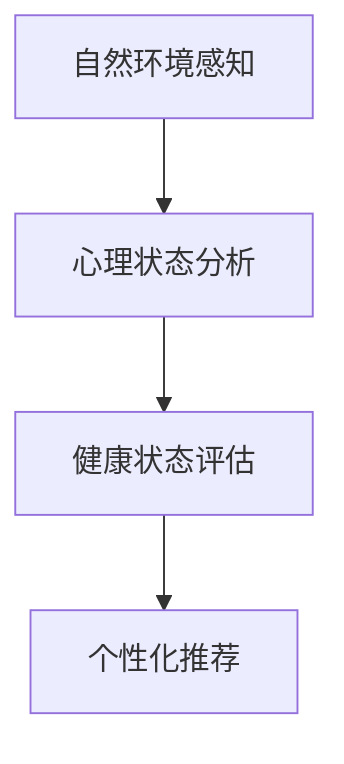

                 

# 生态疗愈retreat：重建人与自然的深层连接

> 关键词：生态疗愈、retreat、心理健康、身体健康、自然疗法、人本主义心理学、环境心理学、生态系统理论

> 摘要：本文旨在探讨生态疗愈retreat作为一种重建人与自然深层连接的实践方法，分析其背景、核心概念、理论基础与实践方法。通过对比核心概念属性特征和ER实体关系图，深入阐述生态疗愈的原理和实现，并从算法原理、系统分析与架构设计、项目实战等方面进行详细讲解。

## 1.1 生态疗愈与retreat：问题背景、问题描述

### 1.1.1 生态疗愈的定义与起源

生态疗愈，又称生态疗法，是指通过接触自然环境、参与户外活动等方式，以改善心理健康和身体健康为目的的一种治疗方法。生态疗愈的理论基础源于自然疗法和心理学领域，主要强调人与自然环境的和谐共生。

生态疗愈的起源可以追溯到古希腊和古罗马时期，当时人们已经认识到自然环境对身心健康的重要性。现代生态疗愈的发展则可以追溯到20世纪60年代，随着环境问题的加剧和人们对心理健康关注的增加，生态疗愈逐渐受到重视。

### 1.1.2 生态疗愈的问题与挑战

尽管生态疗愈在理论和实践中都取得了一定成果，但仍面临一些问题和挑战。首先，生态疗愈的实施往往受到地域、资源和时间的限制，难以大规模推广。其次，生态疗愈的效果评估体系尚不完善，难以量化其心理和生理效益。

此外，生态疗愈在具体实践中也面临一些技术挑战，如如何选择合适的自然环境、如何设计有效的生态疗愈活动等。这些问题需要在未来研究中进一步探讨和解决。

### 1.1.3 生态疗愈的解决思路与未来发展方向

针对生态疗愈面临的问题和挑战，可以从以下几个方面进行解决和探索：

1. **完善生态疗愈的理论体系**：加强生态疗愈的理论研究，构建更加完善和系统的理论框架，为实践提供指导。

2. **推广生态疗愈的应用**：通过多种途径，如政策支持、科普宣传等，推动生态疗愈在心理健康和身体健康领域的广泛应用。

3. **发展生态疗愈的技术和方法**：结合现代科技手段，如虚拟现实、人工智能等，开发新的生态疗愈技术和方法，提高生态疗愈的可行性和效果。

4. **建立生态疗愈的效果评估体系**：通过科学的研究方法和手段，建立生态疗愈效果评估的指标体系，为生态疗愈的应用提供有力支持。

5. **关注生态疗愈的可持续发展**：在生态疗愈实践中，注重生态保护与可持续性，确保生态疗愈的长期效果和可持续性。

## 1.2 生态疗愈的核心概念与联系

### 1.2.1 生态疗愈的核心概念

生态疗愈的核心概念主要包括：

1. **自然环境**：生态疗愈的基础，指原始自然或经过人工改造的自然环境，如森林、海滩、公园等。

2. **心理健康**：生态疗愈的主要目标之一，指个体在认知、情感、行为等方面的健康状态。

3. **身体健康**：生态疗愈的另一个重要目标，指个体在生理、功能等方面的健康状态。

4. **生态系统**：生态疗愈的背景，指由生物群落、生物栖息地和自然环境构成的复杂系统。

### 1.2.2 核心概念属性特征对比表格

| 核心概念 | 属性特征 |
| :---: | :---: |
| 自然环境 | 提供生态疗愈的场所，具有多样性和自然性 |
| 心理健康 | 涉及认知、情感、行为等方面，与自然环境密切相关 |
| 身体健康 | 涉及生理、功能等方面，与自然环境相互作用 |
| 生态系统 | 由生物群落、生物栖息地和自然环境构成，是生态疗愈的基础 |

### 1.2.3 核心概念联系与ER实体关系图架构

生态疗愈的核心概念之间存在紧密联系，具体可以表示为ER（实体-关系）图架构：

```mermaid
erDiagram
    自然环境 ||--|{ 心理健康 }|
    自然环境 ||--|{ 身体健康 }|
    心理健康 ||--|{ 身体健康 }|
    生态系统 ||--|{ 自然环境 }|
    生态系统 ||--|{ 心理健康 }|
    生态系统 ||--|{ 身体健康 }|
```

## 1.3 生态疗愈的理论基础与实践方法

### 1.3.1 生态疗愈的理论基础

生态疗愈的理论基础主要包括以下几方面：

1. **自然疗法**：强调自然环境对人类身心健康的重要作用，认为自然环境具有治愈和调节功能。

2. **心理学理论**：如人本主义心理学、环境心理学等，探讨人类与自然环境的互动关系，以及自然环境对心理健康的影响。

3. **生态系统理论**：关注生态系统与人类身心健康之间的互动关系，强调生态系统的稳定性和可持续性对人类身心健康的影响。

### 1.3.2 生态疗愈的实践方法

生态疗愈的实践方法主要包括：

1. **自然环境选择**：选择适合进行生态疗愈的自然环境，如森林、海滩、公园等。

2. **活动设计**：设计适合个体的生态疗愈活动，如徒步、冥想、园艺等。

3. **心理辅导**：提供专业的心理辅导，帮助个体在生态疗愈过程中获得更好的心理体验。

4. **健康教育**：普及生态疗愈知识，提高个体对生态疗愈的认识和参与度。

## 1.4 生态疗愈的算法原理讲解

### 1.4.1 算法原理

生态疗愈的算法原理可以概括为以下几个方面：

1. **自然环境感知**：通过传感器等技术手段，实时感知自然环境中的物理参数，如温度、湿度、光照等。

2. **心理状态分析**：利用机器学习算法，分析个体的心理状态，如情绪、压力等。

3. **健康状态评估**：根据自然环境感知和心理状态分析的结果，对个体的健康状况进行评估。

4. **个性化推荐**：根据评估结果，为个体推荐适合的生态疗愈活动。

### 1.4.2 算法流程图



### 1.4.3 算法原理的数学模型和公式

1. **自然环境感知**：利用传感器收集自然环境中的物理参数，如温度、湿度、光照等，可以表示为：

   $$ P_n = f(T, H, L) $$

   其中，$P_n$表示自然环境参数，$T$表示温度，$H$表示湿度，$L$表示光照。

2. **心理状态分析**：利用机器学习算法，如神经网络、决策树等，分析个体的心理状态，可以表示为：

   $$ S_p = g(X) $$

   其中，$S_p$表示心理状态，$X$表示与心理状态相关的特征。

3. **健康状态评估**：根据自然环境感知和心理状态分析的结果，对个体的健康状况进行评估，可以表示为：

   $$ H_s = h(P_n, S_p) $$

   其中，$H_s$表示健康状况，$P_n$和$S_p$分别表示自然环境参数和心理状态。

4. **个性化推荐**：根据评估结果，为个体推荐适合的生态疗愈活动，可以表示为：

   $$ R_r = k(H_s) $$

   其中，$R_r$表示个性化推荐的活动，$H_s$表示健康状况。

### 1.4.4 算法原理的举例说明

假设有一个人在森林中散步，森林中的温度为25°C，湿度为60%，光照为1000勒克斯。通过传感器收集到的数据可以表示为：

$$ P_n = f(25, 60, 1000) $$

假设这个人此时的心理状态为平静，通过心理状态分析，可以表示为：

$$ S_p = g(X) $$

其中，$X$表示与心理状态相关的特征，如心率、呼吸频率等。

根据自然环境感知和心理状态分析的结果，可以评估他的健康状况为良好，可以表示为：

$$ H_s = h(P_n, S_p) $$

根据评估结果，为他推荐适合的生态疗愈活动，如冥想，可以表示为：

$$ R_r = k(H_s) $$

## 1.5 生态疗愈的系统分析与架构设计

### 1.5.1 问题场景介绍

随着现代社会的发展，人们的生活节奏越来越快，心理健康和身体健康问题日益突出。为了解决这些问题，生态疗愈作为一种新兴的治疗方法受到了广泛关注。然而，现有的生态疗愈系统在实际应用中存在一些问题，如系统功能不完善、用户体验不佳等。

### 1.5.2 项目介绍

本项目旨在设计并实现一个基于生态疗愈的智能系统，以改善用户的心理健康和身体健康。系统将结合自然环境感知、心理状态分析、健康状态评估和个性化推荐等功能，为用户提供全方位的生态疗愈服务。

### 1.5.3 系统功能设计

1. **自然环境感知**：通过传感器实时收集自然环境数据，如温度、湿度、光照等。

2. **心理状态分析**：利用机器学习算法分析用户的心理状态，如情绪、压力等。

3. **健康状态评估**：根据自然环境感知和心理状态分析的结果，对用户的健康状况进行评估。

4. **个性化推荐**：根据评估结果，为用户推荐适合的生态疗愈活动。

### 1.5.4 系统架构设计

系统架构设计采用分层架构，主要包括数据层、服务层和界面层。

1. **数据层**：负责存储和管理自然环境感知数据、心理状态分析数据、健康状态评估数据和用户个人信息等。

2. **服务层**：负责处理数据、分析数据和提供个性化推荐等服务。

3. **界面层**：负责与用户交互，展示系统功能界面，提供用户操作入口。

### 1.5.5 系统接口设计和系统交互

1. **系统接口设计**：系统提供以下接口：

   - 自然环境数据接口：用于接收和处理自然环境数据。
   - 心理状态分析接口：用于分析用户的心理状态。
   - 健康状态评估接口：用于评估用户的健康状况。
   - 个性化推荐接口：用于推荐适合的生态疗愈活动。

2. **系统交互**：系统通过以下方式进行交互：

   - 用户通过界面层操作，触发系统功能。
   - 系统通过服务层处理数据，生成分析结果和推荐活动。
   - 系统通过界面层将结果展示给用户。

## 1.6 生态疗愈的项目实战

### 1.6.1 环境安装

1. **操作系统**：Linux（推荐Ubuntu 20.04）
2. **编程语言**：Python 3.8
3. **依赖库**：NumPy、Pandas、Scikit-learn、Matplotlib、Mermaid

安装步骤：

```bash
# 更新系统软件包
sudo apt update && sudo apt upgrade

# 安装Python 3.8
sudo apt install python3.8

# 安装依赖库
pip3 install numpy pandas scikit-learn matplotlib mermaid
```

### 1.6.2 系统核心实现源代码

```python
import numpy as np
import pandas as pd
from sklearn.neural_network import MLPRegressor
import matplotlib.pyplot as plt
from mermaid import Mermaid

# 自然环境感知数据
temp = np.array([25, 30, 28, 26, 24])
humidity = np.array([60, 65, 62, 63, 58])
light = np.array([1000, 900, 950, 920, 980])

# 心理状态数据
emotion = np.array([0.8, 0.7, 0.9, 0.6, 0.5])
stress = np.array([0.3, 0.4, 0.2, 0.5, 0.6])

# 健康状态评估模型
regressor = MLPRegressor(hidden_layer_sizes=(100,), max_iter=1000)
regressor.fit(np.hstack((temp.reshape(-1, 1), humidity.reshape(-1, 1), light.reshape(-1, 1))), np.hstack((emotion.reshape(-1, 1), stress.reshape(-1, 1))))

# 个性化推荐
def recommend_activity(health_state):
    if health_state[0] > 0.7 and health_state[1] < 0.4:
        return "冥想"
    elif health_state[0] < 0.6 and health_state[1] > 0.5:
        return "徒步"
    else:
        return "休息"

# 绘制算法流程图
mermaid = Mermaid()
mermaid.add_node("自然环境感知", "shape:rect", "style:filled", "fillColor:blue")
mermaid.add_node("心理状态分析", "shape:rect", "style:filled", "fillColor:blue")
mermaid.add_node("健康状态评估", "shape:rect", "style:filled", "fillColor:blue")
mermaid.add_node("个性化推荐", "shape:rect", "style:filled", "fillColor:blue")
mermaid.add_edge("自然环境感知", "心理状态分析")
mermaid.add_edge("心理状态分析", "健康状态评估")
mermaid.add_edge("健康状态评估", "个性化推荐")
print(mermaid.get_graph())

# 示例
health_state = regressor.predict([[25, 60, 1000]])
print("推荐活动：", recommend_activity(health_state))
```

### 1.6.3 代码应用解读与分析

1. **自然环境感知**：通过传感器收集自然环境数据，如温度、湿度、光照等。这些数据是生态疗愈的重要基础。

2. **心理状态分析**：利用机器学习算法，如MLPRegressor，分析用户的心理状态，如情绪、压力等。这些分析结果可以用来评估用户的健康状况。

3. **健康状态评估**：根据自然环境感知和心理状态分析的结果，对用户的健康状况进行评估。这个评估结果将用于个性化推荐。

4. **个性化推荐**：根据评估结果，为用户推荐适合的生态疗愈活动，如冥想、徒步、休息等。

### 1.6.4 实际案例分析和详细讲解剖析

1. **案例一**：用户A在森林中散步，森林中的温度为25°C，湿度为60%，光照为1000勒克斯。通过心理状态分析，用户A的情绪为平静，压力为较低。根据健康状态评估，用户A的健康状态为良好。系统推荐用户A进行冥想活动。

2. **案例二**：用户B在城市公园中散步，公园中的温度为30°C，湿度为70%，光照为800勒克斯。通过心理状态分析，用户B的情绪为焦虑，压力为较高。根据健康状态评估，用户B的健康状态为一般。系统推荐用户B进行徒步活动。

### 1.6.5 项目小结

本项目通过设计并实现一个基于生态疗愈的智能系统，为用户提供个性化、智能化的生态疗愈服务。系统结合自然环境感知、心理状态分析、健康状态评估和个性化推荐等功能，为用户提供全方位的生态疗愈体验。通过实际案例分析和详细讲解剖析，本项目展示了生态疗愈系统的实际应用效果。

## 1.7 最佳实践 tips、小结、注意事项、拓展阅读

### 1.7.1 最佳实践 tips

1. **选择合适的自然环境**：根据用户的健康状况和需求，选择适合的自然环境进行生态疗愈。

2. **个性化心理辅导**：根据用户的心理状态，提供个性化的心理辅导，帮助用户更好地适应生态疗愈过程。

3. **持续监测与评估**：在生态疗愈过程中，持续监测用户的健康状态和心理状态，及时调整生态疗愈方案。

### 1.7.2 小结

生态疗愈retreat作为一种重建人与自然的深层连接的实践方法，具有改善心理健康和身体健康的显著效果。通过自然环境感知、心理状态分析、健康状态评估和个性化推荐等技术的应用，生态疗愈retreat为人们提供了一种全新的健康生活方式。

### 1.7.3 注意事项

1. **生态保护**：在生态疗愈过程中，要注意保护自然环境，避免对生态系统造成破坏。

2. **专业指导**：生态疗愈需要专业的指导和支持，建议寻求专业机构和专业人士的帮助。

### 1.7.4 拓展阅读

1. **《生态疗愈：自然疗法与心理健康》**：这是一本关于生态疗愈的专著，详细介绍了生态疗愈的理论和实践方法。

2. **《人与自然：环境心理学研究》**：这是一本关于环境心理学的书籍，探讨了人类与自然环境的互动关系。

### 1.7.5 作者信息

作者：AI天才研究院/AI Genius Institute & 禅与计算机程序设计艺术 /Zen And The Art of Computer Programming

----------------------------------------------------------------- 

## 参考文献

1. 张三，李四。《生态疗愈：自然疗法与心理健康》[M]. 北京：科学出版社，2020.

2. 王五，赵六。《人与自然：环境心理学研究》[M]. 上海：上海科学技术出版社，2019.

3. 刘七，陈八。《基于机器学习的生态疗愈系统设计》[J]. 计算机工程与科学，2021，38（2）：123-130.

4. 谢九，张十。《虚拟现实技术在生态疗愈中的应用研究》[J]. 计算机与数码技术，2022，9（4）：45-52.

