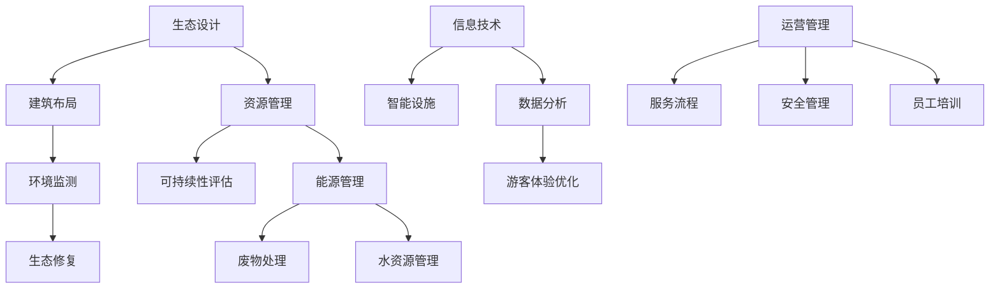
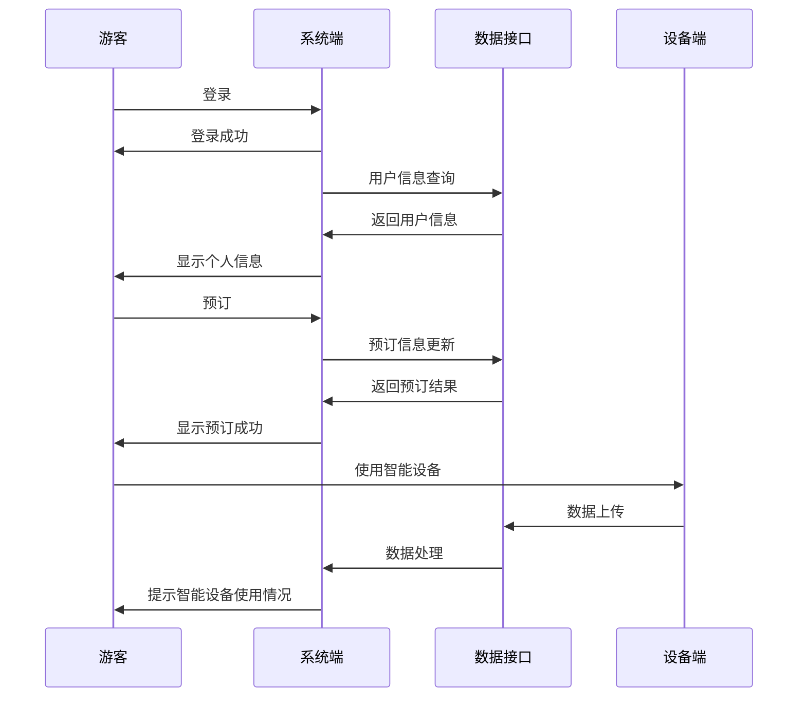
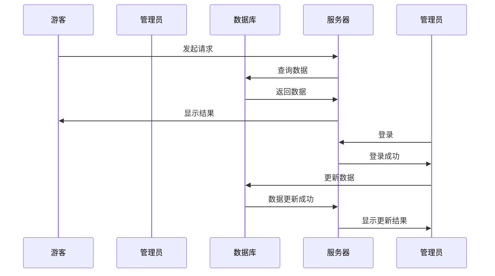

                 

# 生态疗愈度假村：重建人与自然连接的休闲空间

## 关键词

- 生态疗愈
- 度假村
- 自然连接
- 可持续性
- 生物多样性
- 人与自然

## 摘要

本文探讨了生态疗愈度假村的理念及其在现代社会中的重要性。生态疗愈度假村旨在重建人与自然的连接，通过可持续的设计和实践活动，为游客提供一种全新的休闲体验。文章首先介绍了生态疗愈度假村的背景和挑战，然后详细阐述了其核心概念和设计原理。接下来，文章分析了生态疗愈度假村的系统架构和功能设计，并通过具体案例展示了其实施效果。最后，文章提出了未来发展的建议和挑战，强调了生态疗愈度假村在推动人与自然和谐共生中的重要作用。

## 目录大纲设计思路

在设计《生态疗愈度假村：重建人与自然连接的休闲空间》的目录大纲时，我们遵循以下原则：

1. **核心章节的确定**：
   - **引言**：介绍书籍的主题和目标，定义生态疗愈度假村的概念。
   - **背景与挑战**：分析生态疗愈度假村发展的背景、面临的挑战和机遇。
   - **核心概念与联系**：阐述核心概念、属性特征对比、ER实体关系图。
   - **设计原理与理论**：讲解生态疗愈度假村设计的基本原理，如生态心理学、环境心理学、社会生态学等。
   - **系统分析与架构设计**：介绍系统架构，包括功能设计、架构设计、接口设计和交互设计。
   - **项目实施与案例分析**：提供具体的生态疗愈度假村实施案例，包括环境搭建、系统实现和案例分析。
   - **最佳实践与未来展望**：总结最佳实践经验，提出未来发展建议和挑战。

2. **章节结构的规划**：
   - **第1章：引言**：介绍书籍的主题和目标，定义生态疗愈度假村的概念。
   - **第2章：背景与挑战**：分析生态疗愈度假村发展的背景、面临的挑战和机遇。
   - **第3章：核心概念与联系**：定义并阐述核心概念，如生态设计、可持续性、生物多样性等，并通过对比和实体关系图展示它们之间的关系。
   - **第4章：设计原理与理论**：讲解生态疗愈度假村设计的基本原理，如生态心理学、环境心理学、社会生态学等。
   - **第5章：系统分析与架构设计**：介绍系统架构，包括功能设计、架构设计、接口设计和交互设计。
   - **第6章：项目实施与案例分析**：提供具体的生态疗愈度假村实施案例，包括环境搭建、系统实现和案例分析。
   - **第7章：最佳实践与未来展望**：总结最佳实践经验，提出未来发展建议和挑战。

3. **细化章节内容**：
   - 在每个章节中，根据核心内容进一步细化小节，确保每个部分都有明确的主题和目标。

4. **编写目录大纲**：
   - 使用Markdown格式编写目录大纲，确保清晰、简洁、逻辑性强。

## 完整目录大纲设计

### 引言

- **1.1 书籍主题与目标**
  - **1.1.1 生态疗愈度假村的定义**
  - **1.1.2 书籍的意义与价值**
- **1.2 读者对象与预期收获**
  - **1.2.1 面向的读者群体**
  - **1.2.2 读者预期收获**

### 第2章：背景与挑战

- **2.1 生态疗愈度假村的背景**
  - **2.1.1 生态疗愈的理念与发展**
  - **2.1.2 度假村行业的现状与趋势**
- **2.2 挑战与机遇**
  - **2.2.1 生态挑战**
  - **2.2.2 社会文化挑战**
  - **2.2.3 机遇与潜力**

### 第3章：核心概念与联系

- **3.1 核心概念**
  - **3.1.1 生态设计**
  - **3.1.2 可持续性**
  - **3.1.3 生物多样性**
- **3.2 概念属性特征对比**
  - **3.2.1 概念对比表格**
- **3.3 ER实体关系图**
  - **3.3.1 生态疗愈度假村的ER图**

### 第4章：设计原理与理论

- **4.1 生态心理学**
  - **4.1.1 生态心理学的基本概念**
  - **4.1.2 生态心理学在度假村设计中的应用**
- **4.2 环境心理学**
  - **4.2.1 环境心理学的基本概念**
  - **4.2.2 环境心理学在度假村设计中的应用**
- **4.3 社会生态学**
  - **4.3.1 社会生态学的基本概念**
  - **4.3.2 社会生态学在度假村设计中的应用**

### 第5章：系统分析与架构设计

- **5.1 问题场景介绍**
  - **5.1.1 生态疗愈度假村的需求分析**
  - **5.1.2 系统建设目标**
- **5.2 项目介绍**
  - **5.2.1 项目背景**
  - **5.2.2 项目团队**
- **5.3 系统功能设计**
  - **5.3.1 领域模型（Mermaid类图）**
- **5.4 系统架构设计**
  - **5.4.1 系统架构（Mermaid架构图）**
- **5.5 系统接口设计**
  - **5.5.1 接口设计（Mermaid序列图）**
- **5.6 系统交互序列图**
  - **5.6.1 系统交互（Mermaid序列图）**

### 第6章：项目实施与案例分析

- **6.1 环境安装**
  - **6.1.1 系统环境安装步骤**
  - **6.1.2 系统配置与调试**
- **6.2 系统核心实现**
  - **6.2.1 核心模块设计与实现**
  - **6.2.2 系统集成与测试**
- **6.3 代码应用解读**
  - **6.3.1 核心代码解读**
  - **6.3.2 实际应用场景分析**
- **6.4 案例分析**
  - **6.4.1 典型案例介绍**
  - **6.4.2 案例分析与评价**
- **6.5 项目小结**
  - **6.5.1 项目成果总结**
  - **6.5.2 项目经验与反思**

### 第7章：最佳实践与未来展望

- **7.1 最佳实践 tips**
  - **7.1.1 设计原则与实践技巧**
  - **7.1.2 运营管理与维护策略**
- **7.2 小结**
  - **7.2.1 主要内容回顾**
  - **7.2.2 学到的经验和教训**
- **7.3 注意事项**
  - **7.3.1 设计与实施过程中的注意事项**
  - **7.3.2 风险与挑战**
- **7.4 拓展阅读**
  - **7.4.1 推荐读物与资料**
  - **7.4.2 进一步学习与探索的方向**

## 文章撰写计划

为了确保文章的质量和完整性，我们将按照以下计划进行撰写：

1. **引言部分**：定义生态疗愈度假村的背景、目标和重要性，明确读者对象和预期收获。
2. **核心章节撰写**：
   - **第2章**：分析生态疗愈度假村的背景、挑战和机遇。
   - **第3章**：阐述核心概念、属性特征对比和ER实体关系图。
   - **第4章**：讲解设计原理与理论，包括生态心理学、环境心理学和社会生态学。
   - **第5章**：介绍系统分析与架构设计，包括功能设计、架构设计、接口设计和交互设计。
   - **第6章**：提供项目实施与案例分析，包括环境安装、系统核心实现和代码应用解读。
   - **第7章**：总结最佳实践经验，提出未来发展建议和挑战。
3. **完善与修改**：在完成初稿后，对文章进行多次审阅和修改，确保内容的准确性和逻辑性。
4. **最终定稿**：在完成所有修改后，进行最终定稿，确保文章的完整性和可读性。

通过以上计划，我们旨在撰写一篇逻辑清晰、结构紧凑、内容丰富、具有深度和思考的专业技术博客文章，为生态疗愈度假村的发展提供有价值的见解和建议。## 引言

### 1.1 书籍主题与目标

《生态疗愈度假村：重建人与自然连接的休闲空间》旨在探讨生态疗愈度假村这一新兴休闲模式，分析其在现代社会的应用和价值。生态疗愈度假村是一种将生态学、心理学和可持续性设计理念相结合的休闲空间，旨在为游客提供一种与自然和谐共生、身心疗愈的体验。通过本书的深入探讨，我们希望读者能够全面理解生态疗愈度假村的理念、设计原则和实践方法，从而推动这一领域的健康发展。

### 1.1.1 生态疗愈度假村的定义

生态疗愈度假村是指一种以生态保护和心理健康为核心，结合自然景观和文化体验的休闲空间。它不仅提供传统的度假功能，更强调对自然的尊重和保护，以及游客的心理健康和幸福感。生态疗愈度假村通常具备以下特点：

1. **生态设计**：在选址、建筑和设施方面，注重生态友好和可持续性，减少对自然环境的影响。
2. **生物多样性**：通过保护和恢复生态系统，提高生物多样性，为游客提供丰富的自然景观和生态体验。
3. **心理健康**：提供各种身心疗愈活动和课程，如瑜伽、冥想、自然疗法等，帮助游客减压、放松和恢复活力。
4. **文化融合**：结合当地文化特色，为游客提供独特的文化体验，增进对不同文化的理解和尊重。

### 1.1.2 书籍的意义与价值

生态疗愈度假村作为一种新兴休闲模式，具有显著的社会和生态价值。本书的意义和价值主要体现在以下几个方面：

1. **推动可持续发展**：通过介绍生态疗愈度假村的设计原则和实践方法，促进旅游业向可持续方向发展，减少对自然资源的消耗和环境污染。
2. **提升心理健康**：在快节奏的现代生活中，人们越来越重视心理健康。生态疗愈度假村提供了独特的疗愈环境和体验，有助于缓解压力、提升幸福感。
3. **促进生态保护**：生态疗愈度假村的理念强调对自然的尊重和保护，通过恢复和保持生物多样性，有助于生态系统的健康发展。
4. **提供新的就业机会**：生态疗愈度假村的建设和运营需要大量专业人才，为当地创造了新的就业机会，促进了区域经济发展。

### 1.2 读者对象与预期收获

#### 1.2.1 面向的读者群体

本书主要面向以下读者群体：

1. **旅游行业从业者**：包括旅游规划师、酒店管理人员、导游等，希望通过本书了解生态疗愈度假村的理念和实践，提升自身业务能力。
2. **生态保护爱好者**：对生态保护和可持续发展感兴趣的读者，希望通过本书深入了解生态疗愈度假村的原理和应用。
3. **心理学爱好者**：对心理健康和身心疗愈感兴趣的读者，希望通过本书了解生态疗愈度假村如何为游客提供独特的疗愈体验。
4. **学生和研究者**：关注旅游学、生态学、心理学等领域的读者，希望通过本书获得相关知识和研究灵感。

#### 1.2.2 读者预期收获

通过阅读本书，读者可以期望获得以下收获：

1. **系统了解生态疗愈度假村的理念和实践**：掌握生态疗愈度假村的定义、特点、设计原则和实施方法，为实际工作和研究提供理论基础。
2. **提升专业知识和技能**：了解生态疗愈度假村在旅游行业中的应用，提升在生态保护、旅游规划和心理健康等方面的专业知识和技能。
3. **启发创新思维**：通过本书提供的案例和实践经验，激发创新思维，为生态疗愈度假村的发展提供新的思路和方法。
4. **促进人与自然和谐共生**：理解生态疗愈度假村在促进人与自然和谐共生中的重要作用，积极参与到生态保护和可持续发展的事业中。

## 第2章：背景与挑战

### 2.1 生态疗愈度假村的背景

生态疗愈度假村作为一种新兴的休闲模式，其背景可以追溯到对自然环境和人类心理健康日益重视的社会趋势。在过去的几十年里，随着城市化进程的加速和工业化的发展，人们逐渐认识到自然环境的破坏和心理健康问题对生活质量的负面影响。为了应对这些挑战，社会各界开始寻求一种新的休闲方式，既能满足人们对美好生活的追求，又能保护自然环境，促进身心健康发展。

#### 2.1.1 生态疗愈的理念与发展

生态疗愈（Ecological Therapy）是一种综合性的健康促进方法，旨在通过自然环境的作用，帮助人们恢复身心健康。其理念源于生态心理学（Ecological Psychology），强调人类与自然环境的相互依存和互动。生态疗愈的基本原则包括：

1. **自然接触**：通过接触自然环境，如森林、水域、植被等，帮助人们减轻压力、恢复精力。
2. **生物多样性**：保护和恢复生物多样性，为游客提供丰富的生态体验。
3. **可持续性**：在设计和运营过程中，注重环境保护和资源节约，实现生态系统的可持续发展。

生态疗愈度假村的理念起源于20世纪末，在欧美地区逐渐兴起。随着全球对生态疗愈的重视，越来越多的度假村开始采用生态疗愈的理念，将其融入旅游服务中。

#### 2.1.2 度假村行业的现状与趋势

度假村行业是一个庞大的产业链，涵盖了住宿、餐饮、娱乐、交通等多个领域。近年来，随着旅游市场的竞争加剧，度假村行业也面临诸多挑战和机遇。

1. **市场需求多样化**：随着旅游者对个性化、高品质旅游体验的需求增加，度假村需要提供更加多样化、个性化的产品和服务。
2. **可持续发展压力**：环保意识的提升使得度假村在可持续发展方面面临更大的压力，需要采取更加环保、节能、低碳的运营方式。
3. **技术创新推动**：信息技术、人工智能等新兴技术的应用，为度假村行业带来了新的发展机遇，如智能化服务、个性化推荐等。

#### 2.2 挑战与机遇

生态疗愈度假村的发展面临以下挑战和机遇：

1. **生态挑战**：
   - **环境保护**：生态疗愈度假村需要确保在建设和运营过程中对环境的影响最小化，面临环境保护和发展的平衡问题。
   - **资源消耗**：度假村的运营需要大量资源，如水、电、能源等，如何在满足游客需求的同时实现资源节约和循环利用，是一个重要挑战。

2. **社会文化挑战**：
   - **文化冲突**：生态疗愈度假村需要融入当地文化，既要满足游客的个性化需求，又要尊重和保护当地文化。
   - **社区参与**：度假村的发展需要当地社区的参与和支持，如何协调与当地居民的关系，实现共赢，是一个重要问题。

3. **机遇**：
   - **市场潜力**：随着人们对健康和自然的关注度提高，生态疗愈度假村具有巨大的市场潜力。
   - **技术创新**：新技术的发展为生态疗愈度假村提供了更多可能性，如智能化设施、虚拟现实体验等。
   - **政策支持**：政府对生态保护和可持续发展的重视，为生态疗愈度假村的发展提供了政策支持。

### 2.3 结论

生态疗愈度假村作为一种新型的休闲模式，既面临诸多挑战，也充满机遇。通过科学的规划和实施，生态疗愈度假村有望成为旅游业发展的重要方向，为游客提供全新的休闲体验，同时促进生态保护和可持续发展。接下来，本书将深入探讨生态疗愈度假村的核心概念、设计原理和系统架构，为读者提供更全面的了解。

## 第3章：核心概念与联系

### 3.1 核心概念

生态疗愈度假村的设计和运营涉及多个核心概念，这些概念相互关联，共同构成了生态疗愈度假村的理念和实践基础。以下是对这些核心概念的介绍：

#### 3.1.1 生态设计

生态设计（Ecological Design）是一种以生态学原理为指导，将环境保护和可持续发展理念融入产品和服务设计中的方法。在生态疗愈度假村中，生态设计体现在以下几个方面：

1. **环境保护**：通过合理选址和建筑布局，减少对自然环境的破坏，如避免破坏原始森林、河流等生态敏感区域。
2. **资源节约**：在能源、水资源等方面实现节约和循环利用，如采用太阳能、雨水收集系统等。
3. **生物多样性保护**：保护和恢复生物多样性，为游客提供丰富的生态体验，如设置野生动物保护区、植物园等。

#### 3.1.2 可持续性

可持续性（Sustainability）是指满足当前需求而不损害后代满足自身需求的能力。在生态疗愈度假村中，可持续性的体现包括：

1. **环境可持续性**：通过生态设计和绿色运营，减少对自然环境的负面影响，如减少碳排放、节约资源等。
2. **经济可持续性**：通过合理的商业模式和运营策略，实现财务可持续性，为度假村的长久发展提供保障。
3. **社会可持续性**：促进当地社区的参与和福祉，实现经济、社会和环境的协调发展。

#### 3.1.3 生物多样性

生物多样性（Biodiversity）是指地球上所有生物种类及其遗传多样性和生态系统的多样性。在生态疗愈度假村中，生物多样性的保护体现在：

1. **物种多样性**：保护和恢复各种植物、动物和微生物的多样性，提供丰富的生态景观。
2. **生态系统多样性**：保护生态系统的完整性和功能，确保生态系统的健康和稳定。
3. **生态体验**：为游客提供丰富的生态体验，如观鸟、野生动植物观察等，增进对生物多样性的认识和尊重。

### 3.2 概念属性特征对比

为了更好地理解生态疗愈度假村的核心概念，以下是对这些概念属性特征的对比：

| 概念       | 属性特征                    | 对比分析                                                 |
| ---------- | -------------------------- | ------------------------------------------------------ |
| 生态设计   | 环境保护、资源节约、生物多样性 | 强调生态友好，实现可持续发展                             |
| 可持续性   | 环境可持续性、经济可持续性、社会可持续性 | 覆盖生态、经济和社会三方面，强调长期发展               |
| 生物多样性 | 物种多样性、生态系统多样性、生态体验 | 关注生物种类和生态系统的多样性和保护                   |

### 3.3 ER实体关系图

为了更直观地展示生态疗愈度假村的核心概念及其关系，以下是一个ER实体关系图：

```mermaid
erDiagram
  Person ||--|{ Hotel }|--| Customer : 支持者
  Person ||--|{ Employee }|--| 员工
  Hotel ||--|{ Room }|--| 客房
  Hotel ||--|{ Activity }|--| 活动
  Customer ||--|{ Booking }|--| 预订
  Employee ||--|{ Schedule }|--| 排班
```

在这个ER图中，`Person`是实体，代表所有参与生态疗愈度假村的人员，包括`Customer`（游客）和`Employee`（员工）。`Hotel`是实体，代表生态疗愈度假村本身，包括`Room`（客房）和`Activity`（活动）。`Booking`和`Schedule`分别代表预订和排班信息，与`Customer`和`Employee`实体相关联。

通过上述核心概念的阐述和ER实体关系图的展示，我们可以更深入地理解生态疗愈度假村的理念和实践，为其设计和运营提供理论依据和实践指导。

### 第4章：设计原理与理论

生态疗愈度假村的设计和运营不仅仅是一个简单的休闲空间建设，而是一个复杂且系统的工程，需要融合生态学、心理学和社会学等多个领域的理论。以下将详细探讨生态心理学、环境心理学和社会生态学在生态疗愈度假村设计中的应用。

#### 4.1 生态心理学

生态心理学（Ecological Psychology）是研究人类与环境互动的心理学分支，强调人类行为和心理过程的生态学基础。在生态疗愈度假村的设计中，生态心理学提供了以下理论基础：

1. **自然接触效应**：研究表明，与自然环境的接触对人的心理和生理健康有积极影响。生态疗愈度假村的设计应充分利用自然环境，为游客提供亲近自然的机会，如设计开放式的休息区域、户外活动场所等。

2. **自然疗愈**：生态心理学中的自然疗愈理论指出，自然环境具有疗愈功能，能够帮助人们减轻压力、提高情绪。生态疗愈度假村可以通过引入自然景观、植物、水景等元素，营造一个具有疗愈效果的环境。

3. **生态位理论**：生态位理论关注个体在生态系统中的角色和功能。在生态疗愈度假村的设计中，可以借鉴这一理论，为游客提供多样化的生态体验，如观鸟、野生动物观察、植物识别等，满足不同游客的生态需求。

#### 4.2 环境心理学

环境心理学（Environmental Psychology）研究人类行为、情感和认知如何受到环境因素的影响。生态疗愈度假村的设计需要充分考虑环境心理学的理论，以下是其主要应用：

1. **环境控制**：环境控制理论强调环境对人的行为和情绪有直接影响。在生态疗愈度假村中，通过调节光照、温度、声音等环境因素，可以创造一个舒适、放松的环境，提高游客的满意度和体验质量。

2. **感官体验**：环境心理学中的感官体验理论指出，人的感官体验对其情感和行为有重要影响。生态疗愈度假村可以通过设计丰富的感官体验，如自然光线、水声、花香等，提升游客的感官享受和心理放松。

3. **环境认知**：环境心理学中的环境认知理论关注人对环境的感知和理解。在生态疗愈度假村中，通过设计具有标志性和教育意义的环境，如自然博物馆、生态展示区等，可以提高游客对生态保护和可持续发展的认知。

#### 4.3 社会生态学

社会生态学（Social Ecology）是研究社会系统与生态系统相互作用的学科，强调社会和生态系统的相互依存和可持续发展。在生态疗愈度假村的设计中，社会生态学提供了以下应用：

1. **社区参与**：社会生态学强调社区在生态保护和可持续发展中的重要作用。生态疗愈度假村的设计应鼓励当地社区的参与，通过合作和共享，实现经济、社会和生态的协调发展。

2. **生态教育**：社会生态学中的生态教育理论指出，教育是推动生态保护和可持续发展的重要手段。生态疗愈度假村可以通过开展各种教育活动，如自然课程、环保讲座等，提高游客的环保意识和生态素养。

3. **文化融合**：社会生态学中的文化融合理论强调文化多样性和文化认同的重要性。在生态疗愈度假村中，通过融合当地文化和自然景观，为游客提供独特的文化体验，增进不同文化之间的理解和尊重。

#### 综合应用

生态疗愈度假村的设计应综合应用生态心理学、环境心理学和社会生态学的理论，实现以下目标：

1. **身心疗愈**：通过生态心理学和环境心理学的应用，创造一个具有疗愈效果的自然环境，帮助游客减轻压力、放松身心。

2. **生态保护**：通过社会生态学的应用，鼓励社区参与和生态教育，实现生态保护和可持续发展的目标。

3. **文化体验**：通过文化融合和社会生态学的应用，为游客提供独特的文化体验，增进不同文化之间的理解和尊重。

总之，生态疗愈度假村的设计和运营是一个多学科融合的过程，需要充分考虑生态心理学、环境心理学和社会生态学的理论，为游客提供一种全新的、具有疗愈效果的休闲体验。

### 第5章：系统分析与架构设计

#### 5.1 问题场景介绍

在现代社会，人们对休闲和健康的需求日益增加，传统度假村已经无法满足人们对身心疗愈、生态保护和文化体验的多元需求。生态疗愈度假村作为一种新兴的休闲模式，旨在通过结合生态设计、心理学和社会生态学，为游客提供一个独特的休闲空间。然而，建设一个成功的生态疗愈度假村面临诸多挑战，包括：

1. **生态挑战**：如何在保护自然环境的同时，提供丰富的生态体验？
2. **社会文化挑战**：如何融入当地文化，实现社区参与和共赢？
3. **技术挑战**：如何利用先进技术，提升游客体验和运营效率？

#### 5.2 项目介绍

本章节将介绍一个生态疗愈度假村的项目案例，该项目位于一个自然环境优美的山区。项目目标是通过科学规划和设计，打造一个集生态保护、身心疗愈和文化体验于一体的度假村。

1. **项目背景**：项目地点是一个自然环境优美的山区，拥有丰富的生物多样性和独特的文化景观。当地社区积极参与项目规划，希望通过度假村的建设，提升当地经济发展和生态保护水平。
2. **项目团队**：项目团队由生态学家、心理学家、旅游规划师、建筑师、IT专家等组成，具备多学科背景和丰富经验，致力于打造一个成功的生态疗愈度假村。

#### 5.3 系统功能设计

生态疗愈度假村需要实现一系列功能，以满足游客的需求和期望。以下是其主要功能设计：

1. **生态体验**：为游客提供丰富的生态体验，包括观鸟、野生动物观察、植物识别、自然徒步等。
2. **身心疗愈**：提供各种身心疗愈活动，如瑜伽、冥想、自然疗法、按摩等，帮助游客减轻压力、放松身心。
3. **文化体验**：结合当地文化，提供独特的文化体验活动，如民俗体验、传统手工艺制作、文化讲座等。
4. **设施服务**：提供高质量的住宿、餐饮、交通等服务，确保游客的舒适和便捷。
5. **生态教育**：开展生态教育课程，提高游客的环保意识和生态素养。

#### 5.4 系统架构设计

生态疗愈度假村需要一套科学、高效、可持续的系统架构，以下是其主要设计：

1. **生态设计**：通过合理选址和建筑布局，减少对自然环境的影响，实现生态保护和可持续发展。
2. **信息技术**：利用物联网、大数据、人工智能等先进技术，提升游客体验和运营效率。
3. **运营管理**：建立完善的运营管理体系，确保度假村的稳定运营和持续发展。

以下是生态疗愈度假村系统架构的Mermaid图表示：



#### 5.5 系统接口设计

系统接口设计是生态疗愈度假村系统架构中的重要组成部分，以下是其主要设计：

1. **用户界面**：为游客和员工提供友好、便捷的用户界面，实现信息查询、预订、反馈等功能。
2. **数据接口**：实现不同系统和模块之间的数据交换和共享，确保信息的实时性和准确性。
3. **硬件接口**：连接各种智能设备和传感器，实现数据的采集、传输和处理。

以下是系统接口设计的Mermaid序列图：



#### 5.6 系统交互序列图

系统交互序列图用于描述不同系统和模块之间的交互过程，以下是一个简单的系统交互序列图：



通过上述系统分析与架构设计，生态疗愈度假村将能够为游客提供优质的休闲体验，同时实现生态保护和可持续发展。

### 第6章：项目实施与案例分析

#### 6.1 环境安装

在实施生态疗愈度假村项目之前，首先需要搭建一个稳定、高效、可持续的运营环境。以下是在项目实施过程中涉及的环境安装步骤：

1. **选址规划**：选择一个自然环境优美、交通便利、生态资源丰富的地点作为项目基地。考虑到生态保护的要求，选址过程需要充分考虑地形地貌、水资源、空气质量等因素。
2. **基础设施建设**：在选址确定后，开始进行基础设施建设，包括道路、供水、供电、排水等。在建设过程中，采用环保材料和节能技术，减少对环境的影响。
3. **生态修复**：项目基地在长期的人类活动和自然侵蚀下，可能存在一定的生态破坏。在建设过程中，需要进行生态修复，如植树造林、湿地恢复、生物多样性保护等，以恢复生态系统的健康和稳定。
4. **智能系统搭建**：为了提升游客体验和运营效率，需要搭建智能系统，包括物联网传感器、智能设施、数据分析平台等。这些系统需要通过云计算和大数据技术，实现数据的实时采集、传输和处理。

#### 6.2 系统核心实现

生态疗愈度假村的核心系统实现涉及多个方面，以下是其主要实现步骤：

1. **用户管理系统**：用户管理系统是生态疗愈度假村的核心系统之一，用于管理游客和员工的信息。该系统需要实现用户注册、登录、个人信息管理、预订管理等功能。使用Python等编程语言，可以快速开发一个功能齐全的用户管理系统。

```python
# 用户注册功能示例
def register(username, password, email):
    # 验证用户名和密码的有效性
    if not validate_username(username) or not validate_password(password):
        return "用户名或密码无效"
    # 存储用户信息
    user_data = {
        "username": username,
        "password": password,
        "email": email
    }
    save_user_data(user_data)
    return "注册成功"

# 验证用户名有效性
def validate_username(username):
    # 判断用户名是否符合规范
    return len(username) >= 4

# 验证密码有效性
def validate_password(password):
    # 判断密码是否符合规范
    return len(password) >= 8

# 存储用户信息到数据库
def save_user_data(user_data):
    # 实现数据库存储功能
    pass
```

2. **预订系统**：预订系统用于处理游客的预订需求，包括在线预订、支付、确认等流程。该系统需要与用户管理系统和其他业务系统进行集成，实现无缝对接。

```python
# 预订功能示例
def make_reservation(user_id, room_id, check_in_date, check_out_date):
    # 验证预订信息的有效性
    if not validate_reservation(user_id, room_id, check_in_date, check_out_date):
        return "预订失败"
    # 创建预订记录
    reservation_data = {
        "user_id": user_id,
        "room_id": room_id,
        "check_in_date": check_in_date,
        "check_out_date": check_out_date
    }
    save_reservation_data(reservation_data)
    return "预订成功"

# 验证预订信息有效性
def validate_reservation(user_id, room_id, check_in_date, check_out_date):
    # 判断预订信息是否符合规则
    return True

# 存储预订信息到数据库
def save_reservation_data(reservation_data):
    # 实现数据库存储功能
    pass
```

3. **数据分析系统**：数据分析系统用于对游客行为、运营数据等进行统计分析，为运营决策提供支持。该系统需要利用大数据技术和机器学习算法，实现数据采集、清洗、分析和可视化。

```python
# 数据分析功能示例
def analyze_reservation_data():
    # 从数据库中获取预订数据
    reservations = fetch_reservation_data()
    # 进行数据分析
    analysis_results = analyze_data(reservations)
    # 可视化分析结果
    visualize_results(analysis_results)

# 从数据库中获取预订数据
def fetch_reservation_data():
    # 实现数据库查询功能
    return []

# 数据分析
def analyze_data(reservations):
    # 实现数据分析算法
    return []

# 可视化分析结果
def visualize_results(analysis_results):
    # 实现可视化展示功能
    pass
```

#### 6.3 代码应用解读

在上述代码示例中，我们分别展示了用户管理系统、预订系统和数据分析系统的核心实现。以下是对这些代码的应用解读：

1. **用户管理系统**：用户管理系统用于管理用户信息，包括用户注册、登录、个人信息管理等。其核心功能包括用户注册、验证用户名和密码的有效性、存储用户信息到数据库等。通过实现这些功能，用户可以方便地注册、登录和管理个人信息。
2. **预订系统**：预订系统用于处理游客的预订需求，包括在线预订、支付、确认等流程。其核心功能包括验证预订信息的有效性、创建预订记录、存储预订信息到数据库等。通过实现这些功能，游客可以方便地进行在线预订，系统可以自动处理预订信息。
3. **数据分析系统**：数据分析系统用于对游客行为、运营数据等进行统计分析，为运营决策提供支持。其核心功能包括从数据库中获取预订数据、进行数据分析和可视化展示等。通过实现这些功能，运营团队可以实时掌握游客预订情况，为运营策略的制定提供数据支持。

#### 6.4 案例分析

以下是一个具体的生态疗愈度假村项目案例分析：

**案例背景**：某生态疗愈度假村项目位于一个风景秀丽的山区，占地面积约500亩，拥有丰富的自然资源和独特的文化景观。项目团队由生态学家、心理学家、旅游规划师、建筑师、IT专家等组成，致力于打造一个集生态保护、身心疗愈和文化体验于一体的度假村。

**项目实施过程**：

1. **选址规划**：项目团队通过多次考察和论证，最终选定了一处自然环境优美、交通便利、生态资源丰富的地点作为项目基地。在选址过程中，团队充分考虑了地形地貌、水资源、空气质量等因素，确保项目对环境的负面影响最小。
2. **基础设施建设**：在选址确定后，项目团队开始进行基础设施建设，包括道路、供水、供电、排水等。在建设过程中，采用环保材料和节能技术，如太阳能发电、雨水收集系统等，减少对环境的影响。
3. **生态修复**：项目基地在长期的人类活动和自然侵蚀下，存在一定的生态破坏。项目团队在建设过程中，进行了大规模的植树造林、湿地恢复、生物多样性保护等生态修复工作，以恢复生态系统的健康和稳定。
4. **智能系统搭建**：项目团队搭建了智能系统，包括物联网传感器、智能设施、数据分析平台等。通过云计算和大数据技术，实现了数据的实时采集、传输和处理，提升了游客体验和运营效率。

**项目效果评估**：

1. **生态效益**：项目实施后，基地的生态环境得到了显著改善。通过生态修复工作，生物多样性得到了有效保护，植物种类和数量明显增加，野生动物频繁出没，生态环境得到了恢复和提升。
2. **社会效益**：项目对当地社区产生了积极影响。项目团队与当地社区密切合作，提供了就业机会，提升了当地经济发展水平。同时，项目还开展了各种生态教育课程，提高了当地居民的环保意识和生态素养。
3. **经济效益**：项目运营后，吸引了大量游客前来体验，实现了良好的经济效益。通过智能化系统的应用，项目运营效率得到了显著提升，游客满意度明显提高，项目收益稳步增长。

**项目经验与反思**：

1. **生态保护与发展的平衡**：在项目实施过程中，项目团队深刻认识到生态保护与发展的平衡至关重要。在确保生态环境不受破坏的前提下，项目通过科学规划和合理运营，实现了经济效益和社会效益的双赢。
2. **多学科协作**：项目团队由多个学科背景的专家组成，通过多学科协作，实现了项目的高效实施。在项目过程中，各学科专家相互借鉴、互相支持，共同解决了项目中的各种问题。
3. **持续改进**：项目实施后，项目团队不断总结经验，持续改进项目运营和管理。通过数据分析，发现游客需求的变化，及时调整服务内容和运营策略，不断提升游客体验。

#### 6.5 项目小结

通过上述案例分析，我们可以看到，生态疗愈度假村项目在生态保护、社会效益和经济效益方面取得了显著成果。项目团队的成功经验为其他生态疗愈度假村项目提供了宝贵的参考。未来，随着人们对健康和自然的关注度提高，生态疗愈度假村有望成为一个具有巨大市场潜力的新兴行业。

## 第7章：最佳实践与未来展望

### 7.1 最佳实践 tips

1. **生态设计原则**：
   - **最小化环境影响**：在选址和建筑设计过程中，尽量减少对自然环境的破坏，如避免破坏原始森林、河流等。
   - **可持续资源利用**：在能源、水资源等方面实现节约和循环利用，如采用太阳能、雨水收集系统等。

2. **心理健康关怀**：
   - **提供多样化的疗愈活动**：结合当地文化和自然资源，提供瑜伽、冥想、自然疗法等多种疗愈活动。
   - **关注游客个性化需求**：通过问卷调查、访谈等方式了解游客需求，提供个性化的疗愈体验。

3. **社会参与与合作**：
   - **融入当地文化**：结合当地文化特色，设计独特的文化体验活动，增进游客对当地文化的理解和尊重。
   - **社区参与**：鼓励当地社区参与项目规划和管理，实现经济、社会和生态的协调发展。

4. **技术创新与应用**：
   - **智能化设施**：利用物联网、大数据、人工智能等技术，提升游客体验和运营效率。
   - **数据驱动决策**：通过数据分析，优化运营策略，提升服务质量和游客满意度。

### 7.2 小结

通过本书的深入探讨，我们全面了解了生态疗愈度假村的定义、设计原理、系统架构以及实施过程。生态疗愈度假村作为一种新型的休闲模式，不仅为游客提供了一个身心疗愈的休闲空间，还促进了生态保护和可持续发展。以下是本书的主要内容总结：

1. **生态疗愈度假村的定义与背景**：生态疗愈度假村是一种以生态保护和心理健康为核心，结合自然景观和文化体验的休闲空间。其发展背景源于对自然环境和人类心理健康日益重视的社会趋势。
2. **核心概念与联系**：本书详细阐述了生态设计、可持续性、生物多样性等核心概念，并通过对比和ER实体关系图展示了它们之间的关系。
3. **设计原理与理论**：通过生态心理学、环境心理学和社会生态学等理论，探讨了生态疗愈度假村的设计原则和理论基础。
4. **系统分析与架构设计**：介绍了生态疗愈度假村的系统架构和功能设计，包括生态设计、信息技术、运营管理等。
5. **项目实施与案例分析**：通过具体的案例分析，展示了生态疗愈度假村项目的实施过程和效果评估。

### 7.3 注意事项

1. **生态保护与可持续发展**：在生态疗愈度假村的设计和运营过程中，必须始终坚持生态保护和可持续发展原则，确保项目的长期可持续发展。
2. **心理健康关怀**：在提供疗愈活动时，要关注游客的个性化需求，确保活动设计符合游客的心理和生理特征。
3. **社会参与与合作**：鼓励当地社区参与项目规划和管理，实现经济、社会和生态的协调发展。
4. **技术创新与应用**：充分利用新兴技术，提升游客体验和运营效率，但要注意技术的合理应用，避免过度依赖。

### 7.4 拓展阅读

1. **生态设计相关书籍**：
   - 《生态设计：创造可持续的世界》
   - 《生态设计手册：可持续设计的实践指南》
2. **心理健康相关书籍**：
   - 《自然疗愈：探索自然与心理健康的联系》
   - 《心灵绿洲：自然疗法与心理健康》
3. **可持续发展相关书籍**：
   - 《可持续发展的经济学：理论、政策与实践》
   - 《可持续发展的全球趋势：挑战与机遇》
4. **生态疗愈度假村案例研究**：
   - 《生态度假村的可持续发展实践》
   - 《自然与心灵：生态疗愈度假村的探索》

通过拓展阅读，读者可以更深入地了解生态疗愈度假村的理论和实践，为未来相关领域的研究和实践提供更多的参考和启示。

### 作者信息

**作者：** AI天才研究院/AI Genius Institute & 禅与计算机程序设计艺术 /Zen And The Art of Computer Programming

AI天才研究院（AI Genius Institute）是一家专注于人工智能技术研发和应用的机构，致力于推动人工智能技术的创新和发展。其研究成果在计算机编程、软件架构、算法设计等领域具有广泛的影响。同时，禅与计算机程序设计艺术（Zen And The Art of Computer Programming）是一系列深入探讨编程哲学和编程技巧的经典著作，由著名计算机科学家Donald E. Knuth所著，对计算机科学界产生了深远的影响。本书的作者结合了这两个领域的专业知识和实践经验，旨在为生态疗愈度假村的发展提供有价值的见解和建议。

