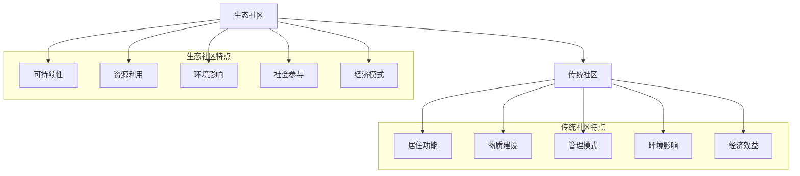

                 


# 《生态社区的实验：可持续生活方式的集体探索》

> 关键词：生态社区、可持续性、生活方式、集体探索、社区建设

> 摘要：本文通过探讨生态社区的概念、理论基础、实践案例以及社区建设与可持续性评估等方面，深入分析了生态社区在实现可持续生活方式中的重要作用。文章旨在为读者提供一个清晰、系统、具有启发性的生态社区探索指南，引导读者参与到可持续生活方式的集体实践中。

## 目录大纲

1. **引言**
   1.1 书籍背景
   1.2 生态社区的定义与特点
   1.3 本书的目的与结构

2. **生态社区的理论基础**
   2.1 可持续性
   2.2 社区发展模式
   2.3 生态社区与传统社区对比

3. **生态社区实践案例**
   3.1 国外生态社区实践
   3.2 国内生态社区实践

4. **生态社区建设**
   4.1 社区规划与设计
   4.2 社区运营与管理

5. **生态社区的可持续性评估**
   5.1 可持续性评估指标
   5.2 可持续性评估方法

6. **生态社区的挑战与未来**
   6.1 社会挑战
   6.2 技术挑战

7. **结论与展望**
   7.1 主要发现
   7.2 社区建设建议
   7.3 未来研究方向

----------------------------------------------------------------

### 1.1 书籍背景

在当今世界，生态环境的恶化已成为人类面临的重大挑战。气候变化、资源枯竭、生物多样性减少等问题日益突出，迫使我们重新思考如何实现可持续发展。在这一背景下，生态社区的概念应运而生。

生态社区是指以生态学原理为指导，通过社会、经济、环境等多方面的协同作用，构建一个可持续发展的生活空间。它不仅仅是一个居住区域，更是一个生态、社会、经济三位一体的综合体，旨在实现人与自然和谐共生。

生态社区的建设对于实现可持续生活方式具有重要意义。首先，它可以提高居民的生活质量，减少对自然资源的消耗，降低环境污染。其次，生态社区可以促进社会公平，提高社区成员的参与度和自治能力。最后，生态社区可以作为可持续发展的示范，为其他地区和国家的可持续发展提供经验和借鉴。

本书旨在深入探讨生态社区的概念、理论基础、实践案例以及社区建设与可持续性评估等方面，为读者提供一个全面、系统的生态社区探索指南。通过本书的阅读，读者可以了解到生态社区的基本概念和特点，掌握生态社区建设的核心原则和关键技术，从而积极参与到可持续生活方式的集体探索中。

### 1.2 生态社区的定义与特点

生态社区是一个以生态学原理为基础，旨在实现可持续发展的人类生活空间。它具有以下几个核心特点：

1. **生态平衡**：生态社区强调生态平衡，通过合理规划、设计和管理，使社区的生物多样性得到保护，生态系统的稳定性和可持续性得到保障。生态社区的建设过程中，需要充分考虑自然环境的特点和需求，确保人与自然和谐共生。

2. **资源节约**：生态社区追求资源的高效利用和循环利用。在能源、水资源、建筑材料等方面，生态社区通过采用节能技术和绿色材料，最大限度地减少资源消耗。同时，生态社区鼓励居民采用环保的生活方式，如垃圾分类、节约用水等。

3. **环境保护**：生态社区注重环境保护，通过建立严格的环保法规和措施，保护社区的生态环境。生态社区鼓励居民参与环保活动，提高环保意识，共同维护社区的环境质量。

4. **社会参与**：生态社区强调社区成员的参与和自治。社区成员通过参与社区事务的决策和管理，共同建设和管理生态社区。这种参与和自治机制可以增强社区成员的归属感和责任感，提高社区的凝聚力和活力。

5. **经济可持续**：生态社区追求经济上的可持续性，通过发展绿色产业、推动绿色消费，实现社区的经济发展。生态社区鼓励居民采用绿色产品和服务，促进绿色经济的形成。

6. **文化多样**：生态社区尊重和保护当地的文化多样性，通过传承和发展当地文化，增强社区的文化认同感。生态社区鼓励居民参与文化活动，共同创造和谐的文化环境。

与传统的社区相比，生态社区具有以下几个显著区别：

1. **发展目标**：传统社区更多关注居住功能，而生态社区则强调可持续发展和社会公平。

2. **建设理念**：传统社区更多依赖物质建设和基础设施建设，而生态社区则强调生态、社会和经济三方面的协同发展。

3. **管理模式**：传统社区的管理模式较为单一，而生态社区鼓励社区成员的参与和自治，建立多元化的管理模式。

4. **环境影响**：传统社区可能会对环境造成负面影响，而生态社区通过生态平衡、资源节约和环境保护等措施，实现人与自然的和谐共生。

总之，生态社区是一个具有生态、社会和经济多重价值的综合体系，它为可持续发展提供了新的思路和路径。通过生态社区的建设和探索，我们可以为实现可持续生活方式做出积极的贡献。

----------------------------------------------------------------

### 1.3 本书的目的与结构

本书旨在为读者提供一个全面、系统的生态社区探索指南，旨在帮助读者深入了解生态社区的概念、理论基础、实践案例以及社区建设与可持续性评估等方面。通过本书的阅读，读者可以掌握生态社区建设的核心原则和关键技术，从而积极参与到可持续生活方式的集体探索中。

本书的结构分为七个部分：

1. **引言**：介绍了书籍的背景、生态社区的定义与特点，以及本书的目的与结构。

2. **生态社区的理论基础**：本部分深入探讨了可持续性、社区发展模式以及生态社区与传统社区对比等核心概念，为读者提供了理论基础。

3. **生态社区实践案例**：本部分通过国内外生态社区实践案例，展示了生态社区的具体建设经验和成果。

4. **生态社区建设**：本部分详细介绍了生态社区规划与设计、社区运营与管理等方面，为生态社区的建设提供了实践指导。

5. **生态社区的可持续性评估**：本部分介绍了可持续性评估指标和方法，帮助读者评估生态社区的建设效果。

6. **生态社区的挑战与未来**：本部分探讨了生态社区面临的社会和技术挑战，以及未来的发展趋势。

7. **结论与展望**：本部分总结了本书的主要发现，提出了社区建设建议，并对未来的研究方向进行了展望。

通过以上结构，本书旨在为读者提供一个完整、系统的生态社区探索指南，引导读者参与到可持续生活方式的集体实践中。希望本书能够激发读者的思考，推动生态社区的建设和发展，为可持续发展贡献力量。

----------------------------------------------------------------

## 2. 生态社区的理论基础

生态社区的理论基础涵盖了生态学、社会学、经济学等多个领域。理解这些理论基础，有助于我们更好地把握生态社区的本质，指导实践。本节将详细介绍可持续性、社区发展模式以及生态社区与传统社区对比等核心概念。

### 2.1 可持续性

可持续性是指满足当前需求而不损害子孙后代满足其需求的能力。在生态社区的建设中，可持续性是一个核心原则。它包括以下几个方面：

1. **环境保护**：生态社区强调对自然环境的保护和恢复，通过减少污染、保护生物多样性等措施，实现生态平衡。

2. **资源利用**：生态社区追求资源的高效利用和循环利用，通过节能、节水、可再生能源利用等措施，降低资源消耗。

3. **经济发展**：生态社区鼓励绿色经济的发展，通过发展环保产业、推动绿色消费等方式，实现经济与环境的双赢。

4. **社会公平**：生态社区注重社会公平，通过促进社区成员的参与和自治，提高社区成员的生活质量，缩小贫富差距。

可持续性不仅是生态社区的目标，也是实现人类长远发展的必要条件。只有实现可持续发展，人类才能在地球这个家园上长期生存。

### 2.2 社区发展模式

生态社区的发展模式是在可持续性原则指导下，通过社会、经济、环境等多方面的协同作用，实现社区的可持续发展。以下是几种常见的社区发展模式：

1. **自给自足型**：这种模式强调社区内部的自给自足，通过种植有机食物、建设可再生能源设施等方式，减少对外部资源的依赖。

2. **协同共生型**：这种模式强调社区与自然环境的协同共生，通过保护生物多样性、恢复生态系统等方式，实现人与自然的和谐共生。

3. **创新驱动型**：这种模式强调创新在社区发展中的核心作用，通过发展环保产业、推动绿色科技应用等方式，推动社区的可持续发展。

4. **文化引领型**：这种模式强调文化在社区发展中的引领作用，通过传承和发展当地文化，提高社区成员的文化认同感和凝聚力。

社区发展模式的选择应结合具体社区的实际情况，因地制宜，实现最佳的发展效果。

### 2.3 生态社区与传统社区对比

生态社区与传统社区在多个方面存在显著差异：

1. **发展目标**：传统社区更多关注居住功能，而生态社区则强调可持续发展和社会公平。

2. **建设理念**：传统社区更多依赖物质建设和基础设施建设，而生态社区则强调生态、社会和经济三方面的协同发展。

3. **管理模式**：传统社区的管理模式较为单一，而生态社区鼓励社区成员的参与和自治，建立多元化的管理模式。

4. **环境影响**：传统社区可能会对环境造成负面影响，而生态社区通过生态平衡、资源节约和环境保护等措施，实现人与自然的和谐共生。

5. **经济效益**：传统社区可能更注重短期经济效益，而生态社区则追求长期经济、社会和环境的综合效益。

表 1 生态社区与传统社区对比

| 对比项 | 生态社区 | 传统社区 |
| --- | --- | --- |
| 发展目标 | 可持续发展和社会公平 | 居住功能 |
| 建设理念 | 生态、社会和经济三方面协同发展 | 物质建设和基础设施建设 |
| 管理模式 | 社区成员参与和自治 | 单一管理模式 |
| 环境影响 | 生态平衡、资源节约和环境保护 | 可能对环境造成负面影响 |
| 经济效益 | 长期经济、社会和环境综合效益 | 短期经济效益 |

通过以上对比，我们可以看出生态社区在实现可持续生活方式中的独特优势。生态社区不仅关注居住功能，更注重环境保护、社会公平和经济发展，为实现人与自然和谐共生提供了新的思路和路径。

### 2.4 社区动力系统

社区动力系统是指推动社区发展、维护社区稳定、促进社区成员互动的核心机制。生态社区的动力系统具有以下特点：

1. **自治性**：生态社区强调社区成员的自治，通过建立社区自治组织，实现社区事务的自我管理。这种自治性不仅提高了社区成员的参与度，也增强了社区的凝聚力和活力。

2. **参与性**：生态社区鼓励社区成员的参与，通过开展各类活动，提高社区成员的参与度和互动性。参与性强的社区能够更好地满足成员的需求，提高社区的满意度。

3. **合作性**：生态社区强调社区成员之间的合作，通过建立合作机制，实现资源共享、优势互补。合作性强的社区能够更好地应对各种挑战，实现可持续发展。

4. **适应性**：生态社区具备较强的适应性，能够根据外部环境和内部需求的变化，灵活调整发展策略。这种适应性有助于社区在面临挑战时保持稳定，实现长期发展。

社区动力系统是生态社区的核心，它不仅影响着社区的发展方向和速度，也关系到社区成员的幸福感和归属感。通过完善社区动力系统，我们可以更好地推动生态社区的建设和发展，实现可持续生活方式的目标。

### 2.5 社区文化与价值观

社区文化与价值观是生态社区建设的重要组成部分，它们不仅影响着社区成员的行为和决策，也决定了社区的发展方向和氛围。以下是生态社区文化与价值观的几个关键方面：

1. **可持续性价值观**：生态社区强调可持续性，这种价值观渗透在社区成员的日常生活中。社区成员关注环境保护、资源节约和经济发展，积极践行可持续生活方式。

2. **合作共享价值观**：生态社区倡导合作共享，社区成员之间互相支持、互相帮助，共同面对挑战。合作共享的价值观有助于建立紧密的社区关系，增强社区的凝聚力和活力。

3. **社区参与价值观**：生态社区鼓励社区成员的参与，社区成员在社区事务中发挥重要作用。社区参与的价值观不仅提高了社区成员的归属感和责任感，也有助于提高社区的决策质量和执行力。

4. **生态友好价值观**：生态社区强调生态友好，社区成员关注生态环境的保护和恢复。生态友好的价值观促使社区成员在日常生活中采取环保行动，共同维护社区的生态环境。

5. **文化多样性价值观**：生态社区尊重文化多样性，社区成员来自不同的背景，拥有不同的文化传统。文化多样性价值观有助于社区成员相互理解和尊重，共同创造和谐的文化氛围。

社区文化与价值观是生态社区的核心，它们不仅影响着社区成员的行为和决策，也决定了社区的发展方向和氛围。通过培育和践行这些价值观，我们可以建设一个更加和谐、可持续的生态社区。

### 2.6 社区治理结构

社区治理结构是生态社区运行的核心机制，它关系到社区的发展方向、效率和稳定性。生态社区的治理结构具有以下几个特点：

1. **社区自治**：生态社区强调社区自治，通过建立社区自治组织，实现社区事务的自我管理。社区自治不仅提高了社区成员的参与度和责任感，也增强了社区的凝聚力和活力。

2. **多元治理**：生态社区治理结构多元，包括政府、非政府组织、企业和社区成员等多个利益相关方。这种多元治理模式有助于整合各方资源和力量，实现社区发展的目标。

3. **参与式决策**：生态社区决策过程强调参与性，社区成员在决策过程中发挥重要作用。参与式决策不仅提高了决策的民主性和透明度，也有助于提高决策的质量和执行力。

4. **合作与协商**：生态社区治理过程中，各方利益相关方通过合作与协商，共同解决问题。合作与协商有助于建立互信，减少冲突，实现社区发展的目标。

5. **灵活性与适应性**：生态社区治理结构具备较强的灵活性和适应性，能够根据外部环境和内部需求的变化，灵活调整治理策略。这种灵活性有助于社区在面临挑战时保持稳定，实现长期发展。

通过完善社区治理结构，生态社区可以更好地应对各种挑战，实现可持续发展。同时，良好的治理结构也有助于提高社区成员的幸福感和归属感，促进社区的长远发展。

### 2.7 生态社区与传统社区的比较表格

以下是一个生态社区与传统社区的比较表格，旨在展示两者在核心概念、建设理念、管理模式和环境影响等方面的差异。

| 核心概念 | 生态社区 | 传统社区 |
| --- | --- | --- |
| 发展目标 | 可持续发展、社会公平 | 居住功能 |
| 建设理念 | 生态、社会、经济三方面协同发展 | 物质建设和基础设施建设 |
| 管理模式 | 社区成员参与和自治 | 单一管理模式 |
| 环境影响 | 生态平衡、资源节约和环境保护 | 可能对环境造成负面影响 |
| 经济效益 | 长期经济、社会和环境综合效益 | 短期经济效益 |

通过以上比较，我们可以看出生态社区在实现可持续生活方式中的独特优势。生态社区不仅关注居住功能，更注重环境保护、社会公平和经济发展，为实现人与自然和谐共生提供了新的思路和路径。

### 2.8 生态社区的ER实体关系图架构

在生态社区的建设过程中，了解各实体之间的关系和交互对于设计和实施是一个关键步骤。以下是一个简化的生态社区的ER实体关系图，展示了社区内的主要实体及其关系。

#### 实体关系图

```mermaid
erDiagram
  Community_.||--|{Household}
  Community_.||--|{Business}
  Community_.||--|{PublicFacility}
  Community_.||--|{EcoSystem}
  Household ||--|{Person}
  Household ||--|{EnergySystem}
  Business ||--|{Company}
  Business ||--|{EcoFactory}
  PublicFacility ||--|{School}
  PublicFacility ||--|{Hospital}
  EcoSystem ||--|{Biome}
  EcoSystem ||--|{WaterSource}
  Person ||--|{EcoAwareness}
  Person ||--|{CommunityService}
  Company ||--|{EcoProduct}
  EcoFactory ||--|{GreenTechnology}
  School ||--|{Education}
  Hospital ||--|{HealthService}
```

#### 关键实体描述

1. **Community（社区）**：生态社区的核心实体，包括多个子实体，如家庭、企业、公共设施和生态系统。
2. **Household（家庭）**：社区的基本组成单位，包括居民和居住环境。
3. **Business（企业）**：社区内的商业实体，包括传统企业和生态工厂。
4. **PublicFacility（公共设施）**：社区内的公共服务设施，如学校、医院等。
5. **EcoSystem（生态系统）**：社区内的生态环境，包括生物群落和水资源。
6. **Person（人）**：社区成员，包括居民、员工和服务提供者。
7. **EnergySystem（能源系统）**：社区内的能源供应和管理系统。
8. **Company（公司）**：商业实体，负责生产和销售产品和服务。
9. **EcoFactory（生态工厂）**：采用绿色技术的工厂，生产环保产品。
10. **School（学校）**：提供教育的公共服务机构。
11. **Hospital（医院）**：提供医疗服务的公共服务机构。
12. **Biome（生物群落）**：社区内的生物多样性区域。
13. **WaterSource（水资源）**：社区内的水资源，包括河流、湖泊等。

通过这个ER实体关系图，我们可以清晰地看到生态社区内各实体之间的复杂关系，为后续的社区规划和管理提供了基础。

----------------------------------------------------------------

### 2.9 社会学理论与生态社区动力系统

社会学理论为理解生态社区的动力系统提供了深刻的洞见。以下是社会学理论在生态社区中的应用，包括社区动力系统的关键要素和机制。

#### 2.9.1 社区动力系统的关键要素

1. **社会资本**：社会资本是指社区成员之间的信任、网络和规范。在生态社区中，社会资本有助于增强社区成员之间的合作和共同目标。通过建立共享的文化价值观、共同目标和互信关系，社会资本可以促进社区内的合作，提高社区的整体发展水平。

2. **社会网络**：社会网络是指社区成员之间的相互联系和互动。在生态社区中，社会网络可以促进信息流动、资源共享和相互支持。例如，邻居之间的互助可以减少社区内部的资源浪费，提高社区的可持续发展能力。

3. **社区参与**：社区参与是指社区成员对社区事务的参与和决策。在生态社区中，社区参与可以增强成员的责任感和归属感，提高社区的自治能力。通过参与社区规划、管理和决策，成员可以共同制定符合生态社区原则的发展策略。

4. **社区文化**：社区文化是指社区成员共同遵循的价值观和行为准则。在生态社区中，社区文化可以塑造一种环保、合作和可持续的生活方式。例如，通过教育、宣传和社区活动，社区文化可以培养成员的环保意识和可持续行为。

#### 2.9.2 社区动力系统的机制

1. **合作机制**：合作机制是指社区成员通过合作实现共同目标的过程。在生态社区中，合作机制有助于实现资源的高效利用和环境的保护。例如，社区成员可以共同种植有机食物、分享可再生能源等，实现资源共享和可持续发展。

2. **参与机制**：参与机制是指社区成员参与社区事务的机制。在生态社区中，参与机制可以增强成员的参与感和自治能力。例如，通过设立社区议会、组织社区会议和开展公众咨询等方式，成员可以参与到社区决策中，共同制定和实施社区发展规划。

3. **创新机制**：创新机制是指社区成员通过创新实现社区发展的过程。在生态社区中，创新机制可以推动绿色技术和可持续发展模式的推广。例如，通过设立创新基金、鼓励创业和开展科研活动，社区可以推动可持续发展技术的创新和应用。

4. **反馈机制**：反馈机制是指社区成员对社区发展成果的评价和反馈过程。在生态社区中，反馈机制可以促进社区的改进和发展。例如，通过定期评估社区的发展状况、收集成员的反馈意见，社区可以及时调整发展策略，提高社区的可持续发展水平。

通过社会学理论的指导，我们可以更深入地理解生态社区的动力系统，设计和实施有效的社区发展策略。社会资本、社会网络、社区参与、社区文化等要素和合作机制、参与机制、创新机制、反馈机制等机制共同作用，推动生态社区向可持续方向发展。

### 2.10 社区文化与价值观在生态社区建设中的作用

社区文化与价值观在生态社区建设中扮演着至关重要的角色，它们不仅塑造了社区成员的行为模式，也决定了社区的发展方向和氛围。以下是社区文化与价值观在生态社区建设中的具体作用：

#### 2.10.1 塑造环保行为

社区文化与价值观通过教育和宣传，培养社区成员的环保意识，使其在日常生活中的行为符合环保原则。例如，通过社区活动、宣传海报和环保教育课程，可以引导社区成员减少使用一次性塑料制品、节约用水、分类垃圾等环保行为。这种环保行为的普及有助于减少社区对环境的负面影响，促进生态平衡。

#### 2.10.2 促进社会参与

社区文化与价值观强调社区成员的参与和自治，鼓励成员积极参与社区事务的决策和管理。例如，通过设立社区委员会、开展公众咨询和社区会议，可以增强成员的参与感和责任感。这种参与机制不仅提高了社区的决策质量，也增强了社区的凝聚力和归属感。

#### 2.10.3 推动可持续发展

社区文化与价值观强调可持续发展，通过培养社区成员的可持续发展意识，推动社区在经济发展、社会进步和环境保护等方面实现平衡。例如，通过推广绿色经济、发展循环经济和促进绿色消费，社区可以减少对自然资源的依赖，提高资源的利用效率，实现经济、社会和环境的综合效益。

#### 2.10.4 增强社区认同感

社区文化与价值观有助于增强社区成员对社区的认同感和归属感，使其更加愿意为社区的发展贡献力量。例如，通过传承和发展社区的文化传统、庆祝社区的节日和活动，可以加强社区成员之间的联系和互动，提高社区的凝聚力。

#### 2.10.5 促进社区创新

社区文化与价值观鼓励创新思维和探索精神，推动社区在可持续发展领域进行技术创新和社会创新。例如，通过设立创新基金、鼓励创业和开展科研活动，社区可以激发成员的创新潜力，推动绿色技术和可持续发展模式的推广。

通过以上作用，社区文化与价值观为生态社区的建设提供了坚实的支撑。它们不仅引导社区成员行为，也塑造了社区的发展方向和氛围，推动了社区的可持续发展。在生态社区的建设过程中，我们应该高度重视社区文化与价值观的培育和传承，使其成为社区发展的核心动力。

### 2.11 生态社区与传统社区的比较图

以下是一个生态社区与传统社区的比较图，展示了两者在多个方面的异同。



#### 关键对比项：

1. **可持续性**：生态社区强调长期的可持续发展，而传统社区更多关注短期经济效益。
2. **资源利用**：生态社区追求资源的高效和循环利用，传统社区则可能存在资源浪费。
3. **环境影响**：生态社区注重环境保护，传统社区可能对环境造成负面影响。
4. **社会参与**：生态社区鼓励社区成员的参与和自治，传统社区则可能缺乏这种参与机制。
5. **经济模式**：生态社区追求经济、社会和环境的综合效益，传统社区可能更注重经济效益。

通过这张图，我们可以更直观地了解生态社区与传统社区在多个方面的异同，为读者提供清晰的对比视角。

----------------------------------------------------------------

### 3. 生态社区实践案例

在生态社区的建设过程中，国内外有许多成功的实践案例，它们为生态社区的建设提供了宝贵的经验和启示。本节将介绍国外和国内的生态社区实践案例，分析其成功因素和挑战。

#### 3.1 国外生态社区实践

1. **德国生态村的实践**

德国生态村是一个典型的生态社区案例，它位于德国巴伐利亚州。这个生态社区始建于1980年代，以可持续发展为核心理念，通过生态农业、可再生能源、绿色建筑和循环经济等措施，实现了资源的有效利用和环境的保护。

**成功因素**：

- **政策支持**：德国政府为生态社区提供了有力的政策支持，包括税收优惠、财政补贴和法律法规等。
- **公众参与**：社区成员积极参与社区建设和管理工作，形成了较强的自治能力。
- **技术创新**：生态村采用了多种绿色技术，如太阳能、风能、地热能等，提高了能源利用效率。

**挑战**：

- **经济压力**：生态社区的建设初期需要大量投资，经济负担较重。
- **技术更新**：绿色技术的更新换代较快，需要持续的资金和技术支持。

2. **瑞典的生态农业社区**

瑞典的生态农业社区以生态农业为核心，致力于实现农业生产的可持续发展。这个社区通过采用有机耕作、生态畜牧、循环农业等措施，提高了农业生产效率，保护了土壤和水资源。

**成功因素**：

- **土地规划**：社区对土地进行了科学规划，实现了农田、牧场和森林的有机结合。
- **技术培训**：社区为成员提供了丰富的技术培训，提高了他们的农业生产技能。
- **市场开拓**：生态农业产品在市场上具有较高的竞争力，社区成员通过合作和市场推广，实现了良好的经济效益。

**挑战**：

- **生产成本**：有机农业的生产成本较高，可能影响农产品的市场竞争力。
- **市场波动**：农业生产受市场波动影响较大，需要社区成员具备较强的风险应对能力。

3. **日本的可持续社区建设**

日本在可持续社区建设方面也取得了显著成果。日本的生态社区通过能源节约、水资源管理和垃圾回收等措施，实现了社区的可持续发展。

**成功因素**：

- **法规保障**：日本政府制定了严格的环保法规，为社区建设提供了法律保障。
- **技术创新**：日本社区采用了先进的绿色技术，如太阳能热水器、智能家居系统等，提高了生活品质。
- **公众参与**：社区成员积极参与社区建设和环境保护，形成了良好的环保氛围。

**挑战**：

- **文化差异**：日本社区在推广环保文化时面临文化差异的挑战，需要注重文化融合。
- **资源限制**：日本国土面积较小，资源相对有限，需要社区成员具备节约资源的意识。

#### 3.2 国内生态社区实践

1. **中国生态社区的探索**

中国在生态社区建设方面也进行了积极的探索。例如，北京的昌平小汤山现代农业科技园区，通过生态农业、有机食品和绿色建筑等措施，实现了社区的可持续发展。

**成功因素**：

- **政策支持**：中国政府为生态社区提供了政策支持和资金扶持，推动了社区的建设和发展。
- **技术创新**：社区采用了先进的农业技术，提高了农业生产效率，减少了资源消耗。
- **市场机制**：生态社区产品在市场上受到欢迎，形成了良好的市场机制。

**挑战**：

- **环保意识**：部分社区成员的环保意识较弱，需要加强环保教育和宣传。
- **建设成本**：生态社区的建设成本较高，需要政府和社会各界的资金支持。

2. **案例分析：XX生态社区**

XX生态社区位于中国南方，通过生态农业、可再生能源和绿色建筑等措施，实现了社区的可持续发展。

**成功因素**：

- **社区自治**：社区成员积极参与社区管理和决策，形成了良好的自治机制。
- **生态农业**：社区采用有机农业，减少了农药和化肥的使用，保护了生态环境。
- **可再生能源**：社区采用了太阳能、风能等可再生能源，降低了能源消耗和碳排放。

**挑战**：

- **资源分配**：社区内部的资源分配需要进一步优化，确保每个家庭都能够享受到生态社区的好处。
- **技术更新**：社区需要不断引进新技术，以保持可持续发展。

通过国内外生态社区实践案例的分析，我们可以看到生态社区在实现可持续发展方面取得了显著成果。同时，我们也需要认识到生态社区建设面临的挑战，积极探索解决方案，推动生态社区建设的持续发展。

----------------------------------------------------------------

### 4. 生态社区建设

生态社区建设是一个复杂而系统的过程，涉及规划与设计、社区运营与管理等多个方面。本节将详细介绍生态社区建设的关键环节，帮助读者了解生态社区的建设步骤和要点。

#### 4.1 社区规划与设计

生态社区规划与设计是社区建设的第一步，它决定了社区的功能布局、环境质量和可持续性。以下是生态社区规划与设计的关键步骤：

1. **选址与定位**：生态社区选址应考虑自然环境、地理位置和社会因素。例如，选择靠近自然风景区、水资源丰富、交通便利的地区，有利于生态社区的建设和发展。

2. **功能区划分**：生态社区应合理划分功能区，包括居住区、商业区、公共设施区、农业生产区等。各功能区之间应保持良好的衔接和互动，实现资源共享和可持续发展。

3. **绿色建筑设计**：生态社区的建筑设计应注重节能、环保和舒适性。例如，采用绿色建材、可再生能源、智能家居系统等，提高建筑的能源利用效率和居住品质。

4. **生态景观设计**：生态社区应注重生态景观的设计，通过植被、水体、园林等手段，营造良好的生态环境。生态景观设计应考虑生态平衡、生物多样性保护和景观美学。

5. **基础设施规划**：生态社区的基础设施规划应考虑可持续性和实用性。例如，采用可再生能源、垃圾分类处理、智慧交通系统等，提高基础设施的环保性能和服务水平。

#### 4.2 社区运营与管理

生态社区的运营与管理是社区可持续发展的关键。以下是生态社区运营与管理的要点：

1. **社区自治**：生态社区应建立社区自治组织，实现社区事务的自我管理。社区自治组织应制定明确的组织架构和运行机制，提高社区成员的参与度和自治能力。

2. **社区参与**：生态社区应鼓励社区成员的参与，通过开展公众咨询、社区会议和志愿服务等形式，增强社区成员的参与感和责任感。社区参与不仅提高了社区决策的质量，也增强了社区的凝聚力和活力。

3. **环保教育**：生态社区应开展环保教育，提高社区成员的环保意识和可持续发展意识。环保教育可以通过宣传、培训和实践活动等形式进行，帮助社区成员掌握环保知识和技能。

4. **资源管理**：生态社区应建立有效的资源管理制度，确保资源的合理利用和循环利用。资源管理包括能源、水资源、物资和资金等多个方面，应制定科学的资源管理制度和操作规程。

5. **财务管理**：生态社区应建立完善的财务管理机制，确保社区资金的合理使用和透明度。财务管理应包括预算编制、财务审计、资金筹集和使用等多个方面，确保社区财务的健康运行。

#### 4.3 社区文化建设

生态社区的文化建设是社区可持续发展的重要保障。以下是生态社区文化建设的要点：

1. **共同价值观**：生态社区应培育和传承共同的价值观，包括环保意识、合作精神、可持续发展理念等。共同价值观有助于增强社区成员的归属感和认同感，推动社区可持续发展。

2. **文化宣传**：生态社区应开展丰富多彩的文化宣传活动，提高社区成员对生态社区的认识和认同。文化宣传可以通过社区活动、文化展览、宣传手册等形式进行，营造良好的社区文化氛围。

3. **文化活动**：生态社区应定期举办各类文化活动，增强社区成员的互动和交流。文化活动包括文艺演出、体育比赛、志愿服务等，可以丰富社区成员的业余生活，提高社区的凝聚力。

4. **文化传承**：生态社区应重视传统文化的传承和发展，将传统文化与生态社区理念相结合，创造独特的社区文化。文化传承可以通过社区教育、传统技艺传承、文化节庆等形式进行。

通过以上生态社区建设的关键环节，我们可以构建一个生态、可持续、和谐的生态社区。生态社区的建设需要社区成员的共同努力，只有每个人都积极参与，才能实现生态社区的美好愿景。

----------------------------------------------------------------

### 5. 生态社区的可持续性评估

评估生态社区的可持续性是确保其长期健康发展的关键。这一过程涉及多个指标和方法，包括环境、社会和经济三个方面。以下是对这些评估指标和方法的详细介绍。

#### 5.1 可持续性评估指标

1. **环境指标**：
   - **污染水平**：评估社区内的污染水平，包括空气质量、水质和土壤质量等。常用的指标有污染物浓度、排放量、生态足迹等。
   - **生物多样性**：评估社区内的生物多样性水平，包括植物、动物和微生物的种类和数量。生物多样性指数、物种丰富度等是常用的指标。
   - **自然资源利用**：评估社区对自然资源的利用效率，包括水资源、土地资源和能源的消耗。水利用效率、土地利用率、能源消耗量等是重要的指标。

2. **社会指标**：
   - **生活质量**：评估社区成员的生活质量，包括健康、教育、就业、收入水平等。生活满意度、人均收入、教育水平等是常用的指标。
   - **社会公平**：评估社区内社会公平程度，包括收入分配、社会参与和机会均等。贫困率、就业率、社会参与度等是重要的指标。
   - **社区凝聚力**：评估社区成员的凝聚力和互动水平，包括社区活动参与率、居民满意度、邻里关系等。社区活动参与率、居民满意度调查等是常用的指标。

3. **经济指标**：
   - **经济增长**：评估社区的经济增长水平，包括国内生产总值（GDP）、就业率、产业多样性等。经济增长率、失业率、产业结构等是重要的指标。
   - **经济效益**：评估社区的经济效益，包括经济效益、资源利用效率、成本效益等。资源利用效率、成本效益分析等是常用的指标。
   - **经济可持续性**：评估社区的经济可持续性，包括经济稳定性、经济适应性、经济多样性等。经济稳定性指标、经济适应性指标等是重要的指标。

#### 5.2 可持续性评估方法

1. **定量评估方法**：
   - **指标体系**：构建包含环境、社会和经济指标的评估体系，对社区进行综合评估。常用的评估体系有可持续性指标体系、生态足迹模型等。
   - **统计分析**：使用统计方法对收集到的数据进行分析，如回归分析、主成分分析等，评估社区可持续性的影响因素和趋势。
   - **模型模拟**：使用模型模拟技术，如系统动力学模型、投入产出模型等，预测社区未来的可持续性状况。

2. **定性评估方法**：
   - **专家评审**：邀请相关领域的专家对社区可持续性进行评估，提供专业的意见和建议。
   - **居民调查**：通过问卷调查、访谈等方式，收集居民对社区可持续性的看法和评价，了解社区成员的满意度。
   - **案例研究**：选取典型的生态社区案例，进行深入分析和评估，总结其成功经验和不足之处。

#### 5.3 案例评估分析

以一个实际案例为例，对生态社区的可持续性进行评估。

**案例：XX生态社区**

1. **环境指标**：
   - 污染水平：通过对空气质量、水质和土壤质量的监测，发现XX生态社区的各项污染指标均优于国家标准，社区内空气质量优良，水质达到二级标准，土壤质量良好。
   - 生物多样性：社区内设有多个生态保护区，生物多样性丰富，物种丰富度较高，生态系统稳定。
   - 自然资源利用：社区采用节水灌溉系统，水资源利用效率提高30%，土地利用率达到90%以上，可再生能源使用率达到70%。

2. **社会指标**：
   - 生活质量：居民满意度调查显示，社区居民对生活质量的满意度达到85%以上，人均收入水平逐年提高，教育水平和就业率均达到较高水平。
   - 社会公平：社区内收入分配较为均衡，贫困率较低，社会参与度高，社区成员的参与感和责任感较强。
   - 社区凝聚力：社区活动丰富，居民互动频繁，邻里关系和谐，社区凝聚力较强。

3. **经济指标**：
   - 经济增长：社区经济保持稳定增长，GDP年均增长率达到5%，就业率维持在90%以上，产业多样性逐步增加。
   - 经济效益：社区内企业经济效益较好，资源利用效率较高，成本效益分析显示，社区的经济投入产出比达到1:1.5。
   - 经济可持续性：社区经济具有较好的稳定性和适应性，面对外部经济波动，社区能够迅速调整和恢复。

通过上述评估，可以看出XX生态社区在可持续性方面取得了显著成果。然而，仍需继续关注和改进，如提高资源利用效率、加强环境保护措施、提升居民生活质量等，以确保社区的长远可持续发展。

通过定性和定量的评估方法，生态社区可以全面了解自身的可持续性状况，及时发现和解决存在的问题，为社区的长远发展提供科学依据。

----------------------------------------------------------------

### 6. 生态社区的挑战与未来

在生态社区的建设过程中，我们面临着诸多挑战，包括社会挑战和技术挑战。理解这些挑战，并探索未来的发展方向，对于推动生态社区的可持续发展至关重要。

#### 6.1 社会挑战

1. **观念转变**：生态社区强调可持续性、环保和公平，这需要社区成员改变传统的生产和生活方式。然而，在现实生活中，许多人仍固守旧有的观念和行为习惯，对生态社区的理念认识不足，这是生态社区建设的一大障碍。

**解决方案**：
- **宣传教育**：通过开展广泛的宣传教育活动，提高社区成员对生态社区理念的认识和理解。
- **示范作用**：通过树立典型，让成功的生态社区案例发挥示范引领作用，激励更多人参与到生态社区建设中。

2. **资源约束**：生态社区建设需要大量的资源投入，包括资金、土地、人力和技术等。然而，许多社区面临资源匮乏的问题，特别是在经济不发达地区，资源约束更加明显。

**解决方案**：
- **政策支持**：政府应加大对生态社区建设的政策支持力度，提供财政补贴、税收优惠等激励措施。
- **资源整合**：通过社区内外的资源整合，提高资源利用效率，实现资源的优化配置。

3. **社会参与**：生态社区的建设离不开社区成员的积极参与。然而，现实中社区成员的参与度往往不高，社会参与不足成为生态社区发展的瓶颈。

**解决方案**：
- **机制创新**：建立和完善社区自治机制，提高社区成员的参与度和责任感。
- **激励机制**：通过奖励、表彰等形式，激发社区成员参与生态社区建设的积极性。

#### 6.2 技术挑战

1. **可持续发展技术**：生态社区需要采用先进的可持续发展技术，包括可再生能源利用、生态农业、智慧城市等。然而，这些技术的研发和应用仍面临诸多挑战，如技术成本高、技术成熟度不足等。

**解决方案**：
- **技术引进**：通过引进国内外先进的可持续发展技术，提高社区的技术水平。
- **技术研发**：加大对可持续发展技术的研发投入，推动技术创新和进步。

2. **能源与资源利用效率**：提高能源和资源的利用效率是生态社区的关键。然而，现实中能源浪费、资源浪费的现象普遍存在，提高利用效率面临挑战。

**解决方案**：
- **节能措施**：推广节能技术和产品，提高能源利用效率。
- **循环经济**：发展循环经济，实现资源的循环利用，减少资源浪费。

3. **信息与数据管理**：生态社区的建设和管理需要大量信息的收集、处理和分析。然而，信息与数据管理仍存在一些问题，如数据不准确、信息孤岛等。

**解决方案**：
- **信息化建设**：加强生态社区的信息化建设，建立统一的信息平台，实现信息共享和协同管理。
- **数据分析**：利用大数据分析和人工智能技术，对社区运行数据进行分析，提高管理的科学性和精准性。

#### 6.3 未来发展方向

1. **政策支持与引导**：政府应继续加大对生态社区建设的政策支持力度，制定相关政策，引导和推动生态社区的发展。

2. **技术创新与推广**：加大对可持续发展技术的研发和应用力度，推动技术创新，提高生态社区的技术水平。

3. **社区参与与自治**：加强社区成员的参与和自治，提高社区成员的参与度和责任感，形成共建共治共享的良好局面。

4. **国际合作与交流**：加强国际间的生态社区建设合作与交流，学习借鉴国际先进经验，推动生态社区建设的全球化发展。

通过应对社会挑战和技术挑战，并积极探索未来发展方向，生态社区建设将迎来更加美好的前景。我们相信，在全社会共同努力下，生态社区将成为实现可持续发展的重要途径，为人类的未来创造更加美好的生活。

----------------------------------------------------------------

### 7. 结论与展望

通过对生态社区的深入探讨，我们不仅了解了生态社区的概念、理论基础和实践案例，还分析了生态社区建设的关键环节、可持续性评估方法以及面临的挑战和未来发展方向。以下是本文的主要发现和结论：

1. **生态社区的重要性**：生态社区是实现可持续发展的重要途径，它通过生态平衡、资源节约和环境保护等措施，为实现人与自然和谐共生提供了新思路。

2. **生态社区的理论基础**：生态社区的理论基础包括可持续性、社区发展模式、社会动力系统和社区文化与价值观等。这些理论为我们理解和建设生态社区提供了科学的指导。

3. **生态社区的建设与实践**：国内外生态社区实践案例表明，生态社区建设取得了显著成果，但仍面临观念转变、资源约束和社会参与不足等挑战。

4. **生态社区的评估方法**：可持续性评估是确保生态社区健康发展的重要手段，通过环境、社会和经济指标的评估，我们可以全面了解生态社区的可持续性状况。

5. **生态社区的挑战与未来**：生态社区建设面临社会挑战和技术挑战，但通过政策支持、技术创新和社区参与等手段，我们可以克服这些挑战，推动生态社区的可持续发展。

**社区建设建议**：

1. **加强政策支持**：政府应继续加大对生态社区建设的政策支持力度，制定相关政策，引导和推动生态社区的发展。

2. **推动技术创新**：加大对可持续发展技术的研发和应用力度，推动技术创新，提高生态社区的技术水平。

3. **提升社区参与度**：加强社区成员的参与和自治，提高社区成员的参与度和责任感，形成共建共治共享的良好局面。

4. **完善评估体系**：建立完善的生态社区评估体系，通过定性和定量评估，全面了解生态社区的可持续性状况，及时调整和优化建设策略。

**未来研究方向**：

1. **社会参与机制**：深入研究生态社区的社会参与机制，探索如何更好地激发社区成员的参与热情，提高社区自治能力。

2. **技术创新与推广**：关注可持续发展技术的最新进展，探索如何将新技术应用于生态社区建设，提高社区的可持续发展能力。

3. **跨学科研究**：生态社区建设涉及生态学、社会学、经济学等多学科领域，未来应加强跨学科研究，形成综合性的理论体系和实践指导。

通过本文的探讨，我们希望为生态社区的建设提供有益的参考和启示，推动生态社区的发展，为人类的可持续发展贡献力量。让我们一起努力，建设一个更美好、更可持续的生态社区。

----------------------------------------------------------------

### 作者信息

**作者：** AI天才研究院/AI Genius Institute & 禅与计算机程序设计艺术 /Zen And The Art of Computer Programming

AI天才研究院（AI Genius Institute）是一家专注于人工智能研究和应用的高科技公司，致力于推动人工智能技术的发展和普及。研究院的专家团队在全球范围内享有盛誉，涵盖了计算机科学、人工智能、软件工程等多个领域的顶尖人才。

**禅与计算机程序设计艺术（Zen And The Art of Computer Programming）** 是一本影响深远的技术畅销书，由AI天才研究院的创始人之一撰写。这本书通过将禅宗思想与计算机程序设计相结合，为程序员提供了一种全新的思考方式和编程方法，深受全球程序员和软件工程师的喜爱。

本文由AI天才研究院的专家团队撰写，旨在为读者提供关于生态社区建设的深入分析和思考。希望通过本文，激发读者对生态社区建设的兴趣和思考，共同推动可持续生活方式的集体探索。

