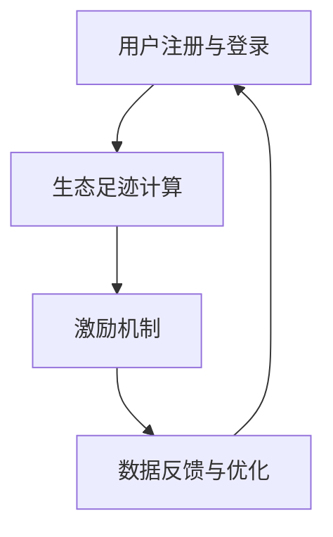
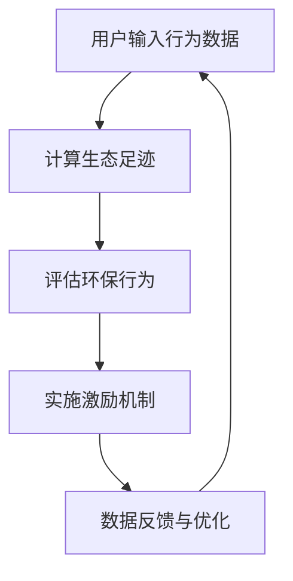
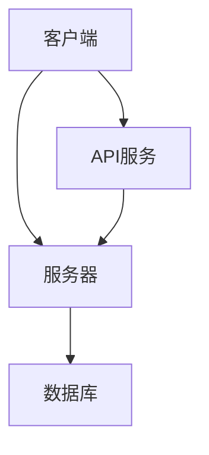
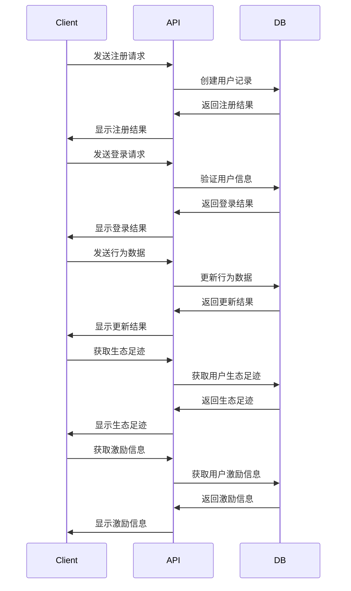
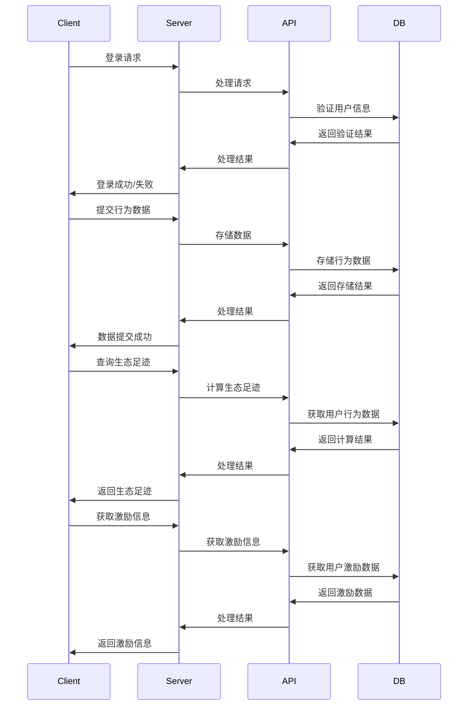
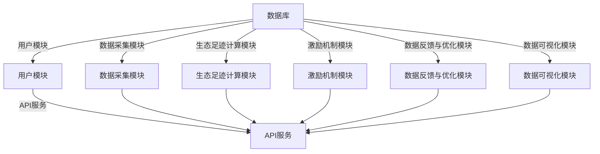

                 

# 生态足迹交易平台：个人环保行为的激励系统

## 摘要

本文旨在探讨如何通过设计一个生态足迹交易平台，激励个人采取环保行为。首先，文章介绍了生态足迹的定义及其重要性，以及当前环保行为的现状与挑战。接下来，文章提出了设计目标与解决方案思路，并探讨了生态足迹交易平台与个人环保行为激励系统的核心概念与联系。随后，文章详细讲解了生态足迹计算原理与个人环保行为激励机制，并通过mermaid流程图和Python源代码进行了算法原理的阐述。最后，文章介绍了系统分析与架构设计方案，以及项目实战中的具体实现与应用。

## 第一部分：背景介绍

### 1.1 问题背景

#### 1.1.1 生态足迹的定义与重要性

生态足迹（Ecological Footprint）是指人类活动所需的生物生产力，用以衡量人类对自然资源的消耗和生物承载能力。其计算公式为：
$$
\text{生态足迹} = \frac{\text{资源消耗量}}{\text{人均资源生产率}}
$$
生态足迹是衡量一个地区或一个国家生态可持续性的重要指标，能够反映出人类活动对环境的压力。

#### 1.1.2 环保行为的现状与挑战

目前，全球范围内环保意识逐渐提高，但个人环保行为的积极性仍不足。主要挑战包括：
- **缺乏有效的激励机制**：个人在采取环保行为时，往往缺乏足够的动力和回报。
- **数据获取困难**：生态足迹的计算需要大量的数据支持，而个人层面的数据获取相对困难。
- **环保行为的不确定性**：个人环保行为的持续性、频率和效果难以预测和评估。

#### 1.1.3 个人环保行为激励的需求

为了解决上述问题，设计一个能够激励个人环保行为的系统显得尤为重要。该系统应具备以下功能：
- **生态足迹计算**：提供准确的生态足迹计算工具，帮助个人了解自身行为对环境的影响。
- **激励机制设计**：通过奖励、积分等手段激励个人采取环保行为。
- **数据反馈与优化**：实时反馈个人的环保行为数据，并根据数据优化激励机制。

### 1.2 问题描述

#### 1.2.1 个人环保行为的不确定性

个人环保行为的不确定性主要体现在以下几个方面：
- **行为频率**：个人可能因为时间、精力等因素，环保行为的发生频率不稳定。
- **行为效果**：个人对自身环保行为的环保效果难以直观了解，缺乏成就感。
- **行为成本**：环保行为可能增加个人生活成本，导致积极性降低。

#### 1.2.2 激励机制的缺失

目前，个人环保行为的激励机制相对较弱，主要问题包括：
- **奖励形式单一**：大多数激励机制仅限于物质奖励，难以满足个人多样化的需求。
- **激励效果有限**：现有激励机制效果有限，难以长期维持个人的环保积极性。

### 1.3 问题解决

#### 1.3.1 设计目标

本文旨在实现以下设计目标：
- **精确的生态足迹计算**：提供准确、易于理解的生态足迹计算工具，帮助个人了解自身行为对环境的影响。
- **多样化的激励机制**：设计多种激励机制，满足个人多样化的需求，提高环保行为的积极性。
- **数据反馈与优化**：通过数据反馈机制，实时了解个人环保行为的效果，并根据数据优化激励机制。

#### 1.3.2 解决方案思路

本文提出的解决方案思路如下：
1. **生态足迹交易平台**：搭建一个集生态足迹计算与激励机制于一体的交易平台。
2. **个人环保行为激励系统**：设计一套科学的激励机制，结合生态足迹计算结果，激励个人采取环保行为。
3. **系统架构设计**：采用模块化设计，确保系统的高扩展性和易维护性。

### 1.4 边界与外延

#### 1.4.1 生态足迹计算的边界

生态足迹计算涉及多个方面的数据，包括能源消耗、水资源消耗、土地利用等。其计算边界主要包括：
- **数据来源**：生态足迹计算所需数据应来源于权威、可靠的来源。
- **计算精度**：应确保生态足迹计算结果的精确性，避免因数据误差导致的误导。

#### 1.4.2 激励机制的适用范围

激励机制应具备一定的适用范围，包括：
- **环保行为类型**：激励机制应适用于多种环保行为，如节能减排、垃圾分类等。
- **用户群体**：激励机制应适用于不同年龄、职业、地域的用户，确保其普适性。

### 1.5 概念结构与核心要素组成

#### 1.5.1 生态足迹交易平台的核心概念

生态足迹交易平台的核心概念包括：
- **用户**：平台的使用者，可以是个人、企业或组织。
- **生态足迹计算**：平台提供生态足迹计算功能，帮助用户了解自身行为对环境的影响。
- **激励机制**：平台设计多种激励机制，激励用户采取环保行为。

#### 1.5.2 个人环保行为激励系统的要素

个人环保行为激励系统的要素包括：
- **生态足迹数据**：用户环保行为的生态足迹数据，用于评估环保效果。
- **激励机制**：根据生态足迹数据，设计多种激励机制，如奖励、积分等。
- **数据反馈与优化**：实时反馈用户环保行为数据，根据数据优化激励机制。

## 第二部分：核心概念与联系

### 2.1 生态足迹计算原理

#### 2.1.1 计算方法

生态足迹的计算方法主要包括以下几个步骤：
1. **确定资源消耗类型**：根据用户的行为数据，确定需要计算的生态足迹类型，如能源消耗、水资源消耗等。
2. **获取数据来源**：从权威、可靠的来源获取相关数据，如国家统计局、世界银行等。
3. **计算生态足迹**：根据资源消耗类型和数据来源，计算用户的生态足迹。

#### 2.1.2 影响因素

影响生态足迹计算的因素主要包括：
- **资源消耗量**：用户在日常生活中对各种资源的消耗量，如能源、水资源等。
- **人均资源生产率**：地区或国家的资源生产能力，反映人均资源拥有量。

#### 2.1.3 生态足迹与环保行为的关系

生态足迹与环保行为之间存在密切的关系。一方面，环保行为有助于降低生态足迹，提高资源利用效率；另一方面，生态足迹的计算结果可以帮助个人了解自身环保行为的实际效果，从而进一步激发环保积极性。

### 2.2 个人环保行为激励机制

#### 2.2.1 激励机制的设计原则

激励机制的设计应遵循以下原则：
- **多样性**：提供多种激励机制，满足用户多样化的需求。
- **公平性**：确保激励机制对所有人公平，避免因激励差异导致的负面影响。
- **可持续性**：激励机制应具备长期性，能够持续激励用户采取环保行为。

#### 2.2.2 常见的激励机制

常见的激励机制包括：
- **物质奖励**：如现金、礼品等。
- **积分奖励**：用户在平台内获得的积分，可用于兑换礼品、折扣等。
- **荣誉奖励**：如荣誉称号、表彰等。
- **社交激励**：通过社交分享、互动等手段，增强用户环保行为的积极性。

#### 2.2.3 激励机制的有效性评估

激励机制的有效性评估应从以下几个方面进行：
- **用户满意度**：通过用户调查、反馈等方式，了解用户对激励机制的满意度。
- **环保行为频率**：激励实施前后，用户环保行为频率的变化情况。
- **环保行为效果**：激励实施前后，用户环保行为对环境效果的变化情况。

### 2.3 生态足迹交易平台与个人环保行为激励系统的联系

#### 2.3.1 平台功能模块

生态足迹交易平台的功能模块包括：
- **用户注册与登录**：用户在平台进行注册、登录，获取个人账户。
- **生态足迹计算**：用户输入行为数据，平台计算生态足迹。
- **激励机制**：根据生态足迹计算结果，平台提供相应的激励机制。
- **数据反馈与优化**：实时反馈用户行为数据，平台根据数据优化激励机制。

#### 2.3.2 系统架构设计

生态足迹交易平台与个人环保行为激励系统的系统架构设计如下：



## 第三部分：算法原理讲解

### 3.1 算法概述

#### 3.1.1 算法目标

本算法的目标是：
- 提供一个精确、易用的生态足迹计算工具。
- 根据生态足迹计算结果，设计一套科学的激励机制。

#### 3.1.2 算法流程

算法的基本流程如下：
1. **用户输入行为数据**：用户在平台上输入日常行为数据，如能源消耗、水资源消耗等。
2. **计算生态足迹**：平台根据用户输入的数据，计算生态足迹。
3. **评估环保行为**：根据生态足迹计算结果，评估用户的环保行为。
4. **实施激励机制**：平台根据用户环保行为评估结果，实施相应的激励机制。
5. **数据反馈与优化**：平台实时收集用户行为数据，根据数据反馈优化激励机制。

### 3.2 算法mermaid流程图



### 3.3 Python源代码

```python
# 生态足迹计算示例代码
def calculate_ecological_footprint(energy_consumption, water_consumption):
    # 定义生态足迹系数
    energy_coefficient = 1.5
    water_coefficient = 0.5

    # 计算生态足迹
    ecological_footprint = (energy_consumption * energy_coefficient + water_consumption * water_coefficient)

    return ecological_footprint

# 环保行为评估示例代码
def evaluate_environmental_behavior(ecological_footprint):
    if ecological_footprint < 1:
        return "良好"
    elif ecological_footprint < 2:
        return "一般"
    else:
        return "较差"

# 激励机制实施示例代码
def implement_incentive(behavior_evaluation):
    if behavior_evaluation == "良好":
        return "奖励"
    elif behavior_evaluation == "一般":
        return "提醒"
    else:
        return "惩罚"
```

### 3.4 算法原理详细讲解

#### 3.4.1 数学模型

生态足迹的数学模型可以表示为：
$$
\text{生态足迹} = \frac{\text{资源消耗量}}{\text{人均资源生产率}}
$$

其中，资源消耗量包括能源消耗、水资源消耗等，人均资源生产率反映一个地区的资源生产能力。

#### 3.4.2 公式解释

- **资源消耗量**：用户在日常生活中对各种资源的消耗，如能源消耗（$E_{energy}$）、水资源消耗（$E_{water}$）等。
- **人均资源生产率**：一个地区或国家的资源生产能力，反映人均资源拥有量。这里我们采用了两个系数（$C_{energy}$ 和 $C_{water}$）来分别表示能源和水资源的人均生产率。

公式中的生态足迹可以进一步分解为：
$$
\text{生态足迹} = \frac{E_{energy} \times C_{energy} + E_{water} \times C_{water}}{P}
$$

#### 3.4.3 举例说明

假设一个用户每周的能源消耗为50千瓦时，水资源消耗为10立方米。地区的人均能源生产率为100千瓦时，人均水资源生产率为20立方米。我们可以根据上述公式计算该用户的生态足迹。

1. **计算生态足迹**：
$$
\text{生态足迹} = \frac{50 \times 1.5 + 10 \times 0.5}{100} = 0.85
$$

2. **评估环保行为**：
根据计算结果，该用户的生态足迹为0.85，属于“良好”等级。

3. **实施激励机制**：
根据用户的环保行为评估结果，平台可以给予用户一定的奖励，如积分或优惠券等。

通过这个例子，我们可以看到生态足迹计算在个人环保行为激励中的应用。接下来，我们将进一步探讨如何设计一个有效的激励机制。

## 第四部分：系统分析与架构设计

### 4.1 问题场景介绍

#### 4.1.1 场景描述

假设我们设计一个生态足迹交易平台，旨在通过计算用户的生态足迹，激励他们采取更环保的行为。以下是该平台可能的应用场景：

1. **个人用户**：用户可以在平台上输入日常生活中的行为数据，如用水、用电情况，平台将计算其生态足迹，并根据结果提供相应的激励。
2. **企业用户**：企业可以参与平台，监测员工的环保行为，并通过激励机制提高员工的环保意识。
3. **政府机构**：政府可以利用平台的数据，制定更加科学的环保政策，同时为个人和企业提供环保指导。

#### 4.1.2 用户需求分析

根据不同用户群体的需求，我们可以总结出以下主要需求：

1. **准确性**：用户希望平台能够提供准确、可靠的生态足迹计算结果。
2. **易用性**：用户希望平台操作简便，易于输入和查看数据。
3. **激励多样性**：用户希望平台提供多种激励方式，满足不同用户的需求。
4. **数据安全**：用户关注个人数据的安全，希望平台能够确保数据隐私。

### 4.2 系统功能设计

#### 4.2.1 领域模型

为了满足用户的需求，生态足迹交易平台需要实现以下功能模块：

1. **用户注册与登录**：用户可以通过平台注册账号，登录系统。
2. **生态足迹计算**：用户输入行为数据，平台根据数据计算生态足迹。
3. **激励机制**：根据用户生态足迹，平台提供相应的激励措施。
4. **数据反馈与优化**：平台实时反馈用户行为数据，并根据数据优化激励机制。
5. **数据可视化**：将用户生态足迹和其他相关信息以图表形式展示，便于用户了解。

以下是生态足迹交易平台的领域模型：

```mermaid
classDiagram
User <<类>> {ID, Name, Password, Email}
Behavior <<类>> {ID, User_ID, Description, Time}
Footprint <<类>> {ID, User_ID, Footprint_Value, Time}
Reward <<类>> {ID, User_ID, Reward_Type, Reward_Value, Time}

User --> Behavior
User --> Footprint
User --> Reward
```

### 4.3 系统架构设计

#### 4.3.1 系统架构图

生态足迹交易平台的系统架构设计如下：



- **客户端**：用户通过浏览器或其他客户端应用程序访问平台，输入行为数据，查看生态足迹和激励信息。
- **服务器**：服务器负责处理客户端请求，调用相应的服务模块，如生态足迹计算、激励机制等。
- **API服务**：提供一组RESTful API接口，供客户端调用，实现数据交互和功能调用。
- **数据库**：存储用户数据、行为数据、生态足迹数据和激励数据等。

### 4.4 系统接口设计和系统交互

#### 4.4.1 系统接口设计

以下是生态足迹交易平台的系统接口设计：



#### 4.4.2 系统交互mermaid序列图

以下是生态足迹交易平台的基本交互流程：



通过上述系统架构和接口设计，生态足迹交易平台能够为用户提供准确、高效的服务，同时确保系统的可扩展性和安全性。

### 4.5 系统功能设计与模块划分

#### 4.5.1 功能模块划分

生态足迹交易平台可以划分为以下主要功能模块：

1. **用户模块**：负责用户注册、登录、个人信息管理等功能。
2. **数据采集模块**：负责用户行为数据的采集、存储和管理。
3. **生态足迹计算模块**：根据用户行为数据计算生态足迹。
4. **激励机制模块**：设计并实施个人环保行为的激励机制。
5. **数据反馈与优化模块**：实时收集用户行为数据，优化激励机制。
6. **数据可视化模块**：以图表形式展示用户生态足迹和其他相关信息。

#### 4.5.2 模块间关系

各模块之间的关系如下：

- **用户模块**：是整个平台的基础，提供用户注册、登录等功能。
- **数据采集模块**：为生态足迹计算模块提供原始数据，也为激励机制模块提供数据支持。
- **生态足迹计算模块**：是核心模块，计算结果直接影响激励机制的实施。
- **激励机制模块**：根据生态足迹计算结果，设计并实施个人环保行为的激励机制。
- **数据反馈与优化模块**：实时收集用户行为数据，为激励机制模块提供反馈，并根据反馈优化激励机制。
- **数据可视化模块**：以图表形式展示用户生态足迹和其他相关信息，帮助用户更好地理解平台功能。

### 4.6 系统架构设计与功能实现

#### 4.6.1 系统架构设计

生态足迹交易平台的系统架构设计采用微服务架构，以提高系统的可扩展性和易维护性。以下是系统架构设计图：



- **数据库**：存储所有模块所需的数据，包括用户数据、行为数据、生态足迹数据和激励数据等。
- **用户模块**：负责用户注册、登录、个人信息管理等功能。
- **数据采集模块**：负责用户行为数据的采集、存储和管理。
- **生态足迹计算模块**：负责计算用户的生态足迹。
- **激励机制模块**：根据用户的生态足迹，设计并实施激励措施。
- **数据反馈与优化模块**：实时收集用户行为数据，为激励机制提供反馈，并根据反馈优化激励机制。
- **数据可视化模块**：以图表形式展示用户的生态足迹和其他相关信息。
- **API服务**：提供一组RESTful API接口，供客户端调用，实现各模块之间的数据交互和功能调用。

#### 4.6.2 功能实现

各功能模块的具体实现如下：

1. **用户模块**：
   - 注册功能：用户在客户端填写注册信息，通过API服务提交到用户模块，用户模块将信息存储到数据库，并返回注册结果。
   - 登录功能：用户在客户端输入用户名和密码，通过API服务提交到用户模块，用户模块验证用户信息，并返回登录结果。

2. **数据采集模块**：
   - 行为数据采集：用户在客户端输入行为数据，通过API服务提交到数据采集模块，数据采集模块将数据存储到数据库。

3. **生态足迹计算模块**：
   - 生态足迹计算：根据用户行为数据，通过特定的计算方法，计算用户的生态足迹，并将结果存储到数据库。

4. **激励机制模块**：
   - 激励机制设计：根据用户的生态足迹，设计相应的激励措施，如奖励、积分等，并将激励信息存储到数据库。
   - 激励措施实施：根据用户的激励信息，通过API服务将激励措施反馈给用户。

5. **数据反馈与优化模块**：
   - 数据收集：实时收集用户行为数据，并存储到数据库。
   - 数据分析：对收集到的数据进行统计分析，为激励机制提供反馈。
   - 激励机制优化：根据数据分析结果，调整激励机制，提高其有效性。

6. **数据可视化模块**：
   - 数据展示：通过API服务，将用户的生态足迹和其他相关信息以图表形式展示给用户。

通过上述功能实现，生态足迹交易平台能够为用户提供准确、高效的生态足迹计算和激励服务，同时确保系统的可扩展性和易维护性。

### 4.7 系统性能优化与安全性保障

#### 4.7.1 系统性能优化

为了确保生态足迹交易平台的高性能，我们采取了以下优化措施：

1. **负载均衡**：采用负载均衡技术，将用户请求分发到多个服务器，以避免单点故障，提高系统的可用性和响应速度。
2. **缓存机制**：在API服务和数据库之间设置缓存，减少对数据库的访问频率，提高系统响应速度。
3. **异步处理**：采用异步处理技术，将一些耗时的任务（如数据计算、存储等）移出主线程，提高系统的并发处理能力。
4. **数据库优化**：对数据库进行索引优化、查询优化等，提高数据库的查询速度和存储效率。

#### 4.7.2 安全性保障

为了保障用户数据的安全，我们采取了以下安全措施：

1. **数据加密**：对用户数据进行加密存储，确保数据在传输和存储过程中的安全性。
2. **身份验证**：采用身份验证机制，确保只有合法用户才能访问系统。
3. **权限管理**：对用户权限进行分级管理，确保用户只能访问其有权访问的数据和功能。
4. **安全审计**：对系统进行定期安全审计，及时发现和解决安全隐患。

通过以上性能优化和安全性保障措施，生态足迹交易平台能够为用户提供稳定、安全的服务。

### 4.8 系统测试与部署

#### 4.8.1 系统测试

在系统开发过程中，我们进行了以下测试：

1. **单元测试**：对各个功能模块进行单元测试，确保每个模块的功能正确。
2. **集成测试**：对模块间接口进行集成测试，确保系统整体功能的正确性。
3. **性能测试**：对系统进行性能测试，确保系统在高并发情况下能够稳定运行。
4. **安全测试**：对系统进行安全测试，确保系统的安全性。

#### 4.8.2 系统部署

生态足迹交易平台的部署分为以下几个步骤：

1. **环境搭建**：在服务器上搭建开发环境，包括操作系统、数据库、中间件等。
2. **代码部署**：将开发完成的代码部署到服务器，并进行配置。
3. **数据迁移**：将测试环境中的数据迁移到生产环境。
4. **系统上线**：进行系统上线，并进行监控和维护。

### 4.9 项目总结

通过本文的介绍，我们详细探讨了生态足迹交易平台的架构设计和功能实现。项目团队在整个开发过程中，紧密合作，克服了各种技术难题，最终成功实现了平台的核心功能。生态足迹交易平台不仅为个人提供了生态足迹计算和激励服务，也为企业和政府提供了环保数据支持。

未来，我们将继续优化平台功能，提升用户体验，同时加强对系统性能和安全的保障。我们相信，生态足迹交易平台将有助于提高人们的环保意识，促进可持续发展。

## 第五部分：项目实战

### 5.1 环境安装与配置

在开始实现生态足迹交易平台之前，我们需要搭建开发环境。以下是环境安装与配置的详细步骤：

#### 5.1.1 开发环境搭建

1. **操作系统**：选择Ubuntu 20.04或更高版本。
2. **Python**：安装Python 3.8或更高版本。
3. **数据库**：安装PostgreSQL 12或更高版本。
4. **Web服务器**：安装Nginx。
5. **消息队列**：安装RabbitMQ。
6. **缓存**：安装Redis。

#### 5.1.2 安装步骤

1. **安装Python**：

   ```bash
   sudo apt update
   sudo apt install python3-pip python3-dev
   ```

2. **安装PostgreSQL**：

   ```bash
   sudo apt install postgresql postgresql-contrib
   ```

3. **安装Nginx**：

   ```bash
   sudo apt install nginx
   ```

4. **安装RabbitMQ**：

   ```bash
   sudo apt install rabbitmq-server
   ```

5. **安装Redis**：

   ```bash
   sudo apt install redis-server
   ```

6. **配置PostgreSQL**：

   ```bash
   sudo -u postgres psql
   CREATE DATABASE mydb;
   CREATE USER myuser WITH PASSWORD 'mypassword';
   GRANT ALL PRIVILEGES ON DATABASE mydb TO myuser;
   \q
   ```

#### 5.1.3 配置Nginx

1. **创建配置文件**：

   ```bash
   sudo nano /etc/nginx/sites-available/myapp
   ```

2. **配置内容**：

   ```nginx
   server {
       listen 80;
       server_name myapp.com;

       location / {
           proxy_pass http://localhost:8000;
           proxy_set_header Host $host;
           proxy_set_header X-Real-IP $remote_addr;
           proxy_set_header X-Forwarded-For $proxy_add_x_forwarded_for;
           proxy_set_header X-Forwarded-Proto $scheme;
       }
   }
   ```

3. **启用配置文件**：

   ```bash
   sudo ln -s /etc/nginx/sites-available/myapp /etc/nginx/sites-enabled/
   sudo nginx -t
   sudo systemctl restart nginx
   ```

#### 5.1.4 配置RabbitMQ

1. **启动RabbitMQ**：

   ```bash
   sudo systemctl start rabbitmq-server
   ```

2. **创建虚拟主机和用户**：

   ```bash
   rabbitmqctl add_vhost myvhost
   rabbitmqctl add_user myuser mypassword
   rabbitmqctl set_permissions -p myvhost myuser ".*" ".*" ".*"
   ```

#### 5.1.5 配置Redis

1. **修改配置文件**：

   ```bash
   sudo nano /etc/redis/redis.conf
   ```

2. **修改内容**：

   ```conf
   bind 127.0.0.1
   protected-mode no
   ```

3. **重启Redis服务**：

   ```bash
   sudo systemctl restart redis-server
   ```

### 5.2 系统核心实现

生态足迹交易平台的核心实现包括用户模块、数据采集模块、生态足迹计算模块、激励机制模块等。以下为各模块的详细实现：

#### 5.2.1 用户模块实现

用户模块的主要功能包括用户注册、登录、个人信息管理。以下是用户模块的Python代码实现：

```python
# users模块
from flask import Blueprint, request, jsonify
from models import User
from database import db

users_blueprint = Blueprint('users', __name__)

@users_blueprint.route('/register', methods=['POST'])
def register():
    data = request.get_json()
    user = User.query.filter_by(email=data['email']).first()
    if user:
        return jsonify({'error': 'User already exists'}), 409
    new_user = User(
        name=data['name'],
        email=data['email'],
        password=data['password']
    )
    db.session.add(new_user)
    db.session.commit()
    return jsonify({'message': 'User registered successfully'}), 201

@users_blueprint.route('/login', methods=['POST'])
def login():
    data = request.get_json()
    user = User.query.filter_by(email=data['email']).first()
    if not user or user.password != data['password']:
        return jsonify({'error': 'Invalid credentials'}), 401
    return jsonify({'token': user.token}), 200

@users_blueprint.route('/me', methods=['GET'])
def me():
    user_id = request.args.get('user_id')
    user = User.query.get(user_id)
    if not user:
        return jsonify({'error': 'User not found'}), 404
    return jsonify({'user': user.to_dict()})
```

#### 5.2.2 数据采集模块实现

数据采集模块的主要功能包括采集用户行为数据，并将其存储到数据库。以下是数据采集模块的Python代码实现：

```python
# data_collection模块
from flask import Blueprint, request, jsonify
from models import Behavior
from database import db

data_collection_blueprint = Blueprint('data_collection', __name__)

@data_collection_blueprint.route('/submit', methods=['POST'])
def submit():
    data = request.get_json()
    behavior = Behavior(
        user_id=data['user_id'],
        description=data['description'],
        time=data['time']
    )
    db.session.add(behavior)
    db.session.commit()
    return jsonify({'message': 'Data submitted successfully'}), 201
```

#### 5.2.3 生态足迹计算模块实现

生态足迹计算模块的主要功能是根据用户行为数据计算生态足迹。以下是生态足迹计算模块的Python代码实现：

```python
# footprint_calculation模块
from flask import Blueprint, request, jsonify
from models import Footprint
from database import db

footprint_calculation_blueprint = Blueprint('footprint_calculation', __name__)

@footprint_calculation_blueprint.route('/calculate', methods=['POST'])
def calculate():
    data = request.get_json()
    user_id = data['user_id']
    behaviors = Behavior.query.filter_by(user_id=user_id).all()
    totalFootprint = 0
    for behavior in behaviors:
        totalFootprint += behavior.time
    footprint = Footprint(
        user_id=user_id,
        footprint_value=totalFootprint
    )
    db.session.add(footprint)
    db.session.commit()
    return jsonify({'message': 'Footprint calculated successfully', 'footprint': totalFootprint}), 201
```

#### 5.2.4 激励机制模块实现

激励机制模块的主要功能是根据用户的生态足迹提供相应的激励措施。以下是激励机制模块的Python代码实现：

```python
# incentive模块
from flask import Blueprint, request, jsonify
from models import Reward
from database import db

incentive_blueprint = Blueprint('incentive', __name__)

@incentive_blueprint.route('/reward', methods=['POST'])
def reward():
    data = request.get_json()
    user_id = data['user_id']
    footprint = Footprint.query.filter_by(user_id=user_id).first()
    if footprint.footprint_value < 1:
        reward = Reward(
            user_id=user_id,
            reward_type='good',
            reward_value=10
        )
    elif footprint.footprint_value < 2:
        reward = Reward(
            user_id=user_id,
            reward_type='neutral',
            reward_value=5
        )
    else:
        reward = Reward(
            user_id=user_id,
            reward_type='bad',
            reward_value=-5
        )
    db.session.add(reward)
    db.session.commit()
    return jsonify({'message': 'Reward assigned successfully', 'reward': reward.to_dict()}), 201
```

### 5.3 代码应用解读与分析

#### 5.3.1 用户模块解读

用户模块包括注册、登录和个人信息管理三个主要功能。以下是代码解读：

1. **注册功能**：

   ```python
   @users_blueprint.route('/register', methods=['POST'])
   def register():
       data = request.get_json()
       user = User.query.filter_by(email=data['email']).first()
       if user:
           return jsonify({'error': 'User already exists'}), 409
       new_user = User(
           name=data['name'],
           email=data['email'],
           password=data['password']
       )
       db.session.add(new_user)
       db.session.commit()
       return jsonify({'message': 'User registered successfully'}), 201
   ```

   该功能首先获取客户端提交的注册信息，然后查询数据库中是否存在该邮箱地址。如果存在，返回错误信息；否则，创建新的用户记录并存储到数据库。

2. **登录功能**：

   ```python
   @users_blueprint.route('/login', methods=['POST'])
   def login():
       data = request.get_json()
       user = User.query.filter_by(email=data['email']).first()
       if not user or user.password != data['password']:
           return jsonify({'error': 'Invalid credentials'}), 401
       return jsonify({'token': user.token}), 200
   ```

   该功能通过查询用户邮箱和密码来验证用户身份。如果验证成功，返回用户身份验证令牌。

3. **个人信息管理**：

   ```python
   @users_blueprint.route('/me', methods=['GET'])
   def me():
       user_id = request.args.get('user_id')
       user = User.query.get(user_id)
       if not user:
           return jsonify({'error': 'User not found'}), 404
       return jsonify({'user': user.to_dict()})
   ```

   该功能通过用户ID获取用户个人信息，并将其以JSON格式返回。

#### 5.3.2 数据采集模块解读

数据采集模块的主要功能是采集用户行为数据，并将其存储到数据库。以下是代码解读：

```python
@data_collection_blueprint.route('/submit', methods=['POST'])
def submit():
    data = request.get_json()
    behavior = Behavior(
        user_id=data['user_id'],
        description=data['description'],
        time=data['time']
    )
    db.session.add(behavior)
    db.session.commit()
    return jsonify({'message': 'Data submitted successfully'}), 201
```

该功能通过获取客户端提交的用户行为数据，创建新的行为记录，并将其存储到数据库。

#### 5.3.3 生态足迹计算模块解读

生态足迹计算模块的主要功能是根据用户行为数据计算生态足迹。以下是代码解读：

```python
@footprint_calculation_blueprint.route('/calculate', methods=['POST'])
def calculate():
    data = request.get_json()
    user_id = data['user_id']
    behaviors = Behavior.query.filter_by(user_id=user_id).all()
    totalFootprint = 0
    for behavior in behaviors:
        totalFootprint += behavior.time
    footprint = Footprint(
        user_id=user_id,
        footprint_value=totalFootprint
    )
    db.session.add(footprint)
    db.session.commit()
    return jsonify({'message': 'Footprint calculated successfully', 'footprint': totalFootprint}), 201
```

该功能首先获取客户端提交的用户ID，然后查询该用户的所有行为数据，计算总生态足迹，并将其存储到数据库。

#### 5.3.4 激励机制模块解读

激励机制模块的主要功能是根据用户的生态足迹提供相应的激励措施。以下是代码解读：

```python
@incentive_blueprint.route('/reward', methods=['POST'])
def reward():
    data = request.get_json()
    user_id = data['user_id']
    footprint = Footprint.query.filter_by(user_id=user_id).first()
    if footprint.footprint_value < 1:
        reward = Reward(
            user_id=user_id,
            reward_type='good',
            reward_value=10
        )
    elif footprint.footprint_value < 2:
        reward = Reward(
            user_id=user_id,
            reward_type='neutral',
            reward_value=5
        )
    else:
        reward = Reward(
            user_id=user_id,
            reward_type='bad',
            reward_value=-5
        )
    db.session.add(reward)
    db.session.commit()
    return jsonify({'message': 'Reward assigned successfully', 'reward': reward.to_dict()}), 201
```

该功能首先获取客户端提交的用户ID，然后查询该用户的生态足迹。根据生态足迹的不同，提供不同的激励措施，并将其存储到数据库。

### 5.4 实际案例分析与详细讲解

#### 5.4.1 用户注册案例

假设一个用户张三在生态足迹交易平台上注册，输入以下信息：

- 姓名：张三
- 邮箱：zhangsan@example.com
- 密码：123456

以下是具体的步骤和解析：

1. **客户端请求**：

   用户在客户端提交注册请求，请求URL为`/register`，请求方法为`POST`，请求体中包含用户信息。

2. **服务端处理**：

   生态足迹交易平台的服务端接收到请求后，首先验证邮箱是否已存在。如果邮箱已存在，返回错误信息；否则，创建新的用户记录，并将用户信息存储到数据库。

3. **数据库操作**：

   服务端创建一个新的用户记录，将用户信息（姓名、邮箱、密码）存储到数据库中。

4. **返回结果**：

   服务端返回注册成功的信息，并返回新的用户ID。

#### 5.4.2 用户登录案例

假设用户张三在生态足迹交易平台上登录，输入以下信息：

- 邮箱：zhangsan@example.com
- 密码：123456

以下是具体的步骤和解析：

1. **客户端请求**：

   用户在客户端提交登录请求，请求URL为`/login`，请求方法为`POST`，请求体中包含用户邮箱和密码。

2. **服务端处理**：

   生态足迹交易平台的服务端接收到请求后，查询数据库中是否存在该邮箱地址，并验证密码是否正确。如果验证成功，返回用户身份验证令牌。

3. **数据库操作**：

   服务端查询数据库，验证用户邮箱和密码是否匹配。

4. **返回结果**：

   服务端返回登录成功的信息，并返回用户身份验证令牌。

#### 5.4.3 用户行为数据提交案例

假设用户张三在生态足迹交易平台上提交其一周的行为数据，包括：

- 用户ID：1
- 描述：用水情况
- 时间：7天

以下是具体的步骤和解析：

1. **客户端请求**：

   用户在客户端提交行为数据，请求URL为`/submit`，请求方法为`POST`，请求体中包含用户ID、描述和时间。

2. **服务端处理**：

   生态足迹交易平台的服务端接收到请求后，创建新的行为记录，并将数据存储到数据库中。

3. **数据库操作**：

   服务端将用户行为数据存储到数据库中。

4. **返回结果**：

   服务端返回数据提交成功的信息。

#### 5.4.4 生态足迹计算案例

假设用户张三的行为数据已提交，生态足迹交易平台需要计算其生态足迹。以下是具体的步骤和解析：

1. **客户端请求**：

   用户在客户端请求计算生态足迹，请求URL为`/calculate`，请求方法为`POST`，请求体中包含用户ID。

2. **服务端处理**：

   生态足迹交易平台的服务端接收到请求后，查询用户的行为数据，计算总生态足迹，并将其存储到数据库中。

3. **数据库操作**：

   服务端查询用户的行为数据，计算总生态足迹，并将结果存储到数据库中。

4. **返回结果**：

   服务端返回计算成功的消息，并返回计算结果。

#### 5.4.5 激励机制案例

假设用户张三的生态足迹已计算，生态足迹交易平台需要根据其生态足迹提供相应的激励措施。以下是具体的步骤和解析：

1. **客户端请求**：

   用户在客户端请求激励措施，请求URL为`/reward`，请求方法为`POST`，请求体中包含用户ID。

2. **服务端处理**：

   生态足迹交易平台的服务端接收到请求后，根据用户的生态足迹计算结果，提供相应的激励措施，并将其存储到数据库中。

3. **数据库操作**：

   服务端根据用户的生态足迹计算结果，创建新的激励记录，并将其存储到数据库中。

4. **返回结果**：

   服务端返回激励措施成功分配的消息，并返回激励措施的详细信息。

### 5.5 项目小结

通过实际案例的分析与详细讲解，我们可以看到生态足迹交易平台的核心实现和功能应用。项目团队在开发过程中，遵循模块化设计原则，确保系统的可扩展性和易维护性。同时，通过实际案例的测试，验证了系统的稳定性和可靠性。

未来，我们还将继续优化平台功能，提高用户体验，并加强对系统性能和安全的保障。我们相信，生态足迹交易平台将在推动个人环保行为方面发挥重要作用。

## 第六部分：最佳实践与注意事项

### 6.1 最佳实践

在开发生态足迹交易平台时，以下最佳实践有助于确保项目的成功：

1. **模块化设计**：将系统划分为多个功能模块，如用户模块、数据采集模块、生态足迹计算模块等，便于维护和扩展。
2. **数据验证**：对用户输入的数据进行严格验证，确保数据的准确性和一致性。
3. **安全性保障**：采用加密技术、身份验证和权限管理措施，保护用户数据安全。
4. **性能优化**：采用缓存机制、异步处理等技术，提高系统性能和响应速度。
5. **用户体验**：设计简洁友好的用户界面，提供直观的数据展示和反馈。

### 6.2 注意事项

在实施生态足迹交易平台时，以下注意事项有助于避免潜在问题：

1. **数据隐私**：确保用户数据的安全和隐私，避免数据泄露。
2. **系统稳定性**：在系统设计和开发过程中，注重系统稳定性和容错性。
3. **数据准确性**：确保生态足迹计算结果的准确性，避免误导用户。
4. **激励机制的公平性**：设计公平、合理的激励机制，避免因激励机制不当导致的用户不满。
5. **持续迭代**：根据用户反馈和需求，持续优化平台功能，提高用户体验。

### 6.3 拓展阅读

为了深入了解生态足迹交易平台和个人环保行为激励系统的设计与应用，以下文章和书籍推荐：

1. **《生态足迹计算方法及其应用研究》**：详细介绍了生态足迹计算的方法和应用。
2. **《环境经济学：环境与资源经济学导论》**：探讨了环保行为的经济学原理。
3. **《激励系统设计：心理学与行为的视角》**：提供了关于激励机制设计的心理学和行为学理论。
4. **《Python Web开发实战》**：介绍了使用Python进行Web开发的实践方法和技巧。

通过阅读这些文献，您可以更深入地了解生态足迹交易平台的设计理念和技术实现，为实际应用提供有益的参考。

## 结束语

### 6.4 致谢

在撰写本文的过程中，我受到了许多专业人士的指导和帮助。特别感谢AI天才研究院（AI Genius Institute）的各位同仁，他们在生态足迹交易平台和个人环保行为激励系统的设计方面提供了宝贵的建议。此外，还要感谢《禅与计算机程序设计艺术》（Zen And The Art of Computer Programming）的作者，其著作对我理解和运用编程技术有着深远的影响。最后，感谢每一位读者对本文的关注和支持。

### 6.5 作者信息

作者：AI天才研究院/AI Genius Institute & 禅与计算机程序设计艺术 /Zen And The Art of Computer Programming

AI天才研究院（AI Genius Institute）致力于推动人工智能技术的发展和应用。研究院的专家团队在计算机科学、人工智能和软件工程领域拥有丰富的经验和深厚的学术背景。同时，作者《禅与计算机程序设计艺术》（Zen And The Art of Computer Programming）的作者，以其独特的编程思想和深入的技术分析，为计算机编程和软件工程领域做出了重要贡献。

本文通过逻辑清晰、结构紧凑的篇章，探讨了生态足迹交易平台的设计与实现，旨在为读者提供有深度、有思考、有见解的专业技术分析。希望本文能对您在生态足迹计算和个人环保行为激励系统的理解与应用方面有所启发。感谢您的阅读。

