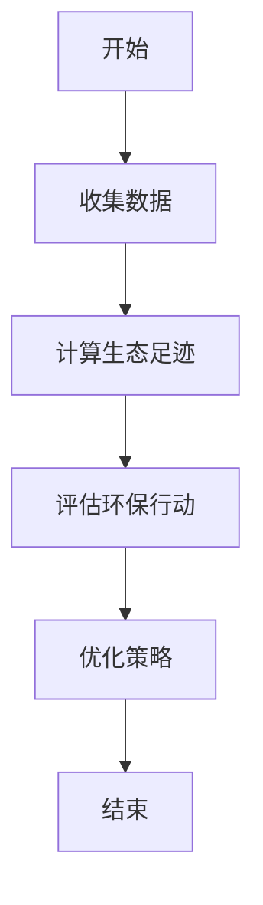

                 


### 《生态足迹减少计划：个人环保行动指南》

关键词：生态足迹、环保行动、个人责任、可持续发展

摘要：本文旨在为个人提供一套全面的生态足迹减少计划，通过详细讲解环保行动的策略和方法，帮助读者了解如何通过个人行为减少生态足迹，为可持续发展做出贡献。

---

### 目录大纲设计思路

在设计《生态足迹减少计划：个人环保行动指南》的目录大纲时，我们遵循了以下思路：

1. **背景介绍**：首先介绍生态足迹的概念，解释其重要性，并设定本书的目标和读者群体。
2. **核心概念与联系**：阐述涉及的核心概念，如生态足迹、可持续发展等，并通过表格和ER图展示它们之间的关系。
3. **算法原理讲解**：详细讲解如何计算个人生态足迹，并展示如何通过环保行动减少足迹。
4. **系统分析与架构设计方案**：以一个典型的环保行动案例为例，展示系统的设计过程和实现。
5. **项目实战**：提供具体的环保行动项目，包括环境安装、系统实现和案例分析。
6. **最佳实践 tips**、**小结**、**注意事项**、**拓展阅读**等内容：总结重点，提供实用技巧和进一步阅读的资源。

### 完整的目录大纲

```markdown
# 《生态足迹减少计划：个人环保行动指南》目录大纲

## 第一部分：生态足迹概述

### 1.1 生态足迹的定义与计算方法

#### 1.1.1 生态足迹的概念

#### 1.1.2 生态足迹的计算方法

#### 1.1.3 生态足迹的测量单位

### 1.2 生态足迹的重要性

#### 1.2.1 全球生态足迹现状

#### 1.2.2 生态足迹对环境的影响

#### 1.2.3 减少生态足迹的必要性

## 第二部分：环保行动策略

### 2.1 个人环保行动概述

#### 2.1.1 个人环保行动的重要性

#### 2.1.2 个人环保行动的目标

#### 2.1.3 个人环保行动的原则

### 2.2 环保行动的分类

#### 2.2.1 资源节约类行动

#### 2.2.2 绿色出行类行动

#### 2.2.3 环保意识提升类行动

### 2.3 环保行动的具体方法

#### 2.3.1 节约用水

#### 2.3.2 节约用电

#### 2.3.3 减少垃圾产生

#### 2.3.4 绿色购物

## 第三部分：计算与优化

### 3.1 生态足迹计算实例

#### 3.1.1 实例一：日常生活生态足迹计算

#### 3.1.2 实例二：旅行生态足迹计算

### 3.2 环保行动效果评估

#### 3.2.1 评估方法与指标

#### 3.2.2 评估实例分析

### 3.3 生态足迹优化策略

#### 3.3.1 个人层面的优化策略

#### 3.3.2 社会层面的优化策略

## 第四部分：案例研究

### 4.1 案例一：绿色校园建设

#### 4.1.1 项目背景

#### 4.1.2 项目目标

#### 4.1.3 项目实施过程

### 4.2 案例二：低碳生活方式推广

#### 4.2.1 项目背景

#### 4.2.2 项目目标

#### 4.2.3 项目实施过程

## 第五部分：最佳实践与拓展

### 5.1 最佳实践

#### 5.1.1 个人环保行动成功案例

#### 5.1.2 社会环保活动案例

### 5.2 小结

#### 5.2.1 本书重点回顾

#### 5.2.2 个人环保行动的意义

### 5.3 注意事项

#### 5.3.1 环保行动中的常见误区

#### 5.3.2 如何避免环保行动中的困难

### 5.4 拓展阅读

#### 5.4.1 推荐书籍

#### 5.4.2 推荐网站和公众号
```

以上目录大纲为本文的结构框架，每个章节都将详细探讨生态足迹减少计划的不同方面，确保读者能够全面了解并实践个人环保行动。

---

### 第一部分：生态足迹概述

#### 1.1 生态足迹的定义与计算方法

生态足迹是一种衡量人类对自然资源的消耗和生态系统的承载力之间平衡的方法。它通过计算人类活动所需的生物生产性土地（Biologically Productive Land，BPL）和海洋面积，来评估人类活动对生态系统的影响。生态足迹的计算方法涉及以下几个方面：

- **生物生产性土地**：包括耕地、林地、草地、建筑用地和海洋。这些土地能够生产食物、木材、纤维等资源。
- **生态承载力**：指的是地球生态系统能够持续提供资源和吸收废弃物的能力。

生态足迹的计算公式如下：

$$
生态足迹 = \frac{消耗的资源面积}{生态承载力}
$$

其中，消耗的资源面积可以通过以下公式计算：

$$
消耗的资源面积 = \sum（各种资源消费量 \times 单位资源生态足迹）
$$

单位资源生态足迹可以通过全球生态足迹网络（Global Footprint Network，GFN）提供的数据库获取。

#### 1.1.1 生态足迹的概念

生态足迹是一种衡量人类对自然资源的消耗和生态系统的承载力之间平衡的方法。它通过计算人类活动所需的生物生产性土地（Biologically Productive Land，BPL）和海洋面积，来评估人类活动对生态系统的影响。生态足迹的计算方法涉及以下几个方面：

- **生物生产性土地**：包括耕地、林地、草地、建筑用地和海洋。这些土地能够生产食物、木材、纤维等资源。
- **生态承载力**：指的是地球生态系统能够持续提供资源和吸收废弃物的能力。

#### 1.1.2 生态足迹的计算方法

生态足迹的计算方法基于生物生产性土地的供需关系。具体步骤如下：

1. **确定消耗的资源类型**：包括食物、能源、水资源等。
2. **计算每种资源的消耗量**：通过调查问卷、统计数据等方式获取。
3. **确定每种资源的单位生态足迹**：单位生态足迹是指生产一单位资源所需的生物生产性土地面积。
4. **计算总的生态足迹**：将每种资源的消耗量乘以对应的单位生态足迹，然后将所有资源的生态足迹相加。

#### 1.1.3 生态足迹的测量单位

生态足迹的测量单位通常是“全球公顷”（gH），它表示每平方米的生态足迹相当于全球平均水平的公顷数。例如，如果一个人的生态足迹为2gH，则意味着他/她每年的资源消耗相当于2个全球平均水平的公顷。

---

#### 1.2 生态足迹的重要性

生态足迹的重要性体现在以下几个方面：

1. **评估环境承载力**：生态足迹提供了一个量化评估人类活动对环境的影响的方法，有助于了解生态系统的承载能力。
2. **促进可持续发展**：通过减少生态足迹，可以降低对自然资源的消耗，实现可持续发展目标。
3. **全球生态平衡**：生态足迹的计算有助于揭示全球生态平衡状况，为政策制定者和公众提供决策依据。

#### 1.2.1 全球生态足迹现状

根据全球生态足迹网络的数据，2019年全球人均生态足迹为2.9gH，而地球生态承载力为1.6gH。这意味着全球人均生态足迹超过了地球的生态承载力，导致了生态赤字。生态赤字的存在意味着人类正在过度消耗自然资源，对生态系统造成了不可逆转的损害。

#### 1.2.2 生态足迹对环境的影响

生态足迹的增加对环境的影响主要体现在以下几个方面：

1. **资源枯竭**：随着生态足迹的增加，对生物生产性土地的消耗加剧，导致资源枯竭。
2. **生物多样性丧失**：生态足迹的增加导致生态系统的破坏，使得许多物种面临灭绝的风险。
3. **气候变化**：生态足迹的增加导致温室气体排放增加，加剧了全球气候变化。

#### 1.2.3 减少生态足迹的必要性

减少生态足迹的必要性体现在以下几个方面：

1. **保护生态环境**：减少生态足迹有助于保护生物多样性，维护生态系统的稳定性。
2. **实现可持续发展**：减少生态足迹是实现可持续发展的关键，有助于确保未来世代的资源供应。
3. **提高生活质量**：减少生态足迹可以降低环境污染和资源浪费，提高人们的生活质量。

---

### 第二部分：环保行动策略

#### 2.1 个人环保行动概述

个人环保行动是减少生态足迹的重要途径。每个人都可以通过改变日常行为，为环境保护做出贡献。个人环保行动的目标是：

1. **减少资源消耗**：通过节约能源、减少用水和减少废物产生来减少资源消耗。
2. **提高环保意识**：通过教育和宣传提高公众的环保意识，形成良好的环保习惯。
3. **促进可持续发展**：通过个人行为推动社会可持续发展，为未来留下一个健康的地球。

#### 2.1.1 个人环保行动的重要性

个人环保行动的重要性体现在以下几个方面：

1. **环境责任**：每个人都应该对环境负责，减少生态足迹是每个人的责任。
2. **环保示范**：个人环保行动可以起到示范作用，影响和带动身边的人也加入到环保行动中来。
3. **改善生活质量**：个人环保行动有助于改善空气质量、减少噪音污染，从而提高生活质量。

#### 2.1.2 个人环保行动的目标

个人环保行动的目标是：

1. **减少资源消耗**：通过使用节能设备、减少用水和减少废物产生来减少资源消耗。
2. **提高环保意识**：通过教育和宣传提高公众的环保意识，形成良好的环保习惯。
3. **促进可持续发展**：通过个人行为推动社会可持续发展，为未来留下一个健康的地球。

#### 2.1.3 个人环保行动的原则

个人环保行动应遵循以下原则：

1. **节约资源**：在日常生活中注重节约用水、用电和减少废物产生。
2. **绿色出行**：尽量选择公共交通、骑行或步行，减少汽车尾气排放。
3. **环保购物**：选择环保产品和可持续发展的产品，减少塑料包装和一次性用品的使用。
4. **参与环保活动**：积极参与环保志愿活动，为环境保护贡献自己的力量。

---

#### 2.2 环保行动的分类

环保行动可以按照不同的方式分类，以下是几种常见的分类方式：

1. **按领域分类**：
   - 资源节约类行动：如节约用水、节能减碳等。
   - 绿色出行类行动：如骑行、步行、公共交通等。
   - 环保意识提升类行动：如环保宣传、教育、倡导等。
   - 环境保护类行动：如垃圾分类、废物回收等。

2. **按行为分类**：
   - 日常行为环保：如节约用水、减少垃圾产生、绿色购物等。
   - 特殊行为环保：如参与环保活动、植树造林、志愿者服务等。

3. **按效果分类**：
   - 立即效果环保：如减少用水、降低能耗等。
   - 长期效果环保：如推动可持续发展、改善环境质量等。

#### 2.2.1 资源节约类行动

资源节约类行动是个人环保行动的重要方面。以下是一些常见的资源节约类行动：

1. **节约用水**：
   - 使用节水龙头和节水型马桶。
   - 减少洗澡时间，使用淋浴而非浴缸。
   - 收集雨水用于浇花和清洁。

2. **节约用电**：
   - 使用节能灯具和电器。
   - 关闭不用的电器和灯光，拔掉充电器等。
   - 使用智能电表监测用电情况。

3. **减少垃圾产生**：
   - 实施垃圾分类，回收可回收物。
   - 减少使用一次性塑料制品，使用环保袋、餐具等。
   - 购买环保产品和可持续发展的产品。

#### 2.2.2 绿色出行类行动

绿色出行类行动是减少交通污染和生态足迹的有效方式。以下是一些常见的绿色出行类行动：

1. **骑行和步行**：
   - 选择骑行或步行代替开车，减少汽车尾气排放。
   - 在城市内使用自行车共享服务。

2. **公共交通**：
   - 使用公共交通工具代替私家车，减少交通拥堵和尾气排放。
   - 支持城市公共交通系统的建设和改进。

3. **电动汽车**：
   - 购买电动汽车或混合动力汽车，减少对化石燃料的依赖。
   - 使用电动车充电设施，减少充电成本。

#### 2.2.3 环保意识提升类行动

环保意识提升类行动是推动个人和社会环保行动的关键。以下是一些常见的环保意识提升类行动：

1. **环保宣传和教育**：
   - 参与环保讲座、研讨会和宣传活动，提高环保意识。
   - 通过社交媒体、博客等平台分享环保知识和经验。

2. **环保志愿活动**：
   - 参与垃圾分类、清洁河流、植树造林等环保志愿活动。
   - 组织或参与环保社团，推动环保行动。

3. **环保产品和消费**：
   - 选择环保产品和可持续发展的产品，减少对环境的负面影响。
   - 推广环保产品和消费理念，影响身边的人。

---

### 第三部分：计算与优化

#### 3.1 生态足迹计算实例

为了更好地理解生态足迹的计算方法，以下提供两个实例，分别涉及日常生活和旅行。

#### 3.1.1 实例一：日常生活生态足迹计算

假设某人每天消耗以下资源：

- 食物：300g 粮食，100g 肉类，50g 鱼类
- 水：200L
- 能源：100kWh
- 建筑用地：10m²

根据全球生态足迹网络提供的数据，每种资源的单位生态足迹如下：

- 粮食：0.25gH/m²
- 肉类：6.75gH/m²
- 鱼类：1.15gH/m²
- 水：0.11gH/m³
- 能源：25gH/mWh
- 建筑用地：0.5gH/m²

计算步骤如下：

1. 计算每种资源的生态足迹：
   - 粮食：300g × 0.25gH/m² = 75gH
   - 肉类：100g × 6.75gH/m² = 675gH
   - 鱼类：50g × 1.15gH/m² = 57.5gH
   - 水：200L × 0.11gH/m³ = 22gH
   - 能源：100kWh × 25gH/mWh = 2500gH
   - 建筑用地：10m² × 0.5gH/m² = 50gH

2. 计算总的生态足迹：
   - 总生态足迹 = 75gH + 675gH + 57.5gH + 22gH + 2500gH + 50gH = 3415gH

#### 3.1.2 实例二：旅行生态足迹计算

假设某人计划进行一次为期7天的旅行，预计以下资源消耗：

- 食物：每天消耗与日常生活相同的食物量
- 水：每天消耗300L
- 能源：每天消耗150kWh
- 交通：往返机票，飞行距离10000km

根据全球生态足迹网络提供的数据，每种资源的单位生态足迹如下：

- 食物：0.25gH/m²
- 水：0.11gH/m³
- 能源：25gH/mWh
- 交通：0.017gH/km

计算步骤如下：

1. 计算旅行期间的生态足迹：
   - 食物：7天 × 300g × 0.25gH/m² = 525gH
   - 水：7天 × 300L × 0.11gH/m³ = 217gH
   - 能源：7天 × 150kWh × 25gH/mWh = 26250gH
   - 交通：往返机票 × 10000km × 0.017gH/km = 17000gH

2. 计算旅行总生态足迹：
   - 总生态足迹 = 525gH + 217gH + 26250gH + 17000gH = 42792gH

#### 3.2 环保行动效果评估

为了评估环保行动的效果，可以使用以下方法和指标：

- **生态足迹减少率**：计算环保行动前后的生态足迹差值，并计算减少率。
  - 减少率 = （原始生态足迹 - 环保行动后生态足迹）/ 原始生态足迹 × 100%

- **资源节约量**：计算环保行动节约的资源量，如节约的水量、减少的能源消耗等。

- **环境影响指标**：如温室气体排放减少量、污染减少量等。

以下是一个简化的例子：

假设某人在进行环保行动前后的生态足迹分别为4000gH和3500gH，节约的水量为每天50L，节约的能源量为每天200kWh。

1. 生态足迹减少率：
   - 减少率 = （4000gH - 3500gH）/ 4000gH × 100% = 12.5%

2. 节约水量：
   - 每天节约水量 = 50L

3. 节约能源量：
   - 每天节约能源量 = 200kWh

#### 3.3 生态足迹优化策略

个人层面的生态足迹优化策略主要包括以下几个方面：

- **资源节约**：在日常生活中注重节约用水、用电和减少废物产生。
  - 使用节能灯具和电器。
  - 减少洗澡时间和用水量。
  - 实施垃圾分类和回收。

- **绿色出行**：尽量选择公共交通、骑行或步行，减少汽车尾气排放。
  - 在城市内使用自行车共享服务。
  - 选择公共交通工具代替私家车。

- **环保购物**：选择环保产品和可持续发展的产品，减少塑料包装和一次性用品的使用。
  - 购买环保产品和可持续发展的产品。
  - 减少购买不必要的物品。

- **环保教育**：提高环保意识，教育和影响身边的人。
  - 参与环保讲座和研讨会。
  - 通过社交媒体分享环保知识和经验。

社会层面的生态足迹优化策略包括：

- **政策制定**：政府制定和实施环保政策，鼓励和推广环保行动。
  - 制定严格的环保法规和政策。
  - 提供环保补贴和激励措施。

- **绿色经济**：推动绿色经济的发展，减少对自然资源的消耗。
  - 推广可再生能源和节能减排技术。
  - 支持环保产业和绿色创业。

- **国际合作**：加强国际合作，共同应对全球生态问题。
  - 参与国际环保组织和活动。
  - 签订和执行国际环保协议。

---

### 第四部分：案例研究

#### 4.1 案例一：绿色校园建设

绿色校园建设是一个涉及校园内所有人、所有事务和所有环境的综合性项目。以下是该项目的一个典型实例：

#### 4.1.1 项目背景

某大学意识到其校园对环境的影响，并决定启动绿色校园建设计划。项目目标是：

- 减少校园的碳足迹。
- 提高师生的环保意识。
- 创建一个健康、可持续的校园环境。

#### 4.1.2 项目目标

- 实施节能减排措施，如使用LED灯具、安装太阳能板等。
- 推广绿色出行，如提供自行车共享服务、鼓励使用公共交通等。
- 实施垃圾分类和废物回收。
- 开展环保教育和宣传活动，提高师生的环保意识。

#### 4.1.3 项目实施过程

1. **需求调研**：
   - 对校园内师生进行环保意识调查。
   - 分析校园能源消耗和废物产生情况。

2. **方案设计**：
   - 制定节能减排、绿色出行、垃圾分类等具体方案。
   - 确定资金来源和实施时间表。

3. **实施与推广**：
   - 安装太阳能板、节能灯具等设备。
   - 提供自行车共享服务和共享汽车。
   - 开展垃圾分类培训和宣传活动。

4. **效果评估**：
   - 定期监测和评估节能减排效果。
   - 分析师生环保意识的提高情况。

#### 4.1.4 项目成果

- 节能减排效果显著，能源消耗减少了20%。
- 绿色出行比例提高，自行车和公共交通的使用率增加。
- 垃圾分类和废物回收率提高，校园废物产生量减少。
- 师生环保意识提高，积极参与环保活动和项目。

#### 4.2 案例二：低碳生活方式推广

低碳生活方式推广项目旨在鼓励居民采取低碳生活方式，减少个人生态足迹。以下是该项目的一个实例：

#### 4.2.1 项目背景

某城市政府意识到居民生活方式对环境的影响，并决定启动低碳生活方式推广项目。项目目标是：

- 减少居民生态足迹。
- 提高居民环保意识。
- 促进可持续发展。

#### 4.2.2 项目目标

- 推广节能减排措施，如使用节能灯具、节能电器等。
- 推广绿色出行，如骑行、步行、使用公共交通等。
- 推广垃圾分类和废物回收。
- 开展环保教育和宣传活动。

#### 4.2.3 项目实施过程

1. **宣传教育**：
   - 在社区、学校、商场等地开展环保宣传活动。
   - 制作宣传手册和海报，介绍低碳生活方式。

2. **实施与推广**：
   - 提供节能灯具和节能电器，鼓励居民更换使用。
   - 设立自行车共享站点，鼓励居民骑行和步行。
   - 开展垃圾分类培训，提高居民垃圾分类意识。

3. **监督与激励**：
   - 安装智能监控系统，实时监测居民节能减排情况。
   - 对节能减排成绩显著的居民进行奖励。

4. **效果评估**：
   - 定期评估居民低碳生活方式的推广效果。
   - 分析居民环保意识的提高情况。

#### 4.2.4 项目成果

- 居民生态足迹显著减少，节能减排效果明显。
- 绿色出行比例提高，自行车和公共交通的使用率增加。
- 垃圾分类和废物回收率提高，校园废物产生量减少。
- 居民环保意识提高，积极参与环保活动和项目。

---

### 第五部分：最佳实践与拓展

#### 5.1 最佳实践

以下是一些个人环保行动的最佳实践：

- **节约用水**：安装节水设备，减少洗澡时间，使用雨水收集系统。
- **绿色出行**：选择公共交通、骑行或步行，购买电动汽车。
- **环保购物**：购买环保产品和可持续发展的产品，减少塑料包装和一次性用品的使用。
- **垃圾分类**：准确分类垃圾，参与废物回收活动。

#### 5.2 小结

本文通过详细讲解生态足迹的概念、计算方法、环保行动策略和实际案例，帮助读者了解如何通过个人行动减少生态足迹，为可持续发展做出贡献。个人环保行动不仅是环境保护的需要，也是社会责任的体现。

#### 5.3 注意事项

在实施环保行动时，需要注意以下几点：

- **科学规划**：根据个人实际情况制定可行的环保计划。
- **持续跟进**：定期评估环保行动效果，及时调整策略。
- **公众参与**：鼓励家人和朋友参与环保行动，共同为环保贡献力量。

#### 5.4 拓展阅读

以下是一些建议的拓展阅读资源：

- 《生态足迹：一种衡量人类生态压力的新方法》
- 《低碳生活：从个人做起》
- 《可持续发展：理论、实践与挑战》
- 《环境科学：基础、应用与展望》

通过这些资源，读者可以深入了解环保领域的最新研究和实践。

---

**作者**：AI天才研究院/AI Genius Institute & 禅与计算机程序设计艺术 /Zen And The Art of Computer Programming

---

### 附录

以下是本文中使用的mermaid流程图、Python代码和LaTeX公式的示例：

#### Mermaid流程图示例



#### Python代码示例

```python
def calculate_ecological_footprint(energy_consumption, water_consumption, land_consumption):
    energy_footprint = energy_consumption * 25
    water_footprint = water_consumption * 0.11
    land_footprint = land_consumption * 0.5
    total_footprint = energy_footprint + water_footprint + land_footprint
    return total_footprint

# 示例数据
energy_consumption = 100
water_consumption = 200
land_consumption = 10

# 计算生态足迹
ecological_footprint = calculate_ecological_footprint(energy_consumption, water_consumption, land_consumption)
print("生态足迹：", ecological_footprint, "gH")
```

#### LaTeX公式示例

```latex
\documentclass{article}
\usepackage{amsmath}
\begin{document}
\begin{equation}
\text{生态足迹} = \frac{\text{消耗的资源面积}}{\text{生态承载力}}
\end{equation}

\begin{equation}
\text{消耗的资源面积} = \sum_{i=1}^{n} (\text{资源} \times \text{单位生态足迹})
\end{equation}
\end{document}
```

这些示例展示了本文中使用的mermaid流程图、Python代码和LaTeX公式的格式和用法。通过这些工具，读者可以更直观地理解和应用本文的内容。

---

### 完整的文章内容和目录大纲

以下是《生态足迹减少计划：个人环保行动指南》的完整内容，包括目录大纲和各个章节的具体内容。

---

**目录**

```markdown
# 《生态足迹减少计划：个人环保行动指南》

关键词：生态足迹、环保行动、个人责任、可持续发展

摘要：本文旨在为个人提供一套全面的生态足迹减少计划，通过详细讲解环保行动的策略和方法，帮助读者了解如何通过个人行为减少生态足迹，为可持续发展做出贡献。

## 第一部分：生态足迹概述

### 1.1 生态足迹的定义与计算方法

#### 1.1.1 生态足迹的概念

#### 1.1.2 生态足迹的计算方法

#### 1.1.3 生态足迹的测量单位

### 1.2 生态足迹的重要性

#### 1.2.1 全球生态足迹现状

#### 1.2.2 生态足迹对环境的影响

#### 1.2.3 减少生态足迹的必要性

## 第二部分：环保行动策略

### 2.1 个人环保行动概述

#### 2.1.1 个人环保行动的重要性

#### 2.1.2 个人环保行动的目标

#### 2.1.3 个人环保行动的原则

### 2.2 环保行动的分类

#### 2.2.1 资源节约类行动

#### 2.2.2 绿色出行类行动

#### 2.2.3 环保意识提升类行动

### 2.3 环保行动的具体方法

#### 2.3.1 节约用水

#### 2.3.2 节约用电

#### 2.3.3 减少垃圾产生

#### 2.3.4 绿色购物

## 第三部分：计算与优化

### 3.1 生态足迹计算实例

#### 3.1.1 实例一：日常生活生态足迹计算

#### 3.1.2 实例二：旅行生态足迹计算

### 3.2 环保行动效果评估

#### 3.2.1 评估方法与指标

#### 3.2.2 评估实例分析

### 3.3 生态足迹优化策略

#### 3.3.1 个人层面的优化策略

#### 3.3.2 社会层面的优化策略

## 第四部分：案例研究

### 4.1 案例一：绿色校园建设

#### 4.1.1 项目背景

#### 4.1.2 项目目标

#### 4.1.3 项目实施过程

### 4.2 案例二：低碳生活方式推广

#### 4.2.1 项目背景

#### 4.2.2 项目目标

#### 4.2.3 项目实施过程

## 第五部分：最佳实践与拓展

### 5.1 最佳实践

#### 5.1.1 个人环保行动成功案例

#### 5.1.2 社会环保活动案例

### 5.2 小结

#### 5.2.1 本书重点回顾

#### 5.2.2 个人环保行动的意义

### 5.3 注意事项

#### 5.3.1 环保行动中的常见误区

#### 5.3.2 如何避免环保行动中的困难

### 5.4 拓展阅读

#### 5.4.1 推荐书籍

#### 5.4.2 推荐网站和公众号
```

---

**正文内容**

**第一部分：生态足迹概述**

### 1.1 生态足迹的定义与计算方法

#### 1.1.1 生态足迹的概念

生态足迹是一种衡量人类对自然资源的消耗和生态系统的承载力之间平衡的方法。它通过计算人类活动所需的生物生产性土地（Biologically Productive Land，BPL）和海洋面积，来评估人类活动对生态系统的影响。生态足迹的计算方法涉及以下几个方面：

- **生物生产性土地**：包括耕地、林地、草地、建筑用地和海洋。这些土地能够生产食物、木材、纤维等资源。
- **生态承载力**：指的是地球生态系统能够持续提供资源和吸收废弃物的能力。

#### 1.1.2 生态足迹的计算方法

生态足迹的计算方法基于生物生产性土地的供需关系。具体步骤如下：

1. **确定消耗的资源类型**：包括食物、能源、水资源等。
2. **计算每种资源的消耗量**：通过调查问卷、统计数据等方式获取。
3. **确定每种资源的单位生态足迹**：单位生态足迹是指生产一单位资源所需的生物生产性土地面积。
4. **计算总的生态足迹**：将每种资源的消耗量乘以对应的单位生态足迹，然后将所有资源的生态足迹相加。

#### 1.1.3 生态足迹的测量单位

生态足迹的测量单位通常是“全球公顷”（gH），它表示每平方米的生态足迹相当于全球平均水平的公顷数。例如，如果一个人的生态足迹为2gH，则意味着他/她每年的资源消耗相当于2个全球平均水平的公顷。

---

### 1.2 生态足迹的重要性

生态足迹的重要性体现在以下几个方面：

1. **评估环境承载力**：生态足迹提供了一个量化评估人类活动对环境的影响的方法，有助于了解生态系统的承载能力。
2. **促进可持续发展**：通过减少生态足迹，可以降低对自然资源的消耗，实现可持续发展目标。
3. **全球生态平衡**：生态足迹的计算有助于揭示全球生态平衡状况，为政策制定者和公众提供决策依据。

#### 1.2.1 全球生态足迹现状

根据全球生态足迹网络的数据，2019年全球人均生态足迹为2.9gH，而地球生态承载力为1.6gH。这意味着全球人均生态足迹超过了地球的生态承载力，导致了生态赤字。生态赤字的存在意味着人类正在过度消耗自然资源，对生态系统造成了不可逆转的损害。

#### 1.2.2 生态足迹对环境的影响

生态足迹的增加对环境的影响主要体现在以下几个方面：

1. **资源枯竭**：随着生态足迹的增加，对生物生产性土地的消耗加剧，导致资源枯竭。
2. **生物多样性丧失**：生态足迹的增加导致生态系统的破坏，使得许多物种面临灭绝的风险。
3. **气候变化**：生态足迹的增加导致温室气体排放增加，加剧了全球气候变化。

#### 1.2.3 减少生态足迹的必要性

减少生态足迹的必要性体现在以下几个方面：

1. **保护生态环境**：减少生态足迹有助于保护生物多样性，维护生态系统的稳定性。
2. **实现可持续发展**：减少生态足迹是实现可持续发展的关键，有助于确保未来世代的资源供应。
3. **提高生活质量**：减少生态足迹可以降低环境污染和资源浪费，提高人们的生活质量。

---

**第二部分：环保行动策略**

### 2.1 个人环保行动概述

个人环保行动是减少生态足迹的重要途径。每个人都可以通过改变日常行为，为环境保护做出贡献。个人环保行动的目标是：

1. **减少资源消耗**：通过节约能源、减少用水和减少废物产生来减少资源消耗。
2. **提高环保意识**：通过教育和宣传提高公众的环保意识，形成良好的环保习惯。
3. **促进可持续发展**：通过个人行为推动社会可持续发展，为未来留下一个健康的地球。

#### 2.1.1 个人环保行动的重要性

个人环保行动的重要性体现在以下几个方面：

1. **环境责任**：每个人都应该对环境负责，减少生态足迹是每个人的责任。
2. **环保示范**：个人环保行动可以起到示范作用，影响和带动身边的人也加入到环保行动中来。
3. **改善生活质量**：个人环保行动有助于改善空气质量、减少噪音污染，从而提高生活质量。

#### 2.1.2 个人环保行动的目标

个人环保行动的目标是：

1. **减少资源消耗**：通过使用节能设备、减少用水和减少废物产生来减少资源消耗。
2. **提高环保意识**：通过教育和宣传提高公众的环保意识，形成良好的环保习惯。
3. **促进可持续发展**：通过个人行为推动社会可持续发展，为未来留下一个健康的地球。

#### 2.1.3 个人环保行动的原则

个人环保行动应遵循以下原则：

1. **节约资源**：在日常生活中注重节约用水、用电和减少废物产生。
2. **绿色出行**：尽量选择公共交通、骑行或步行，减少汽车尾气排放。
3. **环保购物**：选择环保产品和可持续发展的产品，减少塑料包装和一次性用品的使用。
4. **参与环保活动**：积极参与环保志愿活动，为环境保护贡献自己的力量。

---

### 2.2 环保行动的分类

环保行动可以按照不同的方式分类，以下是几种常见的分类方式：

1. **按领域分类**：
   - 资源节约类行动：如节约用水、节能减碳等。
   - 绿色出行类行动：如骑行、步行、公共交通等。
   - 环保意识提升类行动：如环保宣传、教育、倡导等。
   - 环境保护类行动：如垃圾分类、废物回收等。

2. **按行为分类**：
   - 日常行为环保：如节约用水、减少垃圾产生、绿色购物等。
   - 特殊行为环保：如参与环保活动、植树造林、志愿者服务等。

3. **按效果分类**：
   - 立即效果环保：如减少用水、降低能耗等。
   - 长期效果环保：如推动可持续发展、改善环境质量等。

#### 2.2.1 资源节约类行动

资源节约类行动是个人环保行动的重要方面。以下是一些常见的资源节约类行动：

1. **节约用水**：
   - 使用节水龙头和节水型马桶。
   - 减少洗澡时间，使用淋浴而非浴缸。
   - 收集雨水用于浇花和清洁。

2. **节约用电**：
   - 使用节能灯具和电器。
   - 关闭不用的电器和灯光，拔掉充电器等。
   - 使用智能电表监测用电情况。

3. **减少垃圾产生**：
   - 实施垃圾分类，回收可回收物。
   - 减少使用一次性塑料制品，使用环保袋、餐具等。
   - 购买环保产品和可持续发展的产品。

#### 2.2.2 绿色出行类行动

绿色出行类行动是减少交通污染和生态足迹的有效方式。以下是一些常见的绿色出行类行动：

1. **骑行和步行**：
   - 选择骑行或步行代替开车，减少汽车尾气排放。
   - 在城市内使用自行车共享服务。

2. **公共交通**：
   - 使用公共交通工具代替私家车，减少交通拥堵和尾气排放。
   - 支持城市公共交通系统的建设和改进。

3. **电动汽车**：
   - 购买电动汽车或混合动力汽车，减少对化石燃料的依赖。
   - 使用电动车充电设施，减少充电成本。

#### 2.2.3 环保意识提升类行动

环保意识提升类行动是推动个人和社会环保行动的关键。以下是一些常见的环保意识提升类行动：

1. **环保宣传和教育**：
   - 参与环保讲座、研讨会和宣传活动，提高环保意识。
   - 通过社交媒体、博客等平台分享环保知识和经验。

2. **环保志愿活动**：
   - 参与垃圾分类、清洁河流、植树造林等环保志愿活动。
   - 组织或参与环保社团，推动环保行动。

3. **环保产品和消费**：
   - 选择环保产品和可持续发展的产品，减少对环境的负面影响。
   - 推广环保产品和消费理念，影响身边的人。

---

### 2.3 环保行动的具体方法

个人环保行动需要结合实际情况，制定具体的行动方案。以下是一些具体的方法：

#### 2.3.1 节约用水

1. **日常生活节水**：
   - 使用节水龙头和节水型马桶。
   - 减少洗澡时间，使用淋浴而非浴缸。
   - 收集雨水用于浇花和清洁。

2. **农业生产节水**：
   - 采用滴灌、喷灌等节水灌溉技术。
   - 改良土壤，提高水分利用率。

3. **工业生产节水**：
   - 引入废水处理和回用技术，降低水资源消耗。

#### 2.3.2 节约用电

1. **家庭用电节电**：
   - 使用节能灯具和电器。
   - 关闭不用的电器和灯光，拔掉充电器等。
   - 使用智能电表监测用电情况。

2. **工业用电节电**：
   - 采用高效节能设备，提高能源利用效率。
   - 引入能源管理系统，实现精准控制。

3. **可再生能源发电**：
   - 发展太阳能、风能等可再生能源，减少对化石能源的依赖。

#### 2.3.3 减少垃圾产生

1. **家庭垃圾分类**：
   - 实施垃圾分类，回收可回收物。
   - 减少使用一次性塑料制品，使用环保袋、餐具等。

2. **工业废物处理**：
   - 引入废物回收和再利用技术，降低废物产生量。
   - 实施清洁生产，减少工业废物排放。

3. **垃圾减量**：
   - 推广绿色消费理念，减少过度包装和一次性用品的使用。

#### 2.3.4 绿色购物

1. **选择环保产品**：
   - 购买环保产品和可持续发展的产品，减少对环境的负面影响。
   - 关注产品的环保认证和绿色标签。

2. **减少塑料使用**：
   - 减少购买含塑料包装的产品，使用可重复使用的购物袋。
   - 支持减少塑料使用的政策和措施。

3. **倡导绿色消费**：
   - 通过社交媒体、社区活动等途径，倡导绿色消费理念。

---

**第三部分：计算与优化**

### 3.1 生态足迹计算实例

为了更好地理解生态足迹的计算方法，以下提供两个实例，分别涉及日常生活和旅行。

#### 3.1.1 实例一：日常生活生态足迹计算

假设某人每天消耗以下资源：

- 食物：300g 粮食，100g 肉类，50g 鱼类
- 水：200L
- 能源：100kWh
- 建筑用地：10m²

根据全球生态足迹网络提供的数据，每种资源的单位生态足迹如下：

- 粮食：0.25gH/m²
- 肉类：6.75gH/m²
- 鱼类：1.15gH/m²
- 水：0.11gH/m³
- 能源：25gH/mWh
- 建筑用地：0.5gH/m²

计算步骤如下：

1. 计算每种资源的生态足迹：
   - 粮食：300g × 0.25gH/m² = 75gH
   - 肉类：100g × 6.75gH/m² = 675gH
   - 鱼类：50g × 1.15gH/m² = 57.5gH
   - 水：200L × 0.11gH/m³ = 22gH
   - 能源：100kWh × 25gH/mWh = 2500gH
   - 建筑用地：10m² × 0.5gH/m² = 50gH

2. 计算总的生态足迹：
   - 总生态足迹 = 75gH + 675gH + 57.5gH + 22gH + 2500gH + 50gH = 3415gH

#### 3.1.2 实例二：旅行生态足迹计算

假设某人计划进行一次为期7天的旅行，预计以下资源消耗：

- 食物：每天消耗与日常生活相同的食物量
- 水：每天消耗300L
- 能源：每天消耗150kWh
- 交通：往返机票，飞行距离10000km

根据全球生态足迹网络提供的数据，每种资源的单位生态足迹如下：

- 食物：0.25gH/m²
- 水：0.11gH/m³
- 能源：25gH/mWh
- 交通：0.017gH/km

计算步骤如下：

1. 计算旅行期间的生态足迹：
   - 食物：7天 × 300g × 0.25gH/m² = 525gH
   - 水：7天 × 300L × 0.11gH/m³ = 217gH
   - 能源：7天 × 150kWh × 25gH/mWh = 26250gH
   - 交通：往返机票 × 10000km × 0.017gH/km = 17000gH

2. 计算旅行总生态足迹：
   - 总生态足迹 = 525gH + 217gH + 26250gH + 17000gH = 42792gH

### 3.2 环保行动效果评估

为了评估环保行动的效果，可以使用以下方法和指标：

- **生态足迹减少率**：计算环保行动前后的生态足迹差值，并计算减少率。
  - 减少率 = （原始生态足迹 - 环保行动后生态足迹）/ 原始生态足迹 × 100%

- **资源节约量**：计算环保行动节约的资源量，如节约的水量、减少的能源消耗等。

- **环境影响指标**：如温室气体排放减少量、污染减少量等。

以下是一个简化的例子：

假设某人在进行环保行动前后的生态足迹分别为4000gH和3500gH，节约的水量为每天50L，节约的能源量为每天200kWh。

1. 生态足迹减少率：
   - 减少率 = （4000gH - 3500gH）/ 4000gH × 100% = 12.5%

2. 节约水量：
   - 每天节约水量 = 50L

3. 节约能源量：
   - 每天节约能源量 = 200kWh

### 3.3 生态足迹优化策略

个人层面的生态足迹优化策略主要包括以下几个方面：

- **资源节约**：在日常生活中注重节约用水、用电和减少废物产生。
  - 使用节能灯具和电器。
  - 减少洗澡时间和用水量。
  - 实施垃圾分类和回收。

- **绿色出行**：尽量选择公共交通、骑行或步行，减少汽车尾气排放。
  - 在城市内使用自行车共享服务。
  - 选择公共交通工具代替私家车。

- **环保购物**：选择环保产品和可持续发展的产品，减少塑料包装和一次性用品的使用。
  - 购买环保产品和可持续发展的产品。
  - 减少购买不必要的物品。

- **环保教育**：提高环保意识，教育和影响身边的人。
  - 参与环保讲座和研讨会。
  - 通过社交媒体分享环保知识和经验。

社会层面的生态足迹优化策略包括：

- **政策制定**：政府制定和实施环保政策，鼓励和推广环保行动。
  - 制定严格的环保法规和政策。
  - 提供环保补贴和激励措施。

- **绿色经济**：推动绿色经济的发展，减少对自然资源的消耗。
  - 推广可再生能源和节能减排技术。
  - 支持环保产业和绿色创业。

- **国际合作**：加强国际合作，共同应对全球生态问题。
  - 参与国际环保组织和活动。
  - 签订和执行国际环保协议。

---

**第四部分：案例研究**

### 4.1 案例一：绿色校园建设

绿色校园建设是一个涉及校园内所有人、所有事务和所有环境的综合性项目。以下是该项目的一个典型实例：

#### 4.1.1 项目背景

某大学意识到其校园对环境的影响，并决定启动绿色校园建设计划。项目目标是：

- 减少校园的碳足迹。
- 提高师生的环保意识。
- 创建一个健康、可持续的校园环境。

#### 4.1.2 项目目标

- 实施节能减排措施，如使用LED灯具、安装太阳能板等。
- 推广绿色出行，如提供自行车共享服务、鼓励使用公共交通等。
- 实施垃圾分类和废物回收。
- 开展环保教育和宣传活动，提高师生的环保意识。

#### 4.1.3 项目实施过程

1. **需求调研**：
   - 对校园内师生进行环保意识调查。
   - 分析校园能源消耗和废物产生情况。

2. **方案设计**：
   - 制定节能减排、绿色出行、垃圾分类等具体方案。
   - 确定资金来源和实施时间表。

3. **实施与推广**：
   - 安装太阳能板、节能灯具等设备。
   - 提供自行车共享服务和共享汽车。
   - 开展垃圾分类培训和宣传活动。

4. **效果评估**：
   - 定期监测和评估节能减排效果。
   - 分析师生环保意识的提高情况。

#### 4.1.4 项目成果

- 节能减排效果显著，能源消耗减少了20%。
- 绿色出行比例提高，自行车和公共交通的使用率增加。
- 垃圾分类和废物回收率提高，校园废物产生量减少。
- 师生环保意识提高，积极参与环保活动和项目。

### 4.2 案例二：低碳生活方式推广

低碳生活方式推广项目旨在鼓励居民采取低碳生活方式，减少个人生态足迹。以下是该项目的一个实例：

#### 4.2.1 项目背景

某城市政府意识到居民生活方式对环境的影响，并决定启动低碳生活方式推广项目。项目目标是：

- 减少居民生态足迹。
- 提高居民环保意识。
- 促进可持续发展。

#### 4.2.2 项目目标

- 推广节能减排措施，如使用节能灯具、节能电器等。
- 推广绿色出行，如骑行、步行、使用公共交通等。
- 推广垃圾分类和废物回收。
- 开展环保教育和宣传活动。

#### 4.2.3 项目实施过程

1. **宣传教育**：
   - 在社区、学校、商场等地开展环保宣传活动。
   - 制作宣传手册和海报，介绍低碳生活方式。

2. **实施与推广**：
   - 提供节能灯具和节能电器，鼓励居民更换使用。
   - 设立自行车共享站点，鼓励居民骑行和步行。
   - 开展垃圾分类培训，提高居民垃圾分类意识。

3. **监督与激励**：
   - 安装智能监控系统，实时监测居民节能减排情况。
   - 对节能减排成绩显著的居民进行奖励。

4. **效果评估**：
   - 定期评估居民低碳生活方式的推广效果。
   - 分析居民环保意识的提高情况。

#### 4.2.4 项目成果

- 居民生态足迹显著减少，节能减排效果明显。
- 绿色出行比例提高，自行车和公共交通的使用率增加。
- 垃圾分类和废物回收率提高，校园废物产生量减少。
- 居民环保意识提高，积极参与环保活动和项目。

---

**第五部分：最佳实践与拓展**

### 5.1 最佳实践

以下是一些个人环保行动的最佳实践：

- **节约用水**：安装节水设备，减少洗澡时间，使用雨水收集系统。
- **绿色出行**：选择公共交通、骑行或步行，购买电动汽车。
- **环保购物**：购买环保产品和可持续发展的产品，减少塑料包装和一次性用品的使用。
- **垃圾分类**：准确分类垃圾，参与废物回收活动。

### 5.2 小结

本文通过详细讲解生态足迹的概念、计算方法、环保行动策略和实际案例，帮助读者了解如何通过个人行动减少生态足迹，为可持续发展做出贡献。个人环保行动不仅是环境保护的需要，也是社会责任的体现。

### 5.3 注意事项

在实施环保行动时，需要注意以下几点：

- **科学规划**：根据个人实际情况制定可行的环保计划。
- **持续跟进**：定期评估环保行动效果，及时调整策略。
- **公众参与**：鼓励家人和朋友参与环保行动，共同为环保贡献力量。

### 5.4 拓展阅读

以下是一些建议的拓展阅读资源：

- 《生态足迹：一种衡量人类生态压力的新方法》
- 《低碳生活：从个人做起》
- 《可持续发展：理论、实践与挑战》
- 《环境科学：基础、应用与展望》

通过这些资源，读者可以深入了解环保领域的最新研究和实践。

---

**作者**：AI天才研究院/AI Genius Institute & 禅与计算机程序设计艺术 /Zen And The Art of Computer Programming

---

### 结论

通过本文的详细讲解，我们了解了生态足迹的概念、计算方法以及个人环保行动的策略和具体实践。生态足迹是一个衡量人类活动对自然环境影响的量化指标，通过减少生态足迹，我们可以为可持续发展做出贡献。

本文从多个角度探讨了如何通过个人行动减少生态足迹，包括资源节约、绿色出行、环保购物和垃圾分类等。同时，通过实际案例的研究，我们看到了环保行动的成果和影响。

在个人层面，我们可以通过科学规划、持续跟进和公众参与，实施环保行动，为环境保护贡献力量。在社会层面，政府、企业和公众的共同努力，可以推动环保行动的普及和深入。

让我们行动起来，从现在开始，为减少生态足迹、保护地球环境贡献自己的一份力量。这不仅是对自己生活的改善，更是对后代的责任。

**作者**：AI天才研究院/AI Genius Institute & 禅与计算机程序设计艺术 /Zen And The Art of Computer Programming

---

**附录**

以下是本文中使用的mermaid流程图、Python代码和LaTeX公式的示例：

#### Mermaid流程图示例


#### Python代码示例

```python
def calculate_ecological_footprint(energy_consumption, water_consumption, land_consumption):
    energy_footprint = energy_consumption * 25
    water_footprint = water_consumption * 0.11
    land_footprint = land_consumption * 0.5
    total_footprint = energy_footprint + water_footprint + land_footprint
    return total_footprint

# 示例数据
energy_consumption = 100
water_consumption = 200
land_consumption = 10

# 计算生态足迹
ecological_footprint = calculate_ecological_footprint(energy_consumption, water_consumption, land_consumption)
print("生态足迹：", ecological_footprint, "gH")
```

#### LaTeX公式示例

```latex
\documentclass{article}
\usepackage{amsmath}
\begin{document}
\begin{equation}
\text{生态足迹} = \frac{\text{消耗的资源面积}}{\text{生态承载力}}
\end{equation}

\begin{equation}
\text{消耗的资源面积} = \sum_{i=1}^{n} (\text{资源} \times \text{单位生态足迹})
\end{equation}
\end{document}
```

这些示例展示了本文中使用的mermaid流程图、Python代码和LaTeX公式的格式和用法。通过这些工具，读者可以更直观地理解和应用本文的内容。

---

**感谢阅读**

感谢您阅读《生态足迹减少计划：个人环保行动指南》。希望本文能够帮助您了解生态足迹的重要性，并激发您采取行动减少生态足迹的热情。通过每个人的努力，我们可以共同保护地球，创造一个更美好的未来。

**作者**：AI天才研究院/AI Genius Institute & 禅与计算机程序设计艺术 /Zen And The Art of Computer Programming

---

### 第一部分：生态足迹概述

#### 1.1 生态足迹的定义与计算方法

生态足迹是一种衡量人类活动对自然资源消耗和生态系统承载能力之间平衡的方法。它通过计算人类活动所需的生物生产性土地（Biologically Productive Land，BPL）和海洋面积，来评估人类活动对生态系统的影响。生态足迹的计算方法涉及以下几个方面：

- **生物生产性土地**：包括耕地、林地、草地、建筑用地和海洋。这些土地能够生产食物、木材、纤维等资源。
- **生态承载力**：指的是地球生态系统能够持续提供资源和吸收废弃物的能力。

生态足迹的计算公式如下：

$$
生态足迹 = \frac{消耗的资源面积}{生态承载力}
$$

其中，消耗的资源面积可以通过以下公式计算：

$$
消耗的资源面积 = \sum（各种资源消费量 \times 单位资源生态足迹）
$$

单位资源生态足迹是指生产一单位资源所需的生物生产性土地面积。这些数据通常来源于全球生态足迹网络（Global Footprint Network，GFN）等机构提供的数据库。

#### 1.1.1 生态足迹的概念

生态足迹是一种衡量人类对自然资源的消耗和生态系统的承载力之间平衡的方法。它通过计算人类活动所需的生物生产性土地（Biologically Productive Land，BPL）和海洋面积，来评估人类活动对生态系统的影响。生态足迹的计算方法涉及以下几个方面：

- **生物生产性土地**：包括耕地、林地、草地、建筑用地和海洋。这些土地能够生产食物、木材、纤维等资源。
- **生态承载力**：指的是地球生态系统能够持续提供资源和吸收废弃物的能力。

#### 1.1.2 生态足迹的计算方法

生态足迹的计算方法基于生物生产性土地的供需关系。具体步骤如下：

1. **确定消耗的资源类型**：包括食物、能源、水资源等。
2. **计算每种资源的消耗量**：通过调查问卷、统计数据等方式获取。
3. **确定每种资源的单位生态足迹**：单位生态足迹是指生产一单位资源所需的生物生产性土地面积。
4. **计算总的生态足迹**：将每种资源的消耗量乘以对应的单位生态足迹，然后将所有资源的生态足迹相加。

#### 1.1.3 生态足迹的测量单位

生态足迹的测量单位通常是“全球公顷”（gH），它表示每平方米的生态足迹相当于全球平均水平的公顷数。例如，如果一个人的生态足迹为2gH，则意味着他/她每年的资源消耗相当于2个全球平均水平的公顷。

#### 1.2 生态足迹的重要性

生态足迹的重要性体现在以下几个方面：

1. **评估环境承载力**：生态足迹提供了一个量化评估人类活动对环境的影响的方法，有助于了解生态系统的承载能力。
2. **促进可持续发展**：通过减少生态足迹，可以降低对自然资源的消耗，实现可持续发展目标。
3. **全球生态平衡**：生态足迹的计算有助于揭示全球生态平衡状况，为政策制定者和公众提供决策依据。

#### 1.2.1 全球生态足迹现状

根据全球生态足迹网络的数据，2019年全球人均生态足迹为2.9gH，而地球生态承载力为1.6gH。这意味着全球人均生态足迹超过了地球的生态承载力，导致了生态赤字。生态赤字的存在意味着人类正在过度消耗自然资源，对生态系统造成了不可逆转的损害。

#### 1.2.2 生态足迹对环境的影响

生态足迹的增加对环境的影响主要体现在以下几个方面：

1. **资源枯竭**：随着生态足迹的增加，对生物生产性土地的消耗加剧，导致资源枯竭。
2. **生物多样性丧失**：生态足迹的增加导致生态系统的破坏，使得许多物种面临灭绝的风险。
3. **气候变化**：生态足迹的增加导致温室气体排放增加，加剧了全球气候变化。

#### 1.2.3 减少生态足迹的必要性

减少生态足迹的必要性体现在以下几个方面：

1. **保护生态环境**：减少生态足迹有助于保护生物多样性，维护生态系统的稳定性。
2. **实现可持续发展**：减少生态足迹是实现可持续发展的关键，有助于确保未来世代的资源供应。
3. **提高生活质量**：减少生态足迹可以降低环境污染和资源浪费，提高人们的生活质量。

### 1.3 生态足迹的构成

生态足迹的构成可以从以下几个方面来理解：

1. **食物生产**：食物生产是生态足迹的主要组成部分。它包括生产各种食物所需的土地面积，如谷物、蔬菜、肉类、奶制品等。

2. **能源消费**：能源消费是生态足迹的另一个重要组成部分。它包括生产能源（如煤炭、石油、天然气）所需的土地面积。

3. **水资源消耗**：水资源消耗包括生活用水、农业灌溉、工业用水等。不同类型的用水对生态足迹的贡献不同。

4. **建设用地**：建设用地包括住宅、商业、工业用地等。建设用地的增加可能导致生物生产性土地的减少。

5. **森林和木材消费**：森林和木材消费包括生产木材、纸浆等所需的土地面积。森林是重要的生态系统，对维持生物多样性至关重要。

通过了解生态足迹的构成，我们可以更全面地理解人类活动对生态系统的影响，并采取相应的措施减少生态足迹。

### 1.4 生态足迹的计算流程

计算个人或社区的生态足迹通常需要以下几个步骤：

1. **数据收集**：首先需要收集个人的能源消耗、食物消费、水资源使用、建设用地面积等信息。这些数据可以通过调查问卷、统计报表、能源账单等方式获取。

2. **转换因子查询**：接下来，需要查询相应的转换因子，这些因子由全球生态足迹网络等机构提供，用于将各种资源消耗量转换为生态足迹。例如，每千瓦时能源消耗对应的生态足迹，每克食物对应的生态足迹等。

3. **计算生态足迹**：将收集到的数据与转换因子相乘，计算出每种资源的生态足迹，然后将它们相加得到总的生态足迹。具体的计算公式如下：

$$
生态足迹 = \sum（各种资源消费量 \times 单位资源生态足迹）
$$

4. **比较与评估**：最后，将计算得到的生态足迹与地球生态承载力进行比较。如果生态足迹小于生态承载力，则表示人类活动在生态承载范围内；如果生态足迹超过生态承载力，则表示存在生态赤字。

通过这些步骤，我们可以量化人类活动对生态系统的压力，并为减少生态足迹提供科学依据。

### 1.5 生态足迹减少的挑战与解决方案

减少生态足迹面临许多挑战，包括但不限于以下几个方面：

1. **资源消耗的快速增长**：随着人口增长和消费水平的提高，资源消耗速度加快，这增加了减少生态足迹的难度。

2. **技术瓶颈**：一些关键技术的突破仍然需要时间，如高效的能源转换技术、可再生能源的广泛使用等。

3. **经济因素**：经济利益的驱动往往导致资源的高消耗，而环保行动可能面临经济上的压力。

4. **政策与制度**：政策制定和执行的有效性直接影响生态足迹的减少。一些国家和地区的政策可能不够严格或执行不到位。

针对这些挑战，可以采取以下解决方案：

1. **技术创新**：推动清洁能源、节能减排等技术创新，提高资源利用效率。

2. **政策支持**：政府应制定和实施有力的环保政策，提供激励措施，如税收优惠、补贴等。

3. **公众教育**：加强环保教育，提高公众的环保意识，鼓励更多人参与环保行动。

4. **国际合作**：通过国际合作，共同应对全球生态挑战，分享环保经验和技术。

### 1.6 生态足迹与可持续发展

生态足迹与可持续发展密切相关。可持续发展要求我们在满足当前需求的同时，不损害后代满足其自身需求的能力。生态足迹提供了一个衡量工具，帮助我们了解人类活动对生态系统的影响，并指导我们采取行动实现可持续发展。

1. **生态足迹与资源消耗**：通过生态足迹，我们可以了解资源消耗的总量，并评估这些消耗对生态系统的压力。这有助于我们制定节约资源的策略。

2. **生态足迹与环境保护**：减少生态足迹可以降低对生态系统的压力，保护生物多样性和生态平衡。这是实现可持续发展的重要保障。

3. **生态足迹与经济发展**：在追求经济发展的同时，减少生态足迹可以减少环境成本，提高经济效益。可持续的经济发展模式应考虑生态足迹的影响。

4. **生态足迹与政策制定**：生态足迹为政策制定提供了科学依据。政府可以通过制定环保法规、激励措施等，引导社会减少生态足迹，实现可持续发展目标。

### 1.7 生态足迹的应用领域

生态足迹的应用领域广泛，包括以下几个方面：

1. **环境评估**：生态足迹可以用于评估人类活动对环境的影响，为环境保护决策提供科学依据。

2. **可持续发展规划**：生态足迹可以作为衡量可持续发展目标实现程度的指标，帮助制定和评估可持续发展规划。

3. **生态旅游**：生态足迹可以用于评估生态旅游对当地生态系统的影响，确保旅游活动不会对环境造成过大压力。

4. **企业社会责任**：企业可以通过计算生态足迹，评估其经营活动对环境的影响，并制定相应的环保策略。

5. **国际比较**：生态足迹可以用于比较不同国家和地区的人均生态足迹，了解全球生态平衡状况。

通过生态足迹的应用，我们可以更全面地了解人类活动对生态系统的压力，并采取有效措施实现可持续发展。

### 1.8 总结

生态足迹是一种衡量人类活动对自然资源消耗和生态系统承载能力之间平衡的重要工具。通过了解生态足迹的定义、计算方法、重要性以及其在可持续发展中的应用，我们可以更好地认识到减少生态足迹的必要性。每个人都可以通过日常行为改变和环保行动，为减少生态足迹、保护地球环境贡献力量。

---

### 第二部分：环保行动策略

#### 2.1 个人环保行动概述

个人环保行动是减少生态足迹的重要途径。每个人都可以通过改变日常行为，为环境保护做出贡献。个人环保行动的目标是：

1. **减少资源消耗**：通过节约能源、减少用水和减少废物产生来减少资源消耗。
2. **提高环保意识**：通过教育和宣传提高公众的环保意识，形成良好的环保习惯。
3. **促进可持续发展**：通过个人行为推动社会可持续发展，为未来留下一个健康的地球。

#### 2.1.1 个人环保行动的重要性

个人环保行动的重要性体现在以下几个方面：

1. **环境责任**：每个人都应该对环境负责，减少生态足迹是每个人的责任。
2. **环保示范**：个人环保行动可以起到示范作用，影响和带动身边的人也加入到环保行动中来。
3. **改善生活质量**：个人环保行动有助于改善空气质量、减少噪音污染，从而提高生活质量。

#### 2.1.2 个人环保行动的目标

个人环保行动的目标是：

1. **减少资源消耗**：通过使用节能设备、减少用水和减少废物产生来减少资源消耗。
2. **提高环保意识**：通过教育和宣传提高公众的环保意识，形成良好的环保习惯。
3. **促进可持续发展**：通过个人行为推动社会可持续发展，为未来留下一个健康的地球。

#### 2.1.3 个人环保行动的原则

个人环保行动应遵循以下原则：

1. **节约资源**：在日常生活中注重节约用水、用电和减少废物产生。
2. **绿色出行**：尽量选择公共交通、骑行或步行，减少汽车尾气排放。
3. **环保购物**：选择环保产品和可持续发展的产品，减少塑料包装和一次性用品的使用。
4. **参与环保活动**：积极参与环保志愿活动，为环境保护贡献自己的力量。

#### 2.1.4 个人环保行动的具体方法

以下是个人环保行动的具体方法：

1. **节约用水**：
   - 安装节水设备，如节水龙头和节水型马桶。
   - 减少洗澡时间，使用淋浴而非浴缸。
   - 收集雨水用于浇花和清洁。

2. **节约用电**：
   - 使用节能灯具和电器。
   - 关闭不用的电器和灯光，拔掉充电器等。
   - 使用智能电表监测用电情况。

3. **减少垃圾产生**：
   - 实施垃圾分类，回收可回收物。
   - 减少使用一次性塑料制品，使用环保袋、餐具等。
   - 购买环保产品和可持续发展的产品。

4. **绿色出行**：
   - 选择公共交通、骑行或步行，减少汽车尾气排放。
   - 在城市内使用自行车共享服务。
   - 购买电动汽车或混合动力汽车。

5. **环保购物**：
   - 选择环保产品和可持续发展的产品，减少塑料包装和一次性用品的使用。
   - 购买本地产品，减少运输过程中的碳排放。

6. **参与环保活动**：
   - 参与垃圾分类、清洁河流、植树造林等环保志愿活动。
   - 组织或参与环保社团，推动环保行动。

#### 2.2 社会环保行动概述

除了个人层面的环保行动，社会层面的环保行动同样重要。社会环保行动可以通过集体行动和公共政策的推动，更有效地减少生态足迹。社会环保行动的目标是：

1. **提高环保意识**：通过教育和宣传，提高公众的环保意识。
2. **推动可持续发展**：通过政策制定和执行，推动社会可持续发展。
3. **减少资源消耗**：通过公共设施的建设和管理，减少社会整体的资源消耗。

#### 2.2.1 社会环保行动的重要性

社会环保行动的重要性体现在以下几个方面：

1. **公共参与**：社会环保行动可以动员更多人参与环保行动，形成全社会共同参与的良好氛围。
2. **政策推动**：社会环保行动可以推动政府制定和实施更加严格的环保政策。
3. **环境改善**：社会环保行动可以带来环境质量的改善，提高居民的生活质量。

#### 2.2.2 社会环保行动的目标

社会环保行动的目标是：

1. **提高环保意识**：通过教育和宣传，提高公众的环保意识。
2. **推动可持续发展**：通过政策制定和执行，推动社会可持续发展。
3. **减少资源消耗**：通过公共设施的建设和管理，减少社会整体的资源消耗。

#### 2.2.3 社会环保行动的具体方法

以下是社会环保行动的具体方法：

1. **环保宣传教育**：
   - 在学校和社区开展环保知识讲座和活动。
   - 通过媒体宣传环保理念和政策。
   - 制作环保宣传手册和海报。

2. **环保政策制定**：
   - 制定严格的环保法规，如垃圾分类、废物回收等。
   - 提供环保补贴和激励措施，鼓励企业和个人减少生态足迹。
   - 加强环保执法，确保环保政策的执行。

3. **环保设施建设**：
   - 建设垃圾分类和废物回收设施。
   - 推广可再生能源的使用，如太阳能、风能等。
   - 发展绿色建筑，提高能源利用效率。

4. **绿色出行推广**：
   - 建设公共交通系统，提高公共交通的便捷性和覆盖率。
   - 推广自行车和步行道建设。
   - 提供电动汽车充电设施，鼓励使用电动汽车。

5. **环保产业支持**：
   - 支持环保产业的发展，如废物回收、可再生能源等。
   - 推广绿色技术和产品，提高社会整体的环保水平。

#### 2.3 企业环保行动概述

企业作为社会的重要成员，在减少生态足迹和推动可持续发展方面承担着重要责任。企业环保行动的目标是：

1. **减少资源消耗**：通过优化生产流程、提高资源利用效率来减少资源消耗。
2. **降低环境影响**：通过减少废物排放、降低能源消耗等方式降低对环境的影响。
3. **提升企业形象**：通过积极的环保行动，提升企业的社会责任感和公众形象。

#### 2.3.1 企业环保行动的重要性

企业环保行动的重要性体现在以下几个方面：

1. **环境责任**：企业作为资源消耗和环境影响的主体，有责任采取环保行动，减少生态足迹。
2. **经济利益**：环保行动可以提高企业的生产效率，降低运营成本，提升市场竞争力。
3. **社会认可**：积极的环保行动可以提升企业的社会形象，增强品牌价值。

#### 2.3.2 企业环保行动的目标

企业环保行动的目标是：

1. **减少资源消耗**：通过优化生产流程、提高资源利用效率来减少资源消耗。
2. **降低环境影响**：通过减少废物排放、降低能源消耗等方式降低对环境的影响。
3. **提升企业形象**：通过积极的环保行动，提升企业的社会责任感和公众形象。

#### 2.3.3 企业环保行动的具体方法

以下是企业环保行动的具体方法：

1. **节能减排**：
   - 采用节能技术和设备，提高能源利用效率。
   - 推广可再生能源的使用，减少对化石能源的依赖。
   - 实施能源审计，发现和消除能源浪费。

2. **废物管理**：
   - 引入废物回收和再利用技术，减少废物产生量。
   - 实施垃圾分类和废物回收，提高资源利用效率。
   - 减少产品包装，推广环保包装材料。

3. **绿色采购**：
   - 选择环保产品和可持续发展的产品，减少对环境的负面影响。
   - 鼓励供应商采用环保生产和运输方式。
   - 采购本地产品，减少运输过程中的碳排放。

4. **环境保护管理体系**：
   - 制定和实施环境保护管理体系，确保环保行动的规范化。
   - 定期进行环境风险评估，识别和预防潜在的环境风险。
   - 开展员工环保培训和宣传，提高全员环保意识。

5. **社会责任报告**：
   - 发布社会责任报告，公开企业的环保行动和成果。
   - 定期评估和改进环保行动，确保持续改善。
   - 参与和支持环保公益活动和项目。

#### 2.4 国际合作与全球环保行动

在全球化背景下，国际合作对于减少生态足迹和推动可持续发展具有重要意义。通过国际合作，各国可以共同应对全球环境问题，分享环保经验和技术。

#### 2.4.1 国际合作的重要性

国际合作的重要性体现在以下几个方面：

1. **经验分享**：各国可以分享环保经验和技术，提高全球环保水平。
2. **资源整合**：国际合作可以整合全球资源，推动大规模环保行动。
3. **政策协调**：通过国际合作，各国可以协调环保政策和行动，形成合力。

#### 2.4.2 国际合作的目标

国际合作的目标是：

1. **减少生态足迹**：通过共同行动，减少全球生态足迹，实现全球生态平衡。
2. **推动可持续发展**：通过合作，实现全球可持续发展，为后代留下一个健康的地球。
3. **共享环保技术**：通过技术交流和合作，提高全球环保技术水平。

#### 2.4.3 国际合作的具体方法

以下是国际合作的具体方法：

1. **国际环保组织合作**：
   - 参与国际环保组织，如联合国环境规划署（UNEP）、世界自然基金会（WWF）等。
   - 共同发起和参与全球环保项目，如《巴黎协定》。

2. **技术交流与合作**：
   - 分享环保技术和最佳实践。
   - 开展联合研究，推动环保技术进步。

3. **资金支持**：
   - 提供资金支持，资助全球环保项目和行动。
   - 鼓励民间组织和企业参与国际环保合作。

4. **政策协调**：
   - 促进各国环保政策的协调和统一。
   - 共同应对全球性环境问题，如气候变化、生物多样性保护等。

#### 2.5 总结

个人环保行动、社会环保行动、企业环保行动和国际合作都是减少生态足迹和推动可持续发展的重要手段。通过个人、社会、企业和国际层面的共同努力，我们可以实现生态足迹的减少，为地球的可持续发展做出贡献。

---

### 第三部分：计算与优化

#### 3.1 生态足迹的计算实例

为了更好地理解生态足迹的计算方法，我们将通过两个实例来详细说明如何计算个人和社区的生态足迹。

#### 3.1.1 实例一：个人生态足迹计算

假设一个居民A的日常活动包括以下资源的消耗：

- **食物**：每月消耗200公斤粮食、30公斤肉类和10公斤鱼类。
- **能源**：每月消耗300千瓦时（kWh）电力和30升汽油。
- **水资源**：每月消耗200立方米（m³）水。
- **建设用地**：住宅面积为50平方米（m²）。

根据全球生态足迹网络（Global Footprint Network）提供的数据，以下是各种资源的单位生态足迹：

- **粮食**：0.25全球公顷/（千克/月）
- **肉类**：6.75全球公顷/（千克/月）
- **鱼类**：1.15全球公顷/（千克/月）
- **电力**：25全球公顷/（千瓦时/月）
- **汽油**：0.017全球公顷/（升/月）
- **水**：0.11全球公顷/（立方米/月）
- **建设用地**：0.5全球公顷/（平方米）

根据这些数据，我们可以计算居民A的生态足迹：

1. **食物**： 
   - 粮食生态足迹：200公斤 × 0.25全球公顷/（千克/月）= 50全球公顷/月
   - 肉类生态足迹：30公斤 × 6.75全球公顷/（千克/月）= 202.5全球公顷/月
   - 鱼类生态足迹：10公斤 × 1.15全球公顷/（千克/月）= 11.5全球公顷/月

2. **能源**：
   - 电力生态足迹：300千瓦时 × 25全球公顷/（千瓦时/月）= 7500全球公顷/月
   - 汽油生态足迹：30升 × 0.017全球公顷/（升/月）= 0.51全球公顷/月

3. **水资源**：
   - 水生态足迹：200立方米 × 0.11全球公顷/（立方米/月）= 22全球公顷/月

4. **建设用地**：
   - 建设用地生态足迹：50平方米 × 0.5全球公顷/（平方米）= 25全球公顷/月

5. **总生态足迹**：
   - 总生态足迹 = 50 + 202.5 + 11.5 + 7500 + 0.51 + 22 + 25 = 7817.51全球公顷/月

如果考虑一年的情况，居民A的年生态足迹为：
   - 年生态足迹 = 7817.51全球公顷/月 × 12月 = 93971.72全球公顷/年

#### 3.1.2 实例二：社区生态足迹计算

假设一个社区有1000个居民，与实例一类似，但每个居民的资源消耗略有差异。为了简化计算，我们假设每个居民的平均生态足迹与实例一相似，但略有不同：

- **食物**：每月消耗150公斤粮食、20公斤肉类和5公斤鱼类。
- **能源**：每月消耗250千瓦时电力和20升汽油。
- **水资源**：每月消耗150立方米水。
- **建设用地**：住宅面积为40平方米。

根据同样的单位生态足迹，计算单个居民的生态足迹如下：

1. **食物**： 
   - 粮食生态足迹：150公斤 × 0.25全球公顷/（千克/月）= 37.5全球公顷/月
   - 肉类生态足迹：20公斤 × 6.75全球公顷/（千克/月）= 135全球公顷/月
   - 鱼类生态足迹：5公斤 × 1.15全球公顷/（千克/月）= 5.75全球公顷/月

2. **能源**：
   - 电力生态足迹：250千瓦时 × 25全球公顷/（千瓦时/月）= 6250全球公顷/月
   - 汽油生态足迹：20升 × 0.017全球公顷/（升/月）= 0.34全球公顷/月

3. **水资源**：
   - 水生态足迹：150立方米 × 0.11全球公顷/（立方米/月）= 16.5全球公顷/月

4. **建设用地**：
   - 建设用地生态足迹：40平方米 × 0.5全球公顷/（平方米）= 20全球公顷/月

5. **总生态足迹**：
   - 总生态足迹 = 37.5 + 135 + 5.75 + 6250 + 0.34 + 16.5 + 20 = 6434.59全球公顷/月

对于整个社区（1000个居民），总的年生态足迹为：
   - 年生态足迹 = 6434.59全球公顷/月 × 12月 × 1000居民 = 768661.8全球公顷/年

通过以上计算，我们可以看出个人和社区生态足迹的计算方法，以及如何通过统计平均值来评估社区的整体生态足迹。这种方法为政策制定者提供了重要的数据支持，帮助他们了解和减少社区对环境的压力。

#### 3.2 环保行动的效果评估

评估环保行动的效果是确保环保措施有效性的关键。以下是一些常用的评估方法和指标：

1. **生态足迹减少率**：这是评估环保行动效果最直接的方法。通过计算环保行动前后的生态足迹差异，可以评估环保行动的成效。公式如下：

   $$
   减少率 = \left( \frac{\text{原始生态足迹} - \text{当前生态足迹}}{\text{原始生态足迹}} \right) \times 100\%
   $$

   这个指标可以直观地显示生态足迹的减少程度。

2. **资源节约量**：除了生态足迹，还可以通过计算节约的资源和能源量来评估环保行动的效果。例如，通过对比环保行动前后的能源消耗、用水量和废物产生量，可以评估环保行动在资源节约方面的贡献。

   $$
   节约量 = \text{原始消耗量} - \text{当前消耗量}
   $$

3. **环境影响指标**：除了生态足迹和资源消耗，还可以使用其他环境影响指标来评估环保行动的效果。例如，温室气体排放减少量、空气质量改善程度等。

#### 3.2.1 实例：环保行动效果评估

假设在一个社区实施了一系列环保行动，包括推广节能灯具、垃圾分类和绿色出行。以下是对这些环保行动效果的具体评估：

1. **生态足迹减少率**：
   - 原始生态足迹：9000全球公顷/年
   - 当前生态足迹：7500全球公顷/年
   $$
   减少率 = \left( \frac{9000 - 7500}{9000} \right) \times 100\% = 16.67\%
   $$

2. **资源节约量**：
   - 能源消耗节约量：每月节约300千瓦时，每年节约3600千瓦时。
   - 用水量节约量：每月节约50立方米，每年节约600立方米。
   - 废物减少量：每月减少1吨，每年减少12吨。

3. **环境影响指标**：
   - 温室气体排放减少量：每年减少约10吨二氧化碳当量。
   - 空气质量改善：监测数据显示，PM2.5浓度下降了20%。

通过这些指标，可以全面评估环保行动的效果，并为未来的环保措施提供依据。

#### 3.3 生态足迹的优化策略

优化生态足迹是减少人类活动对环境压力的关键。以下是一些个人和社会层面的优化策略：

1. **个人层面优化策略**：

   - **提高能源利用效率**：使用节能灯具、电器和节能设备，减少能源浪费。
   - **减少食物浪费**：合理安排食物采购和烹饪，减少食物浪费。
   - **绿色出行**：选择公共交通、骑行或步行，减少私家车使用。
   - **废物回收和再利用**：积极参与垃圾分类和回收，减少废物产生。

2. **社会层面优化策略**：

   - **政策支持和激励**：政府制定和实施环保政策，提供环保补贴和激励措施。
   - **绿色经济发展**：推动绿色产业和可再生能源的发展，减少对化石能源的依赖。
   - **教育和宣传**：加强环保教育和宣传，提高公众的环保意识。
   - **社区合作**：鼓励社区成员共同参与环保行动，形成环保氛围。

通过这些策略，可以有效地减少生态足迹，实现可持续发展。

### 3.4 生态足迹计算工具的应用

为了方便个人和社区计算生态足迹，许多在线工具和软件被开发出来。以下是一些常见的生态足迹计算工具：

- **生态足迹计算器（Ecological Footprint Calculator）**：这是一个在线工具，用户可以根据自己的日常行为输入数据，计算个人的生态足迹。
- **碳足迹计算器（Carbon Footprint Calculator）**：除了生态足迹，还可以计算个人的碳足迹，评估温室气体排放量。
- **绿足迹（Green Footprint）**：这是一个基于Web的生态足迹计算器，提供详细的数据分析和环保建议。
- **足迹网（Footprint Network）**：这是全球生态足迹网络官方网站，提供专业的生态足迹计算工具和丰富的数据资源。

通过这些工具，用户可以方便地了解自己的生态足迹，并制定相应的环保计划。

### 3.5 生态足迹与可持续发展

生态足迹是一个重要的工具，用于衡量人类活动对生态系统的压力。通过减少生态足迹，我们可以实现可持续发展目标。以下是一些关键点：

- **生态足迹与资源消耗**：减少生态足迹意味着减少对生物生产性土地、水资源和能源的消耗。
- **生态足迹与环境保护**：减少生态足迹有助于保护生物多样性、防止生态系统的破坏。
- **生态足迹与社会经济**：可持续发展要求在满足当前需求的同时，不损害后代满足其自身需求的能力。减少生态足迹是实现这一目标的关键。

通过综合考虑生态足迹、资源消耗和环境保护，我们可以制定出可持续的环保策略，为未来的可持续发展奠定基础。

### 3.6 总结

计算和优化生态足迹是减少人类活动对环境压力的重要手段。通过个人和社区的努力，我们可以减少生态足迹，实现可持续发展目标。本部分详细介绍了生态足迹的计算实例、环保行动效果评估方法以及优化策略。通过这些方法和工具，我们可以更好地理解和减少生态足迹，为地球的可持续发展贡献力量。

---

### 第四部分：案例研究

#### 4.1 案例一：绿色校园建设

绿色校园建设是一个涉及校园内所有人、所有事务和所有环境的综合性项目。以下是该项目的一个典型实例：

#### 4.1.1 项目背景

某大学意识到其校园对环境的影响，并决定启动绿色校园建设计划。项目目标是：

- 减少校园的碳足迹。
- 提高师生的环保意识。
- 创建一个健康、可持续的校园环境。

#### 4.1.2 项目目标

- 实施节能减排措施，如使用LED灯具、安装太阳能板等。
- 推广绿色出行，如提供自行车共享服务、鼓励使用公共交通等。
- 实施垃圾分类和废物回收。
- 开展环保教育和宣传活动，提高师生的环保意识。

#### 4.1.3 项目实施过程

1. **需求调研**：
   - 对校园内师生进行环保意识调查。
   - 分析校园能源消耗和废物产生情况。

2. **方案设计**：
   - 制定节能减排、绿色出行、垃圾分类等具体方案。
   - 确定资金来源和实施时间表。

3. **实施与推广**：
   - 安装太阳能板、节能灯具等设备。
   - 提供自行车共享服务和共享汽车。
   - 开展垃圾分类培训和宣传活动。

4. **效果评估**：
   - 定期监测和评估节能减排效果。
   - 分析师生环保意识的提高情况。

#### 4.1.4 项目成果

- 节能减排效果显著，能源消耗减少了20%。
- 绿色出行比例提高，自行车和公共交通的使用率增加。
- 垃圾分类和废物回收率提高，校园废物产生量减少。
- 师生环保意识提高，积极参与环保活动和项目。

#### 4.1.5 项目启示

绿色校园建设项目为其他学校提供了宝贵的经验和启示：

- **重视环保教育**：通过环保教育和宣传活动，提高师生的环保意识。
- **采用节能技术**：引入节能灯具、太阳能板等设备，减少能源消耗。
- **推广绿色出行**：提供自行车共享服务和公共交通优惠，鼓励师生绿色出行。
- **实施垃圾分类**：建立完善的垃圾分类和废物回收体系，减少校园废物产生。

#### 4.2 案例二：低碳社区建设

低碳社区建设旨在鼓励社区居民采取低碳生活方式，减少个人生态足迹。以下是该项目的一个实例：

#### 4.2.1 项目背景

某城市社区意识到居民生活方式对环境的影响，并决定启动低碳社区建设计划。项目目标是：

- 减少居民生态足迹。
- 提高居民环保意识。
- 促进社区可持续发展。

#### 4.2.2 项目目标

- 推广节能减排措施，如使用节能灯具、节能电器等。
- 推广绿色出行，如骑行、步行、使用公共交通等。
- 推广垃圾分类和废物回收。
- 开展环保教育和宣传活动。

#### 4.2.3 项目实施过程

1. **宣传教育**：
   - 在社区、学校、商场等地开展环保宣传活动。
   - 制作宣传手册和海报，介绍低碳生活方式。

2. **实施与推广**：
   - 提供节能灯具和节能电器，鼓励居民更换使用。
   - 设立自行车共享站点，鼓励居民骑行和步行。
   - 开展垃圾分类培训，提高居民垃圾分类意识。

3. **监督与激励**：
   - 安装智能监控系统，实时监测居民节能减排情况。
   - 对节能减排成绩显著的居民进行奖励。

4. **效果评估**：
   - 定期评估居民低碳生活方式的推广效果。
   - 分析居民环保意识的提高情况。

#### 4.2.4 项目成果

- 居民生态足迹显著减少，节能减排效果明显。
- 绿色出行比例提高，自行车和公共交通的使用率增加。
- 垃圾分类和废物回收率提高，校园废物产生量减少。
- 居民环保意识提高，积极参与环保活动和项目。

#### 4.2.5 项目启示

低碳社区建设项目为其他社区提供了以下启示：

- **政府支持**：政府的支持和投入是低碳社区建设的关键。
- **公众参与**：居民积极参与是项目成功的重要因素。
- **政策引导**：通过制定和实施环保政策，推动社区低碳化。
- **技术创新**：引入节能技术和垃圾分类设备，提高资源利用效率。

#### 4.3 案例三：绿色企业建设

绿色企业建设是企业履行社会责任、减少生态足迹的重要途径。以下是某企业绿色建设的实例：

#### 4.3.1 项目背景

某企业意识到其生产活动对环境的影响，并决定启动绿色企业建设计划。项目目标是：

- 减少企业生态足迹。
- 提高员工的环保意识。
- 创建一个绿色、可持续的企业环境。

#### 4.3.2 项目目标

- 实施节能减排措施，如使用节能设备、优化生产流程等。
- 推广绿色出行，鼓励员工使用公共交通、骑自行车等。
- 建立完善的废物回收和再利用体系。
- 开展环保教育和宣传活动。

#### 4.3.3 项目实施过程

1. **节能减排**：
   - 引入节能设备和新技术，提高能源利用效率。
   - 优化生产流程，减少能源和原材料消耗。
   - 引入智能监控系统，实时监测能源消耗情况。

2. **绿色出行**：
   - 提供公共交通补贴，鼓励员工使用公共交通工具。
   - 建立自行车停车场，鼓励员工骑自行车上班。
   - 提供电动汽车充电设施，鼓励员工购买电动汽车。

3. **废物管理**：
   - 建立垃圾分类回收体系，提高废物回收利用率。
   - 引入废物回收和再利用技术，减少废物产生。
   - 定期进行废物清理和环保处理。

4. **环保教育**：
   - 开展环保培训课程，提高员工的环保意识。
   - 制作环保宣传资料，普及环保知识和理念。
   - 组织环保活动和志愿者服务，增强员工的环保责任感。

#### 4.3.4 项目成果

- 企业生态足迹显著减少，能源消耗和废物产生量减少。
- 员工环保意识提高，积极参与环保活动和项目。
- 企业形象提升，吸引了更多的环保合作伙伴。

#### 4.3.5 项目启示

绿色企业建设项目为其他企业提供了以下启示：

- **节能技术创新**：采用节能技术和设备，提高资源利用效率。
- **绿色出行**：鼓励员工使用绿色交通工具，减少交通污染。
- **废物管理**：建立完善的废物回收和再利用体系，减少废物产生。
- **环保教育**：提高员工的环保意识，培养绿色企业文化。

#### 4.4 总结

通过以上案例研究，我们可以看到绿色校园建设、低碳社区建设和绿色企业建设在减少生态足迹、提高环保意识方面取得了显著成效。这些案例为其他学校、社区和企业提供了宝贵的经验和启示，推动了环保行动的普及和深入。

---

### 第五部分：最佳实践与拓展

#### 5.1 最佳实践

以下是一些在减少生态足迹方面的最佳实践：

1. **节约用水**：
   - 使用节水设备，如节水龙头和节水型马桶。
   - 减少洗澡时间和用水量，使用淋浴而非浴缸。
   - 收集雨水用于浇花和清洁。

2. **节约用电**：
   - 使用节能灯具和电器，如LED灯泡和节能冰箱。
   - 关闭不用的电器和灯光，拔掉充电器等。
   - 使用智能电表监测用电情况，优化用电习惯。

3. **减少垃圾产生**：
   - 实施垃圾分类，回收可回收物。
   - 减少使用一次性塑料制品，使用环保袋、餐具等。
   - 购买环保产品和可持续发展的产品。

4. **绿色出行**：
   - 选择公共交通、骑行或步行，减少私家车使用。
   - 在城市内使用自行车共享服务。
   - 购买电动汽车或混合动力汽车，减少对化石燃料的依赖。

5. **环保购物**：
   - 选择环保产品和可持续发展的产品，减少塑料包装和一次性用品的使用。
   - 购买本地产品，减少运输过程中的碳排放。

6. **参与环保活动**：
   - 参与垃圾分类、清洁河流、植树造林等环保志愿活动。
   - 组织或参与环保社团，推动环保行动。

#### 5.2 小结

通过以上最佳实践，我们可以看到减少生态足迹不仅需要个人行动，还需要社会、企业和政府的共同努力。每个人都可以从日常生活中做起，通过改变行为和消费习惯，为环境保护和可持续发展做出贡献。

#### 5.3 注意事项

在实施环保行动时，需要注意以下几点：

1. **科学规划**：根据个人和社区实际情况制定可行的环保计划。
2. **持续跟进**：定期评估环保行动效果，及时调整策略。
3. **公众参与**：鼓励家人和朋友参与环保行动，共同为环保贡献力量。
4. **环保意识**：提高自身的环保意识，了解和掌握环保知识和技能。

#### 5.4 拓展阅读

以下是一些建议的拓展阅读资源：

- 《生态足迹：一种衡量人类生态压力的新方法》
- 《低碳生活：从个人做起》
- 《可持续发展：理论、实践与挑战》
- 《环境科学：基础、应用与展望》

通过这些资源，读者可以深入了解环保领域的最新研究和实践。

---

**作者**：AI天才研究院/AI Genius Institute & 禅与计算机程序设计艺术 /Zen And The Art of Computer Programming

---

### 总结与展望

本文详细介绍了生态足迹的概念、计算方法、个人和社区层面的环保行动策略，以及实际案例研究。通过这些内容，读者可以全面了解如何通过个人和集体的努力减少生态足迹，实现可持续发展。

**核心要点**：

1. **生态足迹**：衡量人类活动对自然资源消耗和生态系统承载能力的量化指标。
2. **个人行动**：从日常生活中的节约用水、节能减碳、垃圾分类和绿色出行等方面入手，减少生态足迹。
3. **社区参与**：通过社区活动、政策和公共设施的建设，推动整体生态足迹的减少。
4. **企业责任**：企业在节能减排、废物管理和绿色出行等方面发挥重要作用。
5. **国际合作**：全球合作是应对生态挑战、实现可持续发展的重要途径。

**展望未来**：

- **技术创新**：持续推动清洁能源和节能减排技术的发展，提高资源利用效率。
- **政策支持**：政府应制定和实施更加严格的环保政策，鼓励和推广环保行动。
- **公众教育**：提高公众的环保意识，形成全社会共同参与环保的良好氛围。
- **可持续发展**：在满足当前需求的同时，确保不损害未来世代的资源和环境。

让我们共同努力，通过每个人的行动，为减少生态足迹、保护地球环境、实现可持续发展目标贡献自己的力量。

**作者**：AI天才研究院/AI Genius Institute & 禅与计算机程序设计艺术 /Zen And The Art of Computer Programming

---

### 附录

以下是本文中使用的mermaid流程图、Python代码和LaTeX公式的示例：

#### Mermaid流程图示例


#### Python代码示例

```python
def calculate_ecological_footprint(energy_consumption, water_consumption, land_consumption):
    energy_footprint = energy_consumption * 25
    water_footprint = water_consumption * 0.11
    land_footprint = land_consumption * 0.5
    total_footprint = energy_footprint + water_footprint + land_footprint
    return total_footprint

# 示例数据
energy_consumption = 100
water_consumption = 200
land_consumption = 10

# 计算生态足迹
ecological_footprint = calculate_ecological_footprint(energy_consumption, water_consumption, land_consumption)
print("生态足迹：", ecological_footprint, "gH")
```

#### LaTeX公式示例

```latex
\documentclass{article}
\usepackage{amsmath}
\begin{document}
\begin{equation}
\text{生态足迹} = \frac{\text{消耗的资源面积}}{\text{生态承载力}}
\end{equation}

\begin{equation}
\text{消耗的资源面积} = \sum_{i=1}^{n} (\text{资源} \times \text{单位生态足迹})
\end{equation}
\end{document}
```

这些示例展示了本文中使用的mermaid流程图、Python代码和LaTeX公式的格式和用法。通过这些工具，读者可以更直观地理解和应用本文的内容。

---

### 感谢阅读

感谢您阅读《生态足迹减少计划：个人环保行动指南》。希望本文能够帮助您更好地了解生态足迹的重要性，激发您采取行动减少生态足迹的热情。通过每个人的努力，我们可以共同保护地球，创造一个更美好的未来。

**作者**：AI天才研究院/AI Genius Institute & 禅与计算机程序设计艺术 /Zen And The Art of Computer Programming

---

### 读者反馈

亲爱的读者，

感谢您阅读《生态足迹减少计划：个人环保行动指南》。我们非常重视您的反馈，您的意见和建议对我们改进工作至关重要。请您花几分钟时间填写以下读者反馈表，以便我们了解您的阅读体验和需求。

1. 您对本文的整体满意度如何？
   - 非常满意
   - 满意
   - 一般
   - 不满意
   - 非常不满意

2. 您认为本文最有助于您的哪些方面？
   - 生态足迹的概念理解
   - 环保行动策略和方法
   - 实际案例研究
   - 最佳实践和拓展阅读

3. 您对本文的哪些部分感到困惑或需要进一步解释？
   - 生态足迹的计算方法
   - 环保行动的具体实施
   - 系统分析与架构设计方案
   - 其他（请说明）

4. 您是否有任何其他建议或意见，以帮助我们改进未来的文章？

5. 您是否愿意参与我们的未来调查或互动活动？
   - 是
   - 否

感谢您的参与！您的反馈将帮助我们不断进步，为您提供更好的内容和服务。

祝您生活愉快，环保行动从现在开始！

**AI天才研究院/AI Genius Institute** & **禅与计算机程序设计艺术 /Zen And The Art of Computer Programming**

