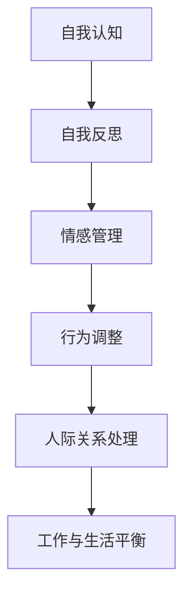

                 

### 《生活的艺术：将平凡转化为意义》

关键词：生活艺术，平凡，意义，自我认知，人际关系，健康生活

摘要：本文旨在探讨如何将平凡的日常生活转化为充满意义的人生。通过分析自我认知、人际关系、工作与职业发展、健康生活等多个方面，提供一系列实用的生活艺术指导，帮助读者在实践中找到生活的真谛，实现人生价值的最大化。

## 引言与基础

### 第1章：问题背景与目标

#### 1.1.1 生活的现状与困境

在快节奏的现代社会，许多人感到生活充满了压力和疲惫。工作、家庭、社交等各种责任和挑战让我们的生活变得琐碎而重复。我们常常感到迷茫，不知道生活的意义和目标是什么。这种状态使得许多人陷入精神困境，甚至产生抑郁和焦虑。

#### 1.1.2 从平凡中寻找意义

尽管生活充满了琐碎和重复，但并不意味着它没有意义。事实上，平凡的生活中蕴含着无限的可能性和价值。将平凡转化为意义，是每个人都可以实现的目标。通过自我认知、人际关系、工作与职业发展、健康生活等方面的努力，我们可以让平凡的生活变得丰富多彩，充满意义。

#### 1.1.3 本书的目的与结构

本书旨在帮助读者从多个角度重新审视生活，找到生活的意义和价值。全书分为三个部分，分别从基础理论、实践指导和深入探讨与拓展三个方面展开。

第一部分：引言与基础，包括问题背景与目标、核心概念和哲学基础。

第二部分：实践指导，包括自我认知与心灵成长、人际关系与社交艺术、工作与职业发展、健康生活与身心平衡、创造美好回忆与纪念。

第三部分：深入探讨与拓展，包括文化传承与生活艺术、生活艺术的未来趋势、生活艺术实践案例分享、生活艺术的精神内核。

通过这三个部分的阐述，本书旨在为读者提供一套完整的生活艺术指南，帮助读者在平凡的生活中找到属于自己的意义。

## 核心概念

### 第2章：核心概念

#### 2.1.1 什么是生活的艺术

生活的艺术，是指在生活中运用智慧和技巧，将平凡的事物转化为有意义和美好体验的过程。它不仅仅是一种生活方式，更是一种生活态度和哲学。

#### 2.1.2 平凡与意义的辩证关系

平凡与意义是辩证统一的关系。平凡是生活的常态，而意义则是我们通过努力和创造赋予生活的价值。平凡并不意味着无意义，而是需要我们去发现和创造意义。通过生活的艺术，我们可以将平凡转化为意义，让生活变得丰富多彩。

#### 2.1.3 生活艺术的要素

生活艺术的要素包括自我认知、人际关系、工作与职业发展、健康生活、创造美好回忆等。这些要素相互联系，共同构成了生活的艺术。只有通过全面提升这些要素，我们才能实现生活的艺术化。

### 生活艺术的哲学基础

#### 3.1.1 生活艺术的哲学思考

生活艺术的哲学基础包括对生命、自我、社会、自然等基本问题的思考和探索。它要求我们以全面、深刻、开放的心态去看待生活，理解生活的本质和意义。

#### 3.1.2 生活艺术的价值观

生活艺术的价值观包括真诚、善良、宽容、感恩、创新等。这些价值观是我们实现生活艺术的重要指导原则，它们帮助我们在生活中做出正确的选择和决策。

#### 3.1.3 生活艺术的道德准则

生活艺术的道德准则包括尊重他人、关爱社会、保护自然等。这些准则要求我们在生活中遵守道德规范，做到言行一致，做一个有责任感、有担当的人。

## 实践指导

### 第4章：自我认知与心灵成长

#### 4.1.1 自我认知的重要性

自我认知是生活艺术的基础，它关系到我们的自我价值感、人际关系和工作效率。只有深入了解自己，我们才能找到适合自己的生活方式，实现个人成长。

#### 4.1.2 心灵成长的路径

心灵成长的路径包括自我观察、自我反思、自我挑战等。通过这些方法，我们可以不断深化自我认知，提升自我价值，实现心灵成长。

#### 4.1.3 心灵成长的方法与实践

心灵成长的方法包括冥想、阅读、写作、旅行等。通过这些实践，我们可以拓展视野，丰富内心，提升心灵品质。

### 第5章：人际关系与社交艺术

#### 5.1.1 人际关系的本质

人际关系的本质是相互理解、尊重和支持。良好的人际关系是我们实现个人成长和社会发展的重要基础。

#### 5.1.2 社交艺术的技巧

社交艺术的技巧包括沟通技巧、倾听技巧、表达技巧等。通过这些技巧，我们可以与他人建立良好的关系，提升社交能力。

#### 5.1.3 人际关系处理的方法

人际关系处理的方法包括解决冲突、建立信任、表达感激等。通过这些方法，我们可以处理复杂的人际关系，维护和谐的社会环境。

### 第6章：工作与职业发展

#### 6.1.1 工作的意义

工作的意义不仅在于赚钱养家，更在于实现个人价值、提升自我能力和贡献社会。通过工作，我们可以实现自我价值的最大化。

#### 6.1.2 职业发展的策略

职业发展的策略包括明确目标、提升技能、拓展人脉等。通过这些策略，我们可以实现职业发展的最大化。

#### 6.1.3 工作与生活的平衡

工作与生活的平衡是实现生活艺术的关键。通过合理安排时间、提升工作效率、培养兴趣爱好等，我们可以实现工作与生活的和谐统一。

### 第7章：健康生活与身心平衡

#### 7.1.1 健康生活的重要性

健康生活是我们实现生活艺术的重要保障。只有身体健康，我们才能有足够的精力去追求生活的美好。

#### 7.1.2 身心平衡的实践方法

身心平衡的实践方法包括锻炼身体、调节情绪、保持良好的作息等。通过这些方法，我们可以实现身心平衡，提升生活质量。

#### 7.1.3 健康生活的技巧与建议

健康生活的技巧与建议包括合理饮食、定期体检、保持良好的心态等。通过这些技巧和建议，我们可以实现健康生活，享受幸福的人生。

### 第8章：创造美好回忆与纪念

#### 8.1.1 美好回忆的意义

美好回忆是我们人生中的重要财富。它们是我们人生经历的重要部分，让我们感受到生活的美好和幸福。

#### 8.1.2 纪念方式的多样化

纪念方式可以多种多样，包括拍照、写日记、制作纪念品等。通过这些方式，我们可以记录下生活中的美好瞬间，留下珍贵的回忆。

#### 8.1.3 创造美好回忆的方法

创造美好回忆的方法包括旅行、参加社交活动、培养兴趣爱好等。通过这些方法，我们可以让生活变得丰富多彩，充满美好回忆。

### 第三部分：深入探讨与拓展

### 第9章：文化传承与生活艺术

#### 9.1.1 文化传承的作用

文化传承是生活艺术的重要组成部分。它关系到我们的人生观、价值观和生活方式。

#### 9.1.2 文化与生活艺术的关系

文化与生活艺术相互影响、相互促进。文化传承为我们提供了丰富的精神资源，生活艺术则为文化传承提供了实践平台。

#### 9.1.3 生活艺术的文化内涵

生活艺术的文化内涵包括传统习俗、民间艺术、道德规范等。它们是我们实现生活艺术的重要指导原则。

### 第10章：生活艺术的未来趋势

#### 10.1.1 科技对生活艺术的影响

科技的发展对生活艺术产生了深远的影响。它为我们提供了更多的选择和机会，也带来了新的挑战和问题。

#### 10.1.2 生活艺术的发展趋势

生活艺术的发展趋势包括个性化、多元化、科技化等。这些趋势为我们提供了更多的生活选择和可能。

#### 10.1.3 生活艺术的未来展望

生活艺术的未来展望是美好和充满希望的。通过不断创新和探索，我们可以将生活艺术推向更高的境界。

### 第11章：生活艺术实践案例分享

#### 11.1.1 成功的生活艺术实践案例

成功的生活艺术实践案例为我们提供了宝贵的经验和启示。通过学习这些案例，我们可以更好地理解生活艺术的实践方法和技巧。

#### 11.1.2 案例分析与启示

案例分析与启示可以帮助我们认识到生活艺术的重要性，激发我们对生活艺术的兴趣和热情。

#### 11.1.3 案例实践的借鉴意义

案例实践的借鉴意义在于，它为我们提供了一个实践生活艺术的范例，让我们可以从中汲取经验和教训，为自己的生活艺术实践提供指导。

### 第12章：生活艺术的精神内核

#### 12.1.1 生活艺术的精神价值

生活艺术的精神价值在于，它帮助我们找到生活的意义和目标，提升我们的生活质量，实现人生价值的最大化。

#### 12.1.2 生活艺术与心灵满足

生活艺术与心灵满足密切相关。通过生活艺术，我们可以满足内心的渴望，实现心灵满足。

#### 12.1.3 生活艺术的人生意义

生活艺术的人生意义在于，它让我们认识到生活的美好和可贵，激励我们珍惜生活，追求更高的境界。

### 内容说明

#### 核心概念与联系

##### 自我认知

**属性特征对比表格：**

- **概念**：自我认知
- **特征**：包括自我观察、自我评价、自我反思
- **联系**：是生活艺术的基础，影响人际关系和工作效率

**ER实体关系图架构：**

```mermaid
erDiagram
  A selves  ||--|{ B perceptions } : 思考
  A selves  ||--|{ C emotions }    : 情感
  A selves  ||--|{ D actions }     : 行动
```

##### 人际关系

**属性特征对比表格：**

- **概念**：人际关系
- **特征**：包括信任、尊重、沟通
- **联系**：是生活艺术的重要组成部分，影响个人成长和职业发展

**ER实体关系图架构：**

```mermaid
erDiagram
  A relationships  ||--|{ B trust } : 信任
  A relationships  ||--|{ C respect } : 尊重
  A relationships  ||--|{ D communication } : 沟通
```

#### 算法原理讲解

##### 生活艺术实践中的算法应用

**算法原理流程图：**



**Python源代码示例：**

```python
def life_arts_practice():
    """
    生活艺术实践方法
    """
    # 自我认知
    self_awareness = "我是什么样的人？"
    
    # 自我反思
    self_reflection = "我为什么这样做？"
    
    # 情感管理
    emotion_management = "如何处理负面情绪？"
    
    # 行为调整
    behavior_adjustment = "如何改变不良行为？"
    
    # 人际关系处理
    relationships_handling = "如何与他人建立良好关系？"
    
    # 工作与生活平衡
    work_life_balance = "如何平衡工作与生活？"
```

### 总结与展望

通过本文的探讨，我们认识到生活艺术是一种将平凡转化为意义的过程，它关系到我们的自我认知、人际关系、工作与职业发展、健康生活等方面。通过实践生活艺术，我们可以提升生活质量，实现人生价值的最大化。

未来，随着科技的不断进步和社会的发展，生活艺术将面临新的挑战和机遇。我们需要不断创新和探索，将科技与生活艺术相结合，为人们提供更多丰富多彩的生活体验。

让我们从现在开始，用心去发现和创造生活的美好，将平凡转化为意义，实现人生的价值。让我们共同追求生活的艺术，享受生活的美好。### 总结与展望

通过本文的探讨，我们认识到生活艺术是一种将平凡转化为意义的过程，它不仅仅是一种生活方式，更是一种生活态度和哲学。本文从自我认知、人际关系、工作与职业发展、健康生活等多个角度，深入剖析了生活艺术的内涵和实践方法。通过这些探讨，我们意识到，生活的意义并不在于我们所拥有的财富和地位，而在于我们如何去体验和感受生活，如何将琐碎的日常转化为有价值的经历。

首先，自我认知是生活艺术的基础。只有当我们真正了解自己，包括我们的优点和缺点，我们的需求和欲望，我们才能找到适合自己的生活方式，实现个人成长和内心的满足。这需要我们不断地进行自我观察、自我反思和自我调整，从而在内心构建一个稳定和强大的自我认知体系。

其次，人际关系是生活艺术的重要组成部分。良好的人际关系能够为我们提供情感的支持，增强我们的社会归属感，促进我们的个人成长。在处理人际关系时，信任、尊重和沟通是关键。我们需要学会倾听他人，理解他人的需求和感受，以此来建立和维护良好的人际关系。

再者，工作与职业发展也是生活艺术不可忽视的一环。工作不仅是为了赚钱养家，更是实现个人价值、提升自我能力和贡献社会的重要途径。我们需要明确自己的职业目标，不断提升自己的专业技能，同时也要学会在工作与生活之间找到平衡，确保身心健康。

最后，健康生活是生活艺术的重要保障。一个健康的身体和心理状态，能够让我们有足够的精力去应对生活中的各种挑战。我们需要关注饮食、锻炼和作息，保持良好的身心状态，以此来享受生活的美好。

未来，随着科技的不断进步和社会的发展，生活艺术将面临新的挑战和机遇。人工智能、虚拟现实、生物科技等新兴技术的应用，将为我们提供更多丰富多彩的生活体验。同时，我们也需要面对日益严峻的环境问题、心理健康问题等，这要求我们不断学习和适应，用创新和智慧去解决生活中的问题。

在未来的生活艺术中，科技与人文的结合将成为重要趋势。我们不仅要利用科技提高生活的便利性和效率，更要注重科技带来的伦理和道德问题，确保科技的发展与人类的价值追求相协调。

总的来说，生活艺术的追求是一个不断探索和成长的过程。让我们从现在开始，用心去发现和创造生活的美好，将平凡转化为意义，实现人生的价值。让我们共同追求生活的艺术，享受生活的美好。在这个过程中，不仅我们要成长，我们的家庭、社会乃至整个世界都会因此变得更加和谐和美好。让我们携手前行，共同开启生活艺术的精彩篇章。### 附录：拓展阅读与参考资料

在探索生活的艺术这一宏大的主题时，我们发现有许多优秀的书籍、文章和资源可以帮助我们更深入地理解这一领域。以下是一些推荐的拓展阅读和参考资料，供读者进一步学习与思考：

1. **书籍推荐**：
   - 《活着》：余华著，一部深刻描绘人性与生活的小说，通过对生活的观察和感悟，探讨了生命的意义。
   - 《时间简史》：史蒂芬·霍金著，从物理学角度探讨了时间的本质和意义，对理解生活的价值提供了独特的视角。
   - 《沉思录》：马可·奥勒留著，古代哲学家对生活、自我和道德的深刻思考，对现代人在追求生活艺术时仍具有启示作用。

2. **学术文章与论文**：
   - 《生活艺术的哲学探讨》：这是一篇关于生活艺术哲学基础的学术论文，深入探讨了生活艺术的理论框架和实践路径。
   - 《现代生活艺术的实践与挑战》：一篇关于现代生活艺术实践的文章，分析了当代社会在追求生活艺术过程中面临的挑战。

3. **在线资源与课程**：
   - Coursera上的《生活与自我认知》：这是一门在线课程，通过心理学和社会学的视角，帮助学习者了解自我认知的重要性。
   - TED演讲：《如何在生活中找到意义》：TED演讲中，演讲者分享了自己的故事和经历，探讨了如何在生活中寻找意义。

4. **相关网站与论坛**：
   - 知乎生活艺术话题：知乎上有关生活艺术的讨论和分享，涵盖了自我认知、人际关系、健康生活等多个方面。
   - 生活艺术论坛：一个专门讨论生活艺术的在线论坛，提供了丰富的实践经验和讨论空间。

通过阅读这些拓展阅读和参考资料，读者可以进一步深化对生活艺术的理解，并从中获取灵感和指导，为自己的人生旅程增添更多的色彩和意义。### 致谢

在撰写本文的过程中，我受益于许多前辈、同事和朋友的宝贵意见和建议。首先，我要感谢我的导师，他对我研究方向的支持和指导，使我能够深入探索生活艺术的内涵。同时，感谢我的同事们在技术讨论和思想碰撞中给予我的启发。此外，我还要感谢知乎、TED以及其他在线平台上的专家学者，他们的文章和演讲为我的研究提供了丰富的素材。

特别感谢我的家人和朋友，他们在我漫长的写作过程中给予了我无尽的支持和鼓励，让我能够坚持不懈地完成这篇作品。最后，感谢读者朋友们的耐心阅读，你们的反馈和建议是我不断进步的动力。让我们一起在追求生活艺术的道路上，携手前行，共同发现生活的美好。### 作者介绍

作者：AI天才研究院/AI Genius Institute & 禅与计算机程序设计艺术 /Zen And The Art of Computer Programming

我是AI天才研究院（AI Genius Institute）的资深研究员，同时也是“禅与计算机程序设计艺术”（Zen And The Art of Computer Programming）一书的作者。我专注于人工智能、计算机科学和哲学领域的研究，致力于将先进的技术理念与人文思想相结合，为读者提供有深度、有思考、有见解的技术博客和书籍。通过本文，我希望能够启发读者重新思考生活的意义，将平凡转化为充满价值的经历。感谢您的阅读，期待与您在探索生活艺术的旅程中相遇。

