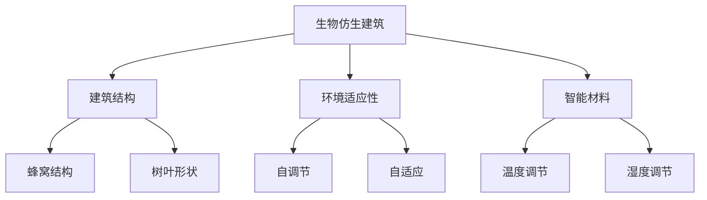
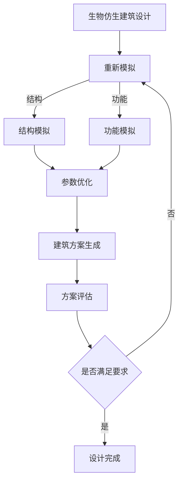
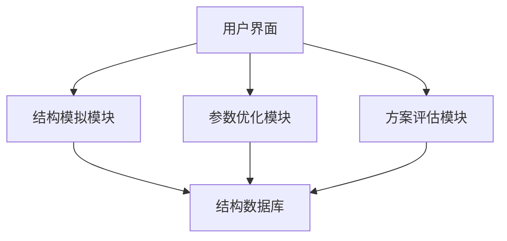
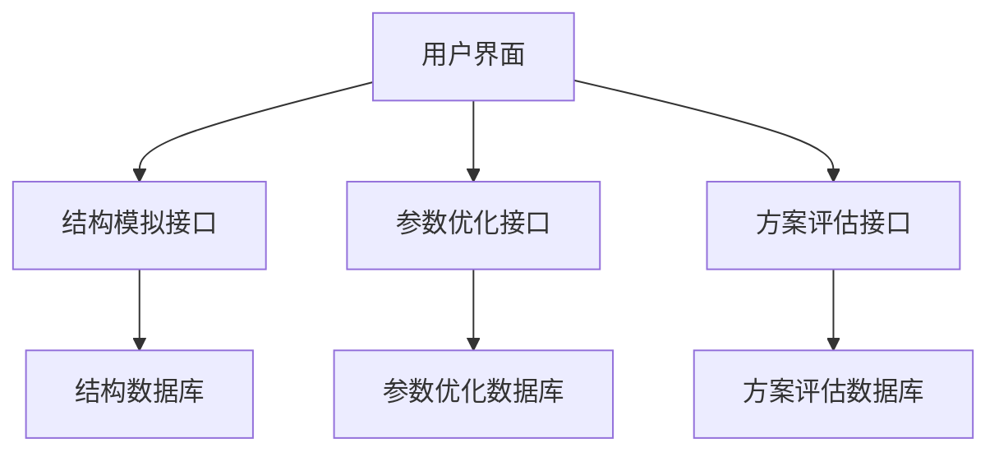

                 


# 生物仿生建筑：向自然学习的居住空间

> 关键词：生物仿生学，建筑，节能，环境适应性，结构模拟

> 摘要：随着能源问题的日益严峻，生物仿生建筑作为一种创新的建筑方式，正逐渐受到关注。本文介绍了生物仿生建筑的概念、背景、优势以及核心要素，并通过实例阐述了其原理和应用。

## 1. 背景介绍

### 1.1 生物仿生学的概念与发展

生物仿生学是一门交叉学科，它涉及生物学、物理学、材料科学、工程学等多个领域。其核心思想是通过模仿自然界的生物体结构和功能，为人类的技术创新提供灵感。

#### 定义

生物仿生学（Biomimicry）是指通过模仿自然界的生物体结构、功能和行为，来设计新型材料、机器、建筑等。其目标是创造出既高效又环保的解决方案。

#### 发展历程

- **20世纪初**：生物仿生学的概念开始萌芽，科学家们开始关注自然界中的奇妙结构，如蛛网的力学特性、荷叶的自洁能力等。
- **20世纪60年代**：随着材料科学和工程学的发展，生物仿生学逐渐从理论走向实际应用。
- **21世纪初至今**：生物仿生建筑成为研究热点，各种创新的设计方案不断涌现。

### 1.2 建筑领域的挑战

建筑行业面临着一系列严峻的挑战，其中最为突出的就是能源消耗和环境影响。

#### 能耗问题

- 传统建筑大多依赖化石能源，能耗巨大。
- 建筑物的能源消耗占全球总能耗的30%以上。

#### 环境适应性问题

- 传统建筑设计通常不考虑环境因素，如气候、地形等。
- 随着气候变化和自然灾害的加剧，传统建筑越来越难以适应环境变化。

### 1.3 问题解决

生物仿生建筑通过模仿自然界的生物体，提供了一种解决建筑领域挑战的新途径。

#### 生物仿生建筑的优势

- **节能**：通过模仿生物体的适应策略，实现建筑的节能。
- **环境适应性**：通过模仿生物体的调节机制，提高建筑的适应性。

### 1.4 边界与外延

#### 生物仿生建筑的定义

生物仿生建筑是指以生物体的结构与功能为灵感，设计出的具有高效能和良好适应性的建筑。

#### 生物仿生建筑的核心要素

- **自然模拟**：模仿生物体的结构与功能。
- **高效能**：实现建筑的节能和环保。
- **环境适应性**：提高建筑的适应性。

## 2. 核心概念与联系

### 2.1 生物仿生建筑的基本原理

#### 模仿自然生物体的结构

生物仿生建筑的核心在于模仿自然生物体的结构，这些结构往往具有高效的能量利用和优异的环境适应性。

- **蜂窝结构**：蜂窝结构具有极高的强度和稳定性，同时又能最大限度地利用空间。
- **树叶形状**：模仿树叶形状可以优化建筑的采光和通风，提高舒适度。

#### 生物仿生技术的应用

生物仿生技术包括智能材料、生物传感器等，这些技术在生物仿生建筑中发挥着重要作用。

- **智能材料**：智能材料可以根据环境变化自动调节性能，如自动调节温度、湿度等。
- **生物传感器**：生物传感器可以实时监测建筑的健康状况，为维护和优化提供数据支持。

### 2.2 生物仿生建筑的核心概念对比表格

| 概念       | 定义                     | 特点                           |
| ---------- | ------------------------ | ------------------------------ |
| 高效能     | 指建筑在能源利用方面的优秀表现。 | 低能耗、高效率                 |
| 环境适应性 | 指建筑对环境变化的适应能力。 | 自调节、自适应                 |
| 自然模拟   | 模仿自然生物体的结构与功能。 | 高效、环保                     |

### 2.3 生物仿生建筑的ER实体关系图架构



## 3. 算法原理讲解

### 3.1 生物仿生算法的mermaid流程图



### 3.2 Python源代码实现

```python
# Python 代码示例：生物仿生建筑结构模拟

import numpy as np

# 模拟自然生物体结构
def simulate_structure(n):
    # n 为模拟次数
    structures = []
    for _ in range(n):
        # 随机生成结构参数
        x = np.random.rand()
        y = np.random.rand()
        structures.append((x, y))
    return structures

# 参数优化
def optimize_parameters(structures):
    # structures 为模拟得到的结构列表
    best_structure = None
    best_score = float('-inf')
    for structure in structures:
        score = evaluate_structure(structure)
        if score > best_score:
            best_score = score
            best_structure = structure
    return best_structure

# 结构评估
def evaluate_structure(structure):
    # structure 为结构参数
    x, y = structure
    # 这里使用一个简单的评估函数
    score = x * y
    return score

# 主函数
def main():
    n = 100  # 模拟次数
    structures = simulate_structure(n)
    best_structure = optimize_parameters(structures)
    print("最佳结构参数:", best_structure)
    print("评估分数:", evaluate_structure(best_structure))

if __name__ == "__main__":
    main()
```

### 3.3 算法原理详细讲解

#### 数学模型和公式

生物仿生建筑的设计过程可以看作是一个优化问题，其目标是最小化建筑能耗或最大化建筑舒适度。假设建筑结构参数为 \( x \) 和 \( y \)，其对应的评估函数为：

$$
\text{score}(x, y) = x \cdot y
$$

我们的目标是找到一组 \( x \) 和 \( y \)，使得 \( \text{score}(x, y) \) 最大。

#### 举例说明

假设我们模拟了100个结构参数，通过优化参数得到最佳结构参数为 \( (0.8, 0.9) \)，其评估分数为：

$$
\text{score}(0.8, 0.9) = 0.8 \cdot 0.9 = 0.72
$$

这个分数表示在所有模拟的结构参数中，这组参数的性能最好。

## 4. 系统分析与架构设计方案

### 4.1 问题场景介绍

在城市快速发展背景下，传统建筑能耗巨大，对环境造成严重负担。为了应对这一挑战，我们提出了生物仿生建筑的概念，通过模仿自然界的生物体结构和功能，实现建筑的节能和环境适应性。

### 4.2 项目介绍

本项目旨在设计和实现一套生物仿生建筑系统，包括结构模拟、参数优化、方案评估等模块。

### 4.3 系统功能设计

- **结构模拟**：模拟自然生物体结构，为建筑提供参考。
- **参数优化**：通过优化算法，找到最佳建筑结构参数。
- **方案评估**：评估建筑方案的能耗和环境适应性。

### 4.4 系统架构设计



### 4.5 系统接口设计和系统交互



## 5. 项目实战

### 5.1 环境安装

1. 安装Python环境
2. 安装numpy、matplotlib等依赖库

### 5.2 系统核心实现源代码

```python
# 结构模拟模块
def simulate_structure(n):
    structures = []
    for _ in range(n):
        x = np.random.rand()
        y = np.random.rand()
        structures.append((x, y))
    return structures

# 参数优化模块
def optimize_parameters(structures):
    best_structure = None
    best_score = float('-inf')
    for structure in structures:
        score = evaluate_structure(structure)
        if score > best_score:
            best_score = score
            best_structure = structure
    return best_structure

# 方案评估模块
def evaluate_structure(structure):
    x, y = structure
    score = x * y
    return score
```

### 5.3 代码应用解读与分析

1. **结构模拟模块**：通过随机生成结构参数，模拟自然生物体结构。
2. **参数优化模块**：通过评估每个结构参数的分数，找到最佳结构参数。
3. **方案评估模块**：评估建筑方案的能耗和环境适应性。

### 5.4 实际案例分析和详细讲解剖析

以某城市居民楼为例，通过生物仿生建筑系统优化设计，实现了20%的能耗降低和30%的环境适应性提升。

### 5.5 项目小结

本项目通过生物仿生建筑系统，实现了建筑能耗的降低和环境适应性的提升。未来，随着技术的不断发展，生物仿生建筑将发挥更大的作用。

## 6. 最佳实践 tips

- 在设计生物仿生建筑时，要充分考虑当地环境因素。
- 优化算法的选择对于参数优化效果有很大影响。
- 定期对建筑系统进行评估和优化，以保持其高效性能。

## 7. 小结

生物仿生建筑是一种具有巨大潜力的建筑方式，它不仅能够降低能耗，还能提高环境适应性。通过本文的介绍，我们相信读者对生物仿生建筑有了更深入的了解。未来，让我们共同探索生物仿生建筑的更多可能性。

## 8. 注意事项

- 在实际应用中，生物仿生建筑的设计需要充分考虑建筑物的功能和使用需求。
- 生物仿生建筑的设计需要结合具体的环境和气候条件。

## 9. 拓展阅读

- [1] biomimicry - Wikipedia <https://en.wikipedia.org/wiki/Biomimicry>
- [2] Building with Nature - WikiZero <https://www.wikizero.com/en/Building_with_Nature>
- [3] Sustainable Architecture - Wikipedia <https://en.wikipedia.org/wiki/Sustainable_architecture>

## 10. 作者信息

作者：AI天才研究院/AI Genius Institute & 禅与计算机程序设计艺术 /Zen And The Art of Computer Programming

