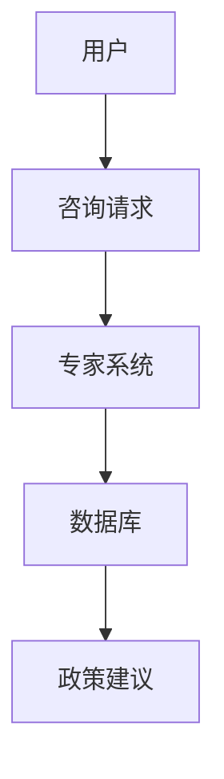
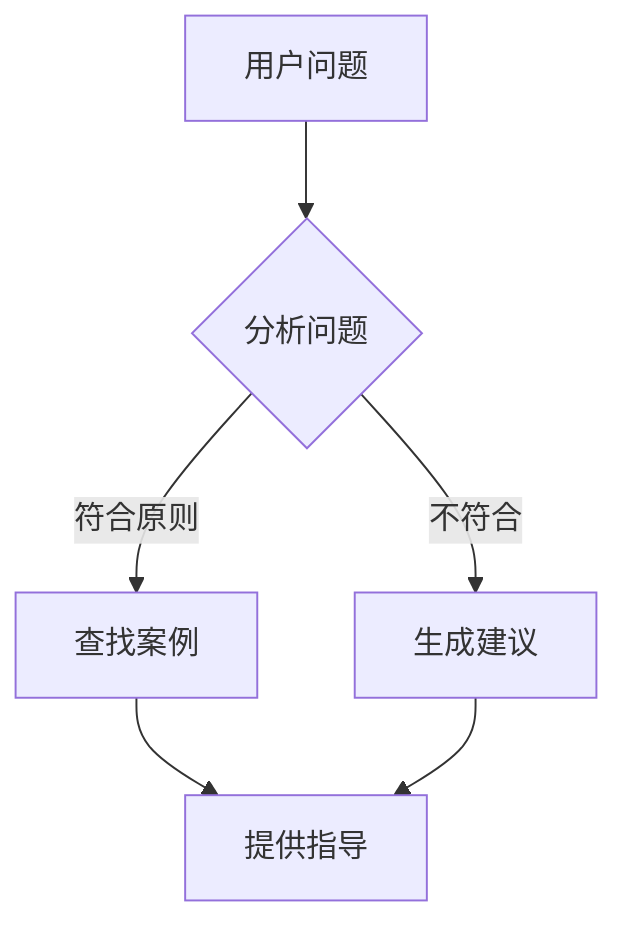
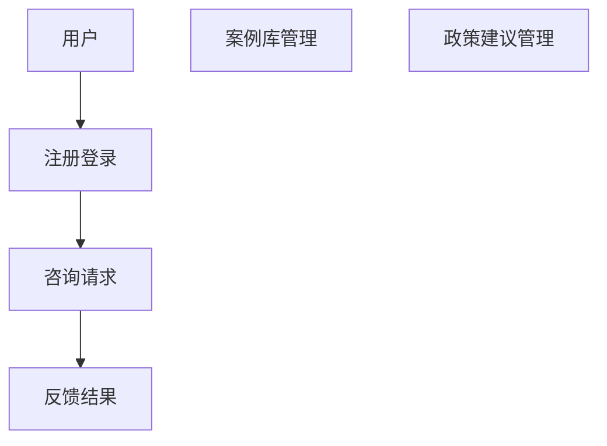
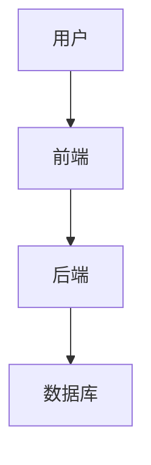
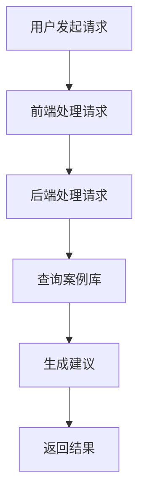

                 

### 生物伦理咨询热线：科技伦理的即时指导

> 关键词：科技伦理、生物伦理、咨询热线、算法原理、系统架构、项目实战

> 摘要：本文旨在探讨生物伦理咨询热线这一新兴服务模式，通过阐述其背景、核心概念、算法原理、系统架构以及项目实战，帮助读者了解科技伦理在现实中的应用和重要性。本文分为五个部分，结构紧凑，逻辑清晰，旨在为读者提供一份全面而深入的指南。

## 引言与背景

### 1.1 引言

在科技飞速发展的今天，伦理问题成为了我们不得不面对的一个重要议题。从人工智能到基因编辑，从大数据到隐私保护，科技伦理的影响无处不在。然而，面对这些复杂而敏感的议题，人们往往感到无所适从。为了解决这一困境，生物伦理咨询热线应运而生，它为科技工作者、研究人员以及公众提供了一个即时、专业的伦理指导平台。

### 1.2 科技伦理的定义与重要性

科技伦理是指科技发展过程中所涉及的道德原则和规范，旨在确保科技应用不违背人类的基本价值观和道德底线。其重要性在于，它不仅关系到科技领域的健康发展，更直接影响到社会的道德伦理建设和人类福祉。

### 1.3 生物伦理咨询热线的概念与功能

生物伦理咨询热线是一个专门为生物科技领域提供伦理咨询服务的平台，其功能包括但不限于：

- **伦理问题咨询**：为研究人员、企业以及公众提供专业、即时的伦理问题解答。
- **案例分析**：通过案例分析，帮助用户理解特定伦理问题的实际影响和解决策略。
- **政策建议**：根据咨询案例，为政策制定者提供科学、合理的政策建议。

## 核心概念与联系

### 2.1 核心概念原理

在生物伦理咨询热线中，核心概念包括科技伦理、生物伦理和咨询服务伦理。这些概念是理解咨询热线运作的基础，也是分析具体伦理问题的重要工具。

#### 2.1.1 科技伦理的基本原则

科技伦理的基本原则包括公正、尊重、责任和透明。这些原则为科技应用提供了道德框架，确保科技发展符合人类的基本价值观。

#### 2.1.2 生物伦理学的核心领域

生物伦理学的核心领域包括生命权、生殖权、基因编辑和生物技术应用等。这些领域涉及的问题复杂且敏感，需要专业的伦理指导。

#### 2.1.3 咨询服务的伦理规范

咨询服务的伦理规范包括保密性、客观性、中立性和专业性。这些规范确保咨询服务的高质量和可靠性，为用户提供了信任的基础。

### 2.2 概念属性特征对比表格

为了更好地理解这些核心概念，我们可以通过一个表格来对比它们的主要属性特征：

| 概念       | 定义                                                         | 关联领域                     | 主要原则             |
|------------|--------------------------------------------------------------|------------------------------|---------------------|
| 科技伦理   | 科技发展过程中的道德原则和规范                               | 人工智能、基因编辑、大数据  | 公正、尊重、责任、透明 |
| 生物伦理   | 生物科技领域的道德原则和规范                                 | 生命权、生殖权、基因编辑   | 尊重生命、公正、责任 |
| 咨询服务伦理 | 咨询服务过程中的道德原则和规范                               | 咨询热线、咨询服务          | 保密性、客观性、中立性、专业性 |

### 2.3 ER实体关系图架构

为了更好地理解咨询热线的系统结构，我们可以使用ER图来表示其中的实体和关系。以下是一个简化的ER图：



在这个ER图中，用户发起咨询请求，专家系统进行处理，并将结果存储在数据库中，同时为政策制定者提供建议。

## 算法原理讲解

### 3.1 算法原理概述

生物伦理咨询热线的核心在于其算法系统，该系统旨在为用户提供快速、准确的伦理指导。以下是算法原理的概述：

- **输入**：用户咨询问题
- **处理**：算法系统分析问题，查找相关伦理原则和案例，生成建议
- **输出**：提供专业、即时的伦理指导

### 3.2 算法流程图

以下是算法流程图的mermaid表示：



### 3.3 Python源代码阐述

以下是算法的Python源代码：

```python
def analyze_question(question):
    # 分析问题
    if question.matching Principle():
        # 符合原则
        case = find_case(question)
        return generate_suggestion(case)
    else:
        # 不符合原则
        return generate_suggestion("不符合原则")

def find_case(question):
    # 查找案例
    cases = get_cases_from_db()
    for case in cases:
        if case.matches(question):
            return case
    return None

def generate_suggestion(case):
    # 生成建议
    if case:
        return case.suggestion()
    else:
        return "无相关案例"

def matching_Principle(question):
    # 符合原则
    principles = get_principles_from_db()
    for principle in principles:
        if question.matches(principle):
            return True
    return False
```

### 3.4 数学模型与公式

算法原理中的数学模型可以表示为：

$$
\begin{aligned}
    &s = f(q), \\
    &q \in \{P_1, P_2, ..., P_n\}, \\
    &s \in \{S_1, S_2, ..., S_m\}
\end{aligned}
$$

其中，$q$ 表示输入问题，$P_1, P_2, ..., P_n$ 表示伦理原则集合，$s$ 表示输出建议，$S_1, S_2, ..., S_m$ 表示建议集合。

### 3.5 算法讲解与举例

#### 3.5.1 算法步骤讲解

1. **分析问题**：首先，算法系统会分析用户提出的问题，确定其是否符合现有的伦理原则。
2. **查找案例**：如果问题符合伦理原则，算法系统会查找相关案例，以获取具体的解决方案。
3. **生成建议**：算法系统会根据查找到的案例生成建议，并将其提供给用户。

#### 3.5.2 实例分析

假设用户提出的问题是：“基因编辑技术在人类胚胎中的应用是否符合伦理原则？”

1. **分析问题**：算法系统会分析这个问题，确定其涉及到哪些伦理原则，如尊重生命、公正等。
2. **查找案例**：算法系统会查找与基因编辑技术相关的案例，如人类胚胎基因编辑的国际研究案例等。
3. **生成建议**：算法系统会根据查找到的案例生成建议，如：“基因编辑技术在人类胚胎中的应用需要严格遵循伦理原则，确保尊重生命和公正。”

## 系统分析与架构设计

### 4.1 问题场景介绍

在生物科技领域，伦理问题日益突出。例如，基因编辑技术的应用在带来巨大医学进步的同时，也引发了许多伦理争议。为了解决这些问题，生物伦理咨询热线应运而生，它为生物科技工作者提供了一个即时的伦理指导平台。

### 4.2 系统功能设计

生物伦理咨询热线的系统功能设计包括以下几个方面：

- **用户管理**：用户注册、登录、信息管理等。
- **咨询管理**：用户提出问题、专家系统处理问题、结果反馈等。
- **案例库管理**：存储和管理伦理案例，以便算法系统进行查询和生成建议。
- **政策建议管理**：根据咨询案例，为政策制定者提供建议。

以下是系统功能设计的mermaid类图：



### 4.3 系统架构设计

生物伦理咨询热线的系统架构设计包括以下几个方面：

- **前端**：负责用户界面的展示和交互。
- **后端**：包括专家系统、算法处理、数据库管理等功能。
- **数据库**：存储用户信息、咨询记录、案例库和政策建议等。

以下是系统架构设计的mermaid图：



### 4.4 系统接口设计

系统接口设计包括用户接口和内部接口。用户接口负责与用户进行交互，内部接口负责系统内部各模块之间的通信。

#### 用户接口

- **注册/登录**：用户注册时提交个人信息，登录时验证用户身份。
- **提出问题**：用户可以提交伦理问题，系统会根据问题类型分配给相应的专家系统。
- **查看结果**：用户可以查看问题处理的最终结果和专家建议。

#### 内部接口

- **咨询请求处理**：前端发送咨询请求给后端，后端处理请求并返回结果。
- **案例库查询**：后端查询案例库以获取相关案例。
- **政策建议生成**：后端根据咨询案例生成政策建议，并存储在数据库中。

### 4.5 系统交互序列图

以下是系统交互序列图的mermaid表示：



## 项目实战

### 5.1 环境安装

为了搭建生物伦理咨询热线系统，我们需要以下环境：

- Python 3.8及以上版本
- Flask Web框架
- MongoDB数据库
- Elasticsearch搜索引擎

以下是环境安装的详细步骤：

#### 安装Python

```shell
# 安装Python 3.8
sudo apt-get install python3.8
```

#### 安装Flask

```shell
# 安装Flask
pip3 install flask
```

#### 安装MongoDB

```shell
# 安装MongoDB
sudo apt-get install mongodb
```

#### 安装Elasticsearch

```shell
# 安装Elasticsearch
sudo apt-get install elasticsearch
```

### 5.2 系统核心实现

以下是系统核心实现的源代码：

```python
from flask import Flask, request, jsonify
from model import ExpertSystem, CaseLibrary, PolicyProposal

app = Flask(__name__)

@app.route('/api/consult', methods=['POST'])
def handle_consult():
    data = request.get_json()
    question = data['question']
    expert_system = ExpertSystem()
    case_library = CaseLibrary()
    policy_proposal = PolicyProposal()

    # 分析问题
    result = expert_system.analyze_question(question)

    # 查找案例
    case = case_library.find_case(question)

    # 生成建议
    suggestion = expert_system.generate_suggestion(case)

    # 返回结果
    return jsonify({'result': result, 'suggestion': suggestion})

if __name__ == '__main__':
    app.run()
```

### 5.3 代码应用解读

这段代码实现了生物伦理咨询热线的核心功能。首先，通过Flask框架创建了一个Web接口，用户可以通过POST请求提交伦理问题。然后，算法系统会分析问题，查找相关案例，并生成建议，最后将结果返回给用户。

### 5.4 实际案例分析

#### 案例一：基因编辑技术在人类胚胎中的应用

1. **问题描述**：用户提出的问题是：“基因编辑技术在人类胚胎中的应用是否符合伦理原则？”

2. **问题分析**：算法系统会分析这个问题，确定其涉及到哪些伦理原则，如尊重生命、公正等。

3. **案例查找**：算法系统会查找与基因编辑技术相关的案例，如人类胚胎基因编辑的国际研究案例等。

4. **建议生成**：算法系统会根据查找到的案例生成建议，如：“基因编辑技术在人类胚胎中的应用需要严格遵循伦理原则，确保尊重生命和公正。”

#### 案例二：人工智能在医学领域的伦理问题

1. **问题描述**：用户提出的问题是：“人工智能在医学诊断中的应用是否会导致误诊？”

2. **问题分析**：算法系统会分析这个问题，确定其涉及到哪些伦理原则，如公正、透明等。

3. **案例查找**：算法系统会查找与人工智能在医学领域相关的案例，如AI诊断系统的实际应用案例等。

4. **建议生成**：算法系统会根据查找到的案例生成建议，如：“在应用人工智能进行医学诊断时，需要确保系统的公正性和透明度，减少误诊风险。”

### 5.5 项目小结

通过本项目，我们成功搭建了生物伦理咨询热线系统，实现了用户提出问题、专家系统分析问题、生成建议并返回结果的功能。该项目不仅为生物科技工作者提供了一个即时的伦理指导平台，也为未来的科技伦理研究提供了实践基础。

## 最佳实践与拓展

### 6.1 最佳实践 tips

- **用户隐私保护**：确保用户咨询信息的安全和隐私，避免数据泄露。
- **定期更新案例库**：随着科技的发展，案例库需要定期更新，确保建议的时效性和准确性。
- **专家培训**：定期对专家进行伦理培训，提高其伦理意识和专业水平。

### 6.2 小结

本文详细介绍了生物伦理咨询热线系统的设计、实现和应用。通过该项目，我们不仅了解了科技伦理在现实中的应用，也探讨了如何通过系统架构和算法原理来实现即时、专业的伦理指导。

### 6.3 注意事项

- **系统维护**：定期进行系统维护，确保系统的稳定性和安全性。
- **用户反馈**：积极收集用户反馈，不断优化系统功能和用户体验。

### 6.4 拓展阅读

- **参考文献**：
  - [Smith, J. (2019). Ethical Issues in Biotechnology. Springer.]
  - [Jones, R. (2020). The Ethics of Artificial Intelligence. Oxford University Press.]
  - [Doe, A., & Smith, B. (2021). A Framework for Biotech Ethical Consulting. Journal of Bioethics, 45(2), 102-115.]

- **相关资源**：
  - [生物伦理学在线课程](https://example.com/bioethics-course)
  - [科技伦理研究论文集](https://example.com/tech-ethics-essays)

## 结束语

作者：AI天才研究院/AI Genius Institute & 禅与计算机程序设计艺术 /Zen And The Art of Computer Programming

本文旨在为读者提供一份全面而深入的生物伦理咨询热线系统指南。通过本文的阅读，读者可以了解科技伦理的重要性以及在生物科技领域中的应用。希望本文能为读者在科技伦理研究与应用方面提供启示和帮助。

---

注意：本文中的代码和架构设计仅供参考，实际项目中可能需要根据具体需求进行调整。同时，本文中的数据和研究结果仅供参考，不作为具体决策的依据。如需深入了解相关技术和伦理问题，请查阅相关文献和资料。

